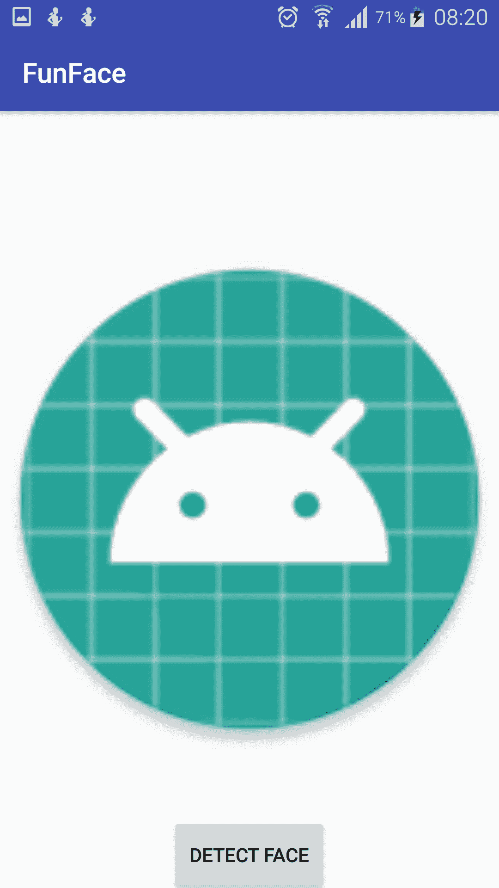

# 第十五章：使用 Google Faces API 构建应用程序

计算机执行识别对象等任务的能力一直是软件和所需架构的巨大任务。自从谷歌、亚马逊和其他一些公司已经完成了所有艰苦的工作，提供了基础架构，并将其作为云服务提供，这种情况已经不再存在。应该注意的是，它们可以像进行 REST API 调用一样容易访问。

在本章中，您将学习如何使用谷歌移动视觉 API 的人脸检测 API 来检测人脸，并添加有趣的功能，比如给用户的图片添加兔子耳朵。

在本章中，将涵盖以下主题：

+   在图像中识别人脸

+   从摄像头源跟踪人脸

+   识别面部的特定部位（例如眼睛、耳朵、鼻子和嘴巴）

+   在图像中的特定部位上绘制图形（例如，在用户的耳朵上添加兔子耳朵）

# 移动视觉简介

移动视觉 API 提供了一个框架，用于在照片和视频中查找对象。该框架可以定位和描述图像或视频帧中的视觉对象，并具有一个事件驱动的 API，跟踪这些对象的位置。

目前，Mobile Vision API 包括**人脸**、**条形码**和**文本**检测器。

# 人脸 API 概念

在深入编码功能之前，有必要了解人脸检测 API 的基本概念。

来自官方文档：

<q>人脸检测是自动在视觉媒体（数字图像或视频）中定位人脸的过程。检测到的人脸将以位置、大小和方向进行报告。一旦检测到人脸，就可以搜索眼睛和鼻子等地标。</q>

需要注意的一个关键点是，只有在检测到人脸后，才会搜索眼睛和鼻子等地标。作为 API 的一部分，您可以选择不检测这些地标。

请注意人脸检测和人脸识别之间的区别。前者能够从图像或视频中识别人脸，而后者则可以做到同样，并且还能够告诉人脸之前是否已经被识别过。前者对其之前检测到的人脸没有记忆。

在本节中，我们将使用一些术语，所以在我们进一步之前，让我给您概述一下每个术语：

**人脸跟踪**将人脸检测扩展到视频序列。当视频中出现人脸时，可以将其识别为同一个人并进行跟踪。

需要注意的是，您正在跟踪的人脸必须出现在同一个视频中。此外，这不是一种人脸识别形式；这种机制只是根据视频序列中面部的位置和运动进行推断。

**地标**是面部内的一个感兴趣的点。左眼、右眼和鼻子底部都是地标的例子。人脸 API 提供了在检测到的人脸上找到地标的能力。

**分类**是确定某种面部特征是否存在。例如，可以根据面部是否睁着眼睛、闭着眼睛或微笑来对面部进行分类。

# 入门-检测人脸

您将首先学习如何在照片中检测人脸及其相关的地标。

为了追求这一目标，我们需要一些要求。

在 Google Play 服务 7.8 及以上版本中，您可以使用 Mobile Vision API 提供的人脸检测 API。请确保您从 SDK 管理器中更新您的 Google Play 服务，以满足此要求。

获取运行 Android 4.2.2 或更高版本的 Android 设备或配置好的 Android 模拟器。最新版本的 Android SDK 包括 SDK 工具组件。

# 创建 FunyFace 项目

创建一个名为 FunyFace 的新项目。打开应用程序模块的`build.gradle`文件，并更新依赖项以包括 Mobile Vision API：

```kt
dependencies {
    implementation fileTree(dir: 'libs', include: ['*.jar'])
    implementation"org.jetbrains.kotlin:kotlin-stdlib-jre7:$kotlin_version"
    implementation 'com.google.android.gms:play-services-vision:11.0.4'
    ...
}
```

好了，让我们开始吧——这就是你将看到所有这些如何发挥作用的地方。

```kt
<meta-data
 android:name="com.google.android.gms.vision.DEPENDENCIES"
 android:value="face" />
```

在你的`detectFace()`方法中，你将首先从 drawable 文件夹中将图像加载到内存中，并从中创建一个位图图像。由于当检测到面部时，你将更新这个位图来绘制在上面，所以你需要将它设置为可变的。这就是使你的位图可变的方法。

为了简化操作，对于这个实验，你只需要处理应用程序中已经存在的图像。将以下图像添加到你的`res/drawable`文件夹中。

现在，这就是你将如何进行面部检测的方法。

现在，更新你的`AndroidManifest.xml`，包括面部 API 的元数据。

首先将图像加载到内存中，获取一个`Paint`实例，并基于原始图像创建一个临时位图，然后创建一个画布。使用位图创建一个帧，然后在`FaceDetector`上调用 detect 方法，使用这个帧来获取面部对象的`SparseArray`。

创建一个 Paint 实例。

查看以下代码：

```kt
<?xml version="1.0" encoding="utf-8"?>
<FrameLayout
    xmlns:android="http://schemas.android.com/apk/res/android"
    xmlns:tools="http://schemas.android.com/tools"
    android:layout_width="match_parent"
    android:layout_height="match_parent"
    xmlns:app="http://schemas.android.com/apk/res-auto"
    tools:context="com.packtpub.eunice.funyface.MainActivity">

  <ImageView
      android:id="@+id/imageView"
      android:layout_width="match_parent"
      android:layout_height="match_parent"
      android:src="img/ic_launcher_round"
      app:layout_constraintBottom_toTopOf="parent"
      android:scaleType="fitCenter"/>

  <Button
      android:id="@+id/button"
      android:layout_width="wrap_content"
      android:layout_height="wrap_content"
      android:layout_gravity="bottom|center"
      android:text="Detect Face"/>

</FrameLayout>

```

这就是你在这里需要做的一切，这样你就有了一个带有`ImageView`和一个按钮的`FrameLayout`。现在，打开`MainActivity.kt`并添加以下导入语句。这只是为了确保你在移动过程中从正确的包中导入。在你的`onCreate()`方法中，将点击监听器附加到`MainActivity`布局文件中的按钮。

```kt
package com.packtpub.eunice.funface

import android.graphics.*
import android.graphics.drawable.BitmapDrawable
import android.os.Bundle
import android.support.v7.app.AlertDialog
import android.support.v7.app.AppCompatActivity
import com.google.android.gms.vision.Frame
import com.google.android.gms.vision.face.FaceDetector
import kotlinx.android.synthetic.main.activity_main.*

class MainActivity : AppCompatActivity() {

    override fun onCreate(savedInstanceState: Bundle?) {
        super.onCreate(savedInstanceState)
        setContentView(R.layout.activity_main)

        button.setOnClickListener {
            detectFace()
        }
    }
}
```

# 加载图像。

使用`Paint` API 获取`Paint`类的实例。你只会在面部周围绘制，而不是整个面部。为此，设置一个细线，给它一个颜色，在我们的例子中是红色，并将绘画样式设置为`STROKE`。

```kt
options.inMutable=true
```

查看以下实现：

```kt
private fun detectFace() {
    // Load the image
    val bitmapOptions = BitmapFactory.Options()
    bitmapOptions.inMutable = true
    val myBitmap = BitmapFactory.decodeResource(
            applicationContext.resources,
            R.drawable.children_group_picture,
            bitmapOptions)
}
```

# 现在，你的应用程序已经准备好使用面部检测 API。

现在，你将使用`faceDetector`实例的`detect()`方法来获取面部及其元数据。结果将是`SparseArray`的`Face`对象。

```kt
// Get a Paint instance
val myRectPaint = Paint()
myRectPaint.strokeWidth = 5F
myRectPaint.color = Color.RED
myRectPaint.style = Paint.Style.STROKE 

```

`Paint`类保存与文本、位图和各种形状相关的*样式*和*颜色*的信息。

# 创建一个画布。

要获得画布，首先使用之前创建的位图的尺寸创建一个位图。有了这个画布，你将在位图上绘制面部的轮廓。

```kt
// Create a canvas using the dimensions from the image's bitmap
val tempBitmap = Bitmap.createBitmap(myBitmap.width, myBitmap.height, Bitmap.Config.RGB_565)
val tempCanvas = Canvas(tempBitmap)
tempCanvas.drawBitmap(myBitmap, 0F, 0F, null)
```

`Canvas`类用于保存绘制的调用。画布是一个绘图表面，它提供了各种方法来绘制到位图上。

# 创建面部检测器。

到目前为止，你所做的基本上是一些前期工作。现在你将通过 FaceDetector API 访问面部检测，你将在这个阶段禁用跟踪，因为你只想检测图像中的面部。

请注意，在第一次运行时，Play 服务 SDK 将需要一些时间来初始化 Faces API。在你打算使用它的时候，它可能已经完成了这个过程，也可能没有。因此，作为一个安全检查，你需要确保在使用它之前它是可用的。在这种情况下，如果`FaceDetector`在应用程序运行时还没有准备好，你将向用户显示一个简单的对话框。

还要注意，由于 SDK 的初始化，你可能需要互联网连接。你还需要确保有足够的空间，因为初始化可能会下载一些本地库到设备上。

```kt
// Create a FaceDetector
val faceDetector = FaceDetector.Builder(applicationContext).setTrackingEnabled(false)
        .build()
if (!faceDetector.isOperational) {
    AlertDialog.Builder(this)
            .setMessage("Could not set up the face detector!")
            .show()
    return
}
```

# 检测面部。

首先，打开你的`activity_main.xml`文件，并更新布局，使其包含一个图像视图和一个按钮。

```kt
// Detect the faces
val frame = Frame.Builder().setBitmap(myBitmap).build()
val faces = faceDetector.detect(frame)
```

# 在面部上绘制矩形。

现在你有了面部，你将遍历这个数组，以获取面部边界矩形的坐标。矩形需要左上角和右下角的`x`，`y`，但可用的信息只给出了左上角的位置，所以你需要使用左上角、宽度和高度来计算右下角。然后，你需要释放`faceDetector`以释放资源。

```kt
// Mark out the identified face
for (i in 0 until faces.size()) {
    val thisFace = faces.valueAt(i)
    val left = thisFace.position.x
    val top = thisFace.position.y
    val right = left + thisFace.width
    val bottom = top + thisFace.height
    tempCanvas.drawRoundRect(RectF(left, top, right, bottom), 2F, 2F, myRectPaint)
}

imageView.setImageDrawable(BitmapDrawable(resources, tempBitmap))

// Release the FaceDetector
faceDetector.release()
```

# 结果。

一切准备就绪。运行应用程序，点击“检测面部”按钮，然后等一会儿...



该应用程序应该能够检测到人脸，并在人脸周围出现一个方框，完成：


好的，让我们继续为他们的脸部添加一些乐趣。要做到这一点，您需要确定您想要的特定地标的位置，然后在其上绘制。

要找出地标的表示，这次您要对它们进行标记，然后在所需位置绘制您的滤镜。

要进行标记，请更新绘制人脸周围矩形的 for 循环：

```kt
// Mark out the identified face
for (i in 0 until faces.size()) {
    ...

    for (landmark in thisFace.landmarks) {
        val x = landmark.position.x
        val y = landmark.position.y

        when (landmark.type) {
            NOSE_BASE -> {
                val scaledWidth = 
                       eyePatchBitmap.getScaledWidth(tempCanvas)
                val scaledHeight = 
                       eyePatchBitmap.getScaledHeight(tempCanvas)
                tempCanvas.drawBitmap(eyePatchBitmap,
                        x - scaledWidth / 2,
                        y - scaledHeight / 2,
                        null)
            }
        }
    }
}
```

运行应用程序并注意各个地标的标签：


就是这样！很有趣，对吧？

# 摘要

在本章中，您学习了如何使用移动视觉 API，这里使用的是 Faces API。这里有几件事情需要注意。该程序并非针对生产进行优化。您可以自行加载图像并在后台线程中进行处理。您还可以提供功能，允许用户从除静态源之外的不同来源选择图像。您还可以更有创意地使用滤镜以及它们的应用方式。此外，您还可以在 FaceDetector 实例上启用跟踪功能，并输入视频以尝试人脸跟踪。
