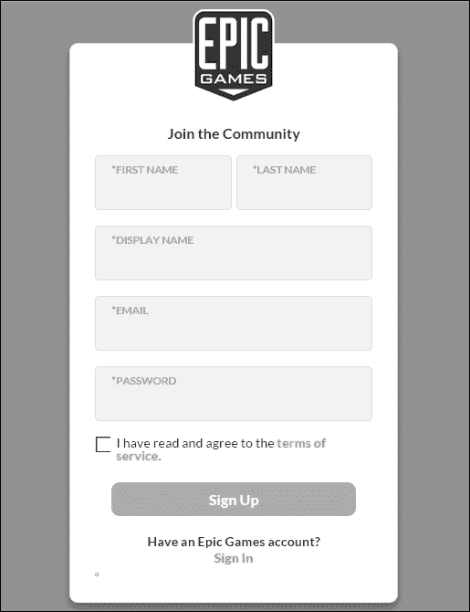
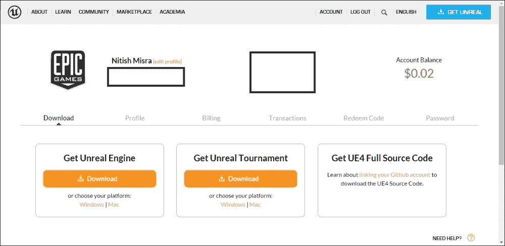
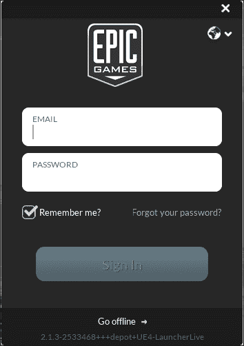
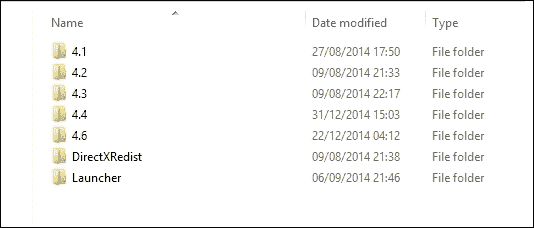
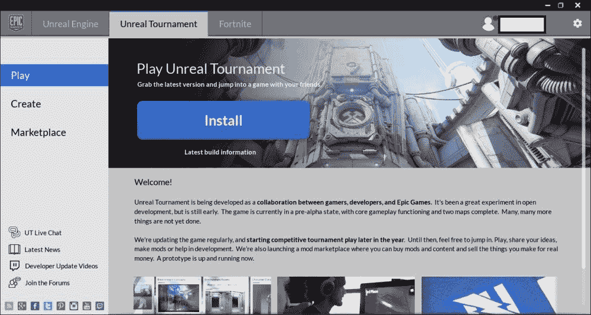
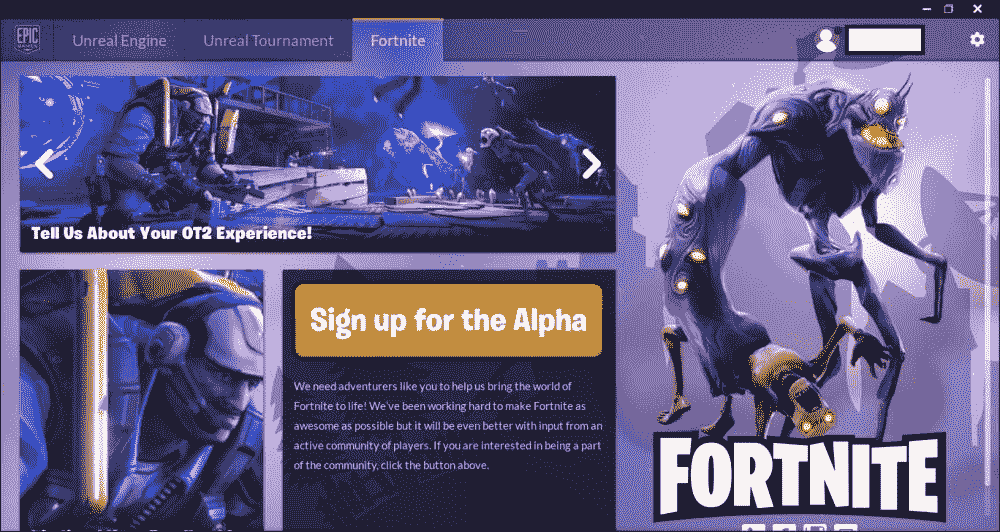
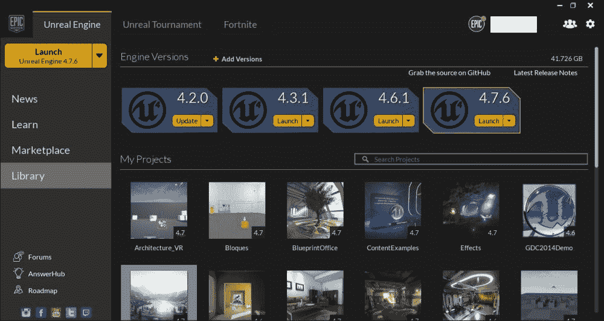
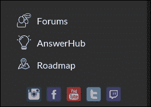

# 第一章：使用虚幻 4 入门

问候！如果您拿起了这本书，很可能您对使用 UE4 在 Android 设备上开发游戏感兴趣。本书将解释您使用 UE4 所需的一切。从最基础的，如下载和安装软件，到更高级的，如打包您完成的游戏并将其移植到您的 Android 设备上，本指南将覆盖一切。您可以在 UE4 上为各种平台开发游戏，但我们将专注于 Android 平台。

在这个介绍性的章节中，我们将涵盖以下主题：

+   UE4 及其提供的功能

+   下载和安装 UE4

+   引擎启动器及其用户界面

+   指南中的预期内容

# 预期内容

学习如何使用游戏引擎可能是一项艰巨的任务；您可能不知道从何开始，UE4 也不例外。然而，一旦您掌握了它，您很快就会发现它实际上是多么强大和直观。有什么比通过实际制作游戏来教您如何使用游戏引擎更好的呢？本书将教会您所有您需要知道的内容，以便您能够使用 UE4 在 Android 平台上开发游戏，并在此过程中制作一个真正的可玩游戏。背后的原因很简单；仅仅谈论 UE4 提供的功能并逐一演示它们并不是学习如何开发游戏的有效方法。然而，如果有人通过在游戏中实现这些功能来解释它们，那将更加有效，因为您将更好地理解每个功能如何影响游戏和其他功能。

在本指南中我们要制作的游戏叫做**Bloques**，这是一个第一人称解谜游戏，玩家的主要目标是解决一系列的谜题以便继续前进。随着玩家的进展，谜题会变得越来越复杂和难以解决。至于游戏的范围，它将包含四个房间，每个房间都有一个谜题，玩家必须解决才能进入下一个房间。

选择解谜游戏的原因是解谜游戏在脚本编写和关卡设计方面有更复杂的系统。在本指南中，诸如蓝图脚本编写和关卡设计等内容将通过解谜游戏得到更好的展示。尽管游戏将在随后的章节中得到详细解释，但游戏特性的高级概述如下：

+   一个完全渲染的可玩 3D 环境，有四个房间。

+   交互式环境元素。

+   玩家必须解决每个房间中的一系列谜题，以便进入下一个房间。随着玩家的进展，谜题变得更加复杂和难以解决。

+   游戏将被优化并移植到 Android。

这本指南旨在为 UE4 奠定基础，使您能够进一步建立知识，并真正有能力开发您一直想要制作的游戏！

最后的建议是实践！教程和指南只能做到这么多。其余的取决于您。真正掌握 UE4，或者任何东西，唯一的方法就是实践。不断尝试，制作小型原型，保持与最新的发展和新闻保持联系，并与社区互动。

# 系统要求

在您开始下载 UE4 之前，您首先需要确保您的系统能够运行它！UE4 适用于 Windows 和 Mac OS X。以下是每个系统的系统要求：

+   Windows 7/8，64 位（或 Mac OS X 10.9.2 或更高版本）

+   .NET 4.0

+   DirectX 10（Mac：OpenGl 3.3）

+   8 GB 的 RAM

+   四核英特尔或 AMD，2.5 GHz 或更快

+   NVIDIA GeForce 470 GTX 或 AMD Radeon 6870 HD 系列或更高

+   至少 9 GB 的硬盘空间（Mac OS X 为 8 GB）

# 下载和安装 UE4

下载和安装 UE4 的过程非常简单；只需按照以下步骤进行：

1.  转到虚幻的官方网站（[`www.unrealengine.com/`](https://www.unrealengine.com/)）。主页看起来像下面的截图：

关于 UE4，您需要了解的一切都可以在这里找到，包括最新消息、引擎的最新版本、博客更新、最新的市场条目等等。从 2015 年开始，该引擎已经免费下载。

除了 UE4 主页，建议您访问[`docs.unrealengine.com/latest/INT/`](https://docs.unrealengine.com/latest/INT/)。这里有关于如何使用 UE4 的文档和视频教程。Epic 拥有一个庞大、活跃且友好的社区，总是愿意通过论坛帮助面临问题的任何人。

### 注意

您可以通过在主页上悬停在**社区**标签上直到菜单下拉，然后点击**论坛**来访问论坛，或者您也可以简单地访问[`forums.unrealengine.com/`](https://forums.unrealengine.com/)寻求帮助。或者，您也可以通过访问[`answers.unrealengine.com/`](https://answers.unrealengine.com/)来寻求**AnswerHub**的帮助。

1.  从主页上，点击屏幕右侧的**获取虚幻**按钮。点击它将带您到订阅页面，如下所示：

1.  要下载和安装 UE4，您必须创建一个账户。要创建一个 Epic Games 账户，只需填写所需信息，并按照说明操作。

1.  要下载引擎启动器，只需登录。在您的账户页面上，您可以访问您的个人资料、账单历史、以前的交易等。

1.  现在您已经设置好了账户，您可以下载 UE4。根据您的设置，您可以下载 Windows 版本或 Mac 版本。要下载，在**最新下载**下，点击**下载**按钮，您将下载引擎启动器。

1.  要运行安装程序，只需双击**UnrealEngineInstaller-*版本号*.msi**（如果您使用 Windows）或**UnrealEngineInstaller-*版本号*.dmg**（如果您使用 Mac）。按照步骤安装引擎启动器。

1.  安装完成后，运行启动器。您应该会遇到以下屏幕。

这是登录界面。只需输入您用于订阅的电子邮件地址和密码，然后点击**密码**旁边的箭头按钮或按*Enter*键，即可登录。

1.  登录将打开引擎启动器。我们将在稍后详细讨论它及其功能，但现在，您只需要点击**库**，然后点击**引擎**旁边的**添加版本**按钮。这样将创建一个插槽。您可以使用版本下拉菜单在您添加的版本插槽中选择一个版本号，然后您可以点击**安装**按钮，您选择的 UE4 版本将开始下载。

就是这样！您现在已经在您的 PC（或 Mac）上下载并安装了 UE4。要启动引擎，只需点击启动器左上角的**启动**按钮，下面是账户名称，然后您就可以开始了。如果需要，您还可以启动以前的引擎版本。点击**启动**按钮旁边的向下箭头将打开一个菜单，列出了所有的引擎版本，要启动它们，只需点击您希望运行的版本。

或者，您也可以点击**库**按钮，从那里选择要运行的引擎。您系统上安装的所有版本都将列出，您可以通过点击**启动**按钮来简单地启动列表中的任何版本。

但是等一下！在我们准备开始使用 UE4 之前，我们还有一些事情要讨论。让我们快速看一下目录结构。

## Windows 目录结构

UE4 的默认安装位置是`C:\Program Files\Unreal Engine\`。您可以在安装过程中更改此位置。打开目录后，您会发现每个引擎版本都有自己的单独文件夹。比如，您在系统上安装了 UE4 的 4.1、4.2 和 4.3 版本。您将找到所有三个版本的单独文件夹，即`4.1`、`4.2`和`4.3`。以下截图将让您更好地了解：

每个引擎版本都有自己的文件夹。除此之外，还有另外两个文件夹，即`DirecXRedist`和`Launcher`。

### Windows DirectXRedist

`DirectXRedist`是`DirectX`文件的存放位置。该文件夹还包含安装文件，您可以从中安装`DirectX`。

### 启动器

`Launcher`文件夹包含引擎启动器的所有文件。`Launcher`文件夹包含以下子文件夹：

+   `Backup`：UE4 具有一个出色的功能，可以让您创建工作的备份。如果开发人员犯了一个无法修复或难以修复的错误，或者引擎在开发过程中崩溃，那么他们不需要重新做所有的工作，他们的工作备份将存储在`Backup`文件夹中，这样他们可以从上次离开的地方继续。

+   `Engine`：该文件夹包含构成引擎的所有代码、库和内容。

+   `PatchStaging`：偶尔，Epic 会发布新版本的 UE4。截至 2015 年，最新版本是 4.7.6（撰写时可用预览版本 4.8）。在下载过程中，当前下载版本的所有数据都存储在`PatchStaging`文件夹中。

+   `VaultCache`：稍后将在本章中解释，您现在需要知道的是，您在市场上购买的所有内容都包含在**Vault**中。`VaultCache`包含所有已购买项目的缓存文件。

### 4.X 文件夹

在我们讨论`4.X`文件夹之前，您应该知道 UE4 的所有版本（4.1、4.2、4.3 等）都是相互独立的。这意味着您不需要先前的版本来运行后续版本。例如，如果您希望运行 4.4 版本，那么您不需要下载 4.0、4.1、4.2 和 4.3 版本来运行它。您只需下载 4.4 版本并使用它而不会出现任何问题。这就是为什么 Unreal 4 的每个版本都有一个单独的文件夹的原因，每个版本都被视为一个独立的实体。

所有`4.X`文件夹，虽然分开，但包含相同的子文件夹集，因此它们被分组在一起。以下是子文件夹：

+   `Engine`：类似于启动器的`Engine`文件夹，其中包含构成引擎的所有源代码、库、资产、地图文件等。

+   `Samples`：UE4 有两个示例地图，Minimal Default 和 Starter Map。该文件夹包含所有内容，包括资产、蓝图等。

+   `Templates`：UE4 提供各种类型游戏的模板，例如第一人称、第三人称、2D 横向卷轴、俯视等。每种类型的所有内容和源代码都包含在这里。

# 引擎启动器

引擎启动器是在运行引擎后打开的窗口。它充满了对您非常有用的功能和资源。首先，我们将看一下引擎启动器的用户界面、其分解、所有位置、功能等。

打开引擎启动器后，您将看到以下窗口：

在左上方有三个标签，**虚幻引擎**，**虚幻竞技场**和**堡垒之夜**。默认情况下打开的是虚幻引擎标签，其中包含了您在上一张截图中看到的内容。

**虚幻竞技场**标签是您可以找到有关最新《虚幻竞技场》游戏的信息和链接的地方。

如前所述，Epic 的最新项目《虚幻竞技场》是一个项目，Epic 接受并鼓励社区的内容，比如武器皮肤、玩家皮肤、关卡等。在这里，您可以下载最新的《虚幻竞技场》，购买其他社区成员创建的内容，以及获取有关《虚幻竞技场》的所有最新新闻和更新。

最后一个标签是**堡垒之夜**标签。Epic 目前正在进行另一个项目，即《堡垒之夜》。

在撰写本文时，Alpha 版本可用。您可以注册参与，并向开发人员提供反馈，以及从该标签访问官方 Facebook 页面、Twitter 页面、Instagram 账户和 Twitch 直播。

在右上角的面板上有两个按钮，**好友列表**按钮和**设置**按钮。当您点击**好友列表**按钮时，它会打开一个窗口，您可以在其中管理好友列表，比如添加和删除好友，查看谁在线等等。您还可以将自己的状态设置为**在线**或**离开**。

下一个按钮是**设置**按钮，在这里您可以找到关于引擎启动器的某些选项，比如访问支持页面，查看启动器日志，退出启动器等等。

在左上方是**启动**按钮，如前所述，它会启动引擎。在它下面有几个面板，每个面板包含不同的内容。让我们逐个查看这些面板。

## 新闻

**新闻**面板包含有关 UE4 和 Epic 的所有最新新闻和更新。从这里，您可以访问有关当前/最新版本 UE4 的最新文章，市场发布的最新内容，有关特定主题的最新教程系列，Twitch 回顾等等。这是了解 Epic 和 UE4 周围事件的最佳途径。

### 注意

新闻部分定期更新，因此建议定期查看新闻部分。

## 学习

正如名称所示，这里是您可以找到有关 UE4 的所有教程和文档的地方。**学习**部分提供视频教程，比如如何使用蓝图，书面教程，其中包含有关如何使用 UE4 的逐步说明，最后还有游戏内容示例，这些是已经设置好的项目文件，包括关卡、灯光、资源以及蓝图脚本，这样您可以亲自看到每个部分的作用并进行实验。

在**学习**部分的顶部有三个按钮，分别是**文档**，**视频教程**和**社区维基**。点击**文档**会将您发送到 Epic 官方的虚幻引擎 4 文档页面，涵盖了诸如如何使用编辑器、蓝图、Matinee 等各种主题。

**视频教程**按钮将带您到 Epic 的视频教程页面，所有内容都被整齐地分类。每个类别都有一定数量的系列。一个系列包含一系列涵盖特定主题的视频教程。例如，蓝图类别目前有六个系列，包括介绍、如何创建库存、第三人称游戏创建等。

最后，社区维基是一个活跃的维基页面，人们可以在上面发布教程、代码、项目、插件等。这是获取用户内容和找到其他开发者创建的教程的好方法。值得一提的是，Epic 目前正在开发他们的最新项目，虚幻竞技场。这个标题的一个很棒的地方是，他们也接受并实施社区创建的内容。这包括开发核心游戏功能、关卡、角色、枪支、HUD 图形等。

### 注意

如果您有兴趣为项目做出贡献或对整个项目感兴趣，只需转到维基的虚幻竞技场部分，它将为您提供有关项目的所有必要信息。在此之下，是各种基于类型分类的教程，您可以查看/下载并了解更多关于 UE4 及其功能的信息。

## 市场

市场是开发人员可以购买资产的地方。缺乏人力或资源来创建资产的开发人员可以购买并在他们的游戏中使用它们。这些包括网格、材料、动画集、绑定的角色、音频文件、音效、项目和教程等。市场中的某些项目，例如 Epic 自己的项目是免费的。它们主要是教程项目文件，已经设置了一个示例关卡来展示 UE4 提供的各种功能。这些项目文件还设置和实施了所有的关卡蓝图，以便用户可以看到它们，并进行实验，直到他们掌握它。市场中的其他项目，由用户创建，需要付费。您可以购买的资产根据内容类型进行了整齐的分类，以方便您选择。

除了购买资产，您还可以在市场上提交自己的内容并从中赚取一些钱。在市场屏幕右上角点击**提交您的内容**超链接将打开 Epic 的提交页面。提交页面包含有关提交内容的所有信息。

它还有市场业务条款，其中包含有关销售收入分成、如何获得付款、何时获得付款等所有信息。它还有市场提交指南，解释了提交流程、需要提交的内容、截图的分辨率等。您还可以通过在论坛上发布内容来获取有关提交流程的更多信息和反馈。

## 库

库是列出所有 UE4 版本、所有项目和您从市场购买的所有项目的地方。让我们仔细看一下。

库有 3 个部分，**引擎版本**、**我的项目**和**保险库**。**引擎版本**部分显示当前安装在您系统上的所有 UE4 版本。您可以从这里启动引擎的任何版本。此外，您还可以下载最新版本或以前的版本。要这样做，只需点击面板顶部的**添加版本**，就在**引擎版本**旁边。点击它将为您想要下载的版本创建一个插槽。

如前一屏幕截图所示，点击**添加版本**按钮会创建一个用于最新版本的虚幻 4 的插槽，本例中是 4.8.0（尽管只是预览版本）。要下载，只需点击**下载**按钮，它就会开始下载。

此外，你可以删除你不需要的 UE4 版本。例如，如果你有最新版本，你可能希望删除之前或旧版本的引擎，以在硬盘上腾出空间。要做到这一点，只需将光标悬停在版本槽的左上角，直到看到一个**x**。一旦看到**x**，只需点击它，相应版本的 UE4 将被卸载。另一种卸载的方法是点击**启动**旁边的向下箭头按钮，这将打开一个下拉菜单；从中选择**删除**，引擎启动器将卸载该版本。

图书馆的第二部分是**我的项目**部分。在这个部分，你创建的所有项目都会显示出来。

项目按字母顺序分类。右上角是搜索栏。在上面的截图中，项目文件相对较少；因此，很容易找到特定的项目。但是，如果你有很多项目，可能会更难找到你要找的项目。在这种情况下，你可以在**搜索项目**选项卡中输入你需要的项目名称，它会帮你找到它。

在项目缩略图的右下角，你可以看到项目是在哪个版本的引擎中创建的。例如，在上面的截图中，项目**Effects**是用 UE4 的 4.0 版本创建的。如果你打开该项目文件，启动器将启动 UE4 的 4.0 版本。然而，如果你没有相应的版本，那么在启动项目时，你将被要求选择你希望在哪个已安装的版本中启动项目文件。在做出选择后，它将把项目转换为与你选择的版本兼容，并启动它。然而，在转换项目时要小心，因为可能会出现一些意外问题。建议在转换之前创建项目的备份副本。

要启动一个项目，双击缩略图。除了打开一个项目，你还可以执行其他操作。右键单击缩略图会打开一个菜单。点击**删除**将删除相应的项目。点击**克隆**将创建项目文件的副本，点击**在文件夹中显示**将打开存储在系统上的所有项目文件的文件夹。

最后，还有**Vault**。你在市场上购买的所有物品都包含在**Vault**中。

上面的截图展示了**Vault**的样子以及物品是如何排列的。左边是物品的缩略图，然后是物品的名称。名称下面是该物品占用的空间量。名称下面的蓝色**i**图标是关于兼容性的信息。将光标悬停在**i**上会显示该物品与哪些版本的 UE4 兼容。

兼容性也显示在缩略图的右下角，类似于**我的项目**。让我们以 Vault 中的第一件物品为例，即动画起始包。在缩略图上写着**4.4-4.6**。这意味着动画起始包与 4.4、4.5 和 4.6 版本兼容。

你可能已经注意到，某些物品有**添加到项目**选项，而其他物品有**创建项目**选项。例如，动画包、资产、材料和音频文件可以添加到你已经创建的任何项目中，并且可以在你的级别中使用。项目和展示有**创建项目**选项。点击它后，它将创建一个项目，并显示在**我的项目**中，你可以从那里打开它。此外，你可以通过点击向下箭头验证或删除任何项目，并从下拉菜单中选择相应的选项。

## UE4 链接

启动器用户界面中的最后一个元素是位于左下角的 UE4 链接。UE4 链接包含指向不同网页的超链接。

让我们仔细看看每一个：

+   **论坛**：UE4 拥有一个庞大而活跃的社区。论坛是一个很好的地方，可以认识其他开发人员，分享您的想法，展示您的进行中的工作并获得反馈，与其他成员合作开发项目等。

论坛的讨论板按您希望讨论的主题进行了整理。有开发讨论部分，您可以在那里讨论蓝图、动画、渲染、C++游戏编程等。然后是社区部分，您可以展示您的进行中的工作并获得反馈，也可以看到其他人的作品并给予他们反馈。接下来是面向学校的 UE4 部分，专门供学生和教师讨论 UE4 和教育项目。最后是国际部分，您可以与来自您地区的开发人员互动。招募和与他人合作项目变得更加容易和方便，因为几乎所有成员都来自同一地区。

+   **AnswerHub**：有时，您可能会遇到问题或困难，或者有非常具体的问题需要解答，而在任何文档或教程中都找不到答案。在这种情况下，最好的做法是寻求他人和/或 Epic 工作人员的帮助。AnswerHub 是一个很好的论坛，在这里您可以通过 UE4 社区或 Epic 工作人员的帮助解决任何技术或其他方面的问题。要做到这一点，只需登录，发布您的问题，然后等待有人回复。

或者，如果您慷慨的话，您可以通过帮助他人解决可能遇到的任何问题，并在此过程中建立良好声誉，回馈社区。

+   **路线图**：社区是 UE4 的重要组成部分。Epic 的开发人员希望尽可能地包含社区，并对他们的开发过程进行透明化。这一点在路线图中体现得最为明显。路线图列出了正在开发过程中的功能，并估计了这些功能将何时部署。

Epic 的社交图标位于底部。从左到右，它们依次是：

+   Instagram：您可以关注 Epic 的 Instagram 个人资料，在那里他们发布关于 UE4 的照片和视频，比如环境、活动、材料等等。他们的 Instagram 链接是[`instagram.com/UnrealEngine/`](https://instagram.com/UnrealEngine/)。

+   **Facebook**：点击这个将带您到虚幻引擎的官方 Facebook 页面，在那里，与 Instagram 一样，所有关于 UE4 和 Epic 的更新都会发布。他们的 Facebook 页面链接是[`www.facebook.com/UnrealEngine`](https://www.facebook.com/UnrealEngine)。

+   **YouTube**：这将带您到官方的虚幻引擎 YouTube 页面，您可以在那里访问以前的 Twitch 直播、教程等。他们的 YouTube 页面链接是[`www.youtube.com/user/UnrealDevelopmentKit/`](https://www.youtube.com/user/UnrealDevelopmentKit/)。

+   **Twitter**：如果您想在 Twitter 上关注他们，这将带您到官方的 Twitter 页面。官方虚幻引擎 Twitter 账号是`@UnrealEngine`

+   **Twitch 直播**：每周四下午 2 点（写作时），虚幻团队都会有一个 Twitch 直播，在那里他们会讨论最新消息，谈论最新版本的 UE4，新增或修改的功能，并回答观看直播的观众提出的任何问题。

# 总结

您现在已经迈出了成为 UE4 Android 开发人员的第一步。本章只是冰山一角；还有很多内容需要涵盖。

在这个介绍性的章节中，我们介绍了 UE4 是什么以及 UE4 提供的功能。你还学会了如何下载和安装 UE4。现在你已经熟悉了引擎启动器、它的用户界面和功能。

所有这些话题都为我们接下来的章节提供了一个很好的过渡，我们将在那里讨论编辑器。在我们开始使用它之前，重要的是你知道并理解它是什么，如何浏览它，以及它的用户界面和功能。下一章将专门讨论这些内容。所以，话不多说，让我们继续下一章吧。
