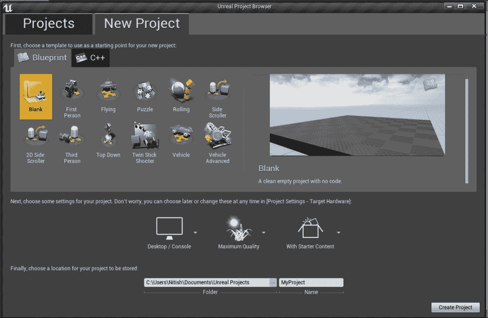
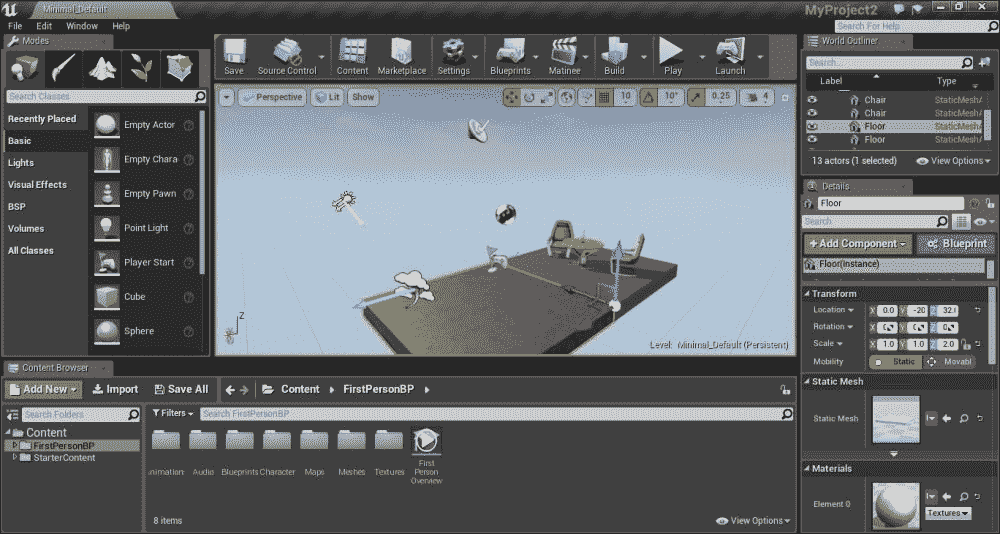
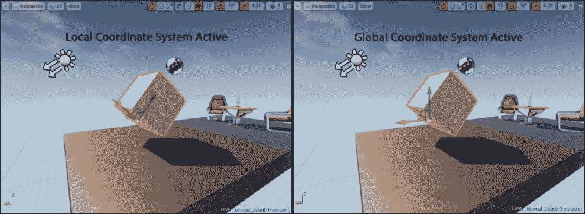
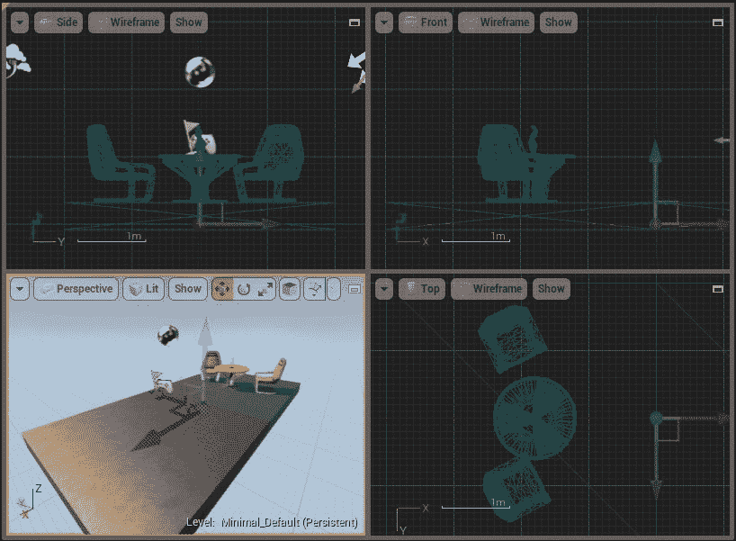
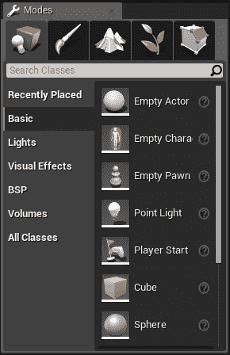

# 第二章。启动虚幻引擎 4

现在您已经知道如何下载和安装 UE4，您应该已经准备好开始制作游戏了。然而，在我们开始制作游戏之前，有一个重要的主题需要讨论，那就是**编辑器**。编辑器是所有魔法发生的地方。这是您制作游戏的地方。因此，在我们继续之前，您需要了解编辑器、其功能、用户界面以及如何浏览它。因此，本章将带领您了解它。

我们将涵盖以下主题：

+   编辑器是什么

+   它的用户界面

+   浏览编辑器

+   快捷键和控制

# 遇见编辑器

编辑器是您制作游戏的地方。您为游戏创建的所有资产都是通过编辑器实现的。您可以在编辑器中设置环境和关卡，并且您创建的所有代码序列都可以在这里进行测试；游戏的测试、调试和打包也在这里完成。

毋庸置疑，重要的是您了解编辑器是什么，熟悉其用户界面，并知道如何浏览它，然后我们才能继续。最后，为了提高您的工作流程，您还应该熟悉一些快捷键。

# 虚幻项目浏览器

当您通过引擎启动器启动 UE4 时，除非您直接从库中打开了一个项目，否则虚幻项目浏览器将会打开。在虚幻项目浏览器中，您可以看到您已经创建的所有虚幻项目的列表，并且您可以打开任何一个您希望的项目。您也可以从这里创建一个新项目。

在下一章中，我们将介绍项目是什么；现在，我们只关注**虚幻项目浏览器**及其用户界面，如下图所示。

在顶部，标签栏下方有两个标签，分别是**项目**和**新项目**。每个标签都包含我们将要介绍的某些功能。

在**项目**标签中，您可以看到并打开您在系统上存储的任何项目。顶部是搜索栏。如果您有很多项目并且难以找到特定的项目，您可以在搜索栏中简单地输入您希望打开的项目名称，它将显示与您输入的名称匹配的项目。

在搜索栏右侧是**刷新**按钮。如果您从市场购买了任何内容，它不会反映在浏览器中。要更新项目列表，请单击**刷新**按钮。**刷新**按钮旁边是**市场**按钮；单击此按钮将带您到引擎启动器的市场面板。

在搜索栏下方是**我的项目**部分；您创建的所有项目都显示在这里。**我的项目**下方是**示例**部分。您可以在这里找到可以从市场购买的任何游戏功能示例或引擎功能示例。

如前面的截图所示，目前显示了两个项目。您可能还注意到其中一个项目**Test**颜色较暗，并且缩略图右下角写着 4.4。这是因为**Test**项目是使用 4.4 版本创建的，而我们已经启动了 4.6.1 版本。如果我们尝试启动此项目，将会收到提示，提示说此项目是用不同的引擎版本构建的，并将有选项将项目转换为与我们当前运行的 Unreal 4 版本兼容。一旦您转换了项目，它将与您当前的引擎版本兼容。

### 注意

虽然转换项目升级效果很好，但降级项目（例如，将在 4.6 版本中创建的项目转换为与 4.4 版本兼容）会有一些复杂情况。首先，虽然您可以使用大部分在项目中创建的资产，但无法加载其中创建的地图，并将以完全空白的场景开始。

接下来是**示例**部分。从引擎特性示例、示例游戏项目等下载的任何内容都会显示在这里。我们之前讨论过的关于项目的升级和降级过程也适用于这些项目文件。

要打开一个项目，只需单击它，选定的项目将被突出显示为黄色。选择后，单击**打开**按钮启动它。如果您需要打开**我的项目**部分未列出的项目，只需单击**浏览**按钮，搜索项目文件并运行它。最后，在窗口的左下角有一个小复选框，上面写着**始终在启动时加载上一个项目**。如果选中该复选框，下次启动 UE4 时将自动打开您上次打开的项目。

转到**新项目**面板，我们看到以下屏幕：

正如我们在前面的屏幕截图中看到的，有许多类型的模板可供选择，取决于您想要制作什么类型的游戏。例如，有第一人称游戏、益智游戏、横向卷轴游戏和车辆游戏的模板。有两种类型的模板可供选择，**蓝图**和**C++**。蓝图项目不需要用户具有先前的编程经验。所有游戏功能都可以使用蓝图实现，模板还提供了特定游戏模式所需的基本蓝图集，如相机、控制、物理等。然而，C++项目需要开发人员了解 C++。这些项目为特定模板提供了基本框架，开发人员可以在此基础上制作游戏。选择蓝图项目对于缺乏编程知识的开发人员是有益的，提供了开发的便利性。然而，尽管蓝图是一个很好的工具，但它仍然不如编码灵活。通过编码，您可以更好地控制引擎，甚至可以修改它以满足您的需求。这也意味着更好地优化您的游戏。开发人员可以使用蓝图来实现功能，如果他们需要的话。

### 注意

创建 C++项目时，建议您在系统上安装 Visual Studio 2013 或更高版本。如果没有安装，您需要先下载并安装 Visual Studio，然后才能创建这类项目。但是，您可以使用 Visual Studio 2012，只要您从 GitHub 下载源代码，然后在 Visual Studio 2012 中编译整个引擎。但是，由于引擎启动器是使用 Visual Studio 2013 构建的，建议您安装 2013 版本。如果您使用 Mac，您将需要 Xcode 5 或更高版本。

在项目列表的右侧是突出显示的项目的屏幕截图，下面是对其的描述。

在决定使用哪个模板之后，在打开项目之前，您可以选择一些设置。首先，您可以选择在哪种硬件上开发游戏，PC/游戏机，或移动设备/平板电脑。

这将设置启动项目时的控件等。之后，您可以设置游戏中的渲染质量。您可以选择最高质量或可扩展的选项。尽管您可能希望使游戏看起来令人惊叹，但您必须记住移动设备有限制。在为移动设备开发时，建议选择**可扩展**。可扩展和最高质量的区别在于，可扩展中引擎配置文件经过优化以提供最佳性能。这意味着一些更昂贵的功能，如抗锯齿和运动模糊，默认情况下被关闭。最后，您可以选择是否要使用起始内容创建项目（起始内容包含材料、道具、音频文件、纹理等）。

一旦您设置了这些选项，您可以设置项目存储的位置。左侧栏显示项目存储的位置和文件夹名称。您可以将其设置为任何您希望的内容。在右侧栏，您可以设置项目的名称。最后，设置好所有这些选项后，只需点击“创建项目”按钮即可打开编辑器。

# 用户界面

在打开或创建新项目后，编辑器将打开。一旦打开，您将看到以下屏幕：

编辑器是您创建游戏的地方。正如您所见，即使编辑器的用户界面被整齐地分类，仍然有相当多的按钮、菜单和面板。为了更容易地解释用户界面，我们将编辑器分成各个部分，然后逐个讨论每个部分。

## 标签栏和菜单栏

在顶部，我们有标签栏。就像在互联网浏览器中一样，您可以看到当前打开的所有地图文件的标签，并且可以停靠多个视口。

在标签栏的右侧，您可以看到项目名称以浅灰色写着，例如**MyProject2**。在项目名称旁边是**发送快速反馈**按钮，看起来像一个聊天气泡。想给 Epic 关于编辑器的反馈，无论是积极的还是消极的？您可以使用这个按钮。只需点击图标，打开一个菜单，选择发送积极或消极反馈，以及向 Epic 提问。在您做出选择后，会打开一个窗口，您可以选择反馈的内容，然后写下您的想法。在写下您的反馈后，点击**发送**，它将发送给 Epic。

接下来，我们有**显示可用教程**按钮，点击后会打开一个窗口，您可以选择想要查看的教程。编辑器本身提供了可用的教程。当您点击按钮时，会打开一个新窗口，显示所有可用的教程。

在标签栏下方是菜单栏。它提供了所有应用程序提供的一般命令和工具。

+   **文件**：在这里，您可以创建、打开和保存关卡/地图，还可以从这里创建或打开项目（创建或打开新项目时，当前项目将关闭，编辑器重新打开）。您还可以从这里打包游戏。要这样做，只需点击**文件**，悬停在**打包产品**上，这将打开另一个菜单，选择要在哪个平台上打包游戏，然后按照说明完成流程。这里有各种设置和构建配置，我们将在后面的章节中介绍。

+   **编辑**：从**编辑**菜单中，您可以执行撤消或重做上次操作、剪切、复制、粘贴和/或复制所选对象（或对象组）等操作。您还可以从这里访问编辑器首选项。要这样做，只需在**编辑**菜单中单击**编辑器首选项**。这样将打开一个新窗口，您可以在其中设置选项，例如切换自动保存开/关或设置自动保存的频率、更改或分配热键以及更改测量单位（厘米、米或千米）。首选项中还有更多设置可用，因此请随意探索并调整它们以适应您的游戏。

最后，您还可以设置和更改当前打开项目的设置。**编辑器首选项**的正下方是**项目设置**选项；单击此选项将打开项目设置窗口。在**项目设置**窗口中，您可以设置项目描述（包括为项目添加缩略图、添加描述和项目 ID）、游戏的打包方式以及项目支持的平台。

### 注意

在**编辑器首选项**和**项目设置**中有许多设置可以更改和调整以满足您的要求，因此建议您彻底查看它们。

+   **窗口**：编辑器窗口是完全可定制的。除了选项卡和菜单栏之外，编辑器中的所有其他窗口都可以根据您的喜好进行自定义。在前一节中的屏幕截图是编辑器的默认布局。您可以添加、删除和移动任何您喜欢的窗口。

要这样做，只需按照以下步骤：

1.  将光标移动到您希望移动的窗口选项卡上

1.  按住选项卡上的左鼠标按钮

1.  将窗口移动到您希望移动的位置

1.  释放左鼠标按钮，窗口将被设置

有时您可能找不到窗口选项卡。例如，在前面的屏幕截图中，视口没有选项卡。这是因为它的选项卡被隐藏了。要取消隐藏它，只需单击窗口左上角的小黄色箭头。

在上述情况下，Windows 菜单就是为此而设。如果您希望在编辑器中添加另一个窗口，只需打开 Windows 菜单，选择要添加的窗口，然后单击它。这样做后，窗口将打开，您可以将其移动和设置到您想要的位置。如果您使用双屏幕，那么 Windows 菜单可能会很有用，因为您可以添加更多窗口。

+   **帮助**：Epic 已尽最大努力确保他们和社区提供的教程随时易于访问，无论是在他们的网站上、引擎启动器上还是编辑器本身上。帮助菜单类似于引擎启动器的**学习**部分（在第一章中有描述，*开始使用虚幻 4*）；它包含有关 UE4 的所有教程和文档的链接。在菜单栏的最右侧是**搜索帮助**栏。您需要找到特定的教程，而不必浏览整个帮助部分吗？在这种情况下，只需输入您希望找到教程的主题名称，它将显示匹配的结果。

## 工具栏

接下来，我们有工具栏，位于选项卡和菜单栏的正下方。

它提供了对最常用的命令和操作的快速访问。

+   **保存**：在最左边是**保存**按钮。任何开发人员都知道这个功能有多重要。一旦崩溃，所有工作都付之东流；因此，它在工具栏上是可用的，以便您可以快速访问它。

+   **源代码控制**：从这里，您可以启用或禁用源代码控制，默认情况下为禁用状态。源代码控制是团队合作时的重要工具。这是一种跟踪文件更改并控制软件版本的方法。当对文件进行任何修改时，团队可以检查修改后的文件，并如果他们进行了任何更改，则发布给其他人。

要启用它，请单击按钮，这将打开一个下拉菜单，然后选择**连接到源**。将打开一个新窗口，要求您选择提供者。选择您想要的提供者，然后单击**接受设置**。启用后，您可以检查其他团队成员所做的任何修改，并发布您自己所做的任何修改。

+   **内容**：**内容**按钮打开内容浏览器。这类似于虚幻引擎 3 中的内容浏览器。因此，如果您熟悉它，您应该不会对新版本有任何问题。对于那些没有使用过虚幻引擎 3 的人，内容浏览器是可以找到所有资产、代码、关卡等的地方。

+   **市场**：您突然意识到您的游戏需要一个或多个资产；而不是再次打开引擎启动器，只需单击此按钮即可转到引擎启动器的**市场**部分，您可以浏览和购买所需的项目。

+   **设置**：这类似于虚幻引擎 3 中的**信息**设置。它列出了编辑器中最常用的设置。例如，切换角色捕捉的开/关，允许/禁止选择半透明对象，允许/禁止组选择等等都可以在这里更改。还值得一提的是，引擎的视觉设置，如分辨率、纹理渲染质量、抗锯齿等也可以在这里更改。

+   **蓝图**：我们有一个专门的章节介绍蓝图；因此，这是一个重要且在 UE4 中最常用的功能之一，应该不足为奇。您可以从这里访问蓝图编辑器。

+   **电影**: 这是 UE4 提供的另一个重要且常用的功能，使用它可以在虚幻电影中创建电影等。您可以从这里打开虚幻电影。

+   **视口**：

+   **播放**：当您点击**播放**按钮时，游戏会在视口中正常启动，供您测试您的关卡并查看一切是否按预期运行。游戏开始后，**播放**按钮会被其他三个按钮替换。

+   **暂停**：此按钮暂停游戏会话。暂停时，您可以恢复或跳过一帧。

+   **停止**：此按钮停止游戏会话，并将您带回编辑模式。

+   **弹出**：当您点击**播放**时，您可以控制一个角色。如果您点击**弹出**，您将停止控制角色，并可以在视口中移动它。

还有其他选项可以设置**播放**，只需单击按钮旁边的向下箭头，即可打开**播放**菜单。

+   **启动**：当您认为您的游戏已经完成并准备好进行移植时，单击**启动**按钮将会将您的项目烹饪、打包并部署为可执行应用程序文件（取决于您想要在哪个平台上部署您的游戏）。

## 视口

位于编辑器中心的视口是您创建和查看游戏的地方。您可以在这里放置和组装所有资产，以创建您的世界。

**构建**：构建是 UE4 的一个非常重要的功能。当您构建您的关卡时，引擎会预先计算光照和可见性数据，并生成导航网络，并更新几何形状。

让我们仔细看一下视口。要移动，按住鼠标左键或右键，并使用 *W*、*S*、*A* 和 *D* 键进行移动。要选择一个对象，左键单击它。顶部是视口工具栏，一些在左边，一些在右边。让我们逐个检查这些工具：

+   **视口选项**：在工具栏的最左边，有一个向下箭头表示的视口选项。单击后，会打开一个菜单，其中包含查看视口和你想在其中看到的选项。例如，你可以切换到所谓的**游戏模式**，它显示场景在游戏中的样子。这意味着诸如体积、隐藏的角色和角色图标（例如，在前面的截图中，有四个角色图标）都会被隐藏。还有一个叫做**沉浸模式**，它使视口全屏。视口选项菜单中还有其他可以设置的选项，所以四处看看吧！

+   **视口类型**：接下来，我们有**视口类型**菜单。有两种类型的视口，透视和正交。透视视图是完整的三维视图，在其中你可以看到三维场景。正交视图使你能够以二维方式查看世界，可以沿着*XZ*平面（前面）、*YZ*平面（侧面）或*XY*平面（顶部）。

+   **视图模式**：有各种模式可以选择查看你的世界。通过点击**视图模式**按钮，你可以查看 UE4 提供的各种视图模式。默认情况下，设置的模式是**Lit**。在这种模式下，你可以看到场景中放置的所有光源角色渲染的级别。你可以切换到**Unlit**，这个模式显示没有任何光照的场景。你还可以切换到**Wireframe**，它只显示场景中放置的角色的线框。

+   **显示**：从这里，你可以选择在场景中查看或隐藏哪些类型的角色。打开菜单后，你可以看到一个带有复选框的项目列表。如果复选框被选中，这些类型的角色在场景中是可见的。如果复选框未被选中，这些类型的角色是隐藏的。

+   **变换工具**：让我们移动到工具栏的右侧。首先是变换工具，有三个图标。在一个角色上可以执行三种变换操作。第一种操作是平移，即改变世界中一个角色的位置（或坐标）。第二种操作是旋转，即围绕*x*、*y*或*z*轴旋转一个角色。第三种操作是缩放，即增加或减小一个对象的大小。你可以通过从变换工具中选择任何一个来选择要执行的操作（你也可以在详细窗口中进行此操作）。

+   **坐标系统**：视口工具栏中的下一个项目，由一个球形图标表示，是坐标系统。在任何变换操作发生的两个坐标系统中：全局和本地。你可以点击按钮在它们之间切换。如果全局坐标系统处于活动状态，图标将是一个球形。当选择本地坐标系统时，图标将是一个立方体。当本地坐标系统处于活动状态时，你执行变换操作的轴将与角色的旋转对齐。当全局坐标系统处于活动状态时，它将不会与角色的旋转对齐；相反，它将与世界对齐。下面的截图向你展示了这意味着什么。在左边，本地坐标系统处于活动状态，在右边，全局坐标系统处于活动状态。

+   **表面捕捉，网格捕捉和网格捕捉值**：接下来的三个工具都与平移操作有关；因此，它们被分组在一起。表面捕捉工具，用一个弯曲线条和垂直箭头的图标表示，当激活时，会导致角色在平移时捕捉到表面（BSP、其他角色表面等）。当你想要将角色放在地面上时，这很方便。只需确保角色的枢轴在底部，因为枢轴点会捕捉到表面。

网格捕捉，用网格形状的图标表示，当激活时，会导致角色在平移时以特定值移动。将世界想象成一个网格，网格中的每个单元格都有一定的大小。当激活时，如果您平移一个角色，它将捕捉到这个网格。在关卡设计中特别方便，当您希望精确放置角色并确保一切正确间隔或对齐时。这些角色将移动的值可以在网格捕捉值菜单中设置。

+   **旋转网格捕捉和旋转网格捕捉值**：接下来的两个工具类似于网格捕捉，唯一的区别是这些工具用于旋转操作。当激活时，角色将按设定的值旋转（例如，10 度）。这个值可以在旋转网格捕捉值菜单中更改。

+   **缩放网格捕捉和缩放网格捕捉值**：网格捕捉组中的最后一个成员是缩放网格捕捉。这适用于当您希望缩放对象时。当激活时，角色将按特定增量放大或缩小，这可以在缩放网格捕捉值菜单中设置。

+   **相机速度**：从缩放网格捕捉继续，我们有相机速度。您可以使用箭头键移动相机。您可以通过在相机速度菜单中设置其速度来设置相机移动的速度。

+   **最大化或恢复视口**：在视口工具栏的最后一项，在右上角，是最大化或恢复视口按钮。如前所述，您可以切换到四种视口类型：透视、前视、侧视和顶视。单击后，视口分为 4 个部分，每个部分中有一个视口类型。以下截图显示了这是什么样子：

\

左上角是侧视图；右上角是前视图；左下角是透视图；右下角是顶视图。每个窗口都有自己的视口工具栏。您可以通过单击所需最大化的视口中的最大化或恢复视口按钮来最大化任何视口类型。在设计关卡和放置资产时，此视口设置最常见，因为您希望确保它们从各个方向正确对齐。因此，准备频繁在这些设置之间切换。

## 模式

**模式**窗口包含编辑器中的各种模式。根据您在编辑器中希望执行的任务，您可以从此面板选择要切换到的模式。

有五种模式，由五个不同的图标代表，你可以切换到这些模式。这些是：

+   **放置模式**：这是默认模式。用于将角色放置到您的关卡中。角色是您在游戏中放置的任何东西；这包括静态网格、灯光、触发器、体积等。这类似于其他游戏引擎中使用的*实体*或*对象*。可以在关卡中放置各种类型的角色；特别是所有类型项目中常见的角色。所有这些角色都根据其类型进行了分类，称为类。有 5 种类别。它们如下：

+   **基本**：这包含非常基本的角色，以及几乎在您制作的任何游戏中都会使用的角色。这些包括触发器、相机、玩家起始点等。

+   **灯光**：灯光面板包含不同类型的光源角色。例如，您有点光源，它像普通的灯泡一样发光，从一个点源均匀地向所有方向发光；还有定向光，它从一个无限远的源（如太阳）发光，等等。

+   **视觉**：这个类包含影响游戏视觉的所有角色，如后期处理体积、大气雾、贴花等。

+   **BSP**：BSP 或二进制空间分区包含 BSP 刷子，这是创建游戏几何体的基本构建块。该类包含不同形状的 BSP 刷子，例如盒子、圆锥、螺旋楼梯等。

+   **体积**：体积类包含不同的体积，每个体积都有不同的属性。例如，您有一个称为**KillZ**体积，它会摧毁进入其中的任何角色，包括玩家角色。这在制作陷阱和可以掉落的区域时非常有用。

+   **绘画模式**：绘画模式允许您在静态网格上绘制和调整颜色和纹理。在这里，您可以设置画笔大小、衰减半径、强度等。需要注意的是，您只能在当前选择的角色上绘制，以确保您只在网格上绘制，而不是其他地方。

+   **景观模式**：如果您有一个自然的户外环境，您可以在引擎中使用景观工具创建整个景观，而不是首先在 3D 建模软件中创建整个景观，然后将其导入引擎。启用景观工具时，视口中会出现一个巨大的绿色平面。这显示了一旦创建，景观的尺寸将是多少。您可以在窗口中设置尺寸和其他设置。当您满意时，只需点击模式窗口底部的**创建**按钮，它将创建景观平面。创建后，您可以雕刻和绘制平面以创建您的景观。要删除平面，只需点击**放置模式**以启用放置模式，选择平面，然后按*删除*键将其删除。

+   **植被模式**：在这种模式下，您可以快速绘制静态网格，使用绘制选择（放置）和擦除景观平面和其他静态网格上的静态网格。如果您要放置树木、植物、灌木、岩石等东西，这是一个非常方便的工具，因此被称为植被模式。您可以设置要放置的网格的密度、画笔大小以及要在植被模式中放置的角色或角色。

+   **几何编辑模式**：最后，我们有几何编辑模式。如前所述，BSP 刷子是您游戏几何体的基本构建块，非常有用。但是，提供给您的 BSP 刷子是特定形状的。如果您需要 BSP 刷子是不同形状的，您可以切换到几何编辑模式，然后手动自定义您的 BSP 刷子。

最后，如果您想要找到特定的角色，您可以在顶部的搜索栏中输入其名称，它会显示与您输入的名称匹配的角色。

## **世界大纲**

**世界大纲**以分层格式显示场景中的所有角色。您可以从**场景大纲**窗口中选择和修改角色。这是一个很好的方式来跟踪场景中的角色。在制作相对较大的场景时，开发人员常常会忘记从场景中移除一些不再需要的角色。结果是，这些角色会留在场景中，在游戏运行时占用不必要的内存。世界大纲是防止这种情况发生的一种方式。

**世界大纲**中可以执行的一些操作如下：

+   **创建文件夹**：您可以创建一个文件夹并将角色放入其中。例如，在前面的屏幕截图中，有一个名为`Lighting`的文件夹，其中包含场景中存在的所有光角色。这使得跟踪您的资产变得更加容易。它还使事情看起来整洁、有序！

将角色分组到文件夹中在您想要移动某些角色而不干扰它们之间的相对位置时也非常方便。例如，假设您制作了一个室内场景，并且想要将其移动到不同的位置。您可以将房间中的所有资产分组到一个文件夹中，而不是单独移动所有资产或组合选择它们。如果要移动房间，只需单击文件夹，房间中的所有资产将被选择，您可以同时移动它们，而不会干扰它们的相对位置。要选择文件夹中的所有对象，请右键单击文件夹以打开菜单。然后，将光标移动到**选择**，然后单击**全部后代**。

+   **隐藏功能**：您可能已经注意到每个角色/文件夹左侧都有一个眼睛形状的图标。这是隐藏功能。如果单击它，相应的角色将在场景中隐藏。如果是文件夹，则该文件夹中的所有角色都将被隐藏。

+   **附加角色**：您可以附加两个或更多角色。这是另一种相对较快的移动一组角色的方法，而不会干扰它们之间的相对位置。要这样做，在场景大纲窗口中，只需选择角色，然后将其拖动到要附加到的角色上，然后在看到弹出窗口显示**将*角色名称*附加到*其他角色名称***时释放它。您还可以将多个角色附加到另一个角色。

**附加形式-层次结构**：您附加其他角色的角色会成为某种父级角色。当您移动父级角色时，所有附加到它的角色也会移动。但是，如果移动附加的角色，则父级角色不会移动。

需要注意的一点是，要一起移动附加的角色，您必须从场景大纲中选择父级角色，然后移动它。如果您从视口中选择父级角色，只有它会移动，其他附加的角色不会移动。

在左下角，您可以看到场景中的许多角色。在右下角，有一个名为**视图选项**的东西，您可以根据**视图选项**菜单中的过滤器选择要查看的角色。

## 内容浏览器

所有游戏资产，如静态网格、材质、纹理、蓝图、音频文件等都显示在内容浏览器中。这是您导入、组织、查看和创建资产的地方。

顶部有三个图标，**添加新**，**导入**和**保存所有**。它们的描述如下：

+   **添加新**：使用此按钮，您可以创建新的资产，如材质、粒子系统、蓝图等

+   **导入**：如果您想要将内容导入到项目文件中，可以使用导入功能

+   **保存所有**：如果您在内容浏览器中创建或修改了资产，请单击**保存所有**以保存所有修改或创建的资产

在这些图标下面，我们有导航栏。如果您在内容浏览器中有很多文件夹和子文件夹，这将有助于您快速浏览它们。在右下角，有一个小的挂锁图标，默认情况下是未锁定的。如果您点击它，它将锁定所有**在内容浏览器中查找**的请求。在视口中，当您右键单击一个角色时，它会打开一个菜单。其中有一个名为**在内容浏览器中查找**的功能。当您点击它时，内容浏览器会显示资产的位置。如果锁定，当您点击**在内容浏览器中查找**时，它将不会显示资产的位置。相反，它将打开一个新的**内容浏览器**窗口，显示角色的位置。

在导航栏下方的左侧是**来源面板**。**来源面板**包含您项目中所有文件夹和集合。右侧是**资产视图**；这显示了来源面板中所选文件夹中包含的所有资产和子文件夹。顶部是**筛选器**菜单。如果您只想看到某种类型的资产，比如，如果您只想看到所选文件夹中包含的材质资产，那么您可以通过**筛选器**菜单来实现。在其右侧是搜索栏，您可以使用它来在所选文件夹中找到特定的资产。

在资产视图的底部，您可以看到所选文件夹中包含的资产和文件夹的总数。右下角是**视图选项**菜单，您可以从中设置您希望在资产视图中显示的方式。例如，您可以设置是否要将项目显示为瓷砖、列表或列。

## 详细信息

在**详细**面板中，您可以查看和修改当前所选角色的属性。

在顶部，您可以看到所选角色的名称（在本例中为`Cube06`）。这是名称框，您可以将角色的名称设置为您喜欢的任何内容。在右侧是锁定按钮。默认情况下是未锁定的。当锁定时，详细面板将只显示该角色的属性或细节，即使您选择了不同的角色。

在搜索栏下方，您可以使用它来过滤您希望查看的属性。它旁边是**属性矩阵**按钮，它可以打开属性编辑器窗口。在右侧是**显示筛选器**按钮，您可以使用它来执行诸如折叠/展开所有类别、仅显示修改的属性以及在**详细信息**窗口中显示所有高级属性等操作。

在名称下方，有两个按钮，**添加组件**和**蓝图/添加脚本**。添加组件，顾名思义，允许您向所选角色添加组件。这些组件包括静态网格、形状基元（立方体、球体、圆柱体和圆锥体）、光线角色等。这类似于世界大纲中的附加角色功能。角色以层次结构附加，所选角色为父级。

除了附加组件之外，您还可以将所选的角色转换为蓝图类。蓝图类是一个带有组件和一些代码的角色。（在其他引擎中，相当术语为**预制件**）。我们将在后面的章节中详细介绍这一点。

最后，在底部是属性区域，显示了所选角色的所有属性，例如位置、旋转、比例、当前使用的材质、添加和移除材质等，您可以进行修改。

# 快捷键和控件

我们将通过列出一些您应该了解的窗口控件和快捷键来结束我们对编辑器的讨论。记住它们！这将使浏览编辑器变得更加容易和高效。以下是您应该了解的基本控件：

| 控件 | 动作 |
| --- | --- |
| 左键 | 这会选择光标下的任何角色 |
| 左键 + 鼠标拖动 | 这会将摄像机向前和向后移动，并左右旋转 |
| 右键 | 这将选择光标下的角色并为该角色打开选项菜单 |
| 右键 + 拖动 | 这会根据鼠标拖动的方向旋转摄像机 |
| 左键 + 右键 + 拖动 | 这会根据鼠标移动的位置将摄像机向上、下、左、右移动 |
| 中键 + 拖动 | 这会根据鼠标移动的位置将摄像机向上、下、左、右移动 |
| 滚动上 | 这会将摄像机向前移动 |
| 滚动下 | 这会将摄像机向后移动 |
| *F* | 这会放大并聚焦所选的角色 |
| 方向键 | 这会将摄像机向前、向后、向左、向右移动 |
| *W* | 这将选择平移工具 |
| *E* | 这将选择旋转工具 |
| *R* | 这将选择缩放工具 |
| *W* + 任意鼠标按钮 | 这会将摄像机向前移动 |
| *S* + 任意鼠标按钮 | 这会将摄像机向后移动 |
| *A* + 任意鼠标按钮 | 这会将摄像机向左移动 |
| *D* + 任意鼠标按钮 | 这会将摄像机向右移动 |
| *E* + 任意鼠标按钮 | 这会将摄像机向上移动 |
| *Q* + 任意鼠标按钮 | 这会将摄像机向下移动 |
| *Z* + 任意鼠标按钮 | 这会增加视野范围（释放按钮时返回默认值） |
| *C* + 任意鼠标按钮 | 这会减小视野范围（释放按钮时返回默认值） |
| *Ctrl* + *S* | 这会保存场景 |
| *Ctrl* + *N* | 这会创建一个新场景 |
| *Ctrl* + *O* | 这会打开一个保存的场景 |
| *Ctrl* + *Alt* + *S* | 这会让您以不同格式保存场景 |
| *Alt* + 左键 + 拖动 | 这会创建所选角色的副本 |
| *Alt* + 左键 + 拖动 | 这会使摄像机完全旋转 360 度 |
| *Alt* + 右键 + 拖动 | 这会将摄像机向前或向后移动 |
| *Alt* + *P* | 这会让您进入播放模式 |
| *Esc*（游戏中） | 这将退出播放模式 |
| *F11* | 这将切换到沉浸模式 |
| *G* | 这会切换到游戏模式 |

# 摘要

在本章中，我们仔细研究了项目浏览器、编辑器、其用户界面，以及如何浏览它以及一些重要的控件和快捷键，您应该知道。我们现在已经涵盖了您实际开始使用 UE4 制作游戏所需的一切。因此，让我们开始制作我们的游戏。

在下一章中，我们将带您了解项目是什么，您可以创建哪些不同类型的项目，如何使用 BSP 刷子，在游戏中导入和实施资产，照明等等。
