# 第三章：构建游戏-第一步

到目前为止，希望你已经把一切都设置好了。你现在已经知道足够的知识，让我们最终开始你真正来这里的目的，使用 UE4 制作游戏。UE4 的一个很棒的特性是它很容易上手，但很难精通，因为你可以用这个强大的引擎做很多事情。我们将从制作游戏的核心元素开始，即关卡、灯光和材质。

在本章中，我们将涵盖以下主题：

+   项目是什么，UE4 提供的不同类型的项目，加载和创建新项目

+   我们游戏的概念、目标、类型和特点

+   几何和 BSP 刷子

+   将资产导入到内容浏览器和关卡中

+   如何创建材质

+   灯光、类型、实现和构建灯光

# 项目

项目是一个实体，它包含构成您的游戏的所有资产、地图和代码。创建后，您可以在该项目内创建多个关卡或场景。您可以创建并购买自己的项目文件并使用它们。大多数情况下，您可以购买的项目都是以资产和关卡根据该主题制作的主题。例如，您可以从市场免费下载**Sci-Fi Hallway**项目。该项目文件包含各种对象、材质和未来走廊的示例关卡设置。

## 创建新项目

创建新项目时，UE4 提供了许多模板供您选择，具体取决于您希望制作的游戏类型。让我们再次看看**虚幻项目浏览器**，以更好地理解这意味着什么：

在前面的截图中，我们看到有各种类型的可用模板。这些模板是您可以创建的项目文件，其中包含您需要制作的游戏类型的框架。例如，如果您想制作第三人称射击游戏或冒险游戏，您可以选择**第三人称**，其中包含摄像机、角色和基本的脚本机制。它还包含一个示例地图，您可以在其中测试控件和机制。要创建新项目，只需突出显示您希望创建的游戏类型，然后单击**创建项目**。

## 打开现有项目

打开项目有几种方法。一种方法是通过**我的项目**，在**引擎启动库**部分。第二种方法是在**虚幻项目浏览器**中，在**项目**面板下。加载项目的第三种方法是在编辑器本身。要这样做，只需单击菜单栏中的**文件**以打开**文件**菜单，选择**打开项目**，然后简单地选择要打开的项目。这样做将关闭当前项目并重新打开编辑器。

## 项目目录结构

默认情况下，您创建的任何项目都存储在`C:\Users\*account name*\Documents\Unreal Projects`中。打开此文件夹，您将看到类似以下截图的内容：

在前面的截图中，每个项目都有自己单独的文件夹。每个文件夹包含与该项目相关的文件和文件夹，如资产、地图、项目文件或`.uproject`文件等。四处看看，看看哪个文件夹包含什么，以及它们各自的作用。要删除任何项目，只需删除要删除的项目的文件夹。

# Bloques

我们已经设置好了项目。我们可以开始制作我们的游戏。让我们先谈谈游戏是什么。

## 概念

我们在本指南中要制作的游戏是 Bloques，这是一款为安卓设计的第一人称解谜游戏。游戏的主要目标是解决每个房间中的一系列谜题，以进入下一个房间。我们要制作的游戏将有四个房间；随着每个级别的提升，谜题会变得更加复杂。

## 控制

玩家使用两个虚拟摇杆来控制角色，一个用于移动，另一个用于观察。所有游戏的交互，如拾取物品、打开门等，都将通过触摸来完成。

## 为游戏创建项目

我们需要做的第一件事是设置一个项目。在引擎启动器中，通过**启动**按钮启动编辑器。用于制作这个游戏的版本是 4.7.6。在虚幻项目浏览器打开后，打开**新项目**面板，按照以下步骤操作：

1.  从模板部分选择**第一人称**，并在**蓝图**选项卡中选择模板。

1.  在**目标硬件**选项中，选择**移动/平板**。

1.  在**质量设置**中，你有两个选项，**最高质量**和**可扩展的 2D 或 3D**。如前所述，如果你正在制作 PC 或游戏机游戏，你应该选择**最高质量**，如果是移动或平板，选择**可扩展的 2D 或 3D**。记住这一点，选择**可扩展的 2D 或 3D**。

1.  在询问你是否要使用起始内容的菜单中，选择**无起始内容**。

1.  最后，将项目命名为`Bloques`。

在所有这些设置之后，它应该看起来像这样：

接下来，只需点击**创建项目**。我们现在已经设置好了我们的项目。编辑器打开后，你会看到一个已经设置好的测试关卡。测试关卡只是为了展示你选择的模板提供的基本功能和机制。在**第一人称**模板中，玩家可以移动、跳跃和射击。另一个很棒的功能是，当你将**移动/平板**作为目标硬件时，UE4 会自动提供两个虚拟游戏手柄，一个用于移动，另一个用于观察。这省去了不少需要编写控制脚本的工作。

然而，我们不想在这个示例地图上工作。我们想要在一个新地图上工作。要做到这一点，只需点击**文件**打开菜单，然后点击**新建关卡**。点击它将打开**新建关卡**窗口，其中提供了两种类型的关卡，**默认**和**空白**。**默认关卡**具有非常基本的组件，如天空盒和玩家起始角色已经设置好。

**空白关卡**，然而，正如其名字所示，里面绝对什么都没有设置。如果你想从零开始制作游戏，你应该选择**空白关卡**。由于我们的游戏将在室内进行，我们并不真的需要天空盒。因此，选择**空白关卡**。我们现在已经设置好了我们将制作游戏的关卡。让我们将这个关卡保存为`Bloques_Game`。你的**视口**现在会是这样的：

# BSP 刷

我们需要做的第一件事是建立我们的关卡。我们将借助 BSP 刷来完成这一点。我们在第二章简要谈到了 BSP 刷，但现在我们将稍微详细地谈论一下它们。BSP 刷为你的关卡创建了体积和表面。它提供了一个快速简便的方法来阻挡你的关卡并快速制作原型。你甚至可以使用 BSP 刷来创建整个关卡。如果你没有访问 3D 建模软件，如 Maya 或 3DS Max，来为你的关卡创建资产（如墙壁、天花板等），那么你可以使用 BSP 刷来创建你的关卡。BSP 刷可以在**模式**面板的**放置模式**中选择。

## 默认 BSP 刷形状

如前一章所述，UE4 提供了共计七个默认刷子。以下是刷子创建的几何体的截图：

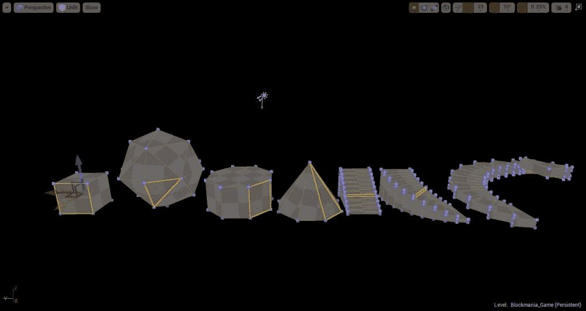

从左到右，你有：

+   **盒子刷**：这会创建一个立方体形状的刷子。你可以设置盒子的长度、宽度和高度。你还可以设置立方体是否为空心。如果是的话，你可以选择设置墙壁的厚度。

+   **球体刷子**：这将创建一个球形刷子。你可以设置细分的数量。增加细分的数量将使其更加光滑，更像一个真正的球体。然而，请记住增加细分的数量将增加表面的数量，因此需要更多的内存来渲染。考虑到这一点以及移动设备的技术限制，拥有一个低多边形几何和良好纹理的效果要比高多边形几何和糟糕纹理的效果更好。

+   **圆柱刷子**：这将创建一个圆柱形刷子。你可以设置其半径和高度。你还可以增加或减少边的数量。与球体刷子一样，增加边的数量将增加长度上的表面数量，使其更加光滑，但将需要更多的内存来渲染。

+   **圆锥刷子**：这将创建一个圆锥形刷子。你可以设置诸如高度、底部半径等属性。你还可以设置刷子中的表面数量。

+   **直线楼梯刷子**：这允许你创建直线楼梯。你不需要对楼梯进行建模、展开和导入到你的关卡中，你可以在引擎中创建它。你可以设置每个台阶的长度、宽度和高度、台阶数量以及第一个台阶下方的距离等属性。

+   **曲线楼梯刷子**：你还可以使用曲线楼梯刷子创建曲线楼梯。你可以设置诸如曲线的内半径、曲线的角度（曲线的角度意味着楼梯会弯曲多少。你可以将其设置为 0 到 360 度之间的任何值）、台阶数量以及第一个台阶下方的距离等属性。最后，你还可以设置是否希望楼梯顺时针或逆时针弯曲。

+   **螺旋楼梯刷子**：最后，我们有螺旋楼梯刷子。螺旋楼梯和曲线楼梯的区别在于螺旋楼梯可以重复包裹自身，而曲线楼梯不能。你可以设置诸如内半径、宽度、高度、每个台阶的厚度、台阶数量以及整个螺旋中的台阶数量等属性。最后，你还可以设置选项，比如是否希望楼梯的底部和/或表面是倾斜的还是阶梯状的，以及是否希望螺旋是顺时针还是逆时针的。

上述刷子类型可以通过**放置**/**BSP**下的**模式**面板使用添加或减去刷子类型来创建几何图形。当一个刷子被添加到你的关卡并用于创建几何图形时，添加刷子类型将在放置的任何地方添加几何图形。减去刷子类型将移除任何与添加几何图形重叠的几何图形。

除了这些设置，你还可以设置几何图形每个表面的属性，比如平移、旋转、翻转和缩放*U*和/或*V*坐标。当你将材质应用到它们时，你可以看到它们的效果。

最后，你还可以使用刷子创建体积，比如触发体积、阻挡体积、造成疼痛的体积等等。

## 编辑 BSP 刷子

假设你想使用 BSP 刷子创建几何图形，但你需要的形状不是七种默认形状之一。在这种情况下，你可以使用**几何编辑**模式创建自己的刷子。它位于**模式**面板的最右侧。单击它以切换到**几何编辑**模式。

在上述截图中，你可以看到当你切换到几何编辑模式时，几何图形中的所有顶点、面和边。你可能也注意到顶点的大小已经增加。在这种模式下，你可以选择整个刷子、一个面、一个顶点或几何图形的一个边。

在模式面板中，您可以看到几种操作，如**创建**，**删除**，**翻转**等。有些您可以执行，而其他则不行。您可以执行哪些操作取决于您选择了什么（例如顶点、边缘或面）。

# 使用 BSP 刷子堵住房间

现在我们将为游戏设计环境。制作四个房间并将它们堵住，以便玩家必须在一个房间解决谜题才能进入下一个房间。

## 第一个房间

第一个房间将相对简单。房间将是长方体的。由于这是玩家的起点，他/她将在这个房间里介绍机制，如移动、观察、拾取和放置物体。玩家只需拿起钥匙方块并将其放在基座上即可打开门。通过这个简单的任务，玩家还将了解每个房间的主要目标。

所以让我们从制作地板开始。我们将使用**Box Brush**。要添加**Box Brush**，只需在**BSP**下的**模式**面板中单击**Box**，然后将其拖放到**视口**上。在**详细信息**面板中，将刷子的尺寸设置为`2048 x 2048 x 64`。我们希望这个房间相对较小，因为谜题很简单，而且为了避免不必要的行走，因为玩家可能会感到无聊。

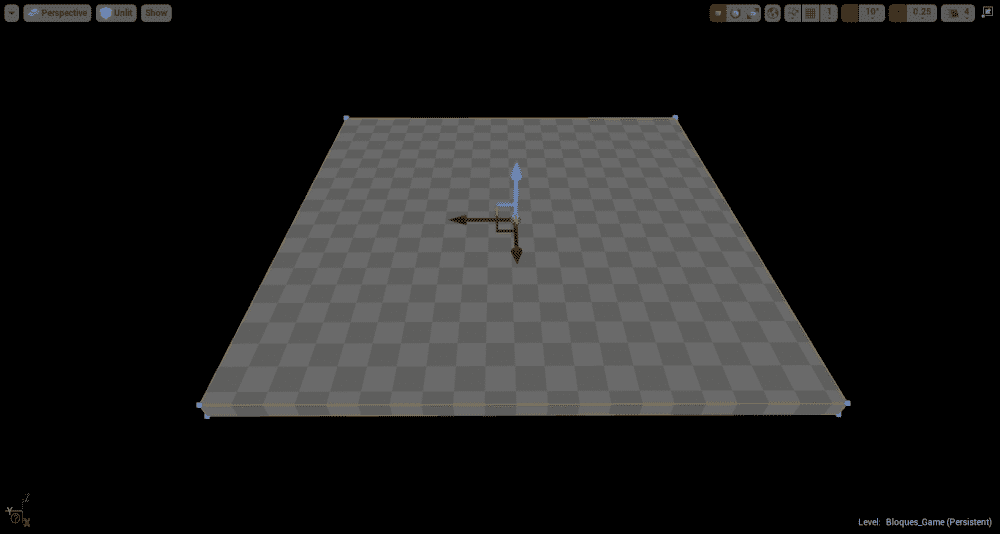

之后，让我们现在制作墙壁。同样，我们将使用一个 Box BSP 刷子来制作它们。将尺寸设置为`2048 x 64 x 1024`。制作完一面墙后，只需单击并按住*Alt*键并移动墙壁以创建一个副本，然后将其放在房间的另一侧。

### 注意

使用 BSP 刷子时，将视图模式切换为**未照明**。否则，您将无法看到表面，并且每次引入表面时都必须构建照明。

对于相邻侧的墙壁，让我们将尺寸设置为`64 x 2048 x 1024`。与其他墙壁一样，只需复制 BSP 刷子并将其移动到房间的另一侧。

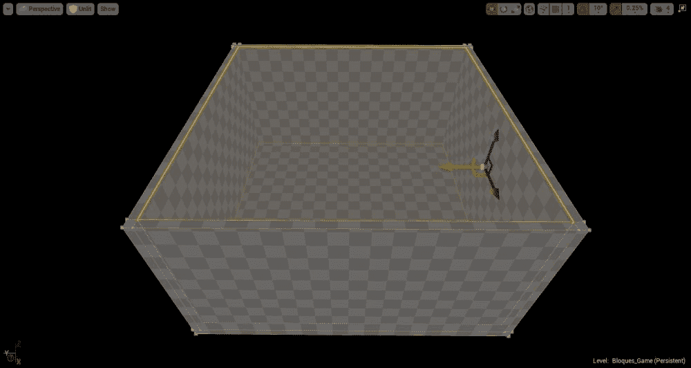

最后，对于天花板，只需复制地板并将其拖放到墙壁上方。

### 注意

为了防止光线渗透和其他与照明和渲染有关的问题，请确保任何刷子之间没有间隙。切换到**顶部**、**侧面**或**正面**视图，确保所有墙壁和天花板都完美对齐。

这个房间现在需要的是一个门的洞。否则，玩家将被困在第一个房间，无法前进到下一个房间。我们将借助减法 BSP 刷子来做到这一点。

要创建一个减法刷子，将**Box Brush**拖放到级别上，并在**详细信息**面板中将**刷子类型**设置为**减法**。将其尺寸设置为`64 x 256 x 256`。将这个减法刷子放在房间较短一侧的任何墙上。

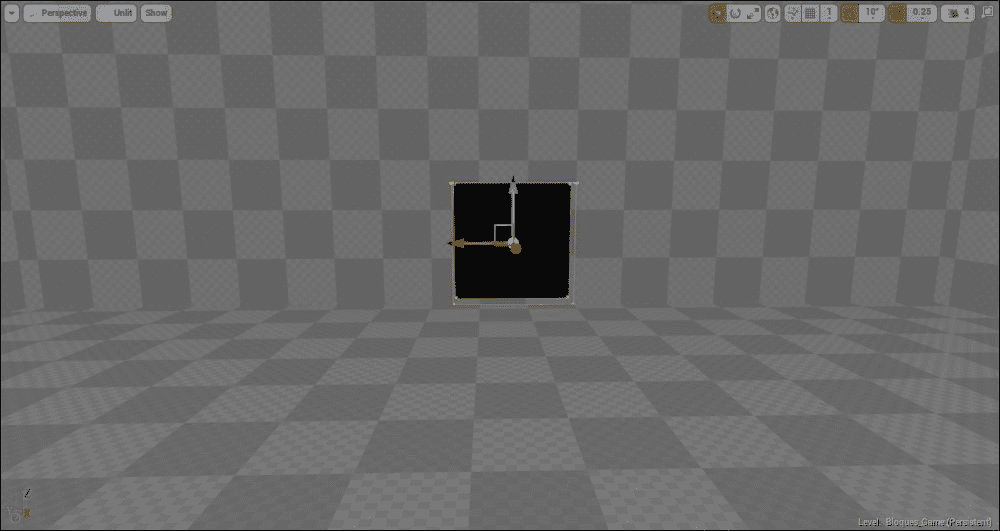

最后，让我们在门附近添加一个基座，玩家必须将钥匙方块放在上面才能打开门。

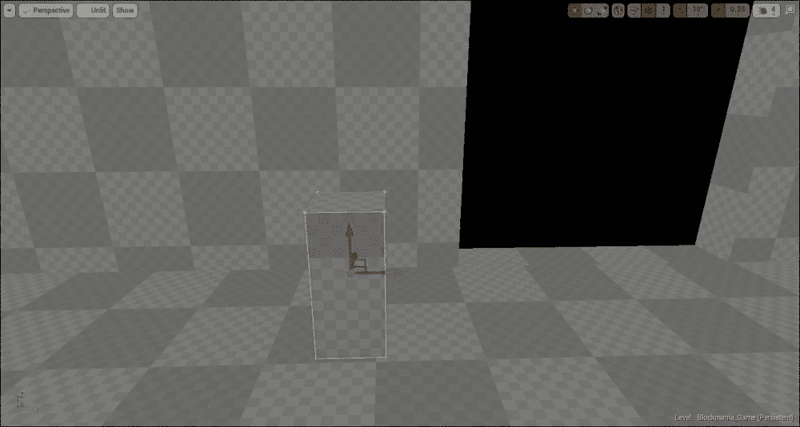

现在，我们已经堵住了第一个房间。让我们继续下一个。

## 第二个房间

在第二个房间，我们将为玩家增加一些挑战。进入第二个房间后，中间将有一扇大门。玩家可以通过触摸屏幕打开门。然而，一旦他/她抬起手指或离开门，门就会关闭。玩家右侧将有钥匙方块；然而，它被困住了。为了解锁钥匙方块，玩家必须走过门，取回另一个方块，将其放在门附近的平台上，解锁钥匙方块，将其放在基座上，然后前进到下一个房间。

在第一个房间中，我们分别创建了每个表面（墙壁、地板和天花板）。我们可以使用另一种方法来创建我们的第二个房间。为此，我们将利用刷的**中空**属性在详细面板中。

说到这里，选择**盒子刷**，并将其拖到场景中。接下来，将其尺寸设置为`2048 x 1544 x 1024`，并将其位置放在第一个房间旁边（记得将其放在有门的墙旁边）。将其位置设置如下截图所示：

一旦定位好，选择刷，转到**详细**面板并勾选**中空**。一旦勾选，将会出现一个新的设置，**墙壁厚度**。将其值设置为**128**（确保我们在前一个房间中用于门的减法刷重叠在两面墙上；否则，你将看不到门）。

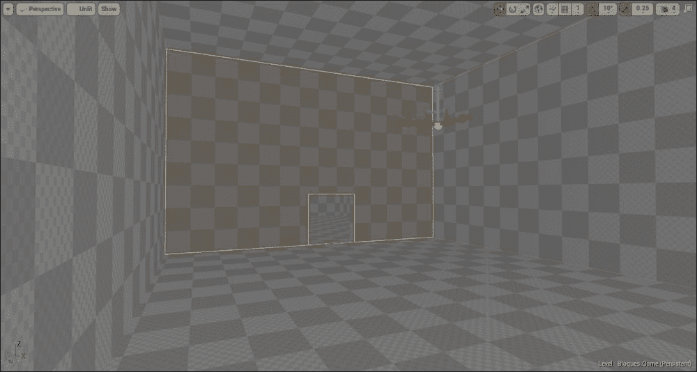

就是这样！我们已经完成了第二个房间的布局，而不必花费大量时间放置房间的每个部分，并确保它们正确对齐。剩下要放置的只有基座和通往第三个房间的门的洞。对于门，只需像我们为第一个房间所做的那样，创建一个尺寸为`64 x 256 x 256`的减法刷，然后将其放置在房间的另一侧。或者，复制第一个房间的减法刷，然后将其副本移动到房间的另一侧。

最后，为了完成一切，我们将在这个房间中添加两个基座。一个基座将放在房间中间附近，那里将会有一个大门。玩家必须将第一个钥匙立方体放在这个基座上才能解锁第二个钥匙立方体。

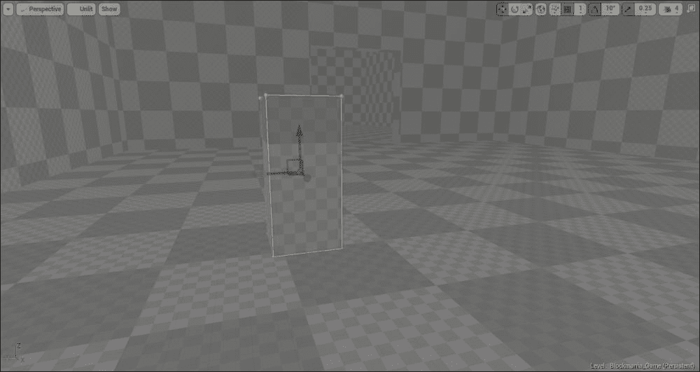

第二个基座放在房间的另一侧，玩家必须将钥匙立方体放置在那里，才能打开通往第三个房间的门。

通过这样，我们已经完成了第二个房间的布局。现在让我们继续到第三个房间，那里的事情开始变得有趣起来。

### 注意

记得要经常保存，这样在引擎突然崩溃或出现其他技术问题时，就不会丢失你的工作。要保存，只需点击*Ctrl* + *S*，或者点击**视口**工具栏上的**保存**按钮。

## 第三个房间

到目前为止，玩家应该已经了解了游戏中的基本机制和控制。现在让我们在第三个房间给他/她一个更大的挑战。进入第三个房间后，玩家和通往最终房间的门之间会有一个坑。为了能够穿过坑，玩家将需要一座桥。

为了画出桥梁，玩家必须引导一个由 AI 控制的物体到一个开关上。这个物体将沿着一条路径移动。然而，一些部分缺失。玩家可以通过放置在关卡中的开关来填补这些空隙。挑战在于确定要按下哪个开关以及何时按下它。这也依赖于正确的时机。当物体到达目的地后，桥梁将被画出，玩家可以穿过，拿到钥匙立方体，打开门，然后进入下一个关卡。

有两种构建坑的方法；第一种方法是将房间分成两部分。第一部分在坑的一侧，第二部分在另一侧。在制作好两部分后，构建坑，最后放置它们。然而，这是一种不好且耗时的构建房间和坑的方法。当渲染关卡时，我们还会有额外的表面，意味着更多的内存使用。此外，你还必须费力地将所有部分正确对齐，以确保没有空隙。

我们将使用的第二种方法是创建整个房间，并借助减法刷挖出坑。这样，我们就不必担心额外的面对齐房间的部分，而且我们还可以通过移动和/或编辑减法刷轻松设置坑的尺寸。

和往常一样，让我们从地板开始。现在，由于我们要挖出坑，地板的高度将比其他房间更高。选择**Box Brush**，将其尺寸设置为`4096 x 2048 x 512`。这将是主要区域，谜题将在这里进行。

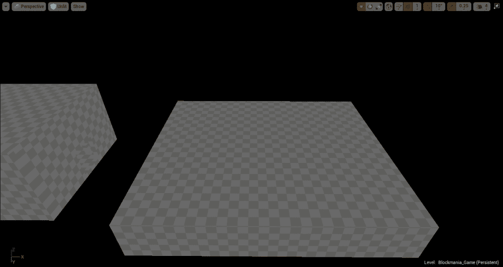

由于这个房间比前几个房间更高，我们需要一些楼梯，以便玩家可以到达第三个房间。首先，添加一个小的**Box Brush**，将其尺寸设置为`512 x 1544 x 64`，并将其放在前一个房间的门附近。

要添加楼梯，从**Modes**面板中将**Linear Stair Brush**拖到级别上。将楼梯的宽度设置为`1544`，步数设置为`23`。将楼梯放在我们之前放置的**Box Brush**的边缘；最后，将第三个房间的地板放在楼梯旁边。

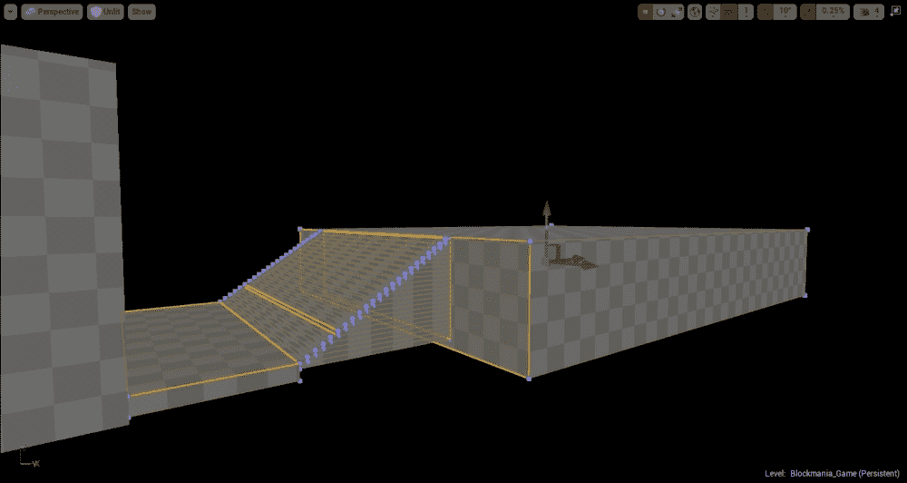

要添加坑，我们需要一个减法刷。选择减法刷的另一种方法是首先选择刷子的形状，这种情况下是**Box Brush**，然后在**Modes**面板中，在底部，您可以设置刷子类型为添加或减去。只需选择减去并将刷子拖到级别上。

我们必须确保坑足够宽，以便玩家无法跳过去，而且足够深，以便玩家一旦掉进去就无法跳出来。牢记这一点，将刷子的尺寸设置为`640 x 2304 x 512`。将坑放在房间的另一端。

现在我们要放置墙壁。我们将分几步向这个房间添加墙壁。首先，选择一个 Box 刷，将其尺寸设置为`4096 x 64 x 512`，并将其放在房间的较长一侧。复制并将第二面墙放在另一侧。

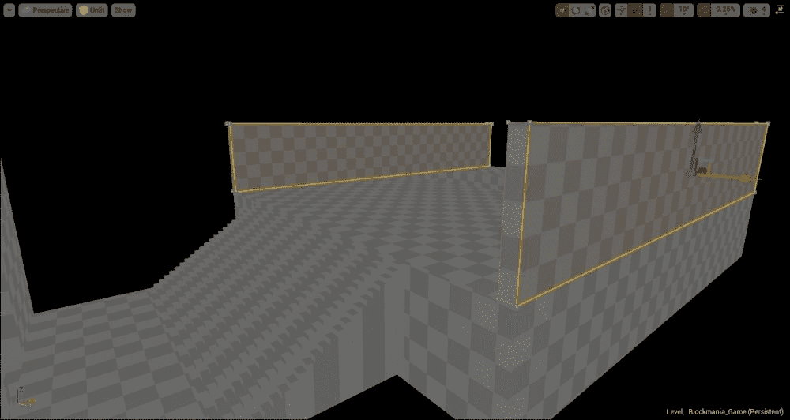

接下来，我们需要沿着通向第三个房间的楼梯和走廊放置一些墙壁。为此，将尺寸设置为`1202 x 64 x 1024`，并将其放在楼梯的两侧，确保它们都正确对齐，并且在刷子之间没有任何间隙。

在前面的截图中，您可能已经注意到走廊的墙壁和房间较长一侧的墙壁之间有一些间隙。让我们用尺寸为`64 x 188 x 512`的 Box 刷填充。在两侧各放一个，以填补间隙。

最后，我们要放置的墙在房间的远端，沿着较短的一侧。将**Box Brush**的尺寸设置为`64 x 2048 x 512`，并使用减法刷放置最终的墙壁。

走廊的天花板尺寸为`1202 x 1544 x 64`，房间的天花板尺寸为`4096 x 2056 x 64`。

现在我们已经阻挡了房间，我们需要在继续第四个和最后一个房间之前添加一些东西。首先，我们要放置一些面板，上面有开关，玩家可以按下以引导物体穿过坑。只需从前几个房间复制基座并将其放在这个房间中以创建面板。将它们放在任何较长的墙壁附近，并以玩家可以看到另一面墙的方式放置。

最后，在门附近放置一个基座。有了这个，我们已经完成了第三个房间的阻挡。现在，让我们阻挡第四个和最后一个房间。

## 第四个房间

我们只剩下一个房间要挡住了。在前三个房间中，我们有不同的谜题和目标。在第四个房间，我们将结合前一个房间的所有谜题。在这个房间里，玩家的目标与前一个房间相似，引导一个由 AI 控制的对象穿过门和坑等障碍物，朝着房间的另一侧前进。对象将沿着预定义的路径移动，并持续移动直到到达目标。如果撞到门或掉进坑，它将从起始位置重置。

由于我们将有坑，房间的高度将与以前的房间相似。而且，这将是最大的房间。记住这一点，我们将通过选择尺寸为`5120 x 2048 x 512`的**盒子刷**来制作地板。

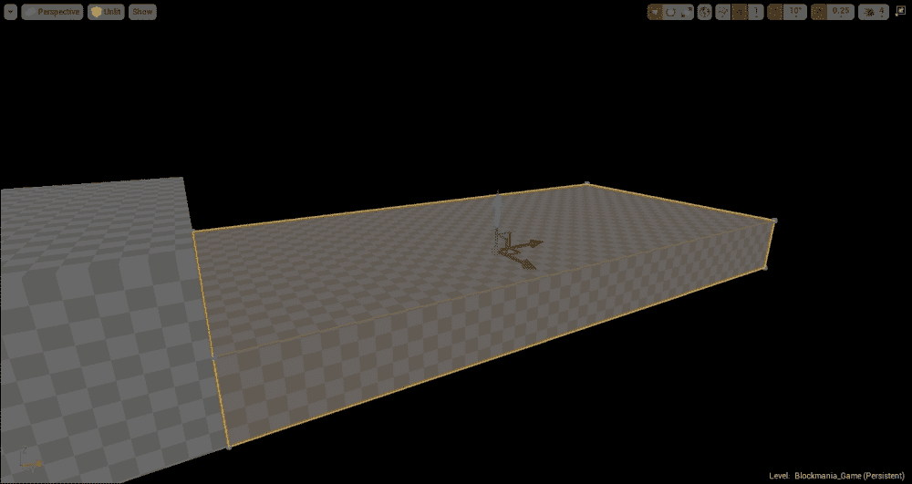

现在我们有了地板，我们要做一些坑。再次选择减法模式，创建一个尺寸为`728 x 1928 x 512`的**盒子刷**，并将其放在门附近。在这个房间里，我们将有三个坑，所以通过按住*Alt*键复制减法刷，创建两个副本并将它们放在地图上。

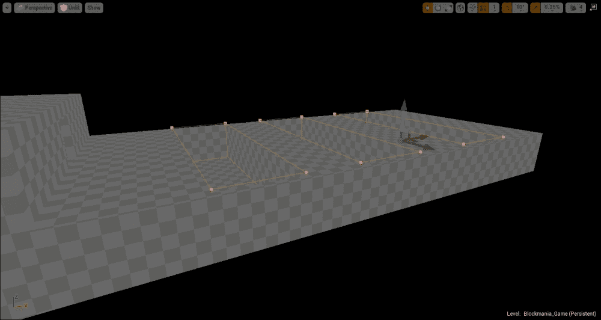

接下来是墙。对于较长的一侧，只需复制第三个房间的墙。在**详细信息**面板中，将*X*的值设置为`5120`，然后放置墙壁。复制并放置另一面墙。对于较短的一侧，您可以做同样的事情——复制并放置较短的一侧墙壁（带门的那一面）在房间的另一端。

接下来，复制，将刷子的*Z*值设置为`64`，并向上拖动以形成屋顶。

最后，我们将放置一些基座，开关将放置在那里。

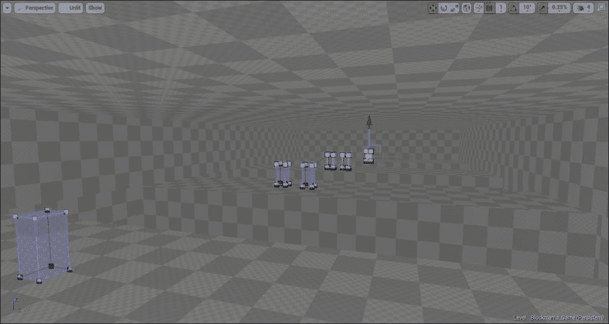

有了这些，我们现在已经完成了挡住我们最后一个房间！

现在我们已经挡住了我们的房间，让我们放置一些资产，创建材质，并将它们应用到我们的水平上。

# 内容浏览器

在上一章讨论编辑器用户界面时，我们简要谈到了**内容浏览器**。让我们再多谈一些。**内容浏览器**是项目中存储和显示所有资产的地方。这些资产包括**网格**、**纹理**、**材质**、**骨骼网格**、**蓝图**、**地图文件**、**音频文件**等等。

在上面的截图中，您可以看到不同的文件夹，每个文件夹都根据其中包含的内容命名。根据资产类型组织您的资产是一个良好的做法，也可以防止在项目有大量资产时后期混淆。

## 迁移和导入资产

在创建游戏时，您最需要的是资产，因为没有它们，您的游戏将只是一个空白地图。您会希望将为游戏创建的资产导入到项目中。为此，您需要先将它们导入到项目文件中，然后才能使用它们。目前，UE4 接受以下资产：

+   纹理文件：这些是 2D 图像，可以导入为`.jpg`、“。png”、“。bmp”和`.tga`文件。

+   静态网格/骨骼网格：静态网格是使用 3D 软件（如 Maya、Max、Blender 等）创建的 3D 对象。骨骼网格是可以进行动画的网格。您可以将它们导入为`.obj`文件，以及`.fbx`文件。

+   音频文件：您可以导入音频文件，如音乐、音效、对话等（单声道），作为`.wav`文件。您还可以导入具有多个通道（立体声）的音频文件。

+   脚本文件：您还可以将脚本文件作为`.lua`文件导入到 UE4 中。

+   IES 灯光配置文件：IES 灯光配置文件定义了弧线中的光强度。这通常用于使光线看起来更真实。这些文件也可以作为`.ies`文件导入到 UE4 中。

+   **立方体贴图**：立方体贴图以`.hdr`文件的形式导入。这些文件用于绘制环境，特别是如果您的游戏有室外场景。这些文件包含有关范围内颜色和亮度的信息。

+   **True Type 字体**：您还可以导入各种类型的字体用于您的游戏。字体通常用于 huds、UI 等，并且可以导入为`.ttf`文件。

### 导入资产

有两种方法可以将为您的游戏创建的资产导入到项目文件中。

### 注意

为了演示如何导入资产，Maya 中创建了一个简单的球体，并导出为 FBX 文件。

第一种方法是通过**Content Browser**：

1.  单击**Content Browser**顶部的**Import**按钮。

1.  单击后，将打开一个窗口，询问您要导入哪个资产。只需搜索您的资产所在位置，突出显示它，然后单击**打开**。

1.  单击**打开**后，将打开**导入选项**窗口，具体取决于您导入的资产类型。满意导入设置后，单击**导入**，资产将导入到您的项目文件中。

将资产导入到项目的第二种方法是简单地拖动要导入的资产并将其放入**Content Browser**中。要这样做，只需从存储位置单击并拖动资产，然后释放左鼠标按钮到**Content Browser**上。释放左鼠标按钮时，将打开**导入选项**窗口，与第一种方法中提到的窗口类似。再次，满意设置后，单击**导入**，资产将被导入。

### 迁移资产

有时，您可能需要来自不同项目文件的某些资产。在这种情况下，之前提到的导入资产的方法将不起作用，因为项目的内容保存在您的系统上，格式为`.uasset`文件或`.umap`文件。因此，UE4 将无法导入它们。因此，您必须执行**迁移资产**操作。

当我们创建项目时，我们选择**无起始内容**，因为我们不需要所有内容。这将占用不必要的空间。但是，我们确实需要一些资产，特别是墙和地板材料。为了演示这一点，已经设置了一个带有所有起始内容的新项目。

这是一个带有所有起始内容的项目。我们需要的是两种材料，即**M_Basic_Floor**和**M_Basic_Wall**。迁移这两种材料并按照以下步骤操作：

1.  突出显示**M_Basic_Floor**和**M_Basic_Wall**，右键单击以打开菜单。在菜单中，将光标悬停在**资产操作**上，并单击**迁移**。

1.  单击后，将打开一个窗口，告诉您以下资产将迁移到另一个项目。

1.  单击**确定**后，将打开另一个窗口，询问您要将资产移动到何处。您希望将它们存储在项目的`Content`文件夹中。打开时，找到您的项目文件夹（如果您记得的话，它在`我的文档`中），并将其存储在**Content**子文件夹中。

1.  单击后，您将收到提示说**资产已成功迁移**。

如果现在返回到 Blockmania 项目，您将看到**Content Browser**中的**Materials**子文件夹中显示了**M_Basic_Floor**和**M_Basic_Wall**。

# 放置演员

一旦您在**Content Browser**中拥有所有资产，下一步是将它们放置在游戏中。我们将使用**Content Browser**中的立方体网格来创建游戏中的对象，例如关键立方体，AI 控制的对象，门等。

首先，让我们制作门，在您将钥匙方块放在基座上时打开。只需从**内容浏览器**中拖动**TemplateCube_Rounded**静态网格，并将其放置在门应该放置的位置。使用缩放工具设置其尺寸，使其完美适合。

为了使事情更加简单和方便，您可以在**详细信息**面板中将方块的名称更改为`Door01`。对于其他的门，由于洞口的尺寸相同，您可以简单地复制这个角色并放置副本。最后，由于这些将会移动并且不会在游戏中保持静止，将其移动性类型设置为**可移动**。

### 提示

使用不同的视角来设置尺寸，并将门与洞口对齐。

接下来，让我们将玩家在房间中间遇到的大门放置在房间中间。再次从**内容浏览器**中取出**TemplateCube_Rounded**角色，并将其放置在第二个房间。设置其尺寸，以阻止角色移动到房间的另一侧。将其命名为`Room_Door01`。同样，在第四个房间中复制并放置它，但是你需要修改第四个房间的门的尺寸，因为第四个房间的尺寸与第二个房间有些不同。

接下来，我们必须放置玩家必须收集并放置以进入下一个房间或解锁其他钥匙方块的钥匙方块。我们将再次使用**TemplateCube_Rounded**。将其比例设置为`0.15`，并将其放置在我们的关卡中。以下是四个房间中钥匙方块的放置快速概述：

+   **第一个房间**：在第一个房间，我们只需要一个钥匙方块。您可以将它放在房间中间的任何地方。

+   **第二个房间**：在第二个房间，我们需要两个钥匙方块。将第一个方块放在大门的一侧，将第二个方块放在另一侧。第一个方块将被锁住，玩家必须将第二个方块放在基座上才能解锁它。

+   **第三个房间**：在第三个房间，我们只需要一个钥匙方块，AI 对象击中目标后将解锁它。因此，将它放在靠近通往第四个房间的门边坑的另一侧。

+   **第四个房间**：在第四个房间，将钥匙方块放在房间的另一侧。当 AI 对象击中目标时，它也将被解锁。

我们已经在游戏中放置了所有必要的资产。让我们在我们的关卡中添加一些装饰性的方块。由于装饰性资产将保持静止，不会在游戏中移动，您应该将它们的移动性设置为**静态**。只需在地图周围放置方块，以不同的图案排列它们。

# 材质

在 UE4 中，在将纹理应用到对象之前，您首先必须创建材质。材质是游戏中对象的渲染方式，它是包含许多属性的着色器集合，可以应用于对象并在游戏中渲染。更加技术性地说，当光源的光线照射到表面或对象上时，材质决定了光线如何与表面或对象相互作用（颜色、纹理、表面的粗糙或光滑程度、金属质感等）。

UE4 使用*基于物理的着色*。在虚幻引擎的早期版本中，材质具有一些任意的属性，比如漫反射强度、自定义光照漫反射等等。在 UE4 中，材质具有更多相关的属性，比如基础颜色、金属质感、粗糙度等等，使得这个过程更容易理解。

材质是在所谓的材质编辑器中创建的。因此，在我们开始创建自己的材质之前，让我们先谈谈它及其用户界面。

## 材质编辑器

材质编辑器是一个简单但非常强大的工具，您可以用它来为您的对象创建材质。例如，您可以将纹理文件应用于材质的漫反射通道，然后在您的资产上使用它。对于我们的游戏，我们将从头开始创建自己的材质。要访问材质编辑器，您首先需要创建一个新材质，或者双击现有材质。要创建新材质，请单击**内容浏览器**左上角的**添加新**按钮，然后选择**材质**，它将位于**创建基本资产**部分下方。完成后，您将看到创建了一个新材质。双击它以打开材质编辑器。打开后，您应该看到这个窗口：

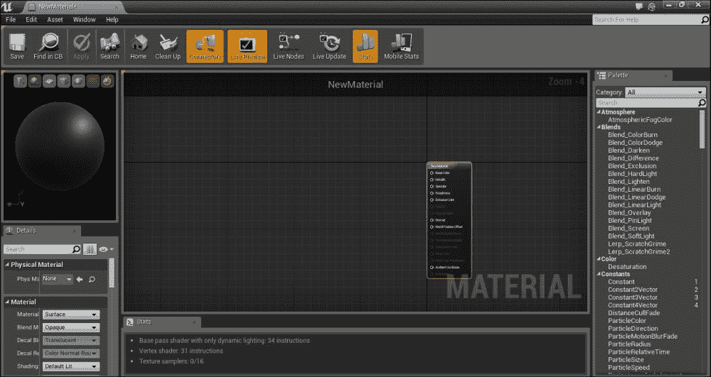

让我们首先看一下编辑器本身及其用户界面。与编辑器一样，我们将材质编辑器用户界面分成几个部分，并逐个进行介绍。

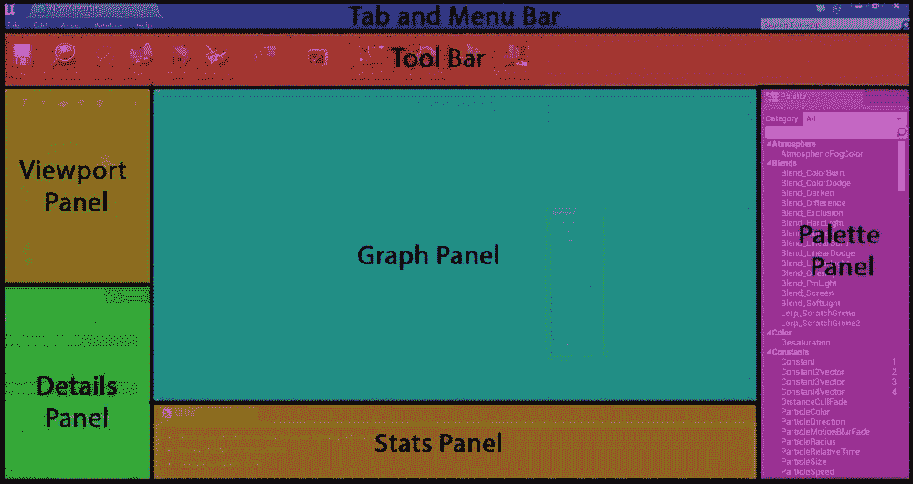

### 标签和菜单栏

在顶部，我们有标签和菜单栏。标签栏类似于编辑器的标签栏。

在标签栏下面，我们有菜单栏。与编辑器中的菜单栏一样，它提供了所有的常规命令和操作。它们的描述如下：

+   **文件**：单击此将打开**文件**菜单。从这里，您可以执行诸如保存您创建的材质、从**内容浏览器**打开资产等操作。

+   **编辑**：这将打开**编辑**菜单。在这里，您可以撤消或重做您可能执行的任何操作。您还可以从这里访问编辑器和项目设置。

+   **资产**：从**资产**菜单中，您可以在**内容浏览器**中找到您正在创建的材质，并打开当前材质的引用查看器窗口。

+   **窗口**：在此菜单中，您可以选择在材质编辑器窗口中要显示的面板，搜索**图形**面板中的特定节点，访问插件窗口等。

+   **帮助**：最后，如果您想了解更多关于材质编辑器或需要找到问题的解决方案，您可以从这里访问维基页面和官方 Epic 文档。

### 工具栏

再次与编辑器中的工具栏进行比较，这里的工具栏显示了您在制作材质时可能执行的所有最常用的操作。

+   **保存**：从左边开始，由软盘表示的是**保存**按钮。这是保存您对材质所做的任何修改。

+   **在 CB 中查找**：**在 CB 中查找**（或内容浏览器），由放大镜表示，可以在**内容浏览器**中定位并突出显示您在材质编辑器中打开的当前材质。

+   **应用**：接下来是**应用**按钮。如果您已经将当前材质应用于游戏中的对象，一旦对其进行任何修改，单击**应用**将更新当前场景中的材质。

+   **搜索**：需要找到节点或连接吗？您可以通过单击**搜索**并输入您想要查找的内容来进行。当您单击它时，**搜索**面板将在材质编辑器底部打开。只需输入您想要查找的内容，它将在面板中给出结果。

+   **主页**：**主页**按钮将图形面板重新聚焦到材质输入描述（在材质编辑器中首先看到的节点，带有所有这些输入）。当您创建非常复杂的材质时，这将非常方便，因为您将有许多节点彼此连接，并可能会忽略材质描述。

+   **清理**：**清理**按钮会删除未连接到材质输入的任何节点。这非常方便，因为即使未连接的节点也会使材质在内存使用方面变得不必要地沉重。

+   **连接器**：默认情况下，此选项已打开。关闭时，任何未使用的输入或输出引脚（未连接到任何东西的引脚）将被隐藏。这是保持工作区清洁和有组织的好方法，因为它会清除视图中的混乱。

+   **实时预览**：这也是默认打开的。打开时，您对材质所做的任何修改都将在**视口**面板中实时更新。

+   **实时节点**：启用时，它会实时更新每个节点中的材质。

+   **实时更新**：当您打开此选项时，它会实时编译着色器和所有节点和表达式，每次您更改、添加、删除节点或更改参数值时都会这样做。

+   **统计**：打开时，您可以在材质编辑器底部看到您创建的材质的统计信息。这可以让您了解您的材质有多重。

+   **移动设备统计**：这类似于**统计**，但会为移动设备提供材质统计和任何错误信息。

### 调色板面板

调色板面板包含可以在材质编辑器中使用的所有节点。

所有的函数、表达式等都按类别列在这里。您可以在顶部选择类别，并使用它来过滤您想要显示的节点类型。

如果您想要找到特定的节点，您可以在下方的**类别**栏下搜索它。

### 统计面板

如前所述，**统计**面板显示了您创建的材质的所有统计信息。

如果您在工具栏中打开了**移动设备统计**，您还将在此处看到移动设备的统计信息。这基本上向您显示了您的材质中有多少指令和着色器。这将让您了解您的材质有多大和多重。

### 详细面板

**详细**面板显示了材质的一般属性，例如**材质域**，这意味着您想要创建什么类型的材质。

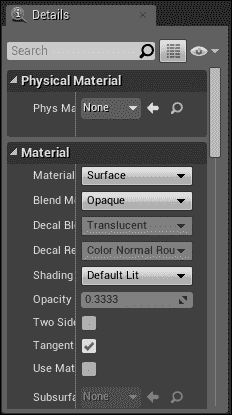

普通材质，例如应用于角色的材质，是**表面**材质。如果您希望您的材质是**贴花**（我们将在下一章中讨论），您可以切换到**贴花**等。

您还可以在此面板中设置所选节点的属性。

### 视口面板

**视口**面板是您可以预览正在创建的材质的地方。如果启用了**实时预览**选项，您所做的任何修改都将实时更新并在此处预览。

默认情况下，形状原语是一个球体。您可以使用视口面板顶部的按钮切换到圆柱体、平面、立方体或材质编辑器中的特定网格。您还可以在这里切换网格的显示/隐藏，以及切换实时预览的显示/隐藏。

### 图形面板

材质编辑器用户界面的最后一个元素是图形面板。这是您创建材质的地方。

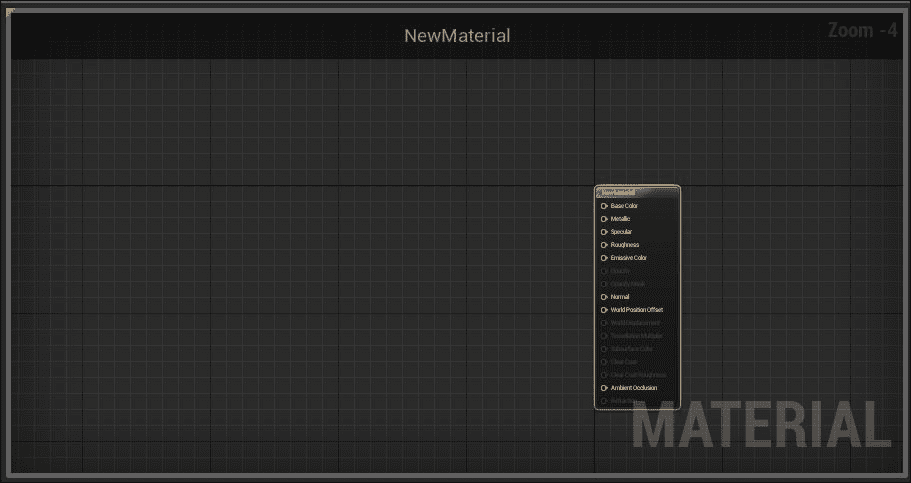

在我们继续之前，有一些术语和表达式您应该知道，因为我们在本书中会经常使用它们。首先，我们有一个叫做节点的东西。节点是您连接到材质或蓝图脚本的任何东西。它可以是变量、表达式等。在上面的截图中，这里的节点将是您看到的长面板。

现在，每个节点都有输入、输出或两者。输入是节点接受的任何值或表达式，位于节点的左侧作为白色引脚。回到上面的截图，该节点接受相当多的输入，每个输入对应材质的不同属性。

输出引脚是节点返回的内容（值、表达式等），也用白色圆形引脚表示。它们位于节点的右侧。当连接到两个或更多节点时，你将第一个节点的输出引脚连接到第二个节点的输入引脚，依此类推，以创建一系列节点。

在前面的截图中，你可以看到一个带有许多输入的长节点。这是材料输入。每个输入对材料有不同的影响。你可能也注意到一些输入是白色的，而其他的是变暗的。变暗的节点是当前禁用的，不能使用。哪个输入被启用，哪个被禁用取决于材料的**混合模式**，可以在**详细信息**面板中找到并更改。例如，看一下截图，**不透明度**节点当前被禁用。这是因为材料的**混合模式**设置为**不透明**，所以自然地，你不能设置材料的不透明度。要启用它，你必须将**混合模式**更改为**半透明**。

让我们来看一下最常用的材料输入：

+   **基础颜色**：这与材料的颜色有关。底色将是什么颜色。

+   **金属度**：这涉及到你希望你的材料中有多少金属光泽。

+   **高光**：如果你想让你的材料光滑而有光泽，这就是你需要的节点。这涉及到材料反射多少光。

+   **粗糙度**：与**高光**相反，如果你希望材料不光滑或崎岖，这个输入就是你需要的。

+   **自发光颜色**：如果你希望你的资产发光，你可以在这里设置它，输入自发光颜色。

+   **不透明度**：这涉及到你希望你的物体有多少半透明。

还有其他输入，但这些是你现在应该知道的主要输入。

## 应用材料

有两种方法可以将材料应用到物体上。第一种方法是简单直接的。让我们使用第一种方法来应用地板材料。我们将应用**M_Basic_Floor**。要应用材料：

1.  从内容浏览器中选择`M_Basic_Floor`。

1.  将其拖放到地板表面上。

1.  释放鼠标左键，材料将被应用到地板上。

我们将使用第二种方法来为墙壁涂抹材料。我们将把`M_Basic_Wall`应用到我们的墙壁上。要做到这一点，请按照以下步骤进行：

1.  选择任何一个墙面。

1.  在**详细信息**面板中，在**表面材料**部分，你会看到一个名为**Element 0**的东西。它旁边会有一个菜单按钮，上面写着**None**。

1.  打开菜单。你会看到内容浏览器中列出的所有材料。只需从列表中选择**M_Basic_Wall**，材料就会应用到墙上。

使用任何两种方法，将材料应用到游戏中的所有墙壁和地板上。

## 创建材料

现在我们已经了解了材料编辑器的用户界面，并看到了如何将它们应用到物体上，让我们继续创建我们关卡的材料。

### 基座

首先，我们将为玩家必须放置方块的基座创建一个材料。我们将创建一个相当简单的材料。我们将创建的基座将是黄色的，并且会有点闪亮。首先，在**内容浏览器**中创建一个新的材料，命名为`Pedestal_Material1`。然后双击打开材料编辑器。

我们要做的第一件事是向**Base Color**输入添加一些内容。我们需要创建的是一个称为**Constant3Vector**节点的东西。要创建它，只需从**Palette**面板拖动节点并放置在**Graph**面板中。创建**Constant3Vector**节点的另一种更快的方法是按住*3*并在**Graph**面板的任何位置单击左键。节点将在您单击的位置形成。形成后，将其连接到**Base Color**输入。您可以将颜色设置为黄色。要做到这一点，只需选择**Constant3Vector**节点，在**Details**面板中，您将看到一个名为**Constant**的属性，旁边有一个黑色条。单击黑色条，将打开**ColorPicker**窗口。将颜色设置为黄色，然后单击**确定**。现在将其连接到**Base Color**输入。您将看到**Viewport**面板已更新为您所做的更改。

现在我们有了基本颜色，我们要添加光泽。为此，我们将创建一个**Constant**节点。同样，您可以从调色板面板拖动它，或者按住*1*并单击图形面板的任何位置。在详细面板中，将其值设置为`0.5`，然后将其连接到**Specular**输入。您的图形编辑器将看起来像这样：

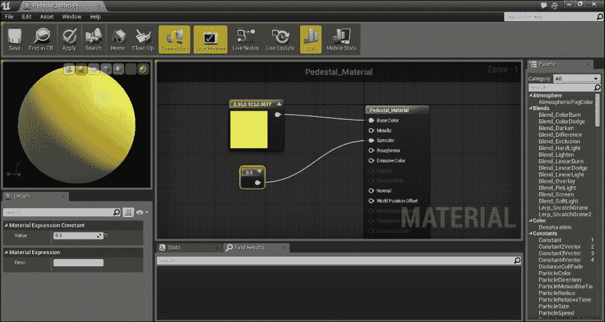

现在，您已经创建了材质，请单击**保存**，然后将其应用到基座上。

对于按钮所在的基座，通过右键单击**Pedestal_Material1**创建一个副本，选择**Duplicate**，将其重命名为**Pedestal_Material2**，在材质编辑器中，只需将基本颜色更改为蓝色，保存并应用。

### 门

对于门，我们要做的基本上与我们为基座创建材质时所做的事情差不多。这里唯一的区别是我们会让门稍微透明一些，并使材质更玻璃化。说到这里，为门创建一个材质，并将其命名为**Door_Material**。

在材质编辑器中，您需要做的第一件事是将材质的混合模式设置为**半透明**。之后，创建一个**Constant3Vector**，选择浅蓝色，并将其连接到**Base Color**输入。

现在，创建三个**Constant**节点。将第一个节点的值设置为`1`，并将其连接到**Specular**输入。将**第二**节点的值设置为`0.5`，并将其连接到**Opacity**输入。我们的玻璃材质现在是半透明的。然而，还有一些东西，玻璃的一个非常基本的属性——折射！折射输入位于输入面板的底部。将第三个**Constant**节点的值设置为`0.35`，并将其连接到**Refraction**输入。

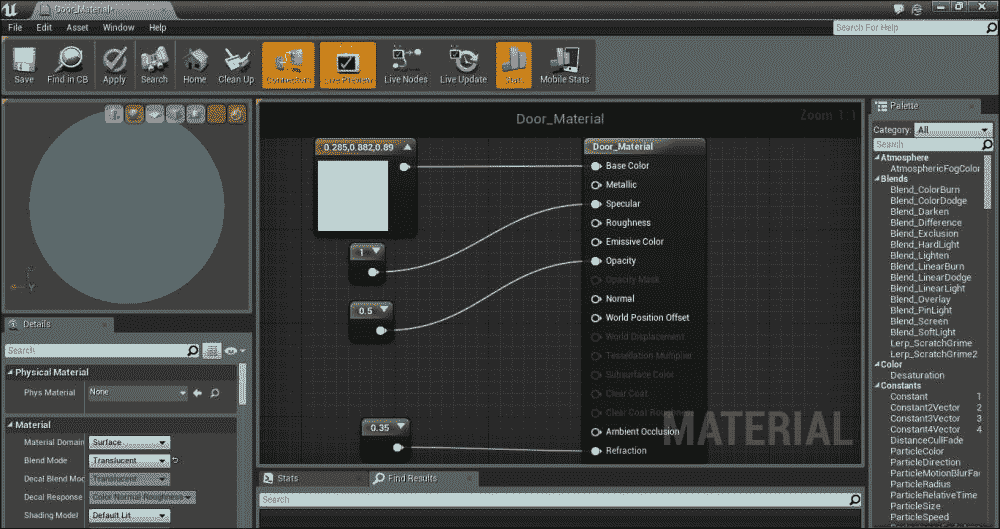

我们为门创建了一个基本的玻璃材质。保存并将其应用到门上。

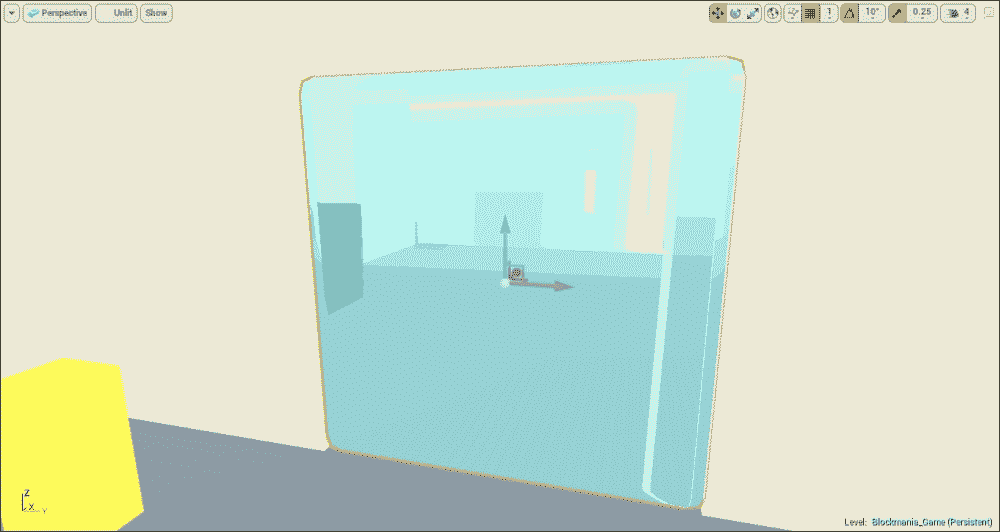

### 关键立方体

让我们让一组材质变得有趣一些。我们将把它变成红色。此外，我们将使其闪烁以吸引玩家的注意。创建一个材质，并命名为**KeyCube_Material**。

首先，创建一个**Constant3Vector**节点，将颜色设置为红色，并将其连接到**Base Color**输入。这将是我们的基本颜色。对于发光效果，我们将使用**线性插值**函数。**线性插值**接受三个输入。它混合前两个输入（**A**和**B**），第三个输入用作掩码（Alpha）。对于输入**A**，创建您为基本颜色创建的**Constant3Vector**节点的副本并连接。对于输入**B**，创建另一个**Constant3Vector**节点，将颜色设置为较浅的红色并连接。

我们已经有了输入。现在我们需要为**Alpha**输入创建一些东西。由于关键方块将会定期闪烁，我们可以使用**Sine**或**Cosine**函数。您可以在调色板面板中找到其中任何一个。将它放在图形面板中，并连接到**Alpha**输入。现在，为了让**Sine**或**Cosine**函数真正起作用，它需要一些输入数据。我们将创建一个**时间输入数据**节点。只需在调色板面板中输入`Time`，将节点放在图形面板中，并将其连接到**Sine**或**Cosine**节点。最后，在完成所有这些之后，将**线性插值**连接到**发光**输入。

现在，我们的主要关键方块有了一个闪烁的材质。将它应用到所有的关键方块上。

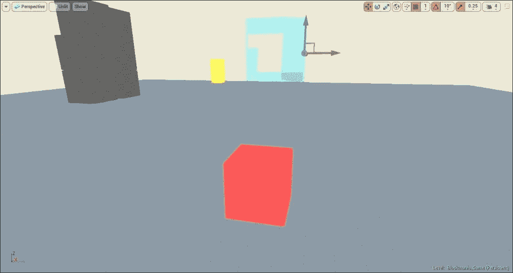

### 装饰性资产

对于我们的装饰性资产，我们将创建一个可以周期性改变颜色的材质。首先，创建一个材质并命名为**DecorativeAsset_Material**。对于变化效果，我们将使用**Rotator**节点。如果您有合适的纹理，并希望它旋转，可以使用这个节点。它获取**纹理**的*UV*坐标和**时间**函数，并用它来旋转纹理。我们将用它来改变我们的材质颜色。像往常一样，创建一个**Constant3Vector**，并将其颜色设置为浅蓝色。

现在，我们不是直接将它连接到基本颜色输入，而是将它连接到**Rotator**节点。在调色板面板中找到**Rotator**节点，并将其放在图形面板中。**Rotator**节点有两个输入，**坐标**和**时间**。将**Constant3Vector**连接到**坐标**输入。创建一个**Sine**函数，将时间输入数据连接到它，并将其连接到**时间**输入。最后，将**Rotator**节点连接到**基本颜色**输入。这就是我们需要做的全部。您现在会注意到材质会周期性地改变颜色。您可以通过在**Rotator**节点的“详细信息”面板中更改**速度**设置来设置它改变颜色的速度。

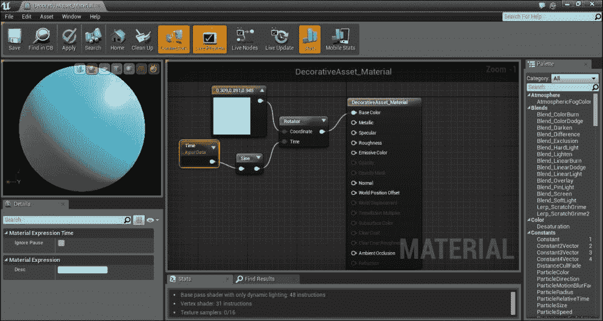

将这个材质应用到游戏中的所有装饰性资产上。有了这个，我们已经为我们的环境贴上了纹理。

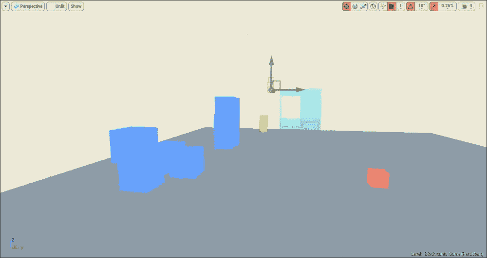

如果您测试您的关卡，您会注意到您什么都看不见。这是因为我们的关卡没有任何灯光，因此没有任何东西被渲染，您所看到的只是一个黑屏。现在让我们继续进行照明。

# 照明

照明是任何游戏中非常重要的元素，因为没有它，您无法看到周围的世界。UE4 提供了四种类型的照明，即：定向光、点光、聚光灯和天空光。让我们逐个讨论它们，并讨论一些您可以在“详细信息”面板中设置的属性。

+   **定向光**：当您有一个室外场景并希望模拟来自太阳的光时，定向光是理想的光源类型，因为定向光模拟来自无限远处的光。定向光形成的阴影是平行的。

您可以在“详细信息”面板中设置诸如强度、颜色、是否影响世界、间接光照的强度等内容。

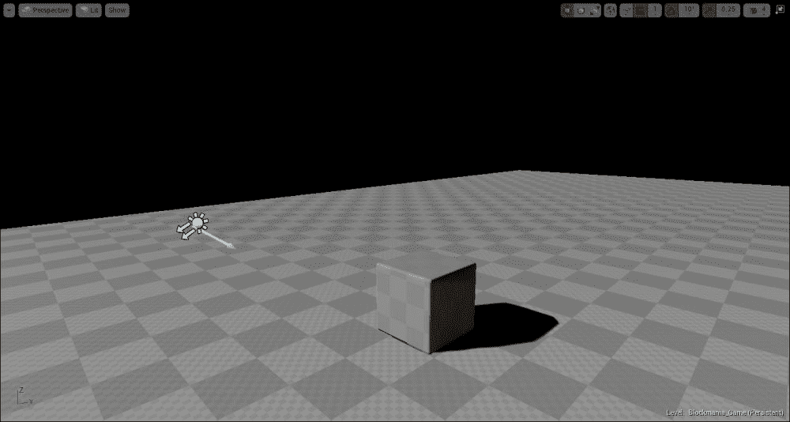

上述截图显示了定向光以及它在关卡中的工作原理。它的图标由一个太阳和两个平行箭头组成。另一个单独的箭头显示了光线的方向。您可以使用旋转工具来设置方向。

+   **点光源**：点光源模拟来自单一光源的光，均匀地在所有方向上发光，就像一个灯泡。这是我们在游戏中将要使用的主要光源。在室内场景中，这将是您的主要照明角色。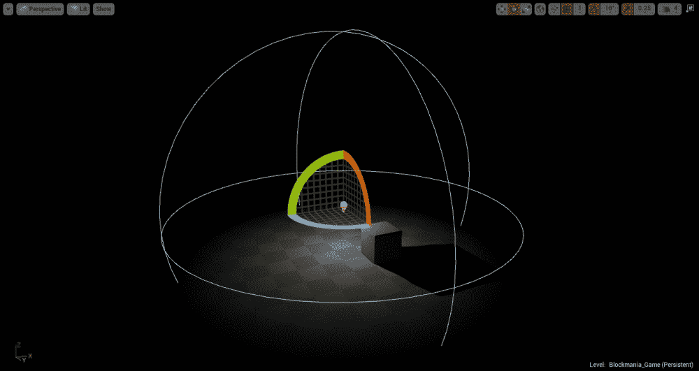

如你所见，点光源角色由一个灯泡表示。你看到的球体周围是*衰减半径*。它由一个球形线框表示，并显示了光源直接影响的范围。你可以设置强度、颜色、衰减半径、光源是否影响世界、间接光照强度等。如果你不想要单一点光源，你可以根据需要设置光源的半径或长度。

+   **聚光灯**：聚光灯与点光源类似，它们都源自单一光源。然而，两者之间的区别在于，点光源在所有方向均匀发光，而聚光灯在一个方向上，以锥形发光。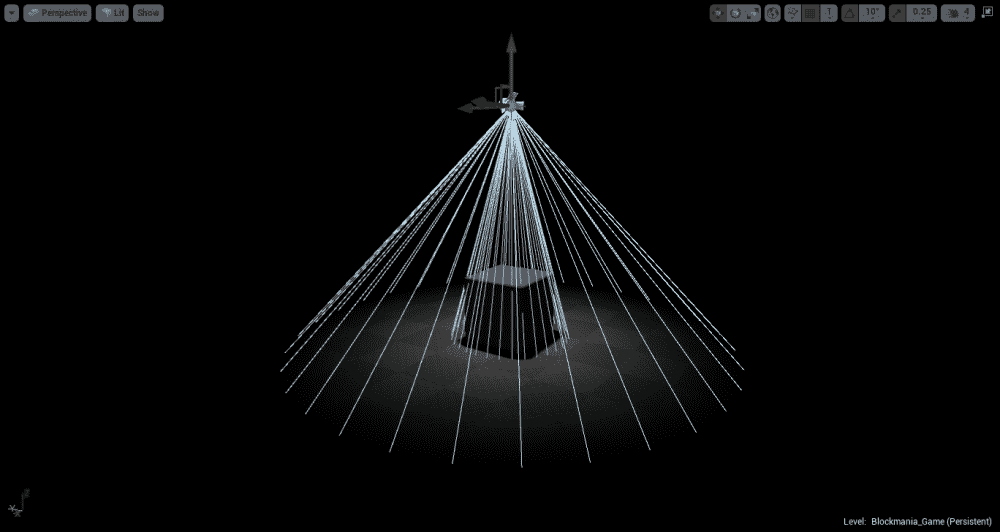

你可能已经注意到了两个锥体。内部锥体是光线最亮的地方。当你向外径移动时，朝向外部锥体，光线变得不那么明亮，发生衰减。你可以设置这两个锥体的半径，以及光源的强度、颜色、长度和半径等。

+   **天空光**：最后，我们有天空光。天空光模拟了大气和远处物体反射的光线。

天空光在效果上相当微妙。考虑到这一点，在前面的截图中，左边是有天空光的场景，右边是没有天空光的场景。当这两者并列时，你可以看到天空光的效果。

天空光的设置与其他类型的灯光有些不同。首先，你可以设置所谓的**天空距离阈值**。这是天空光角色距离任何角色被视为天空的距离。你还可以使用**下半球为黑色**选项，当切换时，将忽略场景下半球的光线。你还可以使用自定义立方体贴图来获得自己的天空光类型。除此之外，你还可以设置光的颜色、强度等。

## 移动性

所有类型的灯光都有三种移动性。在游戏运行时，你可以修改某些光源的设置。移动性部分允许你做到这一点。

移动性选项位于光源角色的详细面板的**变换**部分。

总共有三种类型可供选择：

+   **静态**：当你将光设置为**静态**时，制作游戏时设置的属性保持不变，无法通过触发器或游戏过程中进行修改。一旦光照建立完成，由该光照烘焙的光信息和阴影保持静态，无法更改。对于在游戏过程中不移动或切换开/关的灯光来说，这是最合适的移动类型，因为它需要最少的内存来渲染。

+   **固定**：当光源角色的移动性设置为**固定**时，只有强度、颜色等属性可以在触发器或游戏过程中进行修改。然而，光源在这种设置下无法移动或平移。这需要比静态光更多的内存，可以用于闪烁灯等场景。

+   **可移动**：在此设置下，光照 actor 完全是动态的，除了改变强度和颜色之外，在游戏过程中它还可以移动、旋转和缩放。然而，请记住，这种类型的光需要最多的内存来渲染，因为每次在游戏中改变其属性时，它都必须实时重新计算阴影和照明信息。因此，除非在您的游戏中真正需要，否则在开发移动设备游戏时避免使用可移动光。最好使用静态光以获得最佳性能。当您将移动性切换为**可移动**时，游戏中的光照 actor 的图标会改变。您会看到光照 actor 下面有四个箭头。

左边是移动性设置为**可移动**的光照 actor，右边是移动性设置为**静态**或**固定**的光照 actor。

## 照亮环境

现在您已经熟悉了光照 actor，它们的类型和移动类型，让我们在我们的关卡上放置一些灯光。

目前，我们只会在我们的关卡中放置静态点光源。我们稍后会介绍固定和可移动的灯光。说到这里，在关卡中放置一个点光源。将“强度”设置为`20000`，“衰减半径”设置为`5000`。还要将移动性设置为“静态”。创建多个点光源的副本并放置它们，记住应该为玩家提供足够的照明。您还应该切换到*照明视图模式*，以便您可以确定房间中是否有足够的照明。最后，构建关卡。您可以设置照明构建的质量。但请记住，您想要的光照质量越高，构建所需的时间就越长，但是在这些更高的设置下，照明将更接近反映生产质量。

现在您可以看到所有的材质和纹理都被正确渲染了。

# 总结

在本章中，我们讨论了项目，它们是什么，UE4 提供了哪些类型的项目，以及如何创建和加载项目。接下来，我们介绍了 BSP 刷子是什么，BSP 刷子的默认类型以及我们如何编辑它们以创建自己的几何图形。我们回顾了内容浏览器，如何导入和迁移资产，以及如何从内容浏览器将 actor 放置到关卡中。我们介绍了材质的概念，材质编辑器，其用户界面以及如何创建材质。最后，我们通过讨论照明，不同类型的灯光以及一些重要设置来结束了本章。

利用这些知识，我们创建了我们的环境，从而迈出了构建游戏的第一步。在下一章中，我们将讨论体积的概念，它们是什么，不同类型的体积以及我们如何在游戏中应用它们。因此，让我们毫不犹豫地继续下一章。
