# 第四章：使用演员、类和体积

我们已经设置好了环境，所有必要的演员和物体都已经放置好了。还有其他同样重要，甚至更重要的对象（或演员），没有它们游戏就不完整。这些是具有特殊属性的视觉和基本类和体积的演员。有些对游戏至关重要，而有些则添加了特殊功能。在本章中，我们将看一些这些体积和类以及它们如何影响游戏。我们将涵盖以下主题：

+   基本类

+   视觉效果

+   体积

+   所有类

# 基本类

我们将从基本类的介绍开始。这些可以在“模式”面板的“基本”部分中找到。

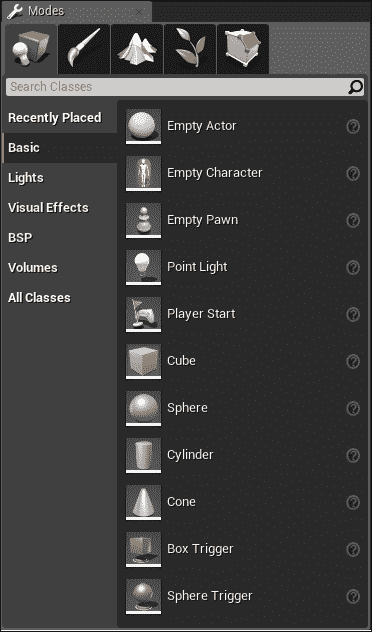

这包含了几乎所有游戏都必不可少的最基本的类。让我们来看看它们：

+   空演员：演员是放置在游戏世界中的任何对象。所有的物体、灯光、摄像机、体积等都是演员。空演员是一个空的实体，你可以放置在你的关卡中。它没有任何固有属性。

+   空角色：一个空角色没有网格或任何动画，只有一个碰撞胶囊。

+   空幻影：幻影是一个可以被玩家或 AI 控制的演员。游戏中的角色、所有的敌人、盟友和 NPC 都是幻影。

+   玩家起始：顾名思义，玩家起始是玩游戏时玩家生成的地方。如果关卡中没有玩家起始演员，玩家将生成在世界的原点（`0`,`0`,`0`）处。

+   点光源：如前一章所述，点光源是最基本和最广泛使用的光源。你也可以从这里添加点光源演员。

+   立方体：这会在游戏中添加一个立方体原语（静态网格）。

+   球体：这会在游戏中添加一个球体原语。

+   圆柱体：这会在游戏中添加一个圆柱体原语。

+   圆锥体：这会在游戏中添加一个圆锥体原语。

+   盒触发器/球体触发器：下面的两个演员被合并在一起，因为它们具有相同的作用；唯一的区别是它们的形状。触发器简单来说就是为游戏添加交互性。你可以为触发器添加一个事件（例如，如果玩家触碰它，按下特定键等），当满足条件时，执行开发人员设置的特定动作。例如，你可以有一个触发器，当玩家触碰时，打开一个灯光等。UE4 提供了两种默认形状：盒和球体。你也可以创建自定义形状的触发器，但稍后再说。

## 将基本类演员添加到游戏中

现在你已经熟悉了基本类，让我们继续在我们的关卡中添加一些。

### 放置玩家起始演员

我们要放置的第一件事是玩家起始演员。它的位置至关重要，应该事先决定好。在我们的游戏中，我们希望玩家从第一个房间开始。记住这一点，将玩家起始演员拖放到第一个房间，远离门口。

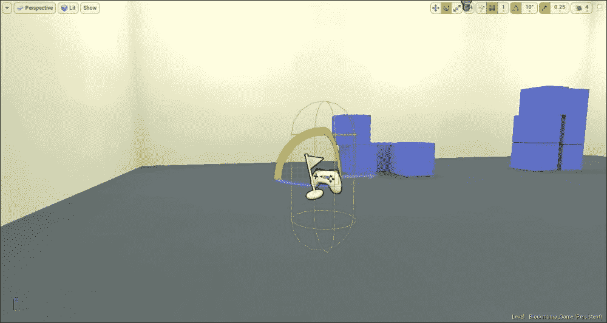

演员由旁边有旗帜的游戏手柄表示。你可以看到它周围有一个胶囊形状的体积。这个胶囊是为了让你了解角色的大小以及游戏开始时的放置位置。所以确保胶囊不要与任何其他演员或表面重叠，否则会将图标更改为标有“尺寸不好”的标志。你可以使用“缩放”工具调整这个胶囊的大小，使其与角色匹配。

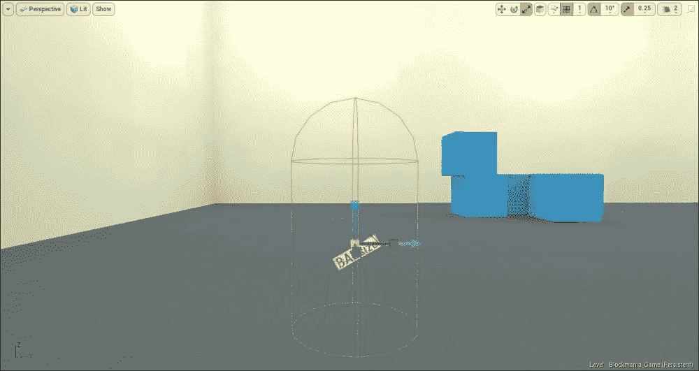

您可能还注意到了一个蓝色箭头和图标。箭头指向的方向是游戏开始时角色面对的方向（记住，*W*是平移工具，*E*是旋转工具，*R*是缩放工具）。您可以通过旋转操作改变这个方向。如果您点击“播放”按钮，角色将在演员放置的位置生成，并面向箭头指向的方向。

### 添加触发器

接下来，我们将添加触发器。我们将只使用框触发器来保持简单。要放置框触发器，只需从“模式”面板拖动它并放置在关卡上。我们将在下一章中介绍触发器的用途。现在，您只需将触发器放置在以下部分提到的位置即可。

始终为您的演员命名，无论是触发器、灯光、角色等等。这不仅被认为是良好的做法，而且会使您的项目更易阅读，保持一切井然有序，更易于跟踪。

#### 房间 1

在第一个房间中，将第一个触发器放置在钥匙立方体附近。此触发器将用于与钥匙立方体交互。此触发器（或任何触发器）的放置和尺寸都很重要，因为它们决定了玩家可以与钥匙立方体交互的距离。例如，如果触发器太大，玩家将能够从远处拾取钥匙立方体，这不是我们想要的。我们希望玩家在可以拾取之前相对靠近或相邻于钥匙立方体。

记住这一点，放置触发器并设置尺寸，使其包围整个钥匙立方体（以便玩家可以从任何方向拾取），并使其更高（以便玩家不必直接看着钥匙立方体才能拾取；否则，这会很烦人）。最后，使触发器比钥匙立方体更大。设置完成后，它应该看起来像以下截图：

在这个房间中，在基座上添加下一个触发器。这是玩家必须将钥匙立方体放置在此处才能打开门。

再次，拖放一个框触发器，并将其放置在基座上方。与之前为钥匙立方体设置触发器时一样，设置此触发器的尺寸，使玩家可以从任何方向与之交互，而不必站在旁边才能与之交互。

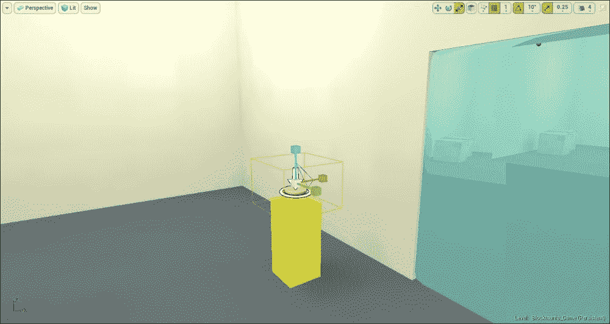

要检查触发器的放置位置以及其位置和尺寸是否正确设置，您可以首先取消隐藏触发器演员，方法是取消选中“游戏中隐藏的演员”选项——在触发器的“详细信息”面板中找到，然后播放关卡。现在，就触发器的放置而言，这样就可以了。现在让我们继续进行到第二个房间。

#### 房间 2

在第二个房间中，将第一个触发器放置在房间中央的大门附近。现在，我们希望玩家可以从任何地方打开门。记住这一点，将触发器放置在整个门的长度和宽度范围内。同样，调整宽度时要考虑您希望玩家与门交互时的距离。

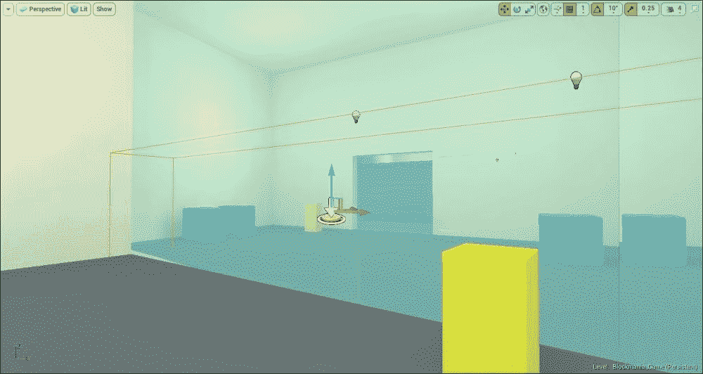

接下来，在基座上放置下两个触发器，与其他房间中的情况类似。由于基座具有相似的尺寸，您可以通过在上一个房间中复制它们来放置触发器。

我们不会像在上一个房间中那样在钥匙立方体上放置任何触发器。这背后的原因将在下一章中解释。

#### 房间 3

在第三个房间中，我们有几个基座，上面将放置按钮。因此，我们需要触发器进行交互。同样，不要在钥匙立方体上放置触发器。

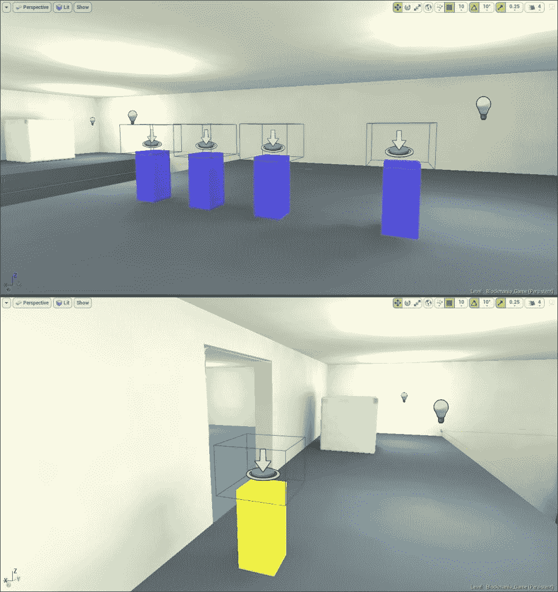

#### 房间 4

最后，在第四个房间，与之前的房间一样，在所有基座和门上放置触发器。

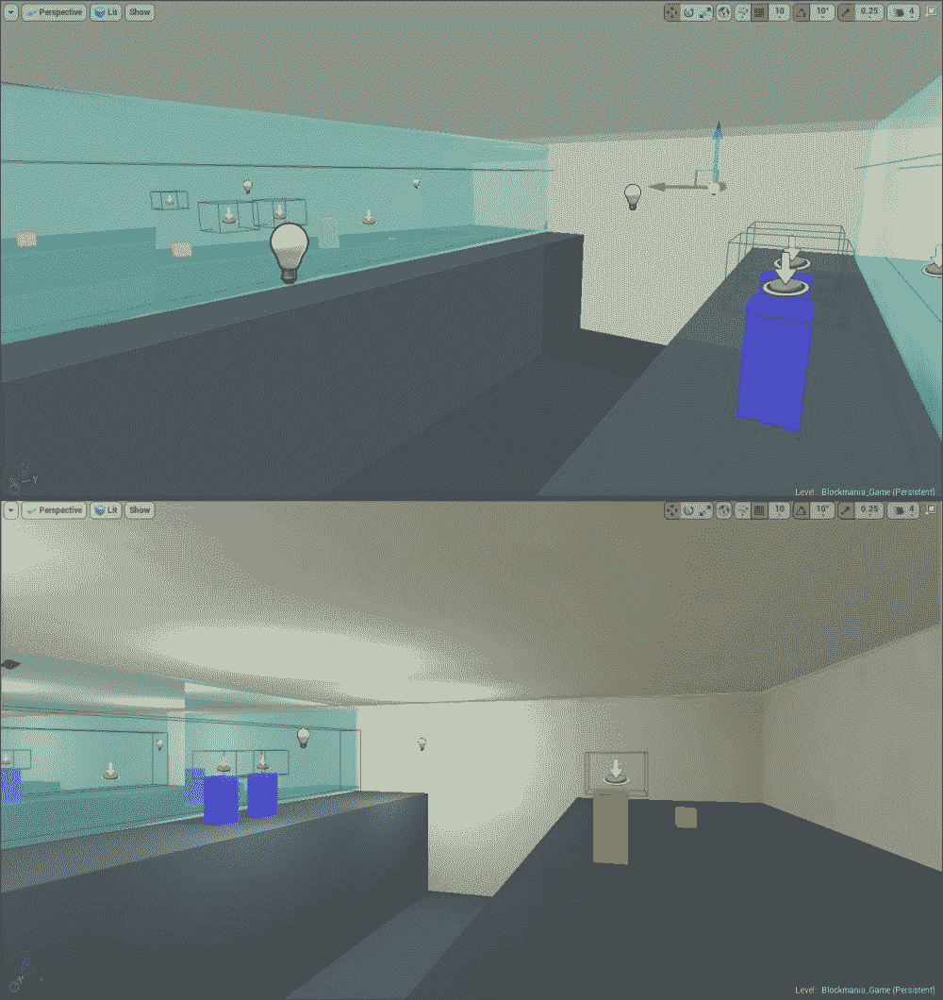

我们现在已经放置了游戏所需的大部分触发器。我们以后会添加更多。有了这些，我们已经将基本类放置到了我们的关卡中。现在让我们继续进行视觉效果类的操作，看看它如何影响我们的游戏。

# 视觉效果

由于我们在上一章已经涵盖了光类，我们将跳过它，直接进入视觉效果类。视觉效果类包含影响游戏视觉的角色。虽然不是游戏的必要组成部分，但它们有助于提高游戏的整体质量。

此外，它们不需要太多的内存。

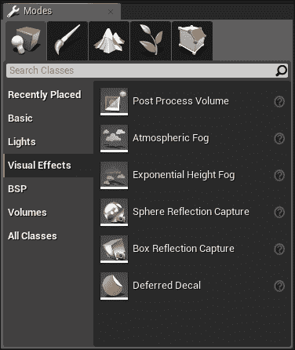

视觉效果类中有各种角色：

+   **后期处理体积**: 这是一个可以用来操纵游戏外观和感觉的角色。效果将在玩家在体积中时生效。有许多可用的效果。一些例子包括**抗锯齿**（去除角色的硬边，使它们更加平滑），**泛光**（在现实生活中，当看着一个明亮的物体在较暗的背景下时会看到），**景深**（根据物体与焦点的距离模糊物体），等等。通过使用**后期处理体积**，你可以为你的游戏添加多种效果；所以尝试使用体积来看看你可以做些什么。

+   **大气雾**: 在室外关卡中，仅仅拥有天窗是不足以提供逼真的室外场景的。实际上，来自太阳的光线会因为地球的大气层而散射和传播。为了在游戏中产生这种效果，你需要在关卡中添加**大气雾**角色。你可以设置属性，比如**太阳倍增器**（用于增亮雾和天空），**默认亮度**（用于设置**雾**的亮度），**默认光颜色**（用于设置大气的颜色），等等。

+   **指数高度雾**: 你可以使用这个角色在你的关卡中添加雾和薄雾。这也主要用于室外场景。你可以设置属性，比如**雾**密度，**雾**的颜色，**雾高度衰减**（随着高度的增加，雾的密度如何减少），等等。

+   **球形反射捕获**: 这是另一个有用的工具。**球形反射捕获**角色获取光照信息并提供逼真的反射效果，使材质具有光泽的效果。金属材料和类似的材料依赖于这个角色来提供逼真的效果。在角色的设置面板中，你会看到一个叫做**影响半径**的东西，它是角色的影响范围。你可以增加或减少它。在下面是**亮度**设置，你可以用它来设置你想要的反射亮度。请记住，如果你改变了关卡中的光照（移动它，改变亮度，改变颜色等等）或者移动了角色，**球形反射捕获**角色不会自动更新。你需要手动更新它，你可以通过位于**影响半径**选项上方的**更新捕获**按钮来做到这一点。

+   **盒形反射捕获**: 这与**球形反射捕获**类似。唯一的区别是，**球形反射捕获**角色具有球形影响区域，而盒形反射捕获角色具有立方体影响区域，使其相对于**球形反射捕获**角色的效果较弱。这个角色最适合用在走廊或立方体房间中。它的设置与**球形反射捕获**角色相同，只是它有一个**盒过渡距离**，可以用来增加或减少它的影响范围。同样，与**球形反射捕获**角色一样，如果你改变游戏中的光照或物体，你需要点击**更新捕获**按钮来更新反射。

+   延迟贴花：**延迟贴花**角色提供了一种简单且廉价的方式来在物体上添加贴花。这是一个很好的方法，可以添加血迹等效果。您可以选择要用于贴花的材质，并将其放置在关卡上。

## 将视觉效果角色添加到游戏中-后期处理体积

我们要添加到关卡中的第一件事是后期处理体积。当玩家拾取钥匙方块时，我们希望给他们一个视觉指示，表明他们已经拾取了它。在这种情况下，视觉指示是屏幕上的闪光。要添加角色，只需从面板中拖动它并将其放置在关卡上，覆盖在钥匙方块上。后期处理体积由浅粉色的立方体表示。

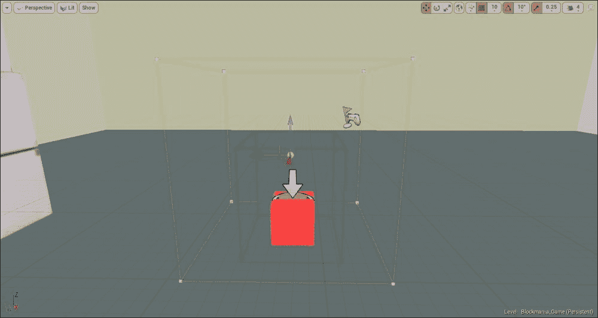

放置后期处理体积后，让我们在**详细信息**面板中设置一些属性。在此面板中，您将看到许多选项。所有这些选项都是根据它们创建的效果类型进行分类的。需要注意的一点是，其中一些效果在移动设备上不可用。

我们只会调整**全局照明**设置。在**详细信息**面板中，转到**全局照明**部分，您将看到两个设置：**间接光照颜色**和**间接光照强度**。

首先，通过选择它们来启用两种效果。然后，在**间接光照颜色**选项中，将颜色设置为任何您喜欢的颜色。在我们的情况下，我们将颜色设置为蓝色。您还可以将间接光照强度选项设置为任何您想要的值，但我们只会将其设置为**1**。

设置完成后，如果您走进体积，您会发现一切都变成了蓝色。这将是我们拾取方块时的效果：

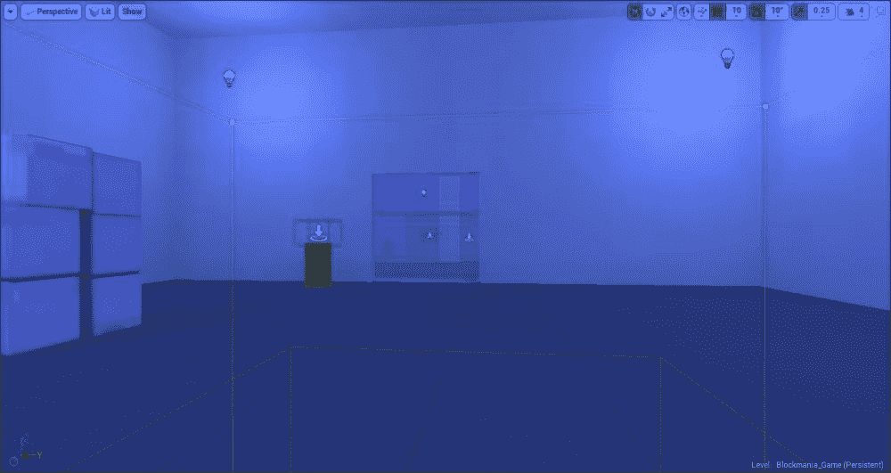

现在，如果您测试游戏并走进立方体，一切都会变成蓝色，并且除非您走出体积，否则会保持蓝色。我们不希望那样。我们只希望屏幕在玩家拾取钥匙方块时短暂变蓝，然后消失。我们需要更改另一个设置。我们希望在游戏开始时禁用体积，并且只在玩家拾取钥匙方块时触发。我们将在下一章中介绍如何启用此设置。现在，转到**详细信息**面板，在**后期处理体积**部分，您会发现**已启用**选项已选中。只需取消选中；这将禁用**后期处理体积**。如果您现在选中它，您会发现屏幕不再变蓝。最后，在关卡中复制并放置**后期处理体积**覆盖在所有钥匙方块上。

# 体积

体积是具有特殊属性的角色。它们可以被视为不可见的触发器，每个触发器在玩家进入时执行不同的操作（取决于体积类型）。有各种类型的**体积**角色可用；每个进入时都具有不同的属性。体积只在**编辑器**模式中可见，而在实际游戏中不可见。因此，它们通常会与另一个角色一起出现。例如，名为**造成疼痛的体积**的体积，顾名思义，当玩家进入其中时会造成伤害。显然，开发人员会在玩家走过危险区域时使用此体积，例如火灾、电击等。因此，体积将被放置在周围。火灾将作为视觉提示，表明该区域不安全，而**造成疼痛的体积**将处理其余部分（对玩家造成伤害）。

用户可以使用不同类型的体积。让我们来看看它们。

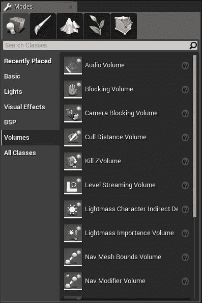

+   **音频体积**：音频体积允许您通过调整其设置来控制游戏中的音频。

+   **阻挡体积**：**阻挡体积**充当一个看不见的墙，阻止某些类型的角色通过。您可以在**详细信息**面板中设置哪些类型的角色可以通过，哪些类型的角色不能通过。

+   **相机阻挡体积**：这可以防止相机角色穿过它。

+   **剔除距离体积**：这是一个优化工具，根据物体距离摄像机的距离不渲染小于或等于开发人员设置的值的物体。这是一个重要的工具，特别是如果您有一个广阔的室外场景，因为它不会渲染远处的物体，从而节省内存。

+   **杀死体积**：这会摧毁进入其中的任何角色，包括玩家。这可以在玩家从悬崖边掉下，掉入坑等情况下使用。

+   **级别流式传输体积**：这是另一个优化工具，您可以使用它来设置玩家可见的级别部分。当您有巨大的级别时，这非常有用。您可以使用此体积隐藏玩家当前位置看不到的级别部分或远离他/她的部分。

+   **Lightmass 角色间接细节体积**：它获取光照信息并在体积内生成间接光照图。

+   **Lightmass 重要性体积**：另一个优化工具，Lightmass 重要性体积用于在其中生成光照信息（间接光照，阴影等）。建议在游戏级别周围放置 Lightmass 重要性体积以加快光照构建速度。

+   **导航网格边界体积和导航修改器体积**：导航网格边界体积用于 AI 在级别中移动。放置后，AI 角色将在体积内的任何地方移动（前提是该区域首先是可访问的）。

**导航修改器体积**用于修改**导航网格边界体积**。您可以设置它，以便在**导航网格体积**内的某个区域被封锁，AI 角色将无法穿过它。

+   **疼痛体积**：这会对进入其中的任何玩家造成伤害。

+   **物理体积**：这是可以改变物理对象的某些物理属性的体积。例如，您可以启用/禁用称为**水体积**的设置：当启用时，模拟角色穿过水域，如沼泽。

+   **后期处理体积**：这与**视觉效果**部分中找到的体积相同。

+   **预计算可见性覆盖体积**：使用此体积，您可以手动覆盖游戏中角色的可见性。

+   **预计算可见性体积**：此体积与**预计算可见性覆盖体积**具有相似的功能，唯一的区别是此体积自动存储游戏中角色的可见性。

+   **触发体积**：这与之前讨论过的触发角色相同。一个区别是，触发角色以预定义的形状出现，而您可以使用**编辑几何**模式更改触发体积的形状。

关于体积，您还应该知道，就像 BSP 刷子一样，您可以编辑它们的形状以创建自己的自定义形状的体积。编辑的方式与 BSP 刷子的方式相同。在**模式**面板中，单击**编辑几何**模式将切换到编辑模式。完成后，您可以单击要更改并进行所需更改的任何体积。

## 向游戏添加体积

现在我们知道了体积是什么以及可用的体积类型，让我们继续向我们的级别添加一些体积。

### Lightmass 重要性体积

建议使用 Lightmass 重要性体积，因为它可以减少渲染时间（光照构建时间）。我们将设置其尺寸，使其包围游戏中的四个房间。只需从**模式**面板拖动角色并将其放在屏幕上。

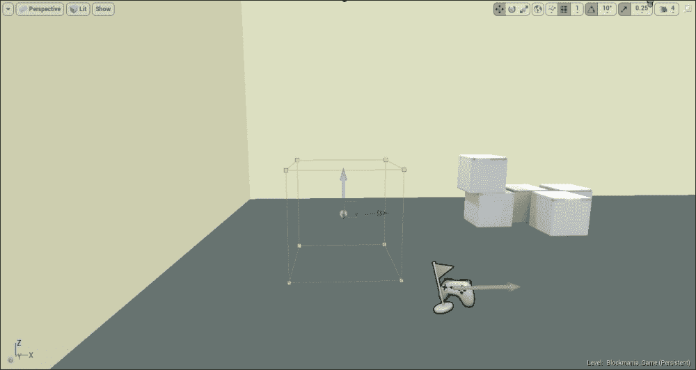

Lightmass Importance Volume 由一个黄色的立方体表示。设置其尺寸，使其包含游戏中的所有四个房间。

如果现在构建照明，您会注意到建筑过程所需的时间相对较短，房间外的区域现在完全黑暗。引擎现在主要关注体积内的内容，以产生高质量的照明，而体积外的任何内容在照明方面将质量较低。

### Nav Mesh Bounds Volume

接下来，添加**Nav Mesh Bounds Volume**。如果您希望在游戏中有一个 AI 角色，**Nav Mesh Bounds Volume**是一个重要的组件。如前所述，该体积基本上是 AI 角色在其中移动和与世界互动的范围。在设计游戏时，您应该知道所有由 AI 控制的角色将在游戏中移动的位置以及他们可以与之交互的对象，然后相应地放置您的体积。

抓住**Nav Mesh Bounds Volume**并将其拖入屏幕。我们需要在房间 3 和房间 4 中使用这个体积。该体积由一个灰色的立方体表示。

#### 房间 3

在坑上方和附近放置**Nav Mesh Bounds Volume**，与开关的基座相对。

在放置这个体积时，建议在**显示**菜单中打开**导航**。在**视口工具栏**中，点击**显示**并勾选**导航选项**，以在视口中显示它。一旦切换，您会看到体积内的任何表面、角色或任何其他物理对象（或它们的部分）都会在其上呈现出明亮的绿色。这是 AI 活动的视觉指示器。它将忽略体积外的任何东西：

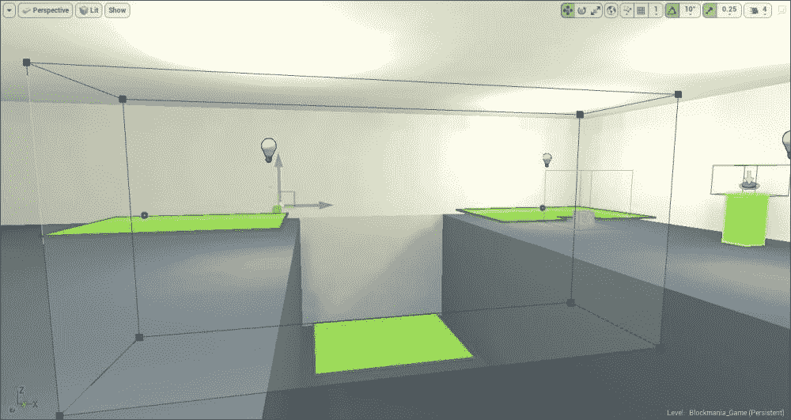

如前所述，体积重叠的表面或对象的任何部分都将是绿色的。让我们继续进行到房间 4。

#### 房间 4

在房间 4 中，我们需要一个大的 Nav Mesh Bounds Volume，几乎覆盖整个房间。放置体积并使用几何编辑模式移动其边缘。设置尺寸后，它应该看起来像以下的截图：

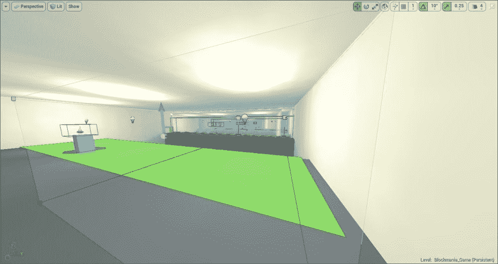

我们的 AI 角色现在将知道在关卡中移动的位置（绿色高亮显示的区域）。

# 所有类别

最后，我们有**所有类别**部分，其中列出了到目前为止我们讨论过的所有类别和体积。此外，还有一些角色未显示在前三个部分中，只能通过**所有类别**部分访问。

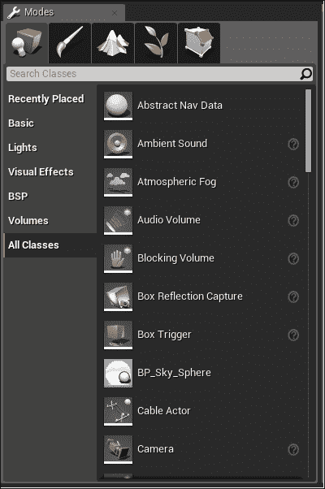

有许多这样的角色，其中一些超出了本指南的范围。我们只会谈论一些在**所有类别**部分中的角色：

+   **环境声音角色**：这是一个您可以用来在游戏中播放音频或音效的角色。它还模拟真实世界的声音，即您离源头越近，声音就会越大，反之亦然，您离源头越远，声音就会越微弱。

+   **摄像机**：**摄像机**角色是您通过它看到虚拟世界的角色。默认情况下，您的角色类已经有一个摄像机，但如果您想导入自己的角色，**摄像机**角色是一个必不可少的组件。它还用于过场动画等。

+   **默认角色**：**默认角色**角色是一个简单的球形角色，具有内置的飞行机制、静态网格、球形碰撞等，您可以用于简单的 AI。

+   **地形**：在这里可以找到切换到地形模式的另一种方法。如果您从这里拖动地形角色并将其放在屏幕上，模式将切换到地形模式，在那里您可以放置您的地形。

+   **关卡边界**：**关卡边界**演员在关卡中放置时会自动更新和调整大小以囊括整个世界。它可以用于计算关卡和世界的大小。只需记住，如果您的关卡有天空盒或天空圆顶，该体积也会调整大小并包括其中。

+   **Matinee 演员**：Matinee 是用于创建电影、布景等的强大工具。添加 Matinee 演员有两种方法。第一种方法是通过视口工具栏。只需单击**Matinee**，然后在菜单打开时选择**添加 Matinee**。另一种方法是使用此选项。您可以从**模式**面板拖动演员并将其放置在关卡上。

+   **导航链接代理**：**导航链接代理**演员用于如果 AI 角色必须执行动作，例如从悬崖上跳下或跳跃，跳跃之间的间隙等。它允许 AI 角色暂时离开导航网格。（我们将在下一章回到这一点，当我们谈论 AI 时。）

+   **目标点**：**目标点**演员用于获取关卡中特定点的坐标。它们也可以用于 AI 角色。如果您希望 AI 角色沿着特定路径移动，或者让它巡逻特定区域，您应该使用目标点。此外，请记住，目标点应放置在 Nav Mesh Bounds Volume 内，否则 AI 角色将忽略它们，即使您已经编写脚本让其朝着所说的目标点移动。如果您希望角色传送到特定目的地，也可以使用目标点。

+   文本渲染：**文本渲染**演员，顾名思义，用于在游戏中渲染文本。如果您希望游戏中有弹出文本（用于教程或类似内容），这就是您应该使用的。您可以导入自己的字体并创建自己的文本渲染。

+   **类蓝图**：虽然不是单个特定的演员，但您在项目中创建的所有类蓝图都显示在这里。类蓝图究竟是什么将在下一章中讨论。目前，您需要知道和记住的唯一一件事是，您创建的所有类也可以从这里访问。

## 从所有类中添加演员

现在我们已经讨论了在所有类中找到的一些演员，让我们继续向游戏中添加其中一些。

### 摄像机

我们要添加的第一件事是摄像机演员。作为**教程**的一部分，我们将制作一个小的过场动画，在其中当玩家将钥匙立方体放在基座上时，我们将展示门的打开（以便玩家了解钥匙立方体的用途和作用）。

因此，从所有类面板中拖动**CameraActor**并将其放置在关卡上。完成后，设置它以面向门。以下截图是您可以放置摄像机的示例位置：

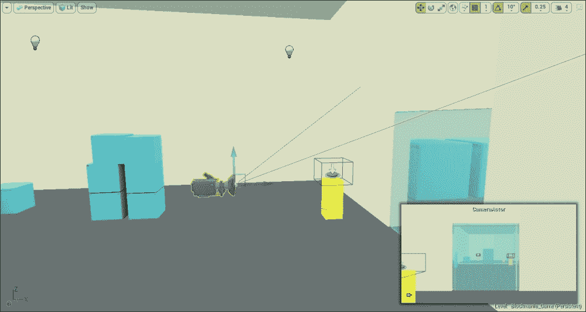

屏幕右下角的小窗口显示了从第二摄像机的视图，您可以使用它来正确调整其位置，直到您可以清楚地看到门。每当您选择任何**CameraActor**时，该窗口都会打开，显示您从所选**CameraActor**的视图。我们将在后续章节中创建过场动画时需要这个。

### Matinee 演员

我们还将放置几个 Matinee 演员。我们不打算通过脚本（或在这种情况下，蓝图）移动我们的门和平台，而是打算借助 Matinee 实现这些功能。我们将在**虚幻 Matinee**中制作门的打开和动画的绘制，并在玩家与适当的触发器交互时调用它。

要添加 Matinee 演员，请从**模式**面板中拖动它并将其放置在门附近。

### 注意

虽然放置 Matinee 演员的位置并不重要，为了避免混淆并使事情更加方便，您应该将其放置在您希望使用 Matinee 移动或编辑的演员附近。

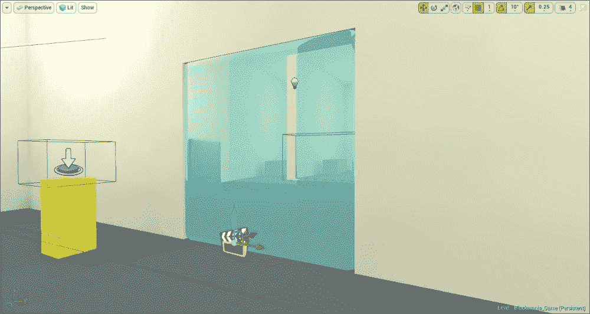

只需像这样放置动画演员来控制所有的门。我们还需要放置更多的动画演员，但我们稍后会这样做。

### 目标点

接下来，我们将放置一对目标点演员。如前所述，目标点对于移动 AI 角色非常有用。我们将有一个非常简单的 AI，它沿着指定的路径移动，在触发开关时停止，并且如果掉入坑中则重新出现。

#### 房间 3

在房间 3 中，放置两个目标点：一个是 AI 角色最初的位置，另一个是开关的位置。当 AI 角色掉入坑中时，它将重新出现在第一个目标点。当玩家激活它时，AI 角色将前往第二个目标点。

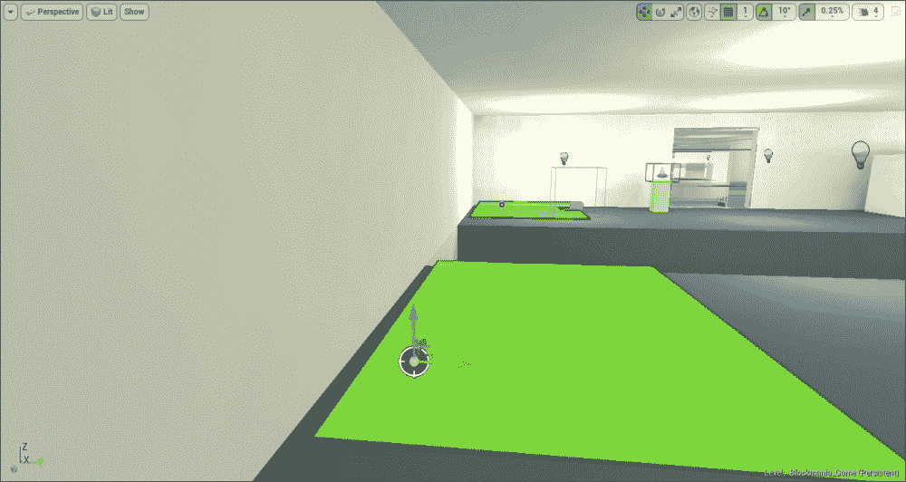

这些演员由一个小的目标图标表示。现在让我们把它们放在房间 4 中。

#### 房间 4

在房间 4 中，我们将放置一对目标点演员，因为 AI 角色将采取更多的非线性路径。

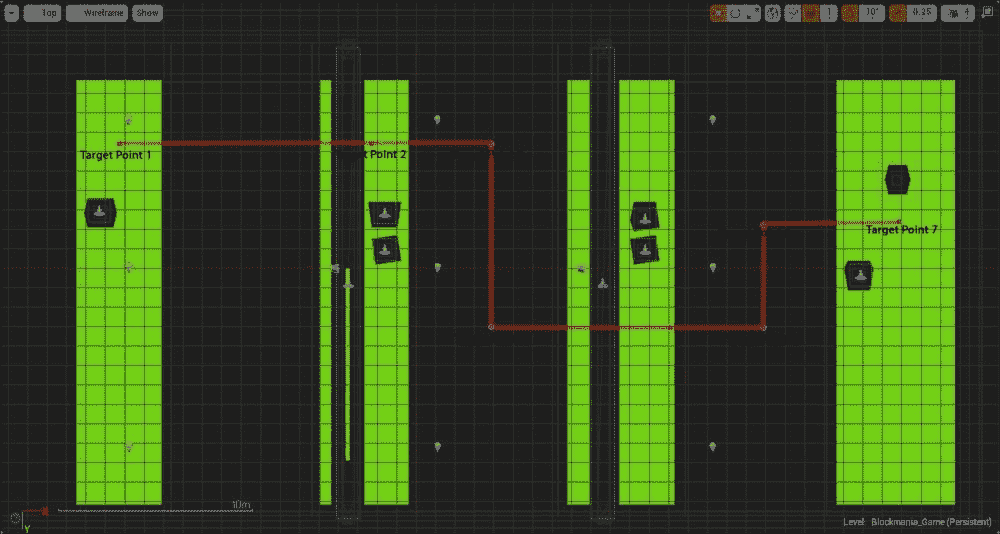

前面的截图是房间 4 的俯视图。玩家将从左侧开始，并且必须引导 AI 角色朝右侧移动。此外，正如你所看到的，我们已经放置了七个目标点演员。AI 角色将走的路径由红线表示。完成这些后，我们已经完全放置了我们的目标点演员。通过这样做，我们已经在我们的关卡中放置了所有的类、体积和其他演员。

# 总结

在本章中，我们看了一些在模式面板中出现的对游戏功能至关重要的演员，以及一些增强整体体验的演员。

除了讨论它们，我们还在我们的关卡中放置了一些。我们现在离制作游戏很近了。在下一章中，我们将讨论蓝图——可能是我们指南中最重要的主题。没有它们，游戏中就没有互动性。所以，让我们在下一章开始编写脚本。
