# 第六章：使用虚幻 Matinee

虚幻 Matinee 是虚幻引擎 4 提供的另一个强大工具。虚幻 Matinee 用于创建电影，过场动画，动画，布景等。它也很容易学习，您可以使用它来创建令人惊叹的东西。通常，Matinee 与蓝图一起使用。在上一章中，我们在游戏中留下了一些脚本，现在我们将进行介绍。本章将涵盖以下主题：

+   什么是虚幻 Matinee？

+   虚幻 Matinee 用户界面

+   在我们的游戏中使用虚幻 Matinee

# 什么是虚幻 Matinee？

虚幻 Matinee 是一种动画工具。它提供了工具，您可以使用这些工具在游戏过程中对演员的属性进行动画处理，或者创建电影，过场动画，布景等。借助曲线和关键帧，您可以使用这个工具在游戏中对演员进行动画处理，就像专业人员使用的任何其他视频编辑软件一样。您还可以使用 Matinee 设置 Matinee 事件。

## 添加 Matinee 演员

在您可以使用 Matinee 之前，您需要做的第一件事是将 Matinee 演员添加到场景中。Matinee 演员由一个类似于电影片场上看到的响板的图标表示，如下截图所示：

我们已经讨论了通过 Modes 面板在第四章中添加 Matinee 演员的一种方法，*使用演员，类和体积*。另一种添加 Matinee 演员的方法是通过单击视口工具栏中的**Matinee**按钮，这将打开一个下拉菜单，同时可以查看放置在场景中的 Matinee 演员的数量。在菜单的顶部，在**新建**部分下，您可以通过单击**添加 Matinee**来创建一个新的 Matinee 演员。在此之下，在**编辑现有的 Matinee**部分，您可以找到放置在列表中的所有 Matinee 演员的列表。双击其中任何一个以进行编辑。

当您创建新的 Matinee 演员或双击现有演员时，将打开一个新窗口。让我们仔细看一下。

# 虚幻 Matinee 用户界面

任何使用**虚幻开发工具包**（**UDK**）中的 Matinee 的人都会发现布局和用户界面非常相似。

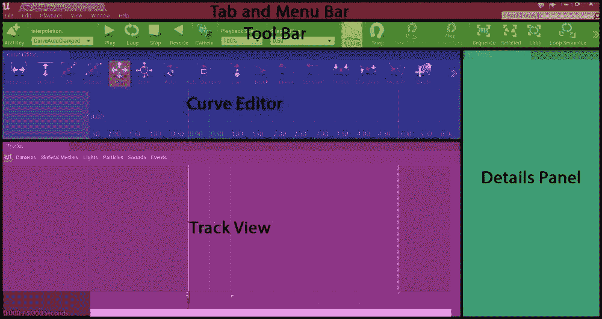

## 选项卡和菜单栏

就像在 Web 浏览器中一样，在选项卡栏中，您可以看到当前打开了多少窗口，切换它们之间，重新排列它们，并关闭其中的任何一个。

在下面是菜单栏，包含以下操作和功能：

+   **文件**：从这里，您可以选择从 FBX 文件导入序列（因为 FBX 文件除了存储网格外，还存储对象的动画，导入它将导入该 FBX 文件的动画序列到 Matinee），导出动画序列，保存序列等

+   **编辑**：使用此选项卡，您可以撤消或重做先前的操作，添加或删除关键帧，编辑部分等

+   **播放**：这为您提供了播放，暂停，停止，循环和反转动画序列的选项

+   **视图**：在这里，您可以设置您希望查看的内容，启用网格捕捉，在轨道视图面板中适合整个序列等

+   **窗口**：此选项卡允许您通过设置要在 UI 中显示的面板和窗口等来自定义 Matinee UI

+   **帮助**：您可以从这里访问有关 Matinee 的文档和教程

## 工具栏

在菜单栏下方是工具栏。在这里，您可以访问最常用的操作。

从左到右，图标如下：

+   **添加关键帧**：这会在动画轨道的当前位置添加一个关键帧。

+   **插值**：插值意味着在两个点之间找到一个点。在关键帧动画中，插值是一个重要的工具，因为它使动画变得平滑。通过这个选项，您可以设置关键帧和曲线的初始插值模式。您可以选择线性、恒定、曲线自动夹紧、曲线自动等。

+   **播放**：播放按钮播放您创建的动画序列。您可以在编辑视口中看到动画。动画只播放一次。

+   **循环**：如果要多次查看动画，可以单击**循环**按钮，动画完成后将循环播放。

+   **停止**：单击此按钮将停止动画。

+   **反向**：这将以相反的方式播放动画。

+   **相机**：单击此按钮将使您能够创建**相机**组。

+   **播放速度**：使用此选项，您可以设置动画播放的速度。您可以选择**100%**、**50%**、**25%**、**10%**和**1%**的正常播放速度。

+   **快照设置**：如果启用了网格捕捉，您可以从这里设置快照大小。

+   **曲线**：默认情况下启用，您可以使用此选项打开/关闭曲线编辑器窗口。

+   **捕捉**：由磁铁表示，此选项切换网格捕捉。

+   **时间转换为帧**：这将时间轴游标捕捉到**Snap Setting**中设置的快照大小。仅当快照大小以帧每秒为单位时才启用。

+   **固定时间**：使用此选项，您可以将播放速度固定为**Snap Setting**菜单中选择的帧速率。只有在帧每秒的快照设置中才有效。

+   **序列**：单击此按钮以缩放以适应您在轨道面板中创建的整个序列。

+   **已选择**：这将缩放以适应**轨道**面板中所选关键帧。

+   **循环**：这将缩放时间轴以适应动画序列中的循环部分。

+   **循环序列**：这将循环部分的起始点设置为动画序列的开始，将结束点设置为序列的结束。换句话说，单击此选项将调整并适合循环部分到您创建的整个动画序列。

+   **结束**：如果单击工具栏最右侧的箭头，您将找到另外三个图标。它们中的第一个是**结束**。这将将轨道时间线移动到序列的末尾。

+   **录制器**：这将打开**Matinee Recorder**窗口，您可以使用它来记录 Matinee 的序列。

+   **电影**：最后，我们有**电影**选项。您可以使用它从您创建的动画序列中创建电影。

## 曲线编辑器

接下来我们要看的是**曲线编辑器**。与任何动画软件一样，您可以使用曲线来编辑动画。如果您想在动画序列中使用粒子系统，也可以使用它。曲线还有其他许多用途，但这些是最常见的用途。*x*轴表示时间，*y*轴表示您在 Matinee 中随时间变化的值。曲线编辑器中的曲线显示了值随时间的变化。例如，如果值以恒定速率变化，曲线将是线性的；如果值呈指数变化，曲线将是指数曲线，依此类推。

要查看和编辑曲线，您首先必须在**轨道**面板中切换它们。完成后，您将看到相应动画序列的曲线，然后可以编辑它以进一步编辑或微调动画。

顶部是曲线编辑器的工具栏。让我们看看它的选项：

+   **水平**：此选项可使所选曲线组在水平方向上适合缩放。

+   **垂直**：这与**水平**选项相同，但它使所选曲线组在垂直方向上适合缩放。

+   **全部**：它在水平和垂直方向上都适合曲线，以便整个曲线在曲线编辑器中可见。

+   **已选择**：此选项执行与**全部**相同的功能，但仅适用于所选点。

+   **平移**：将**曲线编辑器**切换到平移模式，这意味着您可以通过按住鼠标左键并拖动来在图形编辑器中移动。

+   **缩放**：切换到缩放模式。您可以通过按住鼠标左键并拖动鼠标来放大和缩小。

+   **自动**：将所选曲线的插值更改为**自动**。

+   **自动/夹紧**：将所选曲线的插值设置为**自动/夹紧**。

+   **用户**：此选项将插值更改为用户（如果您在设置为**自动**或**自动/夹紧**时对曲线进行任何更改，它将更改插值为用户）。

+   **中断**：将插值更改为**中断**。

+   **线性**：将插值更改为**线性**。这意味着两个点之间的曲线将是线性的，也就是说，在两个关键帧之间是一条直线。

+   **恒定**：将插值更改为**恒定**。这意味着所选关键帧之间的曲线将是一条水平直线。换句话说，*Y*轴上的值将随时间保持恒定。

+   **平坦**：单击此按钮将使所选曲线的切线变平，使其变平。

+   **拉直**：此选项会删除所选曲线的切线上的任何不规则之处，并使其变直。

+   **显示全部**：显示所有曲线的所有切线。

+   **创建**：最后，我们有**创建**选项卡按钮。您可以选择创建多个选项卡。您可以通过单击工具栏极端右侧的箭头按钮并使用**当前**选项卡菜单选择要转到的选项卡来在选项卡之间切换。您还可以删除当前选项卡。

在工具栏下方，左侧是轨道列表。在这里，您可以看到当前选项卡中的所有轨道。顶部是轨道的名称，底部是可以切换开/关的按钮。在这个例子中，我们有一个移动轨道，所以有三个按钮分别代表每个轴：红色代表*X*轴，绿色代表*Y*轴，蓝色代表*Z*轴。最右边是一个黄色按钮，可以用来切换整个轨道的开/关。

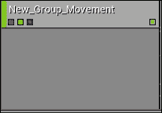

在右侧，我们有图形编辑器，您可以在那里查看和调整曲线。

在这里，您可以看到有三条单独的曲线，每条曲线代表我们刚讨论过的按钮。您可以在这里调整每条曲线以获得所需的结果。选择曲线上的一个点并更改切线以改变曲线的形状。

## 轨道面板

在**轨道**面板中，您可以看到动画序列中的所有轨道、文件夹和组。

在这里，您可以看到指定动画持续时间、创建的组、参与动画的所有组件等时间轴。面板顶部是选项卡栏。下面是**组**选项卡。对于简单的动画，您实际上不需要这个，但是如果您有一个复杂的动画序列（比如电影或过场动画），您可能希望利用此功能来保持工作站整洁有序。您可以将类似的角色放在各自的选项卡中。例如，如果您有摄像机，您可以将它们放在**摄像机**组中。要创建组或文件夹，请右键单击它；这将打开一个菜单，您可以从中创建组或文件夹。

在**组**选项卡下方，左侧是组和轨道列表。列出了动画序列或当前选项卡中的所有组和轨道。您还可以在这里添加或删除组。

如您所见，组下有各种轨道。每个单独的轨道都有自己的动画，您可以进行编辑。您还可以通过单击每个轨道左侧的灰色框来切换整个轨道的开/关。右下角还有两个框。左侧的按钮可以启用或禁用在动画序列中播放的相应轨道。右侧的按钮可以启用或禁用该轨道的曲线编辑器。还有一些轨道没有这两个按钮，表明这些轨道没有曲线。

右侧是动画时间轴。

在底部，您可以看到动画时间刻度。在其上方，半透明的白色框带有红色边缘，表示动画时间的总持续时间。您可以单击边缘并将其向左或向右拖动，以相应地减少或增加动画的持续时间。浅绿色框显示了循环序列的持续时间。这意味着只有绿色部分内的部分将循环，其余部分将被忽略。您还可以通过单击并拖动绿色箭头向右或向左来增加或减少其大小。还有时间轴滑块，由白线表示，您可以使用它跳转到任何帧。最后，您可以单击时间轴上的任何位置跳转到任何帧。时间轴滑块将跳转到您单击的位置。

## 详细面板

最后是**详细**面板，您可以在其中设置某些轨道、组等的属性。

上述截图显示了移动轨道关键帧的属性。您可以在视口中切换移动轨道的播放，切换旋转开/关，设置是否要在编辑器视口中看到轨道等。

# 门的动画

现在您已经熟悉了虚幻 Matinee 及其用户界面，我们可以继续向游戏中添加一些动画。这包括门的开启动画、第一个房间中的小片段以及为 AI 角色绘制桥梁的动画。

## 房间 1

现在是时候在我们的游戏中实际使用 Matinee 了。选择第一个房间中门附近的 Matinee 角色，并在**详细**面板中单击**打开 Matinee**。打开后，第一步是添加一个组。在制作组之前，请确保您在**编辑器视口**中选择了要进行动画处理的角色；否则，组中将没有任何角色引用，并且您将收到一个错误，指示**没有要关键帧**，或者**所选对象无法在此类型的轨道上进行关键帧处理**。

单击门以选择它，在**轨道**面板的**轨道列表**上右键单击，然后选择**添加新的空组**。当要求命名组时，请将其命名为**门**并按*Enter*。门将附加到此组中。这将创建一个空组，您可以在其中放置多个轨道（移动、可见性、粒子等）。首先，我们需要一个移动轨道。右键单击**门**，然后选择**添加新的移动轨道**。创建后，您将在**轨道**面板中看到它。

现在，我们不希望动画持续 5 秒，因为对于简单的门开启动画来说太长了，会不必要地减慢游戏速度。因此，通过左键单击位于 5 秒标记上方的极端右侧的红色箭头，并将其移回到 2 秒标记上，将动画持续时间减少到 2 秒。如果需要，您还可以通过对绿色框右边的绿色箭头执行相同操作，将循环序列持续时间从 1 秒增加到 2 秒。

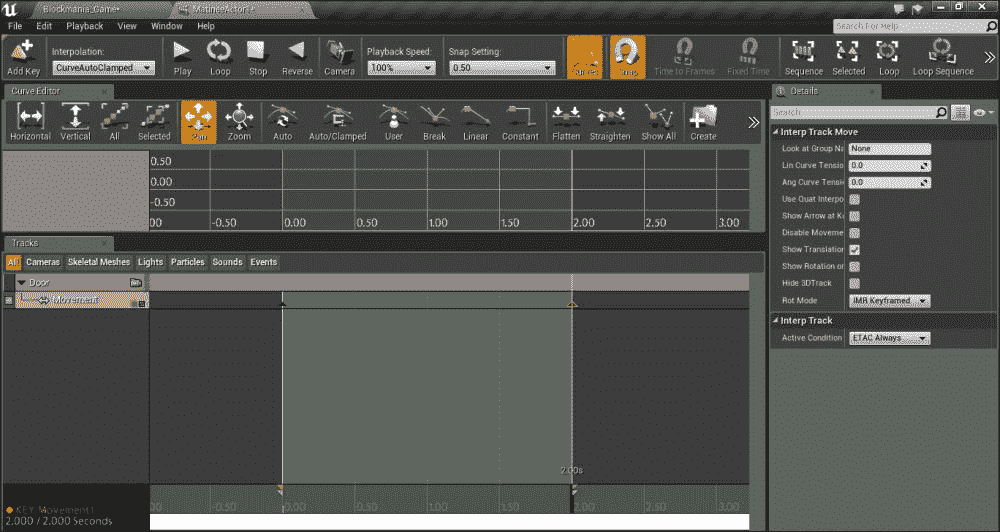

在时间轴上，在移动轨道之前，您将看到一个小的栗色箭头覆盖在 0 秒标记上。这是一个关键帧。由于我们有一个简单的动画，我们只需要两个关键帧：一个在动画序列开始时，另一个在结束时（如前面的截图所示）。要添加第二个关键帧，请将动画滑块移动到动画时间轴的末尾，然后按*Enter*。

现在我们已经设置好了关键帧，回到编辑器。

您会注意到在视口的左上角有一些东西。每当您打开 Matinee 时，视口会更改以预览相应的 Matinee 动画。在左上角，用白色文字写着**Matinee**。这基本上是在通知视口当前设置为预览模式。它旁边，用青色文字写着视口的分辨率。下面，用绿色文字写着相应 Matinee 动画的帧数。在左上角，它写着**Matinee**。它旁边，您可以看到分辨率，下面是动画的总帧数。在这种模式下，您无法保存、打开或加载场景，也无法播放游戏。为了执行这些操作中的任何一个，您必须首先关闭 Matinee。

现在，确保时间轴滑块位于动画时间轴的末尾，使用变换工具，将门向上或沿着*z*轴移动。移动它直到它不再挡路。

每当移动门时，您会看到一个垂直的黄色线。这条线显示了动画播放时门将要遵循的路径。要查看动画，请返回到 Matinee 并在工具栏中点击**播放**按钮。

我们接下来需要做的是利用之前添加的摄像头。当玩家将关键方块放在基座上时，我们希望播放一个小的过场动画，展示它的效果，以便玩家知道房间的主要目标是什么。在这个过场动画中，我们将：

1.  将控制权从玩家手中拿走。

1.  从主摄像头切换到门前的摄像头。

1.  播放动画。

1.  将玩家控制权交还给角色。

为此，我们需要添加一个摄像头组。返回到 Matinee 窗口，在**轨道**面板上右键单击，然后点击**添加新摄像头**组（再次确保在视口中选择了摄像头）。将此组命名为**摄像头**。

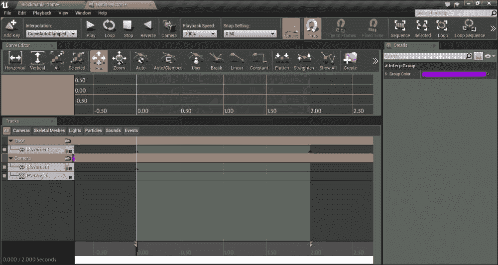

摄像头组有两个轨道：一个**移动**轨道和一个**FOVAngle**角度轨道。您可以在 Matinee 播放时使用它来移动摄像头并设置其视野。在这种情况下，我们希望摄像头保持静止。因此，将时间轴滑块移动到时间轴的末尾，并在摄像头组的**移动**轨道上按*Enter*创建一个关键帧。

我们需要的下一件事是所谓的**导演**组。它的一个用途是在播放动画时分配要切换到哪个摄像头。同样，在**轨道**面板上右键单击，然后选择**创建新导演组**。将为**导演**组在**轨道**面板上方创建一个新的、独立的轨道。

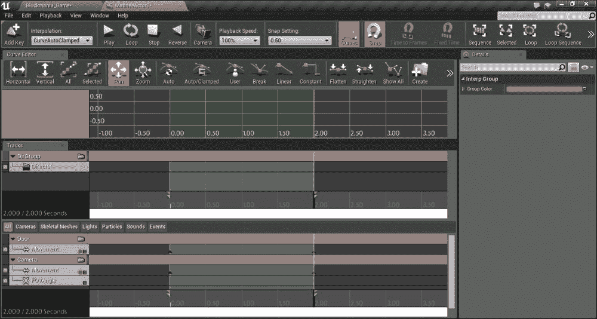

现在我们有了我们的**导演**组，我们需要告诉它在动画播放时切换到哪个摄像头。要做到这一点，选择它并按*Enter*。这将打开一个小窗口，询问您要切换到哪个组。这个窗口列出了我们在 Matinee 中创建的所有组。在这里，点击下拉菜单，选择**摄像头**，然后点击**确定**（确保时间轴滑块在 0 秒标记处）。完成后，**摄像头**组将被分配给**导演**组。

现在，如果播放 Matinee，您会看到在视口中，摄像机切换到我们放在门前的摄像机。我们已经设置好了我们的 Matinee。现在我们需要编写它何时播放。我们希望在玩家将钥匙方块放在基座上时播放。因此，打开蓝图，在我们为放置钥匙方块创建的序列中，添加一个**Sequence**节点。将其附加到**Gate**节点。接下来，将**Then 0**输出引脚附加到**Set Actor Hidden in Game**节点。

接下来，在视口中选择**Matinee**演员，右键单击并创建其引用。然后，拖动此节点的引脚，并在菜单打开时输入`Play`以创建**Play**节点。将其附加到**Sequence**节点的 Then 1 引脚上。

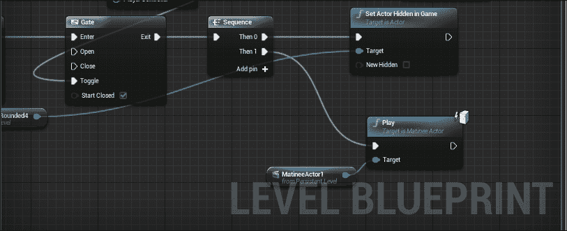

如果您测试关卡，您会看到一切都按预期工作；当玩家将钥匙方块放在基座上时，摄像机将切换到门前的摄像机，并且门的动画将开始播放。但是，还有一件事情要做。在剧情片段播放时，您仍然可以控制玩家（移动和射击）。我们希望在动画播放时玩家无法移动或射击。为此，选择**Matinee**演员，在**详细信息**面板中，在**电影**部分下，勾选以下内容：

+   **禁用移动输入**

+   **禁用观看输入**

+   **隐藏玩家**

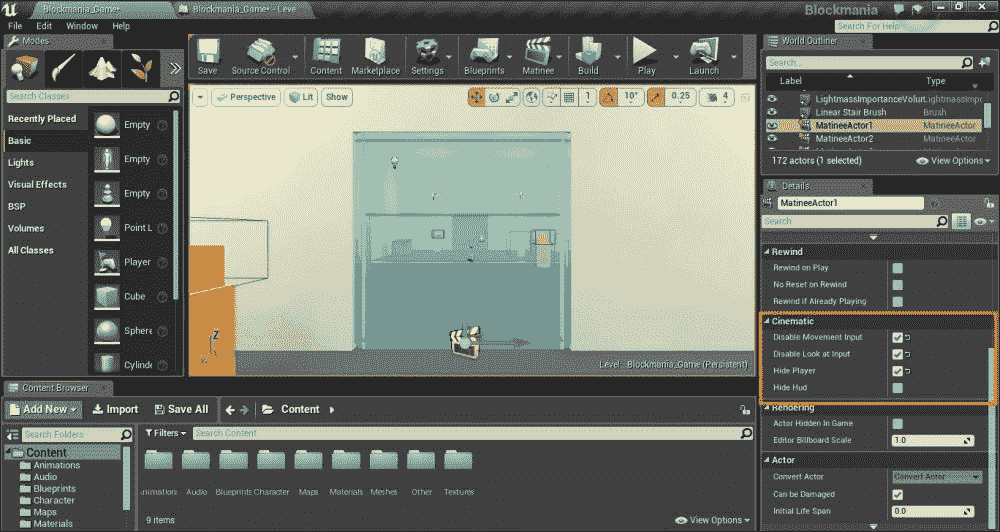

到此为止：我们刚刚创建了自己的剧情片段。让我们继续进行第二个房间的大门。

## Room 2

在第二个房间的中间，我们有一扇大门。我们希望玩家在将第一个钥匙方块放在基座上时能够使用它。到目前为止，这与之前的门非常相似。这里唯一的区别是：

1.  玩家在屏幕上触摸时门打开（前提是它首先被解锁）。

1.  玩家从屏幕上释放手指时门关闭。

在这里，Matinee 部分将类似；我们将创建一个持续 2 秒的移动轨道，并使门向上移动。在这里，由于我们不是在创建一个剧情片段，因此我们不需要**Camera**组或**Director**组，也不需要在 Matinee 运行时禁用玩家输入。考虑到这一点，选择靠近大门的**Matinee**演员，并在**详细信息**面板中单击**打开 Matinee**。使用**Movement**轨道来为门制作动画，就像我们之前为另一扇门所做的那样。

完成后，打开关卡蓝图。在这里，我们将不再使用立方体打开门，而是使用触摸输入节点。与之前的触发器一样，为门周围的大触发器添加一个重叠事件。设置节点如下截图所示：

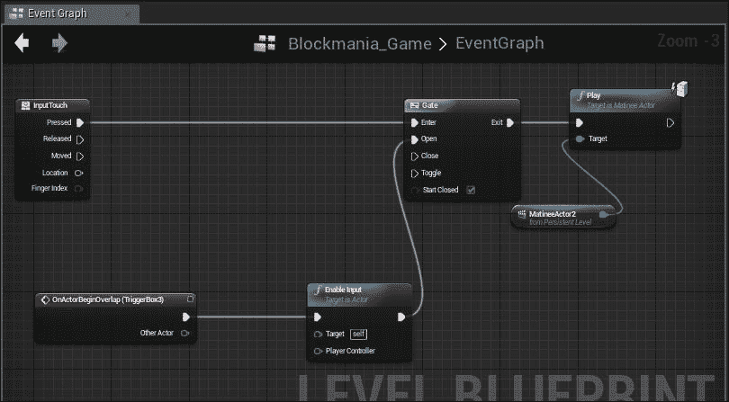

在这里，当玩家重叠触发器时，它会启用玩家输入并打开**Gate**节点。现在，当玩家触摸屏幕时，它将播放**Matinee**。我们需要编写的唯一事情是玩家释放屏幕时会发生什么。在这里，当玩家停止触摸屏幕时，门将关闭，也就是**Matinee**将以相反方式播放。

为此，创建**Matinee**演员的另一个引用（或只需复制已有的引用），创建一个**Reverse**节点，并将**Matinee**演员附加到其**Target**输入。

现在测试游戏，当您将钥匙方块放在第一个基座上并点击门时（在编辑器中播放时，鼠标按钮充当触摸输入），门会打开；一旦您松开，它会再次关闭。在第 4 个房间的门上也是一样，但您无需先解锁门；您可以简单地编写脚本，使其在玩家靠近并触摸屏幕时打开，并在玩家从屏幕上释放手指时关闭。让我们继续进行桥梁的平台。

## AI 角色的桥梁

在 AI 角色的房间里，玩家必须为它建造一座桥，这样它就可以穿过坑并解锁关键方块。有开关可以绘制桥的一部分。玩家必须在 AI 角色掉进坑之前迅速绘制桥的所有部分。在第三个房间，桥将有三个部分，每个部分由基座上的开关绘制。对于我们的桥，我们将使用 Cube 原始角色。将三个 Cube 原始角色添加到场景中，将它们的比例设置为`2.2`，`2.5`，`0.3`，并将它们放在坑的底部。确保将它们的移动性设置为**可移动**。

完成后，添加三个 Matinee 演员，每个部分一个。然后，在 Matinee 中，将动画时间设置为 1 秒，并通过移动来动画部分上升，使其与地面对齐。确保部分完全对齐。如果太高，AI 角色将无法上去，如果太低，AI 角色将无法到达另一侧。如果看到部分的上表面是绿色的（因为导航网格边界体），这意味着 AI 角色可以行走在上面，如下截图所示：

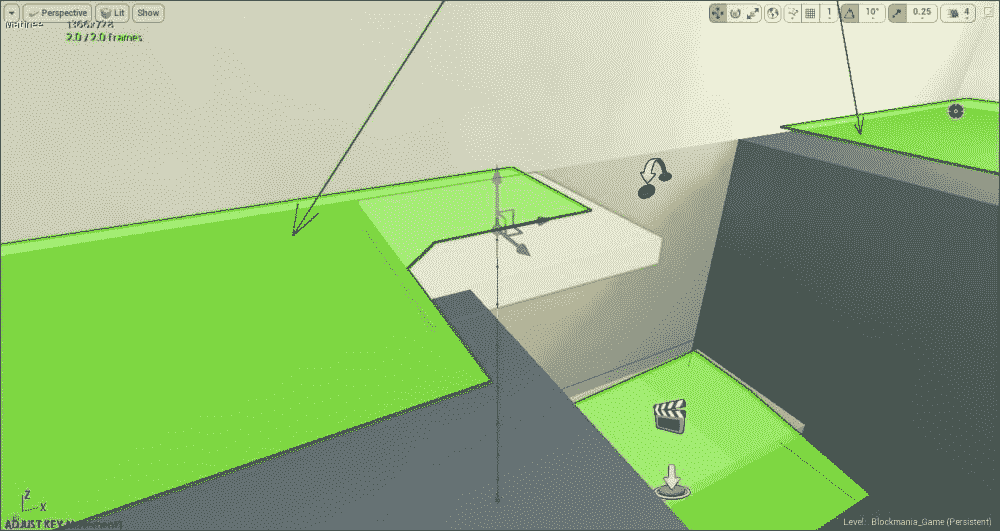

对于剩下的两个部分也要做同样的操作，确保它们在绘制时完美契合。

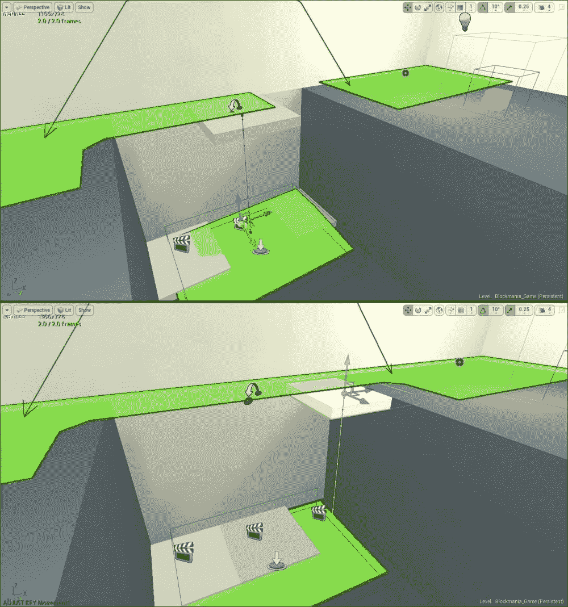

接下来我们需要在游戏中编写 Matinee。在第三个房间有四个基座。从左到右，第一个激活 AI 角色，第二个绘制桥梁的第一部分，第三个绘制第二部分，第四个绘制第三部分。因此，打开关卡蓝图，就像在第二个房间的大门一样，编写蓝图，使得当玩家靠近开关并触摸屏幕时，Matinee 会播放。对于所有三个触发盒，都要这样做，播放它们各自的 Matinee。

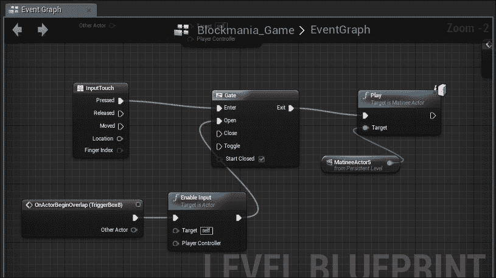

当 AI 角色掉进坑时，我们希望桥的部分回到坑的底部，这样当玩家重新开始时，他们必须再次按下开关来绘制部分。返回到将 AI 角色传送回起始位置的触发盒。对于**Sequence**节点，添加一个引脚，为所有三个 Matinee 演员创建一个引用。创建一个**Reverse**节点，并将所有三个演员连接到它。

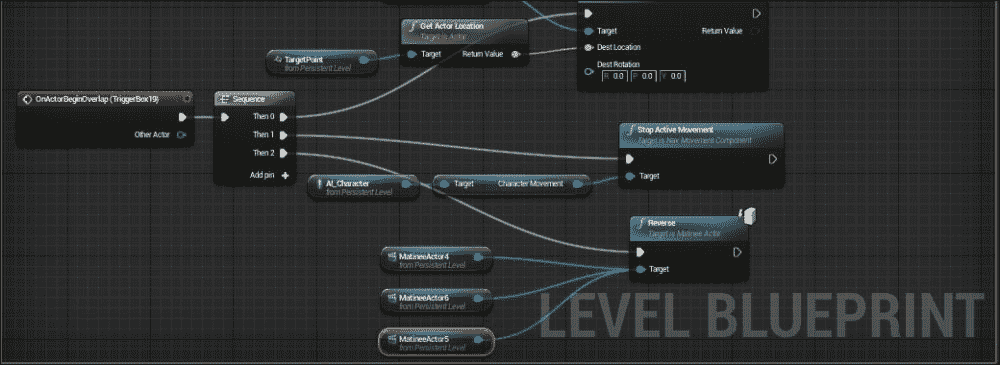

现在，如果 AI 角色掉进坑里，除了被传送回起始位置，桥梁的部分也会重置到它们的原始位置。

我们已经设置好了谜题。然而，目前这个谜题没有回报。我们之前提到，当 AI 角色穿过坑时，它会解锁关键方块。但现在，我们的关键方块似乎没有被锁住。我们可以把关键方块囚禁起来，当 AI 角色成功穿过坑时打开。为此，在关键方块周围放置四个立方体（作为囚笼的墙壁），创建它们打开的 Matinee，并设置一个触发盒，当 AI 角色重叠触发盒时，播放 Matinee。因此，在关键方块周围放置四个立方体，将其围住，并将门的材质应用于它们（如果愿意，可以复制 Door_Material，并在材质编辑器中删除与 Refraction 表达式的连接，并将其应用于墙壁，以便从坑的另一侧正确看到关键方块）。在放置这些时，确保关键方块周围的触发盒也被墙壁包围。

现在在这个笼子附近添加一个 Matinee，并在目标点演员上放置一个触发框。打开 Matinee，这样我们就可以创建我们的动画。在这里，我们有四个独立的对象需要进行动画。然而，由于它们都一起进行动画，为每堵墙创建四个不同的 Matinee 演员将是浪费的。相反，我们将在同一个 Matinee 中对所有四堵墙进行动画。为此，我们将创建四个不同的组，每个组都有一个移动轨道，分别用于每堵墙。选择第一堵墙，创建一个空组（命名为**Wall1**），带有一个移动轨道，并将其向下移动进行动画。将动画时间设置为 1 秒。然后，为第二堵墙创建另一个空组（命名为**Wall2**），带有一个移动轨道，并将其向下移动进行动画。对于剩下的两堵墙也是同样的操作。

现在我们有四个独立的动画对象，它们使用相同的 Matinee 演员。剩下的事情就是为触发框设置重叠事件，以播放 Matinee。

根据你所学到的知识，在制作第四个房间的桥梁时，应用相同的方法，确保 AI 角色在桥梁被绘制时可以穿过它们。

# 总结

在本章中，我们介绍了虚幻 Matinee：它是什么，它的用户界面，以及可以用它做什么。我们使用它来创建过场动画并对门和桥进行动画。通过这样，我们完成了我们的小游戏，展示了 UE4 提供的各种功能和工具。下一步是完成游戏（添加主菜单，完善游戏等），将其打包成一个`.apk`文件，将其移植到 Android 设备上，并在那里进行测试。
