# 第七章：完成、打包和发布游戏

在过去的几章中，我们一点一点地构建了一个游戏。我们首先使用 BSP 刷子构建了世界，添加了灯光和静态网格，创建了材质并将其应用于网格。然后，我们添加了各种类和体积，这些都是开发游戏和增强游戏玩法所需的。在添加了所有角色之后，我们开始使用蓝图、级别蓝图和蓝图类来编写游戏。最后，我们利用 Matinee 创建了过场动画和动画。

我们现在有一个运行良好的游戏。下一步是完成游戏，将其打包成`.apk`文件，并将其发布到 Google Play 商店。

# 使用虚幻动态图形添加主菜单

如果您玩过任何类型的游戏，您会发现它们都有一个主菜单。让我们也为我们的游戏添加一个。我们的主菜单将非常简单。我们将在中心放置游戏的名称。当玩家点击名称下方时，游戏将加载。游戏的菜单、UI、**抬头显示**（**HUD**）等及其功能可以使用**虚幻动态图形**（**UMG**）轻松创建。UMG 是一个易于使用的工具，具有简单直观的编辑器，您可以快速学会使用它来制作游戏的菜单等。

# UMG 编辑器

要访问 UMG 编辑器并制作用户界面，您首先需要创建一个`Widget Blueprint`类。在**内容浏览器**中右键单击，在**用户界面**下选择**Widget Blueprint**。将其命名为`Main_Menu`，然后双击它以打开**UMG 编辑器**。

UMG 编辑器

## 标签和菜单栏

选项卡栏显示当前打开的选项卡。您可以从这里切换、关闭、重新排列和移动任何选项卡。


菜单栏是您可以找到您将使用的操作的地方：

+   **文件**：从这里，您可以保存您的小部件蓝图，编译您创建的蓝图，打开所选资产等等。

+   编辑：在这里，您可以撤消或重做上次的操作，并打开编辑器和项目首选项。

+   **资产**：从这里，您可以找到在**内容浏览器**中选择的任何资产，以及查找所选资产的引用。

+   视图：在这里，您可以选择隐藏/显示蓝图中存在的任何未使用的引脚。

+   **调试**：如果您在蓝图中创建了断点（用于调试错误），则可以在此启用/禁用它们并全部删除它们。

+   **窗口**：从这里，您可以选择要查看的面板或窗口以及不需要查看的面板或窗口。

+   **帮助**：最后，如果您需要有关小部件的任何教程或文档，可以从这里访问它们。

## 工具栏

在菜单栏下方是工具栏。这里列出了所有最常用的操作。


+   **编译**：单击此选项会编译类并通知用户任何错误和/或警告

+   **保存**：这将保存您对小部件类所做的所有修改。

+   **在 CB 中查找**：此选项在内容浏览器中定位所选对象

+   **播放**：这将在编辑器视口中播放游戏

+   **调试过滤器**：列出了您设置为调试的所有变量和/或节点

UMG 编辑器中有两个窗口：**设计师**和**图形**。**设计师**窗口是您打开小部件类时看到的窗口。这是您设计用户界面的地方。这包括添加 UI 元素，在图形编辑器中排列它们，设置它们的属性等等。另一个窗口是**图形**窗口，看起来像**级别蓝图**窗口。这是您为用户界面进行所有视觉脚本编写的地方。


所有菜单都具有与任何其他蓝图窗口中找到的相同操作。

## 图形编辑器

屏幕中央是图形编辑器。在这里，您可以制作和设计您的用户界面。


在中心，您可以看到一个虚线矩形。这被称为画布，它代表游戏屏幕。您想要放在小部件中的所有 UI 元素都在这里。这显示了元素将在哪里，它们将在屏幕上的外观以及它们将在游戏屏幕上排列的位置。

在图形编辑器的左下角，您可以看到屏幕的分辨率。在屏幕的右下角是显示**每英寸点数**（DPI）比例的地方。您可以通过单击其旁边的齿轮图标来更改此比例。

在左上角，您可以看到缩放比例。最后，在右上角有一些按钮。从左到右，它们已列出如下：

+   **小部件布局转换**：这用于转换和设置您为 UI 创建的小部件的布局。

+   **小部件渲染转换**：这是用于转换整个 UI 本身的。

+   **网格捕捉**：这可以切换网格捕捉的开/关状态。

+   **网格捕捉值**：如果启用，您可以从这里设置捕捉值。

+   **缩放以适应**：这会移动和调整图形编辑器，以适应图形编辑器中的整个画布。

+   **预览大小**：在这里，您可以设置并查看 UI 在不同设备上的外观，每个设备具有不同的屏幕大小、DPI 和屏幕分辨率。当您为不同设备开发游戏时，这非常方便。

## 详细面板

**详细信息**面板是您可以设置所选组件的属性的地方。


在这里，您可以设置诸如小部件的转换和枢轴、在按下或悬停在小部件上时添加事件、设置可见性等属性。

## 调色板面板

有各种小部件元素可用于创建 UI。您可以在**Palette**面板中找到它们。只需从面板中拖放所需的内容到图形编辑器中以添加该元素。

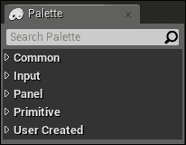

小部件组件分为四个组，即**常用**、**输入**、**面板**和**基本元素**：

+   **常用**：此组包含最常用的小部件，例如按钮、图像框、滑块、进度条等。

+   **输入**：此组包含可以从玩家那里接收输入的元素，例如文本框、旋转框、组合框等。

+   **面板**：此组包含有助于布局小部件和控制放置小部件的元素。

+   **基本元素**：此组包含诸如 Trobbers、可编辑文本等内容。

+   **用户创建**：此部分包含您创建或在项目文件中拥有的任何小部件蓝图。您可以从这里添加它们。

## 层次结构面板

**层次**面板显示了小部件的所有组件的层次结构。

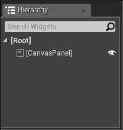

顶部是**CanvasPanel**，它充当 UI 的基础。每当您添加一个组件，它也会被添加到层次结构中。如果您将一个组件拖放到**层次**面板中的小部件组件上，它将作为父级添加到其中，并且您添加的组件将作为子级添加。它们还会在图形编辑器中连接在一起。

## 动画面板

UMG 用户界面中的最终组件是位于窗口底部的**动画**面板。


UMG 允许用户创建动画。您可以对小部件组件进行动画处理以满足您的偏好。**动画**面板的工作方式几乎与虚幻 Matinee 相同。左侧是**轨道**面板。这是您可以添加、删除或移动动画轨道的地方。要添加动画轨道，请单击**+ 新建**按钮。

右侧是动画时间轴。这是您使用关键帧创建动画的地方。在左上角有一些设置，例如启用/禁用网格捕捉、网格捕捉值等。

# 创建主菜单

创建主菜单的第一步是创建一个新的关卡。在编辑器中，单击**文件**，然后选择**新建关卡**。当关卡类型窗口打开时，选择**空关卡**。

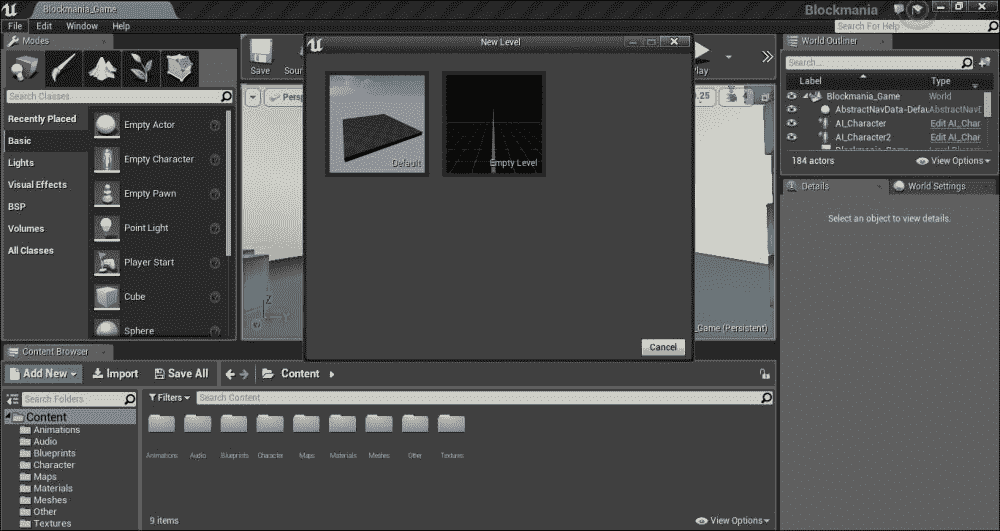

将此关卡命名为**Main_Menu**。创建后，在**内容浏览器**中打开**Main_Menu**小部件类。在 UMG 编辑器中，向画布添加一个**文本**小部件。使文本变大。首先，将文本槽面板的大小增加到 1300 x 200。有两种方法可以做到这一点：第一种方法是单击边缘并拖动以增加大小。第二种方法是在**详细信息**面板中，您可以将**大小 X**设置为`1000`，将**大小 Y**设置为`250`。


文本槽现在已设置。但是，文本本身的实际大小相当小。我们需要做的下一件事是增加文本的大小。同样，在**详细信息**面板下，在**外观**部分，您将找到**字体**选项。在最右边，您可以设置字体大小的值。默认情况下，此值设置为`24`。将其增加到`150`。


这是我们将显示游戏名称的地方。在**内容**部分，您可以设置要在屏幕上打印的文本。无论您写什么都会显示在图形编辑器中。删除**文本块**，并写上游戏的名称：`Bloques`。最后，调整**文本**面板的位置，使名称出现在屏幕中央。


我们要添加的下一件事是一个按钮，当玩家点击时，游戏开始。为此，在**调色板**面板的**常用**部分中添加一个**按钮**小部件。将其放置在游戏名称下方的中央位置。将其尺寸设置为`256 x 64`。我们还需要一些文本放在按钮上，因此从**调色板**面板拖动一个**文本**组件并将其放在按钮上。文本将附加到**按钮**小部件上。您可以在**层次结构**面板中看到**文本**小部件作为组件位于按钮小部件下方。无论您移动按钮小部件，文本小部件都会随之移动。将字体的颜色从白色更改为蓝色，以便清晰可见。

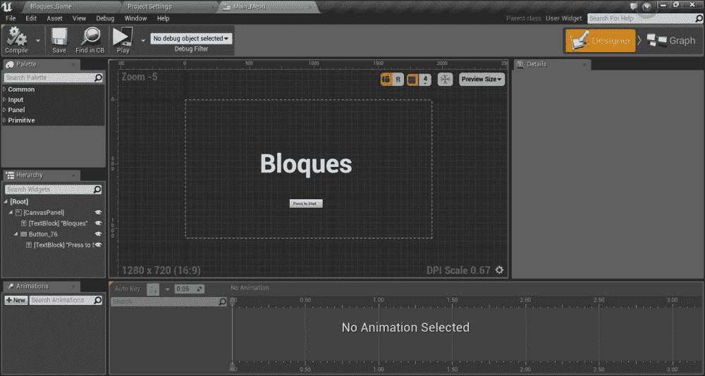

我们已经放置了按钮，但它什么也没做。我们需要编写其功能。选择按钮后，转到**详细信息**面板，在**事件**部分下，单击**OnClicked**旁边的按钮。窗口将切换到**图形**窗口，**OnClicked**按钮事件节点已经设置好。

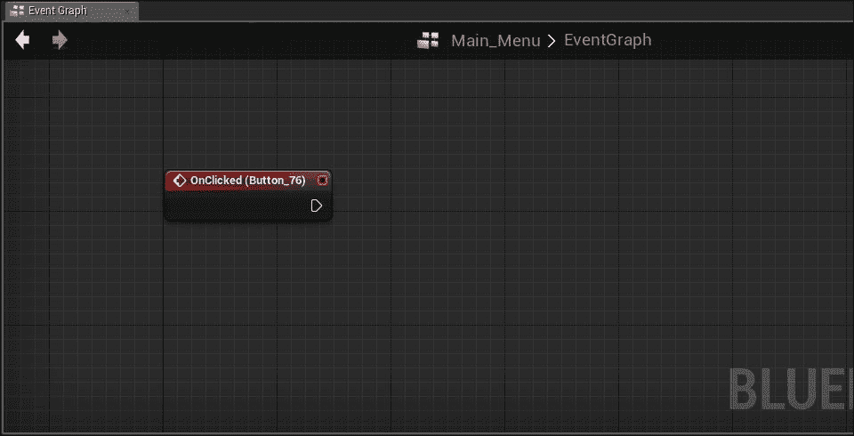

对于这个节点，我们将附加一个**OpenLevel**节点。右键单击并通过在搜索栏中输入来搜索它并将其连接到**OnClicked**节点。在**关卡名称**输入中，写入您想要打开的关卡的名称，我们的情况下是**Bloques_Game**。确保正确复制关卡的名称；否则，它将无法打开。

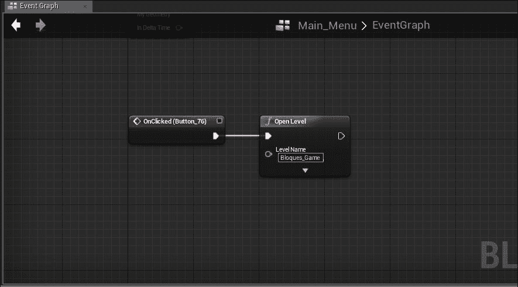

最后，我们还需要移除小部件；否则，当关卡加载时，它仍然会存在。右键单击并选择**从父级中移除**节点，并将其连接到**打开关卡**节点的输出引脚。


就是这样。通过蓝图加载关卡真的是如此简单。

我们已经设置好了我们的主菜单。我们需要将其实现到我们的场景中。为此，打开**关卡蓝图**。在我们能够显示小部件之前，我们首先需要创建它。在**事件开始播放**部分，右键单击并输入`create widget`以找到创建小部件节点并连接它们。接下来，在**类**输入中，单击下拉菜单并选择**Main_Menu**。


当级别开始时，**Main_Menu** 小部件将被创建。创建后，我们需要将其添加到视口，以便玩家可以看到它。为此，我们需要一个**添加到视口**节点。将**返回值**拖出并释放到图形编辑器的任何位置。当菜单打开时，键入`添加到视口`，找到它，并添加它。


如果您要测试游戏，您会发现一旦运行游戏，游戏名称和按钮会出现在屏幕上。

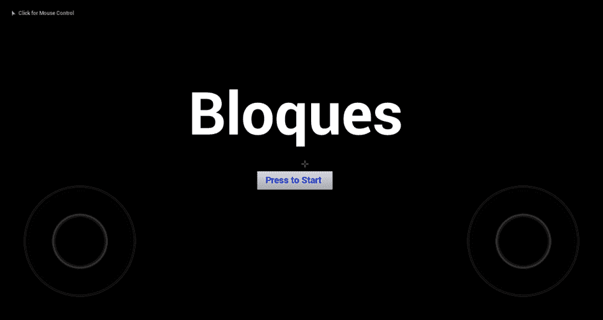

然而，还有一些事情我们可以改进。首先，我们可以隐藏虚拟摇杆，因为它们不是必需的。

在图形编辑器的任何位置右键单击；关闭**上下文敏感**；找到**设置虚拟摇杆可见性**节点；将其添加到图形编辑器；并将其连接到**添加到视口**节点。对于**目标**输入，您需要创建一个**获取玩家控制器**并将其附加到**目标**输入引脚。


现在运行游戏。虚拟摇杆在运行时将不可见。

创建主菜单

如果您按下按钮，它将加载并带您进入游戏，一旦级别加载完成，UI 将消失。这就是如何将主菜单添加到您的游戏中。

# 安装 Android SDK

在我们可以打包游戏之前，我们首先需要安装 Android SDK。幸运的是，您不需要在互联网上找到并下载它；它的安装文件可以在 UE4\ 的**<位置>\ Unreal Engine\ 4.7\ Engine\ Extras \ Android** 中找到。我们需要的文件是 `tadp-2.0r8-windows`。


找到它后，双击运行安装。一旦设置打开，您只需要按照屏幕上的说明进行操作，让它安装。

### 注意

需要注意的一点是，设置需要互联网连接，因为它会下载构建工具；因此，请确保在安装 SDK 工具时连接到互联网。

一旦您成功安装了 Android SDK 文件，下一步需要做的是告诉引擎所有文件的位置（特别是如果您将 SDK 文件安装在默认位置之外的其他位置）。为此，您首先需要打开**项目设置**（可以在**编辑**下的视口菜单栏中找到）。在**项目设置**窗口的**平台**部分下，选择**Android SDK**。


在这里，您可以告诉引擎所有文件夹的位置。左侧是构建 Android 所需的所有文件的列表。右侧的面板是设置相应文件目录的地方。有两种方法可以更改这个。您可以在面板中手动输入文件夹的位置，或者单击面板旁边的**…**。单击它时，**浏览文件夹**窗口会打开，您可以在其中指定文件夹。

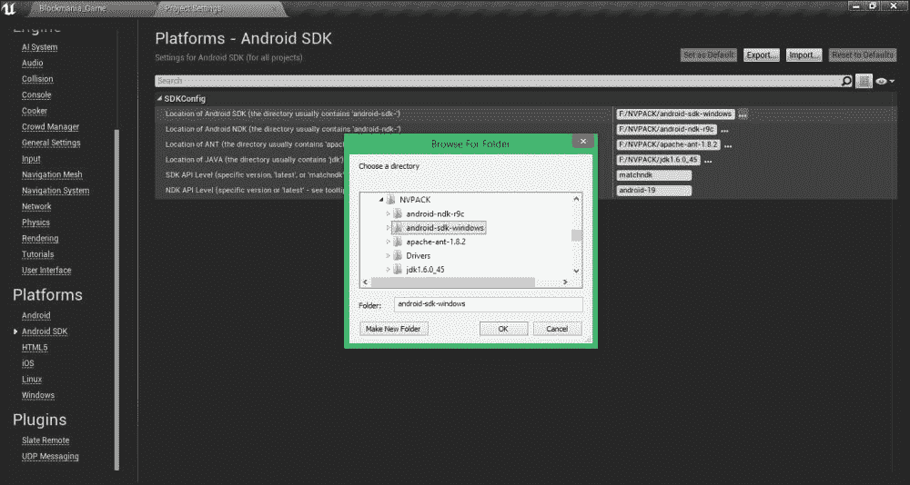

+   第一个选项是针对 Android SDK 文件夹。找到 `android-sdk-windows` 文件夹并设置它。

+   第二个选项是针对 Android NDK 文件。找到 `android-ndk-r9c` 文件夹并设置它。

+   第三个选项是针对 ANT 文件。找到 `apache-ant-1.8.2` 文件夹并设置它。

+   第四个选项是针对 Java 文件。找到 `jdk1.6.0_45` 文件夹并设置它。对于已经安装了 Java SDK 的开发人员，您需要检查系统环境变量和路径是否正确。

您可以有不同的文件夹名称；您只需要确保当前分配了适当的文件夹。

接下来的两个选项是指定要使用的 SDK 和 NDK 工具的版本。Android SDK 文件现在已经安装并设置好了。接下来要做的是为测试设置您的 Android 设备。

# 设置 Android 设备

在开发游戏时，您自然会想要不时地测试游戏，看看它在设备上是否运行顺畅。您可以选择直接在安卓设备上构建和运行游戏，而不是首先打包游戏，将其放在设备上，然后测试它。

1.  要做到这一点，首先要在您的设备上启用开发者模式。这通常可以在**设置** | **关于手机**中找到。在这里，您需要找到**构建号**并多次点击它。如果操作正确，您将收到一个提示，上面写着**您现在是开发者**（在某些设备或安卓版本中，**构建号**选项位于**更多**中）。完成后，将会有一个名为**开发者选项**的新部分可供您使用；打开它并启用**USB 调试**。

1.  完成后，将您的设备连接到系统并让其安装驱动程序。您的设备现在已准备好进行测试。要检查是否已正确设置，在**编辑器视口工具栏**中点击**启动**旁边的小箭头，看看您的安卓设备是否列在**设备**下。如果是，那意味着它已经正确设置。一些设备不会自动安装驱动程序。在这种情况下，建议您从公司的网站上下载相应的驱动程序。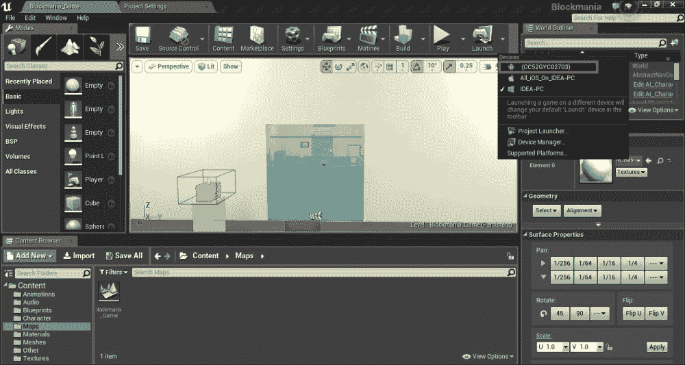

1.  设置好后，我们现在可以在我们的安卓设备上测试游戏。要这样做，点击**设备**下列出的安卓设备。一旦点击，UE4 将开始打包游戏并为设备部署。您可以在屏幕右下角看到一个弹出窗口。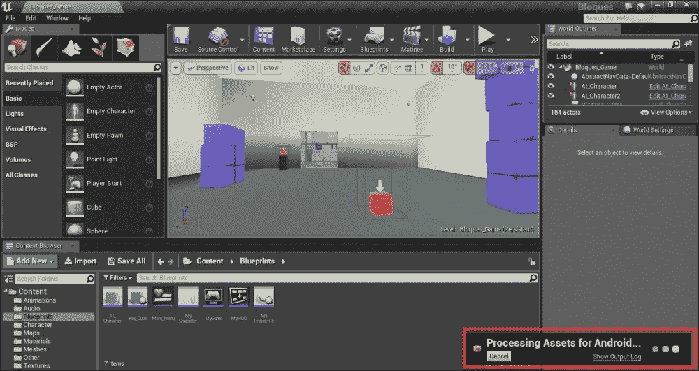

1.  要停止构建过程，请点击**取消**按钮。要查看构建过程的输出日志，请点击**显示输出日志**，这将打开日志窗口，您可以看到正在执行的内容。如果发生错误，您还可以看到错误发生的位置。一旦构建过程结束，它将自动在您的设备上启动。`.apk`文件也将被安装。

# 打包项目

另一种打包游戏并在设备上测试的方法是首先打包游戏，将其导入设备，安装它，然后进行游戏。但首先，我们应该讨论一些关于打包和安卓打包的设置。

## 地图和模式设置

这些设置涉及最终游戏的地图（场景）和游戏模式。在编辑器中，点击**编辑**并选择**项目**设置。在**项目**设置的**项目**类别中，选择**地图和模式**。

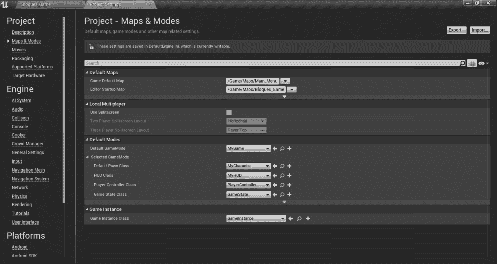

让我们来看看各个部分：

+   **默认地图**：在这里，您可以设置编辑器在打开项目时应该打开哪个地图。您还可以设置游戏在运行时应该打开哪个地图。您需要更改的第一件事是我们创建的主菜单地图。要做到这一点，点击**游戏默认地图**旁边的向下箭头，并选择**Main_Menu**。

+   **本地多人游戏**：如果您的游戏支持本地多人游戏，您可以修改一些关于游戏是否应该有分屏的设置。如果是，您可以设置两个和三个玩家的布局应该是什么样子。

+   **默认模式**：在这个部分，您可以设置游戏应该使用的默认游戏模式。游戏模式包括**默认 Pawn**类、**HUD**类、**Controller**类和**Game State Class**等内容。对于我们的游戏，我们将坚持使用**MyGame**。

+   **游戏实例**：在这里，您可以设置默认的**游戏实例类**。

## 打包设置

在打包游戏时，您可以调整一些设置。要访问这些设置，首先转到**编辑**并打开**项目**设置窗口。一旦打开，在**项目**部分下点击**打包**。


在这里，你可以查看和调整与打包项目文件相关的一般设置。有两个部分：**项目**和**打包**。在**项目**部分，你可以设置选项，比如打包项目的目录、构建配置是调试、开发还是发布，是否希望 UE4 每次构建时都从头开始构建整个项目，或者只构建修改过的文件和资源等等。

在**打包**设置下，你可以设置诸如是否希望所有文件都打包到一个`.pak`文件中而不是许多单独的文件，是否希望这些`.pak`文件分块等等。点击向下的箭头将打开高级设置。

在这里，因为我们正在为分发打包游戏，请勾选**用于分发**复选框。

## 安卓应用程序设置

在前面的部分，我们谈到了一般的打包设置。现在我们将讨论特定于安卓应用程序的设置。这可以在项目设置中的**平台**部分找到。在这个部分，点击**安卓**以打开安卓应用程序设置。


在这里你会找到所有打包游戏所需的设置和属性。首先要做的是配置你的项目以适配安卓。如果你的项目没有配置，它会提示你这样做（自 4.7 版本以来，UE4 会自动为你创建`androidmanifest.xml`文件）。在做其他任何事情之前，请先配置好这个。这里有各种部分。它们是：

+   **APK 打包**：在这个部分，你可以找到选项，比如打开包含所有构建文件的文件夹，设置包的名称，设置版本号，游戏的默认方向等等。

+   **高级 APK 打包**：这个部分包含更高级的打包选项，比如为`.apk`文件添加额外设置。

+   **构建**：要调整**构建**部分的设置，你首先需要从 GitHub 获取源代码。在这里，你可以设置诸如是否希望构建支持 x86、OpenGL ES2 等等的选项。

+   **分发签名**：这个部分涉及到给你的应用签名。在安卓上，所有应用都需要数字签名。这是为了让安卓能够识别应用的开发者。你可以点击部分顶部的超链接了解更多关于数字签名的信息。当你为你的应用生成密钥时，一定要把它保存在一个安全的地方，因为如果你丢失了它，你将无法在 Google Play 上修改或更新你的应用。

+   **Google Play 服务**：安卓应用通过 Google Play 商店下载。这个部分涉及到启用/禁用 Google Play 支持、设置你的应用 ID、Google Play 许可证密钥等等。

+   **图标**：在这个部分，你可以设置你游戏的图标。你可以根据设备的屏幕密度设置各种尺寸的图标。你可以点击部分顶部的超链接获取更多关于图标的信息。

+   **数据烹饪器**：最后，在这个部分，你可以设置游戏中音频的编码方式。

对于我们的游戏，你需要设置的第一件事是**安卓包名**，它在**APK 打包**部分找到。命名的格式是`com.YourCompany.[PROJECT]`。在这里，用公司的名字替换`YourCompany`，用你的项目名替换`[PROJECT]`。


## 构建一个包

要打包你的项目，在编辑器中转到**文件** | **打包项目** | **安卓**。


你会看到不同类型的格式来打包项目。它们如下：

+   **ATC**：如果你有一个配备高通骁龙处理器的设备，请使用这种格式。

+   **DXT**：如果你的设备有 Tegra 图形处理单元（GPU），请使用这种格式。

+   **ETC1**：您可以在任何设备上使用这种格式。但是，此格式不接受带有 alpha 通道的纹理。这些纹理将不被压缩，使您的游戏需要更多的空间。

+   **ETC2**：如果您有一台 MALI 设备，请使用这种格式。

+   **PVRTC**：如果你有一台搭载 PowerVR GPU 的设备，请使用这种格式。

一旦您决定使用哪种格式，点击它开始打包过程。将打开一个窗口，要求您指定要将包存储在哪个文件夹中。


一旦您决定在哪里存储包文件，点击**确定**，构建过程将开始。开始后，就像启动项目一样，屏幕右下角会弹出一个小窗口，通知用户构建过程已经开始。您可以打开输出日志并取消构建过程。

构建过程完成后，转到您设置的文件夹。


游戏中会找到一个`.bat`文件。假设你已经在 Android 类别的**APK 打包**部分的项目设置中勾选了`.apk?`选项（位于包装游戏数据内），你也会找到游戏的`.apk`文件。

`.bat`文件直接将游戏从系统安装到您的设备上。要这样做，首先将您的设备连接到系统。然后双击`.bat`文件。这将打开一个命令提示符窗口。


一旦打开，您无需做任何操作。只需等待安装过程完成。安装完成后，游戏将在您的设备上准备好执行。

要使用`.apk`文件，您需要以略有不同的方式进行操作。`.apk`文件在设备上安装游戏。为此，您需要执行以下步骤：

1.  连接设备。

1.  创建`.apk`文件的副本。

1.  将其粘贴到设备的存储中。

1.  从设备执行`.apk`文件。

安装过程将开始。完成后，您可以玩游戏。

# 开发者控制台

在谈论如何在 Google Play 商店上发布游戏之前，我们首先需要谈论一下**开发者控制台**，从那里您可以管理您的应用程序。这包括将应用程序上传到 Play 商店和从中删除，填写应用程序描述，设置应用程序价格等。但是，在您可以访问**开发者控制台**之前，您首先需要注册。注册费用为 25 美元。注册页面的链接是[`play.google.com/apps/publish/signup/`](https://play.google.com/apps/publish/signup/)。

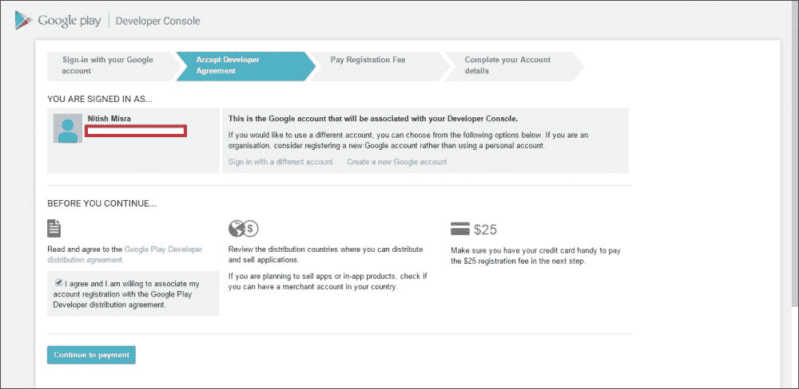

注册后，转到**开发者控制台**页面。


在这里，点击位于右上角的**添加新应用程序按钮**。单击后，将打开一个窗口，您可以在其中设置语言并将游戏名称设置为`Bloques`。设置完成后，点击**上传 APK**。点击后，您将看到有关应用程序的几个选项。

在顶部，您可以看到应用程序的名称 Bloques。在左侧下方是几个面板。在中间是相应面板中可用的设置或选项。

## 所有应用程序

这里显示了您已发布或正在发布的所有应用程序和/或游戏。


尚未发布或正在上传到 Play 商店的应用程序将被保存为草稿。您还可以检查应用程序的下载/安装次数、价格、最后更新时间等信息。单击列出的任何应用程序将打开应用程序页面，在其中您可以为其设置各种属性和选项。

### APK

**APK**面板默认打开。在这里，您可以选择是否要在 Play 商店上发布游戏。


如果您正在开发应用或游戏，并希望在发布最终产品之前在市场上测试您的产品，并获得一些反馈，您可以通过从**BETA 测试**选项卡上传您的应用来设置一个测试版。如果您希望对您的应用进行更受控制的测试，例如只能在有邀请或密钥代码的情况下下载，那么您可以通过从**ALPHA 测试**选项卡上传您的产品来设置一个内测版。

### 商店列表

接下来是**商店列表**面板。该面板包含了与应用在 Google Play 中的显示方式相关的所有选项。

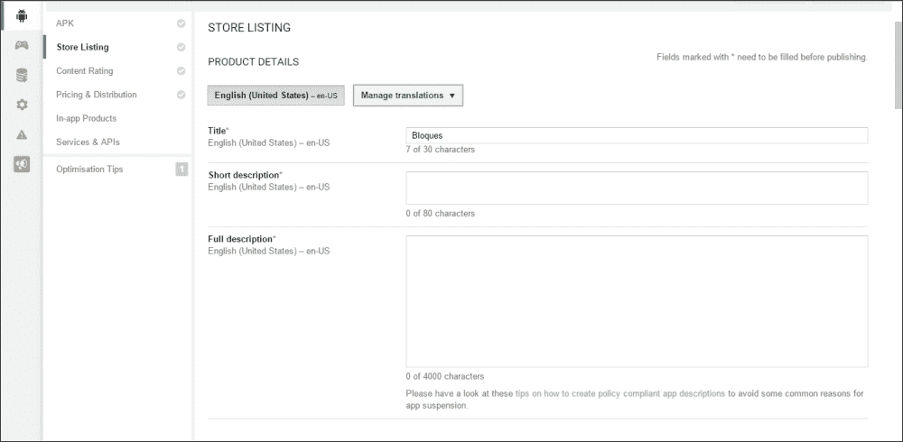

在这里，您需要填写关于您的应用的详细信息。当用户点击应用时，这些详细信息将显示在 Play 商店中。该面板有五个部分。

第一部分是**产品详细信息**。在这里，您可以设置应用的名称，关于您的应用的简短描述（应该足够简短和有趣，以吸引用户的注意力），以及关于您的应用的完整描述（其中包含应用的完整描述、其功能集等）。

接下来是**图形资产**。在这里，您需要发布游戏的屏幕截图。由于有各种不同屏幕尺寸和分辨率的 Android 设备，您需要添加多个不同分辨率的屏幕截图，以便在任何设备上不会被拉伸或压缩。您需要至少添加两个屏幕截图；您可以添加的最大屏幕截图数量为八个。给出了各种设备的所需尺寸，因此您可以检查并相应地设置它们。除了添加屏幕截图，您还可以添加一个视频，可以是应用的预告片或游戏过程视频。

在**图形资产**之后是**分类**面板。这涉及到您的应用将在 Play 商店中如何分类。在这里，您需要指定您的产品是应用还是游戏。设置完后，您需要指定您的产品属于哪个类别；如果您选择了**应用程序**，则在类别下您会得到**图书和参考资料**、**教育**、**商业**、**金融**、**生活方式**等选项。如果您选择了游戏，您将需要在棋盘游戏、益智游戏、休闲游戏等下设置其类型。最后，您还需要为您的应用设置**内容评级**。

接下来是**联系方式**，您可以在其中发布您的网站或公司的网站、联系电子邮件地址和电话号码。

最后，在**隐私政策**部分，您需要为您的应用提供隐私政策。

### 内容评级

内容评级是任何游戏或应用的重要方面。Google Play 也提供了自己的内容评级。

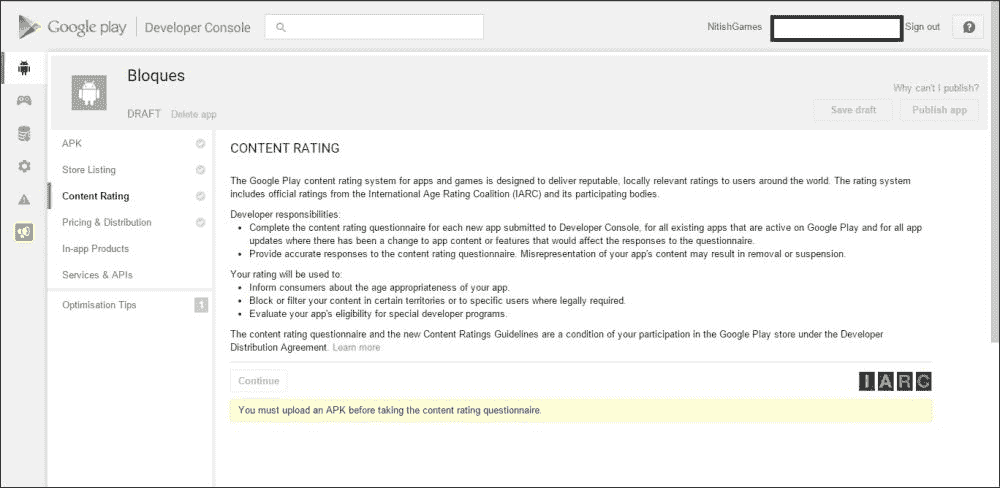

尽管**商店列表**中有一个**内容评级**部分，但这是一个更全面和广泛的评级系统。通过一个包含有关应用/游戏及其内容的各种问题的问卷调查，Google 将对您的产品进行评级。但是要获得问卷调查，您首先需要上传您的应用。

### 定价和分发

该部分包含了与您的应用成本以及您的应用将在哪里提供下载相关的一切。


在顶部，您可以设置您的应用是**免费**还是**付费**。如果您希望您的应用是付费的，您首先需要设置一个商户账户。

在下面是一个国家列表。您可以通过点击复选框选择您希望您的应用在哪个国家可用。如果您希望您的应用在全球范围内可用，请勾选**选择所有国家**，所有复选框都将被选中。

### 应用内产品

该部分包含有关应用内产品的设置。


开发人员使用的一种流行的货币化方法是应用内购买。这些是可以用真实货币购买的虚拟商品。在这里，您可以管理您的应用内产品，并设置价格、可购买的物品等。然而，如果您想在您的游戏或应用中进行应用内购买，您首先必须设置一个商户账户。

### 服务和 API

这是您可以看到 Google 提供的服务在您的应用/游戏中当前是否处于活动状态的地方。

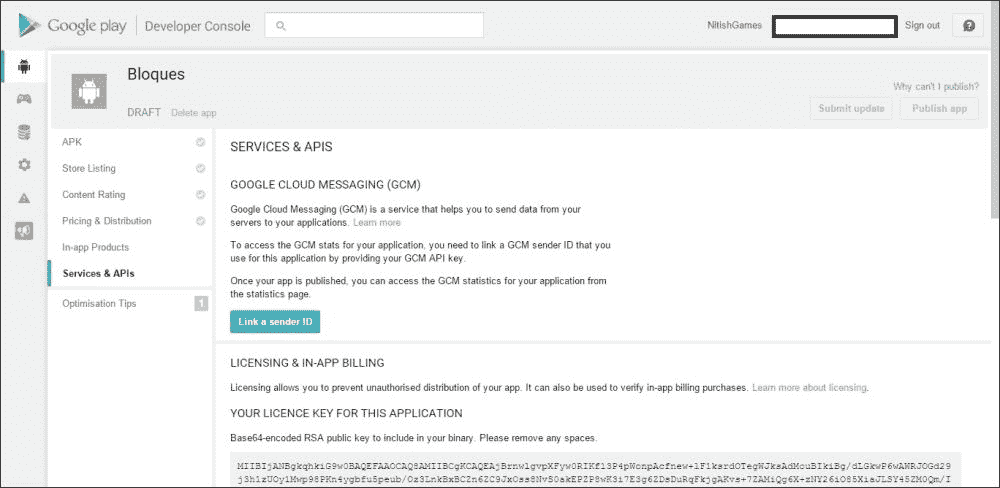

这些服务包括 Google 云消息传递，您可以使用它将信息和数据从服务器发送到您的应用或游戏；许可证，它可以防止盗版和未经授权的产品分发，并用于验证应用内购买；以及 Google Play 服务，其中包括排行榜、成就、推送通知等等。

## 游戏服务

如前所述，Google 为应用开发人员提供各种服务。这是您可以设置您的应用/游戏上想要的服务的地方。


当您进入这个面板时，您会看到您制作的应用的列表，类似于**所有应用**面板中的列表。在这里，您可以查看您的应用或游戏在哪些平台上，您的游戏中有哪些成就，您的排行榜，以及有多少独特的玩家使用他们的 Google 账户登录到您的游戏。与**所有应用**一样，点击应用的名称将打开一个页面，在那里您可以选择关于这些服务的几个选项。

让我们分别讨论这些部分。

### 游戏详情

在这里，您可以设置有关您的应用/游戏的一般详情。

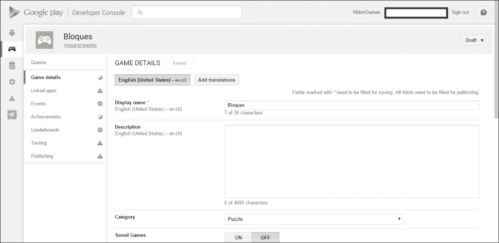

这些一般详情包括您应用的显示名称、描述、类别、图形资产等。您也可以在这里更改这些设置。

### 已链接的应用

要能够使用 Google 服务，您首先必须链接您的应用。

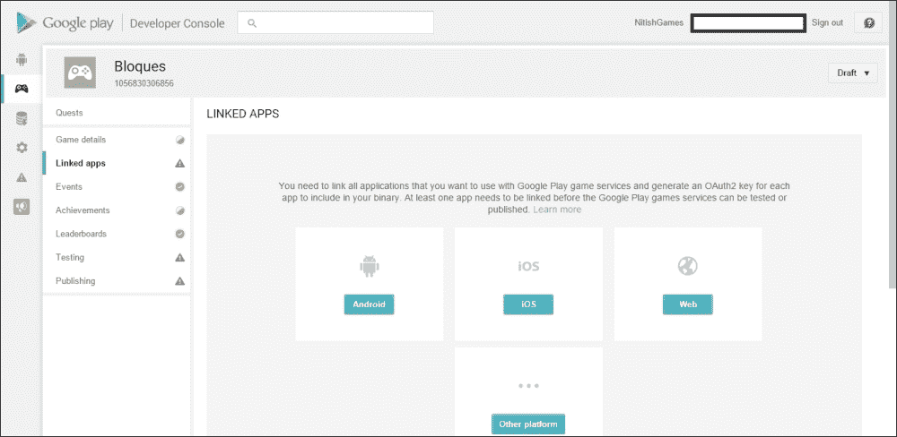

链接您的应用将生成一个 OAuth2 密钥，您需要在应用的二进制文件中包含它，然后才能使用这些服务。在这里，您可以为您的应用选择不同的平台，即 Android、iOS、Web 等。点击其中任何一个将打开一个页面，在那里您必须填写某些细节，然后才能链接您的应用。我们将在后面的部分再回到这个问题。

### 事件

让用户下载您的应用是一回事。确保已下载您的应用或游戏的用户继续使用它们，换句话说用户留存，是一个完全不同的专业领域，同样重要，甚至更重要。接下来的三个面板就是为此而设的。第一个是**活动**面板。


一旦您拥有了大量用户，您可以开始为参与或赢得活动的用户提供定期活动和奖励。活动可以包括每周比赛、游戏产品折扣等。这是保持用户参与游戏的好方法。要添加一个活动，点击**添加活动**，这将带您到**活动**页面，在那里您可以填写有关活动的详细信息。

### 成就

保留用户的另一种方法是创建成就。成就是玩家必须在游戏中执行的目标或任务，以解锁相应的成就。这可能包括像玩游戏*X*次数，杀死*Y*个敌人等。通常，当玩家解锁成就时，他们会获得一些游戏内货币或类似的东西作为奖励。成就非常适合保持完美主义者玩家，他们玩游戏以完成游戏。这意味着完成游戏（如果有结局的话），解锁所有可解锁的内容，并解锁游戏中的每个成就。这也是您的游戏的必要组成部分，因为您至少需要五个成就才能发布您的游戏。


要添加一个成就，点击**添加成就**按钮，它会带你到**成就详情**页面。在这里，你可以设置所有成就的细节，比如成就的名称、如何解锁的描述、图标等等。

### 排行榜

最后，但同样重要的是**排行榜**。排行榜是另一种留住玩家的方式，尤其是那些为了获得最高分而竞争的玩家。排行榜是一种列表，显示了在你的游戏中得分最高的玩家的名字，按照降序排列。


要添加一个排行榜，点击**添加排行榜**按钮，它会带你到**排行榜详情**页面。在这个页面上，你可以设置各种选项，比如名称、格式、排行榜的上限和下限等等。

### 测试

这个部分包含了关于在你的应用/游戏上测试 Google Play 服务的各种选项。在发布游戏之前，建议你先测试你的应用，以确保一切正常运行，如果出现问题，及时修复再发布。

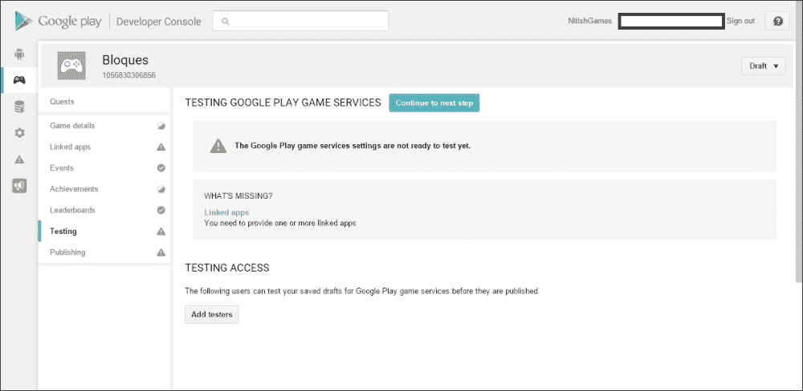

在这里，你可以看到服务是否准备好测试。如果没有，你将被告知在测试开始之前需要什么。你还可以通过点击**添加测试人员**按钮并输入他们各自的 Google 账户信息来邀请其他人测试你的应用/游戏。

### 发布

最后，还有**发布**部分。一旦你填写了所有细节，添加了截图，设置了 Google Play 服务，测试了它们并且确信你的产品已经准备好发布，你就可以发布它。


在这里，你可以看到你的应用/游戏是否准备好发布。如果没有准备好，你可以看到缺少什么，以及在发布之前需要做什么。如果你的游戏已经发布，并且你想要将其从 Play 商店中移除，你可以通过点击**删除你的游戏**按钮来这样做。

## 报告

在**报告**面板中，你可以查看评论、**崩溃和 ANR**、**统计**等内容。


这里也有各种部分，都包含不同的报告：

+   **崩溃和 ANR**: 在这个部分，你可以查看与游戏崩溃和 ANR 相关的报告。游戏崩溃是经常发生的。即使你的游戏经过了良好的优化，仍然可能会出现一些意外问题，有些是小问题，有些是大问题。为了留住你的用户，你必须解决这些崩溃；否则，他们会感到沮丧并删除你的游戏。在这里，你可以查看你发布的所有游戏和应用的崩溃报告，并相应地进行调试。ANR 出现在你的应用在类似于 Windows 和 Mac 上收到的**未响应**提示的设备上停止响应时。这与崩溃不同，因为当游戏崩溃时，应用程序停止运行。当 ANR 发生时，应用程序仍在设备上运行，但不响应。解决这个问题同样重要。

+   **评论**: 了解你的游戏或应用在市场上的表现如何的一个好方法就是阅读它的评论。这也是了解你的游戏或应用的不足之处的好方法。你可以在创建续集或计划开发更新时使用这些信息。你还可以获取关于游戏中存在的任何错误的信息，并利用这些知识来解决它们。

+   **统计**: 这一部分显示了有多少人在玩游戏，你的游戏下载了多少次，你的游戏在哪里最受欢迎（地点），你的游戏有多少活跃用户等等。

+   **财务报告**: 最后，还有**财务报告**部分，你可以在其中跟踪你的产品产生的收入，并据此更新你的游戏或应用。

## 设置

在这里，您可以查看和设置有关帐户详细信息、谁可以访问开发者控制台的权限等方面的各种选项。

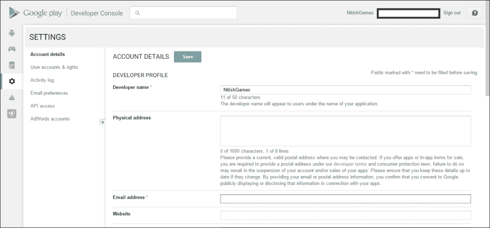

这里也有各种部分，每个部分都根据选项类型进行分类，如下所示：

+   **帐户详细信息**：此部分包含有关您的开发者控制台帐户的所有常规选项，例如开发者姓名、地址、电子邮件 ID、网站 URL 等。

+   **用户帐户和权限**：从这里，您可以设置谁可以访问您的开发者控制台。在团队中工作时，您可能希望所有人都能访问。您可以在此部分进行设置。

+   **活动日志**：在这里，您可以查看您在开发者控制台中对应用程序所做的所有更改，以及特定更改的时间戳。这是跟踪应用程序所做的任何更改的好方法。

+   **电子邮件首选项**：如果您希望或不希望通过电子邮件接收有关您的应用程序的警报，您可以在此处进行设置。

+   **API 访问**：API 是应用程序的重要方面。它允许您管理诸如应用内购买、认证交易等事项。但是，在您可以使用它们之前，您必须首先链接您的应用程序。您可以在**API 访问**部分链接您的应用程序。

+   **AdWords 帐户**：在这里，您可以将您的帐户链接到**AdWords 帐户**。AdWords 是 Google 提供的一项服务，它允许您通过使用先进的定位技术来推广您的应用程序，以确保正确的人看到您的应用程序或游戏的广告或促销。

## 警报

在设置部分，我们讨论了如何打开/关闭电子邮件警报。如果您已打开电子邮件警报，您将通过电子邮件接收有关应用程序的所有警报。如果您关闭了它，您可以在**警报**面板中查看这些警报。


# 发布您的游戏

既然我们已经讨论了开发者控制台，我们可以继续将我们的游戏发布到 Google Play 商店。

## 激活 Google 服务

现在，由于应用程序超过 50 MB，您将需要使用 Google Play 服务，即 APK 扩展文件。转到**游戏服务**面板，然后转到**游戏详细信息**部分。在这里，填写所有字段，因为这些都是在您发布服务之前应用程序应具备的基本要求。这包括设置**显示名称**，您可以将其设置为`Bloques`。在**描述**部分，只需写出游戏是什么，游戏的目标等。


由于这是一个益智游戏，在**类别**字段中选择**益智**。此外，由于我们不需要保存的游戏，您可以将其设置为**关闭**。对于**图形资产**，您将需要至少两个：一个用于图标，一个用于特色图形。截图所需的分辨率为`512 x 512`，特色图形所需的分辨率为`1024 x 500`。您可以拍摄高分辨率截图并在 Photoshop 中进行编辑以创建您的图像。


一切都设置好后，单击屏幕顶部的**保存**。

填写完详细信息后，转到**已链接的应用程序**，填写必填字段，然后在顶部单击**继续**。单击后，您将需要授权您的应用程序。单击**立即授权您的应用程序**按钮。这将打开一个菜单，要求您填写产品名称、标志等。但是，由于我们之前已经填写了这些详细信息，我们可以将其保留（除非您想进行任何更改）。单击**继续**。在我们继续之前，我们首先必须创建一个客户端 ID。要找出您的应用程序的客户端 ID 是什么，请按照以下步骤进行：

1.  打开命令提示符。确保以管理员身份运行。

1.  运行以下命令：

```kt
keystore –exportcert –alias androiddebugkey –keystore C:\Users\*Your Username*\.android\debug.keystore –list –v
```

1.  当它要求密码时，输入默认密码：`android`。

1.  复制 SHA1 签名并粘贴到签名证书指纹（SHA1）字段中。

1.  接下来，点击**创建 ID**，这将为您创建一个客户端 ID。

完成后，Google 将为您的游戏创建一个唯一的客户端 ID 以及一个应用程序 ID。

接下来我们需要的是**成就**。为了发布我们的游戏，我们需要至少五个成就。您需要一个成就的名称，描述以及与之配套的图标。您可以创建自己的成就，但目前有五个成就如下：

+   **第一次**：这是玩家第一次玩游戏时

+   **掌握要领**：这是玩家清理第二个房间时

+   **傀儡大师**：这是玩家清理第三个房间时

+   **拼图大师**：这是玩家清理第四个房间时

+   **上瘾**：这是玩家玩游戏五次时


您可以分配任意数量的积分。我们不需要排行榜，因为我们的游戏没有积分或分数。

## 为出货准备项目

现在我们需要回到**引擎**并在项目中定义一些设置。首先，我们需要设置我们将要进行的构建类型。要做到这一点，转到**项目设置**，在**项目**下，在**打包**部分，选中**用于分发**框。您会注意到**构建配置**选项将设置为`Shipping`并且该选项将被锁定。


接下来我们要做的是将一些值从开发者控制台复制到我们的项目中。转到**项目设置** | **平台** | **Android**。首先，在**APK 打包**部分，取消选中**将游戏数据打包在.apk 内？**。由于我们的游戏超过 50 MB，我们无法直接上传.apk 文件。我们需要的是一个`.obb`文件，一个扩展文件，我们将除了`.apk`文件之外上传。取消此选项后，UE4 将自动创建一个`.apk`文件（小于 50 MB）以及一个`.obb`文件（扩展文件）。

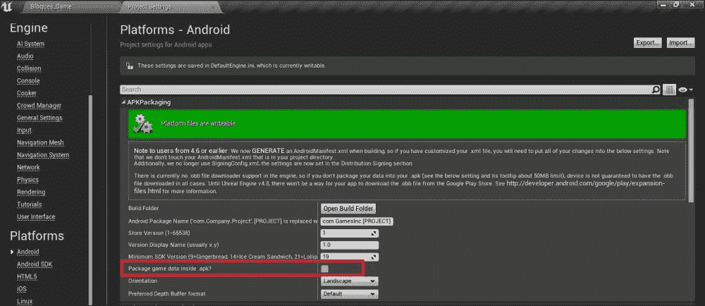

接下来，转到**分发签名**。如果我们要为出货打包我们的游戏，这部分是必要的。我们需要的第一件事是创建一个`keystore`文件。密钥库文件是一个具有一组密钥的二进制文件。您可以将其视为用于在应用商店上识别和验证您的应用的数字签名。有各种方法可以创建密钥库：其中之一是使用命令提示符的帮助。因此，以管理员身份运行命令提示符并输入以下命令：

```kt

keytool –genkey –v –keystore -*name of your project*.keystore –alias *alias_name* -keyalg RSA – keysize 2048 –validity 10000

```

用 Bloques（或您认为合适的任何名称）替换`*项目名称*`，用 Game（或您认为合适的任何名称）替换`*别名*`。

在输入命令后，您将被要求填写一些其他信息，例如密钥库的密码，您的姓名，您公司的信息等。填写完毕后，密钥库将被创建。找到它并将其放置在`*项目目录*/Build/Android`中。

完成后，返回到**项目首选项**，在**分发签名**下，在**密钥库**中，输入您创建的`keystore`文件的名称，以及扩展名（例如，如果密钥库的名称是 Bloques，则输入 Bloques.keystore）。然后，在**密钥别名**中，输入别名（Game）。最后，在**密钥库密码**和**密钥密码**字段中，输入您在创建`keystore`文件时定义的密码。


接下来，转到**Google Play 服务**。这里要做的第一件事是检查**启用 Google Play 支持**。这将在游戏中启用 Google Play 服务。在**游戏应用 ID**字段中，填写您在开发者控制台中链接应用程序时获得的应用程序 ID。您可以在开发者控制台的**游戏服务**面板的**已链接应用程序**的**授权**部分中找到此 ID。

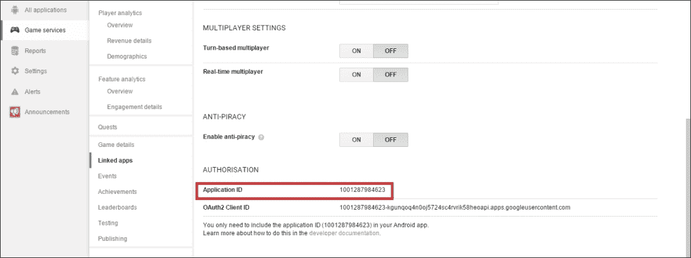

接下来，我们需要 Google Play 许可密钥。这可以在**开发者控制台**的**所有应用程序**面板的**服务和 API**的**许可和应用内结算**部分中找到。

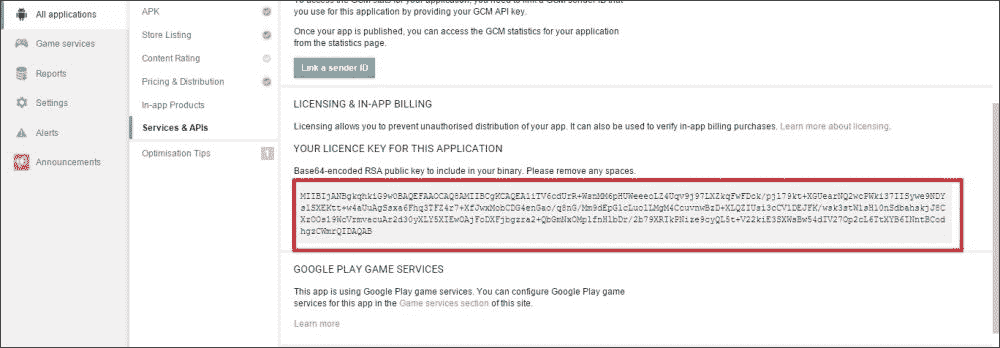

这一长串看似随机的字符是我们的许可密钥。复制整个内容并粘贴到**Google Play 许可密钥**部分。接下来，在成就地图中，填写您之前创建的成就的名称和 ID。


只需在此处复制并粘贴名称以及 ID。如果您有图标要添加，也可以在**图标**部分添加。现在我们已经准备好为分发打包我们的游戏。因此，在编辑器中，转到**文件** | **打包项目** | **Android**，选择任何格式并打包游戏。

构建完成后，转到您设置用于存储包的文件夹。您将看到项目的`.apk`文件、`.bat`文件和`.obb`文件。我们只需要`.apk`和`.obb`文件。


## 在 Play 商店上传游戏

最后一步是将包上传到 Play 商店并填写更多细节。返回**开发者控制台**，转到**所有应用程序**。在其中，转到**APK**。在这里，我们上传我们的`.apk`和`.obb`文件。转到**生产**选项卡，然后单击**上传 APK**；然后选择`.apk`文件。上传完成后，我们需要上传扩展名或`.obb`文件。


要上传`.obb`文件，请单击**无扩展**文件以打开下拉菜单，然后选择**上传新文件**。从那里，选择`.obb`文件。上传完成后，单击**保存草稿**。

接下来要做的是填写**商店列表**部分中的各个部分。这与我们在**游戏服务**面板的**游戏详情**部分中填写的内容类似。您可以复制粘贴字段。这里还需要至少两张截图。

接下来，转到**内容评级**。在这里，一旦您上传了 APK，您将被要求填写一个问卷调查，这将正确评价您的应用程序。这些问题大多与您的游戏内容有关。填写并保存问卷。**保存**按钮位于底部。接下来，单击**计算评级**，它将为您的游戏生成适当的评级。一旦您看到您的评级，单击页面底部的**应用评级**。

最后需要填写的是**定价和分销**表格。在这里，您需要指定希望游戏在哪些国家可用，并勾选阅读并同意有关出口法律的指南等。

现在您已经准备好发布您的应用程序。要这样做，请单击**开发者控制台**右上角的**发布应用**，您的应用程序将被添加到 Google Play 商店供全世界下载、玩耍和享受。

# 货币化方法

制作好游戏是一回事。然而，最重要的是您的游戏能够产生收入，因为毕竟，我们都有账单要支付。自从手机游戏出现以来，出现了几种货币化模型。以下是开发人员用来产生收入的四种最受欢迎和广泛使用的货币化模型：

+   **免费模式**：这是一种广泛使用的商业模式，由《愤怒的小鸟》、《割绳子》等游戏所推广。在这里，你可以免费使用游戏的某些功能，而其他功能被锁定，需要付费解锁。这种模式的主要目标是尽可能吸引更多的人，并让他们预览应用程序及其功能，而不会透露太多，以便用户对购买整个应用程序产生足够的兴趣。这类似于 PC 和游戏机的演示版本。

使用这种模式的优势是用户可以在购买之前尝试产品，这样他们更有可能在以后购买应用程序。这也是建立大型用户群的简单方法，因为应用程序没有前期收费，人们喜欢免费的东西。

另一方面，使用这种模式的一些缺点是，如果你提供的功能太少，用户将不会对购买整个产品产生足够的兴趣。另一方面，如果你提供的功能太多，用户将没有足够的理由购买整个产品。

+   **应用内广告**：另一种流行的商业模式是为用户完全免费提供产品。开发者通过应用内广告赚取收入。你可能见过这样的应用。游戏或应用程序是免费下载的，屏幕顶部或底部有广告横幅。

使用这种模式的优势是，你完全消除了用户和应用程序提供的功能之间的任何付费壁垒，使其更具吸引力。你还可以根据用户的行为收集数据，并将其用于定向广告。

然而，使用这种模式意味着牺牲已经有限的屏幕空间来放置广告，这意味着牺牲用户体验。另一件事要记住的是，人们可能会因为广告而感到烦恼，这可能导致他们停止使用或卸载应用。因此要小心如何以及何时使用它们。

+   **付费应用程序**：顾名思义，在这种模式下，应用程序不是免费的；用户必须购买应用程序才能使用。使用这种模式的优势是，你可以从每次下载中获得前期收入，以及更好的用户留存率（因为他们付费下载应用程序，他们更有可能频繁使用）。然而，除非你在应用市场有良好的声誉，否则很难说服用户为你的产品提前付费。这也意味着用户会对你的产品有很高的期望。

+   **应用内购买**：这种模式由《糖果传奇》、《部落冲突》等游戏所推广，与免费模式类似，产品是免费提供的。然而，在这种情况下，用户在购买之前不会被限制使用任何功能。相反，他们从一开始就可以使用所有功能。开发者赚取收入的方式是通过应用内购买。这些是虚拟商品，如生命、能量增强、虚拟货币等。使用这种模式的优势是它增加了用户参与度，因此也增加了用户留存率。另一件事是，它的风险水平较低，因为它不需要太多的投资。然而，要记住不要过度使用这种模式。开发者犯的一个致命错误是构建一个几乎无法玩的游戏，除非用户付费。

# 移动性能和优化

每个开发者都希望通过各种类型的后期处理、复杂的着色器、照明等使他们的游戏变得漂亮而美丽。虽然在 PC/游戏机上制作游戏时这是完全可以的，但你必须记住移动平台有一定的技术限制，这可能会导致你的游戏性能不佳，从而导致销售不佳。以下是一些关于如何优化游戏以实现最佳性能的技巧和窍门。

+   整个场景的绘制调用应该少于 700 次，以实现最佳性能。

+   尽管动态光线使游戏看起来很好，但在技术上也很重。因此，除非绝对需要，避免使用动态光线。此外，建议在将游戏移植到设备上之前构建照明。

+   整个场景的三角形数量理想情况下应为 500,000 或更少。

+   除非绝对需要，您应该关闭移动**高清晰度渲染**（**HDR**）。这会关闭照明功能，并大大提高移动性能。

+   同样，除非需要，您应该关闭后期处理功能以获得更好的性能。

+   在纹理方面，为了防止内存浪费，它们的分辨率应为 2 的幂（256 x 256，512 x 512，1024 x 1024 等）。

您可以在**项目设置**中的**引擎**类别下的**渲染**部分中设置一些**渲染**选项。

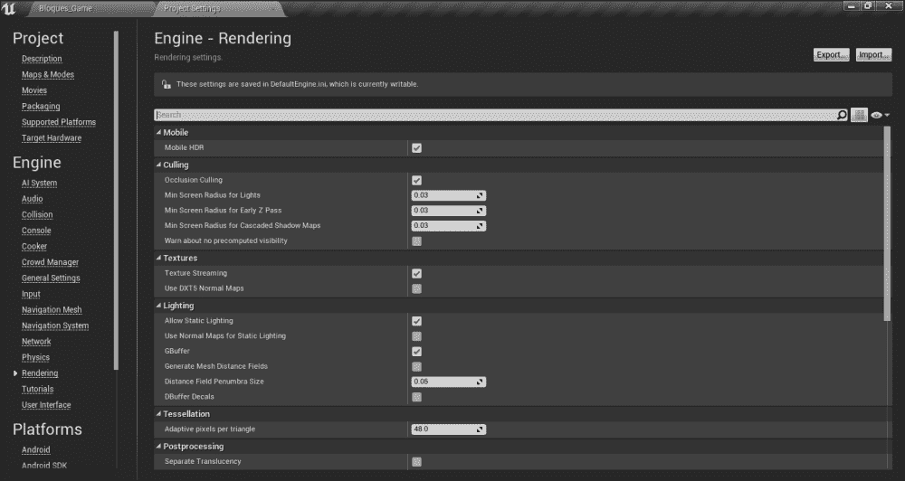

您可以从这里打开/关闭不同的功能，如照明，后期处理，纹理等，包括上述的最后两点。

在性能方面，您首先应该了解一些性能层次。它们都与游戏中的照明功能有关。在为移动设备开发游戏时，根据您的要求和目标平台，您应该牢记这些：

+   **低动态范围**（**LDR**）：这种模式具有最高的性能，对内存和处理器的负荷最小。这种模式适用于不需要照明特性和/或后期处理的游戏。

+   **基本照明**：在性能方面，这是下一个最佳模式。在这种模式下，您可以访问 UE4 提供的基本照明功能，如全局照明，材质着色等。

+   **全高动态范围照明**：这种模式位于光谱的另一端。它的性能最低，对内存和处理器的负荷最高。在这种模式下，您可以利用 UE4 提供的大多数照明和后期处理功能。不建议在移动游戏中使用。

### 提示

建议您访问[`wiki.unrealengine.com/Android_Device_Compatibility`](https://wiki.unrealengine.com/Android_Device_Compatibility)。这是一个社区驱动的页面，社区的各种成员使用不同的照明模式在各种基于 Android 的设备上测试了 UE4。在为 Android 开发游戏时，这非常有帮助。如果您已经在未列出的设备上测试了 UE4，您可以自行发布，以造福其他社区成员。

# 总结

在本章中，我们讨论了 UMG 及其用户界面。使用它，我们为游戏创建了一个主菜单（其中包含游戏的名称和一个按钮，玩家触摸按钮后游戏开始）。做到这一点后，我们就准备好为 Android 设备打包我们的游戏了。

这样做的第一步是安装包含打包游戏所需的所有构建文件的 Android SDK。安装完成后，下一步是指定引擎文件的位置。然后，我们讨论了如何设置 Android 设备以直接测试游戏，而无需每次都打包游戏。最后，我们讨论了如何打包最终产品并将游戏上传到 Google Play 商店供用户下载。

本章以有关少数被移动游戏开发者广泛使用的盈利模式的细节结束，以及有关如何为移动设备正确优化游戏的一些建议。

您现在已经掌握了开始制作您梦寐以求的游戏所需的一切知识。从现在开始，您在 UE4 上变得更好的唯一方法就是练习。
