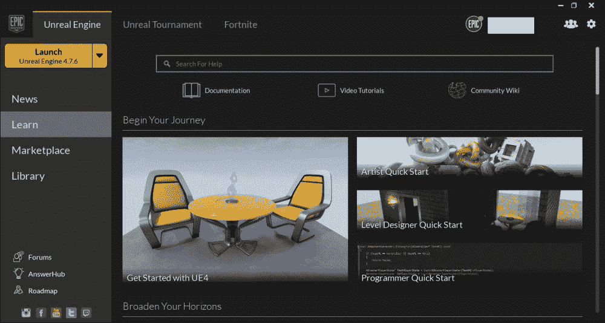
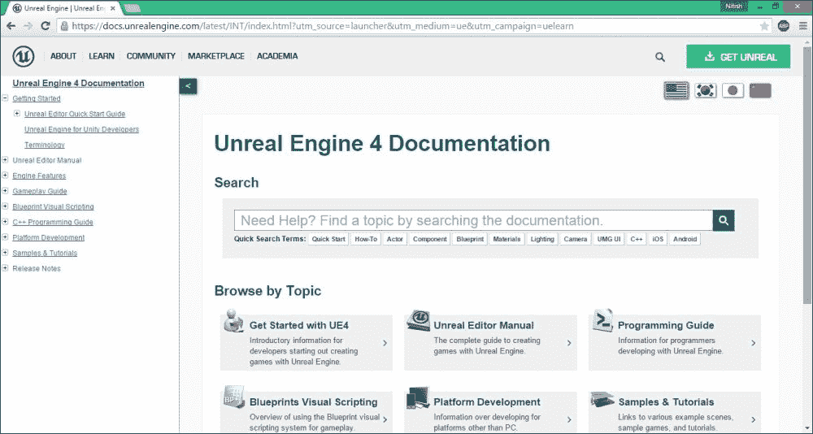
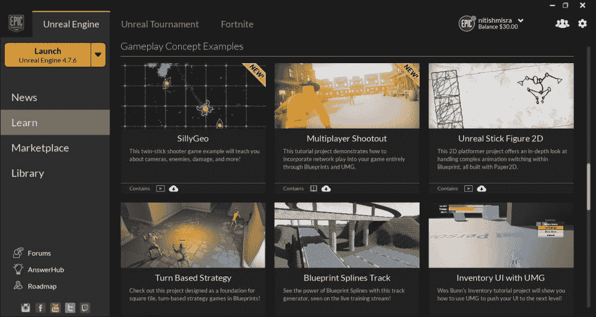
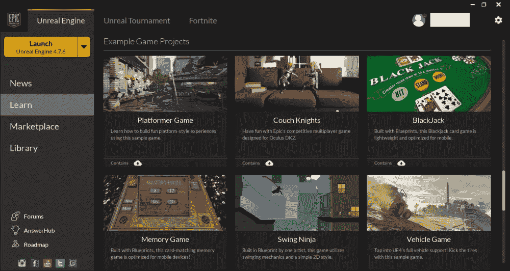

# 附录 A. 接下来做什么？

在本书中，我们涵盖了一系列主题，比如如何下载和安装 UE4，如何创建项目，如何创建材料，从其他项目中添加/导入/迁移资产，使用蓝图进行脚本编写等等。希望到目前为止，您已经了解足够多关于 UE4 的知识，可以开始使用了。下一步是将您所学到的知识付诸实践。

# 学习

我们在第一章中简要介绍了 UE4 启动器中的**学习**部分。让我们再多谈一些。

该面板包含了涵盖各种主题的教程，包括如何创建材料、蓝图等。这里提供的教程以以下各种格式提供。

+   **视频教程**：首先，Epic 提供了视频教程。要访问它们，点击页面顶部的**视频教程**按钮，它会带您到虚幻网站。

在这里，您可以找到各种视频教程系列，都被整齐地分类以方便您查找。如果您向下滚动页面，您会找到浏览部分，列出了所有主题以及每个主题的视频系列数量。点击任何主题，您将看到为该特定主题提供的所有教程系列。

+   **文档**：然后是 Epic 的官方文档。要访问它，点击**文档**超链接，它会带您到 Epic 的官方文档页面。

文档页面，就像视频教程页面一样，包含了各种主题的教程，但它们更深入，涵盖了更多的主题。左侧是导航面板。所有主题都在那里列出。点击任何带有**+**标志的主题会展开更多子主题，您可以从中选择您想要了解的内容。当您点击一个主题时，它会在屏幕的右侧打开。

### 注意

如果您习惯在 Unity 上制作游戏，并想转到 Unreal 4，Epic 提供了一份文档，比较了两个引擎的视口、术语等，以便您可以将您的技能从 Unity 转换到 Unreal 4。您可以在**拓宽您的视野**部分找到它

+   **虚幻百科**：虚幻百科可通过顶部的**百科**超链接访问，是 UE4 的官方百科页面，由社区制作，并由他们不断更新。

在这里，您可以找到由社区创建的教程、插件、代码和游戏，以帮助您发展技能。您还可以将自己的内容或教程提交到百科页面供他人查看。最后，您可以看到人们正在使用 UE4 开发的游戏列表。您也可以提交您的游戏以获得一些宣传。

+   **引擎特性示例**：此部分包含项目文件，每个文件都包含 UE4 提供的一个或多个特性。

例如，有一个项目展示了 Matinee，然后有一个项目演示了 UE4 提供的地形工具，等等。一旦您选择并下载了一个项目文件，您可以打开并查看它。与该特性相关的所有内容都已为您设置好，您可以亲自看看它们是如何工作的，如何连接起来等等。这也是获取资产（材料、纹理、蓝图类等）的好方法，可以用于您自己的项目。

### 注意

强烈建议您下载**内容示例**项目。该项目文件包含了 UE4 提供的各种特性，以博物馆的方式展示在不同的关卡中。例如，有一个关卡展示了材质编辑器及其功能，还有一个关卡演示了动画特性等等。

+   **游戏内容示例**：这个部分包含了展示功能的项目文件，类似于引擎功能示例中的内容，但更专注于游戏。

这些项目大多包含蓝图，每个蓝图都包含游戏中通常找到的机制或功能。它们提供了框架，您可以用来构建游戏。例如，您可以找到一个包含回合制机制设置的项目文件，还有一个演示库存 UI 的项目，等等。

+   **示例游戏项目**：这个部分类似于**游戏内容示例**部分，唯一的区别在于这个部分包含了已经设置好的示例游戏的项目文件。

示例游戏项目提供了资产和设置好的关卡供您探索、学习和利用。您可以选择各种类型的游戏，例如 2D 平台游戏、3D 平台游戏、FPS 等等。

+   **社区贡献**：这个部分还包含了一些带有示例游戏和环境的项目文件，但与其他部分的项目文件不同，这里的内容是由社区创建的，由 Epic 精心挑选的。

在撰写本文时，这个部分只包含两个项目文件，即 Radial Impact，演示了保存菜单等内容，以及 SciFi Bunker，展示了 UE4 的渲染技术。

+   **平台和合作伙伴**：最后，还有**平台和合作伙伴**部分，其中包含了 UE4 当前支持的技术和外围设备的示例项目。

在撰写本文时，只有一个 Leap Motion 的示例项目可用。单击缩略图将带您到官方页面，在那里您可以下载并尝试 Leap Motion 的实验。

# AnswerHub

**AnswerHub**，另一个在第一章中简要介绍的话题，*Unreal 4 入门*，是一个您可以发布关于您遇到问题的特定主题的问题，或者如果您需要帮助的话。单击启动客户端左下角的**AnswerHub**超链接将带您到 AnswerHub 页面。

在首页，您可以看到其他成员发布的问题列表。现在，您遇到的问题很可能并不是独一无二的。因此，在发布问题之前，建议您首先在 AnswerHub 上搜索相同或类似的问题。只有当您找不到合适的解决方案或任何解决方案时，才应该发布问题。

要发布问题，请单击页面右上角的**发布问题**按钮，这将带您到**提问**页面。

您把问题放在最上面。确保问题清晰、简洁，并以一种读者能够在阅读后得到一个概念的方式进行书写。在下面，您可以选择问题所涉及的部分。例如，如果您在打包游戏时遇到困难，那么在这个部分，您应该选择**打包和部署**，等等。

在下面，您可以详细描述您的问题。这是您详细阐述您发布的问题的地方。再次强调，尽量保持简洁、清晰，如果可能的话，发布截图、日志文件等，以便其他人更容易理解您的问题。

最后，您需要给您的问题设置标签。标签可以让用户更容易搜索问题。当您搜索问题时，搜索引擎会将您写的内容与标签进行比较，因此请确保您正确地给问题打上标签。

帮助他人总是件好事。因此，如果你觉得自己可以帮助有问题的人，你应该通过回答其他成员发布的问题来帮助他/她。这是与社区互动的好方法，你也可能在这个过程中学到一些新东西。这也是建立你的声望分的好方法。如果你在 AnswerHub 上非常活跃，而且你的答案很有用，你会得到点赞，从而增加你的声望分（有点像 Reddit）。

# 论坛

最后，我们有我们老牌的论坛。在引擎启动器上点击**论坛**超链接将带你到论坛页面。

论坛被整齐地分类，基于各种话题，这样你就更容易找到相关的帖子进行发表。各个部分如下：

+   **虚幻引擎**：这里发布了与 UE4 相关的所有话题，比如最新公告、更新、市场等等。

+   **开发讨论**：这个部分包含与在 UE4 中开发游戏或其他项目相关的话题。这些话题涵盖了诸如渲染、动画、内容创建、建筑可视化等内容，以及更多技术性的话题，比如 C++编程、Android 开发、iOS 开发等等。

+   **社区**：这是你可以更直接地与社区互动的地方。例如，如果你有兴趣制作游戏或产品，但缺乏人才，或者如果你有兴趣加入一个团队制作游戏，你可以去**有技能？寻找人才？**部分，发表你的需求或个人资料，希望得到一些回应。另外，如果你已经在做一个项目，并且想要得到一些反馈，你可以在**进行中的工作**部分发表，从其他社区成员那里得到一些建设性的反馈。这也是让你的游戏被注意到的好方法。

+   **学校的 UE4**：这个部分包含与学术相关的话题和讨论帖。在这里，导师们可以讨论课程设置以及如何教授 UE4 给学生，并给其他教育工作者提供反馈。如果你是学生，你可以与其他同学讨论 UE4，并得到一些支持。

+   **国际**：最后，如果你有兴趣与你附近的社区成员互动，你可以在相关的子版块中发表讨论帖。例如，如果你想制作一个游戏，但希望你的团队成员附近，你可以发表相关主题。

# 总结

在这里，我们看了一下你可以学习和提升你在阅读本指南后所获得的 UE4 技能的各种方式。

好消息是，UE4 本身拥有大量的教程，几乎以各种格式提供，无论是书面的、视频的、项目文件、直播等等。仅仅通过阅读这些教程，你就可以学到很多关于引擎的知识。

如果你仍然需要关于特定方面或功能的帮助，或者你有一个似乎无法解决的问题，或者只是需要一些帮助，你总是可以在 AnswerHub 上发帖，让其他社区成员和/或 Epic 工作人员来解决。另外，如果你发现其他社区成员发布了一个问题，你认为自己知道答案，为什么不伸出援手呢？这将提高你的声望并保持社区的活跃。

最后，还有论坛，你也可以在这里寻求帮助，讨论最新的更新和市场新增内容，展示你的作品并获得一些反馈，给予他人作品的反馈，招募人才，或者加入一个团队等等。
