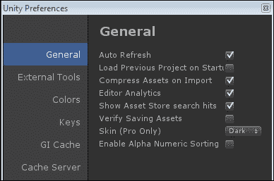
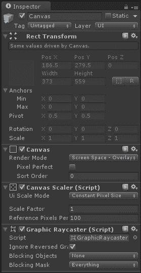
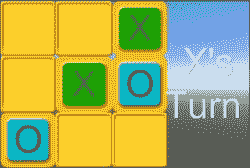
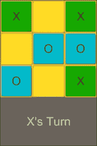
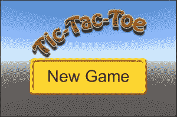
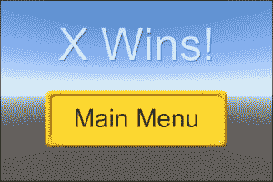

# 第二章. 外观美观——图形界面

在上一章中，我们介绍了 Unity 和 Android 的特性，并讨论了将它们一起使用的益处。在我们安装了大量软件并设置好设备之后，我们创建了一个简单的 Hello World 应用程序，以确认一切连接正确。

本章完全关于**图形用户界面**（**GUI**）。我们将从使用 Unity 提供的基本 GUI 组件创建一个简单的井字游戏开始。接下来，我们将讨论如何改变我们的 GUI 控件的样式，以改善游戏的外观。我们还将探索一些技巧，以处理 Android 设备的不同屏幕尺寸。最后，我们将学习一种比上一章介绍的方法更快的方式，将我们的游戏放在设备上。说到这里，让我们开始吧。

在本章中，我们将涵盖以下主题：

+   用户偏好设置

+   按钮文字和图片

+   动态 GUI 定位

+   构建和运行

在本章中，我们将在 Unity 中创建一个新项目。这里的第一个部分将指导你完成创建和设置。

# 创建一个井字游戏

本章的项目是一个简单的类似井字风格的游戏，就像我们可能在纸上玩的那样。与其他任何事情一样，有多种方法可以制作这个游戏。我们将使用 Unity 的 uGUI 系统，以便更好地了解如何为我们的其他游戏创建一个图形用户界面。

## 游戏板

基本的井字游戏涉及两名玩家和一个 3x3 的网格。玩家轮流用 X 和 O 填充方格。第一个用字母填满一行三个方格的玩家赢得游戏。如果所有方格被填满，但没有玩家达到三个连成一行的方格，则游戏平局。让我们从以下步骤开始创建我们的游戏板：

1.  首先，我们需要为本章创建一个项目。因此，启动 Unity，我们将执行这一操作。

    如果你一直按照至今的步骤操作，Unity 应该会启动到最后打开的项目。这并不是一个糟糕的特性，但它可能变得非常烦人。想象一下：你一直在一个项目上工作了一段时间，它已经变得很大。现在你需要快速打开别的东西，但 Unity 默认会打开你的大型项目。如果你在它能打开之前等待，那么可能会消耗很多时间。

    要更改此功能，请转到 Unity 窗口顶部，点击**编辑**，然后点击**偏好设置**。这是我们更改脚本编辑器偏好的同一个地方。不过，这次我们将更改**常规**标签下的设置。以下屏幕截图显示了**常规**标签下存在的选项：

    

1.  在这个时候，我们主要关注的是**启动时加载上一个项目**的选项；不过，我们仍将按顺序介绍所有选项。以下是**常规**标签下的所有选项的详细解释：

    +   **自动刷新**：这是 Unity 最好的功能之一。因为资产是在 Unity 外部更改的，这个选项允许 Unity 自动检测更改并刷新你项目中的资产。

    +   **启动时加载上一个项目**：这是一个很棒的功能，你应该确保在安装 Unity 时始终不勾选这个选项。勾选后，Unity 将直接打开你最后工作的项目，而不是**项目向导**。

    +   **导入时压缩资源**：这是用于在资源首次导入 Unity 时自动压缩你的游戏资源的复选框。

    +   **编辑器分析**：这个复选框是用于 Unity 的匿名使用统计。保持勾选状态，Unity 编辑器将偶尔向 Unity 源发送信息。让它开启不会造成任何伤害，并且有助于 Unity 团队改进 Unity 编辑器；然而，这也取决于个人偏好。

    +   **显示资源商店搜索结果**：只有当你计划使用**资源商店**时，这个设置才是相关的。资源商店可以是任何游戏资产和工具的绝佳来源；然而，由于我们不打算使用它，它与本书的相关性相当有限。它正如其名所示，当你在 Unity 编辑器中搜索资源商店中的内容时，根据这个复选框的设置，会显示搜索结果的数量。

    +   **验证保存资源**：这是一个好选项，可以保持不勾选。如果勾选了这个选项，每次你在 Unity 中点击**保存**时，都会弹出一个对话框，以便你可以确保保存自上次保存以来所有已更改的资产。这个选项与你模型和纹理无关，而是关注 Unity 的内部文件、材质和预制体。现在最好是关闭它。

    +   **皮肤（仅限专业版）**：这个选项仅适用于 Unity Pro 用户。它提供了在 Unity 编辑器的浅色和深色版本之间切换的选项。这纯粹是外观上的，所以你可以根据自己的感觉选择。

1.  设置好你的偏好设置后，现在转到**文件**，然后选择**新建项目**。

1.  点击**浏览...**按钮来选择新项目的位置和名称。

1.  我们不会使用任何包含的包，所以点击**创建**，我们可以继续进行。

通过更改一些简单的设置，我们可以避免以后很多麻烦。对于本书中的简单项目来说，这看起来可能不是什么大问题，但对于大型复杂项目，如果你没有选择正确的设置，即使你只是想在项目之间快速切换，也可能会给你带来很多麻烦。

### 创建棋盘

新项目创建后，我们就有了一个干净的起点来创建我们的游戏。在我们能够创建核心功能之前，我们需要在场景中设置一些结构，以便游戏能够运行，玩家能够与之互动：

1.  当 Unity 初始化新项目完成后，我们需要创建一个新的**画布**。我们可以通过导航到**GameObject** | **UI** | **Canvas**来实现这一点。整个 Unity 的 uGUI 系统需要画布才能在屏幕上绘制任何内容。它有几个关键组件，如接下来的**检查器**窗口所示，这些组件使得它和界面中的其他所有内容都能正常工作：

    +   **矩形变换**: 这是你几乎在你将要在游戏中使用的每个其他对象上找到的普通变换组件的特殊类型。它跟踪对象在屏幕上的位置、大小、旋转、围绕其旋转的轴心点以及屏幕大小变化时的行为方式。默认情况下，画布的矩形变换被锁定以包括整个屏幕的大小。

    +   **画布**: 这个组件控制它及其所控制的界面元素与相机和场景的交互方式。你可以通过调整**渲染模式**来改变这一点。默认模式是**屏幕空间 - 覆盖**，这意味着所有内容都将在屏幕上绘制，并覆盖场景中的其他所有内容。**屏幕空间 - 相机**模式将在特定距离处从相机绘制所有内容。这使得你的界面受到相机透视性质的影响，但任何可能更靠近相机的模型将出现在它的前面。**世界空间**模式确保画布及其控制的元素像场景中的任何模型一样在世界中绘制。

    +   **图形光线投射器**: 这是让你实际上可以与各种界面元素交互和点击的组件。

1.  当你添加画布时，还会创建一个名为**EventSystem**的额外对象。这就是允许我们的按钮和其他界面元素与脚本交互的东西。如果你不小心删除了它，可以通过转到 Unity 顶部并导航到**GameObject** | **UI** | **EventSystem**来重新创建它。

1.  接下来，我们需要调整 Unity 编辑器显示我们游戏的方式，这样我们就可以轻松制作游戏面板。为此，点击**场景**视图顶部的**游戏**视图标签，切换到**游戏**视图。

1.  然后，点击写着**自由宽高比**的按钮，并选择靠近底部的选项：**3:2 横向 (3:2)**。你游戏将在大多数使用近似此比例屏幕的移动设备上播放。其余的设备在游戏中不会看到任何失真。

1.  为了让我们的游戏能够适应各种分辨率，我们需要为画布对象添加一个新组件。在**层次结构**面板中选择它，然后在**检查器**面板中点击**添加组件**，并导航到**布局** | **画布缩放器**。所选组件允许我们从基本屏幕分辨率开始工作，使其在设备更改时自动缩放我们的 GUI。

1.  要选择基本分辨率，请从**UI 缩放模式**下拉列表中选择**随屏幕大小缩放**。

1.  接下来，我们将**X**设置为`960`，**Y**设置为`640`。从较大分辨率开始工作比从较小分辨率要好。如果你的分辨率太小，当它们在高分辨率设备上放大时，所有的 GUI 元素都会显得模糊。

1.  为了保持组织性，我们需要创建三个空的 GameObject。回到 Unity 顶部，在**GameObject**下选择**创建空对象**三次。

1.  在**层次结构**标签中，点击并拖动它们到我们的画布上，使它们成为画布的子对象。

1.  为了使它们每个都能用于组织我们的 GUI 元素，我们需要添加 Rect Transform 组件。在**检查器**中，通过导航到**添加组件** | **布局** | **Rect Transform**来找到它。

1.  要重命名它们，请点击**检查器**顶部它们的名称，并输入新名称。将一个命名为`Board`，另一个`Buttons`，最后一个`Squares`。

1.  接下来，使`Buttons`和`Squares`成为`Board`的子对象。`Buttons`元素将持有我们游戏板上所有可点击的片段，而`Squares`将持有已经被选中的格子。

1.  为了保持`Board`元素在设备更改时位置不变，我们需要改变它相对于父元素的锚定方式。点击位于**Rect Transform**右上角的带红色交叉和黄色圆点的方框，展开**锚点预设**菜单：

1.  这些选项中的每一个都会影响元素在屏幕尺寸变化时粘附到父元素的哪个角落。我们选择带有四个箭头、每个方向一个的右下角选项。这将使它与父元素一起拉伸。

1.  对`Buttons`和`Squares`也进行同样的更改。

1.  将这些对象的**左**、**上**、**右**和**下**都设置为`0`。同时确保**旋转**设置为`0`，**缩放**设置为`1`。否则，在我们工作或玩游戏时，界面可能会被奇怪地缩放。

1.  接下来，我们需要改变板块的锚点。如果**锚点**没有展开，点击左侧的小三角形来展开它。无论如何，需要将**Max X**值设置为`0.667`，这样我们的板块将是一个正方形，覆盖屏幕左边的三分之二。

这个游戏板块是我们项目其余部分的基础。没有它，游戏就无法玩。游戏格子使用它来在屏幕上绘制自己，并锚定到相关位置。稍后，当我们创建菜单时，需要确保玩家只看到我们需要他们与之互动的内容。

### 游戏格子

既然我们已经有了基础的游戏板块，接下来就需要实际的游戏格子了。没有它们，游戏玩起来就会有些困难。我们需要为玩家创建九个可点击的按钮，九个被选中格子的背景图片，以及九个显示控制格子人员的文本。为了创建并设置它们，请执行以下步骤：

1.  就像我们对画布所做的那样，导航到**游戏对象** | **UI**，但这次选择**按钮**、**图像**和**文本**来创建我们需要的一切。

1.  每个图像对象都需要一个文本对象作为子对象。然后，所有的图像必须是`Squares`对象的子对象，而按钮必须是`Buttons`对象的子对象。

1.  所有的按钮和图片都需要在它们的名字中加入数字，以便我们可以将它们组织起来。将按钮命名为`Button0`至`Button8`，图片命名为`Square0`至`Square8`。

1.  下一步是布置我们的游戏板，这样我们就可以将事情组织起来并与编程保持同步。我们需要具体设置每个编号的集合。但首先，从**锚点预设**的右下角选择交叉箭头，确保它们的**左**、**上**、**右**和**下**的值设置为`0`。

1.  为了将我们的按钮和方块放置在正确的位置，只需将数字与以下表格相匹配。这样做的结果就是所有的方块都会有序排列，从左上角开始，到右下角结束：

    | 方块 | 最小 X | 最小 Y | 最大 X | 最大 Y |
    | --- | --- | --- | --- | --- |
    | 0 | 0 | 0.67 | 0.33 | 1 |
    | 1 | 0.33 | 0.67 | 0.67 | 1 |
    | 2 | 0.67 | 0.67 | 1 | 1 |
    | 3 | 0 | 0.33 | 0.33 | 0.67 |
    | 4 | 0.33 | 0.33 | 0.67 | 0.67 |
    | 5 | 0.67 | 0.33 | 1 | 0.67 |
    | 6 | 0 | 0 | 0.33 | 0.33 |
    | 7 | 0.33 | 0 | 0.67 | 0.33 |
    | 8 | 0.67 | 0 | 1 | 0.33 |

1.  我们需要添加的最后一样东西是一个指示器，用来显示轮到谁了。像之前一样创建另一个**文本**对象，并将其重命名为`Turn Indicator`。

1.  确保再次将**左**、**上**、**右**和**下**的值设置为`0`之后，再次将**锚点预设**设置为蓝色箭头。

1.  最后，将**锚点**下的**最小 X 值**设置为`0.67`。

1.  现在我们拥有玩基本井字游戏所需的一切。要查看它，选择**Squares**对象并取消右上角的勾选框以关闭它。现在当你点击播放，你应该能够看到整个游戏板并点击按钮。你甚至可以使用 Unity Remote 来测试触摸设置。如果你还没有这样做，保存场景然后继续会是一个好主意。

游戏方块是我们设置初始游戏的最后一步。现在它看起来几乎像一个可玩的游戏了。我们只需要添加一些脚本，就能够玩到我们梦寐以求的所有井字游戏。

## 控制游戏

拥有一个游戏板是创建任何游戏最重要的部分之一。然而，如果我们无法控制当其各个按钮被按下时发生的情况，那它对我们来说就没有任何好处。现在，让我们创建一些脚本并编写一些代码来解决这个问题：

1.  在**项目**面板中创建两个新的脚本，就像我们在上一章的*Hello World*项目中做的那样。将新脚本命名为`TicTacToeControl`和`SquareState`。打开它们并清除默认函数，就像我们在第一章，*Saying Hello to Unity and Android*中所做的那样。

1.  `SquareState`脚本将保存我们游戏板每个方块的可能状态。为此，请清除脚本中的所有内容，包括`using UnityEngine`行和`public class SquareState`行，这样我们可以用一个简单的枚举来替换它们。枚举只是一个潜在值的列表。这个枚举关注的是控制方块的是哪个玩家。它将允许我们跟踪是 X 控制它，O 控制它，还是它是空的。`Clear`语句成为第一个，因此也就是默认状态：

    ```java
    public enum SquareState {
      Clear,
      Xcontrol,
      Ocontrol
    }
    ```

1.  在我们的另一个脚本`TicTacToeControl`中，首先需要在最开始的`using UnityEngine`下面添加一行，这行代码让我们的代码能够与各种 GUI 元素交互，最重要的是，它能与这个游戏交互，允许我们更改控制方块的人和轮到谁的信息：

    ```java
    using UnityEngine.UI;
    ```

1.  接下来，我们需要两个变量，它们将主要控制游戏的流程。它们需要替代两个默认函数。第一个定义了我们的游戏板，这是一个由九个方块组成的数组，用于跟踪谁拥有哪个方块。第二个变量用于记录轮到谁了。当布尔值为`true`时，X 玩家将进行操作。当布尔值为`false`时，O 玩家将进行操作：

    ```java
    public SquareState[] board = new SquareState[9];
    public bool xTurn = true;
    ```

1.  下一个变量将让我们更改屏幕上显示的轮到谁的信息：

    ```java
    public Text turnIndicatorLandscape;
    ```

1.  这三个变量将让我们访问到最后一个部分设置的所有 GUI 对象，允许我们根据谁拥有方块来更改图片和文本。我们还可以在点击时打开或关闭按钮和方块。它们都被标记为**Landscape**，这样当我们在设备**Portrait**方向上有第二个板块时，我们能够区分它们：

    ```java
    public GameObject[] buttonsLandscape;
    public Image[] squaresLandscape;
    public Text[] squareTextsPortrait;
    ```

1.  最后两个变量，目前将让我们访问到需要更改背景的图片：

    ```java
    public Sprite oImage;
    public Sprite xImage;
    ```

1.  我们为此脚本编写的第一个函数将在每次点击按钮时被调用。它接收被点击按钮的数量，并且首先关闭按钮并激活方块：

    ```java
    public void ButtonClick(int squareIndex) {
      buttonsLandscape[squareIndex].SetActive(false);
      squaresLandscape[squareIndex].gameObject.SetActive(true);
    ```

1.  接下来，函数会检查我们之前创建的布尔值，以确定轮到谁了。如果是 X 玩家的回合，方块将设置为使用适当的图片和文本，表明他们的控制权已设定。然后它在脚本内部的游戏板上标记控制方块，最后切换到 O 玩家的回合：

    ```java
    if(xTurn) {
      squaresLandscape[squareIndex].sprite = xImage;
      squareTextsLandscape[squareIndex].text = "X";

      board[squareIndex] = SquareState.XControl;
      xTurn = false;
      turnIndicatorLandscape.text = "O's Turn";
    }
    ```

1.  下一个代码块与上一个相同，不过它标记了 O 玩家的控制权，并将轮次改为 X 玩家：

    ```java
    else {
      squaresLandscape[squareIndex].sprite = oImage;
      squareTextsLandscape[squareIndex].text = "O";

      board[squareIndex] = SquareState.OControl;
      xTurn = true;
      turnIndicatorLandscape.text = "X's Turn";
    }
    }
    ```

1.  目前代码就这些。接下来，我们需要返回 Unity 编辑器，在场景中设置我们的新脚本。你可以通过创建另一个空的游戏对象并重命名为`GameControl`来实现这一点。

1.  通过从**项目**面板中拖动`TicTacToeControl`脚本，并在选择对象时将其拖放到**检查器**面板中，将脚本添加到对象上。

1.  现在，我们需要附上脚本实际工作所需的所有对象引用。我们不需要在**检查器**面板中触碰**棋盘**或**XTurn**槽，但需要将**Turn Indicator**对象从**层次结构**标签拖到**检查器**面板中的**Turn Indicator Landscape**槽。

1.  接下来，展开**Buttons Landscape**、**Squares Landscape**和**Square Texts Landscape**设置，并将每个**大小**槽设置为`9`。

1.  对于每个新槽，我们需要从**层次结构**标签中拖动相关的对象。**Buttons Landscape**下的**Element 0**对象获得**Button0**，**Element 1**获得**Button1**，依此类推。对所有按钮、图像和文本执行此操作。确保你将它们按正确的顺序排列，否则当玩家进行游戏时，我们的脚本会看起来很混乱，因为它会改变事物。

1.  接下来，我们需要一些图像。如果你还没有这样做，通过导航到 Unity 顶部，选择**资产** | **导入新资产**，并选择要导入的文件，导入本章的起始资产。你需要逐个导航到并选择它们。我们有**Onormal**和**Xnormal**用来指示方块的控制器。当按钮只是闲置在那里时，使用**ButtonNormal**图像，当玩家触摸按钮时，使用**ButtonActive**。稍后，**标题**字段将用于我们的主菜单。

1.  为了在我们的游戏中使用这些图像，我们需要更改它们的导入设置。逐一选择它们，并在**检查器**面板中找到**纹理类型**下拉菜单。我们需要将它们从**纹理**更改为**精灵(2D \ uGUI)**。其余设置可以保持默认。如果我们的精灵表包含单个图像中的多个元素，可以使用**精灵模式**选项。**打包标签**选项用于在表中分组和查找精灵。**像素到单位**选项影响精灵在世界空间中渲染时的大小。**轴心点**选项简单更改图像将旋转的点。

1.  对于四个方形图像，我们可以点击**精灵编辑器**来更改它们渲染时边框的外观。点击后，会打开一个新窗口，显示我们的图像边缘有一些绿线及其在右下角的一些信息。我们可以拖动这些绿线来更改**边框**属性。绿线外的任何内容都不会随着图像填充比它大的空间而拉伸。每边大约`13`的设置将防止我们的整个边框拉伸。

1.  一旦你做了任何更改，请确保点击**应用**按钮来提交它们。

1.  接下来，再次选择**游戏控制**对象，并将**ONormal**图像拖到**OImage**槽，将**XNormal**图像拖到**XImage**槽。

1.  每个按钮都需要连接到脚本。为此，依次从**层次结构**中选择它们，并点击它们**检查器**右下角的加号：

1.  然后，我们需要点击**无功能**左侧的小圆圈，并在新窗口中的列表中选择**游戏控制**。

1.  现在，导航到**无功能** | **井字游戏控制** | **按钮点击（int）**，将我们的代码中的函数连接到按钮。

1.  最后，对于每个按钮，将按钮的编号放入函数列表右侧的编号槽中。

1.  为了保持组织性，将你的**画布**对象重命名为`GameBoard_Landscape`。

1.  在我们测试之前，请确保通过勾选**检查器**左上角的框来打开**方块**对象。同时，取消选中其每个图像子对象的框。

这可能看起来不是世界上最好的游戏，但它是可玩的。我们有一些按钮可以调用脚本中的函数。随着游戏的进行，转向指示会发生变化。此外，每个方块在被选中后会显示谁控制它。再做一些工作，这个游戏就能看起来很棒，也能玩得很好。

# 调整字体

现在我们已经有了一个基本可玩的游戏，我们需要让它看起来更好一些。我们将添加按钮图片，并选择一些新的字体大小和颜色，使所有内容更具可读性：

1.  让我们从按钮开始。选择一个按钮元素，你会在**检查器**中看到它由一个**图像（脚本）**组件和一个**按钮（脚本）**组件组成。第一个组件控制当 GUI 元素静止时它的外观。第二个组件控制当玩家与之互动时它的变化以及这会触发哪些功能：

    +   **源图像**：这是当元素静止未被玩家触碰时显示的基础图像。

    +   **颜色**：这控制着正在使用的图像的着色和淡化。

    +   **材质**：这允许你使用可能在 3D 模型上使用的纹理或着色器。

    +   **图像类型**：这决定了图像如何被拉伸以填充可用空间。通常，它会设置为**切片**，这是用于使用边框的图像，可以选择根据**填充中心**复选框用颜色填充。否则，它通常会设置为**简单**，例如，当你使用普通图像时，可以防止**保持宽高比**的框被奇数大小的矩形变换拉伸。

    +   **可交互**：这简单地切换玩家是否能够点击按钮并触发功能。

    +   **过渡**：这改变了当玩家与按钮交互时按钮的反应方式。**颜色色调**会使按钮在交互时改变颜色。**SpriteSwap**会在交互时改变图像。**动画**将允许你为状态之间的过渡定义更复杂的动画序列。

    +   **目标图形**是用于在屏幕上绘制按钮的基础图像的引用。

    +   **正常**槽、**高亮**槽、**按下**槽和**禁用**槽定义了当按钮未被交互或被鼠标悬停，或者玩家点击按钮并且按钮已被关闭时使用的效果或图像。

1.  对于我们的每个按钮，我们需要从**项目**面板将**ButtonNormal**图像拖到**源图像**槽中。

1.  接下来，点击**颜色**槽右侧的白框以打开颜色选择器。为了防止我们的按钮变暗，我们需要将**A**滑块移到最右边或把盒子设置为`255`。

1.  我们希望当按钮被按下时改变图像，因此将**过渡**改为**SpriteSwap**。

1.  移动设备几乎无法悬停在 GUI 元素上，因此我们不需要担心**高亮**状态。然而，我们确实想要将我们的**ButtonActive**图像添加到**Pressed Sprite**槽中，这样当玩家触摸按钮时，它就会切换。

1.  按钮方块在有人点击之前应该是空的，因此我们需要删除文本元素。最简单的方法是选择每个按钮下的元素并删除它。

1.  接下来，我们需要改变每个图像元素的**文本**子项。是**文本（脚本）**组件允许我们控制文本如何在屏幕上绘制。

    +   **文本**：这是我们能够更改将在屏幕上绘制的文本的区域。

    +   **字体**：这允许我们选择项目中任何字体文件用于文本。

    +   **字体样式**：这将允许你调整文本的粗体和斜体特性。

    +   **字体大小**：这是文本的大小。这就像在你喜欢的文字处理软件中选择字体大小一样。

    +   **行间距**：这是每行文本之间的距离。

    +   **富文本**：这将允许你使用一些特殊的 HTML 样式标签，仅对部分文本应用颜色、斜体等效果。

    +   **对齐方式**：这会改变文本在框中居中的位置。前三个框调整水平位置。后三个框改变垂直位置。

    +   **水平溢出/垂直溢出**：这些调整文本是否可以绘制在框外，换行还是裁剪。

    +   **最佳适应**：这将自动调整文本的大小，以适应动态大小变化的元素，在**最小**和**最大**值之间。

    +   **颜色/材质**：这些会改变文本在绘制时的颜色和纹理。

    +   **阴影（脚本）**：这个组件为文本添加了一个阴影效果，就像你在 Photoshop 中添加的那样。

1.  对于我们的每个文本元素，我们需要使用`120`的**Font Size**，并且**Alignment**应该居中。

1.  对于**Turn Indicator**文本元素，我们还需要使用`120`的**Font Size**，并且需要将其居中。

1.  需要做的最后一件事是更改文本元素的颜色为深灰色，这样我们就可以轻松地将其与我们按钮的颜色区分开来：

现在，我们的游戏板运作良好，看起来也很棒。尝试为按钮添加自己的图片。你需要两张图片，一张是按钮静止时的，另一张是按钮被按下时的。此外，默认的 Arial 字体很乏味。为你的游戏找一个新字体；你可以像导入其他游戏资源一样导入它。

# 旋转设备

如果你到目前为止一直在测试你的游戏，你可能已经注意到，当我们横持设备时，游戏看起来才好看。当设备竖持时，由于正方形和回合指示器试图共享可用的少量水平空间，所有内容都会变得拥挤。由于我们已经为一种布局模式设置好了游戏板，因此为另一种模式复制它就变得相当简单了。然而，这确实需要复制我们的大部分代码，才能使其正常工作：

1.  要复制我们的游戏板，右键点击它并从新菜单中选择**Duplicate**（复制）。将复制的游戏板重命名为`GameBoard_Portrait`。这将是在玩家设备处于竖屏模式时使用的游戏板。为了在制作更改时查看更改，请关闭横屏游戏板，并从**Game**窗口左上角的下拉列表中选择**3:2 Portrait (2:3)**。

1.  选择**GameBoard_Portrait**下的**Board**对象。在其**Inspector**面板中，我们需要将锚点改为使用屏幕的上三分之二，而不是左三分之二。将**Min X**设为`0`，**Min Y**设为`0.33`，**Max X**和**Max Y**都设为`1`即可实现这一点。

1.  接下来，需要选择**Turn Indicator**并将其移到屏幕底部三分之一的位置。将**Min X**和**Min Y**设为`0`，**Max X**设为`1`，**Max Y**设为`0.33`，在这里效果会很好。

1.  现在我们已经设置好了第二个游戏板，我们需要在代码中为它腾出空间。因此，打开`TicTacToeControl`脚本，并滚动到顶部，这样我们就可以从一些新变量开始。

1.  我们将要添加的第一个变量将让我们能够访问屏幕竖屏模式下的回合指示器：

    ```java
    public Text turnIndicatorPortrait;
    ```

1.  接下来的三个变量将跟踪按钮、正方形图片和所有者文本信息。这些就像我们之前创建的三个列表，用于在横屏模式下跟踪游戏板：

    ```java
    public GameObject[] buttonsPortrait;
    public Image[] squaresPortrait;
    public Text[] squareTextsPortrait;
    ```

1.  在我们脚本顶部要添加的最后两个变量是为了跟踪实际绘制游戏面板的两个画布对象。我们需要这些以便在用户翻转设备时切换它们：

    ```java
    public GameObject gameBoardGroupLandscape;
    public GameObject gameBoardGroupPortrait;
    ```

1.  然后，我们需要更新一些函数，使它们对两个面板进行更改，而不仅仅是横屏面板。这两行代码用于在玩家点击时关闭竖屏面板的按钮并激活方块。它们需要放在我们使用`SetActive`对横屏的按钮和方块进行操作的代码后的`ButtonClick`函数的开始部分：

    ```java
    buttonsPortrait[squareIndex].SetActive(false);
    squaresPortrait[squareIndex].gameObject.SetActive(true);
    ```

1.  这两行代码更改了**Portrait**集中控制方块的图片和文本，以支持 X 玩家。它们放在`ButtonClick`函数的`if`语句内，紧接在为横屏集做相同操作的两行代码之后：

    ```java
    squaresPortrait[squareIndex].sprite = xImage;
    squareTextsPortrait[squareIndex].text = "X";
    ```

1.  这行代码放在同一`if`语句的末尾，更改**Portrait**集的轮次指示文本：

    ```java
    turnIndicatorPortrait.text = "O's Turn";
    ```

1.  接下来的两行代码更改图片和文本，以支持 O 玩家。它们放在对**Landscape**集进行相同操作的代码之后，位于`ButtonClick`函数的`else`语句内：

    ```java
    squaresPortrait[squareIndex].sprite = oImage;
    squareTextsPortrait[squareIndex].text = "O";
    ```

1.  这是我们需要添加到`ButtonClick`函数的最后一条代码；它需要放在`else`语句的末尾。它只是更改表示轮到谁的文本：

    ```java
    turnIndicatorPortrait.text = "X's Turn";
    ```

1.  接下来，我们需要创建一个新的函数，用于控制在玩家改变设备方向时游戏面板的更改。我们将从定义`Update`函数开始。这是一个由 Unity 每帧调用的特殊函数。它将允许我们检查每一帧的方向是否发生了变化：

    ```java
    public void Update() {
    ```

1.  函数以一个`if`语句开始，该语句使用`Input.deviceOrientation`来找出玩家当前的持握方式。它与`LandscapeLeft`方向进行比较，以查看设备是否被横向持握，主页按钮在左侧。如果结果为真，则关闭**Portrait**集的 GUI 元素，同时打开**Landscape**集：

    ```java
    if(Input.deviceOrientation == DeviceOrientation.LandscapeLeft) {
      gameBoardGroupPortrait.SetActive(false);
      gameBoardGroupLandscape.SetActive(true);
    }
    ```

1.  下一个`else if`语句检查如果主页按钮向下，是否为`Portrait`方向。如果为`true`，则打开**Portrait**并关闭**Landscape**设置：

    ```java
    else if(Input.deviceOrientation == DeviceOrientation.Portrait) {
      gameBoardGroupPortrait.SetActive(true);
      gameBoardGroupLandscape.SetActive(false);
    }
    ```

1.  这个`else if`语句用于检查当主页按钮在右侧时是否为`LanscapeRight`方向：

    ```java
    else if(Input.deviceOrientation == DeviceOrientation.LandscapeRight) {
      gameBoardGroupPortrait.SetActive(false);
      gameBoardGroupLandscape.SetActive(true);
    }
    ```

1.  最后，我们检查`PortraitUpsideDown`方向，即主页按钮在设备顶部时。别忘了额外的括号来结束并关闭函数：

    ```java
    else if(Input.deviceOrientation == DeviceOrientation.PortraitUpsideDown) {
      gameBoardGroupPortrait.SetActive(true);
      gameBoardGroupLandscape.SetActive(false);
    }
    }
    ```

1.  现在我们需要回到 Unity，选择我们的**GameControl**对象，以便我们可以设置新的**Inspector**属性。

1.  将来自肖像游戏面板的各种部件从**层级**拖放到**检查器**中的相关槽位，将**转向指示器**拖到**转向指示器肖像**槽位，按钮按顺序拖到**按钮肖像**列表，方块到**方块肖像**，以及它们的文本子对象到**方块文本肖像**。

1.  最后，将**GameBoard_Portrait**对象拖放到**游戏面板组肖像**槽位中。

现在我们应该能够玩我们的游戏，并在改变设备方向时看到面板切换。由于编辑器和电脑本身没有像移动设备那样的设备方向，你将需要在你的设备上构建项目或使用 Unity 远程连接。确保将你的**游戏**窗口的显示模式设置为左上角的**远程**，以便在使用 Unity 远程时与你的设备一起更新。

# 菜单和胜利

我们的游戏几乎完成了。我们还需要以下内容：

+   一个允许玩家开始新游戏的开始菜单

+   一段用于检查是否有人赢得游戏的代码

+   一个用于显示谁赢得了游戏的游戏结束菜单

## 设置元素

与游戏面板相比，我们的两个新菜单将相当简单。开始菜单将包括我们游戏的标题图像和一个按钮，而游戏结束菜单将有一个显示胜利消息的文本元素和一个返回主菜单的按钮。下面是设置元素的操作步骤：

1.  让我们从开始菜单开始，创建一个新的**画布**，就像我们之前做的那样，并将其重命名为`OpeningMenu`。这将使我们能够将其与其他创建的屏幕区分开来。

1.  接下来，菜单需要一个**图像**元素和一个**按钮**元素作为子对象。

1.  为了使一切更容易操作，通过它们**检查器**窗口顶部的复选框关闭游戏面板。

1.  对于我们的图像对象，我们可以将**标题**图像拖到**源图像**槽位。

1.  对于图像的**矩形变换**，我们需要将**Pos X**和**Pos Y**的值设置为`0`。

1.  我们还需要调整**宽度**和**高度**。我们将匹配原始图像的尺寸，这样它就不会被拉伸。为**宽度**设置一个值`320`，为**高度**设置一个值`160`。

1.  要将图像移动到屏幕上半部分，在**Pivot Y**槽位中放入一个`0`。这将改变图像的定位基准。

1.  对于按钮的**矩形变换**，我们同样需要在**Pos X**和**Pos Y**中输入值`0`。

1.  我们需要为**宽度**再次输入一个值`320`，但这次我们希望**高度**的值为`100`。

1.  要将其移动到屏幕下半部分，我们需要在**Pivot Y**槽位中输入一个值`1`。

1.  接下来，我们需要为按钮设置图像，就像之前为游戏板所做的那样。将`ButtonNormal`图像放入**源图像**槽中。将**过渡**更改为**精灵交换**，并将`ButtonActive`图像放入**按下精灵**槽中。别忘了将**颜色**更改为颜色选择器中的**A**值为`255`，这样我们的按钮就不会部分褪色。

1.  最后，为了使此菜单更改按钮文本，请在**层次结构**中展开**按钮**并选择**文本**子对象。

1.  在此对象的**检查器**面板中，**文本**下方是一个文本字段，我们可以在其中更改按钮上显示的文本。这里的值设置为`新游戏`会很合适。同时，将**字体大小**更改为`45`，这样我们才能实际阅读它。

1.  接下来，我们需要创建游戏结束菜单。因此，关闭我们的开场菜单并为游戏结束菜单创建一个新的画布。将其重命名为`GameOverMenu`，以便我们可以继续保持组织性。

1.  对于此菜单，我们需要一个**文本**元素和一个**按钮**元素作为其子项。

1.  我们将几乎与上一个完全相同的方式设置这个。文本和按钮都需要在**Pos X**和**Pos Y**槽中具有`0`的值，以及`320`的**宽度**值。

1.  文本将使用`160`的**高度**和`0`的**Pivot Y**。我们还需要将**字体大小**设置为`80`。你可以更改默认文本，但无论如何它都会被我们的代码覆盖。

1.  要使菜单中的文本居中，请从**对齐**属性旁边的两组按钮中选择中间的按钮。

1.  按钮将使用`100`的**高度**和`1`的**Pivot Y**。

1.  同时，请确保将**源图像**、**颜色**、**过渡**和**按下精灵**设置为适当的图像和设置。

1.  需要设置的最后一项是按钮的文本子项。将默认文本设置为**主菜单**，并将**字体大小**设置为`45`。

这样就完成了我们的菜单设置。我们有所有让玩家与游戏互动所需的屏幕。唯一的问题是，我们没有实现任何功能让它们实际执行操作。

## 添加代码

为了使我们的游戏板按钮起作用，我们不得不在脚本中创建一个函数，它们可以引用并在被触摸时调用。主菜单的按钮将开始新游戏，而游戏结束菜单的按钮将切换屏幕至主菜单。我们还需要创建一小段代码，以便在开始新游戏时清除并重置游戏板。如果我们不这样做，玩家将无法在需要重新启动整个应用程序之前玩超过一轮的游戏。

1.  打开`TicTacToeControl`脚本，这样我们可以对其进行更多修改。

1.  我们将在脚本顶部添加三个变量。前两个将跟踪两个新菜单，使我们能够根据需要打开或关闭它们。第三个是用于游戏结束屏幕中的文本对象，它将根据游戏结果给我们提供显示消息的能力。

1.  接下来，我们需要创建一个新函数。`NewGame`函数将被主菜单中的按钮调用。其目的是重置棋盘，这样我们就可以继续玩，而无需重置整个应用程序：

    ```java
    public void NewGame() {
    ```

1.  该函数首先将游戏设置为从 X 玩家的回合开始。然后创建一个`SquareStates`的新数组，这实际上会清除旧的棋盘。然后设置**横屏**和**竖屏**两组控制的回合指示：

    ```java
    xTurn = true;
    board = new SquareState[9];
    turnIndicatorLandscape.text = "X's Turn";
    turnIndicatorPortratit.text = "X's Turn";
    ```

1.  然后，我们遍历**竖屏**和**横屏**控制的九个按钮和方块。所有按钮都通过`SetActive`打开，方块关闭，这就像点击**检查器**面板左上角的小复选框一样：

    ```java
    for(int i=0;i<9;i++) {
      buttonsPortrait[i].SetActive(true);
      squaresPortrait[i].gameObject.SetActive(false);

      buttonsLandscape[i].SetActive(true);
      squaresLandscape[i].gameObject.SetActive(false);
    }
    ```

1.  代码的最后三行控制当我们切换到游戏板时哪些屏幕可见。默认情况下，它选择打开**横屏**板并确保**竖屏**板关闭。然后关闭主菜单。别忘了最后的括号来结束函数：

    ```java
      gameBoardGroupPortrait.SetActive(false);
      gameBoardGroupLandscape.SetActive(true);
      mainMenuGroup.SetActive(false);
    }
    ```

1.  接下来，我们需要在`ButtonClick`函数的末尾添加一行代码。这是一个简单的调用，用于检查在处理完按钮和方块后是否有人赢得了游戏：

    ```java
    CheckVictory();
    ```

1.  `CheckVictory`函数遍历游戏中可能获胜的组合。如果它找到连续三个匹配的方块，将调用`SetWinner`函数，当前游戏将结束：

    ```java
    public void CheckVictory() {
    ```

1.  在这个游戏中，连续三个匹配的方块组成一次胜利。我们从被循环标记的列开始检查。如果第一个方块不是`Clear`，将其与下面的方块进行比较；如果它们匹配，再检查下面的方块。我们的棋盘是作为列表存储但以网格形式绘制，所以我们需要加三来下移一个方块。`else if`语句随后对每一行进行检查。通过将循环值乘以三，我们将跳过每一层循环的一行。我们再次将方块与`SquareState.Clear`进行比较，然后与它右侧的方块，最后与它右侧的两个方块。如果任一条件正确，我们将集合中的第一个方块发送到另一个函数以更改游戏屏幕：

    ```java
    for(int i=0;i<3;i++) {
      if(board[i] != SquareState.Clear && board[i] == board[i + 3] && board[i] == board[i + 6]) {
        SetWinner(board[i]);
        return;
      }
      else if(board[i * 3] != SquareState.Clear && board[i * 3] == board[(i * 3) + 1] && board[i * 3] == board[(i * 3) + 2]) {
        SetWinner(board[i * 3]);
        return;
      }
    }
    ```

1.  下面的代码片段与刚才看到的`if`语句基本相同。然而，这些代码检查对角线。如果条件为`true`，再次发送到另一个函数以更改游戏屏幕。你可能也注意到了函数调用后的返回。如果在任何一点找到胜者，就没有必要检查棋盘的其余部分。因此，我们将提前退出`CheckVictory`函数：

    ```java
    if(board[0] != SquareState.Clear && board[0] == board[4] && board[0] == board[8]) {
      SetWinner(board[0]);
      return;
    }
    else if(board[2] != SquareState.Clear && board[2] == board[4] && board[2] == board[6]) {
      SetWinner(board[2]);
      return;
    }
    ```

1.  这是我们的`CheckVictory`函数的最后一点。如果没有人赢得游戏，由函数的先前部分判断，我们必须检查平局。这是通过检查游戏板的所有格子来完成的。如果其中任何一个格子是`Clear`，游戏尚未结束，我们退出函数。但是，如果我们遍历整个循环而没有找到一个`Clear`的格子，我们通过宣布平局来设定胜者：

    ```java
    for(int i=0;i<board.Length;i++) {
      if(board[i] == SquareState.Clear)
        return;
    }
    SetWinner(SquareState.Clear);
    }
    ```

1.  接下来，我们创建一个`SetWinner`函数，该函数在`CheckVictory`函数中被反复调用。这个函数传递了谁赢得了游戏的信息，它最初会开启游戏结束屏幕并关闭游戏板：

    ```java
    public void SetWinner(SquareState toWin) {
      gameOverGroup.SetActive(true);
      gameBoardGroupPortrait.SetActive(false);
      gameBoardGroupLandscape.SetActive(false);
    ```

1.  然后，函数检查谁赢得了比赛，并为`victorText`对象选择一个适当的信息：

    ```java
      if(toWin == SquareState.Clear) {
        victorText.text = "Tie!";
      }
      else if(toWin == SquareState.XControl) {
        victorText.text = "X Wins!";
      }
      else {
        victorText.text = "O Wins!";
      }
    }
    ```

1.  最后，我们有`BackToMainMenu`函数。这个函数简短而精炼；它只是被游戏结束屏幕上的按钮调用，以切换回主菜单：

    ```java
    public void BackToMainMenu() {
      gameOverGroup.SetActive(false);
      mainMenuGroup.SetActive(true);
    }
    ```

这就是我们在游戏中拥有的所有代码。我们拥有了构成游戏的所有视觉部分，现在我们也拥有了所有功能部分。最后一步是将它们组合起来，完成游戏。

## 将它们组合起来

我们已经有了代码和菜单。一旦将它们连接起来，我们的游戏就完成了。为了完成这一切，请执行以下步骤：

1.  回到 Unity 编辑器，从**Hierarchy**面板中选择**GameControl**对象。

1.  它的**Inspector**窗口中的三个新属性需要填写。将**OpeningMenu**画布拖到**Main Menu Group**槽中，将**GameOverMenu**拖到**Game Over Group**槽中。

1.  同时，找到**GameOverMenu**的文本对象子级，并将其拖到**Victor Text**槽中。

1.  接下来，我们需要为每个菜单连接按钮功能。首先选择**OpeningMenu**画布的按钮对象子级。

1.  点击其**Button (Script)**组件右下角的小加号，以添加新的功能槽。

1.  点击新槽中心的圆圈，并从新弹出的窗口中选择**GameControl**，就像我们对每个游戏板按钮所做的那样。

1.  当前显示**No Function**的下拉列表是我们的下一个目标。点击它，然后导航到**TicTacToeControl** | **NewGame ()**。

1.  重复这几个步骤，为**GameOverMenu**的子按钮添加功能。不过，从列表中选择**BackToMainMenu()**。

1.  最后要做的就是使用**Inspector**左上角的复选框关闭游戏板和游戏结束菜单。只留下开场菜单，这样当我们玩游戏时，游戏将从那里开始。

恭喜！这就是我们的游戏。我们的所有按钮都已设置，我们拥有多个菜单，甚至还创建了一个根据玩家设备方向改变的游戏板。最后要做的就是为我们的设备构建它，并展示出来。

# 为设备构建的更好方法。

现在，是每个人渴望了解的构建过程部分。有一个更快更简单的方法来构建你的游戏并在你的 Android 设备上玩。长而复杂的方法仍然非常值得一知。如果这个简短的方法失败了，而且在某个时候它会失败，了解长方法有助于你调试任何错误。另外，简短路径只适合为单个设备构建。如果你有多个设备和一个大项目，使用简短的构建过程加载它们将需要更多的时间。按照以下步骤操作：

1.  首先，打开**构建设置**窗口。记住，它可以在 Unity 编辑器顶部的**文件**下找到。

    如果你还没有这样做，保存你的场景。保存场景的选项也可以在 Unity 编辑器顶部的**文件**下找到。

1.  点击**添加当前**按钮，将我们当前的场景（也是唯一一个场景）添加到**构建中的场景**列表中。如果这个列表是空的，就没有游戏。

1.  如果您还没有这样做，请确保将您的**平台**更改为**Android**。毕竟，这是这本书的重点。

1.  不要忘记设置**玩家设置**。点击**玩家设置**按钮，在**检查器**窗口中打开它们。你可能还记得我们在第一章中提到过，*Saying Hello to Unity and Android*。

1.  在顶部，设置**公司名称**和**产品名称**字段。这些字段分别设置为`TomPacktAndroid`和`Ch2 TicTacToe`，将匹配包含的已完成项目。记住，这些字段会被玩你游戏的人看到。

1.  在**其他设置**下的**捆绑标识符**字段也需要设置。格式仍然是`com.CompanyName.ProductName`，所以`com.TomPacktAndroid.Ch2.TicTacToe`会很好用。为了在设备上看到我们酷炫的动态 GUI，还有一个设置应该更改。点击**分辨率**和**展示**以展开选项。

1.  我们关注的是**默认方向**。默认是**纵向**，但这个选项意味着游戏将被固定在纵向显示模式。点击下拉菜单，选择**自动旋转**。这个选项告诉 Unity 无论游戏是被持在哪个方向，都会自动调整游戏使其直立。

    当选择**自动旋转**时弹出的新选项集允许限制支持的方向。也许你正在制作一个需要更宽并且横屏持握的游戏。通过取消勾选**纵向**和**纵向倒置**，Unity 仍然会进行调整（但只针对剩余的方向）。

    ### 注意

    在你的 Android 设备上，控制按钮位于较短的边之一；这些通常是主页、菜单和返回或最近应用按钮。这一侧通常被认为是设备的底部，这些按钮的位置决定了每个方向。**纵向**模式是指这些按钮相对于屏幕向下。**横向右**模式是指它们位于右侧。这种模式开始变得清晰，不是吗？

1.  现在，保留所有方向选项的勾选状态，我们将返回到**构建设置**。

1.  下一步（这是非常重要的）是将你的设备连接到电脑上，并给它一点时间以被识别。如果你的设备不是第一个连接到电脑的设备，这条简短的构建路径将会失败。

1.  在**构建设置**窗口的右下角，点击**构建并运行**按钮。系统会要求你给应用程序文件，即 APK，一个合适的名字，并将其保存到适当的位置。一个像`Ch2_TicTacToe.apk`这样的名字就很好，并且可以将其保存在桌面上。

1.  点击**保存**，然后坐下来欣赏所提供的精彩加载条。如果你注意到了我们在第一章中的*Hello World*项目中构建的加载条，你会发现这次我们多了一个步骤。应用程序构建完成后，会有一个推送至设备的步骤。这意味着构建成功，Unity 现在正在将应用程序安装到你的设备上。完成这一步后，游戏将在设备上启动，加载完成。

我们刚刚了解了**构建并运行**按钮，这是由**构建设置**窗口提供的。这种方法快速、简单，且无需使用命令提示行的痛苦；这样简短的构建路径不是很棒吗？然而，如果构建过程由于任何原因失败，包括无法找到设备，应用程序文件将不会被保存。如果你想再次尝试安装，就必须重新进行整个构建过程。这对于我们简单的井字游戏来说并不算太糟糕，但对于较大的项目可能会消耗很多时间。此外，在构建时你只能将一个 Android 设备连接到电脑上。如果连接更多设备，构建过程肯定会失败。而且 Unity 在完成可能很长的构建过程之后才会检查多个设备。

除了这些注意事项之外，**构建并运行**选项真的相当不错。让 Unity 处理将游戏传送到设备上的复杂部分。这为我们提供了更多的时间来专注于测试和制作一款伟大的游戏。

如果你想要一个挑战，这是一个艰难的任务：创建单人模式。你将需要从添加一个额外的按钮开始，这个按钮位于开场屏幕上，用于选择第二种游戏模式。任何计算机玩家的逻辑都应该放在`Update`函数中。同时，查看`Random.Range`以随机选择一个方块进行控制。否则，你可以多做一点工作，让计算机寻找可以获胜或创建两个匹配行的方块。

# 总结

在这一点上，你应该已经熟悉了 Unity 的新 uGUI 系统，包括如何定位 GUI 元素，根据需要设置它们的样式，以及向它们添加功能。

在本章中，我们通过创建一个井字游戏，学习了关于 GUI 的所有内容。我们首先熟悉了创建按钮和其他要在游戏的 GUI 画布上绘制的对象。在深入改善游戏的外观之后，我们继续通过为游戏板添加动态方向来改进它。我们创建了一个开场和结束屏幕，以完善游戏体验。最后，我们探索了将游戏部署到设备上的另一种构建方法。

在下一章中，我们将开始创建一个全新且更复杂游戏。我们将要制作的坦克大战游戏，将用于了解任何游戏的基本构建块：网格、材质和动画。当一切完成时，我们将能够在多彩的城市中驾驶坦克并射击动画目标。
