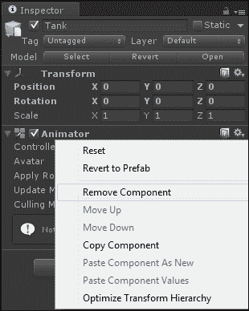
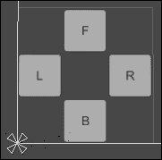
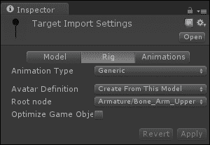
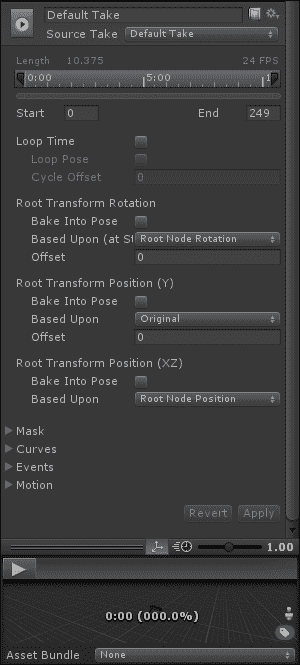
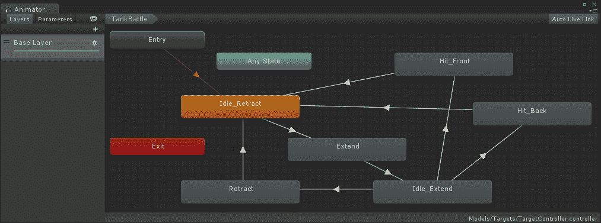
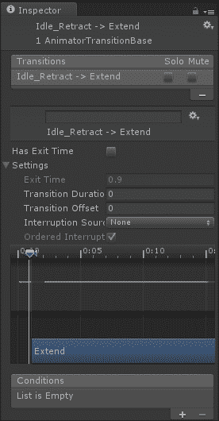

# 第三章：任何游戏的核心——网格、材质和动画

在上一章中，我们了解了 GUI。我们从创建一个简单的井字游戏开始，学习游戏的基本组成部分。然后通过改变游戏的外观并使游戏板支持多种屏幕方向来继续。最后，我们完成了一些菜单的制作。

本章将介绍任何游戏的核心：网格、材质和动画。没有这些基础，通常没有东西可以展示给玩家。当然，你也可以只使用 GUI 中的平面图像。但这样有什么乐趣呢？既然你选择了 3D 游戏引擎，不妨充分利用它的功能。

为了理解网格、材质和动画，我们将创建一个坦克大战游戏。这个项目将在其他章节中使用。到本书结束时，这将是我们创建的两个完整游戏之一。在本章中，玩家将驾驶坦克在一个小城市中四处移动，他们能够射击动画目标，我们还将添加一个计数器来跟踪分数。

本章包括以下主题：

+   导入网格

+   创建材质

+   动画

+   创建预制体

+   光线追踪

在本章中，我们将开始一个新项目，请按照第一部分来启动。

# 设置准备

尽管这个项目最终会比之前的更大，但实际设置与前一个项目类似，并不复杂。这个项目你需要一些起始资源，这些将在设置过程中进行描述。由于这些资源的复杂性和特定性，建议现在使用本书代码包中提供的资源。

与前两章一样，我们需要创建一个新项目，以便开发下一款游戏。显然，首先要做的就是启动一个新的 Unity 项目。为了便于组织，将其命名为`Ch3_TankBattle`。以下是启动本项目所需的前提条件：

1.  这个项目也会比我们之前的项目变得更大，因此我们应该创建一些文件夹来保持组织性。首先，创建六个文件夹。顶级文件夹将是`Models`、`Scripts`和`Prefabs`文件夹。在`Models`内创建`Environment`、`Tanks`和`Targets`。拥有这些文件夹使得项目管理起来更加容易。任何完整的模型可以包含一个网格文件，一个或多个纹理，每个纹理对应一个材质，以及可能包含数十个动画文件。

1.  在继续之前，如果你还没有这样做，最好是将你的目标平台改为 Android。每次更改目标平台，项目中的所有资源都需要重新导入。这是 Unity 自动执行的一步，但随着项目的增长，这将花费越来越多的时间。在项目中有任何内容之前设置目标平台，我们可以节省很多时间。

1.  我们还将利用 Unity 一个非常强大的部分：预制体。这些特殊对象使创建游戏的过程大大简化。这个名字意味着预先制造的——事先创建并复制的。对我们来说，这意味着我们可以完全设置一个坦克射击的目标，并将其转换成预制体。然后，我们可以在游戏世界中放置预制体的实例。如果我们需要更改目标，只需修改原始预制体即可。对预制体所做的任何更改也会应用于该预制体的任何实例。别担心，使用时它会更有意义。

1.  我们需要为这个项目创建一些网格和纹理。首先，我们需要一辆坦克（如果没有坦克，进行坦克大战是有点困难的）。这个代码包中提供的坦克有一个炮塔和一门大炮，这些都是独立的部件。我们还将使用一个技巧，让坦克的履带看起来像是在移动，所以它们每个都是独立的部件，并使用单独的纹理。

1.  最后，我们需要一个动画目标。本书代码包中提供的那个像人的手臂一样装有牛眼的手。它有四个动画。第一个从卷曲的位置开始，移动到伸展的位置。第二个与第一个相反，从伸展的位置回到卷曲的位置。第三个从伸展的位置开始，向后弹起，就像从前面被打到，然后回到卷曲的位置。最后一个与第三个类似，但是它是向前移动，就像是从后面被打到一样。这些动画相当简单，但它们将帮助我们很好地了解 Unity 的动画系统。

这里发生的事情很少；我们只是创建了一个项目并添加了一些文件夹。我们还简要讨论了将为本章项目使用哪些资源。

# 导入网格

有几种方法可以将资源导入 Unity。我们将介绍最简单（也可能是最好）的方法来导入资源组。让我们开始吧：

1.  在 Unity 编辑器中，首先在你的`Tanks`文件夹上右键点击，然后从菜单中选择**在资源管理器中显示**。

1.  这会打开包含所选择资源的文件夹。在本例中，`Models`文件夹在 Windows 文件夹浏览器中打开。我们只需将坦克及其纹理放入`Tanks`文件夹中。

    ### 注意事项

    本章提供的文件有 `Tank.blend`、`Tanks_Type01.png` 和 `TankTread.png`。此外，在 Unity 中使用 `.blend` 文件需要在你的系统中安装 Blender。Blender 是一个免费的建模程序，可在 [`www.blender.org`](http://www.blender.org) 获取。Unity 利用它将前述文件转换成可以完全利用的文件。

1.  当我们回到 Unity，它会检测到我们添加的文件，并自动导入。这是 Unity 最好的特点之一。无需明确告诉 Unity 导入。如果项目资产内部发生变化，它会自动更新资产。

1.  你可能还会注意到，当 Unity 导入我们的坦克时，会创建一个额外的文件夹和一些文件。每当导入新网格时，默认情况下 Unity 会尝试将其与材质配对。下一节将详细介绍 Unity 中的材质是什么。现在，它是一个跟踪如何在网格上显示纹理的对象。根据网格中的信息，Unity 在项目中查找具有正确名称的材质。如果找不到，将在网格旁边创建一个 `Materials` 文件夹，并在其中创建缺失的材质。创建这些材质时，Unity 也会查找正确的纹理。这就是为什么将纹理与网格同时添加到文件夹中很重要，以便它们可以一起导入。如果你没有在导入坦克的同时添加纹理，关于创建材质的部分将介绍如何将纹理添加到材质中。

我们已经将坦克导入 Unity。这真的很简单。对项目中的任何资产或文件夹所做的更改都会被 Unity 自动检测到，并根据需要相应地导入。

# 坦克导入设置

将任何资源导入 Unity 是通过使用一组默认设置完成的。这些设置都可以从**检查器**窗口进行更改。选中你的新坦克后，我们将在这里介绍模型导入设置：


如前一张截图所示，在**检查器**窗口顶部有三个标签页：**模型**、**绑定**和**动画**。**模型**页面处理网格本身，而**绑定**和**动画**用于导入动画。目前我们只关心**模型**页面，如果尚未选择，请选择它。下面将详细介绍**模型**页面的每个部分。

## 网格

前一张截图中的**网格**部分有以下选项：

+   **导入设置**窗口中的**网格**部分以**缩放因子**属性开始。这是一个告诉 Unity 网格默认大小的值。你的建模程序中的一个通用单位或一米转换为 Unity 中的一个单位。这个坦克是以通用单位制作的，所以坦克的缩放因子是 1。如果你在制作坦克时使用的是厘米，那么缩放因子将是 0.01，因为厘米是米的一百分之一。

+   **文件缩放**选项是原始创建模型时建模程序中使用的缩放。它主要是信息性的。如果你需要调整导入模型的大小，请调整**缩放因子**。

+   下一个选项，**网格压缩**，在我们讨论游戏优化时将在最后一章变得非常重要。压缩设置得越高，游戏中文件的大小就会越小。然而，这也会开始让你的网格出现一些奇怪的现象，因为 Unity 会尝试使其更小。现在，将其设置为**关闭**。

+   如果你想在游戏运行时对网格进行修改，**读/写启用**选项将非常有用。这使得你可以实现一些非常酷的功能，比如可破坏的环境，你的脚本可以根据被射击的位置将网格分割成碎片。然而，这也意味着 Unity 需要在内存中保留网格的一个副本，如果它很复杂，这可能会让系统开始变得卡顿。这超出了本书的范围，因此取消选中此选项是个好主意。

+   **优化网格**选项是一个好的选择，除非你对网格有特定的高级操作。开启这个选项，Unity 会进行一些特殊的“幕后”处理。在计算机图形学中，尤其是在 Unity 中，每个网格最终都是由一系列在屏幕上绘制的三角形组成。此选项允许 Unity 重新排列文件中的三角形，以便更快、更容易地绘制整个网格。

+   **导入混合形状**选项允许 Unity 理解模型中可能包含的任何混合形状。这些是模型顶点的动画位置。通常，它们用于面部动画。下一个选项，**生成碰撞器**，在进行物理方面的复杂操作时非常有用。Unity 有一组简单的碰撞器形状，应该尽可能使用，因为它们更容易处理。然而，在某些情况下，它们可能无法完全完成任务；例如，瓦砾或半管，其中碰撞形状太复杂，无法用一系列简单的形状制作。这就是为什么 Unity 有一个**网格碰撞器**组件。选中此选项后，将为模型中的每个网格添加一个**网格碰撞器**组件。本章我们将坚持使用简单的碰撞器，所以将**生成碰撞器**选项关闭。

+   **交换 UV**和**生成光照贴图 UV**选项主要用于处理光照，尤其是光照贴图时。Unity 可以处理模型上的两套 UV 坐标。通常，第一套用于纹理，第二套用于光照贴图或阴影纹理。如果它们的顺序错误，**交换 UV**会将它们更改，使得第二套先出现。如果你需要一个光照贴图的展开，但并未创建一个，**生成光照贴图 UV**将为你创建一个。在这个项目中我们不使用光照贴图，所以这两个选项可以保持关闭。

## 法线与切线

早期截图中的**法线与切线**部分有以下选项：

+   下一个选项部分，**法线与切线**，从**法线**选项开始。这定义了 Unity 如何保存你的网格的法线。默认情况下，它们是从文件中导入的；然而，也有一个选项让 Unity 根据网格的定义方式计算它们。否则，如果我们将此选项设置为**无**，Unity 将不会导入法线。如果我们希望网格受到实时光照的影响或使用法线贴图，就需要法线。在这个项目中我们将使用实时光照，所以将其设置为**导入**。

+   如果你的网格具有法线贴图，那么**切线**、**平滑角度**和**分割切线**选项将派上用场。切线用于确定光照如何与法线贴图表面交互。默认情况下，Unity 会为你计算这些。导入切线仅限于几种文件类型。基于两个面之间角度的平滑角度，决定了边缘的着色是平滑还是锐利。**分割切线**选项用于处理一些特定的光照问题。如果光照被接缝破坏，启用此选项将修复它。法线贴图非常适合让低分辨率游戏看起来像高分辨率游戏。然而，由于使用它们需要额外的文件和信息，它们并不适合移动游戏。因此，在本书中我们不使用它们，这些选项都可以关闭以节省内存。

+   **保持四边形**选项将允许你的模型利用 DirectX 11 的新镶嵌技术，从低细节模型和特殊的位移贴图创建高细节模型。不幸的是，移动设备支持这种细节还需要一段时间，而要成为普遍现象则需要更长时间。

## 材质

前一个截图中的**材质**部分有以下选项：

+   最后一个部分，**材质**，定义了 Unity 应该如何查找材质。第一个选项，**导入材质**，允许你决定是否导入材质。如果关闭，将应用默认的白色材质。这种材质在项目中任何地方都不会显示；它是一个隐藏的默认值。对于不会有任何纹理的模型，比如碰撞网格，可以关闭这个选项。对于我们坦克模型以及几乎其他所有情况，应该保持开启状态。

+   最后两个选项，**材质命名**和**材质搜索**，共同作用于为网格命名和查找材质。在它们下面直接是一个文本框，描述了 Unity 将如何搜索材质。

    +   要搜索的材质名称可以是建模程序中使用的纹理名称、建模程序中创建的材质名称，或者是模型和材质的名称。如果找不到纹理名称，将使用材质名称。

    +   默认情况下，Unity 会进行递归向上搜索。这意味着我们从`Materials`文件夹开始搜索，然后查找同一文件夹中的任何材质。接着检查父文件夹是否有匹配的材质，然后是上一级文件夹。如此继续，直到找到具有正确名称的材质，或者到达根资产文件夹。

    +   另外，我们还可以选择检查整个项目，或者只在我们模型旁边的`Materials`文件夹中查找。这些选项的默认设置已经很好了。通常，它们不需要更改。特别是对于大型项目，可以使用 Unity 编辑器脚本轻松处理，本书将不涉及这部分内容。

## 恢复和应用按钮

接下来，截图中有**恢复**和**应用**按钮，下面将对此进行解释：

+   每当对导入设置进行更改时，必须选择两个按钮中的一个，**恢复**或**应用**。**恢复**按钮取消更改，并将导入设置恢复到更改之前的状态。**应用**按钮确认更改，并使用新设置重新导入模型。如果没有选择这些按钮，Unity 会弹出一个对话框并强制你做出选择，然后才能进行其他操作。

+   最后，我们可以看到如前截图所示有两种预览类型。**Imported Object**部分是如果我们将对象添加到**Scene**视图并选择它，在**Inspector**窗口中对象外观的预览。**Preview**窗口，我们可以在其中看到坦克模型的区域，是模型在**Scene**视图中的样子。你可以在该窗口中点击并拖动对象来旋转它，并从不同的角度观察它。此外，在这个窗口中有一个小蓝按钮。点击这个按钮，你将能够给对象添加标签。然后，这些标签也可以在**Project**窗口中进行搜索。

## 设置坦克

既然我们已经导入了坦克，我们需要对其进行设置。我们将调整坦克的布局，并创建一些脚本。

### 坦克

在这一点上，我们创建坦克的主要工作将包括创建和排列坦克的组件。使用以下步骤，我们可以设置我们的坦克：

1.  首先，从**Project**窗口将坦克拖到**Hierarchy**窗口。你会注意到坦克的名字在**Hierarchy**窗口中以蓝色显示。这是因为它是一个预制体实例。你的项目中的任何模型在很大程度上都像预制体。然而，我们希望我们的坦克不仅仅是放在那里；所以，作为一个静态网格的预制体是没有帮助的。因此，在**Hierarchy**窗口中选择你的坦克，我们将开始通过移除**Animator**组件使其变得有用。为此，在**Inspector**窗口中选择 Animator 组件右侧的齿轮。从新的下拉列表中选择**Remove Component**，如下截图所示，它将被移除：

1.  如果你正在使用默认提供的坦克，选择它的不同部分，你会发现所有的轴心点都在底部。这对于使我们的炮塔和炮管正确旋转并不有用。解决这个问题的最简单方法就是添加新的空**GameObject**作为轴心点。

    ### 注意事项

    场景中的任何物体都是一个`GameObject`。任何空的`GameObject`只包含一个**Transform**组件。

1.  在 Unity 编辑器的顶部，**Create Empty**是**GameObject**按钮下的第一个选项。它创建了我们所需要的物体。创建两个空的 GameObject，并将一个定位在炮塔底部，另一个定位在炮管底部。此外，分别将它们重命名为`TurretPivot`和`CannonPivot`。如果选择了物体，这可以通过**Inspector**窗口顶部的文本框来完成。

1.  在**层次结构**窗口中，将 `TurretPivot` 拖到 `Tank` 上。这将改变 `TurretPivot` 的父对象为 `Tank`。然后，将对象（即炮塔网格）拖到 `TurretPivot` 上。在代码中，我们将旋转枢轴点而不是直接旋转网格。当一个父对象移动或旋转时，所有子对象都会随之移动。当你进行这个更改时，Unity 会抱怨关于对象原始层次结构的更改；它这样做只是为了确保这是一个你想要做的更改，而不是一个意外：

1.  由于失去与预制件的连接可能会破坏游戏，Unity 想要确保我们确实希望这样做。因此，点击**继续**按钮，我们就可以在没有 Unity 其他抱怨的情况下完成坦克的工作。我们还需要将 `CannonPivot` 设置为 `TurretPivot` 的子对象，并将炮管设置为 `CannonPivot` 的子对象。

1.  为了完成我们的层次结构更改，我们需要放置摄像机。由于我们希望玩家看起来就像是在坦克里一样，摄像机应该放在坦克后面和上方，稍微向下倾斜，以聚焦在几辆坦克长度前的一个点。一旦定位好，也将其设置为 `TurretPivot` 的子对象。

我们已经建立了一个基础结构，我们的坦克将会使用这个结构。通过这种方式使用多个对象，我们可以独立地控制它们的移动和动作。在这一点上，我们不再拥有一个只能向前指的僵硬坦克，我们可以独立地倾斜、旋转和瞄准每个部分。

### 提示

同时，坦克应该位于你希望整个物体围绕其旋转的中心点上方。如果它不是，你可以在**层次结构**窗口中选择基础坦克对象下的所有内容，并移动它们。

### 保持计分

本节将重点关注一个简短的脚本，用于跟踪玩家的分数和文本元素的添加。以下是创建我们脚本的步骤：

1.  让我们的坦克工作的第一个脚本非常简单。创建一个新的脚本，并将其命名为 `ScoreCounter`。顾名思义，它将跟踪分数。在 `Scripts` 文件夹中创建它，并清除到目前为止我们制作的其他脚本中的默认函数。

1.  正如上一章所做的那样，由于任何需要访问我们的 GUI 元素的脚本都需要在脚本最顶部添加一行代码，在 `using UnityEngine;` 这行代码之后添加以下代码行。这允许我们使用并更改需要显示分数的文本元素：

    ```java
    using UnityEngine.UI;
    ```

1.  下一行代码应该从上一章看起来很熟悉。首先，我们定义了一个整数计数器。由于它是静态的，其他脚本（例如我们为靶子创建的脚本）将能够修改这个数字，并给我们得分：

    ```java
    public static int score = 0;
    ```

1.  然后，我们将添加一个变量来存储界面的文本元素。它将像上一章中的转向指示器一样工作，为我们提供一个位置来更新和显示玩家的分数：

    ```java
    public Text display;
    ```

1.  这个脚本的最后一段代码是一个`Update`函数。这个函数由 Unity 自动为每一帧调用。这是放置任何需要定期更改而无需玩家直接输入的代码和逻辑的完美位置。对于我们的目的，我们将更新文本元素，并确保它总是显示最新的分数。通过将分数添加到双引号中，我们将数字转换为单词，以便文本元素可以正确使用它：

    ```java
    public void Update() {
      display.text = "" + score;
    }
    ```

这就是这个非常简单的脚本的全部内容。它将跟踪整个游戏过程中的分数。此外，它本身不会执行任何分数增加的操作，而是由其他脚本更新计数器来给玩家加分。

### 重复按钮

到目前为止我们使用的按钮只在按下并释放时执行操作。我们的玩家需要按住按钮来控制他们的坦克。因此，我们需要创建一个重复按钮；一个只要按住就会执行操作的按钮。按照以下步骤来创建一个重复按钮：

1.  创建一个名为`RepeatButton`的新脚本。

1.  为了让这个脚本能够访问到它需要工作的 Unity 部分，和之前的脚本一样，我们需要在写着`using UnityEngine;`的那一行下面添加以下两行。第一行将让我们访问到`Selectable`类：所有交互式界面元素都从中派生的那个类。第二行将使我们能够处理玩家与我们新按钮交互时发生的事件：

    ```java
    using UnityEngine.UI;
    using UnityEngine.EventSystems;
    ```

1.  接下来，我们需要更新代码中的`public class`行。任何为游戏中的对象提供功能的普通脚本都是对`MonoBehaviour`类的扩展。我们需要将行更改为以下内容，以便我们的脚本可以存在于界面中并扩展其功能：

    ```java
    public class RepeatButton : Selectable {
    ```

1.  我们的脚本总共有四个变量。第一个允许它跟踪是否被按下：

    ```java
    private bool isPressed = false;
    ```

1.  接下来的三个变量将提供与上一章中按钮相同的功能。对于按钮，我们必须选择一个对象，然后选择特定脚本中的一个函数，最后发送一些值。这里，我们将做同样的事情。这里的第一变量跟踪我们要在场景中与之交互的对象。第二个将是附加到对象上某个脚本中的函数名称。最后一个将是一起发送给函数的数字，它将提供更具体的输入：

    ```java
    public GameObject target;
    public string function = "";
    public float value = 0f;
    ```

1.  本脚本的第一函数将覆盖`Selectable`类提供的函数。当玩家点击按钮时立即调用它。它接收到一些关于点击方式和位置的信息，这些信息存储在`eventData`中。第二行只是调用了父类中同名的函数。该函数最后做的是设置我们的布尔标志，以标记按钮当前正被玩家按下：

    ```java
    public override void OnPointerDown(PointerEventData eventData) {
      base.OnPointerDown(eventData);
      isPressed = true;
    }
    ```

1.  下一个函数与上一个函数完全相同。主要区别在于，当玩家的鼠标或触摸不再位于界面中的按钮上时调用它。第二个区别是它将布尔值设置为`false`，因为当玩家将手指从按钮上移开时，他们不再按下按钮，在这种情况下我们希望停止执行我们的动作：

    ```java
    public override void OnPointerExit(PointerEventData eventData) {
      base.OnPointerExit(eventData);
      isPressed = false;
    }
    ```

1.  以下函数与前两个类似。但是，当按钮释放时调用它：

    ```java
    public override void OnPointerUp(PointerEventData eventData) {
      base.OnPointerUp(eventData);
      isPressed = false;
    }
    ```

1.  该脚本的最后一个函数是我们的`Update`函数。它首先检查玩家当前是否按下了按钮。然后它在我们目标对象上调用`SendMessage`函数，告诉它要执行哪个函数以及使用哪个数字。`SendMessage`函数仅对**GameObject**和**MonoBehviour**组件可用。它接收一个函数名，并尝试在接收消息的 GameObject 上找到它：

    ```java
    public void Update() {
      if(isPressed) {
        target.SendMessage(function, value);
      }
    }
    ```

另一个脚本完成了！这个脚本允许我们按住按钮，而不是被迫反复按下按钮来在游戏中移动。

### 控制底盘

常规坦克可以进行原地旋转，并且可以轻松地前进和后退。我们将通过创建一个脚本来使我们的坦克实现这一点。按照以下步骤为坦克创建我们的第二个脚本：

1.  第二个脚本称为`ChassisControls`。它将使我们的坦克四处移动。我们将在`Scripts`文件夹中创建它。

1.  脚本的前三行定义了坦克移动所需的变量。我们还可以在**检查器**窗口中更改它们，以防我们的坦克太快或太慢。第一行定义了一个变量，该变量保存了对`CharacterController`组件的连接。这个组件不仅容易移动坦克，而且还能让它碰到墙壁和其他碰撞体时停止。接下来的两行代码定义了我们移动和旋转的速度：

    ```java
    public CharacterController characterControl;
    public float moveSpeed = 10f;
    public float rotateSpeed = 45f;
    ```

1.  我们首先定义`MoveTank`函数，它需要传递一个`speed`值来决定坦克应该向哪个方向以及多远前进。正值将使坦克向前移动，负值将使其向后移动：

    ```java
    public void MoveTank(float speed) {
    ```

1.  为了在三维空间中移动，我们需要一个向量——一个既有方向又有大小的值。因此，我们定义了一个移动向量，并将其设置为坦克的前进方向，乘以坦克的速度，再乘以自上一帧以来经过的时间量。

    +   如果你记得几何课上的内容，3D 空间有三条轴：x、y 和 z。在 Unity 中，以下约定适用：x 是向右，y 是向上，z 是向前。transform 组件保存了一个对象的位置、旋转和缩放的这些值。我们可以通过调用 Unity 提供的`transform`变量来访问 Unity 中任何对象的 transform 组件。`transform`组件还提供了一个`forward`变量，它会给出一个指向对象面向方向的向量。

    +   此外，我们希望以恒定的速度移动，例如，每秒移动一定的距离；因此，我们使用了`Time.deltaTime`。这是 Unity 提供的一个值，它表示自上次在屏幕上绘制游戏的帧以来已经过去了多少秒。你可以把它想象成翻书。为了使一个人看起来像是在页面上走动，他在每一页上都需要稍微移动一点。在游戏的情况下，页面不是定期翻动的。因此，我们必须根据翻到新页面所花费的时间来调整我们的移动。这有助于我们保持恒定的速度。

        ```java
        Vector3 move = characterControl.transform.forward * speed * Time.deltaTime;
        ```

1.  接下来，我们希望角色保持在地面上。通常，在游戏中，任何你想控制的字符不会自动获得像石头那样的所有物理特性，比如重力。例如，当跳跃时，你暂时移除了重力，使角色能够向上移动。这就是为什么下一行代码简单地实现了重力，通过减去正常的重力速度，然后使其与我们的帧率保持同步：

    ```java
    move.y -= 9.8f * Time.deltaTime;
    ```

1.  最后，对于`MoveTank`函数，我们实际上执行了移动操作。`CharacterController`组件有一个特殊的`Move`函数，它能够移动角色并受到碰撞的限制。我们只需通过传递`move`向量来告诉它本帧我们想要移动多远以及移动的方向。当然，最后的这个花括号结束了这个函数的定义：

    ```java
    characterControl.Move(move);
    }
    ```

1.  `RotateTank`函数也需要一个速度值来指定旋转的速度和方向。我们从定义另一个向量开始；然而，这个向量不是定义移动的方向，而是定义旋转的方向。在这种情况下，我们将围绕向上的方向旋转。然后我们将这个向量乘以我们的`speed`和`Time.deltaTime`参数，以足够快的速度移动并保持与我们的帧率同步。

    ```java
    public void RotateTank(float speed) {
      Vector3 rotate = Vector3.up * speed * Time.deltaTime;
    ```

1.  函数的最后部分实际上执行了旋转操作。**Transform**组件提供了一个`Rotate`函数。在 3D 空间中，尤其是进行旋转操作时，可能会变得复杂和困难。`Rotate`函数为我们处理了所有这些操作；我们只需要为它提供要应用的旋转值。此外，别忘了用花括号结束这个函数的定义：

    ```java
    characterControl.transform.Rotate(rotate);
    }
    ```

我们创建了一个控制坦克移动的脚本。它将使用`CharacterController`组件的专用`Move`函数，使我们的坦克能够前进和后退。我们还使用了**Transform**组件提供的专用`Rotate`函数来旋转坦克。

### 控制炮塔

下一个脚本将允许玩家旋转他们的炮塔并瞄准炮管：

1.  我们需要为坦克创建的最后一个脚本为`TurretControls`。这个脚本将允许玩家左右旋转炮塔，以及上下倾斜炮管。与所有其他脚本一样，在`Scripts`文件夹中创建它。

1.  我们定义的前两个变量将保存指向炮塔和炮管旋转点的指针——我们为坦克创建的空`GameObjects`。第二组是炮塔和炮管的旋转速度。最后，我们设置了一些限制值。如果我们不对炮管的旋转角度进行限制，它只会不停地旋转，穿过坦克。这对于坦克来说并不是最真实的行为，因此我们必须设置一些限制。限制范围是 300 度，因为正前方是 0 度，向下是 90 度。我们希望它是向上的角度，所以范围是 300 度。我们也可以使用 359.9 度，因为 Unity 会将 360 度变为零度，以便它能够继续旋转：

    ```java
    public Transform turretPivot;
    public Transform cannonPivot;

    public float turretSpeed = 45f;
    public float cannonSpeed = 20f;

    public float lowCannonLimit = 315f;
    public float highCannonLimit = 359.9f;
    ```

1.  接下来是`RotateTurret`函数。它的工作原理与`RotateTank`函数完全相同。但是，我们不是查看`CharacterController`组件的`transform`变量，而是对`turretPivot`变量进行操作：

    ```java
    public void RotateTurret(float speed) {
      Vector3 rotate = Vector3.up * speed * Time.deltaTime;
      turretPivot.Rotate(rotate);
    }
    ```

1.  第二个也是最后一个函数`RotateCannon`，在处理旋转时会更深入一些。这完全是因为我们需要对炮管的旋转设置限制。打开函数后，第一步是确定我们这一帧将旋转多少。我们使用浮点值而不是向量，因为我们必须自己设置旋转：

    ```java
    public void RotateCannon(float speed) {
      float rotate = speed * Time.deltaTime;
    ```

1.  接下来，我们定义一个变量来保存当前的旋转值。这样做是因为 Unity 不允许我们直接对旋转值进行操作。实际上，Unity 以四元数的形式跟踪旋转，这种方法超出了本书的讨论范围。幸运的是，Unity 为我们提供了名为`EulerAngles`的方法，通过 x、y 和 z 定义旋转。这是围绕三维空间中的三个轴的旋转。**Transform**组件的`localEulerAngles`值是相对于父**GameObject**的旋转。

    ```java
    Vector3 euler = cannonPivot.localEulerAngles;
    ```

    ### 注意

    它被称为`EulerAngles`，因为这是由瑞士数学家莱昂哈德·欧拉提出的一种定义旋转的方法。

1.  接下来，我们通过使用`Mathf.Clamp`函数一次性调整旋转并应用限制。`Mathf`是一组有用的数学函数。`clamp`函数接收一个值，并使其不低于也不高于传递给函数的其他两个值。因此，我们首先发送我们的*x*轴旋转，这是从`euler`的当前 x 旋转中减去 rotate 的结果。由于沿轴正向旋转是顺时针的，因此我们需要减去我们的旋转，以便向上而不是向下使用正值。接下来，我们将下限传递给`Clamp`函数，然后是我们的上限：这是我们顶部脚本中定义的`lowCannonLimit`和`highCannonLimit`变量：

    ```java
    euler.x = Mathf.Clamp(euler.x – rotate, lowCannonLimit, highCannonLimit);
    ```

1.  最后，我们需要将新的旋转实际应用到炮塔的支点。这只需将**变换**组件的`localEulerAngles`值设置为新的值。同样，请确保使用花括号关闭函数：

    ```java
    cannonPivot.localEulerAngles = euler;
    }
    ```

我们现在已经创建了一个可以控制坦克炮塔的脚本。玩家将能够控制炮管的倾斜和炮塔的旋转。这个脚本与我们之前创建的`ChassisControls`脚本功能非常相似——区别在于限制炮管可以倾斜的程度。

### 组装部件

这暂时是最后一个脚本了。我们有我们的坦克和脚本；下一步是将它们组合起来：

1.  现在，我们需要向坦克中添加脚本。还记得我们在上一章如何将`井字游戏`脚本添加到摄像机上的吗？首先在**层次结构**窗口中选择你的坦克。在这些脚本工作之前，我们首先需要在坦克上添加`CharacterController`组件。因此，在 Unity 编辑器顶部选择**组件**，然后选择**物理**，最后点击**角色控制器**选项。

    你会注意到，当你添加新组件后，在**场景**视图中坦克上会出现一个绿色的胶囊。这个胶囊表示将与其他碰撞体发生碰撞和交互的空间。**角色控制器**组件上的值允许我们控制它与其他碰撞体的交互方式。在大多数情况下，前四个参数的默认值都是可以的。

    

    **角色控制器**中的参数如下：

    +   **斜率限制**：这个属性显示控制器可以爬升的斜坡的最大倾斜度。

    +   **步进偏移**：这个属性显示了一个台阶在开始阻挡移动之前可以有多高。

    +   **皮肤宽度**：这定义了另一个碰撞体在完全停止之前可以穿透此控制器碰撞体的距离。这主要用于在物体间挤压。

    +   **最小移动距离**：这个属性用于限制抖动。这是在一帧中实际移动之前必须应用的最小移动量。

    +   **Center**/**Radius**/**Height**：这些属性定义了你在 **Scene** 视图中看到的胶囊的大小。它们用于碰撞。

1.  目前最后三个值最为重要。我们需要尽可能调整这些值以匹配我们坦克的大小。诚然，胶囊是圆形的，我们的坦克是方形的，但 `CharacterController` 组件是移动带碰撞的角色最简单的方式，它将最常被使用。将 **Radius** 属性和 **Center** 属性的 **Y** 部分设置为 `2.3`；其他部分可以保持默认值。

1.  现在是向坦克添加脚本的时候了。通过在 **Hierarchy** 窗口中选择坦克，并将 `ChassisControls`、`TurretControls` 和 `ScoreCounter` 脚本拖到 **Inspector** 窗口。这与我们在前几章中所做的一样。

1.  接下来，我们需要完成在脚本中开始的连接。首先点击 `CharacterController` 组件的名称，并将其拖到我们新的 `ChassisControls` 脚本组件上的 **Character Control** 插槽。Unity 允许我们在 Unity 编辑器中连接对象变量，这样它们就不必硬编码。

1.  我们还需要连接我们的炮塔和炮管旋转点。因此，从 **Hierarchy** 窗口点击并拖动点，到 `TurretControls` 脚本组件上的相应变量。

1.  在测试我们的游戏之前，我们需要创建一堆 GUI 按钮来实际控制我们的坦克。首先创建一个画布，就像我们在上一章中所做的那样，并创建一个空的 GameObject。

1.  空的 GameObject 需要一个 **Rect Transform** 组件，并且需要将其设置为 `Canvas` 的子对象。

1.  将其重命名为 `LeftControls` 并将其锚点设置为**左下角**。此外，将 **Pos X** 设置为 `75`，**Pos Y** 设置为 `75`，**Pos Z** 设置为 `0`，**Width** 设置为 `150`，**Height** 设置为 `150`，如下截图所示：

1.  接下来，我们需要四个按钮作为 `LeftControls` 的子对象。与上一章一样，通过导航到 **GameObject** | **UI** | **Button**，可以在编辑器顶部找到它们。

1.  将四个按钮重命名为 `Forward`、`Back`、`Left` 和 `Right`。同时，你也可以将它们的文本子对象更改为相关的文本，比如 `F`、`B`、`L` 和 `R`。

1.  按钮仅在玩家点击并释放时激活。仅仅为了使坦克移动而重复点击效果不太好。因此，点击它们每个 **Button** 组件右侧的齿轮，并选择 **Remove Component**。

1.  现在，将我们的 `RepeatButton` 脚本添加到每一个按钮上。由于我们扩展了 `Selectable` 类，你可以看到我们对按钮拥有与其他按钮相同的控制权。

1.  将四个按钮的 **Width** 和 **Height** 值设置为 `50`。它们的位置如下所示：

    | 按钮 | Pos X | Pos Y |
    | --- | --- | --- |
    | Forward | 0 | 50 |
    | 左 | -50 | 0 |
    | Back | 0 | -50 |
    | Right | 50 | 0 |

    

1.  现在我们已经有了四个移动按钮，需要将它们连接到我们的坦克上。对于每个按钮，将**层次结构**面板中的`Tank`拖动到**检查器**面板中的**目标**槽里。

1.  当我们下次设置**函数**和**值**槽时，拼写非常重要。如果有一点偏差，你的函数将找不到，会出现很多错误，坦克也将无法工作。对于`Forward`按钮，将**函数**槽设置为`MoveTank`，**值**槽设置为`1`。`Back`按钮在**函数**槽中也需要`MoveTank`的值，但在**值**槽中需要`-1`。`Left`按钮在**函数**槽中需要`RotateTank`的值，**值**槽中需要`-1`。`Right`按钮在**函数**槽中需要`RotateTank`的值，**值**槽中需要`1`。

1.  接下来，我们需要设置我们的炮塔控制。在**层次结构**窗口中右键点击`LeftControls`，并从新菜单中选择**复制**。将新副本重命名为`RightControls`。

1.  这个新的控制集需要一个**右下角**的锚点，**PosX**为`-75`，**PosY**为`75`（如下面的截图所示）:

1.  这组下面的按钮需要被重命名为`Up`、`Down`、`Left`和`Right`。它们的文本可以分别更改为`U`、`D`、`L`和`R`。

1.  `Up`按钮的**函数**槽应该设置为`RotateCannon`，其**值**槽的值为`1`。`Down`按钮的**函数**槽值为`RotateCannon`，**值**槽的值为`-1`。`Left`按钮需要`RotateTurret`作为**函数**槽的值，**值**槽的值为`-1`。最后，`Right`按钮需要**函数**槽的值为`RotateTurret`，**值**槽的值为`1`。

1.  最后一件事是创建一个新的文本元素，可以通过导航到**游戏对象** | **UI** | **文本**来找到，并将其重命名为`Score`。

1.  最后，选择你的`Tank`，并将**层次结构**窗口中的`Score`拖动到**分数计数器(脚本)**组件的**显示**槽中。

1.  将场景保存为`TankBattle`并试玩一下。

我们刚刚完成了坦克的组装。除非在使用移动控制时查看**场景**视图，否则很难判断坦克是否在移动。炮塔控制可以在**游戏**视图中看到。除了没有判断坦克是否在移动的参照点外，它运行得相当好。下一步和下一节将为我们添加城市，提供那个参照点。

你可能会注意到，当你第一次尝试倾斜炮管时，会有一个快速的跳跃。这种行为很烦人，会让游戏看起来不完整。尝试调整炮管以修复它。如果你在这方面遇到麻烦，请查看炮管的起始旋转角度。这与我们每次尝试移动它时旋转被限制的方式有关。

# 创建材质

在 Unity 中，材质是决定模型在屏幕上如何绘制的关键因素。它们可以是简单的全蓝色，也可以是复杂的有波浪反射的水面。在本节中，我们将介绍控制材质的详细内容。我们还将创建我们的城市以及一些简单的材质来为其贴图。

## 城市

创建一个城市可以为我们的坦克和玩家提供一个良好的游戏场所。按照以下步骤来创建我们的城市：

1.  为了本节的目的，本书代码包中提供的城市部分没有被赋予特定的纹理。它只是被展开，并创建了一些可平铺的纹理。因此，我们需要从导入城市和纹理到`Environment`文件夹开始。以我们导入坦克的相同方式来完成这个操作。

    ### 注意

    相关文件包括`TankBattleCity.blend`、`brick_001.png`、`brick_002.png`、`brick_003.png`、`dirt_001.png`、`dirt_003.png`、`pebbles_001.png`、`rocks_001.png`、`rubble_001.png`以及`water_002.png`。

1.  当城市被展开时，Unity 仍然会为其创建一个单一材质。然而，在任何建模程序中都没有应用纹理。因此，材质是纯白色的。我们有多个额外的纹理，所以我们需要的不只是一个材质来覆盖整个城市。创建新材质很简单；就像创建新脚本一样。在`Environment`文件夹内的`Materials`文件夹上右键点击，选择**创建**，然后点击菜单中间的**材质**。

1.  这将在文件夹中创建一个新的材质，并立即允许我们为其命名。将材质命名为`Pebbles`。

1.  选择新的材质后，查看一下**检查器**窗口。当我们选择了一个材质，我们就可以获得改变其外观所需的选项：

1.  从前面的截图我们可以看到以下内容：

    +   在**检查器**窗口的最顶部，我们有材质的名称，其后是一个**着色器**下拉列表。着色器本质上是一个简短的脚本，它告诉显卡如何在屏幕上绘制某物。你通常会使用**标准**着色器；它本质上是一个全能型着色器，因此默认情况下总是被选中。在这里，你可以选择任何特殊效果或自定义着色器。

    +   **渲染模式**下拉菜单让你选择此材料是否使用任何程度的透明度。**不透明**表示它将是实心的。**剪切**选项将基于你的纹理透明区域的**Alpha 截止值**以锐利的边缘渲染。**透明**选项将基于你的纹理的 alpha 通道提供平滑的边缘。

### 主贴图

**主贴图**部分包含以下选项：

+   **主贴图**部分从**漫反射**开始，这里放置你的主颜色纹理。可以通过纹理槽右侧的颜色选择器进行着色。

+   **高光**选项定义了材料的光泽度；你可以想象成设备屏幕上的反光。你可以使用图像来控制它，或者使用颜色选择器来确定反射的颜色以及通过平滑度来控制反光的锐利程度。

+   **法线贴图**选项允许你添加一个控制材料表面阴影的纹理。这些纹理需要特别导入。如果你选择的纹理没有正确设置，会出现一个警告框，你可以选择**立即修复**来更改它。还会出现一个滑块，让你控制纹理的效果程度。

+   **高度贴图**选项的工作方式与**法线贴图**类似。它调整材料的凹凸程度，并提供一个滑块来调整它。

+   **遮挡**选项允许你向材料添加环境遮挡纹理，根据模型中物体之间的接近程度来控制材料的暗度或亮度。

+   **发射**选项让你控制材料发出的投影光和颜色。这只会影响光照图和此材料的外观。要实际动态地发出光，必须通过添加实时光源来模拟。

+   **细节遮罩**选项允许你控制**次要贴图**中的纹理在材料上的出现位置。

+   **平铺**和**偏移**的值控制纹理的大小和位置。**平铺**的值决定了纹理在规范化的 UV 空间内沿 x 和 y 方向重复的次数。**偏移**参数是纹理在规范化的 UV 空间中从零点开始的距离。你可以选择数字字段并输入值来修改它们。这样做，并注意底部的**预览**窗口，你将看到它们如何改变纹理。平铺纹理通常用于大面积表面，这些表面的纹理相似且特定纹理只是重复出现。

### 次要贴图

**次要贴图**部分包含以下选项：

1.  **次要贴图**从**细节漫反射 x2**开始，这是一个额外的漫反射纹理，用于与你的主漫反射纹理混合。它可能用于在巨石表面添加凹凸不平的变化。

1.  **法线贴图**与主要的**法线贴图**槽类似，控制细节纹理的阴影。

1.  第二组**贴图平铺**和**偏移**值与第一组类似，只是控制细节纹理。通常这些值设置得比第一组高，以在材质表面添加额外的兴趣点。

1.  **UV 集**只是让您选择细节纹理将要使用的模型展开集，这些纹理将应用于所添加材质的模型。

1.  通过从**项目**窗口拖拽`pebbles_001`纹理，并将其放置在**漫反射**槽右侧的方框中，来为这个材质添加纹理。

1.  为了使纹理的颜色更好，使用**漫反射**槽右侧的颜色选择器，选择一种浅褐色。

1.  主要**贴图平铺**的**X**和**Y**值设为`30`，将使得当**贴图平铺**应用到我们城市的街道时更容易观察。

1.  为了查看我们新材质的效果，首先将你的城市拖到**层次结构**窗口，使其添加到**场景**视图中。通过右键拖动，你可以在**场景**视图中查看四周，使用*W*、*A*、*S*和*D*可以四处移动。看看城市的街道。

1.  现在，将您的新材质从**项目**窗口拖到**场景**视图中。拖动材质时，您应该看到网格发生变化，好像它们正在使用该材质。当您拖过街道时，松开左键鼠标。现在材质已经应用到网格上了。

1.  然而，我们目前有一个城市的四分之一需要贴图。因此，创建更多材质，并将剩余的纹理应用到城市的其他部分。为每个额外的纹理创建一个新材质，四个额外的`brick_002`纹理，这样我们可以为每栋建筑物的高度设置不同的颜色。

1.  根据以下截图或您自己的艺术感，将新的材质应用到城市中：

    ### 提示

    当你试图到达中心喷泉时，如果坦克挡道了，在**层次结构**窗口中选择你的坦克，并在**场景**视图中使用**小工具**将其拖开。

    如果你现在尝试玩游戏，你可能会注意到我们有一些问题。首先，我们只有一个城市的四分之一；如果你制作了自己的城市，可能会有更多。此外，城市上仍然没有碰撞，所以当我们移动时，会直接穿过它。

1.  改变坦克的大小非常简单。在**层次结构**窗口中选择它，并在**变换**组件中找到**缩放**标签。更改**缩放**下的**X**、**Y**和**Z**值将改变坦克的大小。确保均匀地改变这些值，否则当我们开始旋转坦克时，会出现一些奇怪的现象。`0.5`的值使得坦克足够小，可以通过小街道。

1.  接下来是城市部分的碰撞处理。在大多数情况下，我们可以使用简单的碰撞形状以加快处理速度。然而，城市的圆形中心需要特别处理。首先在**场景**视图中双击其中一个方形建筑的墙壁。

    ### 提示

    在处理预制体时（城市仍然是预制体），点击构成预制体的任何对象都会选择根预制体对象。一旦选择了预制体，点击它的任何部分都会选择那个单独的部分。由于这种行为与非线性预制体对象不同，当你选择**场景**视图中的对象时，需要注意这一点。

1.  选择一组墙壁后，在 Unity 编辑器顶部选择**组件**，然后选择**物理**，最后选择**盒状碰撞器**。

1.  由于我们将碰撞器添加到了一个特定的网格上，Unity 会尽可能地自动调整碰撞器以适应形状。对于我们来说，这意味着新的`BoxCollider`组件已经调整到适合建筑的尺寸。继续为其余的方形建筑和外围墙添加`BoxCollider`组件。我们的街道本质上只是一个平面，因此`BoxCollider`组件对它们来说也足够使用。尽管它是指向顶部的，但喷泉中心的方尖碑本质上只是一个盒子；因此另一个`BoxCollider`对它也非常合适。

1.  我们还剩一栋建筑和喷泉环需要处理。这些不是盒子、球体或胶囊形状，因此我们简单的碰撞器将无法工作。选择靠近中心喷泉的最后一栋建筑的墙壁。在您选择**盒状碰撞器**的位置往下几行，有一个**网格碰撞器**选项。这将给我们的对象添加一个`MeshCollider`组件。这个组件如其名所示，它获取一个网格并将其转变为碰撞器。将`MeshCollider`组件添加到特定网格上，它会自动选择该网格作为可碰撞对象。你还需要将`MeshCollider`组件添加到中心建筑周围的小型边缘和喷泉周围的环墙上。

1.  要解决的最后一个问题是城市区域的复制。首先在**层级**窗口中选择根城市对象，选择`TankBattleCity`，并从它上面移除`Animator`组件。城市不需要动画，因此不需要这个组件。

1.  现在，在**层级**窗口中对城市右键点击，然后点击**复制**。这将创建一个被选中对象的副本。

1.  再复制两次城市区域，我们就会有城市的四个部分了。唯一的问题是，它们将全部处于完全相同的位置。

1.  我们需要旋转三个部分以形成一个完整的城市。选择一个部分，并将**变换**组件中的**Y 轴旋转**值设置为`90`。这将围绕垂直轴旋转 90 度，给我们半个城市。

1.  我们将通过将其中一个剩余的部分设置为`180`度，另一个设置为`270`度来完成城市的构建。

1.  还剩下最后一件事情要做。我们有四个中心喷泉。在四个城市片段中的三个里，选择构成中心喷泉的三个网格（`Obelisk`、`Wall` 和 `Water`），然后在键盘上按下 *Delete* 键。每次确认你想打破预制件连接，我们的城市就会像下图一样完整：

现在就来尝试这个游戏吧。我们可以驾驶坦克在城市中穿梭并旋转炮塔。这真是太有趣了。我们创建了材质并对城市进行了纹理化处理，在让玩家能够与建筑物和道路发生碰撞后，我们复制了这一部分，以便拥有整个城市。

既然你已经具备了导入网格和创建材质所需的所有技能，挑战就是装饰城市。创建一些瓦砾和坦克陷阱，并练习将它们导入 Unity 并在场景中设置。如果你真的想做得更好，尝试自己创建一个城市；从世界上选择一些东西，或者用你的想象力做一些事情。一旦创建完成，我们就可以在其中释放坦克。

## 移动的履带

还剩下最后一件事情要做，然后我们就可以完成材质部分并且继续让游戏变得更加有趣。还记得材质的 **Offset** 值吗？事实证明，我们实际上可以用脚本控制它。执行以下步骤，让履带随着我们的坦克移动：

1.  首先，打开 `ChassisControls` 脚本。

1.  首先，我们需要在脚本开始处添加几个变量。前两个将保存对我们坦克履带渲染器的引用，这是网格对象的一部分，负责跟踪应用到网格上的材质并实际进行绘制。这类似于 `characterControl` 变量保存对我们 `CharacterController` 组件的引用：

    ```java
    public Renderer rightTread;
    public Renderer leftTread;
    ```

1.  接下来的两个变量将跟踪每个履带应用的偏移量。我们在这里存储它，因为这样比每帧尝试从履带的材质中查找要快。

    ```java
    private float rightOffset = 0;
    private float leftOffset = 0;
    ```

1.  为了利用这些新值，需要在 `MoveTank` 函数的末尾添加以下代码行。这里的第一行根据我们的速度调整右侧履带的偏移量，并与我们的帧率保持同步。第二行利用 `Renderer` 组件的材质值找到坦克履带的材质。材质的 `mainTextureOffset` 值是材质中主纹理的偏移量。在我们的漫反射材质中，这是唯一的纹理。然后，我们必须将偏移量设置为一个包含我们新偏移值的新 `Vector2` 值。`Vector2` 就像我们用于移动的 `Vector3` 一样，但它工作在 2D 空间而不是 3D 空间。纹理是平面的；因此，它是一个 2D 空间。代码的最后两行与其他两行做同样的事情，但针对的是坦克的左侧履带：

    ```java
    rightOffset += speed * Time.deltaTime;
    rightTread.material.mainTextureOffset = new Vector2(rightOffset, 0);
    leftOffset += speed * Time.deltaTime;
    leftTread.material.mainTextureOffset = new Vector2(leftOffset, 0);
    ```

1.  为了将我们的履带与`Renderer`组件连接起来，我们需要对准点做同样的事情：将履带网格从**层次结构**窗口拖到**检查器**窗口中相应的值。完成这一步后，请确保保存并尝试一下。

我们更新了`ChassisControls`脚本来使坦克的履带移动。当坦克四处行驶时，纹理会向适当的方向移动。这是用于制作水中波浪和其他移动纹理的相同类型的功能。

材料移动的速度与坦克的速度不完全匹配。找出如何为坦克的履带添加额外的速度值。此外，如果坦克在旋转时履带能向相反方向移动将会很酷。实际上，坦克是通过让一个履带向前另一个向后来实现转向的。

# Unity 中的动画

我们将要介绍下一个主题是动画。在探索 Unity 中的动画时，我们将为我们的坦克创建一些射击目标。Unity 的动画系统**Mecanim**的强大功能很大程度上在于处理人形角色。但是，设置和动画人形角色本身就可以填满一本书，所以这里不会介绍。然而，我们仍然可以学习和使用 Mecanim 做很多事情。

下面的要点将解释导入动画时所有可用的设置：

+   在继续介绍动画导入设置之前，我们需要一个动画模型来操作。我们还有最后一组资源要导入到项目中。将`Target.blend`和`Target.png`文件导入到我们项目的`Targets`文件夹中。导入后，调整目标模型的**导入设置**窗口中的**模型**页面，就像我们对坦克所做的那样。现在，切换到**骨骼**标签（如下图所示）：

+   **动画类型**属性告诉 Unity 在执行动画时当前模型将使用哪种类型的骨骼。不同类型的模型无法共享动画。**动画类型**下的不同选项如下：

    +   **人形**选项为处理人形角色的页面添加了许多按钮和开关。但同样，这里过于复杂，不进行介绍。

    +   一个**通用**的骨骼仍然使用 Mecanim 及其许多功能。实际上，这仅仅是任何不类似人类结构的动画骨骼。

    +   第三个选项，**Legacy**，使用了 Unity 旧版的动画系统。然而，这个系统将在未来几个 Unity 版本中被淘汰，因此这里也不会进行介绍。

    +   最后一个选项，**None**，表示对象将不会有动画。你可以为坦克和城市选择这个选项，因为它也会阻止 Unity 添加 Animator 组件，并节省最终项目的大小。

+   **根节点**的值是模型文件中每个对象的列表。其目的是选择你的动画绑定的基础对象。对于这个目标，选择位于第二个**骨架**选项下的**Bone_Arm_Upper**。

+   当勾选**优化游戏对象**选项时，它将隐藏你的模型整个骨骼。点击新出现的框上的加号，将允许你选择特定的骨骼，这些骨骼在你通过**层级**窗口查看模型时仍然需要访问。在处理具有大量骨骼的复杂绑定时，这个选项特别有用。

+   导入设置的最后一个标签页是**动画**，它包含了我们将文件中的动画导入 Unity 所需的一切。在**目标导入设置**窗口的顶部，我们有**导入动画**的复选框。如果一个对象不会进行动画，那么关闭这个选项是个好主意。这样做还可以节省项目空间。

+   下面的选项，**烘焙动画**，仅当你的动画包含运动学且来自 3ds Max 或 Maya 时使用。这个目标是来自 Blender 的，所以该选项是灰显的。

+   接下来的四个选项，**动画压缩**，**旋转误差**，**位置误差**和**缩放误差**，主要用于平滑抖动的动画。几乎在所有情况下，默认设置对于使用来说都很好。

+   我们在这里真正关心的是**剪辑**部分。这将列出当前从模型中导入的每个动画剪辑。在列表的左侧，我们有剪辑的名称。在右侧，我们可以看到剪辑的开始和结束帧。**剪辑**部分下的各种参数如下：

    +   Unity 将为每个新模型添加一个默认动画。这是在保存文件时从你的建模程序的默认预览范围生成的剪辑。在我们的目标案例中，这是**默认采集**。

    +   在 Blender 中，还可以为每个绑定创建一系列动作。默认情况下，Unity 会将它们作为动画剪辑导入。在这种情况下，创建了**ArmatureAction**剪辑。

    +   在剪辑下方和右侧，有一个带有**+**和**–**按钮的小标签页。这两个按钮分别将剪辑添加到末尾和移除选定的剪辑。

    

+   当选择一个剪辑时，下一个部分会出现。它以一个文本字段开始，用于更改剪辑的名称。

+   在使用 Blender 时，文本字段下方有一个**源采集**下拉列表。这个列表与默认动画相同。大多数时候，你只需使用**默认采集**；但是，如果你的动画总是出现错误或缺失，首先尝试更改**源采集**下拉列表。

+   然后，我们有一个小的时间线，以及动画剪辑的**开始**和**结束**帧的输入字段。点击两个蓝色旗帜并在时间线上拖动它们将改变输入字段中的数字。

+   接下来，我们有**循环时间**、**循环姿势**和**循环偏移**。如果我们希望动画重复，请勾选**循环时间**旁边的框。**循环姿势**将使得动画的第一帧和最后一帧中的骨骼位置相匹配。当动画循环时，**循环偏移**将变得可用。这个值让我们调整循环动画开始的帧。

+   接下来的三个小节，**根变换旋转**、**根变换位置（Y）**和**根变换位置（XZ）**，允许我们通过动画控制角色的移动。这些部分下的控制如下：

    +   这三个部分都有一个**烘焙到姿势**的选项。如果这些选项未被选中，根节点（我们在**绑定**页面选择了它）在动画中的移动将被转换为整个对象的移动。这样想：假设你要在动画程序中动画一个向右跑的角色，实际上你会移动他们，而不是像平常一样在原地动画。

    +   使用 Unity 的旧动画系统，要让角色的物理部分移动碰撞器，必须用代码移动 GameObject。因此，如果你使用这个动画，角色看起来像是移动了，但实际上没有碰撞。使用这个新系统，当播放动画时整个角色都会移动。然而，这需要不同的更复杂的设置才能完全工作。所以我们没有在坦克上使用这个，尽管我们可以使用。

    +   三个部分中的每一个都包含一个**基于**的下拉选项。这个选项的选择决定了每个部分的物体的中心。如果你在使用人形角色，会有更多的选择，但目前我们只有两个选项。如果选择**根节点**，意味着根节点对象的轴心点是中心。如果选择**原始**，则由动画程序定义的原点是物体的中心。

    +   前两个部分还有一个**偏移**选项，用于纠正动作中的错误。当为角色动画行走周期时，如果角色稍微向侧面拉，调整**根变换旋转**下的**偏移**选项将纠正它。

+   我们的动画剪辑下一个选项是**遮罩**。通过点击左侧的箭头，你可以展开模型中所有对象的列表。每个对象旁边都有一个复选框。当播放这个剪辑时，未被勾选的对象将不会动画化。这对于挥手动画非常有用。这种动画只需要移动手臂和手，因此我们会取消勾选构成角色身体的所有对象。然后我们可以叠加动画，让角色在站立、行走或奔跑时挥手，而无需创建三个额外的动画。

+   **曲线**选项将允许你向动画中添加一个浮点值，这个值将在动画过程中改变。当动画播放时，你的代码可以检查这个值。这可以用来调整角色跳跃时受重力的影响，当他们蹲下成球体时改变碰撞器的大小，或者做许多其他的事情。

+   事件的工作原理类似于我们在`RepeatButton`脚本中使用`SendMessage`函数的方式。在你的动画中的特定时刻，可以调用一个函数来执行某些操作。

+   **运动**选项允许你定义动画中的哪个骨骼控制模型的运动。这可以覆盖在**绑定**标签上选择的骨骼。我们的目标物不会移动，所以这对于我们的情况来说并不是特别相关。

+   最后，我们在底部有**恢复**按钮、**应用**按钮和**预览**窗口。就像我们所有其他导入设置一样，当我们进行更改时，必须点击这些按钮之一。这个**预览**窗口的特殊之处在于右上角的速度滑块和左上角的大播放按钮。点击这个按钮，我们可以预览选定的动画。这让我们可以检测到我们之前讨论的动作中的错误，并确保动画就是我们想要的效果。

当我们在 Unity 中处理动画时，有许多设置可供我们使用。它们允许我们控制想要导入的原始动画程序中的帧数。此外，它们还可以用来控制动画如何与你的脚本交互。无论你选择什么设置，最重要的是动画剪辑的名称。如果没有设置这个，当你需要处理几个名称相同的动画时，可能会变得极其困难。

## 目标物的动画

那么，现在我们已经了解了所有的描述，让我们实际用它来制作一些东西。我们将从为目标物设置动画开始。利用我们刚刚获得的知识，我们现在可以如下设置我们的目标物的动画：

1.  首先，如果你之前错过了或跳过了，请确保将`Target.blend`和`Target.png`文件导入到`Targets`文件夹中。此外，在导入设置的**Rig**页面，确保将**Animation Type**属性设置为**Generic**，并将**Root Node**属性设置为**Bone_Arm_Upper**。

1.  我们总共需要六个动画。在**Clips**部分点击**+**按钮，你可以添加四个更多动画。如果你添加得过多，点击**-**按钮来移除多余的剪辑。

1.  所有这些剪辑都应该有一个**Source Take**下拉列表，选择**Default Take**，所有的**Bake into Pose**选项都应该勾选，因为目标不会从起始位置移动。

1.  首先，让我们创建我们的空闲动画。选择第一个剪辑，并将其重命名为`Idle_Retract`。由于这是一个机械物体，我们可以使用一个非常短的动画；它如此之短，以至于我们只需要使用第一帧。将开始帧设置为`0.9`，结束帧设置为`1`。

1.  我们还需要开启**Loop Pose**，因为空闲动画当然是循环的。

1.  延展空闲动画的创建几乎与上一个完全相同。选择第二个剪辑，并将其重命名为`Idle_Extend`。这里的开始帧是`14`，结束帧是`14.1`。此外，这个动画需要循环。

1.  接下来的两个动画是针对目标展开和缩回的情况。它们将被命名为`Extend`和`Retract`，因此请重命名接下来的两个剪辑。`Extend`动画将从第`1`帧开始，到第`13`帧结束。`Retract`动画将从第`28`帧开始，到第`40`帧结束。这两个动画都不会循环。

1.  最后两个动画也不会循环。它们是当我们射击目标时使用的。一个是从前面被击中，另一个是从后面被击中。`Hit_Front`动画将从第`57`帧到第`87`帧。`Hit_Back`动画将从第`98`帧到第`128`帧。

1.  一旦完成所有更改，请务必点击**Apply**，否则更改将不会被保存。

现在我们已经设置好了目标将使用的动画。总共有六个。现在可能看起来不多，但如果没有它们，下一节将无法实现。

## 使用状态机在 Unity 中控制动画

为了让我们在 Unity 中控制这些新动画，我们需要设置一个状态机。状态机只是一个花哨的对象，用于跟踪一个对象能做什么，以及如何在不同的事物之间进行转换。你可以把它想象成实时策略游戏中的建造者。建造者有一个行走状态，用于移动到下一个建筑工地。当建造者到达那里时，它会切换到建造状态。如果有敌人出现，建造者将进入逃跑状态，直到敌人消失。最后，当建造者什么都不做时，有一个空闲状态。在 Unity 中，当你处理动画和 Mecanim 时，这些被称为 Animator 控制器。

### 目标状态机

状态机的使用让我们可以更多地关注目标正在做什么，而让 Unity 处理*如何做到这一点*的部分。执行以下步骤来创建状态机并控制目标：

1.  创建一个**动画师**控制器很简单，这就像我们为脚本和材质所做的那样。该选项位于**创建**菜单的中间部分。在`Targets`文件夹中创建一个动画控制器，并将其命名为`TargetController`。

1.  双击`TargetController`打开一个新窗口（如下图所示）：

    **动画师**窗口是我们编辑状态机的地方。**动画师**窗口的各个部分如下：

    +   在左上角是一个**图层**按钮。点击它会显示构成你的动画系统的所有可混合图层列表。每个状态机至少会有一个**基础图层**。添加更多图层可以让我们混合状态机。比如说，如果一个角色在满血时正常行走，当他的血量降到一半以下时，他开始跛行。如果角色只剩下 10%的血量，他开始爬行。这可以通过使用图层来实现，从而避免为每种移动类型创建额外的动画。

    +   在它的右边是一个**参数**按钮，它会显示参数列表。点击**+**按钮将在列表中添加一个新参数。这些参数可以是**浮点数**，**整数**，**布尔值**和**触发器**。状态之间的转换通常是由这些参数的变化触发的。任何与状态机一起工作的脚本都可以修改这些值。

    +   下一个部分像面包屑路径，就像你在网站上可能找到的那样。它让我们一眼就能看到我们在状态机中的位置。

    +   右上角的**自动实时链接**按钮控制我们能够在游戏中实时查看状态机的更新。这对于调试角色转换和控制非常有用。

    +   在**动画师**窗口的中央，有三个框：**任何状态**，**入口**和**出口**。（如果你看不到它们，点击鼠标中键并在网格上拖动以平移视图。）这些框是您的动画状态机的基本控制。**任何状态**框允许你的对象进入特定的动画，无论它们在状态机的哪个位置，例如，无论玩家正在进行什么操作，都可以移动到死亡动画。**入口**框在你第一次启动状态机时使用。所有的转换都会被分析，第一个合适以及后续的动画将成为起始位置。**出口**框主要用于子状态机，并允许你从组中转换出去，而不需要很多额外的复杂连接。

1.  要创建一个新状态，请在我们的**动画师**窗口内的网格上点击鼠标右键。将鼠标悬停在**创建状态**上，然后选择**空**。这为我们的状态机创建了一个新的空状态。通常，新状态是灰色的，但由于这是我们机器中的第一个状态，所以它是橙色的，这是默认状态的颜色。

1.  每个状态机都将从其默认状态开始。点击状态以选择它，我们可以在**检查器**窗口中查看它（如下截图所示）。

    你可以在前面的截图中看到以下字段：

    +   在顶部，有一个用于更改状态名称的文本字段。

    +   在此之下，你可以添加一个**标签**以用于组织目的。

    +   接下来，有一个**速度**字段。该字段控制动画的播放速度。

    +   **动作**字段是我们添加到之前创建的动画剪辑连接的地方。

    +   **足部 IK**选项让我们决定是否希望部分动画通过**逆运动学**（**IK**）来计算，这是根据末端目标骨骼的位置来计算一系列骨骼如何布局的过程。我们没有为这些动画设置任何 IK，所以不需要担心这个选项。

    +   使用**写入默认值**选项，我们可以控制动画属性在动画结束后是否保持改变。

    +   最后一个选项，**镜像**，用于翻转动画的左右轴（或*x*轴）。如果你创建了一个右手挥动的动画，这个选项将允许你将其更改为左手挥动的动画。

    +   在此之下，是当前状态转变到另一个状态的转换列表。这些都是离开状态而非进入状态的转换。正如你很快将要看到的，此列表中的转换以当前状态的名称开始，向右有一个箭头，后面跟着它所连接的状态名称。

    +   右侧的**独奏**和**静音**标签下也会出现复选框。这些用于调试状态之间的转换。一次可以静音任意数量的转换，但一次只能独奏一个。当一个转换被静音，意味着状态机在决定要进行的转换时会忽略它。选中**独奏**框与静音除一个转换之外的所有转换相同；这只是快速使其成为唯一活动转换的方法。

1.  我们的目标动画将需要各自对应一个状态。因此，再创建五个状态，并将这六个状态重命名为我们之前创建的动画剪辑的名称。默认状态，也就是你创建的第一个状态，在你的屏幕上显示为橙色，应命名为`Idle_Retract`。

1.  在**项目**窗口中，点击**目标**模型右侧的小三角形（如下截图所示的高亮部分）：

    这扩展了模型，以便我们可以看到组成该模型的所有对象在 Unity 中的情况。第一组是由实际对象组成的模型。接下来是模型中使用的原始网格。然后是动画剪辑（它们将显示为带有大播放按钮的蓝色框）；这些是我们现在感兴趣的内容。最后是一个 Avatar 对象；这是跟踪**Rig**设置的内容。

1.  在你的**Animator**窗口中选择每个状态，并通过将动画剪辑从**Project**窗口拖动到**Inspector**窗口中的**Motion**字段，将其与正确的剪辑配对。

1.  在创建我们的状态转换之前，我们需要几个参数。通过点击左上角的**Parameters**按钮打开参数列表。然后，点击出现的菜单中的**+**按钮，并从菜单中选择**Float**。现在应该在列表中显示一个新参数。

1.  左侧的新字段是参数名称；你可以通过双击它随时重命名。将这个重命名为`time`。右侧的字段是此参数的当前值。在调试我们的状态机时，我们可以在这里修改这些值以触发状态机的更改。游戏运行时脚本所做的任何更改也会在这里显示。

1.  我们还需要两个参数。创建两个**Bool**参数并将它们重命名为`wasHit`和`inTheFront`。这些将触发机器进入被击中的状态，而时间参数将触发机器使用`extend`和`retract`状态。

1.  要创建新的转换，请右键点击一个状态，并从弹出的菜单中选择**Make Transition**。现在将有一条转换线从状态连接到你的鼠标。要完成转换创建，请点击你希望连接到的状态。线条上会有一个箭头，指示转换的方向。我们需要以下转换：

    +   我们需要从`Idle_Retract`状态转换到`Extend`状态。

    +   我们还需要从`Extend`到`Idle_Extend`的转换。

    +   `Idle_Extend`需要三个转换，一个指向`Retract`，另一个指向`Hit_Front`，最后一个指向`Hit_Back`。

    +   `Retract`、`Hit_Front`和`Hit_Back`动画需要一个指向`Idle_Retract`的转换。

        ### 提示

        使用以下截图作为参考。如果你创建了一个不想要的转换或状态，选择它并按键盘上的*Delete*键来删除它。

        

1.  如果你点击其中一个转换线，我们可以查看其设置（如下面的截图所示）：

    你可以在截图中看到以下内容：

    +   在**检查器**窗口的顶部，我们有与我们在状态中相同的指示器，显示我们正在过渡的状态——过渡开始的状态名称，然后是箭头，最后是过渡结束的状态名称。

    +   在熟悉的**过渡**列表下方，有一个文本字段，我们可以为我们的过渡指定特定的名称。如果我们有几种不同类型的过渡在两个相同的状态之间，这很有用。

    +   **具有退出时间**的复选框决定了过渡是否会在接近动画末尾时等待，然后才切换到下一个动画。这对于像平滑过渡走路和空闲动画这样的情况很有用。

    +   在**设置**下的**退出时间**中的第一个值设定了过渡开始的时间。这只有在勾选它上面的复选框时才相关。它的值应该从零开始动画，到一结束动画。

    +   **过渡持续时间**设置定义了过渡需要多长时间。它的值也是介于零和一之间。

    +   **过渡偏移**设置定义了过渡将在目标动画的哪个位置开始。

    +   **中断源**和**有序中断**选项决定了在执行当前过渡的过程中是否可以发生另一个过渡。它们还设置了哪个过渡集具有优先权以及它们将被处理的顺序。

    +   接下来是一个时间线块，让我们预览动画之间的过渡。通过拖动小旗子左右移动，我们可以在**预览**窗口中观看过渡。这个块的顶部显示了表示动画中包含的运动波纹图。下半部分显示了状态作为盒子，在过渡实际发生的地方重叠。这些盒子中的任何一个都可以被拖动以改变过渡的长度。

        ### 提示

        由于我们两个空闲动画的长度可以忽略不计，这在我们的设置中通常不容易被看到。如果你在`extend`和`retract`状态之间创建一个临时过渡，那么它将是可见的。

    +   最后，我们有一个**条件**列表。使用我们设置的参数，我们可以在这里创建任意数量的条件，这些条件必须在过渡发生之前得到满足。

    ### 注意

    在**检查器**面板的底部，有另一个**预览**窗口。它与**动画导入设置**页面的功能一样，但这个窗口会播放两个相关动画之间的过渡。

1.  选择`Idle_Retract`状态和`Extend`状态之间的过渡。我们希望目标随机弹出。这将由一个脚本来控制，该脚本将改变时间参数。

1.  点击**条件**列表下的**+**添加新条件。然后，点击条件中间的箭头来从参数列表中选择**时间**。

1.  为了将**Float**值转换为条件语句，我们需要将其与另一个值进行比较。这就是为什么当我们选择参数时，我们会得到一个新的下拉按钮，其中包含比较选项。**Float**值将大于或小于右侧的值。我们的时间将倒计时，因此从列表中选择**Less**，并将值保留为零。

1.  添加一个条件，以便`Idle_Extend`和`Retract`状态之间的转换将是相同的。

1.  在`Idle_Extend`状态和`Hit_Front`状态之间的转换，我们将使用创建的两个**Bool**参数。选择转换，并在**条件**下点击**+**按钮，直到你有两个条件。

1.  对于第一个条件，选择**wasHit**，第二个条件选择**inTheFront**。**Bool**参数要么是`true`，要么是`false`。在转换的情况下，它需要知道它在等待哪个值。对于这个转换，两者都应该保持为**true**。

1.  接下来，设置`Idle_Extend`和`Hit_Back`之间的转换条件，就像你为前一个转换所做的那样。唯一的区别是，在**inTheFront**条件旁边的下拉列表中选择`false`。

这里，我们创建了一个将被我们的目标使用状态机。通过将每个状态链接到一个动画，并将它们全部用转换连接起来，目标将能够切换动画。通过添加条件和参数来控制这种转换。

### 编写目标脚本

在我们完成目标组合之前，我们只需要一个额外的部分——一个脚本：

1.  在我们的`Scripts`文件夹中创建一个新脚本，并将其命名为`Target`。

1.  首先，为了与我们的状态机交互，我们需要引用`Animator`组件。这是你从坦克和城市中移除的组件。`Animator`组件是将所有动画部分联系在一起的部分：

    ```java
    public Animator animator;
    ```

1.  这后面跟着两个浮点值，它们将决定我们的目标在空闲状态下将停留的时间范围，以秒为单位：

    ```java
    public float maxIdleTime = 10f;
    public float minIdleTime = 3f;
    ```

1.  接下来，我们有三个值，将保存我们需要更改的参数的 ID 号码。技术上可以使用参数名称来设置它们，但使用 ID 号码要快得多：

    ```java
    private int timeId = -1;
    private int wasHitId = -1;
    private int inTheFrontId = -1;
    ```

1.  最后两个变量将保存两个空闲状态的 ID 号码。我们需要这些来检查我们处于哪个状态。所有 ID 最初都设置为`-1`作为占位值；在下一步中，我们将使用函数将它们设置为实际值：

    ```java
    private int idleRetractId = -1;
    private int idleExtendId = -1;
    ```

1.  `Awake`函数是 Unity 中一个特殊的函数，在游戏开始时对每个脚本进行调用。其目的是在游戏开始之前进行初始化，它非常适合用于最初设置我们的 ID 值。

    ```java
    public void Awake() {
    ```

1.  对于每个 ID，我们调用一次`Animator.StringToHash`函数。这个函数计算我们提供给它的参数或状态的名称的 ID 号码。状态名称还需要加上`Base Layer`的前缀。这是因为当可能存在多个不同层，且这些层中有名称相同的状态时，Unity 希望我们能够明确指出。这里的一个非常重要的点是，名称必须与**Animator**窗口中的名称完全匹配。如果不匹配，ID 将不匹配，会出现错误，并且脚本将无法正确运行。

    ```java
      timeId = Animator.StringToHash("time");
      wasHitId = Animator.StringToHash("wasHit");
      inTheFrontId = Animator.StringToHash("inTheFront");
      idleRetractId = Animator.StringToHash("Base Layer.Idle_Retract");
      idleExtendId = Animator.StringToHash("Base Layer.Idle_Extend");
    }
    ```

1.  为了利用所有这些 ID，我们求助于我们的好朋友——`Update`函数。在函数的开始，我们使用`GetCurrentAnimatorStateInfo`函数来确定当前处于哪个状态。我们向这个函数发送零，因为它想知道我们要查询层的索引，而我们只有一个层。该函数返回一个包含当前状态信息的对象，我们立即获取该状态的`nameHash`值（也称为 ID 值），并将我们的变量设置为该值。

    ```java
    public void Update() {
      int currentStateId = animator.GetCurrentAnimatorStateInfo(0).nameHash;
    ```

1.  下一行代码是将我们的空闲状态 ID 进行比较，以确定我们是否处于这些状态之一。如果是这样，我们调用`SubtractTime`函数（我们稍后会编写）来减少时间参数。

    ```java
    if(currentStateId == idleRetractId || currentStateId == idleExtendId) {
      SubtractTime();
    }
    ```

1.  如果目标当前不在其空闲状态之一，我们首先检查是否被击中。如果是这样，使用`ClearHit`函数清除击中效果，并使用`ResetTime`函数重置时间参数。我们稍后会编写这两个函数。最后，我们检查计时器是否已经降到零以下。如果是这样，我们再次重置计时器。

    ```java
    else {
      if(animator.GetBool(wasHitId)) {
        ClearHit();
        ResetTime();
      }

      if(animator.GetFloat(timeId) < 0) {
        ResetTime();
      }
    }
    }
    ```

1.  在`SubtractTime`函数中，我们使用`Animator`组件的`GetFloat`函数来获取一个浮点参数的值。通过发送我们的`timeId`变量，我们可以接收时间参数的当前值。就像我们对坦克所做的那样，然后我们使用`Time.deltaTime`来跟上我们的帧率，并从计时器中减去时间。完成此操作后，我们需要将新值传递给状态机，这是通过`SetFloat`函数完成的。我们通过给它一个 ID 值来告诉它要更改哪个参数，并通过给我们新的时间值来告诉它要更改什么。

    ```java
    public void SubtractTime() {
      float curTime = animator.GetFloat(timeId);
      curTime -= Time.deltaTime;
      animator.SetFloat(timeId, curTime);
    }
    ```

1.  接下来要创建的函数是`ClearHit`。这个函数使用`Animator`组件的`SetBool`来设置布尔参数。它的作用与`SetFloat`函数完全一样。我们只需给它一个 ID 和一个值。在这种情况下，我们将两个布尔参数都设置为`false`，这样状态机就不再认为它已经被击中。

    ```java
    public void ClearHit() {
      animator.SetBool(wasHitId, false);
      animator.SetBool(inTheFrontId, false);
    }
    ```

1.  脚本要实现的最后一个函数是`ResetTime`。这也是一个简单的函数。首先，我们使用`Random.Range`函数来获取一个随机值。通过传递给它一个最小值和最大值，我们新的随机数将位于它们之间。最后，我们使用`SetFloat`函数将新值传递给状态机。

    ```java
    public void ResetTime() {
      float newTime = Random.Range(minIdleTime, maxIdleTime);
      animator.SetFloat(timeId, newTime);
    }
    ```

我们创建了一个脚本来控制我们目标的状体机。为了比较状态和设置参数，我们收集并使用了 ID。现在，不必担心击中状态何时激活。当我们最终让坦克开火时，下一节将对此进行详细说明。

## 创建预制体

既然我们已经有了模型、动画、状态机和脚本，是时候创建目标并将其转换为预制体了。我们已经拥有所有部件，让我们将它们组合在一起：

1.  首先，从**Project**窗口将**Target**模型拖动到**Hierarchy**窗口。这将创建目标对象的新实例。

1.  通过选择新的目标对象，我们可以看到它已经附有一个**Animator**组件；我们只需添加对我们创建的`AnimatorController`的引用。通过将**Project**窗口中的`TargetController`拖动到 Animator 组件的**Controller**字段中，就像我们迄今为止设置的所有其他对象引用一样。

1.  我们还需要将`Target`脚本添加到对象中，并在相关字段中连接到**Animator**组件的引用。

1.  对目标对象的最后一步是添加一个碰撞器，以便实际接收我们的炮弹射击。不幸的是，由于`Target`对象使用骨骼和绑定进行动画，这不像直接在我们射击的网格上添加碰撞器那么简单。相反，我们需要创建一个新的空`GameObject`。

1.  将其重命名为`TargetCollider`，并将其设置为目标的`Bone_Target`骨骼的子对象。

1.  在新的 GameObject 上添加一个`MeshCollider`组件。

1.  现在，我们需要为此组件提供一些网格数据。在**Project**窗口中找到**Target**网格数据，位于**Target**模型下方。将其拖动到`MeshCollider`组件的**Mesh**值中。这会在**Scene**视图中显示一个绿色圆柱体。这是我们的碰撞体，但它尚未与目标对齐。

1.  使用**Transform**组件将**GameObject**的**X**值设为`4`，**Y**和**Z**值设为`0`。旋转需要改为**X**为`0`，**Y**为`-90`，**Z**为`90`。

1.  当我们进行更改时，你可能已经注意到所有新内容或更改的内容都变成了粗体。这是为了表示与原始预制体实例相比，这个预制体实例有所不同。请记住，模型本质上是预制体；它们的问题是，我们无法直接进行更改，比如添加脚本。要将此目标变成新的预制体，只需从**Hierarchy**窗口中将其拖动并放到**Project**窗口中的`Prefabs`文件夹中。

1.  在这个时髦的新预制体创建之后，用它来填充城市。

1.  当你放置了所有这些目标时，你可能注意到它们有点大。我们不需要单独编辑每个目标，甚至也不需要将它们作为一个组来编辑，只需对原始预制件进行更改。在**项目**窗口中选择`Target`预制件。**检查器**窗口会显示与场景中任何其他对象相同的根预制对象信息。选中我们的预制件后，场景中已经存在的所有实例将自动更新以匹配缩放一半的预制件。我们还可以更改最小和最大空闲时间，并使其影响整个场景。

我们刚刚完成了坦克目标的创建。利用 Unity 的预制系统，我们可以在整个游戏中复制目标，并且轻松地进行影响所有目标的更改。

如果你希望其中一个目标比其他所有目标都大，你可以在场景中更改它。对预制实例所做的任何更改都会被保存，并且优先于对根预制对象所做的更改。此外，当你在**检查器**窗口中查看实例时，窗口顶部将出现三个新按钮。**选择**按钮在**项目**窗口中选择根预制对象。**恢复**按钮将移除对此实例所做的所有独特更改，而**应用**按钮则会将此实例中所有更改更新到根对象。

使用你所学的关于动画和状态机的所有知识，这里的挑战是创建第二种类型的目标。尝试不同的移动和行为。你可以创建一个从四处挥动过渡到静止不动的目标。

# 从光线追踪到射击

现在玩这个游戏，它非常酷。我们有可驾驶的坦克和带有纹理的城市。我们甚至有花哨的动画目标。我们只缺少一样东西：我们如何射击？我们还需要制作一个脚本，这样我们就可以尽情地射击目标了。按照以下步骤创建脚本并设置它：

1.  首先，我们需要在坦克中添加一个空的`GameObject`。将其重命名为`MuzzlePoint`，并将其设置为炮塔枢轴点对象的子对象。完成此操作后，将其定位在炮管末端，使蓝色箭头指向远离坦克的方向，与炮管同一方向。这将是我们子弹发射的点。

1.  我们还需要一些东西来指示我们的射击位置。爆炸效果将在后续章节中介绍，所以从**GameObject**下的**3D Object**菜单中选择**Sphere**，并将其重命名为`TargetPoint`。

1.  将球体的每个轴的比例设置为`0.2`，并给它一个红色的材质。这样，它就可以更容易地被看到，而不会完全突兀。它在我们场景中的起始位置并不重要，我们下一个脚本会在我们射击时移动它。

1.  从`TargetPoint`中移除`SphereCollider`组件。必须移除`SphereCollider`，因为我们不希望射击我们自己的目标指示器。

1.  现在，创建一个新脚本，并将其命名为`FireControls`。

1.  这应该开始让你感到熟悉了。我们从变量开始，这些变量用于保存对我们刚刚创建的枪口和瞄准物体的引用。

    ```java
    public Transform muzzlePoint;
    public Transform targetPoint;
    ```

1.  `Fire`函数首先定义一个变量，用于保存被射击物体的详细信息：

    ```java
    public void Fire() {
      RaycastHit hit;
    ```

1.  这后面跟着一个检查`Physics.Raycast`函数的`if`语句。`Raycast`函数的工作原理就像射击枪一样。我们从一个位置（枪口点的位置）指向一个特定的方向（沿着蓝色轴相对于枪口点向前）并获取击中的物体。如果我们击中某物，`if`语句计算结果为`true`；否则，它是`false`，我们会跳过。

    ```java
    if(Physics.Raycast(muzzlePoint.position, muzzlePoint.forward, out hit)) {
    ```

1.  当我们击中某物时，首先将我们的目标点移动到被击中的点。然后我们使用`SendMessage`函数告诉被击中的物体它已经被击中，这与之前在`RepeatButton`脚本中使用的方式相同。我们使用`hit.transform.root.gameObject`来获取被击中的 GameObject。同时我们还提供一个值`hit.point`，告诉物体被击中的位置。代码行中的`SendMessageOptions.DontRequireReceiver`部分使得如果找不到预期的函数，函数不会抛出错误。我们的目标拥有这个函数，但城墙没有，如果不用这个参数，城墙会抛出错误。

    ```java
    targetPoint.position = hit.point;
    hit.transform.root.gameObject.SendMessage("Hit", hit.point, SendMessageOptions.DontRequireReceiver);
    }
    ```

1.  如果我们的`Fire`函数没有击中任何物体，最后一部分就会发生。我们将目标点发送回世界原点，这样玩家就知道他们什么都没有击中：

    ```java
      else {
        targetPoint.position = Vector3.zero;
      }
    }
    ```

1.  需要添加的最后一样东西是`Target`脚本末尾的`Hit`函数。我们首先获取当前状态 ID，就像之前在脚本中所做的那样。但这次我们只检查是否与扩展的空闲 ID 匹配。如果不匹配，我们使用`return`提前退出函数。这样做是因为我们不想让玩家射击那些已经倒下或处于过渡中的目标。如果我们的状态正确，我们继续通过使用`SetBool`函数告诉动画我们被击中了。

    ```java
    public void Hit(Vector3 point) {
      int currentStateId = animator.GetCurrentAnimatorStateInfo(0).nameHash;
      if(currentStateId != idleExtendId) return;
      animator.SetBool(wasHitId, true);
    ```

1.  `Hit`函数的其余部分要确定目标从哪一侧被击中。为此，我们首先必须将从世界空间接收到的点转换成局部空间。我们的**Transform**组件的`InverseTransformPoint`函数可以很好地完成这个工作。然后我们进行检查，看射击来自哪个方向。由于目标的构建方式，如果*x*轴上的射击点是正的，那么它来自后面；否则，它来自前面。无论如何，我们都要将状态机中的`inTheFront`参数设置为正确的值。然后，通过增加我们在章节开始时在`ScoreCounter`脚本中创建的静态变量，给玩家一些分数：

    ```java
    Vector3 localPoint = transform.InverseTransformPoint(point);
    if(localPoint.x > 0) {
      animator.SetBool(inTheFrontId, false);
      ScoreCounter.score += 5;
    }
    else {
      animator.SetBool(inTheFrontId, true);
      ScoreCounter.score += 10;
    }
    }
    ```

1.  接下来，我们需要将新的`FireControls`脚本添加到坦克上。你还需要连接到`MuzzlePoint`和`TargetPoint`对象的引用。

1.  最后，我们需要创建一个新的按钮来控制和触发这个脚本。所以，导航到**GameObject** | **UI** | **Button**，并将按钮重命名为`Fire`。

1.  接下来，我们需要点击按钮**检查器**窗口右下角的小加号，并为**对象**槽选择`Tank`，就像我们为井字游戏所做的那样。然后，从函数下拉菜单中导航到**FireControls** | **Fire ()**。

我们创建了一个脚本，允许我们发射坦克的炮弹。使用射线追踪的方法是最简单且应用最广泛的。通常，子弹飞行速度太快，我们无法看到它们。射线追踪就是这样，即瞬间完成。然而，这种方法没有考虑重力，或者任何可能改变子弹方向的其他因素。

现在所有的按钮和组件都就位了，让它们看起来更好一些。使用你在上一章学到的技能来设计 GUI，让它看起来很棒。也许你甚至可以设法创建一个方向控制板来控制移动。

# 总结

就这样！这一章节内容很多，我们学到了不少东西。我们导入了网格并设置了一辆坦克。我们创建了材质，为城市添加了颜色。我们还制作了一些目标的动画，并学会了如何将它们击落。内容很多，现在是休息的时候了。玩玩游戏，射击一些目标，收集那些分数。项目已经全部完成，可以在你选择的设备上构建了。构建过程与前两个项目相同，所以尽情享受吧！

下一章将介绍特殊的相机效果和光照。我们将学习关于灯光及其类型。我们的坦克大战游戏将通过添加天空盒和几种灯光来进行扩展。我们还将看看距离雾效。随着阴影和光照图的加入，我们战斗的城市变得真正有趣和生动起来。
