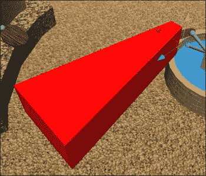
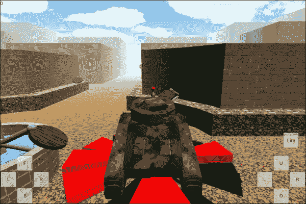
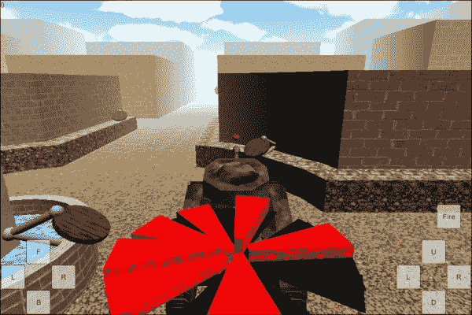
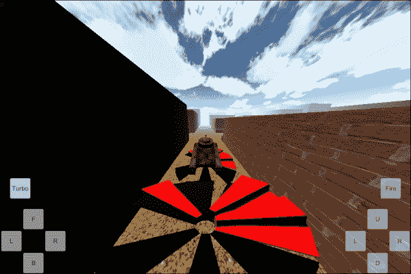
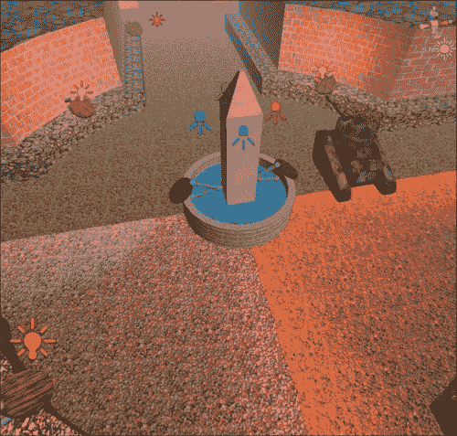
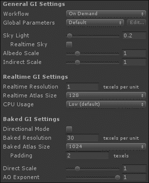
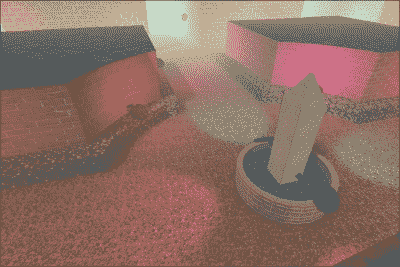
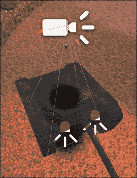

# 第四章. 设置舞台 - 相机效果与照明

在上一章中，你已经学习了构成任何游戏的基础模块：网格、材质和动画。我们创建了一个名为*Tank Battle*的游戏，该游戏利用了所有这些模块。

在本章中，我们将扩展 Tank Battle 游戏。我们从添加天空盒和距离雾开始。通过使用第二个相机的目标指示器叠加，继续探索相机效果。为坦克创建涡轮增压效果，将完成我们对相机效果的探讨。继续关注照明，我们将通过添加光照图和阴影来完成坦克环境的制作。

在本章中，我们将涵盖以下主题：

+   天空盒

+   距离雾

+   使用多个相机

+   调整视野

+   添加灯光

+   创建光照图

+   添加饼干（cookies）

我们将直接沿用第三章的项目，*任何游戏的核心 - 网格、材质和动画*。所以，在 Unity 中打开项目，我们将开始操作。

# 相机效果

你应该添加许多出色的相机效果，以使你的游戏达到最后的完美。在本章中，我们将介绍一些容易添加的选项。这些也将给我们的坦克游戏一个完成的外观。

## 天空盒和距离雾

当相机渲染游戏的帧时，它会首先清除屏幕。Unity 中的默认相机通过用渐变色给一切上色来实现这一点，模拟天空盒的外观。然后，所有的游戏网格都会绘制在这块空白的屏幕上。尽管渐变色比单一颜色看起来更好，但对于坦克的激烈战斗来说，它仍然相当乏味。幸运的是，Unity 允许我们更改天空盒。天空盒只是指形成任何游戏背景天空的一系列图像的华丽说法。距离雾与天空盒配合使用，通过在模型和背景之间平滑视觉过渡。

我们首先需要的是一个新天空盒。我们可以创建自己的，但是 Unity 为我们提供了几个非常适合我们需求的优秀天空盒。以下是获取天空盒的步骤：

1.  在 Unity 编辑器的顶部，选择**资源**，然后点击**导入包**。在这个列表大约一半的位置，选择**天空盒**。

1.  经过一点处理，一个新的窗口会弹出。在 Unity 中，包只是一个已经设置好的压缩资产组。这个窗口显示内容并允许你选择性地导入它们。我们想要全部，所以只需点击此窗口右下角的**导入**。

1.  在**项目**窗口中，将添加一个名为`Standard Assets`的新文件夹。其中包含一个名为`Skyboxes`的文件夹，里面包含各种天空盒材质。选择其中任何一个。你可以在**检查器**窗口看到，它们是使用天空盒着色器的普通材质。它们每个都有六张图片，代表一个立方体的每个方向。

1.  你还会注意到，每张图片下方都有带有**立即修复**按钮的警告信息。这是因为所有图片都被压缩以节省导入时间和空间，但天空盒着色器需要它们以不同的格式。只需每次点击**立即修复**按钮，Unity 就会自动为你修复。它还将消除材质预览中的所有奇怪的黑色。

1.  要将你选择的天空盒添加到游戏中，首先确保你已经加载了正确的场景。如果没有，只需在**项目**窗口中双击场景。这是必要的，因为我们即将更改的设置是针对每个场景的。

1.  在 Unity 编辑器顶部，选择**编辑**，然后点击**场景渲染设置**。新的设置组将出现在**检查器**窗口中。

1.  目前，我们关注的是顶部的值，即**天空盒材质**。只需将新的天空盒材质拖放到**天空盒材质**槽中，它就会自动更新。这个更改可以在**游戏**和**场景**窗口立即查看。

1.  要添加距离雾，我们还需在**场景渲染设置**中调整这个设置。要开启它，只需勾选**使用雾**复选框。

1.  下一个设置，**雾颜色**，允许你为雾选择一个颜色。选择一个接近天空盒总体颜色的颜色是好的。

1.  **雾模式**设置是一个下拉列表，其中包含决定 Unity 计算距离雾的方法的选项。在几乎所有情况下，默认设置**指数平方**是适用的。

1.  接下来的三个设置，**密度**、**开始**和**结束**，决定了有多少雾以及它从多近的距离开始。它们只会在使用这些设置的雾模式下出现。**密度**用于**指数**和**指数平方**雾模式，而其他设置用于**线性**雾模式。将雾设置在视线边缘通常会产生最佳视觉效果。将这些设置保持在**指数平方**，并将**密度**选择为`0.03`以获得良好的视觉效果。

我们已经导入了几种天空盒，并将它们添加到了场景中。距离雾设置也已开启并调整。现在，我们的场景开始看起来像一个真正的游戏。

## 目标指示器

另一个相当有趣的摄像头效果是使用多个摄像头。第二个摄像头可以用来制作 3D GUI、小地图，或者可能是安全摄像头弹出窗口。在下一节中，我们将创建一个系统，该系统将指向附近的的目标。使用第二个摄像头，我们将使指示器出现在玩家坦克的上方。

### 创建指针

我们将从创建一个指向目标的物体开始。我们将制作一个可以重复使用的预制体。但是，为此章节，你需要导入`IndicatorSliceMesh.blend`起始资源，这样我们才有东西供玩家查看。它是一个饼状切片形状的网格。下面我们执行以下步骤来创建指针：

1.  导入网格后，将其添加到场景中。

1.  创建一个空的**GameObject**组件，并将其重命名为`IndicatorSlice`。

1.  将网格设置为`IndicatorSlice`的子对象，并将其定位，使其沿着`GameObject`的*z*轴指向，饼状切片的小端位于`IndicatorSlice`的位置。`IndicatorSlice` GameObject 将位于我们指示器的中心。创建的每个切片都将使其*z*轴指向目标的方向，如下图所示：

1.  现在，我们需要创建一个新的脚本来控制我们的指示器。在**项目**窗口中创建一个名为`TargetIndicator`的新脚本。

1.  我们从这个脚本开始使用一对变量。第一个变量将保存对此指示器片段将指向的目标的引用。指示器也会根据目标距离的远近来增长和缩小。第二个变量将控制指示器开始增长的距离：

    ```java
    public Transform target;
    public float range = 25;
    ```

1.  下一个函数将在创建指示器片段时用来设置`target`变量：

    ```java
    public void SetTarget(Transform newTarget) {
      target = newTarget;
    }
    ```

1.  最后一组代码放入`LateUpdate`函数中。使用`LateUpdate`函数，指示器片段可以在我们的坦克在`Update`函数中移动后指向目标：

    ```java
    public void LateUpdate() {
    ```

1.  我们首先检查`target`变量是否有值。如果是 null，则销毁指示器片段。`Destroy`函数可以用来移除游戏中的任何对象。`gameObject`变量由`MonoBehaviour`类自动提供，并保存了对脚本组件所附加的**GameObject**组件的引用。销毁这个组件也会销毁所有其子对象（或附加的对象）：

    ```java
    if(target == null) {
      Destroy(gameObject);
      return;
    }
    ```

1.  接下来，我们确定这个指示器片段距离其目标有多远。通过使用`Vector3.Distance`，我们可以轻松地计算出距离，而不需要我们自己进行数学计算：

    ```java
    float distance = Vector3.Distance(transform.position, target.position);
    ```

1.  这行代码通过使用一些精心应用的数学和`Mathf.Clamp01`函数，确定了片段的垂直缩放，即*y*轴。这个函数将提供的值限制在零和一之间：

    ```java
    float yScale = Mathf.Clamp01((range – distance) / range);
    ```

1.  我们使用计算出的比例来设置指示器切片的局部比例。通过调整局部比例，我们可以通过改变父对象的比例轻松控制整个指示器的大小：

    ```java
    transform.localScale = new Vector3(1, yScale, 1);
    ```

1.  `transform.LookAt`函数只是一种花哨、自动的方式，用于旋转 GameObject，使其*z*轴指向世界中的特定位置。但是，我们希望所有的指示器切片都平铺在地面上，而不是指向可能在上方我们任何目标。因此，我们首先收集目标的位置。通过将变量的`y`值设置为切片的位置，我们确保切片保持平坦。当然，最后一行结束了`LateUpdate`函数：

    ```java
      Vector3 lookAt = target.position;
      lookAt.y = transform.position.y;
      transform.LookAt(lookAt);
    }
    ```

1.  上述代码是此脚本的最后一段代码。回到 Unity，并将`TargetIndicator`脚本添加到场景中的`IndicatorSlice`对象。

1.  为了完成指示器，请创建它的预制件。就像我们对目标对象所做的那样。

1.  最后，从场景中删除`IndicatorSlice`对象。游戏开始时，我们将动态创建切片。这需要预制件，但不需要场景中的那个。

我们创建了一个预制件，该预制件将用于指示目标的方向。创建并附加的脚本将旋转每个预制件实例，使其指向场景中的目标。它还将调整比例，以显示目标与玩家之间的距离。

### 控制指示器

现在我们需要创建一个控制指示器切片的脚本。这将包括在需要时创建新的切片。此外，它所附加的**GameObject**组件将作为我们刚刚创建的指示器切片围绕旋转的中心点。让我们执行以下步骤来完成这些操作：

1.  创建一个新脚本，并将其命名为`IndicatorControl`。

1.  我们从这个脚本开始使用一对变量。第一个变量将保存对刚刚创建的预制件的引用。这样，我们就可以在需要时生成预制件的实例。第二个是一个静态变量，这意味着它可以轻松访问，无需引用场景中存在的组件。游戏开始时，它将被填充为场景中此脚本实例的引用：

    ```java
    public GameObject indicatorPrefab;
    private static IndicatorControl control;
    ```

1.  下一个函数将由目标使用。很快，我们将更新目标的脚本，以便在游戏开始时调用这个函数。该函数是静态的，就像前面的变量一样：

    ```java
    public static void CreateSlice(Transform target) {
    ```

1.  这个函数首先检查静态变量中是否有对任何对象的引用。如果它是空的，等于`null`，则使用`Object.FindObjectOfType`填充变量。通过告诉它我们想要查找什么类型的对象，它将在游戏中搜索并尝试找到。这是一个相对较慢的过程，不应该经常使用，但我们使用这个过程和变量，以便始终确保系统能找到脚本：

    ```java
    if(control == null) {
      control = Object.FindObjectOfType(typeof(IndicatorControl)) as IndicatorControl;
    }
    ```

1.  `CreateSlice`函数的第二部分检查以确保我们的静态变量不为空。如果为空，它告诉实例创建一个新的指示器切片，并将目标传递给切片：

    ```java
    if(control != null) {
      control.NewSlice(target);
    }
    }
    ```

1.  这个脚本还有一个函数：`NewSlice`。`NewSlice`函数如其名所示，当被调用时会创建新的指示器切片：

    ```java
    public void NewSlice(Transform target) {
    ```

1.  函数首先使用`Instantiate`函数创建`indicatorPrefab`的副本：

    ```java
    GameObject slice = Instantiate(indicatorPrefab) as GameObject;
    ```

1.  接下来，函数将新的切片设置为控制转换的子对象，这样在我们移动时它会跟随着我们。通过将新切片的本地位置归零，我们还确保它会与我们的控制处于同一位置：

    ```java
    slice.transform.parent = transform;
    slice.transform.localPosition = Vector3.zero;
    ```

1.  函数的最后一条线使用切片的`SendMessage`函数调用我们之前创建的`SetTarget`函数，并传递所需的目标对象：

    ```java
      slice.SendMessage("SetTarget", target);
    }
    ```

1.  现在脚本已经创建好了，我们需要使用它。创建一个空的**GameObject**组件，并将其命名为`IndicatorControl`。

1.  新的**GameObject**组件需要设置为坦克的子对象，然后将其在每个轴上的位置设置为 0。

1.  将我们刚刚创建的脚本添加到`IndicatorControl`对象上。

1.  最后，选择 GameObject，将`IndicatorSlice`预制体的引用添加到**Inspector**窗口中适当的槽位，通过从**Project**窗口拖动预制体来实现。

我们创建了一个脚本来控制目标指示器切片的生成。我们最后创建的**GameObject**组件还能轻松地让我们控制整个指示器的大小。我们几乎完成了目标指示器的工作。

### 使用第二个摄像头

如果你现在运行游戏，看起来不会有任何不同。这是因为目标还没有调用创建指示器切片的命令。我们还将在这个部分添加第二个摄像头，完成目标指示器的工作。以下步骤将帮助我们做好这件事：

1.  首先打开`Target`脚本，在`Awake`函数的末尾添加以下代码行。这行代码告诉`IndicatorControl`脚本为这个目标创建一个新的指示器切片：

    ```java
    IndicatorControl.CreateSlice(transform);
    ```

    

1.  如果你现在运行游戏，可以看到指示器的运行效果。但是它可能太大，而且肯定显示在坦克内部。一个糟糕的解决方案是将`IndicatorControl`对象移动，直到整个指示器显示在坦克上方。然而，当发生爆炸，物体开始空中飞散时，它们会再次遮挡目标指示器。一个更好的解决方案是添加第二个摄像头。现在你可以通过从 Unity 编辑器顶部选择**GameObject**，然后点击**Camera**来添加。

1.  此外，将摄像头设置为`Main Camera`的子对象。确保将新摄像头的位置和旋转值设置为`0`。

1.  默认情况下，Unity 中的每个摄像机都会有一系列组件：**摄像机**、**光晕层**、**GUI 层**和**音频监听器**。除了**摄像机**组件之外，其他组件通常对其他每个摄像机来说都不重要，整个场景中应该只有一个**音频监听器**组件。从摄像机中移除多余的组件，只留下**摄像机**组件。

1.  在我们对摄像机进行任何其他操作之前，需要更改`IndicatorSlice`预制体的层。层用于对象之间的选择性交互。它们主要用于物理和渲染。首先在**项目**窗口中选择预制体。

1.  在**检查器**窗口的顶部是标签为**层**的下拉列表，默认显示**默认**。点击下拉列表，并从列表中选择**添加层...**。

1.  在**检查器**窗口中将会出现一个层列表。这些是游戏中使用的所有层。前几个被 Unity 保留使用，因此它们被灰显。其余的供我们使用。点击**用户层 8**右侧的输入框，并将其命名为`Indicator`。

1.  再次选择`IndicatorSlice`预制体。这次，从**层**下拉列表中选择新的**指示器**层。

1.  Unity 会询问你是否也想改变所有子对象的层。我们希望整个对象在此层上渲染，因此我们需要选择**是的，改变子对象**，这样我们就能做到。

1.  现在，让我们回到第二个摄像机。选择摄像机并查看**检查器**窗口。

1.  **摄像机**组件的第一个属性是**清除标志**。这个选项列表决定了摄像机在绘制游戏中的所有模型之前，将用什么来填充背景。第二个摄像机不应该挡住第一个摄像机绘制的一切。我们从**清除标志**下拉列表中选择**仅深度**。这意味着它不会在背景中放置天空盒，而是保留已经渲染的内容，只在新内容上绘制。

1.  下一个属性，**剔除遮罩**，控制摄像机渲染哪些层。前两个选项，**无**和**全部**，用于快速取消选择和选择所有层。对于这个摄像机，取消选择其他所有层，使得只有**指示器**层旁边有勾选标记。

1.  要做的最后一件事是调整`IndicatorControl`的缩放，使得目标指示器不会太大或太小。

我们创建了一个系统来指示潜在目标的方向。为此，我们使用了第二个摄像机。通过调整**剔除遮罩**属性中的层，我们可以使摄像机只渲染场景的一部分。同时，将**清除标志**属性更改为**仅深度**，第二个摄像机可以在第一个摄像机绘制的内容上绘制。

通过移动摄像头，可以改变指示器显示的位置。如果你移动`IndicatorControl`对象，它将改变目标距离和目标方向的计算方式。移动并调整第二个摄像头的角度，以便更美观地显示目标指示器。

当你移动第二个摄像头或使用加速功能（下一节内容）时，你可能会注意到目标指示器仍然可以在坦克内看到。调整主摄像头，使其不渲染目标指示器。这类似于我们如何让第二个摄像头只渲染目标指示器对象。

## 涡轮加速

在本章中，我们要看的最后一个摄像头效果是涡轮增压。它将在屏幕上是一个按钮，可以迅速推动玩家向前移动一段短暂的时间。摄像头效果之所以出现，是因为简单调整**视野**属性，就能让我们看起来移动得更快。电影中在汽车追逐场景中使用了类似的方法，让追逐看起来比实际更快。

在这一节中，我们只会制作一个脚本。该脚本将使坦克以类似于上一章中创建的`ChassisControls`脚本的方式移动。不同之处在于，我们不需要按下一个按钮就能使加速生效。下面是操作步骤：

1.  首先，创建一个新脚本，并将其命名为`TurboBoost`。

1.  要开始脚本，我们需要四个变量。第一个变量是对坦克上`CharacterController`组件的引用。我们需要它来进行移动。第二个变量是我们在加速时移动的速度。第三个变量是加速持续的时间，以秒为单位。最后一个变量用于内部判断我们是否可以加速以及何时应该停止：

    ```java
    public CharacterController controller;
    public float boostSpeed = 50;
    public float boostLength = 5;
    public float startTime = -1;
    ```

1.  `StartBoost`函数非常简单。它检查`startTime`变量是否小于零。如果是，将该变量设置为由`Time.time`提供的当前时间。该变量小于零意味着我们当前没有在加速：

    ```java
    public void StartBoost() {
      if(startTime < 0)
        startTime = Time.time;
    }
    ```

1.  我们将要使用的最后一个函数是`Update`函数。它首先检查`startTime`以确定我们当前是否正在加速。如果我们没有在加速，函数会提前退出。下一行代码检查以确保我们拥有`CharacterController`的引用。如果该变量为空，那么我们就无法让坦克移动：

    ```java
    public void Update() {
      if(startTime < 0) return;
      if(controller == null) return;
    ```

1.  下一行代码应该看起来很熟悉。这是让坦克移动的那一行：

    ```java
    controller.Move(controller.transform.forward * boostSpeed * Time.deltaTime);
    ```

1.  接下来，检查我们是否处于加速的前半秒。通过将当前时间与开始加速时记录的时间进行比较，我们可以轻松地计算出我们已经加速了多长时间：

    ```java
    if(Time.time – startTime < 0.5f)
    ```

1.  如果时间合适，我们会通过调整`fieldOfView`值来转换相机。`Camera.main`值是 Unity 提供的一个引用，指向场景中使用的主相机。`Mathf.Lerp`函数根据零到一之间的第三个值，从起始值向目标值移动。使用这个，相机的`fieldOfView`值会在半秒内向我们的目标值移动。

    ```java
    Camera.main.fieldOfView = Mathf.Lerp(Camera.main.fieldOfView, 130, (Time.time – startTime) * 2);
    ```

1.  下一段代码与前面两段相同，除了在加速的最后半秒，并使用相同的方法将`fieldOfView`值恢复到默认：

    ```java
    else if(Time.time – startTime > boostLength – 0.5f)
    Camera.main.fieldOfView = Mathf.Lerp(Camera.main.fieldOfView, 60, (Time.time – startTime – boostLength + 0.5f) * 2);
    ```

1.  最后一段代码检查我们是否完成了加速。如果是这样，将`startTime`设置为`-1`以表示我们可以开始另一次加速。最后的那个大括号，当然，关闭了`Update`函数：

    ```java
    if(Time.time > startTime + boostLength)
      startTime = -1;
    }
    ```

1.  接下来，将脚本添加到你的坦克上，并连接`CharacterController`引用。

1.  我们快完成了。我们需要创建一个新的按钮。我们可以像以前一样做。将按钮锚定到**画布**的右下角，并将其定位在底盘移动控制之上。

1.  最后，确保为**OnClick**对象选择`Tank`，并在功能中导航至**涡轮增压** | **StartBoost()**。

1.  尝试这个吧。

我们在这里创建了一个涡轮增压。我们在前一章中使用的方法同样用于移动这里的坦克。通过调整相机的**视野**属性，我们使坦克看起来移动得更快。

在玩游戏时，你可能会注意到即使在加速时也可以转向。尝试在`ChassisControls`脚本中添加一个检查，以在加速时锁定控制。为此，你需要添加对`TurboBoost`脚本的引用。

为了增加额外的挑战，尝试给加速添加一个冷却时间。让玩家不能持续使用加速。另外，如果坦克撞到某物，尝试取消加速。这是一个难题，所以这里有一个提示：先查看 Unity 文档中的`OnControllerColliderHit`。

# 光

Unity 提供了多种光类型来照亮游戏世界。它们分别是**方向光**、**聚光灯**、**点光源**和**区域光**。这些光以不同的方式投射光线；以下是它们的详细解释：

+   **方向光**：这类似于太阳。它将所有光线沿单一方向投射。光的位置无关紧要，重要的是旋转。光线以一个方向投射到整个场景。这使得它非常适合初步为场景添加光线。

+   **聚光灯**：这就像舞台上的灯光一样工作。光线以类似圆锥的形状沿特定方向投射。因此，这也是系统计算中最复杂的光类型。Unity 对其计算光线的方式进行了重大改进，但应避免过度使用这些灯光。

+   **点光源**：这是在游戏中主要使用的光源类型。它向四面八方发射光线。这就像一个灯泡。

+   **区域光源**：这是一种特殊用途的光源。它从平面单一方向发射光线。可以把它想象成用来为酒店或餐厅做广告的大型霓虹灯。由于它们的复杂性，这些光源只能在烘焙阴影时使用。当游戏运行时，它们的计算量太大，无法使用。

在讨论灯光时，下一个明显的问题涉及到阴影，尤其是实时阴影。虽然实时阴影为场景增加了许多效果，并且在任何平台上技术上都是可能的，但它们的成本非常高。除此之外，对于所有光源类型，除了**方向光**，它们都是 Unity Pro 功能。总的来说，这对于一般的移动游戏来说有点过于昂贵了。

另一方面，有一些成本几乎不高的完美替代方案，它们通常比实时阴影看起来更真实。第一种替代方案是针对你的游戏环境。通常情况下，游戏中的环境在特定场景内不会移动也不会改变。为此，我们有光照图。它们是包含阴影数据的额外纹理。使用 Unity，你可以在制作游戏时创建这些纹理。然后，当游戏运行时，它们会自动应用，阴影就会出现。然而，这对于动态物体（任何会移动的东西）并不适用。

对于动态物体，我们有“cookies”。这可不是你奶奶做的饼干。在照明中，cookie 是一个黑白图像，它被投影到游戏中的网格上。这类似于皮影戏。皮影戏使用剪片来阻挡部分光线，而 cookies 则使用黑白图像来告诉光线可以投射光亮的位置。

Cookies 还可以用来创建其他静态和动态效果，比如在场景中移动的云层覆盖，或者从笼子中投射出的光线。或者，你可以使用它们来制作手电筒不均匀的焦点。

## 添加更多灯光

向场景中添加额外的灯光相当简单。而且，只要坚持使用点光源，渲染它们的成本就会保持较低。让我们使用以下步骤来照亮我们的游戏：

1.  在 Unity 编辑器顶部，导航到 **GameObject** | **Light** | **Point Light**。

1.  选择新的光源后，在**检查器**窗口中我们应该关注以下几个属性：

    +   **范围**：这是光线从物体发射的距离。从这个点发出的光在中心位置最亮，在达到范围极限时逐渐消失。范围在**场景**视图中还以黄色线框球体表示。

    +   **颜色**：这仅仅是光线的颜色。默认情况下，它是白色；然而，这里可以使用任何颜色。这个设置在所有光源类型之间共享。

    +   **强度**：这表示光的亮度。光的强度越大，其中心的亮度也就越亮。这个设置对所有类型的灯光都是共享的。

1.  创建并定位更多的灯光，沿着街道排列，为环境添加一些更有趣的元素。

1.  按下 *Ctrl* + *D* 来复制选定的对象。这可以大大加快创建过程（如下面的截图所示）：

1.  在添加这些灯光时，你可能注意到了它们的一个主要缺点。实时影响一个表面的灯光数量是有限制的。通过使用更复杂的网格，可以在一定程度上解决这个问题。更好的选择是使用光照图，我们将在下一节中看到。

1.  再次在 Unity 编辑器顶部，导航到**游戏对象** | **灯光** | **聚光灯**。

1.  选择一盏新灯，并在**检查器**窗口中查看它。

    **聚光角度**：这是这种类型灯光独有的。它决定了发射光的锥形有多宽。与**范围**一起，在**场景**视图中由一个黄色线框锥形表示。

1.  在坦克大战城市中心的喷泉周围添加几个聚光灯，如下面的截图所示：

1.  场景中拥有如此多的对象使得**层次结构**窗口显得杂乱无章，难以找到任何东西。为了组织它们，你可以使用空的游戏对象。创建一个**游戏对象**，并将其命名为 `PointLights`。

1.  通过将所有点光源设置为这个空**游戏对象**的子对象，**层次结构**窗口将变得不再那么杂乱。

我们为游戏添加了几盏灯。通过改变灯光的颜色，我们使场景看起来更有趣，玩起来也更吸引人。然而，这也揭示了照明系统的一个缺点。我们使用的城市非常简单，同时影响一个平面的灯光数量是有限制的。尽管如此，我们的场景外观得到了改善，但许多令人印象深刻的元素还是因为这一缺点而大打折扣。

## 光照图

光照图对于复杂的照明设置非常有效，这些设置在运行时可能过于昂贵或根本无法工作。它们还允许你在不消耗实时阴影的情况下为游戏世界添加详细的阴影。然而，这种方法只适用于在整个游戏过程中不会移动的对象。

光照图对于任何游戏环境都是一个很好的效果，但我们需要明确告诉 Unity 哪些对象不会移动，然后创建光照图。以下步骤将帮助我们完成此操作：

1.  要做的第一件事是使你的环境网格静态化。为此，首先选择城市的一部分。

1.  在**检查器**窗口的右上角，对象名称字段右侧有一个复选框和**静态**标签。勾选此复选框将使对象变为静态。

1.  按照以下步骤将城市的所有网格设为静态：

    +   如果你进行了任何形式的分组（正如我们对灯光所做的那样），那么这一步可以更快地完成，而不是逐个选择每个复选框。选择你城市的根对象，即所有城市部件、建筑和街道的父对象。

    +   现在，勾选**静态**复选框。

    +   在新的弹出窗口中，选择**是，更改子对象**，使所有子对象也变为静态。

1.  当 Unity 生成光照图时，任何未展开或具有规范化 UV 空间外 UV 位置的网格都将被跳过。在**模型导入设置**窗口中，有一个选项可以让 Unity 自动生成光照图坐标，即**生成光照图 UV**。如果你正在使用`TankBattleCity`作为你的环境，现在应该开启这个选项。

1.  转到 Unity 编辑器顶部，选择**窗口**，然后点击底部的**光照**。

1.  当你查看这个窗口时，大部分时间将花在**场景**页面上。选择窗口顶部的**场景**以切换到该页面。

1.  你会首先注意到这个页面的一个特点是，它具有我们在**场景渲染设置**中看到的相同的**天光**部分，我们在那里更改了天空盒。在窗口底部，我们还有所有的**雾**设置。

1.  我们感兴趣的部分是**通用 GI 设置**，如下面的截图所示：

    前面的截图有以下设置：

    +   **工作流程**：此设置决定了你将使用哪种方法来处理光照图。默认选择的是**旧版**方法。我们希望将其更改为**按需**。（**迭代**与**按需**相同，但在你调整设置时尝试更新光照图。只有当你的计算机足够强大以处理此操作时，才推荐使用此选项。）

    +   **全局参数**：此设置允许你创建你可能想要快速选择的设置。如果你有许多需要更改的场景，这将特别有用。然而，我们只有一个场景，所以现在可以忽略它。

    +   **天光**：此设置影响场景中的环境光量。较低的值会使整个场景变暗，可能给你一个夜晚的场景。较高的值会使一切变得更亮，可能是白天的场景。此设置下面的**实时天光**复选框决定了此计算是在游戏运行时进行，还是在烘焙光照图时进行。取消勾选此框将节省处理资源，但勾选它将允许你在游戏运行时更改场景的亮度。因此，如果你想在游戏中看到你的灯光，将**天光**设置为`0.2`，并取消勾选**实时天光**。

    +   **反照率缩放**：这个设置影响光线从表面反射的多少。**间接光照缩放**选项影响场景中来自非直接照射物体的光源的整体光照。出于我们的目的，这两个选项可以保持默认值。

    +   **实时 GI 设置**：这一部分仅在 Unity 的新光照贴图系统中可用。它包含在游戏运行时计算的光照贴图的控件。**实时分辨率**和**实时图集大小**选项调整这些光照贴图中的细节量。**CPU 使用率**选项控制在游戏运行时系统将投入多少努力来计算你所看到的值。由于我们是在移动平台上工作，我们需要保持处理成本降低，所以将这些选项保持在其低默认值对我们来说很好。

    +   **烘焙 GI 设置**：这些设置包含调整预计算光照贴图的控件。这里是你大部分调整发生的地方。首先，我们有一个**方向模式**复选框，它决定了当我们未选中时是否使用单一组光照贴图。或者，如果我们使用两组，其中一组用于颜色和直接光照，第二组用于间接光照。使用两组光照贴图可以提供更高的细节，尤其是在暗区，但计算和使用成本更高。所以，我们打算保持它未选中。

    +   **烘焙分辨率**：此设置根据物体的大小控制其包含的细节量。在数字字段后面，你可以看到**每单位纹理像素**设置。纹理像素只是一个花哨的光照贴图像素。所以，它实际上是场景中每个单位在光照贴图中的像素细节量。出于我们的目的，`30`的值可以为我们提供足够的细节，而不会让计算机过载。

        ### 提示

        **烘焙分辨率**设置将最直接影响实际烘焙光照贴图所需的时间。最好先使用低值开始工作，并且只有当你的光照设置接近你想要的最终产品的样子时，才增加这些值。

    +   **烘焙图集大小**：此设置控制最终光照贴图图像的分辨率。较小的分辨率更容易处理，但你需要限制场景中最大物体的总体细节。无论你选择哪种分辨率，你的模型的单个平面都不能比单个光照贴图图集拥有更多的细节。默认的**1024**在细节和处理成本之间取得了很好的平衡。

    +   **填充**：此设置调整光照贴图中对象之间的空间。过低的值将导致阴影渗透到共享光照贴图的其他对象的边缘。过高的值将导致光照贴图中浪费大量空间。同样，默认值对我们来说就很好。

    +   **直接缩放**: 这个设置将在烘焙到光照贴图中的灯光强度进行缩放。它允许你改变场景的整体亮度。默认设置在这里同样可以正常工作。

    +   **环境光指数**: 这个设置调整环境光照的对比度。这将使你场景中的暗区看起来更暗，亮区看起来更亮。将其保留为默认的`1`对我们来说就很好。

1.  在页面底部有一个**烘焙**按钮。点击这个按钮将开始渲染过程。在 Unity 的右下角会出现一个加载条，这样你可以监控进度。

    ### 注意

    提醒一下，这个过程可能需要一些时间。特别是随着环境复杂度和灯光数量的增加以及细节设置的提升，这个过程运行的时间会越来越长。另外，除非你有一台高性能的计算机，否则在它运行的时候在 Unity 里你几乎什么也做不了。

1.  如果你点击了按钮并意识到你犯了一个错误，不要慌张。选择**烘焙**后，该按钮会变为**取消**。此时，可以选择它并停止进程继续进行。然而，一旦纹理被创建并且 Unity 开始导入它们，就无法停止这一过程。

1.  在**烘焙**按钮的左侧是**清除**。这个按钮是删除和移除场景中当前使用的所有光照贴图的最快和最简单的方法。这个操作无法撤销。

1.  为了给你的建筑物添加阴影，在**层级**中选择你场景中的**方向光**，并查看**检查器**窗口。

1.  从**阴影类型**下拉列表中选择**软阴影**。这简单地为这个灯光开启了阴影。它为光照贴图和实时光照都开启阴影。开启阴影的灯光数量越多，渲染成本就越高。为你的光照贴图开启阴影是个好主意，但之后一定要关闭它们。这将为你最终的游戏节省处理资源，同时还能让你的静态场景看起来很好。

1.  当你的所有灯光和设置都符合你的预期时，选择**烘焙**，一旦处理完成，就可以惊奇地欣赏你面前现在这个美丽的场景，如下图所示：

我们为游戏世界添加了光照贴图。仅处理这一步所需的时间就使得进行微小调整变得困难。然而，通过几次点击，我们的光照效果得到了极大的改善。之前灯光被网格破坏，现在我们有了平滑的颜色和光照区域。

当玩游戏时，人们唯一不会质疑来源的光线类型是阳光。如果看不到来源，其他任何光线看起来都会很奇怪。创建一个网格并将其添加到游戏中，以便为你要使用的灯光提供一个理由。这可以是类似于火把、路灯，甚至是发光的外星粘液球的东西。无论它们最终是什么，拥有它们都能增加完整性，这是让游戏看起来不错与看起来很棒之间的区别。

作为第二个挑战，看看你的光照贴图的质量。玩弄我们讨论的各种质量设置，看看有什么不同。还要找出分辨率可以低到什么程度，你才会注意到像素化。在运行小型移动设备屏幕时，设置是否可以更低？去发现吧。

## 饼干效果

饼干是增强游戏中灯光兴趣的好方法。它们使用纹理来调整光线如何发射。这种效果可以涵盖广泛的使用范围，从闪烁的晶体到笼式工业灯光，在我们的案例中，是车头灯。

通过给我们的坦克添加车头灯，我们让玩家能够控制他们世界中的灯光。使用饼干效果，我们可以让它们看起来比简单的光圈更有趣。按照以下步骤添加这些灯光：

1.  从创建一个聚光灯开始。

1.  将灯光放置在坦克前方并指向外侧。

1.  在**Inspector**窗口中，将**强度**属性的值增加到`3`。这将使我们的车头灯更亮，就像真正的车头灯一样。

1.  现在，我们需要一些饼干纹理。在 Unity 编辑器顶部，导航到**Assets** | **Import Package** | **Light Cookies**。

1.  在新窗口中，点击**Import**并等待加载条完成。

1.  现在我们有几个选项可以选择。在`Standard Assets`文件夹内，创建了一个名为`Light Cookies`的新文件夹，其中包含了新的纹理。将**Project**窗口中的**Flashlight**拖放到**Inspector**窗口中**Spotlight**的**Cookie**字段上。这样就可以简单地为灯光添加一个饼干效果。

1.  你可能仍然无法看到你的饼干效果。这是之前我们遇到的问题的同样结果；太多的灯光不能对同一个物体进行阴影处理。不幸的是，意味着要移动的灯光不能烘焙到光照贴图中。为了解决这个问题，在**Inspector**面板中将灯光的**渲染模式**属性更改为**重要**。这将给灯光优先级，使其在场景中的其他物体之前照亮一个物体。

1.  如果你现在再次烘焙你的灯光，你最终会得到一个贴在建筑物墙上的饼干形状。我们需要将**GI 模式**更改为**实时**，这样光线就能被光照贴图过程忽略，但仍然能够影响场景。

1.  最后，复制第二个车头灯的灯光，并使它们都成为坦克的子物体。如果车头灯不跟着我们，那它们还有什么用？

我们通过几个简短的步骤，使用 cookies 为我们的坦克创建了一对大灯。这正是许多其他游戏，尤其是恐怖游戏，创建手电筒效果的方式。

尝试编写一个脚本，允许玩家打开和关闭大灯。它应该是一个简单的按钮，用来切换灯光。查看作为灯光一部分提供的`enabled`变量。

作为一项简单的挑战，创建一个位于坦克炮塔上的灯。给它一个光源。这样，玩家可以指向他们射击的地方，而不仅仅是坦克所指的方向。

# 阴影

阴影是一种简单且成本较低的方法，通过它你可以为角色添加阴影。自从视频游戏诞生以来，它们就一直存在。普通阴影是将物体的固体、暗色投影到另一个表面上。阴影的轮廓与物体的形状完全匹配。当角色开始随机移动时，这变得计算起来很昂贵。

阴影是一个位于角色或物体下方的黑色纹理块。它通常没有明确的形状，并且不会与它所要表示的物体的形状完全匹配。阴影通常也不会改变大小。这使得它计算起来明显更容易，成为许多代视频游戏的阴影选择。这也意味着它更适合我们的移动设备，因为在这些设备上处理速度可能很快就会成为一个问题。

我们将为我们的坦克添加一个阴影。Unity 已经为我们完成了大部分工作；我们只需将其添加到坦克上。通过以下步骤，我们可以添加阴影：

1.  我们从导入 Unity 的阴影开始。回到 Unity 编辑器顶部，导航到**资源** | **导入包** | **投影仪**。

1.  在新窗口中点击**导入**，并在**项目**窗口中查看名为`Projectors`的新文件夹，该文件夹位于`Standard Assets`下创建。

1.  从**项目**窗口将`Blob Shadow Projector`预制体拖到场景中，并将其放置在坦克上方，如下图所示：

1.  不幸的是，阴影出现在我们坦克的顶部。为了解决这个问题，我们再次需要利用图层。所以，选择坦克。

1.  从**图层**下拉列表中选择**添加图层…**。

1.  点击**用户图层 9**右侧的文本框，为其命名`PlayerTank`。

1.  再次选择你的坦克，但这次从**图层**下拉列表中选择**PlayerTank**。

1.  当新窗口弹出时，请确保选择**是，更改子对象**以改变整个坦克的图层。如果你不选择这个，阴影可能会出现在坦克的某些部分，而其他部分可能不会出现。

1.  现在，从**层次结构**窗口中选择`Blob Shadow Projector`。

    ### 注意

    blob 阴影是由**Projector**组件创建的。这个组件的工作方式与**Camera**组件类似。然而，它将图像投影到世界上，而不是将世界转换成图像并显示在你的屏幕上。

1.  看一下**Inspector**窗口。我们现在关心的是**Ignore Layers**的值。目前，它被设置为**Nothing**。

1.  点击**Nothing**，并从**Layers**下拉列表中选择`PlayerTank`。这将使投影仪忽略坦克，只在其下方产生 blob 阴影。

1.  下一步是调整阴影的大小，使其大致与坦克的大小相匹配。调整**Field of View**属性的值，直到大小差不多合适。从`70`开始似乎是一个不错的选择。

1.  最后一步是使`Blob Shadow Projector`成为坦克的子对象。我们需要能够带着我们的阴影移动；我们可不想失去它。

我们为坦克添加了阴影。阴影对于使物体，尤其是角色看起来实际接触地面非常有用。我们使用的 blob 阴影优于实时阴影，因为它的处理速度更快。

blob 阴影自带的纹理是圆形的，但我们的坦克大多是方形的。尝试为 blob 阴影创建自己的纹理并使用它。某种矩形纹理应该会很合适。如果最终场景中出现了长长的黑色条纹，请确保你的纹理在图像边缘周围有完全白色的边框。

如果你成功地为 blob 阴影添加了自己的纹理，那么不妨看看那门炮？炮管伸出我们的坦克，破坏了其原本的方形轮廓。使用第二个 blob 阴影，附着在炮塔上，为炮管投射阴影。这个纹理也将必须是矩形形状的。

# 总结

在这一点上，你应该已经非常熟悉摄像机效果和灯光。

在本章中，我们首先查看了使用多个摄像头的用法。然后，我们玩弄了涡轮增压摄像机效果。接着，我们继续对城市进行照明。当我们使用光照图时，灯光效果得到了极大的提升。最后，我们通过一些特殊的照明效果来查看饼干和 blob 阴影。

在下一章中，我们将看到为我们的游戏创建敌人。我们将使用 Unity 的寻路系统使它们四处移动并追逐玩家。在此之后，如果玩家希望保持积分，他们需要变得更加积极。
