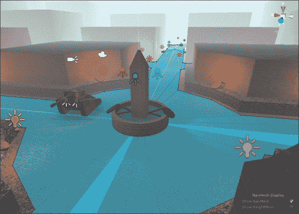
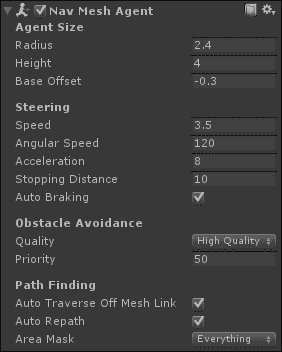
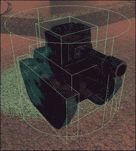
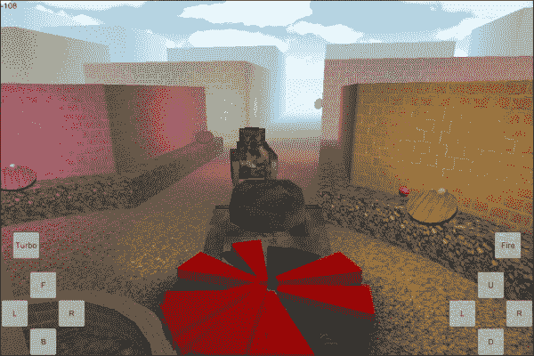

# 第五章：穿梭自如 - 路径寻找与人工智能

在上一章中，我们了解了相机和光照效果。我们在坦克大战游戏中添加了天空盒、灯光和阴影。我们创建了光照图来使我们的场景动态化。我们通过给坦克车头灯添加“饼干”效果来了解了投影仪。我们还通过为坦克创建了一个斑点阴影来了解了投影仪。我们还为坦克创建了一个涡轮增压功能。通过调整相机的视角，我们能够让坦克看起来比实际速度快得多。当我们完成这一章时，我们已经拥有了一个动态且令人兴奋的场景。

本章将全面介绍敌人。玩家将不能仅仅待在一个地方来积累分数。我们将向游戏中添加一个敌方坦克。通过使用 Unity 的 NavMesh 系统，坦克将能够进行路径寻找并追逐玩家。一旦发现玩家，坦克就会射击并减少玩家的得分。

在本章中，我们将涵盖以下主题：

+   NavMesh

+   NavMeshAgent

+   路径寻找

+   追逐和攻击 AI

+   出生点

我们将对第 四章《设置舞台 - 相机效果与光照》中的坦克大战游戏进行修改，所以加载它，我们可以开始。

# 理解人工智能与路径寻找

如你所猜测的，**AI** 是 **人工智能**。在最广泛的意义上，这是任何非生命体可能做的，使其看起来像是在做决定。你对此概念最熟悉的可能来自视频游戏。当一个不由玩家控制的角色选择一个武器和一个使用它的目标时，这就是 AI。

在其最复杂的形式中，人工智能试图模仿完整的人类智能和学习。然而，对于这一切真正成功来说，发生的事情仍然太多太快。视频游戏无需达到这一步。我们主要关注的是让我们的角色看起来智能，但仍然能被玩家征服。通常，这意味着不允许角色根据比真实玩家更多的信息采取行动。调整角色拥有和可以采取行动的信息量是调整游戏难度的一个好方法。

**路径寻找** 是 AI 的一个子集。我们一直在使用它，尽管你可能从未意识到。路径寻找正如其名，是寻找路径的行为。每次你需要找到两点之间的路时，你都在进行路径寻找。就我们的角色而言，最简单的路径寻找形式是直接向目标点直线前进。显然，这种方法在开阔平原上最有效，但当遇到任何障碍物时往往会失败。另一种方法是给游戏覆盖一个网格。使用网格，我们可以找到一个绕过任何障碍物并到达我们目标的路径。

作为路径查找的替代方法，或许最常被选择的一种是使用特殊的导航网格，即 NavMesh。这只是一个玩家永远看不到的特殊模型，但它覆盖了计算机角色可以移动的所有区域。然后以类似于网格的方式导航玩家；不同之处在于，这里使用的是网格的三角形，而不是网格的方形。这就是我们在 Unity 中将使用的方法。Unity 提供了一套很好的工具用于创建和利用 NavMesh。

# NavMesh

在 Unity 中创建导航网格非常简单。这个过程与我们用于制作光照图的过程类似。我们只需标记一些要使用的网格，调整特殊窗口中的某些设置，然后点击一个按钮。所以，如果你还没有加载 Unity 中的坦克大战游戏，现在就加载它，我们可以开始操作了。

Unity 可以自动从场景中存在的任何网格生成 NavMesh。为此，首先需要将网格标记为静态，就像我们对光照图所做的那样。然而，我们并不希望或需要能够导航城市的屋顶，因此我们使用一组特殊的设置列表来指定每个对象将是什么类型的静态。让我们从以下步骤开始：

1.  从**层次结构**窗口中选择城市，并在**检查器**窗口中点击**Static**右侧的向下箭头：

    我们可以查看以下静态对象的可用选项：

    +   **无**：此选项用于快速取消选中所有其他选项。如果所有其他选项都未被选中，此选项将被选中。

    +   **一切**：使用此选项，你可以快速选择所有其他选项。当所有选项都被选中时，此选项也将被选中。**检查器**窗口中**Static**标签旁边的复选框与选中或取消选中**一切**复选框执行相同的功能。

    +   **光照图静态**：在处理光照图时，需要选中此选项才能使它们正常工作。任何未勾选此选项的网格将不会被光照图处理。

    +   **遮挡静态**：这是用于处理遮挡的选项。**遮挡**是一种运行时优化方法，只渲染实际上可以看到的对象，无论它们是否在摄像机的视图空间内。**遮挡物**是会阻止其他对象被看到的对象。它与**被遮挡静态**选项一起工作。此选项的最佳对象选择是大型且实心的。

    +   **批量静态**：这是另一个运行时优化的选项。批量渲染是将对象组合在一起然后再渲染它们的操作。它大大提高了游戏的整体渲染速度。

    +   **导航静态**：这是我们目前主要关心的选项。任何勾选此选项的网格在计算 NavMesh 时将被使用。

    +   **遮挡对象静态**：正如刚才提到的，这个选项与**遮挡器静态**配合使用，以实现遮挡的好处。**遮挡对象**是会被其他对象遮蔽的物体。当被遮挡器覆盖时，这个物体将不会被绘制。

    +   **离网格链接生成**：这个选项同样与 NavMesh 计算有关。离网格链接是 NavMesh 两个不物理连接部分之间的连接，例如屋顶和街道。使用**导航**窗口中的几个设置和此选项，链接会自动生成。

    +   **反射探针静态**：最后一个选项允许物体被反射探针记录。这些探针记录它们周围的一切，并生成一个可以用作反射着色器的立方体贴图。

1.  为了使 NavMesh 正常工作，我们需要更改设置，以便只能导航城市的街道。你上次看到坦克从建筑物屋顶跳下或掉下来是什么时候？因此，我们需要更改静态选项，使得只有街道勾选了**导航静态**。这可以通过以下两种方法之一完成：

    +   第一种方法是我们逐一取消要更改的每个对象的选项。

    +   第二种方法是，在**层级**窗口中取消勾选顶级对象的**导航静态**选项，当 Unity 询问是否要对所有子对象进行更改时，回答“是”。然后，只需对我们希望导航的对象重新勾选该选项。

1.  现在，通过转到 Unity 的工具栏，点击**窗口**，然后点击菜单底部的**导航**来打开**导航**窗口。以下屏幕截图显示了制作 NavMesh 的所有工作发生的地方：

1.  这个窗口由三个页面和众多设置组成：

    当选择一个对象时，设置将出现在**对象**页面上。这两个复选框直接对应于我们刚才设置的同名的**静态**选项。在**导航区域**的下拉列表中，我们可以将 NavMesh 的不同部分分组。这些组可以用来影响路径查找计算。例如，可以设置汽车只在地面上行驶，而人类可以沿着人行道区域行走。

    **烘焙**页面是我们感兴趣的页面；它充满了改变 NavMesh 生成方式的选项。它甚至包括了一个很好的可视化表示，展示了各种设置在顶部：

    +   **角色半径**：这应该设置为最瘦的角色的大小。它用于防止角色走得太靠近墙壁。

    +   **角色高度**：这是你的角色的高度。利用这一点，Unity 可以计算出并移除那些对他们来说太低而无法通过的区域。任何低于这个值的区域都被认为是太小，因此应该将其设置为你的最矮角色的高度。

    +   **最大坡度**：在计算 NavMesh 时，任何比这个值更陡的斜坡都会被忽略。

    +   **步高**：在使用楼梯时，必须使用这个值。这是角色可以踏上的楼梯的最大高度。

    +   **掉落高度**：这是角色能够掉落的高度。有了这个设置，路径将包括从边缘跳下，如果这样做更快的话。

    +   **跳跃距离**：使用这个值，角色可以在.NavMesh 的缺口处跳跃。这个值表示可以跳跃的最远距离。

    +   **手动体素大小/体素大小**：勾选**手动体素大小**复选框，你可以调整**体素大小**的值。这是.NavMesh 的细节级别。值越低，与可见网格的匹配度越高，但计算时间会更长，存储所需的内存也更多。

    +   **最小区域面积**：如果.NavMesh 的部分小于这个值，那么在最终的.NavMesh 中将不会使用这些部分。

    +   **高度网格**：勾选此选项后，原始高度信息将在.NavMesh 中保持不变。除非你有特殊需要，否则这个选项应该保持关闭。系统计算需要更长的时间，存储也需要更多的内存。

    第三页**区域**允许我们调整我们定义的每个区域的移动成本。本质上，我们的游戏世界中不同部分的移动难度如何？对于汽车，我们可以调整层次，使其在田野中移动的成本是道路上的两倍。

    在窗口底部，我们有以下两个按钮：

    +   **清除**：这个按钮移除之前创建的.NavMesh。使用这个按钮之后，你需要在再次使用路径查找之前重新烘焙.NavMesh。

    +   **烘焙**：这个按钮开始工作并创建.NavMesh。

1.  我们的城市非常简单，所以默认值对我们来说已经足够适用。点击**烘焙**，并观察右下角的进度条。完成之后，会出现一个蓝色网格。这就是.NavMesh，它表示角色可以移动的所有区域。

    ### 提示

    可能你的坦克在移动时会稍微穿过后建筑物墙壁。如果发生这种情况，请在**导航**窗口中增加**代理半径**，直到它们不再这样做。

1.  我们还需要做最后一件事。我们的导航网格.NavMesh 很完美，但如果你仔细观察，会发现它穿过了城市中心的喷泉。如果敌方坦克开始从喷泉中驶过，那就太不对了。要修复这个问题，首先选择围绕喷泉形成的网格。

1.  在 Unity 的工具栏中，点击**组件**，然后是**导航**，最后是**导航网格障碍**。这仅仅添加了一个告诉导航系统在寻找路径时绕道的组件。由于我们已经选择了墙壁，新组件的大小将自动适应；我们只需要从**形状**下拉列表中选择**胶囊**。你可以在**场景**视图中看到一个线框圆柱体表示它。

我们创建了 NavMesh。我们利用了**导航**窗口和**静态**选项，告诉 Unity 在计算 NavMesh 时要使用哪些网格。Unity 团队投入了大量工作，使得这个过程快速而简单。

记住，在第三章 *任何游戏的支柱 - 网格、材质和动画* 中，当挑战是为玩家创建障碍时，我们鼓励你创建额外的网格，比如坦克陷阱和瓦砾。让敌方坦克也驶过这些障碍是个糟糕的想法。因此，尝试将这些设置为导航系统的障碍，就像对喷泉所做的那样。

# NavMeshAgent 组件

你可能会想，我们有了 NavMesh 是很好，但是没有角色来导航它。在本节中，我们将开始创建我们的敌方坦克。在我们可以进行任何 AI 编程之前，我们需要导入并进行一些设置。使用这些步骤，我们可以创建它：

1.  从本章的起始资源中选择 `Tanks_Type03.png` 和 `Tanks_Type03.blend`，并将它们导入到 `Models` 文件夹下的 `Tanks` 文件夹中。

1.  Unity 导入完成后，在**项目**窗口中选择新的坦克，并在**检查器**窗口中查看它。

1.  这个坦克没有动画，所以可以将**动画类型**设置为**无**，并分别从**骨骼**和**动画**页面取消选中**导入动画**。

1.  将坦克从**项目**窗口拖到**场景**窗口；任何街道上的清晰区域都可以。

1.  首先，在**场景**视图中将模型重命名为 `EnemyTank`。

1.  现在，我们需要改变坦克的父子关系，以便炮塔可以转动，炮管跟随，就像我们对玩家坦克所做的那样。为此，创建一个空的**游戏对象**，并将其重命名为 `TurretPivot`。

1.  将 `TurretPivot` 定位到炮塔底部。

1.  在**层次结构**窗口中，将 `TurretPivot` 拖放到 `EnemyTank` 上，使 `EnemyTank` 成为它的父对象。

1.  接下来，再创建一个空的**游戏对象**，并将其重命名为 `CannonPivot`。

1.  `CannonPivot` 游戏对象必须设置为 `TurretPivot` 的子对象。

1.  在**层次结构**窗口中，将炮塔网格设置为 `TurretPivot` 的子对象，将炮管网格设置为 `CannonPivot` 的子对象。当 Unity 询问你是否确定要断开预制件连接时，一定要点击**是**。

1.  这个坦克模型有点大，因此需要在**检查器**窗口中调整坦克的**导入设置**中的**缩放因子**为 `0.6`，以便得到一个与玩家坦克大小相似的坦克。

1.  为了让坦克在我们的新 NavMesh 上导航，我们需要添加一个**NavMeshAgent**组件。首先，在**层次结构**窗口中选择`EnemyTank`，然后导航到 Unity 的工具栏，选择**组件** | **导航** | **Nav Mesh Agent**。在**检查器**窗口中，我们可以看到新组件及其相关设置，如下面的截图所示：

    所有这些设置让我们可以控制 NavMeshAgent 与游戏世界的交互方式。让我们看看每个设置的作用：

    +   **半径**：这仅表示智能体的大小。结合我们在**导航**窗口中设置的**半径**值，可以防止对象部分进入墙壁和其他智能体中。

    +   **高度**：此设置影响编辑器中围绕智能体的圆柱体。它仅设置角色的高度，并影响他们可能能够走下的悬垂部分。

    +   **基座偏移**：这是附加到智能体的碰撞体的垂直偏移量。它允许你调整**NavMeshAgent**组件认为的角色底部位置。

    +   **速度**：**NavMeshAgent**组件在拥有路径时自动移动连接的对象。此值决定了对象每秒沿路径移动的单位距离。

    +   **角速度**：这是智能体每秒可以转动的度数。人的角速度会非常高，而汽车的角速度会较低。

    +   **加速度**：这是智能体每秒增加的速度单位数，直到达到其最大容量。

    +   **停止距离**：这是从目标目的地开始，智能体将开始减速并停止的距离。

    +   **自动刹车**：勾选此选项后，由于大多数游戏的帧率通常平均在 60 到 90 FPS 之间，导致不规则帧率，智能体到达目的地时会立即停止，而不会超出目标。

    +   **避障质量/优先级**：质量表示智能体在寻找绕过障碍物的平滑路径时付出的努力程度。质量越高，寻找路径的努力越大。**优先级**选项决定了谁有先行权。值高的智能体将绕过值低的智能体。

    +   **自动穿越非网格链接**：勾选此选项后，智能体在进行路径寻找时会使用非网格链接，例如跳跃间隙和从边缘跌落。

    +   **自动重新寻路**：如果找到的路径由于任何原因不完整，此复选框允许 Unity 自动尝试寻找新路径。

    +   **区域遮罩**：还记得之前在讨论**导航**窗口时提到的区域吗？这里我们可以设置智能体能穿越哪些区域。只有在此列表中勾选的区域才会被智能体用于路径寻找。

1.  现在我们理解了这些设置，让我们来使用它们。对于敌人坦克，**Radius**设置为`2.4`，**Height**设置为`4`将会很好。你应该能够在**场景**窗口中看到另一个线框圆柱体，那是我们的敌人坦克。

1.  需要做的最后一件事是将`EnemyTank`转变为预制体。就像我们对目标所做的那样，通过从**层次结构**窗口中拖拽它，并将其放置在**项目**窗口中的`Prefabs`文件夹里。

在这里，我们创建了一个敌人坦克。我们还了解了**NavMeshAgent**组件的设置。但是，如果你现在尝试运行游戏，似乎什么也不会发生。这是因为**NavMeshAgent**组件没有被指定一个目的地。我们将在下一节解决这个问题。

# 让敌人追踪玩家

我们下一个任务是让我们的敌人坦克追踪玩家。为此我们需要两个脚本。第一个脚本将简单地广播玩家的当前位置。第二个脚本将使用这个位置和我们之前设置的**NavMeshAgent**组件找到通往玩家的路径。

## 揭示玩家的位置

使用一个非常简短的脚本，我们可以轻松地让所有敌人知道玩家的位置。创建它的几个简短步骤如下：

1.  首先，在**项目**窗口的`Scripts`文件夹中创建一个新的脚本。将其命名为`PlayerPosition`。

1.  这个脚本将从单一的静态变量开始。这个变量将简单地保存玩家的当前位置。由于它是静态的，我们可以很容易地从其他脚本访问它。

    ```java
    public static Vector3 position = Vector3.zero;
    ```

    ### 注意

    我们选择在这里使用静态变量，因为它的简单性和速度。另外，我们也可以为敌人坦克增加几个额外步骤；它可以在游戏开始时使用`FindWithTag`函数实际找到玩家坦克并将其存储在一个变量中。然后，在寻找玩家位置时查询该变量。这是我们可以采取的多种方法中的另一种。

1.  在接下来的几行代码中，我们将使用`Start`函数。这个函数在场景首次加载时自动调用。我们使用它是为了让`position`变量在游戏开始时就能填充并使用。

    ```java
    public void Start() {
      position = transform.position;
    }
    ```

1.  代码的最后一段只是简单地更新了每一帧中的`position`变量，使其等于玩家的当前位置。我们还选择在`LateUpdate`函数中这样做，以便在玩家移动后再更新。`LateUpdate`函数在每一帧的末尾被调用。这样，玩家可以在`Update`函数中移动，而他们的位置会在稍后更新。

    ```java
    public void LateUpdate() {
      position = transform.position;
    }
    ```

1.  对于这个脚本需要做的最后一件事是将其添加到玩家的坦克中。因此，回到 Unity，将脚本从**项目**窗口拖放到坦克上，以添加它作为一个组件，就像我们对所有其他脚本所做的那样。

在这里，我们创建了追逐 AI 所需的首个脚本。这个脚本只是用一个变量更新玩家的当前位置。我们将在下一个脚本中使用它，让敌方坦克四处移动。

## 追逐玩家

我们下一个脚本将控制我们简单的追逐 AI。由于我们使用了**NavMesh**和**NavMeshAgent**组件，我们可以将路径查找的大部分困难部分留给 Unity。通过执行以下步骤来创建脚本：

1.  再次，创建一个新的脚本。这次，将其命名为`ChasePlayer`。

1.  这个脚本的第一行保存了之前设置的**NavMeshAgent**组件的引用。我们需要访问这个组件以便移动敌方坦克。

    ```java
    public NavMeshAgent agent;
    ```

1.  代码的最后一段首先确保我们有**NavMeshAgent**的引用，然后更新我们的目标目的地。它使用了之前设置的`PlayerPosition`脚本的变量和**NavMeshAgent**的`SetDestination`函数。当我们告诉函数去哪里时，**NavMeshAgent**组件就会完成所有到达那里的艰苦工作。我们在`FixedUpdate`函数中更新我们的目标目的地，因为我们不需要在每一帧都更新目的地。如果有很多敌人，过于频繁地更新这可能会导致严重的滞后问题。`FixedUpdate`函数以固定的时间间隔被调用，并且比帧率慢，所以它非常合适。

    ```java
    public void FixedUpdate() {
      if(agent == null) return;

      agent.SetDestination(PlayerPosition.position);
    }
    ```

1.  现在我们需要将脚本添加到我们的敌方坦克中。在**项目**窗口中选择预制体，并将脚本拖放到**检查器**面板中，位于**NavMeshAgent**组件下方。

1.  确保像之前一样连接引用。将**NavMeshAgent**组件拖到**检查器**窗口中的**Agent**值。

1.  现在运行游戏来尝试一下。无论敌人从哪里开始，它都会绕过所有建筑物，到达玩家的位置。当你在周围驾驶时，你可以看到敌人跟随。然而，敌方坦克可能会穿过我们的坦克，我们也可能会驾驶穿过它。

1.  修复这个问题的第一步是添加一些碰撞器。使用**组件**菜单中的**物理**选项，为炮塔、底盘和每个**TreadCase**对象添加**盒状碰撞器**。炮管和履带不需要碰撞器。履带箱体已经覆盖了履带的区域，而炮管作为目标太小，无法被准确射击。

    ### 注意

    如果你是在**场景**视图中进行这些更改，请确保点击**检查器**窗口中的**应用**按钮，以更新根预制对象。

1.  需要更改的最后一点是**NavMeshAgent**组件上的**停止距离**属性。当坦克交战时，它们会移动到射程内并开始开火。除非敌人小而脆弱，否则它们不会试图占据与敌人相同的空间。将**停止距离**设置为`10`，我们将能够复制这种行为。追逐玩家

在本节中，我们创建了一个脚本，使**NavMeshAgent**组件（在本例中是我们的敌人坦克）追逐玩家。我们添加了碰撞器以防止我们驶过敌人。此外，我们调整了**停止距离**的值，以获得更好的坦克行为。

尝试为敌人坦克添加一个斑点阴影。这将使它有更好的视觉接地感。你可以直接复制为玩家坦克制作的那个。

# 被敌人攻击

如果没有一点冲突，游戏还有什么乐趣；是选择战斗至死还是宇宙毁灭的烦恼？每个游戏都需要某种形式的冲突来推动玩家寻求解决方案。我们的游戏将变成一场分数争夺战。之前，这只是涉及射击一些目标并获得一些分数。

现在，我们将使敌人坦克向玩家开火。每次敌人得分，我们都会减少玩家的分数。敌人将以与玩家开火类似的方式射击，但我们将使用一些基本的 AI 来控制方向和射击速度，并替换玩家的输入控制。这些步骤将帮助我们实现它：

1.  我们将从名为`ShootAtPlayer`的新脚本开始。在`Scripts`文件夹中创建它。

1.  与我们所有的其他脚本一样，我们从两个变量开始。第一个变量将保存敌人坦克的最后位置。如果坦克在移动，它不会射击，因此我们需要存储其最后位置以查看它是否移动。第二个变量将是我们可以移动和射击的最大速度。如果坦克移动速度超过这个速度，它将不会开火。

    ```java
    private Vector3 lastPosition = Vector3.zero;
    public float maxSpeed = 1f;
    ```

1.  接下来的两个变量决定了坦克准备射击所需的时间。在每一帧都对玩家射击是不现实的。因此，我们使用第一个变量来调整准备射击所需的时间长度，第二个变量来存储射击将准备好的时间：

    ```java
    public float readyLength = 2f;
    private float readyTime = -1;
    ```

1.  下一个变量包含了炮塔旋转的速度值。当坦克准备射击时，炮塔不会旋转指向玩家。这给了玩家一个移开的机会。然而，我们需要一个速度变量，以防止炮塔在射击完毕后立即转向面对玩家。

    ```java
    public float turretSpeed = 45f;
    ```

1.  这里的最后三个变量引用了坦克其他部分的引用。`turretPivot`变量当然是我们要旋转的炮塔的支点。`muzzlePoint`变量将被用作我们开火的大炮的起点。这些将和玩家坦克的使用方式相同。

    ```java
    public Transform turretPivot;
    public Transform muzzlePoint
    ```

1.  对于脚本的第一个函数，我们将使用`Update`函数。它首先调用一个函数来检查是否可以开火。如果我们能开火，将对`readyTime`变量进行一些检查。如果它小于零，说明我们还没有开始准备射击，并调用一个函数来进行准备。然而，如果它小于当前时间，说明我们已经完成了准备，并调用开火的函数。如果我们无法开火，我们首先调用一个函数来清除任何准备，然后将炮塔转向玩家。

    ```java
    public void Update() {
      if(CheckCanFire()) {
        if(readyTime < 0) {
          PrepareFire();
        }
        else if(readyTime <= Time.time) {
          Fire();
        }
      }
      else {
        ClearFire();
        RotateTurret();
      }
    }
    ```

1.  接下来，我们将创建我们的`CheckCanFire`函数。代码的第一部分检查我们是否移动得太快。首先，我们使用`Vector3.Distance`来查看自上一帧以来我们移动了多远。通过将距离除以帧的长度，我们能够确定我们移动的速度。接下来，我们用当前的位置更新`lastPosition`变量，以便为下一帧做好准备。最后，我们将当前速度与`maxSpeed`进行比较。如果我们在这帧中移动得太快，我们将无法开火，并返回一个`false`的结果：

    ```java
    public bool CheckCanFire() {
      float move = Vector3.Distance(lastPosition, transform.position);
      float speed = move / Time.deltaTime;

      lastPosition = transform.position;

      if(speed > maxSpeed) return false;
    ```

1.  对于`CheckCanFire`函数的另一半，我们将检查炮塔是否指向玩家。首先，我们将找到指向玩家的方向。通过从空间中任意给定点的位置减去第二个点的位置，我们将得到第一个点相对于第二个点的向量值。然后，我们将通过将`y`值设置为`0`来使方向扁平化。这样做是因为我们不希望上下看玩家。然后，我们将使用`Vector3.Angle`来找到指向玩家的方向和我们的炮塔前方方向之间的角度。最后，我们将比较角度与一个低值，以确定我们是否在看着玩家并返回结果：

    ```java
    Vector3 targetDir = PlayerPosition.position – turretPivot.position;
    targetDir.y = 0;

    float angle = Vector3.Angle(targetDir, turretPivot.forward);

    return angle < 0.1f;
    }
    ```

1.  `PrepareFire`函数简单快捷。它仅仅将我们的`readyTime`变量设置为一个未来的时间点，那时坦克将准备好射击：

    ```java
    public void PrepareFire() {
      readyTime = Time.time + readyLength;
    }
    ```

1.  `Fire`函数首先确保我们有一个从`muzzlePoint`射击的引用：

    ```java
    public void Fire() {
      if(muzzlePoint == null) return;
    ```

1.  函数继续创建一个`RaycastHit`变量来存储我们射击的结果。我们使用`Physics.Raycast`和`SendMessage`，就像在`FireControls`脚本中所做的那样，射击任何东西并告诉它我们击中了它：

    ```java
    RaycastHit hit;
    if(Physics.Raycast(muzzlePoint.position, muzzlePoint.forward, out hit)) {
      hit.transform.gameObject.SendMessage("RemovePoints", 3, SendMessageOptions.DontRequireReceiver);
    }
    ```

1.  `Fire`函数最后通过清除射击准备来完成：

    ```java
    ClearFire();
    }
    ```

1.  `ClearFire`函数是另一个简单的函数。它将我们的`readyTime`变量设置为小于零，表示坦克没有准备开火：

    ```java
    public void ClearFire() {
      readyTime = -1;
    }
    ```

1.  最后一个函数是`RotateTurret`。它首先检查`turretPivot`变量，如果引用缺失则取消函数。这之后是寻找指向玩家的方向，正如我们之前所做的。通过将`y`轴设置为`0`来扁平化这个方向。接下来，我们将创建`step`变量以指定我们这一帧可以移动多少。我们使用`Vector3.RotateTowards`来找到一个比当前向前方向更接近指向目标的向量。最后，我们使用`Quaternion.LookRotation`创建一个特殊的旋转，使我们的炮塔朝向新方向。

    ```java
    public void RotateTurret() {
      if(turretPivot == null) return;

      Vector3 targetDir = PlayerPosition.position – turretPivot.position;
      targetDir.y = 0;

      float step = turretSpeed * Time.deltaTime;

      Vector3 rotateDir = Vector3.RotateTowards(
        turretPivot.forward, targetDir, step, 0);
      turretPivot.rotation = Quaternion.LookRotation(rotateDir);
    }
    ```

1.  现在，回到 Unity，创建一个空的**GameObject**并将其重命名为`MuzzlePoint`。将`MuzzlePoint`放置在炮管末端，就像我们对玩家所做的那样。

1.  将`MuzzlePoint`设置为炮管的子对象，并在**Inspector**窗口中将可能存在的任何**Y**轴旋转归零。

1.  接下来，将我们新的`ShootAtPlayer`脚本添加到敌方坦克中。此外，连接到`TurretPivot`和`MuzzlePoint`变量的引用。

1.  最后，对于敌方坦克，在**Inspector**窗口中点击**Apply**按钮以更新预制体。

1.  如果你现在玩这个游戏，你会看到敌人旋转以指向你，但我们的分数不会减少。这是由于两个原因。首先，坦克略微浮空。无论你将其放置在世界上的哪个位置；当你玩游戏时，坦克会略微浮空。这是由于`NavMeshAgent`组件的工作方式。修复方法很简单；只需在**Inspector**窗口中将**BaseOffset**设置为`-0.3`。这调整了系统并将坦克放置在地面上。

1.  分数没有变化的第二个原因是玩家缺少一个函数。为了解决这个问题，打开`ScoreCounter`脚本。

1.  我们将添加`RemovePoints`函数。给定一个数值，这个函数简单地将玩家分数中那么多点数减掉：

    ```java
    public void RemovePoints(int amount) {
      score -= amount;
    }
    ```

    ### 提示

    如果你的敌方坦克仍然无法击中玩家，可能是因为它太大，射击时越过了玩家。只需将坦克的炮管向下倾斜，这样当它向玩家射击时，也会指向玩家坦克的中心。

    如果你看看右上角的分数计数器，当敌人靠近时分数会下降。记住，分数不会立即开始下降，因为敌人需要停止移动，准备好炮管，然后才能射击。

    

我们赋予了敌人攻击玩家的能力。新的`ShootAtPlayer`脚本首先检查坦克是否已经减速并且炮管是否对准了玩家。如果是这样，它将定期向玩家开火以减少他们的分数。如果玩家希望在游戏结束时还能留下一些分数，他们就需要不停地移动并快速瞄准目标。

如果你不密切关注你的得分，就很难判断你是否正在被攻击。我们将在未来的章节中处理爆炸效果，但即便如此，玩家需要一些反馈来了解发生了什么。大多数游戏会在玩家被击中时在屏幕上闪烁红色纹理，不管是否有爆炸效果。尝试创建一个简单的纹理，并在玩家被击中时在屏幕上绘制半秒钟。

# 攻击敌人

当玩家面对一个无法对抗的敌人时，他们往往会很快感到沮丧。因此，我们将赋予玩家伤害和摧毁敌人坦克的能力。这将以与射击目标类似的方式运作。

削弱敌人的最简单方法就是给它们一些生命值，当它们被击中时生命值会减少。然后当它们的生命值耗尽时，我们可以摧毁它们。让我们按照以下步骤创建一个脚本来实现这一点：

1.  我们将从创建一个名为`Health`的新脚本开始。

1.  这个脚本相当简短，从一个变量开始。这个变量将跟踪坦克剩余的生命值。通过将默认值设置为`3`，坦克在遭到摧毁前能够承受三次打击。

    ```java
    public int health = 3;
    ```

1.  这个脚本也只包含一个函数，`Hit`。与目标的情况一样，当玩家向它射击时，这个函数是由`BroadcastMessage`函数调用的。函数的第一行将`health`减少一个点数。下一行检查`health`是否小于零。如果是，通过调用`Destroy`函数并传递`gameObject`变量来摧毁坦克。同时我们也给玩家一些分数。

    ```java
    public void Hit() {
      health--;
      if(health <= 0) {
        Destroy(gameObject);
        ScoreCounter.score += 5;
      }
    }
    ```

1.  真的就是这么简单。现在，在**项目**窗口中为`EnemyTank`预制体添加新的脚本，它将更新场景中你当前所有的敌人坦克。

1.  尝试这样做：向场景中添加几个额外的敌人坦克，观察它们跟随你并在你射击它们时消失。

这里，我们给敌人坦克设置了一个弱点，即生命值。通过创建一个简短的脚本，坦克能够追踪自己的生命值并在被击中时检测到。一旦坦克的生命值耗尽，它就会从游戏中移除。

现在我们有两个目标可以射击：一个是动画目标，另一个是坦克。然而，它们都用红色切片表示。尝试将指向坦克的切片设置为不同的颜色。你需要复制一个`IndicatorSlice`预制体，并更改`IndicatorControl`脚本，以便在调用`CreateSlice`和`NewSlice`函数时，它能知道应该使用哪种类型的切片。

作为进一步的挑战，一旦我们给一个生物体赋予生命值，玩家应该能够看到他们对它造成了多少伤害。有两种方法可以实现这一点。第一种是在坦克上方放置一组方块。然后，每次坦克失去生命值时，你将移除一个方块。第二种方法稍微复杂一些——在 GUI 中绘制一个条形图，并根据剩余的生命值改变其大小。为了使条形图在摄像机移动时保持在坦克上方，请查看文档中的`Camera.WorldToScreenPoint`。

# 生成敌人坦克

游戏初期拥有有限数量的敌人并不适合我们游戏的长久乐趣。因此，我们需要制作一些生成点。随着坦克的摧毁，这些生成点将使玩家保持警惕。

本节中我们将创建的脚本将保持游戏世界中充满玩家可能想要摧毁的敌人坦克：

1.  本节我们需要另一个新脚本。创建后，将其命名为`SpawnPoint`。

1.  这个脚本从几个变量开始。第一个变量将保存对我们`EnemyTank`预制体的引用。我们需要它来生成副本。

    ```java
    public GameObject tankPrefab;
    ```

1.  第二个变量用于跟踪已生成的坦克。当坦克被摧毁时，我们将创建一个新的。通过这个变量，我们防止游戏因敌人过多而变得混乱。生成的坦克数量将等同于生成点的数量。

    ```java
    private GameObject currentTank;
    ```

1.  第三个变量用于设置玩家与生成坦克之间的距离，以防止坦克在玩家上方生成。如果玩家处于此距离之外，可以生成新坦克。如果玩家在范围内，则不会生成新坦克。

    ```java
    public float minPlayerDistance = 10;
    ```

1.  我们将使用的第一个函数是`FixedUpdate`。它会先检查是否需要生成一个新的坦克。如果需要，它会调用`SpawnTank`函数来进行生成：

    ```java
    public coid FixedUpdate() {
      if(CanSpawn())
        SpawnTank();
    }
    ```

1.  接下来，我们创建`CanSpawn`函数。该函数的第一行检查我们是否已经有了一个坦克，如果有则返回`false`。第二行使用`Vector3.Distance`来确定玩家当前的距禨。最后一行将这个距离与玩家需要达到的最小距离进行比较，然后返回结果：

    ```java
    public bool CanSpawn() {
      if(current != null) return false;

      float currentDistance = Vector3.Distance(PlayerPosition.position, transform.position);
      return currentDistance > minPlayerDistance;
    }
    ```

1.  最后一个函数`SpawnTank`，首先检查`tankPrefab`引用是否已连接。如果没有东西可以生成，它就不能继续。第二行使用`Instantiate`函数来复制预制体。为了将其存储在我们的变量中，我们使用`as GameObject`以确保正确的类型。最后一行将新坦克移动到生成点的位置，因为我们不希望坦克在随机位置出现。

    ```java
    public void SpawnTank() {
      if(tankPrefab == null) return;

      currentTank = Instantiate(tankPrefab) as GameObject;
      currentTank.transform.position = transform.position;
    }
    ```

    ### 注意：

    我们再次选择使用`Instantiate`和`Destroy`函数来处理敌军坦克的创建和销毁，因为它们的简单性和速度。另外，我们也可以创建一个可用敌人列表。然后，每当玩家消灭一个敌人，我们可以将其关闭（而不是完全销毁），只需将一个旧的移动到需要的位置（而不是创建一个新的），重置旧坦克的状态，并重新激活它。编程任何事情都会有多种方法，这只是其中一种替代方案。

1.  返回 Unity，创建一个空的**GameObject**，并将其重命名为`SpawnPoint`。

1.  向其添加我们刚刚创建的`SpawnPoint`脚本。

1.  接下来，选择出生点，通过将`EnemyTank`预制体从`Prefabs`文件夹拖拽到相应的值上，连接预制体引用。

1.  现在，将`SpawnPoint`对象通过从**Hierarchy**窗口拖拽并放入`Prefabs`文件夹中，将其转变为预制体。

1.  最后，用新的点来填充城市。在每个角落放置一个会工作得很好。

在这里，我们为游戏创建了出生点。每个点都会生成一辆新坦克。当一辆坦克被摧毁时，在出生点会创建一辆新的。随意构建游戏并在你的设备上尝试。这一节和这一章现在完成了，准备收尾。

为每辆坦克设置一个出生点是很好的，直到我们想要很多坦克，或者希望它们都从同一个位置出生。这里的挑战是，你需要让一个出生点跟踪多辆坦克。如果任何一辆坦克被摧毁，应该创建一辆新的。你肯定需要一个数组来跟踪所有坦克。此外，你还可以为出生过程实现一个延迟，这样就不会有多个坦克堆叠在同一个位置出生。这可能导致它们突然跳跃，因为**NavMeshAgent**组件会尽力防止它们占据同一空间。另外，玩家可能会认为他们只在与一辆坦克战斗，而实际上在同一个位置可能有几辆坦克。

既然你已经拥有所需的知识和工具，作为一个进一步的挑战，尝试创建其他类型的敌军坦克。你可以尝试改变大小和速度。它们也可以有不同的强度，或者你可以让摧毁敌军坦克时获得更多分数。也许，有一辆坦克实际上是在玩家射击时给玩家加分。尽情地玩这个游戏，享受其中的乐趣。

# 总结

在本章中，我们了解了 NavMeshes 和寻路。我们还进行了一些与人工智能相关的工作。这可能是最简单的人工智能类型之一，但追逐行为对所有类型的游戏都至关重要。为了利用这些功能，我们创建了一个敌方坦克。它追逐玩家并向他们开火以减少他们的得分。为了给玩家一些优势，我们给敌方坦克增加了生命值。玩家也可以射击敌方坦克以及目标来获得分数。我们还创建了一些生成点，这样每当一辆坦克被摧毁时，就会生成一辆新的。就整体游戏玩法而言，我们的坦克大战游戏基本上已经完成。

在下一章中，我们将创建一个新游戏。为了探索移动平台的一些特殊功能，我们将制作一个猴子球游戏。我们将几乎从屏幕上移除所有按钮，转而使用新的控制方法。我们将利用设备的倾斜传感器作为我们的转向方式。此外，我们还将使用触摸屏来摧毁敌人或收集香蕉。
