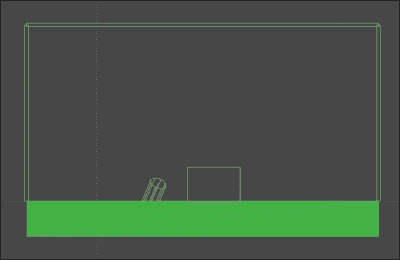
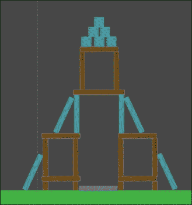
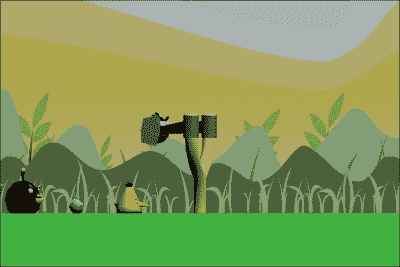
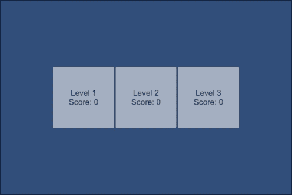

# 第七章 重量级投掷——物理与 2D 摄像机

在上一章中，你了解了移动设备的特殊功能以及如何创建触摸和倾斜控制。我们还制作了一个 Monkey Ball 游戏来使用这些新控制。通过倾斜设备来控制球的方向，并通过触摸屏幕收集香蕉。我们还通过创建计时器和终点线，为游戏添加了一些胜利和失败的条件。

在本章中，我们将暂时放下 Monkey Ball 游戏，去探索 Unity 的物理引擎。我们还会看看创建 2D 游戏体验时可用的选项。为此，我们将重新制作市场上最受欢迎的移动游戏之一，**愤怒的小鸟**。我们将使用物理引擎来投掷小鸟并摧毁结构。我们还将看看如何创建一个关卡选择屏幕。

在本章中，我们将涵盖以下主题：

+   Unity 物理引擎

+   视差滚动

+   2D 管线

+   关卡选择

我们将为本章创建一个新项目，启动 Unity，让我们开始吧！

# 在 3D 世界中制作 2D 游戏

在游戏开发中，最鲜为人知的事实之一是可以在 3D 游戏引擎中，例如 Unity，制作 2D 风格的游戏。与其它所有事物一样，它也有自己的一套优势和劣势，但为了生成令人满意的游戏体验，这个选择可能是非常值得的。最显著的优势是可以为游戏使用 3D 资源。这使得动态光照和阴影可以轻松地包含在内。然而，在使用 2D 引擎时，任何阴影都需要直接绘制到资源中，而且很难使其具有动态效果。关于劣势，是在 3D 世界中使用 2D 资源。虽然可以使用它们，但为了达到所需的细节并防止其出现像素化，需要较大的文件大小。然而，大多数 2D 引擎都使用矢量艺术，这样无论图像如何缩放，其线条都能保持平滑。此外，可以为 3D 资源使用常规动画，但任何 2D 资源通常都需要逐帧动画。总的来说，对于许多开发者而言，优势已经超过了劣势，他们创造了大量外观精美的 2D 游戏，你可能永远也不会意识到这些游戏实际上是在 3D 游戏引擎中制作的。

为了满足开发者对 2D 游戏支持的不断增长的需求，Unity 团队一直在努力为 3D 引擎创建优化的 2D 流水线。创建项目时，你可以选择 2D 默认设置，优化资产以便在 2D 游戏中使用。尽管 Unity 仍然没有直接支持矢量图形，但许多其他功能已经优化，以便在 2D 世界中更好地工作。最大的功能之一是物理引擎的 2D 优化，我们将在本章重点讨论这个问题。我们将使用所有原则，这些原则同样适用于 3D 物理中，这将节省我们在设置和工作中的麻烦。

## 设置开发环境

为了探索在主要以 3D 引擎中制作 2D 游戏，以及物理的使用，我们将重新制作一个广受欢迎的 2D 游戏，愤怒的小鸟。然而，在我们深入游戏的核心之前，我们需要设置开发环境，以便我们为 2D 游戏创作进行优化。让我们使用以下步骤来完成此操作：

1.  首先，我们需要在 Unity 中创建一个新项目，将其命名为 `Ch7_AngryBirds` 非常合适。同时，我们还需要在 **模板** 下选择 **2D**，这样所有默认设置都会为我们的 2D 游戏做好准备。

1.  我们还需要确保在 **构建设置** 字段中将目标平台更改为 **Android**，并将 **捆绑标识符** 设置为适当的值。我们不希望以后还要为此担心。

1.  你会立即注意到一些不同之处。首先，在场景中移动时，你只能从左右和上下平移。这是一个可以在 **场景** 视图的顶部中间通过点击小 **2D** 按钮来切换的设置。此外，如果你在 **层次结构** 窗口中选择了相机，你可以看到它在 **场景** 视图中仅显示为一个白色盒子。这是因为它的 **投影** 设置默认为使用 **正交** 模式，你可以在 **检查器** 面板中看到这一点。

    ### 注意

    每个相机都有两个关于如何渲染游戏的选项。透视相机利用物体与相机的距离来渲染一切，模仿现实世界；距离相机较远的物体绘制得比距离较近的物体小。正交相机在渲染时不考虑这一点；物体的绘制不会基于它们与相机的距离而缩放。

1.  接下来，我们需要一个地面。因此，请转到 Unity 的菜单栏，导航到 **GameObject** | **3D Object** | **Cube**。这将作为一个简单的地面非常合适。

1.  为了让它看起来有点像地面，创建一个绿色材质，并将其应用到 **Cube** GameObject 上。

1.  地面立方体需要足够大以覆盖我们的整个游戏区域。为此，将立方体的**缩放**属性设置为**X**轴上的`100`，**Y**轴上的`10`，以及**Z**轴上的`5`。同时，将它的**位置**属性设置为**X**轴上的`30`，**Y**轴上的`-5`，以及**Z**轴上的`0`。由于沿*x*轴不会有任何移动，地面只需要足够大以供我们场景中的其他物体着陆即可。但是，它需要足够宽和高，以防止摄像机看到边缘。

1.  为了优化我们 2D 游戏中地面的立方体，我们需要更改其碰撞器。在**层次结构**窗口中选择**Cube** GameObject，并在**检查器**面板中查看它。右键点击**Box Collider**组件，选择**移除组件**。接下来，在 Unity 顶部导航至**组件** | **物理 2D** | **Box Collider 2D**。这个组件的工作原理与普通的**Box Collider**组件一样，只是它没有深度限制。

1.  目前，由于缺乏光线，地面看起来相当暗。在 Unity 的菜单栏中，导航至**GameObject** | **Light** | **Directional Light**，以向场景中添加一些亮度。

1.  接下来，我们需要确保所有将在场景中飞行的物体不会移动得太远，从而引发问题。为此，我们需要创建一些触发器体积。最简单的方法是创建三个空的**GameObjects**，并为每个分配一个**Box Collider 2D**组件。确保勾选**Is Trigger**复选框，将它们转换为触发器体积。

1.  将一个放在地面物体的每个端部，最后一个 GameObject 大约在 50 个单位的高度上。然后，将它们缩放以与地面形成一个盒子。每个的厚度都不应超过一个单位。

1.  为了让体积实际上能够阻止物体移动得太远，我们需要创建一个新的脚本。创建一个新的脚本，并将其命名为`GoneTooFar`。

1.  这个脚本有一个单独的短函数，`OnTriggerEnter2D`。我们使用这个函数来销毁可能进入该体积的任何物体。这个函数被 Unity 的物理系统用来检测物体何时进入触发器体积。我们稍后会详细介绍这一点，但现在，需要知道两个对象中的一个，要么是体积本身，要么是进入它的物体，需要有一个**Rigidbody**组件。在我们的例子中，所有我们可能希望它们进入触发器时移除的东西都将具有**Rigidbody**组件：

    ```java
    public void OnTriggerEnter2D(Collider2D other) {
      Destroy(other.gameObject);
    }
    ```

1.  最后，回到 Unity 并将脚本添加到三个触发器体积对象上。

我们已经为我们的 2D 游戏完成了初步设置。通过将项目类型从**3D**更改为**2D**，Unity 的默认设置会改变以优化 2D 游戏创作。最立即注意到的是，现在摄像机处于**正交**视图，使一切看起来都变得扁平。我们还为我们的场景创建了一个地面和一些触发器体积。这些将共同防止我们的鸟类和任何其他物体走得太远。

# 物理

在 Unity 中，物理模拟主要关注**Rigidbody**组件的使用。当**Rigidbody**组件附加到任何对象上时，它将被物理引擎接管。该对象将受到重力影响下落，并撞击任何带有碰撞器的物体。在我们的脚本中，使用`OnCollision`函数组和`OnTrigger`函数组至少需要将**Rigidbody**组件附加到两个交互对象中的一个。然而，**Rigidbody**组件可能会干扰我们可能让对象进行的任何特定移动。但是，**Rigidbody**组件可以被标记为运动学，这意味着物理引擎不会移动它，只有当我们的脚本移动它时，它才会移动。我们用于坦克的**CharacterController**组件是一个特殊的、修改过的**Rigidbody**。在本章中，我们将大量使用**Rigidbody**组件，将我们的鸟类、块和猪与物理引擎连接起来。

## 构建块

我们将创建的第一个物理对象是猪城堡所使用的块。我们会创建三种类型的块：木头、玻璃和橡胶。通过这些简单的块，我们可以轻松构建多种关卡和结构，供鸟类撞击破坏。

我们将创建的每个块在很大程度上都相似。因此，我们将从基本的木制木板开始，然后在此基础上创建其他类型的块。让我们按照以下步骤来创建这些块：

1.  首先，我们将创建一个木制木板。为此，我们需要另一个立方体。将其重命名为`Plank_Wood`。

1.  将木板的**缩放**值设置为**X 轴**的`0.25`和**Y 轴和 Z 轴**的`2`。它在*x*和*y*轴上的缩放定义了玩家看到的大小。在*z*轴上的缩放有助于确保它会被场景中的其他物理对象击中。

1.  接下来，使用`plank_wood`纹理创建一个新材质，并将其应用到立方体上。

1.  为了将这个新的木制木板转变为适合我们游戏的物理对象，我们需要移除立方体的**Box Collider**组件，并替换为**Box Collider 2D**组件。同时，添加一个**Rigidbody**组件。确保你的木板被选中；在 Unity 的菜单栏中，导航到**组件** | **物理 2D** | **Rigidbody 2D**。

1.  接下来，我们需要让木板在我们的游戏中正常工作；我们需要创建一个新脚本，并将其命名为`Plank`。

1.  这个脚本以一堆变量开始。前两个变量用于跟踪木板的血量。我们需要将总血量与当前血量分开，这样当对象被削弱到一半血量时，我们就能检测到。在这一点上，我们将使用接下来的三个变量来更改对象材质以显示损坏。最后一个变量用于对象耗尽血量并被销毁时。我们将使用它来增加玩家的得分：

    ```java
    public float totalHealth = 100f;
    private float health = 100f;

    public Material damageMaterial;
    public Renderer plankRenderer;
    private bool didSwap = false;

    public int scoreValue = 100;
    ```

1.  对于脚本的第一个功能，我们使用`Awake`进行初始化。确保对象当前的血量与其总血量相同，并将`didSwap`标志设置为`false`：

    ```java
    public void Awake() {
      health = totalHealth;
      didSwap = false;
    }
    ```

1.  接下来，我们使用`OnCollisionEnter2D`函数，这是通常在 3D 中使用的`OnCollisionEnter`函数的 2D 优化版本。这是一个特殊函数，由**Rigidbody**组件触发，为我们提供了关于对象与何物碰撞以及如何碰撞的信息。我们使用这些信息来查找`collision.relativeVelocity.magnitude`。这是物体碰撞的速度，我们将其用作伤害以减少当前血量。接下来，函数检查血量是否已经减少到一半，如果是，则调用`SwapToDamaged`函数。通过使用`didSwap`标志，我们确保该函数只被调用一次。最后，函数检查血量是否降至零以下。如果是，对象将被销毁，我们调用`LevelTracker`脚本（我们很快就会制作）以增加玩家的得分：

    ```java
    public void OnCollisionEnter2D(Collision2D collision) {
      health -= collision.relativeVelocity.magnitude;

      if(!didSwap && health < totalHealth / 2f) {
        SwapToDamaged();
      }

      if(health <= 0) {
        Destroy(gameObject);
        LevelTracker.AddScore(scoreValue);
      }
    }
    ```

1.  最后，对于脚本，我们有`SwapToDamaged`函数。它首先将`didSwap`标志设置为`true`。接下来，它检查以确保`plankRenderer`和`damageMaterial`变量有对其他对象的引用。最终，它使用`plankRenderer.sharedMaterial`值将材质更改为看起来损坏的材质：

    ```java
    public void SwapToDamaged() {
      didSwap = true;
      if(plankRenderer == null) return;

      if(damageMaterial != null) {
        plankRenderer.sharedMaterial = damageMaterial;
      }
    }
    ```

1.  在将我们的`Plank`脚本添加到对象之前，我们需要创建之前提到的`LevelTracker`脚本。现在创建它。

1.  这个脚本相当简短，从单个变量开始。该变量将跟踪玩家在当前关卡的得分，是静态的，因此当对象被销毁时可以轻松更改得分：

    ```java
    private static int score = 0;
    ```

1.  接下来，我们使用`Awake`函数以确保玩家在开始关卡时从零开始：

    ```java
    public void Awake() {
      score = 0;
    }
    ```

1.  最后，对于脚本，我们添加了`AddScore`函数。这个函数简单地接收传递给它的分数并增加玩家的得分。它也是静态的，所以它可以在场景中的任何对象上被调用，而无需引用脚本：

    ```java
    public static void AddScore(int amount) {
      score += amount;
    }
    ```

1.  回到 Unity，我们需要使用`plank_wood_damaged`纹理创建一个新材质。这将是脚本将切换到的材质。

1.  我们需要将`Plank`脚本添加到我们的`Plank_Wood`对象中。将**Damaged Material**引用连接到新材质，将**Plank Renderer**引用连接到对象的**Mesh Renderer**组件。

1.  当我们创建不同类型的板子时，可以调整**总健康值**来赋予它们不同的强度。木板的这个值设为`25`效果相当不错。

1.  接下来，创建一个空的**GameObject**，并将其重命名为`LevelTracker`。

1.  将`LevelTracker`脚本添加到对象上，它将开始跟踪玩家的分数。

1.  如果你想看到木板的实际效果，将其定位在地面上方，然后点击播放按钮。游戏一开始，Unity 的物理引擎就会接管，并让板子受重力落下。如果它一开始足够高，你将能够看到它在失去生命值时切换纹理。

1.  为了制作我们需要的另外两种板子，选择`Plank_Wood`对象，并按*Ctrl* + *D*两次进行复制。将其中一个板子重命名为`Plank_Glass`，另一个重命名为`Plank_Rubber`。

1.  接下来，创建三种新材料。一种是用于橡胶板，颜色应为紫色；另一种应使用`plank_glass`纹理，用于玻璃板；最后一种材料在玻璃板损坏时应使用`plank_glass_damaged`纹理。将新材料应用到新板子的适当位置。

1.  至于新板子的生命值，玻璃的值设为`15`，橡胶的值设为`100`效果会很好。

1.  最后，将这三种板子转换为预制体，并使用它们构建一个待击倒的结构。可以自由缩放它们以制作不同大小的块，但不要改变*z*轴。此外，所有块都应该在*z*轴上定位为`0`，而你的结构应该在大约*x*轴上的`30`为中心点。

我们已经为游戏中将要被击倒的结构创建了所需的构建块。我们使用了**Rigidbody**组件将它们与物理引擎连接起来。同时，我们还创建了一个跟踪它们生命值的脚本，并在生命值降至一半以下时切换到损坏的材料。对于这个游戏，我们坚持使用所有物理组件的 2D 优化版本。它们的工作方式与 3D 版本完全相同，只是没有第三个坐标轴。

木材和玻璃作为基本块非常适用。然而，如果我们打算制作更难的关卡，我们需要一些更坚固的材料。尝试制作一个石块。为其创建两种纹理和材料，以展示其原始和损坏的状态。

## 物理材料

物理材料是一种特殊的材料，它专门告诉物理引擎两个物体应该如何交互。这不会影响物体的外观。它定义了碰撞体的摩擦力和弹性。我们将使用它们让橡胶板具有弹性，让玻璃板具有滑动性。通过这几个步骤，我们可以快速实现物理材料，创建出令人满意的效果：

1.  物理材料与其它所有内容的创建方式相同，即在**项目**面板中创建。在**项目**面板内右键点击，导航至**创建** | **2D 物理材料**。创建两个物理材料，将其中一个命名为`Glass`，另一个命名为`Rubber`。

1.  选择其中一个，并在**检查器**窗口中查看它。2D 版本只有两个值（3D 版本有一些额外的值，但它们只在更复杂的情况下使用）：

    +   **摩擦力**：这个属性控制沿着表面滑动时失去的运动量。值为零表示没有摩擦力，比如冰；值为一时表示摩擦力很大，比如橡胶。

    +   **弹性**：这个属性指的是物体在撞击其他物体或被撞击时，有多少能量会被反射回来。零表示没有能量被反射，而值为一时，物体将反射所有能量。

1.  对于`Glass`材料，将**摩擦力**值设为`0.1`，**弹性**设为`0`。对于`Rubber`材料，将**摩擦力**设为`1`，**弹性**设为`0.8`。

1.  接下来，选择你的`Plank_Glass`预制体，并查看其**Box Collider 2D**组件。要应用你的新物理材料，只需从**项目**面板逐个拖放它们到**材质**槽中。对你的`Plank_Rubber`预制体做同样的操作，任何时候有物体撞击它们之一，这些材料都将用来控制它们的交互。

我们创建了一对物理材料。它们控制两个碰撞体在相互碰撞时的交互方式。使用这些材料，我们可以控制任何碰撞体拥有的摩擦力和弹性。

# 角色

拥有一堆通用块只是这个游戏的开始。接下来，我们将创建一些角色来为游戏增添活力。我们需要一些邪恶的猪来摧毁，还需要一些好的鸟来投向它们。

## 创建敌人

我们的首个角色将是敌人猪。它们本身实际上什么都不做。所以，它们实际上只是我们之前制作的看起来像猪的木块。然而，为了使它们的毁灭成为游戏的目标，我们将扩展我们的`LevelTracker`脚本来监视它们，如果它们全部被摧毁，则触发**游戏结束**事件。我们还将扩展脚本以在屏幕上更新分数，并将其保存以供以后使用。与只能看到一面的立方体木板不同，猪是作为平面纹理创建的，并由 Unity 的 2D 管线作为精灵使用。下面是创建我们*愤怒的小鸟*游戏中的猪的步骤：

1.  猪的创建方式与木板的创建方式相似；但是，它们使用了一个特殊的 2D 对象，称为精灵。精灵实际上只是一个始终面向屏幕的平面物体。大多数 2D 游戏都是用一系列的精灵来制作所有对象。你可以通过导航至**游戏对象** | **2D 对象** | **精灵**来创建一个。将其命名为`Pig`。

1.  为了让新的精灵看起来像只猪，从**项目**面板中拖动`pig_fresh`图像，并将其拖放到**Sprite Renderer**组件的**Sprite**槽中。

1.  接下来，添加一个**Circle Collider 2D**组件和一个**Rigidbody 2D**组件。**Circle Collider 2D**组件与我们之前使用的**Sphere Collider**组件类似，但它是为在 2D 游戏中工作而优化的。

1.  在我们能够在游戏中使用猪之前，我们需要更新`Plank`脚本，使其能够处理精灵图像以及材质的变化。因此，我们打开它并在开始处添加一个变量。这个变量简单地跟踪要切换到哪个精灵：

    ```java
    public Sprite damageSprite;
    ```

1.  然后，我们需要在`SwapToDamaged`函数的末尾添加一小部分代码。这个`if`语句检查是否有可切换的精灵。如果有，我们将通用的渲染器变量转换为`SpriteRenderer`，这样我们就可以访问它上面的`sprite`变量，并更新为新图像：

    ```java
    if(damageSprite != null) {
      SpriteRenderer spriteRend = plankRenderer as SpriteRenderer;
      spriteRend.sprite = damageSprite;
    }
    ```

1.  将`Plank`脚本添加到猪身上，并用**Sprite Renderer**组件填充**Plank Renderer**槽。同时，将`pig_damage`图像放入**Damage Sprite**槽中。通过稍微修改这个脚本，我们可以在之后节省很多麻烦，比如当我们可能想要追踪不仅仅是猪的摧毁情况时。

1.  现在，将猪转换成预制体并添加到你的结构中。记住，你需要将它们在*z*轴上的位置设为零，但你可以随意调整它们的大小、健康值和分数值，以增加一些多样性。

1.  接下来，我们需要扩展`LevelTracker`脚本。打开它，我们可以添加一些更多的代码。

1.  首先，我们需要在脚本的最开始添加一行，这样我们就可以编辑在 GUI 中显示的文本。就像我们之前做的那样，在脚本的最顶部添加这一行，那里还有以`using`开头的另外两行：

    ```java
    using UnityEngine.UI;
    ```

1.  我们将在脚本的开始处添加一些变量。第一个变量，顾名思义，将保存我们场景中所有的猪的列表。下一个是一个标志，用来表示游戏已经结束。我们还有三个`Text`变量，以便在玩家玩游戏时更新他们的分数，告诉他们游戏结束的原因以及他们的最终得分。最后一个变量将允许你打开或关闭最后的屏幕，告诉玩家他们是否赢了：

    ```java
    public Transform[] pigs = new Transform[0];

    private gameOver = false;

    public Text scoreBox;
    public Text finalMessage;
    public Text finalScore;

    public GameObject finalGroup;
    ```

1.  接下来，我们需要在`Awake`函数中添加一行。这确保了在游戏开始时，告诉玩家游戏如何结束的 GUI 对象组是关闭的：

    ```java
    FinalGroup.SetActive(false);
    ```

1.  在`LateUpdate`函数中，我们首先检查游戏是否已经结束。如果没有，我们调用另一个函数来检查是否所有的猪都被摧毁了。同时，我们更新玩家的分数显示，无论是在游戏进行中还是游戏结束屏幕上：

    ```java
    public void LateUpdate() {
      if(!gameOver) {
        CheckPigs();

        scoreBox.text = "Score: " + score;
        finalScore.text = "Score: " + score;
      }
    }
    ```

1.  接下来，我们添加 `CheckPigs` 函数。这个函数遍历猪的列表，查看它们是否都被摧毁。如果它发现有一个没有被摧毁，就会退出函数。否则，游戏被标记为结束，并给玩家一条信息。我们还会关闭游戏内得分并开启游戏结束的一组 GUI 对象：

    ```java
    private void CheckPigs() {
      for(int i=0;i<pigs.Length;i++) {
        if(pigs[i] != null) return;
      }

      gameOver = true;
      finalMessage.text = "You destroyed the pigs!";

      scoreBox.gameObject.SetActive(false);
      finalGroup.SetActive(true);
    }
    ```

1.  `OutOfBirds` 函数将由我们稍后要创建的弹弓调用，当玩家没有鸟可以发射到猪身上时。如果游戏尚未结束，该函数将结束游戏并为玩家设置适当的信息。它还会关闭游戏内得分，并开启游戏结束的一组 GUI 对象，就像前一个函数一样：

    ```java
    public void OutOfBirds() {
      if(gameOver) return;

      gameOver = true;
      finalMessage.text = "You ran out of birds!";

      scoreBox.gameObject.SetActive(false);
      finalGroup.SetActive(true);
    }
    ```

1.  最后，我们有 `SaveScore` 函数。这里我们使用 `PlayerPrefs` 类。它让你可以轻松地存储和检索少量数据，非常适合我们当前的需求。我们只需要提供一个唯一的键来保存数据。为此，我们使用一个简短字符串与 `Application.loadedLevel` 提供的关卡索引组合。接下来，我们使用 `PlayerPrefs.GetInt` 来检索上次保存的分数。如果没有，则返回我们传递给函数的零作为默认值。我们将新分数与旧分数进行比较，并使用 `PlayerPrefs.SetInt` 来保存更高的新分数。最后，`Application.LoadLevel` 函数可以用来加载我们游戏中的任何其他场景。所有你打算加载的场景都必须添加到**文件**菜单中的**构建设置**窗口中，并且可以通过使用它们的名称或索引来加载，如下所示：

    ```java
    public void SaveScore() {
      string key = "LevelScore" + Application.loadedLevel;
      int previousScore = PlayerPrefs.GetInt(key, 0);
      if(previousScore < score) {
        PlayerPrefs.SetInt(key, score);
      }

      Application.LoadLevel(0);
    }
    ```

    ### 注意

    请注意，使用 `PlayerPrefs` 是在 Unity 中存储保存信息的最简单方法。然而，它并不是最安全的。如果你有在计算机注册表中更改值的经验，你可以轻松地从游戏外部找到并更改这些 `PlayerPrefs` 值。这并不意味着它不适合存储游戏信息。你只需要意识到这一点，以防你制作游戏时希望防止玩家黑客攻击并更改游戏存档中的值。

1.  接下来，我们需要创建一些 GUI 对象，以便玩家在游戏中了解自己的表现。记得你可以通过导航到**GameObject** | **UI**来找到它们。我们将需要三个文本对象、一个按钮和一个面板。

1.  第一个文本对象应命名为 `Score`。它将在关卡进行时显示玩家的得分。将其锚定在**画布**区域的左上角。

1.  按钮需要成为面板的子对象。它应该锚定在屏幕中心，位置稍低于中心。同时，将按钮的文本更改为有意义的文字；这里使用`返回关卡选择`会很合适。

1.  对于**点击操作**，我们需要点击加号来添加新的事件。选择`LevelTracker`脚本的`SaveScore`函数。否则，我们将无法记录玩家的最高分并结束关卡。

1.  最后两个文本对象也应该被设置为面板的子对象。其中一个命名为`Message`；它会告诉玩家关卡结束的原因。另一个应命名为`FinalScore`，在玩家完成时显示他们的得分。它们都需要锚定在屏幕中心，同时将`FinalScore`对象放置在按钮上方，消息在它的上方。

1.  最后，我们场景中所有的猪对象都需要通过拖放每个猪到**检查器**窗口下的`Pigs`值来添加到`LevelTracker`脚本的列表中。同时，将每个文本对象放入其槽位，并将面板放入**最终组**槽位中。

我们创建了猪，并更新了`LevelTracker`脚本来跟踪它们。这些猪实际上就像木板，但它们是圆形而不是盒子。更新的`LevelTracker`脚本监听所有猪被摧毁的实例，并在那时触发**游戏结束**屏幕。它还在游戏进行时绘制分数，并在关卡结束时保存这个分数。

我们的游戏还没有完全运作起来，但这并不意味着它必须看起来像 Unity 提供的默认设置。使用你之前章节的技能，让已有的界面元素看起来更好。即使只是改变字体，也会让我们的游戏看起来大不相同。也许甚至尝试更改`Panel`的背景图像，为我们的游戏结束屏幕添加最后的亮点。

## 创建盟友

接下来，我们需要一些东西来投掷向猪和它们的防御工事。这里，我们将创建最简单的红鸟。红鸟本质上只是一个石头。它没有特殊能力，除了生命值之外，它的代码也没有特别之处。你还会注意到，鸟是一个 3D 模型，这使它拥有了猪所缺少的阴影。让我们按照以下步骤来创建红鸟：

1.  红鸟是另一个 3D 模型，因此它的设置方式与木板类似。创建一个空的**游戏对象**，将其命名为`Bird_Red`，并将适当的模型从`birds`模型中作为子对象添加，将其位置和缩放调整到大约一个单位大小，并将模型沿*x*轴旋转对齐。如果稍微向摄像机方向旋转，玩家就能看到鸟的脸，同时仍然能够给玩家在看向游戏场地的印象。

1.  接下来，给它一个**圆形碰撞器 2D**组件和一个**刚体 2D**组件。

1.  现在，我们需要创建一个名为`Bird`的新脚本。这个脚本将成为我们所有鸟的基础，跟踪它们的生命值并在适当的时候触发它们的特殊能力。

1.  脚本从三个变量开始。第一个将跟踪鸟类的当前生命值。第二个是一个标志，这样鸟类只会使用一次特殊能力。它被标记为`protected`，这样我们的所有鸟类都可以使用它，同时防止外部干扰。最后一个将保存对我们**刚体**组件的引用：

    ```java
    public float health = 50;
    protected bool didSpecial = false;
    public Rigidbody2D body;
    ```

1.  `Update`函数在激活鸟类的特殊能力之前会进行三次检查。首先，它会检查是否已经完成，然后检查屏幕是否被触摸。我们可以通过检查左键鼠标来轻松检查在本帧中是否进行了触摸操作，Unity 在我们触摸屏幕时会触发这个动作。最后，它会检查鸟类是否有**刚体**组件，以及是否被其他脚本控制：

    ```java
    public void Update() {
      if(didSpecial) return;
      if(!Input.GetMouseButtonDown(0)) return;
      if(body == null || body.isKinematic) return;

      DoSpecial();
    }
    ```

1.  对于红鸟来说，`DoSpecial`函数仅将其标志设置为`true`。它被标记为`virtual`，这样我们就可以为其他鸟类重写该函数，让它们做一些花哨的事情：

    ```java
    protected virtual void DoSpecial() {
      didSpecial = true;
    }
    ```

1.  `OnCollisionEnter2D`函数与木板类似，根据碰撞的强度减少生命值，并在生命值耗尽时销毁鸟类：

    ```java
    public void OnCollisionEnter2D(Collision2D collision) {
      health -= collision.relativeVelocity.magnitude;
      if(health < 0)
        Destroy(gameObject);
    }
    ```

1.  回到 Unity，并将脚本添加到`Bird_Red`对象。

1.  完成鸟类创建的过程，将其转化为预制体，并从场景中删除。接下来我们将创建的弹弓会在游戏开始时处理鸟类的创建。

我们创建了一只红鸟。它的设置与我们其他的物理对象一样。我们还创建了一个脚本来处理鸟的生命值。这个脚本将在我们为游戏创建其他鸟类时进一步扩展。

# 控制

接下来，我们将赋予玩家与游戏互动的能力。首先，我们将创建一个弹弓来投掷鸟类。之后，我们将创建相机控制。我们甚至将创建一个漂亮的背景效果，使我们的游戏外观更加完善。

## 使用弹弓攻击

为了攻击猪堡垒，我们有了基本的鸟类弹药。我们需要创建一个弹弓，将这种弹药投向猪。它还将处理在关卡开始时生成鸟类，并在使用鸟类后自动重新装填。当弹弓中没有鸟类时，它会通知`LevelTracker`脚本，游戏将结束。最后，我们将创建一个脚本来防止物理模拟持续过长时间。我们不想让玩家坐下来观看一只猪慢慢滚过屏幕。因此，脚本会在一段时间后开始减弱**刚体**组件的运动，使它们停下来，而不是继续滚动。为了完成所有这些工作，我们将按照以下步骤进行：

1.  为了开始创建弹弓，将弹弓模型添加到场景中，并将其定位在原点。如有必要，将其缩放到大约四个单位的高度。为`Fork`模型应用浅棕色材质，为`Pouch`模型应用深棕色材质。

1.  接下来，我们需要四个空的 GameObject。将它们都设置为`Slingshot`对象的子对象。

    将第一个 GameObject 命名为`FocalPoint`，并将其放置在弹弓叉齿之间。这将是我们发射所有鸟的中心点。

    第二个 GameObject 是`Pouch`。首先，将其**X 轴**的旋转设置为`0`，**Y 轴**的旋转设置为`90`，**Z 轴**的旋转设置为`0`，使蓝色箭头沿着我们的游戏场指向前方。接下来，将`pouch`模型设置为该对象的子对象，将其**X 轴和 Y 轴**的位置设置为`0`，**Z 轴**的位置设置为`-0.5`，旋转设置为**X 轴**的`270`度，**Y 轴**的`90`度，**Z 轴**的`0`度。这样，在不制作完整的袋子模型的情况下，袋子将出现在当前鸟的前面。

    第三个 GameObject 是`BirdPoint`；这将定位正在发射的鸟的位置。将其设置为`Pouch`点的子对象，并将其**X 轴**的位置设置为`0.3`，**Y 轴**和**Z 轴**的位置设置为`0`。

    最后一个 GameObject 是`WaitPoint`；待发射的鸟将位于这个点后面。将其**X 轴**的位置设置为`-4`，**Y 轴**的位置设置为`0.5`，**Z 轴**的位置设置为`0`。

1.  接下来，旋转`Fork`模型，以便我们能够看到叉子的两个叉齿，同时它看起来是指向前方。**X 轴**的`270`度，**Y 轴**的`290`度，以及**Z 轴**的`0`度将会很合适。

1.  `Slingshot`脚本将提供玩家的大部分互动功能。现在创建它。

1.  我们从这个脚本开始使用一组变量。第一组变量将保存之前提到的阻尼器的引用。第二组变量将跟踪将在关卡中使用的鸟。接下来是一组变量，用于跟踪准备发射的当前鸟。第四组变量保存我们刚才创建的点的引用。`maxRange`变量是从焦点到玩家可以将袋子拖动的距离。最后两个变量定义了鸟被发射的力度：

    ```java
    public RigidbodyDamper rigidbodyDamper;

    public GameObject[] levelBirds = new GameObject[0];
    private Rigidbody2D[] currentBirds;
    private int nextIndex = 0;
    public Transform waitPoint;
    public Rigidbody2D toFireBird;
    public bool didFire = false;
    public bool isAiming = false;

    public Transform pouch;
    public Transform focalPoint;
    public Transform pouchBirdPoint;

    public float maxRange = 3;

    public float maxFireStrength = 25;
    public float minFireStrength = 5;
    ```

1.  与其他脚本一样，我们使用`Awake`函数进行初始化。`levelBirds`变量将保存所有将在关卡中使用的鸟类预制体的引用。我们首先创建每个预制体的实例，并将其**刚体**保存在`currentBirds`变量中。每个鸟的**刚体**组件上的`isKinematic`变量设置为`true`，这样在不使用时它就不会移动。接下来，它准备好第一个要发射的鸟，最后，它将剩余的鸟定位在`waitPoint`后面：

    ```java
    public void Awake() {
      currentBirds = new Rigidbody2D[levelBirds.Length];
      for(int i=0;i<levelBirds.Length;i++) {
        GameObject nextBird = Instantiate(levelBirds[i]) as GameObject;
        currentBirds[i] = nextBird.GetComponent<Rigidbody2D>();
        currentBirds[i].isKinematic = true;
      }

      ReadyNextBird();
      SetWaitPositions();
    }
    ```

1.  `ReadyNextBird`函数首先检查是否已经没有鸟可供发射。如果是这样，它会找到`LevelTracker`脚本来告诉它没有鸟可以发射了。`nextIndex`变量跟踪列表中待玩家发射的鸟的当前位置。接下来，该函数将下一个鸟存储在`toFireBird`变量中，并将其设置为之前创建的`BirdPoint`对象的子对象；其位置和旋转会被重置为零。最后，发射和瞄准标志会被重置：

    ```java
    public void ReadyNextBird() {
      if(currentBirds.Length <= nextIndex) {
        LevelTracker tracker = FindObjectOfType(typeof(LevelTracker)) as LevelTracker;
        tracker.OutOfBirds();
        return;
      }

      toFireBird = currentBirds[nextIndex];
      nextIndex++;

      toFireBird.transform.parent = pouchBirdPoint;
      toFireBird.transform.localPosition = Vector3.zero;
      toFireBird.transform.localRotation = Quaternion.identity;

      didFire = false;
      isAiming = false;
    }
    ```

1.  `SetWaitPositions`函数使用`waitPoint`的位置来定位弹弓后面所有剩余的鸟：

    ```java
    public void SetWaitPositions() {
      for(int i=nextIndex;i<currentBirds.Length;i++) {
        if(currentBirds[i] == null) continue;
        Vector3 offset = Vector3.right * (i – nextIndex) * 2;
        currentBirds[i].transform.position = waitPoint.position – offset;
      }
    }
    ```

1.  `Update`函数首先检查玩家是否已经发射了一只鸟，并观察`rigidbodyDamper.allSleeping`变量以判断所有物理对象是否已经停止移动。一旦它们停止，下一只鸟就会被准备好发射。如果我们还没有发射，会检查瞄准标志并调用`DoAiming`函数来处理瞄准。如果玩家既没有瞄准也没有刚刚发射鸟，我们会检查触摸输入。如果玩家触摸的位置足够接近焦点，我们会标记玩家已经开始瞄准：

    ```java
    public void Update() {
      if(didFire) {
        if(rigidbodyDamper.allSleeping) {
          ReadyNextBird();
          SetWaitPositions();
        }
        return;
      }
      else if(isAiming) {
        DoAiming();
      }
      else {
        if(Input.touchCount <= 0) return;
        Vector3 touchPoint = GetTouchPoint();
        isAiming = Vector3.Distance(touchPoint, focalPoint.position) < maxRange / 2f;
      }
    }
    ```

1.  `DoAiming`函数检查玩家是否停止触摸屏幕，并在他们停止时发射当前的鸟。如果他们没有停止，我们会将袋子定位在当前的触摸点。最后，袋子的位置被限制在最大范围内：

    ```java
    private void DoAiming() {
      if(Input.touchCount <= 0) {
        FireBird();
        return;
      }

      Vector3 touchPoint = GetTouchPoint();

      pouch.position = touchPoint;
      pouch.LookAt(focalPoint);

      float distance = Vector3.Distance(focalPoint.position, pouch.position);
      if(distance > maxRange) {
        pouch.position = focalPoint.position – (pouch.forward * maxRange);
      }
    }
    ```

1.  `GetTouchPoint`函数使用`ScreenPointToRay`来找出玩家在 3D 空间中触摸的位置。这类似于我们触摸香蕉时的操作；然而，由于这个游戏是 2D 的，我们只需查看射线原点并返回其*z*轴值为零：

    ```java
    private Vector3 GetTouchPoint() {
      Ray touchRay = Camera.main.ScreenPointToRay(Input.GetTouch(0).position);
      Vector3 touchPoint = touchRay.origin;
      touchPoint.z = 0;
      return touchPoint;
    }
    ```

1.  最后，对于这个脚本，我们有`FireBird`函数。这个函数首先将我们的`didFire`标志设置为`true`。接下来，它通过查找袋子位置到`focalPoint`的方向来确定需要发射鸟的方向。它还使用它们之间的距离来确定发射鸟所需的力度，并将其限制在我们的最小和最大力度之间。然后，它通过清除其父对象并将`isKinematic`标志设置为`false`来释放鸟，找到其**Rigidbody**组件。为了发射它，我们使用`AddForce`函数，并传递方向乘以力度。同时传递`ForceMode2D.Impulse`以使施加的力一次性且立即生效。接下来，袋子被定位在`focalPoint`，就像它真的在受力下一样。最后，我们调用`rigidbodyDamper.ReadyDamp`来开始**Rigidbody**组件移动的阻尼：

    ```java
    private void FireBird() {
      didFire = true;

      Vector3 direction = (focalPoint.position – pouch.position).normalized;
      float distance = Vector3.Distance(focalPoint.position, pouch.position);
      float power = distance <= 0 ? 0 : distance / maxRange;
      power *= maxFireStrength;
      power = Mathf.Clamp(power, minFireStrength, maxFireStrength);

      toFireBird.transform.parent = null;
      toFireBird.isKinematic = false;
      toFireBird.AddForce(new Vector2(direction.x, direction.y) * power, ForceMode2D.Impulse);

      pouch.position = focalPoint.position;

      rigidbodyDamper.ReadyDamp();
    }
    ```

1.  在我们能够使用`Slingshot`脚本之前，我们需要创建`RigidbodyDamper`脚本。

1.  这个脚本从以下六个变量开始。前两个变量定义了在抑制移动之前需要等待的时间以及抑制的幅度。接下来的两个变量跟踪是否可以应用抑制以及何时开始。接下来是一个变量，它将被填充为当前场景中所有刚体的列表。最后，有一个`allSleeping`标志，当移动停止时，它将被设置为`true`：

    ```java
    public float dampWaitLength = 10f;
    public float dampAmount = 0.9f;
    private float dampTime = -1f;
    private bool canDamp = false;
    private Rigidbody2D[] rigidbodies = new Rigidbody2D[0];

    public bool allSleeping = false;
    ```

1.  `ReadyDamp`函数首先使用`FindObjectsOfType`填充刚体列表。当需要开始抑制时，将`dampTime`标志设置为当前时间与等待时长的总和。它表示脚本可以执行抑制并重置`allSleeping`标志。最后，它使用`StartCoroutine`调用`CheckSleepingRigidbodies`函数。这是一种特殊的调用函数方式，使它们在后台运行，而不会阻止游戏的其余部分运行：

    ```java
    public void ReadyDamp() {
      rigidbodies = FindObjectsOfType(typeof(Rigidbody2D)) as Rigidbody2D[];
      dampTime = Time.time + dampWaitLength;
      canDamp = true;
      allSleeping = false;

      StartCoroutine(CheckSleepingRigidbodies());
    }
    ```

1.  在`FixedUpdate`函数中，我们首先检查是否可以抑制移动以及是否到了执行抑制的时候。如果是，我们会遍历所有刚体，对每个刚体的旋转速度和线性速度应用我们的抑制。那些由脚本控制、已经处于休眠状态（意味着它们已经停止移动）的动力学刚体将被跳过：

    ```java
    public void FixedUpdate() {
      if(!canDamp || dampTime > Time.time) return;

      foreach(Rigidbody2D next in rigidbodies) {
        if(next != null && !next.isKinematic && !next.isSleeping()) {
          next.angularVelocity *= dampAmount;
          next.velocity *= dampAmount;
        }
      }
    }
    ```

1.  `CheckSleepingRigidbodies`函数是特殊的，它将在后台运行。这是通过函数开头的`IEnumerator`标志和中间的`yield return null`行实现的。这些使得函数可以定期暂停，并在等待函数完成时防止游戏其余部分冻结。函数开始时创建一个检查标志，并使用它来检查所有刚体是否已经停止移动。如果发现有一个仍在移动，标志将被设置为`false`，函数将暂停到下一帧，届时将再次尝试。当到达末尾时，因为所有刚体都处于休眠状态，它将`allSleeping`标志设置为`true`，以便下一次使用弹弓时做好准备。同时，在玩家准备发射下一只鸟时，它也会停止抑制：

    ```java
    private IEnumerator CheckSleepingRigidbodies() {
      bool sleepCheck = false;

      while(!sleepCheck) {
        sleepCheck = true;

        foreach(Rigidbody2D next in rigidbodies) {
          if(next != null && !next.isKinematic && !next.IsSleeping()) {
            sleepCheck = false;
            yield return null;
            break;
          }
        }
      }

      allSleeping = true;
      canDamp = false;
    }
    ```

1.  最后，我们有`AddBodiesToCheck`函数。这个函数将被任何在玩家发射鸟之后生成新物理对象的物体使用。它开始时创建一个临时列表并扩展当前列表。接下来，它将临时列表中的所有值添加到扩展后的列表中。最后，在临时列表之后添加刚体列表：

    ```java
    public void AddBodiesToCheck(Rigidbody2D[] toAdd) {
      Rigidbody2D[] temp = rigidbodies;
      rigidbodies = new Rigidbody2D[temp.Length + toAdd.Length];

      for(int i=0;i<temp.Length;i++) {
        rigidbodies[i] = temp[i];
      }
      for(int i=0;i<toAdd.Length;i++) {
        rigidbodies[i + temp.Length] = toAdd[i];
      }
    }
    ```

1.  回到 Unity，将这两个脚本添加到`Slingshot`对象中。在`Slingshot`脚本组件中，连接到`Rigidbody Damper`脚本组件的引用以及每个点的引用。此外，根据关卡需要，将红色小鸟预制体引用添加到**Level Birds**列表中。

1.  为了防止物体滚回到弹弓中，请在`Slingshot`上添加一个**Box Collider 2D**组件，并将其定位在`Fork`模型的支架处。

1.  为了完成弹弓的外观，我们需要创建将袋子与叉连接的弹性带子。我们首先通过创建`SlingshotBand`脚本来实现这一点。

1.  脚本从两个变量开始，一个用于带子结束的点，另一个用于引用将绘制它的`LineRenderer`变量：

    ```java
    public Transform endPoint;
    public LineRenderer lineRenderer;
    ```

1.  `Awake`函数确保`lineRenderer`变量只有两个点，并设置它们的初始位置：

    ```java
    public void Awake() {
      if(lineRenderer == null) return;
      if(endPoint == null) return;

      lineRenderer.SetVertexCount(2);
      lineRenderer.SetPosition(0, transform.position);
      lineRenderer.SetPosition(1, endPoint.position);
    }
    ```

1.  在`LateUpdate`函数中，我们将`lineRenderer`变量的端点位置设置为`endPoint`值。这个点会随着袋子移动，因此我们需要不断更新渲染器：

    ```java
    public void LateUpdate() {
      if(endPoint == null) return;
      if(lineRenderer == null) return;

      lineRenderer.SetPosition(1, endPoint.position);
    }
    ```

1.  返回 Unity，并创建一个空**游戏对象**。将其命名为`Band_Near`，并使其成为`Slingshot`对象的子对象。

1.  作为这个新点的子对象，创建一个圆柱体和一个名为`Band`的第二个空**游戏对象**。

1.  给圆柱体一个棕色材质，并将其定位在弹弓叉近端。确保移除**胶囊碰撞器**组件，以免造成妨碍。同时，不要害怕进行缩放，以便更好地适应弹弓的外观。

1.  在`Band`对象上，添加位于**组件**菜单下**效果**中的**线渲染器**组件。将其放置在圆柱体的中心后，为对象添加`SlingshotBand`脚本。

1.  在**材质**下的**线渲染器**组件中，你可以将棕色材质放入槽中以给带子着色。在**参数**下，将**开始宽度**设置为`0.5`，将**结束宽度**设置为`0.2`，以设置线条的大小。

1.  接下来，创建另一个空**游戏对象**，并将其命名为`BandEnd_Near`。使其成为`Pouch`对象的子对象，并将其定位在袋子内部。

1.  现在，将脚本的引用连接到其线渲染器和端点。

1.  为了制作第二条带子，复制我们刚才创建的四个对象，并根据叉的另一端定位它们。这条带子的端点只需沿着*z*轴向后移动，以使其避开小鸟。

1.  最后，将其整个转换为预制体，以便在其他关卡中轻松复用。

我们创建了一个用于发射小鸟的弹弓。我们使用了前一章学到的技术来处理触摸输入，并在玩家瞄准和射击时追踪玩家的手指。如果你保存你的场景，并将相机定位在观察弹弓的位置，你会注意到它已经完成，尽管还不是很完善。可以向猪堡垒发射小鸟，尽管我们只能在 Unity 的**场景**视图中看到破坏效果。

## 通过相机观看

在这一点上，游戏在技术上是可以玩的，但有点难以看清正在发生的事情。接下来，我们将创建一个控制系统来控制摄像机。该系统将允许玩家将摄像机向左和右拖动，当小鸟被发射时跟随小鸟，并在一切停止移动后返回弹弓位置。还将有一组限制，以防止摄像机走得太远，看到我们不希望玩家看到的东西，比如我们为关卡创建的地形或天空的边缘。我们只需要一个相对简短的脚本来控制和管理工作。让我们按照以下步骤创建它：

1.  为了开始并保持一切有序，创建一个新的空**GameObject**，并将其命名为`CameraRig`。同时，为了简化，将其在每个轴上的位置设置为 0。

1.  接下来，创建三个空的**GameObject**，并将它们命名为`LeftPoint`、`RightPoint`和`TopPoint`。将它们的**Z 轴**位置设置为`-5`。将`LeftPoint`对象定位在弹弓前方，并在**Y 轴**上设置为`3`的位置。`RightPoint`对象需要定位在你创建的猪结构前方。`TopPoint`对象可以位于弹弓上方，但在**Y 轴**上需要设置为`8`。这三个点将定义当拖动和跟随小鸟时，摄像机可以移动的范围限制。

1.  将这三个点以及`Main Camera`对象设置为`CameraRig`对象的子对象。

1.  现在，我们创建`CameraControl`脚本。这个脚本将控制摄像机的所有移动和交互。

1.  本脚本的变量从对弹弓的引用开始；我们需要这个引用以便在发射时跟随当前的小鸟。接下来是对我们刚刚创建的点进行引用。接下来的一组变量控制摄像机在没有输入的情况下停留多长时间，然后返回查看弹弓以及返回的速度。`dragScale`变量控制当玩家在屏幕上拖动手指时，摄像机实际移动的速度，使场景能够跟随手指移动。最后一组变量控制摄像机是否可以跟随当前的小鸟以及跟随的速度：

    ```java
    public Slingshot slingshot;
    public Transform rightPoint;
    public Transform leftPoint;
    public Transform topPoint;

    public float waitTime = 3f;
    private float headBackTime = -1f;
    private Vector3 waitPosition;
    private float headBackDuration = 3f;

    public float dragScale = 0.075f;

    private bool followBird = false;
    private Vector3 followVelocity = Vector3.zero;
    public float followSmoothTime = 0.1f;
    ```

1.  在`Awake`函数中，我们首先确保摄像机没有跟随小鸟，并让它等待一段时间后再去查看弹弓。这样，当关卡开始时，你可以先将摄像机指向猪堡垒，并在给玩家一个机会观察他们面对的情况之后，移动到弹弓位置：

    ```java
    public void Awake() {
      followBird = false;
      StartWait();
    }
    ```

1.  `StartWait`函数设置它将开始返回弹弓的时间，并记录它从哪个位置返回。这允许你创建一个平滑的过渡：

    ```java
    public void StartWait() {
      headBackTime = Time.time + waitTime;
      waitPosition = transform.position;
    }
    ```

1.  然后，我们有`Update`函数。此函数首先检查弹弓是否已经发射。如果没有，它检查玩家是否已经开始瞄准，这意味着应该跟随鸟，并在他们这样做时将速度归零。如果他们还没有开始瞄准，则清除`followBird`标志。接下来，函数检查是否应该跟随，如果应该，则执行跟随，并调用`StartWait`函数——以防这是鸟被销毁的帧。如果不应该跟随鸟，它检查触摸输入并拖动摄像机（如果有的话）。如果玩家在这一帧移开手指，将再次开始等待。最后，它检查弹弓是否完成了当前鸟的发射，以及是否是时候返回了。如果两者都正确，摄像机将移回到指向弹弓的位置：

    ```java
    public void Update() {
      if(!slingshot.didFire) {
        if(slingshot.isAiming) {
          followBird = true;
          followVelocity = Vector3.zero;
        }
        else {
          followBird = false;
        }
      }

      if(followBird) {
        FollowBird();
        StartWait();
      }
      else if(Input.touchCount > 0) {
        DragCamera();
        StartWait();
      }

      if(!slingshot.didFire && headBackTime < Time.time) {
        BackToLeft();
      }
    }
    ```

1.  `FollowBird`函数首先通过检查`Slingshot`脚本上的`toFireBird`变量确保有一个鸟可供跟随，如果没有找到鸟则停止跟随。如果有鸟，该函数就会确定一个新的移动点，该点将直接对准鸟。然后它使用`Vector3.SmoothDamp`函数平滑地跟随鸟。这个函数类似于弹簧——离目标位置越远，移动物体的速度越快。使用`followVelocity`变量使其保持平滑移动。最后，它调用另一个函数，以限制摄像机在我们先前设置的限制点内的位置：

    ```java
    private void FollowBird() {
      if(slingshot.toFireBird == null) {
        followBird = false;
        return;
      }

      Vector3 targetPoint = slingshot.toFireBird.transform.position;
      targetPoint.z = transform.position.z;

      transform.position = Vector3.SmoothDamp(transform.position, targetPoint, ref followVelocity, followSmoothTime);
      ClampPosition();
    }
    ```

1.  在`DragCamera`函数中，我们使用当前触控的`deltaPosition`值来确定自上一帧以来它移动了多远。通过缩放这个值并从摄像机位置减去该向量，函数使摄像机随着玩家在屏幕上的拖动而移动。此函数还调用`ClampPosition`函数，以确保摄像机位置保持在游戏场内：

    ```java
    private void DragCamera() {
      transform.position -= new Vector3(Input.GetTouch(0).deltaPosition.x, Input.GetTouch(0).deltaPosition.y, 0) * dragScale;
      ClampPosition();
    }
    ```

1.  `ClampPosition`函数首先获取摄像机的当前位置。然后它将`x`位置夹紧在`leftPoint`和`rightPoint`变量的`x`位置之间。接下来，`y`位置被夹紧在`leftPoint`和`topPoint`变量的`y`位置之间。最后，将新位置重新应用到摄像机的变换中：

    ```java
    private void ClampPosition() {
      Vector3 clamped = transform.position;
      clamped.x = Mathf.Clamp(clamped.x, leftPoint.position.x, rightPoint.position.x);
      clamped.y = Mathf.Clamp(clamped.y, leftPoint.position.y, topPoint.position.y);
      transform.position = clamped;
    }
    ```

1.  最后，我们有`BackToLeft`函数。它首先使用时间和我们的持续时间变量来确定摄像机返回到弹弓时应该完成多少进度。它记录摄像机的当前位置，并在*x*和*y*轴上使用`Mathf.SmoothStep`找到一个位于`waitPosition`变量和`leftPoint`变量之间的适当距离的新位置。最后，应用新位置：

    ```java
    private void BackToLeft() {
      float progress = (Time.time – headBackTime) / headBackDuration;
      Vector3 newPosition = transform.position;
      newPosition.x = Mathf.SmoothStep(waitPosition.x, leftPoint.position.x, progress);
      newPosition.y = Mathf.SmoothStep(waitPosition.y, leftPoint.position.y, progress);
      transform.position = newPosition;
    }
    ```

1.  接下来，回到 Unity 并将新脚本添加到`Main Camera`对象。连接到弹弓和每个点的引用以完成设置。

1.  将摄像机定位以指向你的猪堡垒，并将整个装置转变成一个预制体。

我们创建了一个摄像机装置，让玩家在玩游戏时可以观看所有的动作。现在相机将跟随从弹弓发射的小鸟，并且可以被玩家拖动。通过定位几个对象的位置，这种移动受到了限制，以防止玩家看到我们不想让他们看到的东西；如果相机闲置足够长的时间，它也会返回来观察弹弓。

相机在许多移动游戏中的另一个功能是通过捏合来进行缩放的手势。这对于用户来说是一个非常简单的手势，但对我们来说要实现好可能会很复杂。尝试在这里实现它。你可以使用`Input.touchCount`来检测是否有两个手指触摸屏幕。然后，使用`Vector2.Distance`函数，如果你记录了上一帧的距离，就可以确定它们是相互靠近还是远离。一旦确定了缩放方向，只需改变相机的`ortographicSize`变量，以改变可以看到的范围；确保包括一些限制，这样玩家就不能无限地放大或缩小。

既然我们已经有了制作完整关卡所需的所有部分，我们需要更多的关卡。我们至少还需要两个关卡。你可以使用积木和猪来创建你想要的任何关卡。最好保持结构围绕与我们的第一个关卡相同的中心点，这样玩家处理起来会更简单。同时，在制作关卡时也要考虑关卡的难度，以便最终拥有简单、中等和困难难度的关卡。

# 创建视差背景

许多 2D 游戏的一个出色特性是视差滚动背景。这仅仅意味着背景是由以不同速度滚动的层次创建的。你可以把它想象成你从汽车窗户向外看。远处的物体看起来几乎不动，而近处的物体则快速移动。在 2D 游戏中，它给人以深度的错觉，并为游戏的外观增添了不错的触感。对于这个背景，我们将在单个平面上叠加几种材质。还有其他几种方法可以创建这种效果，但我们将使用一个脚本来实现，此外它还允许你控制每一层的滚动速度。让我们按照以下步骤来创建它：

1.  我们将从创建`ParallaxScroll`脚本开始这一部分。

1.  这个脚本从三个变量开始。前两个变量跟踪每种材质以及它们滚动的速度。第三个变量记录相机的最后位置，这样我们可以跟踪相机在每一帧中移动了多远：

    ```java
    public Material[] materials = new Material[0];
    public float[] speeds = new float[0];

    private Vector3 lastPosition = Vector3.zero;
    ```

1.  在`Start`函数中，我们记录相机的初始位置。这里我们使用`Start`而不是`Awake`，以防止相机在游戏开始时需要进行任何特殊的移动：

    ```java
    public void Start() {
      lastPosition = Camera.main.transform.position;
    }
    ```

1.  接下来，我们使用`LateUpdate`函数在摄像机移动后进行更改。它首先找到摄像机的新的位置，并通过比较*x*轴的值来确定它移动了多远。接下来，它遍历材质列表。循环首先使用`mainTextureOffset`收集材质当前纹理的偏移量。然后，将摄像机的移动乘以材质的速度从偏移量的*x*轴中减去，以找到新的水平位置。接着，将新的偏移量应用到材质上。最后，该函数记录摄像机在上一个帧中的位置，以供下一帧使用：

    ```java
    public void LateUpdate() {
      Vector3 newPosition = Camera.main.transform.position;
      float move = newPosition.x – lastPosition.x;

      for(int i=0;i<materials.Length;i++) {
        Vector2 offset = materials[i].mainTextureOffset;
        offset.x -= move * speeds[i];
        materials[i].mainTextureOffset = offset;
      }

      lastPosition = newPosition;
    }
    ```

1.  回到 Unity，创建六个新的材质。每个背景纹理一个：`sky`，`hills_tall`，`hills_short`，`grass_light`，`grass_dark`和`fronds`。除了`sky`之外的所有材质，都需要使用**透明**的**渲染模式**。如果不用这种模式，我们将无法在分层时看到所有纹理。

1.  在我们能够对背景中的图像进行平铺之前，我们需要调整它们的**导入设置**。逐个选择它们，并查看**检查器**窗口。由于我们选择制作一个 2D 游戏，Unity 默认将所有图像作为精灵导入，这会导致我们的图像边缘被夹紧，无法重复。对于所有背景图像，将**纹理类型**选项更改为**纹理**，并将**环绕模式**选项更改为**重复**。这样我们就可以以无限滚动背景的方式使用它们。

1.  我们还需要调整这些新材质的**平铺**（Tiling）选项。对于所有材质，将**Y 轴**保持为`1`。对于**X 轴**，将`sky`设为`5`，`hills_tall`设为`6`，`hills_shot`设为`7`，`grass_dark`设为`8`，`fronds`设为`9`，`grass_light`设为`10`。这将偏移所有纹理特征，使得长距离的平移不会看到特征规律地排列。

1.  接下来，创建一个新的平面。将其命名为`Background`，并移除其**网格碰撞器**组件。同时，附加我们的`ParallaxScroll`脚本。

1.  将其位置设置为**X 轴**上的`30`，**Y 轴**上的`7`，以及**Z 轴**上的`10`。将其旋转设置为**X 轴**上的`90`，**Y 轴**上的`180`，以及**Z 轴**上的`0`。同时，将缩放设置为**X 轴**上的`10`，**Y 轴**上的`1`，以及**Z 轴**上的`1.5`。总的来说，这些设置使平面面向摄像机并填充背景。

1.  在平面的**网格渲染器**组件中，展开**材质**列表，并将**大小**值设置为`6`。按顺序将我们的新材质添加到列表槽中，顺序为`sky`，`hills_tall`，`hills_short`，`grass_dark`，`fronds`和`grass_light`。对**视差滚动**脚本组件中的**材质**列表也执行相同的操作。

1.  最后，在**视差滚动**脚本组件中，将**速度**列表中的**大小**值设置为`6`，并按顺序输入以下值：`0.03`，`0.024`，`0.018`，`0.012`，`0.006`和`0`。这些值将会使材质均匀柔和地移动。

1.  在这一点上，将背景变成预制体将使其在以后容易重用。创建视差背景

我们创建了一个视差滚动效果。这个效果将平移一系列背景纹理，为我们的 2D 游戏提供深度的错觉。要轻松查看它的效果，请按播放按钮并在**场景**视图中抓住相机，左右移动以查看背景变化。

我们还有两个关卡需要添加背景。这里的挑战是创建你自己的背景。使用你在本节中学到的技术来创建一个夜晚风格的背景。它可以包括一个静止的月亮，而其他所有内容在镜头中滚动。为了增加一个技巧，创建一个云层，它随着相机和背景的其他部分慢慢横穿屏幕。

# 添加更多小鸟

我们还需要为我们的关卡创建最后一组资产：其他的小鸟。我们将创建三只更多的小鸟，每只都有独特的特殊能力：加速的黄色小鸟，分裂成多只小鸟的蓝色小鸟，以及爆炸的黑色小鸟。有了这些，我们的鸟群就完整了。

为了更容易地创建这些小鸟，我们将利用一个称为**继承**的概念。继承允许脚本在不需要重写的情况下扩展其继承的功能。如果使用得当，这将非常强大，在我们的情况下，它将有助于快速创建多个大致相似的角色。

## 黄色小鸟

首先，我们将创建黄色小鸟。在很大程度上，这只鸟的功能与红色小鸟完全相同。然而，当玩家第二次触摸屏幕时，小鸟的特殊能力被激活，其速度会增加。通过扩展我们之前创建的`Bird`脚本，这只鸟的创建变得相当简单。由于继承的强大力量，我们在这里创建的脚本仅包含几行代码。让我们按照以下步骤来创建它：

1.  首先，按照创建红色小鸟的相同方式，使用`YellowBird`模型来创建黄色小鸟。

1.  我们不是使用`Bird`脚本，而是将创建`YellowBird`脚本。

1.  这个脚本需要扩展`Bird`脚本，因此在我们新脚本的第四行，用`Bird`替换`MonoBehaviour`。它应该类似于以下代码片段：

    ```java
    public class YellowBird : Bird {
    ```

1.  这个脚本添加了一个单一变量，用于乘以小鸟的当前速度：

    ```java
    public float multiplier = 2f;
    ```

1.  接下来，我们重写`DoSpecial`函数，并在调用时乘以小鸟的`body.velocity`变量：

    ```java
    protected override void DoSpecial() {
      didSpecial = true;
      body.velocity *= multiplier;
    }
    ```

1.  回到 Unity，将脚本添加到你的新小鸟中，连接**Rigidbody**组件引用，并将其变成一个预制体。在你的弹弓列表中添加一些，以便在你的关卡中使用这只鸟。

我们创建了黄色小鸟。这只鸟很简单。当玩家触摸屏幕时，它会直接修改其速度，以突然获得速度的提升。正如你很快会看到的，我们使用这种风格的脚本来创建我们所有的鸟。

## 蓝色小鸟

接下来，我们将创建蓝色小鸟。当玩家触摸屏幕时，这种鸟会分裂成三只鸟。它还将通过继承扩展`Bird`脚本，减少编写创建鸟所需的代码量。让我们按照以下步骤进行：

1.  同样，像前两只鸟一样开始构建你的蓝色小鸟，替换相应的模型。你还应该调整**Circle Collider 2D**组件的**Radius**值，以适应这种小鸟的小尺寸。

1.  接下来，我们创建`BlueBird`脚本。

1.  再次，调整第四行，使脚本扩展`Bird`而不是`MonoBehaviour`：

    ```java
    public class BlueBird : Bird {
    ```

1.  这个脚本有三个变量。第一个变量是当鸟分裂时要生成的预制体列表。下一个是每个新发射鸟之间的角度差。最后一个变量是为了避免生成的鸟相互卡住，而将它们稍微提前生成的位置值：

    ```java
    public GameObject[] splitBirds = new GameObject[0];
    public float launchAngle = 15f;
    public float spawnLead = 0.5f;
    ```

1.  接下来，我们重写`DoSpecial`函数，像其他鸟一样，首先标记我们完成了特殊动作。接下来，它计算要生成的鸟的一半数量，并创建一个空列表来存储新生成鸟的刚体：

    ```java
    protected override void DoSpecial() {
      didSpecial = true;

      int halfLength = splitBirds.Length / 2;
      Rigidbody2D[] newBodies = new Rigidbody2D[splitBirds.Length];
    ```

1.  函数通过遍历鸟类列表，跳过空槽继续执行。它在它们的位置生成新鸟；尝试存储对象的**Rigidbody**后，如果缺失，它将继续下一个。然后将在列表中存储新的**Rigidbody**组件：

    ```java
    for(int i=0;i<splitBirds.Length;i++) {
      if(splitBirds[i] == null) continue;

      GameObject next = Instantiate(splitBirds[i], transform.position, transform.rotation) as GameObject;

      Rigidbody2D nextBody = next.GetComponent<Rigidbody2D>();
      if(nextBody == null) continue;

      newBodies[i] = nextBody;
    ```

1.  使用`Quaternion.Euler`，创建一个新的旋转，使新鸟沿着从主路径分叉的路径偏转。新鸟的速度设置为当前鸟的旋转速度。计算偏移量，然后沿着新路径向前移动，以便为其他生成的鸟让路：

    ```java
    Quaternion rotate = Quaternion.Euler(0, 0, launchAngle * (i – halfLength));
    nextBody.velocity = rotate * nextBody.velocity;
    Vector2 offset = nextBody.velocity.normalized * spawnLead;
    next.transform.position += new Vector3(offset.x, offset.y, 0);
    }
    ```

1.  在循环之后，函数使用`FindObjectOfType`查找当前场景中的弹弓。如果找到，将其更改为跟踪第一个新生成的鸟作为被发射的鸟。新的刚体列表也被设置为`rigidbodyDamper`变量，以便添加到其刚体列表中。最后，脚本销毁其附着的鸟，完成鸟被分裂的错觉：

    ```java
    Slingshot slingshot = FindObjectOfType(typeof(Slingshot)) as Slingshot;
    if(slingshot != null) {
      slingshot.toFireBird = newBodies[0];
      slingshot.rigidbodyDamper.AddBodiesToCheck(newBodies);
    }

    Destroy(gameObject);
    }
    ```

1.  在将脚本添加到你的新鸟之前，我们实际上需要两只蓝色小鸟：一只负责分裂，另一只不分裂。复制你的鸟，并将一个命名为`Bird_Blue_Split`，另一个命名为`Bird_Blue_Normal`。在分裂的鸟上添加新脚本，而在普通鸟上添加`Bird`脚本。

1.  将两只鸟都转变成预制体，并将普通鸟添加到另一只鸟的待分裂鸟列表中。

我们创建了蓝色小鸟。当用户点击屏幕时，这种鸟会分裂成多只鸟。实际上这个效果需要两只看起来完全相同的鸟，一只负责分裂，另一只被分裂成两半但不执行特殊动作。

实际上，我们可以将任何想要生成的对象添加到蓝色小鸟分裂时产生的对象列表中。这里的挑战是创建一个彩虹鸟。这种鸟可以分裂成不同类型的鸟，不仅仅是蓝色。或者，它可能是一个石鸟，分裂成石块。为了增加挑战，创建一个神秘鸟，在分裂时从其列表中随机选择一种鸟。

## 黑色小鸟

最后，我们有了黑色小鸟。当玩家触摸屏幕时，这只鸟会爆炸。与之前讨论的所有鸟一样，它将扩展`Bird`脚本；从红色小鸟继承使得黑色小鸟的创建变得容易得多。让我们使用这些步骤来完成它：

1.  与其他鸟一样，这个鸟最初是以与红色小鸟相同的方式创建的，调整**Circle Collider 2D**组件上的**Radius**值以适应其增加的大小。

1.  同样，我们创建一个新的脚本来扩展`Bird`脚本。这次，它被称为`BlackBird`。

1.  不要忘记调整第四行以扩展`Bird`脚本，而不是`MonoBehaviour`：

    ```java
    public class BlackBird : Bird {
    ```

1.  这个脚本有两个变量。第一个变量是爆炸的大小，第二个是它的强度：

    ```java
    public float radius = 2.5f;
    public float power = 25f;
    ```

1.  再次，我们重写`DoSpecial`函数，首先标记我们已经这样做。接下来，我们使用`Physics2D.OverlapCircleAll`获取在鸟爆炸范围内的所有对象列表，其 3D 版本是`Physics.OverlapSphere`。然后，我们计算爆炸来自哪里，这仅仅是我们鸟的位置向下移动三个单位。我们将其向下移动，因为向上抛射碎片比向外推射碎片的爆炸更有趣。然后函数遍历列表，跳过任何空槽和没有刚体的对象：

    ```java
    protected override void DoSpecial() {
      didSpecial = true;

      Collider2D[] colliders = Physics2D.OverlapCircleAll(transform.position, radius);

      Vector2 explosionPos = new Vector2(transform.position.x, transform.position.y) – (Vector2.up * 3);

      foreach(Collider2D hit in colliders) {
        if(hit == null) continue;
        if(hit.attachedRigidbody != null) {
    ```

1.  如果对象存在并且附加了**Rigidbody**组件，我们需要计算爆炸将如何影响这个对象，模拟爆炸强度随距离增加而减弱的方式。首先，我们通过获取另一个对象的位置来节省一些输入。接下来，我们计算它相对于爆炸位置的位置。通过将相对位置的大小或长度除以我们的`radius`变量，我们可以计算出需要向被击中的对象施加多大的力。最后，我们使用`AddForceAtPosition`给对象一个像在特定位置爆炸一样的踢力。`ForceMode2D.Impulse`变量用于立即施加力：

    ```java
    Vector3 hitPos = hit.attachedRigidbody.transform.position;
    Vector2 dir = new Vector2(hitPos.x, hitPos.y) – explosionPos;
    float wearoff = 1 – (dir.magnitude / radius);
    Vector2 force = dir.normalized * power * wearoff;
    hit.attachedRigidbody.AddForceAtPosition(force, explosionPos, ForceMode2D.Impulse);
    }
    }
    ```

1.  最后，函数销毁了已爆炸的鸟：

    ```java
    Destroy(gameObject);
    }
    ```

1.  与最后两只鸟一样，将你的新脚本应用于新鸟并将其变成预制体。现在，在每个级别选择弹弓武器库时，你有四种鸟可以选择。

我们创建了第四只也是最后一只鸟：黑色小鸟。当用户触摸屏幕时，这只鸟会爆炸，将附近的一切抛向空中。这可以是一种有趣的鸟来玩，对于摧毁你的猪堡垒非常有效。

我们模仿的游戏中的黑色小鸟具有额外的定时爆炸能力，在撞击到某物后触发。尝试为我们的黑色小鸟创建一个计时器，以重现这一效果。你需要重写`OnCollisionEnter`函数来启动计时器，并使用`LateUpdate`来倒计时。一旦计时器时间耗尽，你可以使用我们的`DoSpecial`函数来实际引发爆炸。

既然你知道如何引发爆炸，我们又有了一个挑战：创建一个爆炸箱子。你需要扩展`Plank`脚本来实现它，当箱子受到足够伤害时，触发爆炸。为了增加挑战性，你可以配置箱子，使其不是直接爆炸，而是抛出几个炸弹，这些炸弹在撞击到某物时爆炸。



# 关卡选择

最后，我们需要创建一个关卡选择屏幕。通过这个场景，我们可以访问并开始玩我们之前创建的所有关卡。我们还将显示每个关卡当前的最高分。一个新的场景和一个脚本就能很好地管理我们的关卡选择。让我们按照以下步骤进行操作：

1.  最后一部分开始时保存我们当前的场景，并按*Ctrl* + *N*创建一个新场景；我们将它命名为`LevelSelect`。

1.  对于这个场景，我们需要创建一个名为`LevelSelect`的简短脚本。

1.  这个脚本将和 GUI 中的按钮一起工作，告诉玩家高分和加载关卡。然而，在我们能做到这一点之前，我们需要在脚本的最前面添加一行，和其他需要更新 GUI 的脚本一样，与其他`using`行一起：

    ```java
    using UnityEngine.UI;
    ```

1.  第一个也是唯一的变量是我们想要更新的所有按钮文本的列表，以及它们关联关卡的分数：

    ```java
    public Text[] buttonText = new Text[0];
    ```

1.  第一个函数是`Awake`函数。这里，它会遍历所有按钮，找到它对应的高分，并更新文本以显示它。`PlayerPrefs.GetInt`与我们之前用来保存高分的`SetInt`函数相反：

    ```java
    public void Awake() {
      for(int i=0;i<buttonText.Length;i++) {
        int levelScore = PlayerPrefs.GetInt("LevelScore" + (i + 1), 0);
        buttonText[i].text = "Level " + (i + 1) + "\nScore: " + levelScore;
      }
    }
    ```

1.  这个脚本的第二个也是最后一个函数是`LoadLevel`。它将从 GUI 按钮接收一个数字，并使用它来加载玩家想要玩的关卡：

    ```java
    public void LoadLevel(int lvl) {
      Application.LoadLevel(lvl);
    }
    ```

1.  回到 Unity，并将脚本添加到`Main Camera`对象。

1.  接下来，我们需要创建三个按钮。没有这些，我们的玩家将无法选择一个关卡来玩。使每个按钮为`200`单位大小，并将它们排成一行放在屏幕中央。同时，将**字体大小**增加到`25`，以便文本易于阅读。

1.  将每个按钮的`Text`子对象拖动到`Main Camera`组件的**Level Select**脚本组件中的**Button Texts**列表。它们在这个列表中的顺序就是它们将改变文本和高分信息显示的顺序。

1.  同时，每个按钮都需要一个新的**点击**事件。为对象选择`主相机`，然后导航到**LevelSelect** | **LoadLevel (int)** 函数。然后，每个按钮都需要一个数字。在**按钮文本**列表中的其**文本**子项的按钮应该有数字`1`，因为它将显示第一关的信息。第二个按钮有`2`，第三个有`3`，依此类推。每个按钮必须有与列表中顺序相同的数字，否则它们将加载与玩家预期不同的关卡。

1.  最后，打开**构建设置**并将你的场景添加到**构建中的场景**列表中。通过点击并拖动列表中的场景，你可以重新排序它们。确保你的**LevelSelect**场景排在第一位，并且在右侧的索引为零。其余的场景可以按照你希望的任何顺序出现。但是要注意，它们将与按钮以相同的顺序关联。

我们创建了一个关卡选择屏幕。它有一个与游戏中关卡相关联的按钮列表。当按下按钮时，`Application.LoadLevel`会开始那个关卡。我们还使用了`PlayerPrefs.GetInt`来获取每个关卡的高分。

在这里，挑战在于设计 GUI 样式，使屏幕看起来很棒。一个标志和背景将大有帮助。此外，如果你有超过三个关卡，请查看**滚动条**GUI 对象。这个对象将允许你创建一个函数，当用户浏览比屏幕上容易看到的更大的关卡列表时，可以偏移关卡按钮。

# 总结

在本章中，我们了解了 Unity 中的物理系统，并重新制作了极其流行的移动游戏，*愤怒的小鸟*。使用 Unity 的物理系统，我们能够制作出我们想要玩的所有关卡。通过这个游戏，我们还探索了 Unity 的 2D 管线，用于创建优秀的 2D 游戏。我们的鸟和弹弓是 3D 资源，使我们能够对它们进行光照和阴影处理。然而，猪和背景是 2D 图像，这减少了我们的光照选项，但使资源具有更高的细节。2D 图像在创建背景的视差滚动效果方面也至关重要。最后，构成关卡的方块看似 2D，实际上是 3D 方块。我们还创建了一个关卡选择屏幕。从这里，玩家可以看到他们的高分并选择我们创建的任何关卡。

在下一章中，我们将回到上一章开始制作的猴子球游戏。我们将创建并添加所有使游戏完整的特殊效果。我们将添加每个猴子球游戏都需要的声音弹跳和爆裂效果。我们还会添加各种粒子效果。当香蕉被收集时，它们将产生一个小型爆炸，而不是简单地消失。
