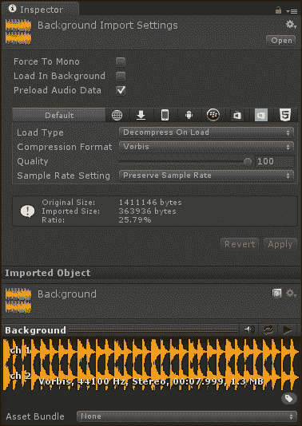
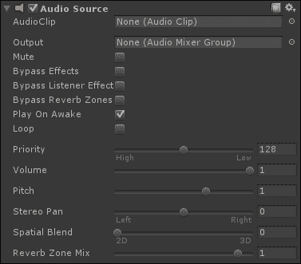
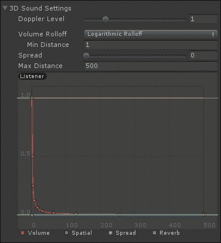
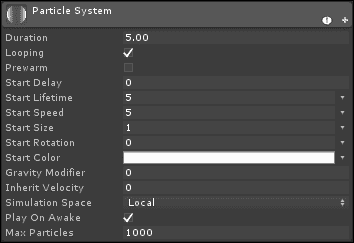
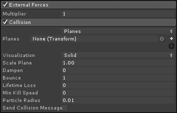
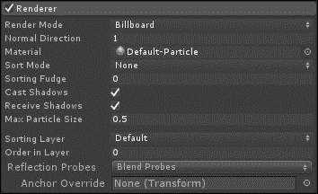
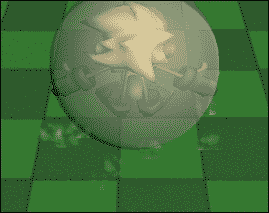
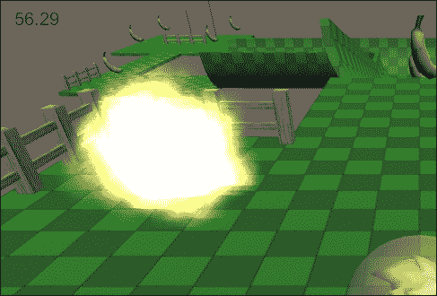

# 第八章：特效 - 声音与粒子

在上一章中，我们从 Monkey Ball 游戏中短暂休息，以了解 Unity 中的物理和 2D 游戏。我们创建了一个*愤怒的小鸟*的克隆版。这些鸟利用物理原理在空中飞行并摧毁猪和它们的结构。我们利用视差滚动制作了一个令人愉悦的背景效果。我们还创建了一个关卡选择屏幕，通过它可以加载游戏的各种场景。

在本章中，我们将回到 Monkey Ball 游戏。我们将添加许多特殊效果，以丰富游戏体验。首先，我们会了解 Unity 在处理音频时提供的控制方法。然后，我们将在游戏中添加背景音乐和猴子移动的声音。接下来，我们将学习粒子系统，为猴子创建尘埃轨迹。最后，我们将结合本章介绍的效果，为用户收集香蕉时创建爆炸效果。

在本章中，我们将涵盖以下重要主题：

+   导入音频剪辑

+   播放音效

+   理解 2D 和 3D 音效

+   创建粒子系统

打开你的 Monkey Ball 项目，让我们开始吧。

# 理解音频

与其他资源一样，Unity 团队努力工作，使得处理音频变得简单且无忧。Unity 能够导入和利用广泛的音频格式，让您可以在其他程序中以可编辑的格式保存文件。

## 导入设置

音频剪辑有一系列重要的设置。它们让你可以轻松控制文件类型和压缩。下面的截图展示了我们在导入音频剪辑时要处理的一些设置：



前面截图中的选项如下：

+   **强制单声道**：这个复选框将导致 Unity 将多声道文件更改为单个声道的音频数据。

+   **后台加载**：这将导致在将音频文件加载到内存时，不会暂停整个游戏。对于不需要立即使用的大型文件，最好使用这个选项。

+   **预加载音频数据**：这将导致音频信息尽可能快地加载。这对于需要几乎立即使用的小文件来说是最好的。

+   **加载类型**：这控制了在游戏播放时文件如何被加载；你可以从以下三个可用选项中选择：

    +   **加载时解压缩**：在第一次需要时从文件中移除压缩。这个选项的开销使得它非常不适合大型文件。这对于你经常听到的短声音来说是最好的选择，比如射击游戏中的枪声。

    +   **内存中压缩**：只有在播放时才会解压缩文件。当文件在内存中暂存时，它保持压缩状态。这对于不常听到的短到中等长度的声音来说是一个好选项。

    +   **流式传输**：这将在播放时加载音频，例如从网络流式传输音乐或视频。这个选项最适合背景音乐等事物。

+   **压缩格式**：这允许你选择用于减少音频文件大小的压缩格式类型。**PCM**格式将为你提供最大的文件大小和最佳的音频质量。**Vorbis**格式可以为你提供最小的文件大小，但随着大小的减小，质量也会降低。**ADPCM**格式会根据音频文件的布局进行调整，以使文件大小处于中等水平。

+   **质量**：仅当选择**Vorbis**作为压缩格式时使用。降低此值可以减少项目中文件的大小，但同时也会使音频引入越来越多的失真。

+   **采样率设置**：这让你可以确定 Unity 中维护的音频文件的细节程度。**保留采样率**选项将保持原始文件中使用的设置。**优化采样率**选项将允许 Unity 为你的文件选择一个合适的设置。**覆盖采样率**选项将让你访问**采样率**的值并为你音频选择一个特定的设置。较小的值可以减少整个文件的大小，但会降低质量。

## 音频监听器

为了在游戏中实际听到声音，每个场景都需要一个**音频监听器**组件。默认情况下，任何新场景中首先包含的`主相机`对象以及你可能创建的任何新相机都附有**音频监听器**组件。你的场景中一次只能有一个**音频监听器**组件。如果有一个以上的组件，或者在没有组件的情况下尝试播放声音，Unity 将在你的控制台日志中填满抱怨和警告。**音频监听器**组件还为任何 3D 声音效果提供精确的位置定位。

## 音频源

**音频源**组件就像一个扬声器，它控制用于播放任何声音效果的设置。如果剪辑是 3D 的，此对象的位置与**音频监听器**组件以及所选模式的相对位置决定了剪辑的音量。以下屏幕截图显示了**音频源**组件的各种设置，随后是它们的解释：



+   **音频剪辑**：这是此**音频源**组件默认播放的音频文件。

+   **输出**：对于复杂的音频效果，可以将 Unity 的新**音频混合器**对象之一放在这里。这些允许你在音频最终播放之前，对音频及其可能应用的效果或混合进行具体控制。

+   **静音**：这是一种快速切换播放声音的音量开关的方法。

+   **绕过效果**：这允许你切换应用于**音频源**组件的任何特殊滤镜。

+   **绕过听众效果**：这允许音频忽略可能应用于**音频监听器**的任何特殊效果。这对于不应该被世界扭曲的背景音乐来说是一个好的设置。

+   **绕过混响区域**：这允许你控制是否让**混响区域**（控制环境音频的过渡区域）影响声音。

+   **唤醒时播放**：这将导致音频剪辑在场景加载或对象生成时立即开始播放。

+   **循环**：这将导致播放的剪辑在播放时重复。

+   **优先级**：这决定了播放文件的相对重要性。值`0`表示最重要的，最适合音乐，而`256`表示最不重要的文件。根据系统不同，一次只能播放如此多的声音。播放文件的列表从最重要的开始，当达到这个限制时结束，如果有更多的声音超过限制，则排除那些值最低的。

+   **音量**：这决定了剪辑播放时的音量大小。

+   **音调**：这缩放了剪辑的播放速度。

+   **立体声平衡**：这调整了声音在左右扬声器中均匀输出的程度，向左或右扬声器倾斜。

+   **空间混合**：这是应用于音频源组件的 3D 效果的百分比。这影响诸如衰减和多普勒效应等因素。

+   **混响区域混合**：（混响区域用于创建环境音频效果之间的过渡。）这个设置让你调整这些区域将对来自这个音频源的声音产生多大影响。

前述截图中的设置如下： 

+   **3D 声音设置**：这包含了一组特定于播放 3D 音频剪辑的设置。**音量**、**空间**、**扩散**和**混响**选项可以通过使用组末的图表进行调整。这允许你创建更动态的过渡，当玩家接近**音频源**组件时：

    +   **多普勒级别**：这决定了移动声音需要应用多少多普勒效应。多普勒效应是当声源向你靠近或远离你时，你所经历音调的变化。一个典型的例子是一辆汽车在疾驰而过时鸣喇叭。

    +   **音量衰减**：这控制了声音随距离减小的音量。有三种类型的衰减：

        +   **对数衰减**：这是在声源中心较近的距离处声音突然快速衰减。

        +   **线性衰减**：这是一种与距离成正比的衰减方式，声音最大值为**最小距离**，最小值为**最大距离**。

        +   **自定义衰减**：这允许你通过调整组末的图表来创建自定义衰减。当图表被更改时，它也会自动被选择。

    +   如果**音频监听器**组件比**最小距离**值更近，音频将以当前音量水平播放。在此距离之外，声音将根据**衰减**模式逐渐减小。

    +   **扩散**：这调整了声音在扬声器空间中覆盖的区域量。当使用一个以上的扬声器时，它变得更加重要。

    +   超过**最大距离**值后，声音将停止过渡，基于组底部图表的情况。

## 添加背景音乐

既然我们已经了解了可用的音频设置，现在是把知识付诸实践的时候了。我们将从添加一些背景音乐开始。这将必须是一个 2D 音效，这样无论**音频源**组件在哪里，我们都能舒适地听到它。我们还将创建一个简短的脚本来淡入音乐，以减少音效对玩家突然而至的冲击。我们将使用以下步骤来完成这个任务：

1.  我们将从创建一个新脚本开始，并将其命名为`FadeIn`。

1.  这个脚本从四个变量开始。第一个变量是脚本需要达到的目标音量。第二个是过渡所需秒数。第三个变量是过渡开始的时间。最后一个变量跟踪与脚本同一对象上附加的**音频源**组件，允许我们定期更新它，如下所示：

    ```java
    public float maxVolume = 1f;
    public float fadeLength = 1f;
    private float fadeStartTime = -1f;
    private AudioSource source;
    ```

1.  接下来，我们利用`Awake`函数。它首先检查是否有附加的**音频源**组件，并用它来填充我们的`source`变量。如果找不到，则销毁**游戏对象**并退出函数：

    ```java
    public void Awake() {
      source = gameObject.GetComponent<AudioSource>();
      if(source == null) {
        Destroy(gameObject);
        return;
      }
    ```

1.  `Awake`函数通过将音量设置为`0`来结束，并在尚未播放时开始播放音频：

    ```java
    source.volume = 0;

    if(!source.isPlaying)
      source.Play();
    }
    ```

1.  为了随时间引起过渡，我们使用`Update`函数。它会检查`fadeStartTime`变量的值是否小于零，如果是，则将其设置为当前时间。这样可以避免场景初始化可能引起的卡顿：

    ```java
    public void Update() {
      if(fadeStartTime < 0)
        fadeStartTime = Time.time;
    ```

1.  接下来，函数检查过渡时间是否已经结束。如果结束了，将**音频源**组件的音量设置为`maxVolume`，并销毁脚本以释放资源：

    ```java
    if(fadeStartTime + fadeLength < Time.time) {
      source.volume = maxVolume;
      Destroy(this);
      return;
    }
    ```

1.  最后，通过计算自淡入开始以来经过的时间和过渡的长度之间的比例，来计算当前的进度。进度的百分比乘以`maxVolume`的值，并应用于**音频源**组件的音量：

    ```java
    float progress = (Time.time – fadeStartTime) / fadeLength;
    source.volume = maxVolume * progress;
    }
    ```

1.  回到 Unity，我们需要创建一个新的空**游戏对象**并将其命名为`Background`。

1.  将我们的`FadeIn`脚本和一个**音频源**组件添加到我们的对象中；可以通过导航到**组件** | **音频** | **音频源**来找到这些。

1.  如果你还没有这样做，请在你的 **项目** 面板中创建一个 `Audio` 文件夹，并导入本章 `起始资源` 文件夹中包含的音频文件。由于这些文件体积小，且当前游戏的需求，它们的默认导入设置将完全适用。

1.  在 **层次结构** 窗口中选中你的 `Background` 对象，并将 `Background` 音频拖到 **AudioClip** 插槽。

1.  确保在 **音频源** 组件中勾选了 **唤醒时播放** 和 **循环** 复选框。**音量** 和 **空间混合** 选项也需要设置为 `0`，以使文件在游戏中全程播放，但在开始时不会发出声音。

我们为游戏添加了背景音乐。为了让声音保持恒定且不具有方向性，我们将音乐作为 2D 声音使用。我们还创建了一个脚本，以便在游戏开始时渐入音乐。这为玩家提供了平滑过渡到游戏的方式，防止声音的突然冲击。如果你的背景音乐太大以至于无法听到游戏中的其他声音，请在你的 `Background` 对象的 **检查器** 面板中降低 **最大音量** 值，以获得更愉悦的体验。

背景音乐对游戏体验有很大的贡献。没有一些恐怖的音乐，恐怖场景几乎就不那么可怕了。没有那令人敬畏的音乐，老板们也就显得不那么威严了。为你的其他游戏寻找一些好的背景音乐。对于 *愤怒的小鸟* 来说，一些轻松愉快的音乐非常适合；而对于坦克大战游戏，则应该选择一些更具工业感且快节奏的音乐，以保持心跳加速。

## 戳香蕉

为了理解 3D 音频效果，我们将为香蕉添加一个声音，每当玩家触碰它们时就会触发。这将使玩家在成功触摸到香蕉时获得额外的反馈，同时还能指示被触摸香蕉的距离和方向。让我们按照以下步骤来创建这个效果：

1.  首先，我们需要一个名为 `BananaPoke` 的新脚本。

1.  这个脚本有一个变量 `source`，用于跟踪附加到对象上的 **音频源** 组件：

    ```java
    private AudioSource source;
    ```

1.  与我们之前的脚本一样，我们使用 `Awake` 函数找到对 **音频源** 组件的引用，为我们节省了一些在编辑器中的工作：

    ```java
    public void Awake() {
      source = gameObject.GetComponent<AudioSource>();
    }
    ```

1.  当玩家在屏幕上触摸香蕉时，会向香蕉发送一条消息，调用`Touched`函数。我们在第六章《移动设备的特性——触摸和倾斜》中创建的`BananaBounce`脚本中使用了这个函数来调整其生命值。如果我们有**音频源**组件，可以再次使用它来播放音效。`PlayOneShot`函数使用**音频源**组件的位置和设置来播放快速音效。如果没有这个，我们将无法从同一个**音频源**组件中快速连续播放许多音效。我们需要传递给它的只是要播放的音频剪辑。在这种情况下，音频剪辑已经附加到**音频源**组件本身：

    ```java
    public void Touched() {
      if(source != null)
        source.PlayOneShot(source.clip);
    }
    ```

1.  然后，我们需要在**项目**面板中将新的脚本和**音频源**组件添加到`Banana`预设中。

1.  需要将`BananaPoke`声音文件从`Audio`文件夹拖拽到新的**音频源**组件的**音频剪辑**槽中。

1.  为了让游戏一开始不会听到烦人的爆音，取消勾选**唤醒时播放**选项。

1.  接下来，我们想要听到触摸香蕉时距离上的差异。将**空间混合**设置改为`1`，以便将 2D 音效转变为 3D 音效。

1.  最后，我们需要将**音量衰减**的值更改为**线性衰减**，并将**最大距离**设置为`50`。这让我们根据距离舒适且容易地听到音效的音量变化。

在 3D 世界中，我们期望大多数声音来自一个特定的方向，并且随着距离的增加而衰减。在 3D 游戏中创建类似效果，玩家能够轻松判断游戏世界中事物的位置以及它们可能有多远。这对于需要玩家能够听到潜在的敌人、障碍物或奖励的游戏尤为重要，以便他们能够找到或避开它们。

我们的坦克大战游戏有许多可以轻易潜行接近我们的敌人，因为它们在接近时没有声音。坦克通常不被认为是安静的机器。找一个引擎轰鸣声或者制作一个，并将其添加到敌方坦克中。这将给玩家一些关于敌人可能在哪里以及他们有多远的指示。此外，不同类型的坦克有不同的引擎类型。每个引擎的声音都有点不同。因此，在处理这件事时，为每种类型的坦克找到不同的引擎噪音，给玩家提供更多关于角落处可能存在的危险指示。

# 了解粒子系统

粒子系统为游戏的最终外观增添了很多效果。它们可以表现为火、魔法波、雨或许多其他你能想到的效果。它们通常很难制作得很好，但如果做得好，它们是值得努力的。特别是在使用移动平台时，请记住，少即是多。较大的粒子比大量粒子更有效。如果你的粒子系统在一个小空间内包含成千上万的粒子，或者为了增强效果而复制自身，你需要重新考虑设计并找到更有效的解决方案。

## 粒子系统设置

每个粒子系统都包含大量组件，每个组件都有自己的设置。大多数可用的设置有**常量**、**曲线**、**两个常量之间的随机**和**两个曲线之间的随机**等选项。**常量**选项将是一个特定的值。**曲线**选项将是一个随时间沿曲线变化的设定值。两个随机设置在相应的值类型之间选择一个随机值。这在一开始可能看起来有些令人困惑，但随着你使用它们，它们会变得更加易懂。

正如你将在下面的屏幕截图和描述中看到的，我们将逐一了解粒子系统的每个部分：



+   粒子系统中的第一部分，即**初始**模块，包含了 Unity 中每个发射器使用的所有设置：

    +   **持续时间**：这表示发射器持续的时间。循环系统在此时间后会重复自己。非循环系统在此时间后停止发射新粒子。

    +   **循环**：这个复选框决定了系统是否循环。

    +   **预加热**：如果勾选此复选框，如果循环系统已经有机会循环一段时间，它将开始循环。这对于应该已经点燃的火把来说很有用，而不是在玩家进入房间时开始。

    +   **启动延迟**：当粒子系统首次触发时，这将阻止粒子系统在给定的秒数内发射粒子。

    +   **起始生命周期**：这是一个单独的粒子将持续的秒数。

    +   **起始速度**：这是粒子生成时最初移动的速度。

    +   **起始大小**：这决定了粒子生成时的大小。使用较大的粒子总是比使用较小的粒子更好，因此需要更多的粒子。

    +   **起始旋转**：这将旋转发射的粒子。

    +   **起始颜色**：这是粒子生成时的颜色色调。

    +   **重力修改器**：这会给粒子一个更大或更小的重力效果。

    +   **继承速度**：如果粒子系统在移动，这将导致粒子获得其变换动量的一部分。

    +   **模拟空间**：这决定了粒子是随游戏对象移动而移动（即局部）还是保持在它们在世界中的位置。

    +   **唤醒时播放**：如果勾选此复选框，发射器将在生成或场景开始时立即开始发射粒子。

    +   **最大粒子数**：这限制了该系统在单一时间内支持的粒子总数。只有当粒子的发射速率（或其生命周期）足够大以至于超过其销毁速率时，这个值才会起作用。

    

+   **发射**模块控制粒子的发射速度：

    +   **速率**：如果设置为**时间**，它表示每秒创建的粒子数。如果设置为**距离**，它表示系统移动时每单位距离的粒子数。

    +   **爆发**：这仅在将**速率**选项设置为**时间**时使用。它允许你在系统的时序中设置特定数量的粒子发射的点。

    

+   如前一个截图所示，**形状**模块控制系统如何发射粒子。它具有以下选项：

    +   **形状**：这决定了发射点将采取的形式。每个选项都附带一些决定其大小的附加值字段。

    +   **球体**：这是粒子向所有方向发射的点。**半径**参数决定了球体的大小。**从壳体发射**选项指定粒子是从球体表面发射还是从球体内部体积发射。

    +   **半球体**：顾名思义，这是球体的一半。**半径**参数和**从壳体发射**选项在这里与**球体**的工作方式相同。

    +   **圆锥体**：这在一个方向发射粒子。**角度**参数决定形状更接近圆锥体还是圆柱体。**半径**参数决定了形状发射点的大小。当**从**选项设置为**体积**或**体积壳体**时，使用**长度**参数来指定可用于生成粒子的空间量。**从**选项将决定粒子从哪里发射。**基础**从形状的底圆盘发射。**基础壳体**选项从圆锥体的底部但在形状的表面周围发射。**体积**将从形状内部的任何位置发射，而**体积壳体**从形状的表面发射。

    +   **盒子**：这从类似立方体的形状发射粒子。**盒子 X**、**盒子 Y**和**盒子 Z**选项决定了盒子的大小。

    +   **网格**：这允许你选择一个模型作为发射点。然后你可以选择从组成**网格**的每个**顶点**、**边**或**三角形**发射粒子。

    +   **圆形**：这从单个点沿 2D 平面发射粒子。**半径**决定了发射的大小，**弧度**决定了使用圆的多少。**从边缘发射**决定粒子是从圆的内边缘还是外边缘发射。

    +   **边缘**：这会沿着一条线从单一方向发射粒子。**半径**参数决定了发射区域的长度。

    +   **随机方向**：这决定了粒子的方向是由所选形状的表面法线确定，还是随机选择。

    

+   **生命周期内速度变化**模块允许你在粒子生成后控制它们的动量：

    +   **X**、**Y**和**Z**：这些定义了粒子动量沿每个轴的每秒单位数。

    +   **空间**：这决定了速度是局部应用于系统的变换还是相对于世界。

    

+   **生命周期内限制速度**模块如果粒子的移动超过指定值，则会减弱其移动：

    +   **独立轴**：这允许你为每个轴定义一个独特的值，以及该值是局部的还是相对于世界的。

    +   **速度**：这是粒子在施加阻尼之前需要移动的速度。

    +   **阻尼**：这是粒子速度减少的百分比。它的值可以是零到一之间的任何值。

    

+   **生命周期内力变化**模块为每个粒子在其生命周期内添加一个恒定的移动量：

    +   **X**、**Y**和**Z**：这些定义了需要沿每个轴施加的力。

    +   **空间**：这决定了力是局部应用于系统的变换，还是在世界空间中应用。

    +   **随机化**：如果**X**、**Y**和**Z**是随机值，这将导致每一帧随机选择施加的力的大小，从而产生随机值的统计平均。

    

+   **生命周期内颜色变化**模块允许你为粒子在生成后过渡的一系列颜色进行定义。

+   **按速度着色**模块导致粒子在其速度变化时通过定义的颜色范围过渡：

    +   **颜色**：这是过渡的一系列颜色。

    +   **速度范围**：这定义了粒子必须达到的速度，以便在**颜色**范围的最小和最大端。

    

+   **生命周期内尺寸变化**模块会改变粒子在其生命周期内的尺寸。

+   **按速度调整尺寸**模块根据粒子的速度调整每个粒子的大小，如下所示：

    +   **尺寸**：这是粒子过渡时调整的大小。

    +   **速度范围**：这定义了**尺寸**值的每个最小和最大值。

    

+   **生命周期内旋转**模块在粒子被生成后随着时间的推移对粒子进行旋转。

+   **按速度旋转**模块使得粒子在速度更快时旋转得更多：

    +   **角速度**：这是粒子旋转的每秒度数速度。

    +   **速度范围**：这是如果**角速度**值未设置为**恒定**时的最小和最大范围。

    

+   **外部力**模块增强了风区对象的影响效果。风区模拟了风对粒子系统和 Unity 中树木的影响。

+   **碰撞**模块允许粒子与物理游戏世界发生碰撞和交互：

    +   如果设置为**平面**，你可以定义多个平面供粒子碰撞。这比**世界**碰撞的处理速度更快：

        +   **平面**：这是一个定义碰撞表面的变换列表。粒子只会与变换的本地、正 y 侧发生碰撞。任何在点另一侧的粒子将被销毁。

        +   **可视化**：这为你提供了将平面显示为**实体**表面或**网格**表面的选项。

        +   **缩放平面**：这调整了**可视化**选项的大小。它不会影响实际碰撞表面的尺寸。

        +   **粒子半径**：这用于定义用于计算粒子与平面碰撞的球体的大小。

    +   如果设置为**世界**，则粒子将与场景中的每个碰撞器发生碰撞。这对处理器来说可能是一个很大的负担。

        +   **碰撞层**：这定义了一个粒子可以与之碰撞的层列表。只有在此列表中勾选的层的碰撞器将用于碰撞计算。

        +   **碰撞质量**：这定义了此粒子系统的碰撞计算的精确度。**高**选项将精确计算每一个粒子的碰撞。**中**选项将使用近似值，并在每个帧中限制新的计算次数。**低**选项的计算频率低于**中**选项。如果**碰撞质量**设置为**中**或**低**，则**体素大小**参数决定了系统估算碰撞点的精确度。

    +   **阻尼**：当粒子与表面碰撞时，这会从粒子中移除定义的比例速度。

    +   **弹跳**：这允许粒子保持其定义的速度比例，特别是沿着被撞击表面的法线方向。

    +   **生命周期损失**：这是生命周期的百分比。当粒子发生碰撞时，会从这个百分比中移除粒子的生命周期。随着时间的推移，或者通过碰撞，粒子的生命周期降至零时，它将被移除。

    +   **最小销毁速度**：如果粒子在碰撞后的速度低于这个值，粒子将被销毁。

    +   **发送碰撞消息**：如果勾选此复选框，则附加到粒子系统以及与之发生碰撞的对象上的脚本将在每一帧被告知发生碰撞。每帧只发送一条消息，而不是每个粒子。

    

+   **子发射器**模块允许在粒子系统的每个粒子的生命周期中的点产生额外的粒子系统：

    +   **出生**列表中的任何粒子系统将在粒子首次创建时产生，并跟随粒子。这可以用来创建火球或烟雾轨迹。

    +   **碰撞**列表在粒子撞击某物时产生粒子系统。这可以用于雨滴飞溅效果。

    +   **死亡**列表在粒子被销毁时产生粒子。它可以用来产生烟花爆炸效果。

    

+   **纹理图动画**模块使得粒子在其生命周期内翻动一系列的粒子。所使用的纹理在**渲染器**模块中定义：

    +   **瓷砖**：这定义了图中的行数和列数。这将决定可用的总帧数。

    +   **动画**：这为您提供了**整张图**和**单行**的选项。如果此选项设置为**单行**，则所使用的行可以随机选择或通过使用**随机行**复选框和**行**的值来指定。

    +   **随时间帧**：这定义了粒子在帧之间的过渡方式。如果设置为**常数**，系统将只使用一个帧。

    +   **循环**：这是粒子在其生命周期内循环动画的次数。

    

+   **渲染器**模块决定了每个粒子在屏幕上的绘制方式，如下所示：

    +   **渲染模式**：这定义了粒子在游戏世界中定位自己的方法：

        +   **广告牌**：这将始终直接面向相机。

        +   **拉伸广告牌**：这将使粒子面向相机，但会根据相机的速度、粒子的速度或特定值来拉伸它们。

        +   **水平广告牌**：这在游戏世界的 XZ 平面上是平的。

        +   **垂直广告牌**：这将始终面向玩家，但沿 Y 轴始终保持直立。

        +   如果设置为**网格**，您可以定义一个模型作为粒子使用，而不是平面。

    +   **法线方向**：这用于通过调整每个平面的法线来对粒子进行光照和阴影处理。值为**1**时，法线直接指向相机，而值为**0**时，法线指向屏幕中心。

    +   **材质**：这定义了用于渲染粒子的材质。

    +   **排序模式**：这决定了绘制粒子的顺序，按距离或年龄排序。

    +   **排序微调**：这导致粒子系统比正常情况下更早地被绘制。值越高，它将在屏幕上越早被绘制。这影响了系统是出现在其他粒子系统或部分透明物体的前面还是后面。

    +   **投射阴影**：这决定了粒子是否能够阻挡光线。

    +   **接收阴影**：这决定了粒子是否会被其他物体投射的阴影影响。

    +   **最大粒子尺寸**：这是单个粒子允许占满的屏幕空间总量。无论粒子的实际大小如何，它都不会占据超过这个屏幕空间。

    +   **排序层**和**层内顺序**：这些在使用 2D 游戏时很有用。它们分别决定了粒子处于哪个层级以及在该层级中的绘制位置。

    +   **反射探针**：这些也可以用来反射世界，而不仅仅是粒子。当反射的是世界而不是粒子时，可以使用**锚点覆盖**来定义一个自定义的位置来采样反射。

这里有大量的信息。你将最常使用**初始**、**发射**和**形状**模块。它们控制任何粒子系统的主要特性。其次，你可能会使用**渲染器**模块来改变粒子系统所使用的纹理，以及**生命周期颜色**模块来调整褪色效果。当这些部分有效地结合在一起时，将为你的游戏带来非常棒的效果，完善游戏的外观。学习它们能做什么的最好方法就是玩转这些设置，看看会发生什么。实验和一些教程，比如接下来的几节，是成为粒子系统创建专家的最佳途径。

## 创建灰尘轨迹。

为了让玩家更好地感受到角色实际上是处于世界中并与世界接触的，他们常常被赋予在环境中移动时能够踢起小灰尘云的能力。这是一个小效果，但为任何游戏增添了不少润色。我们将给我们的猴子球增加踢起小灰尘云的能力。让我们按照以下步骤进行：

1.  首先，我们需要创建一个新的粒子系统，通过导航到**GameObject** | **Particle System**。将其命名为`DustTrail`。

1.  默认情况下，粒子系统会以圆锥形状发射小白球。对于灰尘效果，我们需要更有趣的东西。将本章`Starting Assets`文件夹中的纹理导入到你的项目中的`Particles`文件夹里。这些是由 Unity 提供的粒子纹理，它们在引擎的旧版本中出现过。

1.  接下来，我们需要在`Particles`文件夹中创建一个新的材质。将其命名为`DustPoof`。

1.  要更改新材质的**Shader**属性，请转到**Particles** | **Alpha Blended**，并将`DustPoof`纹理放入**Particle Texture**图像槽中。这样可以将材质设置为部分透明，并且能够与世界以及其他正在发射的粒子良好融合。

1.  要更改我们的`DustPoof`粒子系统的外观，请将材质放入**Renderer**模块的**Material**槽中。

1.  系统中的粒子存在时间过长且移动距离太远，因此将**Start Lifetime**设置为`0.5`和**Start Speed**设置为`0.2`。这样粒子会在消失前仅从地面稍微升起一点。

1.  我们还需要使粒子更适合我们猴子的大小。将**Start Size**设置为`0.3`，以使它们大小适中。

1.  看到所有粒子都是完全相同的方向有点奇怪。为了使方向不同，将**Start Rotation**更改为**Random Between Two Constants**，方法是点击输入字段右侧的小下拉箭头。然后，将两个新的输入字段设置为`-180`和`180`，使所有粒子具有随机的旋转。

1.  粒子的棕色是可行的，但并不总是与我们的关卡地形的颜色和性质相匹配。点击**Start Color**旁边的颜色字段，并使用弹出的**Color Picker**窗口选择基于环境的新颜色。这将使粒子在从游戏场地表面被踢起时更有意义。

1.  最后，对于**Initial**模块，我们需要将**Simulation Space**设置为**World**，这样粒子就会随着猴子移动而留在原地，而不是跟随他。

1.  在**Emission**中，我们需要确保有足够的粒子以产生适量的扬尘。将**Rate**设置为`20`以产生轻微的扬尘效果。

1.  接下来，我们将调整**Shape**模块，使粒子能够在球的整个区域下发射。确保将**Shape**设置为**Cone**，**Angle**设置为`25`，**Radius**设置为`0.5`。

1.  使用**颜色随生命周期变化**模块，我们可以平滑粒子的突然出现和消失。点击模块名称左侧的复选框以激活它。点击**颜色**右侧的白条，打开**渐变编辑器**窗口。在**渐变编辑器**中，点击颜色条上方将添加一个新的标志，该标志将控制粒子在其生命周期内的透明度。此条形的左侧对应于粒子生命的开始，右侧对应于粒子生命的结束。我们需要总共四个标志。最开始的标志，将**Alpha**值设置为`0`，第二个标志，位置值为`20`，**Alpha**值为`255`，第三个标志在位置`50`处，**Alpha**为`255`，最后一个标志在最后，**Alpha**值为`0`。这将使尘埃粒子在开始时快速淡入，之后慢慢淡出，平滑它们的出现和消失过渡。

1.  我们可以通过使用**大小随生命周期变化**模块，使粒子在出现和消失时增大和缩小，从而进一步平滑过渡。确保通过其名称旁边的复选框激活它。点击**大小**右侧的曲线条，**粒子系统曲线**编辑器将在**检查器**面板底部的预览区域中打开。在这里，我们可以调整任何小钻石形状的键，以控制粒子在其生命周期中的大小。与**渐变编辑器**的情况一样，左侧是粒子生命的开始，右侧是结束。右键点击它，我们可以添加新的键来控制曲线。要创建弹出效果，请将第一个键放在最左侧底部。第二个键应该放在顶部，与底部的`0.2`值相对应。第三个在顶部和底部的`0.4`值处效果很好。第四个应该在最右侧，大约设置为左侧的`0.6`，这些数字表示我们在**初始**模块中设置的**开始大小**的百分比，如下截图所示：

1.  最后，为了完成我们的粒子系统的外观，我们将使用**旋转随生命周期变化**模块，为粒子增加一点旋转。将值更改为**两个常数之间的随机值**，并将两个值字段设置为`-45`和`45`，使粒子在其生命周期中稍微旋转。

1.  为了让我们的猴子使用粒子系统，将其设置为`MonkeyPivot`对象的子对象，并将其位置设置为**X**为`0`，**Y**为`-0.5`，**Z**为`0`。同时，确保旋转设置为**X**为`270`，**Y**为`0`，**Z**为`0`。这将使其位于猴子球的底部并向空中抛出粒子。由于它是`MonkeyPivot`的子对象，它不会随着球的旋转而旋转，因为我们已经使对象补偿了球的旋转。

1.  尝试一下。当我们的猴子四处移动时，他在身后留下了一条很好的灰尘轨迹。如果根据关卡的材质进行定制，这种效果可以非常出色，无论是草地、沙地、木材、金属还是其他任何材质。

1.  你可能会注意到，即使我们的猴子从地图边缘飞出去，效果仍然在持续播放。我们将创建一个新脚本来根据猴子球是否真正接触地面来切换粒子效果。现在创建一个名为`DustTrail`的新脚本。

1.  这个脚本的第一个变量将保存对我们试图控制的粒子系统的引用。第二个变量将是一个标志，表示球是否真正接触地面：

    ```java
    public ParticleSystem dust;
    private bool isTouching = false;
    ```

1.  我们使用`OnCollisionStay`函数来判断球是否触碰到了任何物体。这个函数与上一章中使用的`OnCollisionEnter`函数类似。不过，那个函数是在我们的鸟撞击到某物的那一刻被 Unity 调用的，而这个函数则是在每一帧球持续接触另一个碰撞体时被调用。当它被调用时，我们只需设置一个标志来标记我们正在触碰某物：

    ```java
    public void OnCollisionStay() {
      isTouching = true;
    }
    ```

1.  因为物理系统只在`FixedUpdate`循环中改变，所以我们使用这个函数来更新我们的粒子系统。在这里，我们首先检查是否正在触碰某物，并且粒子系统当前没有发射任何东西，这由其`isPlaying`变量指示。如果条件满足，我们使用`Play`函数开启粒子系统。然而，如果球没有触碰任何物体，并且粒子系统当前正在播放，我们使用`Stop`函数来关闭它：

    ```java
    public void FixedUpdate() {
      if(isTouching && !dust.isPlaying) {
        dust.Play();
      }
      else if(!isTouching && dust.isPlaying) {
        dust.Stop();
      }
    ```

1.  在`FixedUpdate`函数的最后，我们将标志设置为`false`，这样它就可以在下一帧更新我们是否需要开启或关闭粒子系统：

    ```java
      isTouching = false;
    }
    ```

1.  接下来，将新脚本添加到`MonkeyBall`对象上。正如上一章所学的，如果我们没有将它附加到与球的**Rigidbody**组件相同的对象上，我们将无法接收到使脚本正常工作的碰撞信息。

1.  最后，将你的`DustTrail`粒子系统拖放到**Dust**槽中，这样你的脚本才能真正控制它。

1.  再试一次。现在我们的猴子可以轻松地四处移动并产生一些灰尘轨迹，直到它从关卡的边缘掉落，跳下平台，或者以其他方式悬在空中。

我们让我们的猴子球具有扬起灰尘的能力。我们还根据球是否真正接触地面来控制灰尘的开启和关闭。这个小效果使角色在游戏中显得更加脚踏实地。它还可以根据拖尾持续的时间，让你感受到角色的速度。

我们之前讨论过的使角色更加接地气的另一个好效果是阴影。如果你还没有这样做，请确保为你的环境添加一些阴影细节。不过，你可能注意到，由于球体部分透明，实时阴影无法在其上生效。这时，我们之前在坦克上使用的 blob 阴影就派上用场了。

即使球体没有移动，我们的效果也会持续运行。尝试调整粒子系统是否播放，基于其**刚体**组件的速度。在上一章中，我们稍微调整了**刚体**组件的速度，如果你需要复习可以看看。作为一个额外的挑战，查看粒子系统的`emissionRate`变量。尝试让球体速度加快时，效果产生更多的粒子。

# 组合在一起

到目前为止，我们学习了各自独立的声音效果和粒子系统。它们各自可以为场景增添很多，设定氛围，并赋予游戏独特的润色。然而，有许多效果是无法独立存在的。例如，爆炸效果，如果没有视觉和听觉效果的结合，就不会那么令人印象深刻。

## 爆炸的香蕉

当事物爆炸时摧毁它们会让人感到更加满足。要制造一次恰当的爆炸，需要同时具备粒子效果和声音效果。我们将从创建一个爆炸预设开始。然后，更新香蕉，使它们在摧毁时产生爆炸。以下步骤将帮助我们创建香蕉爆炸效果：

1.  首先，我们需要创建一个新的粒子系统，并将其命名为`Explosion`。

1.  我们希望我们的爆炸效果看起来更像是一次真正的爆炸。这时，我们的第二个粒子纹理就发挥作用了。为其创建一个新材质，命名为`Smoke`。

1.  这次，通过选择**粒子** | **附加**来设置**着色器**属性。这将使用一种附加混合方法，使粒子整体看起来更亮，同时仍然将粒子的 alpha 与背后的物体混合。

1.  确保将新材质的**粒子纹理**属性设置为`Smoke`。

1.  同时，将你的`Smoke`材质拖放到粒子系统的**渲染器**模块中的**材质**槽内。

1.  我们不希望这次爆炸持续得太久。因此，在**初始**模块中，将**持续时间**设置为`0.5`，并将**开始生命周期**设置为`1`，使其比原来的时间短得多。

    ### 注意

    当处理像爆炸这样短暂爆发的效果时，可能很难看出我们的更改如何影响粒子系统的外观。完成这个粒子系统后，我们将不得不取消勾选**循环**复选框，但现在保持勾选状态会使得查看和工作变得更加容易。

1.  接下来，为了防止粒子飞得太远，将**起始速度**设置为`0.5`，使爆炸效果集中且局限于一个较小的区域。

1.  为了让爆炸有足够的粒子，需在**发射**模块中将**速率**设置为`120`。

1.  为了让爆炸看起来更真实，需要在**形状**模块中将**形状**改为**球体**。同时，将**半径**设置为`0.5`。如果你对改变爆炸的大小感兴趣，可以调整**半径**和**发射速率**。两者都增加会得到更大的爆炸效果，而两者都减少则得到较小的爆炸效果。

    ### 注意

    这种基本的爆炸效果仅仅是一种视觉上的爆炸，大多数情况都是如此。要制作根据环境改变或受环境影响而改变外观的爆炸效果，将需要额外的脚本编写和模型考虑，这超出了本书的范围。

1.  我们游戏中的爆炸效果仍然不像真正的爆炸，所有的粒子都从边缘突然出现。这时就需要用到**生命周期颜色**模块。首先，我们需要通过在 alpha 通道添加新标志来消除粒子的突现。在大约边缘向内`20`%的位置添加两个新标志，并调整所有四个标志，使粒子在开始时淡入，结束时淡出。

1.  在**渐变编辑器**的渐变条底部的标志控制粒子在其生命周期中过渡的颜色。为了得到一个像样的爆炸效果，我们需要再添加两个标志，一个放在三分之一的位置，另一个放在三分之二的位置，将所有四个标志均匀地间隔开。爆炸通常开始时颜色较亮，接着在爆炸能量达到顶峰时颜色更亮，然后随着能量开始消散时颜色再次变亮，最后能量完全消失时为黑色。你选择的每种颜色都会影响爆炸的颜色。对于普通爆炸，可以选择黄色和橙色。对于科幻空间爆炸，可以选择蓝色或绿色。或者，如果是异形孢子云，可以使用紫色。发挥你的想象力，选择适合你想要爆炸效果的色彩。![爆炸的香蕉]

1.  现在我们已经设置好所有参数，确保勾选了**Play On Awake**，这样爆炸在创建的那一刻就会开始，并取消勾选**Looping**，这样它就不会永远播放。如果你想在这个时候测试你的粒子系统，可以查看当选择任何粒子系统时，在**Scene**窗口右下角出现的**Stop**、**Simulate**和**Pause**按钮。这些按钮就像你的音乐播放器按钮一样，控制粒子系统的播放。

1.  如果我们现在开始创建爆炸效果，它们在生成初始粒子群后会仅仅停留在场景中，尽管玩家永远看不到它们。这就是为什么我们需要一个新的脚本来在它们完成作用后摆脱它们。创建一个新的脚本，并将其命名为`Explosion`。

1.  这个脚本有一个单一的变量，即跟踪表示其存在的粒子系统：

    ```java
    public ParticleSystem particles;
    ```

1.  它也只有一个函数。`Update`函数每一帧都会检查粒子系统是否存在或者是否已经停止播放。在任一情况下，整体对象都会被销毁，这样我们可以节省资源：

    ```java
    public void Update() {
      if(particles == null || !particles.isPlaying)
        Destroy(gameObject);
    }
    ```

1.  然后，我们需要将我们的新脚本添加到`Explosion`对象中。同时，将**Particle System**组件拖到**Script**组件中的**Particles**槽位。

1.  为了让爆炸声能被听到，我们还需要在`Explosion`对象上添加一个**Audio Source**组件。

1.  确保勾选了其**Play On Awake**选项。为了让声音在 3D 空间中有意义，将**Spatial Blend**属性设置为`1`。同时，设置为**Linear Rolloff**，并将**Max Distance**设置为`50`，这样我们可以听到它。

1.  我们的香蕉拥有和汽车一样的爆炸声音是没有意义的。相反，我们有一个很好的小爆裂声，这将使最终效果与那些仅仅减少香蕉健康值的效果区分开来。为此，在**Audio Source**组件的**AudioClip**槽位上设置`BananaPop`音频文件。

1.  在我们设置好所有爆炸参数后，使用`Explosion`对象创建一个新的预制体，并将其从场景中删除。

1.  接下来，我们需要更新`BananaBounce`脚本，当它失去健康时实际生成爆炸效果。现在打开它。

1.  首先，在脚本开始部分添加一个新的变量。这将简单地跟踪我们希望在香蕉失去健康后生成的预制体：

    ```java
    public GameObject explosion;
    ```

1.  接下来，我们需要在`Touched`函数中使用`Destroy`函数后立即添加一行。这行代码仅仅在香蕉的位置创建一个新的爆炸实例：

    ```java
    Instantiate(explosion, transform.position, transform.rotation);
    ```

1.  最后，在**Project**面板中找到你的`Banana`预制体，并将`Explosion`预制体拖到新的**Explosion**槽位中。如果你不这样做，将永远不会创建爆炸效果，而且每当香蕉失去健康时 Unity 都会报错。

如前所述截图所示，我们已经创建了一个爆炸效果。在 Unity 旧的粒子系统的一些纹理的帮助下，我们让它看起来像真正的爆炸，而不是仅仅是一团彩色的球。我们还为爆炸效果添加了声音。结合粒子系统和音频源，我们可以创建许多效果，比如我们的爆炸效果，如果只使用其中一种，效果就会显得较弱。我们还更新了香蕉，使其在被玩家摧毁时产生爆炸。尝试调整香蕉音频的平衡，每次触摸香蕉之间的音量差异以及爆炸本身。我们通过粒子系统在视觉上和通过音频源在听觉上为玩家提供的信息越多，效果就会越好。

香蕉并不是这个世界上唯一可以爆炸的东西。在我们的第二款游戏中，我们摧毁的坦克只是消失了。尝试为《坦克大战》游戏添加一些新的爆炸效果。每次坦克被摧毁时，都应该以壮观的方式爆炸。此外，无论坦克的炮弹击中什么，炮弹往往会爆炸。尝试在炮弹射击点产生爆炸效果，而不是移动红色球体。这将给玩家更好的射击目标和感觉。

《愤怒的小鸟》游戏也可以加入一些爆炸效果，尤其是黑色的小鸟。每当有东西被摧毁时，都应该释放出一些粒子效果，并产生一些声响。否则，当物体突然消失时，游戏会看起来有些奇怪。

# 总结

在本章中，我们了解了 Unity 中的特效，特别是音频和粒子系统。我们从了解 Unity 如何处理音频文件开始。通过为球添加背景音乐和一些吱吱声，我们将所学内容付诸实践。然后我们继续了解粒子系统，并为球创建了尘埃轨迹。最后，我们将这两种技能结合在一起，为收集香蕉时创建爆炸效果。粒子系统和音频效果为游戏的最终润色和外观增添了很多。

在下一章中，我们将通过查看 Unity 中的优化来共同完善我们的游戏体验。我们将了解一些用于追踪性能的工具。我们还将创建自己的工具来追踪脚本特定部分的性能。我们将探讨资源压缩以及我们可以更改的其他点以最小化应用程序的占用空间。最后，将讨论在使用游戏和 Unity 时最小化延迟的关键点。
