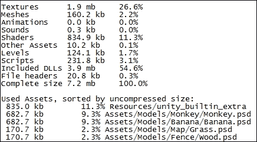
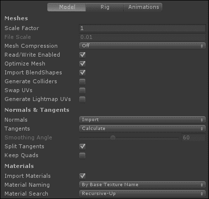
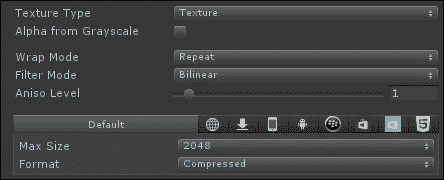
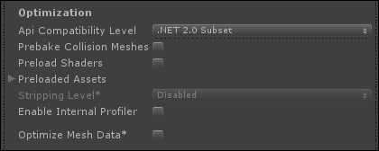
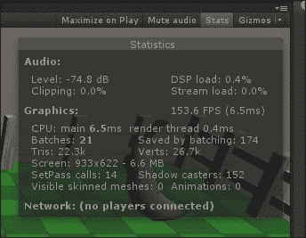
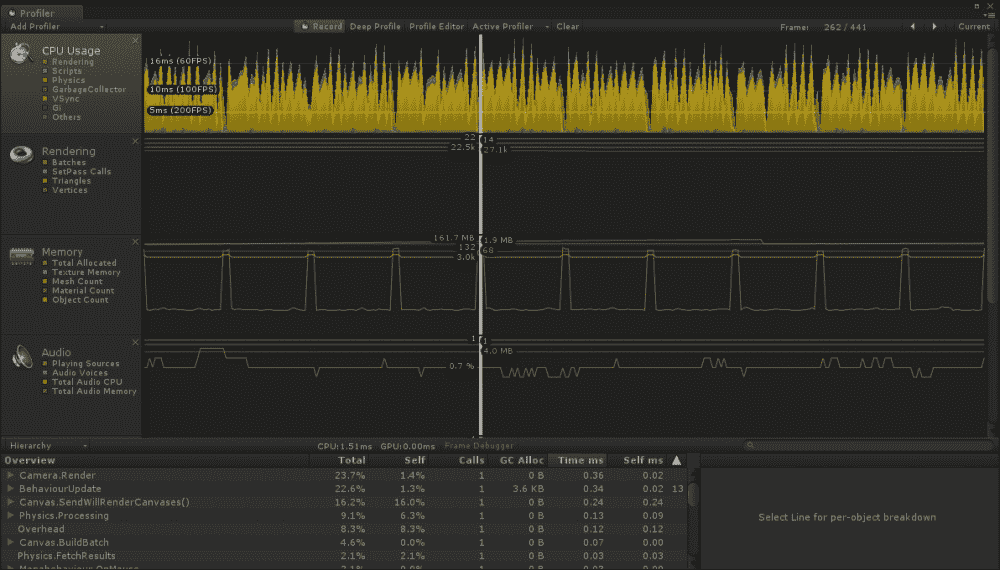
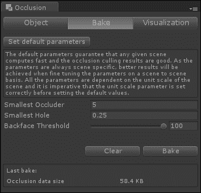
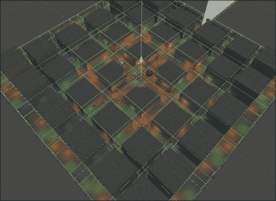

# 第九章：优化

在上一章中，我们学习了关于游戏特效的知识。我们为 Monkey Ball 游戏添加了背景音乐。我们还为我们的猴子创建了尘埃轨迹。通过结合音频效果和粒子系统，当玩家收集香蕉时我们创建了爆炸效果。这些共同丰富了游戏体验，使我们的游戏看起来非常完整。

在本章中，我们将探讨优化的各种选项。我们从应用程序占用空间着手，探讨如何减少它，然后进一步查看游戏性能，最后探索可能导致延迟的关键区域，以及如何减少它们的影响。

在本章中，我们将涵盖以下主题：

+   最小化应用程序占用空间

+   跟踪性能

+   减少延迟

+   遮挡剔除

在本章中，我们将同时处理我们的 Monkey Ball 和 Tank Battle 游戏。首先打开 Monkey Ball 项目来开始本章的学习。

# 最小化应用程序占用空间

游戏成功的关键之一在于游戏本身的大小。许多用户会迅速卸载那些看起来不必要的大的应用程序。此外，所有移动应用商店都根据应用程序本身的大小对游戏如何提供给用户设置了限制。熟悉缩小游戏大小的各种选项是控制游戏分发方式的关键。

当致力于最小化占用空间时，首先需要注意的是 Unity 在构建游戏时如何处理资源。只有那些在构建中至少一个场景中使用过的资源才会被实际包含在游戏中。如果资源不在场景本身或者不在场景中引用的资源中，那么它就不会被包含。这意味着你可以拥有资源的测试版本或不完整版本；只要它们没有被引用，它们就不会影响你游戏的最终构建大小。

Unity 还允许你以你需要的工作格式保存资源。当最终构建时，所有资源都会转换为适合其类型的适当版本。这意味着你可以将模型保存在与你的建模程序本机格式中，它们将在构建游戏时转换为 FBX 文件。否则，你可以将图像保存为 Photoshop 文件，或你工作的任何其他格式，并在构建游戏时适当转换为 JPG 或 PNG。

## 编辑器日志

当你准备好最终处理游戏的占用空间时，可以确切地找出导致游戏比预期更大的原因。在**控制台**窗口的右上角有一个下拉菜单按钮。这个菜单中有**打开编辑器日志**：


编辑器日志是 Unity 在运行时输出信息的位置。这个文件会记录有关当前 Unity 编辑器版本的信息，执行对你的许可证的任何检查，并包含一些关于你导入的资源的详细信息。日志还将包含有关构建后游戏中包含的文件大小和资源的详细信息。以下屏幕截图显示了编辑器日志的一个示例：



在这里，我们可以看到最终构建方面的细分。每个资源类别都有其大小以及占总构建大小的百分比。同时，我们还获得了一个列表，列出了实际包含在游戏中的每个资源，按文件大小进行了组织，在添加到构建之前。当你寻找可以缩小的资源时，这些信息会非常有用。

## 资源压缩

在模型、纹理和音频的**导入设置**窗口中，有一些影响导入资源的尺寸和质量的选项。通常，受影响的是质量的降低。然而，特别是在为移动设备开发游戏时，资源质量可以在达到计算机所需水平以下很多，而不会在设备上注意到差异。一旦你了解了每种资源类型可用的选项，你将能够就游戏的质量做出最佳决策。在使用这些选项中的任何一个时，寻找一个在引入不需要的伪影之前能最小化尺寸的设置。

### 模型

无论你使用什么程序或方法来创建你的模型，最终总会有一个顶点位置和三角形的列表，以及一些对纹理的引用。模型的大部分文件大小来自顶点位置列表。为了确保你的游戏中的模型具有最高质量，从你选择的建模程序开始。删除所有额外的顶点、面和未使用的对象。这不仅能让你在构建最终游戏时得到较小的文件，还能减少你在编辑器中的导入时间。

模型的**导入设置**窗口由三个页面组成，提供了更多调整质量的选项。每个页面标签对应于模型的相应部分，允许你微调每一个部分。

### 模型标签页

在**模型**标签页上，你可以影响网格的导入方式。在优化模型使用方面，这里有许多关键选项。一旦你的游戏看起来和玩起来的效果如你所愿，你应该始终仔细查看这些设置，看看是否能让它们工作得更好：



以下是**模型**标签页中的各种设置：

+   **缩放因子**和**文件缩放**：这些选项允许您控制模型的默认视觉大小。**文件缩放**参数是 Unity 在导入模型时计算的大小。**缩放因子**参数允许您调整 Unity 在导入模型时应用的额外缩放。

+   **网格压缩**：此选项允许您选择对模型应用多少压缩。压缩效果相当于合并顶点以减少必须为网格存储的细节总量。如果过度使用此设置，可能会在网格中引入不希望出现的异常。因此，应始终选择不会引入任何伪影的最高设置。

+   **读写启用**：此选项仅在您想在游戏运行时通过脚本操作网格时有用。如果您从未用任何脚本接触网格，请取消勾选此框。尽管这不会影响最终构建的大小，但它会影响运行游戏所需的内存量。

+   **优化网格**：此选项使 Unity 重新排序描述模型的三角形列表。此选项始终是一个好的选择，应该勾选。唯一可能需要取消勾选的情况是，如果您基于三角形的特定顺序操作游戏或网格。

+   **导入混合形状**：混合形状与普通动画中的关键帧相似，但它们作用于网格细节本身，而不是骨骼的位置。通过取消勾选此框，您可以节省游戏和项目中的空间，因为 Unity 将不需要计算和存储它们。

+   **生成碰撞器**：此选项几乎总是建议不勾选。此选项将为模型中的每个网格添加**网格碰撞器**组件。这些碰撞器在处理游戏中的物理时计算相对昂贵。如果可能，您应该始终使用一组明显更简单的**盒子碰撞器**和**球体碰撞器**。

+   **交换 UV**：Unity 支持具有两组 UV 坐标的模型。通常，第一组用于普通纹理，第二组用于物体的光照图。如果您生成自己的光照图 UV，Unity 可能会识别错误的顺序。勾选此框将强制 Unity 改变它们的使用顺序。

+   **生成光照图 UV**：仅当您处理需要静态阴影的物体时，才应使用此选项。如果物体不需要，这将会引入过多的顶点信息并增加资源的大小。

+   **法线**：此选项用于计算或导入法线信息。**法线**被材质用于确定顶点或三角形面向的方向以及光照应该如何影响它。如果网格从未使用需要**法线**信息的材质，请确保将其设置为**无**。

+   **切线**：这个选项用于计算或导入切线信息。**切线**被材质用于通过凹凸贴图和类似的特效来模拟细节。就像**法线**设置一样，如果你不需要它们，就不要导入它们。如果**法线**设置为**无**，这个设置会自动变灰，并且不再导入。

+   **平滑角度**：在计算法线时，这个选项允许你定义两个面之间的角度需要多接近，才能在它们共享的边缘上平滑着色。

+   **分割切线**：这会导致你的网格在 UV 接缝处重新计算切线。这对于修复高细节模型中的一些光照不规则性非常有用。

+   **保持四边形**：Unity 通常会将所有面转换为三角形进行渲染。如果你使用 DirectX 11 进行渲染，这个选项将保持你的面作为四边形进行镶嵌。

+   **导入材质**：这个选项允许你控制导入模型时是否创建新材质。如果取消勾选，导入时不会创建新模型。

+   **材质命名**：这允许你控制导入的模型命名任何新创建的材质的方式。

+   **材质搜索**：Unity 可以使用多种方法来查找已经创建的模型上要使用的材质。**本地材质文件夹**选项只会在导入模型的旁边名为`Materials`的文件夹中查找。**递归向上**选项会从模型所在的文件夹以及通过父级向上的根资源文件夹中查找。**全项目**选项会在整个项目中搜索具有正确名称的材质。

### “绑定”标签页

如以下截图所示，动画绑定调整的选项非常少：


在优化你的动画绑定时，你真正需要记住的只有两件事。第一，如果资源不进行动画处理，那么就不要导入它。将**动画类型**设置为**无**，Unity 就不会尝试导入绑定或任何无用的动画。第二件需要记住的事情是移除所有不必要的骨骼。一旦导入 Unity，删除那些实际上对动画或角色没有影响的绑定中的所有对象。Unity 可以将你可能用于动画的反向运动学转换为正向运动学，因此在 Unity 启动后，可以删除用于它的引导。

那里的**优化游戏对象**复选框实际上并不帮助游戏的整体优化。它只是在层次窗口中隐藏额外的绑定对象，这样你就不必处理它们。当在编辑器中处理复杂的绑定时，这个复选框也可以非常有帮助。

### “动画”标签页

与**绑定**标签一样，如果模型没有动画，不要导入动画。在首次导入资源时取消勾选**导入动画**复选框，可以防止在 Unity 中向你的**GameObject**组件添加任何额外的组件。此外，如果任何额外的动画意外地被添加到你的最终构建中，它们可能会迅速使你的应用程序变得过大。以下截图突出了动画标签：


+   **动画压缩**：此选项调整 Unity 处理动画中多余关键帧的方式。在大多数情况下，默认选项效果很好。可用的各种选项如下：

    +   **关闭**：只有当你需要高精度动画时，才应使用此选项。这是最大且成本最高的设置选择。

    +   **关键帧减少**：此选项将根据以下错误设置减少动画使用的关键帧数量。本质上，如果一个关键帧对动画没有明显的影响，它将被忽略。

    +   **最佳**：此选项与上一个选项相同，但此外它还会压缩动画的文件大小。然而，在运行时，动画仍然需要与上一个选项相同的处理器资源来进行计算。

+   **旋转误差**：此选项是在执行关键帧减少时，关键帧之间将被忽略的度数差。

+   **位置误差**：此选项是在执行关键帧减少时，关键帧之间将被忽略的移动距离。

+   **缩放误差**：此选项是在执行关键帧减少时，关键帧之间将被忽略的动画大小调整量。

### 纹理

很难想象一个高质量的游戏里面没有大量的图像。纹理有一系列选项来控制在使用游戏时保留多少细节。通常，最好选择不会在图像中引入明显瑕疵的最低质量设置。此外，最好使用大小为 2 的幂次的纹理以提高处理速度。而且，很少有处理器能够处理大于`1024`像素大小的纹理。通过将图像大小控制在或低于这个尺寸，你可以在最终游戏中节省大量的内存和空间。



+   **纹理类型**：此选项影响图像将被视为哪种类型的纹理。最好选择最适合图像预期用途的类型。以下选项展示了可以使用各种类型的纹理：

    +   **纹理**：此选项是在处理 3D 游戏时最常见和默认的设置。这应该用于你的普通模型纹理。

    +   **法线图**：这个选项用于特殊效果，如凹凸贴图。使用这种类型纹理的材料还需要从模型的导入设置中获取法线和切线信息。

    +   **编辑器 GUI 和旧版 GUI**：除非你在使用特殊的编辑器脚本或其他特殊情况，否则你不会使用这个设置。这非常类似于**精灵**设置。

    +   **精灵（2D 和 UI）**：这个选项在处理 2D 游戏时是最常见和默认的设置。这应该始终用于你的平面 2D 角色和 UI 元素。

    +   **光标**：这个设置对我们的 Android 平台来说并不是特别相关。它允许你创建自定义鼠标指针，这对于大多数 Android 设备来说并不常见。

    +   **立方体贴图**：当你在处理自定义反射或天空盒类型的材质时，你的图像应该使用这个选项。这会自动将图像环绕，使其像球面或立方体的边缘一样重复。

    +   **Cookie**：这些纹理用于灯光上，它们改变光线从光源物体的发射方式，就像我们用于坦克车头灯的那种。

    +   **光照图**：我们在坦克大战游戏中使用了 Unity 的光照图系统。然而，这个系统并不总是适用于所有情况。因此，当你需要在 Unity 外部制作自定义光照图时，请选择这个选项。

    +   **高级**：这个选项让你能够完全控制所有与导入图像相关的设置。只有当你对你的纹理有特殊用途或需要精确控制它们时，你才需要这个设置。

+   **读写启用**：当**纹理类型**设置为**高级**时，此复选框可用。只有当你计划在游戏运行时通过脚本操作纹理时，才应该勾选此项。如果未勾选，Unity 不会在 CPU 上维护数据副本，从而为游戏的其他部分释放内存。

+   **生成 Mip Maps**：这个选项是另一个**高级**设置，它允许你控制纹理较小版本的创建。当纹理在屏幕上显示得很小的时候，这些较小版本的纹理就会被使用，从而减少绘制纹理及其在屏幕上使用的对象所需的处理量。

+   **过滤模式**：这个选项适用于所有纹理类型。它影响当你非常接近图像时图像的显示效果。**点过滤**会使图像看起来块状化，而**双线性**和**三线性**则会模糊像素。通常，**点过滤**是速度最快的模式；**三线性**是速度最慢的模式，但能提供最佳视觉效果。

+   **最大尺寸**：此选项调整图像在游戏中使用时可以有多大。这允许你处理非常大的图像，但以适当的小尺寸导入到 Unity 中。一般来说，大于**1024**的值都不是好选择，不仅因为内存需求增加，而且由于大多数移动设备根本无法处理更大的贴图。通常，1024 大小的纹理应该保留给你的主要角色和其他非常重要物体。对于中等和低重要性物体，在移动设备上 256 大小表现良好。对于你的所有物体，如果能将它们的纹理合并到共享的 1024 纹理中，它们对游戏的影响会比它们有单独的小纹理要小。选择尽可能小的尺寸将大大影响最终构建中纹理的占用空间。

+   **格式**：此选项调整图像的导入方式以及每个像素可以保留的细节量。**压缩**格式最小，而**真彩**提供最多的细节。

### 音频

为游戏提供高品质的声音总是会增加游戏最终的大小。音频是游戏不可或缺的资产之一，但合适的包含水平可能难以把握。在音频程序中处理声音时，尽量保持简短，以减小其大小。此外，要考虑到大多数玩家并没有高级耳机或扬声器来听你的音频，因此在他们注意到差异之前，音频质量可以大幅度降低。音频导入设置都会影响它们在构建大小中的占用空间或运行游戏所需的内存。


+   **强制单声道**：此设置将多声道音频转换为单声道。虽然大多数设备技术上能够播放立体声，但它们并不总是具有让声音产生差异所需的多个扬声器。勾选此框可以显著减小音频文件的大小，通过将所有声道合并为单个较小的声道。多声道音频文件用于根据声音来自哪个扬声器来制造方向感的错觉。这实际上需要为每个扬声器使用单独的音效文件。单声道音频文件对所有扬声器使用相同的音效文件，因此在游戏中需要的数据和空间要少得多。

+   **后台加载**和**预加载音频数据**：这两个设置共同定义音频信息的加载和准备播放时间。**后台加载**参数决定游戏是否在其他游戏数据加载前等待文件加载完成。对于长或大的文件，如背景音乐，勾选此框是个好主意。**预加载音频数据**参数决定文件是否应尽快加载。对于你马上需要使用的任何音频剪辑，应该勾选这个选项。

+   **加载类型**：此设置影响游戏运行时，系统内存将使用多少来处理音频文件的加载。**加载时解压缩**选项使用最大内存，最适合小而短的声音。**内存中压缩**选项仅在播放时解压缩文件，使用中等数量的内存，最适合中等大小的文件。**流式传输**选项意味着只有当前正在播放的文件部分存储在运行时内存中。这就像从互联网上流式传输视频或音乐。这个选项最适合大文件，但一次应该只由少数几个使用。

+   **压缩格式**：这决定了要对音频文件应用哪种数据缩减，使其足够小以包含在游戏中。**PCM**格式将保留大部分原始音频，因此文件大小也将是最大的。**ADPCM**格式将提供中等程度的压缩，但也会因此降低一些质量。**Vorbis**格式可以为你提供尽可能小的文件大小，但以最大程度降低质量为代价。

+   **质量和采样率设置**：这些控制当你应用前一个选项的压缩时，将保留多少细节。如果文件大小仍然过大，你可以降低整体质量以使其在可接受范围内。然而，降低质量会牺牲声音质量。在目标设备上出现可听见的伪迹之前，始终寻求最低的设置。

## 玩家设置

通过转到 Unity 的工具栏，导航到**编辑** | **项目设置** | **玩家**，打开你的游戏的**玩家设置**窗口。在针对 Android 的平台特定设置中，我们在**其他设置**下还有几个选项，这些选项将影响我们游戏的最终大小和速度。

### 渲染

**渲染**设置组控制你的游戏如何在屏幕上绘制游戏。这控制了使用的光照和阴影计算类型。它还允许你优化绘制构成游戏场景的许多对象所需的计算数量。以下是**渲染**窗口的截图：


在**渲染**窗口中看到的设置如下：

+   **渲染路径**：这一组选项主要控制光照和阴影渲染的质量。**渲染路径**下的选项如下：

    +   **正向渲染**：这将是你的最常见设置。它支持来自单个方向光的实时阴影。这个选项是 Unity 中渲染光照的正常基准。

    +   **延迟渲染**：这将为你提供最高质量的光照和阴影，但系统处理它的成本最高。并非每个系统都能支持它，而且它恰好是 Unity Pro 独有的功能。

    +   **传统顶点光照**：这种渲染方法是旧系统的一部分。它也是处理成本最低的方法。这种方法没有实时阴影，光照计算也高度简化。较旧的机器和移动设备将默认使用此模式。

    +   **传统延迟渲染（光照预通过）**：这种方法也是旧系统的一部分。较新的`延迟`方法对此进行了高度改进，通常来说，不应当使用这种方法。只有在有特殊案例或需要支持特定平台时，你才需要选择这种方法。

+   **多线程渲染**：运行程序的过程和步骤系列称为线程。可以启动许多这样的线程，并让它们同时处理程序的不同部分。Unity 利用了编程的这一点，以提高渲染系统的速度和质量。然而，这需要一个更强大的处理器才能有效运行。

+   **静态批处理**：这是 Unity Pro 的一个功能，通过将标记为静态的相同对象分组，可以显著提高渲染速度。对于每组，它然后在一个地方渲染一个对象，而不是单独渲染每个对象。这个设置可能会增加最终构建的大小，因为 Unity 需要保存关于静态对象的额外信息以实现这一功能。

+   **动态批处理**：这与**静态批处理**的工作方式相同，但有两个主要区别。首先，它适用于 Unity Pro 和 Basic 用户。其次，它将未标记为静态的对象分组。

+   **GPU 蒙皮**：这个设置对于较旧的移动设备不太适用，它更多地用于最新的移动设备和其他同时具有 CPU 和 GPU 的系统。这允许通常在网格上进行的计算，如通过骨骼进行动画和变形的计算，在 GPU 上进行而不是 CPU。这将释放资源以处理游戏的其他部分，为玩家提供最佳体验。

### **优化**

**优化**设置组允许你调整 Unity 编译项目及涉及资源的方式。在接近游戏最终构建时，每个设置都应该仔细考虑。总的来说，这些设置有可能极大地影响你的游戏运行效果。以下是**优化**窗口的截图：



+   **API 兼容性级别**：此设置决定了最终构建中包含哪一组.NET 函数。"**.Net 2.0**"选项将包括所有可用的函数，产生最大的占用空间。"**.Net 2.0 子集**"选项是函数的一小部分，仅包括你的编程最有可能使用的函数。除非你需要一些特殊功能，否则应始终选择"**.Net 2.0 子集**"选项。

+   **预烘焙碰撞网格**：此选项通过将物理计算从场景加载移动到游戏构建来节省你加载关卡时的时间。这意味着你的构建大小会增大，但处理速度会降低。

+   **预加载着色器**：当一个网格使用尚未在游戏场景中使用的新着色器时，系统需要处理并计算该着色器将如何渲染物体。此选项将在场景开始时处理该信息，以避免在尝试进行计算时可能导致游戏停滞。

+   **预加载资源**：此选项与之前的选项相同，但它是为着色器以外的资源和预制件而设的。当你首次实例化一个对象时，它需要被加载到内存中。这将改变为在场景开始时加载此列表中的所有资源。

+   **剥离级别**：此设置是 Unity Pro 版独有的功能。它允许你在编译前通过移除所有多余的代码来减少最终构建的大小。系统功能被分组到所谓的库中以便于引用。"**Strip Assemblies**"选项会从最终构建中移除未使用的库。"**使用微型的 mscorlib**"选项执行与前一选项相同的操作，但使用的是库的最小化形式。尽管这个库显著较小，但它可供你的代码使用的函数较少。然而，除非你的游戏非常复杂，否则这不应造成影响。

+   **启用内部分析器**：此选项允许你获取关于游戏在设备上运行的信息。这确实会在游戏运行时处理信息的过程中引入一些开销，但其影响小于 Unity 编辑器引入的开销。通过在命令提示符中使用`adb logcat`命令可以获取这些信息。

+   **优化网格数据**：此设置将从所有网格中移除任何未由应用在它们上面的材质使用的额外信息。这包括**法线**、**切线**以及其他一些信息。它还会导致构成网格的三角形数据为最佳处理和渲染而重新排序。除非你有非常特殊的情况，否则这是一个始终应该勾选的好选项。

# 跟踪性能

Unity 为我们提供了许多工具，让我们可以确定游戏运行得有多好。我们将要介绍的第一款工具对 Unity 专业版和基础版用户都是现成的。然而，这些信息相当有限，尽管它仍然有用。第二款工具仅对 Unity 专业版用户开放。它提供了更多关于性能的详细信息和数据。最后，我们将创建自己的工具，让我们可以详细查看脚本的性能。

## 编辑器统计

在**游戏**窗口的右上角，有一个标有**统计**的按钮。点击这个按钮会打开一个窗口，为我们提供有关游戏运行情况以及处理所需时间的信息。这个窗口中的大多数信息关注的是游戏渲染的好坏，主要涉及到当前屏幕上的对象数量、正在动画的对象数量以及它们占用的内存量。此外，还有一些关于游戏中声音以及可能发生的任何网络流量的信息。以下截图显示了**统计**标签：



+   **音频**部分关注场景中播放的各种音频剪辑。它包含有关游戏音量以及处理所有这些音频所需的内存信息。**音频**部分包括以下详细信息：

    +   **级别**：这是游戏音量的大小，以分贝为单位。它实际上只是一种特殊的音量测量形式，并代表游戏中正在播放的每个音频剪辑的总和。

    +   **DSP 负载**：这是处理场景中数字音频剪辑的成本。它表示为游戏使用的内存的百分比。

    +   **剪辑**：这是由于系统过载而没有播放的音频文件百分比。根据设备处理器的性能，设备一次只能播放有限数量的音频剪辑。根据**检查器**面板中**音频源**组件的优先级设置，任何额外的音频剪辑都会被忽略。

    +   **流加载**：这是处理任何必须边播放边流的音频所需的成本。它同样是使用内存的百分比。

+   **图形**部分关注的是游戏的渲染以及进行此操作所需的内存。它包含有关游戏运行速度、正在渲染的对象数量以及对象细节程度的信息。大多数时候，在使用**统计**窗口时，你会查看这个部分。此分组标题右侧的**FPS**值是估计游戏运行速度的一个很好的指标。这是每秒处理的帧数，后面是处理游戏中单个帧所需的时间（毫秒）。**图形**部分包括以下详细信息：

    +   **CPU**：这一部分分为两个小节。**主要**的部分是处理运行游戏所使用代码所需的时间。**渲染线程**的部分是在屏幕上绘制游戏所有部分所需的时间。结合起来，你可以了解到游戏中运行最耗时的部分。

    +   **批处理**：当使用**玩家设置**中**渲染**组内的**静态**或**动态批处理**时，第一个数字表示为批渲染过程创建了多少组，**通过批处理节省**的值是因为批处理过程而避免的绘制调用次数。节省的越多，意味着在屏幕上绘制游戏所需的工作量越少。

    +   **三角形**：最终，3D 图形中的每个模型都是由一系列三角形组成的。这个值是场景中相机看到并渲染的三角形总数。三角形越少，图形处理在屏幕上绘制模型时所需的工作量就越少。

    +   **顶点**：模型文件中的大部分信息与每个顶点的世界位置、法线方向和纹理位置有关。这个值是相机看到并渲染的顶点总数。每个模型顶点的数量越少，计算渲染的速度就越快。

    +   **屏幕**：这是当前**游戏**窗口的宽度和高度，以像素为单位。同时显示该尺寸渲染所需的内存量。较小的尺寸会减少游戏的细节，但也使得游戏更容易渲染。

    +   **SetPass 调用**：这基本上是绘制场景中所有内容在屏幕上时，需要调用着色器不同部分的次数。它更多地基于场景中不同材质的数量，而不是物体的数量。

    +   **阴影投射器**：当你使用实时阴影时，会用到这个统计信息。实时阴影是昂贵的。如果可能，不应在移动设备上使用。然而，如果你必须使用它们，请尽量减少投射阴影的物体数量。仅限于那些用户能够看到阴影的大物体。特别是小型静态物体不需要投射阴影。

    +   **可见的蒙皮网格**：这是当前在相机视图中带有骨骼的物体总数。蒙皮网格通常是你的角色以及任何会动的东西。由于需要额外的计算来使它们移动和随动画变化，所以它们比静态网格更昂贵。

    +   **动画**：这只是场景中正在播放的动画总数。

+   只有当在多人游戏中连接到其他玩家时，**网络**统计信息组才会可见。这些信息通常包括游戏连接的人数以及这些连接的速度。

## 性能分析器

**分析器**窗口，在 Unity 的工具栏中通过导航到**窗口 | 分析器**找到，是分析游戏运行情况的一个很好的工具。它为我们提供了系统每个部分及其工作量的多彩分解。这个工具唯一真正不幸的部分是它仅对 Unity Pro 用户可用。以下截图显示了**分析器**窗口：



首先打开**分析器**窗口，然后我们可以在窗口中玩游戏，并观察工具为我们提供相当详细的正在进行中的情况分解。我们可以点击任何点，并在窗口底部查看有关该帧的详细信息。提供的信息与您点击的点的特定信息有关，如**CPU 使用率**、**渲染**、**内存**等。

**CPU 使用率**信息在尝试查找游戏中处理时间过长的部分时特别有用。处理成本的高峰非常容易凸显出来。点击一个高峰，我们可以看到游戏中的每个部分在使这一帧变得昂贵时的分解情况。对于这些部分中的大多数，我们可以深入到导致问题的确切对象或函数。然而，我们只能定位到函数级别。仅仅因为我们知道代码中问题的大概位置，**分析器**窗口并不会告诉我们具体是函数的哪部分导致了问题。

为了实际工作，分析器需要挂接到游戏的每个部分。这会在游戏速度上引入一些额外的成本。因此，在分析提供的信息时，最好考虑相对成本，而不是将每个成本视为一个确切值。

## 跟踪脚本性能

Unity 提供的所有这些工具都很好，但它们并不总是正确的解决方案。Unity 基础用户无法访问**分析器**窗口。此外，**分析器**和**编辑器统计**相对泛化。我们可以通过**分析器**获得更多细节，但信息并不总是足够，除非你不得不浏览一堆菜单。在下一部分中，我们将创建一个特殊的脚本，能够跟踪任何脚本特定部分的性能。它绝对应该成为您开发工具包中的常备部分。让我们按照以下步骤在我们的 Monkey Ball 游戏中创建脚本：

1.  首先，我们需要一个特殊的类来跟踪我们的性能统计数据。为此，创建一个新脚本，并将其命名为`TrackerStat`。

1.  要开始这个脚本，我们需要启用与各种 GUI 元素交互的能力。转到脚本的最顶部，并在以`using`开头的其他行旁边添加这一行：

    ```java
    using UnityEngine.UI;
    ```

1.  接下来，我们需要更改类定义行。我们不希望或需要扩展`MonoBehaviour`类。因此，找到以下代码行：

    ```java
    public class TrackerStat : MonoBehaviour {
    ```

    然后，将其更改为以下代码：

    ```java
    public class TrackerStat {
    ```

1.  这个脚本从四个变量开始。第一个变量将用作 ID，通过提供不同的键值，我们可以同时跟踪多个脚本。第二个变量将跟踪被跟踪代码段平均所需的时间。第三个变量只是被跟踪代码被调用的总次数。第四个变量是代码执行所需的最长时间：

    ```java
    public string key = "";
    public float averageTime = 0;
    public int totalCalls = 0;
    public float longestCall = 0;
    ```

1.  接下来，我们还有两个变量。它们将实际跟踪脚本执行所需的时间。第一个变量包括跟踪开始的时间。第二个变量是一个标记，表示跟踪已开始。

    ```java
    public float openTime = 0;
    public bool isOpen = false;
    ```

1.  本脚本的第三组也是最后一组变量用于存储实际显示我们状态信息的 Text 对象的引用：

    ```java
    private Text averageLabel;
    private Text totalLabel;
    private Text longestLabel;
    ```

1.  本脚本的第一个函数是`Open`。当我们想要开始跟踪一段代码时，会调用这个函数。它首先检查代码是否已经被跟踪。如果是，那么它会使用`Debug.LogWarning`向**控制台**窗口发送警告。接下来，它设置标记表示代码正在被跟踪。最后，该函数通过使用`Time.realtimeSinceStartup`跟踪调用它的时刻，其中包含自游戏开始以来的实际秒数。

    ```java
    public void Open() {
      if(isOpen) {
        Debug.LogWarning("Tracking is already open. Key: " + key);
      }

      isOpen = true;
      openTime = Time.realtimeSinceStartup;
    }
    ```

1.  下一个函数`Close`起到了前一个函数的相反作用。当我们要跟踪的代码结束时会被调用。跟踪应该停止的时间被传递给它。这是为了尽量减少执行多余的代码。与上一个函数一样，它会检查是否正在跟踪，如果该函数没有被跟踪，它会发出另一个警告并提前退出。接下来，通过将`isOpen`标志设置为`false`来清除它。最后，计算自跟踪开始以来的时间，并调用`AddValue`函数。

    ```java
    public void Close(float closeTime) {
      if(!isOpen) {
        Debug.LogWarning("Tracking is already closed. Key: " + key);
        return;
      }

      isOpen = false;
      AddValue(closeTime – openTime);
    }
    ```

1.  `AddValue`函数接收`callLength`，即跟踪的代码段执行所需的时间长度。然后它使用一些计算将值添加到`averageTime`中。接下来，该函数将当前的`longestCall`与新的值进行比较并更新它，如果新的值大于当前的值。然后函数增加`totalCalls`，最后在屏幕上更新显示新值的文本。

    ```java
    public void AddValue(float callLength) {
      float totalTime = averageTime * totalCalls;
      averageTime = (totalTime + callLength) / (totalCalls + 1);

      if(longestCall < callLength) {
        longestCall = callLength;
      }

      totalCalls++;

      averageLabel.text = averageTime.ToString();
      totalLabel.text = totalCalls.ToString();
      longestLabel.text = longestCall.ToString();
    }
    ```

1.  我们的脚本中最后一个函数`CreateTexts`在我们首次创建此类实例以跟踪某段代码时被调用。它首先计算 GUI 元素的垂直位置。通过使用我们将在下一个脚本中创建的`ScriptTracker.NewLabel`函数，我们可以节省一些工作量；它会自动处理创建和基本设置显示状态信息的 Text 对象。我们只需传递一个名称以在**层次结构**窗口中使用它，并在它给我们新对象时设置位置和大小。

    ```java
    public void CreateTexts(int position) {
      float yPos = -45 – (30 * position);

      Text keyLabel = ScriptTracker.NewLabel(key + ":Key");
      keyLabel.text = key;
      keyLabel.rectTransform.anchoredPosition = new Vector2(75, yPos);
      keyLabel.rectTransform.sizeDelta = new Vector2(150, 30);

      averageLabel = ScriptTracker.NewLabel(key + ":Average");
      averageLabel.rectTransform.anchoredPosition = new Vector2(200, yPos);
      averageLabel.rectTransform.sizeDelta = new Vector2(100, 30);

      totalLabel = ScriptTracker.NewLabel(key + ":Total");
      totalLabel.rectTransform.anchoredPosition = new Vector2(200, yPos);
      totalLabel.rectTransform.sizeDelta = new Vector2(100, 30);

      longestLabel = ScriptTracker.NewLabel(key + ":Longest");
      longestLabel.rectTransform.anchoredPosition = new Vector2(200, yPos);
      longestLabel.rectTransform.sizeDelta = new Vector2(100, 30);
    }
    ```

1.  接下来，我们需要创建另一个新脚本，并将其命名为`ScriptTracker`。这个脚本将允许我们进行实际性能跟踪。

1.  正如我们对上一个脚本所做的那样，我们需要在脚本顶部的其他`using`行旁边添加一行，以便脚本可以创建和与 GUI 对象交互。

    ```java
    using UnityEngine.UI;
    ```

1.  这个脚本从一个单一变量开始。这个变量维护当前正在跟踪的所有状态。注意这里使用的`static`；它允许我们从游戏中的任何地方轻松更新列表：

    ```java
    private static TrackerStat[] stats = new TrackerStat[0];
    ```

1.  本脚本的第一个函数`Open`允许我们开始跟踪代码的执行。它使用`static`标志，因此任何脚本都可以轻松调用该函数。一个`key`值被传递给函数，允许我们将跟踪调用分组。函数首先创建一个变量来保存要开始跟踪的状态的索引。接下来，它遍历当前的状态集以找到匹配的`key`值。如果找到，将更新`index`变量并退出循环。

    ```java
    public static void Open(string key) {
      int index = -1;

      for(int i=0;i<stats.Length;i++) {
        if(stats[i].key == key) {
          index = I;
          break;
        }
      }
    ```

1.  `Open`函数继续检查是否找到了状态。只有当我们遍历完当前状态列表并且找不到匹配的`key`时，`index`变量才会小于零。如果没有找到，我们首先检查状态列表是否为空，如果为空，我们通过调用`CreateLabels`函数创建一些显示标签。然后我们调用`AddNewStat`来设置新的跟踪状态。我们很快就会创建这两个函数。然后`index`被设置为新的状态的索引。最后，通过使用状态的`Open`函数触发状态开始跟踪。

    ```java
      if(index < 0) {
        if(stats.Length <= 0) {
          CreateLabels();
        }

        AddNewStat(key);
        index = stats.Length – 1;
      }

      stats[index].Open();
    }
    ```

1.  `AddNewStat`函数接收要创建的状态的键。它首先将状态列表存储在一个临时变量中，并将状态列表的大小增加一个。然后，每个值从临时列表转移到更大的状态列表中。最后，创建一个新状态，并将其分配到状态列表的最后一个槽位。然后，设置`key`并调用其`CreateTexts`函数，以便它可以在屏幕上显示。

    ```java
    private static void AddNewStat(string key) {
      TrackerStatp[] temp = stats;
      stats = new TrackerStat[temp.Length + 1];

      for(int i=0;i<temp.Length;i++) {
        stats[i] = temp[i];
      }

      stats[stats.Length – 1] = new TrackerStat();
      stats[stats.Length – 1].key = key;
      stats[stats.Length – 1].CreateTexts(stats.Length – 1);
    }
    ```

1.  接下来，我们有`Close`函数。这个函数接收要关闭的状态的键值。它首先找到调用函数的时间，以最小化将跟踪的额外代码量。然后通过遍历状态列表找到匹配的`key`。如果找到，将调用状态的`Close`函数并退出。如果没有找到匹配项，将调用`Debug.LogError`向**控制台**窗口发送错误消息。

    ```java
    public static void Close(string key) {
      float closeTime = Time.realtimeSinceStartup;

      for(int i=0;i<stats.Length;i++) {
        if(stats[i].key = key) {
          stats[i].Close(closeTime);
          return;
        }
      }

      Debug.LogError("Tracking stat not found. Key: " + key);
    }
    ```

1.  `CreateLabels`函数处理屏幕上文本标签的创建，这样我们可以轻松地了解每一段显示信息的含义。就像我们之前的脚本一样，它使用`NewLabel`函数来处理文本对象的基本创建，传递一个在**层次结构**窗口中显示的名称。然后设置要在屏幕上显示的文本，将其定位在屏幕左上角，并设置其大小。

    ```java
    private static void CreateLabels() {
      Text keyLabel = NewLabel("TrackerLabel:Key");
      keyLabel.text = "Key";
      keyLabel.rectTransform.anchoredPosition = new Vector2(75, -15);
      keyLabel.rectTransform.sizeDelta = new Vector2(150, 30);

      Text averageLabel = NewLabel("TrackerLabel:Average");
      averageLabel.text = "Average";
      averageLabel.rectTransform.anchoredPosition = new Vector2(200, -15);
      averageLabel.rectTransform.sizeDelta = new Vector2(100, 30);

      Text totalLabel = NewLabel("TrackerLabel:Total");
      totalLabel.text = "Total";
      totalLabel.rectTransform.anchoredPosition = new Vector2(275, -15);
      totalLabel.rectTransform.sizeDelta = new Vector2(50, 30);

      Text longestLabel = NewLabel("TrackerLabel:Longest");
      longestLabel.text = "Longest";
      longestLabel.rectTransform.anchoredPosition = new Vector2(350, -15);
      longestLabel.rectTransform.sizeDelta = new Vector2(100, 30);
    }
    ```

1.  此脚本的最后一个静态函数是`NewLabel`函数。它处理我们在脚本其余部分使用的每个文本对象的基本创建。它首先尝试查找画布对象，如果找不到则创建一个新的。为了使用我们的文本对象，我们需要画布，这样它们实际上才能被绘制。

    ```java
    public static Text NewLabel(string labelName) {
      Canvas canvas = GameObject.FindObjectOfType<Canvas>();
      if(canvas == null) {
        GameObject go = new GameObject("Canvas");
        go.AddComponent<RectTransform>();
        canvas = go.AddComponent<Canvas>();
      }
    ```

1.  接下来，`NewLabel`函数通过使用传递给它的名称创建一个新的**GameObject**，并将其设置为画布的子对象。然后它添加了`RectTransform`组件，以便它可以在 2D 空间中定位自己，并将其锚定在左上角。然后给文本对象一个`CanvasRenderer`组件，这样它实际上可以在屏幕上绘制，并添加一个`Text`组件，这样它实际上就是一个文本对象。然后我们使用`Resources.GetBuiltinResource`函数为文本对象获取 Unity 的默认`Arial`字体，再将其返回给函数的调用者。

    ```java
    GameObject label = new GameObject(labelName);
    label.transform.parent = canvas.transform;

    RectTransform labelTrans = label.AddComponent<RectTransform>();
    labelTrans.anchorMin = Vector2.up;
    labelTrans.anchorMax = Vector2.up;

    label.AddComponent<CanvasRenderer>();
    Text textComp = label.AddComponent<Text>();
    textComp.font = Resources.GetBuiltinResource(typeof(Font), "Arial.ttf") as Font;
    return textComp;
    }
    ```

1.  要测试这些脚本，请打开你的`BananaBounce`脚本。在`Update`函数的开始处，添加以下行以开始跟踪运行所需的时间：

    ```java
    ScriptTracker.Open("BananaBounce Update");
    ```

1.  在`Update`函数的末尾，我们需要用相同的键调用`Close`函数：

    ```java
    ScriptTracker.Close("BananaBounce Update");
    ```

1.  最后，启动游戏并查看结果（如下截图所示）:

我们创建了一个用于测试代码特定部分的工具。通过将任何代码片段包裹在函数调用中，并发送一个唯一的 ID，我们可以确定执行代码需要多长时间。通过平均调用脚本，并包裹代码的不同部分，我们可以确切地确定脚本中哪些部分需要最长的时间来完成。我们还可以找出代码部分是否被调用得太多次。这两种情况都是优化处理和减少延迟的理想点。

在部署游戏之前，请确保删除与此工具的所有引用。如果它被留在最终关卡中，可能会增加不必要的 CPU 负载。这种对游戏的不良影响可能导致游戏无法玩。一定要记得清除那些仅用于编辑器调试的工具使用情况。

# 最小化延迟

延迟是用于描述比预期慢的应用程序的一个模糊概念。它最常见于应用程序的帧率中。大多数游戏以大约 60 FPS 的速度运行，如果降至 30 FPS 或更低，则被认为是延迟的。然而，延迟及其问题更深层次，包括输入响应性、网络连接以及文件读写等问题。作为开发者，我们不断努力提供尽可能高的体验质量，同时保持用户期望的速度和响应性。这基本上取决于用户设备上的处理器是否能够处理提供游戏体验的成本。游戏中的几个简单对象将导致快速处理，但几个复杂对象将需要最多的处理。

## 遮挡剔除

遮挡对于拥有大量对象的游戏来说非常有效。在其基本形式中，任何在摄像机侧面或后面的内容都是不可见的，因此不会绘制。在 Unity Pro 中，我们可以设置遮挡剔除。这将计算摄像机实际可以看到的内容，并且不绘制任何被遮挡的视图。在使用这些工具时，必须达到一个平衡。计算不可见内容所需的成本需要小于直接绘制对象的成本。没有确切的数字可以表示一个场景可能需要多长时间来渲染。这完全取决于你所选择的渲染设置以及模型和纹理的细节。作为一个经验法则，如果你有许多经常被较大对象遮挡的小对象，那么选择遮挡剔除是正确的。

我们将为坦克大战游戏添加遮挡剔除，因为它是唯一一个有足够大的对象来经常遮挡视图的游戏。让我们按照以下步骤进行设置：

1.  现在打开坦克大战游戏。如果你完成了挑战并添加了额外的碎片和障碍物，这一部分将对你特别有效。

1.  通过转到 Unity 的工具栏并导航到**窗口** | **遮挡剔除**来打开遮挡窗口。这个窗口是修改与游戏中遮挡相关的各种设置的主要入口。不幸的是，这是一个仅限 Unity Pro 的功能。如果你在 Unity Basic 中尝试打开该窗口，除了在**控制台**中收到错误消息外，不会有任何结果。

1.  切换到**烘焙**页面，我们可以查看与遮挡剔除相关的选项：

    +   **最小遮挡体**：这应该设置为可以阻挡其他物体视野的最小物体的尺寸。像大石头和房子这样的事物是很好的遮挡体。像家具或书籍这样的小物体通常太小，无法阻挡任何重要的视野。

    +   **最小孔洞**：这是场景中可以看到其他对象的最小缝隙。较小的值需要更详细的计算。较大的值成本较低，但更有可能导致对象随着玩家的移动而在视野中闪烁。

    +   **背面阈值**：这个设置让系统对可能位于其他对象内部的对象进行额外检查。值为`100`意味着不进行检查，从而节省计算时间。值为`5`将需要进行大量额外的计算，以确定所有对象相对于彼此的位置。

1.  在当前阶段，对于我们来说，默认设置将工作得很好。你理想的情况是找到一组在渲染成本降低和计算应渲染内容成本之间平衡的设置。

1.  为了让遮挡系统与动态对象一起工作，我们需要设置多个遮挡区域。要创建它们，请创建一个空的**GameObject**，并添加一个在 Unity 工具栏中通过导航到**Component** | **Rendering** | **Occlusion Area**可以找到的**Occlusion Area**组件。

1.  你需要创建并操作这些对象。它们需要覆盖任何动态对象和相机可能存在的整个区域。为此，创建并定位足够的区域以覆盖我们游戏中的街道。它们的大小可以像使用**Box Collider**组件时一样编辑。你还可以使用区域每侧的小圆柱来操纵场域。确保它们足够高，以覆盖所有目标（如下面的截图所示）：

1.  接下来，在**Occlusion**窗口底部点击**Bake**。Unity 编辑器右下角会出现一个进度条，它会告诉你计算还需要多长时间。这个过程通常会花费一些时间，特别是当你的游戏变得越来越复杂时。对于我们简单的坦克大战游戏，这个过程不会特别长。我们场景中内容很少，处理时间只需几秒钟。一个充满细节的大型关卡可能需要一整天来处理。

1.  当烘焙过程完成后，**Occlusion**窗口将切换到**Visualization**标签，如果可以找到的话，应在你的**Scene**窗口中选择相机。如果没有，现在选择它。在**Scene**视图中，Unity 会给我们展示遮挡剔除是如何工作的。只有那些可以看到的对象是可见的，其余的将被关闭（如下面的截图所示）：

我们已经了解了设置遮挡剔除的基本流程。我们查看了**遮挡**窗口并了解了那里可用的设置。遮挡剔除对于减少场景中的绘制调用数量非常有效。然而，这种减少需要与存储和检索遮挡计算的成本相平衡。通过选择适当的技术和合适的**视单元格大小**来实现这种平衡。现在尝试调整不同的值，找到一个可以在不过量提供信息的情况下提供适当细节的单元格大小。

## 减少延迟的小贴士

以下是一些处理和避免游戏中延迟的小贴士。不是所有这些都会适用于你制作的每一个游戏，但它们对于每个项目都是值得牢记的：

+   在创建材质时，如果可能的话避免使用透明度。它们比正常的不透明材质更昂贵。此外，如果你避免使用它们，还可以省去处理深度排序的许多麻烦。

+   每个对象使用一个材质。你的游戏中绘制调用越多，每帧渲染的时间就会越长。即使材质看起来并没有做什么，每个网格也会根据其上的材质进行一次绘制。特别是对于移动平台，保持每个对象一个材质，可以最小化绘制调用次数，最大化渲染速度。

+   尽可能合并纹理。你制作的不是每个纹理都会利用到整张图像。只要有可能，就合并同一场景中对象的纹理。这最大化了图像的有效使用，同时减少了最终构建的大小和利用纹理所需的内存量。

+   在**层级**窗口中使用空的**GameObject**组件来分组对象。这虽然不是特定于减少延迟，但它会使你的项目更容易操作。特别是在大型复杂关卡中，你将能够减少在场景中搜索对象的时间，从而有更多时间制作优秀的游戏。

+   **控制台**窗口是你的好朋友。在担心你的游戏不能运行之前，首先查看一下 Unity 中的**控制台**窗口或底部的栏。两者都会显示 Unity 对于你游戏当前设置可能有的任何抱怨。这里的消息非常适合指引你解决问题。如果你不确定这些消息想要告诉你什么，可以针对这些消息进行一次谷歌搜索，你应该能轻松地从众多 Unity 用户那里找到一个解决方案。如果你的代码似乎不起作用，而 Unity 也没有对此抱怨，使用`Debug.Log`函数向控制台打印消息。这将帮助你找到代码可能意外退出的地方或找到不是预期值的变量。

+   设备测试很重要。在编辑器中工作固然好，但没有什么能比在目标设备上进行测试更好。当游戏在设备上运行时，你能更直观地感受到游戏的表现。编辑器总会引入一些额外的处理开销。此外，你用来工作的电脑通常会比你可能打算部署游戏的移动设备要强大。

# 总结

在本章中，我们了解了在 Unity 中进行优化的各种选择。首先，我们查看了一些用于减小游戏资产文件大小同时保持质量的设置。接下来，我们学习了一些影响整个游戏的设置。之后，我们探索了追踪游戏性能的选项。我们首先了解了一些由 Unity 提供的用于追踪性能的工具。然后，我们创建了自己的工具，详细追踪脚本性能。接着，我们查看了一些减少游戏中延迟的选项，包括利用遮挡剔除。现在我们知道了所有这些工具和选项，请回顾我们创建的游戏并进行优化。让它们尽可能做到最好。

在这本书中，我们学到了很多。我们从学习 Unity、Android 以及如何让它们协同工作开始。我们的旅程继续探索 Unity 的 GUI 系统，并创建了一个井字游戏。然后，在学习任何游戏都需要的基本资产的同时，我们开始创建一个坦克大战游戏。随着一些特殊相机效果和灯光的加入，我们的坦克大战游戏得到了扩展。通过引入一些敌人并让它们追逐玩家，我们完成了坦克大战游戏的制作。我们的猴子球游戏教会了我们如何在游戏中利用触摸和倾斜控制。在短暂离开这个游戏后，我们创建了一个类似愤怒的小鸟的克隆游戏，同时学习了物理知识以及与 Unity 的 2D 管线工作的选项。然后，我们回到猴子球游戏，通过增加声音和粒子效果来完善它。最后，我们的旅程以学习如何优化我们的游戏结束。感谢您阅读这本书。我们希望您在 Unity 和 Android 上创造那些您一直梦寐以求的精彩游戏的过程中，享受这段经历。
