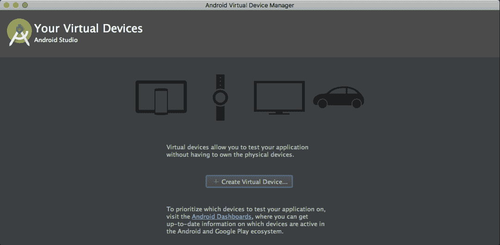
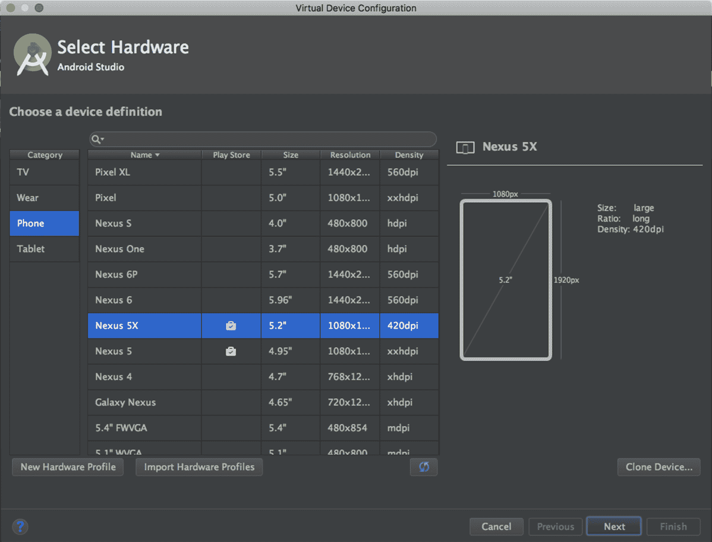
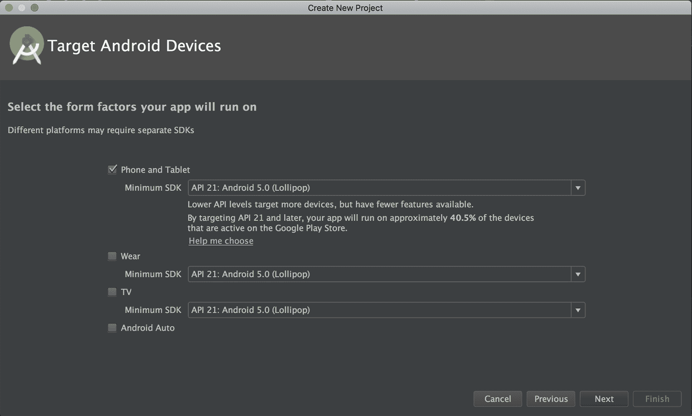
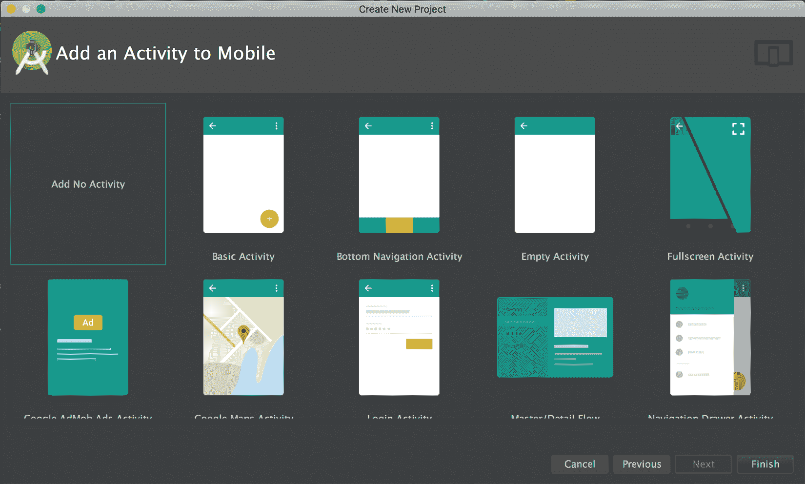
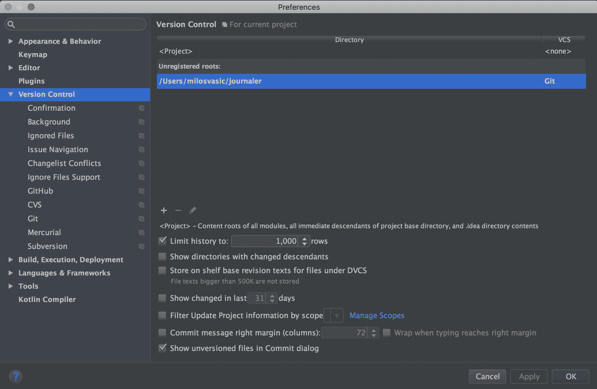
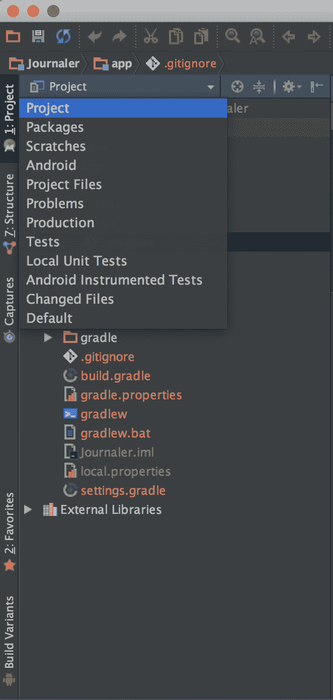

# 第一章：从 Android 开始

**Kotlin**已被 Google 正式宣布为 Android 的一流编程语言。了解为什么 Kotlin 是新手的最佳工具，以及为什么高级 Android 开发人员首先采用 Kotlin。

在本章中，您将学习如何设置工作环境。您将安装和运行 Android Studio，并设置 Android SDK 和 Kotlin。在这里，您还将介绍一些重要和有用的工具，如**Android 调试桥**（**adb**）。

由于您尚未拥有项目，您将设置它。您将初始化一个 Git 存储库以跟踪代码中的更改，并创建一个空项目。您将使其支持 Kotlin，并添加我们将使用的其他库的支持。

在我们初始化了存储库和项目之后，我们将浏览项目结构并解释 IDE 生成的每个文件。最后，您将创建您的第一个屏幕并查看它。

本章将涵盖以下要点：

+   为 Git 和 Gradle 基础开发环境设置

+   使用 Android 清单

+   Android 模拟器

+   Android 工具

# 为什么选择 Kotlin？

在我们开始我们的旅程之前，我们将回答章节标题中的问题--为什么选择 Kotlin？Kotlin 是由 JetBrains 开发的一种新的编程语言，该公司开发了 IntelliJ IDEA。Kotlin 简洁易懂，与 Java 一样将所有内容编译为字节码。它还可以编译为 JavaScript 或本机代码！

Kotlin 来自行业专业人士，并解决程序员每天面临的问题。它易于开始和采用！IntelliJ 配备了一个 Java 到 Kotlin 转换器工具。您可以逐个文件转换 Java 代码文件，一切仍将无缝运行。

它是可互操作的，并且可以使用任何现有的 Java 框架或库。可互操作性无可挑剔，不需要包装器或适配器层。Kotlin 支持构建系统，如 Gradle、Maven、Kobalt、Ant 和 Griffon，并提供外部支持。

对我们来说，关于 Kotlin 最重要的是它与 Android 完美配合。

一些最令人印象深刻的 Kotlin 功能如下：

+   空安全

+   异常是未经检查的

+   类型推断在任何地方都适用

+   一行函数占一行

+   开箱即用生成的 getter 和 setter

+   我们可以在类外定义函数

+   数据类

+   函数式编程支持

+   扩展函数

+   Kotlin 使用 Markdown 而不是 HTML 来编写 API 文档！ Dokka 工具是 Javadoc 的替代品，可以读取 Kotlin 和 Java 源代码并生成组合文档

+   Kotlin 比 Java 有更好的泛型支持

+   可靠且高性能的并发编程

+   字符串模式

+   命名方法参数

# Kotlin for Android - 官方

2017 年 5 月 17 日，Google 宣布将 Kotlin 作为 Java 虚拟机的一种静态类型编程语言，成为编写 Android 应用程序的一流语言。

下一个版本的 Android Studio（3.0，当前版本为 2.3.3）将直接支持 Kotlin。Google 将致力于 Kotlin 的未来。

重要的是要注意，这只是一种附加语言，而不是现有 Java 和 C++支持的替代品（目前）。

# 下载和配置 Android Studio

为了开发我们的应用程序，我们将需要一些工具。首先，我们需要一个集成开发环境。为此，我们将使用 Android Studio。Android Studio 提供了在各种类型的 Android 设备上构建应用程序的最快速工具。

Android Studio 提供专业的代码编辑、调试和性能工具。这是一个灵活的构建系统，可以让您专注于构建高质量的应用程序。

设置 Android Studio 只需点击几下。在我们继续之前，您需要为您的操作系统下载以下版本：

[`developer.android.com/studio/index.html`](https://developer.android.com/studio/index.html)

以下是 macOS、Linux 和 Windows 的说明：

**macOS**：

要在 macOS 上安装它，请按照以下步骤操作：

1.  启动 Android Studio 的 DMG 文件。

1.  将 Android Studio 拖放到“应用程序”文件夹中。

1.  启动 Android Studio。

1.  选择是否要导入以前的 Android Studio 设置。

1.  单击确定。

1.  按照说明进行，直到 Android Studio 准备就绪。

**Linux：**要在 Linux 上安装它，请按照以下步骤进行：

1.  将下载的存档解压到适合您的应用程序的位置。

1.  导航到`bin/directory/`。

1.  执行`/studio.sh`。

1.  选择是否要导入以前的 Android Studio 设置。

1.  单击确定。

1.  按照说明进行，直到 Android Studio 准备就绪。

1.  可选地，从菜单栏中选择工具|创建桌面条目。

如果您正在运行 Ubuntu 的 64 位版本，则需要使用以下命令安装一些 32 位库：

使用`sudo apt-get install libc6:i386 libncurses5:i386 libstdc++6:i386 lib32z1 libbz2-1.0:i386`命令安装所需的 32 位库。

如果您正在运行 64 位的 Fedora，则命令如下：

`**sudo yum install zlib.i686 ncurses-libs.i686 bzip2-libs.i686**`

**Windows：**要在 Windows 上安装它，请按照以下步骤进行：

1.  执行您下载的`.exe`文件。

1.  按照说明进行，直到 Android Studio 准备就绪。

# 设置 Android 模拟器

Android SDK 带有能够运行我们开发的应用程序的**模拟器**。我们需要它来进行我们的项目！模拟器的目的是模拟设备并在计算机上显示其所有活动。我们可以用它做什么？我们可以进行原型设计、开发和测试——所有这些都不需要硬件设备。您可以模拟手机、平板电脑、可穿戴设备和电视设备。您可以创建自己的设备定义，或者您可以使用预定义的模拟器。

模拟器的好处是速度快。在许多情况下，运行应用程序的模拟器实例所需的时间比在真实硬件设备上运行要少。

使用模拟器与真实硬件设备一样容易。对于手势，您可以使用鼠标，对于输入，您可以使用键盘。

模拟器可以做任何真实手机可以做的事情！您可以轻松发送来电和短信！您可以指定设备的位置，发送指纹扫描，调整网络速度和状态，甚至模拟电池属性。模拟器可以有一个虚拟 SD 卡和内部数据存储，您可以使用它们来发送真实文件到该空间。

**Android 虚拟设备**（**AVD**）配置用于定义模拟器。每个 AVD 实例都作为一个完全独立的设备！为了创建和管理 AVD，我们使用 AVD Manager。AVD 定义包含硬件配置文件、系统映像、存储区域、外观和其他重要属性。

让我们来玩一下！要运行 AVD Manager，请执行以下操作之一：

选择**工具**|**Android**|**AVDManager**或单击工具栏中的**AVDManager**图标：



它显示您已经定义的所有 AVD。正如您所看到的，我们还没有任何 AVD！

我们在这里可以做什么？我们可以做以下事情：

+   创建一个新的 AVD

+   编辑现有的 AVD

+   删除现有的 AVD

+   创建硬件配置文件

+   编辑现有的硬件配置文件

+   删除现有的硬件配置文件

+   导入/导出定义

+   启动或停止 AVD

+   清除数据并重置 AVD

+   访问文件系统上的 AVD`.ini`和`.img`文件

+   查看 AVD 配置详细信息

要获取 AVD 实例，您可以从头开始创建一个新的 AVD，也可以复制现有的 AVD 并根据需要进行修改。

# 创建一个新的 AVD 实例

从 AVD Manager 的**您的虚拟设备**中，单击创建虚拟设备（您可以在 Android Studio 中运行应用程序时执行相同操作，方法是单击运行图标，然后在选择部署目标对话框中选择创建新模拟器）。请参考以下截图：



选择一个硬件配置文件，然后单击下一步，如前面的截图所示。


如果您注意到系统映像旁边的下载链接，则必须单击它。下载过程开始，如下屏幕截图所示：


我们必须注意目标设备的 API 级别非常重要！您的应用程序无法在其 API 级别低于应用程序所需级别的系统映像上运行。该属性在您的 Gradle 配置中指定。稍后我们将详细介绍 Gradle。

最后，出现“验证配置”：


如有需要，请更改 AVD 属性，然后单击“完成”以完成向导。新创建的 AVD 将显示在“您的虚拟设备”列表或“选择部署目标”对话框中，具体取决于您从何处访问向导。


如果您需要创建现有 AVD 的副本，请按照以下说明进行操作：

1.  打开 AVD 管理器，右键单击 AVD 实例，然后选择“复制”。

1.  按照向导的指示，在您修改所需内容后，单击“完成”。

1.  我们的 AVD 列表中出现了一个新的修改版本。

我们将通过从头开始创建一个新的硬件配置文件来演示处理硬件配置文件。要创建新的硬件配置文件，请按照以下说明进行操作。在“选择硬件”中，单击“新硬件配置文件”。请参考以下屏幕截图：


配置硬件配置文件出现。根据需要调整硬件配置文件属性。单击“完成”。您新创建的硬件配置文件将显示。

# 通过复制现有的 AVD 并根据需要进行修改

如果您需要基于现有硬件配置文件的硬件配置文件，请按照以下说明进行操作：

1.  选择现有的硬件配置文件，然后单击“克隆设备”。

1.  根据您的需求更新硬件配置文件属性。要完成向导，请单击“完成”。

1.  您的配置文件将显示在硬件配置文件列表中。

让我们回到 AVD 列表。在这里，您可以对任何现有的 AVD 执行以下操作：

+   单击“编辑”进行编辑

+   通过右键单击并选择删除来删除

+   通过右键单击 AVD 实例并选择在磁盘上显示来访问磁盘上的.ini 和.img 文件

+   要查看 AVD 配置详细信息，请右键单击 AVD 实例，然后选择“查看详细信息”

既然我们已经涵盖了这一点，让我们回到硬件配置文件列表。在这里，我们可以执行以下操作：

+   通过选择它并选择编辑设备来编辑硬件配置文件

+   通过右键单击并选择删除来删除硬件配置文件

您无法编辑或删除预定义的硬件配置文件！

然后，我们可以运行或停止模拟器，或者清除其数据，如下所示：

+   要运行使用 AVD 的模拟器，请双击 AVD 或只需选择“启动”

+   右键单击它并选择停止以停止它

+   要清除模拟器的数据，并将其返回到首次定义时的状态，请右键单击 AVD 并选择“擦除数据”

我们将继续介绍与`* -`一起使用的命令行功能，您可以使用这些功能。

要启动模拟器，请使用模拟器命令。我们将向您展示一些从终端启动虚拟设备的基本命令行语法：

```kt
emulator -avd avd_name [ {-option [value]} ... ]
```

另一个命令行语法如下：

```kt
emulator @avd_name [ {-option [value]} ... ]
```

让我们看一下以下示例：

```kt
$ /Users/vasic/Library/Android/sdk/tools/emulator -avd Nexus_5X_API_23 -netdelay none -netspeed full
```

您可以在启动模拟器时指定启动选项；稍后，您无法设置这些选项。

如果您需要可用 AVD 的列表，请使用此命令：

```kt
emulator -list-avds
```

结果是从 Android 主目录中列出 AVD 名称。您可以通过设置`ANDROID_SDK_HOME`环境变量来覆盖默认主目录。

停止模拟器很简单-只需关闭其窗口。

重要的是要注意，我们也可以从 Android Studio UI 运行 AVD！

# Android 调试桥

要访问设备，您将使用从终端执行的`adb`命令。我们将研究常见情况。

列出所有设备：

```kt
adb devices
```

控制台输出：

```kt
List of devices attached
emulator-5554 attached
emulator-5555 attached
```

获取设备的 shell 访问：

```kt
adb shell
```

访问特定设备实例：

```kt
adb -s emulator-5554 shell
```

其中`-s`代表设备来源。

从设备复制文件：

```kt
adb pull /sdcard/images ~/images
adb push ~/images /sdcard/images
```

卸载应用程序：

```kt
adb uninstall <package.name>  
```

`adb`最大的特点之一是你可以通过 telnet 访问它。使用`telnet localhost 5554`连接到你的模拟器设备。使用`quit`或`exit`命令终止你的会话。

让我们玩玩`adb`：

+   连接到设备：

```kt
        telnet localhost 5554
```

+   改变电源等级：

```kt
        power status full
        power status charging
```

+   或模拟一个电话：

```kt
        gsm call 223344556677
```

+   发送短信：

```kt
        sms send 223344556677 Android rocks
```

+   设置地理位置：

```kt
        geo fix 22 22  
```

使用`adb`，你还可以拍摄屏幕截图或录制视频！

# 其他重要工具

我们将介绍一些你在日常 Android 开发中需要的其他工具。

让我们从以下开始：

+   `adb dumpsys`：要获取系统和运行应用程序的信息，使用`adb dumpsys`命令。要获取内存状态，执行以下命令--`adb shell dumpsys meminfo <package.name>`。

下一个重要的工具如下：

+   `adb shell procrank`：`adb shell procrank`按照它们的内存消耗顺序列出了所有的应用程序。这个命令在实时设备上不起作用；你只能连接模拟器。为了达到同样的目的，你可以使用--`adb shell dumpsys meminfo`。

+   对于电池消耗，你可以使用--`adb shell dumpsys batterystats`--charged `<package-name>`。

+   下一个重要的工具是**Systrace**。为了分析你的应用程序的性能，通过捕获和显示执行时间，你将使用这个命令。

当你遇到应用程序故障问题时，Systrace 工具将成为一个强大的盟友！

它不适用于低于 20 的 Android SDK 工具！要使用它，你必须安装和配置 Python。

让我们试试吧！

要从 UI 访问它，打开 Android Studio 中的 Android Device Monitor，然后选择 Monitor：


有时，从终端（命令行）访问它可能更容易：

Systrace 工具有不同的命令行选项，取决于你设备上运行的 Android 版本。

让我们看一些例子：

一般用法：

```kt
$ python systrace.py [options] [category1] [category2] ... [categoryN]
```

+   Android 4.3 及更高版本：

```kt
        $ python systrace.py --time=15 -o my_trace_001.html 
        sched gfx  view wm
```

+   Android 4.2 及更低版本的选项：

```kt
        $ python systrace.py --set-tags gfx,view,wm
        $ adb shell stop
        $ adb shell start
        $ python systrace.py --disk --time=15 -o my_trace_001.html
```

我们要介绍的最后一个重要工具是`sdkmanager`。它允许你查看、安装、更新和卸载 Android SDK 的包。它位于`android_sdk/tools/bin/`中。

让我们看一些常见的使用示例：

列出已安装和可用的包：

```kt
sdkmanager --list [options]
```

+   安装包：

```kt
        sdkmanager packages [options]
```

你可以发送从`--list`命令得到的包。

+   卸载：

```kt
        sdkmanager --uninstall packages [options]
```

+   更新：

```kt
        sdkmanager --update [options]
```

在 Android 中还有一些其他工具可以使用，但我们只展示了最重要的工具。

# 初始化一个 Git 仓库

我们已经安装了 Android Studio 并介绍了一些重要的 SDK 工具。我们还学会了如何处理将运行我们的代码的模拟设备。现在是时候开始着手我们的项目了。我们将开发一个用于笔记和待办事项的小应用程序。这是每个人都需要的工具。我们将给它起一个名字--`Journaler`，它将是一个能够创建带有提醒的笔记和待办事项并与我们的后端同步的应用程序。

开发的第一步是初始化一个 Git 仓库。Git 将是我们的代码版本控制系统。你可以决定是否使用 GitHub、BitBucket 或其他远程 Git 实例。创建你的远程仓库并准备好它的 URL 以及你的凭据。那么，让我们开始吧！

进入包含项目的目录：

```kt
Execute: git init .
```

控制台输出将会是这样的：

```kt
Initialized empty Git repository in <directory_you_choose/.git>
```

我们初始化了仓库。

让我们添加第一个文件--`vi notes.txt`。

填充`notes.txt`并保存一些内容。

执行`git add .`来添加所有相关文件。

+   然后：`git commit -m "Journaler: First commit"`

控制台输出将会是这样的：

```kt
[master (root-commit) 5e98ea4]  Journaler: First commit
1 file changed, 1 insertion(+)
create mode 100644 notes.txt
```

你记得，你准备好了带有凭据的远程 Git 仓库`url`。将`url`复制到剪贴板中。现在，执行以下操作：

```kt
git remote add origin <repository_url> 
```

这将设置新的远程。

+   然后：`git remote -v`

这将验证新的远程 URL。

+   最后，将我们所有的东西推送到远程：`git push -u origin master`

如果要求输入凭据，请输入并按*Enter*确认。

# 创建 Android 项目

我们初始化了我们的代码仓库。现在是创建项目的时候了。启动 Android Studio 并选择以下内容：

开始一个新的 Android Studio 项目或文件 | 新建 | 新项目。

创建新项目，会出现一个窗口。

填写应用信息：


然后，点击下一步。

勾选手机和平板选项，然后选择 Android 5.0 作为最低 Android 版本，如下所示：



再次点击下一步。

选择添加无活动，然后点击完成，如下所示：



等待项目创建完成。

你会注意到一个关于检测到未注册的 VCS 根的消息。点击添加根或转到首选项 | 版本控制 | ，然后从列表中选择我们的 Git 仓库，点击+图标，如下面的截图所示：



要确认一切，点击应用和确定。

在提交和推送之前，更新你的`.gitignore`文件。`.gitignore`文件的目的是允许你忽略文件，比如编辑器备份文件、构建产品或本地配置覆盖，你永远不想提交到仓库中。如果不符合`.gitignore`规则，这些文件将出现在 Git 状态输出的`未跟踪文件`部分中。

打开位于项目`root`目录的`.gitignore`并编辑它。要访问它，点击 Android Studio 左侧的项目，然后从下拉菜单中选择项目，如下面的截图所示：



让我们添加一些行：

```kt
.idea
.gradle
build/
gradle*
!gradle-plugins*
gradle-app.setting
!gradle-wrapper.jar
.gradletasknamecache
local.properties
gen
```

然后，编辑位于`app`模块目录中的`.gitignore`：

```kt
*.class
.mtj.tmp/

*.jar
*.war
*.ear
 hs_err_pid*
.idea/*
.DS_Store
.idea/shelf
/android.tests.dependencies
/confluence/target
/dependencies
/dist
/gh-pages
/ideaSDK
/android-studio/sdk
out
tmp
workspace.xml
*.versionsBackup
/idea/testData/debugger/tinyApp/classes*
/jps-plugin/testData/kannotator
ultimate/.DS_Store
ultimate/.idea/shelf
ultimate/dependencies
ultimate/ideaSDK
ultimate/out
ultimate/tmp
ultimate/workspace.xml
ultimate/*.versionsBackup
.idea/workspace.xml
.idea/tasks.xml
.idea/dataSources.ids
.idea/dataSources.xml
.idea/dataSources.local.xml
.idea/sqlDataSources.xml
.idea/dynamic.xml
.idea/uiDesigner.xml
.idea/gradle.xml
.idea/libraries
.idea/mongoSettings.xml
*.iws
/out/
.idea_modules/
atlassian-ide-plugin.xml
com_crashlytics_export_strings.xml
crashlytics.properties
crashlytics-build.properties
fabric.properties
target/
pom.xml.tag
pom.xml.releaseBackup
pom.xml.versionsBackup
pom.xml.next
release.properties
dependency-reduced-pom.xml
buildNumber.properties
.mvn/timing.properties
!/.mvn/wrapper/maven-wrapper.jar
samples/*
build/*
.gradle/*
!libs/*.jar
!Releases/*.jar

credentials*.gradle
gen
```

你可以使用前面的`.gitignore`配置。现在我们可以提交和推送，在 macOS 上按*cmd* + *9*，在 Windows/Linux 上按*ctrl* + *9*（View | Tool Windows | Version Control 的快捷键）。展开未版本化的文件，选择它们，右键单击添加到 VCS。


按*Cmd* + *K*（或 Windows/Linux 上的*Ctrl* + *K*），勾选所有文件，输入提交消息，然后从提交下拉菜单中选择提交和推送。如果出现换行符警告，选择修复并提交。推送提交窗口将出现。勾选推送标签，选择当前分支，然后推送。

# 设置 Gradle

Gradle 是一个构建系统。你可以在没有它的情况下构建你的 Android 应用程序，但在那种情况下，你必须自己使用几个 SDK 工具。这并不简单！这是你需要 Gradle 和 Android Gradle 插件的部分。

Gradle 接收所有源文件并通过我们提到的工具处理它们。然后，它将所有内容打包成一个带有`.apk`扩展名的压缩文件。APK 可以解压缩。如果你将它的扩展名改为`.zip`，你可以提取内容。

每个构建系统都有自己的约定。最重要的约定是将源代码和资产放在具有适当结构的适当目录中。

Gradle 是基于 JVM 的构建系统，这意味着你可以用 Java、Groovy、Kotlin 等编写自己的脚本。此外，它是一个基于插件的系统，易于扩展。一个很好的例子是谷歌的 Android 插件。你可能在项目中注意到了`build.gradle`文件。它们都是用 Groovy 编写的，所以你写的任何 Groovy 代码都会被执行。我们将定义我们的 Gradle 脚本来自动化构建过程。让我们开始构建吧！打开`settings.gradle`并查看它：

```kt
include ":App" 
```

这个指令告诉 Gradle 它将构建一个名为`App`的模块。`App`模块位于我们项目的`app`目录中。

现在打开项目`root`中的`build.gradle`并添加以下行：

```kt
    buildscript { 
      repositories { 
        jcenter() 
        mavenCentral() 
      } 
      dependencies { 
        classpath 'com.android.tools.build:gradle:2.3.3' 
        classpath 'org.jetbrains.kotlin:kotlin-gradle-plugin:1.1.3' 
      } 
    } 

    repositories { 
      jcenter() 
      mavenCentral() 
    } 
```

我们定义了我们的构建脚本将从 JCenter 和 Maven Central 仓库解析其依赖项。相同的仓库将用于解析项目依赖项。主要依赖项被添加到目标，以便针对我们将拥有的每个模块：

+   Android Gradle 插件

+   Kotlin Gradle 插件

在更新了主`build.gradle`配置之后，打开位于`App 模块`目录中的`build.gradle`并添加以下行：

```kt
    apply plugin: "com.android.application" 
    apply plugin: "kotlin-android" 
    apply plugin: "kotlin-android-extensions" 
    android { 
      compileSdkVersion 26 
      buildToolsVersion "25.0.3" 
      defaultConfig { 
        applicationId "com.journaler" 
        minSdkVersion 19 
        targetSdkVersion 26 
        versionCode 1 
        versionName "1.0" 
        testInstrumentationRunner  
        "android.support.test.runner.AndroidJUnitRunner" 
      }  
       buildTypes {     
         release {   
           minifyEnabled false    
           proguardFiles getDefaultProguardFile('proguard- 
           android.txt'), 'proguard-rules.pro'    
         }
       }    
       sourceSets {   
         main.java.srcDirs += 'src/main/kotlin'  
       }}
       repositories { 
         jcenter()  
         mavenCentral()
       }dependencies {
          compile "org.jetbrains.kotlin:kotlin-stdlib:1.1.3"  
          compile 'com.android.support:design:26+'  
          compile 'com.android.support:appcompat-v7:26+'}
```

我们设置的配置使 Kotlin 成为项目和 Gradle 脚本的开发语言。然后，它定义了应用程序所需的最小和目标 sdk 版本。在我们的情况下，最小值是`19`，目标是`26`。重要的是要注意，在默认配置部分，我们还设置了应用程序 ID 和版本参数。依赖项部分为 Kotlin 本身和一些稍后将解释的 Android UI 组件设置了依赖项。

# 解释目录结构

Android Studio 包含构建应用程序所需的一切。它包含源代码和资产。所有目录都是由我们用来创建项目的向导创建的。要查看它，请在 IDE 的左侧打开项目窗口（单击查看 | 工具窗口 | 项目），如下截图所示：


项目模块代表一组源文件、资产和构建设置，将项目分成离散的功能部分。`模块`的最小数量是一个。您的项目可以拥有的`模块`的最大数量没有实际限制。`模块`可以独立构建、测试或调试。正如您所看到的，我们定义了 Journaler 项目，只有一个名为 app 的模块。 

要添加新模块，请按照以下步骤进行：

转到文件 | 新建 | 新建模块。


可以创建以下`模块`：

+   Android 应用程序模块代表应用程序源代码、资源和设置的容器。默认模块名称是 app，就像我们创建的示例中一样。

+   手机和平板电脑模块。

+   Android Wear 模块。

+   玻璃模块。

+   Android 电视模块。

+   `Library`模块代表可重用代码的容器--一个库。该模块可以作为其他应用程序模块的依赖项使用，或者导入其他项目。构建时，该模块具有 AAR 扩展名--Android 存档，而不是 APK 扩展名。

创建新模块窗口提供以下选项：

+   **Android 库**：在 Android 项目中支持所有类型。此库的构建结果是**Android 存档**（**AAR**）。

+   **Java 库**：仅支持纯 Java。此库的构建结果是**Java 存档**（**JAR**）。

+   **Google Cloud 模块**：定义了 Google Cloud 后端代码的容器。

重要的是要理解，Gradle 将`模块`称为单独的项目。如果您的应用程序代码依赖于名为**Logger**的 Android 库的代码，那么在**build.config**中，您必须包含以下指令：

```kt
    dependencies { 
      compile project(':logger') 
    } 
```

让我们浏览项目结构。Android Studio 默认使用的视图来显示项目文件是 Android 视图。它不代表磁盘上的实际文件层次结构。它隐藏了一些不经常使用的文件或目录。

Android 视图呈现如下内容：

+   所有与构建相关的配置文件

+   所有清单文件

+   所有其他资源文件都在一个组中

在每个应用程序中，模块内容分为以下组：

+   清单和`AndroidManifest.xml`文件。

+   应用程序和测试的 Java 和 Kotlin 源代码。

+   `res`和 Android UI 资源。

+   要查看项目的实际文件结构，请选择项目视图。要执行此操作，请单击 Android 视图，然后从下拉菜单中选择项目。

通过这样做，您将看到更多的文件和目录。其中最重要的是：

+   `module-name/`：这是模块的名称

+   `build/`：这是构建输出的保存位置

+   `libs/`：这保存私有库

+   `src/`：这保存模块的所有代码和资源文件，组织在以下子目录中：

+   `main`：这保存`main`源集文件——所有构建变体共享的源代码和资源（我们稍后会解释构建变体）

+   `AndroidManifest.xml`：这定义了我们的应用程序及其各个组件的性质

+   `java`：这保存 Java 源代码

+   `kotlin`：这保存 Kotlin 源代码

+   `jni`：这保存使用**Java Native Interface**（**JNI**）的本机代码

+   `gen`：这保存 Android Studio 生成的 Java 文件

+   `res`：这保存应用程序资源，例如**drawable**文件、布局文件、字符串等

+   `assets`：这保存应该编译成`.apk`文件的文件，不进行修改

+   `test`：这保存测试源代码

+   `build.gradle`：这是模块级别的构建配置

+   `build.gradle`：这是项目级别的构建配置

选择文件|项目结构以更改以下屏幕截图中项目的设置：


它包含以下部分：

+   SDK 位置：这设置项目使用的 JDK、Android SDK 和 Android NDK 的位置。

+   项目：这设置 Gradle 和 Android Gradle 插件版本

+   模块：这编辑特定于模块的构建配置

模块部分分为以下选项卡：

+   属性：这设置模块构建所需的 SDK 和构建工具的版本

+   签名：这设置 APK 签名的证书

+   口味：这为模块定义口味

+   构建类型：这为模块定义构建类型

+   依赖项：这设置模块所需的依赖项

请参考以下屏幕截图：


# 定义构建类型和口味

我们正在接近项目的重要阶段——为我们的应用程序定义构建变体。构建变体代表 Android 应用程序的唯一版本。

它们是独特的，因为它们覆盖了一些应用程序属性或资源。

每个构建变体都是在模块级别配置的。

让我们扩展我们的`build.gradle`！将以下代码放入`build.gradle`文件的`android`部分：

```kt
    android { 
      ... 
      buildTypes { 
        debug { 
          applicationIdSuffix ".dev" 
        } 
        staging { 
          debuggable true 
          applicationIdSuffix ".sta" 
        } 
        preproduction { 
          applicationIdSuffix ".pre" 
        } 
           release {} 
        } 
       ... 
    }  
```

我们为我们的应用程序定义了以下`buildTypes`——`debug`、`release`、`staging`和`preproduction`。

产品口味的创建方式与`buildTypes`类似。您需要将它们添加到`productFlavors`并配置所需的设置。以下代码片段演示了这一点：

```kt
    android { 
      ... 
      defaultConfig {...} 
      buildTypes {...} 
      productFlavors { 
        demo { 
          applicationIdSuffix ".demo" 
          versionNameSuffix "-demo" 
        } 
        complete { 
          applicationIdSuffix ".complete" 
          versionNameSuffix "-complete" 
        } 
        special { 
          applicationIdSuffix ".special" 
          versionNameSuffix "-special" 
        } 
       } 
    } 
```

创建和配置`productFlavors`后，单击通知栏中的立即同步。

您需要等待一段时间才能完成该过程。构建变体的名称是通过`<product-flavor><Build-Type>`约定形成的。以下是一些示例：

```kt
    demoDebug 
    demoRelease 
    completeDebug 
    completeRelease 
```

您可以将构建变体更改为要构建和运行的构建变体。转到 Build，选择 Build Variant，然后从下拉菜单中选择`completeDebug`。


`Main/source`集在您的应用程序的所有构建变体之间共享。如果您需要创建新的源集，可以为特定的构建类型、产品口味及其组合进行操作。

所有源集文件和目录必须以特定方式组织，类似于`Main/Source`集。特定于您的*debug*构建类型的 Kotlin 类文件必须位于`src/debug/kotlin/directory`中。

为了学习如何组织您的文件，打开终端窗口（View | ToolWindows | Terminal）并执行以下命令行：

```kt
./gradlew sourceSets
```

仔细查看输出。报告是可以理解和自解释的。Android Studio 不会创建`sourceSets`目录。这是您必须完成的工作。

如果需要，可以使用`sourceSets`块更改 Gradle 查找源集的位置。让我们更新我们的构建配置。我们将更新以下预期的源代码路径：

```kt
    android { 
      ... 
      sourceSets { 
       main { 
       java.srcDirs = [ 
                'src/main/kotlin', 
                'src/common/kotlin', 
                'src/debug/kotlin', 
                'src/release/kotlin', 
                'src/staging/kotlin', 
                'src/preproduction/kotlin', 
                'src/debug/java', 
                'src/release/java', 
                'src/staging/java', 
                'src/preproduction/java', 
                'src/androidTest/java', 
                'src/androidTest/kotlin' 
        ] 
        ... 
     } 
```

您希望仅与某些配置一起打包的代码和资源，可以存储在`sourceSets`目录中。这里提供了使用`demoDebug`构建变体的示例；此构建变体是`demo`产品风味和`debug`构建类型的产物。在 Gradle 中，对它们给予以下优先级：

```kt
    src/demoDebug/ (build variant source set) 
    src/debug/ (build type source set) 
    src/demo/ (product flavor source set) 
    src/main/ (main source set) 
```

这是 Gradle 在构建过程中使用的优先顺序，并在应用以下构建规则时考虑它：

+   它将`java/`和`kotlin/`目录中的源代码一起编译

+   它将清单合并到一个单一的清单中

+   它合并了`values/`目录中的文件

+   它合并了`res/`和`asset/`目录中的资源

资源和清单与库模块依赖项一起包含的优先级最低。

# 附加库

我们配置了构建类型和风味，现在我们需要一些第三方库。我们将使用并添加对 Retrofit、OkHttp 和 Gson 的支持。以下是它们的说明：

+   Retrofit 是 Square, Inc.为 Android 和 Java 开发的一种类型安全的 HTTP 客户端。Retrofit 是 Android 最受欢迎的 HTTP 客户端库之一，因为它与其他库相比，简单易用且性能出色。

+   `OkHttp`是一个默认情况下高效的 HTTP 客户端--HTTP/2 支持允许所有请求与同一主机共享套接字。

+   Gson 是一个 Java 库，可用于将 Java 对象转换为其 JSON 表示。它还可以用于将 JSON 字符串转换为等效的 Java 对象。Gson 可以处理包括您没有源代码的现有对象在内的任意 Java 对象。

有一些开源项目可以将 Java 对象转换为 JSON。在本书的后面，我们将添加 Kotson 以为 Kotlin 提供 Gson 绑定。

让我们通过添加 Retrofit 和 Gson 的依赖项来扩展`build.gradle`：

```kt
    dependencies { 
      ... 
      compile 'com.google.code.gson:gson:2.8.0' 
      compile 'com.squareup.retrofit2:retrofit:2.2.0' 
      compile 'com.squareup.retrofit2:converter-gson:2.0.2' 
      compile 'com.squareup.okhttp3:okhttp:3.6.0' 
      compile 'com.squareup.okhttp3:logging-interceptor:3.6.0' 
      ... 
    } 
```

在更新 Gradle 配置后，当要求时再次同步它！

# 熟悉 Android 清单

每个应用程序必须有一个`AndroidManifest.xml`文件，文件必须具有确切的名称。它的位置在其`root`目录中，在每个模块中，它包含有关应用程序的基本信息。`manifest`文件负责定义以下内容：

+   为应用程序命名一个包

+   描述应用程序的组件--活动（屏幕）、服务、广播接收器（消息）和内容提供程序（数据库访问）

+   应用程序必须具有的权限，以便访问 Android API 的受保护部分

+   其他应用程序必须具有的权限，以便与应用程序的组件进行交互，如内容提供程序

以下代码片段显示了`manifest`文件的一般结构和它可以包含的元素：

```kt
    <?xml version="1.0" encoding="utf-8"?> 
    <manifest> 
      <uses-permission /> 
      <permission /> 
      <permission-tree /> 
      <permission-group /> 
      <instrumentation /> 
      <uses-sdk /> 
      <uses-configuration />   
      <uses-feature />   
      <supports-screens />   
      <compatible-screens />   
      <supports-gl-texture />   

      <application> 
        <activity> 
          <intent-filter> 
            <action /> 
              <category /> 
                <data /> 
            </intent-filter> 
            <meta-data /> 
        </activity> 

        <activity-alias> 
          <intent-filter> . . . </intent-filter> 
          <meta-data /> 
        </activity-alias> 

        <service> 
          <intent-filter> . . . </intent-filter> 
          <meta-data/> 
        </service> 

        <receiver> 
          <intent-filter> . . . </intent-filter> 
          <meta-data /> 
        </receiver> 
        <provider> 
          <grant-uri-permission /> 
          <meta-data /> 
          <path-permission /> 
        </provider> 

        <uses-library /> 
      </application> 
    </manifest> 
```

# 主应用程序类

每个 Android 应用程序都定义了其主要的`Application`类。Android 中的`Application`类是 Android 应用程序中包含所有其他组件（如`activities`和`services`）的基类。`Application`类或`Application`类的任何子类在创建应用程序/包的进程时都会首先实例化。

我们将为 Journaler 创建一个`Application`类。找到主要源目录。展开它，如果没有 Kotlin 源目录，请创建它。然后，创建`package com`和子包 journaler；为此，请右键单击 Kotlin 目录，然后选择**New** | **Package**。创建包结构后，右键单击**journaler**包，然后选择 New | KotlinFile/Class。命名为`Journaler`。创建了`Journaler.kt`。

每个`Application`类必须扩展 Android Application 类，就像我们的示例中所示的那样：

```kt
    package com.journaler 

    import android.app.Application 
    import android.content.Context 

    class Journaler : Application() { 

      companion object { 
        var ctx: Context? = null 
      } 

      override fun onCreate() { 
        super.onCreate() 
        ctx = applicationContext 
      } 

    } 
```

目前，我们的主`Application`类将为我们提供对应用程序上下文的静态访问。这个上下文将在以后解释。但是，Android 在清单中提到它之前不会使用这个类。打开`app`模块`android 清单`并添加以下代码块：

```kt
    <manifest http://www.w3.org/1999/xhtml" class="koboSpan" id="kobo.49.1">    res/android" package="com.journaler"> 

    <application 
        android:name=".Journaler" 
        android:allowBackup="false" 
        android:icon="@mipmap/ic_launcher" 
        android:label="@string/app_name" 
        android:roundIcon="@mipmap/ic_launcher_round" 
        android:supportsRtl="true" 
        android:theme="@style/AppTheme"> 

    </application> 
    </manifest> 
```

通过`android:name=".Journaler"`，我们告诉 Android 要使用哪个类。

# 你的第一个屏幕

我们创建了一个没有屏幕的应用程序。我们不会浪费时间，我们会创建一个！创建一个名为`activity`的新包，其中将定义所有我们的屏幕类，并创建您的第一个`Activity`类，名为`MainActivity.kt`。我们将从一个简单的类开始：

```kt
    package com.journaler.activity 

    import android.os.Bundle 
    import android.os.PersistableBundle 
    import android.support.v7.app.AppCompatActivity 
    import com.journaler.R 

    class MainActivity : AppCompatActivity() { 
      override fun onCreate(savedInstanceState: Bundle?,
      persistentState: PersistableBundle?) { 
        super.onCreate(savedInstanceState, persistentState) 
        setContentView(R.layout.activity_main) 
      } 
    } 
```

很快，我们将解释所有这些行的含义。现在，重要的是要注意`setContentView(R.layout.activity_main)`将 UI 资源分配给我们的屏幕，`activity_main`是定义它的 XML 的名称。由于我们还没有它，我们将创建它。在`main`目录下找到`res`目录。如果那里没有布局文件夹，请创建一个，然后通过右键单击`布局`目录并选择新建|布局资源文件来创建一个名为`activity_main`的新布局。将`activity_main`指定为其名称，`LinearLayout`指定为其根元素。文件的内容应该类似于这样：

```kt
    <?xml version="1.0" encoding="utf-8"?> 
    <LinearLayout http://www.w3.org/1999/xhtml" class="koboSpan" id="kobo.34.1">     apk/res/android" 
      android:orientation="vertical" 
      android:layout_width="match_parent" 
      android:layout_height="match_parent"> 

   </LinearLayout> 
```

在我们准备运行应用程序之前，还有一件事要做：我们必须告诉清单关于这个屏幕。打开`主清单`文件并添加以下代码：

```kt
    <application ... > 
      <activity 
        android:name=".activity.MainActivity" 
        android:configChanges="orientation" 
        android:screenOrientation="portrait"> 
        <intent-filter> 
          <action android:name="android.intent.action.MAIN" /> 
          <category android:name="android.intent.category.LAUNCHER" /> 
        </intent-filter> 
      </activity> 
    </application> 
```

我们很快会解释所有这些属性；现在你需要知道的是你的应用程序已经准备好运行了。但是，在此之前，`提交并推送`你的工作。你不想丢失它！

# 总结

在本章中，我们介绍了 Android 的基础知识，并展示了 Kotlin 的一瞥。我们配置了一个工作环境，并制作了我们应用程序的第一个屏幕。

在下一章中，我们将深入探讨 Android 的问题。您将学习如何构建您的应用程序并自定义不同的变体。我们还将介绍运行应用程序的不同方式。
