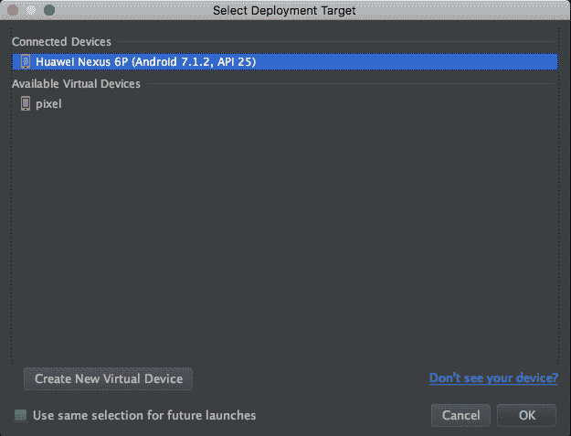
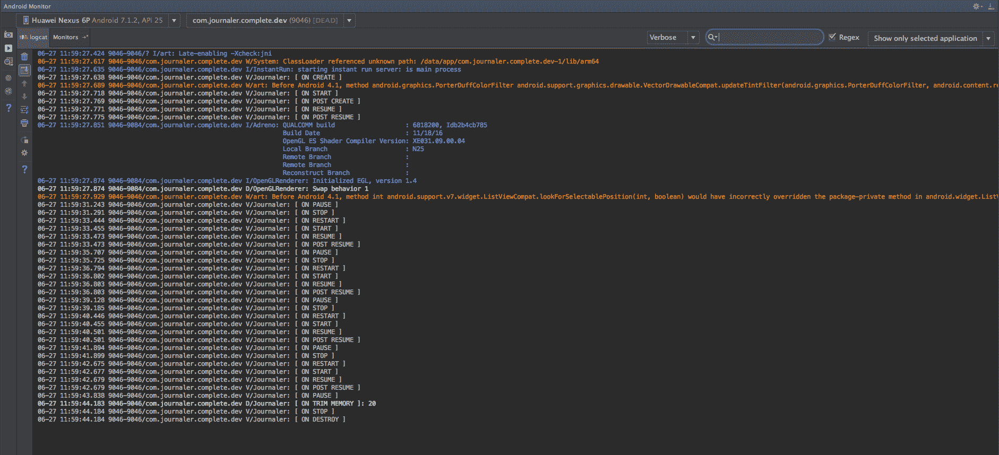
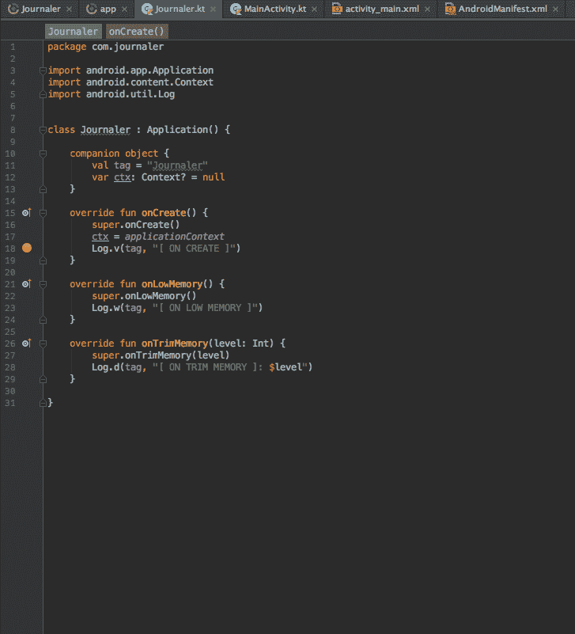
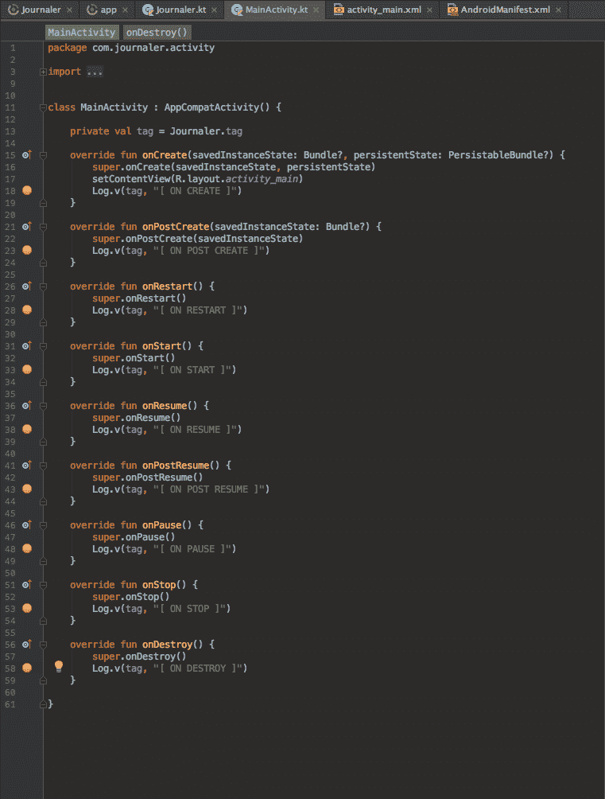

# 第二章：构建和运行

在这一点上，您已成功创建了一个包含一个屏幕的 Android 项目。在上一章中，您还学会了如何设置您的工作环境。我们向您展示了使用 Android 工具是多么简单。您还定义了一些风味和构建类型。让我们控制它！现在是时候进行您的第一个构建并在设备或模拟器上运行它了。您将尝试使用所有构建类型和风味组合。

本章将涵盖以下内容：

+   在模拟器和/或实际硬件设备上运行您的应用程序

+   Logcat 简介

+   Gradle 工具

# 运行您的第一个 Android 应用程序

我们制作了我们的第一个屏幕，并为应用程序本身定义了一些具体内容。为了确保我们迄今为止所做的一切都没问题，我们将构建并运行我们的应用程序。我们将运行 completeDebug 构建变体。如果您忘记了如何切换到这个构建变体，我们会提醒您。打开 Android Studio 和`Journaler`项目。通过单击 Android Studio 窗口左侧的 Build Variants 窗格或选择 View | Tool Windows | Build Variants 来打开 Build Variants 窗格。Build Variants 窗格将出现。选择下拉列表中的 completeDebug，如屏幕截图所示：


我们将使用这个构建变体作为我们的主要构建变体进行尝试执行，对于生产构建，我们将使用 completeDebug 构建变体。在我们从下拉列表中选择构建变体之后，Gradle 需要一些时间来构建所选择的变体。

我们现在将运行我们的应用程序。我们将首先在模拟器上运行，然后在实际设备上运行。通过打开 AVD Manager 来启动您的模拟器实例。单击 AVD Manager 图标来打开它。这是最快的打开方式。双击 AVD 实例。直到您的模拟器准备就绪，这需要一些时间。模拟器执行 Android 系统引导，然后加载默认应用程序启动器。

您的模拟器已启动并准备运行应用程序。为了运行应用程序，单击运行图标或导航到 Run | Run 'app'。

有一个键盘快捷键；在 macOS 上，它是*Ctrl* + *R*。

当应用程序运行时，会出现“选择部署目标”对话框。如果您有多个实例可以运行应用程序，您可以选择其中一个，如下面的屏幕截图所示：



选择您的部署目标并单击“确定”。如果您想记住您的选择，请勾选“将来启动时使用相同的选择”。应用程序需要一些时间来运行，但几秒钟后，您的应用程序就会出现！

# 了解 Logcat

Logcat 是日常开发的重要组成部分。它的目的是显示来自您设备的所有日志。它显示来自模拟器或连接的实际设备的日志。Android 有几个级别的日志消息：

+   断言

+   冗长的

+   调试

+   信息

+   警告

+   错误

您可以通过这些日志级别（例如，当您需要仅查看错误--应用程序崩溃堆栈跟踪时）或日志标签（我们稍后会解释）或关键字、正则表达式或应用程序包来过滤日志消息。在应用任何过滤器之前，我们将配置 Android Studio，以便日志消息以不同的颜色显示。

选择 Android Studio | Preferences。在搜索字段中输入`Logcat`。Logcat 着色首选项将出现，如下面的屏幕截图所示：


要编辑颜色，您必须保存当前颜色主题的副本。从下拉列表中选择您的主题，然后选择“另存为”。选择一个合适的名称并确认：


从列表中选择断言，并取消选中使用继承的属性以覆盖颜色。确保前景选项被选中，并点击位于复选框右侧的颜色来选择日志文本的新颜色。我们将选择一些粉色的色调，如下面的截图所示：


对于断言级别，你可以手动输入十六进制代码：`FF6B68`。为了最大的可读性，我们建议以下颜色：

+   断言：`#FF6B68`

+   冗长：`#BBBBBB`

+   调试：`#F4F4F4`

+   信息：`#6D82E3`

+   警告：`#E57E15`

+   错误：`#FF1A11`

要应用更改，点击应用，然后点击确定。

打开 Android Monitor（View | Tool Windows | Android Monitor）并查看在 Logcat 窗格中打印的消息。它们以不同的色调着色，每个日志级别都不同，如下所示：


现在我们将定义我们自己的日志消息，这也是一个与 Android 生命周期一起工作的好机会。我们将为我们创建的`Application`类和屏幕（活动）的每个生命周期事件放置适当的日志消息。

打开你的主`Application`类，`Journaler.kt`。扩展代码如下：

```kt
    class Journaler : Application() { 

      companion object { 
        val tag = "Journaler" 
        var ctx: Context? = null 
      } 

      override fun onCreate() { 
        super.onCreate() 
        ctx = applicationContext 
        Log.v(tag, "[ ON CREATE ]") 
      } 

      override fun onLowMemory() { 
        super.onLowMemory() 
        Log.w(tag, "[ ON LOW MEMORY ]") 
      } 

      override fun onTrimMemory(level: Int) { 
        super.onTrimMemory(level) 
        Log.d(tag, "[ ON TRIM MEMORY ]: $level") 
     } 
    } 
```

在这里，我们引入了一些重要的更改。我们重写了`onCreate()`应用程序的主要生命周期事件。我们还重写了另外两个方法：`onLowMemory()`，在内存紧张的情况下触发（正在运行的进程应该减少内存使用），以及`onTrimMemory()`，当内存被修剪时。

为了记录我们应用程序中的事件，我们使用`Log`类的静态方法，每个方法都暴露了适当的日志级别。基于此，我们有以下方法暴露：

+   对于冗长级别：

```kt
        v(String tag, String msg) 
        v(String tag, String msg, Throwable tr) 
```

+   对于调试级别：

```kt
        d(String tag, String msg) 
        d(String tag, String msg, Throwable tr) 
```

+   对于信息级别：

```kt
        i(String tag, String msg) 
        i(String tag, String msg, Throwable tr) 
```

+   对于警告级别：

```kt
        w(String tag, String msg) 
        w(String tag, String msg, Throwable tr) 
```

+   对于错误级别：

```kt
        e(String tag, String msg) 
        e(String tag, String msg, Throwable tr) 
```

方法接受以下参数：

+   `标签`：用于标识日志消息的来源

+   `message`: 这是我们想要记录的消息

+   `throwable`: 这代表要记录的异常

除了这些日志方法，还有一些其他方法可以使用：

+   `wtf(String tag, String msg)`

+   `wtf(String tag, Throwable tr)`

+   `wtf(String tag, String msg, Throwable tr)`

**Wtf**代表**What a Terrible Failure**！`Wtf`用于报告不应该发生的异常！

我们将继续使用`Log`类。打开到目前为止创建的唯一屏幕，并使用以下更改更新`MainActivity`类：

```kt
    class MainActivity : AppCompatActivity() { 
      private val tag = Journaler.tag 

      override fun onCreate( 
        savedInstanceState: Bundle?,  
        persistentState: PersistableBundle? 
       ) { 
          super.onCreate(savedInstanceState, persistentState) 
          setContentView(R.layout.activity_main) 
          Log.v(tag, "[ ON CREATE ]") 
         } 

       override fun onPostCreate(savedInstanceState: Bundle?) { 
         super.onPostCreate(savedInstanceState) 
         Log.v(tag, "[ ON POST CREATE ]") 
       } 

       override fun onRestart() { 
         super.onRestart() 
         Log.v(tag, "[ ON RESTART ]") 
       } 

       override fun onStart() { 
         super.onStart() 
         Log.v(tag, "[ ON START ]") 
       } 

       override fun onResume() { 
         super.onResume() 
         Log.v(tag, "[ ON RESUME ]") 
       } 

       override fun onPostResume() { 
         super.onPostResume() 
         Log.v(tag, "[ ON POST RESUME ]") 
       } 

       override fun onPause() { 
        super.onPause() 
        Log.v(tag, "[ ON PAUSE ]") 
      } 

      override fun onStop() { 
        super.onStop() 
        Log.v(tag, "[ ON STOP ]") 
      } 

      override fun onDestroy() { 
        super.onDestroy() 
        Log.v(tag, "[ ON DESTROY ]") 
      } 
    } 
```

我们按照活动生命周期中它们执行的顺序重写了所有重要的生命周期方法。对于每个事件，我们打印适当的日志消息。让我们解释生命周期的目的和每个重要事件。

在这里，你可以看到来自 Android 开发者网站的官方图表，解释了活动的生命周期：


你可以在[`developer.android.com/images/activity_lifecycle.png`](https://developer.android.com/images/activity_lifecycle.png)找到这张图片：

+   `onCreate()`: 当活动第一次创建时执行。这通常是我们初始化主要 UI 元素的地方。

+   `onRestart()`: 如果你的活动在某个时刻停止然后恢复，这将被执行。例如，你关闭手机屏幕（锁定它），然后再次解锁。

+   `onStart()`: 当屏幕对应用程序用户可见时执行。

+   `onResume()`: 当用户开始与活动交互时执行。

+   `onPause()`: 在我们恢复之前的活动之前，这个方法在当前活动上执行。这是一个保存所有你在下次恢复时需要的信息的好地方。如果有任何未保存的更改，你应该在这里保存它们。

+   `onStop()`: 当活动对应用程序用户不再可见时执行。

+   `onDestroy()`：这是在 Android 销毁活动之前执行的。例如，如果有人执行了`Activity`类的`finish()`方法，就会发生这种情况。要知道活动是否在特定时刻结束，Android 提供了一个检查的方法：`isFinishing()`。如果活动正在结束，该方法将返回布尔值`true`。

现在，当我们使用 Android 生命周期编写了一些代码并放置了适当的日志消息后，我们将执行两个用例，并查看 Logcat 打印出的日志。

# 第一种情况

运行您的应用程序。然后只需返回并离开。关闭应用程序。打开 Android Monitor，并从设备下拉列表中选择您的设备实例（模拟器或真实设备）。从下一个下拉列表中，选择 Journaler 应用程序包。观察以下 Logcat 输出：


您会注意到我们在源代码中放置的日志消息。

让我们检查一下在我们与应用程序交互期间我们进入`onCreate()`和`onDestroy()`方法的次数。将光标放在搜索字段上，然后键入`on create`。观察内容的变化--我们预期会有两个条目，但只有一个：一个是主`Application`类的条目，另一个是主活动的条目。为什么会发生这种情况？我们稍后会找出原因：


我们的输出包含什么？它包含以下内容：

`06-27`：这是事件发生的日期。

`11:37:59.914`：这是事件发生的时间。

`6713-6713/?`：这是带有包的进程和线程标识符。如果应用程序只有一个线程，进程和线程标识符是相同的。

`V/Journaler`：这是日志级别和标记。

`[ ON CREATE ]`：这是日志消息。

将过滤器更改为`on destroy`。内容更改为以下内容：

`**06-27 11:38:07.317 6713-6713/com.journaler.complete.dev V/Journaler: [ ON DESTROY ]**`

在你的情况下，你会有不同的日期、时间和 pid/tid 值。

从下拉列表中，将过滤器从 Verbose 更改为 Warn。保持过滤器的值！您会注意到您的 Logcat 现在是空的。这是因为没有警告消息包含`on destroy`的消息文本。删除过滤器文本并返回到 Verbose 级别。

运行您的应用程序。锁定屏幕并连续解锁几次。然后，关闭并终止 Journaler 应用程序。观察以下 Logcat 输出：



正如您所看到的，它明显地进入了暂停和恢复的生命周期状态。最后，我们终止了我们的应用程序，并触发了一个`onDestroy()`事件。您可以在 Logcat 中看到它。

如果对您来说更容易，您可以从终端使用 Logcat。打开终端并执行以下命令行：

```kt
adb logcat
```

# 使用 Gradle 构建工具

在我们的开发过程中，我们需要构建不同的构建变体或运行测试。如果需要，这些测试可以仅针对某些构建变体执行，或者针对所有构建变体执行。

在以下示例中，我们将涵盖一些最常见的 Gradle 用例。我们将从清理和构建开始。

正如您记得的，Journaler 应用程序定义了以下构建类型：

+   调试

+   发布

+   暂存

+   预生产

Journaler 应用程序中还定义了以下构建风味：

+   演示

+   完成

+   特殊

打开终端。要删除到目前为止构建的所有内容和所有临时构建派生物，请执行以下命令行：

```kt
./gradlew clean
```

清理需要一些时间。然后执行以下命令行：

```kt
./gradlew assemble.
```

这将组装所有--我们应用程序中拥有的所有构建变体。想象一下，如果我们正在处理一个非常庞大的项目，它可能会产生什么时间影响。因此，我们将`隔离`构建命令。要仅构建调试构建类型，请执行以下命令行：

```kt
./gradlew assembleDebug 
```

这将比上一个例子执行得快得多！这为调试构建类型构建了所有的 flavor。为了更有效，我们将指示 Gradle 我们只对调试构建类型的完整构建 flavor 感兴趣。执行这个：

```kt
./gradlew assembleCompleteDebug
```

这将执行得更快。在这里，我们将提到几个更重要的 Gradle 命令：

要运行所有单元测试，请执行：

```kt
./gradlew test 
```

如果你想为特定的构建变体运行单元测试，请执行以下命令：

```kt
./gradlew testCompleteDebug
```

在 Android 中，我们可以在真实设备实例或模拟器上运行测试。通常，这些测试可以访问一些 Android 组件。要执行这些（仪器）测试，你可以使用以下示例中显示的命令：

```kt
./gradlew connectedCompleteDebug
```

你将在本书的最后章节中找到更多关于测试和测试 Android 应用程序的内容。

# 调试你的应用程序

现在，我们知道如何记录重要的应用程序消息。在开发过程中，当分析应用程序行为或调查 bug 时，仅仅记录消息是不够的。

对我们来说，能够在真实的 Android 设备或模拟器上执行应用程序代码时进行调试是很重要的。所以，让我们来调试一些东西！

打开主`Application`类，并在我们记录`onCreate()`方法的行上设置断点，如下所示：



正如你所看到的，我们在第 18 行设置了断点。我们将添加更多断点。让我们在我们的主（也是唯一的）活动中添加。在我们执行日志记录的行上的每个生命周期事件中放置一个断点。



我们在第 18、23、28、33、38 行设置了断点。通过点击调试图标或选择运行|调试应用程序，在调试模式下运行应用程序。应用程序以调试模式启动。稍等一会儿，调试器很快就会进入我们设置的第一个断点。

以下的截图说明了这一点：


正如你所看到的，`Application`类的`onCreate()`方法是我们进入的第一个方法。让我们检查一下我们的应用程序是否按预期进入了生命周期方法。点击调试器窗格中的恢复程序图标。你可能会注意到，我们没有进入主活动的`onCreate()`方法！我们在主`Application`类的`onCreate()`方法之后进入了`onStart()`。恭喜你！你刚刚发现了你的第一个 Android bug！为什么会发生这种情况呢？我们使用了错误的`onCreate()`方法版本，而不是使用以下代码行：

```kt
    void onCreate(@Nullable Bundle savedInstanceState) 
```

我们不小心重写了这个：

```kt
     onCreate(Bundle savedInstanceState, PersistableBundle 
     persistentState) 
```

多亏了调试，我们发现了这个！通过点击调试器窗格中的停止图标来停止调试器并修复代码。将代码行更改为这样：

```kt
    override fun onCreate(savedInstanceState: Bundle?) { 
      super.onCreate(savedInstanceState) 
      setContentView(R.layout.activity_main) 
      Log.v(tag, "[ ON CREATE 1 ]") 
    } 

    override fun onCreate(savedInstanceState: Bundle?, 
    persistentState: PersistableBundle?) { 
      super.onCreate(savedInstanceState, persistentState) 
      Log.v(tag, "[ ON CREATE 2 ]") 
    } 
```

我们更新了我们的日志消息，这样我们就可以跟踪进入`onCreate()`方法的两个版本。保存你的更改，并以调试模式重新启动应用程序。不要忘记为两个`onCreate()`方法重写设置断点！逐个通过断点。现在我们按预期的顺序进入了所有断点。

要查看所有断点，请点击查看断点图标。断点窗口会出现，如下所示：


双击断点，你将定位到设置断点的行。停止调试器。

想象一下，您可以继续开发您的应用程序两年。您的应用程序变得非常庞大，并且还执行一些昂贵的操作。直接在调试模式下运行它可能非常困难和耗时。直到它进入我们感兴趣的断点之前，我们将浪费大量时间。我们能做些什么呢？在调试模式下运行的应用程序速度较慢，而我们的应用程序又又大又慢。如何跳过我们正在浪费宝贵时间的部分？我们将进行演示。通过单击运行图标或选择运行|运行'app'来运行您的应用程序。应用程序在我们的部署目标（真实设备或模拟器）上执行并启动。通过单击附加调试器到 Android 进程图标或选择运行|附加调试器到 Android 来将调试器附加到您的应用程序。选择出现的进程窗口：


通过双击其包名称来选择我们的应用程序过程。调试器窗格出现。从您的应用程序中，尝试返回。**调试器**进入主活动的`onPause()`方法。停止调试器。

# 总结

在这一章中，您学会了如何从 Android Studio IDE 或直接从终端构建和运行应用程序。我们还分析了一些来自模拟器和真实设备的日志。最后，我们进行了一些调试。

在下一章中，我们将熟悉一些 UI 组件--屏幕，更准确地说。我们将向您展示如何创建新屏幕以及如何为它们添加一些时尚细节。我们还将讨论按钮和图像的复杂布局。
