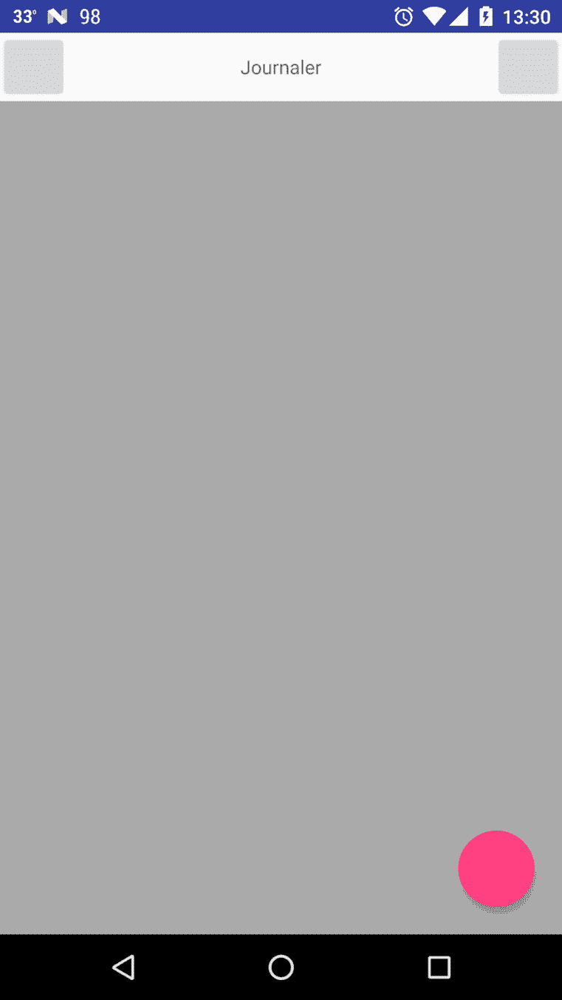
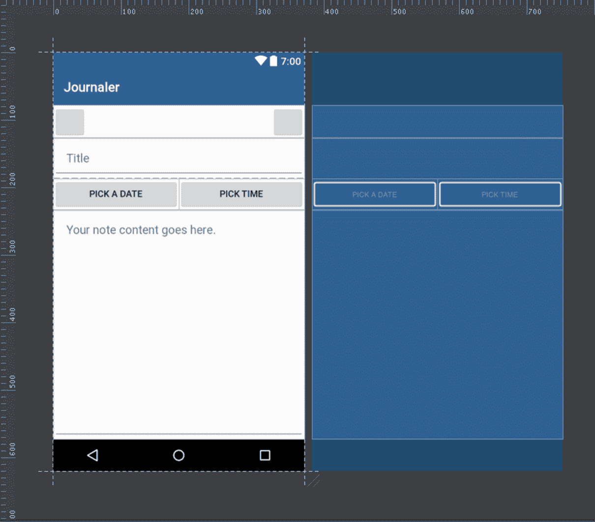
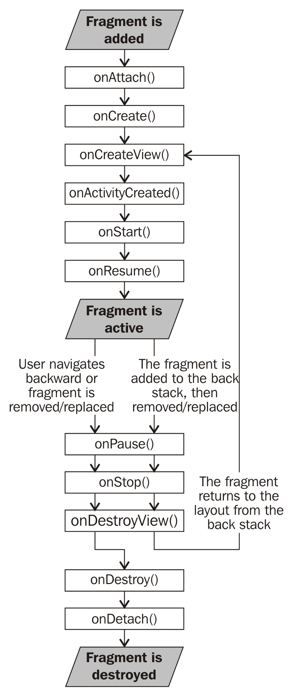
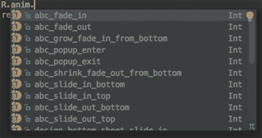

# 第三章：屏幕

一个只有简单用户界面的屏幕一点也不令人兴奋。然而，在你进行眼睛糖样式和*哇*效果之前，你需要创建更多包含专业开发应用程序必须具有的所有元素的屏幕。你在日常生活中使用的现代应用程序中都可以看到这一点。在上一章中，我们构建并运行了我们的项目。这种技能很重要，这样我们才能继续我们的进展。现在你将在你的应用程序中添加一个 UI！

在本章中，我们将涵盖以下主题：

+   分析模拟

+   定义应用程序活动

+   Android 布局

+   Android 上下文

+   片段、片段管理器和堆栈

+   视图翻页器

+   事务、对话框片段和通知

+   其他重要的 UI 组件

# 分析模拟计划

事情正在变得有趣！我们准备开始一些严肃的开发！我们将为我们的应用程序创建所有的屏幕。然而，在我们创建它们之前，我们将创建并分析一个模拟，这样我们就知道我们将创建什么。模拟将代表基本的应用程序线框，没有设计。它只是屏幕和它们之间的关系的布局。要创建一个带有线框的好模拟，你需要一个工具。任何能够画线的工具都可以胜任。为了绘制我们的模拟，我们使用了**Pencil**。Pencil 是一个提供 GUI 原型的免费开源应用程序。

让我们来看看我们的模拟：


正如你所看到的，模拟呈现了一个相对简单的应用程序，具有一些屏幕。这些屏幕将包含不同的组件，我们将在每个屏幕中解释这些组件。让我们来看看模拟。

第一个屏幕，标题为登陆界面，将是我们的主要应用程序屏幕。每次进入应用程序时，都会出现此屏幕。我们已经定义了`MainActivity`类。这个活动将代表这个屏幕。很快，我们将扩展代码，使活动完全按照模拟进行。

屏幕的中心部分将是包含我们创建的所有项目的列表。每个项目将包含基本属性，如标题或日期和时间。我们将能够按类型过滤项目。我们将只能过滤笔记或 TODO。笔记和 TODO 之间的区别在于 TODO 将代表具有分配的*日期*和*时间*的任务。我们还将支持一些功能，如长按事件。在每个项目上的长按事件将呈现一个弹出菜单，其中包含编辑、删除或完成选项。点击编辑将打开更新屏幕。

在右下角，我们将有一个+按钮。该按钮的目的是打开选项对话框，用户可以选择他们想要创建笔记还是 TODO 任务。根据选项，用户可以选择出现的屏幕之一--添加笔记屏幕或添加 TODO 屏幕。

登陆界面还包含位于左上角的滑动菜单按钮。点击该按钮将打开滑动菜单，其中包含以下项目：

+   一个带有应用程序标题和版本的应用程序图标

+   一个今天的按钮，用于仅过滤分配给当前日期的 TODO 项目

+   一个下一个 7 天的按钮，用于过滤分配给下一个 7 天的 TODO 项目，包括当前的日期

+   一个 TODO 按钮仅过滤 TODO 项目

+   笔记按钮将仅过滤笔记项目

应用一些过滤器将影响我们通过点击登陆界面右上角获得的弹出菜单中的复选框。此外，选中和取消选中这些复选框将修改当前应用的过滤器。

滑动菜单中的最后一项是立即同步。点击此按钮将触发同步，并将所有未同步的项目与后端进行同步。

现在我们将解释两个负责创建（或编辑）笔记和 TODO 的屏幕：

+   添加/编辑笔记屏幕：用于创建新的笔记或更新现有内容。当编辑文本字段聚焦时，键盘将打开。由于我们计划立即应用我们所做的所有更改，因此没有保存或更新按钮。在此屏幕上，左上角和右上角的按钮也被禁用。

+   添加/编辑 TODO 屏幕：用于创建新的 TODO 应用程序或更新现有内容。键盘将像前面的示例一样打开。也没有像前面的示例中显示的保存或更新按钮。左上角和右上角的按钮也被禁用。在标题视图之后，我们有按钮来选择日期和时间。默认情况下，它们将设置为当前日期和时间。打开键盘将推动这些按钮。

我们已经涵盖了基本的 UI 和通过分析这个模型我们想要实现的内容。现在是时候创建一些新的屏幕了。

# 定义应用程序活动

总之，我们将有三个活动：

+   登陆活动（`MainActivty.kt`）

+   添加/编辑笔记屏幕

+   添加/编辑 TODO 屏幕

在 Android 开发中，通常会创建一个活动，作为所有其他活动的父类，因为这样，我们将减少代码库，并同时与多个活动共享。在大多数情况下，Android 开发人员称之为`BaseActivity`。我们将定义我们自己的`BaseActivity`版本。创建一个名为`BaseActivity`的新类；创建`BaseActivity.kt`文件。确保新创建的类位于项目的`Activity`包下。

`BaseActivity`类必须扩展 Android SDK 的`FragmentActivity`类。我们将扩展`FragmentActivity`，因为我们计划在`MainActivity`类中使用片段。片段将与 ViewPager 一起使用，以在不同的过滤器之间导航（今天，接下来的 7 天等）。我们计划当用户从我们的侧滑菜单中点击其中一个时，ViewPager 会自动切换到包含由所选条件过滤的数据的片段的位置。我们将从包`android.support.v4.app.FragmentActivity`扩展`FragmentActivity`。

Android 提供了支持多个 API 版本的方法。因为我们计划这样做，我们将使用支持库中的`FragmentActivity`版本。这样，我们最大化了兼容性！要为 Android 支持库添加支持，请在`build.gradle`配置中包含以下指令：

```kt
    compile 'com.android.support:appcompat-v7:26+' 
```

您可能还记得，我们已经这样做了！

让我们继续！由于我们正在为所有活动引入一个基类，我们现在必须对我们现有的唯一活动进行一些小的重构。我们将`tag`字段从`MainActivity`移动到`BaseActivity`。由于它必须对`BaseActivity`的子类可访问，我们将更新其可见性为`protected`。

我们希望每个`Activity`类都有其独特的标签。我们将使用活动具体化来选择其标签的值。因此，`tag`字段变为`abstract`，没有分配默认值：

```kt
    protected abstract val tag : String 
```

此外，所有活动中还有一些共同的东西。每个活动都将有一个布局。布局在 Android 中由整数类型的 ID 标识。在`BaseActivity`类中，我们将创建一个`abstract`方法，如下：

```kt
    protected abstract fun getLayout(): Int 
```

为了优化代码，我们将把`onCreate`从`MainActivity`移动到`BaseActivity`。我们将不再直接传递 Android 生成的资源中布局的 ID，而是传递`getLayout()`方法的结果值。我们也会移动所有其他生命周期方法的覆盖。

根据这些更改更新您的类，并按以下方式构建和运行应用程序：

```kt
    BasicActivity.kt:
    package com.journaler.activity 
    import android.os.Bundle 
    import android.support.v4.app.FragmentActivity 
    import android.util.Log 

    abstract class BaseActivity : FragmentActivity() { 
      protected abstract val tag : String 
      protected abstract fun getLayout(): Int 

      override fun onCreate(savedInstanceState: Bundle?) { 
        super.onCreate(savedInstanceState) 
        setContentView(getLayout()) 
        Log.v(tag, "[ ON CREATE ]") 
      } 

      override fun onPostCreate(savedInstanceState: Bundle?) { 
        super.onPostCreate(savedInstanceState) 
        Log.v(tag, "[ ON POST CREATE ]") 
      } 

      override fun onRestart() { 
        super.onRestart() 
        Log.v(tag, "[ ON RESTART ]") 
      } 

      override fun onStart() { 
        super.onStart() 
        Log.v(tag, "[ ON START ]") 
      } 

      override fun onResume() { 
        super.onResume() 
        Log.v(tag, "[ ON RESUME ]") 
      } 

      override fun onPostResume() { 
        super.onPostResume() 
        Log.v(tag, "[ ON POST RESUME ]") 
      } 

      override fun onPause() { 
        super.onPause() 
        Log.v(tag, "[ ON PAUSE ]") 
      } 

      override fun onStop() { 
        super.onStop() 
        Log.v(tag, "[ ON STOP ]") 
      } 

      override fun onDestroy() { 
        super.onDestroy() 
        Log.v(tag, "[ ON DESTROY ]") 
      } 

    } 
    MainActivity.kt:
    package com.journaler.activity 
    import com.journaler.R 

    class MainActivity : BaseActivity() { 
      override val tag = "Main activity" 
      override fun getLayout() = R.layout.activity_main 
    }
```

现在，我们准备定义其余的屏幕。我们必须创建一个用于添加和编辑笔记的屏幕，以及一个用于 TODO 的相同功能的屏幕。这些屏幕之间有很多共同之处。目前唯一的区别是 TODO 屏幕有日期和时间的按钮。我们将为这些屏幕共享的所有内容创建一个通用类。每个具体化都将扩展它。创建一个名为`ItemActivity`的类。确保它位于`Activity`包中。再创建两个类--`NoteActivity`和`TodoActivity`。`ItemActivity`扩展我们的`BaseActivity`类，`NoteActivity`和`TodoActivity`活动类扩展`ItemActivity`类。您将被要求覆盖成员。请这样做。为我们在日志中使用的标签赋予一些有意义的值。要分配适当的布局 ID，首先我们必须创建它！

找到我们为主屏幕创建的布局。现在，使用相同的原则，创建另外两个布局：

+   `activity_note.xml`，如果被问到，让它成为`LinearLayout`类。

+   `activity_todo.xml`，如果被问到，让它成为`LinearLayout`类

在 Android 中，任何布局或布局成员都会在构建过程中由 Android 生成的`R`类中获得唯一的 ID 作为`integer`表示。我们应用程序的`R`类如下：

```kt
    com.journaler.R 
```

要访问布局，请使用以下代码行：

```kt
    R.layout.layout_you_are_interested_in 
```

我们使用静态访问。因此，让我们更新我们的类具体化以访问布局 ID。类现在看起来像这样：

```kt
    ItemActivity.kt:
    abstract class ItemActivity : BaseActivity()
    For now, this class is short and simple.
    NoteActivity.kt:
    package com.journaler.activity
    import com.journaler.R
    class NoteActivity : ItemActivity(){
      override val tag = "Note activity"
      override fun getLayout() = R.layout.activity_note 
    }
    Pay attention on import for R class!
    TodoActivity.kt: 
    package com.journaler.activity 
    import com.journaler.Rclass TodoActivity : ItemActivity(){
      override val tag = "Todo activity" 
      override fun getLayout() = R.layout.activity_todo
    }
```

最后一步是在`view groups`中注册我们的屏幕（活动）。打开`manifest`文件并添加以下内容：

```kt
    <activity 
      android:name=".activity.NoteActivity" 
      android:configChanges="orientation" 
      android:screenOrientation="portrait" /> 

      <activity 
        android:name=".activity.TodoActivity" 
        android:configChanges="orientation" 
        android:screenOrientation="portrait" /> 
```

两个活动都锁定为“竖屏”方向。

我们取得了进展！我们定义了我们的应用程序屏幕。在下一节中，我们将用 UI 组件填充屏幕。

# Android 布局

我们将继续通过定义每个屏幕的布局来继续我们的工作。在 Android 中，布局是用 XML 定义的。我们将提到最常用的布局类型，并用常用的布局组件填充它们。

每个布局文件都有一个布局类型作为其顶级容器。布局可以包含其他具有 UI 组件等的布局。我们可以嵌套它。让我们提到最常用的布局类型：

+   **线性布局**：这将以线性顺序垂直或水平对齐 UI 组件

+   **相对布局**：这些 UI 组件相对地对齐

+   **列表视图布局**：所有项目都以列表形式组织

+   **网格视图布局**：所有项目都以网格形式组织

+   **滚动视图布局**：当其内容变得高于屏幕的实际高度时，用于启用滚动

我们刚刚提到的布局元素是`view groups`。每个视图组包含其他视图。`View groups`扩展了`ViewGroup`类。在顶部，一切都是`View`类。扩展`View`类但不扩展`ViewGroup`的类（视图）不能包含其他元素（子元素）。这样的例子是`Button`，`ImageButton`，`ImageView`和类似的类。因此，例如，可以定义一个包含`LinearLayout`的`RelativeLayout`，该`LinearLayout`包含垂直或水平对齐的其他多个视图等。

我们现在将突出显示一些常用的视图：

+   `Button`：这是一个与我们定义的`onClick`操作相关联的`Base`类按钮

+   `ImageButton`：这是一个带有图像作为其视觉表示的按钮

+   `ImageView`：这是一个显示从不同来源加载的图像的视图

+   `TextView`：这是一个包含单行或多行不可编辑文本的视图

+   `EditText`：这是一个包含单行或多行可编辑文本的视图

+   `WebView`：这是一个呈现从不同来源加载的渲染 HTML 页面的视图

+   `CheckBox`：这是一个主要的两状态选择视图

每个`View`和`ViewGroup`都支持杂项 XML 属性。一些属性仅适用于特定的视图类型。还有一些属性对所有视图都是相同的。我们将在本章后面的屏幕示例中突出显示最常用的视图属性。

为了通过代码或其他布局成员访问视图，必须定义一个唯一标识符。要为视图分配 ID，请使用以下示例中的语法：

```kt
    android:id="@+id/my_button" 
```

在这个例子中，我们为一个视图分配了`my_button` ID。要从代码中访问它，我们将使用以下方法：

```kt
    R.id.my_button 
```

`R`是一个生成的类，为我们提供对资源的访问。要创建按钮的实例，我们将使用 Android `Activity`类中定义的`findViewById()`方法：

```kt
    val x = findViewById(R.id.my_button) as Button 
```

由于我们使用了 Kotlin，我们可以直接访问它，如本例所示：

```kt
    my_button.setOnClickListener { ... } 
```

IDE 会询问您有关适当的导入。请记住，其他布局资源文件可能具有相同名称的 ID 定义。在这种情况下，可能会发生错误的导入！如果发生这种情况，您的应用程序将崩溃。

字符串开头的`@`符号表示 XML 解析器应解析并扩展 ID 字符串的其余部分，并将其标识为 ID 资源。`+`符号表示这是一个新的资源名称。当引用 Android 资源 ID 时，不需要`+`符号，如本例所示：

```kt
    <ImageView 
      android:id="@+id/flowers" 
      android:layout_width="fill_parent" 
      android:layout_height="fill_parent" 
      android:layout_above="@id/my_button" 
    /> 
```

让我们为主应用程序屏幕构建我们的 UI！我们将从一些先决条件开始。在值资源目录中，创建`dimens.xml`来定义我们将使用的一些尺寸：

```kt
    <?xml version="1.0" encoding="utf-8"?> 
    <resources> 
      <dimen name="button_margin">20dp</dimen> 
      <dimen name="header_height">50dp</dimen> 
    </resources> 
```

Android 以以下单位定义尺寸：

+   **像素（pixels）**：这对应于屏幕上的实际像素

+   **英寸（inches）**：这是基于屏幕的物理尺寸，即 1 英寸=2.54 厘米

+   **毫米（millimeters）**：这是基于屏幕的物理尺寸

+   **点（points）**：这是基于屏幕的物理尺寸的 1/72

对我们来说最重要的是以下内容：

+   **dp（密度无关像素）**：这代表一个基于屏幕物理密度的抽象单位。它们相对于 160 DPI 的屏幕。一个 dp 在 160 DPI 屏幕上等于一个像素。dp 到像素的比率会随着屏幕密度的变化而改变，但不一定成正比。

+   **sp（可伸缩像素）**：这类似于 dp 单位，通常用于字体大小。

我们必须定义一个将包含在所有屏幕上的页眉布局。创建`activity_header.xml`文件并像这样定义它：

```kt
    <?xml version="1.0" encoding="utf-8"?> 
    <RelativeLayout   xmlns:android=
    "http://schemas.android.com/apk/res/android" 
    android:layout_width="match_parent" 
    android:layout_height="@dimen/header_height"> 
    <Button 
      android:id="@+id/sliding_menu" 
      android:layout_width="@dimen/header_height" 
      android:layout_height="match_parent" 
      android:layout_alignParentStart="true" /> 

    <TextView 
      android:layout_centerInParent="true" 
      android:id="@+id/activity_title" 
      android:layout_width="wrap_content" 
      android:layout_height="wrap_content" /> 

    <Button 
      android:id="@+id/filter_menu" 
      android:layout_width="@dimen/header_height" 
      android:layout_height="match_parent" 
      android:layout_alignParentEnd="true" /> 

    </RelativeLayout> 
```

让我们解释其中最重要的部分。首先，我们将`RelativeLayout`定义为我们的主容器。由于所有元素都相对于父元素和彼此定位，我们将使用一些特殊属性来表达这些关系。

对于每个视图，我们必须有宽度和高度属性。其值可以如下：

+   在尺寸资源文件中定义的尺寸，例如：

```kt
        android:layout_height="@dimen/header_height" 
```

+   直接定义的尺寸值，例如：

```kt
        android:layout_height="50dp" 
```

+   匹配父级的大小（`match_parent`）

+   或者包装视图的内容（`wrap_content`）

然后，我们将使用子视图填充布局。我们有三个子视图。我们将定义两个按钮和一个文本视图。文本视图对齐到布局的中心。按钮对齐到布局的边缘——一个在左边，另一个在右边。为了实现文本视图的中心对齐，我们使用了`layout_centerInParent`属性。传递给它的值是布尔值 true。为了将按钮对齐到布局的左边缘，我们使用了`layout_alignParentStart`属性。对于右边缘，我们使用了`layout_alignParentEnd`属性。每个子视图都有一个适当的 ID 分配。我们将在`MainActivity`中包含这个：

```kt
    <?xml version="1.0" encoding="utf-8"?> 
    <LinearLayout xmlns:android=
    "http://schemas.android.com/apk/res/android" 
    android:layout_width="match_parent" 
    android:layout_height="match_parent" 
    android:orientation="vertical"> 

    <include layout="@layout/activity_header" /> 

    <RelativeLayout 
        android:layout_width="match_parent" 
        android:layout_height="match_parent"> 
     <ListView 
        android:id="@+id/items" 
        android:layout_width="match_parent" 
        android:layout_height="match_parent" 
        android:background="@android:color/darker_gray" /> 

     <android.support.design.widget.FloatingActionButton 
        android:id="@+id/new_item" 
        android:layout_width="wrap_content" 
        android:layout_height="wrap_content" 
        android:layout_alignParentBottom="true" 
        android:layout_alignParentEnd="true" 
        android:layout_margin="@dimen/button_margin" /> 

    </RelativeLayout> 
    </LinearLayout> 
```

`Main activity`的主容器是`LinearLayout`。`LinearLayout`的方向属性是强制性的：

```kt
    android:orientation="vertical" 
```

可以分配给它的值是垂直和水平。作为`Main activity`的第一个子元素，我们包含了`activity_header`布局。然后我们定义了`RelativeLayout`，它填充了屏幕的其余部分。

`RelativeLayout`有两个成员，`ListView`将呈现所有的项目。我们为它分配了一个背景。我们没有在颜色资源文件中定义自己的颜色，而是使用了 Android 中预定义的颜色。我们在这里的最后一个视图是`FloatingActionButton`，和你在 Gmail Android 应用程序中看到的一样。按钮将被定位在屏幕底部对齐右侧的项目列表上。我们还设置了一个边距，将从四面包围按钮。看一下我们使用的属性。

在我们再次运行应用程序之前，我们将做一些更改。打开`BaseActivity`并更新其代码如下：

```kt
    ... 
    protected abstract fun getActivityTitle(): Int 

    override fun onCreate(savedInstanceState: Bundle?) { 
        super.onCreate(savedInstanceState) 
        setContentView(getLayout()) 
        activity_title.setText(getActivityTitle()) 
        Log.v(tag, "[ ON CREATE ]") 
    } 
    ... 
```

我们引入了一个`abstract`方法，它将为每个活动提供一个适当的标题。我们将`access`在`activity_header.xml`中定义的`activity_title`视图，它包含在我们的活动中，并赋予我们执行该方法得到的值。

打开`MainActivity`并重写以下方法：

```kt
    override fun getActivityTitle() = R.string.app_name
```

在`ItemActivity`中添加相同的行。最后，运行应用程序。你的主屏幕应该是这样的：



让我们为其余的屏幕定义布局。对于笔记、添加/编辑笔记屏幕，我们将定义以下布局：

```kt
    <?xml version="1.0" encoding="utf-8"?> 
    <ScrollView xmlns:android=
     "http://schemas.android.com/apk/res/android" 
    android:layout_width="match_parent" 
    android:layout_height="match_parent" 
    android:fillViewport="true" > 

    <LinearLayout 
      android:layout_width="match_parent" 
      android:layout_height="wrap_content" 
      android:orientation="vertical"> 

      <include layout="@layout/activity_header" /> 

      <EditText 
        android:id="@+id/note_title" 
        android:layout_width="match_parent" 
        android:layout_height="wrap_content" 
        android:hint="@string/title" 
        android:padding="@dimen/form_padding" /> 

      <EditText 
        android:id="@+id/note_content" 
        android:layout_width="match_parent" 
        android:layout_height="match_parent" 
        android:gravity="top" 
        android:hint="@string/your_note_content_goes_here" 
        android:padding="@dimen/form_padding" /> 

    </LinearLayout> 
    </ScrollView> 
```

有一些重要的事情我们必须强调。我们会逐一解释它们。我们将`ScrollView`作为我们布局的顶级容器。由于我们将填充多行注释，它的内容可能会超出屏幕的物理限制。如果发生这种情况，我们将能够滚动内容。我们使用了一个非常重要的属性--`fillViewport`。这个属性告诉容器要拉伸到整个屏幕。所有子元素都使用这个空间。

# 使用 EditText 视图

我们引入了`EditText`视图来输入可编辑的文本内容。你可以在这里看到一些新的属性：

+   **hint**：这定义了将呈现给用户的默认字符串值

+   **padding**：这是视图本身和其内容之间的空间

+   **gravity**：这定义了内容的方向；在我们的例子中，所有的文本都将粘在父视图的顶部

请注意，对于所有的字符串和尺寸，我们在`strings.xml`文件和`dimens.xml`文件中定义了适当的条目。

现在字符串资源文件看起来是这样的：

```kt
    <resources> 
      <string name="app_name">Journaler</string> 
      <string name="title">Title</string> 
      <string name="your_note_content_goes_here">Your note content goes 
      here.</string> 
    </resources> 
    Todos screen will be very similar to this: 
    <?xml version="1.0" encoding="utf-8"?> 
    <ScrollView xmlns:android=
    "http://schemas.android.com/apk/res/android" 
    android:layout_width="match_parent" 
    android:layout_height="match_parent" 
    android:fillViewport="true"> 

    <LinearLayout 
      android:layout_width="match_parent" 
      android:layout_height="wrap_content" 
      android:orientation="vertical"> 

    <include layout="@layout/activity_header" /> 

    <EditText 
      android:id="@+id/todo_title" 
      android:layout_width="match_parent" 
      android:layout_height="wrap_content" 
      android:hint="@string/title" 
      android:padding="@dimen/form_padding" /> 

    <LinearLayout 
      android:layout_width="match_parent" 
      android:layout_height="wrap_content" 
      android:orientation="horizontal" 
      android:weightSum="1"> 

   <Button 
      android:id="@+id/pick_date" 
      android:text="@string/pick_a_date" 
      android:layout_width="0dp" 
      android:layout_height="wrap_content" 
      android:layout_weight="0.5" /> 

   <Button 
      android:id="@+id/pick_time" 
      android:text="@string/pick_time" 
      android:layout_width="0dp" 
      android:layout_height="wrap_content" 
      android:layout_weight="0.5" /> 

   </LinearLayout> 

   <EditText 
      android:id="@+id/todo_content" 
      android:layout_width="match_parent" 
      android:layout_height="match_parent" 
      android:gravity="top" 
      android:hint="@string/your_note_content_goes_here" 
      android:padding="@dimen/form_padding" />  
   </LinearLayout> 
   </ScrollView> 
```

再次，顶级容器是`ScrollView`。与之前的屏幕相比，我们引入了一些不同之处。我们添加了一个容器来容纳日期和时间选择的按钮。方向是水平的。我们设置了父容器属性`weightSum`，以定义可以被子视图分割的权重值，这样每个子视图都可以占据其自己权重定义的空间量。所以，`weightSum`是 1。第一个按钮的`layout_weight`是`0.5`。它将占据水平空间的 50%。第二个按钮也是相同的值。我们实现了视图分割成两半。定位到 XML 的底部，点击 Design 切换到 Design 视图。你的按钮应该是这样的：



我们为我们的屏幕定义了布局。为了表达这些屏幕应该是什么样子，我们依赖于许多不同的属性。这只是我们可以使用的可用属性的一小部分。为了使这一部分完整，我们将向您介绍一些其他重要的属性，这些属性在日常开发中会用到。

# 边距属性

边距接受维度资源或直接维度值，支持以下支持的单位之一：

+   `layout_margin`

+   `layout_marginTop`

+   `layout_marginBottom`

+   `layout_marginStart`

+   `layout_marginEnd`

# 填充属性

填充接受维度资源或直接维度值，支持以下支持的单位之一：

+   `padding`

+   `paddingTop`

+   `paddingBottom`

+   `paddingStart`

+   `paddingEnd`

# 检查重力属性

视图重力：

+   **重力（视图内内容的方向）**：这接受以下内容--`top`，`left`，`right`，`start`，`end`，`center`，`center_horizontal`，`center_vertical`，以及许多其他

+   **`layout_gravity`（视图父级内内容的方向）**：这接受以下内容--`top`，`left`，`right`，`left`，`start`，`end`，`center`，`center_horizontal`，`center_vertical`，以及许多其他

可以将重力的值组合如下：

```kt
    android:gravity="top|center_horizontal" 
```

# 查看其他属性

我们刚刚看到了我们将使用的最重要的属性。现在是时候看看其他你可能会发现方便的属性了。其他属性如下：

+   `src`：这是要使用的资源：

```kt
        android:src="img/icon" 
```

+   `background`：视图的背景，十六进制颜色或颜色资源如下：

```kt
        android:background="#ddff00" 
        android:background="@color/colorAccent" 
```

+   `onClick`：这是当用户点击视图（通常是按钮）时要调用的方法

+   `visibility`：这是视图的可见性，接受以下参数--gone（不可见且不占用任何布局空间），invisible（不可见但占用布局空间），visible

+   `hint`：这是视图的提示文本，它接受一个字符串值或字符串资源

+   `text`：这是视图的文本，它接受一个字符串值或字符串资源

+   `textColor`：这是文本的颜色，十六进制颜色或颜色资源

+   `textSize`：这是支持单位的文本大小--直接单位值或尺寸资源

+   `textStyle`：这是定义要分配给视图的属性的样式资源，如下：

```kt
        style="@style/my_theme" 
        ...
```

在这一部分，我们介绍了使用属性。没有它们，我们无法开发我们的 UI。在本章的其余部分，我们将向您介绍安卓上下文。

# 理解安卓上下文

我们所有的主屏幕现在都有了它们的布局定义。现在我们将解释安卓上下文，因为我们刚刚创建的每个屏幕都代表一个`Context`实例。如果您查看类定义并遵循类扩展，您将意识到我们创建的每个活动都扩展了`Context`类。

`Context`代表应用程序或对象的当前状态。它用于访问应用程序的特定类和资源。例如，考虑以下代码行：

```kt
    resources.getDimension(R.dimen.header_height) 
    getString(R.string.app_name) 
```

我们展示的访问是由`Context`类提供的，它显示了我们的活动是如何扩展的。当我们需要启动另一个活动、启动服务或发送广播消息时，需要`Context`。当时机合适时，我们将展示这些方法的使用。我们已经提到，安卓应用的每个屏幕（`Activity`）都代表一个`Context`实例。活动并不是唯一代表上下文的类。除了活动，我们还有服务上下文类型。

安卓上下文有以下目的：

+   显示对话框

+   启动活动

+   充气布局

+   启动服务

+   绑定到服务

+   发送广播消息

+   注册广播消息

+   而且，就像我们在前面的例子中已经展示的那样，加载资源

`Context`是安卓的重要组成部分，也是框架中最常用的类之一。在本书的后面，您将遇到其他`Context`类。然而，在那之前，我们将专注于片段及其解释。

# 理解片段

我们已经提到，我们的主屏幕的中心部分将包含一个经过筛选的项目列表。我们希望有几个页面应用不同的筛选集。用户将能够向左或向右滑动以更改筛选内容并浏览以下页面：

+   所有显示的

+   今天的事项

+   未来 7 天的事项

+   只有笔记

+   只有待办事项

为了实现这个功能，我们需要定义片段。片段是什么，它们的目的是什么？

片段是`Activity`实例界面的一部分。您可以使用片段创建多平面屏幕或具有视图分页的屏幕，就像我们的情况一样。

就像活动一样，片段也有自己的生命周期。片段生命周期在以下图表中呈现：



有一些活动没有的额外方法：

+   `onAttach()`: 当片段与活动关联时执行。

+   `onCreateView()`: 这实例化并返回片段的视图实例。

+   `onActivityCreated()`: 当活动的`onCreate()`被执行时执行。

+   `onDestroyView()`: 当视图被销毁时执行；当需要进行一些清理时很方便。

+   `onDetach()`: 当片段与活动解除关联时执行。为了演示片段的使用，我们将`MainActivity`的中心部分放入一个单独的片段中。稍后，我们将把它移到`ViewPager`并添加更多页面。

创建一个名为`fragment`的新包。然后，创建一个名为`BaseFragment`的新类。根据此示例更新您的`BaseFragment`类：

```kt
    package com.journaler.fragment 

    import android.os.Bundle 
    import android.support.v4.app.Fragment 
    import android.util.Log 
    import android.view.LayoutInflater 
    import android.view.View 
    import android.view.ViewGroup 

    abstract class BaseFragment : Fragment() { 
      protected abstract val logTag : String 
      protected abstract fun getLayout(): Int 

    override fun onCreateView( 
      inflater: LayoutInflater?, container: ViewGroup?,
      savedInstanceState: Bundle? 
      ): View? { 
        Log.d(logTag, "[ ON CREATE VIEW ]") 
        return inflater?.inflate(getLayout(), container, false) 
     } 

     override fun onPause() { 
        super.onPause() 
        Log.v(logTag, "[ ON PAUSE ]") 
     } 

     override fun onResume() { 
        super.onResume() 
        Log.v(logTag, "[ ON RESUME ]") 
     } 

     override fun onDestroy() { 
        super.onDestroy() 
        Log.d(logTag, "[ ON DESTROY ]") 
     } 

    } 
```

注意导入：

```kt
    import android.support.v4.app.Fragment 
```

我们希望最大限度地提高兼容性，因此我们正在从 Android 支持库中导入片段。

正如您所看到的，我们做了与`BaseActivity`相似的事情。创建一个新的片段，一个名为`ItemsFragment`的类。根据此示例更新其代码：

```kt
    package com.journaler.fragment 
    import com.journaler.R 

    class ItemsFragment : BaseFragment() { 
      override val logTag = "Items fragment" 
      override fun getLayout(): Int { 
        return R.layout.fragment_items 
      } 
    } 
```

我们引入了一个实际包含我们在`activity_main`中的列表视图的新布局。创建一个名为`fragment_items`的新布局资源：

```kt
    <?xml version="1.0" encoding="utf-8"?> 
    <RelativeLayout xmlns:android=
     "http://schemas.android.com/apk/res/android" 
    android:layout_width="match_parent" 
    android:layout_height="match_parent"> 

    <ListView 
      android:id="@+id/items" 
      android:layout_width="match_parent" 
      android:layout_height="match_parent" 
      android:background="@android:color/darker_gray" /> 

    <android.support.design.widget.FloatingActionButton 
      android:id="@+id/new_item" 
      android:layout_width="wrap_content" 
      android:layout_height="wrap_content" 
      android:layout_alignParentBottom="true" 
      android:layout_alignParentEnd="true" 
      android:layout_margin="@dimen/button_margin" /> 

    </RelativeLayout> 
```

您已经看到了这个。这只是我们从`activity_main`布局中提取出来的一部分。除此之外，我们将以下内容放入`activity_main`布局中：

```kt
    <?xml version="1.0" encoding="utf-8"?> 
    <LinearLayout xmlns:android=
     "http://schemas.android.com/apk/res/android" 
     android:layout_width="match_parent" 
     android:layout_height="match_parent" 
     android:orientation="vertical"> 
    <include layout="@layout/activity_header" /> 

    <FrameLayout 
       android:id="@+id/fragment_container" 
       android:layout_width="match_parent" 
       android:layout_height="match_parent" /> 
    </LinearLayout> 
```

`FrameLayout`将是我们的`fragment`容器。要在`fragment_container``FrameLayout`中显示新片段，请按照以下方式更新`MainActivity`的代码：

```kt
    class MainActivity : BaseActivity() { 

      override val tag = "Main activity" 
      override fun getLayout() = R.layout.activity_main 
      override fun getActivityTitle() = R.string.app_name 

      override fun onCreate(savedInstanceState: Bundle?) { 
        super.onCreate(savedInstanceState) 
        val fragment = ItemsFragment() 
        supportFragmentManager 
                .beginTransaction() 
                .add(R.id.fragment_container, fragment) 
                .commit() 
     } 
    } 
```

我们访问了`supportFragmentManager`。如果我们选择不使用 Android 支持库，我们将使用`fragmentManager`。然后，我们开始片段事务，我们添加一个新的片段实例，该实例将与`fragment_container` `FrameLayout`相关联。`commit`方法执行此事务。如果我们现在运行我们的应用程序，我们不会注意到任何不同，但是，如果我们查看日志，我们可能会注意到片段生命周期已被执行：

```kt
    V/Journaler: [ ON CREATE ] 
    V/Main activity: [ ON CREATE ] 
    D/Items fragment: [ ON CREATE VIEW ] 
    V/Main activity: [ ON START ] 
    V/Main activity: [ ON POST CREATE ] 
    V/Main activity: [ ON RESUME ] 
    V/Items fragment: [ ON RESUME ] 
    V/Main activity: [ ON POST RESUME ] 
```

我们在界面中添加了一个简单的片段。在下一节中，您将了解有关片段管理器及其目的的更多信息。然后，我们将做一些非常有趣的事情--我们将创建一个`ViewPager`。

# 片段管理器

负责与当前活动中的片段进行交互的组件是**片段管理器**。我们可以使用两种不同导入形式的`FragmentManager`：

+   `android.app.FragmentManager`

+   `android.support.v4.app.Fragment`

建议从 Android 支持库导入。

使用`beginTransaction()`方法开始片段事务以执行一系列编辑操作。它将返回一个事务实例。要添加一个片段（通常是第一个），请使用`add`方法，就像我们的示例中一样。该方法接受相同的参数，但如果已经添加，则替换当前片段。如果我们计划通过片段向后导航，需要使用`addToBackStack`方法将事务添加到返回堆栈。它接受一个名称参数，如果我们不想分配名称，则为 null。

最后，我们通过执行`commit()`来安排事务。这不是瞬时操作。它安排在应用程序的主线程上执行操作。当主线程准备好时，事务将被执行。在规划和实施代码时，请考虑这一点！

# 碎片堆栈

为了说明片段和返回堆栈的示例，我们将进一步扩展我们的应用程序。我们将创建一个片段来显示包含文本`Lorem ipsum`的用户手册。首先，我们需要创建一个新的片段。创建一个名为`fragment_manual`的新布局。根据此示例更新布局：

```kt
    <?xml version="1.0" encoding="utf-8"?> 
    <LinearLayout xmlns:android=
     "http://schemas.android.com/apk/res/android" 
    android:layout_width="match_parent" 
    android:layout_height="match_parent" 
    android:orientation="vertical"> 

    <TextView 
      android:layout_width="match_parent" 
      android:layout_height="match_parent" 
      android:layout_margin="10dp" 
      android:text="@string/lorem_ipsum_sit_dolore" 
      android:textSize="14sp" /> 
    </LinearLayout> 
```

这是一个简单的布局，包含了跨越整个父视图的文本视图。将使用这个布局的片段将被称为`ManualFragment`。为片段创建一个类，并确保它具有以下内容：

```kt
     package com.journaler.fragment 
     import com.journaler.R 

     class ManualFragment : BaseFragment() { 
      override val logTag = "Manual Fragment" 
      override fun getLayout() = R.layout.fragment_manual 
    } 
```

最后，让我们将其添加到片段返回堆栈。更新`MainActivity`的`onCreate()`方法如下：

```kt
    override fun onCreate(savedInstanceState: Bundle?) { 
      super.onCreate(savedInstanceState) 
      val fragment = ItemsFragment() 
      supportFragmentManager 
                .beginTransaction() 
                .add(R.id.fragment_container, fragment) 
                .commit() 
      filter_menu.setText("H") 
      filter_menu.setOnClickListener { 
        val userManualFrg = ManualFragment() 
        supportFragmentManager 
                    .beginTransaction() 
                    .replace(R.id.fragment_container, userManualFrg) 
                    .addToBackStack("User manual") 
                    .commit() 
        } 
    } 
```

构建并运行应用程序。右上角的标题按钮将标签为`H`；点击它。包含`Lorem ipsum`文本的片段填充视图。点击返回按钮，片段消失。这意味着你成功地将片段添加到返回堆栈并移除了它。

我们还需要尝试一件事--连续两到三次点击同一个按钮。点击返回按钮。然后再次。再次。你将通过返回堆栈直到达到第一个片段。如果你再次点击返回按钮，你将离开应用程序。观察你的 Logcat。

你还记得生命周期方法执行的顺序吗？你可以认识到每次一个新的片段被添加到顶部时，下面的片段会暂停。当我们按下返回按钮开始后退时，顶部的片段暂停，下面的片段恢复。从返回堆栈中移除的片段最终进入`onDestroy()`方法。

# 创建 View Pager

正如我们提到的，我们希望我们的项目显示在可以滑动的几个页面上。为此，我们需要`ViewPager`。`ViewPager`使得在片段集合的一部分之间进行滑动成为可能。我们将对我们的代码进行一些更改。打开`activity_main`布局并像这样更新它：

```kt
    <?xml version="1.0" encoding="utf-8"?> 
    <LinearLayout xmlns:android=
     "http://schemas.android.com/apk/res/android" 
    android:layout_width="match_parent" 
    android:layout_height="match_parent" 
    android:orientation="vertical"> 
    <android.support.v4.view.ViewPager  xmlns:android=
    "http://schemas.android.com/apk/res/android" 
        android:id="@+id/pager" 
        android:layout_width="match_parent" 
        android:layout_height="match_parent" /> 

    </LinearLayout> 
```

我们将`FrameLayout`替换为`ViewPager`视图。然后，打开`MainActivity`类，并像这样更新它：

```kt
    class MainActivity : BaseActivity() { 
      override val tag = "Main activity" 
      override fun getLayout() = R.layout.activity_main 
      override fun getActivityTitle() = R.string.app_name 

      override fun onCreate(savedInstanceState: Bundle?) { 
        super.onCreate(savedInstanceState) 
        pager.adapter = ViewPagerAdapter(supportFragmentManager) 
    } 

    private class ViewPagerAdapter(manager: FragmentManager) :  
    FragmentStatePagerAdapter(manager) { 
      override fun getItem(position: Int): Fragment { 
        return ItemsFragment() 
      } 

      override fun getCount(): Int { 
        return 5 
      } 
     } 
    } 
```

我们工作的主要部分是为分页器定义`adapter`类。我们必须扩展`FragmentStatePagerAdapter`类；它的构造函数接受将处理片段事务的片段管理器。为了正确完成工作，重写`getItem()`方法，返回片段的实例和`getCount()`返回预期片段的总数。其余的代码非常清晰--我们访问分页器（我们分配的`ViewPager`的 ID）并将其分配给适配器的新实例。

运行你的应用程序，尝试左右滑动。在你滑动时，观察 Logcat 和生命周期日志。

# 使用过渡制作动画

为了在片段之间制作动画过渡，需要为事务实例分配一些动画资源。正如你记得的，当我们开始片段事务后，我们得到一个事务实例。然后我们可以访问这个实例并执行以下方法：

+   `setCustomAnimations (int enter, int exit, int popEnter, int popExit)`

或者，我们可以使用这个方法：

+   `setCustomAnimations (int enter, int exit)`

这里，每个参数代表此事务中使用的动画。我们可以定义自己的动画资源，或者使用预定义的动画之一：



# 对话框片段

如果你需要显示任何浮动在应用程序 UI 上方的片段，那么`DialogFragment`就非常适合你。你所需要做的就是定义片段，非常类似于我们到目前为止所做的。定义一个扩展`DialogFragment`的类。重写`onCreateView()`方法，这样你就可以定义布局。你也可以重写`onCreate()`。你所需要做的最后一件事就是按照以下方式显示它：

```kt
    val dialog = MyDialogFragment() 
    dialog.show(supportFragmentManager, "dialog") 
```

在这个例子中，我们向片段管理器传递了实例和事务的名称。

# 通知

如果您计划呈现给最终用户的内容很短，那么，您应该尝试通知而不是对话框。我们可以以许多不同的方式自定义通知。在这里，我们将介绍一些基本的自定义。创建和显示通知很容易。这需要比我们迄今为止学到的更多关于 Android 的知识。不要担心；我们会尽力解释。您将在以后的章节中遇到许多这些类。

我们将演示如何使用通知如下：

1.  定义一个`notificationBuilder`，并传递一个小图标、内容标题和内容文本如下：

```kt
        val notificationBuilder = NotificationCompat.Builder(context) 
                .setSmallIcon(R.drawable.icon) 
                .setContentTitle("Hello!") 
                .setContentText("We love Android!") 
```

1.  为应用程序的活动定义`Intent`。（关于意图的更多内容将在下一章中讨论）：

```kt
        val result = Intent(context, MyActivity::class.java)
```

1.  现在定义包含活动后退堆栈的堆栈构建器对象如下：

```kt
        val builder = TaskStackBuilder.create(context) 
```

1.  为意图添加后退堆栈：

```kt
        builder.addParentStack(MyActivity::class.java) 
```

1.  在堆栈顶部添加意图：

```kt
        builder.addNextIntent(result) 
        val resultPendingIntent = builder.getPendingIntent( 
          0, 
          PendingIntent.FLAG_UPDATE_CURRENT )Define ID for the   
          notification and notify:
        val id = 0 
        notificationBuilder.setContentIntent(resultPendingIntent) 
        val manager = getSystemService(NOTIFICATION_SERVICE) as
        NotificationManager 
        manager.notify(id, notificationBuilder.build()) 
```

# 其他重要的 UI 组件

Android 框架庞大而强大。到目前为止，我们已经涵盖了最常用的`View`类。然而，还有很多`View`类我们没有涵盖。其中一些将在以后涵盖，但一些不太常用的将只是提及。无论如何，知道这些视图存在并且是进一步学习的好起点是很好的。让我们举一些例子来给你一个概念：

+   ConstraintLayout：这种视图以灵活的方式放置和定位子元素

+   CoordinatorLayout：这是 FrameLayout 的一个非常高级的版本

+   SurfaceView：这是一个用于绘图的视图（特别是在需要高性能时）

+   VideoView：这是设置播放视频内容的

# 摘要

在本章中，您学会了如何创建分成部分的屏幕，现在您可以创建包含按钮和图像的基本和复杂布局。您还学会了如何创建对话框和通知。在接下来的章节中，您将连接所有屏幕和导航操作。
