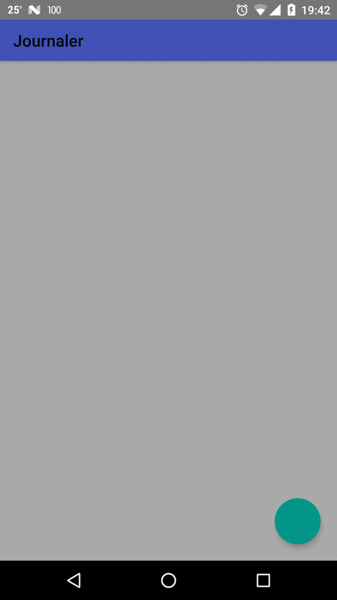
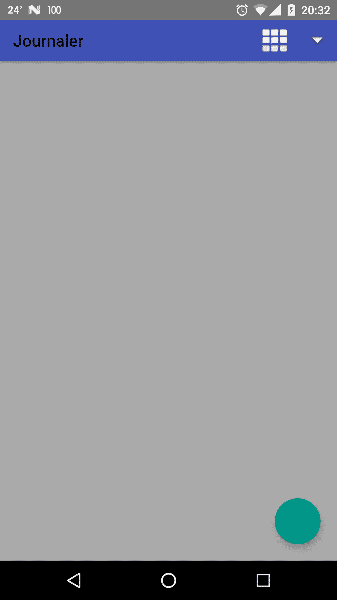
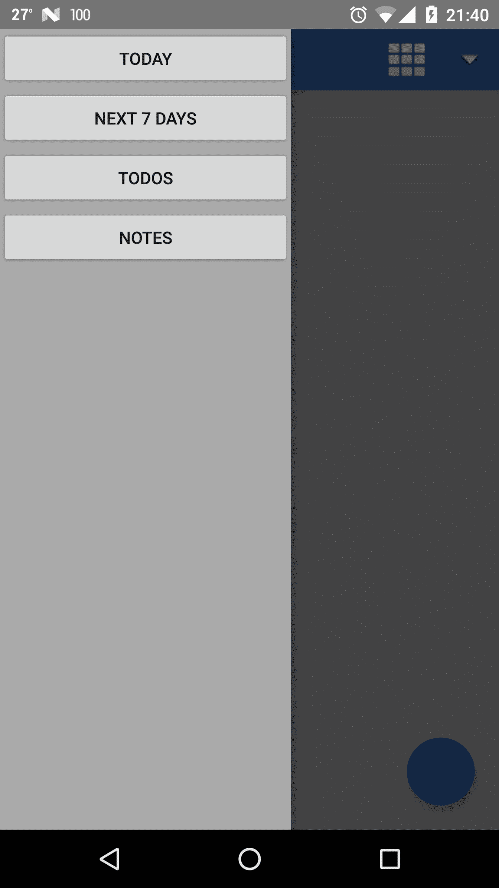
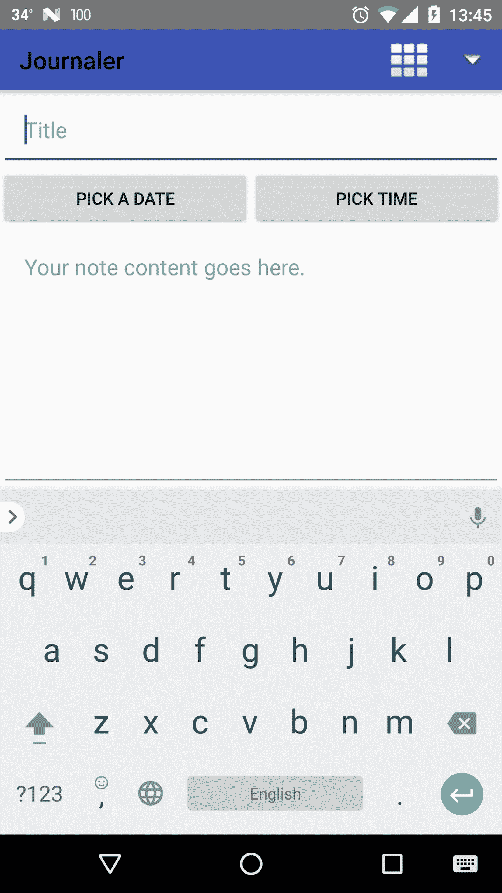

# 第四章：连接屏幕流

你好，亲爱的读者！我们已经来到了我们应用程序开发中的一个重要点——连接我们的屏幕。正如你所知，我们在上一章中创建了屏幕，在本章中，我们将使用 Android 强大的框架来连接它们。我们将继续我们的工作，并且，通过 Android，我们将在 UI 方面做更严肃的事情。准备好自己，专注于本章的每个方面。这将非常有趣！我们保证！

在本章中，我们将涵盖以下主题：

+   创建应用程序栏

+   使用抽屉导航

+   Android 意图

+   在活动和片段之间传递信息

# 创建应用程序栏

我们正在继续我们的 Android 应用程序开发之旅。到目前为止，我们已经为我们的应用程序创建了一个基础，为 UI 定义了基础，并创建了主要屏幕；然而，这些屏幕并没有连接。在本章中，我们将连接它们并进行精彩的交互。

由于一切都始于我们的`MainActivity`类，所以在我们设置一些操作来触发其他屏幕之前，我们将进行一些改进。我们必须用应用程序栏*包装*它。什么是应用程序栏？它是用于访问应用程序的其他部分并提供具有交互元素的视觉结构的 UI 部分。我们已经有一个，但它不是通常的 Android 应用程序栏。在这一点上，我们的应用程序有一个修改过的应用程序栏，我们希望它有一个标准的 Android 应用程序栏。

在这里，我们将向您展示如何创建一个。

首先，将顶级活动扩展替换为`AppCompatActivity`。我们需要访问应用程序栏所需的功能。`AppCompatActivity`将为标准的`FragmentActivity`添加这些额外的功能。您的`BaseActivity`定义现在应该如下所示：

```kt
    abstract class BaseActivity : AppCompatActivity() {   
    ... 
```

然后更新所使用的主题应用程序，以便可以使用应用程序栏。打开 Android 清单并设置一个新主题如下：

```kt
    ... 
    <application 
      android:name=".Journaler" 
      android:allowBackup="false" 
      android:icon="@mipmap/ic_launcher" 
      android:label="@string/app_name" 
      android:roundIcon="@mipmap/ic_launcher_round" 
      android:supportsRtl="true" 
      android:theme="@style/Theme.AppCompat.Light.NoActionBar"> 
    ... 
```

现在打开你的`activity_main`布局。删除包含的页眉指令并添加`Toolbar`：

```kt
    <?xml version="1.0" encoding="utf-8"?> 
    <LinearLayout xmlns:android=
     "http://schemas.android.com/apk/res/android" 
    android:layout_width="match_parent" 
    android:layout_height="match_parent" 
    android:orientation="vertical"> 

    <android.support.v7.widget.Toolbar 
      android:id="@+id/toolbar" 
      android:layout_width="match_parent" 
      android:layout_height="50dp" 
      android:background="@color/colorPrimary" 
      android:elevation="4dp" /> 

    <android.support.v4.view.ViewPager  
      android:id="@+id/pager" 
      android:layout_width="match_parent" 
      android:layout_height="match_parent" /> 

    </LinearLayout> 

```

对所有布局应用相同的更改。完成后，更新您的`BaseActivity`代码以使用新的`Toolbar`。您的`onCreate()`方法现在应该如下所示：

```kt
    override fun onCreate(savedInstanceState: Bundle?) { 
      super.onCreate(savedInstanceState) 
      setContentView(getLayout()) 
      setSupportActionBar(toolbar)        
    Log.v(tag, "[ ON CREATE ]") 
    } 
```

通过调用`setSupportActionBar()`方法并传递布局中工具栏的 ID，我们分配了一个应用程序栏。如果您运行应用程序，它将看起来像这样：



我们失去了我们在页眉中拥有的按钮！别担心，我们会把它们拿回来的！我们将创建一个菜单来处理操作，而不是按钮。在 Android 中，菜单是用于管理项目的接口，您可以定义自己的菜单资源。在`/res`目录中，创建一个`menu`文件夹。右键单击`menu`文件夹，然后选择 New | New menu resource file。将其命名为 main。一个新的 XML 文件将打开。根据这个示例更新它的内容：

```kt
    <?xml version="1.0" encoding="utf-8"?> 
    <menu  
    > 

    <item 
      app:showAsAction="ifRoom" 
      android:orderInCategory="1" 
      android:id="@+id/drawing_menu" 
      android:icon="@android:drawable/ic_dialog_dialer" 
      android:title="@string/mnu" /> 

    <item 
      app:showAsAction="ifRoom" 
      android:orderInCategory="2" 
      android:id="@+id/options_menu" 
      android:icon="@android:drawable/arrow_down_float" 
      android:title="@string/mnu" /> 
    </menu>
```

我们设置了常见属性、图标和顺序。为了确保您的图标可见，请使用以下内容：

```kt
    app:showAsAction="ifRoom" 
```

通过这样做，如果有空间可用，菜单中的项目将被展开；否则，它们将通过上下文菜单访问。您可以选择的 Android 中的其他间距选项如下：

+   **始终**：此按钮始终放在应用程序栏中

+   **从不**：此按钮永远不会放在应用程序栏中

+   **collapseAction View**：此按钮可以显示为小部件

+   **withText**：此按钮显示为文本

要将菜单分配给应用程序栏，请在`BaseActivity`中添加以下内容：

```kt
    override fun onCreateOptionsMenu(menu: Menu): Boolean { 
      menuInflater.inflate(R.menu.main, menu) 

      return true 
    } 
```

最后，通过添加以下代码来将操作连接到菜单项并扩展`MainActivity`：

```kt
    override fun onOptionsItemSelected(item: MenuItem): Boolean { 
      when (item.itemId) { 
        R.id.drawing_menu -> { 
          Log.v(tag, "Main menu.") 
          return true 
        } 
        R.id.options_menu -> { 
          Log.v(tag, "Options menu.") 
          return true 
        } 
        else -> return super.onOptionsItemSelected(item) 

     } 

    } 
```

在这里，我们重写了`onOptionsItemSelected()`方法，并处理了菜单项 ID 的情况。在每次选择时，我们都添加了一个日志消息。现在运行你的应用程序。你应该会看到这些菜单项：



点击每个项目几次并观察 Logcat。你应该看到类似于这样的日志：

```kt
    V/Main activity: Main menu. 
    V/Main activity: Options menu. 
    V/Main activity: Options menu. 
    V/Main activity: Options menu. 

    V/Main activity: Main menu. 

    V/Main activity: Main menu. 
```

我们成功地将我们的标题切换到应用程序栏。这与应用程序线框中的标题非常不同。这一点目前并不重要，因为我们将在接下来的章节中进行一些重要的样式设置。我们的应用程序栏将看起来不同。

在接下来的部分，我们将处理导航抽屉，并开始组装我们应用程序的导航。

# 使用导航抽屉

你可能还记得，在我们的模型中，我们已经提出将有链接到过滤数据（笔记和待办事项）的功能。我们将使用导航抽屉来进行过滤。每个现代应用程序都使用导航抽屉。这是一个显示应用程序导航选项的 UI 部分。要定义抽屉，我们必须在布局中放置`DrawerLayout`视图。打开`activity_main`并应用以下修改：

```kt
    <?xml version="1.0" encoding="utf-8"?> 
    <android.support.v4.widget.DrawerLayout    xmlns:android=
    "http://schemas.android.com/apk/res/android" 
     android:id="@+id/drawer_layout" 
     android:layout_width="match_parent" 
     android:layout_height="match_parent"> 

    <LinearLayout 
      android:layout_width="match_parent" 
      android:layout_height="match_parent" 
      android:orientation="vertical"> 

    <android.support.v7.widget.Toolbar 
      android:id="@+id/toolbar" 
      android:layout_width="match_parent" 
      android:layout_height="50dp" 
      android:background="@color/colorPrimary" 
      android:elevation="4dp" /> 

    <android.support.v4.view.ViewPager xmlns:android=
    "http://schemas.android.com/apk/res/android" 
      android:id="@+id/pager" 
      android:layout_width="match_parent" 
      android:layout_height="match_parent" /> 

    </LinearLayout> 

    <ListView 
       android:id="@+id/left_drawer" 
       android:layout_width="240dp" 
       android:layout_height="match_parent" 
       android:layout_gravity="start" 
       android:background="@android:color/darker_gray" 
       android:choiceMode="singleChoice" 
       android:divider="@android:color/transparent" 
       android:dividerHeight="1dp" /> 
    </android.support.v4.widget.DrawerLayout>  
```

屏幕的主要内容必须是`DrawerLayout`的第一个子项。导航抽屉使用第二个子项作为抽屉的内容。在我们的情况下，它是`ListView`。要告诉导航抽屉导航是否应该位于左侧还是右侧，使用`layout_gravity`属性。如果我们计划使用导航抽屉位于右侧，我们应该将属性值设置为`end`。

现在我们有一个空的导航抽屉，我们必须用一些按钮填充它。为每个导航项创建一个新的布局文件。将其命名为`adapter_navigation_drawer`。将其定义为一个只有一个按钮的简单线性布局：

```kt
    <?xml version="1.0" encoding="utf-8"?> 
    <LinearLayout xmlns:android=
    "http://schemas.android.com/apk/res/android" 
      android:layout_width="match_parent" 
      android:layout_height="match_parent" 
      android:orientation="vertical"> 

    <Button 
      android:id="@+id/drawer_item" 
      android:layout_width="match_parent" 
      android:layout_height="wrap_content" /> 

    </LinearLayout> 
```

然后，创建一个名为`navigation`的新包。在这个包中，创建一个新的 Kotlin`data`类，就像这样：

```kt
    package com.journaler.navigation 
    data class NavigationDrawerItem( 
      val title: String,        
      val onClick: Runnable 
    ) 
```

我们定义了一个抽屉项实体。现在再创建一个类：

```kt
    class NavigationDrawerAdapter( 
        val ctx: Context, 
        val items: List<NavigationDrawerItem> 
    ) : BaseAdapter() { 

    override fun getView(position: Int, v: View?, group: ViewGroup?):   
    View { 
      val inflater = LayoutInflater.from(ctx) 
      var view = v 
      if (view == null) { 
        view = inflater.inflate( 
          R.layout.adapter_navigation_drawer, null 
        ) as LinearLayout 
      } 

      val item = items[position] 
      val title = view.findViewById<Button>(R.id.drawer_item) 
      title.text = item.title 
      title.setOnClickListener { 
        item.onClick.run() 
      } 

      return view 
     } 

     override fun getItem(position: Int): Any { 
       return items[position] 
      } 

     override fun getItemId(position: Int): Long { 
       return 0L 
     } 

     override fun getCount(): Int {     
     return items.size 
     } 

    } 
```

这个类在这里扩展了 Android 的`BaseAdapter`并重写了适配器提供视图实例所需的方法。适配器创建的所有视图都将分配给我们导航抽屉中的`ListView`。

最后，我们将分配这个适配器。为此，我们需要通过执行以下代码更新我们的`MainActivity`类：

```kt
    class MainActivity : BaseActivity() { 
    ... 
    override fun onCreate(savedInstanceState: Bundle?) { 
      super.onCreate(savedInstanceState) 
      pager.adapter = ViewPagerAdapter(supportFragmentManager) 

      val menuItems = mutableListOf<NavigationDrawerItem>() 
      val today = NavigationDrawerItem( 
        getString(R.string.today), 
          Runnable { 
            pager.setCurrentItem(0, true) 
          } 
        ) 

        val next7Days = NavigationDrawerItem( 
           getString(R.string.next_seven_days), 
             Runnable { 
               pager.setCurrentItem(1, true) 
             } 
         ) 

         val todos = NavigationDrawerItem( 
           getString(R.string.todos), 
             Runnable { 
               pager.setCurrentItem(2, true) 
             } 
         ) 

         val notes = NavigationDrawerItem( 
           getString(R.string.notes), 
             Runnable { 
               pager.setCurrentItem(3, true) 
             } 
        ) 

        menuItems.add(today) 
        menuItems.add(next7Days) 
        menuItems.add(todos) 
        menuItems.add(notes) 

        val navgationDraweAdapter = 
          NavigationDrawerAdapter(this, menuItems) 
        left_drawer.adapter = navgationDraweAdapter 
      } 
      override fun onOptionsItemSelected(item: MenuItem): Boolean { 
        when (item.itemId) { 
          R.id.drawing_menu -> { 
            drawer_layout.openDrawer(GravityCompat.START) 
            return true 
          } 
          R.id.options_menu -> { 
             Log.v(tag, "Options menu.") 
             return true 
          } 
          else -> return super.onOptionsItemSelected(item) 
        }      
      }  
    }  
```

在这个代码示例中，我们实例化了几个`NavigationDrawerItem`实例，然后，我们为按钮和我们将执行的`Runnable`操作分配了一个标题。每个`Runnable`将跳转到我们视图页面的特定页面。我们将所有实例作为一个单一的可变列表传递给适配器。您可能还注意到，我们更改了`drawing_menu`项的行。通过点击它，我们将展开我们的导航抽屉。请按照以下步骤操作：

1.  构建你的应用程序并运行它。

1.  点击主屏幕右上方的菜单按钮或通过从屏幕的最左侧向右滑动来展开导航抽屉。

1.  点击按钮。

1.  你会注意到视图页面在导航抽屉下方的页面位置正在进行动画。



# 连接活动

如你所记得的，除了`MainActivity`之外，我们还有一些其他活动。在我们的应用程序中，我们创建了用于创建/编辑笔记和待办事项的活动。我们的计划是将它们连接到按钮点击事件，然后，当用户点击按钮时，适当的屏幕将打开。我们将首先定义一个代表在打开的活动中执行的操作的`enum`。当我们打开它时，我们可以查看、创建或更新笔记或待办事项。创建一个名为`model`和`enum`的新包，名称为`MODE`。确保你有以下`enum`值：

```kt
    enum class MODE(val mode: Int) { 
      CREATE(0), 
      EDIT(1), 
      VIEW(2); 

      companion object { 
        val EXTRAS_KEY = "MODE" 

        fun getByValue(value: Int): MODE { 
          values().forEach { 
            item -> 

            if (item.mode == value) { 
              return item 
            } 
          } 
          return VIEW 
        } 
      }  
    } 
```

我们在这里添加了一些附加内容。在`enum`的伴随对象中，我们定义了额外键的定义。很快，你会需要它，并且你会理解它的目的。我们还创建了一个方法，它将根据其值给我们一个`enum`。

你可能还记得，用于处理笔记和待办事项的两个活动共享相同的类。打开`ItemActivity`并按以下方式扩展它：

```kt
     abstract class ItemActivity : BaseActivity() { 
       protected var mode = MODE.VIEW 
       override fun getActivityTitle() = R.string.app_name 
       override fun onCreate(savedInstanceState: Bundle?) { 
         super.onCreate(savedInstanceState) 
         val modeToSet = intent.getIntExtra(MODE.EXTRAS_KEY, 
         MODE.VIEW.mode) 
         mode = MODE.getByValue(modeToSet) 
         Log.v(tag, "Mode [ $mode ]") 
       } 
     }  
```

我们引入了一个刚定义的类型字段，它将告诉我们是否正在查看、创建或编辑一个 Note 或 Todo 项目。然后，我们重写了`onCreate()`方法。这很重要！当我们单击按钮并打开活动时，我们将向其传递一些值。此代码片段检索我们传递的值。为了实现这一点，我们访问`Intent`实例（在下一节中，我们将解释“意图”）和称为`MODE`的整数字段（`MODE.EXTRAS_KEY`的值）。给我们这个值的方法叫做`getIntExtra()`。对于每种类型都有一个方法的版本。如果没有值，将返回`MODE.VIEW.mode`。最后，我们将模式设置为我们通过从整数值获取`MODE`实例获得的值。

拼图的最后一块是触发活动打开。打开`ItemsFragment`并扩展如下：

```kt
    class ItemsFragment : BaseFragment() { 
      ... 
      override fun onCreateView( 
        inflater: LayoutInflater?, 
        container: ViewGroup?, 
        savedInstanceState: Bundle? 
      ): View? {         
          val view = inflater?.inflate(getLayout(), container, false) 
          val btn = view?.findViewById<FloatingActionButton>
          (R.id.new_item) 
          btn?.setOnClickListener { 
            val items = arrayOf( 
              getString(R.string.todos), 
              getString(R.string.notes) 
            ) 
            val builder = 
            AlertDialog.Builder(this@ItemsFragment.context) 
            .setTitle(R.string.choose_a_type) 
            .setItems( 
              items, 
              { _, which -> 
               when (which) { 
               0 -> { 
                 openCreateTodo() 
               } 
               1 -> { 
                 openCreateNote() 
               } 
               else -> Log.e(logTag, "Unknown option selected 
               [ $which ]") 
                } 
               } 
             ) 

            builder.show() 
          } 

          return view 
       } 

      private fun openCreateNote() { 
        val intent = Intent(context, NoteActivity::class.java) 
        intent.putExtra(MODE.EXTRAS_KEY, MODE.CREATE.mode) 
        startActivity(intent) 
      } 

      private fun openCreateTodo() { 
        val intent = Intent(context, TodoActivity::class.java) 
        intent.putExtra(MODE.EXTRAS_KEY, MODE.CREATE.mode) 
        startActivity(intent) 

      } 

     } 
```

我们访问了`FloatingActionButton`实例并分配了一个点击侦听器。单击时，我们将创建一个带有两个选项的对话框。这些选项中的每一个都将触发适当的活动打开方法。这两种方法的实现非常相似。例如，我们将专注于`openCreateNote()`。

我们将创建一个新的`Intent`实例。在 Android 中，`Intent`表示我们要做某事的意图。要启动一个活动，我们必须传递上下文和我们想要启动的活动的类。我们还必须为其分配一些值。这些值将传递给一个活动实例。在我们的情况下，我们正在传递`MODE.CREATE`的整数值。`startActivity()`方法将执行意图，屏幕将出现。

运行应用程序，单击屏幕右下角的圆形按钮，并从对话框中选择一个选项，如下面的屏幕截图所示：


这将带您到这个屏幕：


这将进一步带您添加您自己的数据与日期和时间：



# 深入了解 Android 意图

在 Android 中，您计划执行的大多数操作都是通过`Intent`类定义的。`Intent`可用于启动活动，启动服务（在后台运行的进程）或发送广播消息。

`Intent`通常接受我们想要传递给某个类的操作和数据。我们可以设置的操作属性包括`ACTION_VIEW`、`ACTION_EDIT`、`ACTION_MAIN`等。

除了操作和数据，我们还可以为意图设置一个类别。类别为我们设置的操作提供了额外的信息。我们还可以为意图设置类型和组件，该组件代表我们将使用的显式组件类名。

有两种类型的“意图”：

+   显式意图

+   隐式意图

显式意图设置了一个显式组件，提供了一个要运行的显式类。隐式意图没有显式组件，但系统根据我们分配的数据和属性决定如何处理它。意图解析过程负责处理这样的“意图”。

这些参数的组合是无穷无尽的。我们将给出一些例子，这样你就可以更好地理解“意图”的目的：

+   打开网页：

```kt
         val intent = Intent(Intent.ACTION_VIEW,
         Uri.parse("http://google.com")) 
         startActivity(intent) 
         Sharing: 
         val intent = Intent(Intent.ACTION_SEND) 
         intent.type = "text/plain" 
         intent.putExtra(Intent.EXTRA_TEXT, "Check out this cool app!") 
         startActivity(intent)  
```

+   从相机中捕获图像：

```kt
        val takePicture = Intent(MediaStore.ACTION_IMAGE_CAPTURE) 
        if (takePicture.resolveActivity(packageManager) != null) { 
         startActivityForResult(takePicture, REQUEST_CAPTURE_PHOTO +
         position) 
        } else { 
          logger.e(tag, "Can't take picture.") 
       }  
```

+   从图库中选择图像：

```kt
        val pickPhoto = Intent( 
         Intent.ACTION_PICK, 
         MediaStore.Images.Media.EXTERNAL_CONTENT_URI 
        ) 
        startActivityForResult(pickPhoto, REQUEST_PICK_PHOTO + 
       position) 
```

正如你所看到的，“意图”是 Android 框架的一个关键部分。在下一节中，我们将扩展我们的代码，以更多地利用“意图”。

# 在活动和片段之间传递信息

为了在我们的活动之间传递信息，我们将使用 Android Bundle。Bundle 可以包含不同类型的多个值。我们将通过扩展我们的代码来说明 Bundle 的使用。打开`ItemsFragemnt`并更新如下：

```kt
    private fun openCreateNote() { 
      val intent = Intent(context, NoteActivity::class.java) 
      val data = Bundle() 
      data.putInt(MODE.EXTRAS_KEY, MODE.CREATE.mode) 
      intent.putExtras(data) 
      startActivityForResult(intent, NOTE_REQUEST) 
    } 
    private fun openCreateTodo() { 
       val date = Date(System.currentTimeMillis()) 
       val dateFormat = SimpleDateFormat("MMM dd YYYY", Locale.ENGLISH) 
       val timeFormat = SimpleDateFormat("MM:HH", Locale.ENGLISH) 

       val intent = Intent(context, TodoActivity::class.java) 
       val data = Bundle() 
       data.putInt(MODE.EXTRAS_KEY, MODE.CREATE.mode) 
       data.putString(TodoActivity.EXTRA_DATE, dateFormat.format(date)) 
       data.putString(TodoActivity.EXTRA_TIME, 
       timeFormat.format(date)) 
       intent.putExtras(data) 
       startActivityForResult(intent, TODO_REQUEST) 
    } 

    override fun onActivityResult(requestCode: Int, resultCode: Int, 
    data: Intent?) { 
      super.onActivityResult(requestCode, resultCode, data) 
      when (requestCode) { 
         TODO_REQUEST -> { 
           if (resultCode == Activity.RESULT_OK) { 
             Log.i(logTag, "We created new TODO.") 
           } else { 
             Log.w(logTag, "We didn't created new TODO.") 
           } 
          } 
          NOTE_REQUEST -> { 
            if (resultCode == Activity.RESULT_OK) { 
              Log.i(logTag, "We created new note.") 
            } else { 
              Log.w(logTag, "We didn't created new note.") 
              } 
           } 
         } 
      } 
```

在这里，我们引入了一些重要的更改。首先，我们将我们的 Note 和 Todo 活动作为子活动启动。这意味着我们的`MainActivity`类取决于这些活动的工作结果。在启动子活动时，我们使用了`startActivityForResult()`方法，而不是`startActivity()`方法。我们传递的参数是意图和请求编号。为了获得执行结果，我们重写了`onActivityResult()`方法。如您所见，我们检查了哪个活动完成了，以及该执行是否产生了成功的结果。

我们还改变了传递信息的方式。我们创建了`Bundle`实例并分配了多个值，就像 Todo 活动的情况一样。我们添加了模式、日期和时间。使用`putExtras()`方法将 Bundle 分配给意图。为了使用这些额外值，我们也更新了我们的活动。打开`ItemsActivity`并应用更改，就像这样：

```kt
     abstract class ItemActivity : BaseActivity() { 
       protected var mode = MODE.VIEW 
       protected var success = Activity.RESULT_CANCELED 
       override fun getActivityTitle() = R.string.app_name 

       override fun onCreate(savedInstanceState: Bundle?) { 
         super.onCreate(savedInstanceState) 
         val data = intent.extras 
         data?.let{ 
           val modeToSet = data.getInt(MODE.EXTRAS_KEY, MODE.VIEW.mode) 
           mode = MODE.getByValue(modeToSet) 
         } 
         Log.v(tag, "Mode [ $mode ]") 
       } 

       override fun onDestroy() { 
         super.onDestroy() 
         setResult(success) 
      } 

    } 
```

在这里，我们介绍了保存活动工作结果的字段。我们还更新了处理传递信息的方式。如您所见，如果有任何额外值可用，我们将获得一个整数值作为模式。最后，`onDestroy()`方法设置了将可用于父活动的工作结果。

打开`TodoActivity`并应用以下更改：

```kt
     class TodoActivity : ItemActivity() { 

     companion object { 
       val EXTRA_DATE = "EXTRA_DATE" 
       val EXTRA_TIME = "EXTRA_TIME" 
     } 

     override val tag = "Todo activity" 

     override fun getLayout() = R.layout.activity_todo 

     override fun onCreate(savedInstanceState: Bundle?) { 
       super.onCreate(savedInstanceState) 
       val data = intent.extras 
       data?.let { 
         val date = data.getString(EXTRA_DATE, "") 
         val time = data.getString(EXTRA_TIME, "") 
         pick_date.text = date 
         pick_time.text = time 
       } 
     } 

    }  
```

我们已经获得了日期和时间额外值，并将它们设置为日期/时间选择器按钮。运行您的应用程序并打开 Todo 活动。您的 Todo 屏幕应该是这样的：


当您离开 Todo 活动并返回到主屏幕时，请观察您的 Logcat。将会有一个包含以下内容的日志：

W/Items fragment--我们没有创建新的 TODO。

由于我们尚未创建任何 Todo 项目，因此我们传递了适当的结果。我们通过返回到主屏幕取消了创建过程。在以后的章节和随后的章节中，我们将成功创建笔记和待办事项。

# 摘要

我们使用本章来连接我们的界面并建立真正的应用程序流程。我们通过为 UI 元素设置适当的操作来建立屏幕之间的连接。我们将数据从一个点传递到另一个点。所有这些都非常简单！我们有一个可以工作的东西，但它看起来很丑。在下一章中，我们将确保它看起来漂亮！我们将为其添加样式和一些漂亮的视觉效果。准备好迎接 Android 强大的 UI API。
