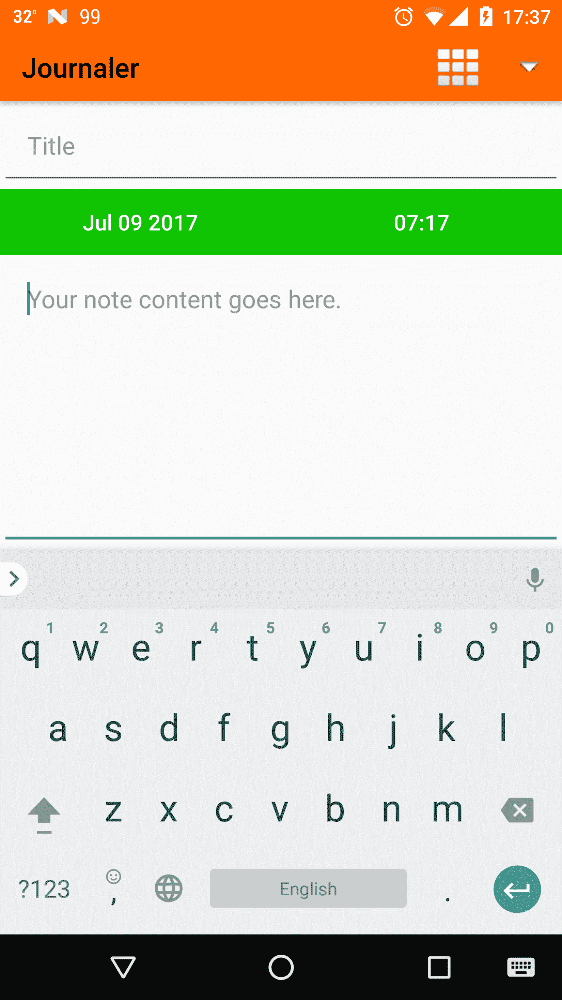
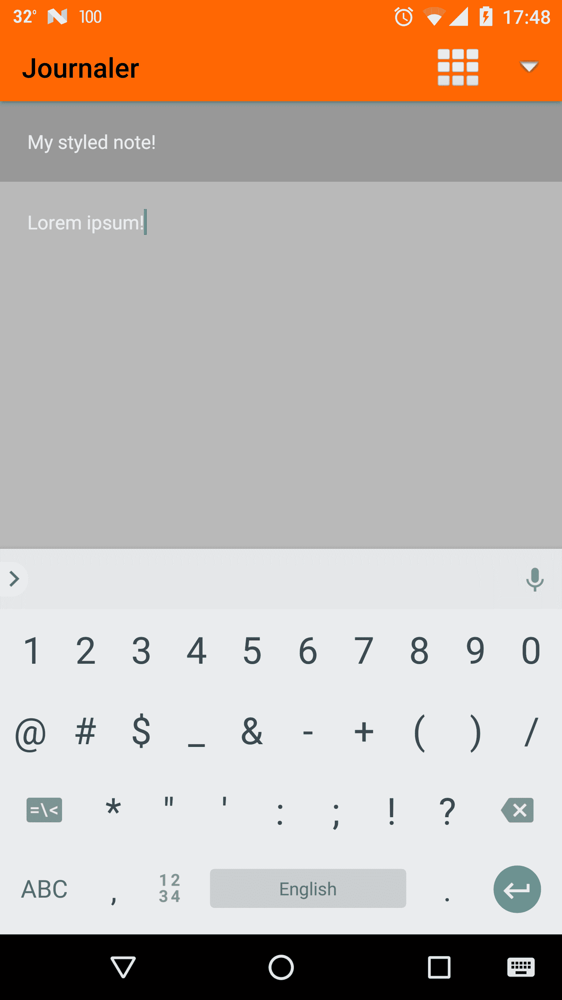

# 第五章：外观

现在，应用程序具有令人惊叹的视觉外观。这是使您的应用程序独特和原创的东西。令人愉悦的外观将使您的应用程序在类似应用程序的领域中脱颖而出，但它也将强烈吸引您的用户，他们更有可能在其设备上安装和保留您的应用程序。在本章中，我们将向您展示如何使您的应用程序变得美观。我们将向您介绍 Android UI 主题的秘密！我们的重点只会放在 Android 应用程序的视觉方面。

在本章中，我们将涵盖以下主题：

+   Android 中的主题和样式

+   使用资产

+   自定义字体和着色

+   按钮设计

+   动画和动画集

# Android 框架中的主题

在上一章中，我们建立了主要 UI 元素之间的连接。我们的应用程序在获得一些颜色之前并不像一个。要获得颜色，我们将从主应用程序主题开始。我们将扩展现有的 Android 主题之一，并用我们喜欢的颜色进行覆盖。

打开`styles.xml`。在这里，您将为我们应用程序的需求设置默认主题。我们还将覆盖几种颜色。但是，我们将更改`parent`主题，并根据我们的意愿进行自定义。我们将根据以下示例更新主题：

```kt
    <resources> 

      <style name="AppTheme" 
        parent="Theme.AppCompat.Light.NoActionBar"> 
        <item name="android:colorPrimary">@color/colorPrimary</item> 
        <item name="android:statusBarColor">@color/colorPrimary</item> 
        <item name="android:colorPrimaryDark">
         @color/colorPrimaryDark</item> 
        <item name="android:colorAccent">@color/colorAccent</item> 
        <item name="android:textColor">@android:color/black</item> 
      </style> 

    </resources> 
```

我们定义了一个从`AppCompat`主题继承的主题。主要颜色代表应用程序品牌的颜色。颜色的较暗变体是`colorPrimaryDark`，而将着色的 UI 控件颜色为`colorAccent`。我们还将主要文本颜色设置为黑色。状态栏也将使用我们的主要品牌颜色。

打开`colors.xml`文件，并定义我们将在主题中使用的颜色如下：

```kt
    <?xml version="1.0" encoding="utf-8"?> 
    <resources> 
      <color name="colorPrimary">#ff6600</color> 
      <color name="colorPrimaryDark">#197734</color> 
      <color name="colorAccent">#ffae00</color> 
    </resources> 
```

在运行应用程序查看主题之前，请确保主题实际应用。使用以下代码更新`manifest`文件：

```kt
    <application 
    android:theme="@style/AppTheme" 
```

还要更新`fragment_items`的浮动操作按钮的颜色如下：

```kt
    <android.support.design.widget.FloatingActionButton 
        android:backgroundTint="@color/colorPrimary" 
        android:id="@+id/new_item" 
        android:layout_width="wrap_content" 
        android:layout_height="wrap_content" 
        android:layout_alignParentBottom="true" 
        android:layout_alignParentEnd="true" 
        android:layout_margin="@dimen/button_margin" /> 
```

背景色属性将确保按钮与状态栏具有相同的颜色。构建并运行应用程序。恭喜，您已成功将应用程序品牌定为橙色！

# Android 中的样式

我们刚刚定义的主题代表样式。所有样式都在`styles.xml`文件中定义。我们将创建几种样式，以演示您创建样式的简易性和它们的强大性。您可以为按钮、文本或任何其他视图定义样式。您也可以继承样式。

为了进行样式设置，我们将定义应用程序中要使用的颜色调色板。打开您的`colors.xml`文件并扩展如下：

```kt
    <color name="green">#11c403</color> 
    <color name="green_dark">#0e8c05</color> 
    <color name="white">#ffffff</color> 
    <color name="white_transparent_40">#64ffffff</color> 
    <color name="black">#000000</color> 
    <color name="black_transparent_40">#64000000</color> 
    <color name="grey_disabled">#d5d5d5</color> 
    <color name="grey_text">#444d57</color> 
    <color name="grey_text_transparent_40">#64444d57</color> 
    <color name="grey_text_middle">#6d6d6d</color> 
    <color name="grey_text_light">#b9b9b9</color> 
    <color name="grey_thin_separator">#f1f1f1</color> 
    <color name="grey_thin_separator_settings">#eeeeee</color> 
    <color name="vermilion">#f3494c</color> 
    <color name="vermilion_dark">#c64145</color> 
    <color name="vermilion_transparent_40">#64f3494c</color> 
    <color name="plum">#121e2a</color> 
```

注意透明颜色！观察`白色`颜色的情况。纯`白色`颜色的代码为`#ffffff`，而`40%`透明的白色的代码为`#64ffffff`。要实现透明度，您可以使用以下值：

0% = #00

10% = #16

20% = #32

30% = #48

40% = #64

50% = #80

60% = #96

70% = #112

80% = #128

90% = #144

现在我们已经定义了颜色调色板，我们将创建我们的第一个样式。打开`styles.xml`并扩展它：

```kt
     <style name="simple_button"> 
        <item name="android:textSize">16sp</item> 
        <item name="android:textAllCaps">false</item> 
        <item name="android:textColor">@color/white</item> 
     </style> 

     <style name="simple_button_green" parent="simple_button"> 
        <item name="android:background">
        @drawable/selector_button_green</item> 
    </style> 
```

我们定义了两种样式。第一种定义了简单的按钮。它具有白色文本，字体大小为`16sp`。第二个扩展了第一个，并添加了背景属性。我们将创建一个选择器，以便演示我们定义的样式。由于我们还没有这个资源，请在`drawable resource`文件夹中创建`selector_button_green xml`：

```kt
     <?xml version="1.0" encoding="utf-8"?> 
     <selector xmlns:android=
      "http://schemas.android.com/apk/res/android"> 

      <item android:drawable="@color/grey_disabled" 
       android:state_enabled="false" /> 
      <item android:drawable="@color/green_dark"
       android:state_selected="true" /> 
      <item android:drawable="@color/green_dark"
       android:state_pressed="true" /> 
      <item android:drawable="@color/green" /> 

     </selector> 
```

我们定义了一个选择器。选择器是描述视觉行为或不同状态的 XML。我们为按钮的禁用状态添加了不同的颜色，当按钮被按下、释放或我们没有与其进行任何交互时，我们也为其添加了颜色。

查看按钮的外观，打开`activity_todo`布局，并为每个按钮设置样式：

```kt
    style="@style/simple_button_green"  
```

然后，运行应用程序并打开`Todo`屏幕。您的屏幕应该是这样的：



如果您按下按钮，您会注意到颜色已经变成了深绿色。在接下来的部分，我们将通过添加圆角边缘来进一步改进这些按钮，但在此之前，让我们创建一些更多的样式：

+   为输入字段和导航抽屉在您的`styles.xml`中添加样式：

```kt
        <style name="simple_button_grey" parent="simple_button"> 
         <item name="android:background">
          @drawable/selector_button_grey</item> 
        </style> 

        <style name="edit_text_transparent"> 
          <item name="android:textSize">14sp</item> 
          <item name="android:padding">19dp</item> 
          <item name="android:textColor">@color/white</item> 
          <item name="android:textColorHint">@color/white</item> 
          <item name="android:background">
          @color/black_transparent_40</item> 
        </style> 

       <style name="edit_text_gery_text"
         parent="edit_text_transparent"> 
         <item name="android:textAlignment">textStart</item> 
         <item name="android:textColor">@color/white</item> 
         <item name="android:background">@color/grey_text_light</item> 
       </style> 
```

+   对于输入字段，我们定义了提示的颜色。同时，我们引入了一个名为`selector_button_grey`的选择器可绘制对象：

```kt
        <?xml version="1.0" encoding="utf-8"?> 
        <selector xmlns:android=
         "http://schemas.android.com/apk/res/android"> 

         <item android:drawable="@color/grey_disabled"  
         android:state_enabled="false" /> 
         <item android:drawable="@color/grey_text_middle"  
         android:state_selected="true" /> 
         <item android:drawable="@color/grey_text_middle"
         android:state_pressed="true" /> 
         <item android:drawable="@color/grey_text" /> 
        </selector> 
```

+   对于两个屏幕（笔记和待办事项）上的`note_title`，添加样式：

```kt
        style="@style/edit_text_transparent" 
```

+   对于`note_content`添加：

```kt
        style="@style/edit_text_gery_text"  
```

+   对于`adapter_navigation_drawer`布局，将样式应用于按钮：

```kt
        style="@style/simple_button_grey" 
```

就是这样！您已经为您的应用程序添加了样式！现在运行它并查看所有屏幕和导航抽屉：



您觉得呢？UI 现在看起来更好了吗？也观察下一个屏幕截图：


应用程序现在看起来很不错。随意根据您的愿望调整属性和颜色。我们还没有完成。我们需要一些字体来应用！在接下来的部分，我们将处理这个问题。

# 使用资源文件

现在是时候让您的应用程序使用原始资源了。一个很好的例子就是字体。我们使用的每个字体应用都将是一个存储在`assets`文件夹中的单独文件。`assets`文件夹是`main`目录或代表构建变体的目录的子目录。除了字体之外，通常还会在这里存储 txt 文件，mp3，waw，mid 等。您不能将这些类型的文件存储在`res`目录中。

# 使用自定义字体

字体是资源。因此，为了为您的应用程序提供一些字体，我们首先需要复制它们。有很多好的免费字体资源。例如，Google Fonts。下载一些字体并将它们复制到您的`assets`目录中。如果没有`assets`目录，请创建一个。我们将把我们的字体放在`assets/fonts`目录中。

在我们的示例中，我们将使用`Exo`。`Exo`带有以下`font`文件：

+   `Exo2-Black.ttf`

+   `Exo2-BlackItalic.ttf`

+   `Exo2-Bold.ttf`

+   `Exo2-BoldItalic.ttf`

+   `Exo2-ExtraBold.ttf`

+   `Exo2-ExtraBoldItalic.ttf`

+   `Exo2-ExtraLight.ttf`

+   `Exo2-ExtraLightItalic.ttf`

+   `Exo2-Italic.ttf`

+   `Exo2-Light.ttf`

+   `Exo2-LightItalic.ttf`

+   `Exo2-Medium.ttf`

+   `Exo2-MediumItalic.ttf`

+   `Exo2-Regular.ttf`

+   `Exo2-SemiBold.ttf`

+   `Exo2-SemiBoldItalic.ttf`

+   `Exo2-Thin.ttf`

+   `Exo2-ThinItalic.ttf`

将`font`文件复制到`assets`目录不会直接为我们提供对这些字体的支持。我们需要通过代码来使用它们。我们将创建一个代码，它将为我们应用字体。

打开`BaseActivity`并扩展它：

```kt
    abstract class BaseActivity : AppCompatActivity() { 
    companion object { 
      private var fontExoBold: Typeface? = null 
      private var fontExoRegular: Typeface? = null 

      fun applyFonts(view: View, ctx: Context) { 
        var vTag = "" 
        if (view.tag is String) { 
          vTag = view.tag as String 
        } 
        when (view) { 
          is ViewGroup -> { 
            for (x in 0..view.childCount - 1) { 
              applyFonts(view.getChildAt(x), ctx) 
            } 
          } 
          is Button -> { 
            when (vTag) { 
              ctx.getString(R.string.tag_font_bold) -> { 
                view.typeface = fontExoBold 
              } 
              else -> { 
                view.typeface = fontExoRegular 
              } 
             } 
            } 
            is TextView -> { 
              when (vTag) { 
                ctx.getString(R.string.tag_font_bold) -> { 
                view.typeface = fontExoBold 
                } 
                 else -> { 
                   view.typeface = fontExoRegular 
                 } 
                } 
              } 
              is EditText -> { 
                when (vTag) { 
                  ctx.getString(R.string.tag_font_bold) -> { 
                    view.typeface = fontExoBold 
                  } 
                 else -> { 
                   view.typeface = fontExoRegular 
                 } 
               } 
             } 
           } 
        } 
     } 
    ... 
    override fun onPostCreate(savedInstanceState: Bundle?) { 
        super.onPostCreate(savedInstanceState) 
        Log.v(tag, "[ ON POST CREATE ]") 
        applyFonts() 
    } 
    ... 
    protected fun applyFonts() { 
        initFonts() 
        Log.v(tag, "Applying fonts [ START ]") 
        val rootView = findViewById(android.R.id.content) 
        applyFonts(rootView, this) 
        Log.v(tag, "Applying fonts [ END ]") 
    } 

    private fun initFonts() { 
        if (fontExoBold == null) { 
            Log.v(tag, "Initializing font [ Exo2-Bold ]") 
            fontExoBold = Typeface.createFromAsset(assets, "fonts/Exo2-
            Bold.ttf") 
        } 
        if (fontExoRegular == null) { 
            Log.v(tag, "Initializing font [ Exo2-Regular ]") 
            fontExoRegular = Typeface.createFromAsset(assets,
            "fonts/Exo2-Regular.ttf") 
        } 
     }   
    } 
```

我们扩展了我们的基本活动以处理字体。当活动进入`onPostCreate()`时，`applyFonts()`方法将被调用。然后，`applyFonts()`执行以下操作：

+   调用`initFonts()`方法，该方法从资源文件创建`TypeFace`实例。`TypeFace`用作字体及其视觉属性的表示。我们为`ExoBold`和`ExoRegular`实例化了字体。

+   接下来发生的是，我们正在获取当前活动的`root`视图，并将其传递给伴随对象的`applyFonts()`方法。如果视图是一个`view group`，我们会遍历其子项，直到达到普通视图。视图有一个名为`typeface`的属性，我们将其设置为我们的`typeface`实例。您还会注意到，我们正在从每个视图中检索名为`tag`的类属性。在 Android 中，我们可以为视图设置标签。标签可以是任何类的实例。在我们的情况下，我们正在检查标签是否是具有名称`tag_font_bold`的字符串资源的`String`。

要设置标签，创建一个名为**tags**的新`xml`文件，并将其放入`values`目录中，并填充以下内容：

```kt
    <?xml version="1.0" encoding="utf-8"?> 
    <resources> 
      <string name="tag_font_regular">FONT_REGULAR</string> 
      <string name="tag_font_bold">FONT_BOLD</string> 
    </resources> 
    To apply it open styles.xml and add tag to simple_button style: 
    <item name="android:tag">@string/tag_font_bold</item> 
```

现在所有应用程序的按钮都将应用粗体字体版本。现在构建您的应用程序并运行它。您会注意到字体已经改变了！

# 应用颜色

我们为我们的应用程序定义了颜色调色板。我们通过访问其资源应用了每种颜色。有时我们没有特定的颜色资源可用。可能发生的情况是，我们通过后端（作为对某些 API 调用的响应）动态获得颜色，或者由于其他原因，我们希望从代码中定义颜色。

当你需要在代码中处理颜色时，Android 非常强大。我们将涵盖一些示例，并向您展示您可以做什么。

要从现有资源中获取颜色，您可以执行以下操作：

```kt
    val color = ContextCompat.getColor(contex, R.color.plum) 
```

以前我们用来做这个：

```kt
     val color = resources.getColor(R.color.plum) 
```

但它已经在 Android 6 版本中被弃用。

当您获得颜色后，您可以将其应用于某个视图：

```kt
    pick_date.setTextColor(color) 
```

另一种获取颜色的方法是访问`Color`类的静态方法。让我们从解析一些颜色字符串开始：

```kt
    val color = Color.parseColor("#ff0000")  
```

我们必须注意，已经有一定数量的预定义颜色可用：

```kt
     val color = Color.RED 
```

所以我们不需要解析`#ff0000`。还有一些其他颜色：

```kt
    public static final int BLACK 
    public static final int BLUE 
    public static final int CYAN 
    public static final int DKGRAY 
    public static final int GRAY 
    public static final int GREEN 
    public static final int LTGRAY 
    public static final int MAGENTA 
    public static final int RED 
    public static final int TRANSPARENT 
    public static final int WHITE 
    public static final int YELLOW
```

有时，您只会有关于红色，绿色或蓝色的参数，然后基于此创建颜色：

```kt
     Color red = Color.valueOf(1.0f, 0.0f, 0.0f); 
```

我们必须注意，此方法从 API 版本 26 开始可用！

如果 RGB 不是您想要的颜色空间，那么您可以将其作为参数传递：

```kt
    val colorSpace = ColorSpace.get(ColorSpace.Named.NTSC_1953) 
    val color = Color.valueOf(1f, 1f, 1f, 1f, colorSpace) 
```

正如您所看到的，当您处理颜色时有很多可能性。如果标准颜色资源不足以管理您的颜色，您可以以一种高级方式来处理它。我们鼓励您尝试并在一些用户界面上尝试。

例如，如果您正在使用`AppCompat`库，一旦您获得`Color`实例，您可以像以下示例中那样使用它：

```kt
    counter.setTextColor( 
      ContextCompat.getColor(context, R.color.vermilion) 
    ) 
```

考虑以下截图：


# 让你的按钮看起来漂亮

我们给我们的按钮上色并为它们定义了状态。我们为每个状态着色。我们有禁用状态的颜色，启用状态和按下状态的颜色。现在我们将更进一步。我们将使我们的按钮变圆，并用渐变颜色而不是纯色来着色。我们将为新的按钮样式准备一个布局。打开`activity_todo`布局并修改按钮容器：

```kt
    <LinearLayout 
      android:background="@color/grey_text_light" 
      android:layout_width="match_parent" 
      android:layout_height="wrap_content" 
      android:orientation="horizontal" 
      android:weightSum="1"> 

      ... 

     </LinearLayout> 
```

我们将背景设置为与我们用于编辑文本字段相同的背景。按钮将被圆角，所以我们希望它们与屏幕的其余部分在相同的背景上。现在，让我们定义一些额外的尺寸和我们将使用的颜色。我们需要定义具有圆角边角的按钮的半径：

```kt
     <dimen name="button_corner">10dp</dimen> 
```

由于我们计划使用渐变颜色，我们必须为渐变添加第二种颜色。将这些颜色添加到您的`colors.xml`中：

```kt
     <color name="green2">#208c18</color> 
     <color name="green_dark2">#0b5505</color>  
```

现在我们已经定义了这一点，我们需要更新绿色按钮的样式：

```kt
     <style name="simple_button_green" parent="simple_button"> 
        <item name="android:layout_margin">5dp</item> 
        <item name="android:background">
        @drawable/selector_button_green</item> 
     </style> 
```

我们添加了一个边距，以便按钮彼此分开。我们现在需要矩形圆角可绘制资源。创建三个可绘制资源`rect_rounded_green`，`rect_rounded_green_dark`和`rect_rounded_grey_disabled`。确保它们定义如下：

+   `rect_rounded_green`：

```kt
         <shape xmlns:android=
           "http://schemas.android.com/apk/res/android"> 
            <gradient 
            android:angle="270" 
            android:endColor="@color/green2" 
            android:startColor="@color/green" /> 

           <corners android:radius="@dimen/button_corner" /> 
         </shape>  
```

+   `rect_rounded_green_dark`:

```kt
     <shape > 
       <gradient 
       android:angle="270" 
       android:endColor="@color/green_dark2" 
       android:startColor="@color/green_dark" /> 

      <corners android:radius="@dimen/button_corner" /> 
     </shape> 
```

+   `rect_rounded_grey_disabled`：

```kt
         <shape xmlns:android=
         "http://schemas.android.com/apk/res/android"> 

         <solid android:color="@color/grey_disabled" /> 
         <corners android:radius="@dimen/button_corner" /> 
         </shape> 
```

+   我们定义了包含以下属性的渐变：

+   渐变角度（270 度）

+   起始颜色（我们使用了我们的颜色资源）

+   结束颜色（我们也使用了我们的颜色资源）

此外，每个可绘制资源都有其角半径的值。最后一步是更新我们的选择器。打开`selector_button_green`并更新它：

```kt
       <?xml version="1.0" encoding="utf-8"?> 
       <selector xmlns:android=
       "http://schemas.android.com/apk/res/android"> 

       <item  
       android:drawable="@drawable/rect_rounded_grey_disabled"  
       android:state_enabled="false" /> 

       <item  
       android:drawable="@drawable/rect_rounded_green_dark"  
       android:state_selected="true" /> 

       <item  
       android:drawable="@drawable/rect_rounded_green_dark"  
       android:state_pressed="true" /> 

       <item  
       android:drawable="@drawable/rect_rounded_green" /> 

     </selector> 
```

构建您的应用程序并运行它。打开`Todo`屏幕并看一看。按钮现在有了平滑的圆角边缘，看起来更漂亮。按钮之间通过边距分开，如果您在按钮上按下手指，您将看到我们定义的较深绿色的辅助渐变：


# 设置动画

我们认为我们的布局很好看。它很漂亮。但它可以更有趣吗？当然可以！如果我们使我们的布局更具互动性，我们将实现更好的用户体验，并吸引用户使用它。我们将通过添加一些动画来实现这一点。动画可以通过代码或通过动画视图属性来定义。我们将通过添加简单而有效的开场动画来改进每个屏幕。

作为资源定义的动画位于`anim`资源目录中。我们将需要一些动画资源--`fade_in`，`fade_out`，`bottom_to_top`，`top_to_bottom`，`hide_to_top`，`hide_to_bottom`。创建它们并根据这些示例定义它们：

+   `fade_in`：

```kt
        <?xml version="1.0" encoding="utf-8"?> 
        <alpha xmlns:android=
        "http://schemas.android.com/apk/res/android" 
        android:duration="300" 
        android:fromAlpha="0.0" 
        android:interpolator="@android:anim/accelerate_interpolator" 
        android:toAlpha="1.0" /> 
```

+   `fade_out`：

```kt
         <?xml version="1.0" encoding="utf-8"?> 
         <alpha xmlns:android=
         "http://schemas.android.com/apk/res/android" 
         android:duration="300" 
         android:fillAfter="true" 
         android:fromAlpha="1.0" 
         android:interpolator="@android:anim/accelerate_interpolator" 
         android:toAlpha="0.0" /> 
         -  bottom_to_top: 
         <set xmlns:android=
          "http://schemas.android.com/apk/res/android" 
         android:fillAfter="true" 
         android:fillEnabled="true" 
         android:shareInterpolator="false"> 

         <translate 
         android:duration="900" 
         android:fromXDelta="0%" 
         android:fromYDelta="100%" 
         android:toXDelta="0%" 
         android:toYDelta="0%" /> 

         </set> 
```

+   `top_to_bottom`：

```kt
     <set  
     android:fillAfter="true" 
     android:fillEnabled="true" 
     android:shareInterpolator="false"> 
     <translate 
      android:duration="900" 
      android:fromXDelta="0%" 
      android:fromYDelta="-100%" 
      android:toXDelta="0%" 
      android:toYDelta="0%" /> 
    </set> 
```

+   `hide_to_top`：

```kt
     <set  
      android:fillAfter="true" 
      android:fillEnabled="true" 
      android:shareInterpolator="false"> 

    <translate 
      android:duration="900" 
      android:fromXDelta="0%" 
      android:fromYDelta="0%" 
      android:toXDelta="0%" 
      android:toYDelta="-100%" /> 

   </set> 
```

+   `hide_to_bottom`：

```kt
         <set xmlns:android=
          "http://schemas.android.com/apk/res/android" 
           android:fillAfter="true" 
           android:fillEnabled="true" 
           android:shareInterpolator="false"> 

        <translate 
          android:duration="900" 
          android:fromXDelta="0%" 
          android:fromYDelta="0%" 
          android:toXDelta="0%" 
          android:toYDelta="100%" /> 

       </set> 
```

看看这个例子和你可以定义的属性。在淡入淡出动画示例中，我们为视图的`alpha`属性进行了动画处理。我们设置了动画持续时间，从和到 alpha 值以及我们将用于动画的插值器。在 Android 中，对于你的动画，你可以选择这些插值器之一：

+   `accelerate_interpolator`

+   `accelerate_decelerate_interpolator`

+   `bounce_interpolator`

+   `cycle_interpolator`

+   `anticipate_interpolator`

+   `anticipate_overshot_interpolator`

+   以及其他许多动画，都定义在`@android:anim/...`中

对于其他动画，我们使用`from`和`to`参数定义了平移。

在使用这些动画之前，我们将调整一些背景，以便在动画开始之前我们的布局中没有间隙。对于`activity_main`，添加工具栏父视图的背景：

```kt
     android:background="@android:color/darker_gray" 
```

对于`activity_note`和`activity_todo`，将工具栏嵌套在一个更多的父级中，以便最终颜色与工具栏下方标题字段的颜色相同：

```kt
     <LinearLayout 
        android:layout_width="match_parent" 
        android:layout_height="wrap_content" 
        android:background="@color/black_transparent_40" 
        android:orientation="vertical"> 

      <LinearLayout 
        android:layout_width="match_parent" 
        android:layout_height="wrap_content" 
        android:background="@color/black_transparent_40" 
        android:orientation="vertical"> 

      <android.support.v7.widget.Toolbar 
        android:id="@+id/toolbar" 
        android:layout_width="match_parent" 
        android:layout_height="50dp" 
        android:background="@color/colorPrimary" 
        android:elevation="4dp" /> 

```

最后，我们将应用我们的动画。我们将为我们的屏幕打开和关闭使用淡入和淡出动画。打开`BaseActivity`并修改它如下：

```kt
     override fun onCreate(savedInstanceState: Bundle?) { 
        super.onCreate(savedInstanceState) 
        overridePendingTransition(R.anim.fade_in, R.anim.fade_out) 
        setContentView(getLayout()) 
        setSupportActionBar(toolbar) 
        Log.v(tag, "[ ON CREATE ]") 

     } 
```

我们使用`overridePendingTransition()`方法覆盖了过渡效果，该方法将进入和退出动画作为参数。

也更新你的`onResume()`和`onPause()`方法：

```kt
    override fun onResume() { 
        super.onResume() 
        Log.v(tag, "[ ON RESUME ]") 
        val animation = getAnimation(R.anim.top_to_bottom) 
        findViewById(R.id.toolbar).startAnimation(animation) 
    } 

    override fun onPause() { 
        super.onPause() 
        Log.v(tag, "[ ON PAUSE ]") 
        val animation = getAnimation(R.anim.hide_to_top) 
        findViewById(R.id.toolbar).startAnimation(animation) 

    } 
```

我们创建了一个动画实例，并使用`startAnimation()`方法将其应用于视图。`getAnimation()`方法是我们自己定义的。因此，将实现添加到`BaseActivity`：

```kt
     protected fun getAnimation(animation: Int): Animation =
     AnimationUtils.loadAnimation(this, animation) 
```

由于我们使用的是 Kotlin，为了使其对所有活动都可用，而不仅仅是扩展`BaseActivity`的活动，将方法更改为扩展函数，如下所示：

```kt
     fun Activity.getAnimation(animation: Int): Animation =
     AnimationUtils.loadAnimation(this, animation) 
```

再次构建并运行应用程序。多次打开和关闭屏幕，看看我们的动画是如何工作的。

# Android 中的动画集

在之前的部分中，我们使用了在 XML 中定义的资源的动画。在本节中，我们将使用各种视图属性和动画集。我们将通过简单而有效的示例来说明目的和用途。

让我们演示代码中的第一个动画。打开`ItemsFragment`。添加以下方法：

```kt
     private fun animate(btn: FloatingActionButton, expand: Boolean =
     true) { 
        btn.animate() 
                .setInterpolator(BounceInterpolator()) 
                .scaleX(if(expand){ 1.5f } else { 1.0f }) 
                .scaleY(if(expand){ 1.5f } else { 1.0f }) 
                .setDuration(2000) 
                .start() 
      } 
```

这个方法会做什么？这个方法将使用弹跳插值对按钮进行缩放动画。如果扩展参数为`true`，我们将放大，否则我们将缩小。

将其应用到我们的浮动操作按钮。扩展按钮点击监听器：

```kt
    btn?.setOnClickListener { 

    animate(btn) 

    ... 

    } 
```

并将主对话框设置为可取消，并设置取消操作：

```kt
    val builder = AlertDialog.Builder(this@ItemsFragment.context) 
                    .setTitle(R.string.choose_a_type) 
                    .setCancelable(true) 
                    .setOnCancelListener { 
                        animate(btn, false) 
                    } 

    .setItems( ... ) 

    ... 

    builder.show() 
```

构建并运行应用程序。单击“添加项目”按钮，然后通过在其外部轻击来关闭对话框。我们有一个精彩的缩放动画！

为了使浮动操作按钮完整，添加加号的 PNG 资源并将其应用到按钮上：

```kt
     <android.support.design.widget.FloatingActionButton 
     ... 
     android:src="img/add" 
     android:scaleType="centerInside" 
     ... 
     /> 
```

通过将图标添加到按钮，动画看起来完美！让我们使它更加完美！我们将创建一个包含多个动画的动画集！

```kt
     private fun animate(btn: FloatingActionButton, expand: Boolean =
     true) { 
        val animation1 = ObjectAnimator.ofFloat(btn, "scaleX",
        if(expand){ 1.5f } else { 1.0f }) 
        animation1.duration = 2000 
        animation1.interpolator = BounceInterpolator() 

        val animation2 = ObjectAnimator.ofFloat(btn, "scaleY",
        if(expand){ 1.5f } else { 1.0f }) 
        animation2.duration = 2000 
        animation2.interpolator = BounceInterpolator() 

        val animation3 = ObjectAnimator.ofFloat(btn, "alpha",
        if(expand){ 0.3f } else { 1.0f }) 
        animation3.duration = 500 
        animation3.interpolator = AccelerateInterpolator() 

        val set = AnimatorSet() 
        set.play(animation1).with(animation2).before(animation3) 
        set.start() 
      } 
```

`AnimatorSet`类使我们能够创建复杂的动画。在这种情况下，我们定义了沿着*x*轴和*y*轴的缩放动画。这两个动画将同时进行动画处理，给我们带来了在两个方向上缩放的效果。在我们缩放视图之后，我们将减少（或增加）视图的容量。正如你所看到的，我们可以链接或按顺序执行动画。

构建你的项目并运行。你可以看到新的动画行为。

# 总结

本章是一个相当互动的章节。首先，我们向您展示了如何在 Android 中添加、定义、更改和调整主题。然后我们深入研究了 Android 的样式和资源。在本章中，我们还采用了一些自定义字体和着色。最后，我们制作了一些非常漂亮的按钮和快速动画。在下一章中，您将开始学习 Android 框架的系统部分。我们将从权限开始。
