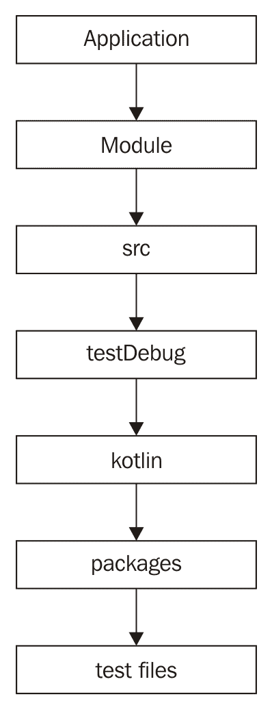
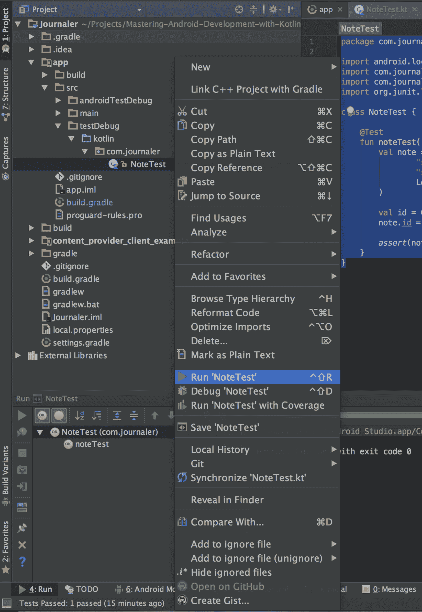

# 第十四章：测试

我们开发了一个代码基础庞大的应用程序。我们尝试过它，我们认为我们的应用程序没有错误。但是，我们可能是错的！有时，即使我们确信我们的应用程序没有错误，也可能发生一个危险的问题在等待。如何预防这种情况？简单！我们将编写测试来为我们检查我们的代码。在本章中，我们将向您介绍测试，并举例说明如何设置、编写和运行您的测试。

在本章中，我们将涵盖以下主题：

+   如何编写你的第一个测试

+   使用测试套件

+   如何测试 UI

+   运行测试

+   单元测试和仪器测试

# 添加依赖项

要运行测试，我们必须满足一些依赖关系。我们将通过扩展`build.gradle`来更新我们的应用程序配置，以支持测试并提供我们需要的类。打开`build.gradle`并扩展如下：

```kt
    apply plugin: "com.android.application" 
    apply plugin: "kotlin-android" 
    apply plugin: "kotlin-android-extensions" 

    repositories { 
      maven { url "https://maven.google.com" } 
    } 

    android { 
      ... 
      sourceSets { 
        main.java.srcDirs += [ 
                'src/main/kotlin', 
                'src/common/kotlin', 
                'src/debug/kotlin', 
                'src/release/kotlin', 
                'src/staging/kotlin', 
                'src/preproduction/kotlin', 
                'src/debug/java', 
                'src/release/java', 
                'src/staging/java', 
                'src/preproduction/java', 
                'src/testDebug/java', 
                'src/testDebug/kotlin', 
                'src/androidTestDebug/java', 
                'src/androidTestDebug/kotlin' 
        ] 
      } 
      ... 
      testOptions { 
        unitTests.returnDefaultValues = true 
      } 
    } 
    ... 
    dependencies { 
      ... 
      compile "junit:junit:4.12" 
      testCompile "junit:junit:4.12" 

      testCompile "org.jetbrains.kotlin:kotlin-reflect:1.1.51" 
      testCompile "org.jetbrains.kotlin:kotlin-stdlib:1.1.51" 

      compile "org.jetbrains.kotlin:kotlin-test:1.1.51" 
      testCompile "org.jetbrains.kotlin:kotlin-test:1.1.51" 

      compile "org.jetbrains.kotlin:kotlin-test-junit:1.1.51" 
      testCompile "org.jetbrains.kotlin:kotlin-test-junit:1.1.51" 

      compile 'com.android.support:support-annotations:26.0.1' 
      androidTestCompile 'com.android.support:support
     -annotations:26.0.1' 

      compile 'com.android.support.test:runner:0.5' 
      androidTestCompile 'com.android.support.test:runner:0.5' 

      compile 'com.android.support.test:rules:0.5' 
      androidTestCompile 'com.android.support.test:rules:0.5' 
     } 

    It is important to highlight use of: 
    testOptions { 
        unitTests.returnDefaultValues = true 
    } 
```

这将使我们能够测试内容提供程序并在我们的测试中使用所有相关的类。如果我们不启用此功能，我们将收到以下错误：

“错误：“方法...未模拟”！”

# 更新文件夹结构

文件夹结构和其中的代码必须遵循有关构建变体的约定。对于我们的测试，我们将使用结构的以下部分：

+   对于单元测试：



+   对于仪器测试：


现在我们准备开始编写我们的测试！

# 编写你的第一个测试

定位您的单元测试的`root`包，并创建一个名为`NoteTest`的新类，如下所示：

```kt
    package com.journaler 

    import android.location.Location 
    import com.journaler.database.Content 
    import com.journaler.model.Note 
    import org.junit.Test 

    class NoteTest { 

      @Test 
      fun noteTest() { 
        val note = Note( 
                "stub ${System.currentTimeMillis()}", 
                "stub ${System.currentTimeMillis()}", 
                Location("Stub") 
        ) 

        val id = Content.NOTE.insert(note) 
        note.id = id 

        assert(note.id > 0) 
     } 
    } 
```

测试非常简单。它创建一个`Note`的新实例，触发我们的内容提供程序中的 CRUD 操作来存储它，并验证接收到的 ID。要运行测试，请从项目窗格中右键单击类，然后选择“运行'NoteTest'”：



单元测试是这样执行的：


如您所见，我们成功地将我们的`Note`插入到数据库中。现在，在我们创建了第一个单元测试之后，我们将创建我们的第一个仪器测试。但在我们这样做之前，让我们解释一下单元测试和仪器测试之间的区别。仪器测试在设备或模拟器上运行。当您需要测试依赖于 Android 上下文的代码时，可以使用它们。让我们测试我们的主服务。在仪器测试的`root`包中创建一个名为`MainServiceTest`的新类，如下所示：

```kt
    package com.journaler 

    import android.content.ComponentName 
    import android.content.Context 
    import android.content.Intent 
    import android.content.ServiceConnection 
    import android.os.IBinder 
    import android.support.test.InstrumentationRegistry 
    import android.util.Log 
    import com.journaler.service.MainService 
    import org.junit.After 
    import org.junit.Before 
    import org.junit.Test 
    import kotlin.test.assertNotNull 

    class MainServiceTest { 

      private var ctx: Context? = null 
      private val tag = "Main service test" 

      private val serviceConnection = object : ServiceConnection { 
        override fun onServiceConnected(p0: ComponentName?, binder:
        IBinder?) { 
          Log.v(tag, "Service connected") 
        } 

        override fun onServiceDisconnected(p0: ComponentName?) { 
          Log.v(tag, "Service disconnected") 
        } 
     } 

     @Before 
     fun beforeMainServiceTest() { 
        Log.v(tag, "Starting") 
        ctx = InstrumentationRegistry.getInstrumentation().context 
     } 

     @Test 
     fun testMainService() { 
        Log.v(tag, "Running") 
        assertNotNull(ctx) 
        val serviceIntent = Intent(ctx, MainService::class.java) 
        ctx?.startService(serviceIntent) 
        val result = ctx?.bindService( 
           serviceIntent, 
           serviceConnection, 
           android.content.Context.BIND_AUTO_CREATE 
        ) 
        assert(result != null && result) 
     } 

     @After 
     fun afterMainServiceTest() { 
       Log.v(tag, "Finishing") 
       ctx?.unbindService(serviceConnection) 
       val serviceIntent = Intent(ctx, MainService::class.java) 
       ctx?.stopService(serviceIntent) 
    } 

   } 
```

要运行它，请创建一个新的配置，如下面的截图所示：


运行新创建的配置。您将被要求选择 Android 设备或模拟器实例，以在其上运行测试：


等待测试执行。恭喜！您已成功创建并运行了仪器测试。现在，为了练习，尽可能定义多个测试，以覆盖应用程序的所有代码。注意测试应该是单元测试还是仪器测试。

# 使用测试套件

**测试套件**是一组测试。我们将向您展示如何创建测试集合。创建一个测试来代表集合的容器。让我们称之为`MainSuite`：

```kt
    package com.journaler 

    import org.junit.runner.RunWith 
    import org.junit.runners.Suite 

    @RunWith(Suite::class) 
    @Suite.SuiteClasses( 
        DummyTest::class, 
        MainServiceTest::class 
    ) 
    class MainSuite  
```

重复我们在示例中为仪器测试所做的步骤来运行你的测试套件。

# 如何测试 UI

测试 UI 可以帮助我们防止用户发现意外情况、使应用崩溃或性能不佳。我们强烈建议您编写 UI 测试，以确保您的 UI 表现如预期。为此，我们将介绍 Espresso 框架。

首先，我们将添加以下依赖项：

```kt
    ... 
    compile 'com.android.support.test.espresso:espresso-core:2.2.2' 
    androidTestCompile 'com.android.support.test.espresso:espresso-
    core:2.2.2' 
    ... 
```

在编写和运行 Espresso 测试之前，在测试设备上禁用动画，因为这会影响测试、预期时间和行为。我们强烈建议您这样做！在您的设备上，转到设置|开发者选项|并关闭以下选项：

+   窗口动画比例

+   过渡动画比例

+   动画器持续时间比例

现在您已经准备好编写 Espresso 测试了。学习 Espresso 框架可能需要一些努力。对您来说可能会耗费一些时间，但它的好处将是巨大的！让我们来看一个 Espresso 测试的示例：

```kt
    @RunWith(AndroidJUnit4::class) 
    class MainScreenTest { 
       @Rule 
       val mainActivityRule =   
       ActivityTestRule(MainActivity::class.java) 

       @Test 
       fun testMainActivity(){ 
        onView((withId(R.id.toolbar))).perform(click()) 
        onView(withText("My dialog")).check(matches(isDisplayed())) 
      } 

   } 
```

我们已经确定我们将测试`MainActivity`类。在测试触发工具栏按钮点击后，我们检查对话框是否存在。我们通过检查标签可用性--`"My dialog"`来做到这一点。学习整个 Espresso 框架超出了本书的范围，但至少我们给了您一些可能性的提示。花些时间学习它，因为它肯定会帮助您！

# 运行测试

我们已经通过 Android Studio 执行了我们的测试。但是，一旦您编写了所有测试，您将希望一次运行它们所有。您可以为所有构建变体运行所有单元测试，但只能为特定风格或构建类型运行。插装测试也是如此。我们将向您展示使用 Journaler 应用程序的现有构建变体来执行此操作的几个示例。

# 运行单元测试

打开终端并导航到项目的`root`包。要运行所有单元测试，请执行以下命令行：

```kt
$ ./gtradlew test
```

这将运行我们编写的所有单元测试。测试将失败，因为`NoteTest`使用内容提供程序。为此，需要使用适当的`Runner`类来执行。默认情况下，Android Studio 会这样做。但是，由于这是一个单元测试，并且我们是从终端执行它，测试将失败。您会同意这个测试实际上是必须考虑为插装测试，因为它使用了 Android 框架组件。通常做法是，如果您的类依赖于 Android 框架组件，它必须作为插装测试来执行。因此，我们将`NoteTest`移动到插装测试目录中。现在我们没有任何单元测试。至少创建一个不依赖于 Android 框架组件的单元测试。您可以将现有的`DummyTest`移动到单元测试文件夹中以实现这一目的。从您的 IDE 中拖放它，并使用相同的命令重新运行测试。

要运行构建变体的所有测试，请执行以下命令行：

```kt
$ ./gradlew testCompleteDebug 
```

我们为`Complete`风格和`Debug`构建类型执行测试。

# 运行插装测试

要运行所有插装测试，请使用以下命令行：

```kt
$ ./gradlew connectedAndroidTest 
```

它的前提是已连接设备或正在运行的模拟器。如果有多台设备或模拟器存在，它们都将运行测试。

要运行构建变体的插装测试，请使用以下命令行：

```kt
$ ./gradlew connectedCompleteDebugAndroidTest 
```

这将触发`Connected`风格的所有插装测试，使用`Debug`构建类型。

# 总结

在本章中，我们学习了如何为我们的应用程序编写和运行测试。这是迈向生产的又一步。我们建立了一个书写良好且无 bug 的产品。很快，我们将实际发布它。请耐心等待，因为那一刻即将到来！
