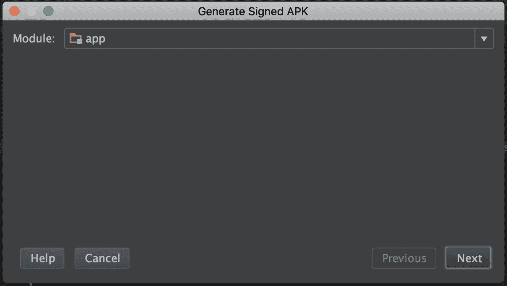
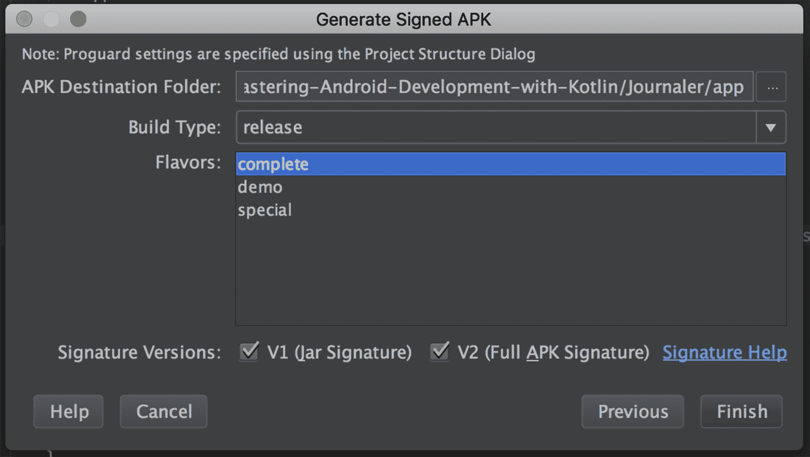
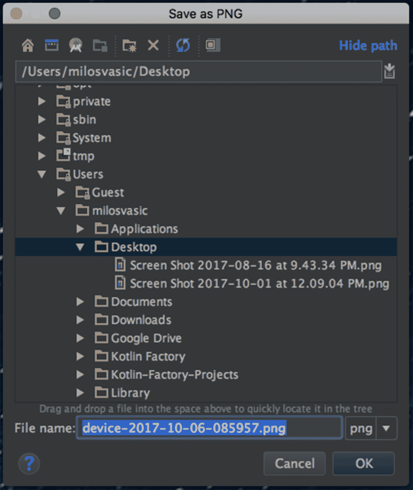
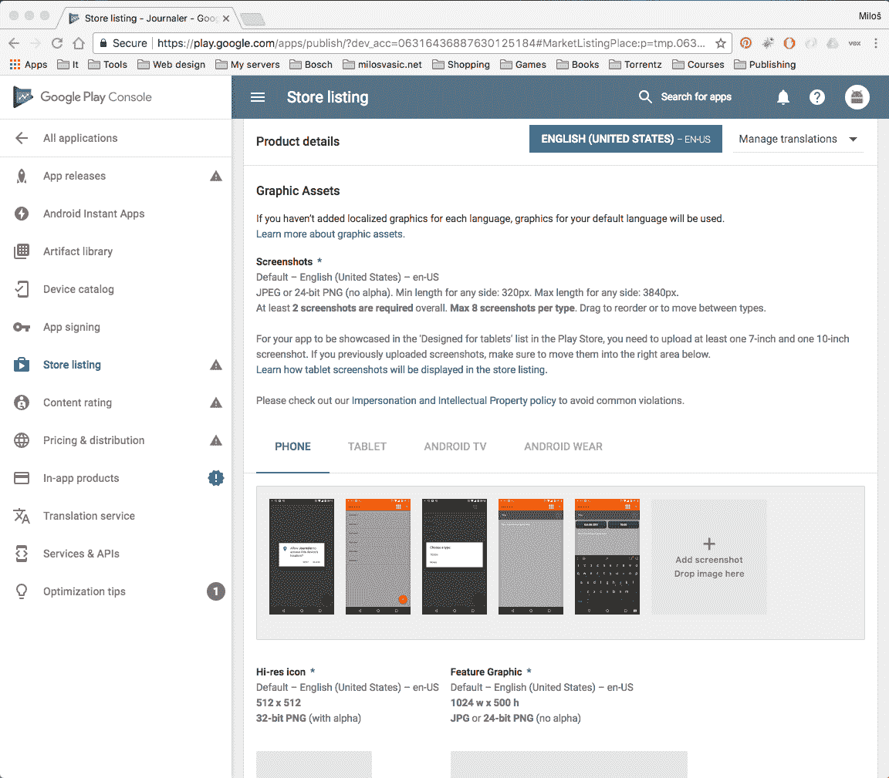
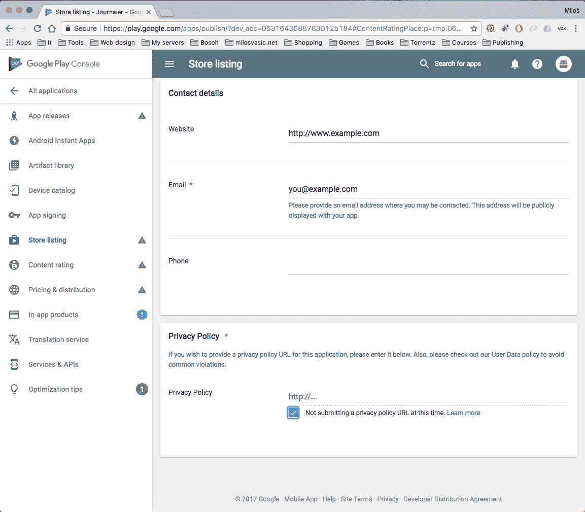
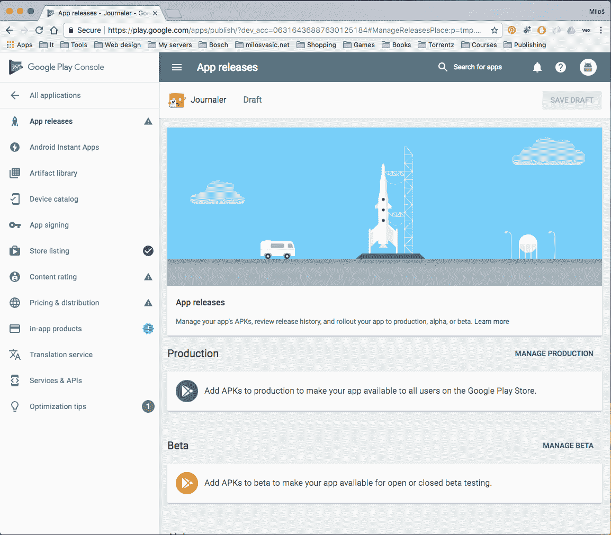
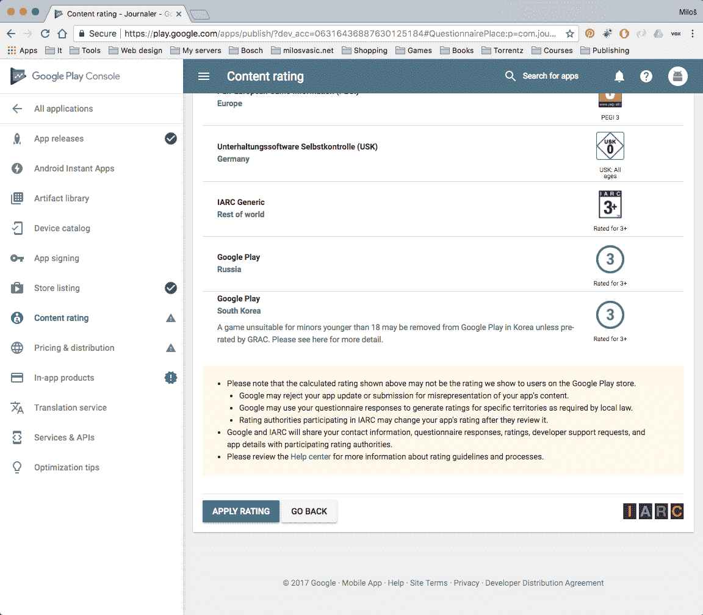
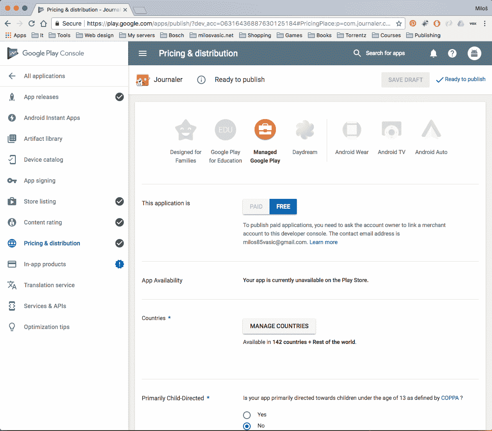
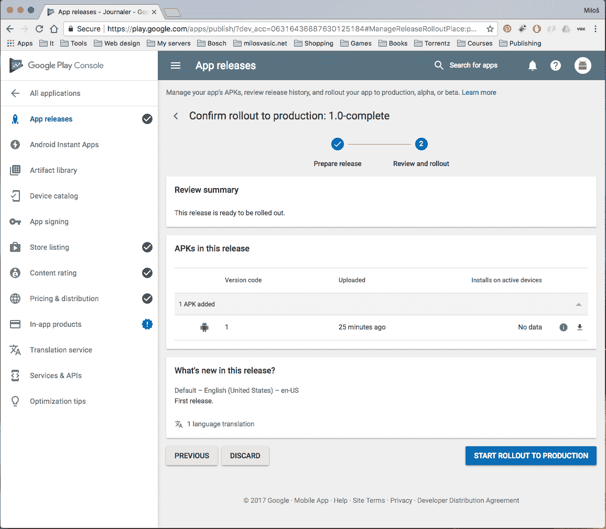
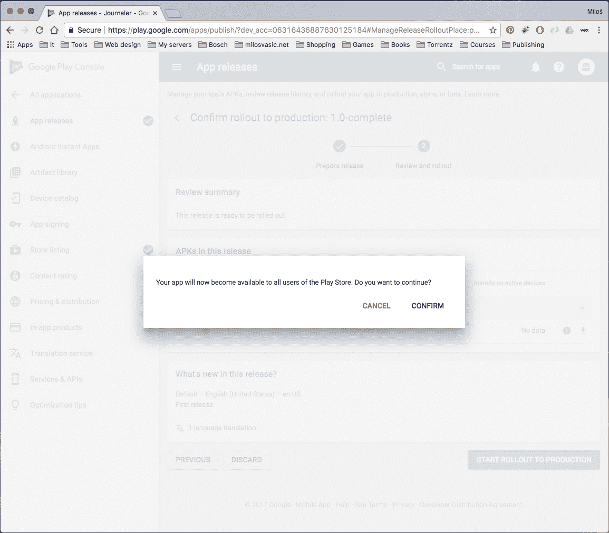

# 第十六章：部署您的应用程序

是时候让世界看到您的作品了。在我们发布之前还有一些事情要做。我们将做一些准备工作，然后最终将我们的应用程序发布到 Google Play 商店。

在本章中，我们将熟悉以下主题：

+   准备部署

+   代码混淆

+   签署您的应用程序

+   发布到 Google Play

# 准备部署

在发布您的应用程序之前，需要做一些准备工作。首先，删除任何未使用的资源或类。然后，关闭您的日志记录！使用一些主流的日志记录库是一个好习惯。您可以围绕`Log`类创建一个包装器，并且对于每个日志输出都有一个条件，检查它必须不是`release`构建类型。

如果您尚未将发布配置设置为可调试，请按照以下步骤操作：

```kt
    ... 
    buildTypes { 
      ... 
      release { 
        debuggable false 
      } 
    } 
    ...
```

完成后，请再次检查您的清单并进行清理。删除您不再需要的任何权限。在我们的情况下，我们将删除这个：

```kt
    <uses-permission android:name="android.permission.VIBRATE" /> 
```

我们添加了它，但从未使用过。我们要做的最后一件事是检查应用程序的兼容性。检查最小和最大 SDK 版本是否符合您的设备定位计划。

# 代码混淆

发布到 Google Play

```kt
    ... 
    buildTypes { 
      ... 
      release { 
        debuggable false 
        minifyEnabled true 
        proguardFiles getDefaultProguardFile('proguard-android.txt'),
         'proguard-rules.pro' 
      } 
    } 
    ... 
```

我们刚刚添加的配置将缩小资源并执行混淆。对于混淆，我们将使用 ProGuard。ProGuard 是一个免费的 Java 类文件缩小器，优化器，混淆器和预验证器。它执行检测未使用的类，字段，方法和属性。它还优化了字节码！

在大多数情况下，默认的 ProGuard 配置（我们使用的那个）足以删除所有未使用的代码。但是，ProGuard 可能会删除您的应用程序实际需要的代码！出于这个目的，您必须定义 ProGuard 配置以保留这些类。打开项目的 ProGuard 配置文件并追加以下内容：

```kt
    -keep public class MyClass 
```

以下是使用某些库时需要添加的 ProGuard 指令列表：

+   Retorfit：

```kt
        -dontwarn retrofit.** 
        -keep class retrofit.** { *; } 
        -keepattributes Signature 
        -keepattributes Exceptions 
```

+   下一步是启用代码混淆。打开您的`build.gradle`配置并更新如下：

```kt
        -keepattributes Signature 
        -keepattributes *Annotation* 
        -keep class okhttp3.** { *; } 
        -keep interface okhttp3.** { *; } 
        -dontwarn okhttp3.** 
        -dontnote okhttp3.** 

        # Okio 
        -keep class sun.misc.Unsafe { *; } 
        -dontwarn java.nio.file.* 
        -dontwarn org.codehaus.mojo.animal_sniffer.IgnoreJRERequirement 
```

+   Gson：

```kt
        -keep class sun.misc.Unsafe { *; } 
        -keep class com.google.gson.stream.** { *; } 
```

使用这些行更新您的`proguard-rules.pro`文件。

# 签署您的应用程序

在将发布上传到 Google Play 商店之前的最后一步是生成已签名的 APK。打开您的项目并选择构建|生成已签名的 APK：



选择主应用程序模块，然后继续单击“下一步”：

Okhttp3：

由于我们还没有密钥库，我们将创建一个新的。点击“创建新...”如下：


填充数据并单击“确定”。单击“下一步”，如果需要，输入您的主密码。检查两个签名并选择完整的口味进行构建。单击“完成”：



等待构建准备就绪。我们还将更新我们的`build.gradle`，以便每次构建发布时都进行签名：

```kt
    ... 
    android { 
      signingConfigs { 
        release { 
          storeFile file("Releasing/keystore.jks") 
          storePassword "1234567" 
          keyAlias "key0" 
          keyPassword "1234567" 
        } 
      } 
      release { 
        debuggable false 
        minifyEnabled false 
        signingConfig signingConfigs.release 
        proguardFiles getDefaultProguardFile('proguard-android.txt'),
        'proguard-rules.pro' 
      } 
    } 
    ... 
```

如果对您来说更容易，您可以按照以下步骤从终端运行构建过程：

```kt
$ ./gradlew clean 
$ ./gradlew assembleCompleteRelease 
```

在本例中，我们为完整的应用程序口味组装了发布版本。

# 

部署的最后一步将是发布已签名的发布 APK。除了 APK，我们还需要提供一些其他东西：

+   屏幕截图-从您的应用程序准备屏幕截图。您可以通过以下方式完成：从 Android Studio Logcat，单击屏幕截图图标（一个小相机图标）。从预览窗口，单击保存。将要求您保存图像：



+   具有以下规格的高分辨率图标：

32 位 PNG 图像（带 Alpha）

512 像素乘以 512 像素的尺寸

1024K 最大文件大小

+   功能图形（应用程序的主横幅）：

JPEG 图像或 24 位 PNG（无 Alpha！）

1024 像素乘以 500 像素的尺寸

+   如果您将应用程序发布为电视应用程序或电视横幅：

JPEG 图像或 24 位的 PNG（不带 alpha！）

1280p x 720px 的尺寸

+   促销视频--YouTube 视频（不是播放列表）

+   您的应用程序的文本描述

登录到开发者控制台（[`play.google.com/apps/publish`](https://play.google.com/apps/publish)）。

如果您尚未注册，请注册。这将使您能够发布您的应用程序。主控制台页面显示如下：


我们还没有发布任何应用程序。点击“在 Google Play 上发布 Android 应用程序”。将出现一个创建应用程序对话框。填写数据，然后点击“创建”按钮：


填写表单数据如下：


按照以下方式上传您的图形资产：



请参阅以下屏幕截图：


继续进行应用程序分类：


完成联系信息和隐私政策：



当您完成了所有必填数据后，滚动回到顶部，然后点击“保存草稿”按钮。现在从左侧选择“应用发布”。您将被带到应用发布屏幕，如下面的屏幕截图所示：



在这里，您有以下三个选项：

+   管理生产

+   管理测试版

+   管理测试版

根据您计划发布的版本，选择最适合您的选项。我们将选择“管理生产”，然后点击“创建发布”按钮，如下所示：


开始填写有关您发布的数据：


首先，添加您最近生成的 APK。然后继续到页面底部，填写表单的其余部分。完成后，点击“审核”按钮以审核您的应用程序发布：


在将我们的发布推向生产之前，点击左侧的内容评级链接，然后点击继续，如下面的屏幕截图所示：


填写您的**电子邮件地址**并滚动到页面的底部。选择您的类别：


我们选择 UTILITY，PRODUCTIVITY，COMMUNICATION，OR OTHER；在下一个屏幕上，填写您被要求的信息，如下所示：


保存您的问卷，并点击“应用评级”：



现在切换到定价和分发部分：



这个表格很容易填写。按照表格设置您被要求的数据。完成后，点击屏幕顶部的保存草稿按钮。您会看到“准备发布”链接已经出现。点击它：


点击“管理发布”，如前面的屏幕截图所示。按照屏幕的指引，直到您到达应用发布部分的最后一个屏幕。现在您可以清楚地看到“开始推出到生产”按钮已启用。点击它，当被询问时，点击“确认”：



继续：



就是这样！您已成功将您的应用程序发布到 Google Play 商店！

# 总结

希望您喜欢这本书！这是一次伟大的旅程！我们从零开始，从学习基础知识开始。然后，我们继续学习关于 Android 的中级，困难和高级主题。这一章让我们对我们想要告诉您的关于 Android 的故事有了最后的总结。我们做了大量的工作！我们开发了应用程序，并逐步完成了整个部署过程。

接下来呢？嗯，你接下来应该做的事情是考虑一个你想要构建的应用程序，并从零开始着手制作它。花点时间。不要着急！在开发过程中，你会发现很多我们没有提到的东西。安卓系统非常庞大！要了解整个框架可能需要几年的时间。许多开发者并不了解它的每一个部分。你不会是唯一一个。继续你的进步，尽可能多地编写代码。这将提高你的技能，并使你学到的所有东西变得常规化。不要犹豫！投入行动吧！祝你好运！
