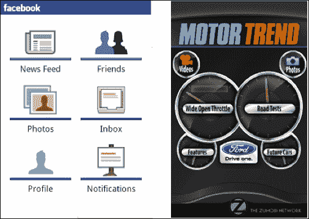
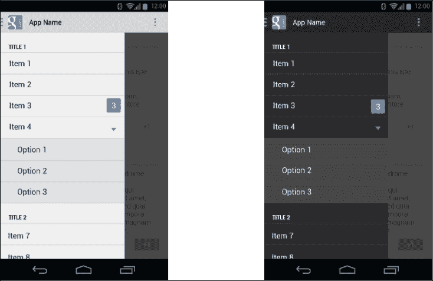
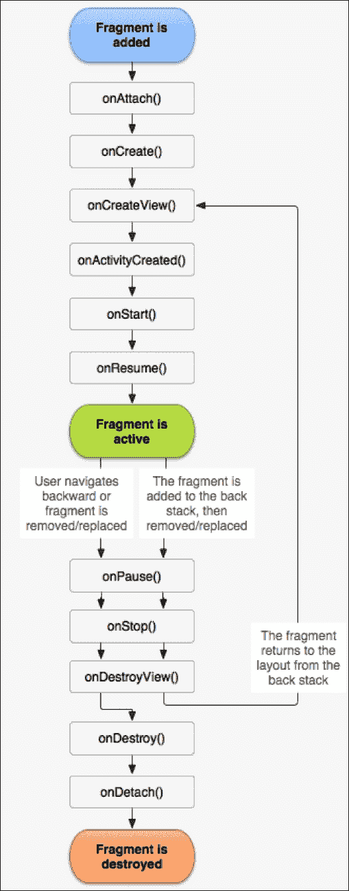
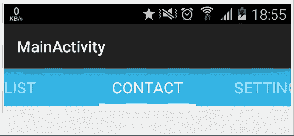

# 第二章：设计我们的应用程序

在本章中，我们将为应用程序想出一个创意，并将这个创意转化为真实的应用程序，创建要在屏幕上显示的基本结构，并选择适当的导航模式在它们之间移动。

在查看最常用的导航模式之后，我们将继续实施由片段和`ViewPager`组成的标签页模式。

在此过程中，我们将回顾我们关于片段的知识，以便能够解释高级概念。我们还将讨论`FragmentManager`和片段回退栈的重要性。

最后，我们将在屏幕过渡中添加一些美观的动画。因此，在本章中我们将介绍以下主题：

+   选择应用程序导航模式

+   精通片段

+   实施标签页和 ViewPager

+   屏幕之间的动画过渡

# 选择应用程序导航模式

想象一下，有一天你醒来时充满灵感；你有一个应用程序的创意，你相信它可能比 WhatsApp 更受欢迎。不要浪费时间，你会想要将这个应用程序创意变为现实！这就是为什么学习如何设计应用程序并选择最合适的导航模式对你很重要。不是要让你失去灵感，但你会发现你的 99%的创意已经在 Google Play 商店里了。事实上，有数十万的应用程序可供选择，而且数量还在不断增加！所以，你可以选择改进已有的应用程序，或者继续头脑风暴，直到你有一个原创的创意。

为了将应用程序变为现实，第一步是在心中可视化应用程序；为此，我们需要确定基本组件。我们需要在屏幕上简化想法，并且我们需要在屏幕之间移动。

请记住，你是在为 Android 用户创建这个应用程序。这些用户习惯于使用像 Gmail、Facebook 和 Spotify 等应用程序中的滑动面板导航模式。

我们将研究三种不同的、常用的导航模式，以确保用户在使用我们的应用程序时不会迷路，并能立即理解应用程序的结构。

## 基本结构

为了绘制我们的屏幕（请注意，我这里不是指活动或片段；所谓屏幕是指用户在我们应用程序执行期间任何时候实际可以看到的内容），我们需要确定我们创意的关键点。我们需要用软件开发术语来确定用例。

让我们先为我们将在本书过程中构建的应用程序**MasteringAndroidApp**赋予形状。一开始很难在脑海中想象出所有细节，所以我们将从确定我们肯定需要的组件开始，稍后再填补可能存在的空白。

我们从上一章知道，我们有一个演示屏幕，它会在需要时从互联网下载数据的同时显示应用程序的标志几秒钟。

在这个应用中，我们还将有一个来自互联网的信息列表屏幕，用户可以点击单个项目获取更详细的信息。

作为主要选项，我们将显示一个带有`MapView`的联系人屏幕，显示我的位置和联系数据。

最后，我们需要一个**偏好设置**或**设置**屏幕，在这里我们可以打开或关闭通知，禁用广告或购买额外内容。

现在，我们已经准备好创建一个草图。请看以下图片：


在顶部，我们有应用程序的入口点，即启动屏幕。这里的导航很直接；我们可以直接导航到下一个屏幕，并且没有按钮或任何其他可能的流程。

在下一层，我们有项目列表的屏幕（这是一个包含联系信息的屏幕）、地图视图和设置屏幕。这三个屏幕在我们的应用中处于同一级别，因此它们具有同等的重要性。

最后，我们还有一个第三层导航，这是列表中一个条目的详细视图。

我们打开这个屏幕的唯一方式是点击列表中的一个元素；因此，这个屏幕的入口点是列表屏幕。

现在我们已经创建了一个基本的结构和流程，我们将研究不同的广泛使用的导航模式，以决定哪一种最适合我们的应用。

### 注意

有关应用结构和有关材料设计类似信息的更多信息，请参考以下链接：

[`developer.android.com/design/patterns/app-structure.html`](https://developer.android.com/design/patterns/app-structure.html)

[`www.google.com/design/spec/patterns/app-structure.html#`](http://www.google.com/design/spec/patterns/app-structure.html#)

## 仪表板模式

仪表板模式是 Android 中最早使用的模式之一。它由一组在主屏幕上以图标矩阵形式显示的元素组成。在下面的图片中，我们可以看到左侧是 Facebook 应用的一个早期版本，而在右侧，是 Motor Trend 对这个模式的定制：



这种视图非常适合那些旨在清晰显示非常有限选项的应用；每行不超过两个元素，行数适合屏幕显示。

这些图标清晰地显示了主要功能的符号，所有选项都在同一级别。它非常适合目标受众广泛的应用程序；它简单明了，一目了然，任何人都可以导航。

尽管这个设计看起来很古老，考虑到它曾在 Android 的早期版本中被广泛使用，而现在使用较少，但它的使用取决于你的需求，所以不要因此放弃。前面图片中显示的 Motor Trends 应用对这个模式有一个非常原始的实现。

如果元素不适合屏幕，我们需要滚动才能发现它们，我们需要重新考虑这个模式。当我们有太少的元素时，情况也是如此；这些情况下有更好的选择。在我们的具体示例中，我们有三个主要元素，所以我们不会使用这个模式。

## 滑动面板

这种模式因 Gmail 和 Facebook 等应用而广为人知。它在用户界面的顶层展示一个布局；当我们执行滑动手势或点击左上或右上按钮时，屏幕会从左或右侧滑出，这个按钮通常是一个显示三条水平线的图标，也被称为汉堡图标。

如果我们的应用在同一层级有大量选项，这种模式是完美的，并且它可以与其他模式结合使用，例如**标签模式**。

这个面板的实现可以通过`DrawerLayout`类完成，它由两个子视图组成：一个带有内容和导航抽屉的`FrameLayout`，导航抽屉可以是`ListView`或任何其他包含选项的自定义布局。

为此，执行以下代码：

```java
<android.support.v4.widget.DrawerLayout    
   android:id="@+id/drawer_layout"   
   android:layout_width="match_parent"   
   android:layout_height="match_parent" >   

   <FrameLayout   
    android:id="@+id/frame_container"   
    android:layout_width="match_parent"   
    android:layout_height="match_parent" />   

   <ListView   
    android:id="@+id/drawer_list"   
    android:layout_width="240dp" 
    android:background="#fff"  
    android:layout_height="match_parent"   
    android:layout_gravity="start" />   

  </android.support.v4.widget.DrawerLayout>
```

一旦我们在侧边栏选择了一个元素，屏幕中央就会出现一个子元素；这个子元素可以帮助你导航到子子元素，但不能导航到主菜单的元素。子元素和子子元素的导航可以通过后退按钮或在操作栏中使用向上导航来管理。

我们可以通过点击一个项目来关闭面板，并通过设置一个抽屉监听器`ActionBarDrawerToggle`来知道面板是关闭还是打开，它包含`onDrawerClosed(View drawerView)`和`onDrawerOpened(View drawerView)`方法。

确保你使用了来自`android.support.v7.app`的`ActionBarDrawerToggle`；v4 中包含的已弃用。

这种模式的另一个大优点是，它允许通过菜单上的一个主项目进行分组导航，可以展开成子项目。正如在以下示例中可以看到，项目 4 在下拉菜单中有三个选项：



抽屉布局的一个示例

这种模式不适合我们的应用，因为我们没有足够的选项来充分利用这个模式。此外，由于这个模式可以与标签模式结合，从教育角度来看，用这个模式开发我们的示例更有意义。

## 标签

标签模式是一种你可能之前见过并使用过的模式。

它显示了一个具有同一层级的组件的固定菜单。请注意，当我们有标签时，菜单总是可见的，这在滑动和仪表板模式中不会发生。这看起来与网页界面非常相似，并且非常用户友好，考虑到用户可能已经熟悉这个模式。

以下模式有两个变体：固定标签和滑动标签。如果我们只有少量可以一次显示在屏幕上的菜单项，第一个变体将是最合适的，因为它可以一次向用户展示所有项目。


当所有项目不适合屏幕或当前适合但知道未来会增加更多项目而无法容纳时，通常会使用滑动标签。

两种变体的实现略有不同，因此在决定变体时我们需要考虑未来的变化。在这里，我们可以看到一个滑动变体的实现：


### 提示

请记住，为了平台的一致性，我们必须将标签放置在屏幕顶部；否则，人们会认为您是 iOS 开发者！

以下是一些来自材料设计指南的功能和格式规范供您遵循：

+   将标签作为单行呈现。如果需要，将标签文本换行到第二行，然后截断。

+   不要在标签内包含一组标签化内容。

+   高亮显示与可见内容对应的标签。

+   按层次结构将标签分组。将一组标签与其内容连接起来。

+   保持标签与其内容相邻。这有助于减少两者之间的歧义，保持关系。

在以下图片中，我们可以看到一个带有子菜单的滚动/滑动标签的示例：


### 注意

设计标签时的图形规范以及有关标签规范更多信息可以在 [`www.google.com/design/spec/components/tabs.html#`](http://www.google.com/design/spec/components/tabs.html#) 找到。

既然我们已经知道了应用程序导航的基础知识，我们可以探索实现这些模式所需的组件。如您所知，主要组件是活动和碎片。我们将实现带有三个碎片的滑动标签的示例。

# 碎片（Fragments）

在本节中，我们将简要回顾碎片的关键概念，以解释高级功能和组件，如碎片管理器和碎片后退栈。

在我们的示例中，我们将创建一个名为 `MainActivity` 的活动以及四个碎片：`ListFragment`、`ContactFragment`、`SettingsFragment` 和 `DetailsFragment`。为此，您可以创建一个 `fragments` 包，双击该包以进入 **新建** | **碎片** | **空白碎片**。看看以下对话框：


目前，您可以不使用碎片工厂方法和接口回调来创建它们。我们将在本章后面介绍这些内容。

到目前为止，我们的项目在**项目**视图中应该看起来像这样：


## 理解碎片的重要性

一个碎片代表活动中的一个行为或用户界面部分。您可以在单个活动中组合多个碎片以构建多窗格 UI，并在多个活动中重用碎片。您可以认为碎片是活动的一个模块化部分，它有自己的生命周期并接收自己的输入事件，您可以在活动运行时添加或删除（有点像可以在不同活动中重用的*子活动*）。



片段的生命周期与活动的生命周期略有不同。我们注意到的第一个区别是使用了 `OnAttach()` 和 `OnDetach()` 方法，它们将片段连接到活动中。

使用 `onCreate()`，我们可以在 `OnCreateView()` 中创建视图；在这之后，我们可以在片段中调用 `getView()`，它将不会是 null。

`onActivityCreated()` 方法告诉片段其活动已经在它自己的 `Activity.onCreate()` 中完成。

有两种方法可以显示片段：

第一种方法是在我们的布局 XML 中包含片段。当包含它的视图被填充时，这将创建我们的片段。执行以下代码：

```java
<LinearLayout 
    android:orientation="horizontal"
    android:layout_width="fill_parent"
    android:layout_height="fill_parent">

    <fragment android:name="com.example.android.MyFragment"
              android:id="@+id/headlines_fragment"
android:layout_width="match_parent"
              android:layout_height="match_parent" />
</LinearLayout>
```

第二种方法是程序化地创建我们的片段，并告诉片段管理器在容器中显示它。为此，你可以使用以下代码：

```java
<LinearLayout 
    android:orientation="horizontal"
    android:layout_width="fill_parent"
    android:layout_height="fill_parent">

    <Framelayout android:id="@+id/fragment_container"
android:layout_width="match_parent"
             android:layout_height="match_parent" />

</LinearLayout>
```

之后，使用以下代码行填充一个 `FrameLayout` 容器，片段将被插入其中：

```java
Myfragment fragment = MyFragment.newInstance();
getSupportFragmentManager().beginTransaction()
                    .add(R.id.fragment_container, fragment).commit();
```

为了结束关键概念，解释为什么 Android 示例使用 `MyFragment.newInstance(params)` 工厂方法而不是默认的 `new MyFragment(params)` 构造函数来创建片段是很重要的。看看以下代码：

```java
public class MyFragment extends Fragment {

 // Static factory method that returns a new fragment
 // receiving a   parameter and initializing the fragment's arguments

    public static MyFragment newInstance(int param) {
        MyFragment fragment = new MyFragment();
        Bundle args = new Bundle();
        args.putInt("param", param);
        fragment.setArguments(args);
        return fragment;
    }
}
```

这种模式背后的原因是，Android 只会使用默认构造函数重新创建片段；因此，如果我们有一个带参数的构造函数，它将被忽略，参数也将丢失。

### 提示

请注意，我们将参数作为参数包发送，这样如果片段需要被重新创建（由于设备方向改变，我们使用后退导航），片段就可以检索参数。

## 片段管理器

片段管理器是一个接口，用于与活动内的片段进行交互。这意味着任何操作，如添加、替换、移除或查找片段，都必须通过它来完成。

为了获得片段管理器，我们的 `Activity` 需要从 `FragmentActivity` 继承，这将允许我们调用 `getFragmentManager()` 或 `getSupportFragmentManager()`，最好是使用 `Android.support.v4` 中包含的保持向后兼容的片段管理器。

如果我们想要使用嵌套片段，可以通过 `getChildFragmentManager()` 来管理它们。当布局包含 `<fragment>` 时，我们不能将布局填充到片段中。只有动态添加到片段中的时候，嵌套片段才是支持的。

现在，我们将讨论一些在我们使用片段时会迟早遇到的情况。假设我们有一个带有两个片段 A 和 B 的活动。

一个典型的情况是，我们处于一个片段中，想要从活动中执行一个方法。在这种情况下，我们有两个选择；一个是实现在 `MyActivity` 中的 `public` 方法，例如 `doSomething()`，这样我们就可以将 `getActivity` 强制类型转换为我们的活动，并调用 `((MyActivity)getActivity).doSomething();` 方法。

第二种方法是让我们的活动实现碎片中定义的接口，并在`onAttach(Activity)`方法中将活动的实例设置为该接口的监听器。我们将在第四章中解释这种软件模式，*并发与软件设计模式*。反过来，如果要让活动与碎片通信（如果我们没有在活动中将碎片 A 实例化到一个变量中），我们可以通过管理器找到碎片。我们可以在以下部分查看如何使用容器 ID 或标签找到碎片：

```java
FragmentManager fm = getSupportFragmentManger();
FragmentA fragmentA = fm.findFragmentById(R.id.fragment_container);
fragmentA.doSomething(params);
```

最后一种情况是在碎片 A 中与 B 对话；为此，我们只需从活动中获取管理器并找到碎片。运行以下代码：

```java
FragmentManager fm = getActivity().getSupportFragmentManger();
FragmentA fragmentA = fm.findFragmentById(R.id.fragment_container);
fragmentA.doSomething(params);
```

## 碎片堆叠

我们一直在讨论在碎片管理器中查找碎片，这是由于碎片管理器的碎片堆栈，我们可以在事务期间添加或删除碎片。

当我们想要动态显示一个碎片时，我们可以决定是否要将碎片添加到堆栈中。将碎片放在堆栈上可以让我们返回到上一个碎片。

这对于我们的示例非常重要；如果用户在第一个标签上，点击列表中的项目，我们希望他/她看到详情屏幕，即`DetailsFragment`。现在，如果用户在`DetailsFragment`上，点击返回按钮，我们不希望他/她离开应用；我们希望应用返回到碎片堆叠。这就是为什么我们在添加`DetailsFragment`时，必须包含`addToBackStack(String tag)`选项。标签可以为 null，也可以是允许我们通过标签找到这个新碎片的`String`类型。它将类似于以下内容：

```java
FragmentTransaction ft = getFragmentManager().beginTransaction();
ft.replace(R.id.simple_fragment, newFragment);
ft.addToBackStack(null);
ft.commit();
```

为了进一步澄清，如果我们想在三个碎片之间导航，从*A 到 B 再到 C*，然后返回，拥有堆栈将允许我们从*C 到 B 再到 A*。然而，如果我们不将碎片添加到返回堆栈中，或者在同一容器中添加或替换它们，*A 到 B 再到 C*，这将只留下 C 碎片，并且无法返回导航。

现在，为了在`DetailsFragment`中实现返回导航，我们需要让活动知道当我点击返回时，我想先在碎片中返回，然后再退出应用，这是默认的行为。如果堆栈中不止一个碎片，可以通过重写`onKeyDown`并处理碎片导航来实现这一点。运行以下命令：

```java
@Override
public boolean onKeyDown(int keyCode, KeyEvent event) {
if (keyCode == KeyEvent.KEYCODE_BACK && getSupportFragmentManager.getBackStackEntryCount > 1) {
getSupportFragment.popBackStack();
return true;
}
return super.onKeyDown(keyCode, event);
}
```

# 视图翻页

继续我们的示例，在`MainActivity`中，我们有两种在碎片之间导航的方法：一种是点击标签，另一种是滑动碎片。为了实现这一点，我们将使用`ViewPager`，包括其中的滑动标签，这是一个非常优雅的解决方案，代码量最小，并且包括滑动和标签之间的同步。

`ViewPager`可用于滑动任何类型的视图。我们可以使用`ViewPager`创建一个图片画廊；在首次运行某些应用时，经常会看到教程，你可以滑动屏幕查看应用操作说明，这是通过`ViewPager`实现的。要将`ViewPager`添加到`MainActivity`，我们可以简单复制并粘贴以下代码：

```java
<?xml version="1.0" encoding="utf-8"?>
<android.support.v4.view.ViewPager

android:id="@+id/pager"
android:layout_width="match_parent"
android:layout_height="match_parent" />
```

在`ViewPager`部分末尾，我们将了解如何使用不同的第三方库来改善标签页的体验，以及如果我们想要自定义解决方案，如何手动创建这些标签页。

## 适配器

`ViewPager`与适配器一起工作；适配器是负责创建我们滑动的每个*页面*的元素。在滑动片段的特殊情况下，有`Adapter`类的扩展名为`FragmentPagerAdapter`和`FragmentStatePagerAdapter`，我们可以使用：

+   `FragmentStatePagerAdapter`保存页面的状态，在屏幕上不显示时销毁它，并在需要时重新创建，这与`ListView`对其行的处理类似。

+   `FragmentPagerAdapter`将所有页面保存在内存中；因此，在滑动时没有与保存和恢复状态相关的计算成本。我们可以拥有的页面数量取决于内存。

根据元素数量，我们可以选择其中之一。如果我们正在创建一个阅读新闻的应用，你可以在很多带有图片和不同内容的新闻文章之间滑动，我们不会尝试将它们全部保存在内存中。

我们有三个固定的标签页，因此我们将选择`FragmentPagerAdapter`。我们将创建一个包装适配器，并创建一个名为`MyPagerAdapter`的类，这个类将扩展`FragmentPagerAdapter`。在扩展它的时候，我们需要重写`getCount()`和`getItem(int i)`方法，这些方法返回项目数量和在给定位置返回一个项目。

创建构造函数并完成方法后，我们的类将类似于以下代码：

```java
public class MyPagerAdapter extends FragmentPagerAdapter {

    public MyPagerAdapter(FragmentManager fm) {
        super(fm);
    }

    @Override
    public Fragment getItem(int i) {
        switch (i) {
            case 0 :
                return new ListFragment();
            case 1 :
                return new ContactFragment();
            case 2 :
                return new SettingsFragment();
            default:
                return null;
        }
    }

    @Override
    public int getCount() {
        return 3;
    }
}
```

最后，我们需要在`MainActivity`中将适配器设置到翻页器中。执行以下代码：

```java
public class MainActivity extends FragmentActivity {

    @Override
    protected void onCreate(Bundle savedInstanceState) {
        super.onCreate(savedInstanceState);
        setContentView(R.layout.activity_main);

        MyPagerAdapter adapter = new MyPagerAdapter(getSupportFragmentManager());
        ViewPager viewPager = (ViewPager) findViewById(R.id.pager);
        viewPager.setAdapter(adapter);

    }

}
```

## 滑动标签

在我们的示例中，此时我们已经能够在片段之间滑动。现在，我们将使用`PagerTabStrip`或`PagerTitleStrip`添加标签页。

实现这一点有一个非常优雅的方法，即在`ViewPager`的 XML 标签中包含`PageTabStrip`。执行以下代码：

```java
<?xml version="1.0" encoding="utf-8"?>
<android.support.v4.view.ViewPager

android:id="@+id/pager"
android:layout_width="match_parent"
android:layout_height="wrap_content">

    <android.support.v4.view.PagerTabStrip
        android:id="@+id/pager_title_strip"
        android:layout_width="match_parent"
        android:layout_height="wrap_content"
        android:layout_gravity="top"
        android:background="#33b5e5"
        android:textColor="#fff"
        android:textSize="20dp"
        android:paddingTop="10dp"
        android:paddingBottom="10dp" />

</android.support.v4.view.ViewPager>
```

在这里，`PagerTabStrip`将找到页面的标题，并为每个页面显示一个标签。我们需要在`MyPagerAdapter`中添加`getPageTitle`方法，它将为每个页面返回一个字符串。在我们的例子中，这将是一下部分的名字：列表、联系人和设置。为此，你可以使用以下代码：

```java
@Override
public CharSequence getPageTitle(int position) {
  switch (position) {
    case 0 :
    return "LIST";
    case 1 :
    return "CONTACT";
    case 2 :
    return "SETTINGS";
    default:
    return null;
  }
}
```

运行应用，瞧！我们轻松实现了一个流畅的标签页和滑动导航支持，支持 Android 1.6（API 4）：



## 定制标签页

Android 中的标签页背后有一个很长的故事；最初，标签页是通过`TabActivity`实现的，但在 API 13 中被废弃，并演变成了`FragmentTabHost`。

因此，我按照 Android 文档，高兴地使用`TabHost`开发了一个应用，然后意识到这一点必须改变。起初，我抱着侥幸心理，希望废弃不会影响我的应用，直到一些用户抱怨应用崩溃。然后，不可避免地，我必须移除废弃的`TabHost`并寻找新的方法。

一开始，`FragmentTabHost`似乎是一个实现固定标签页的好方法，但它不允许在标签上使用图标。在遇到这个问题，并在 Stack Overflow 上发现其他人也有同样的问题（一个可以提问和找到关于 Android 和其他主题答案的网站），我决定寻找另一种方法。

在 API 11 中，出现了`ActionBar.Tab`的概念，这是一个允许我们向操作栏添加标签页的类。最终，我找到了在我的应用中实现标签页的方法，这让用户们感到高兴！但这种喜悦并没有持续太久；`ActionBar.Tab`又被废弃了！

这件事会让任何开发者的耐心耗尽；这让我决定在`LinearLayout`中以按钮的形式创建自己的标签页。在按钮上设置点击监听器，点击标签页时，我将`ViewPager`滑动到正确的页面，反之，当检测到`ViewPager`页面滑动时，我会选择正确的标签页。这样做是值得的，因为它让我在设计标签页时拥有完全的自由度，更重要的是，它给了我一种满足感，除非有一天`LinearLayout`或`Button`被废弃，否则它将一直有效。

你总是可以把自定义实现作为最后的选择。如今，如果你不喜欢滑动标签页的设计，你可以使用第三方库的其他替代方案，比如`ViewPagerIndicator`和`PagerSlidingTabStrip`。

### 备注

要了解更多信息，你可以查看以下链接：

[JakeWharton 的 ViewPagerIndicator](https://github.com/JakeWharton/ViewPagerIndicator)

[astuetz 的 PagerSlidingTabStrip](https://github.com/astuetz/PagerSlidingTabStrip)

# 过渡效果

像是创建我们自己的屏幕过渡动画这样的小细节，将使我们的应用更加精致，看起来更加专业。

我们的示例非常适合讨论过渡，因为我们有两种类型的屏幕过渡：

+   第一个是活动之间的过渡，从`SplashActivity`到`MainActivity`。

+   第二个（尚未实现）是碎片之间的过渡，其中`ListFragment`被`DetailsFragment`替换。

对于活动之间的过渡，我们需要在启动新活动之前调用`overridePendingTransition`。该方法接收两个动画作为参数，这些动画可以是我们创建的 XML 文件中的，也可以是从 Android 中已经创建的动画中选择。运行以下命令：

```java
overridePendingTransition(android.R.anim.fade_in, android.R.anim.fade_out);
```

在我们的示例中，我们不允许可返回导航到`SplashActivity`；然而，如果我们处于需要点击返回时具有相同过渡的活动之间的过渡，我们将不得不重写返回键按下并设置我们的过渡。为此，您可以运行以下命令： 

```java
@Override public void onBackPressed() {
   super.onBackPressed();        overridePendingTransition(android.R.anim.fade_in,  android.R.anim.fade_out); 
}
```

在处理片段时，我们需要在`FragmentTransaction`对象中指定转换。使用对象动画师，我们可以在两个文件中定义这一点：`enter.xml`和`exit.xml`。执行以下代码：

```java
FragmentTransaction transaction = getFragmentManager().beginTransaction();
transaction.setCustomAnimations(R.animator.enter, R.animator.exit);
transaction.replace(R.id.container, new DetailsFragment());
transaction.commit();

enter.xml

<?xml version="1.0" encoding="utf-8"?>
<set>
     <objectAnimator

         android:duration="1000"
         android:propertyName="y"
         android:valueFrom="2000"
         android:valueTo="0"
         android:valueType="floatType" />
</set>

exit.xml 
<?xml version="1.0" encoding="utf-8"?>
<set>
    <objectAnimator

        android:duration="1000"
        android:propertyName="y"
        android:valueFrom="0"
        android:valueTo="-2000"
        android:valueType="floatType" />
</set>
```

对于 Android Lollipop 及更高版本，您可以直接为片段设置过渡。使用以下代码片段：

```java
Fragment f = new MyFragment();
f.setEnterTransition(new Slide(Gravity.RIGHT));
f.setExitTransition(new Slide(Gravity.LEFT));
```

# 总结

在本章结束时，您应该了解基本的导航模式，并能将心中应用程序的想法转化为 Android 应用程序的实际结构。片段是 Android 开发中的关键概念，我们在本章中通过复习片段管理器和片段回退堆栈，以及学习如何应对它们之间的通信等常见问题，已经足够时间掌握它们。我们考虑了一个带有`PagerTabStrip`的`ViewPager`的工作示例，它将页面标题显示为标签，现在您知道如果需要如何自定义它。我们有一个应用程序的框架；这个项目可以在这一阶段保存，并用作您未来开发的模板。我们已经准备好继续发展我们的应用程序。

在下一章中，我们将了解如何创建和访问将填充我们的片段和`ViewPager`的内容，使我们的应用程序生动起来。
