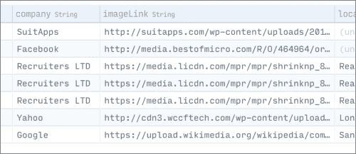
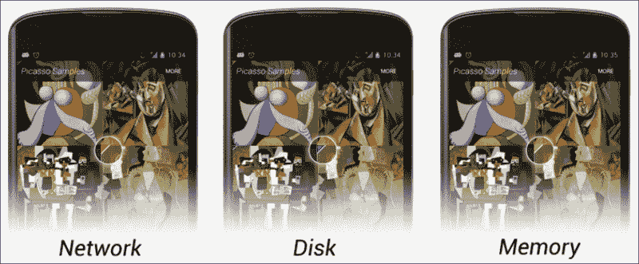
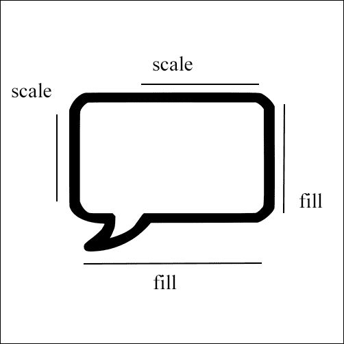
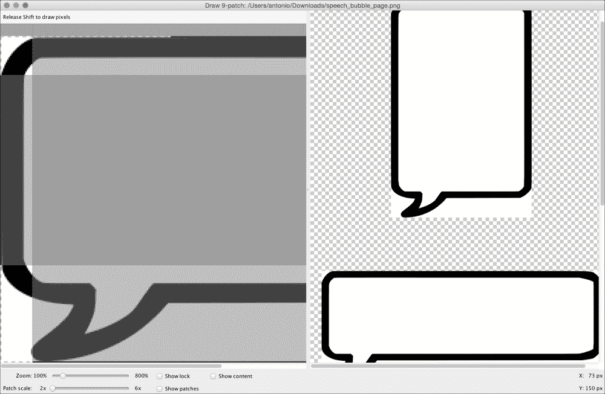
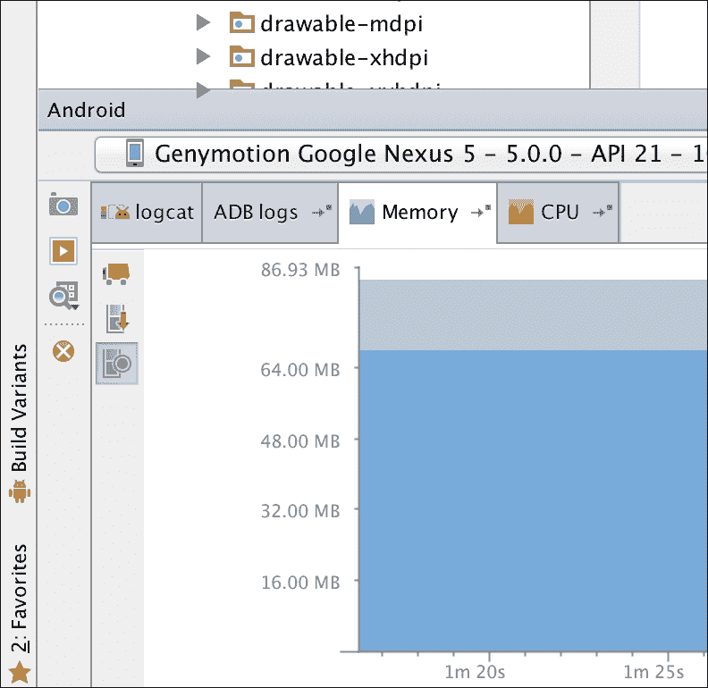
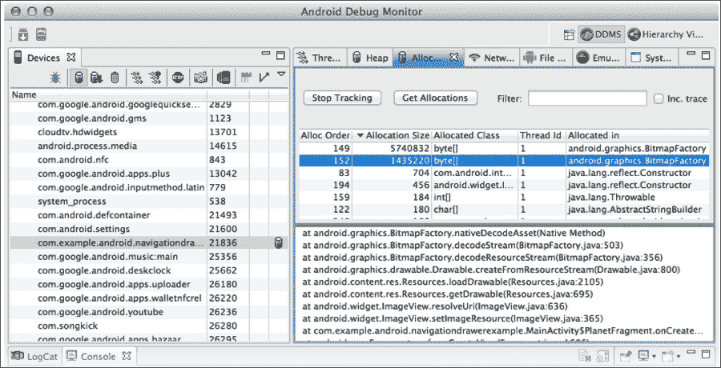

# 第七章. 图像处理与内存管理

在本章中，我们将探讨如何显示从 URL 下载的图片。我们将讨论如何使用 Android 原生 SDK 以及常用的第三方库来实现这一点。我们会考虑关键概念和特性，如下载、压缩、缓存系统以及在内存或磁盘上的存储。

我们还将讨论什么是九宫格图片以及如何创建它，并且会通过介绍矢量图像，讲解不同尺寸和密度文件夹中的可绘制资源。

最后一节将重点关注内存管理。识别我们应用中的内存泄漏是一项关键任务，这通常发生在处理图像时。我们将探讨可能导致这些泄漏的常见错误以及如何预防的一般性技巧。

+   显示网络图像

    +   传统方式

    +   Volley ImageDownloader

    +   Picasso 库

+   图像

    +   矢量图像

    +   动画矢量图像

    +   九宫格图片

+   内存管理

    +   检测和定位内存泄漏

+   防止内存泄漏

# 下载图片

使用`ImageView`下载并显示图片可以在一行代码中完成。自从 Android 开发起步，这是每个开发者都会做的事情。Android 是一项超过五年历史的技术，因此我们可以预期这项技术相当先进，也能找到简化它的第三方解决方案。话虽如此，如果这本书不解释在没有任何第三方库的情况下下载和显示图片的过程，它就不会被称为《精通 Android》。

在你的应用中使用最新库是好的，但理解你所实施的解决方案更好，能够自己构建这个库则是最好不过了。

在处理图像时，我们需要从网络连接到数组字节的下载及其转换为**位图**的一切。在某些情况下，将图像存储在磁盘上有意义，这样下次我们打开应用时，这些图像就已经在那里了。

即使我们能够显示一张图片，事情并没有就此结束；我们应该能够在列表视图中管理图片的下载。下载、存储和显示系统的同步是应用无故障运行、拥有流畅列表且能无问题滚动的关键。请记住，当我们滚动列表时，视图是被回收的。这意味着如果我们快速滚动，可能会开始下载一张图片。等到下载完成时，该视图可能已经不再屏幕上显示，或者它可能被回收用于另一个视图。

## 下载图片的传统方式

要在不使用任何第三方库（互联网上托管的带有 URL 的图片）的情况下显示图片，我们需要使用`HttpURLConnection`建立连接。我们需要打开一个输入流并消费信息，这可以通过工厂方法`BitmapFactory.decodeStream(InputStream istream)`转换为 Bitmap 图像。我们可以将其从输入流转换为文件，以便将图片存储在磁盘上，以后再访问。目前，让我们先尝试下载它并将其转换为 Bitmap 图像，我们将把它保存在内存中并在`ImageView`中显示。

我们将在`OfferDetailActivity`中为每个职位展示公司的标志。请记住，在 Parse 中，我们创建了一个数据库，并创建了一个名为`imageLink`的字段。你只需要用该公司的标志 URL 填充该字段。



我们需要在`OfferDetailActivity`中添加图片链接；为此，在`JobOfferAdapter`中点击卡片时，我们需要在意图中发送一个额外的参数。使用以下代码：

```java
@Override
public void onClick(View view) {
  Intent intent = new Intent(view.getContext(), OfferDetailActivity.class);
  JobOffer offer = mOfferList.get(getPosition());
  intent.putExtra("job_title", offer.getTitle());
  intent.putExtra("job_description",offer.getDescription());
  intent.putExtra("job_image",offer.getImageLink());
  view.getContext().startActivity(intent);
}
```

负责图片下载的方法将是一个静态方法，可以从应用程序的任何位置调用。这个方法将被放在名为`utils`的包内的`ImageUtils`类中。我们首先检查 URL 是否正确，然后从`HttpURLConnection`消费内容，将输入流转换为之前解释的 Bitmap 图像：

```java
public static Bitmap getImage(String urlString) {

  URL url = null;

  try {
    url = new URL(urlString);
  } catch (MalformedURLException e) {
    return null;
  }

  HttpURLConnection connection = null;
  try {
    connection = (HttpURLConnection) url.openConnection();
    connection.connect();
    int responseCode = connection.getResponseCode();
    if (responseCode == 200) {
      return BitmapFactory.decodeStream(connection.getInputStream());
    } else
      return null;
  } catch (Exception e) {
    return null;
  } finally {
    if (connection != null) {
      connection.disconnect();
    }
  }
}
```

我们将创建一个名为`displayImageFromUrl()`的方法，该方法接收`ImageView`和一个带有链接的字符串，以代替在`onCreate`中拥有所有这些逻辑。在`onCreate`中，我们只需要检索参数并调用该方法：

```java
String imageLink = getIntent().getStringExtra("job_image");
ImageView imageViewLogo = (ImageView) findViewById(R.id.logo);

displayImageFromUrl(imageViewLogo,imageLink);
```

在这个阶段，我们可能会想要调用`ImageUtils.getImage(link)`并将 Bitmap 设置到`ImageView`。然而，我们忽略了一件事；我们不能在主活动线程中直接调用打开网络连接的方法。我们需要在后台进行，否则可能会引发异常。`AsyncTask`方法是这个问题的不错解决方案：

```java
String imageLink = getIntent().getStringExtra("job_image");
ImageView imageViewLogo = (ImageView) findViewById(R.id.logo);

displayImageFromUrl(imageViewLogo,imageLink);

public void displayImageFromUrl(ImageView imageView, String link){

  new AsyncTask<Object,Void,Bitmap>(){

    ImageView imageView;
    String link;

    @Override
    protected Bitmap doInBackground(Object... params) {
      imageView = (ImageView) params[0];
      link = (String) params[1];

      return ImageUtils.getImage(link);
    }

    @Override
    protected void onPostExecute(Bitmap bitmap) {
      super.onPostExecute(bitmap);
      imageView.setImageBitmap(bitmap);
    }

  }.execute(imageView, link);
}
```

根据所使用的图片的形状和背景，使用`ImageView`的属性`scaleType`，设置为`centerInside`或`centerCrop`值会更好看。`centerInside`值会将图片缩小以确保它适应接收器同时保持比例。`centerCrop`值将放大图片，直到它填满接收器最短的一边。图片的其余部分将超出`ImageView`的边界。

在本章开头，我提到这可以用一行代码就完成，但正如你所见，自己动手做远不止一行代码，还涉及不同的概念，比如后台线程、`HttpURLConnection`等。这仅仅是开始；我们实现了最简单的情况。如果我们以同样的方式在列表视图的行中设置图像，会遇到问题。这些问题之一就是在滚动时无限触发`AsyncTask`调用。如果我们有一个带有最大`AsyncTask`数量的队列以及一个取消机制，以忽略或取消不在屏幕上的视图的请求，这种情况是可以控制的。

当我们启动`AsyncTask`时，我们有一个指向`ImageView`的引用，在`PostExecute`中，我们将`Bitmap`设置给它。这个下载操作可能需要一些时间，这样在滚动时`ImageView`可能会被回收。这意味着我们正在为在列表不同位置回收的`ImageView`下载图像，以显示不同的元素。例如，如果我们有一个带有联系人面孔的列表，我们可能会看到与名字不符的人脸。为了解决这个问题，我们可以做的是将图像链接的字符串设置为`ImageView`的标签，`myImageView.setTag(link)`。如果视图被回收，它将具有带有新链接的不同项目；因此，我们可以在`onPostExecute`中检查，在显示图像之前，当前的链接是否与`ImageView`标签中的链接相同。

这两个是常见问题及其相应的解决方案，但我们还没有就此结束。如果继续这样下去，最繁琐的事情就是创建一个缓存系统。根据应用和情况的不同，我们可能希望永久存储下载的图像。例如，如果我们正在创建一个带有你最喜欢的专辑列表的音乐应用，将专辑封面存储在磁盘上是有意义的。如果你每次打开应用都会看到最喜欢的列表，并且我们知道封面不会改变，为什么不永久存储图像，以便下次打开应用时加载更快，不消耗任何数据呢？对于用户来说，这意味着每次都能立即看到首屏加载，这将大大提升用户体验。为此，我们需要将图像下载到文件中，并有一个第三种方法稍后从文件中读取图像，包括检查我们是否已经下载了此图像，或者这是我们第一次请求它。

另一个例子可以是新闻源阅读应用。我们知道图片几乎每天都会变化，所以将其保存在磁盘上没有意义。然而，在应用中导航时，我们可能仍然希望将它们保留在内存中，这样在从另一个活动回到当前活动时，在同一个会话中不需要重新下载。在这种情况下，我们需要密切关注内存使用情况。

是时候引入一些第三方库来帮助我们处理这个问题了。我们可以从 Volley 开始，就是我们之前为网络请求实现的那个 Volley。

## 使用 Volley 下载图片

Volley 提供了两种请求图片的机制。第一种机制`ImageRequest`与我们刚才使用 Volley 请求队列和按需调整图片大小完成的`AsyncTask`非常相似。以下是请求的构造函数：

```java
public ImageRequest(String url, Response.Listener<Bitmap> listener, int maxWidth, int maxHeight, Config decodeConfig, Response.ErrorListener errorListener) { … }
```

`maxWidth`和`maxHeight`参数将用于调整图片大小；如果我们不想调整大小，可以将其值设置为`0`。这是我们示例中用于获取图片的方法：

```java
public void displayImageWithVolley(final ImageView imageView, String url){

  ImageRequest request = new ImageRequest(url,
  new Response.Listener<Bitmap>() {
    @Override
    public void onResponse(Bitmap bitmap) {
      imageView.setImageBitmap(bitmap);
    }
  }, 0, 0, null,
  new Response.ErrorListener() {
    public void onErrorResponse(VolleyError error) {

    }
  });

  MAApplication.getInstance().getRequestQueue().add(request);
}
```

第二个机制，真正有趣的是`ImageLoader`。它可以同时处理多个请求，并且是我们之前解释的原因在列表视图中使用的机制。我们可以创建我们希望它使用的缓存机制——内存或磁盘。

它通过使用一种特殊的`ImageView`：`NetworkImageView`来工作。当`ImageLoader`对象准备就绪时，我们可以使用`NetworkImageView`仅用一行代码下载图片：

```java
myNetworkImageView.setImage(urlString, imageloader);
```

它允许我们执行不同的操作，例如设置默认图片或设置请求失败时的图片。使用以下代码：

```java
myNetworkImageView.sesetDefaultImageResId(R.id.default_image);
myNetworkImageView.setErroImageResId(R.id.image_not_found);
```

这里的复杂性，如果有的话，在我们实现`ImageLoader`时出现。首先，我们需要以在`Application`类中创建`RequestQueue`的相同方式创建它，以便可以在我们应用中的任何位置访问：

```java
@Override
public void onCreate() {
  super.onCreate();

  sInstance = this;

  mRequestQueue = Volley.newRequestQueue(this);

  mImageLoader = new ImageLoader(mRequestQueue, new myImageCache());
```

构造函数需要一个缓存实现。Google 是基于内存缓存的示例，其大小等于三个屏幕的图片量：

```java
public class LruBitmapCache extends LruCache<String, Bitmap>
implements ImageCache {

  public LruBitmapCache(int maxSize) {
    super(maxSize);
  }

  public LruBitmapCache(Context ctx) {
    this(getCacheSize(ctx));
  }

  @Override
  protected int sizeOf(String key, Bitmap value) {
    return value.getRowBytes() * value.getHeight();
  }

  @Override
  public Bitmap getBitmap(String url) {
    return get(url);
  }

  @Override
  public void putBitmap(String url, Bitmap bitmap) {
    put(url, bitmap);
  }

  // Returns a cache size equal to approximately three screens worth of images.
  public static int getCacheSize(Context ctx) {
    final DisplayMetrics displayMetrics = ctx.getResources().
    getDisplayMetrics();
    final int screenWidth = displayMetrics.widthPixels;
    final int screenHeight = displayMetrics.heightPixels;
    // 4 bytes per pixel
    final int screenBytes = screenWidth * screenHeight * 4;

    return screenBytes * 3;
  }
}
```

我们可以看到，选择缓存实现是一个手动过程；我们必须创建具有所需实现的类，并在`ImageLoader`的构造函数中设置它。这就是为什么接下来我们要了解的库在推出时是一次革命。

## 引入 Picasso

创建`OkHttp`的同一批人将 Picasso 引入了 Android 社区。Picasso 允许我们仅用一行代码下载并显示图片，无需创建`ImageLoader`，并自动使用磁盘和内存的缓存实现。它包括图像转换，`ImageView`回收和请求取消。所有这些都是免费的。Square 公司带给社区的东西令人难以置信。

如果这还不够，调试模式将在图片中显示指示器，角落里的小三角形有不同的颜色，以表示我们第一次下载图片时（即从网络获取时），从内存缓存中获取，以及从磁盘缓存中获取：



# 掌握图片处理

在结束关于图片这一章节之前，本书必须介绍两个概念。正如你所知，图片可以根据屏幕密度放在多个文件夹中——从低密度`drawable-ldpi`到高密度`drawable-hdpi`，超超高密度`drawable-xxxhdpi`，将来可能还有更多。当我们这样做时，需要考虑是希望所有屏幕都有高质量的图片，还是一个轻量级的 APK。复制图片将增加我们安装程序的大小。这个问题在 Android 5.0 引入的以下组件中将会消失。

## 矢量可绘制资源

这些可绘制资源基于矢量图形；矢量图形可以放大或缩小而不损失任何质量。有了这个特点，我们只需要一个单一的可绘制资源，无论在哪种屏幕上使用，它都能保持优良的品质，无论是安卓手表还是安卓电视。

矢量可绘制资源的定义方式与形状的定义方式相同——在 XML 文件中。这是一个简单的`vectordrawable.xml`文件：

```java
<vector  android:height="64dp" android:width="64dp" android:viewportHeight="600" android:viewportWidth="600">
  <group>
    <path android:fillColor="@color/black_primary" android:pathData="M12 36l17-12-17-12v24zm20-24v24h4V12h-4z" />
  </group>
</vector>
```

注意矢量标签有高度和宽度；如果我们把这个可绘制资源设置在`ImageView`中，且大小小于容器，它看起来会像素化。

你可能会问，我们从哪里获取`pathData`属性？你可能有一个`.svg`图像，这是可扩展图形的一种格式。这个图像可以用文本编辑器打开，你应该能看到类似以下路径数据的内容：

```java
<svg  width="48" height="48" viewBox="0 0 48 48">
  <path d="M12 36l17-12-17-12v24zm20-24v24h4V12h-4z"/>
</svg>
```

谷歌提供了一系列的材料设计图标，这些图标包含 SVG 版本；有了这个，你可以在应用中添加无限可扩展的图像。我们展示的路径是这组图标中的媒体播放器图标。


矢量可绘制资源将被添加到设计支持库中，因此它也可以在 Android 5.0 之前的版本中使用。

下一个组件可能不包括在设计支持库中，因此我们需要考虑是否要使用它，这取决于 Android 5.0 及以上版本的普及程度。无论如何，它值得解释，因为迟早它会因为其惊人的效果而被更广泛地看到。

## 使用`AnimatedVectorDrawable`进行动画制作

顾名思义，`AnimatedVectorDrawable`是一个带有动画的矢量可绘制资源，这是一个重要的特性。这些动画不仅仅是旋转、缩放、透明度等，这些都是我们在之前的 Android 版本中见过的；这些动画还允许我们改变可绘制资源的`pathData`属性。这意味着我们可以有一个改变形状的图像，或者一个转换成另一个图像的图像。

这带来了无限多的 UI 可能性。例如，我们可以有一个播放按钮变成一个不断旋转的半圆进度条，或者一个播放按钮变成暂停按钮。

我们可以如下定义传统动画，比如旋转：

```java
<objectAnimator

  android:duration="6000"
  android:propertyName="rotation"
  android:valueFrom="0"
  android:valueTo="360" />
```

下面是如何定义从三角形到矩形的形状转换：

```java
<set
  >
  <objectAnimator
    android:duration="3000"
    android:propertyName="pathData"
    android:valueFrom="M300,70 l 0,-70 70,70 0,0   -70,70z"
      android:valueTo="M300,70 l 0,-70 70,0  0,140 -70,0 z"
    android:valueType="pathType"/>
</set>
```

要将它们组合在一个 `AnimatedVectorDrawable` 对象中，执行以下代码：

```java
<animated-vector

  android:drawable="@drawable/vectordrawable" >
  <target
    android:name="rotationGroup"
    android:animation="@anim/rotation" />
  <target
    android:name="v"
    android:animation="@anim/path_morph" />
</animated-vector>
```

这仅限于具有相同长度和相同命令长度的路径。

## 使用九宫格

在解释九宫格是什么之前，我将先展示在什么情况下需要它。如果我们正在开发一个消息应用，并且需要在聊天气泡中显示用户输入的内容，我们可以考虑创建一个 `TextView` 并将消息气泡的图像设置为背景。如果消息非常长，下面分别展示了没有九宫格背景和有九宫格背景的情况。


我们可以看到第一张图像被拉伸了，看起来很糟糕；然而，我们不想拉伸边界。我们想要保持边界不变，但根据消息内容使文本区域变高或变宽。

九宫格图像是一种可以根据其内容调整大小的图像，但它涉及到留下一些区域不进行拉伸。它可以从 PNG 文件中的图像创建。基本上，它和 PNG 文件一样，只是在每个边上多了一个像素，并以 `.9.png` 的扩展名保存。当我们把这个文件放在 `drawable` 文件夹中时，Android 会知道在额外的像素中有关哪些区域需要拉伸和不需要拉伸的信息。

如果你观察这幅图像，你会看到左侧和顶部额外的像素线用于指定哪些内容是可缩放的，底部和右侧的线条用于指定哪些空间可以被填充。我们希望完全填充这个盒子，但我们只想对左侧的某部分进行缩放。



Android 提供了一个工具来创建这些九宫格图像，你可以在 SDK 文件夹下的 `tools` 目录中找到它。只需打开 `draw9patch` 并将图像拖入其中。



# 内存管理

每个 Java 开发者都听说过 **垃圾回收器** (**GC**)；这是一个自动为我们释放内存资源的机制。在某些情况下，我们可以防止垃圾回收器释放某些资源；如果资源持续增长，我们不可避免地会遇到 `OutOfMemoryError`。

如果发生这种情况，我们需要定位泄漏并阻止它。在本节中，我们将了解如何定位问题的来源以及一系列防止这种情况发生的好习惯。

这不是只有在发生错误时才需要关注的事情；我们的应用程序可能存在内存泄漏，这些泄漏在快速测试中可能不足以被检测出来，但在内存堆较小的设备上可能会导致错误。因此，在发布应用程序之前，对内存水平进行快速检查是很有必要的。

## 检测和定位内存泄漏

Android Studio 提供了一种快速检查内存状态的方法。在底部窗口中，你会在 `logcat` 和 **ADB** 日志旁边找到一个名为 **Memory** 的标签页。



如果你点击了被称为垃圾收集器的小卡车图标，你会看到可用内存增加了。

不要将此作为可用内存的参考，因为堆内存是动态的。这意味着堆内存最初可能是 64 MB，我们有 60 MB 已分配和 4 MB 空闲，但我们再分配 10 MB。堆内存可能会增长，最终我们会有一个 128 MB 的堆内存，其中 70MB 已分配和 58 MB 空闲。

要检测泄漏，我们需要获取分配的内存引用。不断点击垃圾收集器，并在应用中导航，打开和关闭活动，加载图片，滚动列表，多次执行这些操作。如果分配的内存持续增长并且从未下降，这意味着我们在泄漏内存，阻止了一些资源被回收。我们可以大致定位泄漏发生在哪个活动或片段，因为我们将始终在相同点看到增长（假设不止一个泄漏）。

为了更精确地定位问题源头，我们需要使用**Android 设备监控器**：


选择你的应用进程，并点击**更新堆内存**：


选择此项后，我们可以看到对象的分配情况；在位图或线程泄漏的情况下，这将是一个很好的线索：



如果我们仍然不清楚是什么在泄漏内存，可以点击**导出 HPROF 文件**按钮，并使用来自 Eclipse 的内存分析工具**MAT**打开此文件。为此，我们将需要下载 Eclipse。

当我们导入文件时，可以双击我们的进程并点击**列出对象**，这将识别正在发生的情况。例如，我们可以看到活动中有多少对象以及使用了多少堆内存：


## 防止泄漏

比起修复内存泄漏，更好的办法是根本不让它发生。如果在开发过程中，我们牢记导致泄漏最常见的原因，这将为我们将来省去许多问题。

### 活动和上下文引用

活动引用是导致此问题的主要原因之一。我们经常将活动的引用发送给下载监听器或事件监听器，这是很常见的。如果另一个对象持有了我们活动的引用，这将阻止垃圾收集器释放我们的活动。例如，如果我们改变了屏幕方向，默认情况下将重新创建我们的活动，而具有旧方向的老活动将被销毁。

记得在活动的`onDestroy`方法中取消监听器的订阅，并关注你发送上下文的对象；这是我们活动的强引用。

### 使用 WeakReference（弱引用）

在 Java 中，当我们默认创建一个对象时，它是以强引用的形式创建的。非 null 对象若持有强引用，则不会被垃圾回收器回收。

只包含弱引用的对象将在下一个周期被垃圾回收。同一个对象可以有多个引用；因此，如果我们需要临时使用一个对象，可以为其创建弱引用，当硬引用被移除时，它将被垃圾回收。

这是一个包含在 Facebook SDK 源代码中的真实世界示例。他们创建了一个名为**ToolTipPopup**的自定义弹出窗口，其外观类似于以下图像：


这个弹出窗口需要一个锚视图，这个锚视图是通过弱引用来引用的：

```java
private final WeakReference<View> mAnchorViewRef;
```

这背后的原因是，在弹出窗口显示的时候，我们不再需要锚视图了。一旦弹出窗口显示，锚视图可以设置为 null 或使其消失，这不会影响我们。因此，使用弱引用，如果原始锚视图被销毁并失去了其硬引用，它也会在`ToolTipPopup`类中释放弱引用对象。

# 总结

在本章中，你学习了如何在不依赖任何第三方库的情况下下载图像，以理解它们的用法。对 Volley 和 Picasso 的概述使我们准备好实现任何具有完美处理的应用程序。我们还花了一些时间研究添加到我们应用程序中的图像，如矢量可绘制图像和九宫格图像。为了完成本章，我们探讨了如何在应用程序中管理内存问题，更重要的是，如何预防这些问题。

在下一章中，我们将创建一个 SQLite 数据库。我们将通过内容提供者导出此数据库，并通过`CursorLoader`与内容提供者同步 UI 数据。
