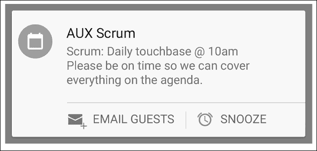
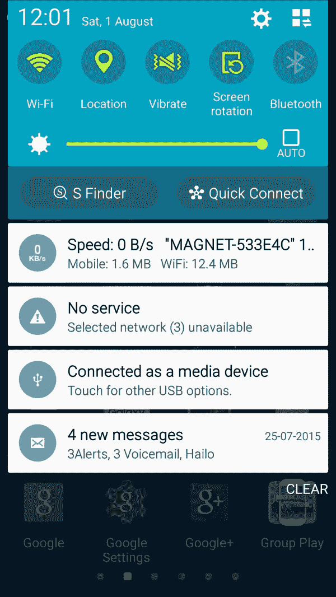
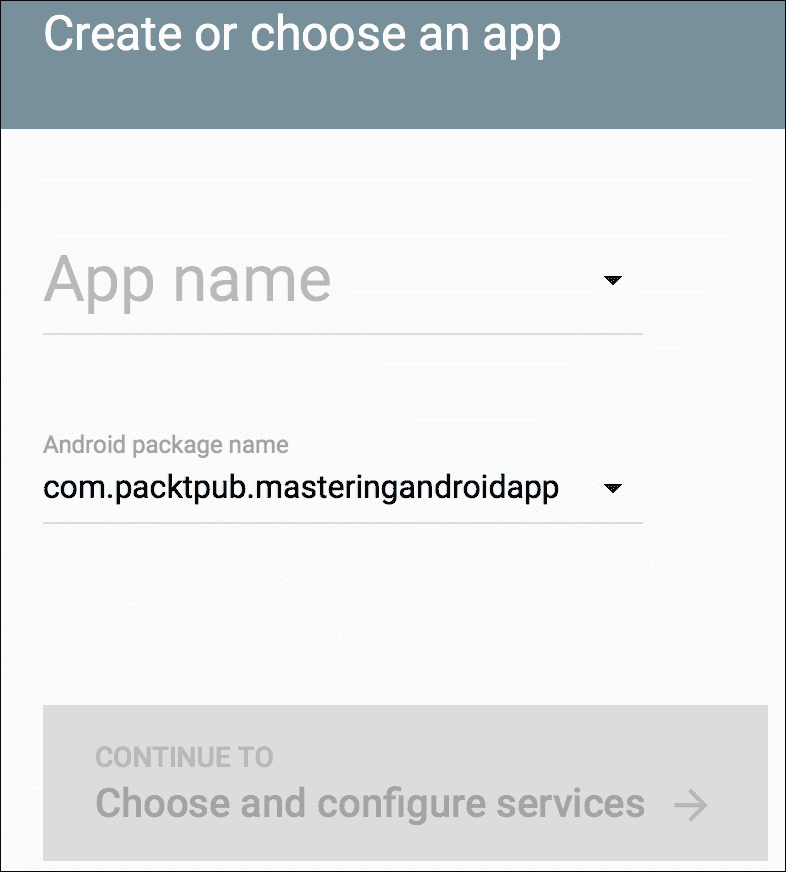
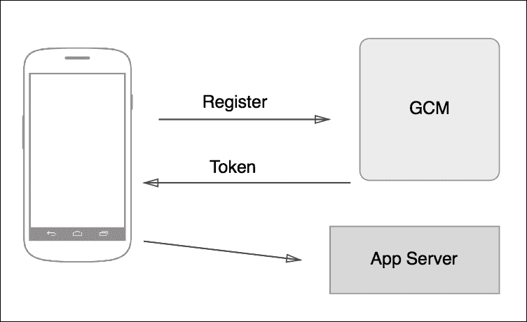
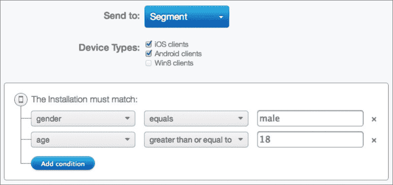
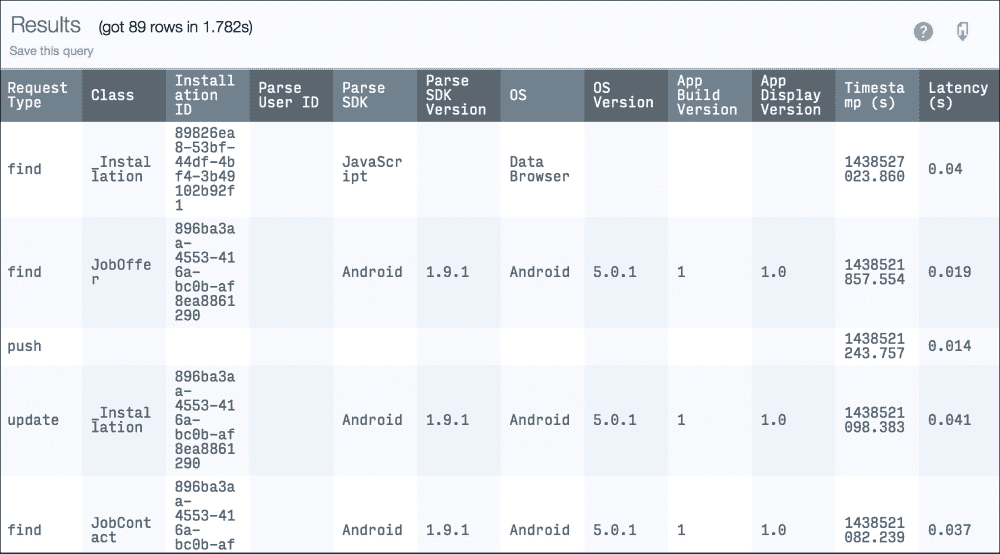
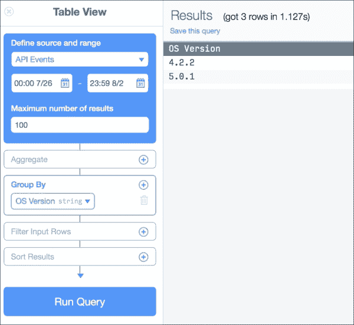
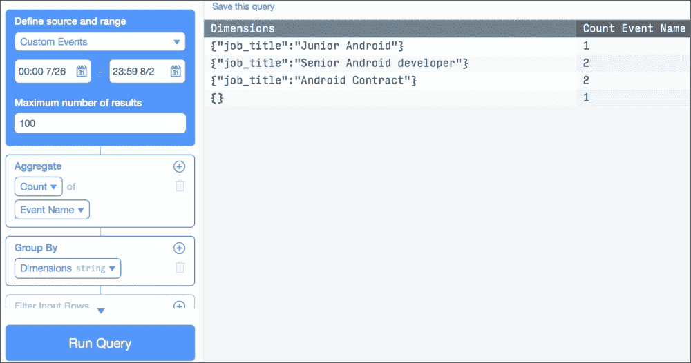
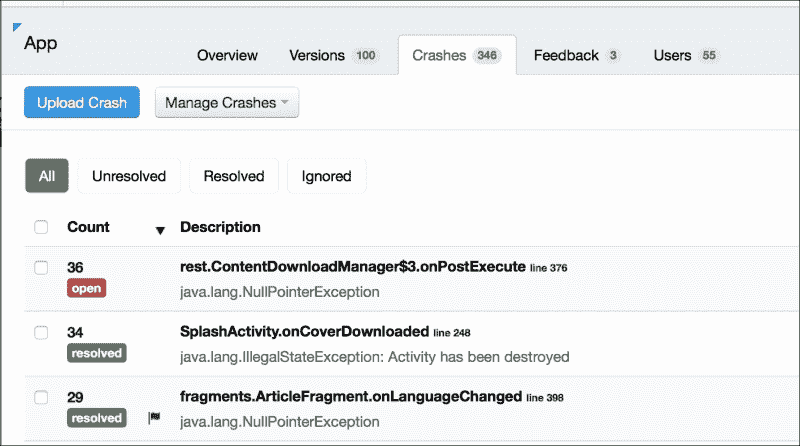

# 第九章 推送通知和分析

我们将从讨论推送通知开始本章。你将学习如何使用谷歌云消息传递（Google Cloud Messaging）实现带有通知的自定义解决方案，包括服务器端和应用程序端。然后，我们将在示例中添加使用 Parse 的通知。为了完成通知部分，我们将使用`NotificationCompat`显示我们的自定义通知。

在本章的下半部分，我们将讨论分析。拥有分析功能来追踪用户在我们应用中的行为是了解用户如何行为的关键，这使我们能够识别模式并改善体验。我们将使用 Parse 实现一个示例，并概述市场上最受欢迎的解决方案。

+   推送通知

    +   使用 GCM 发送和接收

    +   来自 Parse 的通知

    +   NotificationCompat

+   分析

    +   使用 Parse 的分析

+   错误报告

# 推送通知

推送通知对于吸引用户和提供实时更新非常重要。它们有助于提醒用户有待执行的操作。例如，在万事达卡（MasterCard）创建的**Qkr!**应用中，用户可以在一些餐厅订餐订饮料，如果用户在相当长一段时间后仍未付款，他们会发送一个通知提醒用户在离开餐厅前需要付款。

当我们需要告诉用户我们有新内容或者其他用户给他们发送了消息时，它们也非常有效。服务器端发生的任何需要通知用户的变化都是使用通知的完美场景。

通知也可以从我们自己的应用程序本地发送；例如，我们可以设置一个闹钟并显示通知。它们不一定非要从服务器发送。

它们显示在屏幕顶部的状态栏中，在一个称为通知区域的地方。


通知所需的最少信息包括一个图标、一个标题和详细文本。随着材料设计的到来，我们可以以不同方式自定义通知；例如，我们可以为它们添加不同的操作：



如果我们从屏幕顶部向下滚动，将会显示通知抽屉，我们可以在其中看到所有由通知显示的信息：



通知不应作为双向通道通信的一部分。如果我们的应用程序需要与服务器持续通信，例如在即时通讯应用中，我们应该考虑使用套接字、XMPP 或其他任何消息传递协议。理论上，通知是不可靠的，我们无法控制它们将在何时确切收到。

然而，不要滥用通知；它们是用户卸载你应用的一个很好的理由。尽量将通知降至最少，只在必要时使用。

你可以为通知分配一个优先级，从 Android Lollipop 开始，你可以根据这个优先级过滤你想接收的通知。

这些是你处理通知时应该牢记的关键点和概念。在深入了解更多理论知识之前，我们将实践向我们的应用发送通知。

## 使用 GCM 发送和接收通知

市场上存在不同的解决方案来发送推送通知；其中之一是 Parse，它有一个友好的控制面板，任何人都可以轻松地发送推送通知。我们将以 Parse 为例，但首先，了解其内部工作原理以及我们如何构建自己的通知发送系统是有好处的。

**GCM**（**谷歌云消息服务**）使用推送通知，我们将这些通知发送到我们的移动设备。谷歌有名为 GCM 连接服务器的服务器来处理这个过程。如果我们想要发送推送通知，我们首先需要告诉这些服务器，然后它们会在稍后发送到我们的设备。我们需要创建一个服务器或使用第三方服务器，通过 HTTP 或 XMPP 与 GCM 服务器通信，因为可以使用这两种协议进行通信。


如我们之前所述，我们无法精确控制消息接收的时间，因为我们无法控制 GCM 服务器。它会将消息排队并在设备在线时发送。

要创建我们自己的解决方案，首先需要在谷歌开发者网站上的我们的应用中启用消息传递服务，网址为[`developers.google.com/mobile/add?platform=android`](https://developers.google.com/mobile/add?platform=android)。



创建应用后，启用 GCM 消息传递，系统会提供给你一个发送者 ID 和一个服务器 API 密钥。发送者 ID 以前被称为项目编号。

如果我们想要接收 GCM 消息，需要将我们的客户端（也就是我们的移动应用）注册到这个项目中。为此，我们的应用将使用 GCM API 进行注册并获得一个令牌作为确认。完成这一步后，GCM 服务器就会知道你的设备已准备好接收来自这个特定项目/发送者的推送通知。



我们需要添加 Play 服务以使用这个 API：

```java
 compile "com.google.android.gms:play-services:7.5.+"
```

注册是通过**实例 ID** API 完成的，调用`instanceID.getToken`时传入`SenderID`作为参数：

```java
InstanceID instanceID = InstanceID.getInstance(this);
String token = instanceID.getToken(getString(R.string.gcm_defaultSenderId),
GoogleCloudMessaging.INSTANCE_ID_SCOPE, null);
```

我们需要异步调用这个方法，并在我们的应用中保持一个布尔变量，以记录我们是否已成功注册。我们的令牌可能会随时间变化，通过`onRefreshToken()`回调我们可以知道何时发生变化。需要将令牌发送到我们的服务器：

```java
@Override
public void onTokenRefresh() {
  //Get new token from Instance ID with the code above
  //Send new token to our Server
}
```

完成这一步后，我们需要创建一个`GCMListener`并向 Android 清单中添加一些权限：

```java
<uses-permission android:name="android.permission.GET_ACCOUNTS" />
<uses-permission android:name="android.permission.WAKE_LOCK" />
<uses-permission android:name="com.google.android.c2dm.permission.RECEIVE" />

<permission android:name="com.example.gcm.permission.C2D_MESSAGE"
  android:protectionLevel="signature" />
<uses-permission android:name="com.example.gcm.permission.C2D_MESSAGE" />

<application ...>
  <receiver
    android:name="com.google.android.gms.gcm.GcmReceiver"
    android:exported="true"
    android:permission="com.google.android.c2dm.permission.SEND" >
    <intent-filter>
      <action android:name="com.google.android.c2dm.intent.RECEIVE" />
      <category android:name="com.example.gcm" />
    </intent-filter>
  </receiver>
  <service
    android:name="com.example.MyGcmListenerService"
    android:exported="false" >
    <intent-filter>
      <action android:name="com.google.android.c2dm.intent.RECEIVE" />
    </intent-filter>
  </service>
  <service
    android:name="com.example.MyInstanceIDListenerService"
    android:exported="false">
    <intent-filter>
      <action android:name="com.google.android.gms.iid.InstanceID"/>
    </intent-filter>
  </service>
</application>

</manifest>
```

`GCMListener`将包含`onMessageReceived`方法，当我们接收到任何消息时会被调用。

这就是我们需要的客户端方面的全部内容；至于服务器端，由于它完全取决于所选的技术和语言，本书将不详细介绍。网上有很多用于发送通知的 Python、Grails、Java 等代码片段和脚本，很容易找到。

我们实际上并不需要一个服务器来发送通知，因为我们可以直接与 GCM 通信。我们需要做的就是向[`gcm-http.googleapis.com/gcm/send`](https://gcm-http.googleapis.com/gcm/send)发送一个`POST`请求。这可以通过任何在线的`POST`发送服务轻松完成，比如[hurl.it](http://hurl.it)或 Postman——一个用于发送网络请求的 Google Chrome 扩展程序。我们的请求需要如下所示：

```java
Content-Type:application/json
Authorization:key="SERVER_API_LEY"
{
  "to" : "RECEIVER_TOKEN"
  "data" : {
    "text":"Testing GCM"
  },
}
```


继续使用`MasteringAndroidApp`，我们将通过 Parse 实现推送通知。

## 使用 Parse 的推送通知

对于我们的示例，我们将坚持使用 Parse。主要原因是，我们不需要担心服务器端，也不需要使用这个解决方案在 Google 开发者控制台创建应用程序。另一个原因是它有一个很好的内置控制面板来发送通知，如果我们提前跟踪了不同参数的用户，我们还可以针对不同的用户。



使用 Parse，我们不需要创建 GCM 监听器。相反，它使用 Parse 库中已经包含的服务，我们只需为这项服务注册一个订阅者。我们需要做的就是向我们的应用程序添加权限和接收器，然后就可以开始了：

```java
<uses-permission android:name="android.permission.INTERNET" />
<uses-permission android:name="android.permission.ACCESS_NETWORK_STATE" />
<uses-permission android:name="android.permission.WAKE_LOCK" />
<uses-permission android:name="android.permission.VIBRATE" />
<uses-permission android:name="android.permission.RECEIVE_BOOT_COMPLETED" />
<uses-permission android:name="android.permission.GET_ACCOUNTS" />
<uses-permission android:name="com.google.android.c2dm.permission.RECEIVE" />
<permission android:protectionLevel="signature" android:name="com.packtub.masteringandroidapp.permission.C2D_MESSAGE" />
<uses-permission android:name="com.packtpub.masteringandroidapp.permission.C2D_MESSAGE" />
```

确保最后两个权限与您的包名相匹配。接收器需要放在`application`标签内：

```java
<service android:name="com.parse.PushService" />
<receiver android:name="com.parse.ParseBroadcastReceiver">
  <intent-filter>
    <action android:name="android.intent.action.BOOT_COMPLETED" />
    <action android:name="android.intent.action.USER_PRESENT" />
  </intent-filter>
</receiver>

<receiver android:name="com.parse.ParsePushBroadcastReceiver"
  android:exported="false">
  <intent-filter>
    <action android:name="com.parse.push.intent.RECEIVE" />
    <action android:name="com.parse.push.intent.DELETE" />
    <action android:name="com.parse.push.intent.OPEN" />
  </intent-filter>
</receiver>

<receiver android:name="com.parse.GcmBroadcastReceiver"
  android:permission="com.google.android.c2dm.permission.SEND">
  <intent-filter>
    <action android:name="com.google.android.c2dm.intent.RECEIVE" />
    <action android:name="com.google.android.c2dm.intent.REGISTRATION" />
    <category android:name="com.packtpub.masteringandroidapp" />
  </intent-filter>
</receiver>

</application>
```

为了监听通知，我们可以在`Application`类的`OnCreate`方法中注册一个订阅者：

```java
ParsePush.subscribeInBackground("", new SaveCallback() {
  @Override
  public void done(com.parse.ParseException e) {
    if (e == null) {
      Log.d("com.parse.push", "successfully subscribed to the broadcast channel.");
    } else {
      Log.e("com.parse.push", "failed to subscribe for push", e);
      }
  }
});
```

现在，一切准备就绪。只需进入 Parse 网页，选择**推送**标签，点击**+ 发送推送**。你可以指定受众，选择立即发送还是延迟发送以及其他参数。它会跟踪已发送的推送，并指明发送给了哪些人。


如果你在**推送发送**列中看到**1**，然后查看设备中的通知，那么一切正常。你设备中的通知应该如下所示：


## 使用 NotificationCompat

目前，我们可以看到由 Parse 接收器创建的默认通知。但是，我们可以设置自己的接收器，并通过`NotificationCompat`创建更美观的通知。这个组件在支持 v4 库中引入，可以显示 Android L 和 M 以及之前版本直到 API 4 的最新功能通知。

简而言之，我们需要做的是借助`NotificationCompat.Builder`创建一个通知，并通过`NotificationManager.notify()`将这个通知传递给系统：

```java
public class MyNotificationReceiver  extends BroadcastReceiver {

  @Override
  public void onReceive(Context context, Intent intent) {
    Notification notification = new NotificationCompat.Builder(context)
    .setContentTitle("Title")
    .setContentText("Text")
    .setSmallIcon(R.drawable.ic_launcher)
    .build();
    NotificationManagerCompat.from(context).notify(1231,notification);
  }

}
```

这将显示我们的通知。标题、文本和图标是必填项；如果我们不添加这三个属性，通知将不会显示。要开始使用我们的自定义接收器，我们需要在清单中指定我们想要使用的注册，而不是 Parse 推送接收器：

```java
receiver android:name="com.packtpub.masteringandroidapp.MyNotificationReceiver" android:exported="false">
  <intent-filter>
    <action android:name="com.parse.push.intent.RECEIVE" />
    <action android:name="com.parse.push.intent.DELETE" />
    <action android:name="com.parse.push.intent.OPEN" />
  </intent-filter>
</receiver>
```

我们讨论了如何使用`NotificationCompat`显示自定义通知。通知有自己的设计指南，并且是材料设计的重要组成部分。建议查看这些指南，并在在应用中使用此组件时牢记它们。

### 注意

你可以在[`developer.android.com/design/patterns/notifications.html`](http://developer.android.com/design/patterns/notifications.html)找到指南。

# 分析的重要性

了解用户如何使用你的应用非常重要。分析帮助我们理解哪些屏幕访问量最大，用户在我们的应用中购买哪些产品，以及为什么某些用户在注册过程中退出，同时获取有关性别、位置、年龄等信息。

我们甚至可以追踪用户在我们的应用中遇到的崩溃，以及有关设备型号、Android 版本、崩溃日志等信息。

这些数据帮助我们改善用户体验，例如，如果我们发现用户的行为并不像我们预期的那样。它有助于定义我们的产品；如果我们的应用中有不同的功能，我们可以确定哪个功能使用最多。它帮助我们了解受众，这对市场营销可能有益。通过崩溃报告，更容易保持应用的免费和崩溃。

我们将使用 Parse 作为一个例子来开始追踪一些事件。

## Parse 的统计分析

仅通过我们已经在调用的`Parse.init()`方法，无需添加任何额外代码，在 Parse 控制台的**分析**标签下就能看到一些统计数据。


在**受众**部分，我们可以看到每日、每周和每月显示的活跃安装和活跃用户。这有助于我们了解我们有多少用户以及其中有多少是活跃的。如果我们想知道有多少用户卸载了应用，我们可以查看**留存**部分。

我们将追踪一些事件和崩溃信息，以在这两个部分显示信息，但首先，我们将查看**资源管理器**。如果你点击左侧的**资源管理器**按钮，你应该会看到以下选项：


这将显示一个表格，我们可以从中看到过滤我们应用数据的各种选项。一旦我们开始追踪事件和动作，这里将会有更多的列，我们将能够创建复杂的查询。

默认情况下，如果我们点击运行查询，我们将看到以下表格图像：



它显示了默认列下可用的所有信息；目前不需要额外的列。我们可以看到所有不同的请求类型以及操作系统、操作系统版本和我们应用程序的版本。

我们可以使用过滤器来产生不同的输出。一些有趣的输出可能是，例如，按应用版本排序和分组，以便了解每个版本有多少人在使用。

如果我们使用相同的 Parse 数据库用于不同的平台，比如 Android 和 iOS，我们可以按平台进行过滤。

下面是一个按操作系统版本过滤的示例，我们可以看到用户当前正在使用的所有 Android 版本：



为了收集更多关于应用程序何时以及被打开频率的数据，我们可以在启动画面或第一个活动的`oncreate`方法中添加以下行。

```java
ParseAnalytics.trackAppOpenedInBackground(getIntent());
```

这是一个我们可以追踪的事件示例，但通常我们提到事件追踪时，是指自定义事件。例如，如果我们想追踪哪个职位招聘信息访问量最高，我们会在`JobOfferDetailActivity`中追踪一个事件，并附上访问文章的标题。我们还可以在点击行打开招聘信息时的`onlick`监听器中追踪此事件。这没有固定的规则；实现方式可能有所不同。但我们需要知道，目标是追踪查看招聘信息时的事件。

在`OfferDetailActivity`的`OnCreate`方法中选择跟踪事件的选项的代码将类似于以下代码：

```java
public class OfferDetailActivity extends AppCompatActivity {

  @Override
  protected void onCreate(Bundle savedInstanceState) {
    super.onCreate(savedInstanceState);
    setContentView(R.layout.activity_offer_detail);

    String job_title = getIntent().getStringExtra("job_title");

    Map<String, String> eventParams = new HashMap<>();
    eventParams.put("job_title", job_title);
    ParseAnalytics.trackEventInBackground("job_visited", eventParams);
```

`trackEventInBackground`方法会启动一个后台线程来为我们创建网络上传请求。参数作为具有最多八个的`Map`字符串发送。

如果我们在不同时间访问不同的招聘信息，然后进入分析浏览器部分，我们可以轻松创建一个查询来查看每个职位招聘信息被打开的次数。



通过将数据按维度分组，这些维度包括与事件追踪一起发送的不同参数，并使用计数的聚合，我们可以得到每个访问过的职位招聘信息的计数。

接下来，我们将看看如何利用这种事件追踪来使用 Parse 作为错误报告工具。

## 错误报告

当我们的应用程序被分发时，报告崩溃对于保持应用程序无错误和崩溃至关重要。市场上有成百上千的 Android 设备，以及即使是最好的质量保证人员或测试员在发布应用程序时也可能失误的不同情况，最终导致应用程序崩溃。

我们需要假设我们的应用程序可能会崩溃。我们必须尽可能编写最好的代码，但如果发生崩溃，我们需要有工具来报告并修复它。

Parse 允许我们使用以下代码跟踪错误：

```java
Map<String, String> dimensions = new HashMap<String, String>(); dimensions.put('code', Integer.toString(error.getCode())); ParseAnalytics.trackEvent('error', dimensions);
```

然而，这种解决方案只允许我们跟踪受控代码段的错误。例如，假设我们有一个网络请求，它返回了一个错误。这种情形可以轻松处理；我们只需追踪来自服务器的错误响应事件。

当我们的应用程序中出现 `NullPointerException` 时，就会有一个问题，这就是因为发生了我们无法在代码中检测到的意外情况而导致崩溃。例如，如果工作的图片链接为空，而我尝试读取链接而不检查属性是否为空，我将得到 `NullPointerException`，应用程序将崩溃。

如果我们不能控制发生错误的代码部分，我们如何跟踪这个问题呢？幸运的是，市场上有些工具可以为我们完成这项工作。HockeyApp 是一个帮助分发测试版本并收集实时崩溃报告的工具。这是一个在网页面板上显示我们应用程序错误报告的工具。集成非常简单；我们只需添加以下内容到库中：

```java
compile 'net.hockeyapp.android:HockeySDK:3.5.0-b.4'
```

然后，我们需要调用以下方法来报告错误：

```java
CrashManager.register(this, APP_ID);
```

当你将 APK 上传到 HockeyApp 或者在 Hockey 网站上手动创建一个新应用程序时，你将找到 `APP_ID`。


一旦我们知道 `App_ID` 并注册了崩溃报告，如果我们遇到崩溃，我们将看到一个带有发生次数的列表，如下面的屏幕截图所示：



在分析方面，我们最后要说的是，Parse 只是一个选择之一；通常还会使用 Google Analytics，它包含在 Google Play 服务库中。Google Analytics 允许我们创建更复杂的报告，例如漏斗跟踪，以查看在漫长的注册过程中我们失去了多少用户，我们还可以在不同的图表和直方图中查看数据。

如果你属于一个大机构，可以看看 Adobe Omniture。这是一个企业工具，可以帮助你跟踪不同的事件作为变量，然后创建公式来显示这些变量。它还允许你将移动分析数据与其他部门（如销售、市场营销和客户服务）的数据结合起来。根据我的个人经验，我看到使用 Omniture 的公司通常会有专人全职从事分析研究。在这种情况下，开发者需要知道的只是如何实现 SDK 和跟踪事件；创建复杂报告不是开发者的任务。

# 总结

在本章中，你学习了如何为我们的应用程序添加通知。我们使用 Parse 实现了推送通知，并讨论了如何使用 Google Cloud Messaging 创建我们自己的自定义通知服务，包括客户端所需的所有代码和测试服务器端的工具。在章节的后半部分，我们介绍了分析，解释了它们的重要性，并用 Parse 跟踪事件。在分析领域，一个重要的方面是错误报告。我们还使用 Parse 和 HockeyApp 跟踪了应用程序中的错误。最后，我们概览了其他分析解决方案，例如 Google Analytics 和 Adobe Omniture。

在下一章中，我们将使用位置服务，并学习如何将`MapView`添加到我们的示例中，显示带有位置标记的谷歌地图。
