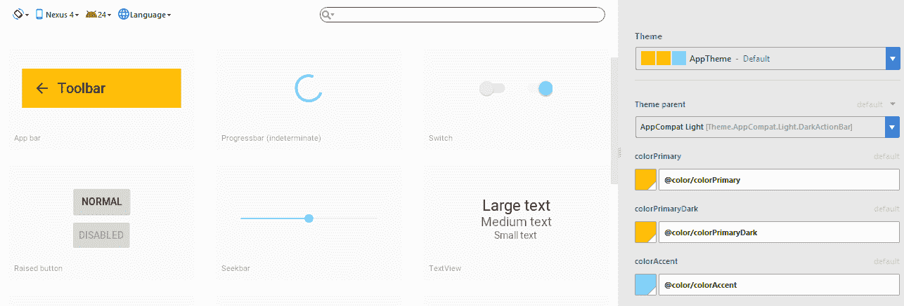
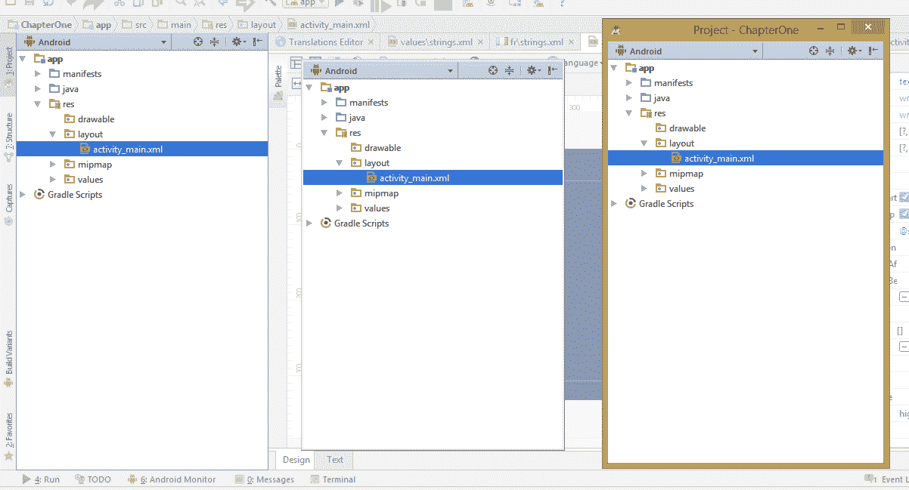

# 第一章：工作区结构

Android Studio 是一个功能强大且复杂的开发环境，专门用于开发、测试和打包 Android 应用程序。它可以作为一个单一的软件包，与 Android SDK 一起下载，但正如我们将在本书中看到的那样，它实际上是一组工具和组件，其中许多是独立安装和更新的。

Android Studio 并不是开发 Android 应用程序的唯一方式；还有其他 IDE，比如 Eclipse 和 NetBeans，甚至可以仅使用记事本和命令行来开发完整的应用程序，尽管这种方法会非常缓慢和繁琐。

无论您是从其他 IDE 迁移还是只是想充分利用 Android Studio，本书将按照开发应用程序的过程中遇到的顺序，带您了解其最有用的功能，从 UI 开发开始，逐步进行编码和测试，到构建和分发。Android Studio 在这段旅程的每一步都为我们提供了一些有用和智能的工具。

Android Studio 是为了一个目的而构建的，吸引了越来越多的第三方插件，提供了大量有价值的功能，这些功能无法直接通过 IDE 获得。这些包括加快构建时间的插件，通过 Wi-Fi 调试项目等。其中最有用和最受欢迎的将在相关章节中介绍。在整本书中，我们将找到使用这些插件和 Android Studio 内置组件加快繁琐和困难任务的方法。

在本章中，您将涉及以下主题：

+   探索 Studio 和其他 IDE 之间的差异

+   进行简要的导览

+   了解工作区的结构

+   探索编辑器窗口

+   创建材料主题

+   理解工具窗口

+   探索设备文件系统

+   使用即时运行来加快构建过程

+   探索 SDK 管理器

+   介绍虚拟设备管理器

+   从其他 IDE 导入项目


Android Studio

如果您已经熟悉 Android Studio，那么您可能希望跳过本介绍章节的一些部分，因为它更多地是针对那些从其他 IDE 迁移的人。然而，您可能之前没有遇到过一些方便的技巧。

尽管可以说是一种更优越的工具，但有一些非常好的理由可以坚持使用另一个 IDE，比如 Eclipse。许多开发人员开发多个平台，这使得 Eclipse 成为一个很好的工具选择。每个开发人员都有截止日期要满足，熟悉陌生软件可能会在一开始大大减慢他们的速度。这本书将加快这种过渡，以便迁移开发人员可以尽可能少地中断地开始利用 Android Studio 提供的附加功能。

# Android Studio 的不同之处

Android Studio 与其他 IDE 和开发工具有许多不同之处。其中一些差异相当微妙，比如支持库的安装方式，而其他差异，例如构建过程和 UI 设计，则是完全不同的。

在更仔细地了解 IDE 本身之前，首先了解一些重要的区别是一个好主意。主要的区别列在这里：

+   **UI 开发**：Studio 和其他 IDE 之间最重要的区别是其布局编辑器，它比任何竞争对手都要优秀，提供文本、设计和蓝图视图，最重要的是，为每个活动或片段提供约束布局工具，易于使用的主题和样式编辑器，以及拖放设计功能。布局编辑器还提供了许多其他地方无法获得的工具，例如全面的预览功能，可以在多种设备上查看布局，以及易于使用的主题和翻译编辑器。

+   **项目结构：**尽管底层目录结构保持不变，但 Android Studio 组织每个项目的方式与其前身有很大不同。Studio 使用模块而不是 Eclipse 中的工作区，这样可以更轻松地一起工作而无需切换工作区。

在 Eclipse 中称为工作区的东西在 Studio 中称为项目，在 Eclipse 中称为项目的东西在 Studio 中称为模块。

这种结构上的差异起初可能看起来不寻常，但任何 Eclipse 用户一旦熟悉起来就会看到它可以节省多少时间。

+   **代码补全和重构：** Android Studio 智能地在您输入时完成代码的方式使其成为一种愉悦。它经常能够预测您即将输入的内容，通常只需两三次按键就可以输入整行代码。重构也比 Eclipse 和 NetBeans 等替代 IDE 更容易和更广泛。几乎任何东西都可以重命名，从局部变量到整个包。

+   **仿真：** Studio 配备了灵活的虚拟设备编辑器，允许开发人员创建设备仿真器来模拟任意数量的真实设备。这些仿真器可以高度定制，无论是在外形因素还是硬件配置方面，虚拟设备都可以从许多制造商那里下载。其他 IDE 的用户可能已经熟悉 Android AVD，尽管他们肯定会喜欢 Design 选项卡中的预览功能。

+   **构建工具：** Android Studio 采用了 Gradle 构建系统，它执行与许多 Java 开发人员熟悉的 Apache Ant 系统相同的功能。然而，它提供了更多的灵活性，并允许定制构建，使开发人员能够轻松创建可上传到 TestFlight 的 APK，或者制作应用的演示版本。正是 Gradle 系统使得之前讨论的模块化成为可能。Studio 不是将每个库或第三方 SDK 编译为 JAR 文件，而是使用 Gradle 构建每个库或 SDK。

这些是 Android Studio 与其他 IDE 之间最深远的差异，但还有更多独特的功能。Studio 提供了强大的 JUnit 测试功能，允许云平台支持甚至 Wi-Fi 调试。它也比 Eclipse 快得多，公平地说，Eclipse 必须满足更广泛的开发需求，而不仅仅是一个，而且它可以在性能较低的机器上运行。

Android Studio 还提供了一个令人惊叹的节省时间的工具，即即时运行。这个功能巧妙地只构建了项目中已编辑的部分，这意味着开发人员可以测试代码的小改动，而不必等待每次测试都进行完整的构建。这个功能可以将等待时间从几分钟减少到几乎零。

无论您是新手还是想更多地了解 Android Studio，第一步都是广泛了解其最突出的结构。

# 工作区结构

Android Studio 的整体结构与其他 IDE 并无不同。有用于编辑文本和屏幕组件的窗口，用于导航项目结构的窗口，以及用于监视和调试的窗口。这个 IDE 非常灵活，可以根据许多特定的需求和偏好进行配置。典型的布局可能是这样的：


典型的工作区布局

尽管这些窗口可以按照我们的意愿进行排列，但一般来说，在上一张截图中，四个窗格可能具有以下功能：

1.  导航项目、模块或库

1.  编辑文本和设计布局

1.  定义组件属性或屏幕预览

1.  监视和调试

有时打开大量窗格可能会分散注意力；对于这些时候，Studio 有一个无干扰模式，只显示当前编辑器窗口，可以从视图菜单中进入。

我们可以从许多不同的角度看待我们的项目，并有许多组织它们的方式。了解每种方式的最佳方法是依次查看每种方式。

# 编辑器窗口

在 IDE 中最重要的窗口当然是我们创建和修改所有应用程序代码的窗口。我们不仅使用编辑器来编辑 XML 和 Java，还有其他编辑器用于简化其他资源，如翻译和主题。然而，无论编辑器多么图形化，所有 Android 资源最终都以 XML 文件的形式出现在`res`目录中。

在大多数情况下，我们可以在不写任何代码的情况下创建大多数 Android 资源。只需点击几下鼠标，就可以使用相应的编辑器创建主题。然而，如果我们要自认为是专家，了解底层代码以及 Studio 存储这些资源的方式和位置是很重要的。以下示例演示了如何使用主题编辑器创建新的 Android 主题：

1.  启动或打开 Android Studio 项目。

1.  从工具|Android|主题编辑器中打开主题编辑器。



主题编辑器

1.  在编辑器右上角的主题下拉菜单中，选择创建新主题，并在新主题对话框中输入名称。

1.  将主题父级字段保持不变。

1.  点击 colorPrimary 缩略图。

1.  从结果色板中选择一个你喜欢的颜色，权重为`500`。

1.  以相同的方式，为辅助颜色选择权重为`700`的相同颜色。

1.  选择一个权重为`100`的颜色，与主色对比鲜明。

1.  打开预览或设计编辑器以查看这些更改。

在前面的示例中，我们创建了一个新的主题，该主题将自动应用于整个应用程序。我们本可以简单地编辑默认的`AppTheme`，但如果以后决定使用多个主题，这种方法将简化问题。IDE 通过向`res/values/styles.xml`文件添加以下行来立即应用这些更改：

```kt
<style name="MyTheme" parent="AppTheme" /> 
```

实际的颜色更改可以在`res/values/colors.xml`文件中找到。

主题编辑器相当好地展示了 Studio 编辑器如何在我们只需点击几下鼠标后创建和修改代码。

所有编辑器都可以使用*Ctrl* + *Shift* +*F12*进行最大化。使用相同的键返回到原始布局。

还可以通过从文件菜单中选择设置|编辑器|颜色和字体来更改 IDE 本身的主题，如下图所示：


Studio 主题对话框

Android Studio 只配备了一个备选颜色方案*Darcula*。这个主题在黑色背景上呈现浅色文本，因此对眼睛来说比默认设置要容易得多，尤其是对于那些长时间的深夜开发。还有其他在线可用的方案，设计自己的方案也很有趣。然而，为了制作印刷材料，我们将在这里坚持使用默认的 IDE 主题。

另一个很好的子编辑器示例是 Translations 编辑器，这也是展示项目结构与其他 IDE 不同的好方法。以下步骤展示了如何实现这一点：

1.  右键单击`res/values/strings.xml`文件，从菜单中选择并打开 Translations 编辑器。也可以在设计 XML 编辑器的语言下拉菜单中找到。

1.  点击编辑器左上角附近的地球图标，并从列表中选择一种语言。

1.  在顶部窗格中选择要翻译的字符串，并在下方窗格中输入值，如图所示：


翻译编辑器

这是一个非常简单的练习，其目的是演示 Android Studio 如何存储这些资源以及如何显示它们。编辑器已经创建了一个新的`strings.xml`文件，除了翻译文本的字符串值之外，它在所有方面都与我们的原始文件相同。这个文件将自动被任何将该语言设置为用户默认语言的设备自动引用。

通过项目资源管理器，人们可能会认为在值目录中有一个名为`strings.xml`的项目目录，并且其中包含两个`strings.xml`文件。实际上，这样呈现只是为了帮助我们组织资源。检查磁盘上的`project`文件夹将显示实际上`res`目录中有两个（或更多）名为`values`和`values-fr`的文件夹。这不仅有助于组织我们的工作，还有助于减少应用程序在设备上占用的空间，因为只有需要的资源文件才会安装在最终设备上。

实际的文件夹层次结构可以直接从主工具栏下方的导航栏中确定。


导航栏

主题和翻译是两个最不重要的编辑器，但它们很好地介绍了 Android Studio 如何管理应用程序资源。开发人员的大部分时间都是在使用代码编辑器，当然，这将在整本书中深入介绍。然而，虽然编辑器构成了 IDE 的核心，但还有许多其他有用甚至至关重要的工具可供我们使用，其中最常用的工具可以从工具边缘获得。

# 工具窗口

我们至少有十几个工具窗口可供使用，如果安装了插件，还有更多。它们可以通过查看|工具窗口菜单、工作区底部状态栏最左侧的工具图标，或按*Alt*和相应的数字键来打开特定的工具窗口。


工具窗口菜单

工具窗口是高度可配置的，每个窗口都可以设置为停靠、浮动或包含在自己的窗口中。

状态栏上的工具窗口图标可用于隐藏和显示工具窗口标签，围绕工作区的边框。

当使用多个屏幕时，这是特别有用的：

一个停靠的、浮动的和窗口化的工具窗口

在本书的整个过程中，我们将深入介绍所有这些工具。不过，以下是对最常用的工具的简要介绍：

+   **消息**：*Alt* + *0*。这个工具生成了 Gradle 构建过程的简化版本。更详细的输出可以在 Gradle 控制台中找到。

+   **项目**：*Alt* + *1*。通常停靠在工作区的左侧，这个工具是我们的主要导航工具。

+   **收藏夹**：*Alt* + *2*。这是一个非常方便的组织工具，可以快速访问常用的类和组件。要将任何文件添加到收藏夹列表中，只需在项目窗口中右键单击该文件，然后从下拉菜单中选择“添加到收藏夹”。

+   **运行**：*Alt* + *3*。这是一个强大的诊断工具，在应用程序在设备或模拟器上运行时可用。

+   **Android**：*Alt* + *4*。这是 Studio 的主要调试窗口，用于监视运行应用程序的日志输出和截图。

+   **内存监视器**：*Alt* + *5*。这个非常有用的工具可以在应用程序运行时生成内存使用情况的实时图表。

+   **结构**：*Alt* + *6*。这个工具提供了关于当前编辑器的详细信息，显示了该特定文件中包含的类、变量和其他组件的分层视图。

最有用的工具窗口之一是设备文件浏览器工具。这使我们能够浏览任何连接设备或模拟器的文件系统。


设备文件浏览器工具。

所有应用程序文件都可以在`data/data`中找到。

工具窗口非常有用，使我们能够配置集成开发环境以适应我们正在进行的特定任务。能够选择适当的工具是 Android Studio 最有用的功能之一。当然，Android Studio 只不过是一个前端界面，允许我们连接到 Android 背后的真正力量，即 SDK。

# Android SDK

从技术上讲，可以将**软件开发工具包**（**SDK**）描述为不是 Android Studio 的一部分，因为它被其他集成开发环境使用。然而，没有它，集成开发环境将毫无用处，现在是一个很好的时机来快速了解一下它及其管理器。

Android SDK 是一个庞大的 API 集合，包括组织成复杂但逻辑的层次结构的 Java 类和接口，以及其他实用工具，如 USB 驱动程序和硬件加速器。

SDK 及其组件的更新频率远远超过操作系统本身，用户应该对此毫不知情。Android 用户以 Lollipop 或 Honeycomb 为单位；作为开发人员，我们以 SDK 级别来看待 Android 世界。

SDK 由 SDK Manager 控制，可以通过主工具栏或从文件菜单的设置|外观和行为|系统设置|Android SDK 中访问。还有一个独立的 SDK Manager，可以在没有 Android Studio 的情况下运行。这可以在以下目录中找到：`\AppData\Local\Android\sdk`。


Android SDK 独立管理器

SDK 管理器有三个部分：工具、平台和额外。至少，您需要安装最新的 SDK 工具、平台工具和构建工具。您还需要安装最新的平台和任何其他您打算直接定位的平台。您还需要为您希望创建的任何虚拟设备安装系统映像以及 Google USB 驱动程序和 HAXM 硬件加速器。

如果您一直在使用 Eclipse 开发 Android 应用程序，您将熟悉 Android 支持库。在使用 Android Studio 时，应安装支持存储库。

管理各种更新的最简单方法是将它们设置为自动安装，可以在设置对话框（*Ctrl + Alt + S*）中的外观和行为|系统设置|更新下完成。

SDK 构成了我们开发环境的支柱，但无论我们掌握得多么好，我们仍然需要一种方式来测试我们的创作，在没有大量真实设备的情况下，这取决于使用 Android 设备模拟器创建虚拟设备。

# 虚拟设备

市场上有如此多的 Android 设备，要在很多真实设备上彻底测试我们的应用几乎是不可能的。正因为如此，系统允许我们使用虚拟设备管理器创建模拟设备。

AVD 管理器允许我们从头开始创建形态因素和硬件配置文件，并提供几个现成的虚拟设备和系统映像，可以从各个制造商的网站上下载。


AVD 配置屏幕

Android 模拟器可能非常慢，即使在非常强大的机器上也是如此，这是可以预料的，因为创建一个完全功能的虚拟设备是一个非常复杂的任务。然而，可以通过设计每个虚拟设备以匹配我们正在开发的应用程序的特定任务来加快速度。例如，如果您的应用程序不使用设备摄像头，则不要在配置中包含它。同样，不要分配比应用程序本身需要的内存多得多。

Android 虚拟设备并不是我们唯一的选择，还有一些少量但不断增长的第三方模拟器。其中许多是专为游戏玩家而不是开发人员设计的；尽管 Genymotion 是一个专门的开发工具，它包含更多功能，通常比原生模拟器更快。它的唯一缺点是只能免费供个人使用，并且只提供手机和平板电脑的系统映像，而不是可穿戴设备或大屏幕设备，如电视。

现实世界的设备自然比任何模拟器反应更快，当测试基本功能时，使用我们自己的设备会提供更快的结果。这种方法非常适合测试应用程序的基本功能，但几乎没有提供关于我们的应用程序在 Android 设备上可能具有的各种屏幕尺寸、形状和密度的反馈。

使用真实设备是测试应用程序逻辑的快速方法，但为特定型号甚至通用大小和形状开发应用程序将不可避免地需要创建虚拟设备。幸运的是，Android Studio 配备了一个加速构建过程：Instant Run。

# Instant Run

在较早的 Android Studio 版本中，每次在任何设备上运行项目时，都必须执行完整的构建。即使我们只对代码进行了微小的更改，我们仍然必须等待整个应用程序重新构建和重新安装。这可能非常耗时，特别是在性能较差的机器上。这种缓慢通常导致不得不一次性测试多个修改，导致比理想情况更复杂的调试过程。

Instant Run 尝试仅构建自上次构建以来已更改的那些类或活动，并且只要清单文件没有被编辑，应用程序甚至不会被重新安装，有些情况下，启动活动甚至不会被重新启动。

由于 Instant Run 是一项最近的创新，遗憾的是它并不适用于所有版本的 Android，并且要充分利用它，您需要将最低 SDK 级别设置为 API 21 或更高级别，尽管它的一些元素将与 API 级别 15 及更高级别一起工作。在 Android Studio 中，此级别是从`build.gradle（Module：app）`文件中设置的，如下所示：

```kt
android { 
    compileSdkVersion 25 
    buildToolsVersion "25.0.1" 
    defaultConfig { 
        applicationId "com.mew.kyle.chapterone" 
        minSdkVersion 21 
        targetSdkVersion 25 
        versionCode 1 
        versionName "1.0" 
        testInstrumentationRunner "android.support.test.runner.AndroidJUnitRunner" 
    } 
```

我们往往会尽可能使我们的应用程序向后兼容，开发一个只能在 API 级别 21 或更高级别上运行的应用程序将严重限制我们能够触及的用户数量。然而，Instant Run 为我们节省的时间使得值得测试和调试 API 21 或更高级别的应用程序，然后稍后重新组装以匹配我们希望目标的版本。

在决定要针对哪些 Android 版本时，一个有用的仪表板显示了平台和屏幕的最新使用数据。它可以在`developer.android.com/about/dashboards/index.html`找到。

从另一个 IDE 迁移到 Android Studio 不需要是一个困难的过渡，一旦完成将会非常有价值。但是，您可能有在其他 IDE 中开发的项目，希望继续使用 Studio 进行开发。幸运的是，这是一个简单的任务，如下一节所示。

# 将项目导入到 Android Studio

Eclipse 毫无疑问是最好的开发工具之一，15 年来，我们中的许多人对它非常熟悉。在开发各种平台时，Eclipse 是一个很棒的工具，但在开发 Android 应用程序时无法与 Android Studio 竞争。

如果您从 Eclipse 迁移，您很可能有一些项目希望导入到 Studio 中。以下步骤演示了如何完成此操作：

1.  首先确保您的 Eclipse ADT 根目录包含`src`和`res`目录以及`AndroidManifest.xml`文件。

1.  记下您使用过的 Eclipse 第三方插件，因为您需要在 Studio 中安装相应的插件。

1.  打开 Android Studio 并从欢迎屏幕或文件|新建|导入项目中选择导入项目。

1.  选择包含清单的文件夹并准备一个目标文件夹，然后按照提示完成导入。

导入过程会完整复制项目，原始项目不受影响，这意味着如果您愿意，仍然可以在 Eclipse 中进行工作。不幸的是，无法导入第三方插件，但 Studio 有大量不断增长的插件可用，很可能您能找到相应的插件。这些可以从文件|设置|插件中浏览。

如果您在同一个工作空间中有几个 Eclipse 项目，那么您应该将一个项目导入为项目，其余的导入为模块。

当我们进行项目配置时，我们将再次查看这个过程，但除此之外，从现在开始，我们将假设所有项目都是在 Android Studio 中开始的。

# 总结

本章对于那些不熟悉 Android Studio 的读者来说，作为一个简短但完整的介绍。我们探讨了工作空间的结构以及我们可以使用的各种编辑器。这次探索使我们创建了一个 Material Design 主题，使用工具窗口执行各种有用的任务，并应用了“即时运行”来加快原本耗时的构建过程。

本章以快速查看虚拟设备以及如何从其他 IDE 导入项目结束。有了这个介绍，接下来的章节将深入探讨布局编辑器本身，我们将看到如何设计适用于最广泛形态的应用界面。
