# 第二章：UI 设计

Android Studio 中最突出的一个特性，包括 Gradle 构建系统在内，就是强大的用户界面（UI）开发工具。该 IDE 提供了多种设计视图，允许我们在 UI 开发中结合拖放构建和硬编码。Android Studio 还配备了全面的预览系统，可以让我们在实际设备上运行项目之前在任何设备上测试我们的设计。除了这些功能，Android Studio 还包括有用的支持库，如用于创建材料设计布局的设计库和用于简化复杂比例设计的百分比支持库。

这一章是四章中的第一章，涵盖了 UI 开发。在这一章中，我们将更仔细地研究 Studio 的布局编辑器和工具。我们将使用最有用的布局/ViewGroup 类构建工作界面，并设计和管理屏幕旋转。本章还将探讨 Studio 的预览系统以及 XML 布局资源的存储和应用。最后，本章将回顾主题、材料设计和设计支持库。

在本章中，您将学习如何：

+   探索布局编辑器

+   应用线性和相对布局

+   安装约束库

+   创建`ConstraintLayout`

+   应用约束

+   使用图形约束编辑器

+   添加约束指南

+   对齐`TextView`基线

+   应用偏差

+   使用自动连接

+   为虚拟设备构建硬件配置文件

+   创建虚拟 SD 卡

# 布局编辑器

如果有一个理由使用 Android Studio，那就是布局编辑器及其相关工具和预览系统。一旦打开一个项目，差异就显而易见。布局和蓝图视图之间的差异也在下图中显示：

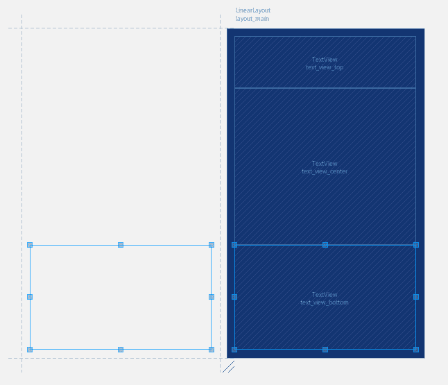

设计和蓝图布局视图

蓝图模式是 Android Studio 2.0 的新功能，它展示了我们 UI 的简化轮廓视图。在编辑复杂布局的间距和比例时，这是特别有用的，而不会受到内容的干扰。默认情况下，IDE 会并排显示设计和蓝图视图，但编辑器的工具栏允许我们只查看一个视图，在大多数情况下，我们会选择最适合当前任务的模式。

*B*键可用于在设计、蓝图和组合视图之间切换，作为工具栏图标的替代方法。

完全可以使用这些图形视图为项目生成所需的每个布局，而不需要了解底层代码。不过，这并不是一个非常专业的方法，了解底层 XML 的知识对于良好的测试和调试至关重要，而且如果我们知道自己在做什么，通常调整代码比拖放对象更快。

负责前一个布局的 XML 如下：

```kt
<LinearLayout  

    android:id="@+id/layout_main" 
    android:layout_width="match_parent" 
    android:layout_height="match_parent" 
    android:orientation="vertical"> 

    <TextView 
        android:id="@+id/text_view_top" 
        android:layout_width="match_parent" 
        android:layout_height="0dp" 
        android:layout_weight="1" /> 

    <TextView 
        android:id="@+id/text_view_center" 
        android:layout_width="match_parent" 
        android:layout_height="0dp" 
        android:layout_weight="3" /> 

    <TextView 
        android:id="@+id/text_view_bottom" 
        android:layout_width="match_parent" 
        android:layout_height="0dp" 
        android:layout_weight="2" /> 

</LinearLayout> 
```

希望您对前面代码中使用的术语很熟悉。`layout_weight`的使用经常与线性布局一起使用，用于分配比例，在开发具有略有不同纵横比的屏幕时节省了大量时间。

直到最近，我们创建更复杂 UI 的唯一选择是线性和相对布局。这两种布局都不是理想的选择，要么是不必要的昂贵，要么是琐碎的。Android Studio 2 引入了约束布局，为这些问题提供了一个优雅的解决方案。为了更好地理解其价值，首先看一下旧的类是有意义的，这些类在许多简单的设计中仍然有用。

# 线性和相对布局类

线性布局相对较轻，对于基于单行或单列的布局非常有用。然而，更复杂的布局需要在彼此内部嵌套布局，这很快就会变得资源密集。看一下下面的布局：

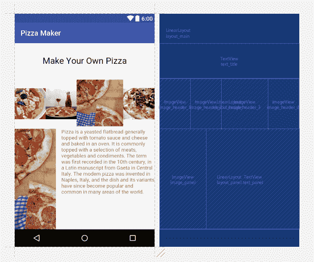

嵌套线性布局

前面的布局只使用了线性布局，可以从以下组件树中看到：

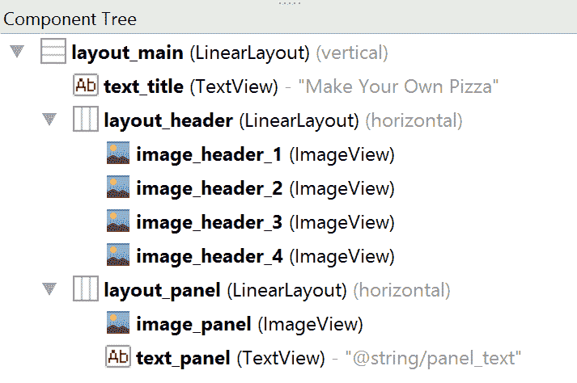

组件树

尽管这种布局完全可行且易于理解，但它的效率不如可能。即使是一个额外的布局嵌套层也会对性能产生影响。在约束布局出现之前，这个问题是通过相对布局解决的。

如其名称所示，相对布局允许我们将屏幕组件放置在彼此之间的关系中，使用诸如`layout_toStartOf`或`layout_below`之类的标记。这使我们能够扁平化视图层次结构，并且前面的布局可以仅使用一个单独的相对根视图组来重新创建。以下代码演示了如何在不嵌套任何新布局的情况下生成前一个布局中的图像行：

```kt
<ImageView 
    android:id="@+id/image_header_1" 
    android:layout_width="128dp" 
    android:layout_height="128dp" 
    android:layout_alignParentStart="true" 
    android:layout_below="@+id/text_title" 
    app:srcCompat="@drawable/pizza_01" /> 

<ImageView 
    android:id="@+id/image_header_2" 
    android:layout_width="128dp" 
    android:layout_height="128dp" 
    android:layout_below="@+id/text_title" 
    android:layout_toEndOf="@+id/image_header_1" 
    app:srcCompat="@drawable/pizza_02" /> 

<ImageView 
    android:id="@+id/image_header_3" 
    android:layout_width="128dp" 
    android:layout_height="128dp" 
    android:layout_alignParentEnd="true" 
    android:layout_below="@+id/text_title" 
    app:srcCompat="@drawable/pizza_03" /> 

<ImageView 
    android:id="@+id/image_header_4" 
    android:layout_width="128dp" 
    android:layout_height="128dp" 
    android:layout_alignParentStart="true" 
    android:layout_below="@+id/text_title" 
    app:srcCompat="@drawable/pizza_04" /> 
```

即使您是 Android Studio 的新手，也假定您熟悉线性布局和相对布局。您可能不太可能遇到约束布局，它是专门为 Studio 开发的，以弥补这些旧方法的缺点。

在前面的示例中，我们使用了`app:srcCompat`而不是`android:src`。这在这里并不是严格要求的，但如果我们希望对图像应用任何着色并希望将应用程序分发给较旧的 Android 版本，这个选择将使这成为可能。

# 约束布局

约束布局类似于相对布局，它允许我们生成复杂的布局，而无需创建占用内存的视图组层次结构。Android Studio 使得创建这样的布局变得更加容易，因为它提供了一个可视化编辑器，使我们不仅可以拖放屏幕组件，还可以拖放它们的连接。能够如此轻松地尝试布局结构为我们提供了一个很好的沙盒环境，用于开发新的布局。

以下练习将带您完成安装约束库的过程，以便您可以开始自己进行实验。

1.  从 Android Studio 3.0 开始，默认情况下会下载`ConstraintLayout`，但如果要更新早期项目，则需要打开 SDK 管理器。约束布局和约束求解器都可以在 SDK 工具选项卡下找到，如下所示：

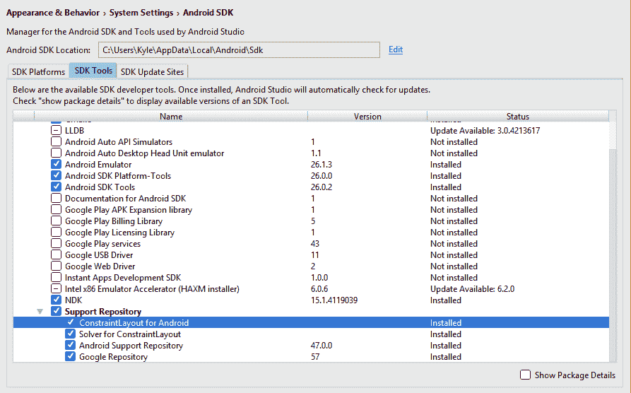

约束布局 API

1.  勾选显示包详细信息框，并记下版本号，因为这很快将需要。

1.  接下来，将`ConstraintLayout`库添加到我们的依赖项中。最简单的方法是选择您的模块，然后选择项目结构对话框的依赖项选项卡，该对话框可以从文件菜单中访问。

1.  单击+按钮，然后选择 1 Library dependency 并从列表中选择约束库。

1.  最后，从工具栏、构建菜单或*Ctrl* + *Alt* + *Y*同步您的项目。

这是添加模块依赖项的最简单方法，但作为开发人员了解底层发生的事情总是很好。在这种情况下，我们可以通过打开模块级`build.gradle`文件并将以下突出显示的文本添加到`dependencies`节点来手动添加库：

```kt
dependencies { 
    compile fileTree(dir: 'libs', include: ['*.jar']) 
    androidTestCompile('com.android.support.test.espresso:espresso-
                        core:2.2.2', { 
        exclude group: 'com.android.support', module: 'support-annotations' 
    }) 
    compile 'com.android.support:appcompat-v7:25.1.0' 
    compile 'com.android.support.constraint:constraint-layout:1.0.0-beta4' 
    testCompile 'junit:junit:4.12' 
```

那些使用相对布局开发的人将熟悉诸如`layout_toRightOf`或`layout_toTopOf`之类的命令。这些属性仍然可以应用于`ConstraintLayout`，但还有更多。特别是，`ConstraintLayout`允许我们基于单个边来定位视图，例如`layout_constraintTop_toBottomOf`，它将我们的视图的顶部与指定视图的底部对齐。

有关这些属性的有用文档可以在以下网址找到：[developer.android.com/reference/android/widget/RelativeLayout.LayoutParams.html](https://developer.android.com/reference/android/widget/RelativeLayout.LayoutParams.html)。

# 创建约束布局

有两种方法可以创建 ConstraintLayout。第一种是将现有布局转换为 ConstraintLayout，可以通过右键单击组件树或图形编辑器中的布局，然后选择转换选项来完成。然后会出现以下对话框：

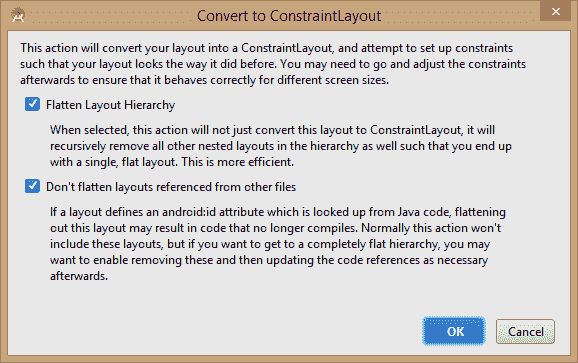

转换为 ConstraintLayout 对话框

通常最好同时检查这两个选项，但值得注意的是，这些转换并不总是会产生期望的结果，通常视图尺寸需要进行一些微调才能忠实地复制原始布局。

当它起作用时，以前的方法提供了一个快速的解决方案，但是如果我们要掌握这个主题，我们需要知道如何从头开始创建约束布局。这一点特别重要，因为一旦我们熟悉了约束布局的工作方式，我们将会发现这是设计界面最简单、最灵活的方式。

ConstraintLayout 与布局编辑器完美结合，可以设计任何布局而无需编写任何 XML。然而，我们将密切关注图形和文本两个方面，以便更深入地了解这项技术。

您可以从项目资源管理器的上下文菜单中的 res/layout 目录中创建一个新的 ConstraintLayout，作为一个具有以下根元素的新布局资源文件：


添加新的 ConstraintLayout

这将生成以下 XML：

```kt
<?xml version="1.0" encoding="utf-8"?> 
<android.support.constraint.ConstraintLayout 

    android:layout_width="match_parent" 
    android:layout_height="match_parent"> 

</android.support.constraint.ConstraintLayout> 
```

与其他布局类型一样，约束层提供了在其中定位和对齐视图和小部件的机制。这主要通过可以在图形上定位以调整大小和对齐视图的手柄来完成。

# 应用约束

了解其工作原理的最佳方法是尝试一下，这几个简单的步骤将进行演示。按照前面描述的方式创建 ConstraintLayout，并从调色板拖放一个或两个视图或小部件到蓝图屏幕上，类似于以下图示：

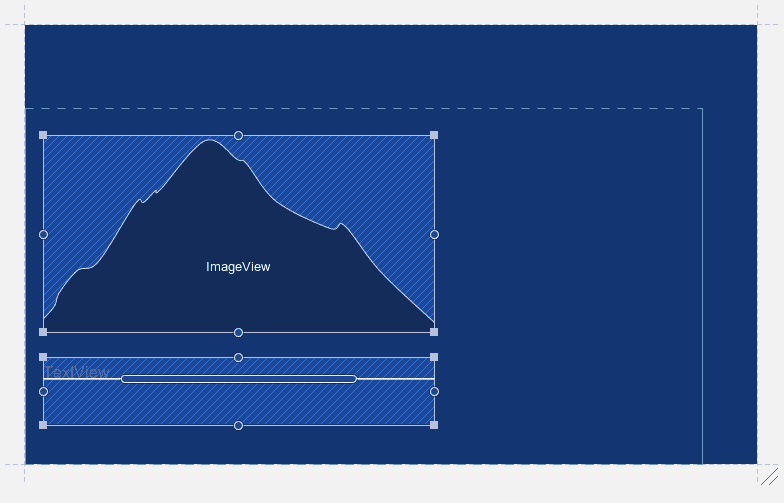

约束手柄

每个视图的角落和边上都有约束手柄。角落上的手柄用于简单地调整视图的大小，而边上的手柄用于创建约束。这些位置视图是相对于其父级或彼此的，与相对布局并没有太大不同。

由于这主要是一种图形形式的编辑，最好通过操作来进行演示。将视图的左侧锚点拖向布局的左侧，并按照提示释放鼠标按钮以创建父约束。这是一个包含其他内容的布局，将成为父约束。

当您尝试使用约束时，您会注意到边距会自动粘附到创意设计指南推荐的值。

如果现在打开文本编辑器，您将看到约束如下所示：

```kt
app:layout_constraintLeft_toLeftOf="parent" 
```

您还会注意到从代码中生成了一个错误。这是因为每个视图都需要垂直和水平约束。可以通过以下方式实现：

```kt
app:layout_constraintTop_toTopOf="parent" 
```

也可以使用相同的拖放技术在子视图之间创建约束，或者：

```kt
app:layout_constraintTop_toBottomOf="@+id/image_view" 
```

在视图的四个边上设置约束将使其居中在其容器中。

约束可用于对齐兄弟视图以及连接两个相邻的边，生成以下代码：

```kt
app:layout_constraintLeft_toLeftOf="@+id/image_view" 
```

可以通过在任一编辑模式下单击其起始手柄来简单地删除约束。

这种拖放方法并不是 Android Studio 独有的，但是 Android Studio 提供了一个可编辑的示意图视图，通过属性工具来实现。

# 图形属性工具

当选择 ConstraintLayout 视图时，属性窗口中会弹出一个视图的图解表示：

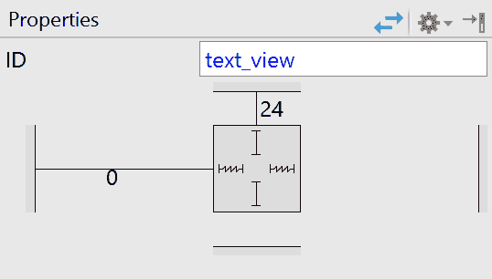

属性示意图。

这个工具允许通过单击来编辑大小和位置属性，并且可以立即以简单的示意图形式理解输出。学习起来只需要几秒钟，可以大大加快界面设计的速度，特别是在尝试不同的布局时。

在代表我们视图的中央正方形内，有四条线，单击它们会循环显示以下三种状态：

+   **实线**：视图是精确的宽度，例如`240dp`

+   **模糊线**：视图可以是任何大小（取决于偏差），`match_parent`

+   **有向线**：视图匹配其自身内容，`wrap_content`

通常，我们不希望将视图约束到其容器的边缘。例如，我们可能希望将布局分成两个或多个部分，并在其中组织视图。指南允许我们将屏幕分成几个部分，并且可以像父边缘一样使用。看下面的例子：

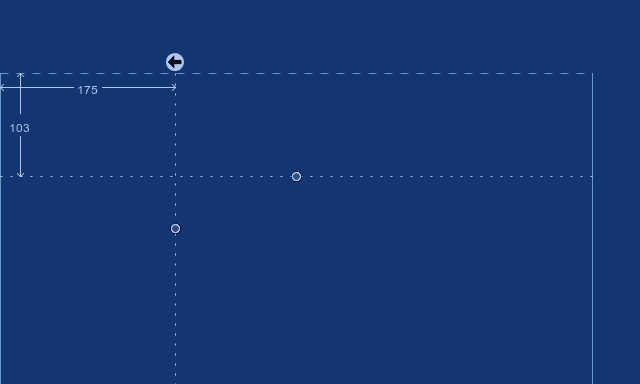

约束指南

像这样的指南最容易从设计编辑器顶部的约束工具栏中添加。指南被添加为 XML 组件，看起来像这样：

```kt
<android.support.constraint.Guideline 
    android:id="@+id/gl_vertical" 
    android:layout_width="wrap_content" 
    android:layout_height="311dp" 
    android:orientation="vertical" 
    app:layout_constraintGuide_begin="175dp" /> 
```

现在我们可以使用这些指南来根据整个布局或我们创建的四个窗格之一来居中元素，而无需嵌套任何布局。在下面的屏幕截图中，我们有一个居中的标题和侧边栏，另一个视图包含在一个单独的窗格中，当然我们可以对这些部分应用偏差：

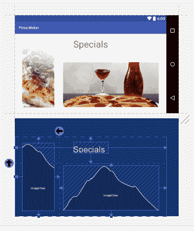

应用约束指南

如果这个系统还没有提供足够的优势，那就还有更多。首先，当对齐文本以及一种称为偏差的更强大的定位技术时，它被证明非常有用，它执行与权重属性类似的功能，但在设计多个屏幕时更好。我们首先来看一下文本对齐约束。

# 基线对齐

使用它们的基线将文本对齐到多个视图可能有些麻烦，特别是当文本大小不同时。幸运的是，约束布局提供了一种简单而轻松的方法来实现这一点。

任何受约束的视图或设计用于包含文本的小部件，都会在其中心处有一条横杠。将鼠标悬停在此处片刻，直到它闪烁，然后将其拖动到您希望将其文本与之对齐的视图，如下所示：


基线对齐。

您可能已经熟悉相对布局类使用的重力属性来控制位置。

基线约束只能连接到其他基线。

约束布局引入了一种新的方法，允许我们控制视图两侧的相对距离。

# 使用偏差控制位置

在这里，偏差最好理解为百分比值，但与其根据中心或角落的位置，它是它两侧空间的百分比。因此，如果向上的偏差为 33％，则下方的边距将是下方边距的两倍。

设置偏差甚至比理解它更容易，因为一旦在视图的任何对立面上设置了约束，属性编辑器中将出现一个关联的滑块：

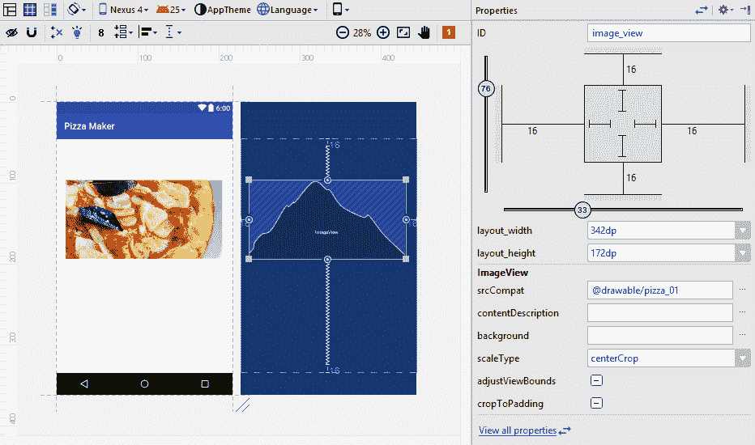

使用 GUI 应用偏差

快速浏览生成的代码，显示了该属性的格式如下：

```kt
app:layout_constraintHorizontal_bias="0.33" 
```

使用偏差来定位屏幕元素的价值部分在于其简单的方法，但其真正价值在于开发多个屏幕时。有这么多型号可用，它们似乎都有稍微不同的比例。这可能使得在所有这些屏幕上看起来很棒的设计布局非常耗时，即使是 720 x 1280 和 768 x 1280 这样相似的形状在使用相同的布局进行测试时也可能产生不良结果。使用偏差属性在很大程度上解决了这些问题，我们将在稍后看到更多内容，当我们看到布局预览和百分比库时。

编辑器的设计和文本模式可以使用*Alt* +左或右进行切换。

好像所有这些都没有使设计布局变得足够简单，约束布局还有另外两个非常方便的功能，几乎可以自动化 UI 设计：自动连接和推断。

# 约束工具栏

尽管我们总是希望花费大量时间完善我们的最终设计，但开发周期的大部分时间将用于实验和尝试新想法。我们希望尽快测试这些单独的设计，这就是自动连接和推断的用武之地。这些功能可以通过约束工具栏访问，其中包含其他有用的工具，值得详细了解。


约束工具栏

从左到右，工具栏分解如下。

+   显示约束：显示所有约束，而不仅仅是所选组件的约束。

+   自动连接：启用此功能后，新视图和小部件的约束将根据它们放置的位置自动设置。

+   清除所有约束：顾名思义，一键解决方案。这可能会导致一些意想不到的结果，因此应该小心使用。

+   推断约束：设计布局后应用此功能。它将自动应用约束，类似于自动连接，但它会一次性对所有视图应用约束。

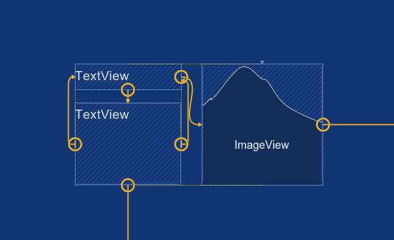

推断过程

+   默认边距：设置整个布局的边距。

+   Pack：提供一系列分布模式，帮助均匀扩展或收缩所选项目使用的区域。

+   对齐：此下拉菜单提供了最常用的组对齐选项。

+   指南：允许快速插入指南。

自动连接和推断都提供了智能和快速的构建约束布局的方法，虽然它们是测试想法的绝佳工具，但它们远非完美。这些自动化经常会包括不必要的约束，需要删除。此外，如果您在使用这些技术之后检查 XML，您会注意到一些值是硬编码的，您会知道这不是最佳实践。

希望您在本节中已经看到，Android Studio 和 ConstraintLayout 确实是为彼此而生的。这并不是说它应该在所有情况下取代线性和相对布局。在简单列表方面，线性布局仍然是最有效的。对于只有两个或三个子元素的布局，相对布局通常也更便宜。

`ConstraintLayout`类还有更多内容，比如分布链接和运行时约束修改，我们将在整本书中经常回到这个主题，但现在我们将看看 Android Studio 的另一个独特而强大的工具，设备预览和仿真。

# 多屏幕预览

Android 开发人员面临的最有趣的挑战之一是使用它的设备数量令人困惑。从手表到宽屏电视，各种设备都在使用。我们很少希望开发一个单一的应用程序在这样的范围内运行，但即使为所有手机开发布局也是一项艰巨的任务。

幸运的是，SDK 允许我们将屏幕形状、大小和密度等功能分类到更广泛的组中，从而帮助这一过程。Android Studio 还添加了另一个强大的 UI 开发工具，即复杂的预览系统。这可以用于预览许多流行的设备配置，同时也允许我们创建自定义配置。

在前面的部分中，我们看了 ConstraintLayout 工具栏，但正如您可能已经注意到的那样，还有一个更通用的设计编辑器工具栏：


设计编辑器工具栏

这些工具中的大多数都是不言自明的，您可能已经使用过其中的许多。然而，其中有一两个值得更仔细地研究，特别是如果您是 Android Studio 的新手。

迄今为止，我们可以使用的最有用的设计工具之一是编辑器中的设备工具，在前面的图中显示为 Nexus 4。这使我们能够预览我们的布局，就像它们在任意数量的设备上显示一样，而无需编译项目。下拉菜单提供了一系列通用和真实世界的配置文件，我们可能创建的任何 AVD，以及添加我们自己的设备定义的选项。现在我们将看看这个选项。

# 硬件配置文件

从编辑器中的设备下拉菜单中选择“添加设备定义...”将打开 AVD 管理器。要创建新的硬件配置文件，请单击“创建虚拟设备...”按钮。选择硬件对话框允许我们安装和编辑前面下拉菜单中列出的所有设备配置文件，以及创建或导入定义的选项。

AVD 管理器的独立版本可以从`user\AppData\Local\Android\sdk\`运行。这对于性能较低的机器非常有用，因为 AVD 可以在没有 Studio 运行的情况下启动。

通常更容易采用现有的定义并根据我们的需求进行调整，但为了更深入地了解操作，我们将通过单击“选择硬件”对话框中的“新硬件配置文件”按钮，从头开始创建一个。这将带您进入“配置硬件配置文件”对话框，在那里您可以选择硬件仿真器，如摄像头和传感器，以及定义内部和外部存储选项。


硬件配置

一旦您完成配置文件并点击“完成”，您将返回到硬件选择屏幕，在那里您的配置文件现在已被添加到列表中。然而，在继续之前，我们应该快速看一下如何模拟存储硬件。

# 虚拟存储

每个配置文件都包含一个 SD 卡磁盘映像来模拟外部存储，显然这是一个有用的功能。然而，如果我们能够移除这些卡并与其他设备共享，那将更加有用。幸运的是，Android Studio 有一些非常方便的命令行工具，我们将在本书中遇到。这里我们感兴趣的命令是`mksdcard`。

`mksdcard`可执行文件位于`sdk/tools/`中，创建虚拟 SD 卡的格式为：

```kt
mksdcard <label> <size> <file name> 
```

例如：

```kt
mksdcard -l sharedSdCard 1024M sharedSdCard.img 
```

在大量虚拟设备上测试应用程序时，能够共享外部存储器可以节省大量时间，当然，这样的映像可以存储在实际的 SD 卡上，这不仅使它们更加便携，还可以减轻硬盘的负担。

我们的配置文件现在已准备好与系统映像结合，形成 AVD，但首先我们将导出它，以便更好地了解它是如何组合的。这将保存为 XML 文件，并且可以通过右键单击硬件选择屏幕的主表中的配置文件来实现。这不仅提供了洞察力，也是跨网络共享设备的便捷方式，而且编辑本身也非常快速简单。

配置本身可能会相当长，因此以下是一个示例节点，以提供一个想法：

```kt
<d:screen> 
    <d:screen-size>xlarge</d:screen-size> 
    <d:diagonal-length>9.94</d:diagonal-length> 
    <d:pixel-density>xhdpi</d:pixel-density> 
    <d:screen-ratio>notlong</d:screen-ratio> 
    <d:dimensions> 
        <d:x-dimension>2560</d:x-dimension> 
        <d:y-dimension>1800</d:y-dimension> 
    </d:dimensions> 
    <d:xdpi>314.84</d:xdpi> 
    <d:ydpi>314.84</d:ydpi> 
    <d:touch> 
        <d:multitouch>jazz-hands</d:multitouch> 
        <d:mechanism>finger</d:mechanism> 
        <d:screen-type>capacitive</d:screen-type> 
    </d:touch> 
</d:screen> 
```

在这里定义屏幕的方式，为我们提供了一个有用的窗口，可以了解在开发多个设备时需要考虑的功能和定义。

要查看我们的配置文件的实际效果，我们需要将其连接到系统映像并在模拟器上运行。这是通过选择配置文件并点击“下一步”来完成的。

要彻底测试应用程序，通常最好为要发布应用程序的每个 API 级别、屏幕密度和硬件配置创建一个 AVD。

选择图像后，您将有机会调整硬件配置文件，然后创建 AVD：

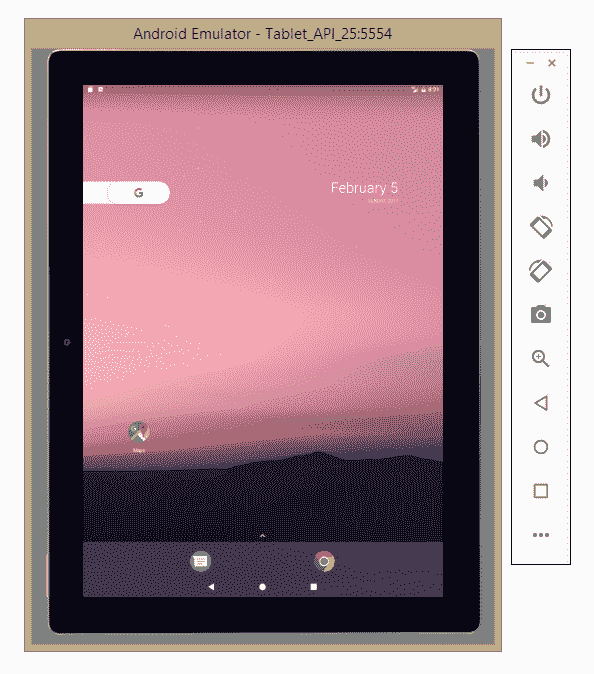

Android AVD

模拟最新的移动设备是一项令人印象深刻的任务，即使对于最坚固的计算机来说，即使使用 HAXM 硬件加速，速度仍然可能令人沮丧地慢，尽管即时运行的添加大大加快了这个过程。除了 Genymotion 之外，几乎没有其他选择，Genymotion 提供了更快的虚拟设备和一些在本机模拟器上无法使用的功能。这些功能包括拖放安装、实时窗口调整大小、工作网络连接和一键模拟位置设置。唯一的缺点是 Android Wear、TV 或 Auto 没有系统映像，并且仅供个人免费使用。

本节展示了我们如何在许多形态因素上预览我们的布局，以及如何构建一个虚拟设备以匹配任何目标设备的精确规格，但这只是故事的一部分。在下一章中，我们将看到如何为所有目标设备创建布局文件。

# 总结

在本章中，我们介绍了界面开发的基础知识，这在很大程度上是使用和理解各种布局类型的问题。本章的大部分内容都致力于约束布局，因为这是最新和最灵活的视图组之一，并且在 Android Studio 中配备了直观的可视化工具。

本章最后介绍了如何将完成的布局在模拟器上查看，并使用自定义的硬件配置文件。

在接下来的章节中，我们将更深入地研究这些布局，并看到协调布局是如何用来协调多个子组件一起工作的，而我们几乎不需要编写任何代码。
