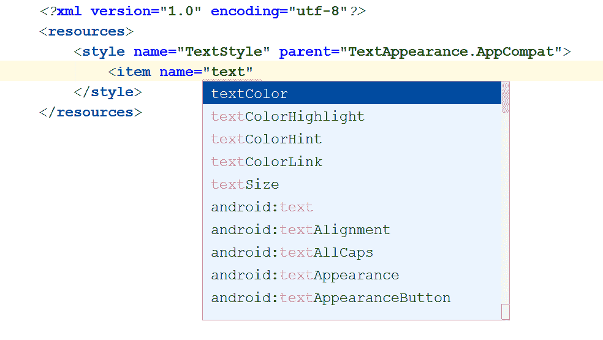
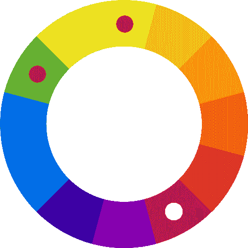
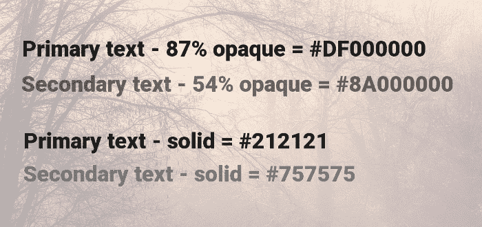
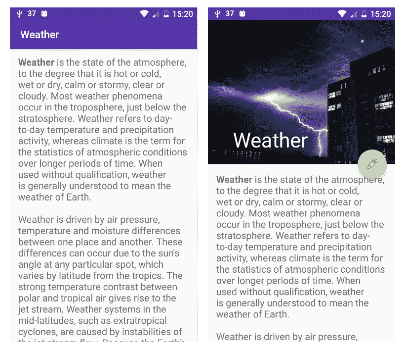
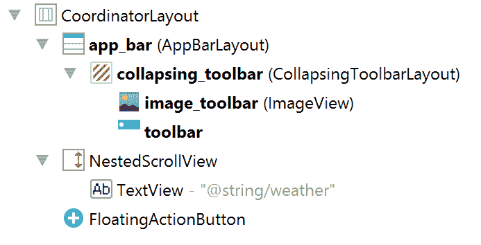

# 第三章：UI 开发

在上一章中，我们看到安卓工作室为快速简单地设计布局提供了许多宝贵的工具。然而，我们只关注了静态 UI 的设计。当然，这是一个必不可少的第一步，但我们的界面可以，也应该是动态的。根据材料设计指南，用户交互应该通过运动和颜色直观地展示，比如点击按钮时产生的涟漪动画。

要了解如何做到这一点，我们需要看一个实际的例子，并开始构建一个简单但功能的应用程序。但首先，我们将研究一两种应用我们想要的外观和感觉的方式，并且安卓用户期望将其应用到我们的设计中。这个过程在很大程度上得到了支持库的帮助，特别是 AppCompat 和 Design 库。

我们将从查看安卓工作室如何通过基于材料的视觉主题编辑器和设计支持库来实现材料设计开始本章。

在本章中，您将学习以下内容：

+   生成材料样式和主题

+   使用 XML 字体

+   创建 XML 字体系列

+   使用基本代码完成

+   应用协调布局

+   协调设计组件

+   创建一个可折叠的应用栏

+   部署原始资源

+   使用百分比支持库

我们在上一章中看到，当使用设计编辑器调整约束布局的屏幕元素的大小和移动时，我们的视图往往会粘在一组特定的尺寸上。这些尺寸是根据 Material 设计指南选择的。如果您不知道，Material 是一种设计语言，由谷歌规定，基于传统的设计和动画技术，旨在通过移动和位置来清理用户界面的过程。

# 材料设计

虽然 Material 设计并不是必不可少的，如果您正在开发全屏应用程序，比如游戏，它通常有自己的设计规则，可以完全忽略它，但它仍然是一种优雅的设计范式，并且被用户群广泛认可和理解。

实施材料的一个非常好的理由是，许多其特性，如卡片视图和滑动抽屉，都可以通过相关的支持库非常容易地应用。

我们需要做的第一个设计决定之一是，我们想要将什么颜色方案或主题应用到我们的应用程序中。关于我们主题的色调和对比度，有一两个材料指南。幸运的是，安卓工作室的主题编辑器确实非常简单地生成符合材料的主题。

# 安卓样式

图形属性，如背景颜色、文本大小和高程，都可以在任何 UI 组件上单独设置。将属性组合到一起成为一个样式通常是有意义的。安卓将这些样式存储在 values 目录中的`styles.xml`文件中的 XML 中。一个例子如下：

```kt
<?xml version="1.0" encoding="utf-8"?> 
<resources> 
    <style name="TextStyle" parent="TextAppearance.AppCompat"> 
        <item name="android:textColor">#8000</item> 
        <item name="android:textSize">48sp</item> 
    </style> 
</resources> 
```

这样的样式可以简单地应用到视图和小部件上，而无需指定每个属性，如下所示：

```kt
<TextView 
    . . .  
    android:textAppearance="@style/TextStyle" 
    . . . /> 
```

完全可以通过定义所有属性来从头开始创建任何样式，但更实际的做法是从现有样式中继承并仅修改我们希望更改的属性。这是通过设置`parent`属性来完成的，可以在前面的例子中看到。

我们也可以继承自我们自己的样式，而无需设置父属性，例如：

```kt
<style name="TextStyle.Face"> 
    <item name="android:typeface">monospace</item> 
</style> 
```

之前，我们创建了一个新的资源文件，但我们也可以将一个新的`<style>`节点添加到现有的`styles.xml`文件中。

如果您是 Android Studio 的新手，您会注意到代码完成下拉框在您输入时出现，如下面的屏幕截图所示：



代码完成

这是一个非常有价值的工具，我们将在稍后更详细地看一下。现在，知道代码完成存在三个级别是有用的，如此简要地概述：

+   **基本**：*Ctrl* + 空格; 显示下一个单词的可能性。

+   **智能**：*Ctrl* + *Shift* + 空格; 上下文敏感建议。

+   **语句**：*Ctrl* + *Shift* + *Enter*; 完成整个语句。

连续两次调用基本和智能代码完成将扩大建议的范围。

创建和应用这样的样式是微调应用程序外观的好方法，而无需进行大量额外的编码，但有时我们也希望将外观和感觉应用于整个应用程序，为此，我们使用主题。

# 材料主题

在为应用程序创建整体主题时，我们有两个相反的目标。一方面，我们希望我们的应用程序脱颖而出，并且容易被识别；另一方面，我们希望它符合用户对平台的期望，并且希望他们发现控件熟悉且简单易用。主题编辑器在个性和一致性之间取得了很好的折衷。

在最简单的情况下，材料主题采用两种或三种颜色，并在整个应用程序中应用这些颜色，以使其具有一致的感觉，这可能是使用主题的主要好处。作为重点选择的颜色将用于着色复选框和突出显示文本，并且通常选择以突出显示并吸引注意。另一方面，主要颜色将应用于工具栏，并且与早期版本的 Android 不同，还将应用于状态栏和导航栏。例如：

```kt
<color name="colorPrimary">#ffc107</color>
<color name="colorPrimaryDark">#ffa000</color>
<color name="colorAccent">#80d8ff</color>
```

这使我们能够在应用程序运行时控制整个屏幕的颜色方案，避免与任何本机控件发生丑陋的冲突。

选择这些颜色的一般经验法则是选择主要值的两种色调和一个对比但互补的颜色作为重点。谷歌对要使用哪些色调和颜色更加精确，没有硬性规定来决定哪些颜色与其他颜色搭配得好。然而，有一些有用的指南可以帮助我们，但首先我们将看一下谷歌的材料调色板。

# 主题编辑器

谷歌规定在 Android 应用程序和 Material 设计网页中使用 20 种不同的色调。每种色调有十种阴影，如下例所示：


材料调色板

完整的调色板以及可下载的样本可以在以下网址找到：[material.io/guidelines/style/color.html#color-color-palette](http://material.io/guidelines/style/color.html#color-color-palette)。

材料指南建议我们使用 500 和 700 的阴影作为我们的主要和深色主要颜色，以及 100 作为重点。幸运的是，我们不必过分关注这些数字，因为有工具可以帮助我们。

这些工具中最有用的是主题编辑器。这是另一个图形编辑器，可以从主菜单中的工具 | Android | 主题编辑器中访问。

一旦打开主题编辑器，您将看到它分为两个部分。右侧是颜色属性列表，左侧是显示这些选择对各种界面组件的影响的面板，为我们提供了方便的预览和快速直观地尝试各种组合的机会。

正如您所看到的，不仅有两种主要颜色和一个重点。实际上有 12 种，涵盖文本和背景颜色，以及深色和浅色主题的替代方案。这些默认设置为`styles.xml`文件中声明的父主题的颜色。

要快速设置自定义材料主题，请按照以下步骤进行：

1.  开始一个新的 Studio 项目或打开一个您希望应用主题的项目。

1.  从工具 | Android 菜单中打开主题编辑器。

1.  选择 colorPrimary 字段左侧的实色块。


1.  在资源对话框的右下角选择一个纯色块，然后单击“确定”。

1.  打开 colorPrimaryDark 对话框，然后在右侧的颜色选择选项下选择唯一的建议块。它将是相同的色调，但是 700 的阴影。

1.  选择重点属性，然后从建议的颜色中选择一个。

这些选择可以立即在编辑器左侧的预览窗格中看到，也可以从布局编辑器中看到。

正如你所看到的，这些颜色并不是直接声明的，而是引用了`values/colors.xml`文件中指定的值。

编辑器不仅帮助通过建议可接受的颜色来创建材料主题，还可以帮助我们选择自己选择的颜色。在“选择资源”窗口的颜色表中的任何位置单击都会提示选择最接近的材料颜色。

在选择重点颜色时，有几种思路。根据色彩理论，可以使用色轮创建与任何颜色和谐互补色的几种方法，例如以下色轮：



RYB 色轮显示和谐互补色

计算和谐颜色的最简单方法是取色轮上与我们相对的颜色（称为直接互补色）。然而，具有艺术视野的人认为这有些显而易见，缺乏微妙之处，并更喜欢所谓的分裂互补色。这意味着从那些与直接互补色紧密相邻的颜色中进行选择，如前所示。

当选择重点颜色时，主题编辑器在颜色选择器下方建议几种分裂互补色。然而，它也建议类似的和谐色。这些颜色与原色接近，虽然看起来很好，但不适合作为重点颜色的选择，因为对比度小，用户可能会错过重要的提示。

有一个非常令人愉悦的 JetBrains 插件可用，可以将材料主题应用于 IDE 本身。它可以在以下网址找到：[plugins.jetbrains.com/androidstudio/plugin/8006-material-theme-ui](https://plugins.jetbrains.com/plugin/8006-material-theme-ui)。

正如我们刚才看到的，主题编辑器在生成材料主题时非常有帮助。还有越来越多的在线工具可以通过几次点击生成完整的 XML 材料主题。MaterialUps 可以在以下网址找到：[www.materialpalette.com](http://www.materialpalette.com)。

这将生成以下`colors.xml`文件：

```kt
<?xml version="1.0" encoding="utf-8"?> 
<resources> 
    <color name="primary">#673AB7</color> 
    <color name="primary_dark">#512DA8</color> 
    <color name="primary_light">#D1C4E9</color> 
    <color name="accent">#FFEB3B</color> 
    <color name="primary_text">#212121</color> 
    <color name="secondary_text">#757575</color> 
    <color name="icons">#FFFFFF</color> 
    <color name="divider">#BDBDBD</color> 
</resources> 
```

乍一看，这看起来像是选择主题属性的快速方法，但是如果查看文本颜色，你会发现它们是灰色的阴影。根据材料设计指南，这是不正确的，应该使用 alpha 通道使用透明度创建阴影。当文本放在纯色背景上时，这没有什么区别，但当放在图像上时，灰度文本可能更难阅读，特别是浅色阴影，如此所示：



灰度与透明度

Android 主题允许我们以颜色的形式定义应用程序的外观，但通常我们希望做的不仅仅是自定义文本的颜色，能够以与其他资源类似的方式包含字体是最近非常有用的补充。

# XML 字体

从 API 级别 26 开始，可以将字体作为 XML 资源包含在`res`目录中。这一特性简化了在应用程序中使用非默认字体的任务，并使该过程与其他资源管理保持一致。

添加 XML 字体非常简单，如下练习所示：

1.  右键单击`res`目录，然后选择“新建|Android 资源目录”。

1.  从资源类型下拉菜单中选择字体，然后单击“确定”。

1.  右键单击新创建的字体文件夹，然后选择在资源管理器中显示。

1.  重命名您的字体文件，使其只包含可允许的字符。例如，`times_new_roman.ttf`而不是`TimesNewRoman.ttf`。

1.  将所选字体放入字体目录中。

1.  现在可以直接从编辑器中预览这些。


XML 字体。

在布局中使用这些字体甚至比将它们添加为资源更简单。只需使用`fontFamily`属性，如下所示：

```kt
<TextView
         . . .
        android:fontFamily="@font/just_another_hand"
         . . . />
```

在处理字体时，通常希望以各种方式强调单词，比如使用更粗的字体或使文本变斜体。与其为每个版本依赖不同的字体，更方便的做法是能够引用字体组或字体系列。只需右键单击您的`font`文件夹，然后选择新建|字体资源文件。这将创建一个空的字体系列文件，然后可以按照以下方式填写：

```kt
<?xml version="1.0" encoding="utf-8"?>
<font-family >
    <font
        android:fontStyle="bold"
        android:fontWeight="400"
        android:font="@font/some_font_bold" />

    <font
        android:fontStyle="italic"
        android:fontWeight="400"
        android:font="@font/some_font_italic" />
</font-family>
```

当然，设计语言远不止于选择正确的颜色和字体。关于间距和比例有惯例，通常还有一些特别设计的屏幕组件。在材料的情况下，这些组件采用小部件和布局的形式，例如 FAB 和滑动抽屉。这些不是作为原生 SDK 的一部分提供的，而是包含在设计支持库中。

# 设计库

如前所述，设计支持库提供了在材料应用程序中常见的小部件和视图。

正如您所知，设计库和其他支持库一样，需要在模块级`build.gradle`文件中作为 gradle 依赖项包含，如下所示：

```kt
dependencies { 
    compile fileTree(include: ['*.jar'], dir: 'libs') 
    androidTestCompile('com.android.support.test.espresso:espresso-
      core:2.2.2', { 
          exclude group: 'com.android.support', module: 'support-
                annotations' 
    }) 
    compile 'com.android.support:appcompat-v7:25.1.1' 
    testCompile 'junit:junit:4.12' 
    compile 'com.android.support:design:25.1.1' 
} 
```

虽然了解事情是如何做的总是有用的，但实际上，有一个很好的快捷方式可以将支持库添加为项目依赖项。从文件菜单中打开项目结构对话框，然后选择您的模块和依赖项选项卡。


项目结构对话框

您可以通过单击右上角的添加图标并从下拉菜单中选择库依赖项来选择您想要的库。

可以使用*Ctrl* + *Alt* + *Shift* + *S*键来召唤项目结构对话框。

使用这种方法还有另外两个优点。首先，IDE 将自动重建项目，其次，它将始终导入最新的修订版本。

许多开发人员通过使用加号来预防未来的修订，如下所示：`compile 'com.android.support:design:25.1.+'`。这样可以应用未来的次要修订。但是，这并不总是保证有效，并且可能会导致崩溃，因此最好手动保持版本最新，即使这意味着发布更多更新。

除了导入设计库之外，如果您计划开发材料应用程序，您很可能还需要`CardView`和`RecyclerView`库。

熟悉 IDE 的最佳方法是通过实际示例进行操作。在这里，我们将制作一个简单的天气应用程序。它不会很复杂，但它将带领我们完成应用程序开发的每个阶段，并且将遵循材料设计准则。

# 协调布局

设计库提供了三个布局类。有一个用于设计表格活动，一个用于工具栏，但最重要的布局是`CoordinatorLayout`，它充当材料感知容器，自动执行许多材料技巧，例如当用户滚动到列表顶部时扩展标题，或者在弹出的小吃栏出现时确保 FAB 滑出。

协调布局应放置在活动的根布局中，并且通常看起来像以下行：

```kt
<android.support.design.widget.CoordinatorLayout  

    android:id="@+id/coordinator_layout" 
    android:layout_width="match_parent" 
    android:layout_height="match_parent" 
    android:fitsSystemWindows="true"> 

    . . . 

</android.support.design.widget.CoordinatorLayout> 
```

属性`fitsSystemWindows`特别有用，因为它将状态栏设置为部分透明。这样可以使我们的设计主导本机控件，而不会完全隐藏它们，同时避免与系统颜色发生冲突。


在状态栏后面绘制

还可以使用`colorPrimaryDark`来分配状态栏的颜色，将`fitsSystemWindows`与我们自己选择的颜色结合起来。

导航栏的颜色也可以使用`navigationBarColor`属性进行更改，但这并不建议，因为具有软导航控件的设备正在变得越来越少。

`CoordinatorLayout`与`FrameLayout`非常相似，但有一个重要的例外。协调布局可以使用`CoordinatorLayout.Behavior`类直接控制其子项。最好的方法是通过一个例子来看看它是如何工作的。

# Snackbar 和浮动操作按钮

Snackbar 和**浮动操作按钮**（**FABs**）是最具代表性的 Material 小部件之一。尽管它并不完全取代 toast 小部件，但 Snackbar 提供了一种更复杂的活动通知形式，允许控件和媒体而不仅仅是文本，而这是 toast 的情况。FABs 执行与传统按钮相同的功能，但使用它们的位置来指示它们的功能。

如果没有协调布局来控制行为，`Snackbar`从屏幕底部升起会遮挡其后的任何视图或小部件。如果小部件能够优雅地滑出去，这将更可取，这是你在设计良好的 Material 应用中经常看到的情况。以下练习解释了如何实现这一点：

1.  在 Android Studio 中开始一个新项目。

1.  在这里用`CoordinatorLayout`替换主活动的根布局：

```kt
<android.support.design.widget.CoordinatorLayout  

    android:id="@+id/coordinator_layout" 
    android:layout_width="match_parent" 
    android:layout_height="match_parent" 
    android:fitsSystemWindows="true"> 
```

1.  添加以下按钮：

```kt
<Button 
    android:id="@+id/button" 
    android:layout_width="wrap_content" 
    android:layout_height="wrap_content" 
    android:layout_gravity="top|start" 
    android:layout_marginStart= 
            "@dimen/activity_horizontal_margin" 
    android:layout_marginTop= 
            "@dimen/activity_vertical_margin" 
    android:text="Download" />
```

1.  接着是`Snackbar`：

```kt
<android.support.design.widget.FloatingActionButton 
    android:id="@+id/fab" 
    android:layout_width="wrap_content" 
    android:layout_height="wrap_content" 
    android:layout_gravity="bottom|end" 
    android:layout_marginBottom= 
            "@dimen/activity_vertical_margin" 
    android:layout_marginEnd= 
            "@dimen/activity_horizontal_margin" 
    app:srcCompat="@android:drawable/stat_sys_download" /> 
```

1.  打开主活动的 Java 文件，并扩展类声明以实现点击监听器，如下所示：

```kt
public class MainActivity 
    extends AppCompatActivity 
    implements View.OnClickListener 
```

1.  这将生成一个错误，然后会出现一个红色的灯泡（称为快速修复）。


快速修复

1.  选择实现方法以添加`OnClickListener`。

1.  在类中添加以下字段：

```kt
private Button button; 
private CoordinatorLayout coordinatorLayout; 
```

1.  在`onCreate()`方法中为这些组件创建引用：

```kt
coordinatorLayout = (CoordinatorLayout)  
    findViewById(R.id.coordinator_layout); 
button = (Button) 
    findViewById(R.id.button); 
```

1.  将按钮与监听器关联，如下所示：

```kt
button.setOnClickListener(this); 
```

1.  然后按照以下方式完成监听器方法：

```kt
@Override 
public void onClick(View v) { 
    Snackbar.make(coordinatorLayout, 
            "Download complete", 
            Snackbar.LENGTH_LONG).show(); 
    } 
} 
```

现在可以在模拟器或真实设备上测试这段代码。单击按钮将临时显示`Snackbar`，并将 FAB 滑开以便显示。

`Snackbar`在之前的演示中的行为与 toast 完全相同，但`Snackbar`是`ViewGroup`而不是像 toast 那样的视图；作为布局，它可以充当容器。要查看如何实现这一点，请用以下方法替换之前的监听器方法：

```kt
@Override 
public void onClick(View v) { 
    Snackbar.make(coordinatorLayout, 
            "Download complete", 
            Snackbar.LENGTH_LONG) 
            .setAction("Open", new View.OnClickListener() { 

                @Override 
                public void onClick(View v) { 
                    // Perform action here 
                } 

            }).show(); 
    } 
} 

```

FAB 如何在`Snackbar`的遮挡下自动移开是由父协调布局自动处理的，对于所有设计库小部件和 ViewGroups 都是如此。我们很快将看到，当包含原生视图时，如文本视图和图像，我们必须定义自己的行为。我们也可以自定义设计组件的行为，但首先我们将看一下其他设计库组件。

# 可折叠的应用栏

另一个广为人知的 Material 设计特性是可折叠的工具栏。通常包含相关的图片和标题。当用户滚动到内容顶部时，这种类型的工具栏将填充屏幕的大部分空间，当用户希望查看更多内容并向下滚动时，它会巧妙地躲开。这个组件有一个有用的目的，它提供了一个很好的品牌机会，让我们的应用在视觉上脱颖而出，但它不会占用宝贵的屏幕空间。



一个可折叠的应用栏

查看它的构造方式最好的方法是查看其背后的 XML 代码。按照以下步骤重新创建它：

1.  在 Android Studio 中开始一个新的项目。我们将创建以下布局：



项目组件树

1.  首先打开`styles.xml`文件。

1.  确保父主题不包含操作栏，如下所示：

```kt
<style name="AppTheme" 
    parent="Theme.AppCompat.Light.NoActionBar"> 
```

1.  如果要使用半透明状态栏，请添加以下行：

```kt
<item name="android:windowTranslucentStatus">true</item> 
```

1.  与以前一样，创建一个以`CoordinatorLayout`为根的布局文件。

1.  接下来，嵌套以下`AppBarLayout`：

```kt
<android.support.design.widget.AppBarLayout 
    android:id="@+id/app_bar" 
    android:layout_width="match_parent" 
    android:layout_height="300dp" 
    android:fitsSystemWindows="true" 
    android:theme="@style/ThemeOverlay 
        .AppCompat 
        .Dark 
        .ActionBar"> 
```

1.  在其中，添加`CollapsingToolbarLayout`：

```kt
<android.support.design.widget.CollapsingToolbarLayout 
    android:id="@+id/collapsing_toolbar" 
    android:layout_width="match_parent" 
    android:layout_height="match_parent" 
    android:fitsSystemWindows="true" 
    app:contentScrim="?attr/colorPrimary" 
    app:expandedTitleMarginEnd="64dp" 
    app:expandedTitleMarginStart="48dp" 
    app:layout_scrollFlags="scroll|exitUntilCollapsed" 
    app:> 
```

1.  在工具栏中，添加这两个小部件：

```kt
<ImageView 
    android:id="@+id/image_toolbar" 
    android:layout_width="match_parent" 
    android:layout_height="match_parent" 
    android:fitsSystemWindows="true" 
    android:scaleType="centerCrop" 
    app:layout_collapseMode="parallax" 
    app:srcCompat="@drawable/some_image" /> 

<android.support.v7.widget.Toolbar 
    android:id="@+id/toolbar" 
    android:layout_width="match_parent" 
    android:layout_height="?attr/actionBarSize" 
    app:layout_collapseMode="pin" 
    app:popupTheme="@style/ThemeOverlay.AppCompat.Light" /> 
```

1.  在`AppBarLayout`下面，放置`NestedScrollView`和`TextView`：

```kt
<android.support.v4.widget.NestedScrollView 
    android:layout_width="match_parent" 
    android:layout_height="match_parent" 
    app:layout_behavior= 
        "@string/appbar_scrolling_view_behavior"> 

    <TextView 
        android:layout_width="match_parent" 
        android:layout_height="wrap_content" 
        android:padding="@dimen/activity_horizontal_margin" 
        android:text="@string/some_string" 
        android:textSize="16sp" /> 

</android.support.v4.widget.NestedScrollView> 
```

1.  最后添加一个 FAB：

```kt
<android.support.design.widget.FloatingActionButton 
    android:layout_width="wrap_content" 
    android:layout_height="wrap_content" 
    android:layout_margin="@dimen/activity_horizontal_margin" 
    app:layout_anchor="@id/app_bar" 
    app:layout_anchorGravity="bottom|end" 
    app:srcCompat="@android:drawable/ic_menu_edit" /> 
```

如果现在在设备或模拟器上测试这个，你会看到工具栏会自动折叠和展开，无需任何编程，这就是设计库的美妙之处。要在没有它的情况下编写这种行为将是一个漫长而常常困难的过程。

前面的大部分 XML 都是不言自明的，但有一两个点值得一看。

# 原始文本资源

为了演示滚动行为，前面文本视图中使用了一个较长的字符串。这个字符串放在了`strings.xml`文件中，虽然这样做完全没有问题，但并不是管理长文本的优雅方式。这种文本最好作为可以在运行时读取的文本文件资源来处理。

以下步骤演示了如何做到这一点：

1.  准备一个纯文本文件。

1.  通过右键单击项目资源管理器中的`res`文件夹并选择`New | Directory`来创建一个名为`raw`的目录。

1.  将文本文件添加到此目录。

可以从资源管理器上下文菜单快速打开项目目录。

1.  打开包含要填充文本视图的 java 活动，并添加此函数：

```kt
private StringBuilder loadText(Context context) throws IOException { 
    final Resources resources = this.getResources(); 
    InputStream stream = resources 
        .openRawResource(R.raw.weather); 
    BufferedReader reader =  
        new BufferedReader( 
        new InputStreamReader(stream)); 
    StringBuilder stringBuilder = new StringBuilder(); 
    String text; 

    while ((text = reader.readLine()) != null) { 
        stringBuilder.append(text); 
    } 

    reader.close(); 
    return stringBuilder; 
} 
```

1.  最后，将此代码添加到`onCreate()`方法中：

```kt
TextView textView = (TextView) 
    findViewById(R.id.text_view); 

StringBuilder builder = null; 

try { 
    builder = loadText(this); 
} catch (IOException e) { 
    e.printStackTrace(); 
} 

textView.setText(builder); 
```

在前面的演示中，另一个要点是在扩展工具栏的高度上使用了硬编码值，即`android:layout_height="300dp"`。这在被测试的模型上运行得很好，但要在所有屏幕类型上实现相同的效果可能需要创建大量的替代布局。一个更简单的解决方案是只重新创建`dimens`文件夹，例如，可以简单地复制和粘贴`dimens-hdpi`，然后只编辑适当的值。甚至可以创建一个单独的文件来包含这个值。另一种解决这个问题的方法是使用专为这种情况设计的支持库。

# 百分比库

百分比支持库只提供了两个布局类`PercentRelativeLayout`和`PercentFrameLayout`。需要将其添加到 gradle 构建文件中作为依赖项，如下所示：

```kt
compile 'com.android.support:percent:25.1.1' 
```

为了重新创建上一节中的布局，我们需要将`AppBarLayout`放在`PercentRelativeLayout`中。然后我们可以使用百分比值来设置我们应用栏的最大高度，如下所示：

```kt
<android.support.percent.PercentRelativeLayout 

  android:layout_width="match_parent" 
  android:layout_height="match_parent"> 

    <android.support.design.widget.AppBarLayout 
        android:id="@+id/app_bar" 
        android:layout_width="match_parent" 
        android:layout_height="30%" 
        android:fitsSystemWindows="true" 
        android:theme="@style/ThemeOverlay 
            .AppCompat 
            .Dark 
            .ActionBar"> 

        . . .  

    </android.support.design.widget.AppBarLayout> 

</android.support.percent.PercentRelativeLayout>    
```

这种方法节省了我们不得不创建大量替代布局来在众多设备上复制相同效果的麻烦，尽管总是需要生成多个。

实现这种统一性的另一种有效方法是创建我们的图像可绘制对象，使其在 dp 中具有所需的确切高度，并在 XML 中将布局高度设置为`wrap_content`。然后我们只需要为每个所需的指定资源目录创建一个图像，这是我们很可能会做的事情。

总之，前面的工具使得设计材料界面变得简单直观，并提供了减少为用户提供的令人困惑的设备准备布局所需的时间的方法。

# 总结

在本章中，我们在上一章的基础上探讨了如何使用协调布局及其相关库来轻松构建更复杂的布局，这些库可以为我们做很多工作，比如自动折叠工具栏和防止小部件重叠。

我们通过探讨另一个宝贵的设计库——百分比库来结束了本章，它可以在开发针对非常不同的屏幕尺寸和形状时解决大量的设计问题。

下一章将在本章的基础上扩展，探讨更多用于界面开发的动态元素，如屏幕旋转、为可穿戴设备开发和读取传感器。
