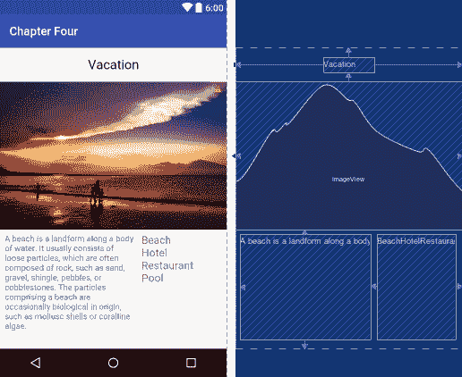
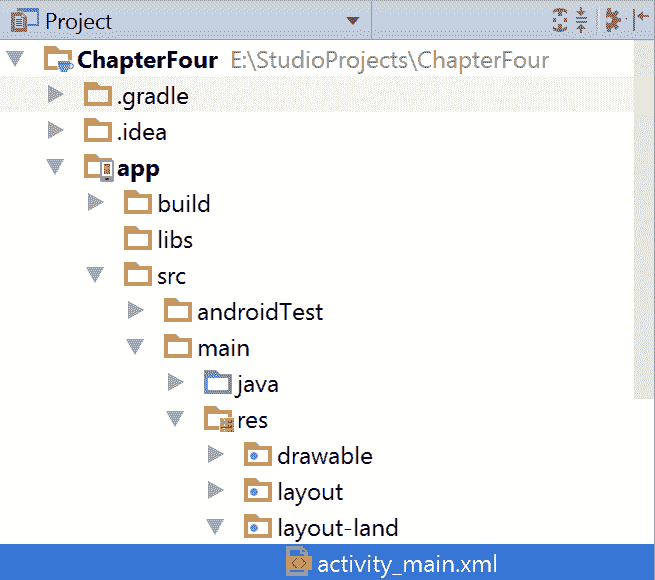
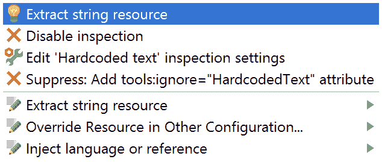
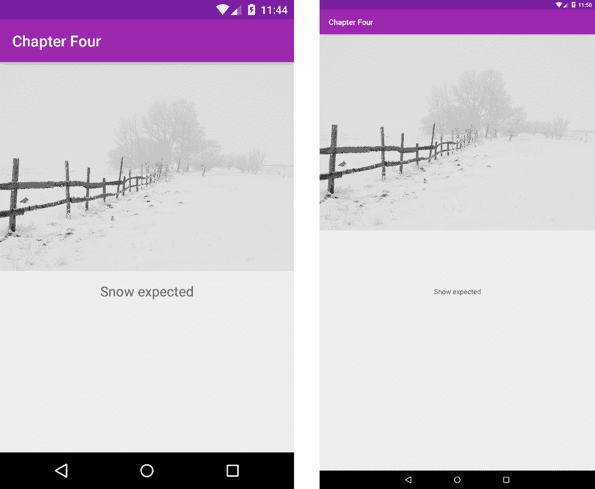
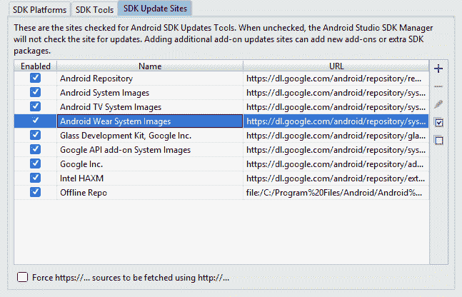
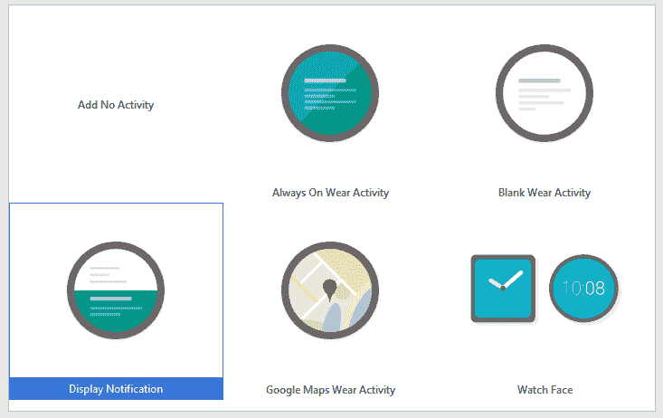
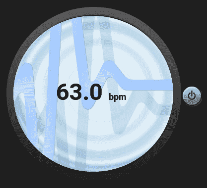
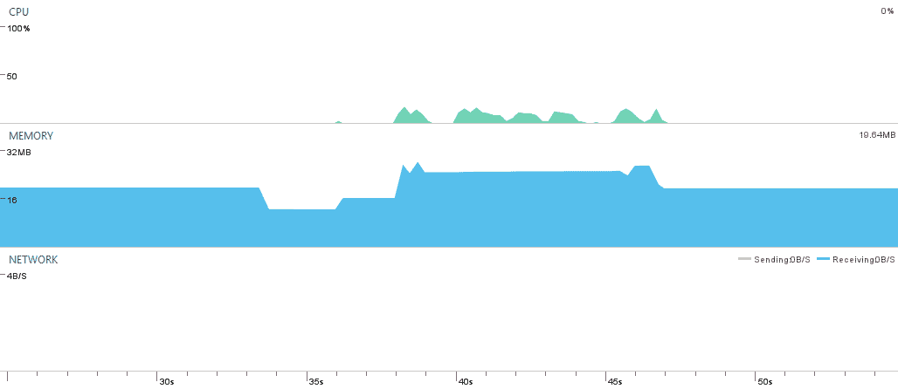
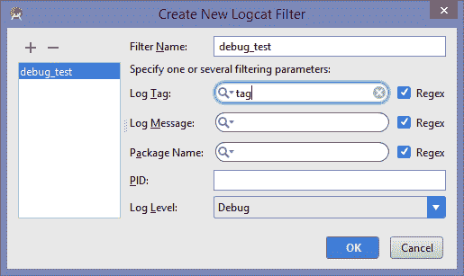

# 第四章：设备开发

Android Studio 提供了一些非常强大的布局工具，使我们能够快速轻松地尝试和开发用户界面。然而，任何 Android 开发人员面临的最大挑战可能是他们的应用程序可能在多种形态因素上运行的令人困惑的数量。

我们在之前的章节中看到了一些类，例如约束布局和百分比库等，可以帮助我们设计统一和一致的布局。然而，这些技术只提供了一般解决方案，我们都会遇到一些似乎并没有真正考虑我们设备的应用程序。通过一点知识和努力，这些设计缺陷可以很容易地避免。

在本章中，您将学习：

+   创建替代布局文件

+   提取字符串资源

+   管理屏幕旋转

+   配置资源

+   创建可穿戴 UI

+   构建形状感知布局

+   读取传感器数据

+   使用虚拟传感器

+   应用 Studio 的模板

+   创建调试过滤器

+   监视设备

在研究如何开发我们的 UI，使其在所有用户设备上都能看起来很棒之前，我们需要探索我们将遇到的最重要的布局情况：在纵向和横向模式之间旋转屏幕。

# 屏幕方向

大量为手机和平板设计的 Android 应用程序都设计为在横向和纵向模式下都能工作，并且通常会自动在这两种模式之间切换。许多活动，比如视频，在横向模式下观看效果最佳，而列表通常在纵向模式下更容易扫描；然而，有一些活动，甚至整个应用程序，其方向是固定的。

有一些布局无论以哪种方式查看都很好，但这并不经常发生；大多数情况下，我们都希望为每种方向设计一个布局。Android Studio 通过为我们节省从头开始开发替代布局的任务，简化并加快了这个过程。

以这里的简单布局为例：



纵向布局

可以通过在设计编辑器顶部的布局变体工具中单击一次来创建横向变体，如下所示：


布局变体工具。

如果您重新创建此练习或创建自己的等效练习，您很快会发现，这样的布局在旋转时看起来并不好，您将不得不重新调整视图以最适合这个纵横比。如果您尝试使用约束布局，您将发现它的一些弱点，而且最终的布局可能会非常混乱。

您如何重新创建这些布局取决于您自己的艺术和设计技能，但值得注意的是 Android Studio 存储和呈现这些文件的方式，这可能有点令人困惑，特别是如果您正在从管理方式不同的 Eclipse 迁移。

如果您在项目资源管理器中打开刚刚创建的项目，在 Android 下，您将在`activity_main.xml (land)`中找到横向变体，显然在`activity_main.xml`目录中。Studio 以这种方式呈现它，因为将所有布局放在一个地方很方便，但这并不是它们的存储方式。将项目资源管理器切换到项目视图将显示实际的文件结构，如下所示：



项目结构。

这种结构也可以从 IDE 顶部的导航栏中确定。

如果您创建类似这样的布局变体，将视图移动到更令人愉悦的配置，并为两个版本赋予相同的 ID，当用户旋转其设备时，这些将自动在它们的两个状态之间进行动画。我们将在后面看到如何构建我们自己的自定义动画，但往往默认动画是最好的选择，因为它们有助于促进统一的用户体验。

如果你重新创建了上面的示例，你可能已经注意到 IDE 执行的一个非常巧妙的技巧，以加快提供文本资源的过程。

你可能已经知道，使用硬编码字符串是强烈不推荐的。像许多编程范式一样，Android 开发旨在使数据和代码分开创建和处理。硬编码字符串也几乎不可能进行翻译。

我们之前看到快速修复功能如何让我们自动实现方法。在这里，我们可以使用它来创建字符串资源，甚至无需打开`strings.xml`文件。

只需在布局文件中输入硬编码的字符串，然后按照快速修复提示将其提取为字符串资源。



字符串资源提取。

布局编辑器提供了两个现成的变体，横向和超大，但我们可以创建适合任何形态因素的自定义变体。

现在我们已经开始添加一些动态元素，比如屏幕旋转，布局编辑器已经不够用了，我们需要在设备或仿真器上运行我们的应用程序。

# 虚拟设备

很长一段时间以来，Android 虚拟设备（AVD）一直以有 bug 和运行极慢而闻名。硬件加速的引入带来了很大的改变，但仍建议使用一台性能强大的计算机，特别是如果你想同时运行多个 AVD，这种情况经常发生。

Android 仿真的最大变化不是硬件加速，而是替代仿真器的出现。正如我们将很快看到的，其中一些提供了与本机仿真器不同的优势，但 AVD 不应被忽视。尽管存在缺点，Android 仿真器是唯一可以在所有 Android 版本上运行的仿真器，包括最新的仅供开发者使用的版本。不仅如此，Android 仿真器是最可定制的，任何可能的硬件或软件配置都可以通过一点努力重新创建。

在开发过程的早期阶段，能够快速测试我们的想法非常重要，使用一两个真实设备可能是最好的选择；然而，迟早我们需要确保我们的布局在所有可能的设备上看起来很棒。

# 布局和图像资格

这里有两个问题需要考虑：屏幕密度和纵横比。如果你之前做过任何 Android 开发，你会了解 DPI 和屏幕大小分组。这些指定的文件夹提供了方便的快捷方式，以适应各种可用的形态因素，但我们都会遇到布局在我们设备上不太适用的应用。这是完全可以避免的，尽管我们需要付出一些努力来对抗它，但这将避免那些可能损害收入流的差评。

很容易产生一个能在尽可能多的形态因素上运行的应用程序的诱惑，而 Android Studio 偶尔会鼓励你这样思考。实际上，我们必须考虑设备的使用时间和地点。如果我们在等公交车，那么我们可能想要一个可以轻松开关并且可以快速完成任务的游戏。尽管也有例外，但这些不是人们选择在大屏幕上长时间玩耍的游戏。选择正确的平台是至关重要的，尽管这可能听起来违反直觉，但通常排除一个平台比仅仅假设它可能赚取更多收入更明智。

考虑到这一点，我们将考虑一个仅设计用于手机和平板电脑的应用程序；然而，除了查看屏幕大小和密度等熟悉的功能之外，我们还将看到如何为许多其他配置问题提供定制资源。

最常用的资源指定是屏幕大小和密度。Android 提供了以下四种大小指定。

+   `layout-small`：从两到四英寸，320 x 420dp 或更大

+   `layout-normal`：从三到五英寸，320 x 480dp 或更大

+   `layout-large`：从四到七英寸，480 x 640dp 或更大

+   `layout-xlarge`：从七到十英寸，720 x 960dp 或更大

如果您正在为 Android 3.0（API 级别 11）或更低版本开发，这个范围较低的设备通常会被错误地分类。唯一的解决方案是为单独的设备进行配置，或者根本不开发这些设备。

一般来说，我们需要为上述每种尺寸制作一个布局。

使用**密度无关像素**（**dp**或**dip**）意味着我们不需要为每个密度设置设计新的布局，但我们必须为每个密度类提供单独的可绘制资源，如下所示。

+   `drawable-ldpi` 〜120dpi

+   `drawable-mdpi` 〜160dpi

+   `drawable-hdpi` 〜240dpi

+   `drawable-xhdpi` 〜320dpi

+   `drawable-xxhdpi` 〜480dpi

+   `drawable-xxxhdpi` 〜640dpi

上述列表中的 dpi 值告诉我们我们的资源需要的像素相对大小。例如，`drawable-xhdpi`目录中的位图需要是`drawable-mdpi`文件夹中相应位图大小的两倍。

实际上不可能在每台设备上创建完全相同的输出，这甚至不可取。人们购买高端设备是因为他们想要令人惊叹的图像和精细的细节，我们应该努力提供这种质量水平。另一方面，许多人购买小型和价格较低的设备是出于便利和预算的原因，我们应该在设计中反映这些选择。与其试图在所有设备上完全复制相同的体验，我们应该考虑人们选择设备的原因以及他们想要从中获得什么。

以下简短的练习演示了这些差异如何在不同的屏幕配置中表现出来。这将让读者有机会看到如何最好地利用用户选择的设备，利用他们自己的艺术和设计才能。

1.  选择任何高分辨率图像，最好是一张照片。

1.  使用您选择的任何工具，创建一个宽度和高度为原始尺寸一半的副本。

1.  打开一个新的 Android Studio 项目。

1.  从项目资源管理器中，在 res 目录内创建两个名为`drawable-mdpi`和`drawable-hdpi`的新文件夹。

1.  将准备好的图像放入这些文件夹中。

1.  构建一个带有图像视图和一些文本的简单布局。

1.  创建两个虚拟设备，一个密度为`mdpi`，一个为`hdpi`。

1.  最后，在每个设备上运行应用程序以观察差异。



密度为 mdpi 和 hdpi 的设备。

这实际上并不是我们可以使用的唯一密度限定符。为电视设计的应用程序通常使用`tvdpi`限定符。这个值介于`mdpi`和`hdpi`之间。还有`nodpi`限定符，当我们需要精确的像素映射时使用，以及`anydpi`，当所有艺术作品都是矢量可绘制时使用。

还有很多其他限定符，完整列表可以在以下网址找到：

[developer.android.com/guide/topics/resources/providing-resources.html](http://developer.android.com/guide/topics/resources/providing-resources.html)

现在值得看一下一些更有用的限定符。

# 比例和平台

像之前讨论过的那样的概括限定符非常有用，适用于大多数情况，并且节省了我们大量的时间。然而，有时我们需要更精确的关于我们的应用程序运行设备的信息。

我们想要了解的最重要的功能之一是屏幕尺寸。我们已经遇到了诸如小型、普通和大型之类的限定符，但我们也可以配置更精确的尺寸。其中最简单的是可用宽度和可用高度。例如，`res/layout/w720dp`中的布局只有在可用宽度至少为 720dp 时才会被填充，而`res/layout/h1024dp`中的布局则在屏幕高度等于或大于 1024dp 时被填充。

另一个非常方便的功能是配置平台版本号的资源。这是基于 API 级别的。因此，当在 Android Jelly Bean 设备上运行时，可以使用`v16`的限定符来使用资源。

能够为如此广泛的硬件选择和准备资源意味着我们可以为那些能够显示它们的设备提供丰富的资源，对于容量较小的设备则提供更简单的资源。无论我们是为预算手机还是高端平板开发，我们仍然需要一种测试应用程序的方法。我们已经看到了 AVDs 的灵活性，但很值得快速看一下其他一些选择。

# 替代模拟器

最好的替代模拟器之一可能是 Genymotion。不幸的是，这个模拟器不是免费的，也不像原生 AVDs 那样及时更新，但它速度快，支持拖放文件安装和移动网络功能。它可以在以下网址找到：

[www.genymotion.com](http://www.genymotion.com)

另一个快速且易于使用的模拟器是 Manymo。这是一个基于浏览器的模拟器，其主要目的是测试 Web 应用程序，但对于移动应用程序也非常有效。它也不是免费的，但它有各种各样的预制形态因子。它可以在以下网址找到：

[www.manymo.com](http://www.manymo.com)

在这方面还有一个类似的工具是 Appetize，它位于：

[appetize.io](http://appetize.io)

这样的模拟器越来越多，但上面提到的那些可能是从开发的角度来看最功能齐全的。以下列表将读者引向其他一些模拟器：

+   [www.andyroid.net](http://www.andyroid.net)

+   [www.bluestacks.com/app-player.html](http://www.bluestacks.com/app-player.html)

+   [www.droid4x.com](http://www.droid4x.com)

+   [drive.google.com/file/d/0B728YkPxkCL8Wlh5dGdiVXdIS0k/edit](http://drive.google.com/file/d/0B728YkPxkCL8Wlh5dGdiVXdIS0k/edit)

有一种情况下，这些替代方案都不合适，我们被迫使用 AVD 管理器，那就是当我们想要为可穿戴设备（如智能手表）开发时，这是我们接下来要看的内容。

# Android Wear

可穿戴设备最近变得非常流行，Android Wear 已完全整合到 Android SDK 中。设置 Wear 项目比其他项目稍微复杂一些，因为可穿戴设备实际上是作为应用程序的伴侣设备，应用程序本身是从移动设备上运行的。

尽管有这种轻微的复杂性，为可穿戴设备开发可能会非常有趣，至少因为它们经常为我们提供访问一些很酷的传感器，比如心率监测器。

# 连接到可穿戴 AVD

也许您有可穿戴设备，但在以下练习中我们将使用模拟器。这是因为这些设备有两种类型：方形和圆形。

当要将这些模拟器之一与手机或平板配对时，可以使用真实设备或另一个模拟器，但最好使用真实设备，因为这会对计算机造成较小的压力。这两种方法略有不同。以下练习假设您正在将可穿戴模拟器与真实设备配对，并解释了如何在最后与模拟移动设备配对。

1.  在做任何其他事情之前，打开 SDK 管理器并检查是否已下载了 Android Wear 系统镜像：



1.  打开 AVD 管理器并创建两个 AVD，一个是圆形的，一个是方形的。

1.  在手机上从 Play 商店安装 Android Wear 应用程序，并将其连接到计算机。

1.  找到并打开包含`adb.exe`文件的目录。这可以在`\AppData\Local\Android\Sdk\platform-tools\`中找到。

1.  发出以下命令：

```kt
adb -d forward tcp:5601 tcp:5601
```

1.  在手机上启动伴侣应用程序，并按照屏幕上的说明配对设备。

每次重新连接手机时，您都需要执行端口转发命令。

如果要将可穿戴设备与虚拟手机配对，该过程非常类似，唯一的区别是伴侣应用程序的安装方式。按照以下步骤来实现这一点：

1.  启动或创建一个目标为 Google APIs 的 AVD。

1.  下载`com.google.android.wearable.app-2.apk`。有很多在线地方可以找到这个文件，比如 www.file-upload.net/download。

1.  将文件放入 platform-tools 文件夹中，并使用以下命令进行安装：

```kt
adb install com.google.android.wearable.app-2.apk 
```

1.  启动可穿戴 AVD 并在命令提示符（或者如果您在 Mac 上，则在终端）中输入`adb devices`来检查两个设备是否可见。

1.  输入`adb telnet localhost 5554`，其中`5554`是手机模拟器。

1.  最后输入`adb redir add tcp:5601:5601`。您现在可以像之前的练习一样在模拟手机上使用穿戴应用程序配对设备。

尽管它是自动为我们添加的，但重要的是要理解 Android Wear 应用程序需要一个支持库。这可以通过检查`build.gradle`文件中的模块级别来看到。

```kt
 compile 'com.google.android.gms:play-services-wearable:10.2.0' 
```

现在我们的设备已经配对，我们可以开始实际开发和设计我们的可穿戴应用程序了。

# 可穿戴布局

在 Android Wear UI 开发中最有趣的挑战之一是这些智能手表的两种不同形状。我们可以以两种方式来解决这个问题。

其中一种类似于我们之前管理事物的方式，并涉及为每种形态因素设计布局，而另一种技术使用一种产生适用于任何形状的布局的方法。

除了这些技术之外，可穿戴支持库还配备了一些非常方便的小部件，适用于曲面和圆形布局以及列表。

Android Studio 最有用和有教育意义的功能之一是在项目首次设置时提供的项目模板。这些模板有很好的选择，它们为大多数项目提供了良好的起点，特别是穿戴应用程序。



穿戴模板

从这种方式开始一个项目可能是有帮助和启发性的，甚至空白的活动模板设置了 XML 和 Java 文件，创建了一个非常可信的起点。

如果您从空白的穿戴活动开始一个项目，您会注意到，我们之前只有一个模块（默认称为 app），现在有两个模块，一个称为 mobile，取代了 app，另一个名为 wear。这两个模块的结构与我们之前遇到的相同，包含清单、资源目录和 Java 活动。

# WatchViewStub 类

空白的穿戴活动模板应用了我们之前讨论的管理不同设备形状的第一种技术。这采用了`WatchViewStub`类的形式，可以在`wear/src/main/res/layout`文件夹中找到。

```kt
<?xml version="1.0" encoding="utf-8"?> 
<android.support.wearable.view.WatchViewStub  

    android:id="@+id/watch_view_stub" 
    android:layout_width="match_parent" 
    android:layout_height="match_parent" 
    app:rectLayout="@layout/rect_activity_main" 
    app:roundLayout="@layout/round_activity_main" 
    tools:context="com.mew.kyle.wearable.MainActivity" 
    tools:deviceIds="wear" /> 
```

如前面的示例所示，主要活动将系统引导到两种形状的布局之一，模板也提供了这两种布局。

正如您所看到的，这不是我们之前选择正确布局的方式，这是因为`WatchViewStub`的操作方式不同，并且需要一个专门的监听器，一旦`WatchViewStub`检测到手表的类型，它就会填充我们的布局。这段代码也是模板在主活动 Java 文件中提供的：

```kt
@Override 
protected void onCreate(Bundle savedInstanceState) { 
    super.onCreate(savedInstanceState); 
    setContentView(R.layout.activity_main); 

    final WatchViewStub stub = (WatchViewStub) 
            findViewById(R.id.watch_view_stub); 

    stub.setOnLayoutInflatedListener(new WatchViewStub.OnLayoutInflatedListener() { 

        @Override 
        public void onLayoutInflated(WatchViewStub stub) { 
            mTextView = (TextView) stub.findViewById(R.id.text); 
        } 

    }); 
} 
```

诱人的是认为`WatchViewStub`是我们设计可穿戴布局所需的全部。它允许我们独立设计两个表盘，这正是我们想要做的。然而，可穿戴布局通常非常简单，复杂的设计被强烈不鼓励。因此，对于一个简单的设计，几乎只有一张图片和一个按钮，拥有一个`shape-aware`类，根据设备的形状分发其内容，只是一种方便。这就是`BoxInsetLayout`类的工作原理。

# 形状感知布局

`BoxInsetLayout`类是 Wear UI 库的一部分，允许我们设计一个布局，可以优化自身适应方形和圆形表盘。它通过在任何圆形框架内充气最大可能的正方形来实现这一点。这是一个简单的解决方案，但`BoxInsetLayout`还非常好地确保我们选择的任何背景图像始终填充所有可用空间。正如我们将在一会儿看到的，如果您将组件水平放置在屏幕上，`BoxInsetLayout`类会自动分发它们以实现最佳适配。

在使用 Android Studio 开发时，您将想要做的第一件事情之一是利用布局编辑器提供的强大预览系统。这提供了每种可穿戴设备的预览，以及您可能创建的任何 AVD。这在测试布局时节省了大量时间，因为我们可以直接从 IDE 中查看，而无需启动 AVD。

预览工具可以从`View | Tool Windows`菜单中访问；或者，如果布局文本编辑器打开，可以在右侧边距中找到，默认情况下。

与`WatchViewStubs`不同，`BoxInsetLayout`类不是由任何模板提供的，必须手动编码。按照以下简短步骤，使用`BoxInsetLayout`类构建动态的 Wear UI。

1.  将以下`BoxInsetLayout`创建为 wear 模块中主 XML 活动的根容器：

```kt
<android.support.wearable.view.BoxInsetLayout  

    android:layout_width="match_parent" 
    android:layout_height="match_parent" 
    android:background="@drawable/snow" 
    android:padding="15dp"> 

</android.support.wearable.view.BoxInsetLayout> 
```

1.  将这个`FrameLayout`放在`BoxInsetLayout`类中：

```kt
<FrameLayout 
    android:id="@+id/wearable_layout" 
    android:layout_width="match_parent" 
    android:layout_height="match_parent" 
    android:padding="5dp" 
    app:layout_box="all"> 

</FrameLayout> 
```

1.  在`FrameLayout`中包括这些小部件（或您自己选择的小部件）：

```kt
<TextView 
    android:layout_width="match_parent" 
    android:layout_height="wrap_content" 
    android:gravity="center" 
    android:text="@string/weather_warning" 
    android:textAppearance= 
        "@style/TextAppearance.WearDiag.Title" 
    tools:textColor="@color/primary_text_light" /> 

<ImageView 
    android:layout_width="60dp" 
    android:layout_height="60dp" 
    android:layout_gravity="bottom|start" 
    android:contentDescription= 
        "@string/generic_cancel" 
    android:src="img/ic_full_cancel" /> 

<ImageView 
    android:layout_width="60dp" 
    android:layout_height="60dp" 
    android:layout_gravity="bottom|end" 
    android:contentDescription= 
        "@string/buttons_rect_right_bottom" 
    android:src="img/ic_full_sad" />
```

1.  最后，在圆形和方形模拟器上运行演示：


BoxInsetLayout

`BoxInsetLayout`类非常易于使用。它不仅节省我们的时间，还可以保持应用的内存占用量，因为即使是最简单的布局也有一定的成本。在圆形视图中，它可能看起来有些浪费空间，但是 Wear UI 应该是简洁和简化的，空白空间不是应该避免的东西；一个设计良好的可穿戴 UI 应该能够被用户快速理解。

Android Wear 最常用的功能之一是心率监测器，因为我们正在处理可穿戴设备，现在是时候看看如何访问传感器数据了。

# 访问传感器

佩戴在手腕上的设备非常适合健身应用，许多型号中都包含心率监测器，使它们非常适合这样的任务。SDK 管理所有传感器的方式几乎相同，因此了解一个传感器的工作方式也适用于其他传感器。

以下练习演示了如何在可穿戴设备上读取心率传感器的数据：

1.  打开一个带有移动和可穿戴模块的 Android Wear 项目。

1.  创建您选择的布局，确保包括一个`TextView`来显示输出。

1.  在可穿戴模块的`Manifest`文件中添加以下权限：

```kt
<uses-permission 
    android:name="android.permission.BODY_SENSORS" /> 
```

1.  在可穿戴模块的`MainActivity.java`文件中添加以下字段：

```kt
private TextView textView; 
private SensorManager sensorManager; 
private Sensor sensor; 
```

1.  让`Activity`实现传感器事件监听器，如下所示：

```kt
public class MainActivity extends Activity implements SensorEventListener { 
```

1.  实现所需的方法。

1.  编辑`onCreate()`方法如下：

```kt
@Override 
protected void onCreate(Bundle savedInstanceState) { 
    super.onCreate(savedInstanceState); 
    setContentView(R.layout.activity_main); 

    textView = (TextView) findViewById(R.id.text_view); 

    sensorManager = ((SensorManager) getSystemService(SENSOR_SERVICE)); 
    sensor = sensorManager 
        .getDefaultSensor(Sensor 
        .TYPE_HEART_RATE); 
} 
```

1.  在`onResume()`方法中注册监听器，当活动启动或重新启动时：

```kt
@Override 
protected void onResume() { 
    super.onResume(); 

sensorManager.registerListener(this, this.sensor, 3); 
}
```

1.  然后添加`onPause()`方法，以确保在不需要时关闭监听器：

```kt
@Override 
protected void onPause() { 
    super.onPause() 

sensorManager.unregisterListener(this); 
} 
```

1.  最后，编辑`onSensorChanged()`回调，如下所示：

```kt
@Override 
public void onSensorChanged(SensorEvent event) { 
   textView.setText("" + (int) event.values[0] + "bpm"); 
} 
```



如前所述，所有传感器都可以以相同的方式访问，尽管它们输出的值根据其目的而异。关于这一点的完整文档可以在以下网址找到：

[developer.android.com/reference/android/hardware/Sensor.html](http://developer.android.com/reference/android/hardware/Sensor.html)

现在，当然，读者会认为这个练习没有实际传感器的实际设备是没有意义的。幸运的是，在模拟器中弥补这种硬件缺乏的方法不止一种。

# 传感器仿真

如果您有一段时间没有使用 Android 模拟器，或者是第一次使用它们，您可能会错过每个 AVD 的扩展控件。这些可以从模拟器工具栏的底部访问。

这些扩展控件提供了许多有用的功能，比如轻松设置模拟位置和替代输入方法的能力。我们感兴趣的是虚拟传感器。这些允许我们直接模拟各种传感器和输入值：


虚拟传感器

在模拟设备上运行传感器还有其他几种方法。其中大多数依赖于连接真实设备并使用它们的硬件。这些 SDK 控制器传感器可以从 Play 商店下载。GitHub 上也有一些很棒的传感器模拟器，我个人最喜欢的是：

[github.com/openintents/sensorsimulator](http://github.com/openintents/sensorsimulator)

既然我们开始开发不仅仅是静态布局，我们可以开始利用一些 Studio 更强大的监控工具。

# 设备监控

通常，只需在设备或模拟器上运行应用程序就足以告诉我们我们设计的东西是否有效，以及我们是否需要更改任何内容。但是，了解应用程序行为的实时监控情况总是很好的，而在这方面，Android Studio 有一些很棒的工具。

我们将在下一个模块中详细介绍调试，但现在玩一下**Android Debug Bridge**（**ADB**）和 Android Studio 的设备监视器工具是选择 IDE 而不是其他替代品的最重要的好处之一。

这一部分还提供了一个很好的机会来更仔细地查看项目模板，这是 Android Studio 的另一个很棒的功能。

# 项目模板

Android Studio 提供了许多有用的项目模板。这些模板设计用于一系列典型的项目类型，例如全屏应用程序或 Google 地图项目。模板是部分完成的项目，包括代码、布局和资源，可以作为我们自己创作的起点。材料设计的不断出现使得`导航抽屉活动`模板成为最常用的模板之一，也是我们将用来检查设备监视器工具的模板。

`导航抽屉活动`模板在几个方面都很有趣和有用。首先，请注意，有四个布局文件，包括我们熟悉的`activity_main.xml`文件。检查这段代码，您会注意到以下节点：

```kt
<include 
    layout="@layout/app_bar_main" 
    android:layout_width="match_parent" 
    android:layout_height="match_parent" /> 
```

这个节点的目的很简单，`app_bar_main.xml`文件包含了我们在本书前面介绍过的协调布局和其他视图。使用`<include>`标签并不是必需的，但如果我们想在另一个活动中重用该代码，它是非常有用的，当然，它会产生更清晰的代码。

这个模板中另一个值得关注的地方是在 drawable 目录中使用矢量图形。我们将在下一章中详细讨论这些，但现在知道它们提供了一个很好的方法来解决为每个屏幕密度组提供单独图像的问题，因为它们可以缩放到任何屏幕。

在我们看一下如何监视应用程序行为之前，快速查看一下主活动 Java 代码。这很好地展示了各种功能的编码方式。这些示例功能可能不符合我们的要求，但可以很容易地替换和编辑以适应我们的目的，并且可以从这个起点构建整个应用程序。

# 监控和分析

所有开发人员都希望能够在运行时监视应用程序的能力。观察用户操作对硬件组件（如内存和处理器）的实时影响是识别可能的瓶颈和其他问题的绝佳方式。Android Studio 拥有一套复杂的分析工具，将在下一个模块中进行全面讨论。然而，Android Profiler 对 UI 开发以及编码都很有用，因此在这里简要地看一下是值得的。

Android Profiler 可以从“查看|工具窗口”菜单、工具栏或按*Alt* + *6*打开。它默认出现在 IDE 底部，但可以使用设置图标进行自定义以适应个人偏好：



Android Profiler

通过运行配置对话框可以使用高级分析选项；这将在下一个模块中介绍。目前还有另一个简单的调试/监控工具，对 UI 设计和开发非常有用。

分析器提供的视觉反馈提供了大量有用的信息，但这些信息是瞬息万变的，尽管高级分析允许我们记录非常详细的检查，但通常我们只需要确认特定事件发生了，或者某些事件发生的顺序。

对于这一点，我们可以使用另一个工具窗口 logcat，当我们只需要获取关于我们的应用程序如何以及在做什么的基本文本反馈时，我们可以为此创建一个 logcat 筛选器。

执行以下步骤来完成这个过程：

1.  通过“查看|工具窗口”菜单或边距打开 logcat 工具窗口。

1.  从右侧的筛选下拉菜单中选择“编辑筛选配置”。

1.  按照以下方式完成对话框：



创建 logcat 筛选器

1.  将以下字段添加到您的`main`活动中：

```kt
private static final String DEBUG_TAG = "tag"; 
```

1.  包括以下导入：

```kt
import android.util.Log;
```

1.  最后，在以下代码中添加突出显示的行：

```kt
FloatingActionButton fab = (FloatingActionButton) findViewById(R.id.fab); 
fab.setOnClickListener(new View.OnClickListener() { 

    @Override 
    public void onClick(View view) { 
        Snackbar.make(view, "Replace with your own action", 
            Snackbar.LENGTH_LONG) 
                .setAction("Action", null) 
                .show(); 
        Log.d(DEBUG_TAG, "FAB clicked"); 
    } 

}); 
```

1.  在打开 logcat 并点击 FAB 运行应用程序时，将产生以下输出。

```kt
...com.mew.kyle.devicemonitoringdemo D/tag: FAB clicked 
```

尽管这个例子很简单，但这种技术的强大是显而易见的，这种调试形式是检查简单 UI 行为、程序流程和活动生命周期状态的最快、最简单的方式。

# 摘要

本章涵盖了很多内容；我们已经在之前的章节中介绍了 Android 布局的工作，并开始探索如何将这些布局从静态图形转变为更动态的结构。我们已经看到 Android 提供了使开发适应不同屏幕比其他 IDE 更容易的类和库，以及模拟器可以用来生成所有可能的形态，包括最新的平台。

在我们转向编码之前，这个模块中只剩下一个关于布局和设计的章节；在其中，我们将介绍如何管理我们可用的众多资源以及 Android Studio 如何协助我们进行管理。
