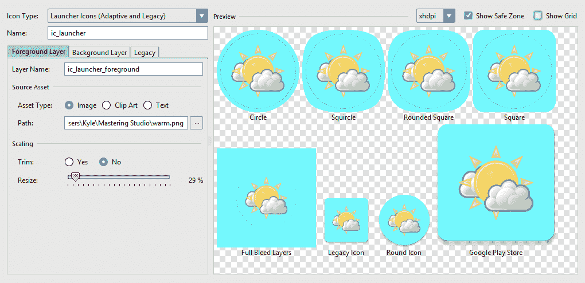
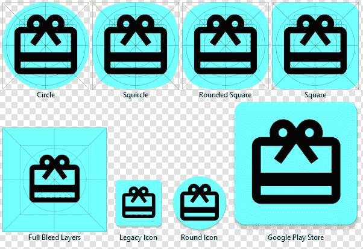
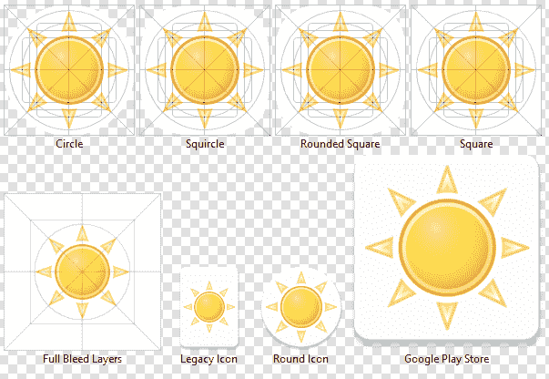
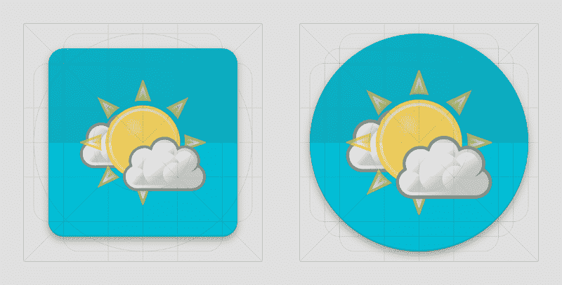
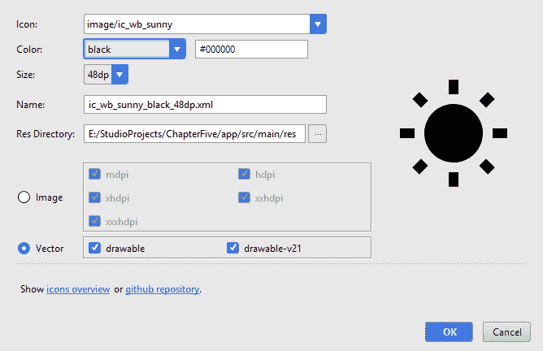
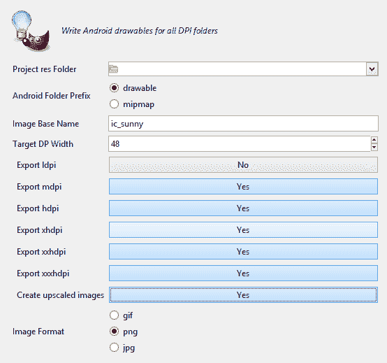
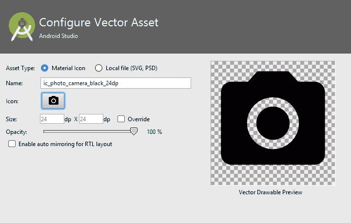
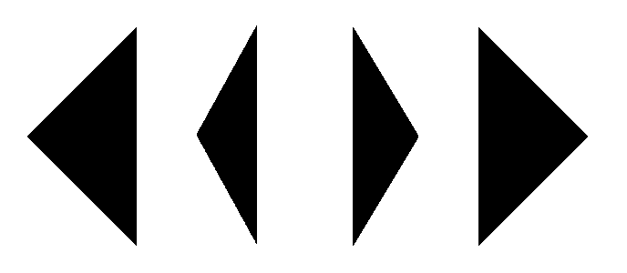
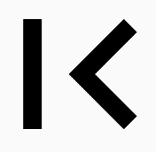

# 第五章：资产和资源

到目前为止，在本书中，我们已经涵盖了布局、设计以及支持它们的库和工具。然后我们继续探讨为不同的屏幕尺寸、形状和密度以及其他形态因素进行开发。这是 UI 开发模块中的最后一章，我们将看看 Android Studio 如何管理各种资产和资源，如图标和其他可绘制图形。

当涉及将可绘制图标包含在我们的项目中时，Android Studio 非常包容，特别是在涉及矢量图形时，这对于 Android 开发人员非常宝贵，因为它们可以很好地适应不同的屏幕尺寸和密度，这是通过一个非常有价值的工具——矢量资产工作室来实现的。除此之外，还有一个资产工作室用于生成和配置位图图像。

矢量可绘制图标广泛用于应用程序图标和组件，如菜单、选项卡和通知区域，并且在对图标进行动画和从一个图标转换为另一个图标时也非常灵活，在小屏幕上非常有用的节省空间的功能。

在本章中，您将学会以下内容：

+   使用资源工作室创建图标

+   构建自适应图标

+   创建材料启动器图标

+   使用材料图标插件

+   创建矢量资产

+   导入矢量资产

+   图标动画

+   使用插件查看动态布局

+   从图像中提取显著颜色

# 资产工作室

几乎没有任何应用程序不使用某种形式的图标，即使这些只是启动器和操作图标，正确的选择和设计也决定了成功的 UI 和令人困惑的 UI 之间的区别。

尽管这并非必需，但 Google 非常希望我们使用材料设计图标。这是为了在整个平台上创建统一的用户体验，以抵消 iOS 提供更一致感觉的认知。这并不奇怪，因为 iOS 是一个对开发人员施加了很多限制的封闭系统。另一方面，Google 更愿意为开发人员提供更多的创造自由。过去，这导致苹果设备获得了比 Android 更为流畅的声誉，为了抵消这一点，Google 推出了材料设计指南，这些指南远远超出了最初的预期，现在可以在许多其他平台上找到，包括 iOS。

正如预期的那样，Android Studio 提供了工具来帮助我们整合这些设计特性和可绘制图标。这就是资源工作室的形式。这有助于创建和配置各种图标，从色彩鲜艳的详细启动器图标到完全定制和可伸缩的矢量图形操作和通知图标。随着 API 级别 26，Android 引入了自适应图标，可以在不同设备上显示为不同形状并执行简单的动画。

资源工作室具有两个单独的界面：一个用于一般图像，一个用于矢量图形。我们将在下一节中看到第一个。

# 图像资产工作室

在为不同的屏幕配置创建图像时，我们经常必须创建相同图像的几个版本，这通常不是一件大事。另一方面，当涉及到图标时，我们可能有几个单独的图标和数十个版本，使得调整大小和缩放它们变得繁琐。幸运的是，Android Studio 提供了一个简洁的解决方案，即图像资产工作室。

设备制造商可能更关心在其型号之间创建一致的外观和感觉。当涉及到启动器图标在其主屏幕上的显示方式时，这尤为明显。理想的情况是，开发人员可以设计一个单一的图标，然后制造商可以将其放入统一的形状中，例如方形或圆形，具体取决于其在设备上的位置和制造商自己的设计理念。

图像资产工作室通过创建一个使用我们原始图像和一个纯色背景层的双层图标来实现这一点，可以对其应用蒙版以创建所需的整体形状，通常是以下三个图像之一：


自适应图标

可以通过从项目的可绘制上下文菜单中选择“新建|图像资产”来打开图像资产工作室：



资产工作室

创建能够在最广泛的设备和 API 级别上运行的图标有几个阶段，这些阶段由向导中的以下三个选项卡表示：前景层、背景层和传统。每个选项卡中都包含一些有价值的功能，将在下一节中概述。

# 分层图标

前景层是我们应用图像的地方。这可以是我们自己的艺术品，如果我们正在创建操作图标，也可以是剪贴画/文本。向导会自动生成每种可能用途的图标，包括 Play 商店图标，这涉及创建一个全新的资产。“显示安全区域”功能无疑是预览功能中最有用的功能，因为它显示了一个边界圆圈，如果我们的图标要在所有设备和平台上正确显示，我们的资产不应该超出这个区域。调整大小：控件允许我们快速确保我们的图标没有超出这个区域。

选择修剪：作为缩放选项将在创建完成的图标之前删除任何多余的像素，这意味着顶层的多余透明像素将被删除，通常会显著减小文件大小。

自适应图标的背景层需要足够大，以允许对其进行修剪，以创建前面图像中显示的形状和大小。默认的`ic_launcher_background.xml`生成描述网格的矢量图形。这在定位和调整我们的艺术品时非常有帮助，但不适用于已完成的应用程序。Google 建议您使用没有边框或外部阴影的纯色背景，尽管 Material 指南允许一些内部阴影，但最简单的解决方案是使用颜色而不是图像作为背景层。这还允许我们从我们的主题中选择一个突出的颜色，进一步推广我们的品牌。



资产背景选择

前面的图像使用了剪贴画选择的图标，这很好地展示了在设计我们自己的图标时指南的目的。

只有在编辑前景层时才能选择源图像，无论您正在使用哪个选项卡。

传统选项卡使我们能够确保我们的图标仍然可以在运行 API 级别 25 及更低版本的设备上运行，并为运行这些较早版本的设备提供所需的所有设计功能，例如适合许多这些设备的细长矩形图标。



编辑传统图标

许多开发人员也是优秀的艺术家，他们将非常乐意从头开始设计启动器图标。对于这些读者来说，重要的是要知道，自 API 级别 26 开始，启动器图标的指定尺寸已经发生了变化。尽管图标是为`48 x 48 px`的网格设计的，但现在必须是`108 x 108 px`，中心的`72 x 72 px`代表了必须始终可见的部分。但是，无法保证未来的制造商会如何遵循这些指南，因此建议尽可能多地针对所有设备进行测试。

这里给出的指南不仅有助于确保我们的图像不会被不必要地裁剪，还有助于满足许多制造商现在包含的脉冲和摇摆动画。这些动画通常用于指示尝试的用户交互的成功或失败。

当然，创建自适应图标并不是严格必要的，一旦掌握了基础知识，我们当然可以直接设计和包含我们自己的 XML。这可以在清单文件中使用`android:roundIcon`标识符来完成，如下所示：

```kt
<application
 . . . 
     android:roundIcon="@mipmap/ic_launcher_round"
 . . . >
</application>
```

自适应图标可以使用`adaptive-icon`属性添加到任何 XML 布局中，如下所示：

```kt
<adaptive-icon>
     <background android:drawable="@color/ic_some_background"/>
     <foreground android:drawable="@mipmap/ic_some_foreground"/>
</adaptive-icon>
```

尽管包含的动作图标集很全面，但尽可能多的选择总是好的，可以在[material.io/icons/](http://material.io/icons/)找到一个更大更不断更新的集合。


材料图标

图像资产工具非常适合生成我们在选项卡、操作栏等上使用的小型应用内图标，但在创建启动器图标时受到限制，启动器图标应该是明亮、多彩的，并且在材料方面是 3D 的。因此，启动器图标值得拥有自己的小节。

# 启动器图标工具

一般来说，启动器图标是使用外部编辑器创建的，正如我们将看到的，有 Studio 插件可以帮助我们创建时尚的 Android 图标。其中一个最好的工具是 Asset Studio 本身的在线、替代和增强版本。它是由谷歌设计师 Roman Nurik 创建的，可以在 GitHub 上找到[romannurik.github.io/AndroidAssetStudio](http://romannurik.github.io/AndroidAssetStudio)。

这个在线版本提供了半打不同的图标生成器，包括原生版本中没有的功能，以及一个整洁的图标动画。这里感兴趣的是启动器图标生成器，因为它允许我们设置 IDE 中没有提供的材料特性，如高程、阴影和评分。

这个编辑器最好的地方之一是它显示了材料设计图标的关键线。



启动器图标关键线

谷歌称之为*产品*图标的设计超出了本书的范围，但谷歌在这个问题上有一些非常有趣的指南，可以在[material.io/guidelines/style/icons](https://material.io/guidelines/style/icons.html)找到。

然而，当您配置启动器图标时，您将需要某种外部图形编辑器。有一些工具可以帮助我们将 Android Studio 与这些编辑器集成。

Android Material Design 图标生成器是来自 JetBrains 的一个很棒的插件，它正是其标题所暗示的。它不需要下载，因为它可以在插件存储库中找到。如果您想在另一个 IDE 中使用它，可以从以下 URL 下载：

[github.com/konifar/android-material-design-icon-generator-plugin](http://github.com/konifar/android-material-design-icon-generator-plugin)

如果您是 Android Studio 插件的新手，请执行以下简单步骤：

1.  从文件|设置中打开设置对话框....

1.  打开插件对话框，然后单击浏览存储库....

1.  在搜索框中键入材料，然后选择并安装插件。


插件存储库

1.  重新启动 Android Studio。

现在可以从大多数 New...子菜单或*Ctrl* + *Alt* + *M*打开插件。图标生成器很简单，但提供了所有重要的功能，比如能够创建位图和矢量图像以及所有密度分组的选择，以及颜色和大小选择器。



Android Material Design 图标生成器插件

图标生成器还有一个方便的链接到不断增长的 GitHub 材料设计图标存储库。

Sympli 是一个复杂但昂贵的设计工具，可以与您选择的图形编辑器和 Android Studio 一起使用。它可以自动生成图标和其他资产，并设计用于团队使用。它可以在[sympli.io](https://sympli.io/)找到。

虽然不是 Studio 插件本身，但 GitHub 上有一个方便的 Python 脚本，GIMP 用户可以在[github.com/ncornette/gimp-android-xdpi](https://github.com/ncornette/gimp-android-xdpi)找到。

只需下载脚本并将其保存在 GIMP 的`plug-ins`文件夹中，命名为`gimpfu_android_xdpi.py`。然后可以从图像的滤镜菜单中访问它。



自动生成图标

如前面的屏幕截图所示，此插件提供了将单个图像转换为一组图标时需要做出的所有主要选择。

使用这些工具创建和配置图标非常有用，也节省时间，但有很多时候我们根本不会使用位图作为我们的图标，而是使用矢量图形，它只需要一个图像来适配所有密度。

矢量图形加载比光栅图像慢，但一旦加载，速度会快一点。非常大的矢量图像加载速度慢，因此应该避免使用。

矢量图形在运行时以正确大小的位图进行缓存。如果要以不同大小显示相同的可绘制对象，请为每个创建一个矢量图形。

对于那些喜欢从头开始创建矢量图像的人来说，有一些非常有用的免费工具。

Method Draw 是一个在线**可缩放矢量图形**（**SVG**）编辑器，提供了一组简单但非常实用的工具，用于生成简单的矢量图像，比如我们想要用于操作和通知图标的图像。创作可以下载为`.svg`文件并直接导入到 Studio 中。它可以在`editor.method.ac`找到。

如果您需要更复杂的工具，Boxy SVG Editor 可以在 Chrome Web Store 上找到，但它可以离线使用，并提供类似于 Inkscape 或 Sketch 的功能。

# 矢量资源工作室

矢量图形资源工作室执行与光栅图形版本相同的功能，但更有趣。处理预设图标时，甚至可以更简单地使用一个只需要选择材料图标的兄弟。



矢量资源工作室

创建后，这样的资源将以`VectorDrawable`类的 XML 格式保存：

```kt
<vector  
    android:width="24dp" 
    android:height="24dp" 
    android:viewportHeight="24.0" 
    android:viewportWidth="24.0"> 

    <path 
        android:fillColor="#FF000000" 
        android:pathData="M19,13h-6v6h-2v-6H5v-2h6V5h2v6h6v2z" /> 

</vector> 
```

Android 矢量图形与 SVG 格式类似，有点简化，通常与`.svg`文件相关联。与光栅资源一样，使用现有图标非常容易。只有当我们想要修改这些图标或创建自己的图标时，才变得有趣。

当然，学习 SVG 或者理解`VectorDrawable`的`pathData`并不是必要的，但了解一点这个过程和我们可以使用的一些工具是有好处的。

# 矢量图形

矢量工作室允许我们导入 SVG 文件并将其转换为 VectorDrawables。有许多获取矢量图形的方法，许多图形编辑器可以从其他格式转换。还有一些非常好的在线工具可以将其他格式转换为 SVG：

[image.online-convert.com/convert-to-svg](http://image.online-convert.com/convert-to-svg)

JetBrains 插件也可以从以下位置获得：

[plugins.jetbrains.com/plugin/8103-svg2vectordrawable](https://plugins.jetbrains.com/plugin/8103-svg2vectordrawable)

当你编写自己的 SVG 对象时，你可能不会做太多事情，但了解这个过程是有用的，因为这些步骤展示了这些：

1.  将以下代码保存为`.svg`文件：

```kt
<svg 
    height="210" 
    width="210">

<polygon 
    points="100,10 40,198 190,78 10,78 160,198" 
    style="fill:black;fill-rule:nonzero;"/> 

</svg> 
```

1.  打开 Android Studio 项目，然后转到矢量工作室。

1.  选择本地文件，然后选择前面代码中创建的 SVG 文件。

1.  单击“下一步”和“完成”以转换为以下`VectorDrawable`：

```kt
<vector  
    android:width="24dp" 
    android:height="24dp" 
    android:viewportHeight="210" 
    android:viewportWidth="210"> 

    <path 
        android:fillColor="#000000" 
        android:pathData="M100,10l-60,188l150, 
                -120l-180,0l150,120z" /> 

</vector> 
```

通常将矢量图标着色为黑色，并使用`tint`属性进行着色是一个好主意。这样，一个图标可以在不同的主题下重复使用。

SVG`<polygon>`很容易理解，因为它是定义形状角的简单点列表。另一方面，`android:pathData`字符串有点更加神秘。最容易解释的方式如下：

+   `M`是移动

`100,10`

+   `l`线到

`-60,188`

+   `l`线到

`150,-120`

+   `l`线到

`-180,0`

+   `l`线到

`150,120 z`

（结束路径）

前面的格式使用大写字母表示绝对位置，小写字母表示相对位置。我们还可以使用`V`（`v`）和`H`（`h`）创建垂直和水平线。

不必在路径结束限定符 z 提供的情况下包括最终坐标。此外，如果字符与之前的字符相同，则可以省略一个字符，就像以前的`line-to`命令一样；考虑以下字符串：

```kt
M100,10l-60,188l150,-120l-180,0l150,120z 
```

前面的字符串可以写成如下形式：

```kt
M100,10 l-60,188 150,-120 -180,0z 
```

请注意，有两组图像尺寸，正如您所期望的那样--`viewportWidth`和`viewportHeight`；它们指的是原始 SVG 图像的画布大小。

关于矢量数据本身似乎是无关紧要的，因为这是由资源工作室生成的；但是，正如我们将在下面看到的，当涉及到动画图标（以及其他动画矢量图形）时，对矢量可绘制的内部结构的理解是非常有用的。

# 动画图标

每个使用 Android 设备的人都会熟悉动画图标。也许最著名的例子是当导航抽屉打开和关闭时，汉堡图标如何变换为箭头，反之亦然。矢量图形的使用使得这个过程非常简单。只要这两个图标具有相同数量的点，任何图标都可以转换为任何其他图标。

在移动设备上有效地使用空间是至关重要的，而动画化操作图标不仅看起来不错，而且还节省空间，并且如果应用得当，还会向用户传达意义。

矢量图像可以通过将原始图像上的点映射到目标图像上而轻松地从一个图像转换为另一个图像。这是通过`AnimatedVectorDrawable`类完成的。

有几种方法可以对这些可绘制进行动画处理。首先，我们可以应用许多预定义的动画，比如旋转和平移。我们还可以使用内置的插值技术来*变形*从一个可绘制到另一个，而不管点的数量。我们将研究这两种技术。然而，首先，我们将研究如何使用图像路径来控制动画，因为这给了我们最大的控制权。

以下图像表示一个箭头图标从左指向右的动画：



一个动画箭头图标。

以下步骤演示了如何创建这样一个动画矢量可绘制。

1.  首先将两个箭头的路径存储为字符串，如下所示：

```kt
<!-- Spaces added for clarity only --> 
<string name="arrow_right"> 
    M50,10 l40,40 l-40,40 l0,-80z 
</string> 
<string name="arrow_left"> 
    M50,10 l-40,40 l40,40 l0,-80z 
</string> 
```

1.  由于两条路径都记录为字符串，我们只需要定义一个矢量可绘制--称之为`ic_arrow_left.xml`：

```kt
<vector  
    android:width="24dp" 
    android:height="24dp" 
    android:viewportHeight="100.0" 
    android:viewportWidth="100.0"> 

    <path 
        android:name="path_left" 
        android:fillColor="#000000" 
        android:pathData="@string/arrow_left" /> 

</vector> 
```

1.  创建`res/animator`文件夹和`arrow_animation.xml`文件，放在其中：

```kt
<?xml version="1.0" encoding="utf-8"?> 
<set > 

    <objectAnimator 
        android:duration="5000" 
        android:propertyName="pathData" 
        android:repeatCount="-1" 
        android:repeatMode="reverse" 
        android:valueFrom="@string/arrow_left" 
        android:valueTo="@string/arrow_right" 
        android:valueType="pathType" /> 

</set> 
```

1.  我们可以使用这个来创建我们的动画可绘制，`ic_arrow_animated.xml`：

```kt
<?xml version="1.0" encoding="utf-8"?> 
<animated-vector  

    android:drawable="@drawable/ic_arrow_left"> 

    <target 
        android:name="path_left" 
        android:animation="@animator/arrow_animation" /> 

</animated-vector> 
```

1.  要查看这个动画效果，请使用以下 Java 代码片段：

```kt
ImageView imageView = (ImageView) findViewById(R.id.image_arrow); 
Drawable drawable = imageView.getDrawable(); 

if (drawable instanceof Animatable) { 
    ((Animatable) drawable).start(); 
}
```

通过动画化矢量的路径，我们可以通过重新排列我们的点轻松地创建新的动画。

这个过程的关键是`arrow_animation`文件中的`ObjectAnimator`类。这个类比它在这里看起来的要强大得多。在这个例子中，我们选择了要动画化的`pathData`属性，但我们几乎可以动画化我们选择的任何属性。事实上，任何数值属性，包括颜色，都可以用这种方式进行动画化。

对象动画提供了创造富有想象力的新动画的机会，但只适用于现有属性。但是，如果我们想要动画化我们定义的值或者可能是反映一些特定应用程序数据的变量，该怎么办呢？在这种情况下，我们可以利用 ValueAnimator，从中派生出 ObjectAnimator。

Roman Nurik 的在线资源工作室还有一个功能强大且易于使用的动画图标生成器，可以在以下网址找到：

[romannurik.github.io/AndroidIconAnimator](http://romannurik.github.io/AndroidIconAnimator)

使用路径数据，这种方式提供了一个非常灵活的动画框架，特别是当我们想要将一个图标变形为另一个图标时，因为它改变了它的功能，通常在切换操作中经常看到，比如播放/暂停。然而，这并不是我们唯一的选择，因为有现成的动画可以应用到我们的矢量资产上，以及将图标转换为其他图标的方法，这些图标并不具有相同数量的点。

# 其他动画

变形路径数据是动画图标（和其他可绘制对象）的最有趣的方式之一，但有时我们只需要一个简单的对称运动，比如旋转和平移。

以下示例演示了如何应用这些动画类型之一：

1.  选择您喜欢的矢量可绘制对象，并将其`pathData`保存为字符串。在这里，我们使用`ic_first_page_black_24dp`图标从资源工作室获取数据。

```kt
<string name="first_page"> 
    M18.41,16.59 L13.82,12 l4.59,-4.59 L17,6 l-6,6 6,6 z 
            M6,6 h2 v12 H6 z 
</string> 
```



ic_first_page_black_24dp 图标

1.  与以前一样，为此创建一个 XML 资源；在这里，我们将其称为`ic_first_page.xml`：

```kt
<vector  
    android:height="24dp" 
    android:width="24dp" 
    android:viewportHeight="24" 
    android:viewportWidth="24" > 

    <group 
        android:name="rotation_group" 
        android:pivotX="12.0" 
        android:pivotY="12.0" > 

        <path 
            android:name="page" 
            android:fillColor="#000000" 
            android:pathData="@string/first_page" /> 

    </group> 

</vector> 
```

1.  再次创建一个对象动画器，这次称为`rotation.xml`，并完成如下：

```kt
<?xml version="1.0" encoding="utf-8"?> 
<set > 

    <objectAnimator 
        android:duration="5000" 
        android:propertyName="rotation" 
        android:repeatCount="-1" 
        android:valueFrom="0" 
        android:valueTo="180" /> 

</set> 
```

1.  现在，我们可以创建图标的动画版本，就像以前一样，设置一个目标。在这里，文件名为`ic_animated_page.xml`，看起来像这样：

```kt
<?xml version="1.0" encoding="utf-8"?> 
<animated-vector 

    android:drawable="@drawable/ic_first_page"> 

    <target 
        android:name="rotation_group" 
        android:animation="@animator/rotation" /> 

</animated-vector> 
```

1.  动画可以通过首先将其添加到我们的布局中，就像我们对任何其他图标所做的那样，并从代码中调用它来调用：

```kt
ImageView imagePage = (ImageView) findViewById(R.id.image_page); 
Drawable page_drawable = imagePage.getDrawable(); 

if (page_drawable instanceof Animatable) { 
    ((Animatable) page_drawable).start(); 
} 
```

除了动画类型之外，这里最大的不同之处在于我们的`<path>`包含在`<group>`中。这通常用于当有多个目标时，但在这种情况下，是因为它允许我们使用`vectorX/Y`为旋转设置一个中心点。它还具有`scaleX/Y`、`translateX/Y`和`rotate`的等效设置。

要更改图标的透明度，在`<vector>`中设置`alpha`。

不得不构建一个项目来测试简单的图形特性，比如这些动画图标，可能非常耗时。Jimu Mirror 是一个布局预览插件，可以显示动画和其他移动组件。它通过设备或模拟器连接，并通过一个复杂的热交换过程，可以在几秒钟内编辑和重新测试布局。Jimu 不是开源的，但价格不是很昂贵，并且可以免费试用。它可以从[www.jimumirror.com](http://www.jimumirror.com)下载。

本章的重点主要是检查 Android Studio 和相关工具如何促进应用程序图标的生成。这使我们能够总体上了解 Android 可绘制对象，包括位图和矢量图形。我们在本书的前面简要地探讨了其他可绘制对象，现在我们更深入地研究了这个问题，现在是重新审视这些可绘制对象的好时机。

# 一般的可绘制对象

我们之前看到了如何使用着色将黑色图标转换为与我们的应用程序或当前活动相匹配的颜色。对于其他图像，有时它们占据了屏幕的相当大部分，我们希望应用相反的效果，使我们的图标着色以匹配我们的图形。幸运的是，Android 提供了一个支持库，可以从任何位图中提取突出和主导颜色。

# 调色板库

将我们自己的主题应用到我们的应用程序可以产生非常时尚的界面，特别是当我们处理我们自己为应用程序创建的文本、图标和图像时。许多应用程序都包含用户自己的图像，在这些情况下，事先无法知道如何选择令人愉悦的设计。**调色板支持库**为我们提供了这种功能，允许对文本、图标和背景颜色进行精细控制。

以下步骤演示了如何从位图可绘制对象中提取突出的颜色：

1.  开始一个新的 Android Studio 项目，并从“文件”菜单或*Ctrl* + *Alt* + *Shift* + *S*打开“项目结构”对话框。

1.  从应用程序模块中打开依赖选项卡，并从右上角的+图标中添加库依赖项，使用搜索工具查找库。


库依赖项选择器

1.  这将在您的`build.gradle`文件中添加以下行：

```kt
compile 'com.android.support:palette-v7:25.2.0' 
```

1.  创建一个带有大图像视图和至少两个文本视图的布局。将这些文本视图命名为`text_view_vibrant`和`text_view_muted`。

1.  打开您的主 Java 活动并添加以下字段：

```kt
private Palette palette; 
private Bitmap bmp; 
private TextView textViewVibrant; 
private TextView textViewMuted; 
```

1.  将前述的`TextViews`与它们的 XML 对应项关联，如下所示：

```kt
textViewVibrant = (TextView) 
        findViewById(R.id.text_view_vibrant); 

textViewMuted = (TextView) 
        findViewById(R.id.text_view_muted); 
```

1.  分配在步骤 5 中声明的位图：

```kt
 bmp = BitmapFactory.decodeResource(getResources(), 
        R.drawable.color_photo); 
```

1.  最后，添加以下条款以从图像中提取突出的鲜艳和柔和的颜色：

```kt
// Make sure object exists. 
if (bmp != null && !bmp.isRecycled()) { 
    palette = Palette.from(bmp).generate(); 

    // Select default color (black) for failed scans. 
    int default_color=000000; 

    // Assign colors if found. 
    int vibrant = palette.getVibrantColor(default_color); 
    int muted = palette.getMutedColor(default_color); 

    // Apply colors. 
    textViewVibrant.setBackgroundColor(vibrant); 
    textViewMuted.setBackgroundColor(muted); 
} 
```


提取的颜色

前面概述的方法是有效但粗糙的。调色板库还有很多功能，我们需要了解很多东西才能充分利用它。

调色板使用`default_color`是必要的，因为提取这些颜色并不总是可能的，有时会失败。这经常发生在*褪色*的图像和颜色很少的图像以及定义很少的高度不规则的图像上。有些讽刺的是，当呈现过饱和的图形和颜色很多的非常规则的图案时，扫描也可能失败，因为没有颜色（如果有的话）会支配。

在提取这些调色板时非常重要的一点是，使用大位图可能会严重消耗设备资源，所有与位图的工作在可能的情况下不应在当前线程上执行。前面的示例没有考虑到这一点，但库中有一个监听器类，允许我们异步执行这些任务。

考虑以下示例：

```kt
Palette palette = Palette.from(bmp).generate(); 
```

使用以下监听器，而不是前面的监听器，以在生成位图后做出反应：

```kt
Palette.from(bmp).generate(new PaletteAsyncListener() { 

    public void onGenerated(Palette p) { 
        // Retrieve palette here. 

    } 

}); 
```

在前面的示例中，我们只提取了两种颜色，使用`Palette.getVibrantColor()`和`Palette.getMutedColor()`。这些通常非常适合我们的目的，但如果不适合，还有每种颜色的浅色和深色版本，可以使用 getter 来访问，比如`getDarkVibrantColor()`或`getLightMutedColor()`。

调色板库的功能比我们在这里介绍的要多，比如能够选择与分析图像匹配的文本颜色，而且它并不是 Android Studio 专属的，因此从其他 IDE 切换过来的读者可能已经熟悉它。

本书中介绍的 Studio 功能展示了 IDE 在开发布局和 UI 时的实用性，但当然，这只是故事的一半。无论我们的布局多么完美，如果没有逻辑支持，它们就毫无用处，这就是 Android Studio 真正开始发挥作用的地方。

# 摘要

不仅在本章，而且在前面的三章中，我们看到了 Android Studio 如何使得在各种设备和因素上设计和测试我们的图形布局变得简单而直观。Studio 专门为 Android 的特点而设计，也是第一个集成新设计功能的工具，比如约束布局，这彻底改变了视觉活动的设计。

到目前为止，已经涵盖了 IDE 所考虑的所有基本设计问题，并希望向读者介绍了简化和澄清这个常常复杂过程的丰富功能。

在下一章中，我们将开始将这些设计变为现实，看看 Android Studio 如何简化编码、测试和调试应用程序的复杂过程。这些基本过程经常重叠，大多数开发人员会发现自己不得不在微调工作时重新访问每个过程。Android Studio 引导开发人员在这个过程中前后穿梭，使他们能够在进行时跟踪和评估。

Android Studio 已经帮助您将您的想法转化为令人愉悦的布局。下一步是用您的逻辑将这些布局变得生动起来。正如人们可能想象的那样，当涉及到逻辑时，IDE 在设计时一样有帮助。
