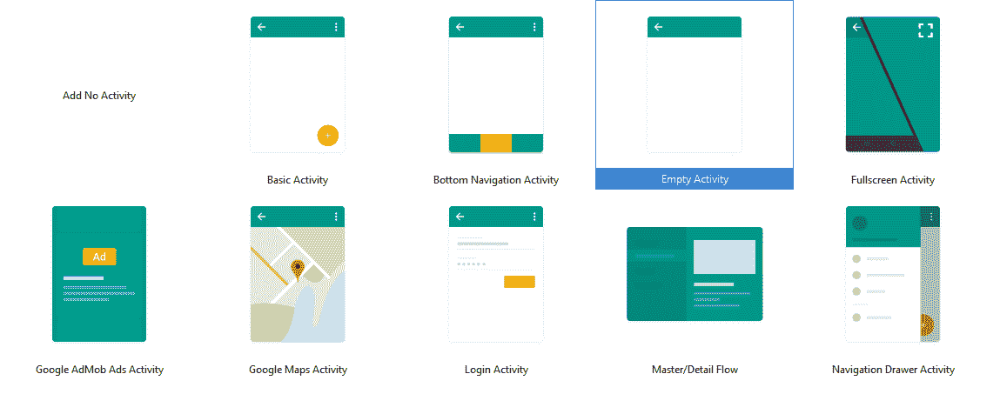
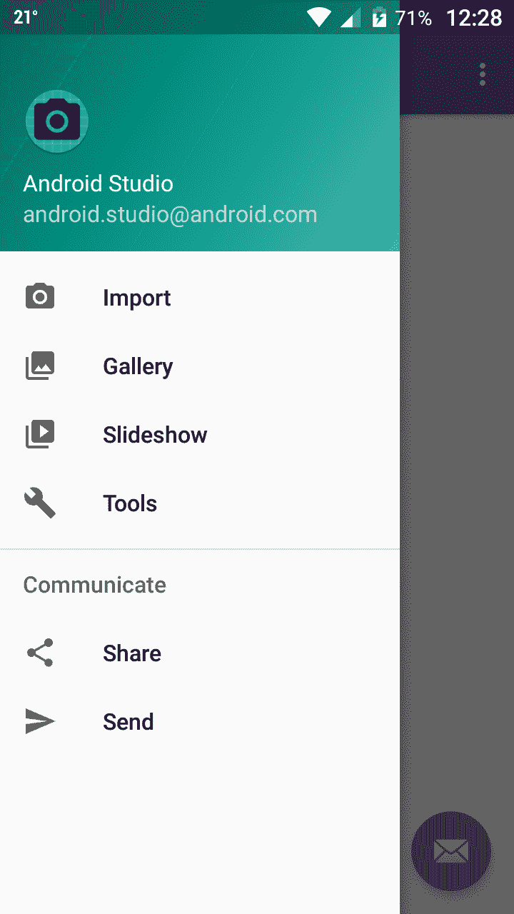
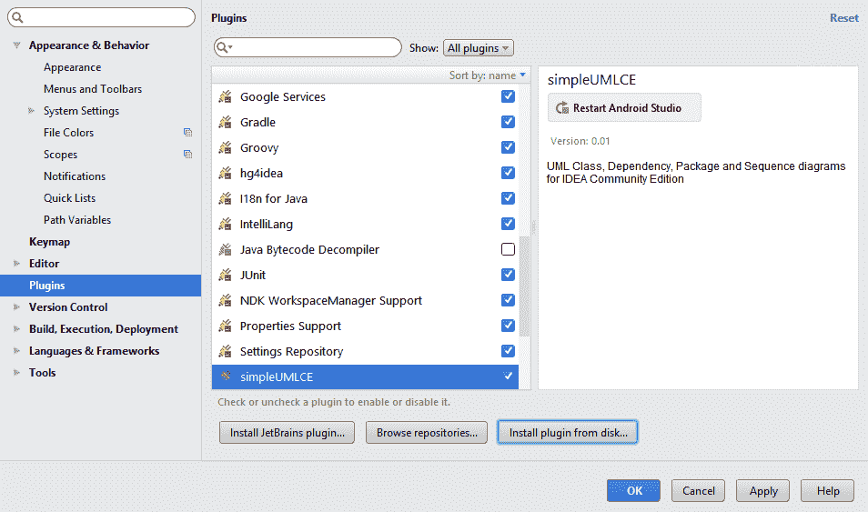
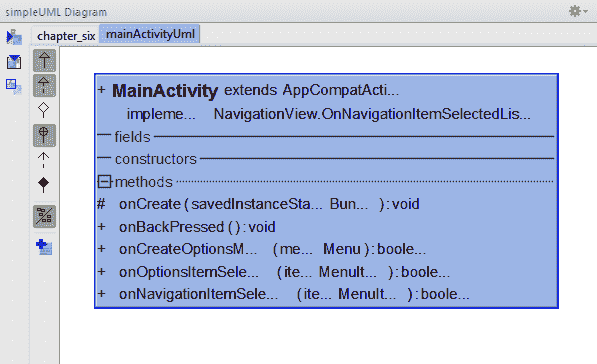
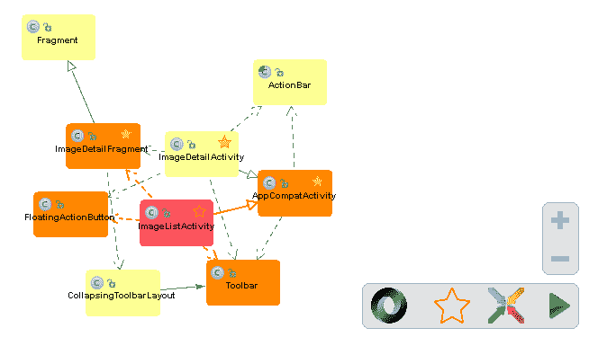
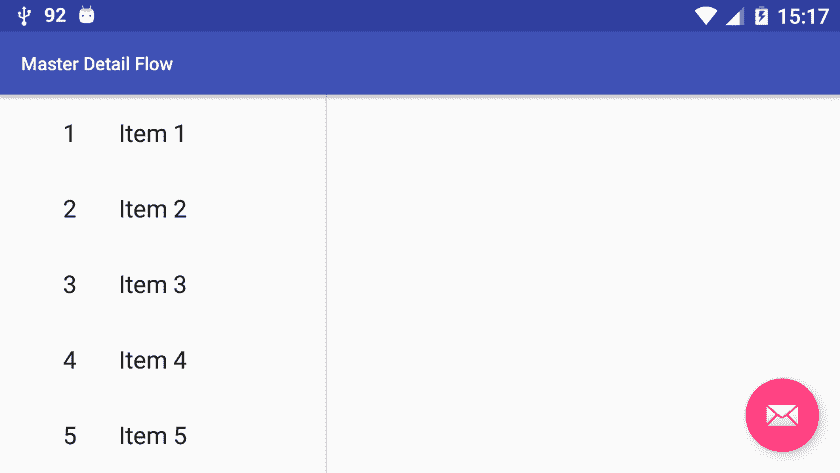
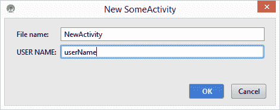
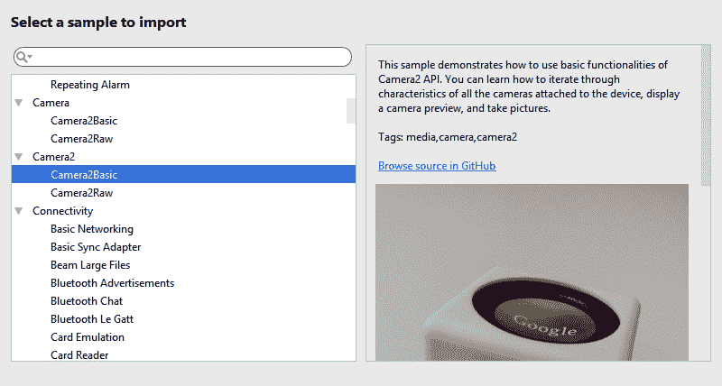
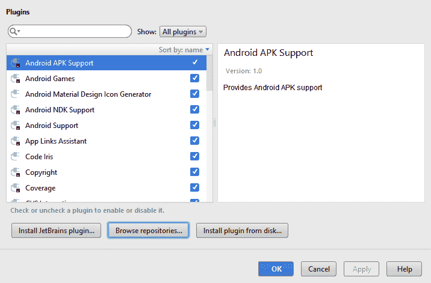

# 第六章：模板和插件

作为开发环境，Android Studio 提供了设计和开发任何我们可以想象的 Android 应用程序的设施。在前几章中，我们看到它如何作为一个可视化设计工具，以及一个动态布局编辑器、模拟器和 XML 结构。从现在开始，我们将深入了解 IDE 如何促进、简化和加快编码、测试和微调我们的工作的过程。

大多数读者已经是专业的编码人员，不需要帮助。因此，我们将在接下来的章节中全面探讨 Android Studio 改进这一体验的方式。在本章中，我们将看到 IDE 自带的各种活动模板和 API 示例的代码示例。这些对于探索和学习各种组件的编码方式以及通过提供已经存在的起点来加快编码过程都是有用的。此外，正如我们将看到的，如果捆绑的模板选择不够，Android Studio 允许我们创建自己的模板。

在本章中，您将学习以下内容：

+   理解内置项目模板

+   访问结构工具窗口

+   安装和使用 UML 插件

+   应用简单的重构

+   应用代码模板

+   创建自定义模板

+   使用项目示例

# 项目模板

大多数读者在从 IDE 的欢迎屏幕开始新的 Android Studio 项目时已经遇到了项目模板。



项目模板

即使是空活动模板也提供了几乎所有应用程序都必不可少的文件和一些代码，正如您在前面的屏幕截图中所看到的，有越来越多的项目模板集合，旨在适应许多常见的应用程序结构和目的。

# 导航抽屉模板

在这里不需要检查所有这些模板，但有一两个可能非常有教育意义，并且可以进一步了解 Android Studio 的工作原理。第一个，也许是最有用的，是导航抽屉活动模板，当按原样运行时产生以下输出：



导航抽屉模板

如前面的屏幕截图所示，此模板提供了许多常见且推荐的 UI 组件，包括图标可绘制、菜单和操作按钮。这些模板最有趣的方面是它们创建的代码和使用的文件结构，这两者都是最佳实践的很好示例。

如果我们使用此模板开始一个新项目并开始四处看看，我们将观察到`activity_main.xml`文件与我们之前看到的不同，因为它使用`android.support.v4.widget.DrawerLayout`作为其根。在其中，我们发现来自设计库的`CoordinatorLayout`和`NavigationView`。与前面的示例一样，协调器布局包含一个工具栏和一个 FAB；然而，这些组件是在一个单独的文件中创建的，并与`include`标签一起包含，如下所示：

```kt
<include 
    layout="@layout/app_bar_main" 
    android:layout_width="match_parent" 
    android:layout_height="match_parent" /> 
```

这种结构可以帮助我们更容易地跟踪代码并使未来的修改更容易。正如可以看到的，这种方法也用于定义导航栏标题和主要内容。

大多数模板生成的 XML 对读者来说都很熟悉，但也有一两个片段可能需要解释。例如，`content_main.xml`文件包含以下行：

```kt
app:layout_behavior="@string/appbar_scrolling_view_behavior" 
```

引用的字符串不会在`strings.xml`文件中找到，因为它是系统提供的，并指向`AppBarLayout.ScrollingViewBehavior`类，确保我们的工具栏是它的一个实例。

`tools:showIn="@layout/app_bar_main"` 这一行可能也令人困惑。这是 `tools` 命名空间中的许多有用功能之一，用于在预览编辑器中显示导航抽屉，使开发人员无需每次想查看图形变化时都重新构建项目。

此模板和其他模板生成的 XML 资源只讲述了故事的一半，因为其中许多模板还生成了相当数量的 Java 代码，这同样有趣，甚至比 XML 更有趣。只需快速浏览一下 `MainActivity.Java` 代码，就可以看到模板如何设置处理基本导航、菜单和按钮点击的方法。这些代码都不难理解，但非常方便，因为所有这些方法都必须在某个时候由我们编写，而注释和占位符使得替换我们自己的资源和添加我们自己的代码变得非常简单。

# 结构资源管理器

以这种方式浏览代码是很好的，但很少有开发人员有这种奢侈，自然希望以一种快速查看类的结构和内容的方式。Android Studio 通过**结构工具窗口**提供了一个整洁的、图解的窗口，可以从项目资源管理器栏中选择，或者通过按 *Alt* + *7* 来选择：


结构（*Alt *+ *7*）工具窗口

处理具有许多类的项目时，结构工具是一种非常有用的方式来保持概览，并且在处理冗长的类时，选择任何项目将在代码编辑器中突出显示相应的文本。

在结构资源管理器中选择项目后按 *F4* 将导致代码编辑器跳转到文本中的该位置。

结构窗格顶部的工具栏允许使用一些非常方便的过滤器，以便根据它们的定义类型显示我们的方法（如前图所示），以及其他级别的细节，例如是否显示属性和字段。

尽管能够从这样的角度查看任何类的视角非常有用，但通常情况下，我们希望从更多的角度查看类结构，当然也有允许更深入检查的插件。

# 类检查插件

有许多方法可以可视化类和类组，使它们更容易遵循或突出显示某些特性或属性。一种经过验证的可视化编程工具是**通用建模语言**（**UML**）。如果开发人员使用设计模式，这些对于特定用途非常有用。

有几个 UML 类图插件可供我们使用，从基本到复杂不等。如果你只想要一个简单的 UML 工具，那么 JetBrains 插件 simpleUMLCE 可以从以下链接下载：

[plugins.jetbrains.com/plugin/4946-simpleumlce](http://plugins.jetbrains.com/plugin/4946-simpleumlce)

如果您是插件新手，请按照快速步骤安装和使用 simple UML 插件：

1.  从上面的链接下载插件。

1.  从 Android Studio 的“文件 | 设置”菜单中打开插件对话框。

1.  使用“从磁盘安装插件...”按钮来定位并安装插件。



插件对话框

您需要重新启动 IDE 才能访问插件。一旦您这样做了，右键单击项目资源管理器中的包或类，然后从菜单中选择“添加到 simpleUML 图表 | 新图表...”。插件将在左侧边栏添加一个选项卡，打开工具区域并显示以下截图：



simpleUML 图表工具

我们在本章中使用的导航抽屉示例中使用的活动类有点太简单，无法真正展示出以图表方式查看代码的优势，但如果读者将此工具应用于更复杂的类，具有多个字段和依赖关系，其价值很快就会显现出来。

图表可以保存为图像，并且可以从窗口的工具栏中选择多种视角。

大多数 Studio 插件都会在排水沟中添加一个选项卡。这通常放置在左侧排水沟的顶部。这通常会干扰我们自己的工作区首选项。幸运的是，这些选项卡可以通过简单地将它们拖放到首选位置来重新排列。

对于大多数开发人员来说，像这样的简单 UML 工具已经足够了，但如果您喜欢更复杂的工具，那么**Code Iris**可能是适合您的插件。

Code Iris 不需要下载，因为可以通过浏览插件存储库找到。尽管如此，您仍然需要重新启动 IDE。可以通过单击“浏览存储库...”按钮来访问存储库，该按钮位于设置对话框的插件窗口中，与之前的插件相同。


浏览存储库对话框

快速查看项目网页的描述，可以在[plugins.jetbrains.com/plugin/7324-code-iris](https://plugins.jetbrains.com/plugin/7324-code-iris)找到，将显示 Code Iris 可以做的远不止创建类图，并且应该被视为更通用的可视化工具。该工具被描述为基于 UML 的谷歌地图，适用于您的源代码，这使其不仅是个人有用的开发工具，也是团队之间的良好沟通工具，并且更适合绘制整个项目而不是等效工具。

任何第三方插件存储库都可以通过单击“管理存储库...”按钮并将相关 URL 粘贴到生成的对话框中，使其在存储库浏览器中可用。

可以通过打开工具窗口并选择“创建/更新图表”按钮，或者从项目资源管理器中的单个模块、包或类的条目中生成代码可视化。

Code Iris 的强项在于其能够在任何规模上可视化项目，并且可以使用视图滑块快速在这些项目之间切换。与过滤器和称为**有机布局**的自动排列算法一起使用，我们可以快速生成适当且易于理解的可视化。



Code Iris 可视化

尽管其对生物学的自命不凡和英语使用不佳，有机布局工具实际上非常聪明，有用且外观良好。打开后（使用播放按钮），图表将根据我们的焦点动态排列，这可以通过简单点击感兴趣的类来指定。如果您曾经发现自己不得不处理文档不全的代码，这个工具可以节省您很多时间。

这里介绍的两个插件绝不是我们可用的唯一的检查和可视化工具，只需在互联网上快速搜索，就会发现更多。我们选择的这两个工具之所以被选择，是因为它们代表了周围的工具类型。

我们在这里探讨的导航抽屉模板非常有用，因为它包含了几乎无处不在的 UI 组件。它也非常容易理解。另一个非常方便的项目模板是主/细节流模板。

# 主/细节流模板

在移动设备上经常会发现主/细节 UI，因为它们通过在屏幕的当前宽度上分别或并排显示列表及其各个项目，非常好地最大化了空间的使用。这导致手机在纵向方向上显示两个单窗格；但是，在横向模式或较大的设备上，如平板电脑上，将会并排显示两个窗格：



双窗格视图

前面的屏幕截图是从未经修改的主/细节流项目模板在横向模式下查看的，以便显示两个窗格。我们之前说过，两窗格视图在手机上的横向模式下是可见的。如果您在许多手机上尝试过这一点，您会发现这并不一定正确。默认情况下，模板仅在最长边为 900dp 或更长的屏幕上显示两个窗格。这可以从`res/layout-w900dp`目录的存在中推断出来。

要在较小的设备上启用双窗格视图，我们只需要更改此文件夹的名称。当然，这可以直接从我们的文件浏览器中完成，但是 Android Studio 具有强大的重构系统和复杂的预览窗口。虽然在这种情况下并不需要，但它可能最有用的地方是它会搜索对它的引用并将它们重命名。

按下*Shift* + *F6*可以直接打开重命名对话框。

当然，如果您尝试从导航栏或项目资源管理器访问`layout-w900dp`文件夹，您将无法这样做。要做到这一点，切换从 Android 选项卡到资源管理器中的项目选项卡，因为这样可以将项目完全呈现为磁盘上的状态。

快速检查代码将会发现一个名为 DummyContent 的 Java 类。正如您将看到的，有一个 TODO 通知，指出这个类需要在发布之前被移除，尽管当然也可以简单地对其进行重构。这个文件的目的是演示如何定义内容。我们所需要做的就是用我们自己的内容替换模板中的占位符数组。当然，这可以采用我们选择的任何形式，比如视频或 Web 视图。

能够使用现成的代码开始项目非常有用，可以节省大量时间。但是，有许多时候我们可能希望以适合我们目的的自己的结构开始项目，而这可能并不是通过 IDE 可用的。然而，这种情况并不妨碍我们这样做，因为代码模板可以在任何时候使用，而且，正如我们将看到的，甚至可以创建我们自己的模板。

# 自定义模板

想象一下，你正在开发一个项目，该项目使用我们已经检查过的模板之一，但你也想要一个登录活动。幸运的是，通过 IDE 内部已经启动的项目可以轻松管理。

当我们启动新项目时，呈现给我们的项目模板屏幕可以在任何时候使用。只需从项目资源管理器的上下文敏感菜单中选择 New | Activity | Gallery...，然后选择所需的活动。然后会呈现一个自定义屏幕，与之前看到的类似，但具有声明父级和包的选项，使我们能够使用尽可能多的模板。

如果您访问了活动库，您还会注意到这些活动也可以直接选择，而无需打开库。

同样的菜单还允许我们创建和保存自己的模板。打开源代码文件夹的上下文敏感菜单，选择 New | Edit File Templates...将打开以下对话框：


模板编辑向导

如前面的屏幕截图所示，有许多文件模板可用，以及其他三个选项卡。包含选项卡提供文件头，代码选项卡包含较小的代码单元，其中许多在测试期间非常有用。其他选项卡特别有用，提供了更大的应用程序组件的模板，例如活动、片段、清单、布局和资源。

左上角的+图标允许我们创建自己的模板（但只能从前两个选项卡）。最简单的方法是直接将代码粘贴到提供的窗口中。命名并保存后，它将出现在“文件”|“新建”菜单或项目资源管理器目录中。

仅仅快速查看一些内置模板就会立即发现`${VARIABLE}`形式的占位符变量的使用。正是这些占位符使得定制模板成为一个有用和灵活的工具。

了解这些变量如何工作的最简单方法是使用现有模板之一，看看这些占位符是如何实现的；这在以下练习中有详细说明：

1.  打开文件模板向导，如前面所述。

1.  从其他选项卡中，复制`Activity.java`条目中的代码。

1.  使用+按钮创建新模板，命名它，并将代码粘贴到提供的空间中。

1.  根据您的需求编辑代码，确保包含自定义变量，就像以下代码中所示：

```kt
package ${PACKAGE_NAME}; 

import android.app.Activity; 
import android.os.Bundle; 

#parse("File Header.java") 
public class ${NAME} extends Activity { 

public String ${USER_NAME} 

    @Override 
    public void onCreate(Bundle savedInstanceState) { 
        super.onCreate(savedInstanceState); 
    } 
} 
```

1.  点击“确定”保存模板，它将出现在“新建”菜单中。

1.  现在，每当您创建此模板的实例时，Android Studio 将提示您输入模板占位符中定义的任何变量：



从模板生成类

所有开发者都依赖可以反复使用的代码，尽管其他集成开发环境提供了代码模板，但内置结构的数量和创建的便利性使得这是 Android Studio 最大的节省时间的功能。

# 第三方模板

在继续之前，我们需要快速看一下另一种访问现成模板的方式：第三方模板。网上有很多这样的模板，快速搜索就会发现。很多最好的模板不幸的是并不免费，尽管很多提供免费试用。

诸如 Softstribe 和 Envato 之类的网站为大量应用程序类型提供高度开发的模板，例如广播流、餐厅预订和城市指南。这些模板大多是完全开发的应用程序，几乎只需要配置和定制。这种方法可能不适合经验丰富的开发者，但如果速度是您的首要任务，并且您有预算支持，这些服务提供了项目完成的强大快捷方式。

模板不是 Android Studio 提供现成代码时的唯一节省时间的功能，您无疑已经注意到 IDE 中提供的许多示例项目。

# 项目示例

尽管可以从示例浏览器中访问示例，但更常见的是在项目开始时打开其中一个示例。这可以从欢迎屏幕下的“导入 Android 代码示例”中完成。有数百个这样的示例（还可以在网上找到更多），这些示例在示例浏览器中被很好地分组到类别中。

与模板一样，示例可以作为更大项目的起点，但它们本身也是教育的一部分，因为它们是由非常有经验的开发者编写的，并且是最佳实践的绝佳示例：



示例浏览器

从前面的示例浏览器中可以看到，示例不仅可以从浏览器下载，还可以在 GitHub 中查看。读者会知道，GitHub 是一个非常有用的代码存储库，对各种开发人员都非常有用，它包含了示例浏览器中找到的所有示例；还有成千上万的其他 Android 项目、代码库和插件。从示例的角度来看，这个资源是一个很好的时间节省器，因为在决定是否下载和构建之前，查看代码要快得多。

有这么多示例，它们都同样有用和有教育意义，这使得很难选择任何一个来在这里进行检查，尽管 Camera2 示例可能有助于探索，因为这是许多开发人员可能以前没有检查过的 API。这归结为以下两个因素：

+   很多时候，相机功能可以通过简单地从我们自己的应用程序中调用原生应用程序（或用户已安装的应用程序）来访问。

+   Camera2 API 与运行在 API 级别 20 及以下的设备不兼容。与许多 API 不同，没有方便的支持库可以使 Camera2 向后兼容。

尽管存在这些缺点，如果您计划开发一个专注于捕获图像和视频的应用程序，那么您将需要自己构建所有的功能。这就是这些示例可能非常有用的地方。Camera2Basic 示例可能是首选查看的最佳示例。

示例只包含三个类和一个简单的布局结构，适用于横向和纵向方向。这些类包括一个基本的启动活动，一个扩展的 TextureView，根据运行设备的不同调整要捕获的区域的大小，以及一个大部分工作的 Fragment。所有这些类都有很好的注释，基本上是自解释的，只需要快速查看代码就可以理解它的工作原理。像其他示例一样，Camera2Basic 可以在没有任何进一步修改的情况下构建和运行：


Camera2Basic 示例

存储库中的所有示例都同样有用，取决于您选择的项目，它们都同样写得很好并且具有教育意义。

GitHub 最有用的特性之一是那里有大量的第三方库可用，当我们更仔细地查看 Gradle 构建过程时，我们将看到这些库如何可以作为依赖项从 Android Studio 中包含。

这些并不是 GitHub 上唯一有用的工具，GitHub 也绝不是这些工具的唯一来源。随着我们从 UI 开发转向编码，现在是时候再次看一些可用于 Android Studio 的第三方插件了。

# 第三方插件

有大量不断增长的第三方插件可用，这使得选择一个公平的样本变得困难。以下部分涵盖了一小部分插件，主要是因为它们的通用用途。

# ADB Wi-Fi

这是一个 JetBrains 插件，因此可以在设置对话框的插件屏幕上使用“浏览存储库...”按钮找到：



插件对话框

这个插件简单地允许我们使用共享的 Wi-Fi 连接来调试我们的应用程序。尽管它很简单，但这个应用程序不仅仅是一个节省电缆的便利，因为它允许对许多设备的传感器进行实时调试，这些传感器如果被绑定到主机机器上将受到很大限制。健身和增强现实应用程序可以通过这种方式更轻松地进行测试。

ADB Wi-Fi 非常简单设置和使用，特别是如果您的主机和设备已经共享了 Wi-Fi 连接，并且设备之前已经用于调试。

大多数插件比这个更复杂，许多使用了一些非常复杂的技术，比如人工智能。

# Codota

最近人们对人工智能的进步大做文章，虽然许多这样的说法夸大和自负，但仍然有一些引人注目的例子，表明真正有用的人工智能是可用的，Codota 就是其中之一。

许多开发人员可能已经熟悉 Codota 作为在线搜索工具或浏览器扩展程序。尽管这些工具很聪明和有用，但 Codota 真正发挥作用的地方是作为 IDE 插件。它使用一个名为 CodeBrain 的智能和不断发展的 AI 系统。这种代码是基于一种称为 Example-Centric Programming 的新兴编程形式。


Codota 的 CodeBrain

从技术上讲，Codota 插件并不是真正的插件，因为它必须单独安装并在与 IDE 不连接的窗口中运行。这是因为它与 Java IDE 一起工作，而不是与个别环境连接。这有几个优势，其中之一是插件是一个 Java 插件，而不是特定于 Android，这意味着它将在任何版本的 Studio 上运行，并且（不像一些插件）不需要等待更新。

Android Studio Codota 插件作为一个独立的应用程序运行，这在某种程度上是一个优势。一旦打开，它就非常聪明（根据其算法哲学，变得越来越聪明）。该软件声称提供智能编码助手，很多时候确实如此，我挑战任何人不被其才智所折服。它有一些缺陷，但往往能够从各种在线来源（包括 stackoverflow 和 GitHub）中找到几乎总是有用的示例。

一旦下载并打开，只需打开 IDE 并点击感兴趣的代码，Codota 很可能会提供一些非常好的答案来回答您可能有的任何问题。想象一下有一个助手，虽然不是很聪明，但非常有知识，并且可以在几秒钟内扫描所有相关的在线代码。这就是 Codota，无论您将其用作浏览器扩展程序、搜索工具还是 IDE 插件，它都是最好的编码助手之一。

# 总结

在本章中，我们已经研究了两种辅助代码开发过程的方法：现成的代码和助手插件和附加组件。模板通常是快速启动项目的好方法，类检查插件使我们能够轻松理解更大的模板，而无需仔细研究大量代码。

本章中我们看到的其他插件提供了一些不同的方法，使应用程序开发任务更加轻松和有趣。当然，市面上有很多很棒的工具，编码也在不断变得不那么单调，更有创造力。

本章重点介绍了 Java 编程，但正如任何开发人员所知道的那样，这绝不是唯一可用的语言。Android Studio 支持 C++和 Kotlin（后者甚至可以与 Java 代码一起使用）。

在下一章中，我们将探讨如何支持其他语言，以及看看 Android Things，尽管不是另一种语言，但确实需要许多传统开发人员可能不熟悉的技能。幸运的是，Android Studio 提供了使为单板计算机开发与开发其他 Android 应用程序非常相似的工具。
