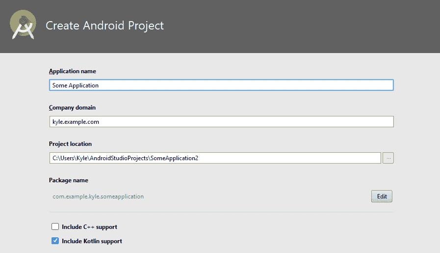
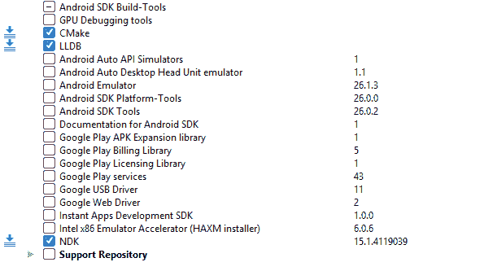
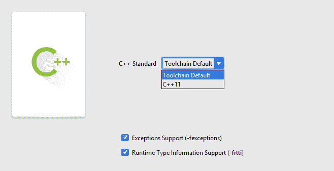
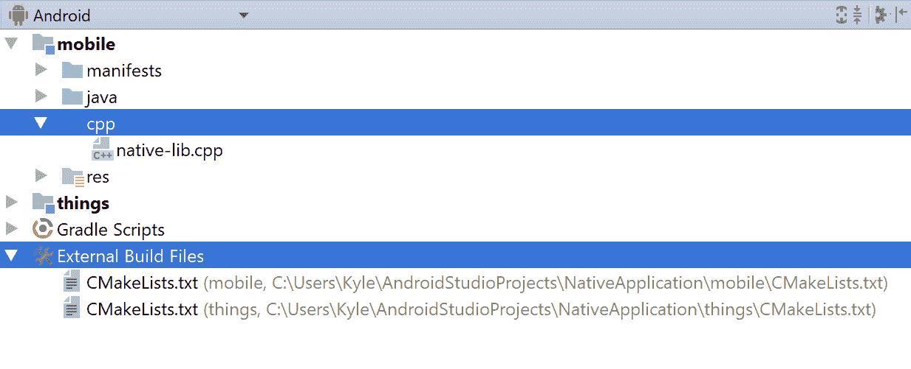

# 第七章：语言支持

要被认为是真正必不可少的 IDE，它必须做的不仅仅是提供基础功能。特别是，它必须对来自各种背景、使用各种语言和哲学的开发者都是可访问的。例如，许多开发者更喜欢采用面向对象的方法，而其他人更喜欢更基于功能的哲学，许多潜在项目更容易适应这两种范式中的一种。

Android Studio 3 为 C++和 Kotlin 提供了完整的语言支持，使开发者有机会根据手头项目的需求专注于速度或可编程性。

除了提供这种语言支持外，Android Studio 还促进了为各种形态的设备开发应用程序。读者可能已经熟悉 Android Wear 和 Android Auto，最近 IDE 还包括了对 Android Things 的支持。

在本章中，我们将看看这些语言支持系统以及构成**物联网**（**IoT**）的令人兴奋的新形态。

在本章中，您将学习以下内容：

+   包括 Kotlin 语言支持

+   将 Kotlin 与 Java 集成

+   应用 Kotlin 扩展

+   设置本地组件

+   在项目中包括 C/C++代码

+   创建 Android Things 项目

# Kotlin 支持

自移动应用诞生以来，软件开发经历了不止一次革命，而 Android 框架也不陌生于这些变化。许多开发者更喜欢 Java，因为它相对容易使用，但总会有一些时候，我们想要 C++的原始速度，而 Java 早在移动设备出现几十年前就存在了。如果有一种高级语言，比如 Java，它是专门为移动开发而设计的，那不是很好吗。

幸运的是，俄罗斯的 JetBrains 团队创建了 Kotlin，它可以与 Java 一起工作，甚至在 Java 虚拟机上运行，以创建一个更适合 Android 开发者需求的语言。它还与 Java 完全可互操作，因此您可以在同一个项目中使用 Java 和 Kotlin 文件，一切仍然可以编译。您还可以继续使用 Kotlin 与所有现有的 Java 框架和库。

Kotlin 作为插件已经提供给开发者一段时间了，但自从 Android Studio 3.0 推出以来，Kotlin 现在已完全集成到 IDE 中，并且已被 Google 正式支持为开发语言。IDE 中包括了用 Kotlin 编写的工作样本和向导模板。



在项目设置向导中包括 Kotlin 支持

学习一门新的编程语言很少会有多少乐趣，Kotlin 也不例外。使用它的好处在于，我们不必一下子从一种语言跳到另一种语言，可以逐渐引入 Kotlin，随时选择使用。

我们中的许多人已经使用 Java 很长时间了，并且没有真正改变的理由。毕竟，Java 运行得很好，多年的经验可以带来一些非常快速的工作实践。此外，互联网上充斥着高质量的开源代码库，使得研究和学习新技能对 Java 程序员非常有吸引力。

在 Android 开发中，学习和使用 Kotlin 绝对不是必须的，但值得一看的是，为什么有这么多开发者认为它代表了 Android 应用开发的未来。

# Kotlin 的优势

除了谷歌自己的认可之外，还有许多理由让开发者考虑 Kotlin。其中一个原因可能是终结空指针异常，编译器通过不允许将 null 值分配给任何对象引用来实现这一点。语言的其他令人兴奋的特性包括更青睐组合而非继承、智能转换和创建数据类。

看到这些创新提供了多大的优势，最好的方法是看一下这些。

正如前一节中的屏幕截图所示，Kotlin 可以直接从模板向项目中包含，但是我们也可以以与添加任何其他类或文件相同的方式，从已经打开的项目中包含 Kotlin 类。


添加一个新的 Kotlin 文件/类

以这种方式包含一个 Kotlin 类将提示 IDE 自动配置 Kotlin 与 Gradle。它通过修改顶级`build.gradle`文件来实现：

```kt
buildscript { 
    ext.kotlin_version = '1.1.3-2' 

    repositories { 
        google() 
        jcenter() 
    } 
    dependencies { 
        classpath 'com.android.tools.build:gradle:3.0.0-alpha9' 
        classpath "org.jetbrains.kotlin:kotlin-gradle-
                      plugin:$kotlin_version" 
    } 
} 

allprojects { 
    repositories { 
        google() 
        jcenter() 
    } 
} 

task clean(type: Delete) { 
    delete rootProject.buildDir 
} 
```

在 Android 应用中使用 Kotlin 几乎不会产生额外开销；而且，一旦编译完成，Kotlin 代码的运行速度不会比其 Java 等价物慢，也不会占用更多的内存。

像这样包含一个新的 Kotlin 类或文件非常有用，但是如何从模板创建一个 Kotlin 活动或片段呢？作为 Java 开发人员，我们习惯于使用简单的配置对话框来设置这些。幸运的是，Kotlin 活动也没有什么不同，`配置活动`对话框允许我们适当地选择源语言。


选择源语言

与以前一样，值得一看的是最终代码，看看与传统的 Java 活动/片段模板相比，它有多么简洁和可读。

```kt
class ItemDetailFragment : Fragment() { 

    private var mItem: DummyContent.DummyItem? = null 

    public override fun onCreate(savedInstanceState: Bundle?) { 
        super.onCreate(savedInstanceState) 

        if (getArguments().containsKey(ARG_ITEM_ID)) { 
            mItem = DummyContent.ITEM_MAP.
                     get(getArguments().getString(ARG_ITEM_ID)) 

            val activity = this.getActivity() 
            val appBarLayout = activity.findViewById<View>
                   (R.id.toolbar_layout) as CollapsingToolbarLayout 
            if (appBarLayout != null) { 
                appBarLayout!!.setTitle(mItem!!.content) 
            } 
        } 
    } 

    public override fun onCreateView(inflater: LayoutInflater?, 
         container: ViewGroup?, savedInstanceState: Bundle?): View? { 
        val rootView = inflater!!.inflate(R.layout.item_detail, 
                               container, false) 

        if (mItem != null) { 
            (rootView.findViewById(R.id.item_detail) as 
                         TextView).setText(mItem!!.details) 
        } 

        return rootView 
    } 

    companion object { 
        val ARG_ITEM_ID = "item_id" 
    } 
} 
```

通过使用 Kotlin 扩展来删除对`findViewById()`的调用，可以使这段代码变得更加简洁，如下一节所述。

虽然这种混合语言的方式对于调整和更新现有应用非常有用，但是当应用于整个项目时，Kotlin 才能充分发挥其作用。也许它最吸引人的特点是简洁性，通过从头开始创建两个项目并比较它们的代码，这一点很容易看出。以下是导航抽屉模板代码中的`onCreate()`列表：

```kt
@Override 
protected void onCreate(Bundle savedInstanceState) { 
    super.onCreate(savedInstanceState); 
    setContentView(R.layout.activity_main); 
    Toolbar toolbar = (Toolbar) findViewById(R.id.toolbar); 
    setSupportActionBar(toolbar); 

    FloatingActionButton fab = (FloatingActionButton) 
                 findViewById(R.id.fab); 
    fab.setOnClickListener(new View.OnClickListener() { 
        @Override 
        public void onClick(View view) { 
            Snackbar.make(view, "Replace with your own action", 
                   Snackbar.LENGTH_LONG) 
                    .setAction("Action", null).show(); 
        } 
    }); 

    DrawerLayout drawer = (DrawerLayout) 
              findViewById(R.id.drawer_layout); 
    ActionBarDrawerToggle toggle = new ActionBarDrawerToggle( 
            this, drawer, toolbar, R.string.navigation_drawer_open, 
                  R.string.navigation_drawer_close); 
                  drawer.addDrawerListener(toggle); 
                  toggle.syncState(); 

    NavigationView navigationView = (NavigationView) 
              findViewById(R.id.nav_view); 
    navigationView.setNavigationItemSelectedListener(this); 
} 
```

以下是它的 Kotlin 等价物：

```kt
override fun onCreate(savedInstanceState: Bundle?) { 
    super.onCreate(savedInstanceState) 
    setContentView(R.layout.activity_main) 
    setSupportActionBar(toolbar) 

    fab.setOnClickListener { view -> 
        Snackbar.make(view, "Replace with your own action", 
                  Snackbar.LENGTH_LONG) 
                .setAction("Action", null).show() 
    } 

    val toggle = ActionBarDrawerToggle( 
            this, drawer_layout, toolbar, 
            R.string.navigation_drawer_open, 
            R.string.navigation_drawer_close) 
    drawer_layout.addDrawerListener(toggle) 
    toggle.syncState() 

    nav_view.setNavigationItemSelectedListener(this) 
} 
```

这种语法的增加简洁性是所有开发人员都会欢迎的，而这绝不是使用 Kotlin 的唯一优势。

# 扩展 Kotlin

正如人们对任何强大的编程范式所期望的那样，可以通过插件来扩展它，以进一步增加其实用性。

每个 Android 开发人员都会对自己多少次输入`findViewById()`失望。他们也会意识到这种静态类型可能有多容易出错。

在项目设置期间启用 Kotlin 支持时，默认情况下会包含 Kotlin 扩展，如模块级`build.gradle`文件中所示：

```kt
apply plugin: 'com.android.application' 

apply plugin: 'kotlin-android' 

apply plugin: 'kotlin-android-extensions' 
```

使用扩展还需要将其导入到适当的类中，通常是活动或片段。读者很可能已经通过系统设置设置了自动导入。然后所需的就是以通常的方式使用 XML 创建视图，如下所示：

```kt
 <TextView 
        android:id="@+id/text_view" 
       . . . /> 
```

现在，设置该小部件的值所需的只是以下内容：

```kt
text_view.setText("Some text") 
```

无论您是否设置了自动包含导入，了解这些导入的格式是很有用的。考虑以下示例：

```kt
import kotlinx.android.synthetic.main.some_layout.* 
```

还可以导入特定视图的引用，而不是整个布局文件，如下所示：

`import kotlinx.android.synthetic.main.some_layout.text_view`

1.  在这种情况下，`some_layout.xml`将是包含我们的`text_view`的文件。

1.  如果您习惯于在活动 XML 中使用`<include>`引用内容 XML，那么您将需要两个类似于以下的导入：

```kt
import kotlinx.android.synthetic.main.some_activity.*
import kotlinx.android.synthetic.main.some_content.*
```

我们不仅可以在这里设置文本；任何我们喜欢的函数都可以以同样的方式调用，而无需通过搜索其 ID 来引用视图。

请注意，在 Kotlin 中，分号作为语句分隔符是完全可选的。

希望到目前为止，读者已经被说服了在 Kotlin 中编码的优势，但在我们继续之前，Kotlin 的一个功能隐藏在主`Code`菜单的底部。这是将 Java 文件转换为 Kotlin 文件。这正是它所说的，甚至可以找到并解决大多数转换问题，使其成为一个很好的节省时间的工具，也是学习两种语言之间差异的一种有趣方式。

使用*Ctrl* + *Alt* + *Shift* + *K*可以自动将 Java 转换为 Kotlin。

尽管 Kotlin 可能是 Android Studio 中最新的添加之一，但它并不是我们选择替代语言的唯一选择，C++提供的速度和低级内存访问已经成为许多开发人员的首选。在接下来的部分中，我们将看到这种强大的语言如何被 IDE 轻松支持。

# C/C++支持

到目前为止，我们已经看到所有编程语言都有其利弊。C 和 C++可能需要更多的纪律来掌握，但这往往会被语言提供的低级控制所弥补。

在使用 Android Studio 时，需要一组略有不同的开发工具。这包括**本地开发工具包**（**NDK**）和**Java 本机接口**（**JNI**），以及其他调试和构建方式。与 Android Studio 中的大多数流程一样，设置这些工具非常简单。

# NDK

如前一节所述，本地编程需要与我们到目前为止使用的略有不同的一套工具。正如人们所期望的那样，我们需要的一切都可以在 SDK Manager 中找到。

很可能您需要安装以下截图中突出显示的组件；您至少需要 NDK、CMake 和 LLDB：



本地开发组件

+   CMake：这是一个多平台测试和构建工具，与 Gradle 一起工作。有关全面的文档，请访问[cmake.org](https://cmake.org/)。

+   LLDB：这是一个功能强大的开源调试工具，专门设计用于处理多线程应用程序。其详细用法超出了本书的范围，但感兴趣的用户可以访问[lldb.llvm.org](http://lldb.llvm.org/)。

安装了正确的软件后，本地编码可以非常顺利地整合到 Android Studio 项目中，与我们的 Java/Kotlin 类和文件一起。与 Kotlin 支持一样，只需在设置过程中勾选适当的框即可。

选择此选项后，您将有机会配置 C++支持，如下所示：



C++支持自定义对话框

如果您使用 CMake，选择标准作为默认的工具链是最佳选择，大多数情况下，异常支持和运行时类型信息支持也值得检查。它们的包含可以通过检查模块级`build.gradle`文件来最清楚地看到：

```kt
DefaultConfig { . . . externalNativeBuild { cmake { cppFlags "-frtti -fexceptions" } } }
```

通常情况下，要在不用弄脏手的情况下深入了解内部情况的最佳方法之一就是使用现成的 Android 示例。这些示例并不多，但都很好，而且在 GitHub 上有一个不断增长的社区项目，网址是[github.com/googlesamples/android-ndk](https://github.com/googlesamples/android-ndk)。

所有这些示例都显示了添加的代码结构以及位置；与我们之前遇到的项目结构一样，实际的文件结构不会反映在项目文件资源管理器中，该资源管理器根据文件类型而不是位置来组织文件。

明显的添加是`main/cpp`目录，其中包含源代码，以及 CMake 使用的外部构建文件。



本地代码结构

一旦你选择了一个套件，系统镜像可以在[developer.android.com/things/preview/download.html](http://developer.android.com/things/preview/download.html)和你的 Things 开发者控制台上找到[partner.android.com/things/console/](http://partner.android.com/things/console/)。

Android Things

# Android Things

实际上，绝对任何设备都可以构成一个 Thing。一个设备甚至不需要有屏幕或任何按钮，只要有 IP 地址并且能够与其他设备通信。甚至可以获得一个带有 IP 地址的牙刷，尽管我对此的好处感到遗憾。

树莓派 3

可以通过一点专业知识和焊接铁来创建自己的开发板，但是像英特尔 Edison 和树莓派这样的低价位开发板，以及来自 Android 的免费系统镜像，使这个过程变得耗时。如果你有一个想法，并且想要快速测试并将其开发成一个成品项目，最好的方法是使用一个经过批准的开发套件，比如树莓派 3，如下图所示：

# 开发套件

一如既往，Android Studio 旨在尽可能地帮助我们，当然，有一个支持库、系统镜像和一个不断增长的工作样本集合来帮助我们。不幸的是，没有简单地模拟 Android Things 的方法，尽管一些功能可以在一些移动 AVD 上模拟，但仍需要一定形式的物理开发套件。

C++并不是每个人的菜，深入讨论超出了本书的范围。从 Android Studio 的角度来看，想要更充分利用 NDK 的人会发现，CMake 与 Gradle 的无缝集成使得调用本地库进行测试和构建应用程序变得非常方便。

对于用户、制造商和开发人员来说，Android 操作系统的美妙之一是它可以运行在各种设备上。起初，这种现象出现在我们的手表、电视机和汽车上。最近，物联网的发展导致需要在许多电子设备上使用复杂的操作系统。这促使谷歌开发了 Android Things。

物联网已经通过引入智能家用电器（如水壶和洗衣机）对消费者产生了影响。除此之外，许多市政当局使用这项技术来管理交通和公用事业的使用。

Android Things 和其他形式的 Android 开发之间最显著的区别可能是硬件。人们很容易认为需要嵌入式电路方面的专业知识，尽管在这个领域有一点知识是有用的，但绝对不是必需的，因为谷歌与英特尔、NXP 和树莓派等 SoC 制造商合作，生产开发套件，让我们能够快速制作和测试原型。

有关可用于 Things 的单板计算机的信息可以在[developer.android.com/things/hardware/developer-kits.html](http://developer.android.com/things/hardware/developer-kits.html)找到。每个板还有外围套件可用，并且可以在同一页上找到。

从开发者的角度来看，物联网非常令人兴奋，SDK 中的 API 的加入打开了几乎无限的新世界。当然，这些 API 已经整合到了 Android Studio 中，使得 Android Thing 的开发像其他 Android 应用程序开发一样简单和有趣。

一旦你有了套件和外围设备，你就可以开始开发你的第一个 Things 应用程序，其基础知识在下一节中概述。

# 创建 Things 项目

Android Things 使用的 API 不包含在标准 SDK 中，因此需要支持库。至少，你需要以下依赖项：

```kt
dependencies {
 ...
 provided 'com.google.android.things:androidthings:0.5-devpreview'
}
```

除了在清单中加入以下条目：

```kt
<application ...>
 <uses-library android:name="com.google.android.things"/>
 ...
</application>
```

大多数 Things 项目将需要更多的东西，这取决于使用了哪些外围设备以及项目是否将使用 Firebase 进行测试。查看提供的示例是了解需要哪些依赖项的好方法；以下片段取自 Things 门铃示例：

```kt
dependencies { provided 'com.google.android.things:androidthings:0.4-devpreview' 
  compile 'com.google.firebase:firebase-core:9.4.0'
  compile 'com.google.firebase:firebase-database:9.4.0'
  compile 'com.google.android.things.contrib:driver-button:0.3'
  compile 'com.google.apis: google-api-services-vision:v1-rev22-1.22.0'
  compile 'com.google.api-client: google-api-client-android:1.22.0' exclude module: 'httpclient'
  compile 'com.google.http-client: google-http-client-gson:1.22.0' exclude module: 'httpclient' }
```

在设置 Android Things 项目时，下一个主要的区别可以在清单文件中看到，添加以下代码中突出显示的 `<intent-filter>` 将使项目在测试和调试时成功运行：

```kt
<manifest  package="com.example.androidthings.doorbell">

  <uses-permission android:name="android.permission.CAMERA" /> 
  <uses-permission android:name="android.permission.INTERNET" />
  <uses-permission android:name="com.google.android.things.permission .MANAGE_INPUT_DRIVERS" />

  <application android:allowBackup="true" android:icon="@android:drawable/sym_def_app_icon" android:label="@string/app_name">
    <uses-library android:name="com.google.android.things" />
    <activity android:name=".DoorbellActivity">

    <intent-filter>
      <action android: name="android.intent.action.MAIN" />
      <category android: name="android.intent.category.LAUNCHER" />
    </intent-filter>

    <intent-filter> 
 <action android: name="android.intent.action.MAIN" />
 <category android: name="android.intent.category.IOT_LAUNCHER" />
 <category android: name="android.intent.category.DEFAULT" />
 </intent-filter>

    </activity>
  </application>
</manifest>
```

这些实际上是设置 Android Things 项目时唯一的区别。其他的区别将更多地基于使用哪些外围设备和传感器。像往常一样，更深入地探索 Things 的最佳方式之一是通过提供的示例。虽然可用的示例不多，但数量正在增加，并且它们都是为了帮助我们学习而编写的。

为 Android Things 开发可能对许多开发者来说似乎令人生畏，但 Android Studio 通过其系统镜像、支持库和代码示例的方式使得任何有好点子的开发者都可以廉价快速地开发、测试和生产这样的产品。

# 总结

在本章中，我们探讨了一些 Android Studio 可以帮助开发者的更加奇特的方式。谷歌在数字世界中的巨大影响力提供了替代技术，比如 Kotlin 语言，并鼓励制造商开发吸引 Android 开发者的技术，使尖端技术可以被具备技能和想法的任何人使用。

Android Studio 不是唯一提供使用不同语言或不同形态因素编码的机会的软件，但 Android Studio 确实使开发者学习新技能变得更简单更容易。

在下一章中，我们将看一下最后的开发阶段之一；测试。这将给我们一个很好的机会来探索 Android Studio 最创新和有用的工具之一：设备监视器和分析器。
