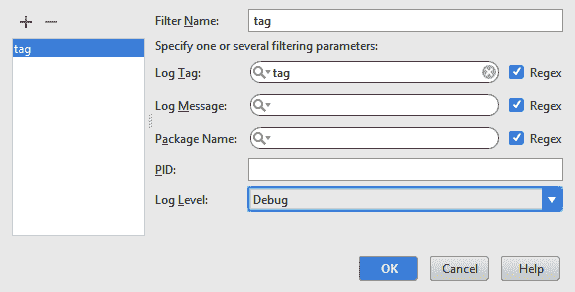
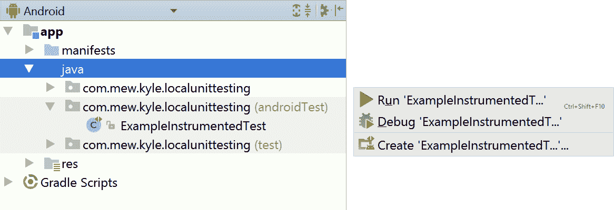
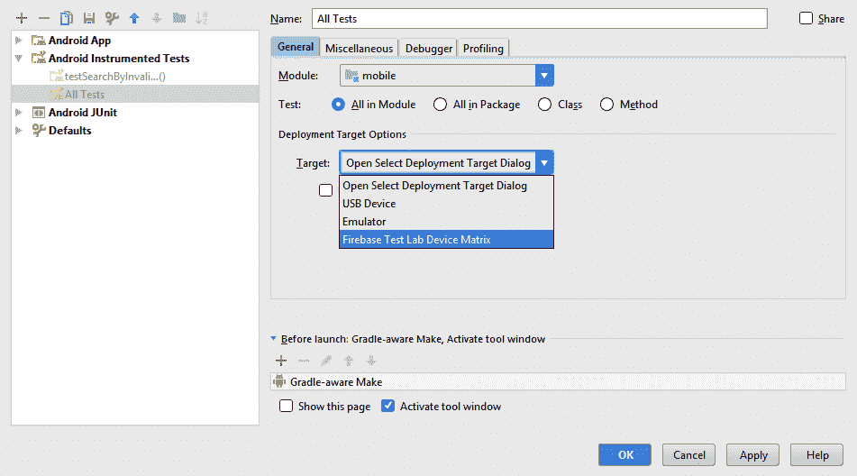
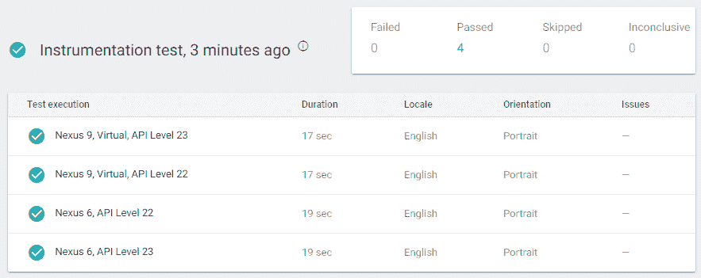
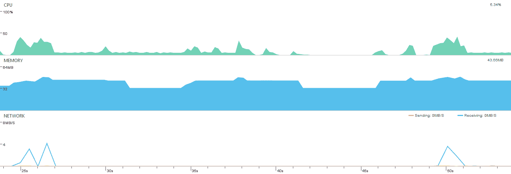
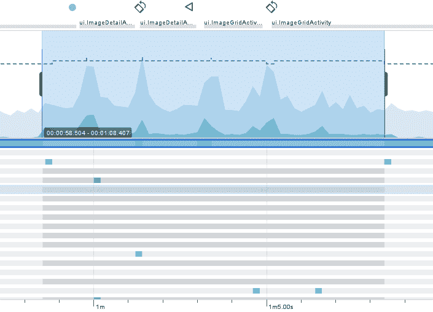
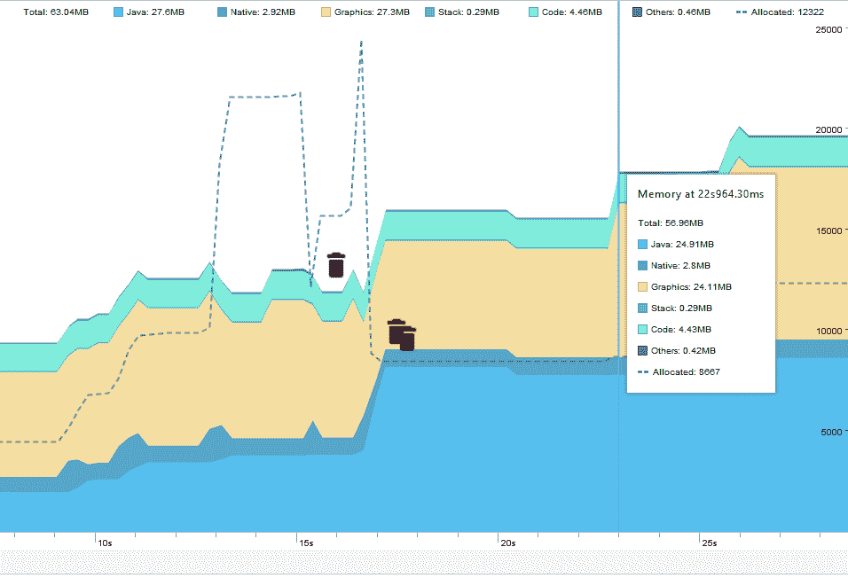
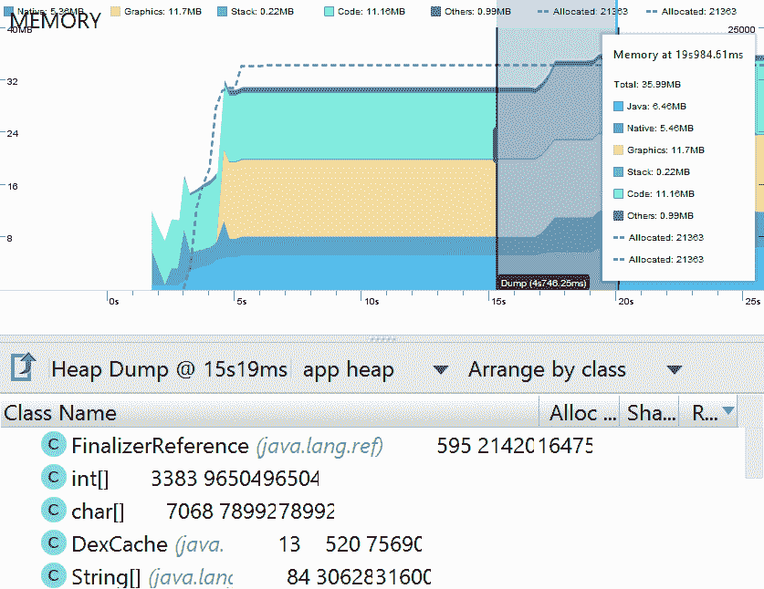
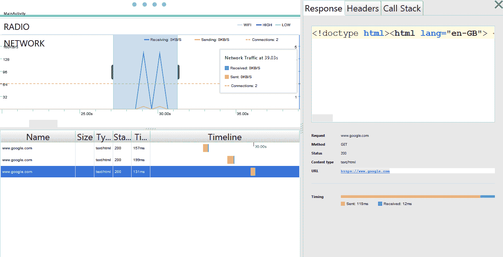

# 第八章：测试和分析

如果有一个理由选择 Android Studio 而不是其他 IDE，那很容易可以说是因为它强大的调试和测试工具。这些工具从简单的 Logcat 报告到基于 JUnit 框架的复杂测试机制。除了帮助我们识别代码中的错误的工具之外，Android Studio 还拥有一系列非常智能的性能监控工具，允许开发人员对项目进行微调并最大化其效率。

本章将依次探讨这些过程，从简单的内联调试调用开始，然后转向不同类型的 JUnit 测试，最后看一下如何在各种条件下监视我们应用程序的性能。

在本章中，您将学习如何：

+   配置 Logcat 调试过滤器

+   创建本地单元测试

+   构建插桩测试

+   记录 Espresso 测试

+   测试 UI

+   执行远程测试

+   压力测试应用程序

+   启用高级分析

+   记录方法跟踪

+   记录内存分配

+   检查 Java 堆转储

+   检查网络流量

# Logcat 过滤器

最简单但也最有用的调试技术之一是简单地包含 Logcat 过滤器。这可以用于报告变量值或简单跟踪调用了哪些方法。当跟踪不明显的进程时特别有用，例如对 UI 没有明显影响的服务、广播接收器和回调。

也许最简单的调试工具之一，当我们匆忙时只想检查单个值或事件时非常有用，就是包含一行类似于：

```kt
System.out.println("Something happened here"); 
```

这只是一个临时解决方案，因为输出将被埋在其他 Logcat 文本中。更容易管理的方法是配置 Logcat 过滤器。以下简短的练习演示了如何做到这一点：

1.  开始一个新项目，或打开一个新项目。

1.  选择一个活动或片段，并包括以下字段：

```kt
private static final String DEBUG_TAG = "tag"; 
```

1.  选择您想要检查的方法，并添加一行类似于这里的行：

```kt
Log.d(DEBUG_TAG, "Some method called"); 
```

1.  使用*Alt* + *6*打开 Logcat 工具。

1.  从右上角的下拉菜单中选择编辑过滤器配置，并完成结果对话框，如下所示：



过滤器配置

1.  运行应用程序。

1.  现在可以使用 Logcat 工具以同样的方式跟踪任何值、活动或事件。

这是迄今为止最不复杂的方式来在代码运行时进行询问，但它有其用途：它可以随时快速应用。这种方法适用于对抗单个错误；一旦我们有了可工作的代码，我们将需要在一些明确定义的条件下进行测试。这就是 Android Studio 基于 JUnit 的测试系统发挥作用的地方。

# JUnit 测试

没有开发项目可以完整，直到它经过彻底和严格的测试，而 Android Studio 直接将 JUnit 测试整合到工作区中。正如其名称所示，该框架允许测试单个代码单元。这些通常是单独的模块，但也可能是单个类或方法。

Android Studio JUnit 测试框架提供了两种不同类型的测试。它们如下：

+   本地单元测试用于在不依赖于 Android 组件或其他代码的隔离环境中测试业务逻辑，尽管可能会模拟一些依赖关系。这些测试在本地 Java 虚拟机上运行，因此比在硬件设备或模拟器上进行测试要快得多。

+   插桩测试用于测试 Android 框架本身的元素，例如我们的 UI 的行为。这些测试生成一个 APK 文件，因此构建速度较慢。

在大多数开发周期中，我们需要同时使用这两种技术，接下来我们将依次看看每种。

对于几乎所有的项目，我们可以预计将花费大约两倍的时间来测试代码的稳定性，而不是测试功能，我们将在下一节中看到这两者。

# 本地单元测试

如果您使用项目向导创建了一个 Android Studio 项目，那么两种测试类型的基本测试用例将会自动创建。向导还将包括必要的 Gradle 依赖项。如果您是以其他方式创建的项目，您将需要手动创建测试目录结构并包含 Gradle 依赖项。这些步骤如下所述：

1.  在您的`module/src`目录中，创建一个新文件夹，与`src/main`旁边叫做`src/test`。

1.  在这个`test`目录中，重新创建`main`目录内的文件夹结构，例如：

```kt
main/java/com/packt/chapterseven 
```

1.  这个目录是您将放置测试类的地方，现在可以从 IDE 的项目资源管理器中访问。

1.  最后，如果尚未包含，将以下依赖项添加到您的`build.gradle`文件中：

```kt
testImplementation 'junit:junit:4.12' 
```

如果您使用向导创建项目，那么它将包括一个示例测试类`ExampleUnitTest.Java`。这个类包含一个用于测试算术的方法：

```kt
public class ExampleUnitTest { 

    @Test 
    public void addition_isCorrect() throws Exception { 
        assertEquals(4, 2 + 2); 
    } 
}  
```

这是一个非常简单的例子，但它仍然是一个很好的方式来初步了解单元测试在这种环境中是如何工作的。最好的方法是使用项目设置向导创建一个项目，或者打开一个以这种方式创建的项目，以便它包含测试类。

尽管它们实际上位于磁盘上，但测试模块可以在 IDE 的项目资源管理器中与常规的 Java 模块一起找到。



从 IDE 访问测试

看到这些测试的最简单方法并探索其他测试功能，就是修改`addition_isCorrect()`方法，使其失败。`assertEquals()`方法只是比较两个表达式，并可以设置为失败，如下所示：

```kt
public class ExampleUnitTest { 
    int valueA; 
    int valueB; 
    int valueC; 

    @Test 
    public void addition_isCorrect() throws Exception { 
        valueA = 2; 
        valueB = 2; 
        valueC = 5; 

        assertEquals("failure - A <> B + C", valueA, valueB + ValueC); 
    } 
} 
```

这将产生如下所示的可预测的输出：


单元测试输出

上面显示的运行工具具有许多有用的功能，可以在工具栏中找到。特别是左侧第三个图标允许我们在进行任何更改时自动重新运行测试。主工具栏允许我们过滤和排序通过和忽略的测试，以及导入和导出结果，可以保存为 HTML、XML 或自定义格式。

单击“单击以查看差异”链接将打开一个非常有用的失败比较表格，当多个测试失败时非常有用。

测试可以像其他代码一样运行，通常只需在主工具栏中点击运行图标，但运行菜单和代码编辑器左侧的运行测试图标包括调试选项和显示类覆盖窗口的选项。这些编辑器图标特别有用，因为它们可以用来运行单独的方法。

提供的示例使用了 JUnit 的`assertEquals()`断言。我们有许多类似的 JUnit 断言和其他可用的结构，完整的文档可以在[junit.org](http://junit.org/junit4/)上找到。

上面的例子是自包含的，并没有告诉我们如何使用这些类来测试我们的应用程序代码。下面的例子演示了如何做到这一点：

1.  在默认包中创建一个 Java 类，其中包含一个函数，就像这里的一个函数：

```kt
public class PriceList { 

    public int CalculateTotal(int item1, int item2) { 

        int total; 
        total = (item1 + item2); 

        return total; 
    } 
} 
```

1.  按照以下方式在`test`包中创建一个新类：

```kt
public class PriceListTest { 

    @Test 
    public void testCalculateTotal(){ 

        PriceList priceList = new PriceList(); 
        int result = priceList.CalculateTotal(199, 250); 

        assertEquals(449,result); 
    } 
} 
```

与第一个例子不同，上面的代码演示了如何在测试代码中整合业务逻辑。

一旦我们有了几个测试，有时有必要控制这些测试运行的顺序，特别是如果我们希望在每次测试运行开始时运行准备代码。这可以通过一系列 JUnit 注释来实现，如下所示：

```kt
@BeforeClass 
@Test(timeout=50) 
public void testSomeMethod() { 
... 
```

前面的配置注解将导致该方法仅运行一次，在调用类中的所有其他方法之前运行，并且在 50 毫秒后失败。`@Before`可以用来导致一个方法在每次其他测试之前执行，还有相应的`@After`和`@AfterClass`注解。

`org.junit`包中还有许多其他断言和其他类，完整的文档可以在以下链接找到：

[junit.sourceforge.net/javadoc/org/junit/package-summary.html#package_description](http://junit.sourceforge.net/javadoc/org/junit/package-summary.html#package_description)

通常，您会希望一起运行相同的一组测试类。与其每次分别运行它们，不如重新创建一组测试并作为一个运行，类似以下代码：

`@RunWith(Suite.class)`

`@SuiteClasses({`

`        someClassTest.class,`

`          someOtherClassTest.class })`

并不总是可能或者希望完全隔离地测试每个单元。通常，我们需要测试一个单元与 Android 和其他 Java 接口和类的交互。这通常是通过创建模拟依赖来实现的。

正如读者所知，有许多种方法可以创建模拟对象和类，从从头开始构建它们的繁琐任务到使用现成的第三方框架。在大多数情况下，这第二个选项更可取，也许唯一的例外是一些完全重新定义 UI 的全屏游戏。否则，对于 Android Studio 用户来说，最简单，也可能是最好的选择是 Mockito。

Mockito 是一个强大的 Java 框架，虽然它很容易集成到 Android Studio 中，但它并不特定于它，许多读者可能已经从其他 IDE 中熟悉它。关于这个主题可以涵盖很多内容，但这超出了本书的范围。当然，Mockito 需要在我们的`build.gradle`文件中声明为依赖项，方法如下：

```kt
testImplementation 'org.mockito:mockito-core:2.8.9' 
```

幸运的是，不需要创建模拟依赖来能够调用 Android API。如果`android.jar`方法的默认返回值足够，那么我们可以通过将以下片段添加到`build.gradle`文件的 Android 部分来指示 Gradle 执行此操作：

```kt
testOptions { 
  unitTests.returnDefaultValues = true 
} 
```

Mockito 提供了结构来模拟我们可能需要测试业务逻辑的大多数 Java 类，但归根结底，我们正在开发一个 Android 应用程序，并且需要在真实设备和模拟器上进行测试。一旦我们确信我们的模型在隔离状态下运行良好，我们需要看看它在现实世界中的表现如何。

# 测试 UI

尽管在这里分开考虑，仪器化测试也可以是单元测试。有许多非 UI Android 类需要我们进行测试，尽管这些可以被模拟，但这可能是一个耗时的过程，特别是当我们知道这些类已经完全实现在我们的设备和模拟器上时。如果我们愿意牺牲模拟测试的快速构建时间，那么我们可能会插入我们的设备并启动我们的模拟器。

开发中难以模拟的一个方面是 UI 模拟和交互，一般来说，当我们想要测试我们的布局与物理手势时。幸运的是，我们有一些非常方便的工具和功能可供使用，帮助测试和优化我们的设计。

# 测试视图

在仪器化 UI 测试的核心是 Android 测试支持库。这包括 JUnit API，UI Automator 和 Espresso 测试框架。在 Android Studio 上设置 Espresso 几乎没有任何难度，因为如果您是通过项目设置向导生成的项目，它会默认作为依赖项包含在内。如果不是，您需要将以下内容添加到您的`build.gradle`文件中：

```kt
androidTestImplementation('com.android.support.test.espresso:espresso-core:2.2.2', { 

    exclude group: 'com.android.support', 
           module: 'support-annotations' 

}) 
```

如果您的测试设备上设置了开发人员动画选项，例如窗口和转换动画比例，您需要在测试期间禁用它们，以使 Espresso 能够顺利工作。

简而言之，Espresso 允许我们执行三项基本任务：

1.  识别和访问视图和其他 UI 元素。

1.  执行活动，如点击和滑动。

1.  验证断言以测试代码。

最好的方法是通过一个简单的例子来看看它是如何工作的。与单元测试类似，插装测试需要放置在正确的磁盘位置才能被 Android Studio 识别，如下所示：

`\SomeApp\app\src\androidTest`


插装测试位置

以下步骤演示了我们如何执行刚才提到的三项任务：

1.  在活动中创建两个视图，如下所示的代码；这里使用主活动：

```kt
<EditText 
    android:id="@+id/editText" 
    . . . 
    /> 

<Button 
    android:id="@+id/button" 
    . . . 
    /> 
```

1.  在`androidTest`目录中创建一个测试类，如下所示：

```kt
@RunWith(AndroidJUnit4.class) 
@LargeTest 
public class InstrumentedTest { 

    private String string; 

    @Rule 
    public ActivityTestRule<MainActivity> testRule = new ActivityTestRule<>( 
            MainActivity.class); 

    @Before 
    public void init() { 
        string = "Some text"; 
    } 

    @Test 
    public void testUi() { 

        onView(withId(R.id.editText)) 
                .perform(typeText(string), 
                        closeSoftKeyboard()); 

        onView(withId(R.id.button)) 
                .perform(click()); 

        onView(withId(R.id.editText)) 
                .check(matches(withText("Some text"))); 
    } 
} 
```

1.  请注意，IDE 将 Espresso 术语标识为斜体：


斜体的 Espresso 术语

1.  运行测试，可以从编辑器的左边栏或运行菜单中运行。

1.  应用程序将在测试设备上打开，`string`将被输入到编辑框中，按钮将被点击，活动将被完成并关闭。

1.  然后可以在 IDE 中查看测试结果。

在前面的代码中有一两个需要指出的地方，特别是对于新手来说。`ActivityTestRule`用于访问我们活动中的小部件，调用`closeSoftKeyboard()`；后者并不是严格必要的，但是，如果您运行测试，您会看到它确实像人们想象的那样关闭软键盘。

在运行插装测试时，平台会使用一个测试清单，如果您从模板创建了项目或者正在处理一个示例，它将已经包含在内。这将位于磁盘上的以下目录中：`\SomeApplication\app\build\intermediates\manifest\androidTest\debug`

这些测试中使用的几乎所有库都需要导入，尽管代码编辑器擅长发现缺少的导入，但也了解需要哪些库是很好的。以下是前面测试所需的库列表：

```kt
android.support.test.filters.LargeTest; 
android.support.test.rule.ActivityTestRule; 
android.support.test.runner.AndroidJUnit4; 

org.junit.Before; 
org.junit.Rule; 
org.junit.Test; 
org.junit.runner.RunWith; 

android.support.test.espresso.Espresso.onView; 
android.support.test.espresso.action.ViewActions.click; 
android.support.test.espresso 
        .action.ViewActions.closeSoftKeyboard; 
android.support.test.espresso.action.ViewActions.typeText; 
android.support.test.espresso.assertion.ViewAssertions.matches; 
android.support.test.espresso.matcher.ViewMatchers.withId; 
android.support.test.espresso.matcher.ViewMatchers.withText;
```

可以通过在`build.gradle`文件中包含以下依赖项来在 JUnit 测试中包含 Hamcrest 断言匹配器：

`Implementation 'org.hamcrest:hamcrest-library:1.3'`

Espresso 提供了许多其他操作，例如滚动和清除文本，以及输入和点击。Espresso 的详细文档可以在以下链接找到：

[google.github.io/android-testing-support-library/docs/](http://google.github.io/android-testing-support-library/docs/)

# 测试列表和数据

前面的示例使用`onView()`来识别我们想要使用其 ID 进行测试的视图，对于我们已经命名的组件来说这是可以的；然而，列表中的项目不能如此明确地识别，因此我们需要另一种方法。在处理列表时，例如可回收视图和下拉列表框时，Espresso 提供了`onData()`方法来识别列表项。

要查看此操作，请在应用程序活动中添加一个下拉列表框，如下所示：

```kt
public class SomeActivity extends AppCompatActivity { 

    ArrayList<String> levelList = new ArrayList<String>(); 
    TextView textView; 

    @Override 
    protected void onCreate(Bundle savedInstanceState) { 

        . . . 

        Spinner spinner = (Spinner) findViewById(R.id.spinner); 

        levelList.add("Easy"); 
        levelList.add("Medium"); 
        levelList.add("Hard"); 
        levelList.add("Impossible"); 

        ArrayAdapter<String> adapter = new ArrayAdapter 
                <String> 
                (MainActivity.this, 
                        android.R.layout.simple_spinner_item, 
                        levelList); 
        spinner.setAdapter(adapter); 

        spinner.setOnItemSelectedListener 
                (new AdapterView.OnItemSelectedListener() { 

            @Override 
            public void onItemSelected(AdapterView<?> 
                    parent, View view, int position, long id) { 

                Snackbar.make(view, "You selected the" 
                        + levelList.get(position) 
                        + " level ", Snackbar.LENGTH_LONG) 
                        .setAction("Action", null) 
                        .show(); 
            } 

            @Override 
            public void onNothingSelected(AdapterView<?> parent) { 

                Snackbar.make(view, "Nothing selected" 
                        ,Snackbar.LENGTH_LONG) 
                        .setAction("Action", null).show(); 

            } 
        }); 
    } 
```

现在我们可以使用`onData()`编写一个测试来询问小部件：

```kt
@RunWith(AndroidJUnit4.class) 
@LargeTest 
public class InstrumentedTest { 

    private String string; 

    @Rule 
    public ActivityTestRule<MainActivity> 
            testRule = new ActivityTestRule<>(MainActivity.class); 

    @Before 
    public void init() { 

        string = "Medium"; 
    } 

    @Test 
    public void testSpinner() { 

        onView(withId(R.id.spinner)) 
                .perform(click()); 

        onData(allOf(is(instanceOf(String.class)), is(string))) 
                .perform(click()); 

        onView(withId(R.id.spinner)) 
                .check(matches(withText 
                (containsString("Medium")))); 
    } 
} 
```

即使您已将 Hamcrest 作为 Gradle 依赖项包含在内，但是工作室的快速修复功能不会启动，测试代码中需要包含以下导入：

`import static org.hamcrest.Matchers.allOf;` `import static org.hamcrest.Matchers.containsString;`

`import static org.hamcrest.Matchers.instanceOf;` `import static org.hamcrest.Matchers.is;`

# 记录测试

在前面的部分中，我们看到 Android Studio 为测试我们的代码提供了一套全面的工具，但编写这些测试是耗时的，除了最琐碎的项目之外，还需要许多单独的测试。幸运的是，Android Studio 提供了一种半自动化的方式来构建测试，使用我们自己的 UI 交互来创建、识别和执行测试的代码元素。

以下简单的练习展示了如何通过手动编写之前的测试来执行测试：

1.  打开在上一个练习中创建的下拉菜单项目，或者创建一个新的项目。

1.  从“运行”菜单中选择“记录 Espresso 测试”。

1.  从下拉菜单中选择一个项目。这将在“记录您的测试”对话框中反映出来。

1.  点击“添加断言”按钮。

1.  点击下拉菜单，完成对话框，如下所示：


记录您的测试对话框

1.  保存并运行测试。

如您所见，IDE 已经接受了我们的屏幕手势并将它们转换为代码：

```kt
@Test 
public void someTest() { 
    ViewInteraction appCompatSpinner = onView( 
      allOf(withId(R.id.spinner), 
        childAtPosition( 
          childAtPosition( 
            withClassName(is("android.support.design.widget.CoordinatorLayout")), 
            1), 
          0), 
        isDisplayed())); 
    appCompatSpinner.perform(click()); 

    DataInteraction appCompatTextView = onData(anything()) 
      .inAdapterView(childAtPosition( 
        withClassName(is("android.widget.PopupWindow$PopupBackgroundView")), 
           0)) 
      .atPosition(1); 
    appCompatTextView.perform(click()); 

    ViewInteraction textView = onView( 
      allOf(withId(android.R.id.text1), withText("medium"), 
        childAtPosition( 
          allOf(withId(R.id.spinner), 
            childAtPosition( 
              IsInstanceOf.<View>instanceOf(android.view.ViewGroup.class), 
            0)), 
         0), 
      isDisplayed())); 

    textView.check(matches(withText("medium"))); 
} 
```

这段代码可能不够高效或用户友好，但节省的时间可能是值得的，而且归根结底，所有的测试都是临时的，一旦我们对代码满意，就会被取消。

读者可能已经注意到，当从“选择部署目标”对话框运行测试时，还有一个“云测试”选项卡。这个功能允许我们直接从 IDE 访问 Firebase 测试实验室。 

# 远程测试

在为 Android 应用程序进行一般发布时，希望尽可能在许多不同的设备配置和平台版本上进行测试。在大量真实设备上进行测试是不切实际的，虚拟设备似乎是唯一的选择。幸运的是，Firebase 提供了一个基于云的测试实验室，允许我们在各种真实设备和模拟器上测试我们的应用程序。

Firebase 是一个功能强大、完整的基于云的应用开发套件，具有许多有用的功能，如文件托管和实时崩溃报告。在本章中，我们将专注于 Firebase 产品之一，即测试实验室。

IDE 中有 Firebase 助手，这是开始的最简单方式，可以在“工具”菜单中找到：


Firebase 助手

在将 Android Studio 连接到 Firebase 之前，请使用您的 Google 帐户登录[`firebase.google.com/.`](https://firebase.google.com/)

点击“了解更多”链接将允许您直接从 IDE 连接到 Firebase。这将带您完成一个快速向导/教程，最终点击“连接到 Firebase”按钮。

现在，我们可以通过从“运行”|“编辑配置...”菜单中打开“运行/调试配置...”对话框来配置我们的基于云的测试：



测试配置

这些测试现在可以像任何其他项目一样启动，使用运行图标或菜单项，您将从测试输出中看到一个链接，可以查看结果的 HTML 版本，如下所示：



Firebase 输出

值得注意的是，尽管许多人更喜欢它，但 Firebase 并不是测试 Android 应用程序的唯一云设备，感兴趣的读者应该查找**亚马逊网络服务**（**AWS**）设备农场、Xamarin 测试云、Sauce Labs、Perfecto 等其他设备。

前面概述的方法演示了我们可以应用于我们的代码的各种测试技术，以及 Android Studio 可以加快和自动化这一重要但常常令人沮丧的开发方面。在转向更有趣的主题之前，还有一种测试需要一点解释，尽管不严格属于 IDE 的一部分，但应用程序 Exerciser Monkey 仍然是一个非常有用的小工具。

# 压力测试

Android 应用程序 Exerciser Monkey 是一个方便的命令行应用程序压力测试工具。它通过执行（或注入）一系列随机输入操作，如点击、输入和滑动来工作。这就像把你的应用交给一个孩子，看看他们能不能把它弄坏。所有开发人员都明白，用户可以，也会尝试用他们的应用做出绝对荒谬和不可预测的事情，而除了坐在那里尝试复制每种可能的手势组合之外，Exerciser Monkey 是我们能够预测不可预测的最接近的方法。

Monkey 非常简单易行：只需在`sdk/platform-tools`目录中打开命令提示符，然后输入以下命令：

```kt
adb shell Monkey -p com.your.package -v 5000
```

在这里 5000 是您想要执行的随机操作的数量，输出将类似于以下片段：

```kt
. . . 
:Sending Touch (ACTION_DOWN): 0:(72.0,1072.0) 
:Sending Touch (ACTION_UP): 0:(70.79976,1060.0197) 
:Sending Touch (ACTION_DOWN): 0:(270.0,1237.0) 
:Sending Touch (ACTION_UP): 0:(284.45987,1237.01) 
:Sending Touch (ACTION_DOWN): 0:(294.0,681.0) 
:Sending Touch (ACTION_UP): 0:(301.62982,588.92365) 
:Sending Trackball (ACTION_MOVE): 0:(-3.0,-1.0) 
. . . 
```

可以在[`developer.android.com/studio/test/monkey.html`](https://developer.android.com/studio/test/monkey.html)找到包含所有 Monkey 命令行选项的表格。

测试我们的业务逻辑，它如何与系统的其余部分结合，以及在各种条件下在各种设备上的行为，是任何开发生命周期的重要部分。然而，一旦我们确信我们的代码表现如我们所愿，我们就可以继续审查它执行这些任务的效率。我们需要问问我们的工作有多有效，它是否包含内存或资源瓶颈，或者是否不必要地耗尽电池。为了做到这一点，我们需要求助于 Android Profiler。

# 性能监控

我们可能已经消除了代码中的所有问题，但仍然有很多微调要做，而 Android Studio 最具创新性的功能之一——Android Profiler，正是让我们能够做到这一点。

Android Profiler 不适用于使用 C++开发的模块。

Android Profiler 是在 Android Studio 3.0 中引入的，取代了以前的 Android Monitor。在最基本的级别上，它监视实时 CPU、内存和网络使用情况。这使我们能够在不同条件和配置下测试我们的应用，并改善其性能。它可以从 View | Tool Windows 菜单或工具窗口栏中访问。



性能监控

这种基本监控与以前版本的 Android Monitor 没有什么不同。这是因为诸如方法跟踪和内存分配检查之类的功能对构建时间有负面影响。可以通过 Run/Debug Configurations 对话框轻松启用高级分析，该对话框可以通过 Run | Edit Configurations...菜单找到。


高级性能监控

分析器现在显示特定事件信息，以及我们将在下面探讨的其他一系列功能。

# CPU 分析

Android Profiler 提供的检查比其前身 Android Monitor 更深入，允许详细检查线程活动、UI 事件和单个方法的性能。CPU 分析器还允许我们记录方法跟踪，以及一些复杂的检查工具，帮助我们使程序更有效率。

通过单击 CPU 时间轴中的任何位置，可以看到 CPU 高级分析功能。然后，它将在显示的底部显示线程活动时间轴。

像这样实时观察我们应用的行为可以非常有启发性，但是，为了最好地看到发生了什么，我们需要记录一段活动时间。这样，我们就可以检查单个线程。

以下简短的练习演示了如何记录这样的方法跟踪：

1.  单击 CPU 时间线中的任何位置以打开高级 CPU 分析器。

1.  决定要记录哪些操作。

1.  此窗格顶部有两个新的下拉菜单。选择插装而不是采样，并保持其他设置不变。

1.  如果您计划进行长时间的记录，请缩小视图。

1.  单击记录图标并执行您计划的操作。

1.  再次单击相同的图标以停止。



记录的 CPU 方法跟踪

记录样本两侧的耳朵可以拖动以调整记录的长度。

正如练习所示，有两种记录方式，即插装和采样；它们的区别如下：

+   插装记录会精确记录方法调用的时间。

+   采样记录会定期对内存使用情况进行采样。

正如您将看到的，有四个选项卡可以表示这些数据，位于工具窗口底部。调用图和火焰图以图形方式显示方法层次结构，而自上而下和自下而上则将此信息显示为列表。

单击这些图表中的任何方法将打开该方法的源代码。

能够详细检查程序流程非常有帮助，可以节省大量不必要的调试，但我们需要考虑的不仅仅是处理器时间；我们还需要密切关注我们的应用程序消耗了多少内存。

# 内存分析器

充分了解我们的应用对设备 CPU 的影响只是一个考虑因素。作为开发人员，我们必须在不知道目标设备的内存能力的情况下创建应用，并且，此外，我们无法知道这些设备在我们的应用运行时正在使用内存的其他用途。

为了帮助我们规划内存使用并避免泄漏，Android Studio 配备了强大的内存分析器。这使我们能够查看 Java 堆并记录内存分配。只要启用了高级分析功能，高级内存分析器就可以通过单击实时时间线上的任何位置以与处理器分析器相同的方式打开。



高级内存分析器

如前图所示，分析器还显示自动垃圾收集。这样的清理也可以通过分析器工具栏中的垃圾桶图标手动执行。这还包括用于记录内存分配和捕获 Java 堆转储（下载图标）的按钮。

获取内存转储就像单击图标并等待一会儿收集数据一样简单。堆转储显示了在转储堆时正在使用的对象，并且是识别内存泄漏的好方法。探索堆转储的最佳时间是在进行了长时间 UI 测试后，查找应该已经被丢弃但仍占用内存的对象。



Java 堆转储

单击转储列表中的类将在编辑器中打开相应的源代码。

这样的内存转储非常有用，可以观察我们的对象消耗了多少内存，但它们并没有告诉我们他们如何使用这些内存。要查看这一点，我们需要记录内存分配。这是通过与 CPU 记录相同的方式完成的，即通过单击记录图标。这个方便的内存检查工具需要更多解释，引导我们到第三个和最后一个分析工具，网络分析。

# 网络分析器

这个分析器和前两个操作的方式没有太大的区别。与记录网络活动不同，只需单击并拖动到您感兴趣的时间线区域。然后在下面的窗格中列出涉及的文件，并在选择它们时提供详细信息：



高级网络分析器

高级网络分析器提供了一种很好的方式来识别低效的网络使用。在需要网络控制器经常打开和关闭无线电以下载小文件的情况下，最好避免这种情况，而是优先下载多个小文件。

网络分析器以及其他两个分析器都是节省时间的工具的绝佳示例，这使得 Android Studio 成为开发移动应用程序的不错选择。对应用程序进行彻底测试和微调往往可以决定一个平庸的应用程序和一个成功的应用程序之间的差异。

# 总结

在本章中，我们看了一下测试和分析我们的应用程序的过程。我们不仅了解了如何利用 JUnit 集成来测试自己的业务逻辑的完整性，还了解了如何整合诸如 Mockito 和 Espresso 之类的工具来测试平台本身，以及诸如 Firebase 之类的资源来在更广泛的设备范围内进行测试。

除了测试我们的代码和用户界面之外，我们还需要一种测试我们的应用程序，硬件性能以及 CPU，内存或网络使用是否存在问题的方法。这就是 Android Studio 内置的分析器派上用场的地方，它允许我们详细检查和记录我们应用程序的性能。

我们的应用程序现在运行顺畅，并经过性能调整，我们可以看看开发的最后阶段，构建，打包和部署。Android Studio 允许我们使用 Gradle 构建系统简单地创建签名 APK，包括不同风味的 APK，并简化签名和安全性。
