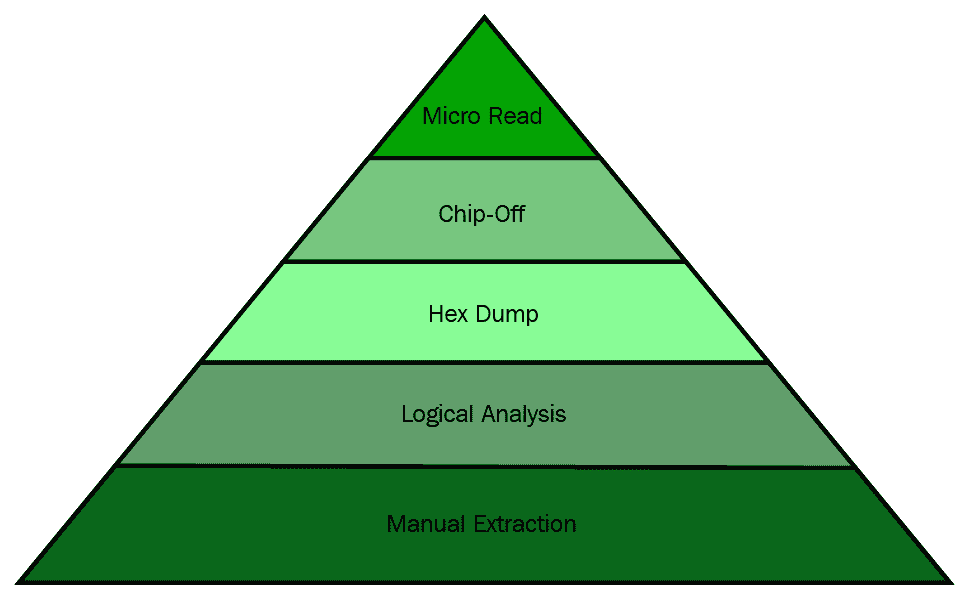

# 第一章：移动取证简介

毫无疑问，移动设备已经成为我们生活的一部分，并彻底改变了我们进行大部分活动的方式。因此，移动设备现在是一个存储有关其所有者的敏感和个人信息的巨大存储库。这反过来导致了移动设备取证的兴起，这是数字取证的一个分支，涉及从移动设备中检索数据。本书将帮助您了解三个主要平台——Android、iOS 和 Windows 上的取证技术。我们将介绍可以用于从不同移动设备收集证据的各种方法。

在本章中，我们将涵盖以下主题：

+   移动取证的需求

+   了解移动取证

+   移动取证中的挑战

+   手机证据提取过程

+   实用的移动取证方法

+   手机上存储的潜在证据

+   检查和分析

+   证据规则

+   良好的取证实践

# 移动取证的需求

根据 Statista 报告([statista.com](http://www.statista.com))，到 2020 年，全球移动电话用户数量预计将超过 50 亿。世界正在目睹从台式机向移动电话的技术和用户迁移。移动市场的大部分增长可以归因于对智能手机的持续需求。

根据爱立信的报告，到 2022 年，全球移动数据流量将达到每月 71 艾字节，而 2017 年为 8.8 艾字节，复合年增长率为 42%。如今的智能手机，如苹果的 iPhone 和三星的 Galaxy 系列，是高性能、大存储和增强功能的计算机的紧凑形式。手机是用户访问的最个人化的电子设备。它们用于执行简单的通信任务，如打电话和发短信，同时还支持互联网浏览、电子邮件、拍照和录像、创建和存储文件、使用 GPS 服务识别位置以及管理业务任务。

随着新功能和应用程序被整合到手机中，设备上存储的信息量不断增加。

手机已成为便携式数据载体，跟踪您的所有活动。随着手机在人们日常生活和犯罪中的普及，从手机获取的数据已成为犯罪、民事甚至重大案件调查的宝贵证据来源。几乎没有进行数字取证调查而不包括手机的情况。手机通话记录和 GPS 数据曾被用于帮助解决 2010 年纽约时代广场的汽车炸弹袭击。

案件的详细信息可在[`www.forensicon.com/forensics-blotter/cell-phone-email-forensics-investigation-cracks-nyc-times-square-car-bombing-case/`](https://www.forensicon.com/forensics-blotter/cell-phone-email-forensics-investigation-cracks-nyc-times-square-car-bombing-case/)找到。

从手机中恢复数字证据背后的科学被称为移动取证，我们将在下一节中进行探讨。数字证据被定义为存储在电子设备上、接收到的或传输的信息和数据，用于调查。数字证据包括可以作为案件证据的任何和所有数字数据。

# 了解移动取证

数字取证是法庭科学的一个分支，专注于恢复和调查存储在电子或数字设备中的原始数据。该过程的目标是从数字设备中提取和恢复任何信息，而不改变设备上的数据。多年来，随着计算机和其他各种数字设备的快速增长，数字取证也在不断发展。根据涉及的数字设备类型，数字取证有各种分支，如计算机取证、网络取证和移动取证。

移动取证是数字取证的一个分支，涉及从移动设备中获取和恢复证据。在数字取证社区中，"取证合规"是一个广泛使用的术语，用来证明和证明特定的取证技术或方法的使用。驱动合规取证检查的核心原则之一是原始证据不能以任何形式被更改。这在移动设备上是非常困难的。一些取证工具需要与移动设备进行通信，因此在取证过程中标准的写保护将无法起作用。

其他取证方法可能涉及在提取数据进行取证检查之前，从移动设备上拆下芯片或安装自定义引导加载程序。在无法在不改变设备配置的情况下进行检查或数据获取的情况下，必须仔细测试和记录程序和更改以供以后参考。遵循正确的方法和指南在检查移动设备方面至关重要，因为这样做可以获得最有价值的数据。与任何证据收集一样，在检查过程中不遵循正确的程序可能导致证据的丢失或损坏，或者使其在法庭上不可接受。

移动取证过程分为三个主要类别——扣押、获取和检查/分析。在扣押移动设备作为证据来源时，取证员面临一些挑战。在犯罪现场，如果发现手机已经关闭，你作为检验员应该将设备放入法拉第袋中，以防止设备自动开机时发生变化。法拉第袋专门设计用于将手机与网络隔离。

如果发现手机已经开机，关闭它会引发很多问题。如果手机被 PIN 码或密码锁定，或者加密，你需要绕过锁定或确定 PIN 码才能访问设备。手机是网络设备，可以通过不同的来源发送和接收数据，比如电信系统、Wi-Fi 接入点和蓝牙。因此，如果手机处于开机状态，犯罪分子可以通过执行远程擦除命令安全地擦除手机上存储的数据。当手机开机时，应该放在法拉第袋中。如果可能的话，在将移动设备放入法拉第袋之前，你应该断开它与网络的连接，以启用飞行模式并禁用所有网络连接（Wi-Fi、GPS、热点等）来保护证据。这也将保护电池，因为在法拉第袋中电池会耗尽，并且防止法拉第袋泄漏。一旦移动设备被妥善扣押，检验员可能需要多种取证工具来获取和分析手机上存储的数据。

移动设备取证可以使用多种方法进行，这些方法将在后面进行定义。每种方法都会影响所需的分析量，这将在接下来的章节中进行更详细的讨论。如果一种方法失败，必须尝试另一种方法。可能需要多次尝试和工具才能从移动设备中获取最大量的数据。

手机是动态系统，对我们在提取和分析数字证据方面提出了许多挑战。不同制造商生产的各种手机数量的迅速增加使得很难开发出一个单一的过程或工具来检查所有类型的设备。手机不断发展，现有技术不断进步，新技术不断推出。此外，每部手机都设计有各种嵌入式操作系统。因此，取证专家需要特殊的知识和技能来获取和分析这些设备。

# 移动取证的挑战

在移动平台上最大的取证挑战之一是数据可以在多个设备之间访问、存储和同步。由于数据是易失性的，可以迅速转换或远程删除，因此需要更多的努力来保护这些数据。移动取证与计算机取证不同，并对取证人员提出了独特的挑战。

执法部门和取证人员经常在获取移动设备的数字证据方面遇到困难。以下是其中一些原因：

+   **硬件差异**：市场上充斥着来自不同制造商的不同型号的手机。取证人员可能会遇到不同类型的手机型号，这些型号在尺寸、硬件、功能和操作系统上有所不同。此外，由于产品开发周期较短，新型号经常出现。随着移动设备景观每天都在变化，对于您来说，适应所有挑战并保持对各种设备上的移动设备取证技术的更新至关重要。

+   移动操作系统：与个人计算机不同，Windows 多年来一直主导市场，移动设备广泛使用更多的操作系统，包括苹果的 iOS，谷歌的 Android，RIM 的黑莓 OS，微软的 Windows Phone OS，惠普的 webOS 等。即使在这些操作系统中，也有几个版本，这使得您的任务变得更加困难。

+   **移动平台安全功能**：现代移动平台包含内置的安全功能，用于保护用户数据和隐私。这些功能在取证获取和检查过程中起到了障碍作用。例如，现代移动设备从硬件层到软件层都配备了默认加密机制。您可能需要突破这些加密机制才能从设备中提取数据。FBI 与苹果的加密争端在这方面是一个分水岭时刻，苹果的安全实施阻止了 FBI 从圣贝纳迪诺案件中一名攻击者的 iPhone 中破解进入。

+   防止数据修改：取证的基本规则之一是确保设备上的数据不被修改。换句话说，从设备中提取数据的任何尝试都不应该改变该设备上的数据。但这在移动设备上实际上是不可能的，因为只要打开设备，就可能改变该设备上的数据。即使设备看起来处于关闭状态，后台进程可能仍在运行。例如，在大多数移动设备中，闹钟即使手机关闭也仍在工作。从一种状态突然转换到另一种状态可能导致数据的丢失或修改。

+   **反取证技术**：反取证技术，如数据隐藏、数据混淆、数据伪造和安全擦除，使数字媒体的调查变得更加困难。

+   密码恢复：如果设备受到密码保护，取证人员需要在不损坏设备上的数据的情况下访问设备。虽然有绕过屏幕锁定的技术，但它们可能并不总是适用于所有版本的操作系统。

+   **资源匮乏**：如前所述，随着手机数量的增加，取证人员所需的工具数量也在增加。取证获取配件，如不同手机的 USB 电缆、电池和充电器，必须得到维护以获取这些设备。

+   **证据的动态性**：数字证据可能会被故意或无意地轻易改变。例如，在手机上浏览应用程序可能会改变设备上由该应用程序存储的数据。

+   **意外重置**：手机提供了重置所有内容的功能。在检查设备时意外重置可能导致数据丢失。

+   设备更改：更改设备的可能方式可能从移动应用程序数据或重命名文件到修改制造商的操作系统。在这种情况下，应考虑嫌疑人的专业知识。

+   **通信屏蔽**：移动设备通过蜂窝网络、Wi-Fi 网络、蓝牙和红外线进行通信。由于设备通信可能会改变设备数据，因此在扣押设备后应排除进一步通信的可能性。

+   **工具不可用**：移动设备种类繁多。需要使用一系列工具的组合，因为单一工具可能不支持所有设备或执行所有必要的功能。因此，选择特定手机的合适工具可能会很困难。

+   **恶意程序**：设备可能包含恶意软件，如病毒或特洛伊木马。这些程序可能会尝试通过有线接口或无线接口传播到其他设备。

+   **法律问题**：移动设备可能涉及跨越地理边界的犯罪。为了解决这些跨辖区问题，法医检查员应熟悉犯罪的性质和地区法律。

让我们在下一节看看证据提取的过程。

# 移动电话证据提取过程

根据各种因素，证据提取和对不同移动设备的法医检查可能有所不同。然而，遵循一致的检查过程将有助于法医检查员确保从每部手机中收集的证据得到充分记录，并且结果可靠。移动取证没有成熟的标准流程。

然而，以下图表提供了从移动设备提取证据的过程考虑因素的概述。从移动设备提取数据时使用的所有方法都应经过测试、验证和充分记录：

移动电话证据提取过程

处理和处理移动设备的重要资源可以在[`digital-forensics.sans.org/media/mobile-device-fo`](http://digital-forensics.sans.org/media/mobile-device-forensic-process-v3.pdf)[rensic-process-v3.pdf](http://digital-forensics.sans.org/media/mobile-device-forensic-process-v3.pdf)找到。

如前图所示，对移动设备的取证包括几个阶段，从证据收集阶段到归档阶段。以下各节将概述各个阶段的各种考虑因素。

# 证据收集阶段

证据收集阶段是起始阶段，涉及捕获所有权信息和移动设备涉及的事件类型的文件工作，并概述请求者正在寻找的数据类型。为每次检查制定具体目标是这个阶段的关键部分。它有助于澄清您的目标。在物理扣押过程开始之前，您应熟悉联邦、州和地方法律，涉及个人权利。如果不遵循正确的程序，调查可能在法庭上被视为非法。程序和合法性可能会根据您是政府代理还是私人方而有所不同。例如，在美国，**第四修正案**权利阻止政府代理在没有适当搜查令的情况下进行任何搜查或扣押。搜查令应明确授权扣押移动设备以及需要收集的数据类型。成功扣押后，应注意确保不仅为设备建立责任链，还为收集的数据建立责任链。

根据 NIST（https://csrc.nist.gov/）的说法，责任链是指通过记录每个处理证据的人员、收集或转移的日期/时间以及转移目的，跟踪证据在收集、保护和分析生命周期中的移动的过程。

此外，在扣押设备时，应注意不要修改设备上的任何数据。同时，不应错过任何帮助调查的机会。例如，在扣押设备时，如果设备已解锁，则尝试禁用密码。

# 识别阶段

法庭检验员应为每次对移动设备的检查确定以下细节：

+   法律权限

+   需要提取的数据

+   设备的制造商、型号和识别信息

+   数据存储介质

+   其他潜在证据来源

我们将在以下部分讨论每一项。

# 法律权限

对于法庭检验员来说，确定和记录获取和检查设备的法律权限以及在检查设备之前对媒体施加的任何限制是很重要的。例如，如果对设备的调查是基于搜查令进行的，搜索应该仅限于搜查令中定义的区域。简而言之，在扣押设备之前，您需要回答以下问题：

+   如果没有搜查令，设备所有者是否同意进行搜查？

+   如果存在搜查令，设备是否包括在原始搜查令中？

+   如果设备包括在搜查令中，是否还定义了可以收集哪些数据？

+   如果这是一项企业调查，设备是由个人还是雇主所有？

+   企业政策是否允许收集和随后分析？

# 需要提取的数据

您将根据所请求的数据确定检查的深度。检查的目标在选择检查手机的工具和技术方面产生重大影响，并增加了检查过程的效率。

# 设备的制造商、型号和识别信息

作为检查的一部分，识别手机的制造商和型号有助于确定哪些工具适用于该手机。建议在可能的情况下捕获被扣押设备的以下细节：

+   设备制造商

+   设备型号

+   移动设备序列号

+   设备的颜色

+   设备屏幕或锁屏壁纸上可见的壁纸

+   任何硬件组件的存在（如前置摄像头，耳机插孔等）

+   设备的任何特定细节描述（划痕，破损屏幕等）

接下来，让我们看看数据存储介质。

# 数据存储介质

许多手机提供使用可移动存储设备扩展内存的选项。在提交用于检查的移动电话中发现此类可移动介质的情况下，应将存储卡取出并使用传统数字取证技术进行处理。同时也应在移动设备中获取存储卡，以确保手持内存和存储卡上的数据链接，以便更容易进行分析。这将在接下来的章节中详细讨论。

# 其他潜在证据来源

移动电话是指纹和其他生物证据的良好来源。在检查移动电话之前，应收集这些证据，以避免污染问题，除非收集方法会损坏设备。检验员在处理证据时应戴手套。

# 准备阶段

一旦确定了手机型号，准备阶段涉及对特定手机进行研究，以及确定用于获取和检查的适当方法和工具。这通常是基于设备型号、底层操作系统、版本等进行的。此外，进行检查时需要使用的工具也必须根据所涉设备以及检查的范围和目标来确定。

# 隔离阶段

手机设计上是通过蜂窝电话网络、蓝牙、红外线和无线（Wi-Fi）网络功能进行通信。当手机连接到网络时，通过来电、短信和应用数据添加新数据到手机上，这会修改手机上的证据。

通过远程访问或远程擦除命令也可以完全销毁数据。因此，在获取和检查设备之前，将设备与通信源隔离是非常重要的。可以通过将手机放入射频屏蔽布中，然后将手机设置为飞行模式来进行网络隔离。飞行模式会禁用设备的通信通道，如蜂窝无线电、Wi-Fi 和蓝牙。但是，如果设备被屏幕锁定，则这是不可能的。此外，由于现在飞机上有 Wi-Fi，一些设备在飞行模式下也可以使用 Wi-Fi。

另一种解决方案是使用法拉第袋隔离手机，它可以阻断手机发出或接收的无线电信号。法拉第袋包含可以阻挡外部静电场（包括无线电波）的材料。因此，法拉第袋可以保护扣押的移动设备免受外部干扰，防止擦除和追踪。为了更方便地处理扣押的设备，还有法拉第帐篷和房间。

# 处理阶段

一旦手机与通信网络隔离，就开始对手机进行实际处理。在这个阶段你将面临的挑战之一是确定使用哪些工具，因为这受到多种因素的影响，如价格、易用性、适用性等。手机取证软件价格昂贵，与计算机取证不同，有时可能需要使用多种工具来访问数据。在选择工具时，确保它具有内置功能以保持取证完整性。保持取证完整性需要一个将收集的数据打包成可能不容易修改或更改的格式的工具。

手机应该使用经过测试的、可重复的、尽可能具有取证价值的方法进行获取。物理获取是首选方法，因为它可以提取原始内存数据，并且在获取过程中设备通常处于关闭状态。在大多数设备上，物理获取期间对设备的更改最少。如果无法进行物理获取或失败，应尝试获取移动设备的文件系统。始终应执行逻辑获取，因为它可能只包含解析后的数据，并提供指针来检查原始内存映像。这些获取方法将在后面的章节中详细讨论。

# 验证阶段

处理完手机后，需要验证从手机提取的数据的准确性，以确保数据未被修改。可以通过多种方式来验证提取的数据的准确性：

+   **比较提取的数据与手机数据**：检查从设备中提取的数据是否与设备显示的数据匹配（如果适用）。提取的数据可以与设备本身或逻辑报告进行比较，以首选为准。请记住，处理原始设备可能会对唯一的证据——设备本身进行更改。

+   **使用多种工具并比较结果**：为了确保准确性，使用多种工具提取数据并比较结果。

+   **使用哈希值：**获取后应对所有图像文件进行哈希处理，以确保数据保持不变。如果支持文件系统提取，可以提取文件系统，然后为提取的文件计算哈希值。稍后，计算并检查任何单独提取的文件哈希值，以验证其完整性。哈希值的任何差异必须能够解释（例如，设备已开机然后再次获取，因此哈希值不同）。

# 记录和报告阶段

法庭检查员需要在整个检查过程中记录与获取和检查相关的一切。一旦完成调查，结果必须经过某种形式的同行评审，以确保数据经过检查并且调查是完整的。你的笔记和文档可能包括以下信息：

+   检查开始日期和时间

+   手机的物理状况

+   手机和各个组件的照片

+   接收时手机状态-开机或关机

+   手机制造商和型号

+   用于获取的工具

+   用于检查的工具

+   检查期间发现的数据

+   同行评审的笔记

在调查过程中，确保从移动设备中提取和记录的信息可以清晰地呈现给任何其他检查员或法庭是非常重要的。文档是你最重要的技能之一。在获取和分析期间创建移动设备数据的法庭报告是很重要的。这可能包括纸质和电子格式的数据。

你的发现必须以一种方式记录和呈现，以便证据在法庭上自证其实。发现应该清晰、简洁和可重复。时间线和链接分析是许多商业移动取证工具提供的功能，将有助于报告和解释跨多个移动设备的发现。这些工具允许你将多个设备之间的通信方法联系在一起。

# 存档阶段

保留从移动电话中提取的数据是整个过程的重要部分。对于持续进行中的法庭程序、将来的参考、当前证据文件损坏时以及记录保存要求，保留数据的可用格式也很重要。法庭案件可能在最终判决之前持续多年，大多数司法管辖区要求数据保留很长时间以供上诉之用。随着领域和方法的进步，可能会出现从原始物理图像中提取数据的新方法，然后你可以通过从档案中提取副本来重新审视数据。

现在我们已经了解了证据提取过程的工作原理，我们将研究实际移动取证的不同方法。

# 实用的移动取证方法

与任何法医调查类似，可以使用几种方法来获取和分析移动电话数据。移动设备的类型、操作系统和安全设置通常决定了法庭程序的遵循。每项调查都有其独特的情况，因此不可能为所有情况设计一个确定的程序性方法。以下详细说明了从移动设备中提取数据所遵循的一般方法。

# 理解移动操作系统

手机数据获取和检查/分析的一个主要因素是操作系统。从低端手机到智能手机，移动操作系统在很多功能上已经发展了很长一段路。移动操作系统直接影响您如何访问移动设备。例如，安卓提供终端级访问，而 iOS 则没有这样的选项。

对移动平台的全面了解有助于取证人员做出明智的取证决策并进行彻底的调查。尽管智能手机设备种类繁多，但随着黑莓的消亡，目前市场上主要有两种操作系统占主导地位，即谷歌安卓和苹果 iOS（远远落后的是 Windows Phone）。更多信息可在[`www.idc.com/promo/smartphone-market-share/os`](https://www.idc.com/promo/smartphone-market-share/os)找到。本书涵盖了这三种移动平台的取证分析。我们将简要介绍主要的移动操作系统。

# 安卓

安卓是基于 Linux 的操作系统，是谷歌为手机开发的开源平台。安卓是世界上使用最广泛的智能手机操作系统。资料显示，苹果的 iOS 排名第二([`www.idc.com/promo/smartphone-market-share/os`](https://www.idc.com/promo/smartphone-market-share/os))。安卓由谷歌开发，作为硬件制造商和手机运营商的开放和免费选择。这使得安卓成为那些需要低成本、可定制、轻量级操作系统的公司的首选软件，而无需从头开始开发新的操作系统。

安卓的开放性进一步鼓励开发人员构建大量应用程序并将其上传到 Google Play。随后，最终用户可以从 Android Market 下载这些应用程序，这使得安卓成为一个强大的操作系统。据估计，截至撰写本书时，Google Play 商店有 330 万款应用程序。有关安卓的更多详细信息，请参阅第七章《了解安卓》。

# iOS

iOS，以前被称为 iPhone 操作系统，是由苹果公司独家开发和分发的移动操作系统。iOS 正在演变成苹果所有移动设备的通用操作系统，如 iPad、iPod Touch 和 iPhone。iOS 源自 macOS，因此基于类 Unix 操作系统。iOS 管理设备硬件。iOS 还提供了实现本地应用程序所需的技术。它还附带各种系统应用程序，如邮件和 Safari，为用户提供标准的系统服务。iOS 本地应用程序通过 App Store 分发，该商店受到苹果的严格监控。有关 iOS 的更多详细信息，请参阅第二章《了解 iOS 设备的内部》。

# Windows Phone

Windows Phone 是由微软为智能手机和口袋 PC 开发的专有移动操作系统。它是 Windows Mobile 的继任者，主要面向消费市场而不是企业市场。Windows Phone 操作系统类似于 Windows 桌面操作系统，但它经过优化，适用于存储空间较小的设备。在《Windows Phone 取证》第十二章中讨论了 Windows Phone 的基础知识和取证技术。

# 移动取证工具分级系统

手机取证获取和分析需要手动操作和使用自动化工具。有各种工具可用于进行手机取证。所有工具都有其优缺点，重要的是要理解没有单一工具能够满足所有目的。因此，了解各种类型的手机取证工具对取证人员至关重要。

在确定用于移动电话取证获取和分析的适当工具时，Sam Brothers 开发的移动设备取证工具分类系统（如下图所示）对检查员非常有用：

手机工具分级金字塔（Sam Brothers，2009）

移动设备取证工具分类系统的目标是使检查员能够根据工具的检查方法对取证工具进行分类。当您从金字塔底部向顶部移动时，用于分析的方法和工具通常变得更加技术和复杂，并需要更长的分析时间。在每个层面使用的不同技术的优缺点。在应用特定技术之前，取证员应该意识到这些问题。如果给定的方法或工具未正确使用，证据可能会被完全销毁。随着金字塔的上升，这种风险会增加。因此，需要适当的培训才能获得从移动设备中提取数据的最高成功率。

每个现有的移动取证工具都可以归类为五个级别中的一个或多个。以下各节包含了对每个级别的详细描述。

# 手动提取

手动提取方法只是通过浏览设备上的数据并直接通过设备的键盘或触摸屏查看手机上的数据。然后发现的信息被摄影记录下来。提取过程快速且易于使用，并且几乎适用于每部手机。这种方法容易出现人为错误，例如由于对界面不熟悉而错过某些数据。在这个级别，无法恢复已删除的信息并获取所有数据。

有一些工具，例如 Project-A-Phone，已经开发出来帮助检查员轻松记录手动提取。然而，这也可能导致数据的修改。例如，查看未读短信将标记为已读。

# 逻辑分析

逻辑分析涉及将移动设备通过 USB 电缆、RJ-45 电缆、红外线或蓝牙连接到取证硬件或取证工作站。连接后，计算机启动命令并将其发送到设备，然后由设备的处理器解释。接下来，请求的数据从设备的内存中接收并发送回取证工作站。稍后，您可以查看数据。

目前大多数可用的取证工具都在这个分类系统的这个级别上工作。提取过程快速且易于使用，对您来说需要很少的培训。另一方面，该过程可能会向移动设备写入数据，并可能改变证据的完整性。此外，使用此程序通常无法访问已删除的数据。

# 十六进制转储

十六进制转储，也称为物理提取，是通过将设备连接到取证工作站，并将未签名的代码或引导加载程序推送到手机，并指示手机将内存从手机转储到计算机来实现的。由于生成的原始图像是以二进制格式，需要技术专业知识来分析它。这个过程成本低廉，为检查员提供了更多的数据，并允许从大多数设备的未分配空间中恢复已删除的文件。

# 芯片取下

芯片脱焊是指直接从设备中的存储芯片获取数据。在这个级别，芯片被物理取出设备，并使用芯片读卡器或第二部手机来提取存储在其中的数据。这种方法在技术上更具挑战性，因为手机中使用了各种芯片类型。该过程昂贵且需要硬件级别的知识，因为它涉及对存储芯片的脱焊和加热。成功执行芯片脱焊需要培训。不当的程序可能损坏存储芯片并使所有数据无法挽救。在可能的情况下，建议在进行芯片脱焊之前尝试其他提取级别，因为这种方法具有破坏性。此外，从存储器中提取的信息是以原始格式呈现的，必须进行解析、解码和解释。芯片脱焊方法在需要精确保留存储器状态的情况下是首选。当设备损坏但存储芯片完好无损时，这也是唯一的选择。

设备上的芯片通常使用**联合测试动作组**（**JTAG**）方法进行读取。JTAG 方法涉及连接到设备上的**测试访问端口**（**TAPs**），并强制处理器传输存储在存储芯片上的原始数据。JTAG 方法通常与使用标准工具无法访问的操作设备一起使用。这两种技术即使在设备被屏幕锁定时也能工作。

# 微读取

微读取过程涉及手动查看和解释存储芯片上的数据。检查员使用电子显微镜分析芯片上的物理门，然后将门状态转换为 0 和 1 以确定生成的 ASCII 字符。整个过程耗时且昂贵，并且需要对存储器和文件系统有广泛的知识和培训。由于微读取涉及的极端技术性，只有在所有其他提取技术层次耗尽后才会尝试，相当于国家安全危机的重大案件。该过程很少进行，目前也没有很好的记录。此外，目前没有商业工具可用于执行微读取。

# 数据获取方法

数据获取是从数字设备和其他附加媒体中提取信息的过程。从手机中获取数据并不像标准硬盘取证那样简单。以下是对手机取证方法的三种类型：物理、逻辑和手动的详细描述。这些方法可能与移动取证工具分级系统中讨论的几个级别有一些重叠。可以收集的数据量和类型将取决于所使用的获取方法的类型。虽然我们将在接下来的章节中详细介绍这些方法，但以下是对它们的简要描述。

# 物理获取

移动设备的物理获取只是对物理存储的逐位复制。通过直接访问闪存，可以通过物理提取从设备中获取信息。闪存是非易失性存储器，主要用于存储卡和 USB 闪存驱动器作为固态存储。该过程创建了整个文件系统的逐位复制，类似于计算机取证调查中采取的方法。物理获取能够获取设备上的所有数据，包括已删除的数据，并访问大多数设备上的未分配空间。

# 逻辑获取

逻辑获取是指提取逻辑存储对象，例如文件和目录，这些对象驻留在文件系统上。使用设备制造商的应用程序编程接口来同步手机内容与计算机，可以执行手机的逻辑获取。许多取证工具可以执行逻辑获取。对于取证工具来说，通过逻辑获取提取的数据更容易组织和呈现。然而，取证分析师必须了解获取是如何进行的，以及在过程中手机是否被修改。根据手机和取证工具的不同，可能会获取全部或部分数据。逻辑获取很容易执行，只能恢复手机上的文件，而不能恢复未分配空间中的数据。

# 手动获取

对于手机，物理获取通常是最佳选择，逻辑获取是次佳选择。在进行手机取证获取时，手动提取应该是最后的选择。逻辑和手动获取都可以用来验证物理数据的发现。在手动获取期间，取证人员利用用户界面调查手机内存的内容。设备通过键盘或触摸屏和菜单导航正常使用，取证人员拍摄每个屏幕内容的照片。手动提取引入了更大程度的风险，即人为错误的形式，并且存在删除证据的可能性。手动获取很容易执行，只能获取手机上显示的数据。

接下来，让我们看看可以从手机中提取的信息量。

# 手机存储的潜在证据

手机可以获取的信息范围在本节中有详细介绍。手机上的数据可以在多个位置找到——例如 SIM 卡、外部存储卡和手机内存。此外，服务提供商还存储了与通信相关的信息。本书主要关注从手机内存中获取的数据。移动设备数据提取工具可以从手机内存中恢复数据。尽管在取证获取期间恢复的数据取决于手机型号，但通常以下数据在所有型号中都是常见的，并且作为证据很有用。请注意，以下大部分物件都包含时间戳：

+   地址簿：这包含了联系人姓名、电话号码、电子邮件地址等。

+   通话记录：这包含了拨出、接收和未接来电以及通话时长。

+   短信：这包含了发送和接收的短信。

+   MMS：这包含了发送和接收的照片和视频等媒体文件。

+   电子邮件：这包含了发送、草稿和接收的电子邮件消息。

+   网络浏览器历史：这包含了访问过的网站的历史记录。

+   照片：这包含了使用手机摄像头拍摄的照片，从互联网下载的照片以及从其他设备传输的照片。

+   视频：这包含了使用手机摄像头拍摄的视频，从互联网下载的视频以及从其他设备传输的视频。

+   音乐：这包含了从互联网下载的音乐文件以及从其他设备传输的音乐文件。

+   文档：这包含了使用设备应用程序创建的文档，从互联网下载的文档以及从其他设备传输的文档。

+   日历：这包含了日历条目和约会。

+   网络通信：这包含了 GPS 位置。

+   地图：这包含了用户访问过的地点、查找的方向以及搜索和下载的地图。

+   社交网络数据：这包含了 Facebook、Twitter、LinkedIn、Google+和 WhatsApp 等应用程序存储的数据。

+   已删除的数据：这包含了从手机中删除的信息。

接下来，我们将快速查看调查的最后一步：检查和分析。

# 检查和分析

这是调查的最终步骤，旨在揭示设备上存在的数据。检查是通过应用经过充分测试和科学的方法来得出结果。分析阶段侧重于从其余数据中分离相关数据，并探索对基础案件有价值的数据。检查过程始于使用先前描述的一些技术获取的证据副本，这将在接下来的章节中详细介绍。使用第三方工具进行检查和分析通常是通过将设备的内存转储导入到移动取证工具中，该工具将自动检索结果。了解案件对执行数据的有针对性分析也至关重要。例如，关于儿童色情的案件可能需要关注设备上的所有图像，而不是查看其他工件。

重要的是，您要对用于检查的法医工具的工作原理有一个公平的了解。熟练使用工具中可用的功能和选项将大大加快检查过程。有时，由于软件中的编程缺陷，工具可能无法识别或将位转换为您可以理解的格式。因此，您必须具备识别这种情况并使用替代工具或软件构建结果的必要技能。在某些情况下，个人可能会故意篡改设备信息或删除/隐藏一些关键数据。法医分析人员应了解其工具的局限性，并有时需要补偿这些局限性以获得最佳结果。

# 证据规则

法庭越来越依赖手机内部的信息作为重要证据。法庭上的主要证据需要对证据规则有很好的理解。移动取证是一个相对较新的学科，规定证据有效性的法律并不广为人知，而且在国家之间也有所不同。然而，数字取证有五条普遍的证据规则，需要遵循以使证据有用。忽视这些规则会使证据不可采纳，您的案件可能会被驳回。这五条规则是**可采纳**，**真实**，**完整**，**可靠**和**可信**。

+   **可采纳**：这是最基本的规则，也是证据有效性和重要性的衡量标准。证据必须以一种能够在法庭或其他地方使用的方式被保留和收集。可能会出现许多错误，这些错误可能导致法官裁定某些证据不可采纳。例如，使用非法方法收集的证据通常被裁定为不可采纳。

+   **真实**：证据必须以相关方式与事件联系起来以证明某事。法医检查人员必须对证据的来源负责。

+   **完整**：当提出证据时，必须清晰完整，并应反映整个故事。收集仅显示事件一个角度的证据是不够的。呈现不完整的证据比根本不提供任何证据更危险，因为它可能导致不同的判断。

+   **可靠**：从设备收集的证据必须是可靠的。这取决于所使用的工具和方法。使用的技术和收集的证据不得对证据的真实性产生怀疑。如果您使用了一些无法复制的技术，除非那些考虑证据的人，如法官和陪审团，被指示这样做，否则不认为证据有效。这可能包括可能具有破坏性的方法，如芯片脱落提取。

+   **可信度**：取证人员必须能够清晰简洁地解释他们使用了哪些过程以及如何保持了证据的完整性。您提出的证据必须清晰、易于理解，并且陪审团必须相信。

现在让我们看看最佳实践。

# 良好的取证实践

良好的取证实践适用于证据的收集和保留。缺乏健全的取证实践甚至可能使法庭上收集的证据变得无用。证据的修改，无论是故意的还是意外的，都可能影响案件。因此，了解最佳实践对于取证人员至关重要。

# 保护证据

随着*查找我的 iPhone*和远程擦除等先进的智能手机功能，以一种无法远程擦除的方式保护手机非常重要。此外，当手机开机并具有服务时，它会不断接收新数据。为了保护证据，使用正确的设备和技术将手机与所有网络隔离开来。通过隔离，手机将被阻止接收任何可能导致删除活动数据的新数据。根据案件的不同，可能需要采用其他取证技术，如指纹匹配，以建立设备与所有者之间的联系。如果设备未经安全处理，物理证据可能会在无意中被篡改，并可能变得无用。

还重要的是收集现场发现的任何外围设备、相关媒体、电缆、电源适配器和其他附件。在调查现场，如果发现设备连接到个人计算机，直接拔出会停止数据传输。相反，建议在拔出设备之前捕获个人计算机的内存，因为在许多情况下，这包含重要细节。

# 保留证据

在收集证据时，必须将其保存在法庭可接受的状态。直接在原始证据副本上工作可能会改变它。因此，一旦您恢复了原始磁盘映像或文件，就创建一个只读主副本并进行复制。为了使证据被接受，必须有一种科学方法来验证提交的证据与原始收集的证据完全相同。这可以通过创建图像的取证哈希值来实现。

取证哈希用于通过计算图像/数据的密码强度和不可逆转的值来确保获取的完整性。

在复制原始磁盘映像或文件后，计算并验证原始副本的哈希值，以确保证据的完整性得到维护。任何哈希值的更改都应该被记录下来并加以解释。所有进一步的处理或检查都应该在证据的副本上进行。对设备的任何使用都可能改变存储在手机上的信息。因此，只执行绝对必要的任务。

# 记录证据和更改

在可能的情况下，应创建所有可见数据的记录。建议拍摄移动设备以及发现的任何其他媒体，如电缆、外围设备等。如果以后关于环境出现问题，这将是有帮助的。在拍摄移动设备时不要触摸或放手。确保记录用于收集和提取证据的所有方法和工具。详细记录您的笔记，以便另一名取证人员可以重现它们。您的工作必须是可重现的；如果不是，法官可能会裁定其不可接受。重要的是记录整个恢复过程，包括获取和检查过程中所做的所有更改。例如，如果用于数据提取的取证工具切割了磁盘映像以存储它，这必须被记录下来。应在案件记录中记录移动设备的所有更改，包括开关机和同步等。

# 报告

报告是准备审查过程中所采取的所有步骤和结论的详细摘要的过程。报告应包括您执行的所有重要操作的详细信息，获取结果以及从结果中得出的任何推论。大多数取证工具都配备了内置的报告功能，可以自动生成报告，同时也提供了定制的空间。一般来说，报告可能包括以下细节：

+   报告机构的详细信息

+   案件标识符

+   取证调查员

+   提交者的身份

+   证据接收日期

+   用于审查的设备的详细信息，包括序列号、制造商和型号

+   审查中使用的设备和工具的详细信息

+   审查过程中所采取的步骤描述

+   责任链文件

+   发现或识别的问题的详细信息

+   在审查过程中收集的证据，包括聊天消息、浏览器历史记录、通话记录、已删除消息等

+   审查过程中捕获的任何图像

+   审查和分析信息

+   报告结论

# 摘要

现代移动设备存储着各种信息，如短信、通话记录、浏览器历史记录、聊天消息、位置详情等。因此，它们经常是几起刑事案件、事件重建、公司和法律案件等的关键因素。移动设备取证也面临着传统数字取证范围之外的挑战和概念。在处理设备时，从证据收集阶段到存档阶段都需要极度小心。负责移动设备的审查人员必须了解不同的获取方法以及在分析过程中处理数据的复杂性。从移动设备中提取数据只是战斗的一半。操作系统、安全功能和智能手机类型将决定您对数据的访问权限。在调查过程中，遵循良好的取证实践并确保证据在调查过程中未被篡改是非常重要的。

下一章将深入介绍 iOS 取证。您将了解文件系统布局、安全功能以及 iOS 设备上文件存储的方式。
