# 第三章：iOS 设备的数据采集

从犯罪现场找到的 iOS 设备可能是证据的丰富来源。想想智能手机对用户来说有多么私人化；没有其他数字设备能够与之相提并论。我们很少离开家或者在家附近走动时不离开我们的智能手机。它实际上是一个窥视人类最私人方面的东西，几乎就像我们日常活动的日记。根据几个新闻报道，奥斯卡·皮斯托里斯的 iPad 被一位移动专家检查，并在他的审判中展示，以展示他女友去世前几个小时的互联网活动。当 iOS 设备可以提供所谓的“关键证据”时，作为检查员，您必须确保自己知道如何正确处理、获取和分析设备。

有多种方法可以从 iOS 设备中获取取证数据。尽管每种方法都有其优势和劣势，但任何获取方法的基本原则是尽可能获取尽可能多的数据。

在本章中，我们将涵盖以下主题：

+   iOS 设备的操作模式

+   密码保护和潜在的绕过

+   逻辑采集

+   文件系统获取

# iOS 设备的操作模式

在深入研究取证技术和获取方法之前，了解 iOS 设备的不同操作模式非常重要。许多取证工具和方法要求您将设备置于其中一个操作模式。了解 iOS 设备的操作模式是执行设备上的特定操作所必需的。

尽管大多数商业工具将演示将设备置于特定模式的正确步骤，但您必须了解该模式代表什么。iOS 设备能够以不同的操作模式运行：正常模式、恢复模式和**设备固件更新**（DFU）模式。一些取证工具要求您知道设备当前使用的模式。我们将在本节中定义每种模式。

请注意，当提到*iPhone*时，应理解该说法对所有 iOS 设备都适用。

# 正常模式

当 iPhone 打开时，它的操作系统被引导；这种模式称为正常模式。在 iPhone 上执行的大多数常规活动（通话、发短信等）都将在正常模式下运行。

当 iPhone 打开时，内部上，它会通过一个*安全引导链*，如下图所示。越狱设备不会发生这种情况。引导过程中的每个步骤都包含由苹果加密签名的软件组件，以确保完整性：

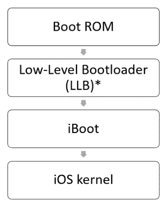

iPhone 在正常模式下的安全引导链

*引导 ROM 然后验证低级引导加载程序（LLB）是否由苹果签名并加载它。LLB 由引导 ROM 加载和验证，但这仅发生在 A9 或更早的 A 系列处理器设备上

*引导 ROM*，也称为*安全 ROM*，是**只读存储器**（ROM）的第一个重要代码片段，它在 iPhone 上运行（[`www.apple.com/business/docs/iOS_Security_Guide.pdf`](https://www.apple.com/business/docs/iOS_Security_Guide.pdf)）。iOS 设备的引导过程在以下步骤中定义：

1.  引导 ROM 代码包含苹果根**证书颁发机构**（CA）公钥，用于在允许加载之前验证下一阶段的签名。

1.  当 iPhone 启动时，应用处理器执行引导 ROM 的代码。

1.  然后，引导 ROM 验证**低级引导加载程序**（LLB）是否由苹果签名并加载它。LLB 由引导 ROM 加载和验证，但这仅发生在 A9 或更早的 A 系列处理器设备上。

1.  当 LLB 完成其任务时，它会验证并加载第二阶段引导加载程序（iBoot）。iBoot 验证并加载 iOS 内核。

1.  iOS 内核然后验证并运行所有用户应用程序。

当 iOS 设备处于此状态时，可以通过取证获取用户可访问的部分。通常情况下，这包括逻辑获取，稍后将在本章中讨论。

# 恢复模式

在启动过程中，如果一步无法加载或验证下一步，则启动过程将停止，并且 iPhone 将显示以下截图中显示的屏幕：


iOS 设备恢复模式

此模式称为恢复模式，用于执行 iPhone 的升级或恢复。要进入恢复模式，请执行以下步骤：

1.  关闭设备。

1.  按住 iPhone 的 Home 按钮，并通过 USB 电缆将设备连接到计算机。设备应该会开机。

1.  继续按住 Home 按钮，直到出现“连接到 iTunes”屏幕。然后，您可以释放 Home 按钮（在越狱的 iOS 设备上，此屏幕可能显示不同的图标）。大多数取证工具和提取方法都会提醒您关于 iOS 设备当前状态的信息。

1.  要退出恢复模式，请重新启动 iPhone。在 iPhone 6s 及更早版本上，可以通过按住 Home 和睡眠/电源按钮直到出现苹果标志来完成此操作。在 iPhone 7 和 iPhone 7 Plus 上，可以通过同时按住侧面按钮和音量减小按钮来完成此操作。在 iPhone 8 及更高版本上，可以通过点击音量增大按钮，然后点击音量减小按钮，然后按住侧面按钮来完成此操作。

您可以在[`support.apple.com/en-in/HT201263`](https://support.apple.com/en-in/HT201263)上阅读有关 iOS 设备恢复模式的更多信息。

通常，重新启动的过程将使 iPhone 从恢复模式返回到正常模式。这种方法也适用于 Apple Watch。您可能会遇到 iPhone 不断重新启动进入恢复模式的情况。这称为恢复循环。当用户或检查员尝试越狱 iOS 设备并出现错误时，可能会发生恢复循环。要使设备退出恢复循环，必须将设备连接到 iTunes，以便可以将备份恢复到设备上。

这会对证据进行更改，因此请确保在尝试在真实证据上使用方法之前，已经在测试设备上验证了您的获取方法。

# DFU 模式

在启动过程中，如果引导 ROM 无法加载或验证 LLB 或 iBoot（在较新的设备上），iPhone 将进入**设备固件升级**（**DFU**）模式。DFU 模式是一种低级诊断模式，旨在为 iPhone 执行固件升级。

要进入 DFU 模式，请按照以下步骤进行 iPhone 8 及更高版本：

1.  通过 USB 电缆将设备连接到您的工作站。

1.  按下音量增大按钮并快速释放它。

1.  按住音量减小按钮并快速释放它。

1.  按住侧面按钮并再次按下音量减小按钮。

1.  5 秒后，释放侧面按钮，但继续按住音量减小按钮，直到看到恢复屏幕。

按照以下步骤进行 iPhone 7：

1.  通过 USB 电缆将设备连接到您的工作站。

1.  同时按住侧面和音量减小按钮。

1.  释放侧面按钮，但继续按住音量减小按钮，直到看到恢复屏幕。

按照以下步骤进行 iPhone 6s 及更早版本：

1.  通过 USB 电缆将设备连接到您的工作站。

1.  同时按住 Home 和顶部（或侧面）按钮。

1.  释放顶部（或侧面）按钮，继续按住 Home 按钮。

在 iPhone 6s 及更早版本上，当设备处于 DFU 模式时，屏幕上不会显示任何内容。

要验证 iPhone 在 macOS 上是否处于 DFU 模式，请启动“系统报告”，然后转到 USB 选项。您应该会看到类似以下截图的内容：

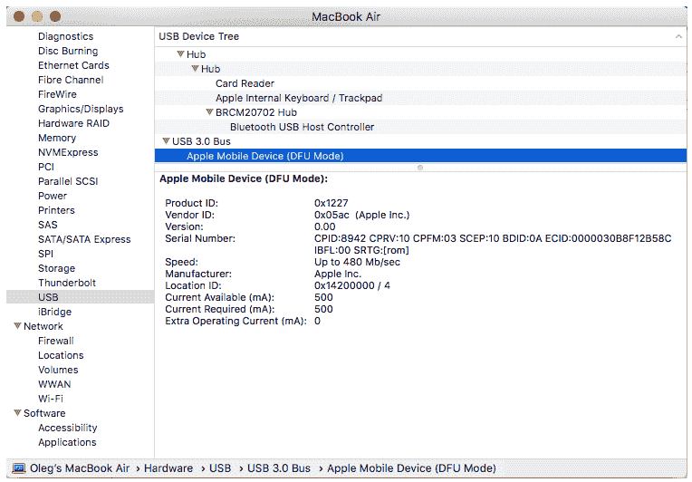

MacBook 系统信息显示处于 DFU 模式的设备

接下来，我们将快速查看设置取证环境所需的工具。

# 设置取证环境

现在，我们有一些工具可以供移动取证人员使用，使用 macOS 和 Windows 系统作为主机来获取和分析 iOS 设备。例如，*Elcomsoft iOS Forensic Toolkit*有 macOS 和 Windows 版本；至于免费和开源工具，`libimobiledevice`库可以使用 - 不仅在 macOS 和 Windows 取证工作站上，甚至在 Linux 上也可以使用！

我们将在本章后面介绍这些工具，并进行实际的逻辑和文件系统获取，甚至越狱。但让我们从密码保护和潜在的绕过开始，因为没有密码，我们无法从现代 iOS 设备中提取任何内容。

# 密码保护和潜在的绕过

我们先说说坏消息：如果你要检查运行 iOS 8 或更新版本的 iPhone，尤其是较新的设备，比如 iPhone 6s，你几乎没有解锁的机会。

当然，也有一些基于硬件的解决方案，比如 IP-BOX 3，但它们都只能偶尔起作用，使用其中一个甚至可能导致设备变砖。随着 iOS 11 的推出，这个问题变得更加严重 - 即使被审查的设备没有密码保护，你也需要输入密码来确认设备和工作站之间的信任关系。

那么，移动取证人员应该怎么做？使用锁定文件！锁定文件存储在*受信任的计算机*上，以`plist`文件的形式存在，可以让你欺骗设备相信它在取证工作站上是解锁的或*受信任的*。

锁定文件位于以下位置：

+   macOS 上的`/var/db/lockdown`

+   Windows 7 及更高版本上的`C:\ProgramData\Apple\Lockdown`

你必须意识到，只有在设备在最后一次重启后至少解锁过一次的情况下，使用锁定文件解锁才有效。

还有一些高级技术存在。这些包括指纹模具来欺骗 Touch ID，面具来欺骗 Face ID，以及 NAND 镜像来绕过密码输入限制。

第一种技术是由 Jason Chaikin 首次展示的。他演示了如何通过使用常见的成型材料，如牙科模具和橡皮泥，提取另一个人的指纹来绕过 Touch ID。

第二种技术是由越南网络安全公司 Bkav 作为概念验证首次展示的。他们制作了一个面具，可以使用三维打印、化妆和二维图像的组合来欺骗 Face ID 功能。

最后一种技术是由剑桥大学计算机实验室安全组的高级研究员 Sergei Skorobogatov 首次展示的。这种技术允许你通过焊接 iPhone 的闪存芯片并克隆它来绕过密码输入限制。这种技术应该适用于 iPhone 6s Plus 及以下的任何 iOS 设备。

# 逻辑获取

逻辑获取捕获了用户可访问的部分内容；换句话说，就是包括在 iTunes 备份中的内容。这意味着我们无法获得任何已删除的文件，但由于 SQLite 数据库的空闲列表和未分配空间，我们可以恢复已删除的记录，包括短信和其他聊天记录，浏览历史等。我们将在《iOS 数据分析和恢复》第五章中讨论恢复 SQLite 数据和已删除的证据。

逻辑获取是确定设备是否解锁的最简单方法，因为它只是使用内置的备份机制。大多数支持 iOS 设备逻辑获取的工具和方法在设备被锁定时会失败。有些人认为，如果捕获了物理镜像，就几乎不需要逻辑获取。然而，并非所有数据都在物理镜像中解析，这就是为什么可以访问逻辑镜像，从而得到可读数据，这将帮助您深入挖掘物理镜像中的证据，以支持您的取证调查。

逻辑获取是获得存储在 iOS 设备上的数据的最快、最简单和最便宜的方法。有各种各样的工具，从商业到免费，都能够捕获逻辑镜像。其中大多数工具要求设备解锁，或者要求主机机器上的`plist`文件可读。

# 使用 libimobiledevice 进行实际逻辑获取

掌握理论是好的，但将其付诸实践更好。让我们创建一个运行 iOS 13.2 的 iPhone 的逻辑镜像，使用`libimobiledevice`，这应该已经安装在您的工作站上，因为我们在上一章中用它进行了设备信息收集。

好的，让我们开始：

1.  首先，让我们加密我们的备份。将 iOS 设备连接到您的工作站并启动命令提示符。将目录更改为包含`libimobiledevice`的目录，并输入以下命令：

```kt
idevicebackup2.exe backup encryption on <your_password>
```

1.  如果看到备份加密已成功启用，则您已经做对了，备份将被加密。这将帮助您，取证人员，获取有关用户密码、Safari 浏览历史等更多信息。

1.  是时候创建备份了——我们的 iOS 设备逻辑镜像。要做到这一点，请输入以下命令：

```kt
idevicebackup2 backup --full <the_folder_you_want_the_image_to_be_saved>
```

就是这样。您可以在以下截图中看到逻辑成像过程：

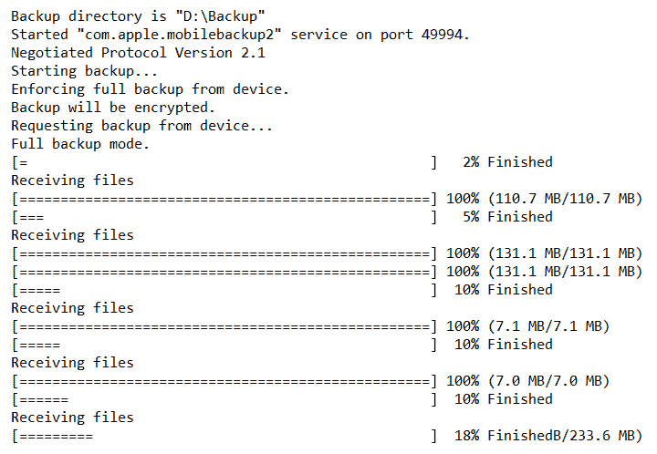

使用 libimobiledevice 进行 iPhone 逻辑成像

接下来，让我们看一下使用 Belkasoft 获取工具进行逻辑获取。

# 使用 Belkasoft 获取工具进行实际逻辑获取

由于逻辑获取是现代 iOS 设备最常见的选项，我们将演示如何使用一些更多的免费工具。第一个是 Belkasoft 获取工具。这个工具不仅可以用于 iOS 设备获取，还可以用于硬盘甚至云数据。

让我们使用 Belkasoft 获取工具获取运行 iOS 13.2.3 的 iPhone：

1.  启动 Belkasoft 获取工具并选择移动设备选项：


选择来源

1.  在下一个窗口中，选择苹果选项：

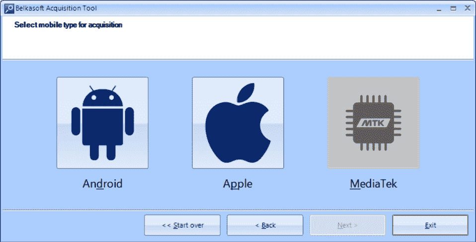

选择移动类型

1.  现在，选择获取方法和镜像路径：


选择获取方法

该工具能够在设备未越狱时创建 iTunes 备份，并在设备越狱时执行文件系统提取。

1.  等待任务成功完成。您将在上一步中选择的文件夹中找到设备的逻辑镜像：

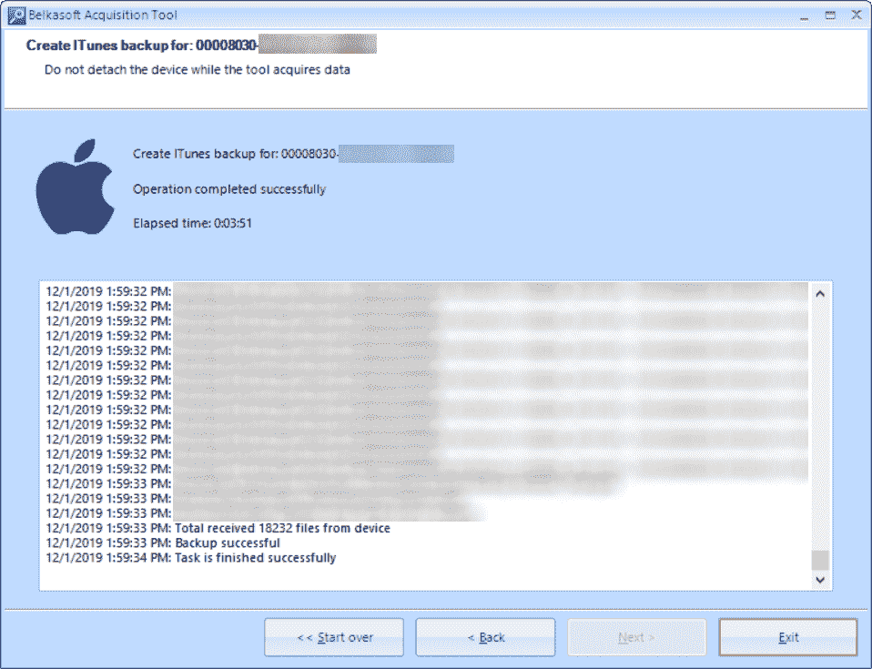

创建备份

备份可以被 Belkasoft 证据中心和许多其他移动取证工具分析。

# 使用 Magnet ACQUIRE 进行实际逻辑获取

另一个能够进行逻辑获取的免费工具是来自 Magnet Forensics 的**ACQUIRE**。让我们再次执行逻辑获取，这次使用运行 iOS 12.2 的设备：

1.  启动 Magnet ACQUIRE 并从列表中选择要镜像的设备：

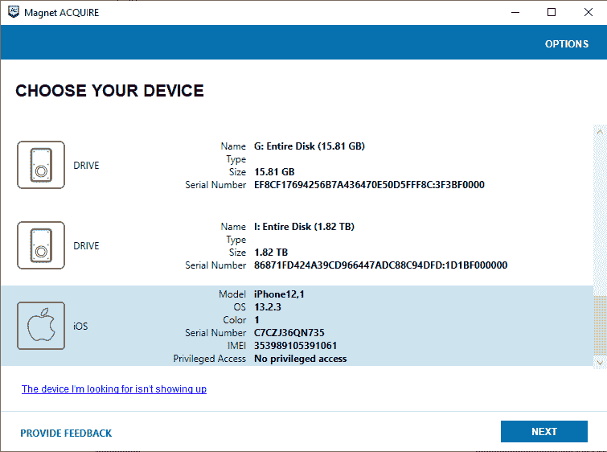

选择设备

1.  选择要获取的镜像类型。我们想获取逻辑镜像，而我们的设备没有越狱，所以我们将选择快速选项：

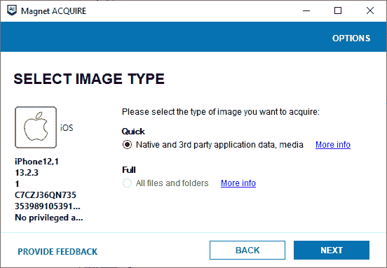

选择图像类型

1.  如果需要，您可以添加证据来源的描述，并选择要保存图像的文件夹：


选择目标文件夹、图像名称和图像信息

1.  等待任务成功完成；您将看到获取过程的摘要：


创建图像

所有提取的数据将保存在 ZIP 存档中的目标文件夹中。此外，目标文件夹还将包含一个带有获取过程日志和图像信息的 TXT 文件。

下一节将指导您进行越狱和文件系统获取。

# 文件系统获取

安全区域给 iOS 取证人员带来了新的挑战。我们无法提取解密设备镜像所需的加密密钥，因此进行物理获取是无用的。但有文件系统获取。不幸的是，在大多数情况下，这需要 iOS 设备越狱。下一节将向您展示如何使用 Electra 越狱运行 iOS 11.4.1 的 iPhone，以及如何使用 Checkra1n 越狱运行 iOS 13.2 的 iPhone。

# 实际越狱

要执行文件系统获取，我们需要我们的 iOS 设备越狱。运行 iOS 11.4.1 的 iOS 设备越狱的步骤如下：

1.  从[`github.com/coolstar/electra-ipas/raw/master/Electra1141-1.3.2.ipa`](https://github.com/coolstar/electra-ipas/raw/master/Electra1141-1.3.2.ipa)下载`Electra`。

1.  下载`Cydia Impactor` ([`www.cydiaimpactor.com/`](http://www.cydiaimpactor.com/))，运行它，并将设备连接到您的工作站：


运行 Cydia Impactor

1.  将`Electra IPA`文件拖放到`Cydia Impactor`窗口中。

1.  在新窗口中输入任何 Apple ID（您可以为您检查的每个设备注册一个新的）。

1.  使用此 Apple ID 登录[`appleid.apple.com/`](https://appleid.apple.com/)，并在安全部分生成一个特定于应用程序的密码。将此密码粘贴到下一个窗口中。等待过程完成。

1.  在手机上，转到设置|通用|设备管理|Apple ID，并点击信任：

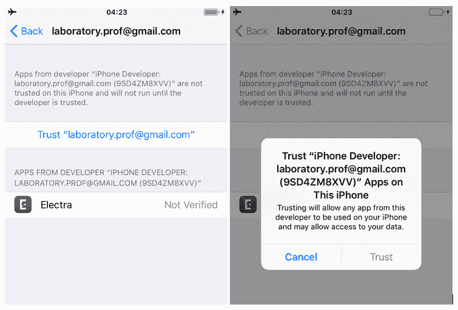

验证开发者

1.  将手机设置为飞行模式，关闭 Siri，并重新启动设备。

1.  在 Springboard 上点击 Electra 图标，然后选择 Jailbreak。如果过程成功完成，你会在 Springboard 上找到 Cydia 图标：

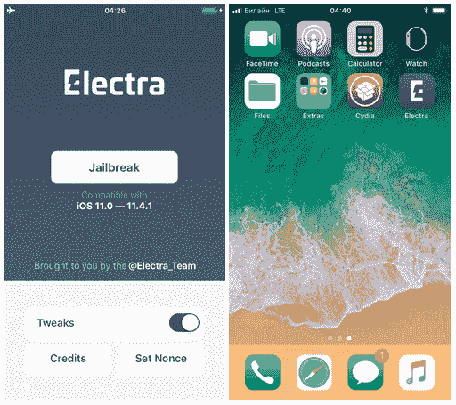

越狱设备

现在，手机已经越狱并准备好进行文件系统获取。

`Checkra1n`基于 bootrom 漏洞和利用，并支持各种 iOS 设备，甚至是运行最新（撰写时）的 iOS 13.2 的设备。以下是运行 iOS 13.2 的 iOS 设备越狱的步骤：

1.  从[`checkra.in/`](https://checkra.in/)下载`Checkra1n`。

1.  运行应用程序。撰写时，`Checkra1n`仅适用于 macOS。

1.  连接设备并将其放入 DFU 模式：


将设备放入 DFU 模式

1.  等待利用过程完成：

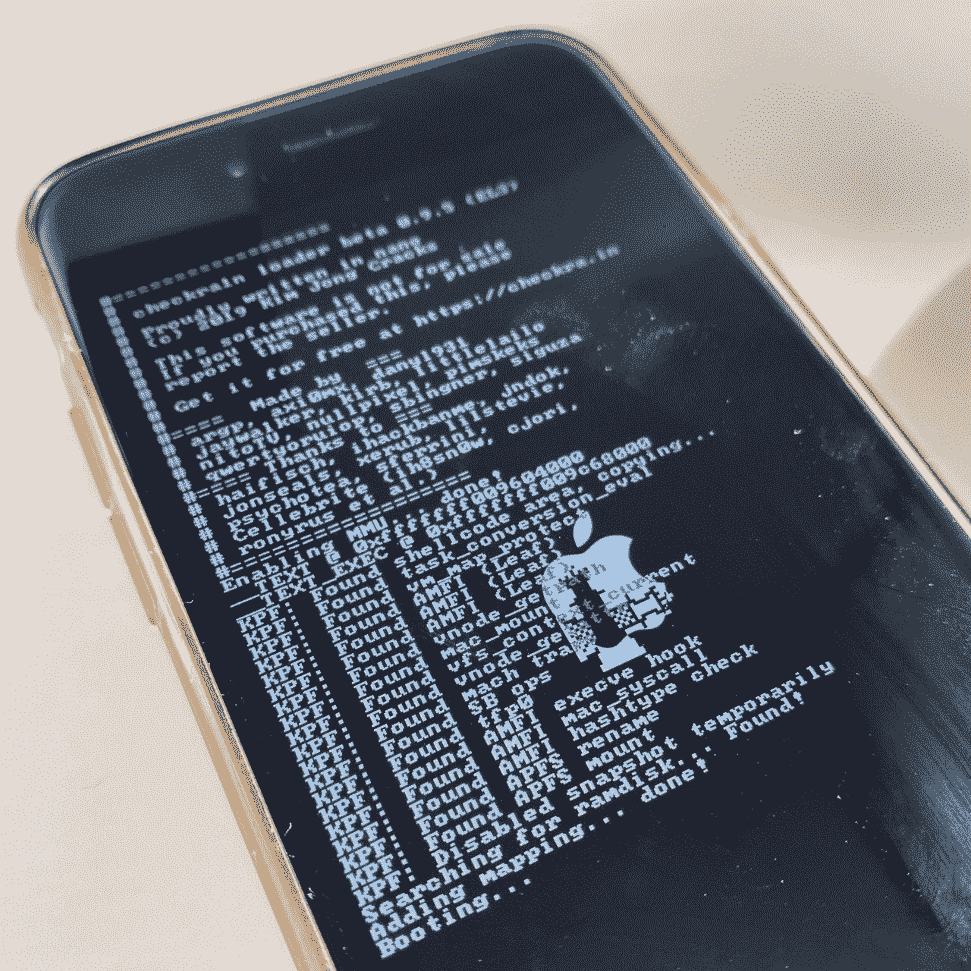

利用过程

一旦设备重新启动，您将在 Springboard 上找到 checkra1n 图标 - 设备现在已经越狱并准备好进行文件系统获取。

有关更多越狱技术，请参阅《第二章》（acc4800c-2775-4ca6-9f5f-e447fa5ac0a8.xhtml）的“越狱”部分，《了解 iOS 设备的内部》。

# 使用免费工具进行实际文件系统获取

是时候进行文件系统获取了。我们只需要`libimobiledevice`中的`iproxy`：

1.  打开命令提示符窗口，并使用以下参数运行`iproxy`：


1.  打开另一个命令提示符窗口，将目录更改为您希望存储图像的目录，并运行以下命令：

```kt
ssh root@127.0.0.1 -p 4444 "tar -cf - /private/var/" > userdata.tar
```

要通过 SSH 连接，您将被提示输入必要的密码。SSH 的默认密码是*alpine*。

一旦过程完成，您将在更改为之前运行上述命令的目录中找到创建的文件系统镜像。它是一个 TAR 存档，可以用许多解档程序打开，比如 7-Zip：

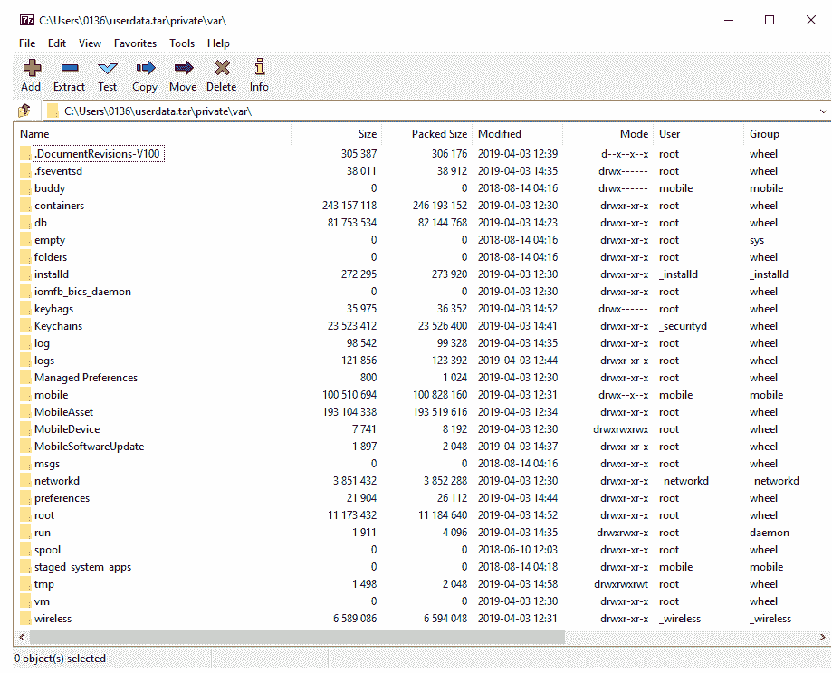

文件系统镜像内容

接下来，让我们看看*Elcomsoft iOS Forensic Toolkit*。

# 使用 Elcomsoft iOS Forensic Toolkit 进行实际文件系统获取

当然，商业工具更加稳定可靠。其中一个能够进行文件系统获取的工具是 Elcomsoft iOS Forensic Toolkit。在这里，我们将获取一个运行 iOS 12.4.3 的越狱 iOS 设备。

这样做的步骤如下：

1.  将设备连接到您的工作站并启动`Toolkit.cmd`。

1.  选择用于 SSH 连接的端口（默认为`22`，但由于我们使用 checkra1n 进行越狱，端口改为`44`），并输入密码（默认为`alpine`）：

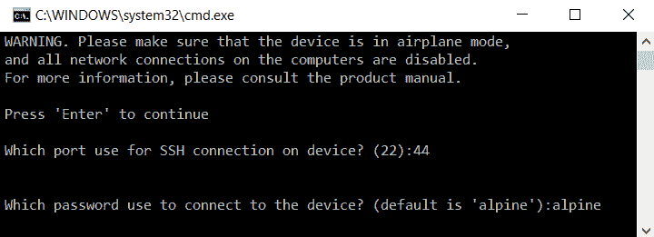

1.  要获取设备文件系统，请键入*F*：

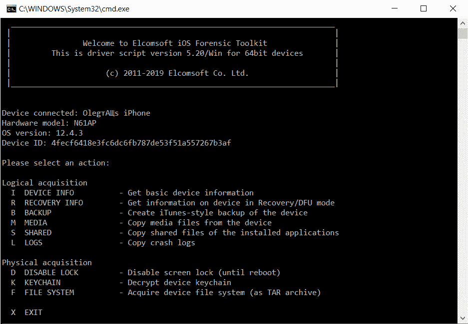

1.  选择图像名称并开始该过程。

一旦过程完成，我们将拥有一个准备好用我们选择的移动取证工具分析的文件系统镜像。

# 摘要

iOS 设备取证检查的第一步是从设备中获取数据。有几种不同的方法可以从 iOS 设备中获取数据。本章涵盖了逻辑和文件系统获取技术，以及越狱和绕过密码的方法。

虽然文件系统获取是从 iOS 设备中取得大部分数据的法医最佳方法，但备份文件可能存在或者是从设备中提取数据的唯一方法。

下一章将详细讨论 iOS 设备备份文件，包括用户、法医、加密和 iCloud 备份文件，以及您可以执行的取证检查方法。
