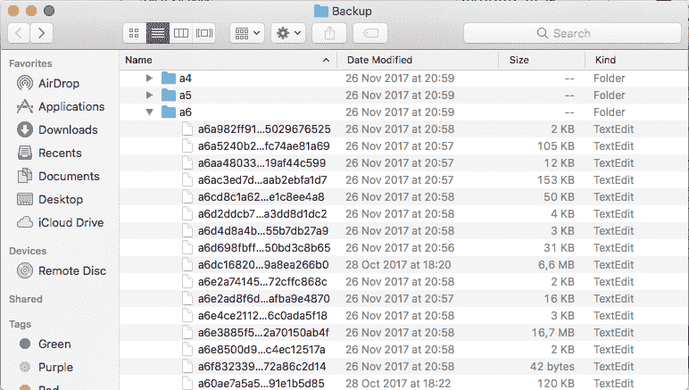
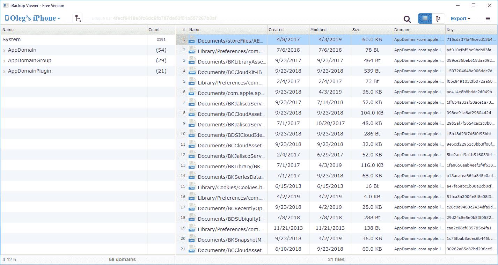
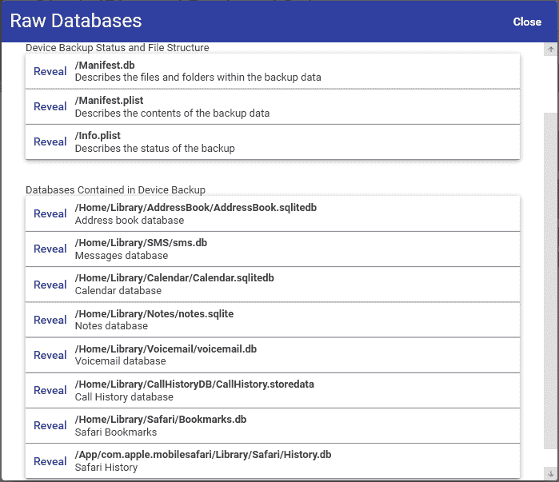
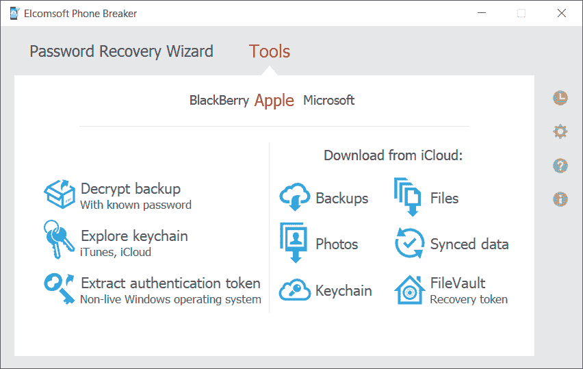
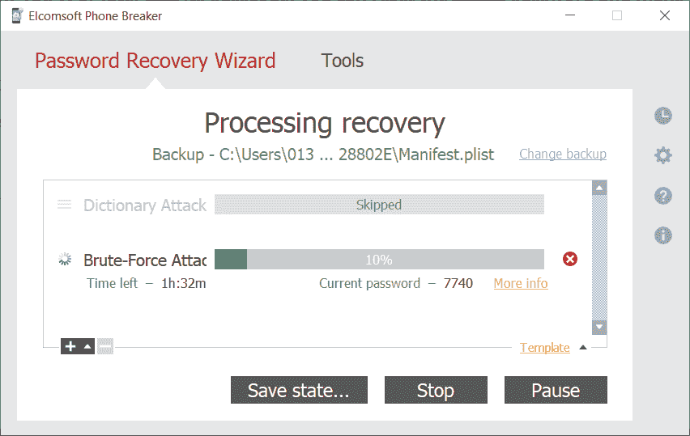
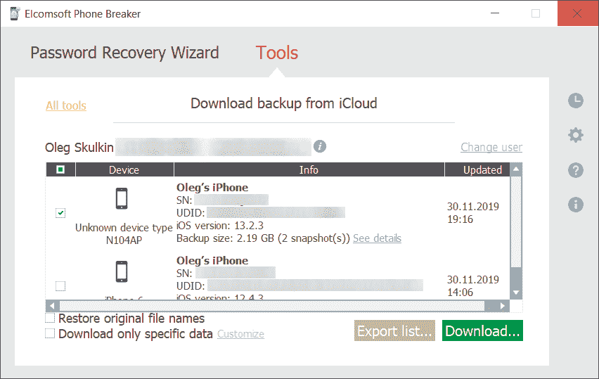

# 第四章：从 iOS 备份中获取数据

在上一章中，我们介绍了从 iOS 设备中获取数据的技术，包括逻辑和文件系统获取。本章涵盖了使用苹果的同步协议将设备上的文件备份到计算机或 iCloud 的技术。

iOS 设备的物理获取在调查中提供了最多的数据，但您也可以在 iOS 备份中找到大量信息。iOS 设备用户有几种选项可以备份其设备上的数据。用户可以选择使用苹果 iTunes 软件将数据备份到计算机，或者备份到被称为 iCloud 的苹果云存储服务。每次 iPhone 与计算机或 iCloud 同步时，都会通过复制设备上选择的文件来创建备份。用户可以确定备份中包含什么，因此某些备份可能比其他备份更全面。此外，用户可以同时备份到计算机和 iCloud，每个位置得到的数据可能不同。这通常是由于 iCloud 免费存储的限制。用户可能只是将照片和联系人备份到 iCloud，但可能会在计算机上完全备份所有数据。如前所述，物理获取提供了对 iOS 设备上所有数据的最佳访问权限；然而，备份可能是唯一可用的数字证据来源，特别是如果我们正在处理最新的 iOS 设备。

在本章中，我们将涵盖以下主题：

+   使用 iTunes 备份

+   使用 iTunes 创建和分析备份

+   提取未加密备份

+   处理加密备份文件

+   使用 iCloud 备份

# 使用 iTunes 备份

存储在先前与 iOS 设备同步的任何计算机上的大量信息。这些计算机通常被称为主机计算机，可以具有历史数据和密码旁路证书。在刑事调查中，可以获得搜查令以扣押属于嫌疑人的计算机，以访问备份和锁定证书。对于所有其他情况，需要获得同意或合法访问权限。iOS 备份文件取证主要涉及分析 iPhone 或 iPad 生成的离线备份。Apple Watch 数据将包含在其同步的 iPhone 备份中。

iTunes 备份方法在其他获取类型不可行的情况下也很有用。在这种情况下，您基本上创建了设备的 iTunes 备份，并使用取证软件进行分析。因此，重要的是您完全了解备份过程和所涉及的工具，以确保工具能够在不污染 iTunes 中的其他现有数据的情况下创建取证备份。

iPhone 备份文件可以使用 iTunes 软件创建，该软件适用于 macOS 和 Windows 平台。iTunes 是苹果提供的免费实用程序，用于 iOS 设备和计算机之间的数据同步和管理。iTunes 使用苹果的专有同步协议将数据从 iOS 设备复制到计算机上。例如，可以使用电缆或 Wi-Fi 将 iPhone 与计算机同步。iTunes 提供加密备份选项，但默认情况下，每当 iPhone 同步时都会创建未加密的备份。破解加密备份可以提供对 iOS 设备存储数据的额外访问权限。这将在本章后面讨论。

用户经常创建备份文件以保护其数据，以防设备损坏或丢失。可以创建法证备份作为最佳证据，也可以从现有的 iOS 备份文件中提取数据以搜索旧信息。例如，如果您正在接受调查并删除文件或擦除 iPhone，您的 iCloud 和 Mac 上的备份文件仍然存在。根据使用 iTunes 还是 iCloud，同一设备可能存在多个备份。您将需要对每个备份进行法证分析，以揭示与调查相关的证据。

iTunes 被配置为一旦 iOS 设备连接到计算机就自动启动同步过程。为了避免 iOS 设备和计算机之间的意外数据交换，在连接证据到法证工作站之前，请禁用自动同步过程。以下过程的*步骤 2*截图显示了禁用 iTunes 版本 12.9.4.102 中的自动同步选项。

要在 iTunes 中禁用自动同步，请执行以下步骤：

1.  导航到编辑|首选项|设备。

1.  检查防止 iPods，iPhones 和 iPads 自动同步，并单击“确定”按钮，如下截图所示：


在 iTunes 中禁用自动同步

1.  如前面的截图所示，系统上存在 iOS 备份文件。如果这是一台法证工作站，这些备份文件将不存在或将被永久删除以防止交叉污染。

1.  验证同步设置后，使用**通用串行总线**（**USB**）电缆将 iOS 设备连接到计算机。如果连接的设备没有密码保护，或者最近已连接到计算机，iTunes 将立即识别设备；否则，您将需要输入密码。可以通过 iTunes 界面左侧显示的 iPhone 图标进行验证，如下截图所示：


iTunes 识别的 iPhone

1.  在 iTunes 可以访问 iPhone 之前，您必须在计算机和手机之间启用信任。您将被提示在计算机上按“继续”（如下截图所示）并在 iPhone 上选择“信任”。对于 iOS 11，您还必须输入设备的密码：


iTunes 提示访问权限

1.  一旦 iTunes 识别设备，单击 iPhone 图标即可显示 iPhone 摘要，包括 iPhone 的名称，容量，固件版本，序列号，剩余空间和电话号码。iPhone 摘要页面还显示了创建备份的选项。创建备份的过程将在下一节中讨论。

现在，我们准备开始备份设备。下一节将指导您完成此过程。

# 使用 iTunes 创建和分析备份

在本节中，我们将指导您使用 Apple iTunes 备份 iOS 设备。我们使用的是 iTunes 版本 12.10.2.3 和运行 iOS 版本 13.2 的 iPhone。执行以下步骤：

1.  连接设备并单击 iTunes 界面左侧显示的 iPhone 图标。

1.  转到“备份”部分，您可以选择备份目的地（本地计算机或 iCloud），以及是否加密，如下截图所示：


iTunes 备份部分

加密的 iTunes 备份包含非加密备份不包含的数据，包括密码，Wi-Fi 设置和浏览历史记录，因此请确保您为法证目的创建加密备份。

1.  单击“立即备份”按钮，等待过程完成。完成后，最新的备份日期和时间将更改。

如果您想使用 iTunes 并将备份保存到外部驱动器，请遵循以下说明（我们使用的是 iTunes 版本 12.10.2.3 和 Windows 10）：

1.  重命名原始备份文件夹。

1.  连接外部驱动器并在其中创建一个备份文件夹。

1.  打开命令提示符并输入以下命令：

```kt
mklink /J "C:\Users\<username>\AppData\Roaming\Apple Computer\MobileSync\Backup" "f:\Backup"
```

1.  现在，您可以创建一个常规的本地备份，并将其保存到外部驱动器上。

现在，我们已经准备好备份以进行进一步的分析。让我们打开来了解其结构。

# 了解备份结构

当 iPhone 备份到计算机时，备份文件存储在一个备份目录中，该目录是一个 40 个字符的十六进制字符串，对应于设备的唯一设备标识符（UDID）。最新的设备已更改了 UDID 格式，现在是一个 24 个字符的字符串，因此它们的备份相应地命名。备份过程可能需要相当长的时间，具体取决于第一次备份时 iPhone 上存储的数据大小。备份目录的位置取决于计算机的操作系统。以下表显示了常见操作系统和 iTunes 备份目录的默认位置：

| 操作系统 | 备份目录位置 |
| --- | --- |
| Windows XP | `C:\Documents and Settings\<username>\Application Data\Apple Computer\MobileSync\Backup\` |
| Windows Vista/7/8/10 | `C:\Users\<username>\AppData\Roaming\Apple Computer\MobileSync\Backup\` |
| macOS | `~/Library/Application Support/MobileSync/Backup/`（`~`代表主文件夹） |

在第一次同步期间，iTunes 会创建一个备份目录并对设备进行完整备份。目前，在后续同步中，iTunes 只会备份设备上修改的文件并更新现有的备份目录。这并不总是正确的，因为在过去，每次备份 iOS 设备时都会创建一个新的备份。此外，当设备更新或恢复时，iTunes 会自动启动备份并进行*差异备份*。差异备份与备份目录具有相同的名称，但附加了一个破折号（`-`）、备份的**国际标准化组织**（ISO）日期、一个破折号（`-`）和 24 小时制的时间戳（`[UDID]+ '-' + [Date]+'-'+[Time stamp]`）。

iTunes 备份可能会复制设备上的所有内容，包括联系人、短信、照片、日历、音乐、通话记录、配置文件、文档、钥匙串、网络设置、离线网络应用缓存、书签、cookies、应用程序数据（如果选择了）、等等。例如，如果备份未加密，则电子邮件和密码将不会被提取。备份还包含设备详细信息，如序列号、UDID、SIM 卡详细信息和电话号码。这些信息也可以用来证明备份与移动设备之间的关系。

备份目录包含四个标准文件，以及个别文件（iOS 9 及以下）或文件夹（iOS 10 及更新）。在 iOS 9 及以下版本中，这四个文件是`info.plist`、`manifest.plist`、`status.plist`和`manifest.mbdb`，但从 iOS 10 开始，我们有以下标准文件：

+   `info.plist`

+   `manifest.plist`

+   `status.plist`

+   `manifest.db`

这些文件存储了关于备份和来源设备的详细信息。

# info.plist

`info.plist`文件存储了关于备份设备的详细信息，通常包含以下信息：

+   `应用程序`：这是设备上安装的应用程序列表。

+   `构建版本`：这是 iOS 的构建版本号。

+   `设备名称和显示名称`：这是设备的名称，通常包括所有者的姓名。

+   `GUID`：这是设备的全局唯一标识符（GUID）。

+   `ICCID`：这是**集成电路卡标识符**（**ICCID**），即 SIM 卡的序列号。

+   `IMEI`：这是**国际移动设备身份**（**IMEI**），用于唯一标识手机。

+   `已安装应用程序`：这是已安装应用程序的列表。

+   `上次备份日期`：这是上次成功备份的时间戳。

+   `MEID`：这是设备的**移动设备标识符**（**MEID**）。

+   `电话号码`：这是备份时设备的电话号码。

+   `产品名称`：这是设备的名称（例如，iPhone X）。

+   `产品类型和产品版本`：这是设备的型号和固件版本。

+   `序列号`：这是设备的序列号。

+   `目标标识符和唯一标识符`：这是设备的 UDID。

+   `iTunes 文件`：这包含有关照片、文件夹、语音备忘录和 iTunes 首选项的信息。

+   `iTunes 设置`：这包含有关已删除应用程序和应用程序库的信息。

+   `iTunes 版本`：这是用于创建备份的 iTunes 版本。

现在让我们来看一下`manifest.plist`文件。

# manifest.plist

`manifest.plist`文件描述了备份的内容，并通常包含以下信息：

+   `备份密钥包`：`备份密钥包`包含一组与`系统密钥包`中的密钥不同的数据保护类密钥，并且备份数据会使用新的类密钥重新加密。`备份密钥包`中的密钥有助于以安全方式存储备份。

+   `版本`：这是备份版本。

+   `日期`：这是备份创建或上次更新的时间戳。

+   `ManifestKey`：这是用于加密`manifest.db`的密钥（使用保护类 4 进行包装）。

+   `是否设置密码`：这标识设备上次同步时是否设置了密码。

+   `锁定`：这包含设备详细信息、上次备份计算机的名称和其他远程同步配置文件。

+   `应用程序`：这是备份设备上安装的第三方应用程序、它们的版本号和捆绑标识符的列表。

+   `是否加密`：这标识备份是否加密。对于加密备份，值为`True`；否则为`False`。

接下来，我们将查看`status.plist`文件。

# status.plist

`status.plist`文件存储有关备份状态的详细信息，并通常包含以下信息：

+   `是否完整备份`：这标识备份是否是设备的完整备份。

+   `UUID`：这是设备的 UUID。

+   `日期`：这是上次备份修改的时间戳。

+   `备份状态`：这标识备份是新备份还是已更新的备份。

+   `快照状态`：这标识备份过程是否已成功完成。

现在，我们将查看`manifest.db`文件。

# manifest.db

`manifest.db`是一个 SQLite 数据库，包含通过备份机制从 iPhone 提取的所有文件和文件夹的列表。数据库的`Files`表包括以下列：

+   `fileID`：这是域的**安全哈希算法 1**（**SHA1**）哈希值，加上`-`符号和文件或文件夹的相对路径。例如，`ae94e0607ca39a88c18aca095cb5b4f8471291a0`是`CameraRollDomain-Media/PhotoData/Thumbnails/V2/DCIM/102APPLE`的 SHA1 哈希值。

+   `域`：这是文件或文件夹所属的域（iOS 中的所有文件都分为多个域，例如`CameraRollDomain`和`HomeDomain`）。

+   `相对路径`：这是文件（包括文件名）或文件夹的相对路径。

+   `标志`：这些是文件标志。

+   `文件`：这是一个嵌入的`.plist`文件。这些`.plist`文件包括以下重要信息，等等：

+   `上次修改时间`：这是文件的最后修改时间戳（Unix 格式）。

+   `创建时间`：这是 Unix 格式的文件创建时间戳。字段显示在以下截图中：


manifest.db 内容

您可以轻松使用**DB Browser for SQLite**（**DB4S**）导出这个`.plist`嵌入式二进制文件。要做到这一点，请遵循以下步骤：

1.  使用“打开数据库”按钮打开`manifest.db`。

1.  转到“浏览数据”选项卡。

1.  点击“文件”列中的单元格。

1.  在“编辑数据库单元格”窗格中，使用“导出”按钮将数据保存为`.plist`文件，如下截图所示：


使用 DB4S 导出嵌入的.plist 文件

自 iOS 10 以来，文件不再以 40 个字符的十六进制字符串命名。相反，您将看到以 2 个字符的十六进制字符串命名的文件夹列表，其中包含您在以前版本中看到的文件，如下截图所示：



iPhone 备份文件

现在您了解了备份结构，让我们学习如何从中提取有价值的数据。

# 提取未加密备份

有许多免费和商业工具可用于分析未加密备份中的数据。这些工具分析`manifest.db`数据库，恢复文件名，并创建用户在 iOS 设备上看到的文件结构。一些流行的工具包括 iBackup Viewer、iExplorer 和商业取证工具，如 Belkasoft Evidence Center、Magnet AXIOM 和 UFED Physical Analyzer。

# iBackup Viewer

iBackup Viewer 是一个免费工具，适用于 Windows 和 macOS，可以从[`www.imactools.com/iphonebackupviewer/`](http://www.imactools.com/iphonebackupviewer/)下载。

该工具期望备份位于默认位置，但您可以将其更改为您选择的位置，例如外部驱动器。

要提取备份，请遵循以下步骤：

1.  如果要分析的备份未保存在默认位置，请在主屏幕上点击“首选项”超链接并选择正确的位置，如下截图所示：


选择备份位置

1.  您将看到您选择的位置上可用的备份。点击您想要检查的备份。

您将看到可用的潜在证据来源，包括联系人、通话记录、短信、日历、备忘录、语音邮件和浏览历史，如下截图所示：


潜在的证据来源

1.  重要的是要注意，您可以使用原始数据模式（上一个截图中的最后一个图标）浏览备份文件系统，如下截图所示：



原始数据模式

借助这个工具，您可以轻松查看和导出感兴趣的文件。当然，这并不是唯一能够解决这类任务的工具。让我们看看另一个工具——iExplorer。

# iExplorer

iExplorer 的免费版本可在[`macroplant.com/iexplorer`](https://macroplant.com/iexplorer)上获得。该工具支持 Windows 和 macOS，并且能够浏览 iTunes 备份。以下是如何使用它：

1.  启动 iExplorer 并点击浏览 iTunes 备份。

1.  要从自定义位置添加备份，请点击“添加/修改备份位置”。

1.  现在，点击“添加备份位置”按钮并选择路径，如下截图所示：


添加自定义路径

1.  您自定义位置的备份现在应该是可用的。

此外，还有一个有趣的选项——iExplorer 可以为您收集 SQLite 数据库。要做到这一点，点击“原始数据库”按钮，将您带到以下屏幕（您将在下一章中了解更多关于 SQLite 取证的内容）：



iExplorer 原始数据库选项

您还可以使用 iExplorer 的帮助以文件和文件夹列表的形式浏览备份；使用左窗格进行此操作。此外，您可以使用“备份浏览器”按钮，然后使用主窗格浏览备份。

如您所见，有足够的工具可以从 iTunes 备份中提取有价值的数据片段，即使它是加密的。当然，通常情况下，只要您知道密码，就可以做到。但是如果您不知道呢？您将在下一节中学习如何绕过它。

# 处理加密备份文件

对于加密备份，备份文件使用**高级加密标准-256**（**AES-256**）算法以**密码块链接**（**CBC**）模式进行加密，使用唯一密钥和空**初始化向量**（**IV**）。唯一的文件密钥受到来自`备份密钥包`的一组类密钥的保护。`备份密钥包`中的类密钥受到通过 10,000 次**基于密码的密钥派生函数 2**（**PBKDF2**）在 iTunes 中设置的密码派生的密钥的保护。在 iOS 10.2 中，此机制已升级，因此现在有 10,000,000 次迭代。

许多免费和商业工具提供对加密备份文件解析的支持，如果知道密码。不幸的是，这并不总是正确的，因此有时取证人员必须破解这些密码。下一节将指导您完成此过程，使用 Elcomsoft Phone Breaker。

# Elcomsoft Phone Breaker

**Elcomsoft Phone Breaker**是 Elcomsoft 开发的一款**图形处理单元**（**GPU**）加速商业工具，适用于 Windows 平台。当备份密码不可用时，该工具可以解密加密的备份文件。如果备份密码不可用，该工具提供了在加密备份上启动密码暴力破解攻击的选项。Elcomsoft Phone Breaker 尝试使用字典和暴力破解攻击来恢复保护加密备份的明文密码。相对较短和简单的密码可以在合理的时间内恢复。但是，如果备份受到强大和复杂的密码保护，破解可能需要很长时间。

该工具可在此处获得（包括免费试用版本）：[`www.elcomsoft.com/eppb.html`](https://www.elcomsoft.com/eppb.html)。

要强制破解备份密码，请执行以下步骤：

1.  启动 Elcomsoft Phone Breaker 工具，将显示工具的主屏幕，如下面的屏幕截图所示：



Elcomsoft Phone Breaker 的主屏幕

1.  导航到“密码恢复向导”|“选择源”|“iOS 设备备份”。导航到要破解的备份文件，并选择`Manifest.plist`文件。

1.  在“攻击”部分配置暴力破解模式，然后单击“开始”按钮开始暴力破解攻击，如下面的屏幕截图所示：



密码恢复过程

如果强制破解成功，工具将在主屏幕上显示密码。

如果您使用运行 iOS 11 或更高版本的 iPhone，并且知道其密码，您可以重置实际密码并使用新的已知密码进行备份。以下是如何操作：

1.  在 iPhone 上，转到“设置”|“通用”|“重置”。

1.  选择“重置所有设置”并输入设备的密码。重要的是要注意，不会删除任何数据。

1.  设置重置后，您可以使用自己选择的密码创建新的备份。

如果设置了屏幕使用时间密码，则还需要它来重置备份密码。

# 使用 iCloud 备份工作

iCloud 是苹果公司推出的云存储和云计算服务，于 2011 年 10 月推出。该服务允许用户在多个兼容设备（运行 iOS 5 或更高版本的 iOS 设备；运行 macOS X 10.7.2 或更高版本的计算机；和 Microsoft Windows）之间同步数据，包括日历、联系人、提醒、照片、文档、书签、应用程序、备忘录等，使用一个集中的 iCloud 账户。该服务还允许用户无线自动地将他们的 iOS 设备备份到 iCloud。iCloud 还提供其他服务，如“查找我的 iPhone”（远程跟踪丢失的手机并擦除数据）和“查找我的朋友”（与朋友分享位置并在设备到达特定位置时通知用户）。

使用 iCloud 注册是免费的，并且使用 Apple ID 非常简单。当您注册 iCloud 时，苹果公司为您提供 5GB 的免费远程存储空间。如果您需要更多存储空间，可以购买升级计划。为了保护您的数据，苹果在用户创建用于 iCloud 的 Apple ID 时强制要求选择一个强密码。密码必须至少包含八个字符，包括一个数字、一个大写字母和一个小写字母。

运行 iOS 5 及更高版本的 iOS 设备允许用户将设备设置和数据备份到 iCloud。备份的数据包括照片、视频、文档、应用程序数据、设备设置、消息、联系人、日历、电子邮件和钥匙串，如下面的屏幕截图所示。您可以通过转到设置|密码和帐户|iCloud |iCloud 来在设备上启用 iCloud 备份：


iPhone 上的 iCloud 备份选项

当您的手机插入、锁定并连接到 Wi-Fi 时，iCloud 可以自动备份您的数据。也就是说，iCloud 备份代表设备上存储信息的最新和几乎实时的副本，只要有空间来创建当前备份。

您还可以通过将设备连接到 iTunes 并选择 iCloud 选项来从计算机发起 iCloud 备份。iCloud 备份是增量的；也就是说，一旦初始 iCloud 备份完成，所有后续备份只会复制设备上发生变化的文件。iCloud 通过在互联网上传输时对数据进行加密、在服务器上以加密格式存储数据以及使用安全令牌进行身份验证来保护您的数据。

苹果的内置应用程序（例如邮件和联系人）使用安全令牌访问 iCloud 服务。使用安全令牌进行身份验证可以消除在设备和计算机上存储 iCloud 密码的需要。

# 提取 iCloud 备份

存储在 iCloud 上的在线备份通常在原始 iOS 设备损坏、升级或丢失时进行检索。要从 iCloud 提取备份，您必须知道用户的 Apple ID 和密码。使用已知的 Apple ID 和密码，您可以登录[`www.icloud.com/`](https://www.icloud.com/)并访问联系人、备忘录、电子邮件、日历、照片、提醒等。您还可以使用取证工具从 iCloud 中提取数据。例如，您可以使用 Belkasoft 获取工具，这是 Belkasoft 提供的免费工具，可以从以下网址下载：[`belkasoft.com/get`](https://belkasoft.com/get)。

要提取 iCloud 数据，请执行以下步骤：

1.  启动 Belkasoft 获取工具。

1.  选择“云”选项。

1.  选择 iCloud。

1.  输入 Apple ID 登录名和密码，然后单击“下一步”。

1.  选择要下载的工件以及要放置它们的目标文件夹，如下面的屏幕截图所示：


可用于下载的数据类型

1.  输入验证码。

1.  等待过程完成。您会在您选择的文件夹中找到文件。

如果您更喜欢完整备份，最好选择 Elcomsoft Phone Breaker。

要下载 iCloud 备份，请按照以下步骤操作：

1.  启动 Elcomsoft Phone Breaker。

1.  选择备份选项。

1.  输入 Apple ID 和密码，或使用先前提取的令牌。

1.  如果 Apple ID 受到**双重认证**（**2FA**）的保护，请在相应字段中输入代码。

1.  选择您想要下载的备份，如下面的屏幕截图所示：



选择要下载的备份

下载完成后，您可以使用您选择的工具来分析备份文件，例如本章中讨论的工具之一。

# 摘要

iOS 设备备份包含可能是您唯一证据来源的重要信息。存储在 iOS 备份中的信息包括照片、视频、联系人、电子邮件、通话记录、用户帐户和密码、应用程序和设备设置。本章介绍了如何创建备份文件并从 iTunes 和 iCloud 备份中检索数据，包括加密备份文件，尽可能地。

下一章，第五章，*iOS 数据分析和恢复*，进一步深入了法证调查，向您展示如何分析从备份文件中恢复的数据。
