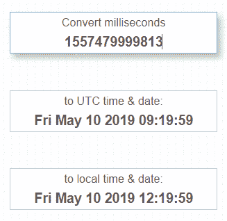
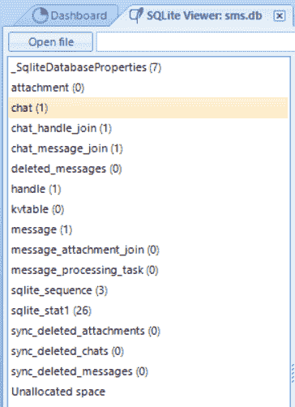
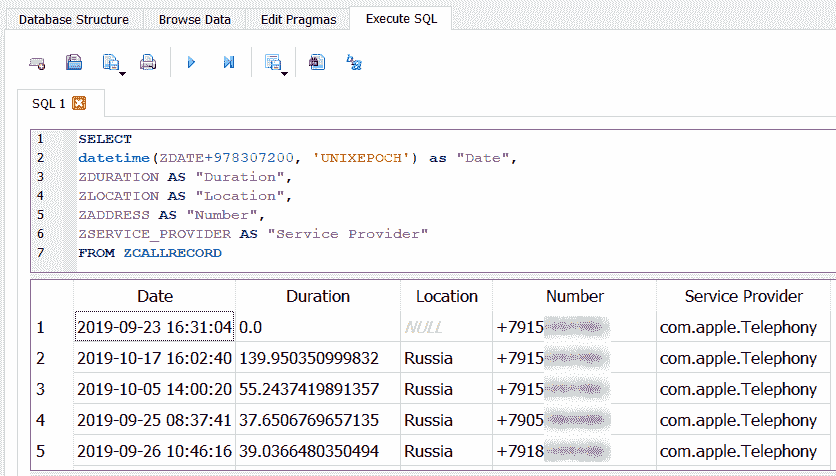
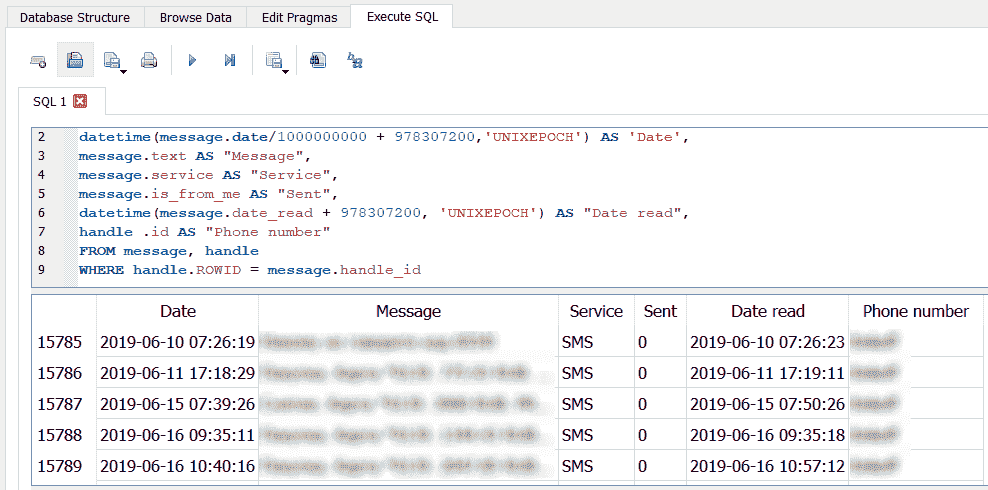
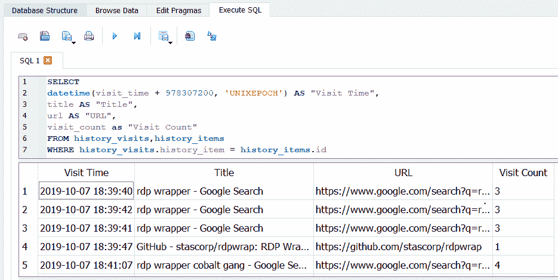
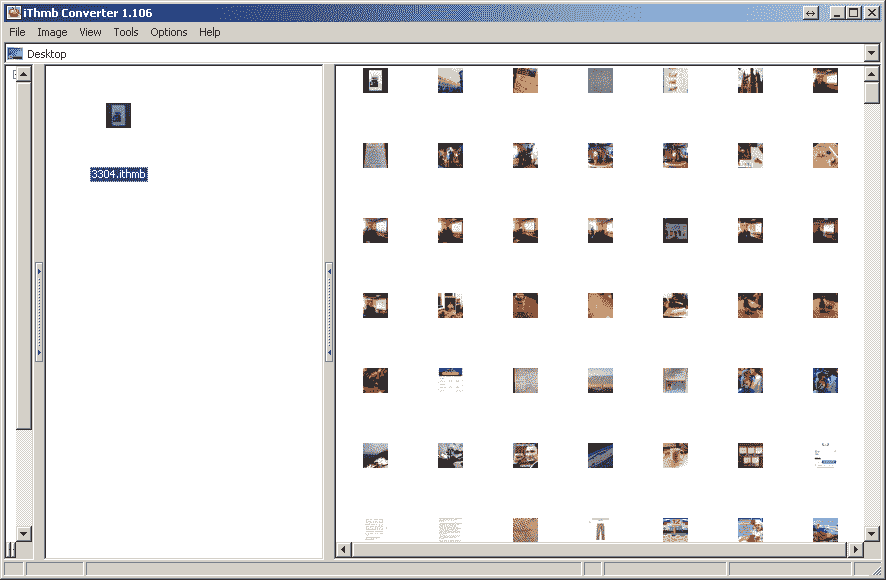

# 第五章：iOS 数据分析和恢复

iOS 设备取证的一个关键方面是检查和分析获取的数据以解释证据。在前几章中，您学习了从 iOS 设备获取数据的各种技术。任何类型的获取图像都包含数百个数据文件，通常由前几章描述的工具解析。即使数据被取证工具解析，也可能需要进行手动分析以揭示额外的证据或简单验证您的发现。

本章将帮助您了解数据在 iOS 设备上的存储方式，并将引导您逐步检查每个调查中应该检查的关键证据，以尽可能多地恢复数据。

在本章中，我们将涵盖以下主题：

+   解释 iOS 时间戳

+   使用 SQLite 数据库

+   关键证据-重要的 iOS 数据库文件

+   属性列表

+   其他重要文件

+   恢复已删除的 SQLite 记录

# 解释 iOS 时间戳

在检查数据之前，了解 iOS 设备上使用的不同时间戳格式非常重要。在 iOS 设备上找到的时间戳通常以*Unix 时间戳*或*Mac 绝对时间*格式呈现。作为取证人员，您必须确保工具正确地转换时间戳。访问原始 SQLite 文件将允许您手动验证这些时间戳。您将在接下来的几节中学习如何解码每个时间戳格式。

# Unix 时间戳

Unix 时间戳是自 Unix 纪元时间开始以来经过的秒数，Unix 纪元时间始于 1970 年 1 月 1 日午夜。Unix 时间戳可以很容易地转换，可以在 Mac 工作站上使用`date`命令，也可以使用在线 Unix 纪元转换器，例如[`www.epochconverter.com/`](https://www.epochconverter.com/)。

`date`命令显示在以下代码片段中：

```kt
$ date -r 1557479897
Fri May 10 12:18:17 MSK 2019
```

您可能还会遇到以毫秒或纳秒格式表示的 Unix 时间戳。这不是一个大问题；有许多在线转换器，例如[`currentmillis.com/`](http://currentmillis.com/)，如下面的屏幕截图所示：



使用 http://currentmillis.com/ 转换的毫秒级 Unix 时间戳

Unix 纪元是 iOS 设备最常见的格式，但也有其他格式，包括 Mac 绝对时间和 WebKit/Chrome 时间。

# Mac 绝对时间

iOS 设备在 iOS 5 中采用了 Mac 绝对时间。Mac 绝对时间是自 Mac 纪元时间开始以来经过的秒数，Mac 纪元时间始于 2001 年 1 月 1 日午夜。Unix 纪元时间和 Mac 时间之间的差异恰好是 978,307,200 秒。这意味着您可以轻松地将 Mac 时间转换为 Unix 纪元时间，并使用相同的方法最终将其转换为可读的时间戳。当然，也有一些在线转换器，例如[`www.epochconverter.com/coredata`](https://www.epochconverter.com/coredata)，如下面的屏幕截图所示：


使用 https://www.epochconverter.com/coredata 转换的 Mac 时间

当然，也有离线工具用于时间戳转换。我们将在下一节介绍其中之一。

# WebKit/Chrome 时间

在分析 iOS 应用程序数据时，特别是对于诸如 Google Chrome、Safari 和 Opera 等网络浏览器，您可能会遇到另一种时间戳格式——*WebKit/Chrome 时间*。这是自 1601 年 1 月 1 日午夜以来的微秒数。这也有一个在线转换器：[`www.epochconverter.com/webkit`](https://www.epochconverter.com/webkit)。

如果您不喜欢或不想出于某种原因使用在线转换器，您还可以使用免费工具：Digital Detective's DCode。该工具可用于转换多种不同格式的时间戳，包括 Unix 时间（秒和毫秒）、Mac 绝对时间和 WebKit/Chrome 时间，如下面的屏幕截图所示：


使用 DCode 转换的 WebKit/Chrome 时间戳

许多商业移动取证套件将自动为您转换提取的时间戳，但在某些情况下，验证它非常重要，因此您必须清楚地了解时间戳格式。

# 使用 SQLite 数据库

SQLite 是一个开源的、进程内的库，实现了一个自包含、零配置和事务性的 SQL 数据库引擎。这是一个完整的数据库，包含多个表、触发器和视图，都包含在一个跨平台文件中。由于 SQLite 是便携、可靠和小巧，它是一个流行的数据库格式，在许多移动平台上都有出现。

与其他智能手机和平板电脑一样，Apple iOS 设备大量使用 SQLite 数据库进行数据存储。许多内置应用程序，如电话、短信、邮件、日历和备忘录，都将数据存储在 SQLite 数据库中。除此之外，设备上安装的第三方应用程序也利用 SQLite 数据库进行数据存储。

SQLite 数据库可以带有文件扩展名或不带文件扩展名。它们通常具有`.sqlitedb`或`.db`文件扩展名，但有些数据库也具有其他扩展名。

SQLite 文件中的数据被分成包含实际数据的表。要访问文件中存储的数据，您需要一个能够读取它的工具。大多数商业移动取证工具，如 Belkasoft Evidence Center、Magnet AXIOM 和 Cellebrite **Universal Forensic Extraction Device** (**UFED**) Physical Analyzer，都提供对 SQLite 数据库的检查支持。如果您没有这些工具中的任何一个，一些不错的免费工具如下：

+   **DB Browser for SQLite (DB4S)**：可以从[`sqlitebrowser.org/`](http://sqlitebrowser.org/)下载。

+   **SQLite 命令行客户端**：可以从[`www.sqlite.org/`](http://www.sqlite.org/)下载。

+   **SQLiteStudio** ([`sqlitestudio.pl`](https://sqlitestudio.pl))：这是一个免费的跨平台 SQLite 管理器，支持 Windows 9x/2k/XP/2003/Vista/7/8/10、macOS 和 Linux。

+   **SQLiteSpy**：这是一个免费的**图形用户界面**（GUI）工具，适用于 Windows。您可以从[http](http://www.yunqa.de/delphi/doku.php/products/sqlitespy/index)[://www.yunqa.de/delphi/doku.php/products/sqlitespy/index](http://www.yunqa.de/delphi/doku.php/products/sqlitespy/index)下载它。

macOS 默认包含 SQLite 命令行实用程序（`sqlite3`）。此命令行实用程序可用于访问单个文件并对数据库运行 SQL 查询。在接下来的部分中，我们将使用`sqlite3`命令行实用程序和其他 SQLite 工具和浏览器来从各种 SQLite 数据库中检索数据。在检索数据之前，您需要学习的基本命令在以下部分中有解释。

# 连接到数据库

可以使用免费工具手动检查 iOS SQLite 数据库文件。以下是使用终端中的本机 Mac 命令检查数据库的示例：

1.  确保您的设备镜像被挂载为只读，以防止对原始证据进行更改。

1.  要从命令行连接到 SQLite 数据库，请在终端中运行`sqlite3`命令，输入您的数据库文件。这将为您提供一个 SQL 提示，您可以在其中发出 SQL 查询，如下面的代码块所示：

```kt
$ sqlite3 sms.db
SQLite version 3.28.0 2019-04-15 14:49:49
Enter ".help" for usage hints. 
```

1.  要断开连接，请使用`.exit`命令。这将退出 SQLite 客户端并返回到终端。

下一节将带您了解使用`sqlite3`内置命令分析数据库。

# 探索 SQLite 特殊命令

连接到数据库后，您可以使用许多内置的 SQLite 命令，这些命令被称为*点命令*，可用于从数据库文件中获取信息。

您可以通过在 SQLite 提示符中发出`.help`命令来获取特殊命令的列表。这些是 SQLite 特定的命令，它们不需要在末尾加上分号。最常用的点命令包括以下内容：

+   `.tables`: 这列出了数据库中的所有表。以下屏幕截图显示了在`sms.db`数据库中找到的表的列表：


+   `.schema table-name`: 这显示了用于构造表的`SQL CREATE`语句。以下屏幕截图显示了`sms.db`数据库中`handle`表的模式：


+   `.dump table-name`: 这将表的整个内容转储为 SQL 语句。以下屏幕截图中的示例显示了`sms.db`数据库中找到的`handle`表的转储：


+   `.output file-name`: 将输出重定向到磁盘上的文件，而不是在屏幕上显示。

+   `.headers on`: 每当您发出`SELECT`语句时，这将显示列标题。

+   `.help`: 这显示了可用的 SQLite 点命令列表。

+   `.exit`: 这断开与数据库的连接并退出 SQLite 命令 shell。

+   `.mode`: 这设置了输出模式；可以是`.csv`、HTML、制表符等。

确保 SQLite 提示符和点命令之间没有空格；否则，整个命令将被忽略。

# 探索标准 SQL 查询

除了 SQLite 点命令之外，还可以在命令行上向 SQLite 数据库发出标准 SQL 查询，例如`SELECT`、`INSERT`、`ALTER`和`DELETE`。与 SQLite 点命令不同，标准 SQL 查询在命令的末尾需要一个分号。

您将检查的大多数数据库只包含合理数量的记录，因此可以发出`SELECT *`语句，打印表中包含的所有数据。本章将对此进行详细介绍。

# 使用商业工具访问数据库

虽然可以使用免费工具手动检查 iOS SQLite 数据库文件，但大多数检查员在手动检查文件之前更喜欢商业支持。以下是使用包含在 Belkasoft Evidence Center 中的 SQLite 检查数据库的示例。

要打开和分析数据库，您只需要按照以下几个简单的步骤：

1.  启动 Belkasoft Evidence Center 并导航到 View | SQLite Viewer，并选择要检查的数据库文件。

1.  选择数据库后，它将立即在 SQLite Viewer 中打开，并准备好进行检查，如下屏幕截图所示：



使用 Belkasoft Evidence Center 的 SQLite Viewer 打开的 sms.db 数据库

为什么检查员需要使用这样的商业查看器而不是免费和开源的查看器？例如，这个特定的查看器甚至支持受损或部分覆盖的 SQLite 数据库。此外，该工具支持从 freelists、Write-Ahead Log（WAL）和未分配空间中提取数据，如下屏幕截图所示：


在 Belkasoft Evidence Center 的 SQLite Viewer 中看到的数据库未分配空间

当然，对于 SQLite 数据恢复，也有一些免费和开源的工具可用。您将在以下部分了解更多关于这些工具的信息。

# 关键证据-重要的 iOS 数据库文件

根据第三章*，从 iOS 设备获取数据*和第四章*，从 iOS 备份中获取数据*中的说明提取的文件系统和备份应包含以下可能对您的调查重要的 SQLite 数据库。如果未恢复这些文件，请确保您正确获取了 iOS 设备。以下部分显示的文件是通过从运行 iOS 的设备进行逻辑获取而提取的。随着苹果在每个 iOS 版本中为内置应用添加新功能，文件的格式可能会因不同的 iOS 版本而有所不同。

# 通讯录联系人

通讯录包含有关所有者个人联系人的丰富信息。除了第三方应用程序外，通讯录还包含设备上存储的所有联系人的联系人条目。通讯录数据库可以在`/HomeDomain/Library/AddressBook.sqlitedb`找到。`AddressBook.sqlitedb`文件包含几个表，其中以下三个特别重要：

+   `ABPerson`：这包含每个联系人的姓名、组织、备注等信息。

+   `ABMultiValue`：此表包含`ABPerson`表中条目的电话号码、电子邮件地址、网站**统一资源定位符**（**URL**）等信息。`ABMultiValue`表使用`record_id`文件将联系信息与`ABPerson`表中的`ROWID`关联起来。

+   `ABMultiValueLabel`：此表包含用于识别`ABMultiValue`表中存储的信息类型的标签。

`AddressBook.sqlitedb`文件中存储的一些数据可能来自第三方应用程序。您应手动检查应用程序文件夹，以确保所有联系人都得到了考虑和检查。

虽然所有以下命令都可以在 Mac 上本地运行，但我们将使用 DB4S 来检查 iOS 设备上最常见的数据库。这是一个免费工具，可以简化流程并为您提供数据的清晰视图。加载数据库后，您可以起草查询以检查对您最相关的数据，并将通讯簿导出为名为`AddressBook.csv`的`.csv`文件，如下面的屏幕截图所示：


DB4S 中的 AddressBook.sqlitedb 文件

在上述屏幕截图中，您可以看到建议的查询，以解析`ABPerson`和`ABMultiValue`表中的数据。

# 通讯录图片

除了通讯录的数据，每个联系人可能包含与之关联的图片。每当用户从特定联系人接收来电时，这些图片将显示在屏幕上。这些图片可以由具有对设备上联系人的访问权限的第三方应用程序创建。通常，联系人与第三方应用程序的个人资料照片相关联。通讯录图片数据库位于`/HomeDomain/Library/AddressBook/AddressBookImages.sqlitedb`。

通讯录图片可以手动解析，但使用商业软件可以使这个过程更加实用。大多数免费和商业工具都将提供访问通讯录图片的权限。但是，有些工具可能无法建立图形和联系人之间的联系，这可能需要一些手动重建。有时，从 iOS 设备解析简单数据时，免费解决方案效果最佳。接下来，我们将在 iExplorer 中检查通讯录图片，该软件在第四章中介绍了*从 iOS 备份中获取数据*。

在以下屏幕截图中的示例中，iExplorer 自动匹配了联系人数据和图片：


在 iExplorer 中检查通讯录图片

在`ABThumbnailImage`表的`data`列中也可以找到相同的缩略图。您可以使用`AddressBookImages.sqlitedb`的`ABThumbnailImage`表的`record_id`列和`AddressBook.sqlitedb`的`ABPerson`表的`ROWID`列手动将照片与联系人匹配。 

# 通话记录

用户拨打、未接和接收的电话或 FaceTime 通话以及通话持续时间、日期和时间等其他元数据都记录在通话记录中。通话记录数据库位于`/HomeDomain/Library/CallHistoryDB/CallHistory.storedata`。`CallHistory.storedata`文件是在 iOS 8 中引入的，并且在撰写本文时（iOS 13.2）仍在使用。

`CallHistory.storedata`数据库中的`ZCALLRECORD`表包含通话记录。重要的是要注意，活动数据库中可能仅存储有限数量的通话记录。数据库在需要空间时会删除最旧的记录，但这并不意味着这些数据被删除。它只是在 SQLite 数据库文件的空闲页面中，可以使用取证工具或手动恢复。`ZCALLRECORD`表中最重要的列是以下内容：

+   `ZDATE`：此列包含以 Mac 绝对时间格式存储的通话时间戳。

+   `ZDURATION`：此列包含通话持续时间。

+   `ZLOCATION`：此列包含电话号码的位置。

+   `ZADDRESS`：此列包含电话号码。

+   `ZSERVICE_PROVIDER`：此列包含服务提供商，例如电话、WhatsApp、Telegram 等。

您可以在 DB4S 中运行以下查询来解析通话记录。之后，您可以将其导出为`.csv`文件，如下面的屏幕截图所示：



在 DB4S 中检查 CallHistory.storedata

这次查询非常简单，因为感兴趣的所有列都在同一张表中。请注意，我们使用`datetime`将 Mac 绝对时间戳转换为可读日期。

# 短信服务（SMS）消息

短信数据库包含从设备发送和接收的文本和多媒体消息，以及远程方的电话号码、日期和时间以及其他运营商信息。从 iOS 5 开始，iMessage 数据也存储在短信数据库中。iMessage 允许用户通过蜂窝网络或 Wi-Fi 向其他 iOS 或 macOS 用户发送短信和多媒体消息，从而提供了一种替代短信的方式。短信数据库位于`/HomeDomain/Library/SMS/sms.db`。

您可以在 DB4S 中运行以下查询来解析短信消息。之后，您可以将其导出为`.csv`文件，如下面的屏幕截图所示：



在 DB4S 中检查 sms.db

还有一个有趣的子目录可以在`/HomeDomain/Library/SMS/`中找到——`Drafts`。里面有更多的子文件夹，每个文件夹都包含一个`message.plist`文件。每个文件都是一个包含用户开始输入但未发送的草稿消息的属性列表。您将在接下来的部分中了解更多关于属性列表的内容。

# 日历事件

用户手动创建或使用邮件应用程序或其他第三方应用程序同步的日历事件存储在`Calendar`数据库中。`Calendar`数据库位于`/HomeDomain/Library/Calendar/Calendar.sqlitedb`。

`Calendar.sqlitedb`文件中的`CalendarItem`表包含日历事件摘要、描述、开始日期、结束日期等。您可以在 DB4S 中运行以下查询来解析日历，如下面的屏幕截图所示：


在 DB4S 中检查 calendar.sqlitedb

如您所见，`CalendarItem`表以 Mac 绝对时间格式存储日期，因此我们添加了`978307200`以显示实际时间戳，借助`datetime`函数的帮助。

# 备注

`Notes`数据库包含用户使用设备内置的`Notes`应用程序创建的笔记。`Notes`是最简单的应用程序，通常包含最敏感和机密的信息。`Notes`数据库可以在`/HomeDomain/Library/Notes/notes.sqlite`找到。

`notes.sqlite`文件中的`ZNOTE`和`ZNOTEBODY`表包含每个笔记的标题、内容、创建日期、修改日期等信息。您可以运行以下查询来解析`Notes`数据库：


在 DB4S 中检查笔记

这个查询合并了两个表的数据，所以我们使用`ZOWNER`从`ZNOTEBODY`，`Z_PK`从`ZNOTE`，以及一个`WHERE`子句来完成它。

# Safari 书签和历史记录

在 iOS 设备上使用的 Safari 浏览器允许用户收藏他们喜欢的网站。`Bookmarks`数据库可以在`/HomeDomain/Library/Safari/Bookmarks.db`找到。书签数据可以通过非常简单的查询提取，如下面的截图所示：


在 DB4S 中检查书签

浏览历史记录可以在`History.db`中找到，位于`/HomeDomain/Library/Safari/`。关于访问过的网站的最重要的信息可以从`history_items`和`history_visits`表中提取，如下面的截图所示：



在 DB4S 中检查历史记录

除了 Safari 之外，其他浏览器也可以用于在 iOS 设备上存储数据。因此，我们建议使用专门用于解析互联网历史记录的工具，以确保数据不会被忽视。解决这个任务的好的取证工具包括 Magnet Forensics 的 AXIOM，Cellebrite 的 Physical Analyzer 等。

# 语音信箱

`Voicemail`数据库包含有关存储在设备上的每个语音信箱的元数据，包括发件人的电话号码、回拨号码、时间戳和消息持续时间等。语音信箱录音存储为**Adaptive Multi-Rate** (**AMR**)音频文件，可以由支持 AMR 编解码器（例如 QuickTime Player）的任何媒体播放器播放。`Voicemail`数据库可以在`/HomeDomain/Library/Voicemail/voicemail.db`下找到。

# 记录

`Recordings`数据库包含有关存储在设备上的每个录音的元数据，包括时间戳、持续时间、在设备上的位置等。数据库可以在`/MediaDomain/Media/Recordings`找到。可以通过下面截图中显示的查询提取元数据：


在 DB4S 中检查记录

正如您在前面的截图中所看到的，实际的录音文件存储在同一个目录中。

# 设备交互

有一个记录用户与不同应用程序交互的 SQLite 数据库。这个数据库称为`interactionC.db`，位于`/HomeDomain/Library/CoreDuet/People`。`ZINTERACTIONS`表包含用户是否阅读消息、发送消息、进行电话等信息。您可以通过下面截图中显示的查询从表中提取这些信息：


在 DB4S 中检查交互

此外，请确保检查`ZCONTACTS`表——如果适用，它包含与用户与设备的交互有关的联系人信息。

# 电话号码

您可以通过分析位于`/WirelessDomain/Library/Databases`的`CellularUsage.db`文件来获取用户使用的所有电话号码的信息，即使他们更换了手机并从备份中恢复。提取这些数据的查询如下截图所示：


提取电话号码

正如您所看到的，不仅有电话号码可用，还有**Subscriber Identity Module** (**SIM**)卡的**Integrated Circuit Card Identifier** (**ICCID**)。

# 属性列表

属性列表，通常称为`plist`，是一种结构化数据格式，用于在 iOS 设备和 macOS 设备上存储、组织和访问各种类型的数据。`plist`文件是二进制格式的，可以使用属性列表编辑器查看或转换为**美国信息交换标准代码**（**ASCII**）格式。

`Plist`文件可能有也可能没有`.plist`文件扩展名。要访问这些文件中存储的数据，您需要一个可以读取它们的工具。一些很好的免费工具包括以下内容：

+   可以从[`www.icopybot.com/plist-editor.htm`](http://www.icopybot.com/plist-editor.htm)下载的 plist Editor Pro。

+   macOS 上的`plutil`命令行实用程序。

您可以使用 Xcode 查看`plist`文件。macOS 默认包含`plutil`命令行实用程序。这个命令行实用程序可以轻松地将二进制格式的文件转换为人类可读的文件。除此之外，大多数商业取证工具都包括对解析`plist`文件的良好支持。

以下屏幕截图显示了`com.apple.mobile.ldbackup.plist`文件：


在 plist Editor Pro 中的 com.apple.mobile.ldbackup.plist

正如您所看到的，这个`plist`揭示了最后一次本地和云备份日期（当然是以 Mac 绝对时间为准），它创建的时区，以及备份是否加密。

# 重要的 plist 文件

原始磁盘映像或您在第三章中提取的备份，*从 iOS 设备获取数据*，以及第四章，*从 iOS 备份获取数据*，应包含对调查重要的以下`plist`文件。显示的文件是从 iOS 13.2 设备备份中提取的。文件位置可能因您的 iOS 版本而异。

以下是包含可能与您的调查相关的数据的`plist`文件：

| **plist 文件** | **描述** |
| --- | --- |
| `/HomeDomain/Library/Preferences/com.apple.commcenter.shared.plist` | 包含正在使用的电话号码 |
| `/HomeDomain/Library/Preferences/com.apple.identityservices.idstatuscache.plist` | 包含有关用于 Apple ID 的电子邮件地址以及用户通过 FaceTime 或 iMessage 与之互动的个人的电话号码的信息 |
| `/HomeDomain/Library/Preferences/com.apple.mobile.ldbackup.plist` | 包含上次 iTunes 和 iCloud 备份的时间戳，上次 iTunes 备份的时区，以及是否加密 |
| `/HomeDomain/Library/Preferences/com.apple.MobileBackup.DemotedApps.plist` | 包含操作系统自动卸载的未使用应用程序列表 |
| `/HomeDomain/Library/Preferences/com.apple.mobilephone.speeddial.plist` | 包含用户喜爱的联系人列表，包括他们的姓名和电话号码 |
| `/HomeDomain/Library/Preferences/com.apple.preferences.datetime.plist` | 包含用户设置的时区信息 |
| `/RootDomain/Library/Caches/locationd/clients.plist` | 包含使用位置服务的应用程序列表 |
| `/RootDomain/Library/Preferences/com.apple.MobileBackup.plist` | 包含有关从备份中恢复的最后一次恢复的信息，包括恢复开始日期，文件传输持续时间，传输的文件数量，源设备的**唯一设备标识符**（**UDID**）等 |
| `/SystemPreferencesDomain/SystemConfiguration/com.apple.mobilegestalt.plist` | 包含用户分配的设备名称 |
| `/SystemPreferencesDomain/SystemConfiguration/com.apple.wifi.plist` | 包含设备所有者使用的无线访问点的信息 |
| `/WirelessDomain/Library/Preferences/com.apple.commcenter.plist` | 包含有关设备电话号码、网络运营商、ICCID 和国际移动用户识别码（IMSI）的信息 |

当然，`plist`文件不像 SQLite 数据库那样包含大量信息，但它们在法医检查中仍然可能有用。接下来，我们将查看其他一些可能也有用的文件。

# 其他重要文件

除了 SQLite 和`plist`文件之外，还有其他几个位置可能包含对调查有价值的信息。

其他来源包括以下内容：

+   本地字典

+   照片

+   缩略图

+   壁纸

+   下载的第三方应用程序

让我们逐个查看它们。

# 本地字典

设备用户添加到字典中的单词列表存储在`LocalDictionary`明文文件中，位于`/KeyboardDomain/Library/Keyboard/`。由于该文件是明文，您可以使用您喜欢的文本编辑器。

# 照片

照片存储在`/CameraRollDomain/Media/DCIM`目录中，其中包含使用设备内置相机拍摄的照片、屏幕截图、自拍照、照片流、最近删除的照片以及相应的缩略图。一些第三方应用程序也会在此目录中存储拍摄的照片。存储在`DCIM`文件夹中的每张照片都包含可交换图像文件格式（EXIF）数据。可以使用从[`sno.phy.queensu.ca/~phil/exiftool/`](https://sno.phy.queensu.ca/~phil/exiftool/)下载的`ExifTool`提取照片中存储的`EXIF`数据。如果用户在 iOS 设备上启用了位置权限，并且对照片进行了地理标记，那么`EXIF`数据可能包含地理信息。

# 缩略图

与照片相关的重要工件的另一个来源是`ithmb`文件。您可以在`/CameraRollDomain/Media/PhotoData/Thumbnails`找到这些文件。这些文件不仅包含设备上实际照片的缩略图，还包括已删除照片的缩略图。当然，还有一个用于解析此类文件的工具，即`iThmb Converter`，可以从[`www.ithmbconverter.com/en/download/`](http://www.ithmbconverter.com/en/download/)下载，并在以下截图中显示：



使用 iThmb Converter 检查 3304.ithmb

由于这些文件可能包含已删除照片的缩略图，因此法医检查员不应忽视它们。而且，其中一些文件包含相当大的缩略图，因此清楚地显示了照片内容。

# 壁纸

可以从`/HomeDomain/Library/SpringBoard`中找到的`LockBackgroundThumbnail.jpg`和`LockBackgroundThumbnaildark.jpg`文件中恢复 iOS 设备的当前背景壁纸设置。

壁纸图片可能包含有关用户的身份信息，这些信息可能有助于寻找失踪人员或者可以在从盗窃调查中恢复的 iOS 设备上找到。

# 下载的第三方应用程序

从 App Store 下载并安装的第三方应用程序，包括 Facebook、WhatsApp、Viber、Threema、Tango、Skype 和 Gmail 等应用程序，包含了对调查有用的大量信息。一些第三方应用程序使用 Base64 编码，需要进行转换以便查看以及加密。加密数据库文件的应用程序可能会阻止您访问表中的数据。这些应用程序的加密方式因应用程序和 iOS 版本而异。

在`/private/var/mobile/Containers/Data/Application`目录中为每个安装在设备上的应用程序创建了一个**通用唯一标识符**（**UUID**）的子目录。存储在应用程序目录中的大多数文件都是以 SQLite 和`plist`格式存储的。必须检查每个文件以确定其相关性。我们建议在可能的情况下使用 Belkasoft Evidence Center、Cellebrite UFED Physical Analyzer、Elcomsoft Phone Viewer 和 Magnet AXIOM 快速提取这些证据，然后再返回并手动运行查询和解析数据。

此外，有关已安装应用程序的信息可以从位于`/HomeDomain/Library/FrontBoard`的`applicationState.db`数据库中收集。这是另一个 SQLite 数据库，可以使用审查人员选择的适当查看器进行分析。

# 恢复已删除的 SQLite 记录

SQLite 数据库将已删除的记录存储在数据库本身内部，因此可以通过解析相应的 SQLite 数据库来恢复已删除的数据，例如联系人、短信、日历、便签、电子邮件、语音邮件等。如果对 SQLite 数据库进行了清理或碎片整理，则恢复已删除数据的可能性很小。这些数据库需要进行的清理程度在很大程度上取决于 iOS 版本、设备和设备上用户的设置。

SQLite 数据库文件包括一个或多个只使用一次的固定大小页面。SQLite 使用页面的 B 树布局来存储索引和表内容。有关 B 树布局的详细信息可以在[`github.com/NotionalLabs/SQLiteZer/blob/master/_resources/Sqlite_carving_extractAndroidData.pdf`](https://github.com/NotionalLabs/SQLiteZer/blob/master/_resources/Sqlite_carving_extractAndroidData.pdf)找到。

商业取证工具提供支持，可以从 SQLite 数据库文件中恢复已删除的数据，但它们并不总是恢复所有数据，也不支持从 iOS 设备上的所有数据库中提取数据。建议对包含关键证据的每个数据库进行检查，以查找已删除的数据。本书中已经讨论过的关键证据或数据库应使用免费解析器、十六进制查看器，甚至您的取证工具进行检查，以确定用户是否删除了与调查相关的证据。

要对 SQLite 数据库进行切割，可以检查原始十六进制数据或使用 Mari DeGrazia 开发的免费 Python 脚本`sqliteparse.py`。可以从[`github.com/mdegrazia/SQlite-Deleted-Records-Parser`](https://github.com/mdegrazia/SQlite-Deleted-Records-Parser)下载该 Python 脚本。

以下示例从`notes.sqlitedb`文件中恢复已删除的记录，并将输出转储到`output.txt`文件中。此脚本应该适用于从 iOS 设备中恢复的所有数据库文件。要验证运行脚本后的发现，只需使用十六进制查看器检查数据库，以确保没有遗漏。代码可以在这里看到：

```kt
$python sqliteparse.py -f notes.sqlitedb -r -o output.txt
```

除此之外，对数据库文件执行`strings`转储也可以显示可能被忽略的已删除记录，如下所示：

```kt
$strings notes.sqlitedb
```

如果您更喜欢使用图形用户界面，Mari DeGrazia 友好地创建了一个并将其放在她的 GitHub 页面上。

另一个可以用来恢复已删除的 SQLite 记录的开源工具是 Undark。您可以在这里下载它：[`pldaniels.com/undark/`](http://pldaniels.com/undark/)。要使用该工具，请运行以下命令：

```kt
./undark -i sms.db > sms_database.csv
```

需要注意的是，Undark 不区分当前数据和已删除数据，因此您将获得整套数据，包括实际数据和已删除数据。

# 总结

本章涵盖了各种数据分析技术，并指定了 iOS 设备文件系统中常见物件的位置。在撰写本章时，我们的目标是涵盖大多数调查中涉及的最流行的物件。显然，不可能覆盖所有物件。我们希望一旦您学会如何从 SQLite 和`plist`文件中提取数据，直觉和毅力将帮助您解析未涵盖的物件。

请记住，大多数开源和商业工具都能从常见的数据库文件中提取活动和已删除的数据，如联系人、通话记录、短信等，但它们通常忽略了第三方应用程序的数据库文件。我们最好的建议是要知道如何手动恢复数据，以防您需要验证您的发现或作证您的工具的功能如何运作。

我们介绍了恢复已删除的 SQLite 记录的技术，在大多数 iOS 设备调查中都非常有用。再次强调，获取方法、编码和加密模式可能会影响您在检查过程中能够恢复的数据量。

在下一章《iOS 取证工具》中，我们将向您介绍最流行的移动取证工具——Cellebrite UFED Physical Analyzer、Magnet AXIOM、Elcomsoft Phone Viewer 和 Belkasoft Evidence Center。
