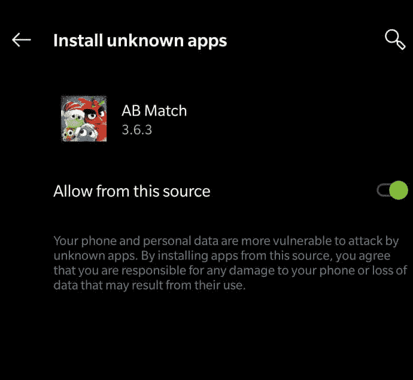
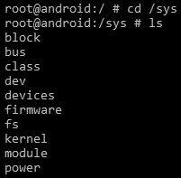
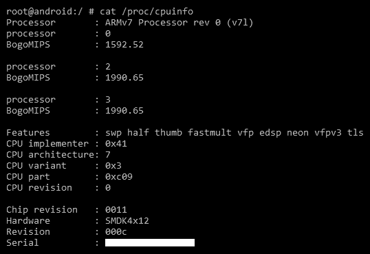

# 第七章：理解 Android

在前几章中，我们介绍了 iOS 设备的详细信息，包括文件系统结构、关键文件、备份文件以及获取和分析方法。从本章开始，我们将专注于 Android 平台以及如何对 Android 设备进行取证。在进行取证调查时，对 Android 生态系统、安全约束、文件系统和其他功能有很好的理解将会很有用。掌握这些基础知识将有助于取证专家在进行调查时做出明智的决定。

本章我们将涵盖以下主题：

+   Android 的演变

+   Android 架构

+   Android 安全

+   Android 文件层次结构

+   Android 文件系统

# Android 的演变

Android 是为触摸屏移动设备开发的基于 Linux 的移动操作系统。它由一家名为**开放手机联盟**（**OHA**）的公司联合开发，主要贡献者和商业营销商是谷歌。自首次发布以来，Android 操作系统已经有了显著的发展。Android 于 2008 年正式向公众发布，版本为 Android 1.0。随着 2009 年 Android 1.5 杯子蛋糕版本的发布，以甜点命名 Android 版本的传统诞生了。接下来的 10 年，版本名称也按字母顺序发布。然而，2019 年，谷歌宣布他们将结束基于甜点的命名，未来将使用数字顺序。最近的几年里，Android 版本更新频率减少到每年一次。最新的主要 Android 更新是 Android 11，这是谷歌于 2020 年 2 月 19 日宣布的第 11 个主要版本。

以下是撰写时的 Android 版本历史概述：

| **版本** | **版本名称** | **发布年份** |
| --- | --- | --- |
| Android 1.0 | 苹果派 | 2008 年 |
| Android 1.1 | 香蕉面包 | 2009 年 |
| Android 1.5 | 杯子蛋糕 | 2009 年 |
| Android 1.6 | 甜甜圈 | 2009 年 |
| Android 2.0 | 松饼 | 2009 年 |
| Android 2.2 | 冻酸奶 | 2010 年 |
| Android 2.3 | 姜饼 | 2010 年 |
| Android 3.0 | 蜂巢 | 2011 年 |
| Android 4.0 | 冰淇淋三明治 | 2011 年 |
| Android 4.1 | 果冻豆 | 2012 年 |
| Android 4.4 | 奇巧 | 2013 年 |
| Android 5.0 | 棒棒糖 | 2014 年 |
| Android 6.0 | 棉花糖 | 2015 年 |
| Android 7.0 | 牛轧糖 | 2016 年 |
| Android 8.0 | 奥利奥 | 2017 年 |
| Android 9.0 | 派 | 2018 年 |
| Android 10.0 | Q | 2019 年 |
| Android 11 | R | 2020 年 |

这种演变也极大地影响了 Android 的安全考虑以及取证技术的应用。例如，最初的 Android 版本没有**全盘加密**（**FDE**）机制来以加密格式存储设备内的数据。因此，相较于现在，取证人员从设备中提取数据要容易得多。随着每个 Android 版本的更新，越来越多的安全功能，如应用程序权限、**受信任执行环境**（**TEE**）和安全内核，已被添加以提高整个平台的安全性，但同时也使数据提取的过程变得更加复杂。我们将在本章的其他部分详细介绍这些安全功能。

现在我们了解了 Android 的历史和版本，接下来我们将在下一节中看一下 Android 的架构。

# Android 架构

在处理安卓时，要有效地理解法医概念，你应该对安卓架构有基本的了解。就像计算机一样，任何与用户交互并执行复杂任务的计算系统都需要一个操作系统来有效地处理任务。这个操作系统（无论是桌面操作系统还是手机操作系统）负责管理系统的资源，为应用程序提供一种与硬件或物理组件交流以完成特定任务的方式。安卓目前是最流行的移动操作系统，旨在为移动设备提供动力。你可以在[`developer.android.com/about/android.html`](https://developer.android.com/about/android.html)了解更多信息。

作为开源操作系统，安卓以 Apache 许可证的形式发布其代码，这是众多开源许可证之一。实际上，这意味着任何人（尤其是设备制造商）都可以访问它，自由修改它，并根据任何设备的要求使用该软件。这是其广泛接受的主要原因之一。使用安卓的知名厂商包括三星、HTC、索尼和 LG。

与任何其他平台一样，安卓由一堆层次运行在另一堆层次之上。要理解安卓生态系统，有必要对这些层次是什么以及它们的作用有基本的了解。

以下图表总结了安卓软件堆栈中涉及的各个层：


安卓架构

此图像是基于安卓开源项目创建和共享的工作进行修改：https://developer.android.com/guide/platform

许可证：https://creativecommons.org/licenses/by/4.0/

这些层每个都执行支持特定操作系统功能的几个操作。每个层为其上面的层提供服务。让我们更详细地看一下。

# Linux 内核层

安卓操作系统是建立在 Linux 内核之上的，谷歌对其进行了一些架构上的改变。选择 Linux 内核有几个原因。最重要的是，Linux 是一个可以轻松在不同硬件上编译的可移植平台。内核充当软件和设备上的硬件之间的抽象层。考虑一下相机的情况。当你使用设备上的相机按钮拍照时会发生什么？在某个时候，硬件指令（按下按钮）必须转换为软件指令（拍照并将其存储在相册中）。内核包含驱动程序来促进这个过程。当用户按下按钮时，指令传递到内核中相应的相机驱动程序，该驱动程序向相机硬件发送必要的命令，类似于在键盘上按键时发生的情况。简而言之，内核中的驱动程序控制着底层硬件。如安卓架构模型所示，内核包含与 Wi-Fi、蓝牙、通用串行总线（USB）、音频、显示等相关的驱动程序。

Linux 内核负责管理安卓的核心功能，如进程管理、内存管理、安全性和网络。在安全性和进程管理方面，Linux 是一个经过验证的平台。安卓已经利用现有的 Linux 开源操作系统来构建其生态系统的坚实基础。每个安卓版本都有不同版本的底层 Linux 内核。Oreo 安卓版本已知使用 Linux 内核 3.18 或 4.9，而 Pie 版本已知使用 Linux 内核 4.4、4.9 或 4.14。安卓 Q 版本的目标是 Linux 内核 4.9、4.14 或 4.19。实际的内核取决于个别设备。

# 硬件抽象层

设备硬件功能通过**硬件抽象层**（**HAL**）暴露给高级 Java 框架。HAL 由几个库模块组成，实现特定类型硬件组件的接口。这允许硬件供应商在不改变更高级别系统的情况下实现功能。

# 库

Android 架构中的下一层包括 Android 的本机库。这些库是用 C 或 C++编写的，帮助设备处理不同类型的数据。例如，SQLite 库用于存储和检索数据库中的数据。其他库包括媒体框架、WebKit、Surface Manager 和**安全套接字库**（**SSL**）。

媒体框架库充当提供服务给其他底层库的主要接口。WebKit 库提供 Web 浏览器中的网页，Surface Manager 库维护图形。在同一层中，我们有**Android 运行时**（**ART**）和核心库。ART 负责在 Android 设备上运行应用程序。术语*运行时*指的是从应用程序启动到关闭的时间。

# Dalvik 虚拟机（DVM）

您在 Android 设备上安装的所有应用程序都是用 Java 编程语言编写的。当 Java 程序编译时，我们得到字节码。**虚拟机**（**VM**）是一个充当操作系统的应用程序，也就是说，可以在 Mac 上运行 Windows 操作系统的实例，反之亦然，使用 VM。**Java 虚拟机**（**JVM**）就是这样一个可以执行前面提到的字节码的 VM。但是 Android 5.0 之前的版本使用了称为 DVM 的东西来运行它们的应用程序。

DVM 运行 Dalvik 字节码，这是由**Dalvik 可执行文件**（**DEX**）编译器转换的 Java 字节码。因此，`.class`文件使用`dx`工具转换为`dex`文件。与 Java 字节码相比，Dalvik 字节码更适合于低内存和低处理环境。此外，需要注意的是，JVM 的字节码由一个或多个`.class`文件组成，取决于应用程序中存在的 Java 文件数量，但 Dalvik 字节码只由一个`dex`文件组成。每个 Android 应用程序都运行自己的 DVM 实例。这是 Android 安全的关键方面，将在第八章中详细讨论，即*Android 取证设置和数据提取技术*。

以下图表提供了 Android 的 DVM 与 Java 的 JVM 之间的区别：


JVM 与 DVM

现在我们已经了解了 JVM 和 DVM 之间的基本区别，让我们快速看一下 ART。

# ART

从 Android 5.0 版本的棒棒糖开始，Dalvik 被 ART 取代。Android 早期版本使用 Dalvik 的**即时**（**JIT**）编译（识别并动态编译频繁执行的操作为本机机器代码）。这些频繁使用的字节码的本机执行，称为跟踪，提供了显著的性能改进。

与 Dalvik 不同，ART 使用**预编译**（**AOT**）编译，即在安装时将整个应用程序编译为本机机器代码。这自动增加了应用程序的安装时间，但一个主要优点是这消除了 Dalvik 的解释和基于跟踪的 JIT 编译，从而提高了效率并减少了功耗。ART 使用一个名为`dex2oat`的实用程序，它接受`DEX`文件作为输入，并为目标设备生成一个编译的应用程序可执行文件。使用 ART，**优化的 DEX**（**.odex**）文件已被**可执行和可链接格式**（**ELF**）可执行文件取代。

# Java API 框架层

应用程序框架是负责处理手机的基本功能的层，如资源管理，处理通话等。这是应用程序直接与设备通信的块。以下是应用程序框架层中的一些重要块：

+   **电话管理器**：此块管理所有语音通话。

+   **内容提供者**：此块管理不同应用程序之间的数据共享。

+   **资源管理器**：此块管理应用程序中使用的各种资源。

最终层是系统应用程序层，接下来将讨论这一层。

# 系统应用程序层

这是用户可以直接与设备交互的最顶层。有两种应用程序——预装应用程序和用户安装的应用程序。预装应用程序——如拨号器、网络浏览器和联系人——随设备一起提供。用户安装的应用程序可以从不同的地方下载，如 Google Play 商店、亚马逊市场等。您在手机上看到的一切（联系人、邮件、相机等）都是应用程序。

到目前为止，我们已经了解了 Android 架构和重要的构建块。现在我们将深入了解 Android 操作系统中固有的一些安全功能。

# Android 安全

Android 的设计专注于安全。作为一个平台，Android 提供并强制执行某些功能，以通过多层安全保护移动设备上的用户数据。有一些安全默认设置可以保护用户，也有一些功能可以被开发社区利用来构建安全的应用程序。作为法医调查员，了解 Android 安全的内部情况至关重要，因为它有助于确定在特定情况下应用的最佳技术，某些技术的技术限制等。

接下来的几节将帮助我们更好地了解 Android 的安全功能和提供。

有关 Android 安全的详细说明可在[`source.android.com/security/`](https://source.android.com/security/)找到。

# 安全内核

内核是任何操作系统安全的核心。通过选择多年来发展成为可信平台的 Linux，Android 建立了非常坚实的安全基础。Linux 内核固有的大多数安全功能都会自动被 Android 采用。例如，Linux 的基于用户的权限模型实际上对 Android 非常有效。如前所述，Linux 内核中内置了大量特定代码。随着每个 Android 版本的发布，内核版本也发生了变化。以下表格显示了 Android 版本及其对应的内核版本：

| **Android 版本** | **Linux 内核版本** |
| --- | --- |
| 1 | 2.6.25 |
| 1.5 | 2.6.27 |
| 1.6 | 2.6.29 |
| 2.2 | 2.6.32 |
| 2.3 | 2.6.35 |
| 3.0 | 2.6.36 |
| 4.0 | 3.0.1 |
| 4.1 | 3.0.31 |
| 4.2 | 3.4.0 |
| 4.2 | 3.4.39 |
| 4.4 | 3.8 |
| 5.0 | 3.16.1 |
| 6.0 | 3.18.1 |
| 7.0 | 4.4.1 |
| 8.0 | 4.10 |
| 9.0 | 4.4, 4.9 和 4.14 |
| 10.0 |  4.9, 4.14 和 4.19 |

Linux 内核自动为 Android 平台带来了一些固有的安全功能，例如以下功能：

+   基于用户的权限模型

+   运行进程的隔离（应用程序沙盒）

+   安全**进程间通信**（**IPC**）

我们现在将了解每个这些功能。

# 权限模型

如下截图所示，任何 Android 应用程序必须获得用户的权限才能访问敏感功能，例如互联网、拨号器等。这为用户提供了提前了解应用程序访问设备上哪些功能的机会。简而言之，它需要用户的许可才能执行任何恶意活动（窃取数据，破坏系统等）。

这个模型帮助用户防止攻击，但如果用户不知情并授予了很多权限，就会陷入麻烦（记住——当涉及在任何设备上安装恶意软件时，最薄弱的环节始终是用户）。


安卓中的权限模型

直到安卓 6.0 之前，用户需要在安装时授予权限。用户必须接受所有权限或者不安装应用程序。但是，从安卓 6.0 开始，用户在应用程序运行时授予权限。这种新的权限系统还允许用户更多地控制应用程序的功能，允许用户选择性地授予权限。例如，用户可以拒绝某个应用程序访问他们的位置，但允许访问互联网。用户可以随时通过转到应用程序的设置屏幕来撤销权限。从取证的角度来看，这意味着可以从设备中提取的信息类型不仅取决于设备和安装的应用程序，还取决于用户配置的权限。

# 应用程序沙箱

在 Linux 系统中，每个用户被分配一个唯一的用户标识符（UID），并且用户被隔离开来，以便一个用户无法访问另一个用户的数据。然而，特定用户下的所有应用程序都以相同的权限运行。同样，在安卓中，每个应用程序都作为一个独特的用户运行。换句话说，每个应用程序都被分配一个 UID 并作为一个独立的进程运行。这个概念确保了内核级别的应用程序沙箱。内核通过利用现有的 Linux 概念，如 UID 和组标识符（GID），来管理应用程序之间的安全限制。如果一个应用程序试图执行一些恶意操作——比如读取另一个应用程序的数据——这是不允许的，因为应用程序没有用户权限。因此，操作系统保护应用程序免受访问另一个应用程序数据的侵害。

# 安全的 IPC

安卓提供了安全的 IPC，通过它，一个应用程序中的一个活动可以向同一个或不同应用程序中的另一个活动发送消息。为了实现这一点，安卓提供了 IPC 机制：意图、服务、内容提供程序等。这对为安卓平台编写第三方应用程序的开发人员更为相关。在幕后，取证工具利用其中一些概念来获取设备信息。

# 应用程序签名

所有安装的应用程序都必须经过数字签名。开发人员只有在对应用程序进行签名后才能将其放置在谷歌的 Play 商店中。应用程序签名所使用的私钥由开发人员持有。使用相同的密钥，开发人员可以为他们的应用程序提供更新，在应用程序之间共享数据等。未经签名的应用程序如果尝试安装，将被谷歌 Play 或安卓设备上的软件包安装程序拒绝。在安卓 8.0 及以上版本中，用户必须导航到“安装未知应用程序”设置才能运行未经签名的应用程序，如下图所示：



在安卓系统中安装未知应用程序屏幕

现在我们对数字签名应用程序有了一些基本知识，让我们来看看安卓中的一个安全功能。

# 安全增强型 Linux（SELinux）

SELinux 是在 Android 4.3 中引入的安全功能，并在 Android 5.0 中得到全面执行。在此添加之前，Android 安全性是基于**自主访问控制**（**DAC**）的，这意味着应用程序可以请求权限，用户可以授予或拒绝这些权限。因此，恶意软件可以通过获得这些权限在手机上制造混乱。但 SE Android 使用**强制访问控制**（**MAC**），确保应用程序在隔离的环境中工作。因此，即使用户安装了恶意应用程序，恶意软件也无法访问操作系统并损坏设备。SELinux 用于在所有进程上强制执行 MAC，包括以 root 权限运行的进程。在 SELinux 中，任何未明确允许的操作默认都被拒绝。SELinux 可以在两种全局模式中运行：**宽容**模式，记录权限拒绝但不强制执行；和**强制**模式，记录并强制执行权限拒绝。有关 SELinux 的更多详细信息，请访问[`source.android.com/security/selinux/concepts`](https://source.android.com/security/selinux/concepts)。

# FDE

随着 Android 6.0 Marshmallow，Google 规定大多数设备必须使用 FDE，前提是硬件符合一定的最低标准。加密是将数据使用秘密密钥转换为密文的过程。在 Android 设备上，FDE 指的是使用秘密密钥加密所有用户数据的过程。然后，该密钥由用户设置的**个人识别号码**（**PIN**）/图案/密码加密。一旦设备加密，所有用户创建的数据在写入磁盘之前会自动加密，并且所有读取操作在返回给调用进程之前会自动解密数据。Android 中的 FDE 仅适用于**嵌入式多媒体卡**（**eMMC**）和类似的将自身呈现为块设备的闪存设备。

从 Android 7.x 开始，Google 决定将加密功能从 FDE 转移到**基于文件的加密**（**FBE**）。在 FBE 中，不同的文件使用不同的密钥进行加密。通过这样做，这些文件可以独立访问，无需解密完整分区。因此，系统现在可以在用户解锁手机之前显示打开通知或访问与引导相关的文件。

# Android Keystore

Android Keystore 用于保护敏感的加密密钥，防止未经授权的访问。存储在 Keystore 中的密钥可用于执行加密操作，但永远无法从 Keystore 外部提取。硬件支持的 Keystore 在硬件级别提供安全性，即使操作系统被 compromise，硬件模块中的密钥仍然是安全的。

# TEE

TEE 是一个隔离的区域（通常是一个单独的微处理器），旨在保证其中存储的数据的安全性，并以完整性执行代码。移动设备上的主处理器被视为不可信任，不能用于存储秘密数据（如加密密钥）。因此，TEE 专门用于执行此类操作，并且运行在主处理器上的软件将需要使用秘密数据的任何操作委托给 TEE 处理器。

# 验证启动

验证启动试图确保在 Android 设备上执行的所有代码来自合法来源，而不是来自攻击者或欺诈者。它建立了完整的信任链，并防止任何其他操作系统的侧加载。在设备启动期间，每个阶段在移交执行之前都会验证下一个阶段的完整性和真实性。

我们现在将研究 Android 设备上可用的各个分区和文件系统。

# Android 文件层次结构

为了对任何系统（桌面或移动设备）进行取证分析，了解底层文件层次结构是很重要的。对 Android 如何在文件和文件夹中组织数据有基本的了解，有助于取证分析师将研究范围缩小到特定问题。与任何其他操作系统一样，Android 使用了几个分区。本章提供了一些最重要分区和其中存储的内容的见解。

值得再次提到的是，Android 使用 Linux 内核。因此，如果您熟悉类 Unix 系统，您将非常了解 Android 中的文件层次结构。对于那些对 Linux 模型不太熟悉的人，这里有一些基本信息：在 Linux 中，文件层次结构是一个单一的树，树的顶部被表示为/（称为*根*）。这与在驱动器中组织文件的概念（如 Windows）不同。无论文件系统是本地还是远程，它都将存在于根目录下。

Android 文件层次结构是现有 Linux 层次结构的定制版本。根据设备制造商和底层 Linux 版本，这个层次结构的结构可能有一些微不足道的变化。以下是大多数 Android 设备共有的重要文件夹列表。列出的一些文件夹只有通过 root 访问才能看到。Rooting 是在 Android 设备上获得特权访问的过程。有关 rooting 和执行 adb 命令（在下面的列表中显示）的更多详细信息在第八章中有详细介绍，*Android 取证设置和数据提取前技术*：

+   /boot：顾名思义，这个分区包含了手机启动所需的信息和文件。它包含了内核和随机存取存储器（RAM）磁盘，因此没有这个分区，手机无法启动其进程。存储在 RAM 中的数据价值丰富，在取证获取过程中应该被捕获。

+   /system：这个分区包含除了内核和 RAM 磁盘之外的系统相关文件。这个文件夹不应该被删除，否则设备将无法启动。可以使用以下命令查看此分区的内容：


/system 分区

+   /recovery：这个分区设计用于备份目的，并允许设备启动到恢复模式。在恢复模式下，您可以找到修复手机安装的工具。

+   /data：这是包含每个应用程序数据的分区。大部分属于用户的数据，如联系人、短信和拨打的号码，都存储在这个文件夹中。从取证的角度来看，这个文件夹非常重要，因为它包含有价值的数据。可以使用以下命令查看数据文件夹的内容：


/data 分区

+   /cache：这是用于存储频繁访问的数据和一些日志以加快检索速度的文件夹。/cache 分区对于取证调查也很重要，因为这里的数据可能不再存在于/data 分区中。

+   /misc：顾名思义，这个文件夹包含有关杂项设置的信息。这些设置主要定义设备的状态，即开/关。有关硬件设置、USB 设置等信息可以从这个文件夹中访问。

+   /sdcard：这是保存在安全数字（SD）卡上的所有信息的分区。它很有价值，因为它可能包含图片、视频、文件、文档等信息。

现在我们已经了解了 Android 文件层次结构并查看了其中的重要文件夹，让我们在下一节看看文件系统。

# Android 文件系统

了解文件系统是取证方法论的一个重要部分。了解文件系统的属性和结构在取证分析过程中非常有用。文件系统是指数据存储、组织和从卷中检索的方式。基本安装可能基于一个分成多个分区的卷；在这里，每个分区可以由不同的文件系统管理。在 Linux 中，Android 使用挂载点，而不是驱动器（即`C:`或`E:`）。

在 Linux 中，挂载是将附加文件系统连接到计算机当前可访问的文件系统的行为。在 Linux 中，文件系统不是通过驱动器名称访问的，而是组织成一个多级层次结构，顶部有一个名为`root`的目录。每当挂载时，每个新文件系统都添加到这个单一的文件系统树中。

无论文件系统存在于本地设备还是远程设备上都没有任何区别。一切都在以`root`开始的单一层次结构中。每个文件系统都定义了管理卷中文件的规则。根据这些规则，每个文件系统提供了不同的文件检索速度、安全性、大小等。Linux 使用多个文件系统，Android 也是如此。从取证的角度来看，了解 Android 使用的文件系统以及识别对调查具有重要意义的文件系统是很重要的。例如，存储用户数据的文件系统对我们来说是首要关注的，而不是用于启动设备的文件系统。

# 查看 Android 设备上的文件系统

Android 内核支持的文件系统可以通过检查`proc`文件夹中的`filesystems`文件的内容来确定。可以使用`# cat /proc/filesystems`命令查看此文件的内容：


Android 设备上的文件系统

在上述输出中，第一列告诉我们文件系统是否挂载在设备上。具有`nodev`属性的文件系统未挂载在设备上。

第二列列出了设备上存在的所有文件系统。简单的`mount`命令显示设备上可用的不同分区，如下所示：


Android 设备上的分区

接下来，让我们看看 Android 上常见的文件系统。

# 在 Android 上发现的常见文件系统

Android 中存在的文件系统主要可以分为三个主要类别，如下所示：

+   Flash 存储器文件系统

+   基于媒体的文件系统

+   伪文件系统

让我们详细看看每一个。

# Flash 存储器文件系统

Flash 存储器是一种持续供电的**非易失性存储器**（**NVM**），在没有电源供应的情况下保留数据。Flash 存储器可以按块擦除和重新编程。虽然支持的文件系统因设备和底层 Linux 内核而异，但常见的 Flash 存储器文件系统如下：

+   **扩展文件分配表**（**exFAT**）是微软专有的文件系统，用于闪存驱动器，如 USB 存储设备和 SD 卡。由于许可要求，它不是标准 Linux 内核的一部分。但仍然有一些制造商为该文件系统提供支持。

+   **Flash 友好文件系统**（**F2FS**）于 2013 年 2 月发布，以支持运行 Linux 3.8 内核的三星设备。F2FS 依赖于优化 NAND Flash 存储器的日志结构方法。离线支持功能是该文件系统的一个亮点，尽管它仍然是临时的并且正在更新。

+   **另一个闪存文件系统 2**（**YAFFS2**）是一个开源的单线程文件系统，于 2002 年发布。它主要设计用于处理 NAND 闪存时的速度。YAFFS2 利用**带外**（**OOB**），这在取证获取时通常无法正确捕获或解码，使得分析变得困难。我们将在[第九章](https://cdp.packtpub.com/practical_mobile_forensics__fourth_edition/wp-admin/post.php?post=60&action=edit#post_470)中进一步讨论这个问题，*安卓数据提取技术*。YAFFS2 曾经是最受欢迎的版本，并且仍然广泛用于安卓设备。YAFFS2 是一个日志结构的文件系统。即使在突然断电的情况下，数据完整性也得到了保证。2010 年，有一则公告称在 Gingerbread 之后的版本中，设备将从 YAFFS2 转移到**第四扩展文件系统**（**EXT4**）。目前，YAFFS2 不受新内核版本的支持，但某些手机制造商可能仍然继续支持它。

+   **稳健文件系统**（**RFS**）支持三星设备上的 NAND 闪存。RFS 可以总结为**文件分配表 16**（**FAT16**）或 FAT32 文件系统，通过事务日志启用日志记录。许多用户抱怨三星应该坚持使用 EXT4。RFS 已知会导致 Android 功能的延迟。

媒体为基础的文件系统是接下来的一个主题。

# 媒体为基础的文件系统

以下是一些安卓设备支持的媒体为基础的文件系统。

**扩展文件系统**（**EXT**）于 1992 年专门为 Linux 内核引入，是最早的文件系统之一，它使用了虚拟文件系统。EXT2、EXT3 和 EXT4 是随后的版本。EXT3 相对于 EXT2 的主要优势是日志记录。使用 EXT3，如果出现意外关机，就不需要验证文件系统。EXT4 文件系统随着移动设备实现双核处理器而变得重要。YAFFS2 文件系统在双核系统上已知存在瓶颈。在安卓的 Gingerbread 版本中，YAFFS 文件系统被替换为 EXT4。

以下是三星 Galaxy 手机上使用 EXT4 的挂载点：

```kt
/dev/block/mmcblk0p9 /system ext4 ro,noatime,barrier=1,data=ordered 0    0
/dev/block/mmcblk0p3 /efs ext4 rw,nosuid,nodev,noatime,barrier=1,journal_async_commit,data=ordered 0 0
/dev/block/mmcblk0p8 /cache ext4 rw,nosuid,nodev,noatime,barrier=1,journal_async_commit,data=ordered 0 0
/dev/block/mmcblk0p12 /data ext4 rw,nosuid,nodev,noatime,barrier=1,journal_async_commit,data=ordered,n oauto_da_alloc,discard 0 0  
```

**虚拟文件分配表**（**VFAT**）是对 FAT16 和 FAT32 文件系统的扩展。大多数安卓设备支持微软的 FAT32 文件系统。它被几乎所有主要操作系统支持，包括 Windows、Linux 和 macOS。这使得这些系统能够轻松地读取、修改和删除安卓设备的 FAT32 部分上的文件。大多数外部 SD 卡都是使用 FAT32 文件系统格式化的。

观察以下输出，显示了`/sdcard`和`/secure/asec`挂载点使用 VFAT 文件系统：


安卓中的挂载命令输出

最后一个类别是伪文件系统。

# 伪文件系统

伪文件系统，顾名思义，不是实际的文件，而是文件的逻辑分组。以下是安卓中一些重要的伪文件系统：

+   根文件系统（`rootfs`）是安卓的主要组成部分之一，包含了启动设备所需的所有信息。当设备启动引导过程时，它需要访问许多核心文件，因此会挂载根文件系统。如前面的`mount`命令行输出所示，这个文件系统被挂载在`/`（`root`文件夹）上。因此，这是所有其他文件系统逐渐挂载的文件系统。如果这个文件系统损坏了，设备就无法启动。

+   `sysfs`文件系统挂载了`/sys`文件夹，其中包含了设备配置的信息。以下输出显示了安卓设备中`sys`目录下的各种文件夹：



安卓系统中/sys 目录下的文件夹

由于这些文件夹中的数据大多与配置相关，这对于取证调查员通常并不是非常重要。但在某些情况下，我们可能需要检查手机上是否启用了特定设置，并在这种情况下分析这个文件夹可能是有用的。

请注意，每个文件夹都包含大量文件。通过取证获取数据是确保在检查过程中数据不被更改的最佳方法。

+   `devpts`文件系统提供了一个接口，用于在安卓设备上的终端会话。它被挂载在`/dev/pts`上。每当建立一个终端连接时，例如当`adb` shell 连接到安卓设备时，一个新的节点会在`/dev/pts`下创建。以下是当`adb` shell 连接到设备时显示的输出：

```kt
shell@Android:/ $ ls -l /dev/pts ls -l /dev/pts
crw------- shell shell 136, 0 2013-10-26 16:56 0
```

+   `cgroup`文件系统代表**控制组**。安卓设备使用这个文件系统来跟踪它们的任务。它们负责聚合任务并跟踪它们。这些数据通常在取证分析过程中并不是非常有用。

+   `proc`文件系统包含有关内核数据结构、进程和其他系统相关信息的信息，存储在`/proc`目录中。例如，`/sys`目录包含与内核参数相关的文件。同样，`/proc/filesystems`显示设备上可用文件系统的列表。以下命令显示了设备的**中央处理器**（**CPU**）的所有信息：



在安卓设备上运行 cpuinfo 命令的输出。

同样，当您遍历这些文件时，还有许多其他有用的文件可以提供有价值的信息。

+   `tmpfs`文件系统是设备上的临时存储设施，它将文件存储在 RAM（易失性内存）中。使用 RAM 的主要优势是更快的访问和检索。但一旦设备重新启动或关闭，这些数据将不再可访问。因此，对于取证调查员来说，在设备重新启动之前检查 RAM 中的数据，或者通过 RAM 获取方法提取数据是很重要的。

今天的取证工具可以轻松地挂载这些文件系统，并在**图形用户界面**（**GUI**）屏幕上显示内容，从而使取证调查员能够轻松地浏览和解析文件。在安卓取证的早期阶段，调查员通常需要运行一系列 Linux 或 Windows 命令来格式化和查看这些文件系统。

# 总结

在本章中，我们涵盖了安卓操作系统的基本特性、文件系统和其他在取证调查中有用的细节。我们了解了内置在安卓中的有趣的安全功能。与 iOS 不同，安卓存在多个变体，因为许多设备运行安卓操作系统，每个设备可能具有不同的文件系统和独特的特性。安卓是开放和可定制的事实也改变了数字取证的格局。这些知识将有助于理解取证获取技术。

在下一章中，我们将讨论如何在进行分析之前设置取证工作站。
