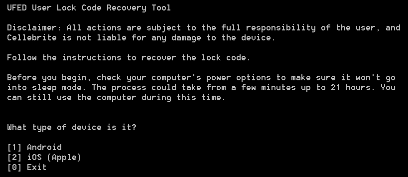
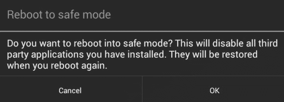
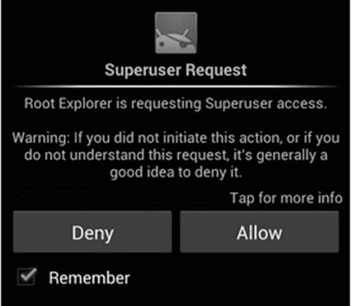

# 第八章：Android 取证设置和数据提取前技术

在上一章中，我们介绍了 Android 架构、安全功能、文件系统和其他功能的基础知识。在开始审查之前建立一个完善的取证环境非常重要，因为这可以确保数据在您作为审查员的控制下得到保护。本章将解释建立数字取证审查环境的过程以及需要考虑的事项。在整个取证过程中，保持对取证环境的控制至关重要；这可以防止引入可能影响取证调查的污染物。

本章将涵盖以下主题：

+   为 Android 建立取证环境

+   连接 Android 设备到工作站

+   屏幕锁定绕过技术

+   获取 root 权限

# 为 Android 建立取证环境

作为取证员，在调查过程中可能会遇到各种手机。因此，有必要在基础环境上建立一个基本环境，以满足需求。同时，您始终保持对环境的完全控制以避免任何意外情况。建立适当的实验室环境是取证过程的重要组成部分。Android 取证设置通常包括以下步骤：

1.  从一个全新或取证上的计算机环境开始。这意味着系统上要么没有其他数据，要么以一种方式包含，以防止其污染当前的调查。

1.  安装连接到设备所需的基本软件。Android 取证工具和方法可以在 Windows、Linux 和 macOS 平台上运行。

1.  获取设备访问权限。您必须能够启用设置或绕过设置，以允许从 Android 设备中提取数据。

1.  使用本章和第九章《Android 数据提取技术》中定义的方法向设备发出命令。

以下部分提供了设置基本 Android 取证工作站的指导。

# 安装软件

Android 软件开发工具包（SDK）帮助开发世界构建、测试和调试在 Android 上运行的应用程序。Android SDK 附带 Android Studio，这是官方的集成开发环境（IDE），用于开发 Android 应用程序。Android Studio 提供了有价值的文档和其他工具，在调查 Android 设备时可以提供很大帮助。或者，您也可以仅下载平台工具，这是 Android SDK 的组件，包括可以与 Android 平台交互的工具，如 ADB、fastboot 等；这些将在接下来的部分中更详细地描述。

对 Android SDK 的深入了解将有助于您了解设备及其数据的特点。

Android Studio 包括软件库、API、工具、模拟器和其他参考资料。可以免费从[`developer.android.com/studio/index.html`](https://developer.android.com/studio/index.html)下载。平台工具可以从[`developer.android.com/studio/releases/platform-tools`](https://developer.android.com/studio/releases/platform-tools)下载。

在取证调查期间，拥有这些工具可以帮助您连接并访问 Android 设备上的数据。Android SDK 经常更新，因此验证您的工作站也保持最新非常重要。Android SDK 可以在 Windows、Linux 和 macOS 上运行。

# 安装 Android 平台工具

在对法医设备进行调查时，必须使用 Android SDK 或 Android 平台工具的工作安装。与平台工具软件相比，Windows 版本的 Android Studio 约为 718 MB，而且相对较重，后者只有 20 MB。

在 Windows 10 机器上安装 Android 平台工具的逐步过程如下：

1.  在安装 Android Studio 或平台工具之前，请确保系统已安装 Java 开发工具包（JDK），因为 Android SDK 依赖于 Java SE 开发工具包。

JDK 可以从[`www.oracle.com/technetwork/java/javase/downloads/index.html`](http://www.oracle.com/technetwork/java/javase/downloads/index.html)下载。

1.  从[`developer.android.com/studio/releases/platform-tools`](https://developer.android.com/studio/releases/platform-tools)下载平台工具的最新版本。

1.  右键单击并将 ZIP 文件解压缩到一个文件夹中。安装位置由您选择，并且必须记住以供将来访问。在此示例中，我们将其解压缩到`C:\`文件夹中。

1.  打开目录（`C:\platform-tools`），注意列出了以下工具：


Android 平台工具

这完成了基本的 Android 工具安装。如果您安装了完整版的 Android Studio 版本，您仍然应该在新安装的 Android 目录下看到平台工具文件夹。

# 创建 Android 虚拟设备

使用 Android Studio，您可以创建一个 Android 虚拟设备（AVD），也称为模拟器，开发人员在创建新应用程序时经常使用它；然而，从法医角度来看，模拟器也具有重要意义。在尝试了解应用程序在设备上的行为和执行方式时，模拟器非常有用。这在确认法医调查中发现的某些发现时可能会有所帮助。

此外，在运行在较旧平台上的设备上工作时，可以为相同平台设计一个模拟器。此外，在在真实设备上安装法医工具之前，可以使用模拟器来了解法医工具的工作方式以及如何更改 Android 设备上的内容。要在 Windows 工作站上创建一个新的 AVD，按照以下步骤进行：

1.  打开 Android Studio，导航到工具 | AVD Manager。Android 虚拟设备管理器窗口如下截图所示：


Android 虚拟设备管理器

1.  单击创建虚拟设备以创建一个新的虚拟设备。在随后的屏幕中，选择适当的硬件、系统映像、API 级别、AVD 名称等，然后继续。例如，以下截图显示选择了 Android Pie：


虚拟设备配置

1.  设备成功创建后会显示确认消息。现在，选择 AVD 并单击播放按钮。

1.  这应该启动模拟器。请注意，这可能需要几分钟，甚至更长时间，这取决于工作站的 CPU 和 RAM。模拟器在系统上消耗大量资源。成功启动后，AVD 将运行，如下截图所示：


Android 模拟器

从法医角度来看，分析师和安全研究人员可以利用模拟器的功能来了解文件系统、数据存储等。在模拟器上工作时创建的数据存储在名为`android`的文件夹中的主目录中。例如，在我们的示例中，我们之前创建的 Pixel_XL_API_28 模拟器的详细信息存储在`C:\Users\Rohit\.android\avd\Pixel_XL_API_28.avd`下。

在此目录下存在各种文件，以下是法医分析师感兴趣的文件：

+   `cache.img`：这是`/cache`分区的磁盘映像（记住我们在*第七章*中讨论过安卓设备的`/cache`分区）。

+   `sdcard.img`：这是 SD 卡分区的磁盘映像。

+   `Userdata-qemu.img`：这是`/data`分区的磁盘映像。`/data`分区包含有关设备用户的宝贵信息。

现在我们已经了解了设置环境的步骤，让我们将安卓设备连接到取证工作站。

# 将安卓设备连接到工作站

使用开源工具对安卓设备进行取证需要将设备连接到取证工作站。任何设备的取证都应该在取证工作站上进行。这意味着工作站严格用于取证，而不是个人使用。

请注意，每次将设备插入计算机时，都可能对设备进行更改；您必须始终全面控制与安卓设备的所有交互。

您应该按照以下步骤成功地将设备连接到工作站。请注意，写保护可能会阻止成功获取设备，因为可能需要向设备发送命令以获取信息。在尝试在真实证据上进行之前，应该在测试设备上验证所有以下步骤。

# 识别设备电缆

安卓设备的物理 USB 接口允许它连接到计算机共享数据，如歌曲、视频和照片。这个 USB 接口可能会因制造商和设备而有所不同。例如，一些设备使用迷你 USB，而另一些使用微型 USB 和 USB Type C。除此之外，一些制造商使用自己的专有格式，如 EXT-USB、EXT 微型 USB 等。获取安卓设备的第一步是确定需要什么样的设备电缆。

有不同类型，如迷你 USB、微型 USB 和其他专有格式。以下是最常用连接器类型的简要描述：

| **连接器类型** | **描述** |
| --- | --- |
| Mini - A USB | 大约 7 x 3 毫米大小，其中一个长边的两个角被抬起。 |
| Micro - B USB | 大约 6 x 1.5 毫米大小，两个角被切掉形成梯形。 |
| 同轴 | 它有一个中间竖起的圆孔。这个类别有不同大小，直径从 2 到 5 毫米不等。广泛用于诺基亚型号。 |
| D 子迷你 | 它呈矩形形状，两个圆角。矩形的长度各不相同，但高度始终为 1.5 到 2 毫米。主要由三星和 LG 设备使用。 |

接下来，让我们快速看一下如何安装设备驱动程序。

# 安装设备驱动程序

为了正确识别设备，计算机可能需要安装某些驱动程序。没有必要的驱动程序，计算机可能无法识别并与连接的设备一起工作。问题在于，由于安卓允许制造商进行修改和定制，没有适用于所有安卓设备的通用驱动程序。每个制造商都会编写自己的专有驱动程序并通过互联网分发，因此重要的是识别需要安装的特定设备驱动程序。当然，一些安卓取证工具包（我们将在接下来的章节中讨论）确实带有一些通用驱动程序或一组最常用的驱动程序；它们可能无法与所有型号的安卓手机一起使用。

一些 Windows 操作系统可以在设备插入后自动检测并安装驱动程序，但更多时候会失败。所有制造商的设备驱动程序都可以在它们各自的网站上找到。

# 访问连接的设备

如果您还没有这样做，使用 USB 电缆将解锁的安卓设备直接连接到计算机。安卓设备将显示为新的驱动器，您将能够访问外部存储上的文件。如果设备被锁定，那么在这一点上，您将无法访问任何文件，并且可能需要使用“打开 USB 存储”选项，该选项可以在手机上启用，如下面的屏幕截图所示：


安卓 4.1 版本中的 USB 大容量存储

对于一些安卓手机（尤其是 HTC），当使用 USB 电缆连接时，设备可能会暴露多个功能。例如，如下面的屏幕截图所示，当连接 HTC 设备时，它会显示一个具有四个选项的菜单。默认选择是仅充电。当选择磁盘驱动器选项时，它会被挂载为磁盘驱动器：


HTC 手机 USB 选项

当设备被挂载为磁盘驱动器时，您将能够访问设备上的 SD 卡。从取证的角度来看，SD 卡具有重要价值，因为它可能包含对调查重要的文件；然而，存储在`/data/data`下的核心应用数据将保留在设备上，并且无法通过这些方法访问。

# 安卓调试桥

被认为是安卓取证中最关键的组件之一，**安卓调试桥**（**ADB**）是一个命令行工具，允许您与安卓设备进行通信和控制。我们将在接下来的章节中详细了解 ADB；现在，我们将专注于对 ADB 的基本介绍。您可以在`/platform-tools/`下访问 ADB 工具。

在我们讨论 ADB 之前，我们需要了解**USB 调试**选项。

# USB 调试

此选项的主要功能是在安装了安卓 SDK 的工作站和安卓设备之间启用通信。在三星手机上，您可以在设置|开发者选项下访问此选项，如下面的屏幕截图所示：


三星 S8 设备中的 USB 调试选项

其他安卓手机可能有不同的环境和配置功能。您可能需要通过访问构建模式来强制启用**开发者选项**选项。

然而，从 Android 4.2 开始，开发者选项菜单被隐藏起来，以确保用户不会意外启用它。要启用它，进入设置|关于手机，然后点击构建号字段七次。之后，开发者选项将在设置菜单中可用。在 Android 4.2.2 之前，启用此选项是与设备通过 ADB 通信的唯一要求；然而，从 Android 4.2.2 开始，Google 引入了安全的 USB 调试选项。此功能只允许用户明确授权的主机使用 ADB 连接到设备。

因此，当您通过 USB 将设备连接到新的工作站以访问 ADB 时，您需要首先解锁设备，并通过在确认窗口中按下 OK 来授权访问，如下面的屏幕截图所示。如果选中了“始终允许此计算机”，设备将不会在将来提示授权：


安全的 USB 调试

当选择 USB 调试选项时，设备将在后台运行**adb 守护程序**（`adbd`），并将不断寻找 USB 连接。该守护程序通常在非特权 shell 用户帐户下运行，因此不会提供对完整数据的访问；但是，在 rooted 手机上，`adbd`将在 root 帐户下运行，因此可以访问所有数据。不建议您 root 设备以获得完全访问权限，除非所有其他取证方法均失败。如果选择 root Android 设备，则必须在尝试在真实证据上进行之前对方法进行充分记录和测试。Rooting 将在本章末讨论。

在安装了 Android SDK 的工作站上，`adbd`将作为后台进程运行。同样，在同一工作站上，可以通过发出`adb`命令从 shell 调用的客户端程序也将运行。当启动`adb`客户端时，它首先检查是否已经运行`adb`守护程序。如果响应是否定的，则启动新进程来启动`adb`守护程序。`adb`客户端程序通过端口`5037`与本地`adbd`通信。

# 使用 adb 访问设备

一旦环境设置完成并且 Android 设备处于 USB 调试模式，就可以使用 USB 电缆将 Android 设备连接到取证工作站并开始使用`adb`。

# 检测连接的设备

以下`adb`命令提供了连接到取证工作站的所有设备的列表。如果模拟器正在运行，则此命令也将列出模拟器。还要记住，如果未安装必要的驱动程序，则以下命令将显示空白消息。如果遇到这种情况，请从制造商处下载必要的驱动程序并安装它们：


现在我们有了连接到工作站的设备列表。接下来，我们将看到如何终止本地 ADB 服务器。

# 终止本地 ADB 服务器

以下命令终止本地`adb`服务：

```kt
C:\android-sdk\platform-tools>adb.exe kill-server
```

终止本地`adb`服务后，发出`adb devices`命令。您将看到服务器已启动，如下截图所示：


现在我们将访问 Android 设备上的 ADB shell。

# 访问 adb shell

ADB shell 命令允许您访问 Android 设备上的 shell 并与设备交互。

以下是访问`adb` shell 并执行基本`ls`命令以查看当前目录内容的命令：

```kt
C:\android-sdk\platform-tools>adb.exe shell shell@android:/ $ ls
ls acct cache
config d
data default.prop dev
efs etc
factory fstab.smdk4x12 init
init.bt.rc init.goldfish.rc init.rc init.smdk4x12.rc init.smdk4x12.usb.rc
....  
```

Android 模拟器可以用来在设备上使用`adb`命令之前执行和理解`adb`命令。在第九章中，*Android 数据提取技术*，我们将更详细地解释如何利用 adb 来安装应用程序，从设备复制文件和文件夹，查看设备日志等。

# 基本的 Linux 命令

我们现在将快速查看一些常用的 Linux 命令及其在 Android 设备上的用法：

+   `ls`：`ls`命令（无选项）列出当前目录中存在的文件和目录。使用`-l`选项，该命令显示文件和目录以及它们的大小、修改日期和时间、文件所有者及其权限等信息，如下面的命令行输出所示：

```kt
shell@android:/ $ ls -l
ls -l
drwxr-xr-x root     root             2015-01-17 10:13 acct
drwxrwx--- system   cache             2014-05-31 14:55 cache
dr-x------ root     root              2015-01-17 10:13 config
lrwxrwxrwx root     root              2015-01-17 10:13 d -> /sys/kernel/debug
drwxrwx--x system   system            2015-01-17 10:13 data
-rw-r--r-- root     root          116 1970-01-01 05:30 default.prop
drwxr-xr-x root     root              2015-01-17 10:13 dev
drwxrwx--x radio    system            2013-08-13 09:34 efs
lrwxrwxrwx root     root              2015-01-17 10:13 etc -> /system/etc
...  
```

同样，以下是可以与`ls`命令一起使用的一些选项：

| **选项** | **描述** |
| --- | --- |
| `a` | 列出隐藏文件 |
| `c` | 根据时间戳显示文件 |
| `d` | 仅显示目录 |
| `n` | 显示长格式列表，包括 GID 和 UID 号码。 |
| `R` | 显示子目录 |
| `t` | 根据时间戳显示文件 |
| `u` | 显示文件访问时间 |

根据要求，调查人员可以使用以下一个或多个选项来查看详细信息：

+   `cat`：`cat`命令读取一个或多个文件，并将它们打印到标准输出，如下面的命令行所示：

```kt
shell@android:/ $ cat default.prop
cat default.prop
#
# ADDITIONAL_DEFAULT_PROPERTIES
#
ro.secure=1
ro.allow.mock.location=0
ro.debuggable=0
persist.sys.usb.config=mtp  
```

要将多个文件合并为一个文件，可以使用`>`运算符。要追加到现有文件，可以使用`>>`运算符。

+   `cd`：`cd`命令用于从一个目录切换到另一个目录。在从一个文件夹导航到另一个文件夹时经常使用。以下示例显示了用于切换到`system`文件夹的命令：

```kt
shell@android:/ $ cd /system
cd /system
shell@android:/system $   
```

+   `cp`：`cp`命令可用于将文件从一个位置复制到另一个位置。此命令的语法如下：

```kt
$ cp [options] <source><destination>  
```

+   `chmod`：`chmod`命令用于更改文件系统对象（文件和目录）的访问权限。它也可以更改特殊模式标志。此命令的语法如下：

```kt
$ chmod [option] mode files  
```

例如，对文件执行`chmod 777`会为所有人提供读取、写入和执行权限。

+   `dd`：`dd`命令用于复制文件，并根据操作数进行转换和格式化。在 Android 中，`dd`命令可用于创建 Android 设备的逐位图像。有关成像的更多细节在*第四章*，*从 iOS 备份中获取数据*中有所涵盖。以下是使用此命令所需的语法：

```kt
dd if=/test/file of=/sdcard/sample.image    
```

+   `rm`：`rm`命令可用于删除文件或目录。此命令的语法如下：

```kt
rm file_name    
```

+   `grep`：`grep`命令用于在文件或输出中搜索特定模式。此命令的语法如下：

```kt
grep [options] pattern [files]    
```

+   `pwd`：`pwd`命令显示当前工作目录。例如，以下命令行输出显示当前工作目录为`/system`：

```kt
shell@android:/system $ pwd
pwd
/system  
```

+   `mkdir`：`mkdir`命令用于创建新目录。此命令的语法如下：

```kt
mkdir [options] directories  
```

+   `exit`：`exit`命令可用于退出当前所在的 shell。只需在 shell 中键入`exit`即可退出。

接下来，我们将看到如何在调查之前有效地处理 Android 设备。

# 处理 Android 设备

在进行取证调查之前，妥善处理 Android 设备是一项非常重要的任务。应该注意确保我们的无意行为不会导致数据修改或任何其他不需要的事件发生。以下部分重点介绍了在取证调查的初期阶段处理设备时需要考虑的某些问题。

随着技术的进步，*设备锁定*的概念在过去几年中发生了有效的变化。由于一般安全意识的增加，大多数用户现在在其设备上启用了密码锁定机制。在我们查看一些用于绕过锁定的 Android 设备的技术之前，重要的是我们不要错过在有机会时禁用密码的机会。

当首次访问要分析的 Android 设备时，请检查设备是否仍处于活动状态（未锁定）。如果是，则更改设备的设置以便更大程度地访问设备。当设备仍处于活动状态时，考虑执行以下任务：

+   **启用 USB 调试**：一旦启用 USB 调试选项，它通过`adb`连接为设备提供更大的访问权限。这在从设备中提取数据时非常重要。启用 USB 调试选项的位置可能因设备而异，但通常在设置的开发者选项下。大多数物理获取 Android 设备的方法都要求启用 USB 调试。

+   **启用保持唤醒设置**：如果选择了保持唤醒选项并且设备已连接充电，则设备永远不会锁定。同样，如果设备锁定，取证可能会中断。

+   **增加屏幕超时时间**：这是设备解锁后有效活动的时间。访问此设置的位置取决于设备型号。在三星 Galaxy S3 手机上，您可以通过导航到设置|显示|屏幕超时来访问此设置。

除此之外，如*第一章*中所述，*移动取证简介*，需要将设备与网络隔离，以确保远程擦除选项不适用于设备。安卓设备管理器允许远程擦除或锁定手机。这可以通过登录配置在手机上的谷歌账户来完成。关于此的更多细节将在以下部分提供。如果安卓设备未设置允许远程擦除，只能使用安卓设备管理器锁定设备。市场上还有一些**移动设备管理**（**MDM**）软件产品，允许用户远程锁定或擦除安卓设备。其中一些可能不需要在设备上启用特定设置。

使用可用的远程擦除软件，可以删除所有数据，包括电子邮件、应用程序、照片、联系人和其他文件，以及存储在 SD 卡上的文件。为了使设备与网络隔离，您可以将设备置于飞行模式并禁用 Wi-Fi 作为额外预防措施。启用飞行模式并禁用 Wi-Fi 效果很好，因为设备将无法通过蜂窝网络进行通信，也无法通过 Wi-Fi 访问。从手机中取出 SIM 卡也是一个选择，但这并不能有效地阻止设备通过 Wi-Fi 或其他蜂窝网络进行通信。要将设备置于飞行模式，按住关机按钮并选择飞行模式。

所有这些步骤都可以在安卓设备未锁定时完成；然而，在调查过程中，我们经常遇到已锁定的设备。因此，了解如何绕过安卓设备上启用的锁定代码是很重要的。

# 屏幕锁定绕过技术

由于用户意识的增加和功能的便利性，使用密码选项锁定安卓设备的使用量呈指数级增长。这意味着在法证调查中绕过设备的屏幕锁定变得越来越重要。迄今为止讨论的屏幕锁定绕过技术的适用性取决于情况。请注意，其中一些方法可能导致我们对设备进行更改。确保您在非证据性安卓设备上测试和验证所有列出的步骤。您必须获得授权对设备进行必要的更改，记录所有采取的步骤，并能够描述采取的步骤，如果需要法庭证词。

目前，安卓提供了三种屏幕锁定机制。虽然有一些设备提供了语音锁定、面部识别锁定和指纹锁定选项，但我们将限制讨论以下三种选项，因为这些是所有安卓设备上最广泛使用的：

+   **图案锁定**：用户在手机上设置一个图案或设计，必须绘制相同的图案才能解锁设备。安卓是第一款引入图案锁定的智能手机。

+   **PIN 码**：这是最常见的锁定选项，在许多手机上都可以找到。PIN 码是一个需要输入的四位数字，用于解锁设备。

+   **密码**：这是一个包含字母和数字的密码。与需要四位数字的 PIN 码不同，包含字母和数字的密码更加安全。

以下部分详细介绍了一些绕过这些安卓锁定机制的技术。根据情况，这些技术可能有助于调查人员绕过屏幕锁定。

# 使用 ADB 绕过屏幕锁定

如果 Android 设备上似乎启用了 USB 调试，最好利用它通过 USB 连接与`adb`连接，如本章前面讨论的那样。您应该将设备连接到取证工作站并发出`adb`设备命令。如果设备出现，这意味着 USB 调试已启用。如果 Android 设备被锁定，您必须尝试绕过屏幕锁定。当 USB 调试启用时，以下两种方法可能允许您绕过屏幕锁定。

# 删除 gesture.key 文件

删除`gesture.key`文件将删除设备上的图案锁定；然而，重要的是要注意，这将永久改变设备，因为图案锁已经消失。如果您正在进行秘密行动，应该考虑这一点。以下显示了该过程的执行方式：

1.  使用 USB 电缆将设备连接到取证工作站（在我们的示例中是 Windows 机器）。

1.  打开命令提示符并执行以下指令：

```kt
adb.exe shell
cd /data/system rm gesture.key  
```

1.  重新启动设备。如果图案锁仍然出现，只需绘制任意设计，设备应该可以轻松解锁。

此方法仅在设备已获取 root 权限时有效。此方法可能在未获取 root 权限的设备上无法成功。未经适当授权不应对 Android 设备进行 root 操作，因为这会改变设备。

# 更新 settings.db 文件

要更新`settings.db`文件，请按以下步骤操作：

1.  使用 USB 电缆将设备连接到取证工作站。

1.  打开命令提示符并执行以下操作：`/data/data/com.android.providers.settings/databases sqlite3 settings.db`：


1.  退出并重新启动设备。

1.  Android 设备应该是解锁的。如果没有解锁，请尝试按照前面解释的方法删除`gesture.key`。

我们将在下一节中查看恢复模式和 ADB 连接。

# 检查修改后的恢复模式和 ADB 连接

在 Android 中，恢复是指专用分区，恢复控制台位于其中。恢复的两个主要功能是删除所有用户数据和安装更新。例如，当您恢复出厂设置手机时，恢复启动并删除所有数据。同样，当要在手机上安装更新时，就在恢复模式下进行。

有许多热心的 Android 用户通过修改后的恢复模块安装自定义 ROM。这个修改后的恢复模块主要用于简化安装自定义 ROM 的过程。恢复模式可以通过不同的方式访问，具体取决于设备制造商；关于哪种方法适用于哪种制造商的设备的信息在互联网上很容易找到。通常，这是通过同时按下不同的键来完成的，例如音量按钮和电源按钮。一旦进入恢复模式，将设备连接到工作站并尝试访问`adb`连接。如果设备的恢复模式没有被修改，您可能无法访问`adb`连接。设备的修改后的恢复版本向用户提供不同的选项，如下图所示：


接下来，我们将看到如何刷入恢复分区。

# 刷入新的恢复分区

有机制可用于使用修改后的镜像刷入 Android 设备的恢复分区。fastboot 实用程序简化了这一过程。Fastboot 是一个诊断协议，随 SDK 软件包一起提供，主要用于通过 USB 连接从主机计算机修改闪存文件系统。为此，您需要在启动加载程序模式下启动设备，其中只执行最基本的硬件初始化。

一旦在设备上启用了协议，它将通过命令行接收到的特定一组命令，这些命令是通过 USB 电缆发送的。刷新或使用存储在计算机上的二进制映像重写分区是允许的一种命令。刷新恢复后，将设备引导到恢复模式，挂载`/data`和`/system`分区，并使用`adb`删除`gesture.key`文件。重新启动手机，您应该能够绕过屏幕锁定；但是，这仅在设备引导加载程序已解锁时才有效。此外，刷新会永久更改设备。您可以使用 fastboot `boot`命令临时引导到恢复映像以删除密钥文件，而不会永久更改恢复分区。

# 使用自动化工具

市场上有几种用于解锁 Android 设备的自动化解决方案。商业工具，如 Cellebrite 和 XRY，能够绕过屏幕锁定，但大多数工具需要启用 USB 调试。现在我们将介绍如何使用 UFED 用户锁代码恢复工具解锁 Android 设备。该工具仅适用于支持 USB OTG 的设备。此过程还需要 UFED 摄像头、Cable No. 500-Bypass lock 和 Cable No. 501-Bypass lock。安装工具后，请按以下步骤解锁 Android 设备：

1.  在工作站上运行该工具，并按照下面的屏幕截图按`1`。



UFED 用户锁代码恢复工具

1.  现在，将 Cable No. 500-Bypasslock 的 A 端连接到工作站的 USB 端口。还要将 Cable No. 500-Bypasslock 的 B 端连接到 Cable No. 501-OTG，然后将另一端连接到设备。

1.  连接后，该工具会提示您选择恢复配置文件。选择`[1]手动选择恢复配置文件`。

1.  现在，选择设备上使用的锁类型和恢复配置文件，并按照屏幕上的说明进行操作。

1.  之后，请确保键盘出现在设备屏幕上，并且已准备好接受 PIN 码。

1.  关闭可能出现的任何消息窗口。按`1`并按*Enter*。现在，通过输入随机输入进行五次错误的登录尝试，并在设备底部单击忘记图案。

1.  按照屏幕上的说明操作，等待摄像头窗口打开，然后单击摄像头窗口。

1.  使用光标通过将绿色方块放在设备屏幕上的任何非空区域上来选择该区域，例如，在屏幕上选择任何数字。这是工具用来检测设备是否已解锁的方法。按*Enter*开始该过程。

1.  该工具将尝试多种组合来解锁设备。一旦解锁，它将提示您结束该过程。

现在我们将学习 Android 设备管理器以及如何使用它来解锁设备。

# 使用 Android 设备管理器

大多数最新的 Android 手机都配备了一个名为 Android 设备管理器的服务，它可以帮助设备所有者找到他们丢失的手机。该服务还可以用于解锁设备；但是，只有在您知道在设备上配置的 Google 帐户凭据时才能实现。如果您可以访问帐户凭据，那么请按照以下步骤解锁设备：

1.  在您的工作站上访问[`google.com/android/devicemanager`](http://google.com/android/devicemanager)。

1.  使用在设备上配置的 Google 帐户登录。

1.  选择您需要解锁的设备，然后单击锁定，如下面的屏幕截图所示：


Android 设备管理器

1.  输入临时密码，然后再次单击锁定。

1.  成功后，在设备上输入临时密码以解锁它。

这可以在不知道登录保存在哪台计算机上的凭据的情况下完成（即，嫌疑人的 PC）。

# 使用 Find My Mobile 绕过（仅适用于三星手机）

如果您正在处理三星设备，使用“查找我的手机”是一种值得尝试的技术；但是，只有在设备所有者已经登录到设备上的三星帐户并且您知道在设备上配置的三星凭据时才能使用。

要开始该过程，请从 Web 浏览器访问“查找我的手机”服务，然后使用在设备上注册的 Samsung 帐户凭据登录，如下所示：

1.  点击位于左侧的锁定我的屏幕选项：


1.  现在，输入任何临时 PIN 码，然后点击“锁定”按钮。（对于某些设备，您也可能会看到“解锁我的屏幕”选项，它也具有相同的作用）。现在可以使用之前设置的临时 PIN 码解锁手机。

接下来，让我们来看一下污迹攻击。

# 指纹攻击

在极少数情况下，污迹攻击可能用于推断触摸屏移动设备的密码。这种攻击依赖于识别用户手指留下的污迹。虽然这可能提供了一种绕过方法，但必须说，污迹攻击不太可能成功，因为大多数 Android 设备都是触摸屏，并且使用设备时也会留下污迹；然而，已经证明，在适当的光线下，留下的污迹可以很容易地被检测到，如下截图所示。

通过分析污迹，我们可以辨别用于解锁屏幕的图案。这种攻击更有可能在识别 Android 设备上的图案锁时起作用。在某些情况下，根据屏幕的清洁程度，也可以恢复 PIN 码。因此，在取证调查期间，应该在首次处理设备时注意确保屏幕没有被触摸：


在适当的光线下可见的设备上的污渍

现在我们将看一下下一个方法，即忘记密码选项。

# 使用忘记密码/忘记图案选项

如果您知道设备上配置的主要 Gmail 地址的用户名和密码，您可以更改设备上的 PIN 码、密码或滑动。在尝试多次解锁屏幕失败后，Android 会提供一个名为“忘记图案？”或“忘记密码？”的选项，如下截图所示：


Android 设备上的忘记图案选项

点击该链接并使用 Gmail 用户名和密码登录。这将允许您为设备创建新的图案锁或密码。

请注意，这仅适用于运行 Android 4.4 或更早版本的设备。

# 绕过第三方锁屏，进入安全模式

如果屏幕锁是第三方应用程序而不是内置锁，则可以通过进入安全模式并禁用它来绕过它。要在 Android 4.1 或更高版本的设备上进入安全模式，请按住*电源*按钮直到出现电源选项菜单。然后，按住*电源*按钮，系统会提示您重新启动 Android 设备进入安全模式。点击确定按钮，如下截图所示：



Android 中的安全模式

进入安全模式后，您可以禁用第三方锁屏应用程序或完全卸载它。之后，重新启动设备，您应该能够在没有任何锁屏的情况下访问它。

# 使用 ADB 密钥进行安全 USB 调试绕过

如前所述，当使用 USB 调试时，如果选中了“始终允许从此计算机”选项，设备将不会在将来提示授权。这是通过在计算机上存储某些密钥，即`adbkey`和`adbkey.pub`来完成的。任何尝试从不受信任的计算机连接到`adb`的尝试都将被拒绝。在这种情况下，`adbkey`和`adbkey.pub`文件可以从嫌疑人的计算机中提取并复制到调查人员的工作站。然后，设备将假定它正在与已知的授权计算机通信。`adbkey`和`adbkey.pub`文件可以在 Windows 机器上的`C:Users<username>.android`中找到。

# 在 Android 4.4.2 中的安全 USB 调试绕过

如前所述，Android 4.4.2 中引入的安全 USB 调试功能只允许授权的工作站连接到设备；然而，这个功能存在一个错误，如[`labs.mwrinfosecurity.com/`](https://labs.mwrinfosecurity.com/)所报告的，允许用户绕过安全 USB 调试功能并将设备连接到任何工作站。以下是绕过 Android 设备上的安全 USB 调试的步骤：

1.  在解锁的设备上，尝试使用`adb`。设备将显示错误消息。

1.  现在，转到紧急拨号器或锁屏相机，并执行以下命令：

```kt
$ adb kill-server
$ adb shell  
```

1.  将触发确认对话框，工作站现在可以在不解锁设备的情况下获得授权。确认对话框将显示在紧急拨号器上，如下截图所示：


在 Android 4.2.2 中的安全 USB 调试

1.  通过`adb`连接到设备后，尝试使用以下命令绕过锁定屏幕：

```kt
$ adb shell pm clear com.android.keyguard 
```

接下来，让我们看看如何通过崩溃锁定屏幕来绕过屏幕锁定。

# 在 Android 5.x 中崩溃锁定屏幕 UI

在运行 Android 5.0 至 5.1.1 的设备上，可以通过崩溃屏幕 UI 来绕过密码锁屏（而不是 PIN 或图案锁）。可以通过执行以下步骤来实现，如[`android.gadgethacks.com/`](https://android.gadgethacks.com/)所述：

1.  在锁定屏幕上点击紧急呼叫选项，然后在拨号屏幕上输入任意随机输入（例如，10 个星号）。

1.  双击字段以突出显示输入的文本，如下截图所示，并选择复制。现在，将其粘贴到相同的字段中：


崩溃锁定屏幕 UI

1.  重复此过程以添加更多字符。直到双击字段不再突出显示字符为止。

1.  返回到锁定屏幕，打开相机快捷方式。现在，下拉通知屏幕，点击设置图标。然后会提示你输入密码。

1.  按住输入字段并选择粘贴，多次重复此过程。一旦足够的字符被粘贴到字段中，锁定屏幕将崩溃，允许您访问设备。

现在，让我们看看一些更多的技术。

# 其他技术

所有上述技术和可用的商业工具对任何法医检查员都是有用的，比如你，试图访问 Android 设备上的数据；然而，可能会出现这些技术都无法使用的情况。在商业和开源解决方案失败时，可能需要使用芯片脱落和 JTAG 等技术来获取设备的完整物理镜像。这里包括了这些技术的简要描述。

芯片取下技术是从电路中取下存储芯片并尝试读取它，而 JTAG 技术涉及探测 JTAG 测试访问端口（TAPs）并焊接连接器到 JTAG 端口，以便从设备存储器中读取数据。芯片取下技术更具破坏性，因为一旦芯片从设备中取下，就很难将设备恢复到其原始的功能状态。此外，需要专业知识小心地从电路板上去除芯片。取下芯片所需的热量也可能损坏或破坏存储在芯片上的数据，这意味着只有在数据无法通过开源或商业工具检索或设备已经损坏无法修复时才应使用这种技术。使用 JTAG 技术时，JTAG 端口帮助您访问存储芯片，以检索数据的物理图像，而无需取下芯片。要关闭设备上的屏幕锁定，您可以确定锁定代码存储在物理存储转储中的位置，关闭锁定，并将数据复制回设备。商业工具，如 Cellebrite Physical Analyzer，可以接受来自芯片取下和 JTAG 获取的`.bin`文件，并为您破解锁定代码。一旦代码被手动移除或破解，您可以使用正常的技术分析设备。

芯片取下和 JTAG 技术都需要进行广泛的研究和经验，才能在真实设备上尝试。关于设备上的 JTAG 和芯片取下的重要资源可以在[`forensicswiki.xyz/page/Main_Page`](https://forensicswiki.xyz/page/Main_Page)找到。

在本节中，我们研究了绕过 Android 设备屏幕锁定的各种方法。现在我们将了解什么是 Android Root。

# 获得 Root 访问权限

作为移动设备取证检查员，了解与扭曲和调整设备有关的一切是至关重要的。这将帮助您详细了解设备的内部运作，并了解您在调查过程中可能遇到的许多问题。对 Android 手机进行 Root 已经成为一种常见现象，您可以预期在取证检查中会遇到已 Root 的手机。在适用的情况下，您可能还需要对设备进行 Root 以获取取证检查的数据。这意味着了解 Root 设备的方方面面以及它们与其他手机的区别非常重要。以下部分涵盖了有关 Android Root 和其他相关概念的信息。

# 什么是 Rooting？

类 Unix 操作系统中的默认管理帐户称为**root**。在 Linux 中，root 用户有权启动/停止任何系统服务，编辑/删除任何文件，更改其他用户的权限等。我们已经了解到 Android 使用 Linux 内核，因此大多数 Linux 概念也适用于 Android；但是，大多数 Android 手机默认情况下不允许您以 root 用户身份登录。

Rooting Android 手机就是为了获得对设备的访问权限，以执行在设备上通常不允许的操作。制造商希望设备对普通用户以某种方式进行功能。Rooting 设备可能会使保修失效，因为使用 Root 会使系统面临漏洞，并为用户提供超级用户功能。

想象一下，一个恶意应用程序获得了对整个 Android 系统的 Root 访问权限。请记住，在 Android 中，每个应用程序都被视为单独的用户，并被分配一个 UID。这意味着应用程序只能访问有限的资源，并且应用程序隔离的概念得到了执行。基本上，Rooting Android 设备允许超级用户功能，并为 Android 设备提供开放访问。

超级用户权限类似于 Windows 机器上的管理员权限，并且允许特权访问以执行普通用户无法执行的操作。在移动设备中，这种超级用户访问是被设计禁用的，但对手机进行 root 可以让您获得这种特权。

# 了解 root 过程

尽管硬件制造商试图施加足够的限制来限制对 root 的访问，但黑客们总是找到不同的方法来获取 root 权限。获取 root 权限的过程取决于底层设备制造商的不同；然而，root 任何设备通常涉及利用设备固件中的安全漏洞，然后将`su`（超级用户）二进制文件复制到当前进程路径中的位置（`/system/xbin/su`），并使用`chmod`命令授予它可执行权限。

为了简单起见，想象一下一个 Android 设备有三到四个分区，其中运行的程序与 Android 并不完全相关（Android 只是其中之一）。

引导加载程序位于第一个分区中，是手机开机时运行的第一个程序。这个引导加载程序的主要工作是引导其他分区并加载 Android 分区，默认情况下通常称为 ROM。要查看引导加载程序菜单，需要特定的按键组合，例如按住电源按钮并按音量上按钮。此菜单提供选项，让您可以引导到其他分区，如恢复分区。

恢复分区处理安装手机升级的工作，这些升级直接写入 Android ROM 分区。这是您在设备上安装任何官方更新时看到的模式。设备制造商确保只有通过恢复分区安装官方更新。这意味着绕过此限制将允许您安装/刷写任何解锁的 Android ROM。修改后的恢复程序不仅允许更容易的 root 过程，还提供了在正常恢复模式中看不到的各种选项。以下截图显示了正常恢复模式：


正常的 Android 系统恢复模式

以下截图显示了修改后的恢复模式：


修改后的恢复模式

在 Android 世界中最常用的恢复程序是 Clockwork 恢复，也称为**ClockworkMod**。大多数 root 方法都是通过向恢复分区刷写修改后的恢复开始的。之后，您可以发出更新，这可以对设备进行 root；但是，您不需要手动执行所有操作，因为大多数型号都提供了可以一键 root 您的手机的软件。

从 Android 7.x 开始，Google 开始严格执行设备上的**验证启动**。验证启动保证设备上的软件在启动到正常模式之前没有被修改。这是以这样一种方式实现的，即每个阶段在执行之前都会验证下一个阶段的完整性和真实性。如果特定分区或段被修改，完整性检查将失败，手机可能无法启动到正常模式。有关验证启动的更多信息，请访问[`source.android.com/security/verifiedboot/verified-boot`](https://source.android.com/security/verifiedboot/verified-boot)。

这也意味着对这些 Android 设备进行 root 将会非常困难，因为 root 涉及调整 Android 操作系统。Marshmallow 是第一个提供系统完整性警报的 Android 版本，但自 Android 7.x 以来，这已成为强制性的。

# 对 Android 设备进行 root

现在我们将看看 root Android 设备的不同方法。影响您选择方法的主要因素是底层引导加载程序是否已锁定。在具有解锁引导加载程序的设备上获得 root 访问权限非常容易，而在具有锁定引导加载程序的设备上获得 root 访问权限则不那么直接，这意味着解锁 Android 手机的引导加载程序通常是 rooting 和刷写自定义 ROM 的第一步。这可以通过 fastboot 模式（在前面的部分中讨论）或按照特定供应商的引导加载程序解锁过程来完成。一旦设备的引导加载程序已解锁，下一步是复制`su`二进制文件并授予其可执行权限。有很多种方法可以做到这一点。

以下是如何 root 三星 Galaxy S7（国际版 SM-G930F/FD/X，韩国版 SM-G930K/L/S 和加拿大版 SM-G930W8 Exynos 型号）：

1.  确保在开发者选项中启用 OEM 解锁。

1.  下载 ODIN（可在[`build.nethunter.com/samsung-tools/Odin_3.12.3.zip`](https://build.nethunter.com/samsung-tools/Odin_3.12.3.zip)找到），并将存档内容提取到您选择的目录中。

1.  下载 TWRP 镜像（可在[`twrp.me/samsung/samsunggalaxys7.html`](https://twrp.me/samsung/samsunggalaxys7.html)找到）。

1.  将您的设备重新启动到下载模式。要做到这一点，当您的设备重新启动时，按住音量减+主页按钮。一旦看到下载模式警告屏幕，请按音量上键继续。

启动 Odin 并将 TWRP 镜像放入 AP 插槽；不要忘记禁用自动重启。开始刷写恢复。

1.  要退出下载模式，请按住音量减+主页+电源键；当屏幕变黑时，立即将音量减换成音量加。

1.  通过向右滑动允许系统修改。

1.  下载 SuperSU（可在[`download.chainfire.eu/supersu`](https://download.chainfire.eu/supersu)找到）。

1.  通过 MTP 将带有 SuperSU 的存档传输到设备，并通过相应的 TWRP 选项进行安装。

Rooting 是一个高度特定于设备的过程，因此取证调查人员在对任何 Android 设备应用这些技术之前需要谨慎。对设备进行 root 处理既有优点也有缺点。以下是 rooting 的优点：

+   Rooting 允许修改设备上的软件到最深层次，例如，您可以对设备的 CPU 进行超频或降频。

+   它允许绕过运营商、制造商等对设备施加的限制。

+   对于极端定制，可以下载并安装新的定制 ROM。

以下是 rooting 的缺点：

+   对设备进行 root 处理必须非常小心，因为错误可能导致手机软件无法修复，使设备变成无用的砖头。

+   Rooting 可能会使设备的保修失效。

+   Rooting 会增加对恶意软件和其他攻击的暴露。具有对整个 Android 系统访问权限的恶意软件可能会造成严重破坏。

一旦设备被 rooted，诸如**超级用户应用**之类的应用程序就可以提供和拒绝 root 权限。该应用程序可以帮助您在设备上授予和管理超级用户权限，如下面的屏幕截图所示：



应用程序请求 root 访问权限

现在我们来看看 root 访问权限。

# Root 访问权限 - ADB shell

普通的 Android 手机不允许您访问设备上的某些目录和文件。例如，尝试在未 root 的 Android 设备上访问`/data/data`文件夹。您将看到以下消息：


未经 root 访问权限的权限拒绝

在 rooted 手机上，您可以通过发出以下命令以 root 身份运行`adb` shell：

```kt
C:\android-sdk\platform-tools>adb.exe root 
```

以下屏幕截图显示了前面命令的输出：


在 rooted 设备上成功执行 shell 命令

因此，对手机进行 root 操作可以让您访问通常无法访问的文件夹和数据。还要注意，`#`符号表示 root 或超级用户访问权限，而`$`表示普通用户，如前面的命令行所示。

安卓 7.0（牛轧糖）及更高版本支持**基于文件的加密**（**FBE**），允许使用不同的密钥加密不同的文件。对于像您这样的取证调查人员，重要的是要注意，不可能对启用 FBE 的设备应用永久的 root 以进行获取。相反，建议您使用自定义恢复方法，因为恢复分区以 root 权限运行。

# 总结

在本章中，我们学习了如何在对安卓设备进行调查之前设置适当的取证工作站。首先要有一个干净的取证工作站，上面安装了必要的基本软件和设备驱动程序。如果取证获取的方法需要解锁安卓设备，你需要确定最佳的方法来获取设备访问权限。如果设备启用了 USB 调试功能，那么绕过屏幕锁定就很容易。我们学习了各种屏幕锁定绕过技术，并帮助您确定在不同情况下使用哪种技术。根据取证获取的方法和调查的范围，对设备进行 root 操作应该可以完全访问设备上的文件。我们还学习了关于 root 操作以及如何使用它来完全访问设备文件系统并执行通常不允许的操作。

现在，已经涵盖了获取安卓设备访问权限的基本概念，我们将介绍获取技术，并描述如何使用每种方法提取数据，详见《第九章》《安卓数据提取技术》。
