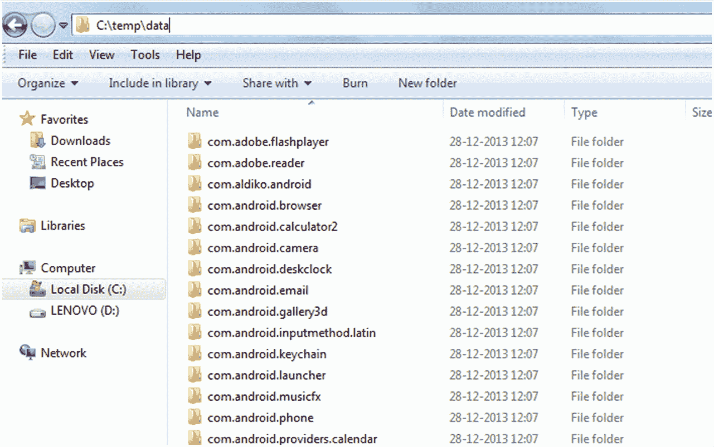
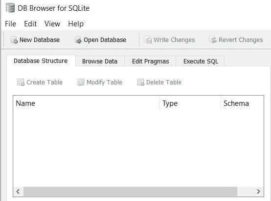
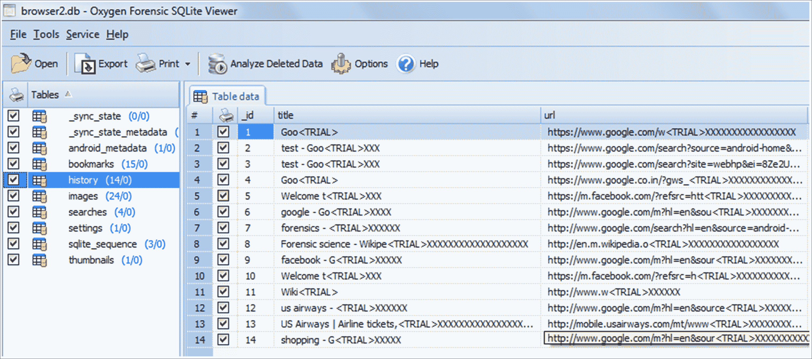
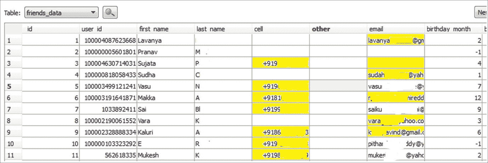
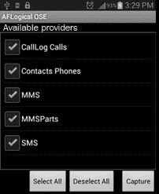
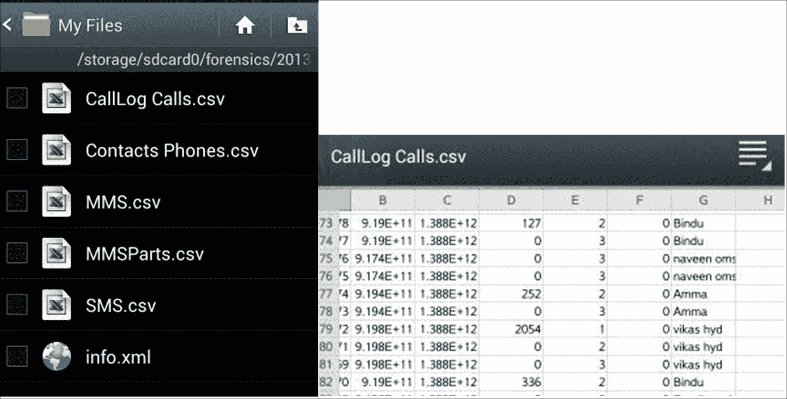
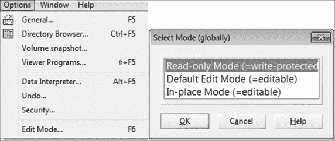
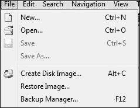
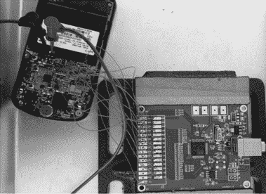

# 第九章：Android 数据提取技术

使用第八章中解释的任何屏幕锁定绕过技术，*Android 法证设置和数据提取技术*，检查员可以尝试访问被锁定的设备。一旦设备可访问，下一个任务是提取设备上的信息。这可以通过将各种数据提取技术应用于 Android 设备来实现。

本章将帮助您识别 Android 设备上的敏感位置，并解释可以应用于设备以提取必要信息的各种逻辑和物理技术。

在本章中，我们将涵盖以下主题：

+   理解数据提取技术

+   手动数据提取

+   逻辑数据提取

+   物理数据提取，包括成像 Android 设备和 SD 卡、JTAG 和芯片脱落技术

# 理解数据提取技术

驻留在 Android 设备上的数据可能是公司内部调查的一部分，也可能是民事、刑事或内部调查的一部分。在处理涉及 Android 设备的调查时，作为法证检查员，您需要注意在法证过程中需要处理的问题；这包括确定是否允许 root 访问（通过同意或法律授权），以及在调查期间可以提取和分析哪些数据。例如，在涉及跟踪的刑事案件中，法院可能只允许提取和分析嫌疑人所拥有的 Android 设备上的短信、通话记录和照片。在这种情况下，最好只逻辑捕获这些特定项目。然而，最好从设备中获取完整的物理数据提取，并仅检查法院允许的区域。您永远不知道您的调查可能会引向何处，最好立即从设备中获取尽可能多的数据，而不是希望在同意范围发生变化时能够获得完整的图像。Android 设备上的数据提取技术可以分为三种类型：

+   手动数据提取

+   逻辑数据提取

+   物理数据提取

正如第一章*移动取证简介*中所述，手动提取涉及正常浏览设备并捕获任何有价值的信息，而逻辑提取涉及访问文件系统，物理提取则是提取设备的逐位图像。这些类型的提取方法将在接下来的章节中详细描述。

有些方法可能需要设备被 root 才能完全访问数据。每种方法都有不同的影响，其成功率将取决于所使用的工具和方法，以及设备的制造和型号。

# 手动数据提取

这种提取方法涉及您利用移动设备的正常用户界面来访问存储器中的内容。您将通过访问不同的菜单来浏览设备，以查看通话记录、短信和即时通讯聊天等详细信息。每个屏幕的内容都通过拍照来捕获，并可以作为证据呈现。

这种类型的考察的主要缺点是只有通过操作系统（在 UI 模式下）可访问的文件才能被调查。在手动检查设备时必须小心，因为很容易按错按钮而擦除或添加数据。手动提取应该作为验证使用其他方法提取的结果的最后手段。某些情况可能需要您首先进行手动检查。这可能包括生死关头或失踪人员的案件，快速扫描设备可能会引导警方找到个人。

# 逻辑数据提取

逻辑数据提取技术通过与操作系统交互和访问文件系统来提取设备上的数据。这些技术很重要，因为它们提供有价值的数据，适用于大多数设备，并且易于使用。再次，当提取数据时，root 权限的概念再次出现。逻辑技术实际上不需要 root 权限来提取数据。但是，在设备上具有 root 权限允许您访问设备上的所有文件。这意味着在非 root 设备上可能提取一些数据，而 root 权限将打开设备并提供对设备上所有文件的访问。因此，在设备上具有 root 权限将极大地影响可以通过逻辑技术提取的数据的数量和类型。以下部分将解释可以用来从安卓设备逻辑提取数据的各种技术。

# ADB 拉取数据提取

如前所述，`adb`是一个命令行工具，可帮助您与设备通信以检索信息。使用`adb`，您可以从设备上的所有文件或您感兴趣的相关文件中提取数据。这是逻辑提取的最常用技术。

要通过`adb`访问安卓设备，必须启用 USB 调试选项。从安卓 4.2.2 开始，由于安全的 USB 调试，连接到设备的主机也必须经过授权。如果设备被锁定且未启用 USB 调试，请尝试使用第八章 *安卓取证设置和数据提取前技术*中解释的技术来绕过屏幕锁定。

作为法证检查员，重要的是要了解数据在安卓设备上的存储方式，并理解重要和敏感信息的存储位置，以便相应地提取数据。应用程序数据通常包含大量可能与调查相关的用户数据。应该检查与感兴趣的应用程序相关的所有文件，如第十章 *安卓数据分析和恢复*中所解释的那样。应用程序数据可以存储在以下位置之一：

+   **共享偏好**: 这里以轻量级 XML 格式存储数据的键值对。共享偏好文件存储在应用程序`/data`目录的`shared_pref`文件夹中。

+   **内部存储**: 这里存储的数据是私有的，存在于设备的内部存储器中。保存在内部存储器中的文件是私有的，其他应用程序无法访问。

+   **外部存储**: 这里存储的数据是设备外部存储器中的公共数据，通常不实施安全机制。这些数据可以在`/sdcard`目录中找到。

+   **SQLite 数据库**: 这些数据位于`/data/data/PackageName/`数据库中。通常以`.db`文件扩展名存储。可以使用 SQLite 浏览器([`sourceforge.net/projects/sqlitebrowser/`](https://sourceforge.net/projects/sqlitebrowser/))查看 SQLite 文件中的数据，或者通过在相应文件上执行必要的 SQLite 命令来查看。

每个安卓应用程序都使用前述的一种或多种数据存储选项在设备上存储数据。因此，联系人应用程序将在其包名下的`/data/data`文件夹中存储有关联系人详细信息的所有信息。请注意，`/data/data`是设备内部存储的一部分，在正常情况下，所有应用程序都安装在这里。一些应用程序数据将驻留在 SD 卡和`/data/data`分区中。使用`adb`，我们可以使用`adb pull`命令提取此分区中的数据以进行进一步分析。再次强调，这个目录只能在具有 root 权限的手机上访问。

在 Android 7.0（Nougat）中，引入了一种新的存储类型，称为设备加密存储，允许应用程序在此存储中存储某些类型的数据。因此，您将注意到新的文件路径，如`misc_de`、`misc_ce`、`system_de`和`system_ce`在`/data`文件夹下。从取证的角度来看，这是一个非常重要的变化，因为这也意味着在运行 Android Nougat 的设备上，`/data/data`*不是*存储工件的唯一位置，例如，

旧设备上的短信数据位置：`/data/com.android.providers.telephony/databases/smsmms.db`，Nougat 设备上的短信数据位置：`/user_de/0/com.android.providers.telephony/databases/smsmms.db`。

在 rooted 手机上，可以执行 Dropbox 应用程序的`databases`文件夹上的`adb pull`命令，如下所示：


adb pull 命令

同样，在 rooted 手机上，整个`/data`文件夹可以以这种方式被拉取。如下截图所示，Android 设备上完整的`/data`目录可以被复制到机器上的本地目录。整个`data`目录在 97 秒内被提取出来。提取时间将取决于`/data`中数据的数量。



从取证工作站提取的/data 目录

在非 rooted 设备上，对`/data`目录的`pull`命令不会提取文件，如下面的输出所示，因为 shell 用户没有权限访问这些文件：


非 rooted 设备上的 ADB pull 命令

通过上述过程从 rooted 手机复制的数据保持其目录结构，因此允许调查人员浏览必要的文件以获取信息。通过分析各个应用程序的数据，取证专家可以收集影响调查结果的关键信息。请注意，在取证工作站上本地检查文件夹将改变内容的日期和时间。您应该复制原始输出以用于日期/时间比较。

# 使用 SQLite Browser 查看数据

SQLite Browser 是一个在分析提取的数据过程中有所帮助的工具。SQLite Browser 允许您探索具有以下扩展名的数据库文件：`.sqlite`、`.sqlite3`、`.sqlitedb`、`.db`和`.db3`。使用 SQLite Browser 的主要优势是它以表格形式显示数据。

导航到文件 | 打开数据库，使用 SQLite Browser 打开`.db`文件。如下截图所示，有三个主要选项卡：数据库结构、浏览数据和执行 SQL。浏览数据选项卡允许您查看`.db`文件中不同表中的信息。

我们在分析过程中将主要使用这个选项卡。另外，诸如 Oxygen Forensic SQLite Viewer 之类的工具也可以用于相同的目的。从数据库文件中恢复已删除的数据是可能的，并将在第十章 *Android 数据分析和恢复*中进行解释。



SQLite Browser

以下部分将介绍如何识别重要数据，并手动从 Android 手机中提取各种详细信息。在早期章节中已经介绍了如何访问 Android 终端。在接下来的部分中，我们将直接开始从那里获取设备信息。

# 提取设备信息

了解您的 Android 设备的详细信息，如型号、版本等，将有助于您的调查。例如，当设备受到物理损坏，这会阻止对设备信息的检查时，您可以通过在`/system`文件夹下执行以下命令来获取有关设备的详细信息：

```kt
# cat build.prop
```

这可以在下面的截图中看到：


build.prop 文件

提取设备信息后，我们现在将提取通话记录。

# 提取通话记录

访问手机的通话记录通常在调查过程中需要确认某些事件。通话记录的信息存储在位于`/data/data/com.android.providers.contacts/databases/`下的`contacts2.db`文件中。如前所述，您可以使用 SQLite Browser 在将其提取到取证工作站上的本地文件夹后查看此文件中的数据。让我们看看如何按照以下步骤提取通话记录：

1.  如下屏幕截图所示，使用`adb pull`命令可以将必要的`.db`文件提取到取证工作站上的文件夹中：


将 contacts2.db 文件复制到本地文件夹

1.  请注意，用于拨打电话的应用程序可以将通话记录详细信息存储在各自的应用程序文件夹中。必须检查所有通信应用程序以获取通话记录详细信息，如下所示：

```kt
C:\android-sdk-windows\platform-tools>adb.exe pull
/data/data/com.android.providers.contacts C:temp 
```

这将产生以下输出：


1.  现在，使用 SQLite Browser（通过导航到文件|打开数据库）打开`contacts2.db`文件，并浏览不同表中的数据。`contacts2.db`文件中的通话表提供有关通话历史的信息。以下屏幕截图突出显示了通话历史以及名称、号码、持续时间和日期：


在运行 Android 7.0（Nougat）的设备上，通话记录数据已从`contacts2.db`文件中移出。在这些设备上，通话记录数据可以在`/data/com.android.providers.contacts/databases/calllog.db`中访问

# 提取短信/彩信

在调查过程中，您可能会被要求检索发送到特定移动设备的文本消息。因此，重要的是要了解详细信息存储在何处以及如何访问数据。`mmssms.db`文件位于`/data/data/com.android.providers.telephony/databases`下，包含必要的详细信息。与通话记录一样，您必须确保检查能够发送消息的应用程序，以便使用以下命令检查相关消息日志：

```kt
adb.exe pull /data/data/com.android.providers.telephony C:\temp
```

这将产生以下输出：


提取短信数据

电话号码可以在地址列下看到，相应的文本消息可以在正文列下看到，如下屏幕截图所示：


contacts2.db 文件中的通话表

我们现在将提取浏览器历史信息。

# 提取浏览器历史信息

提取浏览器历史信息通常是取证人员经常需要执行的任务。除了默认的 Android 浏览器外，Android 手机上还可以使用不同的浏览器应用程序，如 Firefox Mobile 和 Google Chrome。所有这些浏览器都以 SQLite`.db`格式存储其浏览器历史记录。在我们的示例中，我们正在将数据从默认的 Android 浏览器提取到我们的取证工作站。这些数据位于`/data/data/com.android.browser`。名为`browser2.db`的文件包含浏览器历史详细信息。以下屏幕截图显示了由 Oxygen Forensic SQLite Viewer 表示的浏览器数据。请注意，试用版将隐藏某些信息：



Oxygen Forensic SQLite Viewer 中的 browser2.db 文件

请注意，如果浏览器使用隐身模式，上述行为可能会发生变化。

在前述部分涵盖的几个细节如果浏览器使用隐身模式，则不会存储在设备上。接下来，我们将分析社交网络和即时通讯聊天。

# 社交网络/即时通讯聊天的分析

社交网络和即时聊天应用程序，如 Facebook、Twitter 和 WhatsApp，会透露可能在调查任何案件时有所帮助的敏感数据。分析过程与任何其他 Android 应用程序基本相同。将数据下载到法医工作站并分析`.db`文件，以找出是否可以发现任何敏感信息。例如，让我们看看 Facebook 应用程序，并尝试查看可以提取出哪些数据。

首先，我们提取`/data/data/com.facebook.katana`文件夹并导航到`databases`文件夹。该文件夹下的`fb.db`文件包含与用户账户相关的信息。`friends_data`表包含用户朋友的姓名，电话号码，电子邮件 ID 和出生日期等信息，如下截图所示。类似地，可以分析其他文件，以找出是否可以收集到任何敏感信息：



SQLite 浏览器中的 fb.db 文件

类似地，通过分析`/data/data`文件夹中的数据，可以获取有关地理位置、日历事件、用户笔记等信息。

# ADB 备份提取

从 Android 4.0 开始，Google 实施了`adb backup`功能，允许用户使用`adb`工具将应用程序数据备份到计算机。此过程不需要 root 访问权限，因此在法医检查期间非常有用。主要缺点是它不会备份设备上安装的每个应用程序。备份功能取决于应用程序，因为应用程序的所有者可以选择允许备份。备份默认是允许的，但开发人员可以禁用它。因此，大多数第三方应用程序都启用了此功能，并且`adb backup`命令将对它们起作用。以下是`adb backup`命令的语法：

```kt
adb backup [-f <file>] [-apk|-noapk] [-shared|-noshared] [-all] [-system|nosystem] [<packages...>]
```

让我们详细讨论一下：

+   `-f`：用于选择备份文件的存储位置。如果未指定，则默认为当前工作目录中的`backup.ab`。

+   `[-apk|noapk]`：用于选择是否备份`.apk`文件。默认为`-noapk`。

+   `[-obb|-noobb]`：用于选择是否备份`.obb`（APK 扩展）文件。默认为`-noobb`。

+   `[-shared|-noshared]`：用于选择是否从共享存储和 SD 卡备份数据。默认为`-noshared`。

+   `[-all]`：包括所有已启用备份的应用程序。

+   `[-system|-nosystem]`：用于选择是否包括系统应用程序。默认为`-system`。

+   `[<packages>]`：用于列出要备份的特定包名称。

一旦设备连接到工作站并且`adb`可以访问它，请运行`adb backup -shared -all`命令，如下截图所示：


adb 备份命令

运行命令后，用户需要在设备上批准权限，如下截图所示。因此，如果设备被锁定屏幕，就无法进行备份：


设备上的备份权限

Android 备份文件存储为`.ab`文件，并且默认情况下存储在 Android SDK 的`platform-tools`文件夹中。有免费工具，如 Android Backup Extractor，可以将`.ab`文件转换为`.tar`文件，然后可以查看。可以从[`sourceforge.net/projects/adbextractor/`](https://sourceforge.net/projects/adbextractor/)下载 Android Backup Extractor。这个工具是基于 Java 的应用程序，因此在使用该工具之前，请确保工作站上已安装了 Java。要将备份文件转换为`.tar`格式，请发出以下命令：

```kt
java -jar abe.jar unpack backup.ab backup.tar
```

这将自动创建一个带有`.tar`扩展名的文件，然后可以使用 WinRAR 或 7Zip 等存档工具轻松查看。但是，请注意，如果在创建备份时在设备上输入了密码，则文件将被加密，因此您需要在前面的命令中提供密码作为参数。备份文件包含两个主要文件夹——`apps`和`shared`。`apps`文件夹包含备份中包含的应用程序在`/data/data`下的所有信息。`shared`文件夹包含 SD 卡上存在的所有数据。

# ADB dumpsys 提取

`adb dumpsys`命令允许您收集有关系统上运行的服务和应用程序的信息。`adb shell dumpsys`命令为所有系统服务提供诊断输出。`dumpsys`命令不需要以 root 权限执行，并且只需要启用 USB 调试，就像任何其他`adb`命令一样。如下面的屏幕截图所示，要查看您可以与`dumpsys`一起使用的所有服务的列表，请运行`adb.exe shell service list`命令：


dumpsys 服务列表命令

分析某些`dumpsys`服务，如 Wi-Fi、用户和通知，在某些情况下可能会有所帮助。以下是一些有趣的情况，在这些情况下运行`dumpsys`命令可能有助于取证分析：

`dumpsys iphonesubinfo`服务可用于获取有关设备 ID 或 IMEI 号码的信息，如下面的屏幕截图所示：


显示 IMEI 号码的 dumpsys 命令

`dumpsys wifi`服务提供了用户访问的 Wi-Fi 点的信息。它显示了已保存连接的 SSID。这些信息可以用来确定用户的特定位置。以下是提供此信息的`adb dumpsys`命令：


显示最后连接的 Wi-Fi 详细信息的 dumpsys 命令

`dumpsys usagestats`服务提供了关于最近使用的应用程序以及它们的使用日期的信息。例如，以下屏幕截图显示，2016 年 2 月 1 日未使用任何应用程序，但在 2016 年 1 月 31 日使用了 Google Chrome 浏览器，并尝试备份手机数据：


显示最近使用的应用程序的 dumpsys 命令

请注意，对于`Date 20160201, android: 0`次表示未使用任何应用程序。但对于`Date: 20160131, android: 1 times`确认使用了一个应用程序，后面的部分提供了更多关于使用了哪个应用程序的详细信息。根据正在调查的案件，取证分析师需要确定任何`dumpsys`命令是否有用。在设备扣押后立即运行`dumpsys`命令可能会在以后非常有帮助。通过运行`adb shell dumpsys`命令，您可以记录所有`dumpsys`服务信息。

# 使用内容提供程序

在 Android 中，一个应用程序的数据在正常情况下无法被另一个应用程序访问。但是，Android 提供了一种机制，通过该机制可以与其他应用程序共享数据。这正是通过使用内容提供程序实现的。内容提供程序以一个或多个表的形式向外部应用程序提供数据。这些表与关系数据库中的表没有什么不同。它们可以被应用程序使用，通常通过 URI 寻址方案共享数据。它们由使用提供程序客户端对象访问提供程序的其他应用程序使用。在安装应用程序时，用户确定应用程序是否可以访问所请求的数据（内容提供程序）。例如，联系人、短信/彩信和日历是内容提供程序的示例。

因此，通过利用这一点，我们可以创建一个可以从所有可用的内容提供者中获取所有信息的应用程序。这正是大多数商业取证工具的工作原理。这种方法的优势在于它可以用于已 root 和未 root 的设备。在我们的示例中，我们使用 AFLogical，它利用内容提供者机制来访问信息。该工具提取数据并以 CSV 格式保存到 SD 卡中。以下步骤使用 AFLogical 开源版 1.5.2 从 Android 设备中提取信息：

1.  从[`github.com/nowsecure/android-forensics/downloads`](https://github.com/nowsecure/android-forensics/downloads)下载 AFLogical OSE 1.5.2。

AFLogical LE 版本能够提取大量信息，并需要通过法证使用活跃的执法部门或政府机构的电子邮件地址进行注册。AFLogical OSE 可以提取所有可用的 MMS、SMS、联系人和通话记录。

1.  确保 USB 调试模式已启用，并将设备连接到工作站。

1.  通过发出`adb.exe devices`命令来验证设备是否被识别：


识别连接的设备

1.  将 AFLogical OSE 应用程序保存在主目录中，并发出`adb.exe install AFLogical-OSE_1.5.2.apk`命令将其安装到设备上：


安装 AFLogical 应用程序

1.  安装应用程序后，可以直接从设备上运行，并单击应用程序底部的捕获按钮，如下面的屏幕截图所示：



AFLogical OSE 应用程序

1.  应用程序开始从相应的内容提供者提取数据，一旦过程完成，将显示一条消息，如下面的屏幕截图所示：


提取完成后显示的消息

1.  提取的数据保存在设备的 SD 卡中的一个名为`forensics`的目录中。提取的信息存储在 CSV 文件中，如下面的屏幕截图所示。可以使用任何编辑器查看 CSV 文件：



使用 AFLogical OSE 提取的文件

1.  同一目录中的`info.xml`文件提供有关设备的信息，包括 IMEI 号、IMSI 号、Android 版本、已安装应用程序的信息等。

但是，请注意，设备必须允许第三方应用程序安装（通过选择“未知来源”选项）才能正常工作。在第十一章中将介绍其他在调查中逻辑提取数据的工具，*Android 应用程序分析、恶意软件和逆向工程*。

本节涵盖了各种逻辑获取技术。现在我们将研究物理数据提取技术。

# 物理数据提取

物理提取是指获取设备的精确位对位图像的过程。重要的是要理解，位对位图像与复制和粘贴设备内容并不相同。如果我们复制和粘贴设备的内容，它只会复制可用文件，如可见文件、隐藏文件和系统相关文件。这种方法被认为是逻辑图像。使用这种方法，被`copy`命令删除的文件和无法访问的文件不会被复制。根据情况，可以使用某些技术恢复已删除的文件，我们将在接下来的章节中看到。与逻辑提取不同，物理提取是设备内存的精确副本，并包括更多信息，如松弛空间和未分配空间。

通过物理技术进行安卓数据提取通常使用`dd`命令进行，而其他高级技术如 JTAG 和芯片脱焊也可用，但通常难以实施，并需要极大的精度和经验才能在调查过程中尝试在真实设备上使用它们。与任何其他技术一样，如果个人执行这些程序不正确，设备上的数据可能会损坏或变得无法检索，从而使其在法庭上不可接受。JTAG 和芯片脱焊技术在接下来的章节中有详细介绍。然而，通过`dd`命令提取数据需要 root 权限。接下来的章节将概述可以用来执行物理提取的各种技术。

# 成像安卓手机

设备成像是移动设备取证中最重要的步骤之一。在可能的情况下，在执行任何直接从设备中提取数据的技术之前，必须先获取安卓设备的物理镜像。在取证中，这个获取物理镜像的过程通常被称为“成像设备”。术语物理镜像、取证镜像和原始镜像经常被用来指代通过这一过程捕获的镜像。让我们首先回顾一下在台式电脑上如何进行成像，因为这有助于我们理解并意识到成像安卓设备所涉及的问题。假设从嫌疑人那里夺取了一台未开机的台式电脑，并送去进行取证检查。在这种情况下，典型的取证员会移除硬盘，连接到写保护器，并使用任何可用的工具获取逐位取证镜像。原始硬盘在数据的取证成像过程中得到安全保护。

对于安卓设备，包含数据的所有区域都不能轻易移除。此外，如果设备在接收检查时处于活动状态，就不可能在不对其进行任何更改的情况下分析设备，因为任何交互都会改变设备的状态。

安卓设备可能有两个文件存储区域：内部和外部存储。内部存储指的是内置的非易失性存储器。外部存储指的是可移动存储介质，如 micro SD 卡。然而，重要的是要注意，一些设备没有可移动的存储介质，如 SD 卡，而是将可用的永久存储空间划分为内部和外部存储。因此，并不总是外部存储是可移动的。当可移动的 SD 卡存在时，必须获取存储卡的取证镜像。正如在第七章中所讨论的，“理解安卓”中所述，这些可移动卡通常使用 FAT32 文件系统格式化。一些移动设备取证方法将通过安卓设备获取 SD 卡。这个过程虽然有用，但由于 USB 手机数据线的速度限制，将会很慢。

默认情况下，安卓不提供对内部目录和系统相关文件的访问。这种受限访问是为了确保设备的安全。例如，在非 root 设备上无法访问`/data/data`文件夹。这个文件夹对我们来说特别重要，因为它存储了大部分用户创建的数据，许多应用程序将有价值的数据写入此文件夹。因此，为了获取设备的图像，我们需要对安卓设备进行 root。对设备进行 root 将赋予我们超级用户权限并访问所有数据。重要的是要意识到，本书一直强调，所有步骤都应该是取证上的，并且在可能的情况下不应该对设备进行更改。对安卓设备进行 root 将对其进行更改，并且应该在之前未调查过的设备上进行测试。对安卓设备进行 root 是常见的，但获得 root 权限可能会改变设备，使数据发生改变，甚至被删除。一些安卓设备，如 Nexus 4 和 5，在允许 root 权限之前可能会强制擦除数据分区。这就消除了对设备进行 root 以获得访问权限的需要，因为在此过程中所有用户数据都会丢失。只需记住，虽然成功进行 root 可以访问更多数据，但也可能会擦除数据或销毁手机。因此，在进行 root 之前，必须确保您有同意或合法权利来操作安卓设备。由于第八章中已经讨论了 root 技术，*安卓取证设置和数据提取前技术*，我们将继续进行示例，假设设备已经 root。

以下是获取已 root 的安卓设备的取证图像的逐步过程：

1.  将安卓设备连接到工作站，并通过发出`adb devices`命令来验证设备是否被识别，如下所示：


识别连接的设备

1.  一旦`adb`访问准备就绪，可以通过以下步骤从安卓设备中获取分区： 

+   **使用**`dd`**命令**：`dd`命令可用于创建设备的原始镜像。此命令帮助我们通过复制低级数据来创建安卓设备的逐位图像。

+   **插入新的 SD 卡**：将新的 SD 卡插入设备，将图像文件复制到该卡中。确保此 SD 卡已擦除并且不包含任何其他数据。您可能还需要证明驱动器上没有其他数据。

+   **执行命令**：安卓设备的文件系统存储在`/dev`分区的不同位置。对三星 Galaxy S3 手机执行简单的`mount`命令返回以下输出：


安卓设备上的 mount 命令输出

1.  从上述输出中，我们可以确定`/system`、`/data`和`/cache`分区被挂载的块。虽然重要的是镜像所有文件，但大部分数据都存在于`/data`和`/system`分区中。如果时间允许，应该获取所有分区以确保完整性。完成此操作后，执行以下命令来镜像设备：

```kt
dd if=/dev/block/mmcblk0p12 of=/sdcard/tmp.image
```

在上述示例中，使用了三星 Galaxy S3 的数据分区（其中`if`是输入文件，`of`是输出文件）。

上述命令将创建`mmcblk0p12`文件（数据分区）的逐位图像，并将图像文件复制到 SD 卡中。完成此操作后，可以使用可用的取证软件分析`dd`图像文件。

您必须确保 SD 卡有足够的存储空间来容纳数据分区镜像。还有其他方法可用于从已 root 的设备中获取数据。

如果无法直接将图像写入 SD 卡，则可以使用`netcat`命令将输出直接写入计算机。`netcat`工具是用于在网络连接上传输数据的基于 Linux 的工具。Android 设备通常不会预装`netcat`。让我们看看如何在以下步骤中使用此命令：

1.  要检查`netcat`是否已安装，只需打开 ADB shell 并键入`nc`。如果返回说找不到 nc，则必须在设备上手动安装`netcat`。您可以在[`sourceforge.net/projects/androidforensics-netcat/files/`](https://sourceforge.net/projects/androidforensics-netcat/files/)下载为 Android 编译的`netcat`。

1.  使用以下命令将`netcat`推送到设备上：

```kt
adb push nc /dev/Case_Folder/nc
```

该命令应该已在`/dev`中创建了`Case_Folder`，并且`nc`应该在其中。

1.  现在，我们需要在 ADB shell 中为其授予执行权限。可以按以下步骤完成：

```kt
chomd +x /dev/Case_Folder/nc
```

1.  在计算机上打开两个终端窗口，其中一个打开 ADB shell。另一个将用于监听从设备发送的数据。现在，我们需要在计算机上通过 ADB 启用端口转发：

```kt
adb forward tcp:9999 tcp:9999
```

`9999`是我们选择用于`netcat`的端口；在 Linux 或 Mac 系统上，可以是`1023`到`65535`之间的任意端口号（`1023`及以下保留用于系统进程，并且需要 root 权限才能使用它们）。在另一个终端窗口中，运行以下命令：

```kt
nc 127.0.0.1 9999 > data_partition.img
```

`data_partition.img`文件现在应该在计算机的当前目录中创建。数据传输完成后，`netcat`将在两个终端中终止并返回到命令提示符。该过程可能需要相当长的时间，具体取决于图像的大小。

# 成像存储卡（SD 卡）

有许多可用的工具可以对存储卡进行成像。以下示例使用`WinHex`创建 SD 卡的原始磁盘映像。以下是使用 WinHex 对存储卡进行成像的逐步过程：

1.  **连接存储卡**：从存储卡槽中取出 SD 卡，并使用读卡器将存储卡连接到取证工作站。

1.  **写保护卡**：使用 WinHex 打开磁盘。导航到选项|编辑模式，并选择只读模式（=写保护模式），如下图所示。这是为了确保设备是只读的，不能在其上写入任何数据：



WinHex 编辑模式视图（左）和启用 WinHex 只读模式（右）

1.  **计算哈希值**：计算存储卡的哈希值，以确保在调查过程中没有进行任何更改。导航到工具|计算哈希，并选择任何哈希算法。

1.  **创建磁盘映像**：导航到文件|创建磁盘映像，如下图所示。选择原始图像选项（`.dd`）以创建图像。这完成了存储卡的成像：



WinHex 磁盘映像选项

使用先前描述的任何方法获得取证图像后，需要对其进行分析以提取相关信息。有几种商业工具，如 Cellebrite 和 XRY，可以分析图像文件。Android 图像的分析在第十章“Android 数据分析和恢复”中有详细介绍。

# 联合测试行动组

**联合测试行动组**（**JTAG**）涉及使用高级数据采集方法，涉及连接到设备上的特定端口，并指示处理器传输设备上存储的数据。使用此方法可以获取设备的完整物理图像。建议首先尝试先前提到的其他技术，因为它们易于实施并且需要较少的工作。分析人员在尝试 JTAG 之前必须有经验和适当的培训，因为如果处理不当，设备可能会受到损坏。

JTAG 过程通常涉及以下取证步骤：

1.  在 JTAG 中，设备的**测试访问端口**（**TAPs**）用于访问设备的 CPU。识别 TAPs 是主要且最重要的步骤。 TAPs 被识别，并且连接被追踪到 CPU 以找出哪个接触点负责每个功能。尽管设备制造商会为特定设备的 JTAG 原理图提供文档资源，但这些资源不会对外公开。一个关于 Android 设备上 JTAG 的好网站是[`forensicswiki.xyz/wiki/index.php?title=JTAG_Forensics`](https://forensicswiki.xyz/wiki/index.php?title=JTAG_Forensics)。

1.  导线引线然后焊接到适当的连接器引脚，另一端连接到可以控制 CPU 的设备，如下图所示（由 Jim Swauger 在[`www.binaryintel.com/services/jtag-chip-off-forensics/jtag-forensics/`](http://www.binaryintel.com/services/jtag-chip-off-forensics/jtag-forensics/)发布） 。 JTAG 夹具可用于放弃对某些设备的焊接。夹具或 JTAG 适配器的使用消除了焊接的需要，因为它连接了 TAP 到 CPU：



JTAG 设置

+   完成上述步骤后，必须施加电源以启动 CPU。必须施加的电压取决于硬件制造商发布的规格。不要施加超出规格中给定数字的电压。

+   施加电源后，可以提取 NAND 闪存的完整二进制内存转储。

+   使用本书学习的取证技术和工具分析提取的数据。在获取期间将获得一个原始的`.bin`文件；大多数取证工具都支持对这种图像格式的摄取和分析。

JTAG 可能听起来很复杂（也许是），但它有许多有用的用途，以下列出了三个优点：

+   这种技术的主要优势是即使设备未开启也可以工作。

+   不需要 root，ADB 或 USB 调试。

+   它可以用于恢复设备的 PIN 码/密码，因此可以对整个闪存进行成像，并恢复/破解密码文件。

还需要了解 JTAG 技术不应导致设备功能丧失。如果正确重新组装，设备应该可以正常运行。尽管 JTAG 技术在提取数据方面是有效的，但只有经验丰富和合格的人员才能尝试。在焊接 JTAG 接触点或施加错误电压时出现任何错误可能会严重损坏设备。

# 芯片脱落技术

芯片脱落，顾名思义，是一种从设备中移除 NAND 闪存芯片并进行检查以提取信息的技术。因此，即使设备受到密码保护并且未启用 USB 调试，这种技术也可以工作。与 JTAG 技术不同，设备在检查后通常会被破坏，也就是说，重新连接 NAND 闪存到设备后更加困难。重新连接 NAND 闪存到设备的过程称为重新焊球，需要培训和实践。

Chip-off 技术通常涉及以下取证步骤：

1.  必须研究设备上的所有芯片，以确定哪个芯片包含用户数据。

1.  确定后，NAND 闪存从设备中物理移除。这可以通过施加热量来去焊接芯片来完成：


芯片脱落技术

来源：http://www.binaryintel.com/services/jtag-chip-off-forensics/chip-off_forensics/

1.  这是一个非常细致的过程，必须非常小心，因为可能会损坏 NAND 闪存。

1.  然后清洁和修复芯片，以确保连接器存在并且正常工作。

1.  使用专门的硬件设备适配器，现在可以读取芯片。这是通过将芯片插入支持特定 NAND 闪存芯片的硬件设备中来完成的。在这个过程中，从芯片中获取原始数据，生成一个`.bin`文件。

1.  现在可以使用取证技术和之前描述的工具对获取的数据进行分析。

芯片脱落技术在设备严重损坏、锁定或无法访问时最有帮助。然而，这种技术的应用不仅需要专业知识，还需要昂贵的设备和工具。在取出 NAND 闪存时总会有损坏的风险，因此建议首先尝试逻辑技术来提取任何数据。

虽然在执行前面讨论的任何技术时都必须具有根访问权限，但在撰写本书时，必须指出，这些技术中没有一种适用于启用了**全盘加密**（**FDE**）的设备。正如在第七章中所讨论的*了解 Android*，Google 已经要求从 Android 6.0 开始，大多数设备都使用 FDE。尽管已经演示并发布了一些解密全盘加密的技术，但它们是特定于设备的，不具有普遍适用性。

# 总结

本章涵盖了各种手动、逻辑和物理数据提取技术。我们学会了在调查过程中何时以及如何应用这些技术。逻辑技术通过使用 ADB 等工具与设备交互来提取数据。另一方面，物理技术可以访问更多的数据；它们是复杂的，需要大量的专业知识来执行。对设备进行成像会产生设备的逐位图像，稍后可以使用工具对其进行分析。对设备进行成像是确保设备上的数据未被修改的主要步骤之一。Android 7.0 及以上版本为取证调查人员带来了新的挑战，引入了新的安全功能和可能限制获取的文件路径。有了这些知识，您可以执行设备获取操作，从 Android 设备中提取相关数据。

在下一章中，我们将看到如何从图像文件中提取通话记录、短信和浏览历史等相关数据。我们还将介绍数据恢复技术，使用这些技术可以从设备中恢复删除的数据。
