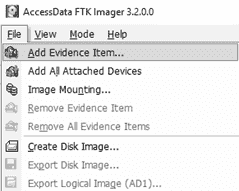
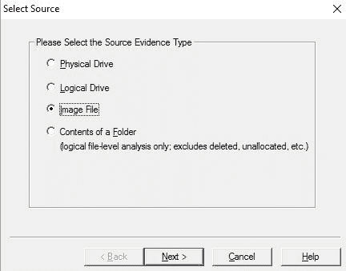
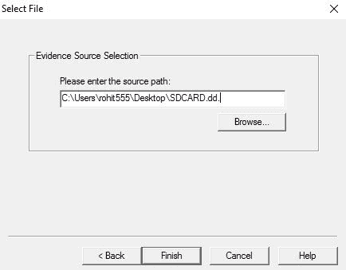
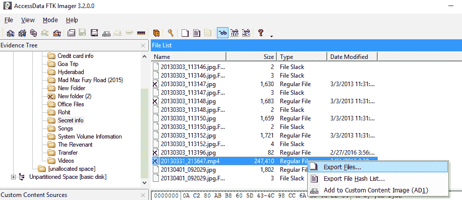
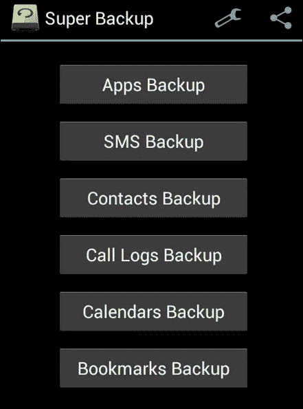
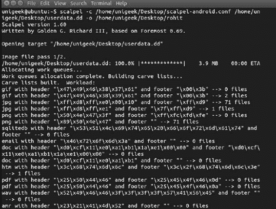
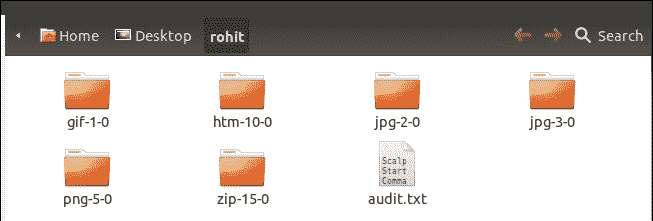

# 第十章：Android 数据分析和恢复

在上一章中，我们介绍了各种逻辑和物理提取技术。在物理提取中，获得了 Android 设备的逐位镜像，其中包含有价值的信息。在本章中，我们将学习如何分析和提取图像文件中的通话记录和短信等相关数据。虽然数据提取和分析技术提供了各种详细信息，但并非所有技术都能提供有关已删除数据的信息。数据恢复是移动取证的关键方面，因为它有助于发现已删除的项目。

本章旨在涵盖法证分析员可以使用的各种技术，以从 Android 设备中恢复数据。

在本章中，我们将涵盖以下两个主要主题：

+   使用 Autopsy 工具分析和提取 Android 镜像文件中的数据

+   了解从 SD 卡和内部存储器中恢复已删除文件的技术

# 使用 Autopsy 工具分析和提取 Android 镜像文件中的数据

术语**Android 镜像**指的是通过执行任何物理数据提取技术获得的物理镜像（也称为法证镜像或原始镜像）。使用第九章中解释的技术，*Android 数据提取技术*，您可以对整个`/data/data`块或任何与调查相关的特定块进行镜像。一旦获得镜像，像您这样的调查人员可以手动查看文件内容或利用可用工具来解析内容。商业工具，如 Cellebrite 和 XRY，可以深入挖掘数据并呈现内容的全面图片。Autopsy 是法证界中使用非常广泛的开源工具之一，它在分析 Android 镜像方面表现出色。

# Autopsy 平台

Autopsy 是一个法证平台，作为 Sleuth Kit 的 GUI。它是免费提供的；您可以在[`www.sleuthkit.org/`](http://www.sleuthkit.org/)下载。Sleuth Kit 是一组 Unix 和基于 Windows 的工具和实用程序，用于进行法证分析。Autopsy 通过对给定卷进行法证分析来显示结果，从而帮助调查人员专注于数据的相关部分。Autopsy 是免费且可扩展的，并且有几个可以插入的模块。Autopsy 可用于加载和分析在物理提取后获得的 Android 镜像。

# 将图像添加到 Autopsy

下载并安装 Autopsy 后，按照以下步骤将图像添加到 Autopsy 中：

1.  打开 Autopsy 工具，并选择“创建新案例”选项，如下面的屏幕截图所示：


在 Autopsy 中创建新案例

1.  输入所有必要的案例详细信息，包括案例名称、数据存储位置等，如下面的屏幕截图所示：


在 Autopsy 中输入案例信息

1.  输入案例编号和审查员详细信息，然后点击“完成”。

1.  现在，点击“添加数据源”按钮，添加要分析的图像文件，然后点击“下一步”：


在 Autopsy 中输入数据源信息

1.  在下一个屏幕上，您可以配置在图像上运行哪些模块，如下面的屏幕截图所示。建议选择最近活动、Exif 解析器、关键字搜索和 Android 分析器模块。在下一步中，点击“完成”：


在 Autopsy 中配置模块

完成后，工具通常需要几分钟来解析图像，具体取决于图像的大小。在此期间，如果工具遇到任何错误或警告消息，您可能会看到一些错误。但是，与其他工具相比，Autopsy 在访问工件和文件系统时提供了最快的访问速度。

# 使用 Autopsy 分析图像

加载图像后，展开“数据源”下的文件，以查看图像中的数据。例如，以下屏幕截图显示了`/data/`文件夹中的内容：


在 Autopsy 中分析图像

在上面的示例中，只对设备的`/data`部分进行了成像。如果对整个设备进行成像，那么工具将显示更多卷。根据调查的基本细节，需要分析相关部分。在下面的示例中，通过检查`com.android.browser`下的文件夹，我们可以提取用户访问的各种网站列表以及它们的访问日期：


在 Autopsy 中分析浏览详细信息

通过分析各个部分下的数据，可以发现有价值的数据，例如短信、浏览历史、聊天记录、通话记录、图片、视频和位置详情。在下一节中，我们将研究从 SD 卡和内部存储器中恢复数据。

# 了解从 SD 卡和内部存储器中恢复已删除文件的技术

数据恢复是取证分析中最重要和最强大的方面之一。恢复已删除的数据的能力对于破解许多民事和刑事案件至关重要。从普通用户的角度来看，恢复已删除的数据通常指的是操作系统内置的解决方案，例如 Windows 中的回收站。虽然可以从这些位置恢复数据，但由于用户意识的增加，这些选项通常不起作用。例如，在台式电脑上，人们现在使用*Shift* + *Delete*来彻底从桌面上删除文件。

数据恢复是在无法正常访问设备时从设备中检索已删除数据的过程。考虑一种情况，即从恐怖分子手中夺取了一部手机。知道恐怖分子删除了哪些项目将是至关重要的吗？访问任何已删除的短信、图片、拨打的号码、应用程序数据等都可能至关重要，因为它们通常会透露敏感信息。对于 Android，如果正确获取了设备文件，就可以恢复大部分已删除的数据。但是，如果在处理设备时不注意，已删除的数据可能会永远丢失。为了确保已删除的数据不会被覆盖，建议牢记以下几点：

+   夺取手机后不要进行任何活动。设备上的已删除数据会一直存在，直到其他传入数据需要空间。因此，为了防止数据被覆盖，手机不得用于任何活动。

+   即使手机没有使用，也会自动覆盖数据，而无需我们进行任何干预。例如，一条新短信会自动占用空间，可能会覆盖标记为删除的数据。为了防止发生这种情况，您应该遵循前几章描述的取证处理方法。最简单的解决方案是将设备置于飞行模式或禁用设备上的所有连接选项。这可以防止传递任何新消息。

所有 Android 文件系统都有包含有关文件层次结构、文件名等信息的元数据。删除不会真正擦除这些数据，而是删除文件系统的元数据。当从设备中删除短信或任何其他文件时，它们只是对用户不可见，但文件仍然存在于设备上。基本上，这些文件只是标记为删除，但它们仍然存在于文件系统中，直到被覆盖。从 Android 设备中恢复已删除的数据涉及两种情况：从 SD 卡中恢复已删除的数据，如图片、视频、应用程序数据等，以及从设备的内部存储器中恢复已删除的数据。以下部分涵盖了可以用来从 SD 卡和 Android 设备的内部存储器中恢复已删除数据的技术。

# 从外部 SD 卡中恢复已删除的数据

存储在 SD 卡上的数据可以向取证人员透露大量信息。SD 卡能够存储手机相机拍摄的照片和视频、语音录音、应用程序数据、缓存文件等。基本上，任何可以存储在计算机硬盘上的东西都可以存储在 SD 卡上，只要可用空间允许。

从外部 SD 卡中恢复已删除的数据是一个简单的过程。SD 卡可以作为外部大容量存储设备挂载，并且可以使用标准的数字取证方法进行取证，如第九章 *Android 数据提取技术*中所讨论的。如前几章所述，Android 设备中的 SD 卡通常使用 FAT32 文件系统。这主要是因为 FAT32 文件系统在包括 Windows、Linux 和 macOS X 在内的大多数操作系统中得到了广泛支持。FAT32 格式化的驱动器上的最大文件大小约为 4GB。随着越来越高分辨率的格式现在可用，这个限制通常会被达到。除此之外，FAT32 只能用于小于 32GB 的分区。因此，现在一些设备中使用了克服这些问题的 exFAT 文件系统。

如果可以将外部 SD 卡挂载为驱动器，那么从中恢复已删除的数据就可以很容易地完成。因此，如果 SD 卡是可移动的，可以使用写入阻断器将其连接到工作站进行取证。然而，最新的 Android 设备通常不会作为大容量存储挂载。这是因为这些设备使用**媒体传输协议**（MTP）或**图片传输协议**（PTP）协议，而不是 USB 大容量存储。USB 大容量存储的问题在于计算机需要对存储进行独占访问。换句话说，当连接到工作站时，外部存储需要完全断开与 Android 操作系统的连接。这给移动应用程序带来了其他一些复杂性。当 Android 设备使用 MTP 时，它会被计算机识别为媒体设备，而不是可移动存储，如下图所示：


使用 MTP 连接 Android 设备

但是，普通的数据恢复工具需要挂载驱动器才能进行扫描。因此，大多数使用 MTP/PTP 的最新设备不被视为挂载驱动器，因此传统的适用于计算机的数据恢复工具在这些设备上不起作用。

因此，当设备使用 MTP/PTP 并且没有作为驱动器挂载时，可以通过某些需要打开 USB 调试选项的特定于 Android 的数据恢复工具来进行恢复。市场上几乎所有的 Android 数据恢复工具都需要您启用 USB 调试，以便在开始 Android 数据恢复之前识别您的设备和 SD 卡。

您必须了解，安卓设备可能会使用 SD 卡上的空间来缓存应用程序数据；因此，在移除 SD 卡之前，确保尽可能多地从设备获取数据非常重要。一些旧设备在通过 USB 连接时会自动将设备挂载为驱动器。在数据提取、数据恢复等方面，直接在设备上操作不是一个良好的取证实践。因此，需要获取 SD 卡的物理镜像，并在镜像上执行所有必要的分析。建议通过设备以及单独获取 SD 卡，以确保获取所有数据。要获取 SD 卡镜像，可以在设备运行时使用`adb`中的`dd`来获取设备的 SD 卡镜像，如果设备由于可能在内存中运行的证据而无法关闭电源。如果 SD 卡被移除并通过读卡器连接到工作站，它将显示为外部大容量存储，然后可以使用早期章节中描述的标准取证技术来制作镜像。

获取镜像后，可以使用任何标准的取证工具进行分析，例如 FTK Imager。FTK Imager 是一个简单的工具，可用于创建和分析磁盘镜像。可在[`accessdata.com/product-download/ftk-imager-version-3.2.0`](https://accessdata.com/product-download/ftk-imager-version-3.2.0)下载。

以下是使用 FTK Imager 从 SD 卡镜像中恢复已删除文件的逐步过程：

1.  启动 FTK Imager，单击“文件”，然后在菜单中单击“添加证据项...”：



在 FTK Imager 中添加证据

1.  在“选择源”对话框中选择“图像文件”作为证据类型，然后单击“下一步”：



在 FTK Imager 中选择文件类型

1.  在“选择文件”对话框中，转到存在`SDCARD.dd`SD 卡镜像文件的位置，选择它，然后单击“完成”：



在 FTK Imager 中选择要分析的镜像文件

1.  然后在查看窗格中显示 SD 卡镜像的内容。您可以通过单击“+”号来浏览文件夹。当文件夹被突出显示时，其内容将显示在右窗格中。选择文件后，其内容将显示在底部窗格中。如下图所示，已删除的文件也显示为图标上的红色叉号：


在 FTK Imager 中显示带有红色叉号的图标的已删除文件

1.  要将已删除的文件复制到工作站，请右键单击标记的文件，然后选择“导出文件...”，如下图所示：



在 FTK Imager 中恢复已删除的图像

还建议检查设备是否安装了任何备份应用程序或文件。最初的安卓版本没有包括用户备份其个人数据的机制。因此，用户广泛使用了几个备份应用程序。使用这些应用程序，用户可以将其数据备份到 SD 卡或云端。例如，**Super Backup**应用程序包含了备份通话记录、联系人、短信等选项，如下图所示：



超级备份安卓应用程序

检测到备份应用程序后，必须尝试确定数据存储在何处。通常，备份文件夹路径是内部 SD 卡。备份应用程序的设置中也包含文件夹路径。备份中保存的数据可能包含重要信息，因此，在设备上寻找任何第三方备份应用程序将非常有帮助。

# 从内部存储器中恢复数据

从 Android 设备的内部存储器中恢复已删除的文件（如短信、联系人和应用数据）并非所有分析工具都支持，可能需要手动切割。与一些包含常见文件系统的媒体（如 SD 卡）不同，取证工具可能无法识别和挂载文件系统。此外，除非手机已 root 处理，否则无法访问 Android 手机的内部存储器的原始分区。建议在 root 处理发生之前和之后对设备进行镜像。在尝试从 Android 设备的内部存储器中恢复数据时，可能会面临以下一些其他问题：

+   要访问内部存储器，可以尝试对手机进行 root 处理。但是，root 处理过程可能涉及向`/data`分区写入一些数据，这个过程可能会覆盖设备上有价值的数据。

+   与 SD 卡不同，这里的内部文件系统不是 FAT32（这是取证工具广泛支持的）。内部文件系统可能是 YAFFS2（在旧设备上）、EXT3、EXT4、RFS 或专为 Android 运行而构建的其他文件系统。因此，许多专为 Windows 文件系统设计的恢复工具将无法使用。

+   Android 设备上的应用数据通常以 SQLite 格式存储。虽然大多数取证工具提供对数据库文件的访问，但可能需要将其导出并在本机浏览器中查看。您必须检查原始数据，以确保取证工具没有忽略已删除的数据。

讨论的原因使从内部存储器中恢复已删除的数据变得困难，但并非不可能。Android 设备的内部存储器保存了大部分用户数据以及您调查的可能关键。如前所述，设备必须经过 root 处理才能访问原始分区。市面上大多数 Android 恢复工具并未强调它们只能在 root 手机上运行的事实。现在让我们看看如何从 Android 手机中恢复已删除的数据。

# 通过解析 SQLite 文件来恢复已删除的文件

Android 使用 SQLite 文件来存储大部分数据。与短信、电子邮件和某些应用数据相关的数据存储在 SQLite 文件中。SQLite 数据库可以在数据库本身内存储已删除的数据。用户标记为删除的文件不再出现在活动的 SQLite 数据库文件中。因此，可以恢复已删除的数据，如短信和联系人。SQLite 页面中有两个区域可能包含已删除的数据——未分配的块和空闲块。

大多数恢复已删除数据的商业工具会扫描 SQLite 页面的未分配块和空闲块。可以使用可用的取证工具（如**Oxygen Forensics SQLite Viewer**）来解析已删除的数据。SQLite Viewer 的试用版可用于此目的；但是，对您可以恢复的数据量有一定限制。您可以编写自己的脚本来解析文件中的已删除内容，但这需要对 SQLite 文件格式有很好的理解。[`www.sqlite.org/fileformat.html`](http://www.sqlite.org/fileformat.html) 页面是一个很好的起点。如果您不想重复造轮子，想要重用现有的脚本，可以尝试使用可用的开源 Python 脚本（[`az4n6.blogspot.in/2013/11/python-parser-to-recover-deleted-sqlite.html`](http://az4n6.blogspot.in/2013/11/python-parser-to-recover-deleted-sqlite.html)）来解析 SQLite 文件中的已删除记录。

在我们的示例中，我们将从安卓设备中恢复已删除的短信。从安卓手机中恢复已删除的短信经常被要求作为设备取证分析的一部分，主要是因为短信包含的数据可以揭示很多信息。有不同的方法可以在安卓设备上恢复已删除的短信。首先，我们需要了解消息在设备上的存储位置。在第九章中，*安卓数据提取技术*，我们解释了安卓设备上存储用户数据的重要位置。以下是对此的快速回顾：

+   每个应用程序都将其数据存储在`/data/data`文件夹下（同样，这需要 root 权限来获取数据）。

+   位于`/data/data/com.android.providers.telephony/databases`位置下的文件包含有关短信/彩信的详细信息。

在上述位置下，短信存储在名为`mmssms.db`的 SQLite 数据库文件中。可以通过检查此文件来恢复已删除的短信。以下是使用`mmssms.db`文件恢复已删除短信的步骤：

1.  在安卓设备上，启用 USB 调试模式并将设备连接到取证工作站。使用`adb`命令行工具，通过以下命令提取位于`/data/data/`下的数据库文件夹：

```kt
adb.exe pull /data/data/com.android.providers.telephony/databases C:\temp

```

输出如下所示：


ADB pull 命令

一旦文件被提取到本地机器上，使用 Oxygen Forensics SQLite Viewer 工具打开`mmssms.db`文件。

1.  点击名为`sms`的表，并观察工具中 Tables 数据选项卡下的当前消息。

1.  查看已删除数据的一种方法是点击包含已删除数据的块选项卡，如下截图所示：


恢复已删除的短信

同样，存储在 SQLite 文件中的安卓设备上的其他数据可以通过解析已删除内容来恢复。当前述方法无法访问已删除数据时，应查看原始十六进制文件中标记为已删除的数据，可以手动切割和报告。

# 使用文件切割技术恢复文件

文件切割是取证中非常有用的方法，因为它允许恢复已删除或隐藏的数据以进行分析。简而言之，文件切割是在没有文件系统元数据的情况下从片段中重新组装计算机文件的过程。在文件切割中，指定的文件类型在二进制数据中搜索并提取，以创建分区或整个磁盘的取证镜像。文件切割仅基于文件结构和内容从驱动器的未分配空间中恢复文件，而不需要匹配文件系统元数据。未分配空间指的是不再包含任何由文件系统结构指示的文件信息的驱动器部分，如文件表。

可以通过扫描磁盘的原始字节并重新组装它们来恢复或重建文件。这可以通过检查文件的头部（前几个字节）和尾部（最后几个字节）来完成。

文件切割方法根据使用的基本技术进行分类。头部-尾部切割方法依赖于根据其头部和尾部信息恢复文件。例如，对于 JPEG 文件，这些文件以`0xffd8`开头，以`0xffd9`结尾。

标识头部和尾部的位置，然后切割两个端点之间的所有内容。同样，基于文件结构的切割方法使用文件的内部布局来重建文件。然而，传统的文件切割技术，如我们已经解释过的技术，如果数据是分段的，则可能无法工作。为了克服这一点，新技术，如智能切割，利用几种流行文件系统的分段特性来恢复数据。

一旦手机被成像，就可以使用**Scalpel**等工具对其进行分析。Scalpel 是一个功能强大的开源实用程序，用于切割文件。该工具分析块数据库存储，识别已删除的文件并恢复它们。Scalpel 与文件系统无关，并且已知可以在各种文件系统上工作，包括 FAT、NTFS、EXT2、EXT3、HFS 等。有关 Scalpel 的更多详细信息，请访问[`github.com/sleuthkit/scalpel`](https://github.com/sleuthkit/scalpel)。以下步骤解释了如何在 Ubuntu 工作站上使用 Scalpel：

1.  使用`sudo apt-get install scalpel`命令在 Ubuntu 工作站上安装 Scalpel。

1.  `/etc/scalpel`目录下的`scalpel.conf`文件包含有关支持的文件类型的信息，如下面的屏幕截图所示：


手术刀配置文件

需要修改此文件以提及与 Android 相关的文件。可以从[`www.nowsecure.com/tools-and-trainings/#viaforensics`](https://www.nowsecure.com/tools-and-trainings/#viaforensics)下载样本`scalpel.conf`文件。您还可以取消注释文件并保存`conf`文件以选择您喜欢的文件类型。完成后，用下载的文件替换原始的`conf`文件。

1.  Scalpel 需要在正在检查的`dd`镜像上运行前面的配置文件。您可以使用以下命令运行该工具，输入配置文件和`dd`文件：

```kt
$ scalpel -c /home/unigeek/Desktop/scalpel-android.conf /home/unigeek/Desktop/userdata.dd -o /home/unigeek/Desktop/rohit
```

运行此命令后，工具开始切割文件并相应地构建它们，如下面的屏幕截图所示：



在 dd 文件上运行 Scalpel 工具

1.  在前面的命令中指定的`output`文件夹现在包含基于文件类型的文件夹列表，如下面的屏幕截图所示。每个文件夹都包含基于文件夹名称的数据。例如，`jpg 2-0`包含与`.jpg`扩展名相关的已恢复文件。



运行 Scalpel 工具后的输出文件夹

1.  如前面的屏幕截图所示，每个文件夹都包含从 Android 设备中恢复的数据，例如图像、PDF 文件、ZIP 文件等。虽然有些图片完全恢复了，但有些并没有完全恢复，如下面的屏幕截图所示：


使用 Scalpel 工具恢复的数据

诸如**DiskDigger**之类的应用程序可以安装在 Android 设备上，以从内部存储器和 SD 卡中恢复不同类型的文件。 DiskDigger 包括对 JPG 文件、MP3 和 WAV 音频、MP4 和 3GP 视频、原始相机格式、Microsoft Office 文件（DOC、XLS 和 PPT）等的支持。然而，如前所述，该应用程序需要在 Android 设备上具有 root 权限才能从内部存储器中恢复内容。这些更改应该由您清楚地记录。 DiskDigger Android 应用程序以两种不同的模式运行，即基本扫描模式和完整扫描模式。

完整扫描模式仅适用于已 root 的设备，而基本扫描模式适用于任何设备。 如下面的屏幕截图所示，在已 root 的手机上，应用程序会自动定位并显示可用的分区：


DiskDigger 应用程序

选择内存分区后，工具现在提示您选择要恢复的文件类型。通过选择感兴趣的文件类型继续：


DiskDigger 应用程序文件选择屏幕

一旦扫描开始，DiskDigger 应用程序将自动显示可供恢复的文件。 恢复的文件可以保存到应用程序或直接保存到设备上。因此，文件切割技术在从设备的内部存储器中恢复重要的已删除文件中起着非常重要的作用。

# 使用您的 Google 帐户恢复联系人

您还可以使用设备上配置的 Google 帐户通过联系人应用程序恢复设备上的联系人。如果设备的用户以前使用 Android 中可用的同步设置选项同步他们的联系人，这将起作用。此选项会将联系人和其他详细信息同步并存储在云中。像您这样具有法定权限或适当同意的法医检查员可以在访问设备上配置的 Google 帐户后恢复已删除的联系人。一旦访问了帐户，请执行以下步骤来恢复数据：

1.  使用配置的 Google 帐户在 Android 设备上登录您的 Google 联系人应用程序。以下示例是在运行 Android Pie 版本的 OnePlus 5 设备上尝试的。

1.  单击“设置”，然后查找“恢复”，如下面的屏幕截图所示：


联系人应用程序中的恢复菜单

1.  单击“恢复”，将出现以下屏幕：


联系人恢复对话框

如您所见，您可以将联系人列表恢复到以前备份的各个时间点。您还可以在“设置”菜单下使用“撤消更改”选项将联系人恢复到过去 30 天的任何状态：


在 Google 帐户中恢复已删除的联系人

因此，使用上述任一技术，像您这样的法医检查员可以尝试轻松恢复已删除的数据。

# 摘要

在本章中，我们学习了从 Android 设备中恢复已删除数据的各种技术。这个过程取决于各种因素，这些因素严重依赖于访问存储在内部存储器和 SD 卡中的数据。我们看到了从 SD 卡和内部存储器中恢复已删除数据的各种技术。虽然从外部存储器（如 SD 卡）中恢复已删除的项目很容易，但从内部存储器中恢复已删除的项目需要相当大的努力。我们还学习了 SQLite 文件解析和文件切割技术，使用这些技术可以从 Android 设备中提取已删除的数据。有了这些知识，您现在可以在法医调查期间进行数据恢复。

下一章将讨论 Android 应用程序和恶意软件的法医分析以及 Android 应用程序的逆向工程。
