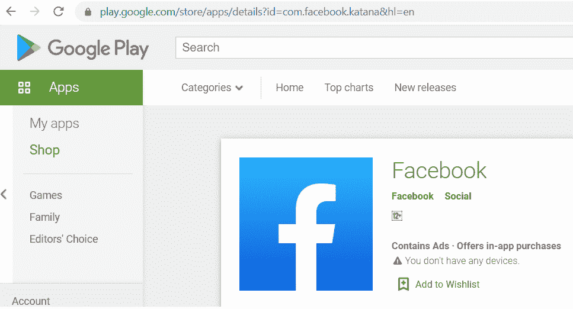
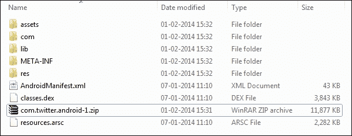
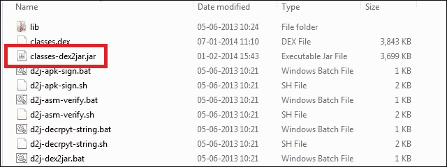
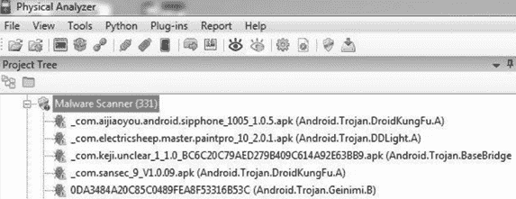
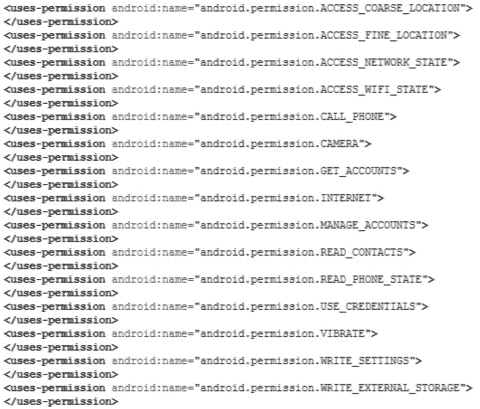

# 第十一章：Android 应用程序分析、恶意软件和逆向工程

智能手机用户通常使用第三方应用程序。Android 用户从 Google Play 等应用商店下载并安装了多个应用程序。在取证调查中，对这些应用程序进行分析以检索有价值的数据并检测恶意软件通常是有帮助的。例如，照片保险库应用程序可能锁定设备上存在的敏感图像。因此，了解如何识别照片保险库应用程序的密码非常重要。

此外，如今广泛使用的应用程序，如 Facebook、WhatsApp、Skype 等，通常是有价值数据的来源。因此，了解这些应用程序存储的数据类型和数据的位置非常重要。虽然我们在之前的章节中讨论的数据提取和数据恢复技术提供了对有价值数据的访问，但应用程序分析帮助我们获取有关应用程序具体信息的信息，如偏好和权限。

在本章中，我们将涵盖以下主题：

+   分析广泛使用的 Android 应用程序以检索有价值的数据

+   逆向工程 Android 应用程序的技术

+   Android 恶意软件

# 分析广泛使用的 Android 应用程序以检索有价值的数据

在 Android 上，用户与之交互的一切都是应用程序。虽然一些应用是由设备制造商预装的，但其他应用是由用户下载和安装的。例如，即使是常规功能，如联系人、通话、短信等，也是通过各自的应用程序执行的。因此，在调查过程中进行 Android 应用程序分析至关重要。一些第三方应用程序，如 WhatsApp、Facebook、Skype、Chrome 浏览器等，被广泛使用，并处理大量有价值的信息。根据应用程序的类型，这些应用程序中的大多数存储敏感信息在设备的内部存储器或 SD 卡上。分析它们可能提供有关用户位置细节、与他人的通信等信息。使用我们之前描述的取证技术，可以访问这些应用程序存储的数据。然而，作为取证人员，您需要发展必要的技能，将可用数据转换为有用的数据。当您全面了解应用程序如何处理数据时，就可以实现这一点。

正如我们在之前的章节中讨论的那样，所有应用程序默认将其数据存储在`/data/data`文件夹中。应用程序还可以在 SD 卡上存储某些其他数据，如果它们在安装时请求权限的话。可以通过检查`/data/data`文件夹的内容来收集设备上存在的应用程序的信息，但这并不直接，因为它需要分析该路径下的每个单独的应用程序文件夹。作为替代方案，您可以检查`/data/system`下的`packages.list`文件。该文件包含有关所有应用程序的信息，以及它们的包名称和数据路径。

可以使用以下命令执行此操作：

```kt
# cat packages.list
```

以下是前述命令的输出：


packages.list 文件的内容

现在，让我们具体看一些广泛使用并处理有价值数据的第三方应用程序。

以下应用程序仅被覆盖，以使您熟悉可以提取的数据类型以及可能获取数据的位置。在对设备执行这些任务之前，您需要获得适当的权限，并应遵守法律规定。正如我们在第八章中所解释的那样，*Android 取证设置和数据提取前技术*，以下技术仅在设备被 root 后才能使用。

# Facebook Android 应用程序分析

Facebook 安卓应用是最广泛使用的社交网络应用之一。它将信息存储在`/data/data`文件夹中，位于`com.facebook.katana`包内。以下细节提供了可以从各种文件中收集的信息类型的概述：

+   **Facebook 联系人**：可以通过分析`contacts_db2`数据库检索用户的 Facebook 联系人信息，该数据库位于以下路径下：

+   **路径**：`/data/data/com.facebook.katana/databases/contacts_db2`。

+   `contacts_db2`数据库（SQLite 文件）包含一个名为 contacts 的表，其中包含大部分用户信息，如他们的名字、姓氏、显示名称和显示图片的 URL。

+   **Facebook 通知**：可以通过分析`notification_db`数据库收集有关用户通知的信息，该数据库位于以下路径下：

+   **路径**：`/data/data/com.facebook.katana/databases/notifications_db`。

+   在上述路径下的`gql_notifications`表保存了用户的信息。`seen_state`列确认了通知是否已被查看。`updated`列指向通知更新的时间。`gql_payload`列包含通知和发送者信息。

+   **Facebook 消息**：分析`threads_db2`数据库可以查看 Facebook 消息对话在一些情况下可能非常重要：

+   **路径**：`/data/data/com.facebook.katana/databases/threads_db2`

+   **动态消息中的视频**：`/video-cache`文件夹包含从用户的动态消息中下载的视频。请注意，这些不是用户发布的视频，而是出现在他们的动态消息中的视频：

+   **路径**：`/data/data/com.facebook.katana/files/video-cache`

+   **动态消息中的图片**：`/images`文件夹包含出现在用户个人资料中的各种图片，例如来自他们的动态消息和联系人个人资料图片的图片。此文件夹中存在多个目录，图片可能以`.jpg`以外的格式存储，如`.cnt`：

+   **路径**：`/data/data/com.facebook.katana/cache/images`

+   **动态消息数据**：`newfeed_db`数据库包含用户在其动态消息中看到的数据。如下截图所示，分析此数据库将提供有价值的信息，比如设备何时加载了特定的故事（`fetched_at`列），用户是否看到了特定的故事（`seen_state`列），以及故事的相应文件在设备上的存储位置（`cache_file_path`列）：

+   **路径**：`/data/data/com.facebook.katana/databases/newsfeed_db`：

！[](img/49a0d2c5-1d9b-482f-afdc-45327787d546.png)

在 SQLite 浏览器中分析的 Facebook newsfeed.db 文件

在上述截图中，`fetched_at`指定了获取此信息的日期和时间。请注意，该应用程序使用 Linux 纪元时间，也称为 Unix 时间或 Posix 时间，来存储此信息。这种格式通常被多个应用程序使用，因此值得一看。Linux 纪元时间存储为自 1970 年 1 月 1 日午夜以来的秒数（或毫秒数）。有几个在线网站，如[`www.epochconverter.com/`](https://www.epochconverter.com/)，可以方便地将 Linux 纪元时间转换为普通格式。例如，以下截图显示了 Linux 纪元时间 1,577,881,839 转换为普通格式：

！[](img/7072a6d0-d3ec-4498-a617-cd9faa509832.png)

时间格式示例

现在我们已经对 Facebook 应用进行了分析，让我们对我们的下一个应用 WhatsApp 进行类似的分析。

# WhatsApp 安卓应用分析

WhatsApp 是最受欢迎的聊天（音频和视频）消息服务，全球有超过十亿人使用。它将其信息存储在`/data/data`文件夹下，包名为`com.whatsapp`。以下是从法医角度感兴趣的重要文件的概述：

+   **用户个人资料图片**：用户的个人资料图片以`me.jpg`文件名保存，并位于以下路径下：

+   **路径**：`/data/data/com.whatsapp/me.jpg`

+   **用户的电话号码（与 WhatsApp 关联）**：主文件夹下的`me`文件包含与用户 WhatsApp 帐户关联的电话号码。请注意，这可能与与 SIM 卡关联的电话号码相同，也可能不同：

+   **路径**：`/data/data/com.whatsapp/me`

+   **联系人个人资料图片**：`/avatars`目录包含用户联系人（使用 WhatsApp 的）的个人资料图片的缩略图：

+   **路径**：`/data/data/com.whatsapp/files/Avatars`

+   **聊天消息**：所有与消息相关的信息，包括聊天和发件人详细信息，都存储在`msgstore.db`文件中，该文件位于以下位置：

+   **路径**：`/data/data/com.whatsapp/databases/msgstore.db`

+   **WhatsApp 文件**：大多数与 WhatsApp 共享的文件，如图像、视频和音频消息，都存储在 SD 卡的以下位置：

+   **路径**：`/sdcard/WhatsApp/Media`

发送和接收的文件分别存储在各自的文件夹中。

接下来，我们将看一下另一个用于电信的应用程序，专门提供视频聊天和语音通话：Skype。

# Skype Android 应用程序分析

Skype 是一款提供视频聊天和语音通话服务的应用程序。该应用程序的数据存储在`/data/data`文件夹下，包名为`com.skype.raider`。以下是通过分析 Skype 应用程序可以提取的一些重要物件：

+   **用户名和 IP 地址**：位于以下路径下的`shared.xml`文件包含有关用户名和上次连接到 Skype 的 IP 地址的信息：

+   **路径**：`/data/data/com.skype.raider/files/shared.xml`

+   **个人资料图片**：用户的个人资料图片位于`/thumbnails`目录中，路径如下：

+   **路径**：`/data/data/com.skype.raider/files/<username>/thumbnails/`

+   **通话记录**：有关从 Skype 拨出的通话记录的信息存储在`main.db`文件中。分析此文件可以为我们提供大量信息：

+   **路径**：`/data/data/com.skype.raider/files/<username>/main.db/`。

+   例如，`duration`表提供了通话持续时间的信息，`start_timestamp`字段给出了通话的开始时间，`creation_timestamp`字段指示通话何时被发起（这包括未接听的电话）。`type`列指示通话是呼入的（值=`1`）还是呼出的（值=`2`）。

+   **聊天消息**：`main.db`文件中的`messages`表包含所有聊天消息。`author`和`from_dispname`列提供了写消息的人的信息。`timestamp`列显示消息的日期/时间。`body_xml`列包含消息的内容：

+   **路径**：`/data/data/com.skype.raider/files/<username>/main.db/`

+   **传输的文件**：`Transfers`表包含有关传输文件的信息，如文件名、文件大小和它们在设备上的位置：

+   **路径**：`/data/data/com.skype.raider/files/<username>/main.db/`。

+   实际接收到的图像或文件将存储在 SD 卡上。如果文件被下载，它将位于 SD 卡根目录下的`Downloads`文件夹中。

+   **群聊**：`ChatMembers`表显示特定聊天中存在的用户列表。`adder`列显示启动对话的用户：

+   **路径**：`/data/data/com.skype.raider/files/<username>/main.db/`

现在，我们将对 Gmail 应用程序进行分析。

# Gmail Android 应用程序分析

Gmail 是谷歌提供的广泛使用的电子邮件服务。 应用程序数据保存在`/data/data`文件夹下，包名称为`com.google.android.gm`。 以下是通过分析 Gmail 应用程序可以提取的重要工件：

+   **帐户详细信息**：`/shared_prefs`下的 XML 文件确认了电子邮件帐户的详细信息。 可以从`Gmail.xml`文件中识别出与当前电子邮件相关联的其他帐户的详细信息：

+   **路径**：`/data/data/com.google.android.gm/cache/<username>@gmail.com`

+   **附件**：最近在发送和接收电子邮件中使用的附件保存在`/cache`目录中。 这很有价值，因为它使我们能够访问已从电子邮件服务中删除的项目。 每行还包含一个`messages_conversation`值。 此值可以与电子邮件附件的`conversations`表进行比较。 `filename`列标识了文件在设备上的路径。 以下是此文件夹的确切路径：

+   **路径**：`/data/data/com.google.android.gm/cache/<username>@gmail.com`：


Gmail 缓存目录下的附件列表

+   **电子邮件主题**：通过分析`mailstore.<username>@gmail.com.db`文件中的`conversations`表可以恢复此电子邮件的主题：

+   **路径**：`/data/data/com.google.android.gm/databases/mailstore.<username>@gmail.com.db`

+   **搜索历史**：在应用程序中进行的任何文本搜索都存储在`/data/data/com.android.chrome/app_chrome/Default/History`位置下的`suggestions.db`文件中。

+   **路径**：`/data/data/com.google.android.gm/databases/suggestions.db`

让我们通过对谷歌 Chrome 应用程序进行最终分析来结束本节。

# 谷歌 Chrome Android 应用程序分析

谷歌 Chrome 是谷歌 Pixel 和许多其他设备上的默认网络浏览器，并且被广泛用于浏览互联网。 应用程序数据位于`/data/data`文件夹下，包名称为`com.android.chrome`。 以下是通过分析 Gmail 应用程序可以提取的重要工件：

+   **个人资料图片**：用户的个人资料图片存储在以下位置的`Google Profile Picture.png`文件中：

+   **路径**：`/data/data/com.android.chrome/app_chrome/Default/ Google Profile Picture.png`

+   **书签**：`Bookmarks`文件包含与帐户同步的所有书签的信息。 通过分析此文件可以收集诸如站点名称、URL 以及收藏时间等详细信息：

+   **路径**：`/data/data/com.android.chrome/app_chrome/Default/Bookmarks`

+   **浏览历史**：`History.db`文件包含用户的网络历史记录，存储在各种表中。 例如，如下截图所示，`keyword_search_terms`表包含了使用 Chrome 浏览器进行的搜索的信息：


谷歌 Chrome 浏览历史

+   +   `segments`表包含用户访问的站点列表（但不是所有站点）。 有趣的是，Chrome 存储的数据不仅属于设备，而且一般属于帐户。 换句话说，使用相同帐户从其他设备访问的站点的信息也存储在设备上； 例如，`URLs`表包含了跨多个设备的 Google 帐户的浏览历史。

+   **路径**：`/data/data/com.android.chrome/app_chrome/Default/History`。

+   **登录数据**：`Login Data`数据库包含了浏览器中保存的不同站点的登录信息。 站点 URL 以及用户名和密码存储在相应的表中：

+   **路径**：`/data/data/com.android.chrome/app_chrome/Default/Login Data`

+   **经常访问的站点**：`Top Sites`数据库包含经常访问的站点列表：

+   **路径**：`/data/data/com.android.chrome/app_chrome/Default/Top Sites`

+   **其他数据**：用户在不同网站的表单填写中输入的电话号码或电子邮件地址等其他信息存储在`Web Data`数据库中。此数据库中存在的任何表都包含自动填充数据：

+   **路径**：`/data/data/com.android.chrome/app_chrome/Default/Web Data`

现在我们已经分析了不同的第三方应用程序，我们将看看我们可以使用哪些技术来逆向工程 Android 应用程序。

# 逆向工程 Android 应用程序的技术

您可能需要处理阻止访问所需信息的应用程序。例如，手机上的相册被*AppLock*应用程序锁定。在这种情况下，为了访问相册中存储的照片和视频，您首先需要输入*AppLock*的密码。因此，了解*AppLock*应用程序如何在设备上存储密码将是有趣的。您可以查看 SQLite 数据库文件。但是，如果它们被加密，那么甚至很难确定它是密码。在这种情况下，逆向工程应用程序将是有帮助的，因为您想更好地了解应用程序以及应用程序如何存储数据。

简而言之，逆向工程是从可执行文件中检索源代码的过程。逆向工程 Android 应用程序是为了了解应用程序的功能、数据存储、安全机制等。在我们继续学习如何逆向工程 Android 应用程序之前，让我们快速回顾一下 Android 应用程序：

+   安装在 Android 设备上的所有应用程序都是用 Java 编程语言编写的。

+   当 Java 程序编译时，我们得到字节码。这将发送给 dex 编译器，将其转换为 Dalvik 字节码。

+   因此，使用 dx 工具将类文件转换为 dex 文件。Android 使用称为**Dalvik 虚拟机**（**DVM**）来运行其应用程序。

+   JVM 的字节码由一个或多个类文件组成，取决于应用程序中存在的 Java 文件数量。无论如何，Dalvik 字节码由一个 dex 文件组成。

因此，dex 文件、XML 文件和运行应用程序所需的其他资源被打包到一个 Android 包文件（APK 文件）中。这些 APK 文件只是 ZIP 文件中的项目集合。因此，如果您将 APK 扩展文件重命名为`.zip`文件，那么您将能够看到文件的内容。但是，在您这样做之前，您需要访问手机上安装的应用程序的 APK 文件。以下是如何访问与应用程序对应的 APK 文件。

# 从 Android 设备中提取 APK 文件

预装在手机上的应用程序存储在`/system/app`目录中。用户下载的第三方应用程序存储在`/data/app`文件夹中。以下方法可以帮助您访问设备上的 APK 文件；它适用于已 root 和未 root 的设备：

1.  通过发出`# adb.exe shell pm list packages`命令来识别应用程序的包名称。

以下是前面命令的输出：


设备上存在的包名称列表

如前面的命令行输出所示，显示了包名称列表。尝试在问题中找到应用程序和包名称之间的匹配。通常，包名称与应用程序名称密切相关。或者，您可以使用 Android 市场或 Google Play 轻松识别包名称。Google Play 中应用程序的 URL 包含包名称，如下面的屏幕截图所示：



Google Play 商店中的 Facebook 应用程序

1.  通过发出`adb shell pm path`命令来识别所需包的 APK 文件的完整路径，如下所示：


识别 APK 的完整路径名

1.  使用`adb pull`命令将 APK 文件从 Android 设备拉到取证工作站：


adp pull 命令

现在，让我们分析 APK 文件的内容。Android 包是 Android 应用程序资源和可执行文件的容器。它是一个压缩文件，包含以下文件：

+   `AndroidManifest.xml`：这包含有关权限等的信息。

+   `classes.dex`：这是通过 dex 编译器转换为 dex 文件的类文件。

+   `Res`：应用程序的资源，如图像文件、声音文件等，都在这个目录中。

+   `Lib`：这包含应用程序可能使用的本地库。

+   `META-INF`：这包含应用程序签名的信息以及包中所有其他文件的签名校验和。

一旦获得 APK 文件，就可以开始反向工程 Android 应用程序。

# 反向工程 Android 应用的步骤

可以通过不同的方式对 APK 文件进行反向工程，以获取原始代码。以下是一种使用`dex2jar`和 JD-GUI 工具访问应用程序代码的方法。在我们的示例中，我们将检查`com.twitter.android-1.apk`文件。以下是成功反向工程 APK 文件的步骤：

1.  将 APK 扩展名重命名为 ZIP 以查看文件内容。将`com.twitter.android-1.apk`文件重命名为`twitter.android-1.zip`，并使用任何文件解压应用程序提取此文件的内容。以下截图显示了从原始文件`twitter.android-1.zip`中提取的文件。



APK 文件的提取文件

1.  我们之前讨论过的`classes.dex`文件可以在提取 APK 文件内容后访问。这个 dex 文件需要使用`dex2jar`工具转换为 Java 类文件。

1.  从[`github.com/pxb1988/dex2jar`](https://github.com/pxb1988/dex2jar)下载`dex2jar`工具，将`classes.dex`文件放入`dex2jar`工具目录，并发出以下命令：

```kt
C:\Users\Rohit\Desktop\Training\Android\dex2jar-0.0.9.15>d2j- dex2jar.bat classes.dex dex2jar classes.dex -> classes-dex2jar.jar
```

1.  当上述命令成功运行时，它会在同一目录下创建一个新的`classes-dex2jar.jar`文件，如下截图所示：



由 dex2jar 工具创建的 classes-dex2jar.jar 文件

1.  要查看此 JAR 文件的内容，可以使用 JD-GUI 等工具。如下截图所示，可以看到 Android 应用程序中的文件和相应的代码：


JD-GUI 工具

一旦获得代码访问权限，就可以轻松分析应用程序存储值、权限和其他可能有助于绕过某些限制的信息。当在设备上发现恶意软件时，这种反编译和分析应用程序的方法可能会很有用，因为它将显示恶意软件正在访问的内容，并提供数据发送的线索。以下各节将详细介绍 Android 恶意软件。

# Android 恶意软件

随着安卓市场份额的不断增加，针对安卓用户的攻击或恶意软件也在增加。移动恶意软件是一个广义术语，指执行意外操作的软件，包括木马、间谍软件、广告软件、勒索软件等。根据 pandasecurity 的数据，与 iOS 设备相比，安卓设备感染恶意软件的几率要高 50 倍（[`www.pandasecurity.com/mediacenter/mobile-security/android-more-infected-than-ios/`](https://www.pandasecurity.com/mediacenter/mobile-security/android-more-infected-than-ios/)）。2019 年，仅 Agent Smith 恶意软件就感染了近 2500 万台安卓设备，根据 Cybersecurity Hub 的一篇新闻报道（[`www.cshub.com/malware/articles/incident-of-the-week-malware-infects-25m-android-phones`](https://www.cshub.com/malware/articles/incident-of-the-week-malware-infects-25m-android-phones)）。

这种情况的一个主要原因是，与苹果的 App Store 严格受公司控制不同，谷歌的 Play Store 是一个没有详细的前期安全审查的开放生态系统。恶意软件开发者可以轻松地将他们的应用移至 Play Store，并通过此方式分发他们的应用。谷歌现在有一个名为 Google Bouncer 的恶意软件检测软件，它将自动扫描上传的应用程序以查找恶意软件，但攻击者已经找到了几种保持不被发现的方法。此外，安卓正式允许我们加载从互联网下载的应用程序（侧载），而 iOS 不允许未签名的应用程序。

例如，如下截图所示，当在安卓设备上选择未知来源选项时，允许用户安装从互联网上任何网站下载的应用程序：


安卓中的侧载选项

托管安卓应用程序的第三方应用商店被认为是恶意软件的聚集地。这促使谷歌从安卓 4.2 开始推出了*验证应用程序*功能，该功能在安卓设备上本地扫描应用程序，以查找恶意活动，如短信滥用。如下截图所示，验证应用程序功能可能会警告用户，或在某些情况下甚至可能阻止安装。然而，这是一个选择性服务，因此用户可以在希望的情况下禁用此功能：


安卓中的验证应用程序功能

从安卓奥利奥开始，谷歌推出了一个名为 Play Protect 的新功能，这是验证应用程序功能的更好版本。Play Protect 的主要工作是阻止或警告已安装在安卓设备上的恶意或有害应用程序。例如，如下截图所示，Play Protect 功能可能在应用程序安装过程中显示警告消息：


Play Protect 功能

接下来，让我们看看恶意软件的类型。

# 安卓恶意软件类型

有不同类型的恶意软件可以感染安卓设备。以下是一些最常见的类型：

+   **银行恶意软件**：它可以伪装成银行应用程序，窃取用户输入的银行凭据，或者从用户账户中窃取任何其他敏感个人信息。银行木马可以拦截或修改银行交易，并执行危险操作，如发送、删除和拦截短信，以及记录按键。

+   **间谍软件**：间谍软件监视、记录并将重要信息从目标设备发送到攻击者的服务器。这些信息可能包括短信、录音电话、截屏、按键记录、电子邮件或其他可能对攻击者感兴趣的应用程序数据。BusyGasper 是卡巴斯基实验室专家在 2018 年初发现的一种间谍软件，它不仅具有收集来自 WhatsApp、Viber 和 Facebook 等流行消息应用程序的信息的常见间谍软件功能，还具有设备传感器监听器，包括运动检测器。

+   **广告软件**：广告软件是另一种在安卓设备上非常常见的恶意或不需要的应用程序类型。它相对容易检测，因为受害者会在设备屏幕上不断收到弹出窗口和广告。这些不需要的程序并不总是无害的，因为弹出窗口可能导致下载另一种恶意软件，包括已经提到的间谍软件和银行木马。

+   **勒索软件**：勒索软件的主要目标是基于 Windows 的台式电脑和服务器，但它也存在于移动平台上，尤其是在安卓上。通常，它只会用勒索通知锁定设备屏幕，但有时也会加密用户的数据。

+   **加密货币挖矿恶意软件**：加密货币现在非常流行，因此这种类型的恶意程序甚至适用于安卓等移动平台。这类应用程序的目标是利用受害者的设备计算能力来挖掘加密货币。偶尔，这种类型的恶意软件甚至可能使智能手机硬件处于风险之中。

高级恶意软件还能够对设备进行 root 并安装新应用程序。例如，安卓 Mazar 恶意软件于 2016 年 2 月被发现，通过短信传播，并能够在手机上获得管理员权限，从而可以擦除手机、打电话或阅读短信。

可在[`forensics.spreitzenbarth.de/android-malware/`](https://forensics.spreitzenbarth.de/android-malware/)找到安卓恶意软件家族及其功能的完整列表。

一旦恶意软件进入设备，它可以执行危险的操作，其中一些如下：

+   发送和阅读您的短信

+   窃取敏感数据，如图片、视频和信用卡号码

+   操纵设备上的文件或数据

+   向高费率号码发送短信

+   感染您的浏览器并窃取键入的任何数据更改设备设置

+   擦除设备上的所有数据

+   锁定设备直到支付赎金

+   不断显示广告

现在我们已经了解了不同类型的恶意软件，我们将看看恶意软件如何在您的设备中传播。

# 安卓恶意软件是如何传播的？

安卓设备可能以几种不同的方式感染恶意软件。以下是一些可能的方式：

+   **重新打包合法应用程序**：这是攻击者使用的最常见方法。首先，攻击者下载一个合法的应用程序并对其进行反汇编。然后，他们添加恶意代码并重新组装应用程序。新的恶意应用程序现在的功能与合法应用程序完全相同，但它也在后台执行恶意活动。这种应用程序通常在第三方安卓应用商店中找到，并被许多人下载。

+   **利用安卓漏洞**：在这种情况下，攻击者利用在安卓平台上发现的漏洞或漏洞来安装他们的恶意应用程序或执行任何不需要的操作。例如，安装程序劫持在 2015 年被发现，攻击者利用它来在安装过程中用恶意软件替换安卓应用程序。

+   **蓝牙和 MMS 传播**：恶意软件也通过蓝牙和 MMS 传播。当设备处于可发现模式时，受害者会在设备上收到恶意软件，例如，当它可以被其他蓝牙设备看到时。在 MMS 的情况下，恶意软件附加在消息中，就像计算机病毒通过电子邮件附件发送一样。然而，在这两种方法中，用户至少必须同意运行文件一次。

+   **应用程序下载恶意更新**：在这种情况下，最初安装的应用程序不包含任何恶意代码，但代码中存在的一个功能将在运行时下载恶意命令。这可以通过隐秘更新或用户更新来完成。例如，Plankton 恶意软件使用隐秘更新直接从远程服务器下载 JAR 文件，不需要任何用户权限。在用户更新的情况下，用户必须允许应用程序下载应用的新版本。

+   **远程安装**：攻击者可能会破坏用户设备上的账户凭据，从而远程安装应用程序。这通常发生在有针对性的场景中，与我们刚刚描述的前两种方法相比，发生频率较低。

现在我们已经看过 Android 恶意软件可能传播的方式，让我们试着识别您的设备中是否存在恶意软件。

# 识别 Android 恶意软件

从取证的角度来看，重要的是在进行任何分析之前识别设备上是否存在恶意软件。这是因为恶意软件可能会改变设备的状态或设备上的内容，从而使分析或结果不一致。市场上有一些工具可以分析物理提取以识别恶意软件。例如，Cellebrite UFED 物理分析仪具有 BitDefender 的反恶意软件技术，可以扫描恶意软件。如下面的截图所示，一旦物理镜像被加载到工具中，文件就可以被扫描以查找恶意软件：


在 UFED 物理分析仪中扫描恶意软件

一旦扫描开始，BitDefender 软件会尝试解压`.apk`文件并查找感染或恶意文件。这个过程是自动的，工具会指出恶意应用程序，如下面的截图所示：



UFED 物理分析仪中的恶意软件扫描结果

该工具只是指出设备上存在恶意内容。然后，取证调查员必须通过分析相应的应用程序手动确认这是否是一个有效的问题。这就是我们在前面部分讨论的逆向工程技能需要发挥作用的地方。一旦应用程序被逆向工程并且代码被获取，建议您查看`AndroidManifest.xml`文件以了解应用程序权限。这对于了解应用程序存储数据的位置、它试图访问的资源等是有帮助的。例如，手电筒应用程序不需要读/写访问您的 SD 卡数据，也不需要打电话：



AndroidManifest.xml 文件中的权限

或者，您也可以将`.apk`文件上传到 VirusTotal，这是一个可以用来分析可疑文件中是否有恶意软件的免费服务。VirusTotal 将使用 55 个杀毒引擎扫描您的文件。重要的是要注意，如果`.apk`文件中的细节被混淆，该工具可能无法识别有效的情况。因此，作为取证调查员，重要的是要发展必要的技能来逆向工程任何可疑的应用程序并分析代码以识别恶意行为。

在一些调查中，设备上存在的恶意软件的性质也可能导致得出某些关键的结论，这可能会影响案件的结果。例如，考虑一个涉及向其他员工发送滥用信息的公司内部调查。识别发送信息的设备上的恶意软件将有助于解决案件。

# 总结

Android 应用程序分析有助于法证调查人员在设备的相关位置寻找有价值的数据。反向工程 Android 应用程序是从 APK 文件中检索源代码的过程。使用某些工具，如`dex2jar`，可以对 Android 应用程序进行反向工程，以了解其功能和数据存储，识别恶意软件等。在本章中，我们对不同的 Android 应用程序进行了分析，现在能够从中检索数据。我们还学习了不同类型的 Android 恶意软件以及如何识别它们。诸如 UFED Physical Analyzer 之类的工具配备了 BitDefender 软件，可以自动扫描恶意软件。

下一章将介绍在 Windows Phone 设备上进行取证。
