# 第十二章：Windows 手机取证

尽管 Windows 手机如今并不被广泛使用，但在取证调查中仍然可能会遇到。这些设备是市场上最实惠的，因此了解如何获取、分析和解码 Windows 手机中的数据非常重要。定位和解释这些设备上存在的数字证据需要对 Windows 手机操作系统有专门的了解，而且并不总是可能的。商业取证和开源工具对从 Windows 设备获取用户数据提供了有限的支持。由于 Windows 手机在移动市场上所占份额不大，大多数取证从业者对设备上使用的数据格式、嵌入式数据库以及其他存在的工件并不熟悉。本章概述了 Windows 手机取证，描述了在 Windows 移动设备上获取和检查数据的各种方法。

在本章中，我们将涵盖以下主题：

+   Windows 手机操作系统

+   Windows 10 Mobile 安全模型

+   Windows 手机文件系统

+   数据获取

+   商业取证工具获取方法

+   在不使用商业工具的情况下提取数据

+   检查的关键工件

# Windows 手机操作系统

Windows 手机是由微软开发的专有移动操作系统。它是作为 Windows Mobile 的后继者推出的，但不提供与之前平台的向后兼容性。Windows 手机于 2010 年 10 月推出，首次推出的是 Windows Phone 7。然后 Windows 手机操作系统的版本历史继续延续，发布了 Windows Phone 7.5、Windows Phone 7.8、Windows Phone 8.1 和 Windows Phone 10。

尽管微软声称他们已停止开发这个移动操作系统，但除了安全补丁，你可能会在移动取证调查中遇到它。

接下来的章节将提供关于 Windows 手机、其功能和底层安全模型的更多细节。

与 Android 和 iOS 设备不同，Windows 手机配备了一个新的界面，使用所谓的“磁贴”来代替图标，如下图所示。这些磁贴可以由用户设计和更新：

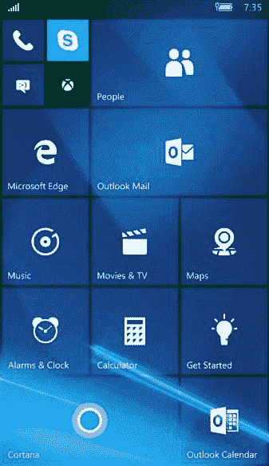

Windows 手机主屏幕

与其他移动平台类似，Windows 手机允许安装第三方应用。这些应用可以从由微软管理的 Windows 手机应用商店下载。与 iOS 和 Android 设备可用的应用数量相比，Windows 手机的应用数量相形见绌。但是，应用是可用的，你应该期望在 Windows 手机设备上看到它们。

Windows 手机引入了新功能，使其与 Windows Mobile 相比更类似于其他智能手机：

+   **Cortana**：这是设备的个人助手。它在 Windows 8.1 中被引入，并且仍然存在于 Windows 10 设备上。Cortana 通过使用必应回答问题、设置提醒、发送短信等方式来帮助用户，从而为用户提供更好、更便捷的体验。Cortana 所做的一切都会在设备上留下痕迹。

+   **钱包**：这里存储着信用卡账户、登机牌、门票、优惠券等等。

+   **地理围栏和高级位置设置**：这为用户提供了额外的保护，因为手机可以检测到它是否离开了受信任的区域，并可能自动锁定。

+   **附加功能**：这些功能包括动态磁贴、增强颜色和静音时间。

与 Windows 手机相关的其他常见应用包括 OneDrive（原名 SkyDrive）、OneNote 和 Office 365 同步。OneDrive 为用户提供了从任何设备访问其所有文档和文件的权限。OneNote 本质上是一样的，但它充当笔记本或日记。Office 365 为用户提供了跨多个设备持续访问其电子邮件、日历、联系人等的权限。

跨多个设备进行数据同步的引入使我们作为取证检查员的工作变得困难。我们的工作是确定证据是如何放置在设备上的。是否可能明确说明一个物件是如何放置在设备上的？老实说，这取决于很多因素。这是没有人想听到的回答，但必须考虑很多因素。这是一个应用程序？设备上运行的是什么操作系统？这是一个物件？例如，让我们考虑 OneDrive。如果设备包含来自 OneDrive 的文档，原始作者应该包含在元数据中。这个，再加上检查内容是否与设备共享，可能会提供一个关于物件是如何创建的一瞥。然而，当检查一个日历条目时，当 Office 365 在使用时，可能无法确定用户是在手机、PC 还是笔记本电脑上创建的条目。同步是即时的，状态标志说明物件是在哪里创建的并不总是存在。如果这个物件确实是调查的“关键证据”，你需要运用你的技能来发现其他支持你的发现的物件。需要深入挖掘数据。现在我们已经了解了 Windows Phone 及其功能的细节，让我们来看看它的安全模型，以及它如何保护数据安全。

# Windows 10 Mobile 安全模型

Windows Phone 的安全模型旨在确保设备上的用户数据安全可靠。以下部分简要解释了 Windows Phone 安全建立在哪些概念上。

# 房间

Windows Phone 在最低特权和隔离原则上建立了重要基础。这一点自 Windows Phone 7 诞生以来就一直如此。为了实现这一点，Windows Phone 引入了“房间”的概念。每个房间都有一个隔离边界，进程可以在其中运行。根据特定房间的安全策略，运行在该房间中的进程具有访问操作系统资源和功能的特权。有四种类型的安全房间。以下是对每种房间的简要描述：

+   受信任的计算基础（TCB）：这里的进程可以无限制地访问大多数 Windows Phone 资源。这个房间有权限修改策略并执行安全模型。内核在这个房间中运行。

+   提升权限房间（ERC）：这个房间比 TCB 房间特权较低。它有权限访问除安全策略以外的所有资源。这个房间主要用于为手机上的其他应用程序提供功能的服务和用户模式驱动程序。

+   标准权限房间（SRC）：这是预装应用程序的默认房间，例如 Microsoft Outlook Mobile 2010。

+   最低特权房间（LPC）：这是通过 Marketplace Hub（也称为 Windows Phone Marketplace）下载和安装的所有应用程序的默认房间。

接下来，我们将看看加密。

# 加密

Windows Phone 8 引入了 BitLocker 技术，通过 AES 128 位加密对存储在设备上的所有用户数据进行加密。用户可以简单地切换开关以启用此功能，设备内部存储的所有数据都将被加密。此外，用户可以加密他们的 SD 卡（假设设备有 SD 卡），并在设备上设置密码或 PIN 码。如果启用了所有这些锁定和加密，除非密码被恢复，否则可能无法访问此设备上的数据。

# 基于能力的模型

功能被定义为与安全、隐私和成本相关的手机资源（相机、位置信息、麦克风等）。LPC 默认具有最小的访问权限。但是，在安装过程中可以通过请求更多功能来扩展这一点。功能在应用程序安装期间授予，并且在运行时无法修改或提升。因此，很难侧加载应用程序或强制自定义引导代码到设备以获得法医访问，因为通常在启动之前会被拒绝。

要在 Windows Phone 上安装应用程序，您需要使用 Windows Live ID 登录 Marketplace。在安装过程中，应用程序需要在使用某些功能之前征得用户的许可，下面的截图显示了一个例子：

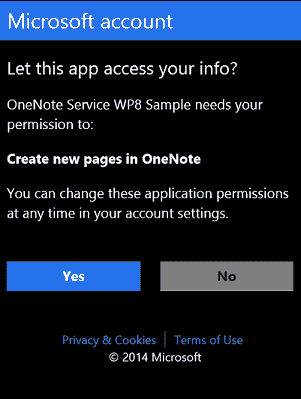

Windows 应用程序请求用户权限（https://i-msdn.sec.s-msft.com/dynimg/IC752370.png）

这与 Android 中的权限模型类似。这使用户在安装应用程序之前有机会了解应用程序的所有功能。所有功能的列表都包含在`WMAppManifest.xml`应用程序清单文件中，可以通过 Visual Studio 或其他方法访问，这些方法在[`docs.microsoft.com/en-us/previous-versions/windows/apps/ff769509(v=vs.105)`](https://docs.microsoft.com/en-us/previous-versions/windows/apps/ff769509(v=vs.105))中定义。

# 应用程序沙盒

Windows Phone 上的应用程序在一个沙盒环境中运行。这意味着 Windows Phone 上的每个应用程序都在自己的隔间中运行。应用程序彼此隔离，不能访问其他应用程序的数据。如果任何应用程序需要保存信息到设备上，它可以使用隔离存储，其他应用程序无法访问。此外，安装在 Windows Phone 上的第三方应用程序不能在后台运行；也就是说，当用户切换到不同的应用程序时，先前使用的应用程序会关闭（尽管应用程序状态会被保留）。这确保了应用程序在用户不使用应用程序时无法执行诸如通过互联网进行通信等活动。这些限制也使 Windows Phone 更不容易受到恶意软件的影响，但您永远不应该假设任何设备是安全的。恶意软件在这些设备上运行更具挑战性。

到目前为止，我们已经了解了四种安全隔间类型，现在我们知道 Windows Phone 8 使用 BitLocker 技术进行加密。我们已经了解了在安装应用程序期间授予的不同功能，并看到每个应用程序是如何相互隔离的。接下来，我们将看一下 Windows Phone 的一个重要方面，即其文件系统。

# Windows Phone 文件系统

Windows Phone 文件系统与 Windows 7、Windows 8 和 Windows 10 中使用的文件系统更多或少相似。从根目录，您可以访问此设备上可用的不同文件和文件夹。从法医学的角度来看，以下是一些可能产生有价值数据的文件夹。所有列出的目录都位于根目录中：

+   应用程序数据：这个目录包含手机上应用程序的数据，比如 Outlook、地图和 Internet Explorer。

+   应用程序：这个目录包含用户安装的应用程序。每个应用程序分配或使用的隔离存储也位于这个文件夹中。

+   我的文件：这个目录包含不同的办公文档，比如 Word、Excel 或 PowerPoint 文件。该目录还包括配置文件和多媒体文件，比如音乐或视频。

+   Windows：这个目录包含与 Windows Phone 操作系统相关的文件。

此处使用的获取方法将确定您对设备的文件系统访问权限。例如，物理镜像可能提供对可以从数据转储中恢复的多个分区的访问权限。在下面的屏幕截图中可以看到包含 27 个分区的 Windows Phone 10 设备。分区 26（MainOS）和 27（Data）包含相关数据：

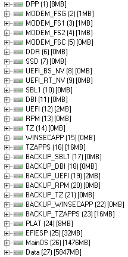

Windows Phone 10 分区

尽管大多数证据都存在于数据分区中，但最好的做法是在可能的情况下同时捕获和分析两者。

在前面的屏幕截图中，分区 26 的 MainOS 分区包含了来自 Windows Phone 的系统数据。与所有 Windows 调查一样，系统数据包含了与调查相关的证据。

在此示例中，分区 27 包含用户或数据分区。根据设备的不同，分区号可能会有所不同。在我们的示例中，数据分区显示为分区 27 的屏幕截图如下所示。在这里，使用移动取证工具恢复了短信、电子邮件、应用程序数据、联系人、通话记录和互联网历史记录。这些方法将在本章后面讨论：

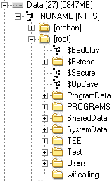

Windows Phone 10 数据分区

Windows Phone 还维护**Windows 注册表**，这是一个存储操作系统环境变量的数据库。Windows 注册表基本上是一个存储 Microsoft 操作系统设置和选项的目录。Windows Phone 也不例外。在检查 Windows Phone 时，您将期望看到`NTUSER.dat`、`SAM`、`SYSTEM`、`SOFTWARE`、`SECURITY`和`DEFAULT`注册表项。虽然这些注册表项可能是手机特有的，但它们可以像传统的 Windows 注册表项一样进行检查。

Cynthia Murphy 的一篇论文中包括了一项详细的案例调查。这涉及一起家庭入侵和性侵案件，详细介绍了取证界伟大人才在揭示协助解决调查的证据方面所做的努力。有时，移动设备是与案件相关的最重要的证据。有关更多信息，请参阅[`www.sans.org/reading-room/whitepapers/forensics/windows-phone-8-forensic-artifacts-35787`](https://www.sans.org/reading-room/whitepapers/forensics/windows-phone-8-forensic-artifacts-35787)。现在我们已经了解了文件和文件夹结构，让我们学习如何利用这些知识获取数据。

# 数据获取

对于取证检查员来说，从 Windows Phone 获取数据是具有挑战性的，因为在之前的章节中定义的物理、文件系统和逻辑方法得不到很好的支持。除此之外，商业工具可能需要设备处于特定的电池充电状态（%）才能识别和获取设备。这通常是获取 Windows Phone 中最困难的步骤之一。

商业工具尝试数据获取的最常见技术之一是在设备上安装应用程序或代理，这使得可以进行双向通信，以便发送命令以提取数据。这可能会导致设备上的某些更改；然而，如果检查员遵循标准协议并测试所使用工具的有效性，这仍然是法庭上可靠的。这些协议包括适当的测试以确保用户数据未被更改（如果更改了，记录发生了什么），在测试设备上验证方法，并记录获取过程中所采取的所有步骤。为了使此获取方法有效，应用程序需要以 SRC 的权限安装。这可能需要您将制造商的 DLL 复制到用户应用程序中，这些 DLL 具有更高的权限。这允许应用程序访问通常仅限于本机应用程序的方法和资源。除此之外，设备必须解锁，否则这些方法可能无法使用。

大多数取证人员依赖取证工具和方法来获取移动设备。再次强调，这些做法对 Windows 手机的支持并不如此。请记住，要在 Windows 手机上部署和运行应用程序，设备和开发人员都必须经过 Microsoft 注册和解锁。可以通过使用 Windows Phone 8 到 10 设备的公共越狱来绕过此限制。

相当长一段时间以来，JTAG 和芯片取证是获取大多数 Windows 手机的唯一选择。一切在 2015 年 1 月发生了变化：Cellebrite 实施了一个获取模块，允许移动取证人员从大多数 Lumia 设备上的物理层面提取数据。

后来，Windows Phone Internals 项目提出了一种解锁一些 Lumia 设备（包括 520、521、525、620、625、720、820、920、925、928、1020 和 1320）的方法。这使得这些设备的物理获取成为可能。您可以在[`www.wpinternals.net/`](https://www.wpinternals.net/)了解更多关于该项目的信息。现在，我们将看一些用于获取方法的商业工具。

# 商业取证工具获取方法

有一些商业工具可用于支持获取 Windows 手机设备。Cellebrite UFED 提供支持，可以使用物理、文件系统和逻辑方法获取 Windows 手机设备。要确定您正在检查的设备是否受工具支持，您可以下载并使用 UFED Phone Detective 移动应用程序，该应用程序可以免费在 App Store 和 Google Play 上下载：

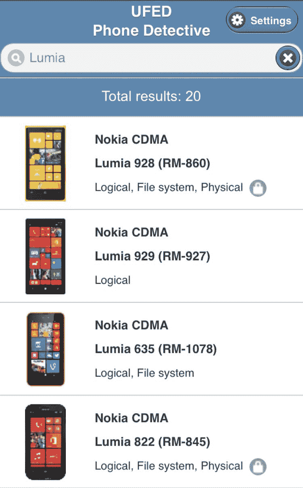

搜索支持的 Lumia 设备

其中一些获取方法更为强大，可以获取数据的完整物理转储，并且可以绕过特定设备上的一些锁定代码。然而，一些设备支持仅包括从设备中提取联系人和图片。取证人员必须意识到必须按照工具指示采取特定步骤。获取这些设备并不容易，而且通常情况下，你会发现工具无法成功。

当工具似乎失败时，尝试使用 UFED 中提供的智能手机/PDA 选项获取设备。要做到这一点，请按照以下步骤进行：

1.  启动 UFED4PC 并选择移动设备。

1.  选择手动浏览。

1.  选择智能手机。

1.  选择您要获取的 Windows 设备。

1.  尝试所有提供的方法，从物理、文件系统到逻辑（如果可能的话按照这个顺序）：

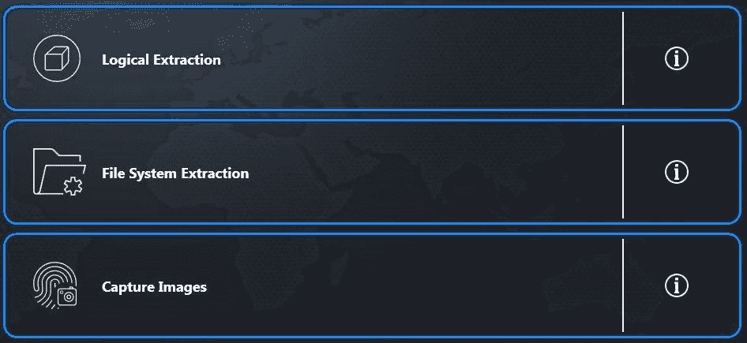

提取方法

1.  按照所有剩余的步骤并尝试所有提供的获取方法，直到成功。

Cellebrite 可能会提醒您，由于多种原因，获取未成功。当发生这种情况时，尝试每个选项以确保您已经尽力使用了商业可用的选项。在 UFED4PC 中进行获取尝试的一个示例如下：

1.  启动 UFED4PC。

1.  选择您的设备的制造商和型号。

1.  选择物理、文件系统或逻辑获取方法（根据设备型号提供的内容会有所不同）。

在这个例子中，只支持逻辑获取。有两种方法可用。第一种选项使用电缆，而第二种选项使用蓝牙。在这个例子中，需要一个特殊的 UFED 电缆。我首先选择了 UFED 电缆，因为在配对过程中需要对手机进行额外的更改：

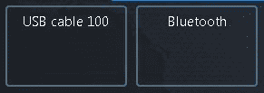

UFED4PC 逻辑提取选项

尝试使用 USB 电缆 100 获取设备时，只能访问多媒体文件。

然后，尝试相同的获取，但选择蓝牙。按照给定的说明将设备与取证工作站配对：

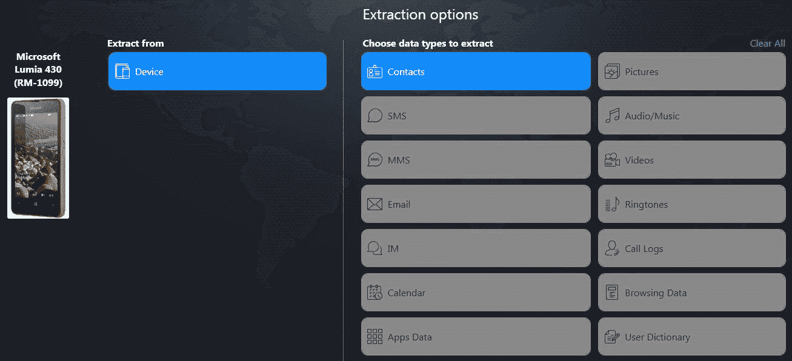

UFED4PC 提取选项（蓝牙）

通过这种获取方法，我们能够获取联系人。请注意，没有提供获取短信、彩信、电子邮件、即时消息、日历、通话记录、应用程序数据等的方法。建议您重复上一张屏幕截图中列出的通用方法，使用 UFED4PC 中的智能手机选项。到目前为止，我们已经看过一些使用商业工具的获取方法。现在，让我们学习如何在没有这些工具的情况下提取数据。

# 在不使用商业工具的情况下提取数据

在某些情况下，只有使用 JTAG 和芯片脱落等先进方法才能对 Windows 手机设备进行物理获取。但由于名为 Heathcliff 的安全研究人员的贡献，使用他的名为**WPinternals**（[`www.wpinternals.net`](https://www.wpinternals.net)）的工具，可以在有限的手机型号和操作系统版本上执行物理获取。

该工具支持以下型号的 Lumia 手机：520、521、525、620、625、720、820、920、925、928、1020 和 1320。

至于操作系统版本，支持以下版本：

+   8.10.12393.890

+   8.10.12397.895

+   8.10.14219.341

+   8.10.14226.359

+   8.10.14234.375

+   8.10.15116.125

+   8.10.15148.160

+   10.0.10512.1000

+   10.0.10536.1004

+   10.0.10549.4

+   10.0.10581.0

+   10.0.10586.11

+   10.0.10586.36

这种方法是实验性的，可能导致设备变砖！尽管变砖设备的百分比相对较低，我们建议您将其作为最后的选择。

获取过程的第一步将是下载与您正在使用的手机型号的 Windows **完整闪存更新**（**FFU**）文件和紧急文件：

下载 FFU 文件

如果下载的 FFU 包含不受支持的操作系统版本，那么 WPinternals 将下载另一个 FFU 以获取额外的文件：

获取额外的文件

在解锁过程中，手机可能会重新启动几次，但这是正常行为：

扫描闪烁配置文件

一旦找到配置文件，工具就会闪烁解锁的引导加载程序：

刷入解锁的引导加载程序

如果设备已成功刷入，它将进入大容量存储模式：

大容量存储模式

现在，设备可以很容易地进行成像，例如使用 FTK Imager：

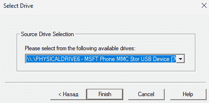

FTK Imager 中的 Windows Phone

现在，我们将学习如何从 SD 卡中提取数据。

# SD 卡数据提取方法

Windows 手机可能包含可移动的 SD 卡。这些卡可能受到防止 SD 卡被移除和使用，或者通过其他设备（手机、相机、计算机等）访问的密钥的保护。这与用户加密 SD 卡时创建的密钥不同。可以对用户加密的 SD 卡进行暴力破解和字典攻击，以尝试访问数据。在检查 Windows 手机时，最好研究设备，看看在从设备中获取数据时 SD 卡安全是否会成为一个因素。如果是这样，请简单地按照前面的步骤，并通过手机在法庭提取期间获取 SD 卡数据。请参考以下图表。

对于可以移除 SD 卡的设备，您有两种情况要考虑。如果设备开启，您应该如何获取手机和 SD 卡？如果设备关闭，您应该移除 SD 卡并使用 FTK Imager 获取设备？答案是，这取决于情况。在取证中，我们经常使用这个声明，但它仍然是正确的。如果您让设备保持开启，必须将其与网络隔离，以确保它不会被远程访问并立即获取，否则电池将耗尽，最终设备可能会关机。如果设备关闭并且您移除了 SD 卡，必须确保 SD 卡仍然与设备本身绑定，并且在外部和内部都获取，以确保捕获所有数据。在正常情况下，以下图表建议处理 Windows 手机中发现的 SD 卡的推荐步骤：

大多数商业取证工具都会提供从 SD 卡中提取数据的选项。通常，手机提取过程只会提取存储在 SD 卡上的数据。当不支持特定 Windows 手机时，通常会出现这种情况。如果工具无法识别 SD 卡并提取数据，则用户可能已对 SD 卡进行加密，并且设备的密码与 SD 卡的密码不同。发生这种情况时，请尝试破解密码并重新获取设备。请注意，破解 SD 卡上的密码可能并不总是可能的，但是尝试暴力破解和字典攻击是值得一试的，就像在标准硬盘或外部设备上一样。

在获取从 Windows 手机中移除的 SD 卡时，FTK Imager 是一个免费且可靠的选项，可以创建一个经过法庭认可的镜像，可以在各种工具中进行检查。要创建 SD 卡镜像，请按照以下步骤操作：

1.  从设备中取出 SD 卡，并确保记录卡和手机上的所有标识符，以确保它们不会永久分离。

1.  将 SD 卡插入*写入阻断器*，然后将其插入取证工作站。

1.  启动 FTK Imager。

1.  选择文件，然后创建磁盘映像。

1.  选择物理驱动器：

FTK Imager - 创建磁盘镜像

1.  使用下拉列表选择正确的设备。

查看制造商和大小，以确保您正在获取正确的设备。

1.  选择完成。

1.  点击添加，然后选择图像类型。在本例中，将使用 Raw (dd)，因为大多数商业和开源分析方法都支持它：

FTK Imager - 选择图像类型

1.  输入相关案件信息，然后选择下一步。这一步可以跳过。

1.  选择图像目的地：

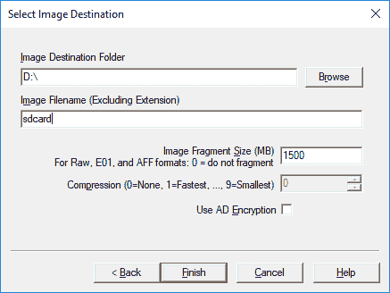

FTK Imager - 保存您的镜像文件

1.  选择完成，然后选择开始。建议在创建镜像后验证图像。

完成后，您的结果将显示出来。我们将在接下来的章节中介绍如何分析 SD 卡数据。

# 检查的关键物件

在本节中，我们将向您介绍一些最常见的 Windows 手机取证物件的位置，包括联系人、短信、通话和互联网历史记录。

# 提取联系人和短信

Windows 手机 7-10 中的所有联系人和收发的短信都存储在名为`store.vol`的文件中，该文件位于`\Application Data\Microsoft\Outlook\Stores\DeviceStore`（Windows 7）和`Users\WPCOMMSERVICES\APPDATA\Local\Unistore`（Windows 8-10）目录下。下面是 Windows 10 中`store.vol`文件的示例截图：

Windows 手机中的 store.vol 文件

现在，让我们学习如何提取通话记录。

# 提取通话记录

通话历史数据目前可以从`Phone`文件中提取。需要注意的是，该文件没有扩展名，位于`\Users\WPCOMMSERVICES\APPDATA\ Local\UserData\`。以下是 Windows 10`Phone`文件的示例：

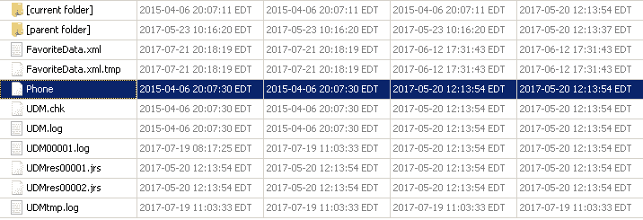

Windows Phone 中的 Phone 文件

类似地，我们将在下一节中提取 Internet 历史记录。

# 提取互联网历史记录

Internet history 可以从位于`\Users\DefApps\APPDATA\Local\Microsoft\Windows\WebCache\`的`WebCacheV01.dat`文件中提取。以下是 Windows 10`WebCacheV01.dat`文件的示例：

Windows Phone 中的 WebCacheV01.dat 文件

这些文件可以通过十六进制查看器手动检查，也可以使用移动取证工具自动解析。以下是使用 Magnet AXIOM 解析的`WebCacheV01.dat`文件：

使用 Magnet AXIOM 解析的 WebCacheV01.dat 文件

通过这些内容，我们已经介绍了如何从 Windows Phone 中提取短信、联系人、通话和互联网历史记录。

# 总结

从 Windows Phone 设备获取数据具有挑战性，因为它们是安全的，商业取证工具和开源方法并未为您这样的取证人员提供简单的解决方案。多种工具、芯片脱焊、JTAG 以及本书中定义的方法是一些可以访问 Windows Phone 设备用户数据的方法。通常情况下，您会发现 Windows Phone 设备需要多种提取方法才能获取可访问的数据。最大的挑战是获取设备以获取数据。一旦数据可用，您可以分析所有提取的信息。

在本章中，我们介绍了 Windows Phone 设备的界面、重要功能和安全模型。然后，我们查看了 Windows 文件系统中的不同分区和文件夹结构。Windows Phone 注册表类似于 Microsoft 操作系统中的注册表。我们看到了如何使用商业工具和不使用商业工具提取数据，并查看了一些常见的 Windows Phone 取证物件。有了这些知识，您现在可以使用多种提取方法从 Windows Phone 中提取用户数据。

下一章将指导您解析第三方应用程序文件。
