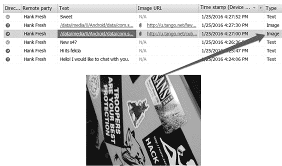
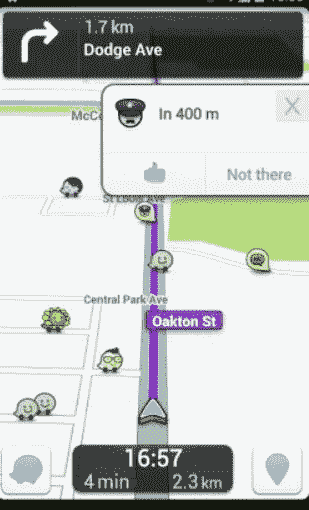
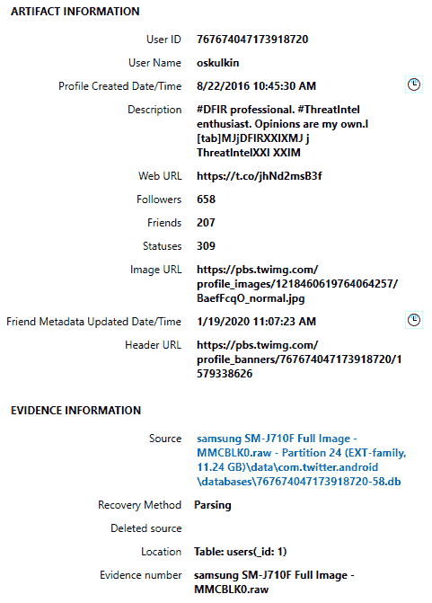
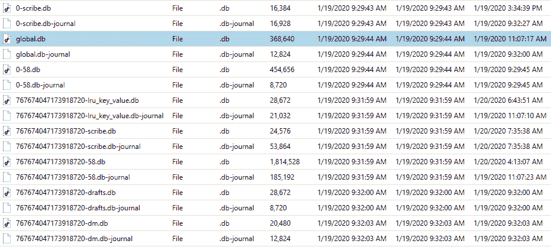
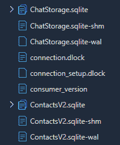
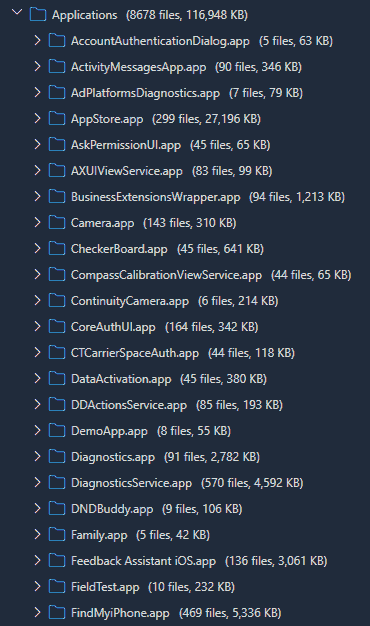
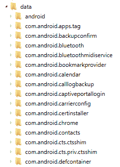
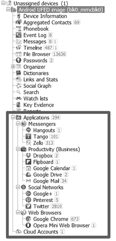
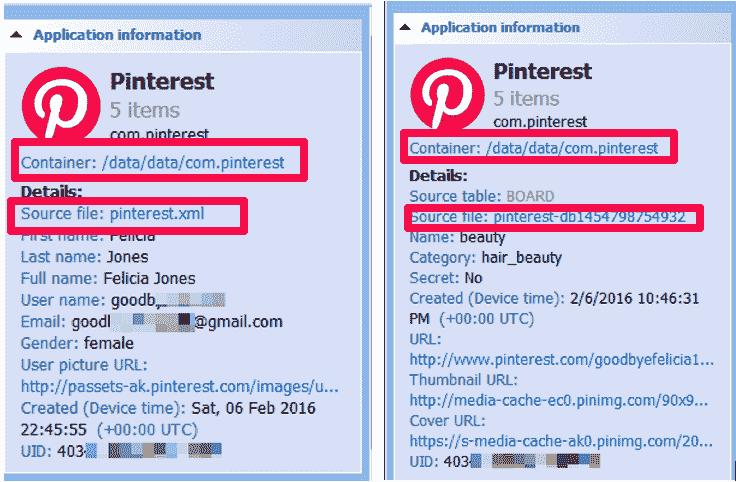

# 第十三章：解析第三方应用程序文件

第三方应用程序已经席卷了智能手机社区。大多数智能手机所有者在他们的设备上有不止一个应用程序，他们依赖这些应用程序来聊天、游戏、获取方向或分享图片。根据[`www.statista.com/statistics/276623/number-of-apps-available-in-leading-app-stores/`](https://www.statista.com/statistics/276623/number-of-apps-available-in-leading-app-stores/)，全球各种智能手机上几乎有 500 万个应用程序。苹果的 App Store 提供大约 180 万个应用程序，Google Play 提供 247 万个，亚马逊提供 60 万个，Windows 提供 67 万个。这个数字预计将在 2020 年大幅增长。

本章的目标是向你介绍在 Android、iOS 设备和 Windows Phone 上看到的各种应用程序。每个应用程序由于版本和设备的不同而有所不同，但它们的基本结构是相似的。我们将看看数据是如何存储的，以及为什么偏好文件对你的调查很重要。

我们将在本章中详细介绍以下主题：

+   不同的第三方应用程序

+   iOS 设备上应用程序的存储方式

+   应用程序在 Android 设备上的存储方式

+   Windows Phone 应用程序存储

+   如何使用商业和开源解决方案解析应用程序数据

# 第三方应用程序介绍

第三方应用程序是移动设备调查的重要组成部分；通常，关键的证据似乎存在于应用程序中。这需要你了解应用程序数据存储在设备上的位置，应用程序数据如何保存在该平台上，以及哪种工具最有助于揭示证据。在任何智能手机上检查第三方应用程序时，手动解析通常是一个关键因素。虽然一些商业工具，如 Belkasoft Evidence Center 或 Magnet AXIOM，以应用程序解析支持而闻名，但没有工具是完美的，工具几乎不可能跟上为每个应用程序发布的频繁更新。

通常，你会发现市场上最受欢迎的商业工具解析最受欢迎的应用程序。例如，当 Facebook 收购 WhatsApp 时，Belkasoft、Cellebrite、Magnet Forensics 和 Oxygen Forensics 开始支持这个应用程序。Facebook 非常受欢迎，但由于内置的安全功能，数据并不总是被提取或解析出来，这就是所有应用程序的不同之处。我们最好的建议是测试、测试和测试！你可以下载一个应用程序，填充数据，并检查结果，看看你对证据的观点与你的实际证据相比如何。这种做法将使你了解更新如何改变证据，证据位置如何改变，以及如何手动提取你的工具遗漏的证据。此外，逆向工程一个应用程序并分析其代码将帮助你确定数据存储在哪里以及如何存储。

大多数应用程序不需要数据计划即可使用；它们可以通过 Wi-Fi 网络完全运行，这意味着如果一个人前往其设备通常无法工作的地区，应用程序仍然可以正常运行。例如，当我旅行时，我依赖 Skype、Viber 和 WhatsApp 来与家人和朋友通话和发短信。要使用这些应用程序，唯一需要的就是我的智能手机连接到 Wi-Fi。

我们在本书中已经讨论了一些第三方应用程序提取和分析的技巧。除此之外，我们还在第五章 *iOS 数据分析和恢复*；第十章 *Android 数据分析和恢复*；第十一章 *Android 应用程序分析、恶意软件和逆向工程*；以及第十二章 *Windows Phone 取证*中讨论了需要检查的文件以了解和分析应用程序数据。本章将深入探讨应用程序和相关文件，并为您准备好分析这些证据。每个应用程序都有其用途。大多数工具都支持每个类别中最受欢迎的应用程序。其余的就取决于您了。Oxygen Forensic Detective 工具呈现的应用程序快速概览如下截图所示。如预期的那样，这些并不是设备上所有的应用程序；而只是工具知道如何解析的应用程序：


Oxygen Forensic Detective 在苹果设备上解析的应用程序示例

在下一节中，我们将分析一些广泛使用的聊天应用程序。

# 聊天应用程序

聊天应用程序是市场上最常见的应用程序之一。这些应用程序为用户提供了在网络服务提供商提供的标准服务之外进行聊天或通话的能力。这些应用程序通常可能比其他应用程序更安全。通过安全，我们指的是这些应用程序可能提供加密、私人资料、私人群聊等功能。此外，这些应用程序使用户能够在无需数据套餐的情况下通过 Wi-Fi 发送消息或拨打电话。Facebook Messenger、WhatsApp、Skype、Tango 和 Snapchat 是一些较受欢迎的应用程序。

解析聊天应用程序的证据并不总是简单的。通常需要多种工具和方法才能提取其中的所有数据。商业工具可能只解析部分数据，迫使您学习如何检查和恢复所有数据，否则就会错过证据。在下面的截图中，Oxygen Forensic Detective 正在用于解析 Android 设备上 Tango 的聊天消息。请注意，消息在表格中没有显示图片。但是，这张图片可以*拼接*到消息中（请注意截图中箭头指向所属消息的截图），以提供对对话中分享的内容的整体图片。这是一个手动过程，不是由工具执行的：



拼接应用程序聊天日志的示例

接下来，我们将看一下 GPS 应用程序。

# GPS 应用程序

大多数用户都会从他们的标准手机应用程序中分支出来，以获得 GPS 支持。这包括获取到达目的地的指示和获取感兴趣地区的地图。常见的 GPS 应用程序包括 Waze 和谷歌地图。Waze 不仅提供路线指示，还会提醒用户有沿途的道路危险、交通情况和警察：



Waze 应用程序

其他存储位置信息的应用程序包括 Twitter、Instagram、Facebook 和 Foursquare。这些应用程序使用户在发布帖子或分享图片或视频时能够通知朋友和关注者他们的位置。所有这些交易都在应用程序内进行跟踪。了解这一点对于发现您的取证工具未报告的其他证据至关重要。

在检查来自 GPS 应用程序的位置信息时，最好假设您需要手动检查与该应用程序相关的数据库和首选文件。我们建议使用您的取证工具对设备上的数据进行分类，并深入挖掘后面将在本章讨论的证据。在 UFED 物理分析器中解析 Waze 的示例可以在以下截图中找到。在这里，我们可以看到用户有 5 个收藏的位置，74 个映射的位置和 70 个最近的方向。如果这些信息与调查有关，都必须进行手动验证。这是因为工具无法确定用户是否输入了地址，是否是建议的，或者用户是否甚至去过那个地方。您需要适当的技能来将用户与特定位置联系起来，这需要不仅仅是一个取证工具：


UFED 物理分析器中的 Waze 应用程序

我们现在将分析一些流行的安全消息应用。

# 安全应用程序

如果数据是安全的并且自毁的，它是否曾经存在过？忽略数据保留的声明，寻找那些数据，因为这些应用经常提出的声明是不真实的。尽管应用程序是以安全性为目标设计的，但更新很快发布，质量保证检查可能不够强大，无法捕捉一切。偶尔，您会发现一个具有加密或不存在数据库的应用程序，但文件包括日志、预写日志或共享内存文件，其中包含本应加密的部分聊天内容。此外，用户可以保存共享的媒体文件，截取对话的屏幕截图，以及做更多的事情。通常，您可能会发现共享的图像、音频和视频文件，这些文件本应该是加密的。

一些流行的安全消息应用包括 Telegram、Wickr 和 Signal。其中一些是加密的，其中没有任何可恢复的内容。然而，这一切取决于设备、智能手机上运行的操作系统和应用程序的版本。这些应用的安全级别是公开宣传的，但同样，要持怀疑态度。您应该始终假设应用程序可能存在漏洞，可能会在法证上为您提供访问。挖掘这些证据！

# 财务应用程序

利用财务信息的应用程序，如信用卡信息和个人银行业务，必须加密和安全。iOS 设备将不会在没有 Apple ID 和密码的情况下获取这些应用程序。即使您有用户的 Apple ID 和密码，提取的数据仍应该是加密的。一些财务应用程序的例子包括 Google Pay、Microsoft Wallet、PayPal、Apple Pay 和应用内购买。当您检查设备时，您可能会看到该应用程序已安装相关的应用程序元数据，但帐户信息和交易将无法访问。

# 社交网络应用程序

社交网络应用的商业支持非常强大，因为它们是从应用商店下载的最受欢迎的应用程序。这些应用程序允许用户发布帖子，分享位置，公开和私下聊天，并基本上记录他们的生活。常见的社交网络应用包括 Facebook、Twitter 和 Instagram。通常，用户会启用一个应用，比如 Instagram，以便让其访问 Facebook 和 Twitter，从而实现无缝发布。因此，在检查设备时，用户可能会发现同一文件或对话的多个副本，这是因为应用之间的共享。

在使用商业工具检查这些应用程序时，通常会解析聊天和联系人，这意味着其他数据可能被忽略。同样，这意味着你必须查看数据转储，以确保没有遗漏。举个例子，我们将看一下 Twitter。这个应用程序存储了很多可能需要超过一个工具来解析的信息。此外，用户可能需要手动检查数据库文件，以确保所有证据都已被恢复。

让我们看看工具能够提取什么。正如本书中多次提到的，从工具告诉你已安装的内容开始，然后制定关键词和方法深入挖掘文件系统。我们可以在以下截图中看到 Twitter 的用户帐户信息，以及正在提取这些数据的文件路径：



Magnet AXIOM 解析的 Twitter

下一个逻辑步骤是查看工具能告诉你关于应用程序及其使用方式的信息。Magnet AXIOM 为 Twitter 帐户使用提供了以下信息。请注意，公共推文和私人消息（DMs）都已恢复：


Magnet AXIOM 使用的 Twitter

检查工具解析的内容后，应该检查数据库文件，以确保没有遗漏。这并不总是简单的，因为每个帐户和功能可能都有一个独特的数据库。通过功能，我们指的是联系人可能存储在一个数据库中，而聊天和帐户信息存储在另一个数据库中。一旦你对常见的应用程序更加熟悉，你就会知道首先在哪里查找。

在以下截图中，我们可以看到与 Twitter 相关的所有数据库。再次，从你所知道的开始，深入挖掘：



包含用户活动的 Twitter 数据库

每个数据库可能包含可以解析出额外证据的独特数据。这些应用程序还包含独特的`user_id`值，可以用作关键词，在调查中搜索具有通信痕迹的其他设备。

可以编写自定义查询来解析感兴趣的 Twitter 数据库。如何做到这一点的一个很好的例子如下所示。这个查询是特定于解析 Twitter 联系人的：

```kt
SELECT _id AS "Index", 
user_id AS "User ID", 
username AS "Username", 
name AS "Name", 
datetime (profile_created/1000,'UNIXEPOCH','localtime') AS "Profile Created", 
description AS "Twitter Description", 
web_url AS "Website URL",
location AS "Location",
followers AS "Followers", 
friends AS "Following", 
users.statuses AS "Number of Tweets",
image_url AS "Profile Image URL", 
datetime (updated/1000,'UNIXEPOCH','localtime') AS "Profile Updated" 
FROM users
```

到目前为止，我们已经看了各种第三方应用程序以及工具如何帮助调查人员提取数据。现在我们将看一些基本概念，这些概念将帮助调查人员分析数据。

# 编码与加密

在讨论应用程序和智能手机数据时，*编码*和*加密*这两个术语经常被使用，以至于它们经常被混淆。编码本质上是将消息或信息混淆为原始代码的过程。在某些情况下，编码的目标是使数据对计算机或用户不可识别。实际上，编码的主要目标是使用公开可用的方案将输入转换为不同的格式。换句话说，任何人都可以轻松解码编码值。然而，加密使用密钥来保持数据的内容保密。因此，只有拥有密钥的人才能将加密文本反转。

大多数应用程序声称它们加密数据或数据从不保存到磁盘。虽然对一些应用程序来说是真的，但大多数只是编码。编码选项可以有所不同，但智能手机数据最常见的选项是`Base64`。消息应用程序通常依赖`Base64`编码来使数据看起来被隐藏或*安全*。`Base64`的一个常见特征是在编码字节不能被三整除时，用`**=**`填充数据。

几年前，Oxygen Forensics 和 Autopsy 是少数几个支持从智能手机派生的应用程序解码`Base64`有效负载的工具。为了解析数据，这些工具必须支持包含编码的应用程序。目前，MSAB、UFED Physical Analyzer 和 Magnet IEF 提供`Base64`解码支持。

下面的屏幕截图显示了`Base64`编码的消息示例。这些数据来自 Tango 聊天应用程序：


Base64 编码的 Tango 消息

加密会更加困难，因为应用程序本身可能甚至不提供对加密数据的访问。例如，您可能会发现数据库目录或包含加密数据的单元格为空。偶尔，您将可以访问数据库中的加密块，但这些数据并非总是可以解密的。同样，当面对加密数据时，要寻找其他地方。您是否已经检查了日志和预写式日志？您是否已经检查了缓存和媒体目录？您是否已经检查了 SD 卡？这些通常是您经常不得不问自己的常见问题，以确保您不会过分依赖您的取证工具，并且您正在尽力确保没有遗漏任何内容。正如我们所解释的，从您所知道的开始。我们知道缓存和数据库目录存储用户数据，因此这是开始手动检查的好地方，正如您在下面的屏幕截图中所看到的：


应用程序的数据存储位置

在接下来的章节中，我们将介绍应用程序如何在设备内存中存储其数据以及各种存储选项的重要性。

# iOS、Android 和 Windows Phone 应用程序数据存储

几乎所有应用程序都依赖 SQLite 进行数据存储。这些数据库可以在设备内部或适用于相关手机的 SD 卡上存储。当使用 SQLite 时，通常会为每个数据库关联临时内存文件，以使 SQLite 更有效。这些文件是**回滚日志**（**JOURNAL**）、**预写式日志**（**WAL**）和**共享内存**（**SHM**）文件。这些文件可能包含 SQLite 数据库中不存在的数据。我们可以在下面的屏幕截图中看到与各种 WhatsApp 数据库文件相关联的几个 WAL 和 SHM 文件：



SHM 文件和 WAL 示例

除了 SQLite 数据库外，其他设备还依赖 Plist、XML、JSON 和 DAT 文件来存储应用程序数据、账户数据、购买信息和用户偏好。这些文件将在本章的 Android、iOS 和 Windows Phone 部分中讨论。

# iOS 应用程序

苹果依赖 SQLite 和 Plist 作为应用程序数据存储的常见位置。偶尔，JSON 文件将用于应用程序数据。检查从 iOS 设备中恢复的应用程序可能会让人不知所措。我们建议您从您所知道的和您的工具告诉您的内容开始。检查您选择的工具列出的已安装应用程序。从这里，直接转到应用程序目录，并确保没有遗漏任何内容。当用户删除应用程序时，数据库通常会保留，而已安装应用程序的链接只是断开了。检查 iOS 设备的所有区域将防止您错过数据：



iPhone 上的已安装应用程序

检查已安装的应用程序后，搜索`Library`和`Documents`目录，查找可能包含应用程序工件的相关 Plist 文件。最后，检查 iPhone 上的`Media`目录以及与应用程序相关联的目录，以恢复其他工件，例如共享照片、视频、音频文件和个人资料图片。在下面的屏幕截图中，我们正在检查与 WhatsApp 应用程序相关联的`Media`目录：


iPhone 上的应用程序数据

我们现在将看一下安卓应用程序中的数据存储。

# 安卓应用程序

安卓设备在应用程序存储方面严重依赖 SQLite。每个应用程序的偏好文件通常以 DAT 或 XML 文件格式存在。与 iOS 设备相比，在安卓设备上检查应用程序可能是最繁琐的任务之一。这是因为数据可能存储在各种位置。最好的开始是使用工具列出设备上安装了什么。接下来，转到`/Root`目录下的子目录。请记住，这些应用程序可能具有独特的名称，可能难以定位。

您可能需要研究应用程序，以更好地理解与每个应用程序相关的文件名。以下截图是安卓设备上应用程序目录的示例：



安卓设备上的应用程序数据

每个应用程序目录都包含大量要检查的数据。我们建议从`Databases`和`Cache`目录开始，然后将分析扩展到设备上的其他位置。接下来要检查的位置包括`Media`和`Cache`分区。如果数据似乎丢失或被删除，请不要忘记检查设备和 SD 卡上的`Downloads`目录。

应用程序数据可以存在于`Media`目录中的多个位置。使用工具，比如提供超出解析项目的关键字搜索功能的 UFED 物理分析仪，将有助于定位与特定应用程序相关的证据。我们将在以下截图中查看存储在安卓设备的`Media`目录中的大量数据。这些数据与先前讨论的应用程序目录中存储的数据是不同的。需要彻底检查每个位置，以确保没有遗漏任何内容。重要的是，您要利用前几章学到的知识来分析安卓应用程序数据：


媒体目录中的唯一应用程序数据

我们现在将查看安装在 Windows Phone 上的应用程序及其获取。

# Windows Phone 应用程序

在 Windows Phone 上找到的应用程序与 iOS 和安卓设备上找到的应用程序没有什么不同。SQLite 是最常用的数据存储格式。但是，并非所有设备都允许在手机内部存储 SQLite 文件。对于这些设备，所有应用程序数据将存储在 SD 卡上。有些人可能认为这很幸运，因为这样可以避免在设备上检查多个位置，但 SD 卡和应用程序本身可能是加密的。

在可能的情况下，最好是移除 SD 卡并使用取证工具获取它。当这不可能时，下一个最佳方法是尝试通过手机使用取证工具获取 SD 卡。同样，这通常会导致数据丢失。最后的努力是通过挂载设备并使用 Windows 资源管理器查看设备和 SD 卡上存储的应用程序，如第十二章中所讨论的*Windows 手机取证*。

# 用于提取第三方应用程序数据的取证方法

几乎所有商业工具都会尝试支持第三方应用程序的提取。如果您依赖工具输出进行调查结果，我们建议您经常对工具进行彻底测试，因为应用程序更新非常频繁，工具几乎不可能不漏掉一些东西。您必须了解应用程序的工作原理，以及设备如何为每个应用程序存储数据。我们强烈建议您使用工具对案件进行初步筛选，然后深入数据手动提取工具漏掉的任何内容。确保您的取证报告中只包含事实数据，而不是工具解析的所有内容，因为工具无法区分设备和人类创造的区别。只有经过训练的检验员才能自信地做到这一点。

# 商业工具

正如您在本书中所看到的，有许多工具可以处理智能手机取证的工作。然而，在解析应用程序数据方面，有一些工具表现得非常出色。Magnet AXIOM、Oxygen Forensic Detective 和 UFED Physical Analyzer 是在本章讨论的应用程序类别中恢复数据的几个工具。我们将快速看一下如何利用这些工具来解析应用程序数据。请记住，这些工具不会找到每个应用程序，也不会解析所有应用程序的所有数据。

# Oxygen Forensic Detective

Oxygen Forensic Detective 可以用来检查应用程序数据。在这个例子中，我们假设采集已经完成，我们只是试图分析数据。请注意，Oxygen 能够采集和分析智能手机。在这个例子中，我们使用 Cellebrite UFED 采集了设备，并用 Oxygen 进行了分析。要加载设备的数据转储并检查其应用程序工件，请执行以下步骤：

1.  启动 Oxygen Forensic Detective。

1.  选择导入文件选项并选择您的图像。Oxygen 支持多种图像格式进行摄入。

1.  解析完成后，开始检查解析的应用程序：



Oxygen Forensic Detective 应用程序视图

1.  接下来，通过单击应用程序并检查所有相关文件来开始检查感兴趣的应用程序。

1.  选择应用程序后，将呈现解析的数据以及数据提取的完整文件路径。使用此路径手动验证发现。我们在下面的屏幕截图中查看了 Pinterest 应用程序。请注意，工具甚至鼓励您深入挖掘并验证发现：



Oxygen Detective Pinterest 示例

Oxygen Detective 具有内置的关键字搜索、书签和报告功能。此外，SQLite 数据库和 Plist 查看器将为您提供一种检查相关应用程序数据的方法。

1.  报告所有账户信息、聊天记录、消息、位置和其他感兴趣的数据，因为这可以为您的调查提供相关性。

接下来我们将看一下的工具是 Magnet AXIOM。

# Magnet AXIOM

Magnet AXIOM 被认为是数字媒体互联网和应用程序解析的领导者之一。它在移动设备上也同样强大。再次强调，一个工具无法完成所有工作，但 AXIOM 已被证明是最强大的，并且可以解析来自 Android、iOS 和 Windows 手机的大多数应用程序。要使用 AXIOM 来检查应用程序工件，请执行以下步骤：

1.  启动 AXIOM，创建一个新案例，然后选择 MOBILE（请注意，如果 MOBILE 是灰色的，您需要从 Magnet Forensics 获取提供移动支持的许可证）：


选择证据来源

1.  选择加载证据并导航到您的图像文件。可以同时加载和解析多个图像。

1.  选择转到工件详细信息，并确定您想要解析的内容。我们建议选择所有的应用程序：


Magnet AXIOM 支持的工件

1.  选择分析证据。

1.  完成后，您可以使用工件：


Magnet AXIOM 中的应用程序工件

检查 AXIOM 解析的内容是审查的第一步。在前面的屏幕截图中，我们可以看到 Telegram 被解析了。从最相关的位置开始您的审查。例如，如果您正在寻找 Telegram 聊天记录，请直接转到该位置并开始审查工件。请注意，消息和聊天被拉入两个不同的类别。当使用私人消息时，这是很常见的。应该检查所有相关的应用程序容器。此外，AXIOM 提供了数据恢复的完整文件路径。使用另一个工具导航到该文件以进行验证和手动审查。

AXIOM 还提供逻辑关键字搜索（它将搜索它可以解析的内容，而不会搜索其他内容）、书签和报告。确保您只报告事实性的应用程序工件，并将其纳入最终的取证报告中。

# UFED 物理分析器

物理分析器是市场上最知名的移动取证工具之一。该工具是手动进行审查的最佳平台之一，同时还可以利用工具解析的数据。对于应用程序分析，物理分析器擅长解析每个受支持应用程序的聊天记录和联系人。对于未解析的数据，物理分析器提供了一个分析平台，使用户能够浏览文件系统以发现其他工件。该工具的关键字搜索功能强大，能够搜索原始十六进制数据以及解析数据。此外，它还包含了 SQLite 查看器。

要在物理分析器中对应用程序数据进行取证审查，请执行以下步骤开始：

1.  通过双击 UFED 快捷图像文件或双击工具图标来启动物理分析器。

1.  加载图像文件并等待解析完成。

1.  检查解析的工件，如下图所示：


物理分析器解析的数据

我们建议检查已解析的内容，并参考数据提取的超链接。导航到该路径，然后检查整个应用程序目录。

要找到应用程序目录，请利用内置的关键字搜索功能来帮助调查。请记住，如果这不明显，您可能需要进行研究以确定与应用程序相关的文件名。

# 开源/免费工具

对于预算有限的人来说，可以使用开源解决方案和廉价工具来检查智能手机的应用程序数据。这些解决方案更难使用，通常不适合需要工具在数据提取和分析中提供帮助的取证新手。检查应用程序数据是繁琐的，如果您不知道该去哪里寻找，您可能需要花一些钱来提前了解。Andriller 等工具的价格大约为 500 美元。虽然这不是免费的，但也不是一些其他商业工具的 1 万美元。在接下来的部分中，我们将介绍一些我们喜欢的有用于解析智能手机应用程序数据的工具。

# 使用 Autopsy

Autopsy 是进行文件系统审查的最佳工具之一。不幸的是，Autopsy 不提供 iOS 解析，但对于文件系统映像仍然可能有用。Autopsy 可以从[`sleuthkit.org/autopsy/`](http://sleuthkit.org/autopsy/)下载。在使用 Autopsy 时，Android 分析器模块将解析设备中的一些应用程序数据。让我们看看如何使用 Autopsy 进行 Android 图像分析。

要使用 Autopsy，请下载软件并在 Windows 机器上安装，并按照以下说明操作。确保始终使用最新版本：

1.  启动 Autopsy。

1.  创建一个新案例：


Autopsy 案例创建

1.  选择下一步，然后点击完成。

1.  导航到图像文件并选择下一步。

1.  选择要运行的模块。关键字搜索和 Android 分析器对于 Android 设备将是最有成效的：


Autopsy 模块选择

摄取模块是内置在 Autopsy 中的工具，可以在案件开始时或之后的任何时候运行。Autopsy 此版本中的默认模块如下：

+   最近活动：提取最近的用户活动，如网页浏览、最近使用的文档和安装的程序。

+   哈希查找：使用提供的哈希数据库（如标准 NSRL 数据库）识别已知和显著的文件。它还允许导入自定义哈希数据库。

+   文件类型识别：根据二进制签名匹配文件类型。

+   存档提取器：提取存档文件（`.zip`、`.rar`、`.arj`、`.7z`、`.gzip`、`.bzip2`和`.tar`）。它会自动提取这些文件类型，并将其内容放入目录树中。

+   EXIF 解析器：摄取 JPEG 文件并检索其 EXIF 元数据。

+   关键字搜索：使用关键字和正则表达式在列表中执行文件索引和周期性搜索。它允许加载自定义关键字/列表。

+   电子邮件解析器：此模块检测和解析`mbox`和`pst`/`ost`文件，并在黑板上填充电子邮件工件。

+   扩展名不匹配检测器：这些是基于文件类型的非标准扩展名的标志文件。

+   E01 验证器：验证 E01 文件的完整性。

+   Android 分析器：提取 Android 系统和第三方应用数据。

+   有趣文件识别器：根据定义，识别有趣的项目。

此外，您可以为 Autopsy 安装第三方模块。其中一些对 Android 取证非常有用。一个很好的例子是 Mark McKinnon 的 Parse SQLite DB。此模块解析找到的任何 SQLite 数据库，并将其导入提取的内容中。此类模块可以从此 GitHub 下载：[`github.com/markmckinnon/Autopsy-Plugins`](https://github.com/markmckinnon/Autopsy-Plugins)

Autopsy 提供对文件系统数据的访问速度比任何商业或开源工具都要快。知道接下来该去哪里才是难点。因此，再次从提取的内容开始，然后深入文件系统，以检查本书中讨论的文件和任何相关应用程序数据，如下图所示：


使用 Autopsy 浏览文件系统

一旦确定了感兴趣的应用程序，就从解析的内容开始，然后检查相关的数据库、缓存和首选项文件。Autopsy 包括基本的 SQLite 查看器，可用于三分法目的。如果需要运行查询，我们建议使用 DB Browser for SQLite 或商业产品中包含的浏览器，例如 Belkasoft Evidence Center，特别是如果您想分析来自自由列表和未分配空间的数据。

Android 分析器可以自动解码一些工件，例如联系人、通话和短信。以下截图显示了解码的短信消息的结果：


Autopsy 解码的短信

现在，我们将看一些提取数据的更多方法。

# 其他提取应用程序数据的方法

解析应用程序数据的最简单方法之一是创建自定义 SQLite 查询和 Python 脚本来解析感兴趣的数据。我们在本书中讨论了几个建议和查询示例以及脚本。Python 是最好的解决方案之一，因为它是免费的，而且我们可以完全访问其库。要记住的一件事是，我们的脚本必须经常更新以跟上应用程序的更新。此外，确保您的编码模式是正确的，以防止应用程序遗留物被遗漏或解释不正确。

除了 Python 脚本之外，已经存在支持应用程序提取的免费解析器。WhatsApp Extract 是一个免费工具，适用于 Android 和 iOS，可以从设备中提取 WhatsApp 应用程序数据。通常，这个免费工具会提取比商业解决方案更多的数据，这取决于用户在安装过程中分配的权限。其他人，比如 Mari DeGrazia（[`az4n6.blogspot.in/p/downloads.html`](http://az4n6.blogspot.in/p/downloads.html)）、Adrian Leong（[`github.com/cheeky4n6monkey/4n6-scripts`](https://github.com/cheeky4n6monkey/4n6-scripts)）、Sarah Edwards（[`github.com/mac4n6`](https://github.com/mac4n6)）和 Alexis Brignoni（[`github.com/abrignoni`](https://github.com/abrignoni)）已经开发了用于解析应用程序、从 SQLite 空闲页中恢复已删除数据、解码`Base64`等的脚本。我们建议在开发自己的工具之前使用已有的工具。

# 总结

在本章中，我们学习了如何成功解析和提取流行的第三方应用程序中的数据。许多应用程序并不是它们声称的那样。不要相信您对应用程序的阅读，因为跨应用程序的质量保证测试并不一致，多年来我们已确定了几个漏洞和安全缺陷，这些漏洞和缺陷为我们提供了将应用程序数据拼接在一起的方法。此外，应用程序更新将改变我们查看发现的数据的方式。了解每部智能手机以及它如何存储应用程序数据是成功检查智能手机上的应用程序的第一步。了解更新可能会改变数据位置、编码和加密，以及您的工具功能的方式，是检查员难以掌握的最难的概念之一。您的工作是了解应用程序的功能，以从移动设备中发现最多的数据。

了解应用程序的工作方式已经足够困难，而不必考虑如何提取遗留物。正如您在本书中所读到的，有许多方法可以从智能手机中解析数据。一个工具是不够的，现实情况是移动取证可能会很昂贵。我们希望我们为您提供了一本实用指南，教您如何获取和分析从智能手机中恢复的遗留物。将您所学到的知识立即应用于您进行移动取证的方法，或者用它来使您在下一份工作中更有准备。记住，实践、测试和培训将使您在工作中更加出色，并将帮助您完善移动取证的艺术。
