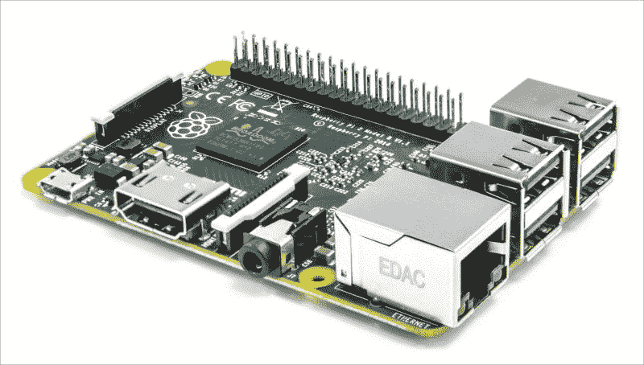
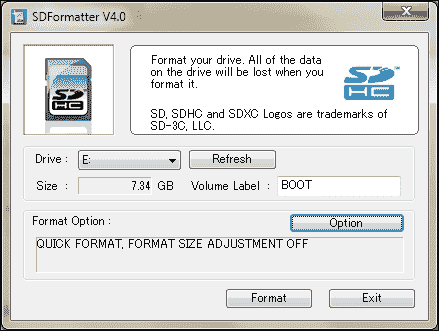
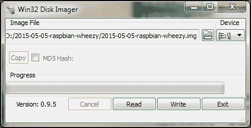
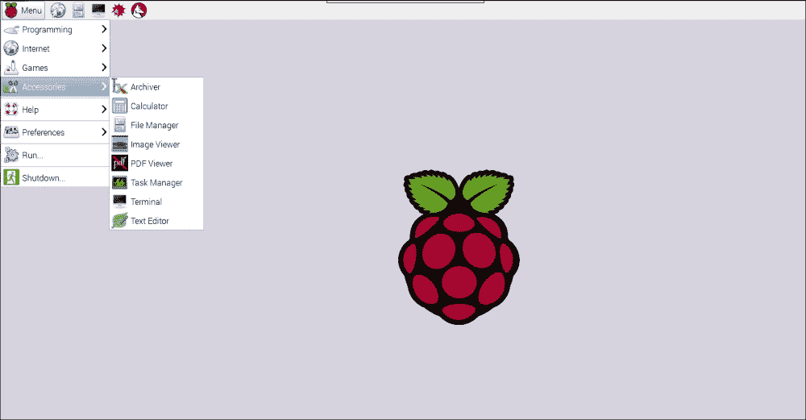

# 第一章 从任何地方远程连接到您的 Pi 的远程桌面连接

在这个项目中，我们将对 Pi 和安卓平台进行简单介绍，为我们暖身。当用户希望管理 Pi 时，许多用户都会面临类似的问题。你必须靠近你的 Pi，并连接一个屏幕和一个键盘。我们将通过远程连接到我们的 Pi 桌面界面来解决这个日常问题。本章涵盖以下主题：

+   先决条件

+   在您的 Pi 上安装 Linux

+   在设置中进行必要的更改

+   在树莓派和安卓中安装必要的组件

+   连接 Pi 和安卓

# 先决条件

本章中将使用以下物品，并且需要完成项目：

+   **树莓派 2 型 B 型号**：这是树莓派家族的最新成员。它取代了以前的 Pi 1 型 B+。以前的型号应该可以很好地完成本书涵盖的项目的目的。

+   **MicroSD 卡**：树莓派基金会建议使用 8GB 的 6 级 MicroSD 卡。

+   **安卓设备**：设备至少应该有 1.5 或更高版本的安卓系统，这是本章中使用的应用所需的版本。在接下来的一些激动人心的项目中，我们将需要安卓 4.3 或更高版本。

+   **HDMI 线**：这将用于将 Pi 连接到屏幕进行初始设置。

+   **以太网线**：这将用于网络连接。

+   **电脑**：这将用于将 Raspbian 操作系统复制到 MicroSD 卡上。

+   **USB 鼠标**：这将在初始设置期间使用。

以下图片显示了树莓派 2 型 B 型号：



树莓派 2 型 B 型号

# 在您的 Pi 上安装 Linux

我们将在 Pi 上使用**Raspbian**作为操作系统。我的选择完全基于它是树莓派基金会推荐的事实。它基于 Linux 的 Debian 版本，并针对树莓派硬件进行了优化。除了是树莓派最常用的操作系统外，它还包含了几乎 35000 个软件包，如游戏、邮件服务器、办公套件、互联网浏览器等等。在我写这本书的时候，最新版本是 2015 年 5 月 5 日发布的。

安装 Raspbian 有两种主要方法。你可以使用整个操作系统镜像，也可以从一个名为**NOOBS**的易于使用的工具-操作系统捆绑包开始。我们将在这里涵盖这两种情况。

### 注意

有一些带有 NOOBS 或 Raspbian 预装的 SD 卡出售。也许买一个这样的会是个好主意，可以跳过本章的操作系统安装部分。

然而，在我们开始之前，我们可能需要格式化我们的 SD 卡，因为以前的操作系统安装可能会损坏卡。如果你使用计算机操作系统提供的格式化工具格式化了卡，但卡上只显示了一小部分可用空间，你会注意到这一点。我们将使用的工具叫做**SD Formatter**，可以从**SD 协会**的网站上下载 Mac 和 Windows 版本，网址是[`www.sdcard.org/downloads/formatter_4/index.html`](https://www.sdcard.org/downloads/formatter_4/index.html)。安装并启动它。你会看到以下界面，要求你选择 SD 卡位置：



SD Formatter 界面

## 使用 NOOBS 安装

最新版本的 NOOBS 可以在[`downloads.raspberrypi.org/NOOBS_latest`](http://downloads.raspberrypi.org/NOOBS_latest)找到。下载并解压内容到 SD 卡上。将卡插入 Pi 并使用 HDMI 线连接到屏幕。不要忘记连接 USB 鼠标。当 Pi 连接到电源时，你将看到一个你可以选择的列表。在列表上选择**Raspbian**安装选项，然后点击**安装**。这将在您的 SD 卡上安装 Raspbian 并重新启动 Pi。

## 使用 Raspbian 镜像安装

Raspbian OS 的最新版本可以在[`downloads.raspberrypi.org/raspbian_latest`](http://downloads.raspberrypi.org/raspbian_latest)找到。ZIP 文件大小接近 1GB，包含一个扩展名为`.img`的单个文件，大小为 3.2GB。解压内容并按照下一节中的步骤将其提取到合适的 microSD 卡中。

## 将 OS 映像提取到 SD 卡

要提取映像文件，我们需要一个磁盘映像实用程序，我们将在 Windows 上使用一个名为**Win32 Disk Imager**的免费可用实用程序。它可以在[`sourceforge.net/projects/win32diskimager/`](http://sourceforge.net/projects/win32diskimager/)上下载。在 Mac OS 上，有一个类似的工具叫做**ApplePi Baker**，可以在[`www.tweaking4all.com/hardware/raspberry-pi/macosx-apple-pi-baker/`](http://www.tweaking4all.com/hardware/raspberry-pi/macosx-apple-pi-baker/)上找到。下载并安装到您的计算机上。安装将包含一个可执行文件`Win32DiskImager`，您应该右键单击它并选择**以管理员身份运行**。

在**Win32 Disk Imager**窗口中，您应该选择您提取的映像文件和 SD 卡驱动器，类似于以下截图所示：



Win32 Disk Imager 窗口

单击**Write**按钮将启动该过程，您的 SD 卡将准备好插入 Pi 中。

# 在设置中进行必要的更改

当 Pi 仍然连接到带有 HDMI 的屏幕时，使用以太网连接到网络。当 Pi 第一次启动时，您将看到一个设置实用程序，如下截图所示：


树莓派软件配置工具

您还可以选择列表中的第一个选项**扩展文件系统**。同时选择第三个选项**启用启动到桌面**。

在下一个菜单中，选择列表中的第二项**以用户'pi'身份在图形桌面登录**。然后，选择**<Finish>**并选择**Yes**以重新启动设备。


在配置工具中选择桌面启动

重新启动后，您将看到 Raspbian 的默认桌面管理器环境**LXDE**。

# 在 Pi 和 Android 中安装必要的组件

如下截图所示，LXDE 桌面管理器带有初始设置和一些预装程序：



LXDE 桌面管理环境

通过点击位于顶部的选项卡栏上的屏幕图像，您将能够打开一个终端屏幕，我们将用它来向 Pi 发送命令。

下一步是安装一个名为`x11vnc`的组件。这是 Linux 的窗口管理组件 X 的 VNC 服务器。在终端上输入以下命令：

```kt
sudo apt-get install x11vnc

```

这将下载并安装`x11vnc`到 Pi。我们甚至可以设置一个密码，供 VNC 客户端远程桌面连接到这个 Pi 时使用以下命令并提供稍后使用的密码：

```kt
x11vnc –storepasswd

```

接下来，我们可以在 Pi 重新启动并启动 LXDE 桌面管理器时运行`x11vnc`服务器。可以通过以下步骤完成：

1.  进入位于`/home/pi`的 Pi 用户的`.config`目录：

```kt
cd /home/pi/.config

```

1.  在这里创建一个名为`autostart`的子目录：

```kt
mkdir autostart

```

1.  进入`autostart`目录：

```kt
cd autostart

```

1.  开始编辑一个名为`x11vnc.desktop`的文件。作为终端编辑器，我正在使用`nano`，这是树莓派上新手用户最容易使用的编辑器，但也有更令人兴奋的替代方案，比如**vi**：

```kt
nano x11vnc.desktop

```

将以下内容添加到此文件中：

```kt
[Desktop Entry]
Encoding=UTF-8
Type=Application
Name=X11VNC
Comment=
Exec=x11vnc -forever -usepw -display :0 -ultrafilexfer
StartupNotify=false
Terminal=false
Hidden=false
```

1.  如果您使用**nano**作为您选择的编辑器，请使用(*Ctrl*+*X*, *Y*, *Enter*)保存并退出。

1.  现在，您应该重新启动 Pi，使用以下命令来运行服务器：

```kt
sudo reboot

```

使用`sudo reboot`命令重新启动后，我们现在可以通过发出`ifconfig`命令在终端窗口中找出树莓派被分配的 IP 地址。分配给您的树莓派的 IP 地址可以在`eth0`条目下找到，并且在`inet addr`关键字之后给出。记下这个地址：


ifconfig 命令的示例输出

1.  下一步是在您的 Android 设备上下载 VNC 客户端。

在本项目中，我们将使用一个名为**androidVNC**的免费可用的 Android 客户端，或者在 Play 商店中称为**androidVNC 团队+antlersoft**的**VNC Viewer for Android**。在撰写本书时使用的最新版本是 0.5.0。

### 注意

请注意，为了能够将您的 Android VNC 客户端连接到树莓派，树莓派和 Android 设备都应该连接到同一网络——Android 通过 Wi-Fi 连接，树莓派通过其以太网端口连接。

# 连接树莓派和 Android

在您的设备上安装并打开 androidVNC。您将看到一个要求连接详细信息的第一个活动用户界面。在这里，您应该提供连接的**昵称**，您在运行`x11vnc` `–storepasswd`命令时输入的**密码**，以及使用`ifconfig`命令找到的树莓派的 IP **地址**。通过按下**连接**按钮启动连接，您现在应该能够在您的 Android 设备上看到树莓派的桌面。

在 androidVNC 中，您应该能够通过点击屏幕来移动鼠标指针，并且在 androidVNC 应用程序的选项菜单下，您将找到如何使用*Enter*和*Backspace*向树莓派发送文本和按键的方法。

### 注意

您甚至可能会发现从另一台计算机连接到树莓派很方便。我建议在 Windows、Linux 和 Mac OS 上使用 RealVNC 来实现这一目的。

## 如果我想在树莓派上使用 Wi-Fi 呢？

为了在树莓派上使用 Wi-Fi dongle，首先，使用以下命令打开`nano`编辑器打开`wpa_supplicant`配置文件：

```kt
sudo nano /etc/wpa_supplicant/wpa_supplicant.conf

```

将以下内容添加到此文件的末尾：

```kt
network={
    ssid="THE ID OF THE NETWORK YOU WANT TO CONNECT"
    psk="PASSWORD OF YOUR WIFI"
}
```

### 注意

我假设您已经设置了无线家庭网络以使用 WPA-PSK 作为认证机制。如果您有其他机制，您应该参考`wpa_supplicant`文档。LXDE 提供了更好的通过 GUI 连接到 Wi-Fi 网络的方法。它可以在树莓派桌面环境的右上角找到。

## 从任何地方连接

现在，我们已经从我们的设备连接到了树莓派，我们需要连接到与树莓派相同的网络。但是，我们大多数人也希望能够从世界各地连接到树莓派。为了做到这一点，首先，我们需要知道由网络提供商分配给我们的家庭网络的 IP 地址。通过访问[`whatismyipaddress.com`](http://whatismyipaddress.com)网址，我们可以找出我们家庭网络的 IP 地址。下一步是登录到我们的路由器并打开来自世界各地对树莓派的请求。为此，我们将使用大多数现代路由器上找到的一个名为**端口转发**的功能。

### 注意

要注意端口转发中包含的风险。您正在向全世界开放对树莓派的访问权限，甚至对恶意用户也是如此。我强烈建议在执行此步骤之前更改用户`pi`的默认密码。您可以使用`passwd`命令更改密码。

通过登录到路由器的管理门户并导航到**端口转发**选项卡，我们可以打开对树莓派内部网络 IP 地址的请求，这是我们之前找到的，并且 VNC 服务器的默认端口是`5900`。现在，我们可以在世界各地提供我们的外部 IP 地址给 androidVNC，而不是仅在我们与树莓派在同一网络上时才能使用的内部 IP 地址。


Netgear 路由器管理页面上的端口转发设置

### 注意

请参考您路由器的用户手册，了解如何更改**端口转发**设置。大多数路由器要求您通过以太网端口连接以访问管理门户，而不是通过 Wi-Fi。

# 动态局域网 IP 地址和外部 IP 地址的问题

这个设置有一个小问题。树莓派可能在每次重新启动时获得一个新的局域网 IP 地址，使得**端口转发**设置变得无用。为了避免这种情况，大多数路由器提供了**地址保留**设置。你可以告诉大多数路由器，每当连接一个具有唯一 MAC 地址的设备时，它应该获得相同的 IP 地址。

另一个问题是，您的**互联网服务提供商**（**ISP**）可能会在每次重新启动路由器或出于其他原因为您分配新的 IP 地址。您可以使用动态 DNS 服务，如 DynDNS，来避免这些问题。大多数路由器都能够使用动态 DNS 服务。或者，您可以通过联系您的 ISP 来获得一个静态 IP 地址。

# 摘要

在这个项目中，我们安装了 Raspbian，启动了树莓派，启用了桌面环境，并使用安卓设备连接到了树莓派。

在下一章中，我们将直接访问树莓派的控制台，甚至可以使用我们的安卓设备通过 FTP 传输文件到树莓派和从树莓派中传输文件。
