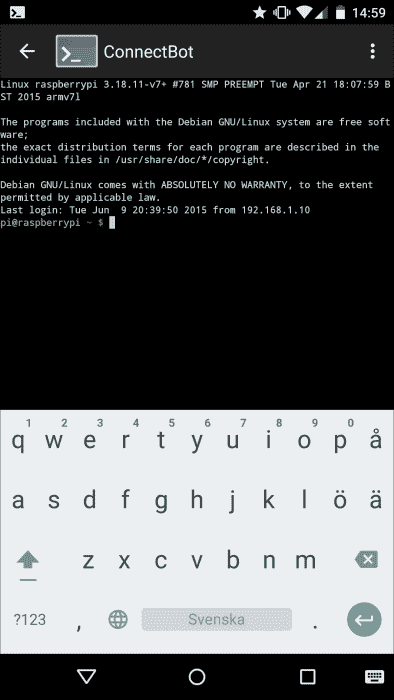
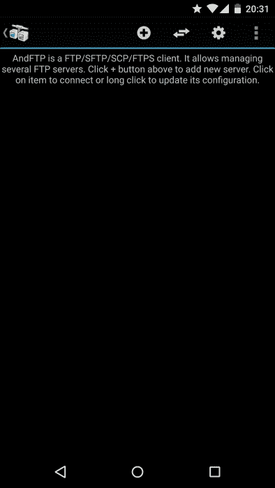
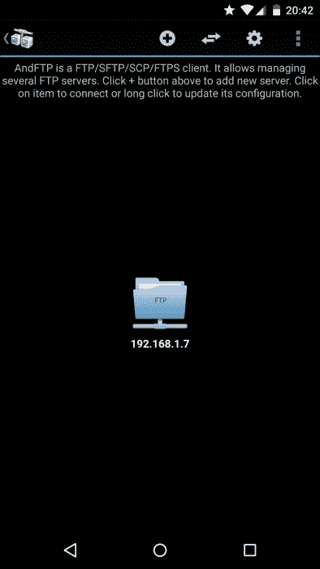
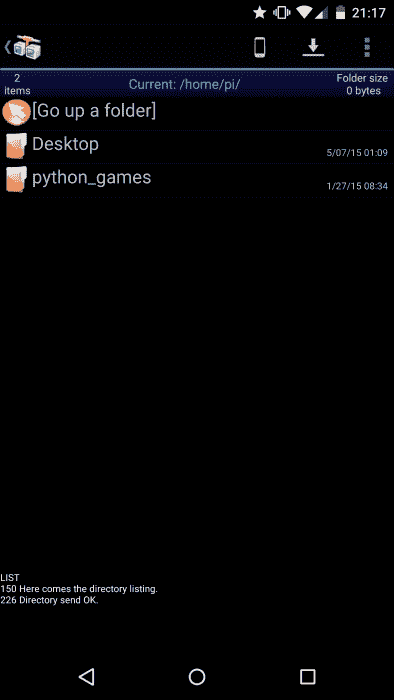
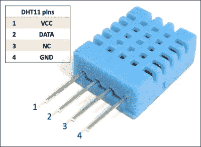
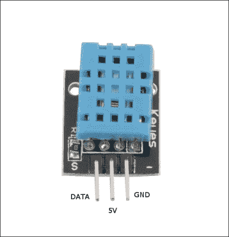
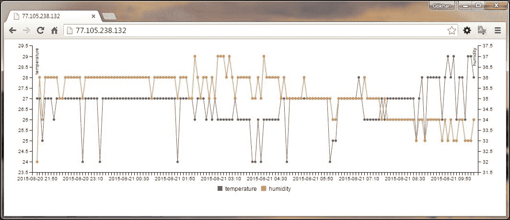

# 第二章：使用 Pi 进行服务器管理

在这个项目的前半部分，我们将从基于桌面的控制台转移到一个基于文本的控制台，这样用户就可以获得更多的权力，并且可以执行比桌面更高级的任务。我们将从 Android 设备访问 Pi 的 Linux 控制台并远程控制它。在后半部分，我们将通过 FTP 在 Pi 和 Android 之间发送和接收文件。我们甚至将通过使用基于文本的控制台远程管理我们新安装的 FTP 服务器来结合这两部分。在本章中，我们甚至将在 Pi 上安装数据库和 Web 服务器，以展示如何以后管理它们。为了使它更有趣，我们将实现一个简单但有用的迷你项目，利用 Web 和数据库服务器。以下主题将被涵盖：

+   从 Android 远程控制台到 Pi

+   在 Pi 和 Android 之间交换文件

+   一个简单的数据库和 Web 服务器实现

+   服务器的简单管理

# 从 Android 远程控制台到 Pi

Linux 和 Unix 计算机的管理员多年来一直在使用称为**shell**的基于文本的命令行界面来管理和管理他们的服务器。由于 Pi 的操作系统 Raspbian 是 Linux 变种，因此访问并发出命令或检查 Pi 上运行的程序、服务和不同服务器的状态的最自然方式是再次通过在基于文本的 shell 上发出命令。有不同的 shell 实现，但在 Raspbian 上默认使用的是**bash**。在 Linux 服务器上远程访问 shell 的最著名方式是通过一般称为**SSH**的**安全外壳**协议。

### 注意

**安全外壳**（**SSH**）是一种加密的网络协议，用于以安全的方式向远程计算机发送外壳命令。SSH 为您做了两件事。它通过不同的工具，比如我们马上会向您介绍的工具，使您能够通过安全通道在不安全的网络上向远程计算机发送命令。

为了使 SSH 工作，应该已经有一个可以接受并响应 SSH 客户端请求的 SSH 服务器正在运行。在树莓派上，默认情况下启用了此功能。如果以任何方式禁用了它，您可以使用 Pi 配置程序通过发出以下命令来启用它：

```kt
sudo raspi-config

```

然后，导航到**ssh**并按*Enter*，然后选择**启用或禁用 ssh 服务器**。

在客户端，由于我们在本书中一直在使用 Android 作为我们的客户端，我们将下载一个名为 ConnectBot 的应用程序。这是 Android 上最受欢迎的 SSH 客户端之一，截至今天的最新版本是 1.8.4。将其下载到您的设备并打开它。

您需要提供我们在上一章中找到的用户名和 IP 地址。在这种情况下，我们不需要提供端口，因为 ConnectBot 将使用 SSH 的默认端口。如果由于主机的真实性问题而要求继续连接，请单击**是**。您会被问到这个问题，因为您是通过远程 SSH 首次连接到 Pi。

请注意，在以下屏幕截图中，我提供了我家庭网络的内部 IP 地址。您可能希望使用外部 IP 地址并从家庭网络外部连接到 Pi。为此，您还需要将标准 FTP 端口`21`和`20`添加到端口转发设置中。SSH 协议也适用，其默认端口号为`22`。

### 注意

正如我们之前讨论过的，以这种方式打开端口存在安全风险，同时保留 Pi 用户`pi`的默认密码也存在安全风险。

以下屏幕截图显示了 ConnectBot 上的连接详细信息：


ConnectBot 上的连接详细信息

现在，提供`pi`账户的默认密码，即`raspberry`，或者您已经更改的密码。完成此步骤后，您将可以使用 SSH 远程连接到 Pi，如下截图所示：



ConnectBot 提供的提示

您现在可以准备在 Pi 上发出命令并检查不同服务的状态。此连接将保存其所有属性。下次您想要登录时，将无需提供地址、用户名和密码信息。

### 注意

在 Mac 或 Linux 上，您可以使用系统默认安装的`ssh`命令。在 Windows 上，您可以下载 PuTTY 来发出与 ConnectBot 中相同的命令。

# 在 Pi 和 Android 之间交换文件

在本章的第二部分中，我们将使用 Pi 作为 FTP 服务器，在我们的 Android 设备之间共享文件，或者将文件发送到 Pi 上，以便在连接到 Pi HDMI 端口的大屏幕上查看。我们将使用的 FTP 服务器是`vsftpd`。它是许多小型项目中使用的轻量级 FTP 服务器。要在我们的 Pi 上安装它，我们使用以下命令：

```kt
sudo apt-get install vsftpd

```

上述命令甚至会启动 FTP 服务。

但是，我们应该在 FTP 服务器的配置中进行一些更改，以有效地使用它。为此，我们需要使用以下命令编辑 FTP 服务器配置文件：

```kt
sudo nano /etc/vsftpd.conf

```

找到包含`#local_enable=YES`和`#write_enable=YES`的两行，并在保存并退出之前删除这些行开头的`#`注释符号。这些更改将使用户`pi`能够登录并能够将文件发送到 Pi。要重新启动 FTP 服务器，请发出此命令：

```kt
sudo service vsftpd restart

```

现在，我们需要在 Android 上安装一个 FTP 客户端。为此，我们将使用**AndFTP**。对于我们的项目来说，使用免费版本就足够了。在打开后，我们在 Android 设备上看到以下初始视图：



AndFTP 客户端的初始视图

按下加号按钮将带您到以下视图，您将被要求提供连接属性：


AndFTP 上的连接属性

提供您在第一章中找到的 Pi 的 IP 地址，用户名为`pi`，密码为`raspberry`或您已更改的密码。然后，向下滚动到视图的末尾，然后按下**保存**按钮。这将保存连接属性并将您带回到主视图：



AndFTP 中的连接列表

单击新创建的连接，显示为蓝色文件夹，将启动到 Pi 的 FTP 连接并登录用户`pi`。这将使您进入`pi`用户的`home`目录，如下截图所示：



用户 pi 的主目录

现在，您将能够通过在 AndFTP 中按下类似手机的图标并选择要上传的文件来从您的 Android 设备上传文件到 Pi。您可以使用同一网络上的另一台 Android 设备或甚至使用内置的 FTP 客户端在另一台计算机上设置 AndFTP，并下载新上传的文件以查看它；这样，您已经使用树莓派作为 FTP 服务器在不同的 Android 客户端之间共享了第一个文件。

# 一个简单的数据库和 Web 服务器实现

接下来，我们将进一步进行我们的项目，并安装数据库和 Web 服务器，稍后我们可以使用 ConnectBot 进行管理。我们甚至会更有趣，通过实施一个真实的项目来使用这些服务器。这个目的的最佳候选者是传感器测量场景。我们将把一个温度/湿度传感器连接到我们的树莓派，并将测量值保存到我们将在树莓派上安装的数据库中，一个 Web 服务器将使客户端可以访问。我们以后可以远程管理这些服务器，这是本章的主要目标。

## 连接传感器

为了这个项目的目的，我们将使用一个传感器**DHT11**，它可以测量温度和湿度，但为了更容易连接，我们将使用一个现成的模块称为**Keyes DHT11**或简称 DHT11，其中包含了这些传感器。

### 提示

甚至还有一个改进版的 DHT11，叫做 DHT22。它的成本略高，但传感器更精确。

使用这个传感器模块而不是传感器本身将使我们能够只使用三根跳线将传感器连接到树莓派，而无需面包板或电阻。使用这个模块而不是传感器的另一个优点是：传感器提供的是树莓派无法处理的模拟数据。树莓派能够处理其 GPIO 端口上的数字信息。DHT11 模块为我们进行了转换。以下图片说明了 DHT11 传感器模块以及与之相关的引脚的描述：



DHT11 传感器模块

以下图片说明了 Keyes DHT11 传感器模块：



Keyes DHT11 传感器模块

现在，将传感器模块的**GND**输出连接到树莓派的 GPIO 接地，**5V**输出连接到树莓派的 5V 引脚，**DATA**连接到树莓派的**GPIO-4**引脚。以下图示了树莓派 GPIO 引脚的布局及其名称：


树莓派 GPIO 引脚布局

下一步是读取这些传感器提供的值。为此，我们将使用**Adafruit**的一个广泛使用的库，这个库是专门为 Python 编程语言开发的这类传感器而设计的。在我们使用它之前，我们需要将一些软件组件安装到我们的树莓派上。

首先，我们需要使用以下命令更新我们的树莓派并安装一些依赖项：

```kt
sudo apt-get update
sudo apt-get install build-essential python-dev

```

传感器库本身在 GitHub 上，我们将使用以下命令从 GitHub 上下载到我们的树莓派上：

```kt
git clone https://github.com/adafruit/Adafruit_Python_DHT.git

```

这个命令会下载库并将其保存在一个子目录中。现在，使用以下命令进入这个子目录：

```kt
cd Adafruit_Python_DHT

```

接下来，您需要使用以下命令实际安装传感器库：

```kt
sudo python setup.py install

```

在这里，我们使用了标准的 Python 第三方模块安装功能，它会将 Adafruit 库全局安装到您的系统的标准 Python 库安装位置`/usr/local/lib/python2.7/dist-packages/`。这就是为什么我们需要超级用户权限，我们可以使用`sudo`命令来获得。

现在我们准备开始使用我们下载的示例代码从传感器中读取测量值。假设您仍然在`Adafruit_Python_DHT`目录中，以下命令可以完成任务：

```kt
sudo ./examples/AdafruitDHT.py 11 4

```

在这个命令中，`11`是用来识别 DHT11 传感器的描述符，`4`表示 GPIO 引脚 4。您现在应该得到一个看起来像这样的输出：

```kt
Temp=25.0*C  Humidity=36.0%

```

## 安装数据库

在验证传感器和连接到树莓派的连接工作正常后，我们将把测量值保存到数据库中。我们将使用的数据库是 MySQL。使用以下命令将 MySQL 安装到树莓派上：

```kt
sudo apt-get install mysql-server python-mysqldb

```

在安装过程中，您将被要求为管理员帐户 root 设置密码。我将 admin 设置为密码，并在即将到来的代码中引用它。以下命令将带您进入 MySQL shell，在那里您可以发出 SQL 命令，例如将数据插入数据库或查询已在数据库中的数据。当要求时，您应提供您设置的密码：

```kt
mysql -u root -p

```

您可以随时使用`exit`命令退出 MySQL shell。

在 MySQL shell 中的下一步是创建一个数据库，并将其用于随后的任何 SQL 语句：

```kt
mysql> CREATE DATABASE measurements;
mysql> USE measurements;

```

以下 SQL 语句将在这个新创建的数据库中创建一个表，我们将用它来保存传感器测量值：

```kt
mysql> CREATE TABLE measurements (ttime DATETIME, temperature NUMERIC(4,1), humidity NUMERIC(4,1));

```

下一步是实现一个 Python 脚本，该脚本从我们的传感器中读取并将其保存到数据库中。使用先前讨论的`nano`命令将以下代码放入名为`sense.py`的文件中，该文件位于`home`目录下。您可以使用没有参数的`cd`命令从`pi`目录结构中的任何位置返回到`home`目录。请注意一个重要的事实，即文件不应包含任何空的前导行，这意味着引用 Python 命令的行应该是文件中的第一行。以下代码构成了我们的`sense.py`文件的内容：

```kt
#!/usr/bin/python

import sys
import Adafruit_DHT
import MySQLdb

humidity, temperature = Adafruit_DHT.read_retry(Adafruit_DHT.DHT11, 4)
#temperature = temperature * 1.8 + 32 # fahrenheit
print str(temperature) + " " + str(humidity)
if humidity is not None and temperature is not None:
    db = MySQLdb.connect("localhost", "root", "admin", "measurements")
    curs = db.cursor()
    try:
        sqlline = "insert into measurements values(NOW(), {0:0.1f}, {1:0.1f});".format(temperature, humidity)
        curs.execute(sqlline)
        curs.execute ("DELETE FROM measurements WHERE ttime < NOW() - INTERVAL 180 DAY;")
        db.commit()
        print "Data committed"
    except MySQLdb.Error as e:
        print "Error: the database is being rolled back" + str(e)
        db.rollback()
else:
    print "Failed to get reading. Try again!"
```

### 注意

您应该将`MySQLdb.connect`方法调用中的密码参数更改为您在 MySQL 服务器上为 root 用户分配的密码。出于安全原因，您甚至应考虑创建一个仅访问`measurements`表的新用户，因为 root 用户对数据库具有完全访问权限。有关此目的，请参阅 MySQL 文档。

下一步是更改文件属性，并使用以下命令将其设置为可执行文件：

```kt
chmod +x sense.py

```

请注意，此脚本仅保存单个测量值。我们需要安排运行此脚本。为此，我们将使用一个名为**cron**的内置 Linux 实用程序，它允许 cron 守护程序在后台定期运行任务。**crontab**，也称为 CRON TABle，是一个包含要在指定时间运行的 cron 条目的时间表文件。通过运行以下命令，我们可以编辑此表：

```kt
crontab –e

```

将以下行添加到此文件中并保存。这将使 cron 守护程序每五分钟运行一次我们的脚本：

```kt
*/5 * * * * sudo /home/pi/sense.py
```

## 安装 Web 服务器

现在，我们将测量结果保存到数据库中。下一步是使用 Web 服务器在 Web 浏览器中查看它们。为此，我们将使用**Apache**作为 Web 服务器，**PHP**作为编程语言。要安装 Apache 和我们的目的所需的软件包，请运行以下命令：

```kt
sudo apt-get install apache2
sudo apt-get install php5 libapache2-mod-php5
sudo apt-get install libapache2-mod-auth-mysql php5-mysql

```

然后，将目录更改为 Web 服务器的默认目录：

```kt
cd /var/www

```

在这里，我们将创建一个文件，用户可以通过我们安装的 Web 服务器访问该文件。该文件由 Web 服务器执行，并将执行结果发送给连接的客户端。我们将其命名为`index.php`：

```kt
sudo nano index.php

```

内容应如下所示。在这里，您应该再次更改 MySQL 用户 root 的密码，以与对`new mysqli`构造方法的调用中选择的密码相匹配：

```kt
<?php

// Create connection
$conn = new mysqli("localhost", "root", "admin", "measurements");
// Check connection
if ($conn->connect_error) {
    die("Connection failed: " . $conn->connect_error);
}

$sql = "SELECT ttime, temperature, humidity FROM measurements WHERE ttime > NOW() - INTERVAL 3 DAY;";
$result = $conn->query($sql);
?>
<html>
<head>
<!-- Load c3.css -->
<link href="https://rawgit.com/masayuki0812/c3/master/c3.min.css" rel="stylesheet" type="text/css">

<!-- Load d3.js and c3.js -->
<script src="img/d3.min.js" charset="utf-8"></script>
<script src="img/c3.min.js"></scrip>
</head>
<body>
<div id="chart"></div>

<script>

<?php

if($result->num_rows > 0) {
?>
var json = [
<?php
  while($row = $result->fetch_assoc()) {
    ?>{ttime:'<?=$row["ttime"]?>',temperature:<?=$row["temperature"]?> ,humidity:<?=$row["humidity"]?>},<?
  }
}
?>
];
<?php
$conn->close();
?>
var chart = c3.generate({
    bindto: '#chart',
    data: {
      x: 'ttime',
      xFormat: '%Y-%m-%d %H:%M:%S', 
      keys: {
        x:'ttime',
        value: ['temperature', 'humidity']
      },
      json: json,
      axes: {
        temperature: 'y',
        humidity: 'y2'
      }
    },
    axis: {
        x: {
            type: 'timeseries',
            tick: {
                format: '%Y-%m-%d %H:%M'
            }
        },
        y: {
            label: 'temperature'
        },
        y2: {
            show: true,
            label: 'humidity'
        }
    }
});
</script>
</body>
</html>
```

我们希望此页面成为 Web 浏览器直接访问服务器时的默认起始页面。您可以按以下方式备份 Apache 的旧默认起始页面：

```kt
sudo mv index.html oldindex.html

```

在浏览器中导航到 Pi 的 IP 地址将在几个小时的传感器测量后产生类似以下截图的视图。在这里，我可以使用家庭网络外部的外部 IP 地址访问 Pi，因为我已将家庭路由器的端口转发设置添加到了`80`的 HTTP 端口。



现在，我们有一个正在运行的 FTP、数据库和 Web 服务器。让我们使用 ConnectBot 进行管理。

# 服务器的简单管理

以下命令仅检查 FTP 服务器的状态：

```kt
service vsftpd status

```

如果 FTP 服务器出现问题，可以使用此命令重新启动：

```kt
sudo service vstfpd restart

```

我们使用的`service`实用程序允许您使用以下两个命令重新启动数据库和 Web 服务器：

```kt
sudo service mysql restart
sudo service apache2 restart

```

使用以下命令检查 MySQL 服务器的状态：

```kt
mysqladmin -u root -p status

```

如果您认为数据库的大小已经增长太大，可以启动 MySQL 控制台并运行 SQL 查询以查看数据库大小：

```kt
mysql –u root –p
mysql> SELECT table_schema "DB", Round(Sum(data_length + index_length) / 1024 / 1024, 1) "Size in MB" 
FROM   information_schema.tables 
GROUP  BY table_schema;

```

甚至可以使用以下查询删除三天前的记录：

```kt
select measurements;
delete from measurements where ttime < NOW() - INTERVAL 3 DAY;

```

或者，作为替代方案，您可以使用 shell 命令检查文件系统的大小：

```kt
df -h

```

# 总结

本章向您介绍了将树莓派作为服务器的管理以及如何从 Android 向其发出命令。我们在树莓派上安装了 FTP 服务器，并在 Android 客户端之间共享文件。为了展示数据库和 Web 服务器的示例，我们实施了一个有用的项目，并学会了远程管理这些服务器。

下一章将向您介绍树莓派摄像头，并帮助您实现监控解决方案。
