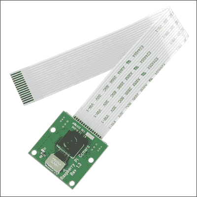
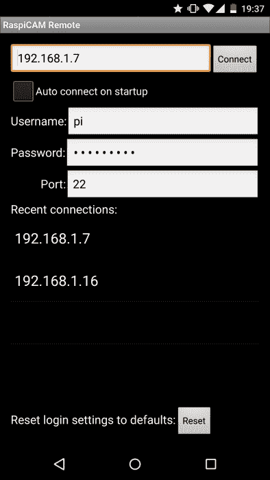
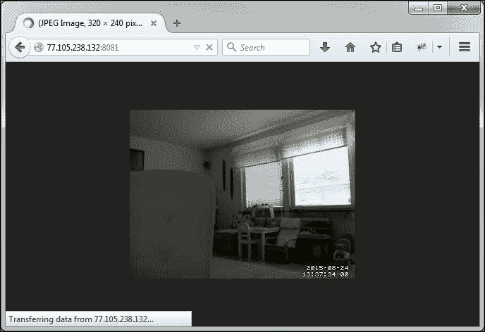
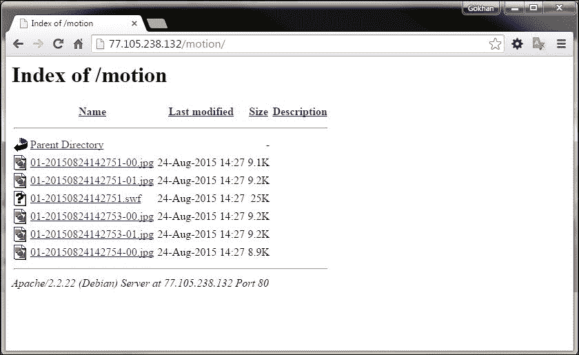

# 第三章。从树莓派实时流式传输监控摄像头

在本章中，我们将连接摄像头到树莓派，并从中实时流式传输视频。然后我们将能够从我们的 Android 设备观看这些内容的流式传输。这一章将使我们更接近使用树莓派，远离树莓派的管理。

在本章中，我们将涵盖以下主题：

+   硬件和软件配置

+   将视频流式传输到 Android 设备

+   监控模式

# 硬件和软件配置

我们将使用为树莓派开发的标准摄像头，在许多主要电子商店的价格约为 30 美元。



树莓派摄像头

树莓派有一个摄像头端口，您可以插入摄像头电缆。树莓派上的插头可以通过向上拉开来打开。如果您在连接摄像头到树莓派时遇到问题，您可以在互联网上找到许多视频来展示如何操作。您可以观看树莓派基金会的视频[`www.raspberrypi.org/help/camera-module-setup/`](https://www.raspberrypi.org/help/camera-module-setup/)。

下一步是配置树莓派并启用摄像头硬件。这是通过发出以下命令访问的树莓派配置程序完成的：

```kt
sudo raspi-config

```

在提供的菜单中，选择**启用摄像头**并点击*Enter*。然后点击**完成**，您将被提示重新启动。

# 将视频流式传输到 Android 设备

从树莓派到 Android 的最简单的流式传输方式是使用**RaspiCam Remote**应用程序，该应用程序登录到树莓派并执行必要的命令。然后自动从树莓派获取流。下载并打开应用程序，在初始视图中提供登录详细信息，如 IP 地址、用户名和密码。请注意，默认情况下，它使用默认的登录帐户详细信息和 SSH 端口。如果您使用默认安装，则只需要 IP 地址。如果您启用端口`22`的端口转发，甚至可以通过互联网访问摄像头，如第一章, *从任何地方连接到树莓派的远程桌面连接*中所述。以下屏幕截图显示了 RaspiCam Remote 应用程序的登录设置：



RaspiCam Remote 应用程序的初始视图

等待几秒钟后，您应该在 Android 设备上看到树莓派摄像头拍摄的第一张照片。点击相机图标后，摄像头将开始流式传输，如下面的屏幕截图所示：


从树莓派流式传输

下一步是使用**H.264**设置获得更好的流式传输质量。连接到 RaspiCam Remote 应用程序后，您应该打开设置并勾选**H.264**复选框。但是，在再次通过应用程序连接之前，我们需要使用以下命令在树莓派上安装 VLC 服务器。您可能会时不时地遇到`install`命令的问题，但再次运行它几乎总是可以解决问题：

```kt
sudo apt-get install vlc

```

下一步是在 Android 上安装更好的 VLC 客户端。我们将使用**VLC for Android beta**应用程序。安装后，再次打开 RaspiCam Remote 应用程序，然后通过单击相机图标开始流式传输。此时，Android 将要求您选择标准视频播放器或新安装的 VLC for Android beta。选择后者，您将体验到更好的流式传输质量。不要忘记在路由器的端口转发设置中添加端口`8080`，以便通过互联网访问流式视频。

## 手动 VLC 配置

RaspiCam 远程应用程序在流视频内容之前会自动配置 Pi 上的 VLC。你们中的一些人可能想要直接从 VLC 应用程序连接到视频流，并跳过 Android 上的 RaspiCam。以下命令与你在 Android 设备上使用 RaspiCam 开始流媒体之前提供的命令相同：

```kt
/opt/vc/bin/raspivid -o - -n -t 0 -fps 25 -rot 0 -w 640 -h 480 | /usr/bin/vlc -I dummy stream:///dev/stdin --sout '#standard{access=http,mux=ts,dst=:8080}' :demux=h264 &

```

如果你发出上述命令，你将能够从 VLC 应用程序查看流媒体内容。你可以通过点击 VLC 应用程序操作栏上的天线图标来建立连接。它将提示输入流地址，即 `http://PI_IP_ADDRESS:8080`。

# 监视模式

看到摄像头的视频流很酷，但能够在监视模式下运行它更有用。我们希望摄像头能够对运动做出反应，并在检测到运动时保存图像或视频，这样我们可以稍后查看它们，而不是一直盯着视频。为此，我们将开始在我们的 Pi 上安装一个运动识别软件，这个软件因为明显的原因被称为 `motion`：

```kt
sudo apt-get install motion

```

这将安装 `motion` 软件，以下命令将向内核添加必要的软件包：

```kt
sudo modprobe bcm2835-v4l2

```

最好将其放在 `/etc/rc.local` 文件中，以便在启动时运行。不过，你应该将它放在 `exit 0` 行之前。

我们甚至会进行一些配置更改，以便能够访问 `motion` 提供的流媒体和控制功能。使用以下命令编辑 motion 的配置文件：

```kt
sudo nano /etc/motion/motion.conf

```

默认情况下，对 motion 的 Web 访问受到限制，只能从本地主机访问，这意味着你不能从 Pi 以外的其他计算机访问它。我们将通过找到 `motion.conf` 文件中的以下行来更改这种行为：

```kt
webcam_localhost on
control_localhost on
```

请注意，这些不是文件中的连续行。另外，如果你使用 **nano** 作为你的编辑器，你可以按 *Ctrl*+*W* 进入搜索模式。

我们将通过分别用以下代码替换前面的代码来关闭本地主机访问行为：

```kt
webcam_localhost off
control_localhost off
```

此外，我们希望 `motion` 服务在后台模式下执行，同时作为 `daemon` 运行。为此，我们应该在同一文件中找到以下代码行：

```kt
daemon on
```

我们应该用这行替换它：

```kt
daemon off
```

如果我们现在启动 `motion`，我们将得到以下错误：

```kt
Exit motion, cannot create process id file (pid file) /var/run/motion/motion.pid: No such file or directory

```

为了摆脱这个错误，我们可以创建 `motion` 抱怨的这个文件夹：

```kt
sudo mkdir /var/run/motion

```

请注意，这个目录可能会在启动时被删除，所以最好将这个命令添加到 `/etc/rc.local` 文件中。

现在，你可以最终启动和停止你的 Pi 摄像头进入监视模式，发出以下命令，最好使用 **ConnectBot** 应用程序或我们在上一章中讨论过的任何其他 SSH 客户端。以下命令将启动 `motion`：

```kt
sudo motion

```

停止运动，发出以下命令：

```kt
sudo pkill -f motion

```

如果你总是想在启动时运行它，我不建议这样做，因为你的 Pi 可能会存储空间不足，你应该使用以下命令编辑 `/etc/default/motion` 文件：

```kt
sudo nano /etc/default/motion

```

在这个文件中，你会找到以下行：

```kt
start_motion_daemon=no
```

你应该用这个替换它：

```kt
start_motion_daemon=yes
```

你可以使用以下命令启动服务，或者重新启动你的 Pi，这将自动启动服务：

```kt
sudo service motion start

```

要检查所有服务以及 motion 服务的状态，你可以使用以下命令：

```kt
sudo service --status-all

```

Motion 软件分为两部分。第一部分是您可以观看流视频的地方，第二部分是您可以在检测到运动时查看图像/视频文件的地方。您可以通过打开`http://IP_ADRESS_OF_THE_PI:8081`网页来查看 motion 软件的流。由于某种原因，motion 软件的这一部分只能在 Firefox 中工作，但是下一节讨论的监视部分将在其他浏览器中工作。请注意，您不能同时启动 motion 服务器和 VLC 通过 RaspiCam 应用程序，因为它们使用相同的端口。以下屏幕截图显示了 motion 视频的流：



端口 8081 上的 motion 流视频

您可以使用**AndFTP**登录到 Pi，如前一章所述，并导航到`/tmp/motion`文件夹，以查看每当检测到运动时保存的图像。重新启动 motion 服务将清空文件夹的内容。

### 提示

在路由器的端口转发设置中添加端口`8080`、`8081`和 FTP 端口`21`，以便从网络外部访问这些服务。

## 在 Web 上访问监视图像

在几乎所有涉及监视的场景中，我们希望通过互联网访问保存的图像，这些图像是在检测到运动时保存的。为了做到这一点，我们将连接`motion`保存图像的目录到我们在上一章中已经安装的 Apache 服务器上。运行以下命令将实现这一点：

```kt
sudo ln -s /tmp/motion /var/www/motion

```

您还应该在`motion.conf`文件中添加`motion`保存图像和视频的目录，使用以下行：

```kt
target_dir /tmp/motion

```

现在，在浏览器中打开`http://IP_ADRESS_OF_THE_PI/motion`链接，您将看到`motion`在摄像头前检测到运动时保存的图像列表。

请注意，如果`motion`尚未检测到任何运动并创建`/tmp/motion/`目录，则您可能会从 Web 浏览器中收到访问被禁止的错误。以下屏幕截图说明了 motion 保存的图像列表：



通过 Web 访问检测到运动时的图像和视频文件

# 摘要

我们已经从对 Pi 的管理转移到更真实的项目，并在 Pi 上安装了摄像头；因此，可以在 Android 设备和 Web 上查看 Pi 的流。我们甚至学会了如何将 Pi 用作监视摄像头，并查看其检测到的运动。

在下一章中，我们将继续在更有趣的场景中使用 Pi，并将其变成一个媒体中心。
