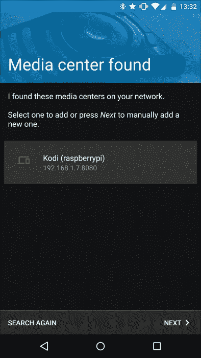
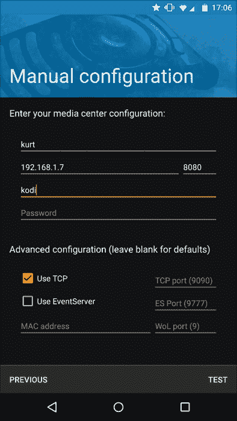
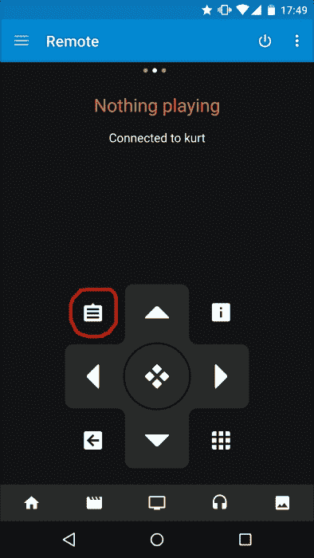
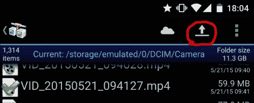
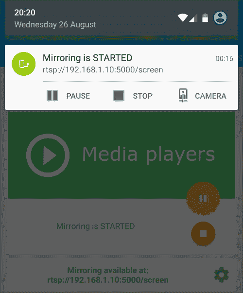

# 第四章：将您的 Pi 变成媒体中心

在前几章中，我们一直在管理我们的 Pi 并实施有用的项目。在本章中，我们将更多地将我们的 Pi 用作娱乐来源，并将其变成媒体中心。涵盖的主题如下：

+   在 Pi 上安装和设置媒体中心

+   通过 Android 远程控制连接到媒体中心

+   从您的媒体中心获取更多

+   使用 NOOBS 安装媒体中心

# 在 Pi 上安装和设置媒体中心

我们选择用于此项目的媒体中心软件是**Kodi**，以前被称为 XBMC。它是开源的，被广泛使用，并有很多附加组件。

像往常一样，我们将使用`apt-get`命令在我们的 Pi 上安装必要的软件：

```kt
sudo apt-get install kodi

```

然后，我们将运行`kodi-standalone`可执行文件，这将启动 Kodi 并在 Pi 的 HDMI 端口上显示其用户界面。因此，重要的是您连接 Pi 到屏幕上使用 HDMI 端口，而不是远程桌面来查看 Kodi 的用户界面。现在，您可以连接 USB 键盘或鼠标来在 Kodi 内进行导航。

## 启动时启动 Kodi

我们绝对不希望运行一个命令来启动媒体中心，无论从 Android 运行命令有多容易，正如前几章中所讨论的。因此，我们需要使用`crontab -e`命令在启动时启动命令。在`crontab`命令打开的文件的末尾添加以下行：

```kt
@reboot /usr/bin/kodi-standalone &
```

现在，每当您重新启动 Pi 时，Kodi 都将自动重新启动。请注意，在这里，您通过 Pi 的 HDMI 端口访问媒体中心，但您也可以使用第一章中讨论的工具通过远程桌面访问。

# 通过 Android 远程控制连接到媒体中心

当前设置的主要问题是您只能使用连接的键盘或鼠标来控制媒体中心，这使得它不像媒体中心应该那样舒适。但是，有一个名为**Kore**的 Android 上的 Kodi 远程控制，使得远程控制媒体中心变得非常容易。您可以从 Google Play 下载它。它的官方名称是**Kore, Kodi 的官方遥控器**，由**XBMC Foundation**发布，这是一个运营 Kodi 媒体中心项目的非营利组织。

在您可以将 Android 上的远程控制应用连接到 Pi 上的 Kodi 之前，您需要在 Kodi 上进行一些设置更改。转到 Kodi 中的**SYSTEM**菜单，然后**Settings**，**Services**和**Webserver**。在这里，您应该选择**允许通过 HTTP 控制 Kodi**。然后转到同一菜单中的**Remote control**设置，并启用**允许此系统上的程序控制 XBMC**和**允许其他系统上的程序控制 XBMC**设置。现在在 Android 上打开 Kore 并让它搜索媒体中心。如果手机和媒体中心在同一网络上，Kore 应该能够找到它。搜索成功后，您将看到类似以下截图的视图：

### 提示

请注意，Kodi 的默认 HTTP 端口与上一章中看到的 motion 服务器的默认 HTTP 端口冲突。您应该在 Kodi 中更改端口设置，或者在更改 Kodi 设置之前停止 motion 服务器。



Kore 已找到媒体中心

现在，单击新发现的媒体中心以连接并开始远程控制。如果它无法自动识别媒体中心，您可以按**Next**按钮并手动输入参数。端口`8080`是默认端口，如果您没有在 Kodi 内更改这些参数，则应使用默认用户名`kodi`。



Kore 中的手动设置

# 充分利用你的媒体中心

媒体中心可以用于许多事情。例如，你可以下载插件，让你访问大量的在线内容，如 YouTube、可汗学院和 TED 演讲。

## 在 Android 设备上使用 Kodi 观看视频

另一件有趣的事情是，你可以使用之前讨论过的 AndFTP 应用从第二章*树莓派服务器管理*将手机上的视频上传到树莓派，然后使用媒体中心观看电影。你需要在树莓派上添加一个目录，将这些文件上传为 Kodi 中的媒体位置。转到**视频** | **文件** | **文件**，然后导航到**添加视频...**。在这里，你应该首先选择**浏览**，然后**根文件系统**。请注意，我们在第二章*树莓派服务器管理*中使用`/home/pi`作为上传目标。即使在这种情况下也应该可以工作。浏览到这个位置，然后在所有三个弹出窗口上点击**确定**。现在你应该在 Kodi 的**视频**列表中看到树莓派。你甚至可以将此文件夹添加到收藏夹以便轻松访问。打开 Kore 远程控制应用程序，并浏览到**视频**下的`pi`文件夹。当 Kodi 中的`pi`文件夹被突出显示时，在 Kore 远程控制应用程序中按下属性按钮。然后使用 Kore 上的箭头向下滚动选择**添加到收藏夹**。



Kore 中列出选择的按钮，即属性按钮

接下来，从第二章*树莓派服务器管理*中打开 AndFTP，并连接到树莓派，或者选择之前保存的连接。现在你应该看到`/home/pi`目录的内容，这是我们使用的用户`pi`的默认位置。这是目标位置。然后，在 AndFTP 的操作栏中选择手机图像，选择手机上的视频并将其上传到 Kodi。


AndFTP 界面，从手机到树莓派选择上传位置

录制的视频通常位于`DCIM/Camera`下。选择你想要上传的视频。然后，在操作栏中点击上传图标：



AndFTP 界面，从手机到树莓派开始上传

接下来，你可以在 Kodi 的**视频**部分中浏览到我们添加到`pi`目录的 Kodi，并查看你刚刚在媒体中心上传的视频。

## 将 Android 显示屏流式传输到 Kodi

另一件非常有趣的事情是，你可以流式传输你的 Android 屏幕，并让 Kodi 显示这个流。为此，我们首先需要从 Google Play 下载一个应用，该应用将流式传输 Android 显示屏，并在内部网络上使用 URL 发布它。我们将用于此目的的应用称为**屏幕流式传输镜像**，有免费和付费版本。对于这个项目来说，下载免费版本就足够了。启动应用后，你需要关闭一些广告，并在弹出窗口上按下**立即开始**按钮。


屏幕流式传输镜像

在这里，您将看到流媒体发布的地址。我们现在将在树莓派上的`pi`用户的`home`目录下保存这个`rtsp://YOUR_ANDROID_IP_ADRESS:5000/screen`链接，我们将把它保存在一个名为`stream.strm`的文件中。然后，在 Kodi 中浏览到`pi`目录，找到这个文件并打开它。请记住，我们已经将这个目录保存在 Kodi 的**视频**部分，并且也将其保存为收藏夹。现在，您应该能够看到您在 Android 设备屏幕上所做的任何事情，它连接到了 Kodi 使用的树莓派 HDMI 端口。另一个选项是通过这个通道显示 Android 相机捕获。我们使用的屏幕流镜像应用程序在 Android 通知区域有一个通知。如果您展开它，您将看到一个名为**相机**的选项。通过按下这个按钮，您将能够启动相机并查看相机捕获。



带有相机选项的屏幕流镜像通知

# 使用 NOOBS 安装媒体中心

在树莓派上安装媒体中心的另一个选项是使用 NOOBS。这样，用户可以非常容易地安装媒体中心，而不必担心与 Raspbian OS 相关的细节，就像我们在本章中所做的那样。我们已经在第一章中介绍了 NOOBS 的安装，*从任何地方远程连接到您的 Pi*。然而，在第一章中，*从任何地方远程连接到您的 Pi*，我们使用了离线安装选项。我们可以使用在线安装选项。您应该从[`downloads.raspberrypi.org/NOOBS_lite_latest`](http://downloads.raspberrypi.org/NOOBS_lite_latest)下载在线 NOOBS 安装程序。这个 ZIP 文件要小得多，但在开始安装之前，您需要将树莓派连接到以太网网络。将文件的内容解压到 SD 卡上，并在插入这张 SD 卡后重新启动您的树莓派。现在，您将看到一个要安装的操作系统列表。列表中还包含两个媒体中心。这些是**OpenELEC**和**OSMC**。它们都基于 Kodi，我们在本章中已经介绍过。

# 摘要

这一章很短，但很有趣。我们已经学会在树莓派上安装并设置了一个最广泛使用的媒体中心，并可以远程从我们的 Android 设备控制它。

在下一章中，我们将动手开始一些 Python 和 Android 编程，并利用更多的连接可能性来连接树莓派和 Android。
