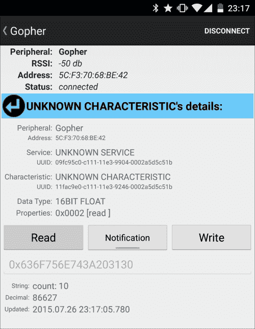
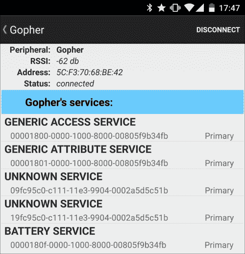
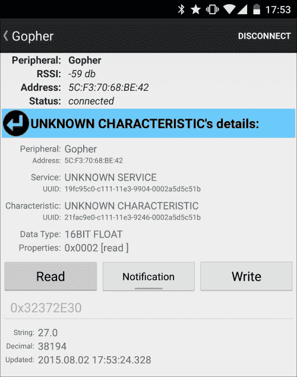
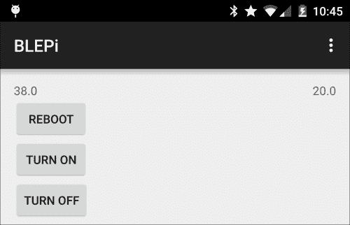

# 第五章：使用树莓派的未接来电

在本章中，我们将实施一个更加面向编程的项目，并深入研究蓝牙智能或蓝牙低功耗（BLE）编程。我们将通过蓝牙使树莓派和 Android 手机进行通信，并使用这个通道控制树莓派。本章将涵盖以下主题：

+   安装必要的组件

+   向蓝牙低功耗添加传感器服务

+   从 Android 应用程序连接

+   从您的 Android 手机发送重启命令到树莓派

+   从您的 Android 手机发送更多命令到树莓派

# 安装必要的组件

这个项目所需的硬件组件是一个支持 BLE 的蓝牙 USB 适配器。重要的是这个硬件支持 BLE，因为我们将专门利用蓝牙堆栈的这一部分。我们将使用由**Plugable**提供的一个，它在亚马逊上有售。


由 Plugable 提供的蓝牙适配器

我们已经下载的 Raspbian 发行版已经包含了对蓝牙的支持，但我们需要更新蓝牙软件包以获得更好的低功耗支持。您可以使用以下命令构建和安装更现代的蓝牙软件包版本：

```kt
sudo apt-get install libdbus-1-dev libdbus-glib-1-dev libglib2.0-dev libical-dev libreadline-dev libudev-dev libusb-dev make
mkdir -p work/bluepy
cd work/bluepy
wget https://www.kernel.org/pub/linux/bluetooth/bluez-5.33.tar.xz
tar xvf bluez-5.33.tar.xz
cd bluez-5.33
./configure --disable-systemd
make
sudo make install

```

`make`步骤将编译树莓派所需的必要软件包，并需要大约 15 分钟才能完成。但是，您需要耐心等待，因为最终会得到一些很酷和有用的东西。请注意，撰写本书时 BlueZ 的最新版本是 5.33，您可以通过检查[`www.kernel.org/pub/linux/bluetooth/`](https://www.kernel.org/pub/linux/bluetooth/)上所有可用版本的列表来替换为最新版本。请注意，我们已使用`--disable-systemd`选项禁用了`systemd`支持，否则会导致构建错误。

前面的命令还安装了一些命令行工具，让我们能够配置和扫描蓝牙设备。以下命令列出了树莓派的 USB 端口上连接的所有组件：

```kt
lsusb

```

前面命令的输出如下：

```kt
Bus 001 Device 002: ID 0424:9514 Standard Microsystems Corp.
Bus 001 Device 001: ID 1d6b:0002 Linux Foundation 2.0 root hub
Bus 001 Device 003: ID 0424:ec00 Standard Microsystems Corp.
Bus 001 Device 004: ID 0a5c:21e8 Broadcom Corp.
Bus 001 Device 005: ID 148f:5370 Ralink Technology, Corp. RT5370 Wireless Adapter

```

在我的情况下，蓝牙适配器的名称是`Broadcom`。要获取有关特定设备的更多详细信息，请使用以下命令：

```kt
sudo lsusb -v -d 0a5c:

```

在这里，请注意`0a5c`是我正在重用的蓝牙适配器地址的第一部分，仅获取有关此设备的更多信息。

`hciconfig`工具将向您显示哪些设备支持蓝牙。这个命令在我的系统上输出了以下信息：

```kt
hci0:   Type: BR/EDR  Bus: USB
 BD Address: 5C:F3:70:68:BE:42  ACL MTU: 1021:8  SCO MTU: 64:1
 DOWN
 RX bytes:564 acl:0 sco:0 events:29 errors:0
 TX bytes:358 acl:0 sco:0 commands:29 errors:0

```

在这里看到，设备标记为`DOWN`。我们将保持这种状态，因为我们安装的下一个工具需要它最初处于关闭状态。

### 注意

有一些有用的蓝牙低功耗命令，您可以使用它们来检查其他 BLE 设备。我们暂时不会使用这些命令，但是熟悉它们并检查您的 BLE 设备是否工作或可访问是一个好习惯。

我们之前使用过的`hciconfig`工具可以帮助我们启动蓝牙设备。但是，如果您想继续本章的其余部分，不要这样做，因为下一个工具需要它处于关闭状态：

```kt
sudo hciconfig hci0 up

```

将此命令放入 crontab 中是个好主意，如前所述，使用 crontab 和“-e”选项，以便您可以使用 nano 作为编辑器，并自动安装新的 crontab。在文件末尾添加`@reboot sudo hciconfig hci0 up`，然后保存并退出。

还有两个其他命令可以使用：

```kt
sudo hcitool lescan

```

这个命令列出了 BLE 设备。现在让我们看看以下命令：

```kt
sudo hcitool lecc 68:64:4B:0B:24:A7

```

这个命令测试与设备的蓝牙连接。请注意，后一个命令提供的地址是由前一个命令返回的。

我们甚至需要一个蓝牙的编程支持。我们将使用**Go**作为语言，**Gatt**包用于 Go 语言，为 Go 语言提供了对蓝牙低功耗的支持。**通用属性配置文件**（**Gatt**）是一个通用规范，用于在 BLE 链路上发送和接收小量数据，称为属性。让我们运行以下命令来安装`go`语言：

```kt
cd
git clone https://go.googlesource.com/go
cd go
git checkout go1.4.1
cd src
./all.bash

```

在这里你可能想去拿杯咖啡，因为最后一个命令将花费大约 40 分钟的时间。在输出的末尾，你将看到`go`安装程序要求你将一个二进制目录添加到你的路径中，以便轻松访问。以下命令可以实现这一点：

```kt
PATH=$PATH:/home/pi/go/bin
export PATH
export GOROOT=/home/pi/go
export GOPATH=/home/pi/gopath

```

### 提示

将这些命令放在`/etc/profile`文件中是个好主意，这样你就可以在将来每次启动会话时执行它们。但是一定要将它们添加到文件的末尾。此外，即使你已经将它们放在`profile`文件中，也不要忘记实际执行它们，如果你想在不重新启动的情况下继续。

然后，使用以下命令下载 Gatt 包源文件：

```kt
go get github.com/paypal/gatt

```

现在我们将使用以下命令启动一个简单的 BLE 服务器：

```kt
cd /home/pi/gopath/src/github.com/paypal/gatt
go build examples/server.go
sudo ./server

```

### 提示

完成本章后，你可能想使用以下命令将服务器启动命令放在`crontab`中：

```kt
crontab -e

```

这样，每次重新启动 Pi 时，BLE 服务器都会启动。在末尾添加以下行：

```kt
@reboot sudo /home/pi/gopath/src/github.com/paypal/gatt/server

```

现在是时候找到我们的树莓派了，它在安卓上表现得像一个 BLE 设备。我们将使用**BluePixel Technologies**的**BLE Scanner**应用程序，它可以在 Play 商店上找到。当你启动它时，你将看到周围可用的 BLE 设备列表以及它们的地址。可以使用`hciconfig`命令查看 Pi 上蓝牙适配器的地址。Gatt 服务器的默认实现将设备命名为**Gopher**。以下截图说明了 BLE Scanner 应用程序，显示 Pi 作为 BLE 设备：

安装必要的组件

BLE Scanner 应用程序显示 Pi 作为 BLE 设备

BLE 堆栈设计成设备支持一些用户可以连接的服务，并且每个服务可以提供读/写或通知特性，这主要是你可以写入、读取或从中获取通知的数据。在应用程序中点击设备，你将连接到 Pi 新启动的 BLE 服务器。你将看到四个服务。我们感兴趣的是称为**UNKNOWN SERVICE**的服务，它没有名称，因为它不是标准服务，它只是用来演示 Gatt 示例服务器。点击这个服务，你将看到这个服务提供的三个特性：**READ**，**WRITE**和**Notification**。你可以通过查看 BLE Scanner 应用程序上哪个按钮被启用来识别特性的类型。以下截图说明了 READ 特性：



READ 特性

# 向蓝牙低功耗添加传感器服务

我们将向 Gatt 的已有示例添加一个新服务。这个新服务将首先发布两个新特性：一个用于湿度，另一个用于温度测量。我们将使用我们在第二章中讨论过的技术以相同的方式读取测量值，*使用 Pi 进行服务器管理*。要读取这些测量值，我们将创建两个内容类似于我们在第二章中讨论的`sense.py`文件的新文件。让我们在`home`目录下创建两个文件，分别命名为`humidity.py`和`temperature.py`。`temperature.py`文件的内容如下：

```kt
#!/usr/bin/python

import sys
import Adafruit_DHT

humidity, temperature = Adafruit_DHT.read_retry(Adafruit_DHT.DHT11, 4)
print str(temperature)
```

`humidity.py`文件的内容类似。唯一的区别是它打印出测量的湿度部分而不是温度：

```kt
#!/usr/bin/python

import sys
import Adafruit_DHT

humidity, temperature = Adafruit_DHT.read_retry(Adafruit_DHT.DHT11, 4)
print str(humidity)
```

我们还需要使用以下命令将文件访问模式更改为可执行：

```kt
chmod +x temperature.py humidity.py

```

现在，您可以使用以下命令测试传感器测量：

```kt
sudo ./temperature.py
sudo ./humidity.py

```

下一步是通过蓝牙通道发布这些读数。我们将在现有的 Gatt 服务器示例中创建一个新服务。为此，您可以开始编辑`/home/pi/gopath/src/github.com/paypal/gatt/examples`路径中服务器示例的`server.go`源文件。您只需要在`onStateChanged`函数定义中添加三行代码，放在其他服务定义之间。在以下内容中，请注意计数服务和电池服务已经存在。我们只需要添加传感器服务：

```kt
// A simple count service for demo.
s1 := service.NewCountService()
d.AddService(s1)

// A sensor service for demo.
sSensor := service.NewSensorService()
d.AddService(sSensor)

// A fake battery service for demo.
s2 := service.NewBatteryService()
d.AddService(s2)
```

此外，在同一文件中，更改广告新服务的行为以下代码，以便也广告新服务：

```kt
// Advertise device name and service's UUIDs.
d.AdvertiseNameAndServices("Gopher", []gatt.UUID{s1.UUID(), sSensor.UUID(), s2.UUID()})
```

我们还需要添加新服务的定义。以下代码应放在名为`sensor.go`的文件中，放在 Gatt 示例的`service`目录下，与其他服务定义文件（如`count.go`和`battery.go`）处于同一级别：

```kt
package service

import (
 "fmt"
 "log"
 "os/exec"
 "strings"

 "github.com/paypal/gatt"
)

func NewSensorService() *gatt.Service {
 s := gatt.NewService(gatt.MustParseUUID("19fc95c0-c111-11e3-9904- 0002a5d5c51b"))
 s.AddCharacteristic(gatt.MustParseUUID("21fac9e0-c111-11e3-9246- 0002a5d5c51b")).HandleReadFunc(
  func(rsp gatt.ResponseWriter, req *gatt.ReadRequest) {
   out, err := exec.Command("sh", "-c", "sudo /home/pi/temperature.py").Output()
    if err != nil {
     fmt.Fprintf(rsp, "error occured %s", err)
     log.Println("Wrote: error %s", err)
    } else {
     stringout := string(out)
     stringout = strings.TrimSpace(stringout)
     fmt.Fprintf(rsp, stringout)
     log.Println("Wrote:", stringout)
    }
 })

 s.AddCharacteristic(gatt.MustParseUUID("31fac9e0-c111-11e3-9246- 0002a5d5c51b")).HandleReadFunc(
  func(rsp gatt.ResponseWriter, req *gatt.ReadRequest) {
   out, err := exec.Command("sh", "-c", "sudo /home/pi/humidity.py").Output()
    if err != nil {
     fmt.Fprintf(rsp, "error occured %s", err)
     log.Println("Wrote: error %s", err)
    } else {
     stringout := string(out)
     stringout = strings.TrimSpace(stringout)
     fmt.Fprintf(rsp, stringout)
     log.Println("Wrote:", stringout)
   }
 })

 return s
}
```

我们需要使用`go`构建和重新运行我们的服务器代码。我们之前使用的以下命令将帮助我们做到这一点。请注意，您应该在`/home/pi/gopath/src/github.com/paypal/gatt`目录中：

```kt
go build examples/server.go
sudo ./server

```

我们可以再次在 Android 上使用 BLE Scanner 应用程序连接到这项新服务并读取温度和湿度传感器数值。以下截图说明了 Gopher 服务：



连接到 Gopher 设备后，您应该看到具有`19fc95c0-c111-11e3-9904-0002a5d5c51b` ID 的新添加服务，以及该服务的新特征，如下截图所示：


新增特征：一个用于温度，另一个用于湿度测量

按下**读取**按钮后，以下截图说明了温度测量的特征细节：



温度测量特征显示当前值为 27 度

# 从 Android 应用程序连接

我们已经使用现有的应用程序连接到了我们在树莓派上实现的 BLE 服务。这个名为 BLE Scanner 的应用程序非常通用，可以用于任何类型的 BLE 设备。但是，我们需要一个更专门的应用程序，它只读取测量值并抽象出 BLE 协议的细节，如设备扫描、服务和服务特征。在本节中，我们将实现一个 Android 应用程序来连接到树莓派的 BLE。为此，我们需要安装 Android Studio。Android Studio 是由 Google 专门为 Android 应用程序开发设计的。您可以通过访问[`developer.android.com/tools/studio/`](http://developer.android.com/tools/studio/)了解更多信息。您可以在[`developer.android.com/sdk/`](http://developer.android.com/sdk/)找到安装说明。我们将使用真实设备来测试我们的应用程序，而不是内置的模拟器。为此，您可能需要安装特定于您的 Android 手机的设备驱动程序，并对 Android Studio 安装进行配置更改。[`developer.android.com/tools/device.html`](http://developer.android.com/tools/device.html)链接将帮助您执行这些操作。

现在，启动 Android Studio 并选择创建一个新项目。我将应用程序命名为`BLEPi`，域名为`example.com`。您应该选择**手机和平板电脑**作为表单因素，至少**Android 5.0**作为最低 SDK，因为该 SDK 引入了更好的 BLE 支持到 Android 系统。核心 BLE 支持实际上是在 Android 4.3 中添加的，本书网站上分发的代码文件以及本书的 GitHub 存储库也适用于 Android 4.3 和 Android 5.0。然而，为了简单和方便起见，即将介绍的代码仅适用于 Android 5.0。请注意，在安装 Android Studio 时，您应该已经下载了 Android 5.0 SDK，以便能够在创建项目向导中选择它。请查看本节中刚提到的链接，以获取有关此问题的更多详细信息。然后，选择向应用程序添加一个空白活动，并在下一步中不更改活动的名称；我们将保持其为`MainActivity`。

我们将通过向`AndroidManifest.xml`文件中的`manifest`和`application`标签之间添加蓝牙权限来开始我们的实现：

```kt
<uses-permission 
android:name="android.permission.BLUETOOTH"/>
<uses-permission 
android:name="android.permission.BLUETOOTH_ADMIN"/>
```

然后，我们将开始对`MainActivity.java`文件进行更改。首先进行以下类变量定义：

```kt
private BluetoothAdapter bluetoothAdapter;
private BluetoothLeScanner bleScanner;
private BluetoothGatt bleGatt;
private static final int REQUEST_ENABLE_BT = 1;
private static final UUID UUID_Service = 
UUID.fromString("19fc95c0-c111-11e3-9904-0002a5d5c51b");
private static final UUID UUID_TEMPERATURE = 
UUID.fromString("21fac9e0-c111-11e3-9246-0002a5d5c51b");
private static final UUID UUID_HUMIDITY = 
UUID.fromString("31fac9e0-c111-11e3-9246-0002a5d5c51b");
```

`bluetoothAdapter`定义表示本地设备的蓝牙适配器，并允许您执行基本的蓝牙任务，比如发现其他设备和获取已发现设备的属性。`bleScanner`提供了执行与蓝牙 LE 设备特定的扫描相关操作的方法，`bleGatt`提供了蓝牙 GATT 功能，以实现与蓝牙智能设备的通信。我们在这里定义的 UUID 与我们之前在 Pi 上保存的`sensor.go`文件中使用的 UUID 相同，用于识别新服务及其两个新特征。

### 提示

在 Android Studio 中，您可以使用*Alt*+*Enter*快捷键自动导入丢失的包。光标应该位于 java 文件中缺少导入的类上。或者，将光标放在类上，将鼠标指针放在上面，您将看到一个灯泡菜单。在这个菜单中，您可以选择导入类选项。

在`onCreate`方法中，当应用程序第一次启动时，Android 系统会调用该方法，我们可以初始化`bluetoothAdapter`：

```kt
BluetoothManager bluetoothManager = 
(BluetoothManager) getSystemService(Context.BLUETOOTH_SERVICE);
bluetoothAdapter = bluetoothManager.getAdapter();
```

我们需要定义`startScan`方法，每当我们想要启动 BLE 设备扫描时就会调用该方法。

```kt
private void startScan() {
   if (bluetoothAdapter == null || !bluetoothAdapter.isEnabled())
   {
   Intent enableBtIntent = 
      new Intent(BluetoothAdapter.ACTION_REQUEST_ENABLE);
   startActivityForResult(enableBtIntent, REQUEST_ENABLE_BT);
   }  else {
   bleScanner = bluetoothAdapter.getBluetoothLeScanner();
      if (bleScanner != null) {
          final ScanFilter scanFilter = 
             new ScanFilter.Builder().build();
         ScanSettings settings = 
             new ScanSettings.Builder()
                .setScanMode(ScanSettings.SCAN_MODE_LOW_LATENCY)
                .build();
         bleScanner.startScan(
             Arrays.asList(scanFilter), settings, scanCallback);
      }
   }
}
```

在这里，我们首先检查设备上是否启用了蓝牙。如果没有，我们将显示一个消息框，让用户启用蓝牙。如果启用了，我们将获取`bleScanner`的一个实例，该实例用于使用`startScan`方法开始扫描。我们可以给一个回调实现名称，比如`scanCallback`，每当扫描返回一些结果时就会调用该方法。现在，我们需要定义这个回调变量，如下面的代码所示：

```kt
private ScanCallback scanCallback = new ScanCallback() {
   @Override
   public void onScanResult(int callbackType, ScanResult result) {
      if("Gopher".equals(result.getDevice().getName())) {
          Toast.makeText(MainActivity.this, "Gopher found", 
             Toast.LENGTH_SHORT).show();
          if(bleScanner != null) {
             bleScanner.stopScan(scanCallback);
          }
         bleGatt = 
            result.getDevice().connectGatt(
                getApplicationContext(), false, bleGattCallback);
       }
       super.onScanResult(callbackType, result);
    }
};
```

`ScanCallback`实现覆盖了一个重要的方法`onScanResult`，每当有新设备报告时就会调用该方法。然后我们检查设备名称是否与在 Pi 上的`server.go`文件中定义的名称相同。如果是，我们可以将设备属性和连接信息保存到`bleGatt`变量中。我们甚至可以使用`connectGatt`方法连接到设备，并提供另一个回调实现`bleGattCallback`，每当 Android 系统与设备建立连接时就会调用该方法。如果找到了我们要找的设备，我们就停止扫描。这是这个回调的定义：

```kt
private BluetoothGattCallback bleGattCallback = new BluetoothGattCallback() {
   @Override
   public void onConnectionStateChange(BluetoothGatt gatt, int status, int newState) {
      gatt.discoverServices();
      super.onConnectionStateChange(gatt, status, newState);
   }

   @Override
   public void onServicesDiscovered(BluetoothGatt gatt, int status) {
      BluetoothGattService service = 
         gatt.getService(UUID_Service);
      BluetoothGattCharacteristic temperatureCharacteristic = 
         service.getCharacteristic(UUID_TEMPERATURE);
      gatt.readCharacteristic(temperatureCharacteristic);
      super.onServicesDiscovered(gatt, status);
   }

   @Override
   public void onCharacteristicRead(BluetoothGatt gatt, final BluetoothGattCharacteristic characteristic, int status) {
      final String value = characteristic.getStringValue(0);
      runOnUiThread(new Runnable() {
         @Override
         public void run() {
            TextView tv;
            if(UUID_HUMIDITY.equals(characteristic.getUuid())) {
                tv = (TextView) MainActivity.this.findViewById(
                   R.id.humidity_textview);
            } else {
                tv = (TextView) MainActivity.this.findViewById(
                   R.id.temperature_textview);
              }
             tv.setText(value);
        }
      });

      BluetoothGattService service = 
         gatt.getService(UUID_Service);
      readNextCharacteristic(gatt, characteristic);
      super.onCharacteristicRead(gatt, characteristic, status);
   }
};
```

在这个回调实现中，我们重写了三个在不同时间从 Android 系统调用的重要方法。每当通过蓝牙与远程设备建立连接时，将调用`onConnectionStateChange`方法。在这种情况下，我们可以使用`discoverServices`方法启动设备的服务发现。然后，当设备上发现服务时，将调用`onServicesDiscovered`方法。在这种情况下，我们将首先读取我们在树莓派上定义的传感器服务的温度特征，使用`readCharacteristic`方法。每当特征读取操作的值成功时，将调用第三个重写的方法`onCharacteristicRead`，在其中我们读取下一个特征，即湿度，然后在同一方法中等待此操作成功。然后，我们轮流使用`readNextCharacteristic`方法读取湿度和温度值，我们将在相同的回调实现中定义该方法。这是因为 BLE 协议不允许我们同时读取两个特征。让我们看一下以下代码：

```kt
private void readNextCharacteristic(BluetoothGatt gatt,BluetoothGattCharacteristic characteristic) {
   BluetoothGattService service = gatt.getService(UUID_Service);
   if (UUID_HUMIDITY.equals(characteristic.getUuid())) {
       BluetoothGattCharacteristic temperatureCharacteristic = 
          service.getCharacteristic(UUID_TEMPERATURE);
       gatt.readCharacteristic(temperatureCharacteristic);
   } else {
      BluetoothGattCharacteristic humidityCharacteristic = 
         service.getCharacteristic(UUID_HUMIDITY);
      gatt.readCharacteristic(humidityCharacteristic);
     }
}
```

每当相应的读操作成功时，我们使用返回的`characteristic`对象的`getStringValue`方法获取测量值，然后在我们将在`activity_main.xml`文件中定义的 UI 元素中显示它，如下所示：

```kt
<TextView
        android:id="@+id/temperature_textview"
        android:layout_width="wrap_content"
        android:layout_height="wrap_content"
        android:layout_alignParentEnd="true" />

    <TextView
        android:id="@+id/humidity_textview"
        android:layout_width="wrap_content"
        android:layout_height="wrap_content" />
```

为了使代码完整，我们还需要在`MainActivity.java`文件中定义以下方法：

```kt
@Override
protected void onActivityResult(int requestCode, int resultCode, Intent data) {
   if(requestCode == REQUEST_ENABLE_BT) {
      startScan();
   }
   super.onActivityResult(requestCode, resultCode, data);
}

@Override
protected void onResume() {
   startScan();
   super.onResume();
}

@Override
protected void onPause() {
   if(bleScanner != null) {
      bleScanner.stopScan(scanCallback);
      }

   if (bleGatt != null) {
       bleGatt.close();
       bleGatt.disconnect();
       bleGatt = null;
   }
   super.onPause();
}
```

每当用户启用蓝牙时，将调用`onActivityResult`方法，我们需要在这种情况下开始扫描，以及每当用户启动调用`onResume`的应用程序时。如果用户关闭应用程序，可以通过`onPause`方法停止蓝牙连接。

这是一个很好的机会，测试我们迄今为止实施的应用的第一个版本，并验证它是否有效。在 Android Studio 的**运行**菜单中选择**运行应用程序**，然后您将有选择安装应用程序的位置的选项。然后，您将在列表中看到连接到计算机的 Android 设备。

# 从您的 Android 手机向树莓派发送重启命令

到目前为止，我们一直通过 BLE 从树莓派接收数据。现在，我们将使用相同的通道向其发送命令。我们将在与我们的温度和湿度读特征相同的服务中实现一个新的写特征，这些特征是在树莓派上定义的。使用这些新特征，我们将向树莓派发送重启命令。让我们从再次编辑**sensor.go**文件开始，并在其末尾放入以下代码：

```kt
s.AddCharacteristic(gatt.MustParseUUID("41fac9e0-c111-11e3-9246- 0002a5d5c51b")).HandleWriteFunc(
  func(r gatt.Request, data []byte) (status byte) {
   log.Println("Command received")
   exec.Command("sh", "-c", "sudo reboot").Output()
   return gatt.StatusSuccess
 })
```

使用以下命令构建和重新启动 BLE 服务器：

```kt
cd /home/pi/gopath/src/github.com/paypal/gatt
go build examples/server.go
sudo ./server

```

现在，使用 BLE Scanner 应用程序测试先前提到的特征。每当您向这些特征写入内容时，树莓派将重新启动。

下一步是在我们一直在构建的 Android 应用程序中实现这个新的重启功能。

首先，添加我们刚刚定义的新写特征的 UUID 以及控制操作顺序的变量，如下所示：

```kt
private static final UUID UUID_REBOOT = 
   UUID.fromString("41fac9e0-c111-11e3-9246-0002a5d5c51b");
private volatile boolean isSendReboot = false;
```

布尔变量`isSendReboot`将用于启动写特征操作并与先前定义的读操作一起进行编排。BLE 堆栈无法处理彼此太接近的读/写操作，我们希望在上一个操作完成之前避免执行下一个操作。然后，在`bleGattCallback`的`onCharacteristicRead`函数中，将我们调用`readNextCharacteristic`的行更改为以下代码：

```kt
if(isSendReboot) {
   BluetoothGattCharacteristic rebootCharacteristic = 
      service.getCharacteristic(UUID_REBOOT);
   rebootCharacteristic.setValue("reboot");
   gatt.writeCharacteristic(rebootCharacteristic);
} else {
   readNextCharacteristic(gatt, characteristic);
}
```

在这里，如果设置了控制变量，我们将向重启特征写入值`reboot`，通过点击我们即将实现的按钮。我们可以重写`bleGattCallback`中的另一个方法：

```kt
@Override
public void onCharacteristicWrite(BluetoothGatt gatt, BluetoothGattCharacteristic characteristic, int status) {
   isSendReboot = false;
   readNextCharacteristic(gatt, characteristic);
   super.onCharacteristicWrite(gatt, characteristic, status);
}
```

当我们重置控制变量并继续读取操作时，将调用此方法以确保写入特征操作成功。细心的人可能会发现这段代码存在一个小问题，即我们正在向 Pi 发送重新启动命令，但与此同时，我们还试图从位于同一设备上的蓝牙设备读取特征。当 Pi 重新启动时，这些读取将无法工作，如果我们在重新启动成功完成后不关闭并重新打开应用程序，我们的应用程序将无法重新连接。解决此问题将留给您作为练习。

实现的最后一部分是向我们的用户界面添加一个命令按钮，并将此按钮连接到`MainAcitivity.java`文件中的一个方法，每当按钮被按下时都会执行。首先在`activity_main.xml`文件的`RelativeLayout`标签内添加以下行：

```kt
<Button
        android:id="@+id/reboot_button"
        android:layout_width="wrap_content"
        android:layout_height="wrap_content"
        android:layout_below="@id/humidity_textview"
        android:text="Reboot"
        android:onClick="sendRebootCommand"
        android:enabled="false"/>
```

在`MainActivity.java`文件中定义`sendRebootCommand`方法：

```kt
public void sendRebootCommand(View v) throws InterruptedException
{
isSendReboot = true;
}
```

当单击**重新启动**按钮时，此函数唯一要做的事情就是设置我们之前定义的控制变量。

您还可以在`ScanCallback`类实例的`onScanResult`方法中添加以下代码，以在通过蓝牙连接到树莓派时启用按钮：

```kt
if(bleGatt != null) {
   MainActivity.this.findViewById(R.id.reboot_button).setEnabled(true);
}
```

这是一个再次测试应用程序的好地方，看看您是否可以通过 Android 设备成功重新启动 Pi。

# 从您的 Android 手机发送更多命令到 Pi

在上一节中，我们已经从 Android 发送了重新启动命令到 Pi。在本节中，我们将发送两个新命令。一个是点亮我们将连接到 Pi 的 LED，另一个是在 Pi 上播放声音。这些命令将在接下来的章节中被重复使用。

## 点亮 LED 灯

我们将首先将 LED 灯连接到 Pi 的 GPIO 端口。LED 通常带有短腿和长腿。将电阻连接到 LED 的短腿，然后将一个母头/母头跳线连接到电阻的另一端。然后将这个跳线连接到 Pi 的一个地针上。查看第二章中的模式，*使用 Pi 进行服务器管理*，以识别针脚。请注意，当我们将温湿度传感器连接到 Pi 时，我们已经使用了一个地针。但是，有很多地针可用。将 LED 的长腿连接到 GPIO 针脚之一。我们将选择编号为`17`的针脚。您可以查看第二章中的 GPIO 端口映射图，以识别端口`17`。

### 提示

最好选择一个电阻在 270Ω到 470Ω之间。这个电阻可以保护 LED 灯免受意外电压变化的影响。如果您选择电阻值较低的电阻，LED 将会更亮。

我们将使用一个名为**wiringPi**的软件实用程序来访问 GPIO 和 LED 灯。我们可以使用以下命令下载和安装它：

```kt
cd
git clone git://git.drogon.net/wiringPi
cd wiringPi
./build

```

这些命令已经帮助我们安装了一个名为`gpio`的命令行工具，您现在可以使用它来点亮 LED 灯：

```kt
gpio -g mode 17 out
gpio -g write 17 1

```

您可以使用以下命令关闭它：

```kt
gpio -g write 17 0

```

我们需要向 BLE 服务器实现添加两个新特征：一个用于打开灯，另一个用于关闭灯。在`sensor.go`文件的末尾添加以下行，并注意我们为每个新创建的特征都有新的 UUID：

```kt
s.AddCharacteristic(gatt.MustParseUUID("51fac9e0-c111-11e3-9246-0002a5d5c51b")).HandleWriteFunc(
  func(r gatt.Request, data []byte) (status byte) {
   log.Println("Command received to turn on")
   exec.Command("sh", "-c", "gpio -g mode 17 out").Output()
   exec.Command("sh", "-c", "gpio -g write 17 1").Output()
   return gatt.StatusSuccess
 })

 s.AddCharacteristic(gatt.MustParseUUID("61fac9e0-c111-11e3-9246-0002a5d5c51b")).HandleWriteFunc(
  func(r gatt.Request, data []byte) (status byte) {
   log.Println("Command received to turn off")
   exec.Command("sh", "-c", "gpio -g mode 17 out").Output()
   exec.Command("sh", "-c", "gpio -g write 17 0").Output()
   return gatt.StatusSuccess
 })
```

现在，再次构建和重启 BLE 服务器。如果你已经将 BLE 服务器命令添加到 crontab 中，你可能需要重新启动树莓派。接下来，再次使用 BLE Scanner 应用连接到树莓派，并在应用程序中的特性部分使用**Write**按钮向这些特性写入值。你需要提供一些文本来写入，否则 BLE Scanner 应用将不会发送命令。一旦你这样做了，你就可以打开和关闭 LED 灯。

### 提示

在尝试使用我们正在构建的应用程序访问之前，最好在 BLE Scanner 应用中检查你已经在树莓派上添加的新特性。这样，我们就可以确保我们已经正确地在树莓派端添加了特性。

下一步是在我们的应用程序中实现这个新功能。我们可以从`activity_main.xml`文件中引入两个新按钮开始：

```kt
<Button
        android:id="@+id/turnon_button"
        android:layout_width="wrap_content"
        android:layout_height="wrap_content"
        android:layout_below="@id/reboot_button"
        android:text="Turn on"
        android:onClick="sendTurnOnCommand"
        android:enabled="false"/>

    <Button
        android:id="@+id/turnoff_button"
        android:layout_width="wrap_content"
        android:layout_height="wrap_content"
        android:layout_below="@id/turnon_button"
        android:text="Turn off"
        android:onClick="sendTurnOffCommand"
        android:enabled="false"/>
```

在`MainActivity.java`中，为新特性定义新的 UUID 和控制变量：

```kt
private static final UUID UUID_TURNON = 
   UUID.fromString("51fac9e0-c111-11e3-9246-0002a5d5c51b");
private static final UUID UUID_TURNOFF = 
   UUID.fromString("61fac9e0-c111-11e3-9246-0002a5d5c51b");
private volatile boolean isSendTurnOn = false;
private volatile boolean isSendTurnOff = false;
```

在`scanCallback`的`onScanResult`方法中，在启用重启按钮后，添加以下代码以启用这两个按钮：

```kt
MainActivity.this.findViewById(R.id.turnon_button).setEnabled(true);

MainActivity.this.findViewById(R.id.turnoff_button).setEnabled(true);
```

在`bleGattCallback`的`onCharacteristicRead`方法中，为`isSendReboot`的控制变量的现有检查添加新的 else-if 语句。新代码将类似于以下内容：

```kt
if(isSendReboot) {
   BluetoothGattCharacteristic rebootCharacteristic = 
      service.getCharacteristic(UUID_REBOOT);
   rebootCharacteristic.setValue("reboot");
   gatt.writeCharacteristic(rebootCharacteristic);
} else if(isSendTurnOn) {
   BluetoothGattCharacteristic turnOnCharacteristic = 
      service.getCharacteristic(UUID_TURNON);
   turnOnCharacteristic.setValue("turnon");
   gatt.writeCharacteristic(turnOnCharacteristic);
} else if(isSendTurnOff) {
   BluetoothGattCharacteristic turnOffCharacteristic = 
      service.getCharacteristic(UUID_TURNOFF);
   turnOffCharacteristic.setValue("turnoff");
   gatt.writeCharacteristic(turnOffCharacteristic);
} else {
   readNextCharacteristic(gatt, characteristic);
}
```

在`onCharacteristicWrite`方法中，添加以下代码片段以重置控制变量：

```kt
isSendTurnOn = false;
isSendTurnOff = false;
```

最后，在新按钮的点击事件上添加可以调用的新函数：

```kt
public void sendTurnOnCommand(View v) throws InterruptedException
{
   isSendTurnOn = true;
}

public void sendTurnOffCommand(View v) throws InterruptedException
{
   isSendTurnOff = true;
}
```

你的应用将类似于以下截图：



应用的最终版本

点击按钮后，请耐心等待新按钮的效果，因为消息需要几秒钟才能到达树莓派，并且 LED 灯需要点亮。

## 在树莓派上播放声音

为了能够在树莓派上播放声音，声音模块应该在重启时加载。为了做到这一点，我们需要将声音模块的规格添加到`/etc/modules`文件中。如果文件中不存在`snd-bcm2835`，则需要在文件中添加这一规格。

### 提示

你可以使用`lsmod`命令行工具查看当前加载的模块：

```kt
sudo modprobe snd_bcm2835

```

这个命令在不重启的情况下加载声音模块，以使`/etc/modules`文件的内容生效。

我们甚至需要找到一个可以播放的音频文件，可以使用以下命令进行下载：

```kt
cd
wget http://www.freespecialeffects.co.uk/soundfx/sirens/whistle_blow_01.wav

```

现在你可以使用以下命令播放这个声音：

```kt
aplay whistle_blow_01.wav

```

### 提示

请注意，由于 HDMI 输出，音频通道可能会默认，你可能无法在 3.5mm 插孔上听到任何声音。在这种情况下，你可以运行以下命令将默认音频播放器设置为 3.5mm 插孔：

```kt
amixer cset numid=3 1

```

下一步是将新的写特性添加到`sensor.go`文件中，如下所示：

```kt
s.AddCharacteristic(gatt.MustParseUUID("71fac9e0-c111-11e3-9246-0002a5d5c51b")).HandleWriteFunc(
  func(r gatt.Request, data []byte) (status byte) {
   log.Println("Command received to whistle ")
   exec.Command("sh", "-c", "aplay /home/pi/whistle_blow_01.wav").Output()
   return gatt.StatusSuccess
 })
```

不要忘记使用`go build examples/server.go`命令构建和重启树莓派。接下来，在`activity_main.xml`文件中定义一个新按钮：

```kt
<Button
        android:id="@+id/whistle_button"
        android:layout_width="wrap_content"
        android:layout_height="wrap_content"
        android:layout_below="@id/turnoff_button"
        android:text="Whistle"
        android:onClick="sendWhistleCommand"
        android:enabled="false"/>
```

在`MainActivity.java`文件中为`onClick`事件定义一个新的事件处理程序：

```kt
public void sendWhistleCommand(View v) throws InterruptedException
{
    isSendWhistle = true;
}
```

接下来，将新的 UUID 和控制变量添加到同一个文件中：

```kt
private static final UUID UUID_WHISTLE = 
   UUID.fromString("71fac9e0-c111-11e3-9246-0002a5d5c51b");
private volatile boolean isWhistle = false;
```

在`scanCallback`实例变量的`onScanResult`方法中，在`bleGatt`的 null 检查的 if 语句中启用新按钮：

```kt
MainActivity.this.findViewById(R.id.whistle_button).setEnabled(true);
```

在`bleGattCallback`变量的`onCharacteristicRead`处理程序中的新 else-if 语句中添加以下代码：

```kt
else if(isSendWhistle) {
   BluetoothGattCharacteristic whistleCharacteristic = 
      service.getCharacteristic(UUID_WHISTLE);
   whistleCharacteristic.setValue("whistle");
   gatt.writeCharacteristic(whistleCharacteristic);
}
```

在`onCharacteristicWrite`方法中添加一个新的语句以重置控制变量：

```kt
isSendWhistle = false;
```

现在哨声命令已经准备好从我们的应用程序中进行测试。

## 结合命令并在来电时获得通知

在最后一节中，我们将结合哨声和 LED 点亮命令，并在手机响铃时启动这个新命令。到目前为止，我们已经习惯了创建新特性。这里是要添加到`sensor.go`文件中的新特性：

```kt
s.AddCharacteristic(gatt.MustParseUUID("81fac9e0-c111-11e3-9246-0002a5d5c51b")).HandleWriteFunc(
  func(r gatt.Request, data []byte) (status byte) {
   log.Println("Command received to turn on and whistle")
   exec.Command("sh", "-c", "aplay /home/pi/whistle_blow_01.wav").Output()
   exec.Command("sh", "-c", "gpio -g mode 17 out").Output()
   exec.Command("sh", "-c", "gpio -g write 17 1").Output()
   return gatt.StatusSuccess
 })
```

我们可以将这两个命令组合起来，以免自己从发送两个单独命令的开发细节中解脱出来。我们需要在`AndroidManifest.xml`文件中获取来自 Android 系统的来电状态的新权限：

```kt
<uses-permission android:name="android.permission.READ_PHONE_STATE" />
```

我们还需要在`MainActivity.java`中添加新的实例变量：

```kt
private static final UUID UUID_WHISTLE_AND_TURNON = 
   UUID.fromString("81fac9e0-c111-11e3-9246-0002a5d5c51b");
private volatile boolean isSendWhistleAndTurnOn = false;
```

然后，我们需要获取系统电话服务的实例，并将我们自己的监听器附加到它上面。在`onCreate`方法中添加这两行代码：

```kt
TelephonyManager TelephonyMgr = (TelephonyManager) 
   getSystemService(Context.TELEPHONY_SERVICE);
TelephonyMgr.listen(new PhoneListener(), 
PhoneStateListener.LISTEN_CALL_STATE);
```

接下来，定义一个本地的`PhoneListener`类：

```kt
class PhoneListener extends PhoneStateListener {
   public void onCallStateChanged(int state, String incomingNumber) {
      super.onCallStateChanged(state, incomingNumber);
      switch (state) {
         case TelephonyManager.CALL_STATE_RINGING:
         Toast.makeText(getApplicationContext(), incomingNumber, Toast.LENGTH_LONG).show();
         Toast.makeText(getApplicationContext(), "CALL_STATE_RINGING", Toast.LENGTH_LONG).show();
         isSendWhistleAndTurnOn = true;
         break;
      default:
         break;
      }
   }
}
```

在这里，每当我们在手机上得到一个状态变化时，我们会检查这是否是`CALL_STATE_RINGING`状态。如果是，我们可以像按钮点击事件处理程序为先前定义的命令一样设置新创建命令的控制变量。然后，我们也可以在`onCharacteristic`读取方法中添加这个额外的 else-if 语句：

```kt
else if(isSendWhistleAndTurnOn) {
   BluetoothGattCharacteristic whistleAndTurnOnCharacteristic = 
      service.getCharacteristic(UUID_WHISTLE_AND_TURNON);
   whistleAndTurnOnCharacteristic.setValue("whistleturnon");
   gatt.writeCharacteristic(whistleAndTurnOnCharacteristic);
}
```

接下来，我们将在`onCharacteristicWrite`方法中重置控制变量如下：

```kt
isSendWhistleAndTurnOn = false;
```

现在，当您的手机响铃时，您将能够看到 LED 灯亮起并在树莓派上听到哨声。请注意，我们的应用程序需要启动并可见才能正常工作。这是由我们代码中的两个主要问题之一引起的。所有通过 BLE 与树莓派的通信实际上应该在 Android 服务中进行，电话事件需要在`BroadcastReceiver`中处理，而不是在**activity**中。这两个实现，即树莓派通信和电话状态拦截，实际上应该与**activity**分开。活动实际上应该是一个 UI 组件，仅此而已。然而，我们在这里的意图是只向您展示有趣的部分，并快速粗糙地完成。这些对 Android 代码的进一步改进将留作您的练习。

# 总结

在本章中，我们涵盖了很多内容，从树莓派上的 BLE 实现到 Android BLE 代码的细节。我们在树莓派上玩得很开心，并提出了一个可以进一步开发的有用项目。

在下一章中，我们将学习更多的方法来利用树莓派上的 BLE 设备，并且不仅将我们的手机作为 Android 设备，还将其作为树莓派的访问点。
